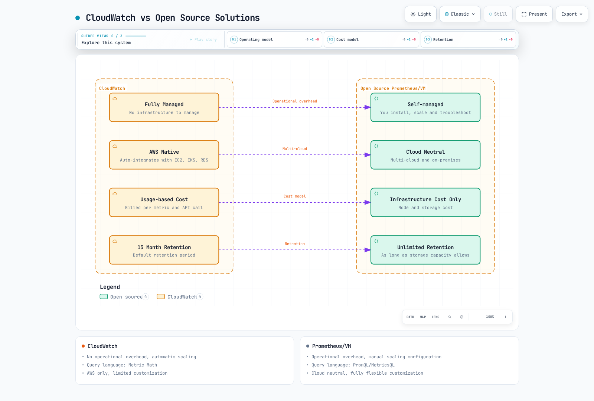
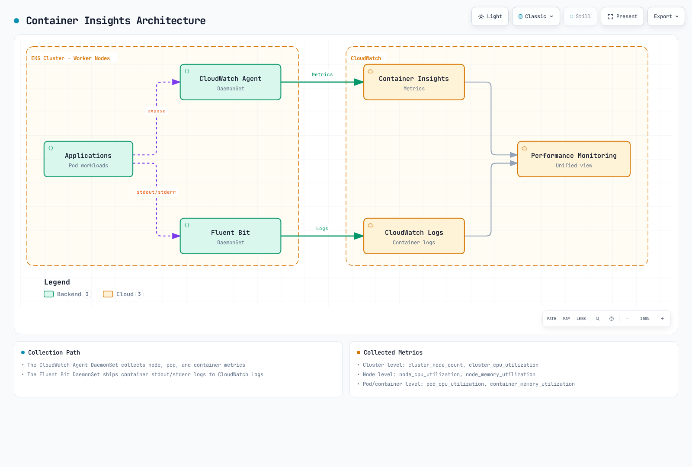
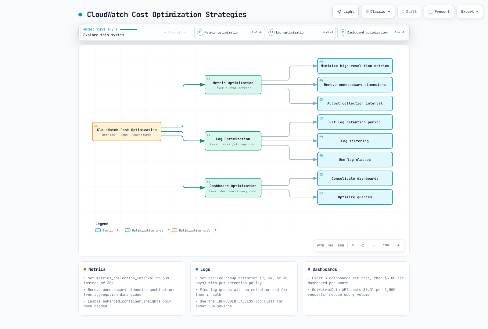

# CloudWatch Metrics

> **Last Updated**: July 11, 2026

## Table of Contents

- [Introduction](#introduction)
- [Container Insights Overview](#container-insights-overview)
- [CloudWatch Agent Configuration](#cloudwatch-agent-configuration)
- [Custom Metric Collection](#custom-metric-collection)
- [Metric Math and Anomaly Detection](#metric-math-and-anomaly-detection)
- [Dashboard Creation](#dashboard-creation)
- [Alert Configuration](#alert-configuration)
- [Cost Optimization](#cost-optimization)
- [Best Practices](#best-practices)
- [Troubleshooting](#troubleshooting)

## Introduction

Amazon CloudWatch is AWS's native monitoring and observability service. Using CloudWatch in EKS environments enables metric collection, alerting, and dashboard capabilities integrated with AWS services without separate monitoring infrastructure.

### Key Features

| Feature | Description |
|---------|-------------|
| **Fully Managed** | No infrastructure management required |
| **AWS Native Integration** | Automatic integration with EC2, EKS, RDS, etc. |
| **Container Insights** | Container/pod level monitoring |
| **Anomaly Detection** | ML-based automatic anomaly detection |
| **Metric Math** | Calculate metrics with mathematical expressions |
| **Unified Dashboard** | Integrated logs, metrics, and traces |
| **Global Availability** | Supported in all AWS regions |

### CloudWatch vs Open Source Solutions



[🔍 View interactive diagram](https://www.atomai.click/kubernetes-docs/archmaps/en-observability-metrics-04-cloudwatch-metrics-0.html)

| Item | CloudWatch | Prometheus/VM |
|------|------------|---------------|
| Operational Overhead | None | Present |
| Cost Model | Usage-based | Infrastructure-based |
| Scalability | Automatic | Manual configuration |
| Query Language | Metric Math | PromQL/MetricsQL |
| Multi-cloud | AWS only | Cloud neutral |
| Customization | Limited | Fully flexible |

## Container Insights Overview

Container Insights is a CloudWatch feature for monitoring containerized workloads in EKS clusters.

### Architecture



[🔍 View interactive diagram](https://www.atomai.click/kubernetes-docs/archmaps/en-observability-metrics-04-cloudwatch-metrics-1.html)

### Collected Metrics

**Cluster Level**:
- `cluster_node_count` - Node count
- `cluster_failed_node_count` - Failed node count
- `cluster_cpu_utilization` - CPU utilization
- `cluster_memory_utilization` - Memory utilization

**Node Level**:
- `node_cpu_utilization` - Node CPU utilization
- `node_memory_utilization` - Node memory utilization
- `node_network_total_bytes` - Total network bytes
- `node_filesystem_utilization` - Filesystem utilization

**Pod/Container Level**:
- `pod_cpu_utilization` - Pod CPU utilization
- `pod_memory_utilization` - Pod memory utilization
- `pod_network_rx_bytes` - Received network bytes
- `pod_network_tx_bytes` - Transmitted network bytes
- `container_cpu_utilization` - Container CPU utilization
- `container_memory_utilization` - Container memory utilization

### Enable Container Insights

```bash
# Enable as EKS add-on (recommended)
aws eks create-addon \
  --cluster-name my-cluster \
  --addon-name amazon-cloudwatch-observability \
  --addon-version v1.5.0-eksbuild.1 \
  --service-account-role-arn arn:aws:iam::123456789012:role/CloudWatchAgentRole

# Or enable with eksctl
eksctl utils update-cluster-logging \
  --cluster my-cluster \
  --enable-types all \
  --approve
```

### OpenTelemetry-based Container Insights (Preview)

CloudWatch is previewing an OpenTelemetry (OTLP)-based successor to Container Insights for EKS, announced April 2, 2026. It runs alongside the classic CloudWatch Agent-based Container Insights described above, so you can adopt it incrementally per cluster rather than cutting over all at once.

Compared to the classic agent-based collection:

- **Broader metric collection** via OTLP instead of the CloudWatch Agent's fixed metric set
- **High-cardinality filtering** — up to 150 labels per metric, useful for per-pod or per-namespace breakdowns that the classic dimension model can't cheaply express
- **PromQL support in CloudWatch Query Studio** — query OTel-collected metrics with PromQL directly, without standing up a separate Prometheus or Amazon Managed Service for Prometheus workspace
- **Automatic accelerator detection** — NVIDIA GPUs, EFA, and AWS Trainium/Inferentia devices are detected automatically, which matters for AI/ML workload observability (see the [AI/ML lecture track](../../ai-ml/01-ai-ml-workloads.md) for related GPU workload content)

Preview regions: US East (N. Virginia), US West (Oregon), Asia Pacific (Sydney), Asia Pacific (Singapore), and Europe (Ireland).

> Reference: [CloudWatch OTel-based Container Insights for EKS (Preview)](https://aws.amazon.com/about-aws/whats-new/2026/04/cloudwatch-otel-container-insights-eks/)

For how this relates to the `amazon-cloudwatch-observability` EKS add-on and Application Signals, see [EKS Monitoring and Logging](../../eks/06-eks-monitoring-logging.md#cloudwatch-observability-add-on-500).

### July 2026 Update: Application Signals Service Events

Service Events, announced July 6, 2026, automatically captures errors (exception snapshots), performance anomalies (latency event snapshots), and deployment events for any application with CloudWatch Application Signals enabled. Applications instrumented with the ADOT SDKs or the `amazon-cloudwatch-observability` EKS add-on get this with no extra configuration once Application Signals is active, and you can optionally turn on function-call metrics for deeper performance visibility. Available in all commercial AWS Regions; supported languages are Java, Python, and JavaScript. ([Announcement](https://aws.amazon.com/about-aws/whats-new/2026/06/cloudwatch-service-events/))

## CloudWatch Agent Configuration

### IRSA Setup

```bash
# Create IAM policy
cat <<EOF > cloudwatch-agent-policy.json
{
    "Version": "2012-10-17",
    "Statement": [
        {
            "Effect": "Allow",
            "Action": [
                "cloudwatch:PutMetricData",
                "ec2:DescribeVolumes",
                "ec2:DescribeTags",
                "logs:PutLogEvents",
                "logs:DescribeLogStreams",
                "logs:DescribeLogGroups",
                "logs:CreateLogStream",
                "logs:CreateLogGroup"
            ],
            "Resource": "*"
        },
        {
            "Effect": "Allow",
            "Action": [
                "ssm:GetParameter"
            ],
            "Resource": "arn:aws:ssm:*:*:parameter/AmazonCloudWatch-*"
        }
    ]
}
EOF

aws iam create-policy \
  --policy-name CloudWatchAgentPolicy \
  --policy-document file://cloudwatch-agent-policy.json

# Create service account
eksctl create iamserviceaccount \
  --name cloudwatch-agent \
  --namespace amazon-cloudwatch \
  --cluster my-cluster \
  --attach-policy-arn arn:aws:iam::123456789012:policy/CloudWatchAgentPolicy \
  --approve
```

### DaemonSet Deployment

```yaml
apiVersion: v1
kind: Namespace
metadata:
  name: amazon-cloudwatch
---
apiVersion: v1
kind: ConfigMap
metadata:
  name: cwagentconfig
  namespace: amazon-cloudwatch
data:
  cwagentconfig.json: |
    {
      "logs": {
        "metrics_collected": {
          "kubernetes": {
            "cluster_name": "my-cluster",
            "metrics_collection_interval": 60
          }
        },
        "force_flush_interval": 5
      },
      "metrics": {
        "namespace": "ContainerInsights",
        "metrics_collected": {
          "kubernetes": {
            "cluster_name": "my-cluster",
            "metrics_collection_interval": 60,
            "enhanced_container_insights": true
          }
        }
      }
    }
---
apiVersion: apps/v1
kind: DaemonSet
metadata:
  name: cloudwatch-agent
  namespace: amazon-cloudwatch
spec:
  selector:
    matchLabels:
      name: cloudwatch-agent
  template:
    metadata:
      labels:
        name: cloudwatch-agent
    spec:
      serviceAccountName: cloudwatch-agent
      containers:
      - name: cloudwatch-agent
        image: public.ecr.aws/cloudwatch-agent/cloudwatch-agent:1.300031.0b311
        resources:
          limits:
            cpu: 400m
            memory: 400Mi
          requests:
            cpu: 200m
            memory: 200Mi
        env:
        - name: HOST_IP
          valueFrom:
            fieldRef:
              fieldPath: status.hostIP
        - name: HOST_NAME
          valueFrom:
            fieldRef:
              fieldPath: spec.nodeName
        - name: K8S_NAMESPACE
          valueFrom:
            fieldRef:
              fieldPath: metadata.namespace
        - name: CI_VERSION
          value: "k8s/1.3.11"
        volumeMounts:
        - name: cwagentconfig
          mountPath: /etc/cwagentconfig
        - name: rootfs
          mountPath: /rootfs
          readOnly: true
        - name: dockersock
          mountPath: /var/run/docker.sock
          readOnly: true
        - name: varlibdocker
          mountPath: /var/lib/docker
          readOnly: true
        - name: containerdsock
          mountPath: /run/containerd/containerd.sock
          readOnly: true
        - name: sys
          mountPath: /sys
          readOnly: true
        - name: devdisk
          mountPath: /dev/disk
          readOnly: true
      volumes:
      - name: cwagentconfig
        configMap:
          name: cwagentconfig
      - name: rootfs
        hostPath:
          path: /
      - name: dockersock
        hostPath:
          path: /var/run/docker.sock
      - name: varlibdocker
        hostPath:
          path: /var/lib/docker
      - name: containerdsock
        hostPath:
          path: /run/containerd/containerd.sock
      - name: sys
        hostPath:
          path: /sys
      - name: devdisk
        hostPath:
          path: /dev/disk/
      terminationGracePeriodSeconds: 60
      tolerations:
      - operator: Exists
```

### Enhanced Container Insights

Enhanced Container Insights provides additional metrics and more granular monitoring.

```yaml
# Enable in ConfigMap
cwagentconfig.json: |
  {
    "metrics": {
      "metrics_collected": {
        "kubernetes": {
          "enhanced_container_insights": true,
          "accelerated_compute_metrics": true  # GPU metrics
        }
      }
    }
  }
```

**Additional Metrics**:
- `pod_cpu_reserved_capacity` - Reserved CPU capacity
- `pod_memory_reserved_capacity` - Reserved memory capacity
- `node_cpu_reserved_capacity` - Node reserved CPU
- `node_memory_reserved_capacity` - Node reserved memory
- GPU metrics (when using NVIDIA GPUs)

## Custom Metric Collection

### Collect Prometheus Metrics with CloudWatch Agent

CloudWatch Agent can collect Prometheus format metrics and send them to CloudWatch.

```yaml
apiVersion: v1
kind: ConfigMap
metadata:
  name: prometheus-cwagentconfig
  namespace: amazon-cloudwatch
data:
  cwagentconfig.json: |
    {
      "logs": {
        "metrics_collected": {
          "prometheus": {
            "cluster_name": "my-cluster",
            "log_group_name": "/aws/containerinsights/my-cluster/prometheus",
            "prometheus_config_path": "/etc/prometheusconfig/prometheus.yaml",
            "emf_processor": {
              "metric_declaration_dedup": true,
              "metric_namespace": "ContainerInsights/Prometheus",
              "metric_unit": {
                "http_requests_total": "Count",
                "http_request_duration_seconds": "Seconds"
              },
              "metric_declaration": [
                {
                  "source_labels": ["job"],
                  "label_matcher": "^my-app$",
                  "dimensions": [["ClusterName", "Namespace", "Service"]],
                  "metric_selectors": [
                    "^http_requests_total$",
                    "^http_request_duration_seconds.*$"
                  ]
                }
              ]
            }
          }
        }
      }
    }
  prometheus.yaml: |
    global:
      scrape_interval: 1m
      scrape_timeout: 10s
    scrape_configs:
      - job_name: 'my-app'
        kubernetes_sd_configs:
          - role: pod
        relabel_configs:
          - source_labels: [__meta_kubernetes_pod_annotation_prometheus_io_scrape]
            action: keep
            regex: true
          - source_labels: [__meta_kubernetes_pod_annotation_prometheus_io_path]
            action: replace
            target_label: __metrics_path__
            regex: (.+)
```

### AWS Distro for OpenTelemetry (ADOT)

ADOT can send Prometheus metrics to CloudWatch.

```yaml
apiVersion: v1
kind: ConfigMap
metadata:
  name: adot-collector-config
  namespace: amazon-cloudwatch
data:
  config.yaml: |
    receivers:
      prometheus:
        config:
          global:
            scrape_interval: 30s
          scrape_configs:
            - job_name: 'kubernetes-pods'
              kubernetes_sd_configs:
                - role: pod
              relabel_configs:
                - source_labels: [__meta_kubernetes_pod_annotation_prometheus_io_scrape]
                  action: keep
                  regex: true

    processors:
      batch:
        timeout: 60s

    exporters:
      awsemf:
        namespace: CustomMetrics
        log_group_name: '/aws/containerinsights/my-cluster/prometheus'
        dimension_rollup_option: NoDimensionRollup
        metric_declarations:
          - dimensions: [[ClusterName, Namespace, Service]]
            metric_name_selectors:
              - "^http_.*"

    service:
      pipelines:
        metrics:
          receivers: [prometheus]
          processors: [batch]
          exporters: [awsemf]
---
apiVersion: apps/v1
kind: Deployment
metadata:
  name: adot-collector
  namespace: amazon-cloudwatch
spec:
  replicas: 1
  selector:
    matchLabels:
      app: adot-collector
  template:
    metadata:
      labels:
        app: adot-collector
    spec:
      serviceAccountName: adot-collector
      containers:
      - name: adot-collector
        image: public.ecr.aws/aws-observability/aws-otel-collector:v0.35.0
        command:
          - "/awscollector"
          - "--config=/etc/config/config.yaml"
        resources:
          limits:
            cpu: 500m
            memory: 512Mi
          requests:
            cpu: 200m
            memory: 256Mi
        volumeMounts:
        - name: config
          mountPath: /etc/config
      volumes:
      - name: config
        configMap:
          name: adot-collector-config
```

### Send Custom Metrics via SDK

```python
# Python example
import boto3
from datetime import datetime

cloudwatch = boto3.client('cloudwatch', region_name='ap-northeast-2')

def put_custom_metric(namespace, metric_name, value, dimensions, unit='Count'):
    cloudwatch.put_metric_data(
        Namespace=namespace,
        MetricData=[
            {
                'MetricName': metric_name,
                'Dimensions': dimensions,
                'Timestamp': datetime.utcnow(),
                'Value': value,
                'Unit': unit
            }
        ]
    )

# Usage example
put_custom_metric(
    namespace='MyApp/Production',
    metric_name='OrdersProcessed',
    value=150,
    dimensions=[
        {'Name': 'Service', 'Value': 'order-service'},
        {'Name': 'Environment', 'Value': 'production'}
    ]
)
```

```go
// Go example
package main

import (
    "context"
    "time"

    "github.com/aws/aws-sdk-go-v2/config"
    "github.com/aws/aws-sdk-go-v2/service/cloudwatch"
    "github.com/aws/aws-sdk-go-v2/service/cloudwatch/types"
)

func putCustomMetric(ctx context.Context, client *cloudwatch.Client) error {
    _, err := client.PutMetricData(ctx, &cloudwatch.PutMetricDataInput{
        Namespace: aws.String("MyApp/Production"),
        MetricData: []types.MetricDatum{
            {
                MetricName: aws.String("OrdersProcessed"),
                Dimensions: []types.Dimension{
                    {
                        Name:  aws.String("Service"),
                        Value: aws.String("order-service"),
                    },
                },
                Timestamp: aws.Time(time.Now()),
                Value:     aws.Float64(150),
                Unit:      types.StandardUnitCount,
            },
        },
    })
    return err
}
```

## Metric Math and Anomaly Detection

### Metric Math

Metric Math allows you to mathematically combine multiple metrics.

```json
// Using Metric Math in CloudWatch dashboard widget
{
  "metrics": [
    [ { "expression": "m1/m2*100", "label": "Error Rate (%)", "id": "e1" } ],
    [ "AWS/ApplicationELB", "HTTPCode_Target_5XX_Count", "LoadBalancer", "app/my-alb/xxx", { "id": "m1", "visible": false } ],
    [ ".", "RequestCount", ".", ".", { "id": "m2", "visible": false } ]
  ],
  "view": "timeSeries",
  "stacked": false,
  "region": "ap-northeast-2",
  "period": 60
}
```

**Key Metric Math Functions**:

```
# Basic operations
m1 + m2                    # Addition
m1 - m2                    # Subtraction
m1 * m2                    # Multiplication
m1 / m2                    # Division

# Aggregation functions
SUM(METRICS())            # Sum of all metrics
AVG(METRICS())            # Average
MIN(METRICS())            # Minimum
MAX(METRICS())            # Maximum

# Statistical functions
STDDEV(m1)                # Standard deviation
PERCENTILE(m1, 95)        # Percentile

# Time series functions
RATE(m1)                  # Rate of change
DIFF(m1)                  # Difference from previous value
PERIOD(m1)                # Period (seconds)
FILL(m1, 0)               # Fill missing data

# Search
SEARCH('{Namespace, Dim1, Dim2} MetricName', 'Average')
```

**Practical Examples**:

```json
// CPU utilization calculation
{
  "expression": "m1 / m2 * 100",
  "label": "CPU Utilization %"
}

// Error rate calculation
{
  "expression": "100 * m1 / (m1 + m2)",
  "label": "Error Rate %"
}

// p95 latency (combined across multiple services)
{
  "expression": "PERCENTILE(METRICS(), 95)",
  "label": "p95 Latency"
}

// Moving average
{
  "expression": "AVG(METRICS()) PERIOD(300)",
  "label": "5min Moving Average"
}
```

### Anomaly Detection

CloudWatch Anomaly Detection automatically detects abnormal metric patterns using ML.

```bash
# Enable anomaly detection via CLI
aws cloudwatch put-anomaly-detector \
  --namespace ContainerInsights \
  --metric-name pod_cpu_utilization \
  --stat Average \
  --dimensions Name=ClusterName,Value=my-cluster

# Create anomaly detection alarm
aws cloudwatch put-metric-alarm \
  --alarm-name "AnomalyDetection-PodCPU" \
  --comparison-operator LessThanLowerOrGreaterThanUpperThreshold \
  --evaluation-periods 2 \
  --metrics '[
    {
      "Id": "m1",
      "MetricStat": {
        "Metric": {
          "Namespace": "ContainerInsights",
          "MetricName": "pod_cpu_utilization",
          "Dimensions": [{"Name": "ClusterName", "Value": "my-cluster"}]
        },
        "Period": 300,
        "Stat": "Average"
      },
      "ReturnData": true
    },
    {
      "Id": "ad1",
      "Expression": "ANOMALY_DETECTION_BAND(m1, 2)",
      "ReturnData": true
    }
  ]' \
  --threshold-metric-id ad1 \
  --alarm-actions arn:aws:sns:ap-northeast-2:123456789012:my-alerts
```

### Anomaly Detection with Terraform

```hcl
resource "aws_cloudwatch_metric_alarm" "anomaly_detection" {
  alarm_name          = "pod-cpu-anomaly"
  comparison_operator = "LessThanLowerOrGreaterThanUpperThreshold"
  evaluation_periods  = 2
  threshold_metric_id = "ad1"

  metric_query {
    id          = "m1"
    return_data = true

    metric {
      metric_name = "pod_cpu_utilization"
      namespace   = "ContainerInsights"
      period      = 300
      stat        = "Average"

      dimensions = {
        ClusterName = "my-cluster"
      }
    }
  }

  metric_query {
    id          = "ad1"
    expression  = "ANOMALY_DETECTION_BAND(m1, 2)"
    label       = "Anomaly Detection Band"
    return_data = true
  }

  alarm_actions = [aws_sns_topic.alerts.arn]

  tags = {
    Environment = "production"
  }
}
```

## Dashboard Creation

### Create Dashboard with CloudFormation

```yaml
AWSTemplateFormatVersion: '2010-09-09'
Description: EKS Monitoring Dashboard

Parameters:
  ClusterName:
    Type: String
    Default: my-cluster

Resources:
  EKSDashboard:
    Type: AWS::CloudWatch::Dashboard
    Properties:
      DashboardName: !Sub "${ClusterName}-monitoring"
      DashboardBody: !Sub |
        {
          "widgets": [
            {
              "type": "metric",
              "x": 0,
              "y": 0,
              "width": 12,
              "height": 6,
              "properties": {
                "title": "Cluster CPU Utilization",
                "metrics": [
                  ["ContainerInsights", "cluster_cpu_utilization", "ClusterName", "${ClusterName}"]
                ],
                "view": "timeSeries",
                "region": "${AWS::Region}",
                "period": 60,
                "stat": "Average"
              }
            },
            {
              "type": "metric",
              "x": 12,
              "y": 0,
              "width": 12,
              "height": 6,
              "properties": {
                "title": "Cluster Memory Utilization",
                "metrics": [
                  ["ContainerInsights", "cluster_memory_utilization", "ClusterName", "${ClusterName}"]
                ],
                "view": "timeSeries",
                "region": "${AWS::Region}",
                "period": 60,
                "stat": "Average"
              }
            },
            {
              "type": "metric",
              "x": 0,
              "y": 6,
              "width": 8,
              "height": 6,
              "properties": {
                "title": "Node Count",
                "metrics": [
                  ["ContainerInsights", "cluster_node_count", "ClusterName", "${ClusterName}"]
                ],
                "view": "singleValue",
                "region": "${AWS::Region}",
                "period": 60,
                "stat": "Average"
              }
            }
          ]
        }
```

### Create Dashboard with Terraform

```hcl
resource "aws_cloudwatch_dashboard" "eks_monitoring" {
  dashboard_name = "${var.cluster_name}-monitoring"

  dashboard_body = jsonencode({
    widgets = [
      {
        type   = "metric"
        x      = 0
        y      = 0
        width  = 12
        height = 6
        properties = {
          title  = "Cluster CPU Utilization"
          region = var.region
          metrics = [
            ["ContainerInsights", "cluster_cpu_utilization", "ClusterName", var.cluster_name]
          ]
          view   = "timeSeries"
          period = 60
          stat   = "Average"
          yAxis = {
            left = {
              min = 0
              max = 100
            }
          }
        }
      },
      {
        type   = "metric"
        x      = 12
        y      = 0
        width  = 12
        height = 6
        properties = {
          title  = "Cluster Memory Utilization"
          region = var.region
          metrics = [
            ["ContainerInsights", "cluster_memory_utilization", "ClusterName", var.cluster_name]
          ]
          view   = "timeSeries"
          period = 60
          stat   = "Average"
        }
      }
    ]
  })
}
```

## Alert Configuration

### Basic Alert Rules

```yaml
# CloudFormation
Resources:
  HighCPUAlarm:
    Type: AWS::CloudWatch::Alarm
    Properties:
      AlarmName: !Sub "${ClusterName}-high-cpu"
      AlarmDescription: "Cluster CPU utilization is high"
      MetricName: cluster_cpu_utilization
      Namespace: ContainerInsights
      Dimensions:
        - Name: ClusterName
          Value: !Ref ClusterName
      Statistic: Average
      Period: 300
      EvaluationPeriods: 2
      Threshold: 80
      ComparisonOperator: GreaterThanThreshold
      AlarmActions:
        - !Ref AlertSNSTopic

  HighMemoryAlarm:
    Type: AWS::CloudWatch::Alarm
    Properties:
      AlarmName: !Sub "${ClusterName}-high-memory"
      AlarmDescription: "Cluster memory utilization is high"
      MetricName: cluster_memory_utilization
      Namespace: ContainerInsights
      Dimensions:
        - Name: ClusterName
          Value: !Ref ClusterName
      Statistic: Average
      Period: 300
      EvaluationPeriods: 2
      Threshold: 85
      ComparisonOperator: GreaterThanThreshold
      AlarmActions:
        - !Ref AlertSNSTopic
```

### Terraform Alert Configuration

```hcl
resource "aws_cloudwatch_metric_alarm" "high_cpu" {
  alarm_name          = "${var.cluster_name}-high-cpu"
  comparison_operator = "GreaterThanThreshold"
  evaluation_periods  = 2
  metric_name         = "cluster_cpu_utilization"
  namespace           = "ContainerInsights"
  period              = 300
  statistic           = "Average"
  threshold           = 80
  alarm_description   = "Cluster CPU utilization exceeds 80%"

  dimensions = {
    ClusterName = var.cluster_name
  }

  alarm_actions = [aws_sns_topic.alerts.arn]
  ok_actions    = [aws_sns_topic.alerts.arn]

  tags = {
    Environment = var.environment
  }
}

resource "aws_cloudwatch_metric_alarm" "node_not_ready" {
  alarm_name          = "${var.cluster_name}-node-not-ready"
  comparison_operator = "GreaterThanThreshold"
  evaluation_periods  = 2
  metric_name         = "cluster_failed_node_count"
  namespace           = "ContainerInsights"
  period              = 60
  statistic           = "Maximum"
  threshold           = 0
  alarm_description   = "One or more nodes are not ready"

  dimensions = {
    ClusterName = var.cluster_name
  }

  alarm_actions = [aws_sns_topic.alerts.arn]
}
```

## Cost Optimization

### CloudWatch Cost Structure

| Item | Cost (ap-northeast-2) |
|------|----------------------|
| Custom Metrics | $0.30/metric/month (first 10,000) |
| GetMetricData API | $0.01/1,000 metric requests |
| Dashboard | $3.00/dashboard/month (first 3 free) |
| Log Ingestion | $0.76/GB |
| Log Storage | $0.0314/GB/month |
| Alarms | Free (first 10), $0.10/alarm/month |

### Cost Optimization Strategies



[🔍 View interactive diagram](https://www.atomai.click/kubernetes-docs/archmaps/en-observability-metrics-04-cloudwatch-metrics-2.html)

### 1. Metric Collection Optimization

```yaml
# Filtering in CloudWatch Agent configuration
cwagentconfig.json: |
  {
    "metrics": {
      "metrics_collected": {
        "kubernetes": {
          "cluster_name": "my-cluster",
          "metrics_collection_interval": 60,  # 60s instead of 30s
          "enhanced_container_insights": false  # Enable only when needed
        }
      },
      "aggregation_dimensions": [
        ["ClusterName"],
        ["ClusterName", "Namespace"]
        # Remove unnecessary dimension combinations
      ]
    }
  }
```

### 2. Log Retention Policy

```bash
# Set log group retention period
aws logs put-retention-policy \
  --log-group-name /aws/containerinsights/my-cluster/application \
  --retention-in-days 7

aws logs put-retention-policy \
  --log-group-name /aws/containerinsights/my-cluster/performance \
  --retention-in-days 30

# Clean up old log groups
for lg in $(aws logs describe-log-groups --query 'logGroups[?retentionInDays==`null`].logGroupName' --output text); do
  aws logs put-retention-policy --log-group-name "$lg" --retention-in-days 14
done
```

### 3. Use Infrequent Access Log Class

```bash
# Apply Infrequent Access class to new log group (50% cost savings)
aws logs create-log-group \
  --log-group-name /aws/containerinsights/my-cluster/audit \
  --log-group-class INFREQUENT_ACCESS
```

### Cost Monitoring

```hcl
# CloudWatch cost alarm
resource "aws_cloudwatch_metric_alarm" "cw_cost_alarm" {
  alarm_name          = "cloudwatch-cost-alarm"
  comparison_operator = "GreaterThanThreshold"
  evaluation_periods  = 1
  metric_name         = "EstimatedCharges"
  namespace           = "AWS/Billing"
  period              = 86400
  statistic           = "Maximum"
  threshold           = 100  # $100
  alarm_description   = "CloudWatch estimated charges exceed $100"

  dimensions = {
    ServiceName = "AmazonCloudWatch"
    Currency    = "USD"
  }

  alarm_actions = [aws_sns_topic.billing_alerts.arn]
}
```

## Best Practices

### 1. Namespace Strategy

```yaml
# Custom metric namespace structure
MyCompany/Production/API        # Production API metrics
MyCompany/Staging/API           # Staging API metrics
MyCompany/Production/Workers    # Production worker metrics
```

### 2. Dimension Design

```yaml
# Recommended dimension structure
dimensions:
  - ClusterName     # Required
  - Namespace       # K8s namespace
  - Service         # Service name
  - Environment     # Environment (prod/staging/dev)

# Dimensions to avoid (high cardinality)
dimensions:
  - PodName         # Different per pod (cost increase)
  - RequestID       # Different per request (very high cost)
```

### 3. Alert Design

```yaml
# Layered alerting strategy
Critical (P1):
  - Cluster down
  - 50%+ nodes failed
  - SNS -> PagerDuty

Warning (P2):
  - CPU/memory 80%+
  - Increasing pod restarts
  - SNS -> Slack

Info (P3):
  - Scaling events
  - Deployment complete
  - SNS -> Email/Logs
```

## Troubleshooting

### Common Issues

#### 1. Metrics Not Showing

```bash
# Check CloudWatch Agent logs
kubectl logs -n amazon-cloudwatch -l name=cloudwatch-agent

# Check IAM permissions
aws sts get-caller-identity
aws iam simulate-principal-policy \
  --policy-source-arn arn:aws:iam::123456789012:role/CloudWatchAgentRole \
  --action-names cloudwatch:PutMetricData

# Check metrics directly
aws cloudwatch list-metrics \
  --namespace ContainerInsights \
  --dimensions Name=ClusterName,Value=my-cluster
```

#### 2. High Costs

```bash
# Check metric count
aws cloudwatch list-metrics --namespace ContainerInsights | jq '.Metrics | length'

# Find high cardinality metrics
aws cloudwatch list-metrics \
  --namespace ContainerInsights \
  --query 'Metrics[*].Dimensions[*].Name' \
  --output text | sort | uniq -c | sort -rn | head -20
```

#### 3. Alarms Not Triggering

```bash
# Check alarm status
aws cloudwatch describe-alarms --alarm-names "my-alarm"

# Check alarm history
aws cloudwatch describe-alarm-history \
  --alarm-name "my-alarm" \
  --history-item-type StateUpdate

# Check SNS topic
aws sns list-subscriptions-by-topic \
  --topic-arn arn:aws:sns:ap-northeast-2:123456789012:my-alerts
```

### Debugging Commands

```bash
# Check Container Insights status
kubectl get pods -n amazon-cloudwatch

# Check CloudWatch Agent configuration
kubectl describe configmap cwagentconfig -n amazon-cloudwatch

# Check real-time metrics
aws cloudwatch get-metric-statistics \
  --namespace ContainerInsights \
  --metric-name cluster_cpu_utilization \
  --dimensions Name=ClusterName,Value=my-cluster \
  --start-time $(date -u -d '1 hour ago' +%Y-%m-%dT%H:%M:%SZ) \
  --end-time $(date -u +%Y-%m-%dT%H:%M:%SZ) \
  --period 60 \
  --statistics Average
```

## References

- [Amazon CloudWatch Official Documentation](https://docs.aws.amazon.com/cloudwatch/)
- [Container Insights Setup Guide](https://docs.aws.amazon.com/AmazonCloudWatch/latest/monitoring/Container-Insights-setup-EKS-quickstart.html)
- [CloudWatch Agent Configuration](https://docs.aws.amazon.com/AmazonCloudWatch/latest/monitoring/CloudWatch-Agent-Configuration-File-Details.html)
- [CloudWatch Pricing](https://aws.amazon.com/cloudwatch/pricing/)

## Quiz

To test your understanding of this chapter, try the [CloudWatch Metrics Quiz](../../quizzes/observability/metrics/04-cloudwatch-metrics-quiz.md).
