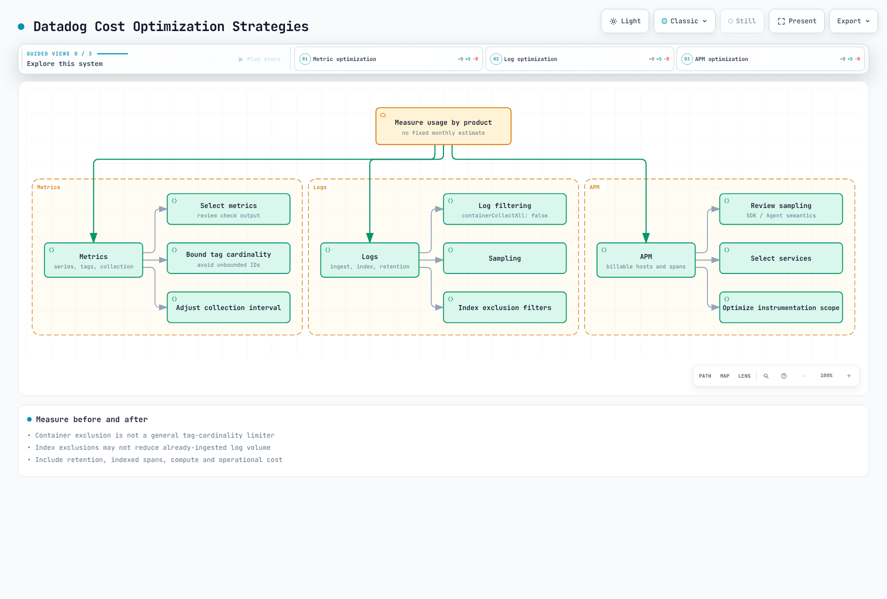

# Datadog

> **Last Updated**: September 13, 2026
> Helm chart 3.244.0; matching Agent/Cluster Agent 7.83.1.
> Configuration, SDK and local validation limits are stated below; no Datadog tenant was modified.

## Introduction

Datadog supplies a SaaS observability backend. Teams still own collectors, identity,
network access, instrumentation, data disclosure, retention, monitors and cost.
Infrastructure Monitoring, APM, profiling, logs and other products have distinct
entitlements and billing dimensions; installing an Agent does not include every product.

| Topic | Datadog | CloudWatch | Self-managed Prometheus / Grafana |
| --- | --- | --- | --- |
| Backend | Datadog SaaS, with site-specific availability | AWS-managed services | Operated storage, query and visualization |
| Collection | Agent/Cluster Agent, libraries and supported OTel paths | AWS service metrics, agents/SDKs/OTLP | Exporters, scraping, agents and remote write |
| APM/logs | Select and configure the required products | Application Signals, tracing and Logs integrations | Configure the relevant backends and collectors |
| Operations | Collector/configuration and application responsibilities remain | Collection/configuration and response responsibilities remain | Backend and collection responsibilities remain |
| Cost | Host and other product-specific usage/retention units | Metric/observation/OTLP/log/query/alarm units | Infrastructure and operating effort |

Choose the correct Datadog **site** for the organization and its credentials;
API endpoints, data residency, available products and pricing terms are not
interchangeable across sites. Use the integration catalogue rather than a fixed
integration-count claim or a universal “easy/advanced/cheap” ranking.

## EKS integration architecture

| Component | Responsibility / boundary |
| --- | --- |
| Node Agent | Host/container checks; typically a DaemonSet on supported EC2 nodes |
| Cluster Agent | Shared Kubernetes metadata/checks, event coordination and optional admission/external-metric features |
| Trace Agent | Receives application trace payloads and forwards them |
| Process collection / system-probe | Optional process/network/security features with their own OS, privilege and product requirements |
| Admission Controller | Injects connection settings and, when configured, supported client libraries into new pods |

Application instrumentation produces traces/profiles; an Agent listener or a pod
label alone does not prove instrumentation. The Cluster Agent is not the ordinary
application-log or trace forwarding path.

This chapter's installation targets **Linux EC2-backed EKS nodes**. EKS Fargate
uses the documented per-pod/sidecar collection model, not this host DaemonSet.
UDS is local to the host and is not supported on Windows. Windows, Bottlerocket,
Auto Mode and mixed compute need their distribution/feature-specific settings and
supported host access. Do not disable TLS verification or claim all eBPF/process
features work everywhere.

Datadog documents Agent and Cluster Agent 7.67+ for Kubernetes 1.33+ compatibility
with `AllocatedResources`, and recommends matching their versions. Such minimum
feature requirements are not the current EKS support matrix.

## Datadog Agent installation

Datadog recommends its Operator for higher-level lifecycle configuration and also
supports Helm installation. This example owns the node/Cluster Agents through the
**Datadog Agent Helm chart**. Chart 3.244.0 bundles an optional Operator dependency;
`datadog.operator.enabled: false` keeps that additional controller out of this example.
It does not mean the Operator is obsolete.

The chart defaults to Agent/Cluster Agent 7.82.3. This example explicitly pins both
to **7.83.1** and the verified image-index digests. The release includes network-test
billing, containerd snapshot cleanup and Cluster Agent leader-lock shutdown fixes.
The Agent/Cluster Agent image indexes include Linux amd64/arm64. A successful
template render is not a Kubernetes deployment or runtime compatibility test.

### Credentials and installation ownership

This profile retrieves the Datadog API key and shared Cluster Agent token from
AWS Secrets Manager using the native `aws.secrets` backend. An application key
is not needed for baseline ingestion; external metrics remain disabled.

Prepare `observability/datadog` in `ap-northeast-2` with JSON string keys `api-key`
and `cluster-token`; the token must be cryptographically random and at least
32 characters. The API key must match the Datadog site. Both ServiceAccounts,
`datadog` and `datadog-cluster-agent` in namespace `datadog`, require scoped IRSA
roles, regional STS/Secrets Manager connectivity and KMS permission if applicable.
Replace the two example role ARNs. EC2 metadata credential fallback is disabled.
See [complete prerequisites and reusable profiles](../../../examples/observability/secret-profiles/README.md).

Use Python 3/PyYAML 6.0.3 and the executable pinned-chart postrenderer from that
repository directory. It replaces exactly seven hardcoded SecretKeyRef entries
with **literal `ENC[...]` handles**, preserving node, trace, init and Cluster Agent
consumers. Native resolution updates in-memory configuration, not the environment.
The init script requires nonempty `DD_API_KEY`, so deleting it without a valid
replacement breaks startup. The `must-use-secret-postrenderer` Secret is deliberately
absent; do not create it to bypass an omitted renderer. Keep the renderer on every
install/upgrade and review changes to the pinned chart, images or profile contract.

These commands change the cluster only at installation; no deployment was executed
in the audit. Run from the repository root, in an existing `datadog` namespace,
with an owned release after preparing the IAM/secret prerequisites.

```bash
PROFILE=examples/observability/secret-profiles
helm repo add datadog https://helm.datadoghq.com
helm repo update datadog
helm template datadog datadog/datadog --version 3.244.0 \
  --namespace datadog --include-crds -f "$PROFILE/datadog-values.yaml" \
  --post-renderer "$PROFILE/datadog_postrender.py" > datadog-reviewed-render.yaml
# Review resources and ownership first; retain the renderer on EVERY upgrade.
helm upgrade --install datadog datadog/datadog --version 3.244.0 \
  --namespace datadog -f "$PROFILE/datadog-values.yaml" \
  --post-renderer "$PROFILE/datadog_postrender.py"
```

### Reviewed values

The following matches the reusable `datadog-values.yaml`. Logs are opt-in by container
configuration, APM/DogStatsD use UDS, and cluster-wide automatic library injection,
external HPA metrics, discovery network statistics and optional process/network
collection are not enabled here.
The application namespace should be separate from the Agent namespace; SSI does
not instrument pods in the Agent's own namespace.

```yaml
# datadog 3.244.0: postrenderer required; replace example IRSA role ARNs.
targetSystem: linux
registry: gcr.io/datadoghq
datadog:
  apiKeyExistingSecret: must-use-secret-postrenderer
  clusterName: my-eks-cluster
  site: datadoghq.com
  tags:
  - env:demo
  - team:platform
  logs:
    enabled: true
    containerCollectAll: false
    containerCollectUsingFiles: true
  apm:
    socketEnabled: true
    portEnabled: false
    instrumentation:
      enabled: false
  dogstatsd:
    useSocketVolume: true
    useHostPort: false
    nonLocalTraffic: false
  processAgent:
    processCollection: false
    processDiscovery: false
    containerCollection: true
  networkMonitoring:
    enabled: false
  discovery:
    enabled: false
    networkStats:
      enabled: false
  autoscaling:
    workload:
      enabled: false
  profiling:
    enabled: null
  collectEvents: true
  prometheusScrape:
    enabled: false
  kubeStateMetricsCore:
    enabled: true
    collectSecretMetrics: false
    collectConfigMaps: false
  operator:
    enabled: false
  secretBackend:
    type: aws.secrets
    config:
      aws_session:
        aws_region: ap-northeast-2
    enableGlobalPermissions: false
  env: &id001
  - name: AWS_EC2_METADATA_DISABLED
    value: 'true'
  - name: DD_SECRET_REFRESH_INTERVAL
    value: '0'
  - name: DD_SECRET_REFRESH_ON_API_KEY_FAILURE_INTERVAL
    value: '0'
clusterAgent:
  enabled: true
  replicas: 2
  image:
    tag: 7.83.1
    digest: sha256:8e420c81e68abec34ab792c72a6513b739dcba8f7682c52e1e7e276363827b1a
  metricsProvider:
    enabled: false
    useDatadogMetrics: false
  admissionController:
    enabled: true
    mutateUnlabelled: false
  tokenExistingSecret: must-use-secret-postrenderer
  rbac:
    create: true
    serviceAccountAnnotations:
      eks.amazonaws.com/role-arn: arn:aws:iam::111122223333:role/datadog-cluster-agent-secrets
  env: *id001
agents:
  image:
    tag: 7.83.1
    digest: sha256:ed0bd588e955d82f661d1b8dd1cdf179c1023e74a2817e7a812c99d52f05c319
  rbac:
    create: true
    serviceAccountAnnotations:
      eks.amazonaws.com/role-arn: arn:aws:iam::111122223333:role/datadog-agent-secrets
```

The only credential-related environment values after postrendering are
`ENC[observability/datadog;api-key]` and `ENC[observability/datadog;cluster-token]`.
`DD_SECRET_BACKEND_TYPE`/`CONFIG` carry only the backend type and region. No shell
exports a resolved value, no real key is placed in Helm values, and the profile
does not need a Kubernetes credential Secret. The two init-volume containers only
copy image configuration; init-config uses the API-key handle for its bootstrap
check. Actual native backend authorization and Datadog ingestion still require
runtime verification.

Scheduled and API-failure secret refresh are explicitly disabled. Rotate through
an approved coordinated restart of node/trace and Cluster Agent Pods; keep an old
API key valid until the fleet uses the new key. A cluster-token change can interrupt
node/Cluster Agent authentication during mixed-version rollout, so plan a
maintenance window or separately validated transition. No zero-downtime rotation
is claimed. See [Datadog secret backends](https://docs.datadoghq.com/agent/guide/secrets-management/).

`processAgent.enabled` is deprecated; use the individual collection options.
The chart already mounts `/etc/passwd` when applicable, so do not add duplicate
manual `passwd` volumes/mounts. Resource overrides are per component, such as
`agents.containers.agent.resources`; size the actual rendered containers under load.
Two Cluster Agent replicas do not replace placement, disruption and failure testing.

The original top-level `kubeStateMetricsEnabled` and `prometheus.enabled` entries
do not configure the claimed integrations. The legacy KSM option is nested under
`datadog`; the example uses `datadog.kubeStateMetricsCore.enabled` and avoids
duplicate legacy collection. Explicit Datadog Autodiscovery checks are separate
from turning on annotation-wide `prometheusScrape`.

`datadog.profiling.enabled` **is valid**. It injects `DD_PROFILING_ENABLED` into
eligible pods and requires installed client libraries and Cluster Agent 7.57+.
It does not install a profiler into an arbitrary uninstrumented application.
Choose its `null`/`false`/`auto`/`true` behavior deliberately. Likewise, enabling
external HPA metrics requires its application key, API permissions, service/CRDs
and actual metric availability; network monitoring requires supported system-probe access.

### AWS account integration is a separate path

The SaaS AWS account integration uses an authorized cross-account role and
Datadog-provided external ID, with the permissions needed by selected integrations.
An arbitrary IRSA role attached to a node Agent SA does not configure that SaaS
integration. Ordinary Kubernetes Agent collection does not require the broad
CloudWatch/EC2/tag policy previously shown here.

Use Pod Identity or IRSA only for an Agent/check that actually calls AWS, with its
specific role, trust and permissions. Resolve the **rendered** service-account name;
creating an IAM association for a guessed `datadog-agent` SA does not bind a
different SA used by the Helm release. Never treat a local STS caller check as
proof of the workload's identity.

## Infrastructure Monitoring

### Check the metric's collector, unit and tags

| Metric / source | Meaning |
| --- | --- |
| `system.cpu.idle` / System check | CPU idle **percent**; suitable for a percentage-based node threshold |
| `system.mem.total`, `system.mem.used`, `system.mem.free` | Memory measurements; free is not interchangeable with usable/reclaimable memory |
| `kubernetes.cpu.usage.total` / Kubelet | **Nanocores**, not percent; one core is 1,000,000,000 nanocores |
| `kubernetes.memory.usage`, `kubernetes.memory.limits` | Bytes; usage versus limit requires matching the same entity/tag set |
| `kubernetes.pods.running`, `kubernetes.containers.restarts` | Valid Kubelet gauges: running pods and cumulative container restarts |
| `kubernetes_state.deployment.replicas_available`, `kubernetes_state.deployment.replicas_desired` | Kubernetes State Metrics Core deployment state |
| `kubernetes_state.pod.status_phase`, `kubernetes_state.service.count` | Pod phase/service inventory; inspect their documented grouping tags |
| `kubernetes_state.container.restarts` | State Core's restart gauge, with namespace/pod/container tags |

The legacy Kubernetes integration, Kubelet check and State Core have different
catalogues. A metric absent from one catalogue is not necessarily removed from the
Agent. Do not rename valid Kubelet metrics blindly. Filesystem/network availability
and rate units depend on the collector/runtime; read that metric's actual definition.

Use the standard `kube_cluster_name` tag for this Kubernetes installation and inspect
real metric tags before grouping. Cluster-centric State Core metrics do not always
carry a `host` tag. `cluster_name` and `kube_cluster_name` are not interchangeable.
A raw nanocore value compared with 80 does not mean 80% CPU.

### OpenMetrics Autodiscovery

Merge the following **metadata fragment** into a workload whose container is named
`app` and serves the gauge `queue_depth` on port 9464. It does not create that
application or endpoint. The annotation's container identifier must match.
Protect the endpoint and configure TLS/authentication if required.

```yaml
metadata:
  annotations:
    ad.datadoghq.com/app.checks: "{\n  \"openmetrics\": {\n    \"init_config\": {},\n\
      \    \"instances\": [\n      {\n        \"openmetrics_endpoint\": \"http://%%host%%:9464/metrics\"\
      ,\n        \"namespace\": \"my_app\",\n        \"metrics\": [\n          {\n\
      \            \"queue_depth\": \"queue_depth\"\n          }\n        ]\n    \
      \  }\n    ]\n  }\n}"
```

The current `openmetrics` check uses `openmetrics_endpoint`. These Datadog
Autodiscovery annotations do not require a separate Prometheus server or the
chart's broad `prometheusScrape` discovery. Restrict selected metrics/labels.
For counters and histograms, verify name normalization, emitted `.count`/bucket
series and check-version behavior instead of assuming the Prometheus name is
also the final Datadog name.

### DogStatsD: use an endpoint reachable from the application

An application pod's `localhost` is not the node Agent. The Linux example uses
the host-local UDS directory. The Admission Controller's `socket` mode can inject
`DD_DOGSTATSD_URL`, `DD_TRACE_AGENT_URL` and the volume; otherwise configure matching
mounts and permissions explicitly. A Pod-specific `admission.datadoghq.com/config.mode`
is a **label**, not an annotation. Mount the parent directory so socket replacement
after an Agent restart remains visible.

The Python helper was checked with `datadog==0.53.0`. Pass the actual filesystem
path, such as `/var/run/datadog/dsd.socket`, to `socket_path`; the `unix://` URL
used by other SDKs/environment settings is not the same argument format.
Call `emit_batch` with actual interval counts, including zero good/error values.

```python
from datadog import DogStatsd


def emit_batch(client, total, errors):
    """Report one real reporting interval; explicit zeros keep the series present."""
    if any(isinstance(x, bool) or not isinstance(x, int) for x in (total, errors)):
        raise ValueError("counts must be integers")
    if not 0 <= errors <= total:
        raise ValueError("require 0 <= errors <= total")
    client.increment("requests.total", total)
    client.increment("requests.error", errors)
    client.increment("requests.good", total - errors)


# Create once in an application with the Agent's UDS directory mounted.
# This construction does not mean that the socket or receiving Agent is ready.
def make_metrics_client(socket_path):
    return DogStatsd(
        socket_path=socket_path,
        namespace="my_app",
        constant_tags=["env:demo", "service:orders"],
        disable_telemetry=True,
        disable_buffering=True,
    )
```

The Go helper uses datadog-go/v5. Create the client with `WithNamespace("my_app.")`
and the same `env:demo,service:orders` tags. Check constructor, send and close
errors; do not discard the `statsd.New` error. The helper does not close a shared
client supplied by the caller.

```go
package metrics

import (
    "fmt"

    "github.com/DataDog/datadog-go/v5/statsd"
)

// The caller creates/reuses the client, checks New's error, and closes it at shutdown.
// For the Linux UDS example, use unix:///var/run/datadog/dsd.socket.
func EmitBatch(client *statsd.Client, total, errors int64) error {
    if errors < 0 || total < errors {
        return fmt.Errorf("require 0 <= errors <= total")
    }
    for _, item := range []struct {
        name string
        value int64
    }{
        {"requests.total", total},
        {"requests.error", errors},
        {"requests.good", total - errors},
    } {
        if err := client.Count(item.name, item.value, nil, 1); err != nil {
            return err
        }
    }
    return nil
}
```

| DogStatsD type | Interpretation |
| --- | --- |
| Counter | Interval count; Datadog may store it as a rate. `.as_count()` reconstructs counts for a query window |
| Gauge | Snapshot such as queue depth; summing snapshots is not a processed-request count |
| Histogram | Aggregated by the receiving Agent; averaging per-host percentiles does not create a global percentile |
| Distribution | Supports backend distribution aggregation; review enabled percentiles, tags and billing |
| Service check | Status from a real health check: 0 OK, 1 warning, 2 critical, 3 unknown |

Local datagram delivery does not acknowledge SaaS ingestion. UDP can lose packets;
UDS/client buffering and Agent queues also need monitoring. The sample helper does
not enable DogStatsD client telemetry, so choose a separate collection-health signal
for deployment. Counter retries/duplicate sends are not an exactly-once business ledger.

### File-based Autodiscovery configuration

For Helm-owned configuration, `datadog.confd` creates and mounts the check files.
A standalone ConfigMap named `datadog-checks` is not automatically discovered merely
because it exists. The following NGINX fragment requires a matching image identity
and a configured, authorized `stub_status` endpoint.

```yaml
datadog:
  confd:
    nginx.yaml: "ad_identifiers:\n  - nginx\ninit_config: {}\ninstances:\n  - nginx_status_url:\
      \ http://%%host%%:80/nginx_status\n"
```

An authenticated Redis check additionally needs the correct port/TLS and credential
delivery. `%%env_REDIS_PASSWORD%%` reads the **Agent's** environment, not the Redis
application pod's environment. Prefer a configured Datadog secret backend or protected
file delivery with the specific permissions it needs; do not expose passwords in
public check examples or grant cluster-wide Secret reads just for discovery.

## APM and Distributed Tracing

### Local SDK injection and SSI are explicit choices

The admission opt-in label allows mutation/connection-setting injection. To install
a tracing library, configure SSI targets or a supported language/version annotation.
The label alone is not proof that an SDK was installed or traces reached Datadog.
Java/Python/Node.js local injection requires Cluster Agent 7.40+; .NET/Ruby requires
7.44+. Current 7.83.1 also excludes `kube-system` and its own namespace from injection.

For a controlled Java example, merge the following **pod-template fragment** into
an existing Deployment in an application namespace, preserving its selector,
containers and security settings. It is not a complete Deployment to apply alone.
The Java init image `gcr.io/datadoghq/dd-lib-java-init:v1.66.0` was verified for
Linux amd64/arm64. Verify the actual application's JVM/framework/image compatibility.

```yaml
spec:
  template:
    metadata:
      labels:
        admission.datadoghq.com/enabled: 'true'
        admission.datadoghq.com/config.mode: socket
        tags.datadoghq.com/env: demo
        tags.datadoghq.com/service: orders
        tags.datadoghq.com/version: 1.0.0
      annotations:
        admission.datadoghq.com/java-lib.version: v1.66.0
```

The `tags.datadoghq.com/*` labels supply unified service/environment/version tagging.
Do not put the label only on Deployment metadata and expect its pods to inherit it.
Injection happens when **new pods** are admitted. Confirm the injected init
containers, library files, UDS mounts/permissions and the non-secret connectivity
settings, then verify actual traffic/traces. Namespace exclusions, webhook failures,
security policies and unsupported images can prevent instrumentation.

Cluster-wide SSI is an alternative configured through
`datadog.apm.instrumentation`, with reviewed namespace/pod targets and library versions.
Avoid combining manual and injected tracers unintentionally: an injected library can
take precedence over a manually installed one. Profiler enablement still requires
a supported client library and its own product/runtime conditions.

### Manual Java instrumentation

Use a staged, versioned `dd-java-agent.jar` when starting the application JVM, or the
validated injection route above. Merely adding `dd-trace-api` gives access to the
annotation/API; it does **not** start runtime bytecode instrumentation.
The Maven dependency below and Java source are separate files.

```xml
<dependency>
  <groupId>com.datadoghq</groupId>
  <artifactId>dd-trace-api</artifactId>
  <version>1.66.0</version>
</dependency>
```
```java
import java.util.function.Supplier;
import datadog.trace.api.Trace;

public final class TraceMethods {
    private TraceMethods() {}

    @Trace(operationName = "order.process", resourceName = "process_order")
    public static <T> T process(Supplier<T> handler) {
        return handler.get();
    }
}
```

The handler represents application code supplied by the caller. Use bounded
operation/resource names. The old example's per-order/customer identifier tags
are unnecessary for this demonstration and can create disclosure/cardinality risks.
Manual span APIs require their corresponding supported bridge/library; do not add
OpenTracing imports to a project that only has the annotation API.

### Manual Python instrumentation

Use the current `ddtrace.trace` import for this checked 4.14.0 example. Keep the
dependency declaration in `requirements.txt`, not inside a Python code block.
For framework auto-instrumentation, follow the selected `ddtrace-run`/SSI setup
before application imports; do not assume this helper patches an entire framework.

```text
ddtrace==4.14.0
```
```python
from ddtrace.trace import tracer


def process_order(handler):
    with tracer.trace("order.process", service="orders", resource="process_order") as span:
        span.set_tag("operation.kind", "order")
        return handler()
```

The equivalent `tracer.wrap` decorator is available for method tracing. Exceptions
from the handler must propagate; recording a span is not an application retry or
success guarantee. Use correct service/env/version tags and context propagation
across supported HTTP/message integrations. Service maps come from observed
instrumented relationships, not from arbitrary `DD_TAGS` alone.

Do not tag raw customer/order identifiers, tokens or request bodies by default.
Review instrumentation capture, error messages and sampling/redaction rules for
the actual application. Auto-instrumentation does not guarantee complete PII removal.

## Log Management

### Select collection and parsing deliberately

The installation enables log collection but leaves `containerCollectAll: false`.
Merge this metadata into the pod template for the container named `app`.
The multiline rule applies to **plain-text Java records beginning with a date**.
It is not a general JSON-log parser. Container runtime framing and application
message parsing are separate stages; verify the actual collected records.

```yaml
metadata:
  annotations:
    ad.datadoghq.com/app.logs: "[\n  {\n    \"source\": \"java\",\n    \"service\"\
      : \"orders\",\n    \"log_processing_rules\": [\n      {\n        \"type\": \"\
      multi_line\",\n        \"name\": \"java_timestamp_start\",\n        \"pattern\"\
      : \"^\\\\d{4}-\\\\d{2}-\\\\d{2}\"\n      }\n    ]\n  }\n]"
```

For one-JSON-event-per-line applications, use the supported JSON path rather than
joining unrelated JSON events with this rule. File access, runtime paths, annotation
matching, exclusion settings and backend pipeline filters all affect collection.
Check selective collection with both a matching application and an excluded one.

### Pipeline request structure

This request uses the actual API fields **`match_rules` and `support_rules`**.
The old camelCase fields were not the Logs API model. The sample message defines
the expected line format; use the application's actual format/timezone and test
unmatched/multiline/error cases. A valid request model does not prove Grok parsing
or ingestion/indexing in a Datadog tenant.

```json
{
  "name": "Java application logs",
  "is_enabled": true,
  "filter": {
    "query": "source:java service:orders"
  },
  "processors": [
    {
      "type": "grok-parser",
      "name": "Parse the documented Java line format",
      "is_enabled": true,
      "source": "message",
      "samples": [
        "2026-09-13 12:00:00,123 INFO [main] example.Service - completed"
      ],
      "grok": {
        "support_rules": "",
        "match_rules": "java_log %{date(\"yyyy-MM-dd HH:mm:ss,SSS\"):timestamp} %{word:level} \\[%{notSpace:thread}\\] %{notSpace:logger} - %{data:message}"
      }
    },
    {
      "type": "status-remapper",
      "name": "Use level as status",
      "is_enabled": true,
      "sources": [
        "level"
      ]
    },
    {
      "type": "date-remapper",
      "name": "Use parsed timestamp",
      "is_enabled": true,
      "sources": [
        "timestamp"
      ]
    }
  ]
}
```

Pipeline creation/reordering changes processing for matching logs. Configure it
under the correct site, scoped API permissions and existing pipeline ownership.
No pipeline request was sent during this audit.

### Trace-log correlation and MDC ownership

Use supported automatic log injection where possible and preserve trace/span IDs
as strings in structured logs. Correct service/env/version, timestamps, parsing and
available trace data are also needed; two ID fields alone do not guarantee correlation.
There is no useful active trace ID when a process has not been instrumented.

For applications that explicitly manage SLF4J MDC, this helper restores the caller's
**whole previous context** on success and failure. The old unconditional `MDC.clear()`
lost unrelated caller fields. It is a synchronous helper, not an async context
propagation mechanism or a complete servlet filter.

```java
import java.util.Map;
import java.util.function.Supplier;
import datadog.trace.api.CorrelationIdentifier;
import org.slf4j.MDC;

public final class TraceLogContext {
    private TraceLogContext() {}

    public static <T> T withTraceContext(Supplier<T> handler) {
        Map<String, String> previous = MDC.getCopyOfContextMap();
        try {
            MDC.put("dd.trace_id", CorrelationIdentifier.getTraceId());
            MDC.put("dd.span_id", CorrelationIdentifier.getSpanId());
            return handler.get();
        } finally {
            if (previous == null) {
                MDC.clear();
            } else {
                MDC.setContextMap(previous);
            }
        }
    }
}
```

It requires `dd-trace-api` and the application's compatible SLF4J API/provider.
The logging pattern or JSON encoder must include the MDC values. Do not copy a
servlet example without the servlet API, imports and checked-exception contract.

## Dashboards and Alerts

### Dashboard Creation (API)

```python
from datadog_api_client import ApiClient, Configuration
from datadog_api_client.v1.api.dashboards_api import DashboardsApi
from datadog_api_client.v1.model.dashboard import Dashboard
from datadog_api_client.v1.model.dashboard_layout_type import DashboardLayoutType

configuration = Configuration()
with ApiClient(configuration) as api_client:
    api_instance = DashboardsApi(api_client)

    dashboard = Dashboard(
        title="EKS Cluster Overview",
        description="Kubernetes cluster monitoring dashboard",
        layout_type=DashboardLayoutType.ORDERED,
        widgets=[
            {
                "definition": {
                    "type": "timeseries",
                    "title": "CPU Usage by Node",
                    "requests": [
                        {
                            "q": "avg:kubernetes.cpu.usage.total{cluster_name:my-cluster} by {host}",
                            "display_type": "line"
                        }
                    ]
                }
            },
            {
                "definition": {
                    "type": "toplist",
                    "title": "Top Pods by Memory",
                    "requests": [
                        {
                            "q": "top(avg:kubernetes.memory.usage{cluster_name:my-cluster} by {pod_name}, 10, 'mean', 'desc')"
                        }
                    ]
                }
            }
        ],
        template_variables=[
            {
                "name": "cluster",
                "default": "my-cluster",
                "prefix": "cluster_name"
            },
            {
                "name": "namespace",
                "default": "*",
                "prefix": "kube_namespace"
            }
        ]
    )

    response = api_instance.create_dashboard(body=dashboard)
```

### Monitor (Alert) Configuration

```hcl
# Create monitors with Terraform
resource "datadog_monitor" "high_cpu" {
  name    = "High CPU Usage on EKS Nodes"
  type    = "metric alert"
  message = <<-EOT
    CPU usage is high on {{host.name}}.

    Current value: {{value}}%

    @slack-alerts @pagerduty-critical
  EOT

  query = "avg(last_5m):avg:kubernetes.cpu.usage.total{cluster_name:my-cluster} by {host} > 80"

  monitor_thresholds {
    warning  = 70
    critical = 80
  }

  notify_no_data    = false
  renotify_interval = 60

  tags = ["env:production", "team:platform", "cluster:my-cluster"]
}

resource "datadog_monitor" "pod_restarts" {
  name    = "Pod Restart Alert"
  type    = "metric alert"
  message = <<-EOT
    Pod {{pod_name.name}} in namespace {{kube_namespace.name}} is restarting frequently.

    @slack-alerts
  EOT

  query = "change(sum(last_5m),last_5m):sum:kubernetes.containers.restarts{cluster_name:my-cluster} by {pod_name,kube_namespace} > 3"

  monitor_thresholds {
    warning  = 2
    critical = 3
  }

  tags = ["env:production", "cluster:my-cluster"]
}

resource "datadog_monitor" "error_rate" {
  name    = "High Error Rate"
  type    = "metric alert"
  message = <<-EOT
    Error rate is high for service {{service.name}}.

    Current error rate: {{value}}%

    [View APM Dashboard](https://app.datadoghq.com/apm/service/{{service.name}})

    @slack-alerts @pagerduty-warning
  EOT

  query = "sum(last_5m):sum:trace.http.request.errors{env:production} by {service}.as_count() / sum:trace.http.request.hits{env:production} by {service}.as_count() * 100 > 5"

  monitor_thresholds {
    warning  = 2
    critical = 5
  }

  tags = ["env:production", "type:apm"]
}
```

### Watchdog AI

Watchdog automatically detects anomalies and generates alerts:

```hcl
# Watchdog alert configuration
resource "datadog_monitor" "watchdog" {
  name    = "Watchdog Alert"
  type    = "event-v2 alert"
  message = <<-EOT
    Watchdog detected an anomaly:
    {{event.title}}

    {{event.text}}

    @slack-alerts
  EOT

  query = "events(\"source:watchdog\").rollup(\"count\").by(\"story_category\").last(\"5m\") > 0"

  tags = ["env:production", "type:watchdog"]
}
```

## Cost Structure

### Pricing Overview

| Plan | Infrastructure | APM | Logs | Features |
|------|----------------|-----|------|----------|
| **Free** | 5 hosts | - | - | 1 day retention |
| **Pro** | $15/host/month | $31/host/month | $0.10/GB | 15 month retention |
| **Enterprise** | $23/host/month | $40/host/month | $0.10/GB | Custom retention |

### Cost Calculation Example

**100 Node EKS Cluster**:
```
Infrastructure monitoring: 100 x $15 = $1,500/month
APM (50 services): 50 x $31 = $1,550/month
Logs (100GB/day): 100 x 30 x $0.10 = $300/month
-----------------------------------------
Estimated total cost: ~$3,350/month
```

### Cost Optimization Strategies



[🔍 View interactive diagram](https://www.atomai.click/kubernetes-docs/archmaps/en-observability-metrics-05-datadog-2.html)

#### 1. Metric Optimization

```yaml
# values.yaml
datadog:
  # Exclude unnecessary metrics
  ignoreAutoConfig:
    - docker
    - containerd

  # Limit custom metrics
  dogstatsd:
    nonLocalTraffic: false

  # Limit tag cardinality
  containerExcludeLogs: "name:datadog-agent"
  containerExcludeMetrics: "name:pause"
```

#### 2. Log Optimization

```yaml
# Log filtering and sampling
datadog:
  logs:
    enabled: true
    containerCollectAll: false  # Selective collection

# Exclude logs at pod level
metadata:
  annotations:
    ad.datadoghq.com/my-app.logs: |
      [{
        "source": "java",
        "service": "my-app",
        "log_processing_rules": [
          {
            "type": "exclude_at_match",
            "name": "exclude_health_checks",
            "pattern": "GET /health"
          }
        ]
      }]
```

#### 3. APM Sampling

```yaml
# Trace sampling configuration
env:
  - name: DD_TRACE_SAMPLE_RATE
    value: "0.1"  # 10% sampling
  - name: DD_TRACE_RATE_LIMIT
    value: "100"  # Max 100 traces per second
```

## Best Practices

### 1. Tagging Strategy

```yaml
# Consistent tagging scheme
datadog:
  tags:
    - env:production
    - team:platform
    - cost-center:engineering
    - cluster:my-eks-cluster

# Service tags
env:
  - name: DD_SERVICE
    value: "order-service"
  - name: DD_ENV
    value: "production"
  - name: DD_VERSION
    valueFrom:
      fieldRef:
        fieldPath: metadata.labels['app.kubernetes.io/version']
```

### 2. Alert Layering

```yaml
# P1 (Critical) - Immediate response
- name: "Service Down"
  priority: P1
  notify: "@pagerduty-critical @slack-incidents"

# P2 (High) - Response within 1 hour
- name: "High Error Rate"
  priority: P2
  notify: "@pagerduty-warning @slack-alerts"

# P3 (Medium) - Response during business hours
- name: "High Latency"
  priority: P3
  notify: "@slack-alerts"

# P4 (Low) - Next sprint
- name: "Resource Warning"
  priority: P4
  notify: "@slack-monitoring"
```

### 3. SLO Configuration

```python
# Create SLO via API
from datadog_api_client.v1.api.service_level_objectives_api import ServiceLevelObjectivesApi
from datadog_api_client.v1.model.service_level_objective_request import ServiceLevelObjectiveRequest

slo = ServiceLevelObjectiveRequest(
    name="API Availability SLO",
    type="metric",
    description="99.9% availability for API endpoints",
    query={
        "numerator": "sum:trace.http.request.hits{service:api-gateway,http.status_code:2*}.as_count()",
        "denominator": "sum:trace.http.request.hits{service:api-gateway}.as_count()"
    },
    thresholds=[
        {
            "timeframe": "30d",
            "target": 99.9,
            "warning": 99.95
        }
    ],
    tags=["service:api-gateway", "env:production"]
)
```

## Troubleshooting

### Common Issues

#### 1. Agent Not Sending Metrics

```bash
# Check Agent status
kubectl exec -it $(kubectl get pods -n datadog -l app=datadog -o jsonpath='{.items[0].metadata.name}') -n datadog -- agent status

# Test connectivity
kubectl exec -it <agent-pod> -n datadog -- agent diagnose

# Check logs
kubectl logs -n datadog -l app=datadog --tail=100
```

#### 2. Missing APM Traces

```bash
# Check Trace Agent status
kubectl exec -it <agent-pod> -n datadog -- agent status | grep -A 20 "APM Agent"

# Check trace endpoint
kubectl exec -it <app-pod> -- env | grep DD_

# Test connectivity
kubectl exec -it <app-pod> -- nc -zv <agent-service> 8126
```

#### 3. Logs Not Collected

```bash
# Check log configuration
kubectl exec -it <agent-pod> -n datadog -- agent configcheck | grep logs

# Check pod annotations
kubectl get pod <pod-name> -o jsonpath='{.metadata.annotations}'

# Check Agent logs
kubectl logs -n datadog <agent-pod> -c agent | grep -i logs
```

### Debugging Commands

```bash
# Full Agent status
kubectl exec -it <agent-pod> -n datadog -- agent status

# Configuration check
kubectl exec -it <agent-pod> -n datadog -- agent configcheck

# Connection diagnostics
kubectl exec -it <agent-pod> -n datadog -- agent diagnose

# Real-time logs
kubectl exec -it <agent-pod> -n datadog -- agent stream-logs

# Generate flare (for support requests)
kubectl exec -it <agent-pod> -n datadog -- agent flare <case-id>
```

## References

- [Datadog Official Documentation](https://docs.datadoghq.com/)
- [Kubernetes Integration](https://docs.datadoghq.com/integrations/kubernetes/)
- [Datadog Helm Charts](https://github.com/DataDog/helm-charts)
- [APM Setup Guide](https://docs.datadoghq.com/tracing/)
- [Datadog Pricing](https://www.datadoghq.com/pricing/)

## Quiz

To test your understanding of this chapter, try the [Datadog Quiz](../../quizzes/observability/metrics/05-datadog-quiz.md).
