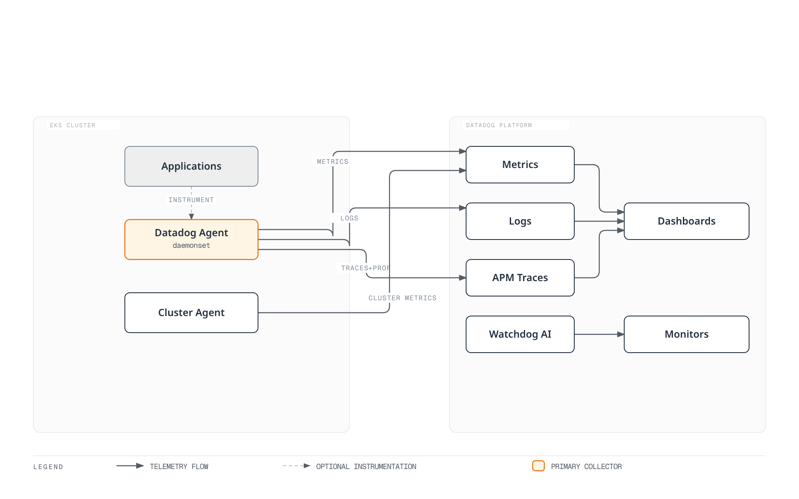

# Datadog

> **Last Updated**: September 13, 2026
> Helm chart 3.244.0; matching Agent/Cluster Agent 7.83.1.
> Configuration, SDK and local validation limits are stated below; no Datadog tenant was modified.

## Introduction

Datadog supplies a SaaS observability backend. Teams still own collectors, identity,
network access, instrumentation, data disclosure, retention, monitors and cost.
Infrastructure Monitoring, APM, profiling, logs and other products have distinct
entitlements and billing dimensions; installing an Agent does not include every product.

| Topic | Datadog | CloudWatch | Self-managed Prometheus / Grafana |
| --- | --- | --- | --- |
| Backend | Datadog SaaS, with site-specific availability | AWS-managed services | Operated storage, query and visualization |
| Collection | Agent/Cluster Agent, libraries and supported OTel paths | AWS service metrics, agents/SDKs/OTLP | Exporters, scraping, agents and remote write |
| APM/logs | Select and configure the required products | Application Signals, tracing and Logs integrations | Configure the relevant backends and collectors |
| Operations | Collector/configuration and application responsibilities remain | Collection/configuration and response responsibilities remain | Backend and collection responsibilities remain |
| Cost | Host and other product-specific usage/retention units | Metric/observation/OTLP/log/query/alarm units | Infrastructure and operating effort |

Choose the correct Datadog **site** for the organization and its credentials;
API endpoints, data residency, available products and pricing terms are not
interchangeable across sites. Use the integration catalogue rather than a fixed
integration-count claim or a universal “easy/advanced/cheap” ranking.

## EKS integration architecture

| Component | Responsibility / boundary |
| --- | --- |
| Node Agent | Host/container checks; typically a DaemonSet on supported EC2 nodes |
| Cluster Agent | Shared Kubernetes metadata/checks, event coordination and optional admission/external-metric features |
| Trace Agent | Receives application trace payloads and forwards them |
| Process collection / system-probe | Optional process/network/security features with their own OS, privilege and product requirements |
| Admission Controller | Injects connection settings and, when configured, supported client libraries into new pods |

Application instrumentation produces traces/profiles; an Agent listener or a pod
label alone does not prove instrumentation. The Cluster Agent is not the ordinary
application-log or trace forwarding path.

This chapter's installation targets **Linux EC2-backed EKS nodes**. EKS Fargate
uses the documented per-pod/sidecar collection model, not this host DaemonSet.
UDS is local to the host and is not supported on Windows. Windows, Bottlerocket,
Auto Mode and mixed compute need their distribution/feature-specific settings and
supported host access. Do not disable TLS verification or claim all eBPF/process
features work everywhere.

Datadog documents Agent and Cluster Agent 7.67+ for Kubernetes 1.33+ compatibility
with `AllocatedResources`, and recommends matching their versions. Such minimum
feature requirements are not the current EKS support matrix.

The overview shows possible collection paths. Traces/profiles require application instrumentation and selected products; Watchdog notification routing must be configured.



[Interactive diagram](https://www.atomai.click/kubernetes-docs/archmaps/en-observability-metrics-05-datadog-1.html)

## Datadog Agent installation

Datadog recommends its Operator for higher-level lifecycle configuration and also
supports Helm installation. This example owns the node/Cluster Agents through the
**Datadog Agent Helm chart**. Chart 3.244.0 bundles an optional Operator dependency;
`datadog.operator.enabled: false` keeps that additional controller out of this example.
It does not mean the Operator is obsolete.

The chart defaults to Agent/Cluster Agent 7.82.3. This example explicitly pins both
to **7.83.1** and the verified image-index digests. The release includes network-test
billing, containerd snapshot cleanup and Cluster Agent leader-lock shutdown fixes.
The Agent/Cluster Agent image indexes include Linux amd64/arm64. A successful
template render is not a Kubernetes deployment or runtime compatibility test.

### Credentials and installation ownership

Baseline Agent ingestion needs an API key in the same namespace as the Agent.
An application key is needed for API read/control features such as the external
metrics provider; it is not required just to install the baseline Agent. Use a
scoped application key only when the chosen feature requires one.

Keep credentials in an approved Secret workflow. The file command below avoids the
old unquoted `<YOUR_API_KEY>` shell-redirection problem and exposing a key in process
arguments. Protect and remove temporary key files according to the credential
workflow. Kubernetes Secrets also require appropriate access and encryption controls.
Do not run this installation over resources owned by another release or controller.

```bash
helm repo add datadog https://helm.datadoghq.com
helm repo update datadog
kubectl create namespace datadog --dry-run=client -o yaml | kubectl apply -f -

# The protected file contains only the API key; obtain it through your approved secret process.
# Do not put the key in command-line literals, Git or terminal output.
: "${DATADOG_API_KEY_FILE:?Set the path to the protected API-key file}"
kubectl create secret generic datadog-secret --namespace datadog \
  --from-file="api-key=$DATADOG_API_KEY_FILE" --dry-run=client -o yaml | kubectl apply -f -

helm template datadog datadog/datadog --version 3.244.0 \
  --namespace datadog --include-crds --values datadog-values.yaml > datadog-rendered.yaml

# This changes the cluster. Review the rendered resources and installation ownership first.
helm upgrade --install datadog datadog/datadog --version 3.244.0 \
  --namespace datadog --values datadog-values.yaml
```

### Reviewed values

Save the following as `datadog-values.yaml`. Logs are opt-in by container
configuration, APM/DogStatsD use UDS, and cluster-wide automatic library injection,
external HPA metrics, discovery network statistics and optional process/network
collection are not enabled here.
The application namespace should be separate from the Agent namespace; SSI does
not instrument pods in the Agent's own namespace.

```yaml
targetSystem: linux
registry: gcr.io/datadoghq
datadog:
  apiKeyExistingSecret: datadog-secret
  clusterName: my-eks-cluster
  site: datadoghq.com
  tags:
  - env:demo
  - team:platform
  logs:
    enabled: true
    containerCollectAll: false
    containerCollectUsingFiles: true
  apm:
    socketEnabled: true
    portEnabled: false
    instrumentation:
      enabled: false
  dogstatsd:
    useSocketVolume: true
    useHostPort: false
    nonLocalTraffic: false
  processAgent:
    processCollection: false
    processDiscovery: false
    containerCollection: true
  networkMonitoring:
    enabled: false
  discovery:
    enabled: false
    networkStats:
      enabled: false
  autoscaling:
    workload:
      enabled: false
  profiling:
    enabled: null
  collectEvents: true
  prometheusScrape:
    enabled: false
  kubeStateMetricsCore:
    enabled: true
    collectSecretMetrics: false
    collectConfigMaps: false
  operator:
    enabled: false
clusterAgent:
  enabled: true
  replicas: 2
  image:
    tag: 7.83.1
    digest: sha256:8e420c81e68abec34ab792c72a6513b739dcba8f7682c52e1e7e276363827b1a
  metricsProvider:
    enabled: false
    useDatadogMetrics: false
  admissionController:
    enabled: true
    mutateUnlabelled: false
agents:
  image:
    tag: 7.83.1
    digest: sha256:ed0bd588e955d82f661d1b8dd1cdf179c1023e74a2817e7a812c99d52f05c319
```

`processAgent.enabled` is deprecated; use the individual collection options.
The chart already mounts `/etc/passwd` when applicable, so do not add duplicate
manual `passwd` volumes/mounts. Resource overrides are per component, such as
`agents.containers.agent.resources`; size the actual rendered containers under load.
Two Cluster Agent replicas do not replace placement, disruption and failure testing.

The original top-level `kubeStateMetricsEnabled` and `prometheus.enabled` entries
do not configure the claimed integrations. The legacy KSM option is nested under
`datadog`; the example uses `datadog.kubeStateMetricsCore.enabled` and avoids
duplicate legacy collection. Explicit Datadog Autodiscovery checks are separate
from turning on annotation-wide `prometheusScrape`.

`datadog.profiling.enabled` **is valid**. It injects `DD_PROFILING_ENABLED` into
eligible pods and requires installed client libraries and Cluster Agent 7.57+.
It does not install a profiler into an arbitrary uninstrumented application.
Choose its `null`/`false`/`auto`/`true` behavior deliberately. Likewise, enabling
external HPA metrics requires its application key, API permissions, service/CRDs
and actual metric availability; network monitoring requires supported system-probe access.

### AWS account integration is a separate path

The SaaS AWS account integration uses an authorized cross-account role and
Datadog-provided external ID, with the permissions needed by selected integrations.
An arbitrary IRSA role attached to a node Agent SA does not configure that SaaS
integration. Ordinary Kubernetes Agent collection does not require the broad
CloudWatch/EC2/tag policy previously shown here.

Use Pod Identity or IRSA only for an Agent/check that actually calls AWS, with its
specific role, trust and permissions. Resolve the **rendered** service-account name;
creating an IAM association for a guessed `datadog-agent` SA does not bind a
different SA used by the Helm release. Never treat a local STS caller check as
proof of the workload's identity.

## Infrastructure Monitoring

### Check the metric's collector, unit and tags

| Metric / source | Meaning |
| --- | --- |
| `system.cpu.idle` / System check | CPU idle **percent**; suitable for a percentage-based node threshold |
| `system.mem.total`, `system.mem.used`, `system.mem.free` | Memory measurements; free is not interchangeable with usable/reclaimable memory |
| `kubernetes.cpu.usage.total` / Kubelet | **Nanocores**, not percent; one core is 1,000,000,000 nanocores |
| `kubernetes.memory.usage`, `kubernetes.memory.limits` | Bytes; usage versus limit requires matching the same entity/tag set |
| `kubernetes.pods.running`, `kubernetes.containers.restarts` | Valid Kubelet gauges: running pods and cumulative container restarts |
| `kubernetes_state.deployment.replicas_available`, `kubernetes_state.deployment.replicas_desired` | Kubernetes State Metrics Core deployment state |
| `kubernetes_state.pod.status_phase`, `kubernetes_state.service.count` | Pod phase/service inventory; inspect their documented grouping tags |
| `kubernetes_state.container.restarts` | State Core's restart gauge, with namespace/pod/container tags |

The legacy Kubernetes integration, Kubelet check and State Core have different
catalogues. A metric absent from one catalogue is not necessarily removed from the
Agent. Do not rename valid Kubelet metrics blindly. Filesystem/network availability
and rate units depend on the collector/runtime; read that metric's actual definition.

Use the standard `kube_cluster_name` tag for this Kubernetes installation and inspect
real metric tags before grouping. Cluster-centric State Core metrics do not always
carry a `host` tag. `cluster_name` and `kube_cluster_name` are not interchangeable.
A raw nanocore value compared with 80 does not mean 80% CPU.

### OpenMetrics Autodiscovery

Merge the following **metadata fragment** into a workload whose container is named
`app` and serves the gauge `queue_depth` on port 9464. It does not create that
application or endpoint. The annotation's container identifier must match.
Protect the endpoint and configure TLS/authentication if required.

```yaml
metadata:
  annotations:
    ad.datadoghq.com/app.checks: "{\n  \"openmetrics\": {\n    \"init_config\": {},\n\
      \    \"instances\": [\n      {\n        \"openmetrics_endpoint\": \"http://%%host%%:9464/metrics\"\
      ,\n        \"namespace\": \"my_app\",\n        \"metrics\": [\n          {\n\
      \            \"queue_depth\": \"queue_depth\"\n          }\n        ]\n    \
      \  }\n    ]\n  }\n}"
```

The current `openmetrics` check uses `openmetrics_endpoint`. These Datadog
Autodiscovery annotations do not require a separate Prometheus server or the
chart's broad `prometheusScrape` discovery. Restrict selected metrics/labels.
For counters and histograms, verify name normalization, emitted `.count`/bucket
series and check-version behavior instead of assuming the Prometheus name is
also the final Datadog name.

### DogStatsD: use an endpoint reachable from the application

An application pod's `localhost` is not the node Agent. The Linux example uses
the host-local UDS directory. The Admission Controller's `socket` mode can inject
`DD_DOGSTATSD_URL`, `DD_TRACE_AGENT_URL` and the volume; otherwise configure matching
mounts and permissions explicitly. A Pod-specific `admission.datadoghq.com/config.mode`
is a **label**, not an annotation. Mount the parent directory so socket replacement
after an Agent restart remains visible.

The Python helper was checked with `datadog==0.53.0`. Pass the actual filesystem
path, such as `/var/run/datadog/dsd.socket`, to `socket_path`; the `unix://` URL
used by other SDKs/environment settings is not the same argument format.
Call `emit_batch` with actual interval counts, including zero good/error values.

```python
from datadog import DogStatsd


def emit_batch(client, total, errors):
    """Report one real interval; send zeros instead of omitting counters."""
    if any(isinstance(x, bool) or not isinstance(x, int) for x in (total, errors)):
        raise ValueError("counts must be integers")
    if not 0 <= errors <= total:
        raise ValueError("require 0 <= errors <= total")
    client.increment("requests.total", total)
    client.increment("requests.error", errors)
    client.increment("requests.good", total - errors)


# Create once in an application with the Agent's UDS directory mounted.
# This construction does not mean that the socket or receiving Agent is ready.
def make_metrics_client(socket_path):
    return DogStatsd(
        socket_path=socket_path,
        namespace="my_app",
        constant_tags=["env:demo", "service:orders"],
        disable_telemetry=True,
        disable_buffering=True,
    )
```

The Go helper uses datadog-go/v5. Create the client with `WithNamespace("my_app.")`
and the same `env:demo,service:orders` tags. Check constructor, send and close
errors; do not discard the `statsd.New` error. The helper does not close a shared
client supplied by the caller.

```go
package metrics

import (
    "fmt"

    "github.com/DataDog/datadog-go/v5/statsd"
)

// The caller creates/reuses the client, checks New's error, and closes it at shutdown.
// For the Linux UDS example, use unix:///var/run/datadog/dsd.socket.
func EmitBatch(client *statsd.Client, total, errors int64) error {
    if errors < 0 || total < errors {
        return fmt.Errorf("require 0 <= errors <= total")
    }
    for _, item := range []struct {
        name string
        value int64
    }{
        {"requests.total", total},
        {"requests.error", errors},
        {"requests.good", total - errors},
    } {
        if err := client.Count(item.name, item.value, nil, 1); err != nil {
            return err
        }
    }
    return nil
}
```

| DogStatsD type | Interpretation |
| --- | --- |
| Counter | Interval count; Datadog may store it as a rate. `.as_count()` reconstructs counts for a query window |
| Gauge | Snapshot such as queue depth; summing snapshots is not a processed-request count |
| Histogram | Aggregated by the receiving Agent; averaging per-host percentiles does not create a global percentile |
| Distribution | Supports backend distribution aggregation; review enabled percentiles, tags and billing |
| Service check | Status from a real health check: 0 OK, 1 warning, 2 critical, 3 unknown |

Local datagram delivery does not acknowledge SaaS ingestion. UDP can lose packets;
UDS/client buffering and Agent queues also need monitoring. The sample helper does
not enable DogStatsD client telemetry, so choose a separate collection-health signal
for deployment. Counter retries/duplicate sends are not an exactly-once business ledger.

### File-based Autodiscovery configuration

For Helm-owned configuration, `datadog.confd` creates and mounts the check files.
A standalone ConfigMap named `datadog-checks` is not automatically discovered merely
because it exists. The following NGINX fragment requires a matching image identity
and a configured, authorized `stub_status` endpoint.

```yaml
datadog:
  confd:
    nginx.yaml: "ad_identifiers:\n  - nginx\ninit_config: {}\ninstances:\n  - nginx_status_url:\
      \ http://%%host%%:80/nginx_status\n"
```

An authenticated Redis check additionally needs the correct port/TLS and credential
delivery. `%%env_REDIS_PASSWORD%%` reads the **Agent's** environment, not the Redis
application pod's environment. Prefer a configured Datadog secret backend or protected
file delivery with the specific permissions it needs; do not expose passwords in
public check examples or grant cluster-wide Secret reads just for discovery.

## APM and Distributed Tracing

### Local SDK injection and SSI are explicit choices

The admission opt-in label allows mutation/connection-setting injection. To install
a tracing library, configure SSI targets or a supported language/version annotation.
The label alone is not proof that an SDK was installed or traces reached Datadog.
Java/Python/Node.js local injection requires Cluster Agent 7.40+; .NET/Ruby requires
7.44+. Current 7.83.1 also excludes `kube-system` and its own namespace from injection.

For a controlled Java example, merge the following **pod-template fragment** into
an existing Deployment in an application namespace, preserving its selector,
containers and security settings. It is not a complete Deployment to apply alone.
The Java init image `gcr.io/datadoghq/dd-lib-java-init:v1.66.0` was verified for
Linux amd64/arm64. Verify the actual application's JVM/framework/image compatibility.

```yaml
spec:
  template:
    metadata:
      labels:
        admission.datadoghq.com/enabled: 'true'
        admission.datadoghq.com/config.mode: socket
        tags.datadoghq.com/env: demo
        tags.datadoghq.com/service: orders
        tags.datadoghq.com/version: 1.0.0
      annotations:
        admission.datadoghq.com/java-lib.version: v1.66.0
```

The `tags.datadoghq.com/*` labels supply unified service/environment/version tagging.
Do not put the label only on Deployment metadata and expect its pods to inherit it.
Injection happens when **new pods** are admitted. Confirm the injected init
containers, library files, UDS mounts/permissions and the non-secret connectivity
settings, then verify actual traffic/traces. Namespace exclusions, webhook failures,
security policies and unsupported images can prevent instrumentation.

Cluster-wide SSI is an alternative configured through
`datadog.apm.instrumentation`, with reviewed namespace/pod targets and library versions.
Avoid combining manual and injected tracers unintentionally: an injected library can
take precedence over a manually installed one. Profiler enablement still requires
a supported client library and its own product/runtime conditions.

### Manual Java instrumentation

Use a staged, versioned `dd-java-agent.jar` when starting the application JVM, or the
validated injection route above. Merely adding `dd-trace-api` gives access to the
annotation/API; it does **not** start runtime bytecode instrumentation.
The Maven dependency below and Java source are separate files.

```xml
<dependency>
  <groupId>com.datadoghq</groupId>
  <artifactId>dd-trace-api</artifactId>
  <version>1.66.0</version>
</dependency>
```
```java
import java.util.function.Supplier;
import datadog.trace.api.Trace;

public final class TraceMethods {
    private TraceMethods() {}

    @Trace(operationName = "order.process", resourceName = "process_order")
    public static <T> T process(Supplier<T> handler) {
        return handler.get();
    }
}
```

The handler represents application code supplied by the caller. Use bounded
operation/resource names. The old example's per-order/customer identifier tags
are unnecessary for this demonstration and can create disclosure/cardinality risks.
Manual span APIs require their corresponding supported bridge/library; do not add
OpenTracing imports to a project that only has the annotation API.

### Manual Python instrumentation

Use the current `ddtrace.trace` import for this checked 4.14.0 example. Keep the
dependency declaration in `requirements.txt`, not inside a Python code block.
For framework auto-instrumentation, follow the selected `ddtrace-run`/SSI setup
before application imports; do not assume this helper patches an entire framework.

```text
ddtrace==4.14.0
```
```python
from ddtrace.trace import tracer


def process_order(handler):
    with tracer.trace("order.process", service="orders", resource="process_order") as span:
        span.set_tag("operation.kind", "order")
        return handler()
```

The equivalent `tracer.wrap` decorator is available for method tracing. Exceptions
from the handler must propagate; recording a span is not an application retry or
success guarantee. Use correct service/env/version tags and context propagation
across supported HTTP/message integrations. Service maps come from observed
instrumented relationships, not from arbitrary `DD_TAGS` alone.

Do not tag raw customer/order identifiers, tokens or request bodies by default.
Review instrumentation capture, error messages and sampling/redaction rules for
the actual application. Auto-instrumentation does not guarantee complete PII removal.

## Log Management

### Select collection and parsing deliberately

The installation enables log collection but leaves `containerCollectAll: false`.
Merge this metadata into the pod template for the container named `app`.
The multiline rule applies to **plain-text Java records beginning with a date**.
It is not a general JSON-log parser. Container runtime framing and application
message parsing are separate stages; verify the actual collected records.

```yaml
metadata:
  annotations:
    ad.datadoghq.com/app.logs: "[\n  {\n    \"source\": \"java\",\n    \"service\"\
      : \"orders\",\n    \"log_processing_rules\": [\n      {\n        \"type\": \"\
      multi_line\",\n        \"name\": \"java_timestamp_start\",\n        \"pattern\"\
      : \"^\\\\d{4}-\\\\d{2}-\\\\d{2}\"\n      }\n    ]\n  }\n]"
```

For one-JSON-event-per-line applications, use the supported JSON path rather than
joining unrelated JSON events with this rule. File access, runtime paths, annotation
matching, exclusion settings and backend pipeline filters all affect collection.
Check selective collection with both a matching application and an excluded one.

### Pipeline request structure

This request uses the actual API fields **`match_rules` and `support_rules`**.
The old camelCase fields were not the Logs API model. The sample message defines
the expected line format; use the application's actual format/timezone and test
unmatched/multiline/error cases. A valid request model does not prove Grok parsing
or ingestion/indexing in a Datadog tenant.

```json
{
  "name": "Java application logs",
  "is_enabled": true,
  "filter": {
    "query": "source:java service:orders"
  },
  "processors": [
    {
      "type": "grok-parser",
      "name": "Parse the documented Java line format",
      "is_enabled": true,
      "source": "message",
      "samples": [
        "2026-09-13 12:00:00,123 INFO [main] example.Service - completed"
      ],
      "grok": {
        "support_rules": "",
        "match_rules": "java_log %{date(\"yyyy-MM-dd HH:mm:ss,SSS\"):timestamp} %{word:level} \\[%{notSpace:thread}\\] %{notSpace:logger} - %{data:message}"
      }
    },
    {
      "type": "status-remapper",
      "name": "Use level as status",
      "is_enabled": true,
      "sources": [
        "level"
      ]
    },
    {
      "type": "date-remapper",
      "name": "Use parsed timestamp",
      "is_enabled": true,
      "sources": [
        "timestamp"
      ]
    }
  ]
}
```

Pipeline creation/reordering changes processing for matching logs. Configure it
under the correct site, scoped API permissions and existing pipeline ownership.
No pipeline request was sent during this audit.

### Trace-log correlation and MDC ownership

Use supported automatic log injection where possible and preserve trace/span IDs
as strings in structured logs. Correct service/env/version, timestamps, parsing and
available trace data are also needed; two ID fields alone do not guarantee correlation.
There is no useful active trace ID when a process has not been instrumented.

For applications that explicitly manage SLF4J MDC, this helper restores the caller's
**whole previous context** on success and failure. The old unconditional `MDC.clear()`
lost unrelated caller fields. It is a synchronous helper, not an async context
propagation mechanism or a complete servlet filter.

```java
import java.util.Map;
import java.util.function.Supplier;
import datadog.trace.api.CorrelationIdentifier;
import org.slf4j.MDC;

public final class TraceLogContext {
    private TraceLogContext() {}

    public static <T> T withTraceContext(Supplier<T> handler) {
        Map<String, String> previous = MDC.getCopyOfContextMap();
        try {
            MDC.put("dd.trace_id", CorrelationIdentifier.getTraceId());
            MDC.put("dd.span_id", CorrelationIdentifier.getSpanId());
            return handler.get();
        } finally {
            if (previous == null) {
                MDC.clear();
            } else {
                MDC.setContextMap(previous);
            }
        }
    }
}
```

It requires `dd-trace-api` and the application's compatible SLF4J API/provider.
The logging pattern or JSON encoder must include the MDC values. Do not copy a
servlet example without the servlet API, imports and checked-exception contract.

## Dashboards and Alerts

### Dashboard request construction

This helper uses `datadog-api-client==2.60.0` to construct a request body. The cluster
and namespace template variables are actually referenced by its queries. The host
widget uses a percent metric; the pod widget uses memory bytes and its namespace
filter. Check that the selected data really has the grouping tags.

```python
from datadog_api_client.v1.model.dashboard import Dashboard
from datadog_api_client.v1.model.dashboard_layout_type import DashboardLayoutType


def build_dashboard(cluster_name):
    return Dashboard(
        title="EKS observability example",
        layout_type=DashboardLayoutType.ORDERED,
        widgets=[
            {"definition": {
                "type": "timeseries",
                "title": "CPU idle by host (%)",
                "requests": [{"q": "avg:system.cpu.idle{$cluster} by {host}", "display_type": "line"}],
            }},
            {"definition": {
                "type": "toplist",
                "title": "Top 10 pod memory series by mean (bytes)",
                "requests": [{"q": "top(sum:kubernetes.memory.usage{$cluster,$namespace} by {pod_name,kube_namespace}, 10, 'mean', 'desc')"}],
            }},
        ],
        template_variables=[
            {"name": "cluster", "prefix": "kube_cluster_name", "default": cluster_name},
            {"name": "namespace", "prefix": "kube_namespace", "default": "*"},
        ],
    )
```

The caller supplies a correctly configured `ApiClient` and uses `DashboardsApi`
to create or update the intended dashboard. Record/reconcile its returned ID;
repeated creation by title can create duplicates. Site and scoped automation
credentials are separate from the node Agent API key. No dashboard API was called
in this audit.

### Monitor queries and units

Use a configured Datadog Terraform provider and project version constraints/lock file.
These are resource fragments, not a complete provider/credential setup. Thresholds
are examples; inspect real metric units, tags, windows and application objectives.
The first monitor evaluates idle percent directly instead of comparing nanocores
with 80 and calling the result “CPU percent”.

```hcl
# Fragments for a configured, version-pinned Datadog Terraform provider.
# Replace notification destinations with approved, tested destinations.
resource "datadog_monitor" "low_cpu_idle" {
  name    = "Low CPU idle on EKS nodes"
  type    = "metric alert"
  message = "CPU idle on {{host.name}} is {{value}}%. Inspect the host and collection health."
  query   = "avg(last_5m):avg:system.cpu.idle{kube_cluster_name:my-eks-cluster} by {host} < 20"
  monitor_thresholds {
    warning  = 30
    critical = 20
  }
  require_full_window = false
  notify_no_data      = false
  tags               = ["env:demo", "team:platform"]
}

resource "datadog_monitor" "restart_total" {
  name    = "Container restart total exceeds example threshold"
  type    = "metric alert"
  message = "Inspect {{pod_name.name}} / {{kube_container_name.name}}. This is a restart total, not a count of new restarts in five minutes."
  query   = "max(last_5m):max:kubernetes_state.container.restarts{kube_cluster_name:my-eks-cluster} by {pod_name,kube_namespace,kube_container_name} > 3"
  monitor_thresholds {
    warning  = 2
    critical = 3
  }
  require_full_window = false
  notify_no_data      = false
  tags               = ["env:demo", "team:platform"]
}

resource "datadog_monitor" "request_error_rate" {
  name    = "High request error ratio"
  type    = "metric alert"
  message = "Error ratio for {{service.name}} is {{value}}%. Check traffic volume and the reporting path."
  query   = "sum(last_5m):sum:my_app.requests.error{env:demo} by {service}.as_count() / sum:my_app.requests.total{env:demo} by {service}.as_count() * 100 > 5"
  monitor_thresholds {
    warning  = 2
    critical = 5
  }
  require_full_window = false
  notify_no_data      = false
  tags               = ["env:demo", "type:application"]
}
```

The restart gauge is a **total**. Comparing sums of repeated gauge samples in two
windows does not count new restarts reliably, especially with resets, replacement
pods or unequal sampling. A recent-restart monitor needs a validated delta/reset
design. This example explicitly alerts on a total instead.

The error monitor uses the three counters emitted by `emit_batch`, including
explicit zero values for errors/good requests. For `.as_count()` evaluation, time
aggregation occurs **before division**: sum(errors)/sum(total), rather than a sum
of each time bucket's ratio. Use a sum aggregator with this path.

Zero traffic, missing telemetry and genuinely error-free traffic are different.
Define minimum traffic/collection-health conditions and validate the monitor's
no-data behavior. `notify_no_data: false` does not establish health; it simply
does not notify on missing data in these fragments.

For built-in APM metrics, use the actual `trace.<operation>.hits/errors` names and
tags generated by the chosen integration. Java, Python and other integrations do
not all emit `trace.http.request.*`. Trace analytics, generated trace metrics and
custom DogStatsD metrics are different sources.

### Watchdog and notification delivery

Watchdog can surface detected anomalies/insights without manually choosing every
threshold. An insight is not proof that a notification was delivered. Use the
supported Watchdog/monitor workflow and verify the event source, product
availability and notification routing in the intended site.

The following event-monitor fragment assumes actual events matching
`source:watchdog` exist in that organization. It does not invent a `story_category`
group tag or guarantee every Watchdog result appears in this stream. Validate the
filter against real events before enabling notifications.

```hcl
resource "datadog_monitor" "watchdog_events" {
  name    = "Review matching Watchdog events"
  type    = "event-v2 alert"
  message = "Review the matching Watchdog event and affected services. Add an approved notification destination."
  query   = "events(\"source:watchdog\").rollup(\"count\").last(\"5m\") > 0"
  tags    = ["env:demo", "type:watchdog"]
}
```

### SLO request construction

Metric-based SLOs need well-defined good/total counts. The helper below uses the
explicit counters above. “Good” must match the application's SLI policy; counting
only HTTP 2xx is not a universal availability definition. Validate zero-traffic and
missing-data behavior rather than treating absence as 100% success.

```python
from datadog_api_client.v1.model.service_level_objective_request import ServiceLevelObjectiveRequest


def build_success_slo():
    return ServiceLevelObjectiveRequest(
        name="Orders successful-request SLO",
        type="metric",
        description="Successful requests divided by all reported requests",
        query={
            "numerator": "sum:my_app.requests.good{env:demo,service:orders}.as_count()",
            "denominator": "sum:my_app.requests.total{env:demo,service:orders}.as_count()",
        },
        thresholds=[{"timeframe": "30d", "target": 99.9, "warning": 99.95}],
        tags=["env:demo", "service:orders"],
    )
```

This builds a request, not a live SLO. The configured caller can pass it to
`ServiceLevelObjectivesApi.create_slo` after ownership, data and permissions are
verified. Datadog also supports monitor-based and time-slice SLOs; choose the model
that matches the SLI instead of forcing a gauge/restart total into a good-event count.

## Cost Structure

### Use the actual product and contract units

| Component | Inputs to estimate |
| --- | --- |
| Infrastructure | Billable hosts/containers or the applicable platform model, plan and commitment terms |
| APM | Billable APM hosts and selected plan/model, included allotments, ingested and indexed spans |
| Logs | Ingested volume plus indexing/retention/search/archive choices |
| Custom metrics / distributions | Distinct metric/tag combinations, enabled aggregations and applicable included volumes |
| Additional products | Profiling, network/security, serverless and other enabled product charges |

Do not combine every product into a universal Free/Pro/Enterprise table. The pricing
page distinguishes products, annual/on-demand terms and attached versus standalone
offerings. Retention for infrastructure metrics, searchable traces and indexed logs
is not one common “15-month” setting.

For the old 100-node example, **50 services do not imply 50 APM hosts**. Under a
host-priced agreement, first determine the actual billable Infrastructure and APM
host counts. For 100 GB/day over 30 days, log ingestion is 3,000 GB, but ingestion
alone is not the total log bill.

```text
Estimated cost =
  billable infrastructure units × applicable rate
  + billable APM units × applicable rate
  + ingested/indexed span overages under the contract
  + 3,000 GB × applicable log-ingestion rate
  + indexed events/retention/search/archive charges
  + custom-metric and other enabled-product charges
```

The previous ~$3,350 total used mismatched APM units and omitted billable dimensions.
It was not a measured production bill. Use the current site/product quote and
measured usage instead of treating that estimate as a budget guarantee.

### Metrics, logs and trace controls do different things

- `dogstatsd.nonLocalTraffic` controls receiver reachability; it is not a custom-metric
  quota. Closing a receiver can simply lose telemetry.
- `ignoreAutoConfig` disables selected automatic checks. Container exclusion filters
  select containers; neither is a general tag-cardinality limiter.
- Review allowed metrics and tag values at their collection owner. Changing origin
  tag cardinality can change available grouping tags, so recheck monitors/SLOs.
- Source-side log exclusion avoids sending selected records. Index exclusion happens
  later and does not erase ingestion costs. Preserve incident evidence and failures;
  do not drop every health-check line regardless of outcome.
- Sampling and indexing/retention are separate. `DD_TRACE_SAMPLE_RATE` or sampling
  rules depend on the library/version and matching scope. The documented Python
  `DD_TRACE_RATE_LIMIT` is per process and applies with configured sampling rules/rate,
  not a cluster-wide or dollar cap. A 10% trace rate does not imply a 90% reduction
  in the whole Datadog bill.

## Best Practices

Use consistent service/env/version labels and bounded tags, with separate API-key
ingestion and application-key automation permissions. Review application capture
and secret/redaction paths before collecting all logs, process arguments or profiles.
Monitor collector queues/drops and verify real outputs after changing filters.

Agree on alert severity, ownership and response targets with the operating team.
P1/P2 labels in a runbook are an operational policy, not standalone Datadog resource
definitions. Test actual destinations, missing data and recovery notifications.
Use a documented SLI/SLO and traffic context rather than choosing thresholds only
because they appear in a sample.

## Troubleshooting

Start with the installation owner, actual pod/container names and intended site.
Check API-key Secret references, Agent/Cluster Agent health, Kubelet/RBAC access,
scrape configuration and queued/dropped telemetry. This release's rendered node
Agent pod has `agent` and `trace-agent` containers; the old `app=datadog` selector
is not a reliable substitute for inspecting current labels.

```bash
kubectl get pods -n datadog \
  -l app.kubernetes.io/instance=datadog,app.kubernetes.io/component=agent -o wide

# Select the actual node Agent pod after inspecting the list.
: "${DD_AGENT_POD:?Set the node Agent pod name}"
kubectl exec -n datadog "$DD_AGENT_POD" -c agent -- agent status
kubectl logs -n datadog "$DD_AGENT_POD" -c agent --tail=100
kubectl logs -n datadog "$DD_AGENT_POD" -c trace-agent --tail=100

# Check new application pods without dumping credentials/environment values.
: "${APP_NAMESPACE:?Set the application namespace}"
: "${APP_POD:?Set the application pod name}"
kubectl get pod -n "$APP_NAMESPACE" "$APP_POD" \
  -o jsonpath='{.spec.initContainers[*].image}'
kubectl get pod -n "$APP_NAMESPACE" "$APP_POD" \
  -o jsonpath='{range .spec.containers[*]}{.name}{": "}{.env[*].name}{"\n"}{end}'

# Create a local diagnostic archive only; review it before any authorized sharing.
kubectl exec -n datadog "$DD_AGENT_POD" -c agent -- agent flare --local
```

For traces, verify real library injection/startup, the socket or host endpoint,
permissions and consistent tags. A successful TCP check does not validate a UDS
path or prove accepted trace payloads. Do not use `env | grep DD_`: it can disclose
API/application keys or proxy credentials.

For logs, inspect the actual annotation/container identifier and file access, then
collection exclusions, parsing and index filters. `agent configcheck`, status,
logs and archives can expose configuration or application data; inspect/redact
outputs before sharing them.

`agent flare --local` creates a local bundle for inspection. Upload or remote flare
collection is a separate authorized support action. Built-in redaction is useful,
but does not replace reviewing the archive for the data your application collected.

## Validation scope

The audit used chart rendering and official schema/source inspection, local
DogStatsD Unix datagrams, ddtrace 4.14.0 manual spans on Python 3.12 with export/telemetry disabled,
dd-trace-api 1.66.0 compilation for Java 17 and synchronous MDC tests, and API client 2.60.0 request
models/serialization. These checks did not call a Datadog tenant, install on EKS,
execute an admission webhook, send traces/logs to SaaS, create dashboards/monitors/
SLOs, or measure costs.

Monitor query meaning was checked against the documented metric units and
aggregation rules; no Datadog query engine or Terraform provider plan was invoked.
Grok request schema is distinct from live parsing. Applications, credentials,
traffic, runtime support and destination ownership remain deployment prerequisites.

## References

- [Kubernetes installation and version prerequisites](https://docs.datadoghq.com/containers/kubernetes/installation.md)
- [Helm chart 3.244.0](https://github.com/DataDog/helm-charts/releases/tag/datadog-3.244.0)
- [Agent 7.83.1 release](https://github.com/DataDog/datadog-agent/releases/tag/7.83.1)
- [Kubernetes distributions](https://docs.datadoghq.com/containers/kubernetes/distributions.md)
- [Kubelet metrics](https://docs.datadoghq.com/integrations/kubelet.md)
- [Kubernetes State Metrics Core](https://docs.datadoghq.com/integrations/kubernetes_state_core.md)
- [System metrics](https://docs.datadoghq.com/integrations/system.md)
- [AWS account integration](https://docs.datadoghq.com/integrations/amazon-web-services.md)
- [Admission Controller](https://docs.datadoghq.com/containers/cluster_agent/admission_controller.md)
- [Local SDK injection](https://docs.datadoghq.com/tracing/guide/local_sdk_injection.md)
- [OpenMetrics on Kubernetes](https://docs.datadoghq.com/containers/kubernetes/prometheus.md)
- [DogStatsD UDS](https://docs.datadoghq.com/extend/dogstatsd/unix_socket.md)
- [Python tracing configuration](https://docs.datadoghq.com/tracing/trace_collection/library_config/python.md)
- [Custom instrumentation](https://docs.datadoghq.com/tracing/trace_collection/custom_instrumentation/server-side.md)
- [Log parsing](https://docs.datadoghq.com/logs/log_configuration/parsing.md)
- [as_count monitor evaluation](https://docs.datadoghq.com/monitors/guide/as-count-in-monitor-evaluations.md)
- [Metric-based SLOs](https://docs.datadoghq.com/service_level_objectives/metric.md)
- [Datadog pricing and billing FAQs](https://www.datadoghq.com/pricing/)
- [Agent flare handling](https://docs.datadoghq.com/agent/troubleshooting/send_a_flare.md)

[Quiz](../../quizzes/observability/metrics/05-datadog-quiz.md)
