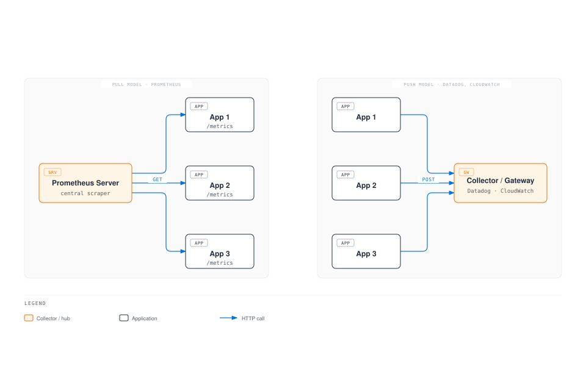

# Metrics Overview

> **Last Updated**: February 20, 2026

## Table of Contents

- [Metrics Fundamentals](#metrics-fundamentals)
- [Metric Types](#metric-types)
- [Pull vs Push Model](#pull-vs-push-model)
- [Cardinality and Metric Design](#cardinality-and-metric-design)
- [Long-term Storage Requirements](#long-term-storage-requirements)
- [Solution Comparison](#solution-comparison)
- [Metrics Collection Architecture](#metrics-collection-architecture)

## Metrics Fundamentals

Metrics are quantitative data used to measure and monitor the state and performance of systems. In Kubernetes environments, metrics are essential for understanding cluster health, detecting issues early, and performing capacity planning and performance optimization.

### Metric Components

Metrics consist of the following components:

```
http_requests_total{method="GET", endpoint="/api/users", status="200"} 1234 1677649200000
      |                              |                                   |        |
  metric name                      labels                              value  timestamp
```

1. **Metric Name**: Identifies what is being measured
2. **Labels**: Key-value pairs that segment the metric
3. **Value**: The measured numerical data
4. **Timestamp**: When the measurement was taken (Unix time in milliseconds)

### Metric Naming Conventions

Good metric names follow these rules:

```yaml
# Good examples
http_requests_total              # Total request count (Counter)
http_request_duration_seconds    # Request duration (Histogram)
node_memory_usage_bytes          # Memory usage (Gauge)

# Bad examples
requests                         # Too vague
httpRequestDurationMs            # Unit not in name, uses camelCase
```

**Naming rules**:
- Use snake_case (lowercase with underscores)
- Include units as suffixes (`_seconds`, `_bytes`, `_total`)
- Use application/domain prefixes (`http_`, `node_`, `kube_`)

## Metric Types

Prometheus-compatible metric systems use four basic metric types:

### 1. Counter

A metric type that tracks cumulative values. Values can only increase and reset to 0 on restart.

```yaml
# Use cases: request count, error count, completed tasks
http_requests_total{method="GET", status="200"} 12345
http_requests_total{method="POST", status="500"} 23

# PromQL query examples
rate(http_requests_total[5m])                    # Requests per second
increase(http_requests_total[1h])                # Increase over 1 hour
```

**Characteristics**:
- Monotonically increasing
- Resets on restart, but `rate()` function auto-corrects
- Analyze by rate of change rather than total

### 2. Gauge

A value representing current state that can increase or decrease.

```yaml
# Use cases: temperature, memory usage, current connections
node_memory_usage_bytes 8589934592
kube_pod_status_ready{pod="nginx-abc123"} 1
temperature_celsius{location="datacenter-1"} 23.5

# PromQL query examples
node_memory_usage_bytes / node_memory_total_bytes * 100  # Memory usage %
max_over_time(temperature_celsius[1h])                    # Max temp in 1 hour
```

**Characteristics**:
- Snapshot of current state
- Can increase or decrease
- Meaningful as absolute value at a point in time

### 3. Histogram

Observes value distribution using buckets. Ideal for analyzing distributions of latency, response sizes, etc.

```yaml
# Histogram generates three metrics
http_request_duration_seconds_bucket{le="0.005"} 24054    # Requests <= 5ms
http_request_duration_seconds_bucket{le="0.01"} 33444     # Requests <= 10ms
http_request_duration_seconds_bucket{le="0.025"} 100392   # Requests <= 25ms
http_request_duration_seconds_bucket{le="0.05"} 129389    # Requests <= 50ms
http_request_duration_seconds_bucket{le="0.1"} 133988     # Requests <= 100ms
http_request_duration_seconds_bucket{le="+Inf"} 144320    # Total requests
http_request_duration_seconds_sum 53.42                    # Total duration
http_request_duration_seconds_count 144320                 # Total count

# PromQL query examples
histogram_quantile(0.95, rate(http_request_duration_seconds_bucket[5m]))  # p95 latency
rate(http_request_duration_seconds_sum[5m]) / rate(http_request_duration_seconds_count[5m])  # Average latency
```

**Characteristics**:
- Aggregated into buckets on server side
- Can calculate quantiles across multiple instances
- Bucket boundaries determined at metric definition time

### 4. Summary

Calculates quantiles on the client side. Similar to Histogram but with different calculation method.

```yaml
# Summary generates quantiles and sum/count
http_request_duration_seconds{quantile="0.5"} 0.052      # Median (p50)
http_request_duration_seconds{quantile="0.9"} 0.089      # p90
http_request_duration_seconds{quantile="0.99"} 0.245     # p99
http_request_duration_seconds_sum 29969.50               # Total duration
http_request_duration_seconds_count 562887               # Total count

# PromQL query examples
http_request_duration_seconds{quantile="0.99"}           # p99 latency (direct query)
```

**Characteristics**:
- Quantiles calculated client-side
- Cannot aggregate across multiple instances
- Provides exact quantiles (not approximations)

### Histogram vs Summary Comparison

| Feature | Histogram | Summary |
|---------|-----------|---------|
| Quantile calculation | Server (at query time) | Client (at collection time) |
| Aggregation | Can aggregate across instances | Cannot aggregate |
| Accuracy | Approximation based on bucket boundaries | Exact quantiles |
| Configuration changes | Requires redeployment for bucket changes | Requires redeployment for quantile changes |
| Recommended use | SLO/SLI measurement, distributed systems | Single instance, when accuracy is critical |

## Pull vs Push Model

There are two main models for metrics collection:



### Pull Model

Prometheus is the representative Pull-based system.

**Advantages**:
- Central control of collection targets and intervals
- Automatic target availability detection
- Simplified firewall configuration (only allow inbound)
- Easy debugging (can directly query endpoints)

**Disadvantages**:
- Difficult to collect metrics from short-lived jobs
- Limited access to targets behind NAT/firewalls
- Requires service discovery

```yaml
# Prometheus scrape configuration example
scrape_configs:
  - job_name: 'kubernetes-pods'
    kubernetes_sd_configs:
      - role: pod
    relabel_configs:
      - source_labels: [__meta_kubernetes_pod_annotation_prometheus_io_scrape]
        action: keep
        regex: true
      - source_labels: [__meta_kubernetes_pod_annotation_prometheus_io_path]
        action: replace
        target_label: __metrics_path__
        regex: (.+)
```

### Push Model

Datadog, CloudWatch, Graphite, etc. are Push-based.

**Advantages**:
- Can collect metrics from short-lived jobs
- Advantageous in firewall/NAT environments
- Event-driven metric transmission

**Disadvantages**:
- Possible overload on collection server
- Difficult automatic target availability detection
- Requires transmission logic on client

```yaml
# Push example using Pushgateway
# Used for short-lived batch jobs
apiVersion: batch/v1
kind: Job
metadata:
  name: batch-job
spec:
  template:
    spec:
      containers:
      - name: worker
        image: my-batch-job:latest
        env:
        - name: PUSHGATEWAY_URL
          value: "http://pushgateway:9091"
        command:
        - /bin/sh
        - -c
        - |
          # Perform work
          do_work()

          # Push metrics
          cat <<EOF | curl --data-binary @- ${PUSHGATEWAY_URL}/metrics/job/batch_job/instance/${HOSTNAME}
          batch_job_duration_seconds ${DURATION}
          batch_job_records_processed ${RECORDS}
          EOF
      restartPolicy: Never
```

## Cardinality and Metric Design

### What is Cardinality?

Cardinality refers to the number of unique time series combinations for a metric. High cardinality directly impacts storage and query performance.

```yaml
# Low cardinality (good)
http_requests_total{method="GET", status="200"}     # method: ~5, status: ~10 = max 50 combinations

# High cardinality (caution needed)
http_requests_total{method="GET", user_id="12345"}  # user_id could be millions

# Very high cardinality (dangerous)
http_requests_total{request_id="abc-123-def"}       # Unique ID per request = infinite growth
```

### Calculating Cardinality

```
Total time series = label1 unique values x label2 unique values x ... x labelN unique values
```

**Example**:
- `method`: 5 (GET, POST, PUT, DELETE, PATCH)
- `endpoint`: 20
- `status`: 10 (200, 201, 400, 401, 403, 404, 500, 502, 503, 504)
- **Total time series**: 5 x 20 x 10 = **1,000**

### Cardinality Best Practices

```yaml
# Bad example: Infinite cardinality
http_request_duration_seconds{
  user_id="12345",           # Unique per user
  request_id="abc-123",      # Unique per request
  timestamp="1677649200"     # New value every second
}

# Good example: Bounded cardinality
http_request_duration_seconds{
  method="GET",              # 5 or fewer
  endpoint="/api/users",     # Dozens
  status_class="2xx"         # 5 (1xx, 2xx, 3xx, 4xx, 5xx)
}
```

**Recommendations**:
1. Avoid label values that can grow infinitely
2. Don't use user ID, request ID, session ID as labels
3. Group status codes (200 -> 2xx)
4. Normalize URL paths (`/users/123` -> `/users/{id}`)

### Monitoring Cardinality

```yaml
# Query to detect high cardinality metrics
topk(10, count by (__name__)({__name__=~".+"}))

# Check cardinality of specific metric
count(http_requests_total)

# Check unique values per label
count(count by (endpoint)(http_requests_total))
```

## Long-term Storage Requirements

### Prometheus Limitations

Prometheus is an excellent real-time monitoring tool but has limitations for long-term data storage:


**Problems with Prometheus long-term storage**:

1. **Storage efficiency**: Low compression increases disk usage
2. **Horizontal scalability**: Single node architecture limits scaling
3. **High availability**: No native HA clustering support
4. **Query performance**: Slower queries over long time ranges

### Why Long-term Storage is Needed

| Use Case | Required Retention | Description |
|----------|-------------------|-------------|
| Real-time alerts | 1-7 days | Immediate problem detection |
| Troubleshooting | 7-30 days | Recent issue analysis |
| Capacity planning | 3-12 months | Growth trend forecasting |
| Year-over-year comparison | 12+ months | YoY analysis |
| Compliance | 1-7 years | Audit and legal requirements |
| Cost optimization | 6-12 months | Resource usage pattern analysis |

### Remote Write Architecture

```yaml
# Prometheus remote_write configuration
global:
  scrape_interval: 15s

remote_write:
  - url: "http://victoriametrics:8428/api/v1/write"
    queue_config:
      max_samples_per_send: 10000
      batch_send_deadline: 5s
      min_backoff: 30ms
      max_backoff: 5s
      max_shards: 10
      capacity: 2500
    write_relabel_configs:
      # Exclude high cardinality metrics
      - source_labels: [__name__]
        regex: "go_.*"
        action: drop
```

## Solution Comparison

### Major Metrics Solution Comparison

| Feature | Prometheus | VictoriaMetrics | Mimir | CloudWatch | Datadog |
|---------|------------|-----------------|-------|------------|---------|
| **Deployment model** | Self-hosted | Self-hosted | Self-hosted | Managed | SaaS |
| **Scalability** | Single node | Horizontal | Horizontal | Auto-scaling | Auto-scaling |
| **High availability** | Requires Thanos/Cortex | Native | Native | Native | Native |
| **Data compression** | Medium | Very high (7x) | High | N/A | N/A |
| **Query language** | PromQL | MetricsQL | PromQL | Custom syntax | Custom syntax |
| **Long-term storage** | Limited | Efficient | Efficient | 15 months | 15 months |
| **Multi-tenancy** | Limited | Supported | Supported | Account separation | Org separation |
| **Cost** | Free (infra only) | Free (infra only) | Free (infra only) | Usage-based | Host-based |
| **Setup complexity** | Low | Medium | High | Low | Low |
| **AWS integration** | Manual setup | Manual setup | Manual setup | Native | Native |

### Cost Comparison (Monthly Estimate)

**Assumptions**: 1,000 nodes, 1M active time series, 30-day retention

| Solution | Infrastructure Cost | Service Cost | Total Cost |
|----------|--------------------|--------------| -----------|
| Prometheus + VictoriaMetrics | ~$500 | $0 | ~$500 |
| Amazon Managed Prometheus | ~$200 | ~$1,500 | ~$1,700 |
| CloudWatch | $0 | ~$3,000+ | ~$3,000+ |
| Datadog | $0 | ~$15,000+ | ~$15,000+ |

*Actual costs may vary significantly based on usage patterns.*

### Selection Guide


## Metrics Collection Architecture

### Kubernetes Environment Metrics Collection Structure


### Key Metric Sources

| Component | Role | Key Metrics |
|-----------|------|-------------|
| **node-exporter** | Node-level metrics | CPU, memory, disk, network |
| **kube-state-metrics** | K8s object state | Pod, Deployment, Node status |
| **cAdvisor** | Container metrics | Per-container CPU, memory, I/O |
| **metrics-server** | Resource metrics | CPU, memory for HPA/VPA |

### Next Steps

For detailed information on each metrics solution, see the following documents:

1. [Prometheus](./01-prometheus.md) - The open source monitoring standard
2. [VictoriaMetrics](./02-victoriametrics.md) - High-performance long-term storage
3. [Grafana Mimir](./03-mimir.md) - Enterprise-grade metrics storage
4. [CloudWatch Metrics](./04-cloudwatch-metrics.md) - AWS native monitoring
5. [Datadog](./05-datadog.md) - Unified observability platform

## Quiz

To test your understanding of this chapter, try the [Metrics Overview Quiz](../../quizzes/observability/metrics/00-metrics-overview-quiz.md).
