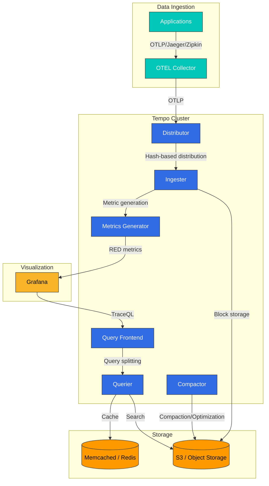

# Grafana Tempo

> **Supported Versions**: Tempo 2.x
> **Last Updated**: February 20, 2026

## Introduction

Grafana Tempo is an open-source backend for large-scale distributed tracing. Tempo stores only trace data with minimal indexing, enabling cost-effective operations. If you know the TraceID, you can find any trace, and tight integration with Grafana makes correlation with logs and metrics easy.

## Key Features

| Feature | Description |
|---------|-------------|
| **Index-free Storage** | TraceID-based storage eliminates indexing costs |
| **Object Storage Support** | Use S3, GCS, Azure Blob as backend |
| **Multiple Protocols** | Receive Jaeger, Zipkin, OTLP and more |
| **TraceQL** | Powerful trace query language |
| **Grafana Integration** | Native integration with Loki, Prometheus |
| **Horizontal Scaling** | Scalable microservices architecture |

## Architecture

Tempo consists of the following main components:



### Component Details

| Component | Role | Scaling Strategy |
|-----------|------|------------------|
| **Distributor** | Receive trace data, validation, hashing | Horizontal scaling |
| **Ingester** | Memory buffering, block creation, storage | Horizontal scaling (replication) |
| **Querier** | Search traces from storage | Horizontal scaling |
| **Query Frontend** | Query splitting, caching, queue management | Horizontal scaling |
| **Compactor** | Block compaction, retention policy enforcement | Single instance |
| **Metrics Generator** | Generate RED metrics from traces | Horizontal scaling |

## Helm Installation (Distributed Mode)

### 1. Add Helm Repository

```bash
helm repo add grafana https://grafana.github.io/helm-charts
helm repo update
```

### 2. values.yaml Configuration

```yaml
# tempo-distributed-values.yaml
global:
  clusterDomain: cluster.local

# Tempo configuration
tempo:
  structuredConfig:
    # Disable multitenancy (single tenant)
    multitenancy_enabled: false

    # Receiver configuration
    distributor:
      receivers:
        otlp:
          protocols:
            grpc:
              endpoint: 0.0.0.0:4317
            http:
              endpoint: 0.0.0.0:4318
        jaeger:
          protocols:
            thrift_http:
              endpoint: 0.0.0.0:14268
            grpc:
              endpoint: 0.0.0.0:14250
        zipkin:
          endpoint: 0.0.0.0:9411

    # Query frontend configuration
    query_frontend:
      search:
        max_duration: 12h
        default_result_limit: 20
      trace_by_id:
        query_shards: 50

    # Ingester configuration
    ingester:
      max_block_duration: 30m
      max_block_bytes: 500000000  # 500MB
      complete_block_timeout: 1h
      flush_check_period: 10s

    # Compactor configuration
    compactor:
      compaction:
        block_retention: 336h  # 14 days
        compacted_block_retention: 1h
        compaction_window: 4h
        max_block_bytes: 107374182400  # 100GB

    # Metrics generator configuration
    metrics_generator:
      registry:
        external_labels:
          source: tempo
          cluster: eks-production
      storage:
        path: /var/tempo/generator/wal
        remote_write:
          - url: http://prometheus:9090/api/v1/write
            send_exemplars: true
      processor:
        service_graphs:
          wait: 10s
          max_items: 10000
        span_metrics:
          dimensions:
            - service.namespace
            - http.method
            - http.status_code

# S3 storage configuration
storage:
  trace:
    backend: s3
    s3:
      bucket: tempo-traces-production
      endpoint: s3.ap-northeast-2.amazonaws.com
      region: ap-northeast-2
      # Omit access_key, secret_key when using IRSA
    blocklist_poll: 5m
    cache: memcached
    memcached:
      addresses:
        - dns+memcached.tempo.svc.cluster.local:11211
      timeout: 500ms
      max_idle_conns: 16
      max_item_size: 16777216  # 16MB

# Distributor configuration
distributor:
  replicas: 3
  resources:
    requests:
      cpu: 500m
      memory: 512Mi
    limits:
      cpu: 1000m
      memory: 1Gi
  autoscaling:
    enabled: true
    minReplicas: 3
    maxReplicas: 10
    targetCPUUtilizationPercentage: 70

# Ingester configuration
ingester:
  replicas: 3
  resources:
    requests:
      cpu: 1000m
      memory: 2Gi
    limits:
      cpu: 2000m
      memory: 4Gi
  persistence:
    enabled: true
    size: 50Gi
    storageClass: gp3
  autoscaling:
    enabled: true
    minReplicas: 3
    maxReplicas: 15
    targetCPUUtilizationPercentage: 70

# Querier configuration
querier:
  replicas: 2
  resources:
    requests:
      cpu: 500m
      memory: 512Mi
    limits:
      cpu: 1000m
      memory: 1Gi
  autoscaling:
    enabled: true
    minReplicas: 2
    maxReplicas: 10
    targetCPUUtilizationPercentage: 70

# Query Frontend configuration
queryFrontend:
  replicas: 2
  resources:
    requests:
      cpu: 300m
      memory: 256Mi
    limits:
      cpu: 500m
      memory: 512Mi
  autoscaling:
    enabled: true
    minReplicas: 2
    maxReplicas: 5
    targetCPUUtilizationPercentage: 70

# Compactor configuration
compactor:
  replicas: 1
  resources:
    requests:
      cpu: 500m
      memory: 1Gi
    limits:
      cpu: 1000m
      memory: 2Gi
  persistence:
    enabled: true
    size: 50Gi
    storageClass: gp3

# Metrics Generator configuration
metricsGenerator:
  enabled: true
  replicas: 2
  resources:
    requests:
      cpu: 500m
      memory: 512Mi
    limits:
      cpu: 1000m
      memory: 1Gi

# Memcached cache
memcached:
  enabled: true
  replicas: 2
  resources:
    requests:
      cpu: 100m
      memory: 256Mi
    limits:
      cpu: 500m
      memory: 512Mi

# Gateway (optional)
gateway:
  enabled: true
  replicas: 2
  ingress:
    enabled: true
    ingressClassName: alb
    annotations:
      alb.ingress.kubernetes.io/scheme: internal
      alb.ingress.kubernetes.io/target-type: ip
    hosts:
      - host: tempo.internal.example.com
        paths:
          - path: /
            pathType: Prefix

# ServiceMonitor for Prometheus
serviceMonitor:
  enabled: true
  interval: 30s
  labels:
    release: prometheus

# PodDisruptionBudget
podAntiAffinity:
  enabled: true
  type: soft
```

### 3. IRSA Configuration

```yaml
# tempo-irsa.yaml
apiVersion: v1
kind: ServiceAccount
metadata:
  name: tempo
  namespace: tempo
  annotations:
    eks.amazonaws.com/role-arn: arn:aws:iam::123456789012:role/tempo-s3-role
---
# IAM Policy (Terraform)
# resource "aws_iam_policy" "tempo_s3" {
#   name = "tempo-s3-policy"
#   policy = jsonencode({
#     Version = "2012-10-17"
#     Statement = [
#       {
#         Effect = "Allow"
#         Action = [
#           "s3:PutObject",
#           "s3:GetObject",
#           "s3:DeleteObject",
#           "s3:ListBucket"
#         ]
#         Resource = [
#           "arn:aws:s3:::tempo-traces-production",
#           "arn:aws:s3:::tempo-traces-production/*"
#         ]
#       }
#     ]
#   })
# }
```

### 4. Run Installation

```bash
# Create namespace
kubectl create namespace tempo

# Helm install
helm upgrade --install tempo grafana/tempo-distributed \
  --namespace tempo \
  --values tempo-distributed-values.yaml \
  --version 1.7.0

# Verify installation
kubectl get pods -n tempo
kubectl get svc -n tempo
```

## TraceQL Queries

TraceQL is Tempo's powerful query language.

### Basic Syntax

```traceql
# Query by TraceID
{ trace:id = "abc123def456" }

# Filter by service name
{ resource.service.name = "payment-service" }

# Filter by HTTP status code
{ span.http.status_code >= 400 }

# Filter by duration
{ duration > 1s }

# Compound conditions
{ resource.service.name = "order-service" && span.http.status_code = 500 }

# Query only error spans
{ status = error }
```

### Advanced Query Examples

```traceql
# 1. Find slow database queries
{ span.db.system = "postgresql" && duration > 100ms }

# 2. Trace specific user's requests
{ span.user.id = "user123" }

# 3. Errors on specific endpoint
{ span.http.url =~ "/api/payment.*" && status = error }

# 4. Slow requests in specific time range
{ duration > 2s } | avg(duration) by (resource.service.name)

# 5. Service-to-service call patterns
{ resource.service.name = "api-gateway" } >> { resource.service.name = "payment-service" }

# 6. Parent spans with child spans
{ resource.service.name = "order-service" } > { span.db.system = "postgresql" }

# 7. Sibling span queries
{ resource.service.name = "order-service" } ~ { resource.service.name = "inventory-service" }

# 8. Filter by nesting level
{ nestedSetParent > 0 }

# 9. Filter by span count
{ rootServiceName = "api-gateway" && traceSpanCount > 50 }

# 10. Aggregation queries
{ status = error } | count() by (resource.service.name) | rate()
```

### Using TraceQL in Grafana

```yaml
# Grafana data source configuration
apiVersion: 1
datasources:
  - name: Tempo
    type: tempo
    uid: tempo
    url: http://tempo-query-frontend.tempo.svc.cluster.local:3100
    access: proxy
    jsonData:
      httpMethod: GET
      tracesToLogs:
        datasourceUid: loki
        tags: ['job', 'instance', 'pod', 'namespace']
        mappedTags: [{ key: 'service.name', value: 'service' }]
        mapTagNamesEnabled: true
        spanStartTimeShift: '-1h'
        spanEndTimeShift: '1h'
        filterByTraceID: true
        filterBySpanID: true
      tracesToMetrics:
        datasourceUid: prometheus
        tags: [{ key: 'service.name', value: 'service' }]
        queries:
          - name: 'Request Rate'
            query: 'sum(rate(traces_spanmetrics_calls_total{$$__tags}[5m]))'
          - name: 'Error Rate'
            query: 'sum(rate(traces_spanmetrics_calls_total{$$__tags,status_code="STATUS_CODE_ERROR"}[5m]))'
      serviceMap:
        datasourceUid: prometheus
      nodeGraph:
        enabled: true
      search:
        hide: false
      lokiSearch:
        datasourceUid: loki
```

## S3 Backend Configuration

### S3 Bucket Setup

```bash
# Create S3 bucket
aws s3 mb s3://tempo-traces-production --region ap-northeast-2

# Bucket lifecycle policy (delete after 30 days)
aws s3api put-bucket-lifecycle-configuration \
  --bucket tempo-traces-production \
  --lifecycle-configuration '{
    "Rules": [
      {
        "ID": "tempo-retention",
        "Status": "Enabled",
        "Filter": {
          "Prefix": ""
        },
        "Expiration": {
          "Days": 30
        },
        "NoncurrentVersionExpiration": {
          "NoncurrentDays": 7
        }
      }
    ]
  }'

# Enable server-side encryption
aws s3api put-bucket-encryption \
  --bucket tempo-traces-production \
  --server-side-encryption-configuration '{
    "Rules": [
      {
        "ApplyServerSideEncryptionByDefault": {
          "SSEAlgorithm": "aws:kms",
          "KMSMasterKeyID": "alias/tempo-encryption-key"
        },
        "BucketKeyEnabled": true
      }
    ]
  }'
```

### S3 and IRSA Setup with Terraform

```hcl
# tempo-s3.tf
resource "aws_s3_bucket" "tempo" {
  bucket = "tempo-traces-${var.environment}"

  tags = {
    Name        = "tempo-traces"
    Environment = var.environment
  }
}

resource "aws_s3_bucket_versioning" "tempo" {
  bucket = aws_s3_bucket.tempo.id
  versioning_configuration {
    status = "Enabled"
  }
}

resource "aws_s3_bucket_server_side_encryption_configuration" "tempo" {
  bucket = aws_s3_bucket.tempo.id

  rule {
    apply_server_side_encryption_by_default {
      sse_algorithm     = "aws:kms"
      kms_master_key_id = aws_kms_key.tempo.arn
    }
    bucket_key_enabled = true
  }
}

resource "aws_s3_bucket_lifecycle_configuration" "tempo" {
  bucket = aws_s3_bucket.tempo.id

  rule {
    id     = "tempo-retention"
    status = "Enabled"

    expiration {
      days = 30
    }

    noncurrent_version_expiration {
      noncurrent_days = 7
    }
  }
}

# IRSA configuration
module "tempo_irsa" {
  source  = "terraform-aws-modules/iam/aws//modules/iam-role-for-service-accounts-eks"
  version = "~> 5.0"

  role_name = "tempo-s3-role"

  attach_external_secrets_policy = false

  oidc_providers = {
    main = {
      provider_arn               = module.eks.oidc_provider_arn
      namespace_service_accounts = ["tempo:tempo"]
    }
  }
}

resource "aws_iam_role_policy" "tempo_s3" {
  name = "tempo-s3-policy"
  role = module.tempo_irsa.iam_role_name

  policy = jsonencode({
    Version = "2012-10-17"
    Statement = [
      {
        Effect = "Allow"
        Action = [
          "s3:PutObject",
          "s3:GetObject",
          "s3:DeleteObject",
          "s3:ListBucket",
          "s3:GetObjectVersion",
          "s3:DeleteObjectVersion"
        ]
        Resource = [
          aws_s3_bucket.tempo.arn,
          "${aws_s3_bucket.tempo.arn}/*"
        ]
      },
      {
        Effect = "Allow"
        Action = [
          "kms:Encrypt",
          "kms:Decrypt",
          "kms:GenerateDataKey"
        ]
        Resource = [aws_kms_key.tempo.arn]
      }
    ]
  })
}
```

## Trace-to-Log Correlation (Loki Integration)

### Grafana Data Source Configuration

```yaml
# grafana-datasources.yaml
apiVersion: v1
kind: ConfigMap
metadata:
  name: grafana-datasources
  namespace: monitoring
data:
  datasources.yaml: |-
    apiVersion: 1
    datasources:
      # Tempo data source
      - name: Tempo
        type: tempo
        uid: tempo
        url: http://tempo-query-frontend.tempo.svc.cluster.local:3100
        access: proxy
        jsonData:
          httpMethod: GET
          # Trace to Logs connection
          tracesToLogs:
            datasourceUid: loki
            tags: ['job', 'namespace', 'pod']
            mappedTags:
              - key: service.name
                value: app
            mapTagNamesEnabled: true
            spanStartTimeShift: '-1h'
            spanEndTimeShift: '1h'
            filterByTraceID: true
            filterBySpanID: true
          # Trace to Metrics connection
          tracesToMetrics:
            datasourceUid: prometheus
            tags:
              - key: service.name
                value: service
            queries:
              - name: 'Request Rate'
                query: 'sum(rate(http_server_requests_total{service="$${__tags}"}[5m]))'
              - name: 'Error Rate'
                query: 'sum(rate(http_server_requests_total{service="$${__tags}",status=~"5.."}[5m]))'
          # Service Graph
          serviceMap:
            datasourceUid: prometheus
          # Node Graph
          nodeGraph:
            enabled: true
          # Search settings
          search:
            hide: false
          lokiSearch:
            datasourceUid: loki

      # Loki data source
      - name: Loki
        type: loki
        uid: loki
        url: http://loki-gateway.loki.svc.cluster.local
        access: proxy
        jsonData:
          maxLines: 1000
          derivedFields:
            # Extract TraceID from logs
            - name: TraceID
              matcherRegex: '"traceId":"([a-f0-9]+)"'
              url: '$${__value.raw}'
              datasourceUid: tempo
              urlDisplayLabel: 'View Trace'
            # Alternative: trace_id field
            - name: trace_id
              matcherRegex: 'trace_id=([a-f0-9]+)'
              url: '$${__value.raw}'
              datasourceUid: tempo
              urlDisplayLabel: 'View Trace'

      # Prometheus data source
      - name: Prometheus
        type: prometheus
        uid: prometheus
        url: http://prometheus-operated.monitoring.svc.cluster.local:9090
        access: proxy
        jsonData:
          httpMethod: POST
          exemplarTraceIdDestinations:
            - name: traceID
              datasourceUid: tempo
              urlDisplayLabel: 'View Trace'
```

## Performance Tuning

### Ingestion Rate Optimization

```yaml
# tempo-config.yaml
ingester:
  # Block size settings
  max_block_duration: 30m        # Maximum block duration
  max_block_bytes: 500000000     # Maximum block size (500MB)
  complete_block_timeout: 1h     # Block completion timeout

  # WAL settings
  wal:
    path: /var/tempo/wal
    encoding: snappy             # Compression encoding
    search_encoding: snappy

  # Trace settings
  trace_idle_period: 10s         # Idle trace period
  flush_check_period: 10s        # Flush check interval

distributor:
  # Receive limits
  ring:
    kvstore:
      store: memberlist
  receivers:
    otlp:
      protocols:
        grpc:
          max_recv_msg_size: 104857600  # 100MB
        http:
          max_request_body_size: 104857600

  # Rate limiting
  rate_limit:
    enabled: true
    bytes_per_second: 100000000  # 100MB/s
    burst_bytes: 200000000       # 200MB burst
```

### Resource Recommendations

| Component | CPU | Memory | Disk | Notes |
|-----------|-----|--------|------|-------|
| Distributor | 0.5-1 core | 512Mi-1Gi | - | Horizontal scaling |
| Ingester | 1-2 core | 2-4Gi | 50-100Gi SSD | WAL storage |
| Querier | 0.5-1 core | 512Mi-1Gi | - | Depends on query complexity |
| Query Frontend | 0.3-0.5 core | 256-512Mi | - | Lightweight |
| Compactor | 0.5-1 core | 1-2Gi | 50-100Gi | Single instance |
| Memcached | 0.1-0.5 core | 256Mi-512Mi | - | Cache |

## Troubleshooting

### Common Issues and Solutions

#### 1. Trace data not showing

```bash
# Check Distributor logs
kubectl logs -n tempo -l app.kubernetes.io/component=distributor --tail=100

# Common causes:
# - OTLP endpoint connection issues
# - Network policy blocking
# - Rate limiting

# Connection test
kubectl run test-tempo --rm -it --image=curlimages/curl -- \
  curl -v http://tempo-distributor.tempo.svc.cluster.local:4318/v1/traces
```

#### 2. S3 permission errors

```bash
# Check IRSA configuration
kubectl describe sa tempo -n tempo

# Check Pod's AWS credentials
kubectl exec -n tempo -it $(kubectl get pod -n tempo -l app.kubernetes.io/component=ingester -o jsonpath='{.items[0].metadata.name}') -- \
  env | grep AWS

# S3 access test
kubectl exec -n tempo -it $(kubectl get pod -n tempo -l app.kubernetes.io/component=ingester -o jsonpath='{.items[0].metadata.name}') -- \
  aws s3 ls s3://tempo-traces-production/
```

#### 3. Query timeouts

```bash
# Check Query Frontend logs
kubectl logs -n tempo -l app.kubernetes.io/component=query-frontend --tail=100

# Solutions:
# 1. Increase query_shards
# 2. Decrease max_duration
# 3. Increase Querier replicas
# 4. Enable caching
```

### Useful Debugging Commands

```bash
# Check Tempo status
curl http://tempo-query-frontend.tempo.svc.cluster.local:3100/status

# Check ring status
curl http://tempo-distributor.tempo.svc.cluster.local:3100/distributor/ring
curl http://tempo-ingester.tempo.svc.cluster.local:3100/ingester/ring

# Check metrics
curl http://tempo-distributor.tempo.svc.cluster.local:3100/metrics | grep tempo_

# Force flush
curl -X POST http://tempo-ingester.tempo.svc.cluster.local:3100/flush

# Compaction status
curl http://tempo-compactor.tempo.svc.cluster.local:3100/compactor/ring
```

## Quiz

Test your knowledge with the [Tempo Quiz](../../quizzes/observability/tracing/01-tempo-quiz.md).
