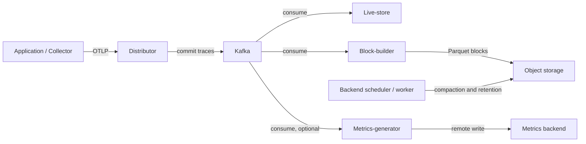
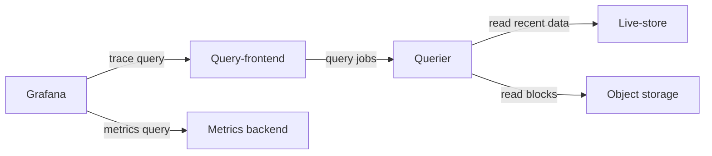

# Grafana Tempo

> **Reviewed baseline**: Tempo 3.0.3; `tempo-distributed` chart 3.6.0 (appVersion 3.0.3)
> **Last Updated**: September 13, 2026

## Introduction

Grafana Tempo stores and queries distributed traces using object storage, Parquet blocks and TraceQL. A TraceID locates **retained, successfully ingested data**; it cannot recover spans lost through sampling, failed exports or retention. Tempo avoids a separate general-purpose search database, but dedicated columns, metadata, caches, compute and object-store requests still have costs.

This chapter separates a local monolithic example from a distributed EKS configuration baseline. The local binary, query compiler, Helm rendering and configuration parsing were checked. An EKS deployment, Kafka authentication, S3 authorization, high availability and production sizing were **not** exercised.

## Key Features

| Feature | Scope |
|---------|-------|
| Object storage | S3, GCS and Azure Blob; local storage for a bounded development example |
| TraceQL | Attribute, duration, status and structural queries; metrics functions are distinct from per-trace aggregations |
| Protocols | OTLP, plus optional receivers such as Jaeger and Zipkin; enable the corresponding chart ports |
| Correlation | Grafana links traces, logs, metrics and exemplars when identifiers and data-source UIDs match |
| Deployment modes | Monolithic `target: all`, or microservices with a Kafka-compatible ingestion queue |
| Metrics generation | Optional span metrics and service graphs; requires processors and a working remote-write destination |

## Architecture

**Tempo 3 microservices require Kafka. Monolithic mode does not.** The distributor acknowledges ingestion after committing to Kafka; live-stores, block-builders and metrics-generators consume independently. Live-stores serve recent data; block-builders write long-term blocks. Query-frontends split work, and queriers read recent stores or object storage.



Read path (the same storage and metrics components):



The arrows show requests and data flow, not every response or control-plane connection. Grafana **queries** the metrics backend; a metrics-generator does not store metrics in Grafana.

### Component Details

| Component | Tempo 3 responsibility | Operational consideration |
|-----------|-------------------------|---------------------------|
| Distributor | Validate and route traces to Kafka partitions | Backpressure, accepted/rejected bytes and spans |
| Live-store | Recent trace queries and local WAL | Consumer lag, local capacity and partition ownership |
| Block-builder | Consume Kafka and write Parquet blocks | Partition assignment and object-store throughput |
| Query-frontend / querier | Split, schedule and execute queries | Queueing, scan bytes, concurrency and caches |
| Backend scheduler / worker | Compaction, retention and background jobs | Scheduler coordination, worker resources and failed jobs |
| Metrics-generator | Derive span metrics and service graphs | Cardinality, processor activation and remote-write health |

Tempo 2 `ingester` and `compactor` configuration is not a Tempo 3 installation recipe. A distributed **2→3 migration is side by side**, with compatible existing blocks (`vParquet4` or later), a new ingestion path and a controlled traffic switch. Downgrading 3→2 is unsupported. Do not point competing installations at the same writable data without the [official migration procedure](https://grafana.com/docs/tempo/latest/set-up-for-tracing/setup-tempo/upgrade/).

Kafka replication, in-sync replicas, retention and disk capacity determine write-path durability. A Tempo replica count does not establish Kafka durability or guarantee zero loss. In chart 3.6.0, live-store and block-builder data volumes are `emptyDir`; three replicas do not imply three persistent PVCs.

## Helm Installation (Distributed Mode)

### 1. Add Helm Repository

Use the maintained community chart and an explicit version:

```bash
helm repo add grafana-community https://grafana-community.github.io/helm-charts
helm repo update grafana-community
helm show chart grafana-community/tempo-distributed --version 3.6.0
helm show values grafana-community/tempo-distributed --version 3.6.0 > tempo-defaults.yaml
```

The chart declares Kubernetes `^1.25.0-0`. That is a chart constraint, **not** a test matrix for every Kubernetes/EKS release or add-on combination.

### 2. values.yaml Configuration

Save the following as `tempo-distributed-values.yaml`. It is a **render-only starting point**, with placeholder account/bucket names and an isolated-test Kafka address.

```yaml
# Render-only baseline. Read the Kafka security/deployment gates first.
fullnameOverride: tempo
reportingEnabled: false
serviceAccount:
  create: true
  name: tempo
  annotations:
    eks.amazonaws.com/role-arn: arn:aws:iam::123456789012:role/tempo-s3
traces:
  otlp:
    grpc:
      enabled: true
    http:
      enabled: true
ingest:
  kafka:
    address: kafka-bootstrap.kafka.svc.cluster.local:9092
    topic: tempo-traces
    auto_create_topic_enabled: false
storage:
  trace:
    backend: s3
    s3:
      bucket: replace-with-owned-tempo-bucket
      region: ap-northeast-2
      endpoint: s3.ap-northeast-2.amazonaws.com
      insecure: false
backendScheduler:
  config:
    provider:
      compaction:
        compaction:
          block_retention: 336h
metricsGenerator:
  enabled: false
gateway:
  enabled: false
ingress:
  enabled: false
metaMonitoring:
  serviceMonitor:
    enabled: false
tempo:
  structuredConfig:
    distributor:
      receivers:
        otlp:
          protocols:
            grpc:
              max_recv_msg_size_mib: 16
    overrides:
      defaults:
        ingestion:
          rate_limit_bytes: 15000000
          burst_size_bytes: 20000000
```

Before a deployment, resolve these requirements:

- Provision and own the Kafka topic separately. The three default live-store/block-builder replicas and `partitions_per_instance: 1` need a matching partition design; scaling Pods alone does not redistribute every block-builder assignment.
- Verify Kafka transport and authentication end to end. Tempo **3.0.3's Kafka client exposes SASL/PLAIN but no Kafka TLS, SCRAM or MSK IAM configuration**. PLAIN is not encryption. This example is not a secure drop-in MSK recipe. A network/proxy solution must cover all advertised broker endpoints, not just bootstrap, and must be independently tested before production use.
- Supply the S3 bucket and role from the next section. Set the exact ServiceAccount name and role annotation; creating an unrelated ServiceAccount is insufficient.
- Restrict OTLP, query, memberlist and component RPC access with the actual cluster network controls and authenticated transport. An internal load balancer or `X-Scope-OrgID` header alone is not authentication.
- Set resources, scheduling, disruption budgets and storage/recovery policy for the workload. A PodDisruptionBudget constrains voluntary evictions; anti-affinity controls placement. Neither proves availability.

The receive-size limit is in **MiB**; the ingestion rate/burst fields are in **bytes**. The 16 MiB and 15/20 MB values are illustrative limits, not measured capacity.

Optional metrics generation needs both activation and an existing authenticated receiver. Merge this second file only after creating the `tempo-metrics-client` Secret with the three named certificate files and replacing the URL:

```yaml
metricsGenerator:
  enabled: true
  config:
    storage:
      remote_write:
        - url: https://metrics-write.example.org/api/v1/write
          send_exemplars: true
          tls_config:
            ca_file: /etc/metrics-tls/ca.crt
            cert_file: /etc/metrics-tls/tls.crt
            key_file: /etc/metrics-tls/tls.key
  extraVolumes:
    - name: metrics-tls
      secret:
        secretName: tempo-metrics-client
  extraVolumeMounts:
    - name: metrics-tls
      mountPath: /etc/metrics-tls
      readOnly: true
overrides:
  defaults:
    metrics_generator:
      processors: [span-metrics, service-graphs]
      generate_native_histograms: both
```

The receiver must accept Prometheus remote write; exemplars and native histograms also need destination support. This chart's default generator WAL is ephemeral. Validate replay/queue/storage behavior separately; do not interpret `send_exemplars: true` as a delivery guarantee.

### 3. IRSA Configuration

The example uses the exact identity `system:serviceaccount:monitoring:tempo`. Its role trust is limited by both the OIDC `sub` and `aud` claims. The role allows access only to the owned Tempo bucket. Avoid static access keys in environment variables or Helm values.

IRSA is the concrete path shown here, not the only possible EKS workload identity. A Pod Identity alternative must be checked against the credential provider used by the pinned Tempo image. Also verify STS reachability, bucket policies, VPC endpoints and any KMS key policy; successful YAML rendering proves none of those.

### 4. Run Installation

First render and inspect without contacting a cluster:

```bash
helm template tempo grafana-community/tempo-distributed \
  --version 3.6.0 --namespace monitoring --kube-version 1.36.2 \
  -f tempo-distributed-values.yaml > tempo-rendered.yaml
```

`--kube-version` selects rendering capabilities; it does not certify EKS 1.36.2 compatibility. Inspect Service ports, Pod identities, ConfigMaps, resource settings and the optional generator configuration. Extract the rendered `tempo.yaml` and validate it with the **matching** binary:

```bash
tempo -config.file=tempo.yaml -config.verify=true
```

This exits before service initialization. It does not connect to Kafka/S3 or fully exercise arbitrary receiver configuration. **Do not run a Helm install until the preceding deployment requirements have been resolved.** Then use the reviewed values and an owned release/namespace under your deployment process, including a rollback/migration plan.

For a local single-process check, save this separate file as `tempo-local.yaml` and use the verified official Tempo 3.0.3 binary for your OS/architecture:

```yaml
target: all
stream_over_http_enabled: true
server:
  http_listen_address: 127.0.0.1
  http_listen_port: 3200
  grpc_listen_address: 127.0.0.1
  grpc_listen_port: 9095
distributor:
  receivers:
    otlp:
      protocols:
        grpc:
          endpoint: 127.0.0.1:4317
        http:
          endpoint: 127.0.0.1:4318
storage:
  trace:
    backend: local
    wal:
      path: ./tempo-data/wal
    local:
      path: ./tempo-data/blocks
live_store:
  wal:
    path: ./tempo-data/live-store/traces
  shutdown_marker_dir: ./tempo-data/live-store/shutdown-marker
  ring:
    instance_addr: 127.0.0.1
    instance_interface_names: [lo]
metrics_generator:
  storage:
    path: ./tempo-data/generator/wal
backend_scheduler:
  local_work_path: ./tempo-data/scheduler
memberlist:
  bind_addr: [127.0.0.1]
  advertise_addr: 127.0.0.1
usage_report:
  reporting_enabled: false
```

```bash
tempo -config.file=tempo-local.yaml -config.verify=true
tempo -config.file=tempo-local.yaml
# In a second terminal:
curl --fail http://127.0.0.1:3200/ready
```

It binds to loopback, disables usage reporting and writes under `./tempo-data`. Stop this process with Ctrl-C. This is one local instance with no Kafka, S3, authentication gateway or HA claim.

## TraceQL Queries

### Basic Syntax

Use Grafana Explore's TraceID mode for direct lookup, or a full 32-hex ID in a TraceQL intrinsic:

```traceql
{ trace:id = "4bf92f3577b34da6a3ce929d0e0e4736" }
{ resource.service.name = "payment-service" }
{ span.http.response.status_code >= 400 }
{ duration > 1s }
{ status = error }
```

These are separate queries. Span status `error` is not identical to every HTTP status ≥400. Attribute names reflect the emitting SDK's semantic-convention version: older `http.status_code` and `db.system` data remain queryable under their original names; Tempo does not rename stored attributes automatically.

### Advanced Query Examples

```traceql
{ span.db.system.name = "postgresql" && duration > 100ms }
{ span.http.route = "/api/payment" && status = error }
{ resource.service.name = "api-gateway" } >> { resource.service.name = "payment-service" }
{ resource.service.name = "order-service" } > { span.db.system.name = "postgresql" }
{ resource.service.name = "order-service" } ~ { resource.service.name = "inventory-service" }
{ trace:rootService = "api-gateway" } | count() > 50
{ duration > 2s } | by(resource.service.name) | avg(duration) > 2s
{ status = error } | rate() by (resource.service.name)
{ } | avg_over_time(duration) by (resource.service.name)
```

- `A >> B` returns matching **B descendants** of A; `A > B` returns matching B direct children. To obtain parents, use the corresponding reverse relationship rather than describe the children as parents.
- `A ~ B` matches siblings. It does not establish an A→B network call.
- `count()` counts spans in the **current spanset**. Filtering down to errors before counting would count error spans, not all spans in the trace. `traceSpanCount` is not a valid intrinsic.
- `nestedSetParent` is accepted by this release but is an internal nested-set parent marker, not a nesting-depth counter.
- `by(...) | avg(...) > ...` filters per-trace spansets; `rate()` and `avg_over_time(...)` produce time series. The former is an error-span rate, **not an error ratio**. Select the time interval in Grafana or the query API; a duration filter is not a wall-clock range.

A query such as `{ span.user.id = "synthetic-user-123" }` requires that explicitly emitted attribute. Use synthetic or approved pseudonymous identifiers; don't make personal data a tracing prerequisite. Prefer low-cardinality `http.route` over literal URLs containing user IDs or query strings.

### Using TraceQL in Grafana

Create the Tempo data source with the query-frontend URL on port **3200**, then select Explore → Tempo → Search/TraceQL. The `tempo` UID must agree with log links and exemplar destinations. Shorten the time range before raising query concurrency or limits.

## S3 Backend Configuration

### S3 Bucket Setup

Use a dedicated bucket with Block Public Access, bucket-owner-enforced ownership and encryption. Keep its ownership in one infrastructure state; do not create the same bucket with both a CLI snippet and Terraform.

Tempo's `block_retention: 336h` is a retention target enforced asynchronously by its background processing, not an exact deletion deadline. A blanket S3 “delete every object after 30 days” policy can conflict with compaction and metadata. Do not add one without a documented backend-aware lifecycle design. If versioning is enabled, deleting a current object can leave noncurrent versions and charges; define their retention and recovery requirements separately.

### S3 and IRSA Setup with Terraform

This AWS provider **6.64.0** example uses SSE-S3 and an **existing** cluster OIDC provider. Replace the account, globally unique bucket name and issuer inputs. It intentionally does not create an EKS cluster, Kafka or a KMS key.

```hcl
terraform {
  required_version = ">= 1.6.0"
  required_providers {
    aws = {
      source  = "hashicorp/aws"
      version = "6.64.0"
    }
  }
}

variable "region" {
  type    = string
  default = "ap-northeast-2"
}
variable "account_id" {
  type = string
  validation {
    condition     = can(regex("^[0-9]{12}$", var.account_id))
    error_message = "Supply the bucket and role owner account ID."
  }
}
variable "bucket_name" { type = string }
variable "oidc_provider_arn" { type = string }
variable "oidc_issuer_hostpath" {
  type        = string
  description = "Existing cluster OIDC issuer without https://."
}
provider "aws" { region = var.region }

resource "aws_s3_bucket" "tempo" {
  bucket        = var.bucket_name
  force_destroy = false
  lifecycle { prevent_destroy = true }
}
resource "aws_s3_bucket_public_access_block" "tempo" {
  bucket                  = aws_s3_bucket.tempo.id
  block_public_acls       = true
  block_public_policy     = true
  ignore_public_acls      = true
  restrict_public_buckets = true
}
resource "aws_s3_bucket_ownership_controls" "tempo" {
  bucket = aws_s3_bucket.tempo.id
  rule { object_ownership = "BucketOwnerEnforced" }
}
resource "aws_s3_bucket_server_side_encryption_configuration" "tempo" {
  bucket = aws_s3_bucket.tempo.id
  rule {
    apply_server_side_encryption_by_default { sse_algorithm = "AES256" }
  }
}
resource "aws_s3_bucket_policy" "tempo" {
  bucket = aws_s3_bucket.tempo.id
  policy = jsonencode({
    Version = "2012-10-17"
    Statement = [{
      Sid       = "DenyInsecureTransport"
      Effect    = "Deny"
      Principal = "*"
      Action    = "s3:*"
      Resource  = [aws_s3_bucket.tempo.arn, "${aws_s3_bucket.tempo.arn}/*"]
      Condition = { Bool = { "aws:SecureTransport" = "false" } }
    }]
  })
}
resource "aws_iam_role" "tempo" {
  name = "tempo-s3"
  assume_role_policy = jsonencode({
    Version = "2012-10-17"
    Statement = [{
      Effect    = "Allow"
      Principal = { Federated = var.oidc_provider_arn }
      Action    = "sts:AssumeRoleWithWebIdentity"
      Condition = {
        StringEquals = {
          "${var.oidc_issuer_hostpath}:aud" = "sts.amazonaws.com"
          "${var.oidc_issuer_hostpath}:sub" = "system:serviceaccount:monitoring:tempo"
        }
      }
    }]
  })
}
resource "aws_iam_role_policy" "tempo" {
  role = aws_iam_role.tempo.id
  policy = jsonencode({
    Version = "2012-10-17"
    Statement = [
      {
        Effect    = "Allow"
        Action    = ["s3:ListBucket", "s3:GetBucketLocation"]
        Resource  = aws_s3_bucket.tempo.arn
        Condition = { StringEquals = { "aws:ResourceAccount" = var.account_id } }
      },
      {
        Effect    = "Allow"
        Action    = ["s3:GetObject", "s3:PutObject", "s3:DeleteObject", "s3:AbortMultipartUpload"]
        Resource  = "${aws_s3_bucket.tempo.arn}/*"
        Condition = { StringEquals = { "aws:ResourceAccount" = var.account_id } }
      }
    ]
  })
}
output "tempo_role_arn" { value = aws_iam_role.tempo.arn }
output "tempo_bucket" { value = aws_s3_bucket.tempo.id }
```

Use `tempo_role_arn` and `tempo_bucket` in the Helm values. Terraform formatting/schema validation is useful before a plan; review the actual plan and ownership before applying. For SSE-KMS, explicitly supply an owned key, compatible bucket/Tempo settings, scoped `kms:GenerateDataKey`/`kms:Decrypt` permissions and a key policy allowing the workload. An undefined `aws_kms_key` reference is not a complete configuration.

## Trace-to-Log Correlation (Loki Integration)

### Grafana Data Source Configuration

This is a **Grafana provisioning file**, not a chart-specific `values.yaml`. Mount it through the mechanism supported by your Grafana chart. The three internal URLs are placeholders for existing, access-controlled services:

```yaml
apiVersion: 1
datasources:
  - name: Tempo
    uid: tempo
    type: tempo
    access: proxy
    url: http://tempo-query-frontend.monitoring.svc.cluster.local:3200
    jsonData:
      tracesToLogsV2:
        datasourceUid: loki
        spanStartTimeShift: '-1m'
        spanEndTimeShift: '1m'
        tags: [{key: service.name, value: service_name}]
        filterByTraceID: true
        filterBySpanID: false
        customQuery: false
      tracesToMetrics:
        datasourceUid: prometheus
        tags: [{key: service.name, value: service}]
        queries:
          - name: Span request rate
            query: 'sum(rate(traces_spanmetrics_calls_total{$$__tags}[5m]))'
          - name: Span error ratio
            query: '(sum(rate(traces_spanmetrics_calls_total{$$__tags,status_code="STATUS_CODE_ERROR"}[5m])) or (0 * sum(rate(traces_spanmetrics_calls_total{$$__tags}[5m])))) / (sum(rate(traces_spanmetrics_calls_total{$$__tags}[5m])) > 0)'
      serviceMap:
        datasourceUid: prometheus
      nodeGraph:
        enabled: true
  - name: Loki
    uid: loki
    type: loki
    access: proxy
    url: http://loki-gateway.logging.svc.cluster.local
    jsonData:
      derivedFields:
        - name: TraceID
          matcherRegex: '"traceId"\s*:\s*"([0-9a-f]{32})"'
          datasourceUid: tempo
          url: '$${__value.raw}'
  - name: Prometheus
    uid: prometheus
    type: prometheus
    access: proxy
    url: http://prometheus-operated.monitoring.svc.cluster.local:9090
    jsonData:
      httpMethod: POST
      exemplarTraceIdDestinations:
        - name: traceID
          datasourceUid: tempo
```

Tempo `tracesToLogsV2` implements **Trace→Logs**; Loki `derivedFields` implements **Logs→Trace**. The example maps the OTel `service.name` attribute to Loki's existing `service_name` label. Verify your collector's mapping; the link cannot manufacture a label or a log record. Span filtering is disabled because not every log has a span ID.

In provisioning YAML, `$$` preserves a literal `$` for Grafana's runtime macros. `__tags` expands into a set of label matchers; do not embed it as the value of `service="..."`. The error ratio fills a missing error series from the total series, and divides only when the total rate is positive. Zero traffic and absent telemetry remain empty.

The span-metrics label `service` and status value `STATUS_CODE_ERROR` must match the actual generated series. Exemplars use the observed exemplar label name (`traceID` for the illustrated generator configuration); other producers can use `trace_id`. Sampling can make these metrics differ from full application request counts.

### Application Logging

For Python with OpenTelemetry API 1.44, check context validity rather than `span.is_recording()`. A valid nonrecording span can still correlate logs:

```python
import datetime
import json
import logging
from opentelemetry import trace


class TraceJsonFormatter(logging.Formatter):
    def format(self, record):
        payload = {
            "timestamp": datetime.datetime.fromtimestamp(
                record.created, datetime.timezone.utc
            ).isoformat(),
            "level": record.levelname,
            "message": record.getMessage(),
        }
        context = trace.get_current_span().get_span_context()
        if context.is_valid:
            payload["traceId"] = f"{context.trace_id:032x}"
            payload["spanId"] = f"{context.span_id:016x}"
        if record.exc_info:
            payload["exception"] = self.formatException(record.exc_info)
        return json.dumps(payload, ensure_ascii=False)


logger = logging.getLogger("payment")
logger.setLevel(logging.INFO)
logger.propagate = False
# Configure once at application startup.
if not logger.handlers:
    handler = logging.StreamHandler()
    handler.setFormatter(TraceJsonFormatter())
    logger.addHandler(handler)
```

This preserves UTC timestamps, message formatting and exceptions, and omits invalid IDs instead of fabricating all-zero traces. Configure the handler once; propagate OTel context across asynchronous boundaries and redact sensitive messages/exceptions at their source.

For Java, use the [scoped MDC helper in the tracing overview](README.md#linking-logs-via-traceid): validate the current `SpanContext`, set IDs for the logging scope, and restore prior MDC values in `finally`. Merely writing `MDC.put` can leak an earlier request's IDs on reused threads. The Java API contract was checked; no Java application was run for this chapter.

## Performance Tuning

### Ingestion Rate Optimization

Measure accepted/rejected bytes and spans, exporter retries, Kafka producer errors and consumer lag. Increasing receiver size, ingestion limits or replica counts without memory and queue capacity can move the bottleneck rather than remove it. Preserve upstream sampling assumptions when interpreting generated metrics.

Use `overrides.defaults.ingestion` for tenant limits and the receiver's `max_recv_msg_size_mib` field for gRPC message size. The old `distributor.rate_limit` block and Tempo 2 `ingester` tuning block do not configure Tempo 3.

### Compaction Optimization

Configure retention through the chart's `backendScheduler.config.provider.compaction.compaction` settings and the corresponding backend-worker configuration. Observe job age, failures, object-store requests and temporary working space. More compaction concurrency can increase object-store traffic and memory; there is no universal “one compactor per cluster” rule for the old architecture.

### Query Performance Optimization

Reduce time range and selectivity first; then inspect scanned bytes, queueing, querier concurrency and the relevant cache roles. Configure cache fields from the pinned chart/configuration rather than copy removed `cache:` layouts. Object-store hedging can improve tail latency at the cost of extra requests; validate that tradeoff with measurements.

Tempo 3's live-store `fail_on_high_lag` defaults to true and query-frontend `query_end_cutoff` defaults to 30s. Very recent search visibility can lag a direct TraceID lookup. Do not disable these protections merely to make an empty dashboard look healthy.

### Resource Recommendations

Size distributors by intake, live-stores by recent trace volume/lag, block-builders by assigned partitions and block size, queriers by query concurrency, and generators by active series. The old unmeasured Tempo 2 Ingester/Compactor CPU and disk table is not a capacity recommendation for Tempo 3. Measure CPU, RSS, local/WAL use, Kafka lag, request cost and saturation under representative traffic.

## Troubleshooting

### Common Issues and Solutions

#### 1. Trace data not showing

Check SDK export errors, sampling, propagated context, collector queues, OTLP transport, tenant routing and retention. A GET request to `/v1/traces` is not an ingestion test; send a valid OTLP POST and then query its known synthetic TraceID. A successful `/ready` probe alone does not prove every stage works.

#### 2. S3 permission errors

Inspect the exact ServiceAccount, role trust, bucket policy, endpoint access and KMS policy if applicable. Do not dump Pod environment variables or projected tokens. Do not assume the Tempo image contains an AWS CLI or shell.

```bash
kubectl get serviceaccount tempo -n monitoring -o yaml
kubectl get pods -n monitoring -l app.kubernetes.io/instance=tempo \
  -o custom-columns=NAME:.metadata.name,SA:.spec.serviceAccountName
kubectl logs -n monitoring -l app.kubernetes.io/component=block-builder --tail=100
```

Restrict access to diagnostic output: logs may contain operational metadata or application attributes.

#### 3. Query timeouts

Check query-frontend/querier logs, time range, Kafka lag, available live-store partitions and S3 throttling. Increase concurrency only after measuring memory and backend limits. Treat an empty result, a timeout and missing telemetry as different states.

#### 4. Live-store memory pressure

For Tempo 3, inspect live-store memory, recent data windows, block rotation and partition ownership. For a still-running Tempo 2 deployment, use its versioned ingester documentation during migration; copying `ingester.max_block_duration: 30m` into Tempo 3 will not tune the live-store.

### Useful Debugging Commands

Use an authorized port-forward to inspect the actual query-frontend:

```bash
kubectl port-forward -n monitoring service/tempo-query-frontend 3200:3200
# In a second terminal:
curl --fail http://127.0.0.1:3200/ready
curl --fail http://127.0.0.1:3200/metrics
curl --fail http://127.0.0.1:3200/api/traces/4bf92f3577b34da6a3ce929d0e0e4736
```

The final ID must actually exist in that deployment. Read-only ring/status endpoints are component-specific; verify the pinned API before use. Removed `/ingester/ring`, `/compactor/ring` and forced-flush commands are not general Tempo 3 diagnostics.

### Monitoring Dashboard

Use the real series emitted by your deployment and add its target labels:

```promql
sum(rate(tempo_distributor_spans_received_total[5m]))
sum(process_resident_memory_bytes{job=~"tempo.*"})
histogram_quantile(0.99, sum by (le) (rate(tempo_request_duration_seconds_bucket{route="api_search"}[5m])))
```

These panels mean **received spans/s**, **process RSS bytes**, and **HTTP search request p99 seconds**. The memory selector assumes your scrape job naming; inspect labels first. A byte-write counter is not memory, and a span count is not a trace count. The request histogram/route was observed in the local Tempo 3.0.3 smoke test; it is not a distributed end-to-end latency measurement.

## References

- [Tempo 3.0.3 release](https://github.com/grafana/tempo/releases/tag/v3.0.3), [chart 3.6.0 values](https://github.com/grafana-community/helm-charts/blob/tempo-distributed-3.6.0/charts/tempo-distributed/values.yaml)
- [Tempo architecture](https://grafana.com/docs/tempo/latest/introduction/architecture/), [Kafka client implementation](https://github.com/grafana/tempo/blob/v3.0.3/pkg/ingest/writer_client.go)
- [TraceQL syntax](https://grafana.com/docs/tempo/latest/traceql/construct-traceql-queries/), [Grafana provisioning](https://grafana.com/docs/grafana/latest/datasources/tempo/configure-tempo-data-source/provision/)
- [EKS IRSA association](https://docs.aws.amazon.com/eks/latest/userguide/associate-service-account-role.html), [S3 Block Public Access](https://docs.aws.amazon.com/AmazonS3/latest/userguide/access-control-block-public-access.html)

## Quiz

Test this chapter with the [Tempo quiz](../../quizzes/observability/tracing/01-tempo-quiz.md).
