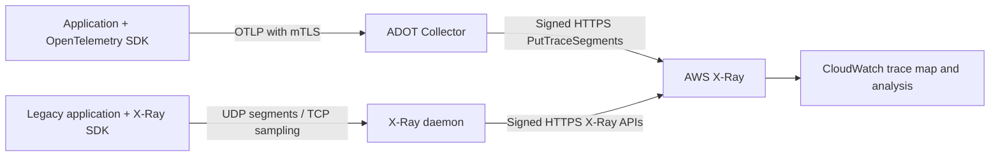
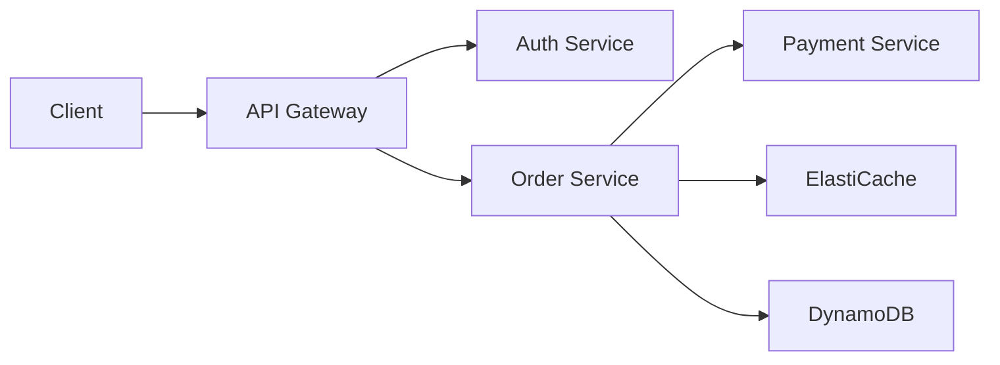

# AWS X-Ray

> **Last Updated**: September 13, 2026

## Introduction

AWS X-Ray is an AWS native service for tracing and analyzing requests in distributed applications. Using X-Ray in EKS environments allows you to visualize request flow between microservices, identify performance bottlenecks, and determine root causes of errors.

The **X-Ray SDKs and daemon have been in maintenance mode since February 25, 2026**, with security fixes only and no announced end date in the current [support timeline](https://docs.aws.amazon.com/xray/latest/devguide/xray-sdk-daemon-timeline.html). This is the instrumentation lifecycle, not retirement of the X-Ray service. AWS recommends OpenTelemetry for new instrumentation and migration. The daemon example below is a legacy compatibility path.

## Key Features

| Feature | Description |
|---------|-------------|
| **Service Map** | Automatic visualization of service dependencies |
| **Request Tracing** | End-to-end request path tracking |
| **Analysis Tools** | Response time distribution, error rate analysis |
| **AWS Integration** | Native support for Lambda, API Gateway, ECS, EKS |
| **Sampling Rules** | Centralized sampling configuration |
| **Groups and Alerts** | Filter-based grouping and CloudWatch alerts |

## Architecture

The following shows the two collection alternatives described here. The daemon sends signed HTTPS requests to AWS; UDP/TCP2000 are its application-facing legacy protocols. The configured ADOT awsxray exporter uses PutTraceSegments, not the native CloudWatch OTLP endpoint.



EKS does not automatically instrument every application. Lambda/API Gateway and other service integrations need their own supported tracing configuration and propagation. Native CloudWatch OTLP is a separate ingestion path with Transaction Search and SigV4 prerequisites, described below.

## X-Ray Daemon Deployment

### Deploy as DaemonSet

```yaml
# xray-daemon.yaml
apiVersion: v1
kind: ServiceAccount
metadata:
  name: xray-daemon
  namespace: amazon-cloudwatch
  annotations:
    eks.amazonaws.com/role-arn: arn:aws:iam::123456789012:role/xray-daemon-role
---
apiVersion: apps/v1
kind: DaemonSet
metadata:
  name: xray-daemon
  namespace: amazon-cloudwatch
spec:
  selector:
    matchLabels:
      app: xray-daemon
  updateStrategy:
    type: RollingUpdate
  template:
    metadata:
      labels:
        app: xray-daemon
    spec:
      serviceAccountName: xray-daemon
      nodeSelector:
        kubernetes.io/os: linux
      containers:
        - name: xray-daemon
          image: amazon/aws-xray-daemon:3.7.0@sha256:a2303d37f9dd7077c93e596689cb1de12f2ef8333c15b088ba223840164f6bc2
          args: ["-o", "-n", "ap-northeast-2"]
          ports:
            - name: xray-udp
              containerPort: 2000
              protocol: UDP
            - name: xray-tcp
              containerPort: 2000
              protocol: TCP
          resources:
            requests:
              cpu: 50m
              memory: 64Mi
            limits:
              cpu: 100m
              memory: 128Mi
          env:
            - name: AWS_REGION
              value: ap-northeast-2
      tolerations:
        - key: node-role.kubernetes.io/master
          effect: NoSchedule
---
apiVersion: v1
kind: Service
metadata:
  name: xray-daemon
  namespace: amazon-cloudwatch
spec:
  selector:
    app: xray-daemon
  ports:
    - name: xray-udp
      port: 2000
      protocol: UDP
    - name: xray-tcp
      port: 2000
      protocol: TCP
  type: ClusterIP
```

This maintenance-path image is pinned to the verified official 3.7.0 multi-architecture manifest (Linux amd64/arm64). Its entrypoint is `/xray`, not `/usr/bin/xray`; `-o` disables EC2 metadata enrichment and `-n` supplies the Region. DaemonSets do not run on EKS Fargate. This ClusterIP Service can select a daemon on another node, so it does not guarantee node-local delivery or lossless UDP.

For a legacy SDK client, set `AWS_XRAY_DAEMON_ADDRESS=xray-daemon.amazon-cloudwatch.svc.cluster.local:2000`. Both UDP segments and TCP sampling traffic need reachability. Restrict this unencrypted legacy path to trusted workloads; use the OpenTelemetry path for authenticated TLS collection. Choose one collection path per producer.


### IRSA Configuration

Create the `amazon-cloudwatch` namespace through its existing owner. The legacy daemon's `xray-daemon` ServiceAccount must reference its own prepared role. The following permission policy covers segment/telemetry export and centralized sampling calls; replace the Region with the actual deployment Region:

```json
{
  "Version": "2012-10-17",
  "Statement": [
    {
      "Effect": "Allow",
      "Action": [
        "xray:PutTraceSegments",
        "xray:PutTelemetryRecords",
        "xray:GetSamplingRules",
        "xray:GetSamplingTargets",
        "xray:GetSamplingStatisticSummaries"
      ],
      "Resource": "*",
      "Condition": {
        "StringEquals": {
          "aws:RequestedRegion": "ap-northeast-2"
        }
      }
    }
  ]
}
```

These X-Ray actions use `Resource: "*"`, constrained here by `aws:RequestedRegion`. The daemon's policy is separate from the narrower ADOT policy below. Neither policy grants an operator permission to create groups or sampling rules.

For either collector, prepare an IRSA role using the cluster's registered OIDC provider, `aud=sts.amazonaws.com` and the **exact namespace/ServiceAccount subject**. The trust example below is for `adot-collector`; a daemon role instead requires `system:serviceaccount:amazon-cloudwatch:xray-daemon`. Replace the illustrative account, Region and OIDC ID consistently.

```json
{
  "Version": "2012-10-17",
  "Statement": [
    {
      "Effect": "Allow",
      "Principal": {
        "Federated": "arn:aws:iam::123456789012:oidc-provider/oidc.eks.ap-northeast-2.amazonaws.com/id/EXAMPLE"
      },
      "Action": "sts:AssumeRoleWithWebIdentity",
      "Condition": {
        "StringEquals": {
          "oidc.eks.ap-northeast-2.amazonaws.com/id/EXAMPLE:aud": "sts.amazonaws.com",
          "oidc.eks.ap-northeast-2.amazonaws.com/id/EXAMPLE:sub": "system:serviceaccount:amazon-cloudwatch:adot-collector"
        }
      }
    }
  ]
}
```

Have the IAM/infrastructure owner create or update the intended role and attach the matching permission policy. Preserve an existing ServiceAccount's ownership; do not run `eksctl --override-existing-serviceaccounts` as a generic setup step. Verify the rendered Pod's projected token, role ARN, SDK credential resolution and actual authorization in the approved environment. A ServiceAccount annotation alone is not an authorization test.

## ADOT Collector Deployment

This trace pipeline uses [ADOT Collector 0.50.0](https://github.com/aws-observability/aws-otel-collector/releases/tag/v0.50.0), based on Collector/Contrib 0.158.0. The released ADOT distribution has its own component inventory; do not assume it contains every component in an upstream Contrib release. The pinned collector binary was exercised locally with synthetic OTLP/X-Ray data and a fake loopback X-Ray endpoint. No AWS authorization, Kubernetes deployment or production availability test was performed.

<a id="adot-collector-daemonset"></a>

### Collector Deployment and Prerequisites

The example is one central **Deployment** and ClusterIP Service, with no host ports. It is not an HA configuration. Applications explicitly select its DNS endpoint; installing it does not instrument applications. A DaemonSet is a separate placement design and is not supported on EKS Fargate. A Deployment on Fargate still needs a matching Fargate profile and supported resource/storage/network configuration.

Before applying these resources:

- Prepare the namespace and IRSA role from the preceding section, with subject `system:serviceaccount:amazon-cloudwatch:adot-collector`.
- Deliver the existing Kubernetes Secret `adot-collector-tls` through the approved certificate process. It contains `server.crt`, `server.key` and `ca.crt`. The server certificate must cover the actual Service DNS name, for example `adot-collector.amazon-cloudwatch.svc.cluster.local`; the CA must trust the intended client certificates.
- Mount approved CA/client certificate/key files into producers. Restrict Secret access, workload access to ports 4317/4318 and the health endpoint; plan certificate rotation. Do not put certificate private-key contents or AWS credentials in environment variables.
- Replace the cluster/account/Region values and inspect the final workload identity. The resource processor sets one cluster name explicitly; it does not discover all Pod/node metadata and must not relabel traffic from unrelated clusters as this cluster.

The ADOT pipeline below disables exporter telemetry and uses only the classic X-Ray `PutTraceSegments` export path, so its workload permission policy is:

```json
{
  "Version": "2012-10-17",
  "Statement": [
    {
      "Effect": "Allow",
      "Action": ["xray:PutTraceSegments"],
      "Resource": "*",
      "Condition": {
        "StringEquals": {
          "aws:RequestedRegion": "ap-northeast-2"
        }
      }
    }
  ]
}
```

Use this complete ConfigMap together with the following workload/Service manifest:

```yaml
apiVersion: v1
kind: ConfigMap
metadata:
  name: adot-collector-config
  namespace: amazon-cloudwatch
data:
  collector.yaml: |
    receivers:
      otlp:
        protocols:
          grpc:
            endpoint: 0.0.0.0:4317
            tls:
              cert_file: /etc/otel/tls/server.crt
              key_file: /etc/otel/tls/server.key
              client_ca_file: /etc/otel/tls/ca.crt
              min_version: "1.2"
          http:
            endpoint: 0.0.0.0:4318
            tls:
              cert_file: /etc/otel/tls/server.crt
              key_file: /etc/otel/tls/server.key
              client_ca_file: /etc/otel/tls/ca.crt
              min_version: "1.2"
    processors:
      memory_limiter:
        check_interval: 1s
        limit_mib: 400
        spike_limit_mib: 100
      resource:
        attributes:
          - key: cloud.provider
            value: aws
            action: upsert
          - key: k8s.cluster.name
            value: ${env:CLUSTER_NAME}
            action: upsert
      batch:
        timeout: 5s
        send_batch_size: 256
        send_batch_max_size: 512
    exporters:
      awsxray:
        region: ap-northeast-2
        local_mode: true
        index_all_attributes: false
        indexed_attributes:
          - deployment.environment.name
          - app.operation
        telemetry:
          enabled: false
    extensions:
      health_check:
        endpoint: 0.0.0.0:13133
    service:
      extensions: [health_check]
      pipelines:
        traces:
          receivers: [otlp]
          processors: [memory_limiter, resource, batch]
          exporters: [awsxray]
```

```yaml
apiVersion: v1
kind: ServiceAccount
metadata:
  name: adot-collector
  namespace: amazon-cloudwatch
  annotations:
    eks.amazonaws.com/role-arn: arn:aws:iam::123456789012:role/adot-xray-role
automountServiceAccountToken: false
---
apiVersion: apps/v1
kind: Deployment
metadata:
  name: adot-collector
  namespace: amazon-cloudwatch
spec:
  replicas: 1
  selector:
    matchLabels:
      app: adot-collector
  template:
    metadata:
      labels:
        app: adot-collector
    spec:
      serviceAccountName: adot-collector
      nodeSelector:
        kubernetes.io/os: linux
      automountServiceAccountToken: false
      terminationGracePeriodSeconds: 30
      securityContext:
        runAsNonRoot: true
        runAsUser: 4317
        runAsGroup: 4317
        fsGroup: 4317
        seccompProfile:
          type: RuntimeDefault
      containers:
        - name: collector
          image: public.ecr.aws/aws-observability/aws-otel-collector:v0.50.0
          args: ["--config=/conf/collector.yaml"]
          env:
            - name: CLUSTER_NAME
              value: replace-with-cluster-name
            - name: AWS_REGION
              value: ap-northeast-2
            - name: AWS_EC2_METADATA_DISABLED
              value: "true"
            - name: GOMEMLIMIT
              value: 400MiB
          resources:
            requests:
              cpu: 100m
              memory: 256Mi
            limits:
              cpu: 500m
              memory: 512Mi
          securityContext:
            allowPrivilegeEscalation: false
            readOnlyRootFilesystem: true
            capabilities:
              drop: [ALL]
          ports:
            - name: otlp-grpc
              containerPort: 4317
            - name: otlp-http
              containerPort: 4318
            - name: health
              containerPort: 13133
          volumeMounts:
            - name: config
              mountPath: /conf
              readOnly: true
            - name: tls
              mountPath: /etc/otel/tls
              readOnly: true
          readinessProbe:
            httpGet:
              path: /
              port: health
            initialDelaySeconds: 5
          livenessProbe:
            httpGet:
              path: /
              port: health
            initialDelaySeconds: 15
      volumes:
        - name: config
          configMap:
            name: adot-collector-config
        - name: tls
          secret:
            secretName: adot-collector-tls
            defaultMode: 0440
---
apiVersion: v1
kind: Service
metadata:
  name: adot-collector
  namespace: amazon-cloudwatch
spec:
  type: ClusterIP
  selector:
    app: adot-collector
  ports:
    - name: otlp-grpc
      port: 4317
      targetPort: otlp-grpc
    - name: otlp-http
      port: 4318
      targetPort: otlp-http
```

The container image supplies `RUN_IN_CONTAINER=True`; for a standalone native collector test this variable is needed to keep its custom CLI logging away from `/opt`. Its CLI is not interchangeable with every upstream `otelcol` command. The local test used the versioned AWS binary, test certificates and only loopback destinations.

The proposed configuration passed five local mTLS checks, including rejection without a client certificate and acceptance with a trusted one. The three Kubernetes resources passed local OpenAPI schema validation. This does not verify the actual Secret, IRSA mutation, CNI policy, scheduling or AWS permissions. The health endpoint reports collector process health, not successful delivery to X-Ray. Queues, retries, memory pressure, termination and backend failures can still lose telemetry; plan capacity and monitor refused/dropped/export-failed data.

### Legacy X-Ray Receiver and Separate Telemetry Pipelines

ADOT 0.50.0 also includes the `awsxray` receiver. Its supported UDP configuration is:

```yaml
# Receiver fragment only; requires an explicitly connected trace pipeline.
receivers:
  awsxray:
    endpoint: 0.0.0.0:2000
    transport: udp
```

This legacy receiver is an alternative to sending SDK segments through the daemon; avoid duplicating the same producer's trace path. It also starts a TCP sampling proxy by default. If using centralized sampling, configure and restrict the required TCP2000 Service/proxy path and sampling permissions as well as UDP2000. The legacy protocol is not protected by the OTLP receiver's mTLS settings. The native audit confirmed both OTLP and X-Ray UDP reception; it did not execute remote AWS sampling.

Metrics, application logs and traces require their own connected pipelines and backend configuration. Merely declaring an `awscloudwatchlogs` exporter does not turn traces into logs or write them to an invented `/aws/xray/traces` log group. A metrics remote-write endpoint likewise needs its actual receiver, authentication and TLS configuration; it is not an X-Ray prerequisite.

## OpenTelemetry to X-Ray Integration

These examples use the authenticated collector Service above. Producers need access to that Service and their mounted client TLS files; they do not need the collector's AWS credentials. The examples create synthetic spans and perform no payment, database or AWS business operation.

The exact validation baselines are Python SDK/exporter1.44.0 with Flask3.1.3, Go SDK/exporter1.44.0 with Go1.26.8, and Java1.66.0 API sources. These pins are not a universal AWS compatibility matrix or a claim that every language has the same latest release. Python and Go were exercised locally; Java API/configuration was checked against the tagged source, but no JDK/Maven compilation was available in this audit.

Use these settings for the finite demo process. The endpoint includes `/v1/traces` for OTLP/HTTP. Keep the client private key in a mounted protected file. Root spans are sampled for this finite demonstration and remote parent decisions are honored; select a measured production sampler instead of copying an all-roots demo setting into unrestricted production traffic. Generic SDK samplers do not automatically fetch X-Ray centralized rules.

```bash
# Application-process configuration; mounted file paths are not secret contents.
export OTEL_SDK_DISABLED=false
export OTEL_SERVICE_NAME=inventory-demo
export OTEL_TRACES_EXPORTER=otlp
export OTEL_METRICS_EXPORTER=none
export OTEL_LOGS_EXPORTER=none
export OTEL_EXPORTER_OTLP_TRACES_PROTOCOL=http/protobuf
export OTEL_EXPORTER_OTLP_TRACES_ENDPOINT=https://adot-collector.amazon-cloudwatch.svc.cluster.local:4318/v1/traces
export OTEL_EXPORTER_OTLP_TRACES_CERTIFICATE=/etc/otel/client/ca.crt
export OTEL_EXPORTER_OTLP_TRACES_CLIENT_CERTIFICATE=/etc/otel/client/client.crt
export OTEL_EXPORTER_OTLP_TRACES_CLIENT_KEY=/etc/otel/client/client.key
export OTEL_PROPAGATORS=tracecontext
export OTEL_TRACES_SAMPLER=parentbased_always_on
```

### Application Configuration (Java)

Save `InventoryDemo.java` in the existing Java project. Autoconfiguration reads the standard OTLP endpoint, protocol and CA/client-key/client-certificate file settings. It does not instrument an entire application automatically. Do not initialize another SDK if an agent/framework already owns it. `OpenTelemetrySdk` implements Closeable; closing it coordinates provider shutdown, but a completed method call is not proof of backend delivery.

```xml
<!-- Dependency fragment for an existing Java17+ Maven project. -->
<dependencies>
  <dependency>
    <groupId>io.opentelemetry</groupId>
    <artifactId>opentelemetry-sdk-extension-autoconfigure</artifactId>
    <version>1.66.0</version>
  </dependency>
  <dependency>
    <groupId>io.opentelemetry</groupId>
    <artifactId>opentelemetry-exporter-otlp</artifactId>
    <version>1.66.0</version>
  </dependency>
</dependencies>
```

```java
import io.opentelemetry.api.trace.Span;
import io.opentelemetry.api.trace.Tracer;
import io.opentelemetry.context.Scope;
import io.opentelemetry.sdk.OpenTelemetrySdk;
import io.opentelemetry.sdk.autoconfigure.AutoConfiguredOpenTelemetrySdk;

// Standalone finite demo; do not create a second SDK when an agent/framework owns it.
public final class InventoryDemo {
    public static void main(String[] args) {
        try (OpenTelemetrySdk sdk = AutoConfiguredOpenTelemetrySdk.builder()
                .build().getOpenTelemetrySdk()) {
            Tracer tracer = sdk.getTracer("inventory-demo");
            Span root = tracer.spanBuilder("inventory.demo").startSpan();
            try (Scope ignored = root.makeCurrent()) {
                root.setAttribute("app.operation", "inventory.demo");
                root.setAttribute("deployment.environment.name", "demo");
                Span child = tracer.spanBuilder("inventory.lookup").startSpan();
                try {
                    child.setAttribute("lookup.result", "demo");
                    // No AWS or database call is performed by this example.
                } finally {
                    child.end();
                }
            } finally {
                root.end();
            }
        } // SDK close shuts down providers/exporters; delivery must still be monitored.
    }
}
```

### Application Configuration (Python)

Use an isolated application environment with `opentelemetry-api==1.44.0`, `opentelemetry-sdk==1.44.0`, `opentelemetry-exporter-otlp-proto-http==1.44.0` and `Flask==3.1.3`. Save the following as `payment_demo.py`. Its `/api/payment` endpoint only returns a synthetic response; it does not charge or validate a real payment. The local Flask development server is not a production WSGI deployment.

```python
"""Synthetic Flask instrumentation example: no payment is processed."""
import os
from pathlib import Path
from urllib.parse import urlparse

from flask import Flask, jsonify, request
from opentelemetry.exporter.otlp.proto.http.trace_exporter import OTLPSpanExporter
from opentelemetry.sdk.resources import Resource
from opentelemetry.sdk.trace import TracerProvider
from opentelemetry.sdk.trace.export import BatchSpanProcessor
from opentelemetry.sdk.trace.sampling import ParentBased, ALWAYS_ON
from opentelemetry.trace import SpanKind
from opentelemetry.trace.propagation.tracecontext import TraceContextTextMapPropagator


def configure_provider():
    endpoint = os.environ["OTEL_EXPORTER_OTLP_TRACES_ENDPOINT"]
    url = urlparse(endpoint)
    if url.scheme != "https" or not url.hostname or url.username or url.password:
        raise ValueError("Configure an HTTPS collector endpoint without URL credentials")
    certs = {
        "certificate_file": os.environ["OTEL_EXPORTER_OTLP_TRACES_CERTIFICATE"],
        "client_certificate_file": os.environ["OTEL_EXPORTER_OTLP_TRACES_CLIENT_CERTIFICATE"],
        "client_key_file": os.environ["OTEL_EXPORTER_OTLP_TRACES_CLIENT_KEY"],
    }
    for path in certs.values():
        if not Path(path).is_file():
            raise ValueError("A required mounted TLS file is missing")
    provider = TracerProvider(
        resource=Resource.create({"service.name": "payment-demo"}),
        # Finite demo traffic only. Select a measured production sampling policy.
        sampler=ParentBased(ALWAYS_ON),
    )
    provider.add_span_processor(BatchSpanProcessor(
        OTLPSpanExporter(endpoint=endpoint, timeout=5, **certs),
        max_queue_size=256, max_export_batch_size=64,
    ))
    return provider


def create_app(provider):
    app = Flask(__name__)
    tracer = provider.get_tracer("payment-demo")
    propagator = TraceContextTextMapPropagator()

    @app.post("/api/payment")
    def payment_demo():
        carrier = {name.lower(): value for name, value in request.headers.items()}
        parent = propagator.extract(carrier)
        with tracer.start_as_current_span(
            "POST /api/payment", context=parent, kind=SpanKind.SERVER
        ) as span:
            span.set_attribute("app.operation", "payment.demo")
            span.set_attribute("deployment.environment.name", "demo")
            span.set_attribute("http.request.method", "POST")
            span.set_attribute("http.route", "/api/payment")
            with tracer.start_as_current_span("validation.demo") as child:
                child.set_attribute("validation.result", "accepted")
            span.set_attribute("http.response.status_code", 202)
            # No request payload/Authorization/user ID is added to telemetry.
            return jsonify(status="demo-only-no-payment-processed"), 202

    return app


if __name__ == "__main__":
    provider = configure_provider()
    try:
        # Local development server only; not a production WSGI deployment.
        create_app(provider).run(host="127.0.0.1", port=8080)
    finally:
        provider.shutdown()
```

### Application Configuration (Go)

Save the following `go.mod` and `main.go` in a separate example directory, resolve the pinned dependencies with `go mod tidy`, and run it only with the intended collector/TLS environment. The sample emits two finite spans. `DEMO_TRACEPARENT` is an optional demonstration carrier; real HTTP handlers must extract from request headers and inject into outgoing requests. SDK creation alone does not add instrumentation to every HTTP/database library.

```text
module example.invalid/xray-otel-demo

go 1.25.0

require (
    go.opentelemetry.io/otel v1.44.0
    go.opentelemetry.io/otel/exporters/otlp/otlptrace/otlptracehttp v1.44.0
    go.opentelemetry.io/otel/sdk v1.44.0
    go.opentelemetry.io/otel/trace v1.44.0
)
```

```go
package main

import (
	"context"
	"fmt"
	"log"
	"net/url"
	"os"
	"time"

	"go.opentelemetry.io/otel/attribute"
	"go.opentelemetry.io/otel/exporters/otlp/otlptrace/otlptracehttp"
	"go.opentelemetry.io/otel/propagation"
	"go.opentelemetry.io/otel/sdk/resource"
	sdktrace "go.opentelemetry.io/otel/sdk/trace"
	"go.opentelemetry.io/otel/trace"
)

func configureProvider(ctx context.Context) (*sdktrace.TracerProvider, error) {
	endpoint := os.Getenv("OTEL_EXPORTER_OTLP_TRACES_ENDPOINT")
	u, err := url.Parse(endpoint)
	if err != nil || u.Scheme != "https" || u.Hostname() == "" || u.User != nil {
		return nil, fmt.Errorf("configure an HTTPS collector endpoint without URL credentials")
	}
	for _, name := range []string{
		"OTEL_EXPORTER_OTLP_TRACES_CERTIFICATE",
		"OTEL_EXPORTER_OTLP_TRACES_CLIENT_CERTIFICATE",
		"OTEL_EXPORTER_OTLP_TRACES_CLIENT_KEY",
	} {
		info, err := os.Stat(os.Getenv(name))
		if err != nil || !info.Mode().IsRegular() {
			return nil, fmt.Errorf("required mounted TLS file is missing: %s", name)
		}
	}
	// This exporter reads the standard signal-specific TLS file environment settings.
	exporter, err := otlptracehttp.New(ctx,
		otlptracehttp.WithEndpointURL(endpoint),
		otlptracehttp.WithTimeout(5*time.Second))
	if err != nil {
		return nil, err
	}
	return sdktrace.NewTracerProvider(
		sdktrace.WithResource(resource.NewSchemaless(
			attribute.String("service.name", "inventory-demo"))),
		// Finite demo only; honors a remote parent's unsampled decision.
		sdktrace.WithSampler(sdktrace.ParentBased(sdktrace.AlwaysSample())),
		sdktrace.WithBatcher(exporter),
	), nil
}

func emitDemo(ctx context.Context, tracer trace.Tracer) {
	ctx, parent := tracer.Start(ctx, "inventory.demo")
	defer parent.End()
	parent.SetAttributes(
		attribute.String("app.operation", "inventory.demo"),
		attribute.String("deployment.environment.name", "demo"))
	_, child := tracer.Start(ctx, "inventory.lookup")
	child.SetAttributes(attribute.String("lookup.result", "demo"))
	child.End()
}

func run() error {
	ctx := context.Background()
	provider, err := configureProvider(ctx)
	if err != nil {
		return err
	}
	// Optional CLI demonstration carrier, not automatic HTTP instrumentation.
	parent := propagation.TraceContext{}.Extract(ctx,
		propagation.MapCarrier{"traceparent": os.Getenv("DEMO_TRACEPARENT")})
	emitDemo(parent, provider.Tracer("inventory-demo"))
	shutdown, cancel := context.WithTimeout(ctx, 10*time.Second)
	defer cancel()
	return provider.Shutdown(shutdown)
}

func main() {
	if err := run(); err != nil {
		log.Fatal(err)
	}
}
```

The Python example passed 13 checks covering mixed-case incoming headers, parent/child identity, unsampled parents, sensitive payload exclusion and a real loopback mTLS OTLP POST. Go passed 4 native tests covering mTLS/protobuf export, W3C identity, unsampled parents, plaintext rejection and missing TLS files. Neither test contacted AWS or demonstrated production application performance. Java imports, lifecycle and TLS autoconfiguration are source-verified only.

Select propagation deliberately: W3C Trace Context is used here. X-Amzn-Trace-Id interoperability may require the appropriate AWS propagator for the specific language/integration, but an X-Ray-specific ID generator is not universally required for W3C traces. With several accepted formats, define precedence and trust boundaries rather than blindly composing propagators. Async work must carry its parent context explicitly.

## Sampling Rules

### Centralized Sampling Configuration

X-Ray centralized rules apply only to producers using a compatible X-Ray remote sampler. A generic OpenTelemetry `parentbased_traceidratio` sampler does not fetch these rules, and creating a rule does not enable remote sampling in an SDK. The collector's `awsxray` exporter exports already selected spans; it does not retroactively select requests.

Head sampling decides before the completed response is known. Matching a future HTTP500 or final duration cannot guarantee capturing every error/slow request. Classic X-Ray SDKs ignore rules containing `Attributes` and support `ResourceARN: "*"`; the earlier error-attribute rule was not a working all-error policy. A broadly matching “slow” rule also does not inspect eventual latency.

Rules are matched in ascending numeric priority. Reservoir targets and fixed rates are best-effort sampling behavior, not a guarantee of ten traces per second when fewer requests arrive. Parent decisions, supported sampler implementations and distributed quotas matter.

The following are three separate request files. Their AWS API shapes were validated locally, not applied to AWS.

**`sampling-production.json` — a general API request policy:**

```json
{
  "SamplingRule": {
    "RuleName": "docs-production-api",
    "ResourceARN": "*",
    "Priority": 1000,
    "FixedRate": 0.05,
    "ReservoirSize": 10,
    "ServiceName": "*",
    "ServiceType": "*",
    "Host": "*",
    "HTTPMethod": "*",
    "URLPath": "/api/*",
    "Version": 1,
    "Attributes": {}
  }
}
```

**`sampling-health.json` — a higher-priority GET health-check exclusion:**

```json
{
  "SamplingRule": {
    "RuleName": "docs-health-checks",
    "ResourceARN": "*",
    "Priority": 100,
    "FixedRate": 0,
    "ReservoirSize": 0,
    "ServiceName": "*",
    "ServiceType": "*",
    "Host": "*",
    "HTTPMethod": "GET",
    "URLPath": "/health*",
    "Version": 1,
    "Attributes": {}
  }
}
```

**`sampling-adaptive.json` — an optional request-scoped adaptive example:**

Current [SamplingRateBoost](https://docs.aws.amazon.com/xray/latest/api/API_SamplingRateBoost.html) supports anomaly-driven temporary increases with a maximum rate and cooldown. `MaxRate: 0.5` is an absolute sampling-rate cap, not a 50% relative increase. This is not retroactive tail sampling or a guarantee to capture all failed requests. Confirm the producer's adaptive-sampling support before using it.

```json
{
  "SamplingRule": {
    "RuleName": "docs-adaptive-checkout",
    "ResourceARN": "*",
    "Priority": 200,
    "FixedRate": 0.05,
    "ReservoirSize": 1,
    "ServiceName": "*",
    "ServiceType": "*",
    "Host": "*",
    "HTTPMethod": "POST",
    "URLPath": "/api/checkout*",
    "Version": 1,
    "Attributes": {},
    "SamplingRateBoost": {
      "MaxRate": 0.5,
      "CooldownWindowMinutes": 10
    }
  }
}
```

### Sampling Rule Management

Inspect existing rule names and priorities in the intended account/Region before creating, updating or removing anything. Use an operator role with the required rule-management permissions; collector write permissions are insufficient.

```bash
set -euo pipefail
: "${AWS_REGION:?Set the reviewed Region}"
aws xray get-sampling-rules --region "$AWS_REGION"
aws xray get-sampling-statistic-summaries --region "$AWS_REGION"
# AWS mutation: apply only a reviewed new rule with no conflicting owner.
aws xray create-sampling-rule --region "$AWS_REGION"   --cli-input-json file://sampling-production.json
```

Use `update-sampling-rule` for an existing rule you own and retain its prior configuration. Delete only an explicitly retired owned rule with `delete-sampling-rule`; neither lookup failure nor a guessed name proves that a rule is safe to remove.

To retain completed traces based on errors/latency, evaluate a separately designed tail-sampling pipeline. It must receive the relevant spans before any upstream head drop, keep each trace on the appropriate sampler, and tolerate late spans and bounded memory. It cannot recover spans already discarded or promise lossless all-error capture.

### Filter Expression Examples

These are X-Ray filter expressions for its query UI/API, not shell commands or Logs Insights queries. Duration values are in seconds; `> 2` means strictly greater than two seconds. Select annotations actually emitted and indexed by your producers.

```text
service("order-service")
http.status >= 400
responsetime > 2
annotation[environment] = "demo"
service("api-gateway") AND responsetime > 1 AND !fault
edge("api-gateway", "order-service")
```

## Service Map

### Using the Trace Map

CloudWatch's trace map brings together the X-Ray map and the former ServiceLens map. Its traffic colors distinguish categories: red for server faults (HTTP5xx), yellow for client errors (HTTP4xx), purple for throttling (HTTP429), and green for successful traffic. They are not arbitrary latency-warning thresholds.

The original Korean illustration used the topology below. Its values are preserved as **illustrative aggregate averages**, not actual measurements, one trace's additive timings or a QPS ranking. Having more outgoing connections does not prove that Order Service receives the most requests.



| Component | Original illustrative average |
|---|---:|
| Client |250ms|
| API Gateway |50ms|
| Auth Service |30ms|
| Order Service |100ms|
| Payment Service |150ms; illustrative error rate2%|
| ElastiCache |5ms|
| DynamoDB |20ms|

### Read the Service Graph

```bash
# Read-only AWS API example; requires the approved operator role.
set -euo pipefail
: "${AWS_REGION:?Set the reviewed Region}"
END_TIME=$(date -u +%s)
START_TIME=$((END_TIME - 3600))
aws xray get-service-graph --region "$AWS_REGION"   --start-time "$START_TIME" --end-time "$END_TIME"
# Add --group-name only for a verified existing group.
```

## CloudWatch ServiceLens Integration

### Configure the Actual Collection Path

CloudWatch can correlate traces, metrics and logs, but they must actually be collected and share appropriate service/trace identifiers. An unmounted ConfigMap does not configure an agent. Use the [CloudWatch Observability EKS add-on](https://docs.aws.amazon.com/AmazonCloudWatch/latest/monitoring/install-CloudWatch-Observability-EKS-addon.html) or the approved existing agent/operator configuration, preserving its owner, IAM identity, Secret/CA settings and supported platform behavior. Do not start an additional receiver on a host port already owned by another collector. The earlier ConfigMap alone did not establish this integration.

Native OTLP trace ingestion uses the HTTPS endpoint `https://xray.REGION.amazonaws.com/v1/traces`, **HTTP with SigV4**, and requires [Transaction Search](https://docs.aws.amazon.com/AmazonCloudWatch/latest/monitoring/CloudWatch-Transaction-Search.html). A generic unsigned OTLP exporter pointed at that URL is insufficient. This is different from the ADOT awsxray exporter above, which translates OTLP spans into classic X-Ray segment documents.

Transaction Search stores structured spans in the CloudWatch `aws/spans` log group. Its index-sampling controls are separate from producer head sampling and span ingestion. X-Ray supports W3C 128-bit trace IDs; the classic segment representation uses `1-8hex-24hex`, but an X-Ray-specific SDK ID generator is not universally required. Choose X-Amzn-Trace-Id propagation only where the actual upstream/downstream integration needs it and define precedence if multiple propagation formats are accepted.

### Span Analysis Queries

The following are **separate Logs Insights QL queries** for `aws/spans`, based on the [documented span fields](https://docs.aws.amazon.com/AmazonCloudWatch/latest/monitoring/CloudWatch-Transaction-Search-search-analyze-spans.html). First inspect the actual fields from your ingestion path; not every custom span has AWS local-service or HTTP attributes. There is no supplied SQL table named `xray.traces`. These examples were checked against the documented query/field contracts, not executed in a managed CloudWatch account.

```text
fields @timestamp, durationNano, attributes.aws.local.service
| filter ispresent(durationNano)
| limit 20

# Separate query: sampled span durations in milliseconds, not request-level SLOs.
filter ispresent(durationNano) and ispresent(attributes.aws.local.service)
| stats count(*) as sampled_spans,
        avg(durationNano) / 1000000 as avg_ms,
        pct(durationNano, 99) / 1000000 as p99_ms
  by attributes.aws.local.service
| sort p99_ms desc

# Separate query: largest sampled HTTP 5xx span counts.
filter attributes.http.response.status_code >= 500
| stats count(*) as sampled_5xx_spans by attributes.aws.local.service
| sort sampled_5xx_spans desc
```

Select the intended time range and span/service scope in the query UI. Multiple spans can belong to one request; sampled span counts and span-duration percentiles are not an unbiased application error rate or request-latency SLO. For request-level rates use consistently scoped request metrics, including healthy traffic with no errors, missing data and sampling bias. Descending order selects the largest values.

## Groups and Filters

### Create X-Ray Groups

Use an authorized operator role and the intended Region. Review existing groups before creation; use the update operation for an existing group you own. The demo filter below matches the explicitly indexed environment attribute emitted by the SDK examples. Replace it with the actual production field/value when appropriate.

```bash
set -euo pipefail
: "${AWS_REGION:?Set the reviewed Region}"
aws xray get-groups --region "$AWS_REGION"
# AWS mutations: create only reviewed new groups whose names are not already owned.
aws xray create-group --region "$AWS_REGION" --group-name docs-demo \
  --filter-expression 'annotation[deployment.environment.name] = "demo"'
aws xray create-group --region "$AWS_REGION" --group-name docs-errors \
  --filter-expression 'fault = true OR error = true'
aws xray create-group --region "$AWS_REGION" --group-name docs-slow \
  --filter-expression 'responsetime > 1'
aws xray create-group --region "$AWS_REGION" --group-name docs-payment \
  --filter-expression 'service("payment-demo")'
```

Groups filter collected traces and expose related metrics; they do not define IAM isolation, retention or producer sampling. Configure and test CloudWatch alarms separately. Empty results can mean unmatched attributes, sampling, missing data or the wrong time range, not a healthy application.

## Best Practices

### 1. Segment and Subsegment Design

Use bounded names for meaningful operations and preserve parent context. The following legacy Java SDK fragment illustrates nested synchronous work, not a complete application or executed AWS operation. X-Ray Java 2.21.1 Segment/Subsegment implement AutoCloseable, so try-with-resources is valid; a middleware-created segment should be reused instead of adding a second root. Async/thread transitions require explicit supported context propagation. Prefer OpenTelemetry for new code.

```java
// Legacy X-Ray SDK structure fragment; no database/payment/queue call is executed.
// AWSXRay, Segment and Subsegment are from the reviewed X-Ray Java SDK.
try (Segment segment = AWSXRay.beginSegment("ProcessOrder")) {
    segment.putAnnotation("operation", "checkout");
    segment.putAnnotation("environment", "demo");
    try (Subsegment lookup = AWSXRay.beginSubsegment("inventory.lookup")) {
        lookup.putMetadata("operation", "GetItem");
        // Invoke the application's reviewed client here, without recording secrets.
    }
    try (Subsegment payment = AWSXRay.beginSubsegment("payment.authorize")) {
        payment.putAnnotation("payment_method", "card");
    }
    try (Subsegment notification = AWSXRay.beginSubsegment("notification.publish")) {
        notification.putMetadata("operation", "SendMessage");
    }
}
```

### 2. Using Annotations and Metadata

X-Ray indexes up to **50 annotations per trace**, not 50 for every segment independently. Use deliberate low-cardinality fields. Metadata is not indexed as annotations, but remains stored and accessible; it is not redaction or a privacy boundary. Remove access tokens, cookies, private keys, raw request/response payloads, user identifiers and SQL parameters before collection. Transaction Search span/log access and retention also require review. The collector's index_all_attributes=false does not remove unindexed attributes.

```java
// Synthetic, bounded examples. Never attach complete request/response bodies.
segment.putAnnotation("environment", "demo");
segment.putAnnotation("operation", "checkout");
segment.putMetadata("diagnostics", Map.of(
    "operation", "GetItem",
    "result_category", "success"
));
```

### 3. Cost Optimization

Use the actual SDK/remote-sampler or collector configuration for the chosen path; a generic sampling.default/errors YAML block is not an X-Ray API or ADOT configuration. Keep health-check exclusions ahead of broader API rules and measure the effect. Head sampling cannot promise 100% of eventual errors. Evaluate recording, retrieval/scanning, Transaction Search ingestion/indexing, CloudWatch retention and collector capacity separately against current pricing. Index sampling and producer sampling are different controls; reducing one does not necessarily reduce all stored spans or every charge.

## Quiz

Test your knowledge with the [X-Ray Quiz](../../quizzes/observability/tracing/02-xray-quiz.md).
