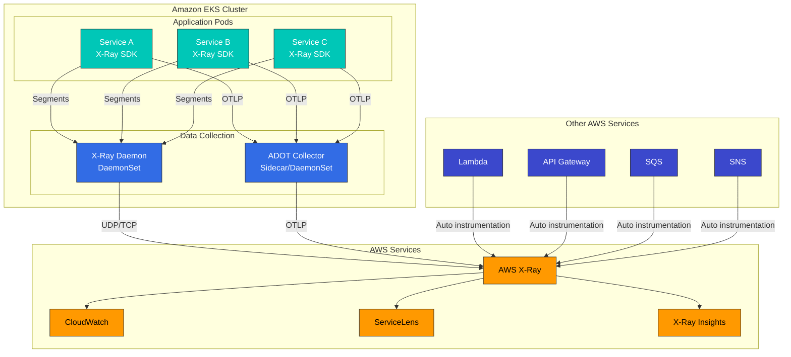

# AWS X-Ray

> **Last Updated**: February 2025

## Introduction

AWS X-Ray is an AWS native service for tracing and analyzing requests in distributed applications. Using X-Ray in EKS environments allows you to visualize request flow between microservices, identify performance bottlenecks, and determine root causes of errors.

## Key Features

| Feature | Description |
|---------|-------------|
| **Service Map** | Automatic visualization of service dependencies |
| **Request Tracing** | End-to-end request path tracking |
| **Analysis Tools** | Response time distribution, error rate analysis |
| **AWS Integration** | Native support for Lambda, API Gateway, ECS, EKS |
| **Sampling Rules** | Centralized sampling configuration |
| **Groups and Alerts** | Filter-based grouping and CloudWatch alerts |

## Architecture



## X-Ray Daemon Deployment

### Deploy as DaemonSet

```yaml
# xray-daemon.yaml
apiVersion: v1
kind: ServiceAccount
metadata:
  name: xray-daemon
  namespace: amazon-cloudwatch
  annotations:
    eks.amazonaws.com/role-arn: arn:aws:iam::123456789012:role/xray-daemon-role
---
apiVersion: apps/v1
kind: DaemonSet
metadata:
  name: xray-daemon
  namespace: amazon-cloudwatch
spec:
  selector:
    matchLabels:
      app: xray-daemon
  updateStrategy:
    type: RollingUpdate
  template:
    metadata:
      labels:
        app: xray-daemon
    spec:
      serviceAccountName: xray-daemon
      containers:
        - name: xray-daemon
          image: public.ecr.aws/xray/aws-xray-daemon:3.3.7
          command:
            - /usr/bin/xray
            - --bind=0.0.0.0:2000
            - --bind-tcp=0.0.0.0:2000
            - --region=ap-northeast-2
            - --log-level=info
          ports:
            - name: xray-udp
              containerPort: 2000
              hostPort: 2000
              protocol: UDP
            - name: xray-tcp
              containerPort: 2000
              hostPort: 2000
              protocol: TCP
          resources:
            requests:
              cpu: 50m
              memory: 64Mi
            limits:
              cpu: 100m
              memory: 128Mi
          env:
            - name: AWS_REGION
              value: ap-northeast-2
      tolerations:
        - key: node-role.kubernetes.io/master
          effect: NoSchedule
---
apiVersion: v1
kind: Service
metadata:
  name: xray-daemon
  namespace: amazon-cloudwatch
spec:
  selector:
    app: xray-daemon
  ports:
    - name: xray-udp
      port: 2000
      protocol: UDP
    - name: xray-tcp
      port: 2000
      protocol: TCP
  clusterIP: None
```

### IRSA Configuration

```yaml
# IAM Policy for X-Ray
# xray-policy.json
{
  "Version": "2012-10-17",
  "Statement": [
    {
      "Effect": "Allow",
      "Action": [
        "xray:PutTraceSegments",
        "xray:PutTelemetryRecords",
        "xray:GetSamplingRules",
        "xray:GetSamplingTargets",
        "xray:GetSamplingStatisticSummaries"
      ],
      "Resource": "*"
    }
  ]
}
```

```bash
# Create IRSA role
eksctl create iamserviceaccount \
  --name xray-daemon \
  --namespace amazon-cloudwatch \
  --cluster my-cluster \
  --attach-policy-arn arn:aws:iam::aws:policy/AWSXRayDaemonWriteAccess \
  --approve \
  --override-existing-serviceaccounts
```

## ADOT Collector Deployment

X-Ray integration using AWS Distro for OpenTelemetry (ADOT):

### ADOT Collector DaemonSet

```yaml
# adot-collector.yaml
apiVersion: v1
kind: ConfigMap
metadata:
  name: adot-collector-config
  namespace: amazon-cloudwatch
data:
  collector.yaml: |
    receivers:
      otlp:
        protocols:
          grpc:
            endpoint: 0.0.0.0:4317
          http:
            endpoint: 0.0.0.0:4318
      # X-Ray SDK compatibility
      awsxray:
        endpoint: 0.0.0.0:2000
        transport: udp
      # Prometheus metrics (optional)
      prometheus:
        config:
          scrape_configs:
            - job_name: 'otel-collector'
              scrape_interval: 10s
              static_configs:
                - targets: ['localhost:8888']

    processors:
      batch:
        timeout: 5s
        send_batch_size: 256

      memory_limiter:
        limit_mib: 512
        spike_limit_mib: 128
        check_interval: 5s

      # Add resource attributes
      resource:
        attributes:
          - key: cloud.provider
            value: aws
            action: upsert
          - key: k8s.cluster.name
            from_attribute: CLUSTER_NAME
            action: upsert

      # AWS attribute detection
      resourcedetection:
        detectors: [env, eks, ec2]
        timeout: 2s
        override: false

    exporters:
      awsxray:
        region: ap-northeast-2
        index_all_attributes: true
        indexed_attributes:
          - otel.resource.service.name
          - otel.resource.service.namespace
          - aws.local.service

      # CloudWatch Logs (trace logs)
      awscloudwatchlogs:
        log_group_name: "/aws/xray/traces"
        log_stream_name: "otel-traces"
        region: ap-northeast-2

      # Prometheus Remote Write (optional)
      prometheusremotewrite:
        endpoint: http://prometheus:9090/api/v1/write

    extensions:
      health_check:
        endpoint: 0.0.0.0:13133
      pprof:
        endpoint: 0.0.0.0:1777

    service:
      extensions: [health_check, pprof]
      pipelines:
        traces:
          receivers: [otlp, awsxray]
          processors: [memory_limiter, resourcedetection, resource, batch]
          exporters: [awsxray]
        metrics:
          receivers: [otlp, prometheus]
          processors: [memory_limiter, batch]
          exporters: [prometheusremotewrite]
---
apiVersion: apps/v1
kind: DaemonSet
metadata:
  name: adot-collector
  namespace: amazon-cloudwatch
spec:
  selector:
    matchLabels:
      app: adot-collector
  template:
    metadata:
      labels:
        app: adot-collector
    spec:
      serviceAccountName: adot-collector
      containers:
        - name: collector
          image: public.ecr.aws/aws-observability/aws-otel-collector:v0.36.0
          command:
            - /awscollector
            - --config=/conf/collector.yaml
          ports:
            - containerPort: 4317  # OTLP gRPC
              hostPort: 4317
              protocol: TCP
            - containerPort: 4318  # OTLP HTTP
              hostPort: 4318
              protocol: TCP
            - containerPort: 2000  # X-Ray
              hostPort: 2000
              protocol: UDP
            - containerPort: 13133 # Health check
              protocol: TCP
          env:
            - name: CLUSTER_NAME
              value: my-eks-cluster
            - name: AWS_REGION
              value: ap-northeast-2
          resources:
            requests:
              cpu: 100m
              memory: 256Mi
            limits:
              cpu: 500m
              memory: 512Mi
          volumeMounts:
            - name: config
              mountPath: /conf
          livenessProbe:
            httpGet:
              path: /
              port: 13133
            initialDelaySeconds: 15
            periodSeconds: 10
          readinessProbe:
            httpGet:
              path: /
              port: 13133
            initialDelaySeconds: 5
            periodSeconds: 10
      volumes:
        - name: config
          configMap:
            name: adot-collector-config
---
apiVersion: v1
kind: Service
metadata:
  name: adot-collector
  namespace: amazon-cloudwatch
spec:
  selector:
    app: adot-collector
  ports:
    - name: otlp-grpc
      port: 4317
      protocol: TCP
    - name: otlp-http
      port: 4318
      protocol: TCP
    - name: xray
      port: 2000
      protocol: UDP
```

## Sampling Rules

### Centralized Sampling Configuration

```bash
# Create sampling rule
aws xray create-sampling-rule --cli-input-json '{
  "SamplingRule": {
    "RuleName": "production-api",
    "Priority": 1000,
    "FixedRate": 0.05,
    "ReservoirSize": 10,
    "ServiceName": "*",
    "ServiceType": "*",
    "Host": "*",
    "HTTPMethod": "*",
    "URLPath": "/api/*",
    "Version": 1,
    "Attributes": {}
  }
}'

# 100% sampling for error requests
aws xray create-sampling-rule --cli-input-json '{
  "SamplingRule": {
    "RuleName": "error-requests",
    "Priority": 100,
    "FixedRate": 1.0,
    "ReservoirSize": 50,
    "ServiceName": "*",
    "ServiceType": "*",
    "Host": "*",
    "HTTPMethod": "*",
    "URLPath": "*",
    "Version": 1,
    "Attributes": {
      "http.status_code": "5*"
    }
  }
}'
```

### Filter Expression Examples

```bash
# Specific service calls
service("order-service")

# HTTP status code filter
http.status >= 400

# Response time filter
responsetime > 2

# Annotation-based filter
annotation.user_id = "user123"

# Compound filter
service("api-gateway") AND responsetime > 1 AND NOT fault

# Edge filter (inter-service calls)
edge("api-gateway", "order-service")
```

## CloudWatch ServiceLens Integration

ServiceLens integrates X-Ray traces, CloudWatch metrics, and logs:

```yaml
# CloudWatch Agent configuration (EKS)
apiVersion: v1
kind: ConfigMap
metadata:
  name: cloudwatch-agent-config
  namespace: amazon-cloudwatch
data:
  cwagentconfig.json: |
    {
      "logs": {
        "metrics_collected": {
          "kubernetes": {
            "cluster_name": "my-eks-cluster",
            "metrics_collection_interval": 60
          }
        },
        "force_flush_interval": 5
      },
      "traces": {
        "traces_collected": {
          "xray": {
            "tcp_proxy": {
              "bind_address": "0.0.0.0:2000"
            }
          },
          "otlp": {
            "grpc_endpoint": "0.0.0.0:4317"
          }
        }
      }
    }
```

## Groups and Filters

### Create X-Ray Groups

```bash
# Production services group
aws xray create-group \
  --group-name "production-services" \
  --filter-expression 'annotation.environment = "production"'

# Error requests group
aws xray create-group \
  --group-name "error-traces" \
  --filter-expression 'fault = true OR error = true'

# Slow requests group
aws xray create-group \
  --group-name "slow-requests" \
  --filter-expression 'responsetime > 1'

# Specific service group
aws xray create-group \
  --group-name "payment-traces" \
  --filter-expression 'service("payment-service")'
```

## Best Practices

### 1. Segment and Subsegment Design

```java
// Good example: Meaningful subsegments
try (Segment segment = AWSXRay.beginSegment("ProcessOrder")) {
    segment.putAnnotation("order_id", orderId);
    segment.putAnnotation("customer_id", customerId);

    // Database call
    try (Subsegment dbSubsegment = AWSXRay.beginSubsegment("DynamoDB-GetOrder")) {
        dbSubsegment.putMetadata("query", "GetItem");
        Order order = dynamoDb.getItem(orderId);
    }

    // External API call
    try (Subsegment apiSubsegment = AWSXRay.beginSubsegment("PaymentAPI-Charge")) {
        apiSubsegment.putAnnotation("payment_method", "credit_card");
        PaymentResult result = paymentService.charge(order);
    }

    // Async operation
    try (Subsegment sqsSubsegment = AWSXRay.beginSubsegment("SQS-SendNotification")) {
        sqsSubsegment.setNamespace("aws");
        sqs.sendMessage(notificationQueue, message);
    }
}
```

### 2. Using Annotations and Metadata

```java
// Annotation: Indexed, filterable (limit: 50)
segment.putAnnotation("environment", "production");
segment.putAnnotation("user_tier", "premium");
segment.putAnnotation("feature_flag", "new_checkout");

// Metadata: Not indexed, store detailed info
segment.putMetadata("request", requestBody);
segment.putMetadata("response", responseBody);
segment.putMetadata("database", Map.of(
    "query", sqlQuery,
    "parameters", queryParams,
    "rows_affected", rowCount
));
```

### 3. Cost Optimization

```yaml
# Cost reduction through sampling
sampling:
  # Default 5% sampling
  default:
    fixed_rate: 0.05
    reservoir_size: 10

  # 100% sampling for errors
  errors:
    fixed_rate: 1.0
    reservoir_size: 50

  # Exclude health checks
  health_checks:
    fixed_rate: 0
    url_path: "/health*"
```

## Quiz

Test your knowledge with the [X-Ray Quiz](../../quizzes/observability/tracing/02-xray-quiz.md).
