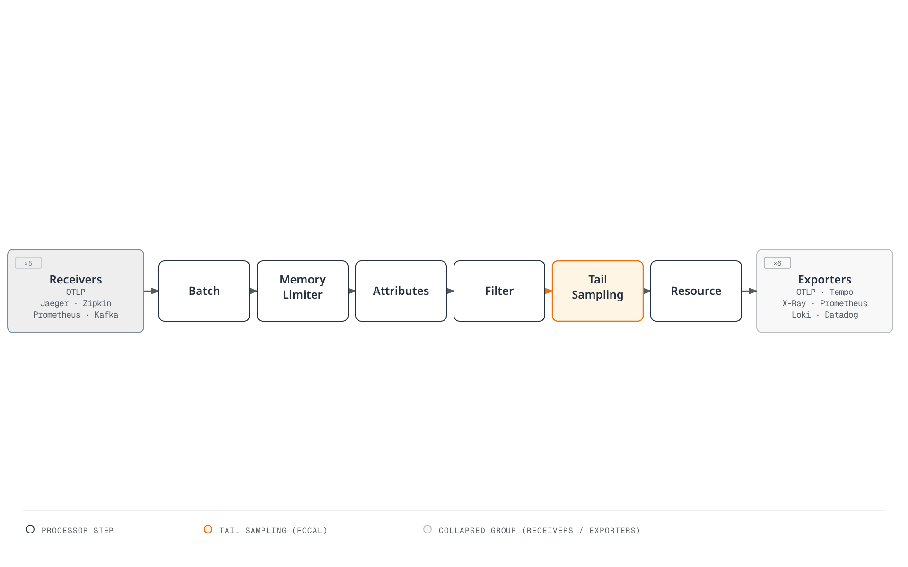
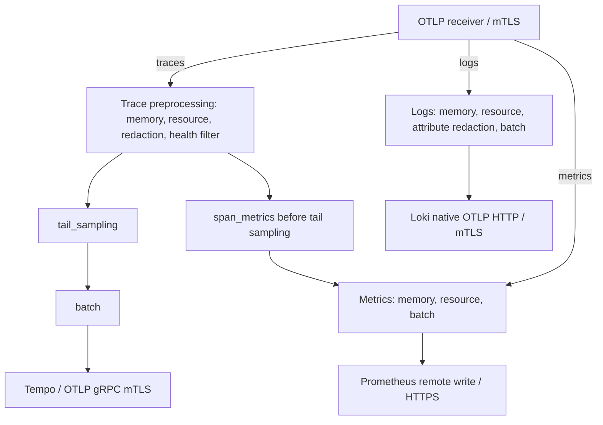

# OpenTelemetry

> **Review baseline**: Collector Contrib 0.160.0; Operator 0.158.0; language versions below
> **Last Updated**: September 13, 2026

## Introduction

OpenTelemetry (OTel) is an observability framework for cloud-native software. It provides vendor-neutral standards for generating, collecting, and managing three signals: Traces, Metrics, and Logs. The CNCF retrospective dated July 24, 2026 described it as second to Kubernetes in contribution velocity. Project maturity and individual SDK/component stability are separate.

### July 2026 Update: CNCF Graduation

OpenTelemetry achieved CNCF **graduated** status in **May 2026**; the July 24 article is a retrospective. This is the foundation's highest maturity level, also held by projects such as Kubernetes and Prometheus. Graduation signals that the project's governance, security practices, and adoption have been vetted for production use. The retrospective discusses GenAI semantic conventions, browser/mobile observability, schema governance and rollout tooling. See the CNCF blog post ["OpenTelemetry has graduated… Now what?"](https://www.cncf.io/blog/2026/07/24/opentelemetry-has-graduated-now-what/) for the background and roadmap.

## What is OpenTelemetry?

OpenTelemetry was born from the merger of OpenTracing and OpenCensus projects:


[🔍 View interactive diagram](https://www.atomai.click/kubernetes-docs/archmaps/en-observability-tracing-03-opentelemetry-0.html)

## Core Concepts

### Three Signals

This chapter focuses on traces, metrics and logs. Profiling is another evolving signal; support and stability vary by implementation. Trace/log IDs and metric exemplars require the appropriate instrumentation and backend configuration.

| Signal | Description | Use Cases |
|--------|-------------|-----------|
| **Traces** | Distributed request tracing | Latency analysis, dependency mapping |
| **Metrics** | Numeric measurements | Resource usage, SLI/SLO |
| **Logs** | Event records | Debugging, auditing |

### Core Components



[🔍 View interactive diagram](https://www.atomai.click/kubernetes-docs/archmaps/en-observability-tracing-03-opentelemetry-2.html)

The figure lists backend choices by signal. Only configured exporters are active; the base example below does not automatically enable every vendor.


## OpenTelemetry SDK

Collector, Operator, Java agent and language SDKs have independent version numbers. These Linux workload templates are checked against Kubernetes 1.35 schemas: the application images, namespaces, certificates and destination services must be prepared by their owners. The broader Operator matrix does not remove recipe-specific requirements such as native sidecars. Local checks do not establish a deployed EKS application.

| Component | Baseline and boundary |
|---|---|
| Standalone Collector Contrib | 0.160.0; components and schemas checked with its real binary |
| Operator | 0.158.0; its compatibility table lists Kubernetes 1.25–1.36 and cert-manager v1 |
| Java agent | 2.31.1, targeting SDK 1.65.0; not the same version as the Operator's default Java image |
| Python | SDK/exporter 1.44.0 and instrumentation/distro 0.65b0; Python ≥3.10 |
| Node.js CommonJS example | SDK-node 0.220.0, auto-instrumentations-node 0.78.0, resources 2.9.0, API 1.9.1 |

The Operator defaults to Collector 0.158.0. The standalone 0.160.0 workloads below are not an Operator-managed Collector upgrade. Check the intersection with supported EKS versions; the newest Kubernetes release is not automatically inside the Operator matrix.

### Auto-instrumentation

As of September 13, 2026, the EKS lifecycle page lists 1.34, 1.35 and 1.36 in standard support. The 1.35 schema baseline falls within that list and the Operator matrix; this still does not replace live platform/add-on acceptance checks.

Zero-code instrumentation hooks supported libraries; it does not discover arbitrary business operations. Choose either a directly prepared agent/launcher or Operator injection for a process. Do not initialize a second SDK over an already configured provider. The following application images are placeholders for your own builds, including their startup commands and dependencies.

Prepare an `ecommerce` namespace and an `otel-client-tls` Secret there containing `ca.crt`, `tls.crt` and `tls.key`. The client certificate must be accepted by the Collector, whose certificate must match `otel-collector.otel.svc.cluster.local`. Secret files are mounted read-only; adapt UID/GID access to your image. Only certificate **paths**, not key contents or bearer tokens, appear in environment variables. These templates use OTLP HTTP/protobuf on TLS port 4318.

#### Java Auto-instrumentation

Download the pinned agent into your application build and verify the release asset checksum. The 2.31.1 JAR is 25,107,554 bytes, exceeding Kubernetes' 1 MiB ConfigMap limit. Include it in the image or use Operator injection; a ConfigMap is not an agent-binary distribution mechanism.


```bash
curl --fail --location --output opentelemetry-javaagent.jar \
  https://github.com/open-telemetry/opentelemetry-java-instrumentation/releases/download/v2.31.1/opentelemetry-javaagent.jar
printf '%s  %s\n' \
  bbf83c151b6400709e2f225bdd07a04f839d9d13b8b93464241333fd25d3e3ba \
  opentelemetry-javaagent.jar | sha256sum --check -
```

```dockerfile
# Add to the application's existing Dockerfile; not a complete image build.
COPY opentelemetry-javaagent.jar /opt/otel/opentelemetry-javaagent.jar
```
Merge the agent option with any existing `JAVA_TOOL_OPTIONS`; do not discard application JVM options. The Deployment selector and Pod labels must match.


```yaml
apiVersion: apps/v1
kind: Deployment
metadata:
  name: order-service
  namespace: ecommerce
spec:
  replicas: 1
  selector:
    matchLabels:
      app: order-service
  template:
    metadata:
      labels:
        app: order-service
    spec:
      automountServiceAccountToken: false
      securityContext:
        fsGroup: 10001
      containers:
      - name: app
        image: registry.example.com/order-service:otel-demo
        env:
        - name: OTEL_SERVICE_NAME
          value: order-service
        - name: OTEL_RESOURCE_ATTRIBUTES
          value: service.namespace=ecommerce,deployment.environment.name=demo
        - name: OTEL_EXPORTER_OTLP_ENDPOINT
          value: https://otel-collector.otel.svc.cluster.local:4318
        - name: OTEL_EXPORTER_OTLP_PROTOCOL
          value: http/protobuf
        - name: OTEL_EXPORTER_OTLP_CERTIFICATE
          value: /var/run/otel-client/ca.crt
        - name: OTEL_EXPORTER_OTLP_CLIENT_CERTIFICATE
          value: /var/run/otel-client/tls.crt
        - name: OTEL_EXPORTER_OTLP_CLIENT_KEY
          value: /var/run/otel-client/tls.key
        - name: OTEL_TRACES_EXPORTER
          value: otlp
        - name: OTEL_METRICS_EXPORTER
          value: otlp
        - name: OTEL_LOGS_EXPORTER
          value: none
        - name: OTEL_TRACES_SAMPLER
          value: parentbased_always_on
        - name: OTEL_METRIC_EXPORT_INTERVAL
          value: '60000'
        - name: JAVA_TOOL_OPTIONS
          value: -javaagent:/opt/otel/opentelemetry-javaagent.jar
        volumeMounts:
        - name: otel-client-tls
          mountPath: /var/run/otel-client
          readOnly: true
      volumes:
      - name: otel-client-tls
        secret:
          secretName: otel-client-tls
          defaultMode: 288
```
#### Python Auto-instrumentation

For a Flask application, install matching packages in its build environment and lock the resolved application dependencies. Other frameworks need their matching instrumentation package. This example selects the HTTP exporter explicitly, rather than sending the Python HTTP default to gRPC port 4317.


```bash
python -m pip install \
  opentelemetry-api==1.44.0 opentelemetry-sdk==1.44.0 \
  opentelemetry-distro==0.65b0 \
  opentelemetry-instrumentation-flask==0.65b0 \
  opentelemetry-exporter-otlp-proto-http==1.44.0
```

```yaml
apiVersion: apps/v1
kind: Deployment
metadata:
  name: payment-service
  namespace: ecommerce
spec:
  replicas: 1
  selector:
    matchLabels:
      app: payment-service
  template:
    metadata:
      labels:
        app: payment-service
    spec:
      automountServiceAccountToken: false
      securityContext:
        fsGroup: 10001
      containers:
      - name: app
        image: registry.example.com/payment-service:otel-demo
        env:
        - name: OTEL_SERVICE_NAME
          value: payment-service
        - name: OTEL_RESOURCE_ATTRIBUTES
          value: service.namespace=ecommerce,deployment.environment.name=demo
        - name: OTEL_EXPORTER_OTLP_ENDPOINT
          value: https://otel-collector.otel.svc.cluster.local:4318
        - name: OTEL_EXPORTER_OTLP_PROTOCOL
          value: http/protobuf
        - name: OTEL_EXPORTER_OTLP_CERTIFICATE
          value: /var/run/otel-client/ca.crt
        - name: OTEL_EXPORTER_OTLP_CLIENT_CERTIFICATE
          value: /var/run/otel-client/tls.crt
        - name: OTEL_EXPORTER_OTLP_CLIENT_KEY
          value: /var/run/otel-client/tls.key
        - name: OTEL_TRACES_EXPORTER
          value: otlp
        - name: OTEL_METRICS_EXPORTER
          value: otlp
        - name: OTEL_LOGS_EXPORTER
          value: none
        - name: OTEL_TRACES_SAMPLER
          value: parentbased_always_on
        - name: OTEL_METRIC_EXPORT_INTERVAL
          value: '60000'
        volumeMounts:
        - name: otel-client-tls
          mountPath: /var/run/otel-client
          readOnly: true
        command:
        - opentelemetry-instrument
        - python
        - app.py
      volumes:
      - name: otel-client-tls
        secret:
          secretName: otel-client-tls
          defaultMode: 288
```
#### Node.js Auto-instrumentation


```bash
npm install --save-exact \
  @opentelemetry/api@1.9.1 @opentelemetry/resources@2.9.0 \
  @opentelemetry/sdk-node@0.220.0 \
  @opentelemetry/auto-instrumentations-node@0.78.0
# Commit package-lock.json and use npm ci for subsequent application builds.
```
Save as `tracing.cjs`, loaded before application/framework modules. This is a CommonJS example; ESM loading needs the language guide's separate setup. The SDK reads the explicit OTEL exporter/TLS environment below. For programmatic metric readers, current configuration uses `metricReaders`, replacing the deprecated singular option. Integrate `shutdownTelemetry()` after the application's own request-draining step.


```javascript
// Load before application/framework modules in a CommonJS application.
const { NodeSDK } = require('@opentelemetry/sdk-node');
const { envDetector } = require('@opentelemetry/resources');
const { getNodeAutoInstrumentations } = require('@opentelemetry/auto-instrumentations-node');

const sdk = new NodeSDK({
  resourceDetectors: [envDetector],
  instrumentations: [
    getNodeAutoInstrumentations({
      '@opentelemetry/instrumentation-fs': { enabled: false },
      '@opentelemetry/instrumentation-http': {
        ignoreIncomingRequestHook: (request) =>
          String(request.url || '').split('?')[0] === '/health',
      },
    }),
  ],
});

// OTEL_* variables configure exporters, protocol, TLS and metric interval.
sdk.start();

// Call after the application's own request-draining step on shutdown.
module.exports = { shutdownTelemetry: () => sdk.shutdown() };
```

```yaml
apiVersion: apps/v1
kind: Deployment
metadata:
  name: notification-service
  namespace: ecommerce
spec:
  replicas: 1
  selector:
    matchLabels:
      app: notification-service
  template:
    metadata:
      labels:
        app: notification-service
    spec:
      automountServiceAccountToken: false
      securityContext:
        fsGroup: 10001
      containers:
      - name: app
        image: registry.example.com/notification-service:otel-demo
        env:
        - name: OTEL_SERVICE_NAME
          value: notification-service
        - name: OTEL_RESOURCE_ATTRIBUTES
          value: service.namespace=ecommerce,deployment.environment.name=demo
        - name: OTEL_EXPORTER_OTLP_ENDPOINT
          value: https://otel-collector.otel.svc.cluster.local:4318
        - name: OTEL_EXPORTER_OTLP_PROTOCOL
          value: http/protobuf
        - name: OTEL_EXPORTER_OTLP_CERTIFICATE
          value: /var/run/otel-client/ca.crt
        - name: OTEL_EXPORTER_OTLP_CLIENT_CERTIFICATE
          value: /var/run/otel-client/tls.crt
        - name: OTEL_EXPORTER_OTLP_CLIENT_KEY
          value: /var/run/otel-client/tls.key
        - name: OTEL_TRACES_EXPORTER
          value: otlp
        - name: OTEL_METRICS_EXPORTER
          value: otlp
        - name: OTEL_LOGS_EXPORTER
          value: none
        - name: OTEL_TRACES_SAMPLER
          value: parentbased_always_on
        - name: OTEL_METRIC_EXPORT_INTERVAL
          value: '60000'
        volumeMounts:
        - name: otel-client-tls
          mountPath: /var/run/otel-client
          readOnly: true
        command:
        - node
        - --require
        - ./tracing.cjs
        - app.cjs
      volumes:
      - name: otel-client-tls
        secret:
          secretName: otel-client-tls
          defaultMode: 288
```
These examples set `OTEL_LOGS_EXPORTER=none` deliberately. Enabling a log exporter does not tail application stdout: install the appropriate logging bridge/handler or a log collector, and review payload exposure first. The `parentbased_always_on` sampler still respects an unsampled parent. If you choose 10% head sampling instead, the tail Collector cannot recover the discarded spans.

### Manual Instrumentation

Reuse the OpenTelemetry instance/provider initialized by the agent or application. Without an SDK provider, API calls can be no-ops. These business-workflow spans are INTERNAL: instrumented HTTP/database clients create their own CLIENT spans and propagate context. Manually creating a CLIENT span alone neither sends a request nor injects trace context.

#### Java Manual Instrumentation

The application supplies the inventory/payment callbacks. No order/customer IDs, amounts, transaction IDs or raw exception messages are recorded. These are application operations, not a payment-service implementation or a tested Spring deployment.


```java
import io.opentelemetry.api.OpenTelemetry;
import io.opentelemetry.api.trace.Span;
import io.opentelemetry.api.trace.SpanKind;
import io.opentelemetry.api.trace.StatusCode;
import io.opentelemetry.api.trace.Tracer;
import io.opentelemetry.context.Scope;

public final class OrderTelemetry {
    private final Tracer tracer;

    public OrderTelemetry(OpenTelemetry telemetry) {
        this.tracer = telemetry.getTracer("example.order-workflow", "1.0.0");
    }

    public void processOrder(Runnable validateInventory, Runnable processPayment) {
        Span parent = tracer.spanBuilder("processOrder")
                .setSpanKind(SpanKind.INTERNAL).startSpan();
        try (Scope ignored = parent.makeCurrent()) {
            parent.addEvent("validation.started");
            child("checkInventory", validateInventory);
            child("processPayment", processPayment);
            parent.addEvent("processing.completed");
        } catch (RuntimeException error) {
            parent.setStatus(StatusCode.ERROR);
            parent.setAttribute("error.type", error.getClass().getName());
            throw error;
        } finally {
            parent.end();
        }
    }

    private void child(String name, Runnable operation) {
        Span span = tracer.spanBuilder(name).setSpanKind(SpanKind.INTERNAL).startSpan();
        try (Scope ignored = span.makeCurrent()) {
            operation.run();
        } catch (RuntimeException error) {
            span.setStatus(StatusCode.ERROR);
            span.setAttribute("error.type", error.getClass().getName());
            throw error;
        } finally {
            span.end();
        }
    }
}
```
#### Python Manual Instrumentation

The synchronous decorator preserves results and errors while ending nested spans. It records only error type, avoiding duplicate raw exception events. An async function requires an async-aware wrapper. Supply your own parameterized database lookup, validation, persistence and event-publishing callbacks; local validation used synthetic callbacks and an in-memory exporter.


```python
"""Manual spans for synchronous application callbacks; no database is created."""
from functools import wraps
from contextlib import contextmanager
from opentelemetry import trace
from opentelemetry.trace import SpanKind, Status, StatusCode

# Reuse the SDK provider initialized by auto-instrumentation or the application.
tracer = trace.get_tracer("example.user-workflow", "1.0.0")

@contextmanager
def operation(name):
    with tracer.start_as_current_span(
        name, kind=SpanKind.INTERNAL,
        record_exception=False, set_status_on_exception=False,
    ) as span:
        try:
            yield span
        except Exception as error:
            span.set_status(Status(StatusCode.ERROR))
            span.set_attribute("error.type", type(error).__name__)
            raise

def traced(name):
    def decorate(function):
        @wraps(function)
        def wrapped(*args, **kwargs):
            with operation(name):
                return function(*args, **kwargs)
        return wrapped
    return decorate

@traced("get_user")
def get_user(user_id, lookup):
    # lookup is supplied by the application, with parameterized queries.
    # The ID and SQL text are not added to telemetry.
    with operation("lookup_user"):
        result = lookup(user_id)
    trace.get_current_span().set_attribute("app.user.found", result is not None)
    return result

@traced("create_user")
def create_user(user_data, validate, save, publish):
    # These callbacks are the application's own implementations.
    with operation("validate_user_data"):
        validate(user_data)
    with operation("save_user"):
        result = save(user_data)
    with operation("publish_user_event"):
        publish(result)
    return result
```
For real database/message instrumentation, follow the implemented convention version, such as `db.system.name`, `db.operation.name` and `messaging.destination.name`. Do not copy user IDs into SQL telemetry strings or use raw queries as metric labels. The business callbacks above are not proof of PostgreSQL or Kafka execution.

## OTEL Collector

### Architecture




Signal routes for the configuration below. The trace-preprocessing box summarizes equivalent processing in two separate trace pipelines. Span metrics branch before tail sampling; incoming metrics and logs use their own pipelines.

### Collector Configuration

Save as `otel-collector-config.yaml`. This is a single active stateful sampling/aggregation instance for a lab, not an HA/capacity guarantee. A separate trace pipeline derives metrics **before tail sampling**. Head-sampled or filtered spans are still absent from those metrics. These counters count observed spans, not unique end-user requests; select suitable span kinds and bounded dimensions for request SLIs. Cumulative span-metric counters initially export zero in 0.160.0; evaluate subsequent flushes before interpreting the first value as no traffic.

Prepare OTLP-enabled Tempo, a Prometheus-compatible remote-write receiver and Loki's native OTLP ingestion, with operator-provided TLS/authentication gateways. Example gateway names below are not services created by this guide. Prometheus needs its remote-write receiver enabled (`--web.enable-remote-write-receiver` when using Prometheus itself). Loki's exporter base ends in `/otlp`; the HTTP exporter appends `/v1/logs`. Configure Loki structured metadata and the trusted tenant mapping as needed; a tenant header is not authentication.

The environment variables identify existing certificates and endpoints. All configured receivers use mutual TLS; no wildcard browser CORS or public profiling endpoint is enabled. The named attribute deletions are limited controls, not complete redaction of log bodies, span events, resource attributes or arbitrary payloads. Minimize data at the SDK as well.


```yaml
# otel-collector-config.yaml
receivers:
  otlp:
    protocols:
      grpc:
        endpoint: 0.0.0.0:4317
        max_recv_msg_size_mib: 16
        tls:
          cert_file: ${env:OTEL_SERVER_CERT}
          key_file: ${env:OTEL_SERVER_KEY}
          client_ca_file: ${env:OTEL_CLIENT_CA}
      http:
        endpoint: 0.0.0.0:4318
        tls:
          cert_file: ${env:OTEL_SERVER_CERT}
          key_file: ${env:OTEL_SERVER_KEY}
          client_ca_file: ${env:OTEL_CLIENT_CA}

processors:
  memory_limiter:
    check_interval: 1s
    limit_mib: 384
    spike_limit_mib: 96
  resource/cluster:
    attributes:
      - key: k8s.cluster.name
        value: ${env:K8S_CLUSTER_NAME}
        action: insert
  attributes/redact:
    actions:
      - key: http.request.header.authorization
        action: delete
      - key: user.email
        action: delete
      - key: user.id
        action: delete
      - key: customer.id
        action: delete
      - key: db.statement
        action: delete
      - key: db.query.text
        action: delete
  filter/health:
    error_mode: propagate
    traces:
      span:
        - 'attributes["http.route"] == "/health"'
        - 'attributes["http.route"] == "/ready"'
        - 'attributes["http.route"] == "/metrics"'
  tail_sampling:
    decision_wait: 10s
    num_traces: 10000
    expected_new_traces_per_sec: 100
    policies:
      - name: errors
        type: status_code
        status_code:
          status_codes: [ERROR]
      - name: slow
        type: latency
        latency:
          threshold_ms: 1000
      - name: selected-services
        type: string_attribute
        string_attribute:
          key: service.name
          values: [payment-service, order-service]
      - name: baseline
        type: probabilistic
        probabilistic:
          sampling_percentage: 10
  batch:
    timeout: 5s
    send_batch_size: 512
    send_batch_max_size: 1024

connectors:
  span_metrics:
    histogram:
      unit: s
      explicit:
        buckets: [5ms, 10ms, 25ms, 50ms, 100ms, 250ms, 500ms, 1s, 2s, 5s]
    dimensions:
      - name: http.request.method
      - name: http.response.status_code
    aggregation_cardinality_limit: 1000
    metrics_flush_interval: 15s

exporters:
  otlp_grpc/tempo:
    endpoint: ${env:TEMPO_OTLP_GRPC_ENDPOINT}
    tls:
      ca_file: ${env:BACKEND_CA}
      cert_file: ${env:BACKEND_CLIENT_CERT}
      key_file: ${env:BACKEND_CLIENT_KEY}
  prometheus_remote_write:
    endpoint: ${env:PROMETHEUS_REMOTE_WRITE_ENDPOINT}
    tls:
      ca_file: ${env:BACKEND_CA}
      cert_file: ${env:BACKEND_CLIENT_CERT}
      key_file: ${env:BACKEND_CLIENT_KEY}
  otlp_http/loki:
    endpoint: ${env:LOKI_OTLP_HTTP_ENDPOINT}
    tls:
      ca_file: ${env:BACKEND_CA}
      cert_file: ${env:BACKEND_CLIENT_CERT}
      key_file: ${env:BACKEND_CLIENT_KEY}

extensions:
  health_check:
    endpoint: 0.0.0.0:13133
    path: /health

service:
  extensions: [health_check]
  pipelines:
    traces:
      receivers: [otlp]
      processors: [memory_limiter, resource/cluster, attributes/redact, filter/health, tail_sampling, batch]
      exporters: [otlp_grpc/tempo]
    traces/span-metrics:
      receivers: [otlp]
      processors: [memory_limiter, resource/cluster, attributes/redact, filter/health]
      exporters: [span_metrics]
    metrics:
      receivers: [otlp, span_metrics]
      processors: [memory_limiter, resource/cluster, batch]
      exporters: [prometheus_remote_write]
    logs:
      receivers: [otlp]
      processors: [memory_limiter, resource/cluster, attributes/redact, batch]
      exporters: [otlp_http/loki]
  telemetry:
    logs:
      level: info
      encoding: json
    metrics:
      readers:
        - pull:
            exporter:
              prometheus:
                host: 127.0.0.1
                port: 8888
```
The positive sampling policies are OR conditions, not an ordered priority ladder. Selected services can be retained independently of the baseline probability. Latency uses a strict `>1000 ms` comparison. Timer-based decisions do not prove trace completion, and the health filter deliberately removes matching spans even if they have errors; filtering individual spans can leave partial traces.

The hard memory limit is 384 MiB and the soft limit is 288 MiB, leaving headroom below the 512 MiB container limit in the template. Refusal, retries, queues and bursts still need measurement. Batch/trace/cardinality limits here are demonstration settings, not benchmark results.

### Single-instance workload and configuration

Prepare the `otel` namespace and the `otel-ingest-tls` / `otel-backend-tls` Secrets with `tls.crt`, `tls.key`, `ca.crt`. Use certificate SANs matching the relevant Service/gateway names, a suitable trust bundle and certificates with the correct server/client usages. Adapt the 10001 UID/GID file access. The configuration map contains text configuration, not private keys. `Recreate` avoids normal rolling-surge overlap for this single-instance sampler, at the cost of downtime; it does not preserve in-memory traces over restarts.


```bash
: "${KUBE_CONTEXT:?Set the reviewed cluster context}"
kubectl --context "$KUBE_CONTEXT" -n otel create configmap otel-collector-config \
  --from-file=otel-collector-config.yaml --dry-run=client -o yaml > otel-collector-configmap.yaml
# Inspect the namespace, Secrets, endpoints and workloads before any real apply.
```

```yaml
apiVersion: v1
kind: ServiceAccount
metadata:
  name: otel-collector
  namespace: otel
automountServiceAccountToken: false
---
apiVersion: apps/v1
kind: Deployment
metadata:
  name: otel-collector
  namespace: otel
spec:
  selector:
    matchLabels:
      app: otel-collector
  template:
    metadata:
      labels:
        app: otel-collector
    spec:
      serviceAccountName: otel-collector
      automountServiceAccountToken: false
      nodeSelector:
        kubernetes.io/os: linux
      securityContext:
        runAsNonRoot: true
        runAsUser: 10001
        fsGroup: 10001
        seccompProfile:
          type: RuntimeDefault
      containers:
      - name: collector
        image: otel/opentelemetry-collector-contrib:0.160.0
        args:
        - --config=/conf/otel-collector-config.yaml
        env:
        - name: GOMEMLIMIT
          value: 384MiB
        - name: OTEL_SERVER_CERT
          value: /var/run/otel/ingest/tls.crt
        - name: OTEL_SERVER_KEY
          value: /var/run/otel/ingest/tls.key
        - name: OTEL_CLIENT_CA
          value: /var/run/otel/ingest/ca.crt
        - name: BACKEND_CA
          value: /var/run/otel/backend/ca.crt
        - name: BACKEND_CLIENT_CERT
          value: /var/run/otel/backend/tls.crt
        - name: BACKEND_CLIENT_KEY
          value: /var/run/otel/backend/tls.key
        - name: OTEL_UPSTREAM_ENDPOINT
          value: otel-collector.otel.svc.cluster.local:4317
        - name: K8S_CLUSTER_NAME
          value: REPLACE_WITH_CLUSTER_NAME
        - name: TEMPO_OTLP_GRPC_ENDPOINT
          value: tempo-gateway.tempo.svc.cluster.local:4317
        - name: PROMETHEUS_REMOTE_WRITE_ENDPOINT
          value: https://prometheus-gateway.monitoring.svc.cluster.local/api/v1/write
        - name: LOKI_OTLP_HTTP_ENDPOINT
          value: https://loki-gateway.loki.svc.cluster.local/otlp
        ports:
        - name: otlp-grpc
          containerPort: 4317
        - name: otlp-http
          containerPort: 4318
        resources:
          requests:
            cpu: 100m
            memory: 256Mi
          limits:
            cpu: 500m
            memory: 512Mi
        securityContext:
          allowPrivilegeEscalation: false
          readOnlyRootFilesystem: true
          capabilities:
            drop:
            - ALL
        volumeMounts:
        - name: config
          mountPath: /conf
          readOnly: true
        - name: ingest-tls
          mountPath: /var/run/otel/ingest
          readOnly: true
        - name: backend-tls
          mountPath: /var/run/otel/backend
          readOnly: true
        readinessProbe:
          httpGet:
            path: /health
            port: 13133
        livenessProbe:
          httpGet:
            path: /health
            port: 13133
          initialDelaySeconds: 15
      volumes:
      - name: config
        configMap:
          name: otel-collector-config
      - name: ingest-tls
        secret:
          secretName: otel-ingest-tls
          defaultMode: 288
      - name: backend-tls
        secret:
          secretName: otel-backend-tls
          defaultMode: 288
  replicas: 1
  strategy:
    type: Recreate
---
apiVersion: v1
kind: Service
metadata:
  name: otel-collector
  namespace: otel
spec:
  type: ClusterIP
  selector:
    app: otel-collector
  ports:
  - name: otlp-grpc
    port: 4317
    targetPort: otlp-grpc
  - name: otlp-http
    port: 4318
    targetPort: otlp-http
```
### Optional collection and enrichment

| Requirement | Separate configuration needed |
|---|---|
| Legacy Jaeger/Zipkin clients | Their receiver components remain available; enable only required protocols/ports and match receiver IDs in a pipeline. Export to Jaeger over OTLP, not the removed Jaeger exporter. |
| Collector self-metrics | `service.telemetry.metrics.readers` configures the current Prometheus reader. The old `address` field is removed. Scrape the loopback endpoint through a deliberately designed monitor path. |
| Kubernetes cluster metrics | Run one active `k8s_cluster` receiver, or configure its leader-elector extension. Supply API credentials and reviewed RBAC, then connect it to a metrics pipeline. The default tokenless workloads above do not provide those prerequisites. |
| Node/container logs or host metrics | Add the appropriate receiver, mounts and permissions; a DaemonSet alone does not collect them. |
| EC2/EKS resource detection | Configure the desired detector and its metadata/API access deliberately; do not replace the workload identity with the Collector host identity. |
| Span-derived metrics | Use the `span_metrics` connector, with an explicit duration unit and bounded dimensions. The old spanmetrics processor is removed. |

See the [collector guide](../logging/05-collectors.md) and [Kubernetes cluster receiver](https://github.com/open-telemetry/opentelemetry-collector-contrib/tree/v0.160.0/receiver/k8sclusterreceiver). Do not declare an unused receiver/processor and assume that it is active.

## EKS Deployment Patterns

These are alternative deployment patterns, not a stack to apply indiscriminately. A stateless relay forwards all three signals to the single sampling tier above. Keep tail sampling and span aggregation out of an arbitrarily load-balanced node/sidecar/HPA tier. Multiple sampling instances require trace-ID-aware routing and a plan for endpoint changes, in-flight traces, restarts and storage; a Service or HPA alone supplies none of that.

Save `otel-relay-config.yaml` and create `otel-relay-config` by the same client-side ConfigMap-generation procedure. The `OTEL_UPSTREAM_ENDPOINT` and client certificate identify the separately prepared upstream Collector. The relay is stateless with respect to sampling decisions; its in-memory batching/export queues still have failure and shutdown limits.


```yaml
receivers:
  otlp:
    protocols:
      grpc:
        endpoint: 0.0.0.0:4317
        max_recv_msg_size_mib: 16
        tls:
          cert_file: ${env:OTEL_SERVER_CERT}
          key_file: ${env:OTEL_SERVER_KEY}
          client_ca_file: ${env:OTEL_CLIENT_CA}
      http:
        endpoint: 0.0.0.0:4318
        tls:
          cert_file: ${env:OTEL_SERVER_CERT}
          key_file: ${env:OTEL_SERVER_KEY}
          client_ca_file: ${env:OTEL_CLIENT_CA}
processors:
  memory_limiter:
    check_interval: 1s
    limit_mib: 384
    spike_limit_mib: 96
  batch:
    timeout: 5s
    send_batch_size: 512
    send_batch_max_size: 1024
exporters:
  otlp_grpc/upstream:
    endpoint: ${env:OTEL_UPSTREAM_ENDPOINT}
    tls:
      ca_file: ${env:BACKEND_CA}
      cert_file: ${env:BACKEND_CLIENT_CERT}
      key_file: ${env:BACKEND_CLIENT_KEY}
extensions:
  health_check:
    endpoint: 0.0.0.0:13133
    path: /health
service:
  extensions:
  - health_check
  pipelines:
    traces:
      receivers:
      - otlp
      processors:
      - memory_limiter
      - batch
      exporters:
      - otlp_grpc/upstream
    metrics:
      receivers:
      - otlp
      processors:
      - memory_limiter
      - batch
      exporters:
      - otlp_grpc/upstream
    logs:
      receivers:
      - otlp
      processors:
      - memory_limiter
      - batch
      exporters:
      - otlp_grpc/upstream
  telemetry:
    logs:
      level: info
      encoding: json
    metrics:
      readers:
      - pull:
          exporter:
            prometheus:
              host: 127.0.0.1
              port: 8888
```
### DaemonSet Pattern

A DaemonSet runs on eligible Linux nodes, not EKS Fargate. Configure selectors/tolerations for approved nodes; there is no blanket toleration or hostPort reservation here. `internalTrafficPolicy: Local` routes this Service only to a ready endpoint on the caller's node and drops traffic if none exists. It is not a fallback mechanism for Fargate clients. Applications must explicitly send telemetry to this endpoint.


```yaml
apiVersion: apps/v1
kind: DaemonSet
metadata:
  name: otel-agent
  namespace: otel
spec:
  selector:
    matchLabels:
      app: otel-agent
  template:
    metadata:
      labels:
        app: otel-agent
    spec:
      serviceAccountName: otel-collector
      automountServiceAccountToken: false
      nodeSelector:
        kubernetes.io/os: linux
      securityContext:
        runAsNonRoot: true
        runAsUser: 10001
        fsGroup: 10001
        seccompProfile:
          type: RuntimeDefault
      containers:
      - name: collector
        image: otel/opentelemetry-collector-contrib:0.160.0
        args:
        - --config=/conf/otel-relay-config.yaml
        env:
        - name: GOMEMLIMIT
          value: 384MiB
        - name: OTEL_SERVER_CERT
          value: /var/run/otel/ingest/tls.crt
        - name: OTEL_SERVER_KEY
          value: /var/run/otel/ingest/tls.key
        - name: OTEL_CLIENT_CA
          value: /var/run/otel/ingest/ca.crt
        - name: BACKEND_CA
          value: /var/run/otel/backend/ca.crt
        - name: BACKEND_CLIENT_CERT
          value: /var/run/otel/backend/tls.crt
        - name: BACKEND_CLIENT_KEY
          value: /var/run/otel/backend/tls.key
        - name: OTEL_UPSTREAM_ENDPOINT
          value: otel-collector.otel.svc.cluster.local:4317
        ports:
        - name: otlp-grpc
          containerPort: 4317
        - name: otlp-http
          containerPort: 4318
        resources:
          requests:
            cpu: 100m
            memory: 256Mi
          limits:
            cpu: 500m
            memory: 512Mi
        securityContext:
          allowPrivilegeEscalation: false
          readOnlyRootFilesystem: true
          capabilities:
            drop:
            - ALL
        volumeMounts:
        - name: config
          mountPath: /conf
          readOnly: true
        - name: ingest-tls
          mountPath: /var/run/otel/ingest
          readOnly: true
        - name: backend-tls
          mountPath: /var/run/otel/backend
          readOnly: true
        readinessProbe:
          httpGet:
            path: /health
            port: 13133
        livenessProbe:
          httpGet:
            path: /health
            port: 13133
          initialDelaySeconds: 15
      volumes:
      - name: config
        configMap:
          name: otel-relay-config
      - name: ingest-tls
        secret:
          secretName: otel-ingest-tls
          defaultMode: 288
      - name: backend-tls
        secret:
          secretName: otel-backend-tls
          defaultMode: 288
---
apiVersion: v1
kind: Service
metadata:
  name: otel-agent
  namespace: otel
spec:
  type: ClusterIP
  selector:
    app: otel-agent
  ports:
  - name: otlp-grpc
    port: 4317
    targetPort: otlp-grpc
  - name: otlp-http
    port: 4318
    targetPort: otlp-http
  internalTrafficPolicy: Local
```
### Sidecar Pattern

Use a separate `otel-sidecar-config` ConfigMap with the configuration below. Only the same Pod uses its loopback plaintext OTLP receiver; upstream traffic uses mutual TLS. This profile has a 192 MiB hard / 144 MiB soft limit for a 256 MiB sidecar. The app image must include its chosen SDK/agent; an endpoint variable does not add instrumentation by itself. This Kubernetes 1.35 schema example uses a native sidecar (`initContainers` with `restartPolicy: Always`, GA in 1.33). Its startup probe precedes app startup, and normal shutdown stops app containers before the sidecar. Backend delivery and abrupt-failure recovery are still separate checks.


```yaml
receivers:
  otlp:
    protocols:
      grpc:
        endpoint: 127.0.0.1:4317
      http:
        endpoint: 127.0.0.1:4318
processors:
  memory_limiter:
    check_interval: 1s
    limit_mib: 192
    spike_limit_mib: 48
  batch:
    timeout: 5s
    send_batch_size: 512
    send_batch_max_size: 1024
exporters:
  otlp_grpc/upstream:
    endpoint: ${env:OTEL_UPSTREAM_ENDPOINT}
    tls:
      ca_file: ${env:BACKEND_CA}
      cert_file: ${env:BACKEND_CLIENT_CERT}
      key_file: ${env:BACKEND_CLIENT_KEY}
extensions:
  health_check:
    endpoint: 0.0.0.0:13133
    path: /health
service:
  extensions:
  - health_check
  pipelines:
    traces:
      receivers:
      - otlp
      processors:
      - memory_limiter
      - batch
      exporters:
      - otlp_grpc/upstream
    metrics:
      receivers:
      - otlp
      processors:
      - memory_limiter
      - batch
      exporters:
      - otlp_grpc/upstream
    logs:
      receivers:
      - otlp
      processors:
      - memory_limiter
      - batch
      exporters:
      - otlp_grpc/upstream
  telemetry:
    logs:
      level: info
      encoding: json
    metrics:
      readers:
      - pull:
          exporter:
            prometheus:
              host: 127.0.0.1
              port: 8888
```

```yaml
apiVersion: apps/v1
kind: Deployment
metadata:
  name: order-with-sidecar
  namespace: otel
spec:
  selector:
    matchLabels:
      app: order-with-sidecar
  template:
    metadata:
      labels:
        app: order-with-sidecar
    spec:
      serviceAccountName: otel-collector
      automountServiceAccountToken: false
      nodeSelector:
        kubernetes.io/os: linux
      securityContext:
        runAsNonRoot: true
        runAsUser: 10001
        fsGroup: 10001
        seccompProfile:
          type: RuntimeDefault
      containers:
      - name: app
        image: registry.example.com/order-service:otel-demo
        env:
        - name: OTEL_SERVICE_NAME
          value: order-service
        - name: OTEL_EXPORTER_OTLP_ENDPOINT
          value: http://127.0.0.1:4318
        - name: OTEL_EXPORTER_OTLP_PROTOCOL
          value: http/protobuf
      volumes:
      - name: config
        configMap:
          name: otel-sidecar-config
      - name: backend-tls
        secret:
          secretName: otel-backend-tls
          defaultMode: 288
      initContainers:
      - name: collector
        image: otel/opentelemetry-collector-contrib:0.160.0
        args:
        - --config=/conf/otel-sidecar-config.yaml
        env:
        - name: GOMEMLIMIT
          value: 192MiB
        - name: BACKEND_CA
          value: /var/run/otel/backend/ca.crt
        - name: BACKEND_CLIENT_CERT
          value: /var/run/otel/backend/tls.crt
        - name: BACKEND_CLIENT_KEY
          value: /var/run/otel/backend/tls.key
        - name: OTEL_UPSTREAM_ENDPOINT
          value: otel-collector.otel.svc.cluster.local:4317
        ports:
        - name: otlp-grpc
          containerPort: 4317
        - name: otlp-http
          containerPort: 4318
        resources:
          requests:
            cpu: 100m
            memory: 64Mi
          limits:
            cpu: 500m
            memory: 256Mi
        securityContext:
          allowPrivilegeEscalation: false
          readOnlyRootFilesystem: true
          capabilities:
            drop:
            - ALL
        volumeMounts:
        - name: config
          mountPath: /conf
          readOnly: true
        - name: backend-tls
          mountPath: /var/run/otel/backend
          readOnly: true
        readinessProbe:
          httpGet:
            path: /health
            port: 13133
        livenessProbe:
          httpGet:
            path: /health
            port: 13133
          initialDelaySeconds: 15
        restartPolicy: Always
        startupProbe:
          httpGet:
            path: /health
            port: 13133
          periodSeconds: 2
          failureThreshold: 30
  replicas: 1
```
### Gateway Pattern

This HPA scales the stateless **relay**, not the stateful sampler. Metrics Server and suitable requests/capacity are prerequisites. Three replicas, preferred anti-affinity, and the 3–10 range are illustrative choices, not an HA or throughput proof. Deployment-based collectors can be considered for Fargate or Auto Mode only after checking their execution, storage, networking and receiver requirements.


```yaml
apiVersion: apps/v1
kind: Deployment
metadata:
  name: otel-relay
  namespace: otel
spec:
  selector:
    matchLabels:
      app: otel-relay
  template:
    metadata:
      labels:
        app: otel-relay
    spec:
      serviceAccountName: otel-collector
      automountServiceAccountToken: false
      nodeSelector:
        kubernetes.io/os: linux
      securityContext:
        runAsNonRoot: true
        runAsUser: 10001
        fsGroup: 10001
        seccompProfile:
          type: RuntimeDefault
      containers:
      - name: collector
        image: otel/opentelemetry-collector-contrib:0.160.0
        args:
        - --config=/conf/otel-relay-config.yaml
        env:
        - name: GOMEMLIMIT
          value: 384MiB
        - name: OTEL_SERVER_CERT
          value: /var/run/otel/ingest/tls.crt
        - name: OTEL_SERVER_KEY
          value: /var/run/otel/ingest/tls.key
        - name: OTEL_CLIENT_CA
          value: /var/run/otel/ingest/ca.crt
        - name: BACKEND_CA
          value: /var/run/otel/backend/ca.crt
        - name: BACKEND_CLIENT_CERT
          value: /var/run/otel/backend/tls.crt
        - name: BACKEND_CLIENT_KEY
          value: /var/run/otel/backend/tls.key
        - name: OTEL_UPSTREAM_ENDPOINT
          value: otel-collector.otel.svc.cluster.local:4317
        ports:
        - name: otlp-grpc
          containerPort: 4317
        - name: otlp-http
          containerPort: 4318
        resources:
          requests:
            cpu: 100m
            memory: 256Mi
          limits:
            cpu: 500m
            memory: 512Mi
        securityContext:
          allowPrivilegeEscalation: false
          readOnlyRootFilesystem: true
          capabilities:
            drop:
            - ALL
        volumeMounts:
        - name: config
          mountPath: /conf
          readOnly: true
        - name: ingest-tls
          mountPath: /var/run/otel/ingest
          readOnly: true
        - name: backend-tls
          mountPath: /var/run/otel/backend
          readOnly: true
        readinessProbe:
          httpGet:
            path: /health
            port: 13133
        livenessProbe:
          httpGet:
            path: /health
            port: 13133
          initialDelaySeconds: 15
      volumes:
      - name: config
        configMap:
          name: otel-relay-config
      - name: ingest-tls
        secret:
          secretName: otel-ingest-tls
          defaultMode: 288
      - name: backend-tls
        secret:
          secretName: otel-backend-tls
          defaultMode: 288
      affinity:
        podAntiAffinity:
          preferredDuringSchedulingIgnoredDuringExecution:
          - weight: 100
            podAffinityTerm:
              labelSelector:
                matchLabels:
                  app: otel-relay
              topologyKey: kubernetes.io/hostname
  replicas: 3
---
apiVersion: v1
kind: Service
metadata:
  name: otel-relay
  namespace: otel
spec:
  type: ClusterIP
  selector:
    app: otel-relay
  ports:
  - name: otlp-grpc
    port: 4317
    targetPort: otlp-grpc
  - name: otlp-http
    port: 4318
    targetPort: otlp-http
---
apiVersion: autoscaling/v2
kind: HorizontalPodAutoscaler
metadata:
  name: otel-relay
  namespace: otel
spec:
  scaleTargetRef:
    apiVersion: apps/v1
    kind: Deployment
    name: otel-relay
  minReplicas: 3
  maxReplicas: 10
  metrics:
  - type: Resource
    resource:
      name: cpu
      target:
        type: Utilization
        averageUtilization: 70
  - type: Resource
    resource:
      name: memory
      target:
        type: Utilization
        averageUtilization: 80
```

## Kubernetes Operator

Operator 0.158.0 has a separate compatibility matrix. Its release manifest assumes a prepared cert-manager v1 installation; use a maintained compatible release from the [cert-manager guide](../../security/10-cert-manager.md), rather than installing the obsolete 1.13.3 example. Review CRD changes and the default network policies in 0.158.0 before upgrading an existing owner-managed installation.

### Operator Installation


```bash
curl --fail --location --output opentelemetry-operator.yaml \
  https://github.com/open-telemetry/opentelemetry-operator/releases/download/v0.158.0/opentelemetry-operator.yaml
printf '%s  %s\n' \
  3c258efb3d64834a857ce4ed5256af2883dc9c77a300eee465df833ab2354c8e \
  opentelemetry-operator.yaml | sha256sum --check -
# After prerequisites and ownership/upgrade review; this changes the cluster:
: "${KUBE_CONTEXT:?Set the reviewed cluster context}"
kubectl --context "$KUBE_CONTEXT" apply -f opentelemetry-operator.yaml
```
### Instrumentation CR

The resource and example app are both in `ecommerce`. The pinned Operator supplies its versioned default instrumentation images; inspect the injected images and do not replace them all with `latest`. Its Java/Python defaults are not the directly installed versions above. Use one instrumentation route per process. TLS Secret mounts remain the application's responsibility.


```yaml
apiVersion: opentelemetry.io/v1alpha1
kind: Instrumentation
metadata:
  name: otel-instrumentation
  namespace: ecommerce
spec:
  exporter:
    endpoint: https://otel-collector.otel.svc.cluster.local:4318
  propagators:
  - tracecontext
  - baggage
  sampler:
    type: parentbased_always_on
  env:
  - name: OTEL_RESOURCE_ATTRIBUTES
    value: service.namespace=ecommerce,deployment.environment.name=demo
  - name: OTEL_EXPORTER_OTLP_PROTOCOL
    value: http/protobuf
  - name: OTEL_EXPORTER_OTLP_CERTIFICATE
    value: /var/run/otel-client/ca.crt
  - name: OTEL_EXPORTER_OTLP_CLIENT_CERTIFICATE
    value: /var/run/otel-client/tls.crt
  - name: OTEL_EXPORTER_OTLP_CLIENT_KEY
    value: /var/run/otel-client/tls.key
  - name: OTEL_TRACES_EXPORTER
    value: otlp
  - name: OTEL_METRICS_EXPORTER
    value: otlp
  - name: OTEL_LOGS_EXPORTER
    value: none
  - name: OTEL_METRIC_EXPORT_INTERVAL
    value: '60000'
```
W3C Trace Context and baggage are selected here. B3 is an optional interoperability choice only when the language's propagator package and peers support it. Do not put credentials or personal data in baggage; propagation can cross service and trust boundaries.

### Auto-instrumentation Injection

The annotation belongs on the Pod template, not just Deployment metadata. `otel-instrumentation` selects the named resource in the Pod namespace; `namespace/name` can explicitly select another namespace. Namespace-wide annotations exist, but do not enable Java, Python and Node.js indiscriminately for every Pod. Injection happens when new Pods are admitted, not retroactively on running Pods.


```yaml
apiVersion: apps/v1
kind: Deployment
metadata:
  name: order-injected
  namespace: ecommerce
spec:
  replicas: 1
  selector:
    matchLabels:
      app: order-injected
  template:
    metadata:
      labels:
        app: order-injected
      annotations:
        instrumentation.opentelemetry.io/inject-java: otel-instrumentation
    spec:
      automountServiceAccountToken: false
      securityContext:
        fsGroup: 10001
      containers:
      - name: app
        image: registry.example.com/order-injected:otel-demo
        env:
        - name: OTEL_SERVICE_NAME
          value: order-injected
        - name: OTEL_RESOURCE_ATTRIBUTES
          value: service.namespace=ecommerce,deployment.environment.name=demo
        - name: OTEL_EXPORTER_OTLP_ENDPOINT
          value: https://otel-collector.otel.svc.cluster.local:4318
        - name: OTEL_EXPORTER_OTLP_PROTOCOL
          value: http/protobuf
        - name: OTEL_EXPORTER_OTLP_CERTIFICATE
          value: /var/run/otel-client/ca.crt
        - name: OTEL_EXPORTER_OTLP_CLIENT_CERTIFICATE
          value: /var/run/otel-client/tls.crt
        - name: OTEL_EXPORTER_OTLP_CLIENT_KEY
          value: /var/run/otel-client/tls.key
        - name: OTEL_TRACES_EXPORTER
          value: otlp
        - name: OTEL_METRICS_EXPORTER
          value: otlp
        - name: OTEL_LOGS_EXPORTER
          value: none
        - name: OTEL_TRACES_SAMPLER
          value: parentbased_always_on
        - name: OTEL_METRIC_EXPORT_INTERVAL
          value: '60000'
        volumeMounts:
        - name: otel-client-tls
          mountPath: /var/run/otel-client
          readOnly: true
      volumes:
      - name: otel-client-tls
        secret:
          secretName: otel-client-tls
          defaultMode: 288
```
Java, Python, Node.js, .NET, Go, Apache HTTPD and Nginx have distinct prerequisites. In this release, Go auto-instrumentation needs the target executable path and injects a privileged UID-0 component; it is not a general Restricted-PSS/Fargate recipe. Verify operator feature settings and the per-language guide. Python/.NET/Go HTTP defaults must not be pointed at a gRPC endpoint without matching protocol configuration.

## Multi-backend Configuration

Merge this fragment into the reviewed base configuration; it is not standalone. Every backend needs its own endpoint, trust and authorization. AWS X-Ray uses the configured Region and workload identity; follow the [X-Ray guide](./02-xray.md) for exact IAM trust/permissions. Disabling attribute indexing is not redaction. The Datadog api object comes from a Secret-managed api.yaml containing key (a quoted string) and site. Add its read-only Secret mount to the workload; the base workload does not mount it. No key is placed in environment variables. No AWS/Datadog/Jaeger service call was executed in this audit.


```yaml
exporters:
  awsxray:
    region: ap-northeast-2
    index_all_attributes: false
    telemetry:
      enabled: false
  datadog:
    api: ${file:/var/run/secrets/datadog/api.yaml}
  otlp_grpc/jaeger:
    endpoint: ${env:JAEGER_OTLP_GRPC_ENDPOINT}
    tls:
      ca_file: ${env:BACKEND_CA}
      cert_file: ${env:BACKEND_CLIENT_CERT}
      key_file: ${env:BACKEND_CLIENT_KEY}
service:
  pipelines:
    traces:
      exporters:
      - otlp_grpc/tempo
      - awsxray
      - datadog
      - otlp_grpc/jaeger
```
Fan-out does not provide atomic delivery or identical retention across backends.

### July 2026 Update: Observing a Network Boundary for AI Agent Traffic

The [July 8 CNCF article](https://www.cncf.io/blog/2026/07/08/network-boundary-for-ai-agents-using-nginx-and-opentelemetry/) reports a single-node prototype using NGINX and OTel. Its boundary depends on network rules that block alternative egress paths, not just setting a proxy variable. Spans describe the traffic visible to the configured proxy; TLS handling, sampling, collector retention and proxy security still matter. This is one layer of network control and does not establish that an agent's decisions are correct or safe.

### August 2026 Update: Distilling Slow SQL Queries into Reliability Metrics

The [August 21 CNCF article](https://www.cncf.io/blog/2026/08/21/how-to-turn-slow-queries-into-actionable-reliability-metrics-with-opentelemetry/) and its [lab](https://github.com/causely-oss/slow-query-lab) compare query duration, traffic-weighted impact and span-derived metrics with anomaly baselines. Preserve the article's historical examples as examples, not capacity measurements for your cluster. The article itself warns about raw SQL in metric labels, sensitive parameters, cardinality and baseline warm-up. Sanitize and bound dimensions before adopting a lab configuration; a latency anomaly is a symptom, not proof of a root cause.

## Best Practices

### 1. Standardize Resource Attributes

| Attribute | Example / source |
|---|---|
| `service.name`, `service.version`, `service.namespace` | `order-service`, `1.2.3`, `ecommerce`; application configuration |
| `deployment.environment.name` | `demo`; replaces the deprecated `deployment.environment` |
| `cloud.provider`, `cloud.region`, `cloud.availability_zone` | Verified deployment metadata, not guesses from the Collector host |
| `k8s.cluster.name`, `k8s.namespace.name`, `k8s.pod.name`, `k8s.deployment.name` | Correctly configured Kubernetes enrichment or workload metadata |

This is an attribute inventory, not Collector processor YAML. A Resource identifies the producer. Avoid copying every resource attribute into metric labels; Pod names, user IDs and raw query text can cause high cardinality. Profiles are an additional evolving signal; this guide focuses on traces, metrics and logs, without claiming uniform SDK stability.

### 2. Sampling Strategy

For an advanced example—errors, >2-second latency, a 50% critical-service condition and 5% baseline—treat each positive rule as an OR condition, not first-match priority or a reserved quota. Another rule can retain a trace. If exclusive classes or a span-rate budget are required, design and test that policy explicitly. Head sampling, dropped spans, shard changes and late arrival remain separate limits.


```yaml
# Replace the base policies list; positive rules are OR conditions, not priorities.
processors:
  tail_sampling:
    policies:
    - name: errors
      type: status_code
      status_code:
        status_codes:
        - ERROR
    - name: slow
      type: latency
      latency:
        threshold_ms: 2000
    - name: critical-services
      type: and
      and:
        and_sub_policy:
        - name: service-name
          type: string_attribute
          string_attribute:
            key: service.name
            values:
            - payment-service
            - order-service
        - name: probabilistic
          type: probabilistic
          probabilistic:
            sampling_percentage: 50
    - name: default
      type: probabilistic
      probabilistic:
        sampling_percentage: 5
```
### 3. Security Considerations

Server TLS without `client_ca_file` is not the same as requiring client certificates. Protect both directions, validate certificate names and lifecycle, and restrict Service/network/backend access. Same-Pod loopback plaintext in the sidecar example is a separate trust boundary. Browser telemetry needs its own origin/authentication/rate-limit design, not wildcard CORS.

The attributes processor's `hash` action uses SHA-1. Hashing predictable IDs or SQL text is not anonymization; dictionary recovery and linkability remain possible. Prefer not collecting sensitive values, then delete explicitly identified fields before export. Review log bodies, span events and resource attributes separately. Detailed debug exporters or profiling endpoints can expose data and should be temporary, controlled diagnostics.

### Validation and limits

Local validation used the real Collector 0.160.0 with synthetic OTLP traffic and mTLS loopback endpoints, including trace/log handling and pre-tail span metrics. The remote-write check established HTTPS delivery to a test sink, not a live Prometheus ingestion result. Python manual spans used SDK 1.44.0 and an in-memory exporter. Kubernetes/Instrumentation schemas and Node.js syntax were checked; Java/Node application startup, zero-code injection, real backend products, EKS, IAM and autoscaling were not executed.

### Official references

- [Collector 0.160.0 components](https://github.com/open-telemetry/opentelemetry-collector-releases/blob/v0.160.0/distributions/otelcol-contrib/manifest.yaml)
- [Operator 0.158.0 compatibility](https://github.com/open-telemetry/opentelemetry-operator/blob/v0.158.0/docs/getting-started/compatibility.md)
- [Operator auto-instrumentation](https://github.com/open-telemetry/opentelemetry-operator/blob/v0.158.0/docs/auto-instrumentation/README.md)
- [Java agent 2.31.1](https://github.com/open-telemetry/opentelemetry-java-instrumentation/releases/tag/v2.31.1)
- [OTLP exporter configuration](https://opentelemetry.io/docs/languages/sdk-configuration/otlp-exporter/)
- [Collector scaling](https://opentelemetry.io/docs/collector/scaling/)
- [Tail sampling](https://github.com/open-telemetry/opentelemetry-collector-contrib/tree/v0.160.0/processor/tailsamplingprocessor)
- [Span metrics connector](https://github.com/open-telemetry/opentelemetry-collector-contrib/tree/v0.160.0/connector/spanmetricsconnector)
- [Memory limiter](https://github.com/open-telemetry/opentelemetry-collector/tree/v0.160.0/processor/memorylimiterprocessor)
- [Loki native OTLP](https://grafana.com/docs/loki/latest/send-data/otel/)
- [W3C Trace Context](https://www.w3.org/TR/trace-context/)
- [Kubernetes native sidecars](https://kubernetes.io/docs/concepts/workloads/pods/sidecar-containers/)
- [EKS Kubernetes lifecycle](https://docs.aws.amazon.com/eks/latest/userguide/kubernetes-versions.html)
- [OpenTracing CNCF milestones](https://www.cncf.io/projects/opentracing/)
- [OpenCensus Go repository](https://github.com/census-instrumentation/opencensus-go)

## Quiz

Test your knowledge with the [OpenTelemetry Quiz](../../quizzes/observability/tracing/03-opentelemetry-quiz.md).
