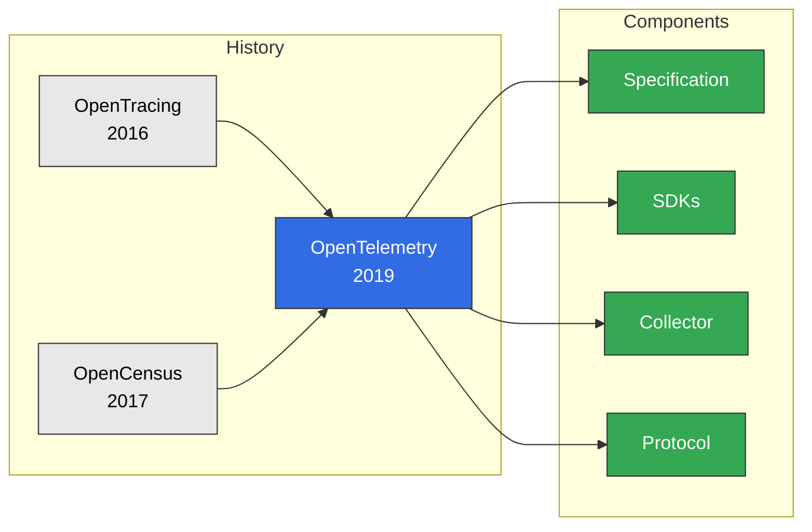
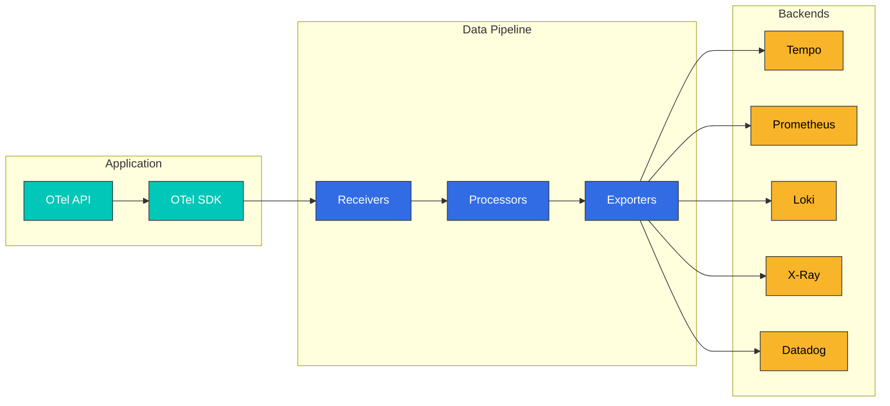
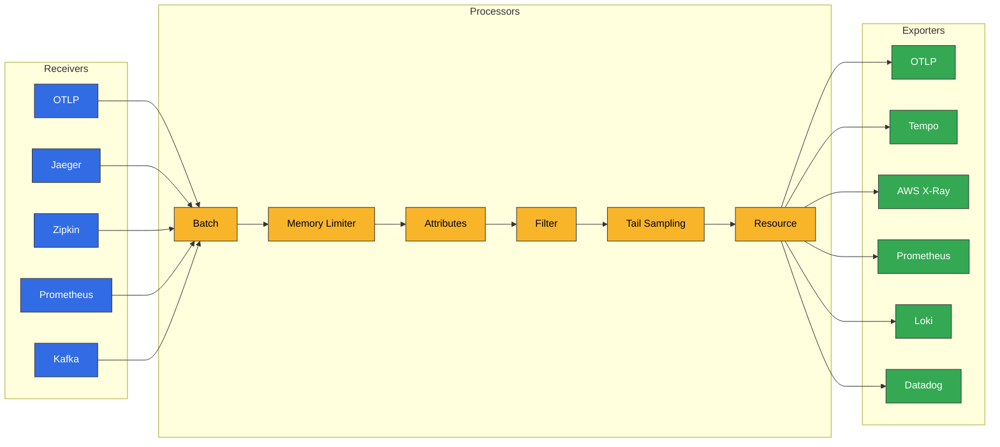

# OpenTelemetry

> **Supported Versions**: OTEL 1.x
> **Last Updated**: August 24, 2026

## Introduction

OpenTelemetry (OTel) is an observability framework for cloud-native software. It provides vendor-neutral standards for generating, collecting, and managing three signals: Traces, Metrics, and Logs. As CNCF's second most active project, it has become the industry standard.

### July 2026 Update: CNCF Graduation

OpenTelemetry has officially achieved CNCF **graduated** status, the foundation's highest maturity level, joining projects like Kubernetes and Prometheus. Graduation signals that the project's governance, security practices, and adoption have been vetted for production use. The community's stated next steps focus on maturing the remaining signals (such as profiling) and sustaining contributor growth. See the CNCF blog post ["OpenTelemetry has graduated… Now what?"](https://www.cncf.io/blog/2026/07/24/opentelemetry-has-graduated-now-what/) for the background and roadmap.

## What is OpenTelemetry?

OpenTelemetry was born from the merger of OpenTracing and OpenCensus projects:



## Core Concepts

### Three Signals

| Signal | Description | Use Cases |
|--------|-------------|-----------|
| **Traces** | Distributed request tracing | Latency analysis, dependency mapping |
| **Metrics** | Numeric measurements | Resource usage, SLI/SLO |
| **Logs** | Event records | Debugging, auditing |

### Core Components



## OpenTelemetry SDK

### Auto-instrumentation

Automatically add instrumentation without code changes.

#### Java Auto-instrumentation

```bash
# Download Java Agent
curl -L -o opentelemetry-javaagent.jar \
  https://github.com/open-telemetry/opentelemetry-java-instrumentation/releases/latest/download/opentelemetry-javaagent.jar
```

```yaml
# Kubernetes Deployment
apiVersion: apps/v1
kind: Deployment
metadata:
  name: order-service
spec:
  template:
    spec:
      containers:
        - name: app
          image: order-service:latest
          env:
            - name: JAVA_TOOL_OPTIONS
              value: "-javaagent:/opt/opentelemetry-javaagent.jar"
            - name: OTEL_SERVICE_NAME
              value: "order-service"
            - name: OTEL_EXPORTER_OTLP_ENDPOINT
              value: "http://otel-collector:4317"
            - name: OTEL_EXPORTER_OTLP_PROTOCOL
              value: "grpc"
            - name: OTEL_TRACES_SAMPLER
              value: "parentbased_traceidratio"
            - name: OTEL_TRACES_SAMPLER_ARG
              value: "0.1"
            - name: OTEL_RESOURCE_ATTRIBUTES
              value: "service.namespace=ecommerce,deployment.environment=production"
          volumeMounts:
            - name: otel-agent
              mountPath: /opt/opentelemetry-javaagent.jar
              subPath: opentelemetry-javaagent.jar
      volumes:
        - name: otel-agent
          configMap:
            name: otel-java-agent
```

#### Python Auto-instrumentation

```bash
# Installation
pip install opentelemetry-distro opentelemetry-exporter-otlp
opentelemetry-bootstrap -a install
```

```yaml
# Kubernetes Deployment
apiVersion: apps/v1
kind: Deployment
metadata:
  name: payment-service
spec:
  template:
    spec:
      containers:
        - name: app
          image: payment-service:latest
          command:
            - opentelemetry-instrument
            - python
            - app.py
          env:
            - name: OTEL_SERVICE_NAME
              value: "payment-service"
            - name: OTEL_EXPORTER_OTLP_ENDPOINT
              value: "http://otel-collector:4317"
            - name: OTEL_PYTHON_LOGGING_AUTO_INSTRUMENTATION_ENABLED
              value: "true"
```

#### Node.js Auto-instrumentation

```javascript
// tracing.js
const { NodeSDK } = require('@opentelemetry/sdk-node');
const { getNodeAutoInstrumentations } = require('@opentelemetry/auto-instrumentations-node');
const { OTLPTraceExporter } = require('@opentelemetry/exporter-trace-otlp-grpc');
const { OTLPMetricExporter } = require('@opentelemetry/exporter-metrics-otlp-grpc');
const { PeriodicExportingMetricReader } = require('@opentelemetry/sdk-metrics');

const sdk = new NodeSDK({
  serviceName: 'notification-service',
  traceExporter: new OTLPTraceExporter({
    url: 'http://otel-collector:4317',
  }),
  metricReader: new PeriodicExportingMetricReader({
    exporter: new OTLPMetricExporter({
      url: 'http://otel-collector:4317',
    }),
    exportIntervalMillis: 60000,
  }),
  instrumentations: [
    getNodeAutoInstrumentations({
      '@opentelemetry/instrumentation-fs': { enabled: false },
      '@opentelemetry/instrumentation-http': {
        ignoreIncomingRequestHook: (req) => req.url === '/health',
      },
    }),
  ],
});

sdk.start();

process.on('SIGTERM', () => {
  sdk.shutdown().then(() => process.exit(0));
});
```

### Manual Instrumentation

For fine-grained control, instrument manually.

#### Java Manual Instrumentation

```java
import io.opentelemetry.api.OpenTelemetry;
import io.opentelemetry.api.trace.Span;
import io.opentelemetry.api.trace.SpanKind;
import io.opentelemetry.api.trace.StatusCode;
import io.opentelemetry.api.trace.Tracer;
import io.opentelemetry.context.Scope;

@Service
public class OrderService {

    private final Tracer tracer;

    public OrderService(OpenTelemetry openTelemetry) {
        this.tracer = openTelemetry.getTracer("order-service", "1.0.0");
    }

    public Order processOrder(OrderRequest request) {
        // Create parent span
        Span parentSpan = tracer.spanBuilder("processOrder")
            .setSpanKind(SpanKind.SERVER)
            .setAttribute("order.id", request.getOrderId())
            .setAttribute("customer.id", request.getCustomerId())
            .startSpan();

        try (Scope scope = parentSpan.makeCurrent()) {
            // Business logic
            parentSpan.addEvent("Order validation started");

            // Child span - inventory check
            Order order = checkInventory(request);

            // Child span - payment processing
            processPayment(order);

            parentSpan.addEvent("Order processing completed");
            parentSpan.setStatus(StatusCode.OK);

            return order;

        } catch (Exception e) {
            parentSpan.setStatus(StatusCode.ERROR, e.getMessage());
            parentSpan.recordException(e);
            throw e;

        } finally {
            parentSpan.end();
        }
    }

    private Order checkInventory(OrderRequest request) {
        Span span = tracer.spanBuilder("checkInventory")
            .setSpanKind(SpanKind.INTERNAL)
            .startSpan();

        try (Scope scope = span.makeCurrent()) {
            span.setAttribute("product.count", request.getItems().size());

            // Inventory check logic
            Order order = inventoryService.check(request);

            span.setAttribute("inventory.available", true);
            return order;

        } catch (InsufficientStockException e) {
            span.setAttribute("inventory.available", false);
            span.setStatus(StatusCode.ERROR, "Insufficient stock");
            throw e;

        } finally {
            span.end();
        }
    }
}
```

## OTEL Collector

### Architecture



### Collector Configuration

```yaml
# otel-collector-config.yaml
receivers:
  # OTLP receiver
  otlp:
    protocols:
      grpc:
        endpoint: 0.0.0.0:4317
        max_recv_msg_size_mib: 16
      http:
        endpoint: 0.0.0.0:4318
        cors:
          allowed_origins:
            - "http://*"
            - "https://*"

  # Jaeger compatibility
  jaeger:
    protocols:
      thrift_http:
        endpoint: 0.0.0.0:14268
      grpc:
        endpoint: 0.0.0.0:14250

  # Zipkin compatibility
  zipkin:
    endpoint: 0.0.0.0:9411

processors:
  # Memory limiter
  memory_limiter:
    check_interval: 1s
    limit_mib: 1500
    spike_limit_mib: 500

  # Batch processing
  batch:
    timeout: 5s
    send_batch_size: 1000
    send_batch_max_size: 1500

  # Add/modify attributes
  attributes:
    actions:
      - key: environment
        value: production
        action: upsert
      - key: cluster
        value: eks-prod-cluster
        action: upsert

  # Resource detection
  resourcedetection:
    detectors: [env, system, ec2, eks]
    timeout: 5s
    override: false

  # Filtering (exclude health checks)
  filter:
    error_mode: ignore
    traces:
      span:
        - 'attributes["http.target"] == "/health"'
        - 'attributes["http.target"] == "/ready"'
        - 'attributes["http.target"] == "/metrics"'

  # Tail Sampling (for traces)
  tail_sampling:
    decision_wait: 10s
    num_traces: 100000
    expected_new_traces_per_sec: 1000
    policies:
      # 100% collection for error requests
      - name: error-policy
        type: status_code
        status_code:
          status_codes: [ERROR]
      # Collect slow requests
      - name: latency-policy
        type: latency
        latency:
          threshold_ms: 1000
      # Priority collection for specific services
      - name: service-priority
        type: string_attribute
        string_attribute:
          key: service.name
          values: [payment-service, order-service]
          enabled_regex_matching: false
      # Probabilistic sampling for the rest
      - name: probabilistic-policy
        type: probabilistic
        probabilistic:
          sampling_percentage: 10

exporters:
  # OTLP (Tempo)
  otlp/tempo:
    endpoint: tempo-distributor.tempo.svc.cluster.local:4317
    tls:
      insecure: true

  # AWS X-Ray
  awsxray:
    region: ap-northeast-2
    index_all_attributes: true

  # Prometheus Remote Write
  prometheusremotewrite:
    endpoint: http://prometheus:9090/api/v1/write
    tls:
      insecure: true

  # Loki (logs)
  loki:
    endpoint: http://loki-gateway.loki.svc.cluster.local:3100/loki/api/v1/push
    tls:
      insecure: true
    labels:
      attributes:
        service.name: "service"
        service.namespace: "namespace"
        k8s.pod.name: "pod"

extensions:
  health_check:
    endpoint: 0.0.0.0:13133
    path: /health

  pprof:
    endpoint: 0.0.0.0:1777

service:
  extensions: [health_check, pprof]

  pipelines:
    traces:
      receivers: [otlp, jaeger, zipkin]
      processors: [memory_limiter, resourcedetection, attributes, filter, tail_sampling, batch]
      exporters: [otlp/tempo, awsxray]

    metrics:
      receivers: [otlp]
      processors: [memory_limiter, resourcedetection, batch]
      exporters: [prometheusremotewrite]

    logs:
      receivers: [otlp]
      processors: [memory_limiter, resourcedetection, batch]
      exporters: [loki]
```

## EKS Deployment Patterns

### DaemonSet Pattern

Deploy Collector on each node to collect data from all Pods on that node:

```yaml
# otel-collector-daemonset.yaml
apiVersion: v1
kind: ServiceAccount
metadata:
  name: otel-collector
  namespace: otel
  annotations:
    eks.amazonaws.com/role-arn: arn:aws:iam::123456789012:role/otel-collector-role
---
apiVersion: apps/v1
kind: DaemonSet
metadata:
  name: otel-collector
  namespace: otel
spec:
  selector:
    matchLabels:
      app: otel-collector
  template:
    metadata:
      labels:
        app: otel-collector
    spec:
      serviceAccountName: otel-collector
      containers:
        - name: collector
          image: otel/opentelemetry-collector-contrib:0.92.0
          args:
            - --config=/conf/otel-collector-config.yaml
          ports:
            - containerPort: 4317
              hostPort: 4317
              protocol: TCP
            - containerPort: 4318
              hostPort: 4318
              protocol: TCP
          env:
            - name: K8S_NODE_NAME
              valueFrom:
                fieldRef:
                  fieldPath: spec.nodeName
          resources:
            requests:
              cpu: 200m
              memory: 400Mi
            limits:
              cpu: 1000m
              memory: 1Gi
          volumeMounts:
            - name: config
              mountPath: /conf
      volumes:
        - name: config
          configMap:
            name: otel-collector-config
      tolerations:
        - effect: NoSchedule
          operator: Exists
---
apiVersion: v1
kind: Service
metadata:
  name: otel-collector
  namespace: otel
spec:
  selector:
    app: otel-collector
  ports:
    - name: otlp-grpc
      port: 4317
      protocol: TCP
    - name: otlp-http
      port: 4318
      protocol: TCP
  type: ClusterIP
```

### Sidecar Pattern

Deploy Collector as a sidecar in each application Pod:

```yaml
# application-with-sidecar.yaml
apiVersion: apps/v1
kind: Deployment
metadata:
  name: order-service
spec:
  template:
    spec:
      containers:
        # Application container
        - name: app
          image: order-service:latest
          ports:
            - containerPort: 8080
          env:
            - name: OTEL_EXPORTER_OTLP_ENDPOINT
              value: "http://localhost:4317"
            - name: OTEL_SERVICE_NAME
              value: "order-service"

        # OTEL Collector sidecar
        - name: otel-collector
          image: otel/opentelemetry-collector-contrib:0.92.0
          args:
            - --config=/conf/otel-collector-config.yaml
          ports:
            - containerPort: 4317
          resources:
            requests:
              cpu: 50m
              memory: 100Mi
            limits:
              cpu: 200m
              memory: 200Mi
          volumeMounts:
            - name: otel-config
              mountPath: /conf
      volumes:
        - name: otel-config
          configMap:
            name: otel-sidecar-config
```

## Kubernetes Operator

Auto-instrumentation using the OpenTelemetry Operator:

### Operator Installation

```bash
# Install cert-manager (required)
kubectl apply -f https://github.com/cert-manager/cert-manager/releases/download/v1.13.3/cert-manager.yaml

# Install OpenTelemetry Operator
kubectl apply -f https://github.com/open-telemetry/opentelemetry-operator/releases/latest/download/opentelemetry-operator.yaml
```

### Instrumentation CR

```yaml
# instrumentation.yaml
apiVersion: opentelemetry.io/v1alpha1
kind: Instrumentation
metadata:
  name: otel-instrumentation
  namespace: default
spec:
  exporter:
    endpoint: http://otel-collector.otel.svc.cluster.local:4317

  propagators:
    - tracecontext
    - baggage
    - b3

  sampler:
    type: parentbased_traceidratio
    argument: "0.1"

  # Java configuration
  java:
    image: ghcr.io/open-telemetry/opentelemetry-operator/autoinstrumentation-java:latest
    env:
      - name: OTEL_JAVAAGENT_DEBUG
        value: "false"

  # Python configuration
  python:
    image: ghcr.io/open-telemetry/opentelemetry-operator/autoinstrumentation-python:latest
    env:
      - name: OTEL_PYTHON_LOGGING_AUTO_INSTRUMENTATION_ENABLED
        value: "true"

  # Node.js configuration
  nodejs:
    image: ghcr.io/open-telemetry/opentelemetry-operator/autoinstrumentation-nodejs:latest
```

### Auto-instrumentation Injection

```yaml
# Enable auto-instrumentation on namespace
apiVersion: v1
kind: Namespace
metadata:
  name: ecommerce
  annotations:
    instrumentation.opentelemetry.io/inject-java: "true"
    instrumentation.opentelemetry.io/inject-python: "true"
    instrumentation.opentelemetry.io/inject-nodejs: "true"
---
# Or apply to individual Deployment
apiVersion: apps/v1
kind: Deployment
metadata:
  name: order-service
  namespace: ecommerce
  annotations:
    instrumentation.opentelemetry.io/inject-java: "otel-instrumentation"
spec:
  template:
    metadata:
      annotations:
        # Pod-level annotation
        instrumentation.opentelemetry.io/inject-java: "true"
    spec:
      containers:
        - name: app
          image: order-service:latest
```

## Multi-backend Configuration

Send data to multiple backends from a single Collector:

```yaml
exporters:
  # Grafana Tempo
  otlp/tempo:
    endpoint: tempo-distributor:4317
    tls:
      insecure: true

  # AWS X-Ray
  awsxray:
    region: ap-northeast-2

  # Datadog
  datadog:
    api:
      key: ${DD_API_KEY}
      site: datadoghq.com
    traces:
      span_name_as_resource_name: true

  # Jaeger
  jaeger:
    endpoint: jaeger-collector:14250
    tls:
      insecure: true

service:
  pipelines:
    traces:
      receivers: [otlp]
      processors: [batch]
      exporters: [otlp/tempo, awsxray, datadog, jaeger]
```

### July 2026 Update: Observing a Network Boundary for AI Agent Traffic

A CNCF blog post describes a pattern for [building a network boundary for AI agents using NGINX and OpenTelemetry](https://www.cncf.io/blog/2026/07/08/network-boundary-for-ai-agents-using-nginx-and-opentelemetry/). Outbound traffic from AI agents is forced through a forward proxy (NGINX), and the NGINX native OpenTelemetry module emits an OTel span for every request. Those spans flow through an OTel Collector just like the pipelines covered above — persisted to an audit log or forwarded to Jaeger, Grafana, or a SIEM — letting you correlate user interactions with the external calls an agent made on their behalf. If you run agent workloads in your cluster, this is a useful observability pattern that reuses your existing OTel pipeline as-is.

### August 2026 Update: Distilling Slow SQL Queries into Reliability Metrics

A CNCF blog post walks through [how to turn slow queries into actionable reliability metrics with OpenTelemetry](https://www.cncf.io/blog/2026/08/21/how-to-turn-slow-queries-into-actionable-reliability-metrics-with-opentelemetry/). It builds a repeatable workflow that distills the OpenTelemetry database spans your application already emits into span-derived metrics you can dashboard and alert on — starting with simple slow-query detection, then adding traffic-weighted impact (which queries are most worth optimizing) and anomaly detection (which queries are behaving abnormally right now). A hands-on [lab repository](https://github.com/causely-oss/slow-query-lab) accompanies the post.

## Best Practices

### 1. Standardize Resource Attributes

```yaml
# Follow Semantic Conventions
resource:
  attributes:
    # Service information
    service.name: order-service
    service.version: 1.2.3
    service.namespace: ecommerce

    # Deployment environment
    deployment.environment: production

    # Cloud information
    cloud.provider: aws
    cloud.region: ap-northeast-2
    cloud.availability_zone: ap-northeast-2a

    # Kubernetes information
    k8s.cluster.name: eks-prod
    k8s.namespace.name: ecommerce
    k8s.pod.name: order-service-abc123
    k8s.deployment.name: order-service
```

### 2. Sampling Strategy

```yaml
# Hierarchical sampling
processors:
  tail_sampling:
    policies:
      # Priority 1: 100% errors
      - name: errors
        type: status_code
        status_code:
          status_codes: [ERROR]

      # Priority 2: 100% slow requests
      - name: slow
        type: latency
        latency:
          threshold_ms: 2000

      # Priority 3: 50% critical services
      - name: critical-services
        type: and
        and:
          and_sub_policy:
            - name: service-name
              type: string_attribute
              string_attribute:
                key: service.name
                values: [payment-service, order-service]
            - name: probabilistic
              type: probabilistic
              probabilistic:
                sampling_percentage: 50

      # Priority 4: 5% for the rest
      - name: default
        type: probabilistic
        probabilistic:
          sampling_percentage: 5
```

### 3. Security Considerations

```yaml
# Enable TLS
receivers:
  otlp:
    protocols:
      grpc:
        endpoint: 0.0.0.0:4317
        tls:
          cert_file: /certs/server.crt
          key_file: /certs/server.key

exporters:
  otlp:
    endpoint: tempo:4317
    tls:
      ca_file: /certs/ca.crt
      cert_file: /certs/client.crt
      key_file: /certs/client.key

# Filter sensitive information
processors:
  attributes:
    actions:
      - key: http.request.header.authorization
        action: delete
      - key: db.statement
        action: hash  # Hashing
```

## Quiz

Test your knowledge with the [OpenTelemetry Quiz](../../quizzes/observability/tracing/03-opentelemetry-quiz.md).
