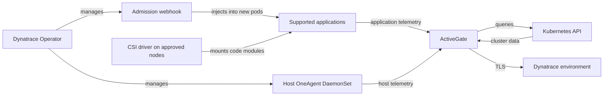

# Dynatrace

> **Last Updated**: September 13, 2026

## Introduction

Dynatrace combines application and infrastructure telemetry with topology and problem analysis. OneAgent auto-instrumentation depends on supported runtimes, deployment mode and permissions; installing the Operator alone does not provide every signal. PurePath provides supported request/code context, while Smartscape maps observed dependencies. Neither promises capture of every request, method or dependency.

This guide uses **Dynatrace Operator/chart 1.10.2**, **DynaKube v1beta6** and an **EKS 1.35 Linux EC2-node baseline**. Helm rendering, CRD schemas and local examples were checked; no EKS installation, tenant API call, live OneAgent instrumentation or production capacity test was performed.

## Key Features

| Feature | What it provides and requires |
|---|---|
| **OneAgent** | Host/process and supported application visibility; mode and host privileges matter. |
| **Auto-instrumentation** | Code-module injection for supported runtimes; existing pods normally need recreation. |
| **Davis AI / Dynatrace Intelligence** | Correlation, anomaly and causal analysis based on available evidence. |
| **PurePath** | Distributed request analysis; sampling and supported technology affect coverage. |
| **Smartscape** | Relationships inferred from observed telemetry, not an exhaustive asset inventory. |
| **Full Stack** | Application and infrastructure capabilities; RUM, synthetic monitoring and other signals have separate setup/consumption requirements. |

## Architecture

The cloud-native full-stack path separates **injection control** from **telemetry transport**. The webhook modifies new application pods; the CSI driver supplies code modules; a host OneAgent collects node/process signals. ActiveGate can route traffic and query the Kubernetes API. The diagram omits optional direct routes and additional ingest components.



## EKS Deployment with Helm

### 1. Install Dynatrace Operator

Before installing, compare the [supported distributions](https://docs.dynatrace.com/docs/ingest-from/setup-on-k8s/deployment/supported-technologies) and [technology matrix](https://docs.dynatrace.com/docs/ingest-from/technology-support/support-model-and-issues). The chart's `kubeVersion >=1.25` constraint is not a complete compatibility statement.

| Target | Scope at review time |
|---|---|
| EKS 1.35 on supported Linux EC2 nodes | The matrix requires OneAgent/ActiveGate **1.329+** and Operator **1.6+**, recommends Operator **1.9+**. This guide pins 1.10.2. |
| Kubernetes 1.36 | OneAgent/ActiveGate minimum is **1.335**; check the platform and version combination separately. |
| Kubernetes 1.37 | Not listed in the reviewed Dynatrace matrix; a new Kubernetes release does not establish vendor support. |
| EKS Fargate | Application monitoring **without CSI**, using the [Fargate-specific EKS workflow](https://docs.dynatrace.com/docs/ingest-from/setup-on-k8s/deployment/marketplaces/eks-dto); no host OneAgent. |
| Bottlerocket | Application monitoring and ActiveGate Kubernetes monitoring; OneAgent host monitoring is not supported in the cited distribution table. |
| EKS Auto Mode | Do not infer full host-agent support from the general EKS entry. Confirm the managed-node OS, privileges and vendor support; this recipe was not validated on Auto Mode. |

Use approved, supported EC2 nodes for the main recipe. An administrator must apply the custom node label `monitoring.example.com/dynatrace-host=true` to that pool, and schedule monitored applications on nodes with the CSI driver. The label is a placement convention, not a security boundary. Plan node taints/tolerations explicitly; do not tolerate every taint by default.

Installing CRDs, webhooks and cluster RBAC requires an authorized deployer. Host OneAgent/CSI permissions do not fit an ordinary restricted application namespace. Review the [Operator security permissions](https://docs.dynatrace.com/docs/ingest-from/setup-on-k8s/reference/security), admission exceptions and protected `dynatrace` namespace. Do not grant an optional cluster-wide Secrets/ConfigMaps reader merely to make installation succeed.

**Existing installation:** follow the [upgrade and stored-version migration instructions](https://docs.dynatrace.com/docs/ingest-from/setup-on-k8s/guides/deployment-and-configuration/updates-and-maintenance/update-uninstall-operator). If the cluster has stored `v1beta1`/`v1beta2` DynaKubes, the documented path passes through **Operator 1.7.3 before 1.8+**. Changing YAML to `v1beta6` does not migrate persisted objects. Inspect CRD `status.storedVersions`; do not erase it or disable migration checks. The install command below is for a **new release**, not a direct upgrade from the former 1.0 example.

```bash
kubectl get nodes -l monitoring.example.com/dynatrace-host=true
kubectl get crd dynakubes.dynatrace.com \
  -o jsonpath='{.status.storedVersions}' --ignore-not-found
kubectl create namespace dynatrace
```

### 2. Create API Tokens

Use the current [token and permission guide](https://docs.dynatrace.com/docs/ingest-from/setup-on-k8s/deployment/tokens-permissions) for the tenant's token family:

- **Latest Dynatrace platform tokens:** use a dedicated service user and the documented `KubernetesOperator` and `KubernetesIngest` policies, with environment restrictions. Operator permissions cover the required `fleet-management` and `settings` actions; ingestion uses the corresponding `openpipeline`/`storage` permissions. User permissions and token scopes both apply.
- **Classic access tokens:** keep Operator and ingest credentials separate. The current guide documents installer/connection/ActiveGate-token permissions; `entities.read` is no longer required from Operator 1.7, and settings permissions are optional from 1.7. Do not reuse the old unrestricted permission checklist.
- Ingest only enabled signals. Classic OTLP scopes are `openTelemetryTrace.ingest`, `metrics.ingest` and `logs.ingest`; deployment events and settings writes use different permissions.

Platform-token API calls use `Bearer`; Classic access-token calls use `Api-Token`. Do not mix their scope names or headers. Rotate scoped credentials and restrict who can read their files and the Kubernetes Secret.

### 3. Create Secret

Place the two generated token values in protected local files, **without a trailing newline**, named `apiToken` and `dataIngestToken`. Base64 is encoding, not encryption. Do not commit token YAML, put token values in command arguments, or print pod environments. This creates a new Secret; rotation of an existing Secret is a separate controlled operation.

```bash
token_dir="$PWD/private-dynatrace-tokens"
chmod 700 "$token_dir"
chmod 600 "$token_dir/apiToken" "$token_dir/dataIngestToken"
kubectl create secret generic dynakube --namespace dynatrace \
  --from-file=apiToken="$token_dir/apiToken" \
  --from-file=dataIngestToken="$token_dir/dataIngestToken"
```

### 4. values.yaml Configuration

These are chart **1.10.2** values. Leave the chart's compatible image defaults intact. If tuning is needed, this version uses `operator.requests`/`operator.limits` and `webhook.requests`/`webhook.limits`, not nested `resources`. The former `operator.image.tag` and `operator.resources` examples are ignored by this chart. OneAgent/ActiveGate customization belongs in the appropriate DynaKube fields, not invented chart keys.

```yaml
# values-fullstack.yaml
installCRD: true
debugLogs: false
operator:
  nodeSelector:
    kubernetes.io/os: linux
    monitoring.example.com/dynatrace-host: 'true'
webhook:
  nodeSelector:
    kubernetes.io/os: linux
    monitoring.example.com/dynatrace-host: 'true'
csidriver:
  enabled: true
  nodeSelector:
    kubernetes.io/os: linux
    monitoring.example.com/dynatrace-host: 'true'
```

### 5. Install Operator

Use the official OCI chart and a pinned version. This command assumes **Helm 3**; Helm 4 uses `--rollback-on-failure` instead of `--atomic`. Review the rendered RBAC, CSI host mounts and admission permissions first. Helm rollback does not reverse every CRD or external effect.

```bash
helm template dynatrace-operator \
  oci://public.ecr.aws/dynatrace/dynatrace-operator \
  --version 1.10.2 --namespace dynatrace --kube-version 1.35.0 \
  --values values-fullstack.yaml > dynatrace-rendered.yaml

helm install dynatrace-operator \
  oci://public.ecr.aws/dynatrace/dynatrace-operator \
  --version 1.10.2 --namespace dynatrace \
  --values values-fullstack.yaml --atomic --timeout 10m
```

### 6. DynaKube CR Configuration

Use exactly one monitoring-mode variant for this DynaKube. Replace `ENVIRONMENTID` with the approved environment ID; the API URL uses `.live.dynatrace.com/api`, not the web application's `.apps` origin. The released [v1beta6 full-stack sample](https://github.com/Dynatrace/dynatrace-operator/blob/v1.10.2/assets/samples/dynakube/v1beta6/cloudNativeFullStack.yaml) also documents `dynatrace-api`; it is a real ActiveGate capability.

```yaml
# dynakube-fullstack.yaml
apiVersion: dynatrace.com/v1beta6
kind: DynaKube
metadata:
  name: dynakube
  namespace: dynatrace
spec:
  apiUrl: https://ENVIRONMENTID.live.dynatrace.com/api
  tokens: dynakube
  metadataEnrichment:
    enabled: true
    namespaceSelector:
      matchLabels:
        monitoring.example.com/dynatrace: 'true'
  oneAgent:
    hostGroup: eks-production
    cloudNativeFullStack:
      namespaceSelector:
        matchLabels:
          monitoring.example.com/dynatrace: 'true'
      nodeSelector:
        kubernetes.io/os: linux
        monitoring.example.com/dynatrace-host: 'true'
  activeGate:
    capabilities:
    - routing
    - kubernetes-monitoring
    - dynatrace-api
    replicas: 2
    nodeSelector:
      kubernetes.io/os: linux
      monitoring.example.com/dynatrace-host: 'true'
```

Create a dedicated example application namespace, or label an existing namespace through its owning configuration. Injection selectors apply to **webhook mutation**, not all OneAgent host telemetry or ActiveGate's cluster API queries. `replicas: 2` alone proves neither capacity nor fault-domain redundancy; size and spread ActiveGates for the real workload.

```yaml
# application-namespace.yaml
apiVersion: v1
kind: Namespace
metadata:
  name: observability-demo
  labels:
    monitoring.example.com/dynatrace: 'true'
```

### 7. Deploy and Verify

After validating the prerequisites, apply the chosen CR and namespace. Check status before rolling out an application. Recreate selected application pods through their normal rollout procedure; existing processes are not automatically restarted by these commands.

```bash
kubectl apply -f application-namespace.yaml
kubectl apply -f dynakube-fullstack.yaml
kubectl get dynakube dynakube -n dynatrace
kubectl get deploy,ds,sts,pods -n dynatrace
kubectl get dynakube dynakube -n dynatrace -o jsonpath='{.status.conditions}'
```

## Cloud Native Full Stack Mode

Cloud-native full stack combines host monitoring and application code-module injection through the webhook/CSI path. It is not an application-only sidecar mode or a universal resource-saving setting. `oneAgent.hostGroup` sets the host group; resource overrides for its host agent belong under `cloudNativeFullStack.oneAgentResources`. Validate sizing instead of carrying forward arbitrary limits.

**Classic Full Stack remains available** in 1.10.2. The following complete alternative uses host-based injection. Do not apply it in addition to the cloud-native CR with the same name; select and plan a supported mode transition. Both full-stack approaches require host access.

```yaml
# dynakube-classic.yaml
apiVersion: dynatrace.com/v1beta6
kind: DynaKube
metadata:
  name: dynakube
  namespace: dynatrace
spec:
  apiUrl: https://ENVIRONMENTID.live.dynatrace.com/api
  tokens: dynakube
  metadataEnrichment:
    enabled: true
    namespaceSelector:
      matchLabels:
        monitoring.example.com/dynatrace: 'true'
  oneAgent:
    hostGroup: eks-production
    classicFullStack:
      nodeSelector:
        kubernetes.io/os: linux
        monitoring.example.com/dynatrace-host: 'true'
  activeGate:
    capabilities:
    - routing
    - kubernetes-monitoring
    - dynatrace-api
    replicas: 2
    nodeSelector:
      kubernetes.io/os: linux
      monitoring.example.com/dynatrace-host: 'true'
```

## Application-Only Monitoring

`applicationMonitoring` omits the host OneAgent. CSI is a **chart-level option**, not `applicationMonitoring.useCSIDriver`. For a new application-only installation without CSI, use `values-app-only.yaml` below **instead of** the full-stack values, plus the application-only CR. Do not disable CSI on an existing full-stack installation without the vendor migration procedure.

The node selectors below still target the approved EC2 pool. An EKS Fargate deployment requires its own matching Fargate profile and placement configuration from the cited workflow; this EC2 recipe does not become a Fargate recipe merely by disabling CSI. Do not combine separate `hostMonitoring` and `applicationMonitoring` DynaKubes in the same cluster/environment; use cloud-native full stack when both are needed.

```yaml
# values-app-only.yaml
installCRD: true
debugLogs: false
operator:
  nodeSelector:
    kubernetes.io/os: linux
    monitoring.example.com/dynatrace-host: 'true'
webhook:
  nodeSelector:
    kubernetes.io/os: linux
    monitoring.example.com/dynatrace-host: 'true'
csidriver:
  enabled: false
  nodeSelector:
    kubernetes.io/os: linux
    monitoring.example.com/dynatrace-host: 'true'
```

```yaml
# dynakube-app-only.yaml
apiVersion: dynatrace.com/v1beta6
kind: DynaKube
metadata:
  name: dynakube
  namespace: dynatrace
spec:
  apiUrl: https://ENVIRONMENTID.live.dynatrace.com/api
  tokens: dynakube
  metadataEnrichment:
    enabled: true
    namespaceSelector:
      matchLabels:
        monitoring.example.com/dynatrace: 'true'
  oneAgent:
    applicationMonitoring:
      namespaceSelector:
        matchLabels:
          monitoring.example.com/dynatrace: 'true'
  activeGate:
    capabilities:
    - routing
    - kubernetes-monitoring
    - dynatrace-api
    replicas: 2
    nodeSelector:
      kubernetes.io/os: linux
      monitoring.example.com/dynatrace-host: 'true'
```

## Davis AI Root Cause Analysis

### How Davis AI Works

The following existing illustration is a **conceptual explanation** of signal correlation and problem outputs, not a fixed processing algorithm or proof of root-cause certainty. Smartscape and PurePath supply observed context; missing instrumentation can hide dependencies. Current [Dynatrace Intelligence](https://docs.dynatrace.com/docs/dynatrace-intelligence) includes additional capabilities and approved agentic actions in Preview. Problem detection alone does not authorize changes to production code or infrastructure.


[View interactive diagram](https://www.atomai.click/kubernetes-docs/archmaps/en-observability-tracing-04-dynatrace-1.html)

### Problem Alert Configuration

The former `/api/config/v1/alertingProfiles` endpoint is deprecated. Use [Settings schema `builtin:alerting.profile`](https://docs.dynatrace.com/docs/dynatrace-api/environment-api/settings/schemas/builtin-alerting-profile) through `POST /api/v2/settings/objects`. First validate with `?validateOnly=true`; check every response item's code, including a multi-status response. Validation still requires the endpoint's write permission and does not create a notification destination.

Save this body as `alerting-profile.json`. The tags are **Dynatrace entity tags that must already exist**, not an automatic translation of Kubernetes labels. The current enum is `ERRORS` (plural); `PERFORMANCE` remains valid.

```json
[
  {
    "schemaId": "builtin:alerting.profile",
    "scope": "environment",
    "value": {
      "name": "EKS Production Alerts",
      "severityRules": [
        {
          "severityLevel": "AVAILABILITY",
          "delayInMinutes": 0,
          "tagFilterIncludeMode": "INCLUDE_ANY",
          "tagFilter": [
            "cluster:eks-production"
          ]
        },
        {
          "severityLevel": "ERRORS",
          "delayInMinutes": 5,
          "tagFilterIncludeMode": "INCLUDE_ANY",
          "tagFilter": [
            "environment:production"
          ]
        },
        {
          "severityLevel": "PERFORMANCE",
          "delayInMinutes": 15,
          "tagFilterIncludeMode": "INCLUDE_ANY",
          "tagFilter": [
            "tier:critical"
          ]
        }
      ],
      "eventFilters": []
    }
  }
]
```

### Custom Deployment Events

The [Events v2 API](https://docs.dynatrace.com/docs/dynatrace-api/environment-api/events-v2/post-event) accepts `CUSTOM_DEPLOYMENT`. Use a verified service entity ID so an unchecked service-name string cannot broaden the selector. The helper below requires Python 3 and `requests`; it previews by default, sends once only with `--send`, does not follow redirects, and checks the **201 body and per-report status**, not just HTTP success. A timeout leaves acceptance unknown: investigate before retrying, because this example provides no idempotency guarantee.

The SaaS origin allowlist deliberately excludes Managed/custom origins; adapt and review it for those deployments. Classic calls need `events.ingest`; platform calls need the documented event-ingest scope such as `openpipeline:events.davis:ingest` and `--scheme Bearer`. Use a protected token file containing only the credential. This is HTTP client code, not a Dynatrace SDK, and makes no call on import.

```python
# deployment_event.py
"""Prepare one deployment annotation; send only when explicitly requested."""
from pathlib import Path
from urllib.parse import urlsplit
import argparse
import json
import re
import requests

def payload_for(entity_id, version):
    if not isinstance(entity_id, str) or not re.fullmatch(r"SERVICE-[0-9A-F]{16}", entity_id):
        raise ValueError("Use one verified SERVICE entity ID")
    if not isinstance(version, str) or not 1 <= len(version) <= 128:
        raise ValueError("Version must contain 1–128 characters")
    if any(ord(char) < 32 or ord(char) == 127 for char in version):
        raise ValueError("Version must not contain control characters")
    return {
        "eventType": "CUSTOM_DEPLOYMENT",
        "title": f"Deployment {version}",
        "entitySelector": f'type(SERVICE),entityId("{entity_id}")',
        "properties": {"release.version": version, "deployment.source": "ci"},
    }

def send_event(environment_url, token_file, entity_id, version, *, scheme="Api-Token", session=None):
    payload = payload_for(entity_id, version)
    parsed = urlsplit(environment_url)
    if (parsed.scheme != "https" or parsed.username or parsed.password
            or parsed.port not in (None, 443)
            or not re.fullmatch(r"[a-z0-9-]+\.live\.dynatrace\.com", parsed.hostname or "")
            or parsed.path not in ("", "/") or parsed.query or parsed.fragment):
        raise ValueError("Use the approved SaaS environment origin, without .apps or a path")
    if scheme not in ("Api-Token", "Bearer"):
        raise ValueError("Choose the authentication scheme required by the token family")
    token = Path(token_file).read_text(encoding="utf-8")
    if not token or token != token.strip() or any(ord(c) < 33 or ord(c) > 126 for c in token):
        raise ValueError("Token file must contain only the token, without whitespace")
    client = session if session is not None else requests.Session()
    try:
        response = client.post(
            f"https://{parsed.hostname}/api/v2/events/ingest",
            headers={"Authorization": f"{scheme} {token}", "Content-Type": "application/json"},
            json=payload, timeout=(5, 30), allow_redirects=False,
        )
        if response.status_code != 201:
            raise RuntimeError(f"Unexpected event API status: {response.status_code}")
        body = response.json()
        if not isinstance(body, dict):
            raise RuntimeError("Invalid event response")
        results = body.get("eventIngestResults")
        if (type(body.get("reportCount")) is not int or body["reportCount"] != 1
                or not isinstance(results, list) or len(results) != 1
                or not isinstance(results[0], dict) or results[0].get("status") != "OK"
                or not isinstance(results[0].get("correlationId"), str)
                or not results[0]["correlationId"]):
            raise RuntimeError("The response did not confirm one successful event report")
        return results[0]["correlationId"]
    finally:
        if session is None:
            client.close()

if __name__ == "__main__":
    parser = argparse.ArgumentParser()
    parser.add_argument("--entity-id", required=True)
    parser.add_argument("--version", required=True)
    parser.add_argument("--send", action="store_true")
    parser.add_argument("--environment-url")
    parser.add_argument("--token-file")
    parser.add_argument("--scheme", choices=["Api-Token", "Bearer"], default="Api-Token")
    args = parser.parse_args()
    if not args.send:
        print(json.dumps(payload_for(args.entity_id, args.version), indent=2))
    else:
        if not args.environment_url or not args.token_file:
            parser.error("--send requires --environment-url and --token-file")
        print("Event report:", send_event(args.environment_url, args.token_file,
              args.entity_id, args.version, scheme=args.scheme))
```

```bash
python3 deployment_event.py --entity-id SERVICE-0123456789ABCDEF --version 2.3.0
```

The ID above is illustrative: replace it with a verified entity from your environment before any send. To send, explicitly add `--send --environment-url https://ENVIRONMENTID.live.dynatrace.com --token-file /protected/path/events-token` and the correct scheme. Do not reuse an Operator credential for this separate CI responsibility.

## Auto-instrumentation

### Supported Technologies

OneAgent supports multiple technology families. Check exact runtime/framework releases, architectures and deployment modes in the [support matrix](https://docs.dynatrace.com/docs/ingest-from/technology-support/support-model-and-issues), rather than treating the following examples as a version-independent promise.

| Family | Examples to check against the matrix |
|---|---|
| Java | JVM and Spring/Spring Boot, Micronaut, Quarkus or Jakarta EE versions |
| Node.js | Node runtime and HTTP/framework instrumentation, including Express-family applications |
| Python | Runtime and Django/Flask/FastAPI instrumentation path |
| .NET | .NET runtime, ASP.NET Core versus Windows/.NET Framework deployment |
| Go | Go version, compilation/build flags and supported HTTP framework instrumentation |
| PHP | PHP runtime and Laravel/Symfony framework versions |

### Verify Auto-instrumentation

Inspect container names, images and readiness without dumping environment values or credentials. Then send an authorized test request through a supported application and verify service/trace visibility in the intended tenant. Pod readiness alone does not prove trace delivery. Review [injection selectors and opt-outs](https://docs.dynatrace.com/docs/ingest-from/setup-on-k8s/guides/deployment-and-configuration/monitoring-and-instrumentation/annotate): `dynatrace.com/inject: "false"` opts out, while setting it to `"true"` does not override all selection rules.

```bash
kubectl get pods -n observability-demo \
  -o custom-columns='NAME:.metadata.name,INIT:.spec.initContainers[*].name,IMAGES:.spec.containers[*].image,READY:.status.containerStatuses[*].ready'
```

### Custom Service Definition

The [custom Java service API](https://docs.dynatrace.com/docs/dynatrace-api/configuration-api/service-api/custom-services-api/post-rule) still supports `POST /api/config/v1/service/customServices/java`. The following explicit method signature is a valid **configuration shape**, not proof that a sample application contains that method. Validate the body with `/api/config/v1/service/customServices/java/validator` (204 on success), then create only after checking the class, return type, arguments and OneAgent support. Classic authorization uses `WriteConfig`; platform authorization follows the endpoint's `settings:objects:write` requirements.

```json
{
  "name": "Payment Gateway",
  "enabled": true,
  "rules": [
    {
      "enabled": true,
      "className": "com.example.payment.PaymentGateway",
      "methodRules": [
        {
          "methodName": "processPayment",
          "returnType": "com.example.payment.PaymentResult",
          "argumentTypes": []
        }
      ]
    }
  ],
  "queueEntryPoint": false
}
```

## Kubernetes Monitoring Integration

### Cluster Metrics

ActiveGate's `kubernetes-monitoring` capability queries the Kubernetes API for cluster/workload state. Its scope is separate from application injection. For an ActiveGate-only installation, the following complete alternative includes the required environment URL. Do not layer it over the previous same-name DynaKube unintentionally.

```yaml
# dynakube-platform.yaml
apiVersion: dynatrace.com/v1beta6
kind: DynaKube
metadata:
  name: dynakube
  namespace: dynatrace
spec:
  apiUrl: https://ENVIRONMENTID.live.dynatrace.com/api
  tokens: dynakube
  metadataEnrichment:
    enabled: false
  activeGate:
    capabilities:
    - routing
    - kubernetes-monitoring
    - dynatrace-api
    replicas: 2
    nodeSelector:
      kubernetes.io/os: linux
      monitoring.example.com/dynatrace-host: 'true'
```

Configure workload/event/Prometheus monitoring through the current platform settings and documented capability options. The former arbitrary `[kubernetes_monitoring] monitor_*` and `kubernetes_namespace_filter` properties are not a verified substitute for that configuration. Review actual RBAC and selected collection features before granting more permissions.

### Prometheus Metric Collection

For the documented [ActiveGate Prometheus integration](https://docs.dynatrace.com/docs/observe/infrastructure-observability/container-platform-monitoring/kubernetes-monitoring/monitor-prometheus-metrics), enable workload monitoring and annotated exporters in the cluster settings, and permit the intended network path. Annotations belong on the **Pod template**. Replace the placeholder image below with an owned application that actually serves Prometheus text on port 8080 at `/metrics`; this is a complete Deployment shape, not a supplied runnable application.

```yaml
# prometheus-application.yaml
apiVersion: apps/v1
kind: Deployment
metadata:
  name: metrics-demo
  namespace: observability-demo
spec:
  replicas: 1
  selector:
    matchLabels:
      app: metrics-demo
  template:
    metadata:
      labels:
        app: metrics-demo
      annotations:
        metrics.dynatrace.com/scrape: 'true'
        metrics.dynatrace.com/port: '8080'
        metrics.dynatrace.com/path: /metrics
    spec:
      automountServiceAccountToken: false
      containers:
      - name: app
        image: registry.example.com/app:metrics-demo
        ports:
        - name: metrics
          containerPort: 8080
      nodeSelector:
        kubernetes.io/os: linux
        monitoring.example.com/dynatrace-host: 'true'
```

This integration discovers annotated pods across namespaces independently of DynaKube's injection selector. The cited ActiveGate module documents limits of 1,000 exporter pods, 1,000 metrics per pod and 500,000 data points per pod. It supports counter, gauge, histogram and summary, not every OpenMetrics feature or exemplars. For larger deployments, evaluate the documented Collector/Target Allocator alternative and its separate permissions.

## Cost Structure

### License Model

Distinguish modern **Dynatrace Platform Subscription (DPS)** consumption from a contract still using **Classic licensing**. Consult your rate card and [current capability units](https://www.dynatrace.com/pricing/); no fixed dollar price or guaranteed saving is assumed here.

| DPS capability | Example consumption unit |
|---|---|
| Full-Stack Monitoring | Memory GiB-hours, with mode-specific rules |
| Infrastructure Monitoring | Host-hours |
| Kubernetes Platform Monitoring | Pod-hours, subject to documented Full-Stack inclusion rules |
| Code Monitoring | Container-hours |
| Logs | Ingested GiB, retained GiB-days and query consumption under the chosen plan |
| Digital experience | RUM sessions; synthetic actions/requests are separate units |
| Application security | Capability-specific memory GiB-hours or host-hours |

Full-stack is not a promise of unlimited log ingestion, retention, queries, RUM or synthetic tests. Annual commitments, rate cards and excess usage affect actual invoices.

### Cost Optimization Strategies

- Select required application injection and signal collection deliberately. Namespace injection selectors do not cap host or cluster monitoring consumption.
- Size agent resources for telemetry volume; an agent container's memory limit is not a billing limit on the monitored host's RAM.
- Control log volume, retention, query patterns and optional session replay using current capability settings and privacy requirements.
- For application-only mode, account for its separate memory measurement/minimum rules and the absence of included host infrastructure monitoring.

### Host Unit Calculation

The old `max(memory/16, vCPU/1.5)` formula was incorrect. [Classic Full-Stack host units](https://docs.dynatrace.com/docs/license/classic-licensing/application-and-infrastructure-monitoring) use RAM tiers. Keep these as **Classic examples**, not the current DPS price model:

| Host example | Classic Full-Stack weight | DPS host Full-Stack usage for one full aligned hour |
|---|---:|---:|
| 4 vCPU, 16 GiB RAM | 1 HU | 16 memory GiB-hours |
| 8 vCPU, 32 GiB RAM | 2 HU | 32 memory GiB-hours |
| 2 vCPU, 8 GiB RAM | 0.5 HU | 8 memory GiB-hours |

For DPS physical/virtual hosts, [Full-Stack rules](https://docs.dynatrace.com/docs/license/capabilities/app-infra-observability/full-stack-monitoring) round memory up to quarter-GiB increments with a 4-GiB minimum, and bill covered **15-minute calendar intervals**. For fixed memory, usage is `max(4, ceil(memoryGiB × 4) / 4) × coveredIntervals × 0.25`. Count calendar intervals rather than simply rounding total runtime: crossing a boundary can cover two intervals. Application-only/container calculations have different minima and measurement/version rules; do not apply this host formula to them.

## OpenTelemetry Integration

Dynatrace's [native OTLP endpoint](https://docs.dynatrace.com/docs/ingest-from/opentelemetry/otlp-api) accepts **HTTP with binary Protobuf**, not native gRPC or JSON. A Collector can accept local gRPC and export HTTP. The following complete configuration was parsed with Contrib **0.160.0**; for production, Dynatrace recommends its own supported Collector distribution and component/version matrix.

The [current configuration guide](https://docs.dynatrace.com/docs/ingest-from/opentelemetry/collector/configuration) requires delta metric temporality. `cumulative_to_delta` tracks cumulative streams in memory; keep each stream routed to the same conversion instance. Its first observation establishes a baseline, and restarts or stream eviction affect conversion. The 25-hour staleness setting assumes a reporting interval shorter than that and is not a cardinality budget.

The receiver binds only to loopback, suitable for a local app or same-pod sidecar. A multi-pod gateway needs explicit authenticated/TLS receiver access and network controls. Replace the environment ID, then mount a protected `headers.yaml` containing an entire map such as `Authorization: "Api-Token REPLACE_WITH_INGEST_TOKEN"`. Do not put a real token in this document, environment variables or a ConfigMap. This example uses the Classic three-signal ingest scopes described above.

```yaml
# otel-collector.yaml
receivers:
  otlp:
    protocols:
      grpc:
        endpoint: 127.0.0.1:4317
      http:
        endpoint: 127.0.0.1:4318
processors:
  memory_limiter:
    check_interval: 1s
    limit_mib: 256
    spike_limit_mib: 64
  cumulative_to_delta:
    max_staleness: 25h
  batch:
    timeout: 5s
exporters:
  otlp_http/dynatrace:
    endpoint: https://ENVIRONMENTID.live.dynatrace.com/api/v2/otlp
    headers: ${file:/var/run/secrets/dynatrace/headers.yaml}
service:
  pipelines:
    traces:
      receivers: [otlp]
      processors: [memory_limiter, batch]
      exporters: [otlp_http/dynatrace]
    metrics:
      receivers: [otlp]
      processors: [memory_limiter, cumulative_to_delta, batch]
      exporters: [otlp_http/dynatrace]
    logs:
      receivers: [otlp]
      processors: [memory_limiter, batch]
      exporters: [otlp_http/dynatrace]
```

```bash
otelcol-contrib validate --config=otel-collector.yaml
```

Validate with the **installed distribution's binary** before starting it. The file provider consumes the complete headers map; it does not select a subkey with a `:key` suffix. The default TLS verification remains enabled. The exporter appends `/v1/traces`, `/v1/metrics` and `/v1/logs`; do not duplicate those suffixes in its base endpoint.

An ActiveGate ingest endpoint has different port/path and capability/storage requirements; merely enabling `routing` does not create every OTLP ingest pipeline. A collector validation or a local HTTP test does not establish tenant acceptance, quotas or end-to-end delivery. Check partial-success responses and server-side visibility after authorized deployment.

## Troubleshooting

### Common Issues

| Symptom | Check |
|---|---|
| CR rejected | Served API version and current CRD fields; root `namespaceSelector`/`hostGroup` and `applicationMonitoring.useCSIDriver` are not valid replacements. |
| Pending Operator/CSI/ActiveGate | Approved node labels, taints, resources, admission restrictions and CSI availability. |
| Missing injected modules | Namespace selector, opt-out annotations, supported runtime and recreation of the application pod. |
| Authentication failure | Token family, file whitespace, expiry, scope and environment restriction. Never print token values to diagnose it. |
| Missing host telemetry | Supported OS and mode, host permissions and OneAgent status; application-only does not create host monitoring. |
| Missing OTLP metrics | HTTP/protobuf endpoint, delta conversion, stream routing and response details. |
| No external connection | DNS, approved egress/proxy and trusted certificate chain. A proxy is not a truly disconnected SaaS deployment. |

ActiveGate can buffer telemetry and some ingest configurations require persistent storage, but it is not the long-term Grail lakehouse. Inspect current pod/workload status rather than calling an undocumented Java CLI path inside a container.

### Log Collection Verification

List pod and container names first, then retrieve bounded logs from an explicitly chosen component. Review/redact diagnostic logs and support archives before sharing: they may contain sensitive application or configuration data. Agent readiness and log output alone do not verify log ingestion in the tenant.

```bash
kubectl get pods -n dynatrace \
  -o custom-columns='POD:.metadata.name,CONTAINERS:.spec.containers[*].name,READY:.status.containerStatuses[*].ready'
# Replace with names from the preceding output.
dynatrace_pod='REPLACE_WITH_POD_NAME'
dynatrace_container='REPLACE_WITH_CONTAINER_NAME'
kubectl logs -n dynatrace "$dynatrace_pod" -c "$dynatrace_container" \
  --tail=100 --since=10m
```

## Quiz

Test your knowledge with the [Dynatrace Quiz](../../quizzes/observability/tracing/04-dynatrace-quiz.md).
