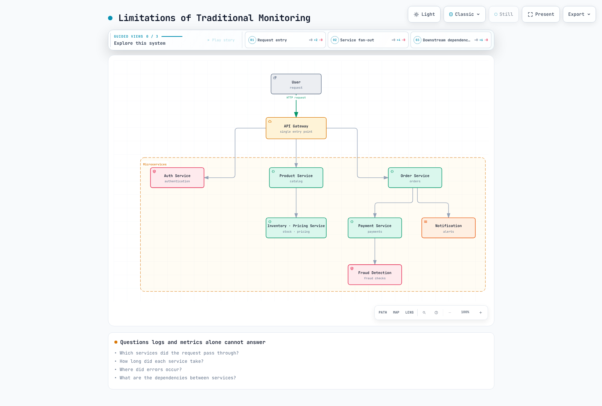
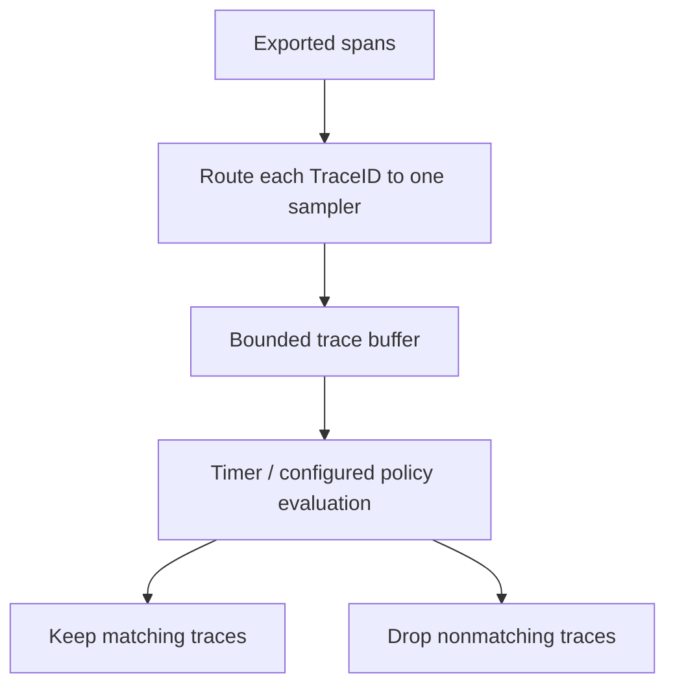

# Distributed Tracing Overview

> **Last Updated**: September 13, 2026

## Introduction

Distributed tracing records instrumented operations across process boundaries and relates them through propagated context. A stored trace is the **observed set of spans**, not proof that every operation or request was captured. Instrumentation, sampling, export, storage and retention determine what is visible.

## The Need for Distributed Tracing

### Limitations of Traditional Monitoring

Logs and metrics without shared context can make a request's path and timing difficult to reconstruct. Traces complement those signals by representing causal relationships:

- Which instrumented services participated?
- Which operation was slow or failed?
- Which work overlapped, waited or retried?
- What additional logs and resource metrics support the diagnosis?



[View interactive diagram](https://www.atomai.click/kubernetes-docs/archmaps/en-observability-tracing-readme-0.html)

The figure illustrates why correlation helps. It does not imply that appropriately correlated logs can never answer these questions, or that a trace alone proves root cause.

## Core Concepts

### 1. Trace

A trace groups spans sharing a TraceID. Parent-child relationships describe work causally associated with that trace. Missing instrumentation or data loss can leave gaps.

Consider this **illustrative timeline**, in milliseconds relative to the root start:

| Span | Start | End | Duration |
|---|---:|---:|---:|
| API gateway root | 0 | 650 | 650 |
| User service | 20 | 70 | 50 |
| Order service | 100 | 600 | 500 |
| Payment service, child of Order | 250 | 550 | 300 |
| Notification service, child of Order | 500 | 600 | 100 |

The observed window is 650ms. Adding all span durations gives 1,600ms because parent durations include child work and some children overlap. Do not add an inclusive parent duration to its descendants to calculate a “critical path.” Analyze actual start/end times and dependencies, including asynchronous work and clock skew.

### 2. Span

A span describes one instrumented operation:

| Field | Meaning | Example |
|---|---|---|
| TraceID | Identifier of the trace | `4bf92f3577b34da6a3ce929d0e0e4736` |
| SpanID | Identifier of this span | `00f067aa0ba902b7` |
| ParentSpanID | Parent's span identifier; absent for a root | `b7ad6b7169203331` |
| Name | Low-cardinality operation name | `GET /api/users/{id}` |
| Start / end | Timestamps; duration follows from their difference | `2025-02-15T10:30:00Z` is an illustrative timestamp |
| Attributes | Typed metadata | `http.response.status_code=200` |
| Events | Timestamped events associated with the span | A recorded exception event |
| Status | `UNSET`, `OK` or `ERROR` | Leave Span status UNSET for successful HTTP requests unless instrumentation specifies otherwise |

OpenTelemetry uses **attributes** and **events**, rather than treating span events as a copy of all application logs. Initial attributes/links may be present at span creation; more events/attributes/status updates can follow. The duration is not known when the span starts. Recording an exception and setting error status are distinct API operations.

### 3. Span Relationships and Hierarchy


[View interactive diagram](https://www.atomai.click/kubernetes-docs/archmaps/en-observability-tracing-readme-3.html)

`span001`–`span005` in the diagram are **symbolic labels**, not valid wire-format SpanIDs. A span has at most one parent. **Links** can associate spans in the same or different traces, which is useful for asynchronous messaging, batches and work with multiple causal inputs; those links are not shown in this simple tree.

### 4. SpanContext

SpanContext is immutable trace identity/propagation information. This YAML is a conceptual representation, not an SDK configuration file:

```yaml
SpanContext:
  trace_id: "4bf92f3577b34da6a3ce929d0e0e4736"
  span_id: "00f067aa0ba902b7"
  trace_flags: "01"
  trace_state: "vendor=value"
  is_remote: false
```

OpenTelemetry TraceIDs are 16 bytes, displayed as 32 lowercase hex characters; SpanIDs are 8 bytes, displayed as 16. A valid SpanContext has nonzero IDs. `is_remote` distinguishes an extracted remote parent from a locally created span. `01` sets the sampled bit; the flag is not proof that the backend stored the trace.

Baggage is separate from SpanContext and `tracestate`. Do not place credentials or personal information in propagated context, and do not treat a caller-supplied trace ID as authentication.

## Context Propagation

Propagation carries identity across boundaries; it does not by itself instrument an operation or export a span. Use the framework/SDK propagator to inject and extract headers and to attach/detach the active context correctly.

### W3C Trace Context (Recommended)

```http
traceparent: 00-4bf92f3577b34da6a3ce929d0e0e4736-00f067aa0ba902b7-01
tracestate: vendor=value
```

For version `00`, the fields are:

```text
version(2 hex)-trace_id(32 hex)-parent_id(16 hex)-trace_flags(2 hex)
```

The wire `parent_id` is the **sending span's SpanID**, used as the remote parent when the receiver creates its child. It is not the sender's own ParentSpanID. Invalid lengths, non-hex IDs and all-zero IDs must not be copied into examples; use the implementation's validation rules rather than constructing headers from arbitrary strings.

### B3 Propagation (Zipkin Compatible)

B3 allows a 64-bit or 128-bit TraceID and a 64-bit SpanID. These two examples carry the same sampled context:

```http
b3: 4bf92f3577b34da6a3ce929d0e0e4736-00f067aa0ba902b7-1
```

```http
X-B3-TraceId: 4bf92f3577b34da6a3ce929d0e0e4736
X-B3-SpanId: 00f067aa0ba902b7
X-B3-Sampled: 1
```

The optional ParentSpanID has its own rules and is omitted here. B3 also supports sampling-only and debug forms. HTTP header names are case-insensitive; other transports may need normalized names. If both B3 forms are present, the single-header form takes precedence according to the specification.

### Propagation Format Comparison

| Format | Typical fields | Selection consideration |
|---|---|---|
| W3C Trace Context | `traceparent`, `tracestate` | Standards-based interoperability |
| B3 single | `b3` | Existing Zipkin/B3 integrations |
| B3 multi | `X-B3-*` | Existing integrations and separately visible fields |
| Jaeger legacy | `uber-trace-id` | Legacy compatibility; verify the installed propagator |

Configure both ends consistently and test HTTP/gRPC/messaging boundaries. Avoid simultaneous competing propagators that extract different parents. A standardized header does not guarantee that proxies, queues or asynchronous tasks preserve it.

## Sampling Strategies

Sampling can reduce retained data and overhead. It also changes which questions can be answered from traces. State the decision point, probability/policy and missing-data behavior.

### Head-based Sampling


[View interactive diagram](https://www.atomai.click/kubernetes-docs/archmaps/en-observability-tracing-readme-4.html)

The 10%/90% split is a configured probability, not an exact count for a small run. The diagram assumes instrumentation, propagation and delivery work; “collected” is not an unconditional guarantee that every child span is available.

For an SDK/autoconfiguration mechanism supporting the standard environment variables:

```bash
export OTEL_TRACES_SAMPLER=parentbased_traceidratio
export OTEL_TRACES_SAMPLER_ARG=0.1
```

ParentBased honors the parent decision; the ratio applies to roots using its configured delegate. A sampled remote parent can therefore produce a sampled child decision even when the local root ratio is zero. Check the chosen language SDK's configuration support. Do not present a made-up `sampling: {type, ratio}` YAML object as universal SDK configuration.

Head sampling is relatively simple but cannot know future errors or latency. An unsampled request may later become important, and tail sampling cannot recreate spans never recorded/exported upstream.

### Tail-based Sampling

Tail sampling evaluates **received** trace data against policies. It does not receive an infallible “all spans are complete” notification.



Collector Contrib **0.160.0** supports this processor fragment; integrate it into a complete traces pipeline:

```yaml
processors:
  tail_sampling:
    decision_wait: 10s
    num_traces: 10000
    policies:
    - name: errors
      type: status_code
      status_code:
        status_codes:
        - ERROR
    - name: slow-requests
      type: latency
      latency:
        threshold_ms: 1000
    - name: probabilistic
      type: probabilistic
      probabilistic:
        sampling_percentage: 10
```

In the default `trace-complete` strategy, evaluation uses accumulated spans on the timer path. `decision_wait` starts from received trace data, not a guarantee of request completion. The current processor also has a distinct `span-ingest` strategy; its policy compatibility and timing differ.

The status policy matches observed span status `ERROR`, not every application error string. The latency policy uses the earliest start and latest end in the received trace. The probabilistic policy can retain additional eligible traces, so ordinary traces are not universally discarded.

Route all spans for a TraceID to the same sampler instance. Account for late arrivals, decision caches, restarts, upstream sampling/export failures, trace-count/byte limits and buffer eviction. `num_traces` is not a process-memory limit. Size from traffic and span size, and observe drop/eviction/late-span metrics. **Tail sampling cannot guarantee that no important request is missed.**

### Sampling Strategy Comparison

| Strategy | Decision information | Trade-off |
|---|---|---|
| Head | Information available at span creation/parent decision | Lower buffering needs, but future outcomes may be missed |
| Tail | Received spans and configured policy/timing | More state and routing requirements; incomplete traces remain possible |
| Adaptive | Policy changes with observed traffic or budget | Product/implementation-specific; validate its control loop and limits |

There is no universal “accuracy: medium/high” ranking. Evaluate whether the retained population answers the intended diagnostic or statistical question. Sampling all error traces can intentionally bias error proportions.

## Trace-Log-Metric Correlation

### Linking Logs via TraceID

Prefer the supported logging instrumentation for your framework. If manually using SLF4J MDC, restore the previous context even when the operation throws:

```java
import java.util.Map;
import org.slf4j.MDC;
import io.opentelemetry.api.trace.Span;
import io.opentelemetry.api.trace.SpanContext;

public final class TraceMdc {
    private TraceMdc() {}

    public static void run(Runnable operation) {
        Map<String, String> previous = MDC.getCopyOfContextMap();
        try {
            SpanContext context = Span.current().getSpanContext();
            if (context.isValid()) {
                MDC.put("traceId", context.getTraceId());
                MDC.put("spanId", context.getSpanId());
            } else {
                MDC.remove("traceId");
                MDC.remove("spanId");
            }
            operation.run();
        } finally {
            if (previous == null) {
                MDC.clear();
            } else {
                MDC.setContextMap(previous);
            }
        }
    }
}
```

Use `TraceMdc.run(() -> logger.info("Processing order"));` with the required OpenTelemetry/SLF4J dependencies and a compatible logging backend. Configure the encoder/pattern to include `traceId` and `spanId`; putting values into MDC alone does not make them appear in output.

The validity check avoids logging all-zero IDs from an inactive context. MDC is thread-local; propagating OpenTelemetry context and MDC into asynchronous work requires the appropriate framework mechanism. This helper scopes synchronous logging and does not claim to solve arbitrary thread hand-offs.

### Linking Metrics via Exemplars

This is **OpenMetrics exposition text**, not YAML. An exemplar has labels and an observation value; an optional timestamp can follow:

```text
# TYPE http_request_duration_seconds histogram
http_request_duration_seconds_bucket{le="0.5"} 1 # {trace_id="4bf92f3577b34da6a3ce929d0e0e4736"} 0.42
http_request_duration_seconds_bucket{le="+Inf"} 1
http_request_duration_seconds_sum 0.42
http_request_duration_seconds_count 1
# EOF
```

The exemplar is one representative 0.42-second observation in the histogram bucket. It is not proof that this request was the exact p99 boundary. Exporter/remote-write preservation, backend exemplar storage and Grafana datasource linking must all work. Trace sampling/retention can leave an exemplar whose trace is unavailable.

### Correlation in Grafana


[View interactive diagram](https://www.atomai.click/kubernetes-docs/archmaps/en-observability-tracing-readme-6.html)

The short `abc123` in this older diagram is an abbreviation, not a valid W3C TraceID. Use the full ID in actual data. Align `trace_id`/`traceId`/`traceID`, datasource UIDs, time padding and resource/log label mappings. Verify one real request across all signals; navigation links alone do not prove successful correlation.

## Solution Comparison

### Distributed Tracing Solution Comparison

| Solution | Model / capabilities to evaluate | Deployment and cost considerations |
|---|---|---|
| [Tempo](https://github.com/grafana/tempo/tree/v3.0.3) | TraceQL and Grafana integration | Compute, ingestion, storage, queries, requests and networking; not “storage cost only” |
| [AWS X-Ray](https://docs.aws.amazon.com/xray/latest/devguide/aws-xray.html) | AWS-managed request tracing and filtering | Supported instrumentation/OTel path, IAM, quotas, retention and usage charges |
| [Jaeger](https://www.jaegertracing.io/docs/2.20/architecture/) | Query/UI and configurable collector/storage architecture | Choose supported storage, ingestion topology and collector processors; not inherently head-sampling-only |
| [Datadog APM](https://docs.datadoghq.com/tracing/) | Managed APM/search/analytics | Agent/OTel mapping, retention/indexing/sampling and actual plan terms |
| [Dynatrace](https://docs.dynatrace.com/docs/observe/application-observability/distributed-tracing) | OneAgent/OTel ingestion; Grail/DQL tracing capabilities | Deployment mode, permissions, retention, processing and actual consumption/plan terms |

Sampling can occur in SDKs, collectors and backend-specific components. “Native OTel support” does not mean every signal attribute, span link, sampling policy or resource limit is identical across products. AI-assisted features depend on the surrounding platform and plan; do not reduce that to a permanent yes/no property of a storage backend.

### Selection Guide

Start with interoperability, investigation workflow, security/data residency, operational ownership and expected volume. Prototype the actual ingestion/query path and compare total operating cost under the same retention and reliability requirements. Neither open source nor an existing Grafana stack guarantees the lowest cost.

## Best Practices

### 1. Instrumentation Strategy

Instrument meaningful service boundaries—HTTP/gRPC, database clients, messaging and external APIs—using the supported libraries. Add internal/cache/file spans where they answer a concrete diagnostic question. Avoid automatically creating a span for every tiny function or exposing sensitive request/query bodies.

Plan context propagation, span kinds, error-status behavior and asynchronous links along with export. Instrumentation coverage and the sampling decision are separate controls.

### 2. Span Naming Conventions

Use low-cardinality names based on the selected semantic convention:

```text
GET /api/users/{id}
SELECT users
GET
send orders
```

The Redis-style `GET` name must not embed an actual key such as `user:123`. Store appropriate, non-sensitive context in attributes. Avoid random IDs, literal SQL values and entire URLs in span names.

### 3. Tag Standardization

For current conventions, inspect the SDK's emitted schema and migration mode:

```yaml
attributes:
  http.request.method: GET
  http.response.status_code: 200
  http.route: /api/users/{id}
  db.system.name: postgresql
  db.operation.name: SELECT
resource:
  service.name: user-service
  service.version: 1.2.3
```

This describes example attributes, not a universal instrumentation configuration. Older data may use `http.method`, `http.status_code`, `db.system`, `db.operation` or `db.statement`. Renaming a query does not transform that data. Capture `db.query.text` only under a reviewed sanitization policy; prefer useful summaries that do not expose literals or credentials.

## Next Steps

- [Grafana Tempo](./01-tempo.md)
- [AWS X-Ray](./02-xray.md)
- [OpenTelemetry](./03-opentelemetry.md)
- [Dynatrace](./04-dynatrace.md)

## References and Validation Scope

- [W3C Trace Context](https://www.w3.org/TR/trace-context/)
- [B3 propagation](https://github.com/openzipkin/b3-propagation)
- [OpenTelemetry Trace API](https://opentelemetry.io/docs/specs/otel/trace/api/)
- [SDK environment variables](https://opentelemetry.io/docs/specs/otel/configuration/sdk-environment-variables/)
- [Collector 0.160 tail sampling](https://github.com/open-telemetry/opentelemetry-collector-contrib/blob/v0.160.0/processor/tailsamplingprocessor/README.md)
- [OpenMetrics specification](https://github.com/prometheus/OpenMetrics/blob/main/specification/OpenMetrics.md)
- [SLF4J MDC API](https://www.slf4j.org/apidocs/org/slf4j/MDC.html)
- [HTTP semantic conventions](https://opentelemetry.io/docs/specs/semconv/http/http-spans/)
- [Database semantic conventions](https://opentelemetry.io/docs/specs/semconv/db/database-spans/)

Native checks used OpenTelemetry Python API/SDK/B3 1.44.0, prometheus-client's OpenMetrics parser and Collector Contrib 0.160.0 with synthetic local data. Java MDC code was checked against the API and language semantics, without a Java runtime execution. No real distributed application, vendor backend, trace-affinity cluster, performance benchmark or cloud deployment was tested.

## Quiz

- [Tempo quiz](../../quizzes/observability/tracing/01-tempo-quiz.md)
- [X-Ray quiz](../../quizzes/observability/tracing/02-xray-quiz.md)
- [OpenTelemetry quiz](../../quizzes/observability/tracing/03-opentelemetry-quiz.md)
- [Dynatrace quiz](../../quizzes/observability/tracing/04-dynatrace-quiz.md)
