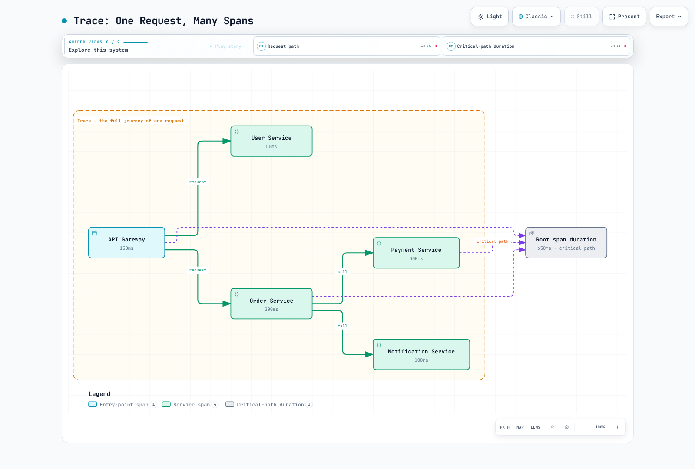
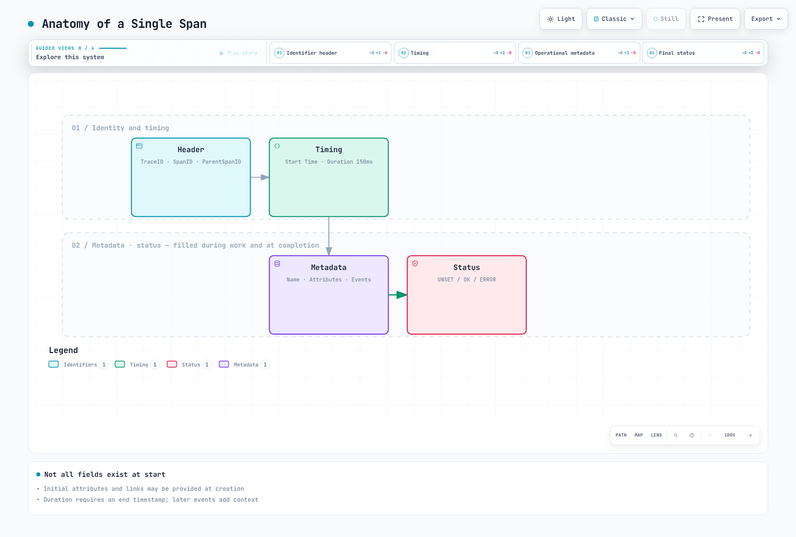
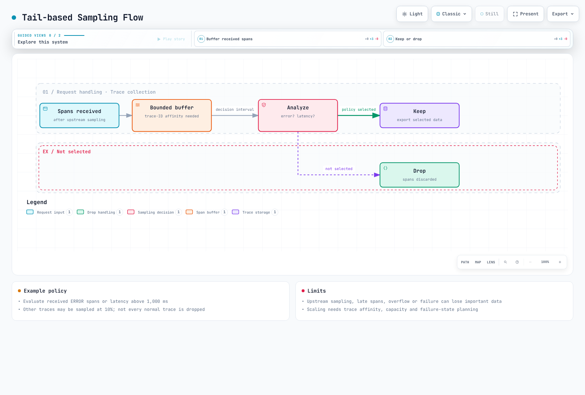

# Distributed Tracing Overview

> **Last Updated**: February 20, 2026

## Introduction

Distributed Tracing is a technique for tracking the complete path of requests as they traverse multiple services in microservices architectures. In modern systems where a single request can pass through dozens of services, distributed tracing is essential for identifying performance bottlenecks and troubleshooting issues.

## The Need for Distributed Tracing

### Limitations of Traditional Monitoring

In microservices environments, traditional logging and metrics alone cannot answer these questions:

- Which services did the request pass through?
- How long did each service take?
- Where did errors occur?
- What are the dependencies between services?


[🔍 View interactive diagram](https://www.atomai.click/kubernetes-docs/archmaps/en-observability-tracing-readme-0.html)

## Core Concepts

### 1. Trace

A Trace represents the complete journey of a single request. It is the collection of all operations generated as a request passes through the system.



[🔍 View interactive diagram](https://www.atomai.click/kubernetes-docs/archmaps/en-observability-tracing-readme-1.html)

### 2. Span

A Span represents a single unit of work. Each Span contains the following information:

| Field | Description | Example |
|-------|-------------|---------|
| **TraceID** | Unique identifier for the entire trace | `abc123def456` |
| **SpanID** | Unique identifier for the individual Span | `span789` |
| **ParentSpanID** | Identifier of the parent Span | `span456` |
| **Operation Name** | Name of the operation | `HTTP GET /api/users` |
| **Start Time** | Start timestamp | `2025-02-15T10:30:00Z` |
| **Duration** | Time taken | `150ms` |
| **Tags** | Metadata | `http.status_code=200` |
| **Logs** | Event records | `error: connection timeout` |



[🔍 View interactive diagram](https://www.atomai.click/kubernetes-docs/archmaps/en-observability-tracing-readme-2.html)

### 3. Span Relationships and Hierarchy

Spans form parent-child relationships creating a tree structure:


[🔍 View interactive diagram](https://www.atomai.click/kubernetes-docs/archmaps/en-observability-tracing-readme-3.html)

### 4. SpanContext

SpanContext is the trace information propagated between services:

```yaml
# SpanContext Components
SpanContext:
  trace_id: "abc123def456789"      # Trace identifier
  span_id: "span789"               # Current Span identifier
  trace_flags: "01"                # Sampling flag
  trace_state: "vendor=value"      # Vendor-specific additional info
```

## Context Propagation

The method of passing trace context between services.

### W3C Trace Context (Recommended)

Propagation using W3C standard headers:

```http
# HTTP Request Headers
traceparent: 00-abc123def456789012345678901234-span12345678-01
tracestate: rojo=00f067aa0ba902b7,congo=t61rcWkgMzE
```

**traceparent format:**
```
version-trace_id-parent_id-trace_flags
00     -abc123...-span1234...-01
```

### B3 Propagation (Zipkin Compatible)

Propagation format used by Zipkin:

```http
# Single header format
b3: abc123def456789-span12345678-1-parent12345678

# Multi-header format
X-B3-TraceId: abc123def456789
X-B3-SpanId: span12345678
X-B3-ParentSpanId: parent12345678
X-B3-Sampled: 1
```

### Propagation Format Comparison

| Format | Headers | Advantages | Disadvantages |
|--------|---------|------------|---------------|
| **W3C Trace Context** | `traceparent`, `tracestate` | Standard, extensible | Relatively new |
| **B3 Single** | `b3` | Simple, single header | Zipkin-specific |
| **B3 Multi** | `X-B3-*` | Easy debugging | Many headers |
| **Jaeger** | `uber-trace-id` | Jaeger optimized | Vendor lock-in |

## Sampling Strategies

Tracing all requests causes cost and performance issues. Sampling manages this.

### Head-based Sampling

Sampling decision at request start:


[🔍 View interactive diagram](https://www.atomai.click/kubernetes-docs/archmaps/en-observability-tracing-readme-4.html)

**Advantages:**
- Simple implementation
- Low overhead
- Consistent sampling decisions

**Disadvantages:**
- May miss important requests
- May skip requests with errors or latency

**Configuration Example:**
```yaml
# OpenTelemetry SDK Configuration
sampling:
  type: parentbased_traceidratio
  ratio: 0.1  # 10% sampling
```

### Tail-based Sampling

Sampling decision after request completion based on results:



[🔍 View interactive diagram](https://www.atomai.click/kubernetes-docs/archmaps/en-observability-tracing-readme-5.html)

**Advantages:**
- Never miss important requests (errors, latency)
- More intelligent sampling
- Cost effective

**Disadvantages:**
- Complex implementation
- Higher memory usage
- Must temporarily store all Spans

**OTEL Collector Tail Sampling Configuration:**
```yaml
processors:
  tail_sampling:
    decision_wait: 10s
    num_traces: 100000
    policies:
      # Collect all error requests
      - name: errors
        type: status_code
        status_code:
          status_codes: [ERROR]
      # Collect slow requests
      - name: slow-requests
        type: latency
        latency:
          threshold_ms: 1000
      # 10% sampling for the rest
      - name: probabilistic
        type: probabilistic
        probabilistic:
          sampling_percentage: 10
```

### Sampling Strategy Comparison

| Strategy | Decision Point | Resource Usage | Accuracy | Use Case |
|----------|---------------|----------------|----------|----------|
| **Head-based** | Request start | Low | Medium | Most cases |
| **Tail-based** | Request completion | High | High | Error/latency focused |
| **Adaptive** | Dynamic | Medium | High | High traffic variability |

## Trace-Log-Metric Correlation

### Linking Logs via TraceID

```java
// Java logging example (SLF4J + MDC)
import org.slf4j.MDC;
import io.opentelemetry.api.trace.Span;

public void processOrder(Order order) {
    Span span = Span.current();
    MDC.put("traceId", span.getSpanContext().getTraceId());
    MDC.put("spanId", span.getSpanContext().getSpanId());

    logger.info("Processing order: {}", order.getId());
    // Log output: {"traceId": "abc123", "spanId": "span456", "message": "Processing order: 12345"}
}
```

### Linking Metrics via Exemplars

```yaml
# Linking TraceID to Prometheus metrics
http_request_duration_seconds_bucket{le="0.5"} 1000 # {traceID="abc123"}
http_request_duration_seconds_bucket{le="1.0"} 1500 # {traceID="def456"}
```

### Correlation in Grafana


[🔍 View interactive diagram](https://www.atomai.click/kubernetes-docs/archmaps/en-observability-tracing-readme-6.html)

## Solution Comparison

### Distributed Tracing Solution Comparison

| Feature | Tempo | X-Ray | Jaeger | Datadog APM | Dynatrace |
|---------|-------|-------|--------|-------------|-----------|
| **Type** | Open Source | AWS Managed | Open Source | Commercial SaaS | Commercial SaaS |
| **Storage** | Object Storage | AWS Internal | Cassandra/ES | Datadog | Dynatrace |
| **Query Language** | TraceQL | Filter Expressions | - | - | DQL |
| **Sampling** | Head/Tail | Rule-based | Head | Dynamic | Dynamic |
| **OTEL Support** | Native | Native | Native | Native | Native |
| **Service Map** | Grafana Integration | Built-in | Built-in | Built-in | Built-in |
| **AI Analysis** | None | None | None | Watchdog | Davis AI |
| **Cost** | Storage cost only | Usage-based | Infrastructure cost | Host/span-based | Host-based |
| **EKS Integration** | Manual config | Native | Manual config | Agent deployment | OneAgent |

### Selection Guide


[🔍 View interactive diagram](https://www.atomai.click/kubernetes-docs/archmaps/en-observability-tracing-readme-7.html)

## Best Practices

### 1. Instrumentation Strategy

```yaml
# Recommended instrumentation scope
instrumentation:
  # Always instrument
  always:
    - HTTP requests/responses
    - gRPC calls
    - Database queries
    - Message queue operations
    - External API calls

  # Optional instrumentation
  optional:
    - Internal function calls
    - Cache operations
    - File I/O
```

### 2. Span Naming Conventions

```yaml
# Good examples
- "HTTP GET /api/users/{id}"
- "PostgreSQL SELECT users"
- "Redis GET user:123"
- "Kafka SEND orders"

# Bad examples
- "http call"
- "db query"
- "process"
- "span1"
```

### 3. Tag Standardization

```yaml
# OpenTelemetry Semantic Conventions
tags:
  # HTTP
  http.method: GET
  http.url: https://api.example.com/users
  http.status_code: 200

  # Database
  db.system: postgresql
  db.statement: SELECT * FROM users
  db.operation: SELECT

  # Service
  service.name: user-service
  service.version: 1.2.3
```

## Next Steps

Once you understand distributed tracing concepts, learn specific tool usage in the following sections:

- [Grafana Tempo](./01-tempo.md): Grafana stack's distributed tracing backend
- [AWS X-Ray](./02-xray.md): AWS native distributed tracing
- [OpenTelemetry](./03-opentelemetry.md): Standardized instrumentation framework
- [Dynatrace](./04-dynatrace.md): AI-powered APM solution

## Quiz

Test your knowledge with the tool-specific quizzes:
- [Tempo Quiz](../../quizzes/observability/tracing/01-tempo-quiz.md)
- [X-Ray Quiz](../../quizzes/observability/tracing/02-xray-quiz.md)
- [OpenTelemetry Quiz](../../quizzes/observability/tracing/03-opentelemetry-quiz.md)
- [Dynatrace Quiz](../../quizzes/observability/tracing/04-dynatrace-quiz.md)
