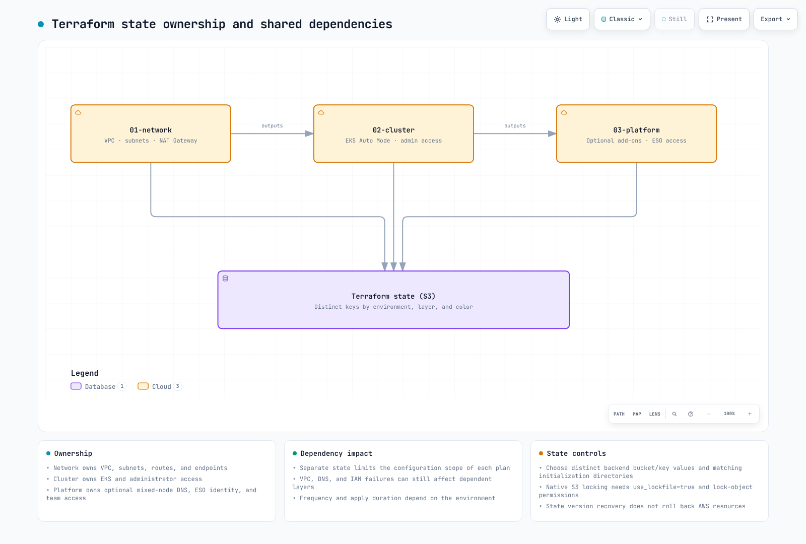
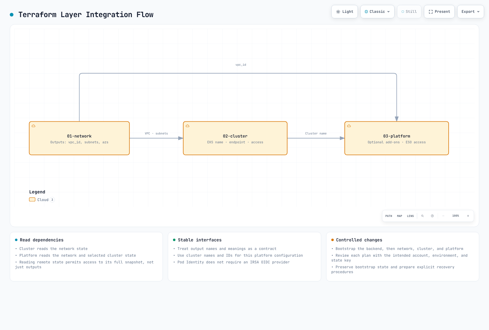

# Infrastructure Setup

> **Validation baseline**: Terraform 1.15.7, AWS Provider 6.64.0, EKS module 21.25.0, VPC module 6.7.2, Pod Identity module 2.9.0
> **Last reviewed**: September 11, 2026. Local schema/mock-plan validation; not a live AWS deployment result.

< [Table of Contents](./README.md) | [Next: NLB Weighted Routing and Blue/Green Clusters](02-infrastructure-advanced.md) >

This example describes **an account/environment-specific state bucket and blue/green clusters in one Region**. Built-in Auto Mode pools can use multiple configured AZs. Color names or subnet tags do not pin workers to one AZ. For single-AZ worker cells, design NodePool/NodeClass placement, routing, and recovery capacity separately using [Zonal Operations](15-zonal-operations-guide.md).

Create the example files in a separate `eks-terraform/` project. Terraform does not automatically inherit `.tf` files from a parent `00-shared` directory; use each root’s declarations and avoid copying duplicate variables/locals alongside them. For existing v20/v5 state, review module migration guides and the real plan before upgrading. Retain each root’s `.terraform.lock.hcl` and pin module versions separately too.

The API endpoint is private by default. kubectl validation and GitOps controllers require actual API connectivity, such as a VPC runner or VPN. This guide does not provision that access path.

***

## Overview

This guide presents a Terraform reference architecture for deploying Amazon EKS clusters with Auto Mode enabled. The 3-layer approach separates infrastructure concerns by change frequency, ownership, and blast radius, enabling teams to work independently while maintaining operational safety.

**Key Design Principles:**

* **Separation of Concerns**: Each layer has distinct ownership and change patterns
* **Blast Radius Minimization**: State separation reduces change scope; dependency failures can still affect other layers
* **State Isolation**: Independent Terraform state files per layer
* **GitOps Ready**: Terraform manages AWS infrastructure; Kubernetes resources are managed by ArgoCD

***

## 1. 3-Layer Architecture Introduction

### Why Separate Layers?

Traditional monolithic Terraform configurations create several operational challenges:

1. **Long Plan/Apply Times**: Every change requires evaluating all resources
2. **Blast Radius**: A single misconfiguration can affect the entire infrastructure
3. **Team Conflicts**: Multiple teams competing for the same state file
4. **Change Risk**: Network changes bundled with application changes increase deployment risk

The 3-layer architecture addresses these challenges by organizing infrastructure into distinct tiers based on stability and ownership.

### Layer Characteristics (illustrative frequencies)

| Layer | Name     | Change Frequency | Primary Owner       | Blast Radius | Dependencies           |
| ----- | -------- | ---------------- | ------------------- | ------------ | ---------------------- |
| 01    | Network  | Quarterly        | Infrastructure Team | High         | None                   |
| 02    | Cluster  | Monthly          | Platform Team       | Medium       | 01-network             |
| 03 | Platform | Weekly | Platform/App Teams | DNS/access changes can affect the cluster | 01-network, 02-cluster |

### Directory Structure

```
eks-terraform/
├── 00-shared/
│   ├── variables.tf          # Common variables across all layers
│   ├── bootstrap/main.tf     # Local state creates the S3 backend
│   └── providers.tf.template # Provider configuration template
├── 01-network/
│   ├── main.tf               # VPC, subnets, NAT Gateway
│   ├── variables.tf          # Network-specific variables
│   ├── outputs.tf            # VPC ID, subnet IDs for downstream
│   ├── backend.tf            # S3 backend: network/terraform.tfstate
│   └── providers.tf
├── 02-cluster/
│   ├── main.tf               # EKS cluster with Auto Mode
│   ├── data.tf               # Remote state from 01-network
│   ├── variables.tf          # Cluster-specific variables
│   ├── outputs.tf            # Cluster endpoint, OIDC provider
│   ├── backend.tf            # S3 backend: cluster/terraform.tfstate
│   └── providers.tf
└── 03-platform/
    ├── main.tf               # Add-ons, Pod Identity, RBAC
    ├── data.tf               # Remote state from 01-network, 02-cluster
    ├── variables.tf          # Platform-specific variables
    ├── outputs.tf            # Add-on ARNs, role mappings
    ├── backend.tf            # S3 backend: platform/terraform.tfstate
    └── providers.tf
```

Include these paths in the new project’s .gitignore. Keep each root’s .terraform.lock.hcl in version control.

```text
.terraform/
.terraform-data/
.bootstrap-state/
*.tfstate
*.tfstate.*
*.tfplan
```

### Change Flow Visualization



[🔍 View interactive diagram](https://www.atomai.click/kubernetes-docs/archmaps/en-ops-01-infrastructure-setup-0.html)

***

## 2. 00-shared: Common Configuration

The shared layer contains configuration templates and common variables used across all layers. These are naming examples, not automatically imported parent configuration.

### S3 Backend Configuration

First, create the S3 bucket for Terraform state management:

> **Note**: Starting from Terraform 1.10, the S3 backend supports native state locking via `use_lockfile = true`, leveraging S3 conditional writes. This eliminates the need for a DynamoDB table for state locking.

```hcl
# 00-shared/bootstrap/main.tf
# Run this once to create backend infrastructure

terraform {
  backend "local" {}
  required_version = ">= 1.10.0"
  required_providers {
    aws = {
      source  = "hashicorp/aws"
      version = "6.64.0"
    }
  }
}

provider "aws" {
  region = var.region
}

variable "region" {
  description = "AWS region"
  type        = string
  default     = "ap-northeast-2"
}

variable "project_name" {
  description = "Project name for resource naming"
  type        = string
  default     = "eks-platform"
}

variable "environment" {
  description = "Environment name"
  type        = string
  default     = "prod"
}

locals {
  bucket_name = "${var.project_name}-${var.environment}-${data.aws_caller_identity.current.account_id}-tfstate"
}

# S3 bucket for Terraform state
resource "aws_s3_bucket" "terraform_state" {
  bucket = local.bucket_name

  lifecycle {
    prevent_destroy = true
  }

  tags = {
    Name        = local.bucket_name
    Environment = var.environment
    ManagedBy   = "terraform"
  }
}

resource "aws_s3_bucket_versioning" "terraform_state" {
  bucket = aws_s3_bucket.terraform_state.id
  versioning_configuration {
    status = "Enabled"
  }
}

resource "aws_s3_bucket_server_side_encryption_configuration" "terraform_state" {
  bucket = aws_s3_bucket.terraform_state.id

  rule {
    apply_server_side_encryption_by_default {
      sse_algorithm = "aws:kms"
    }
    bucket_key_enabled = true
  }
}

resource "aws_s3_bucket_public_access_block" "terraform_state" {
  bucket = aws_s3_bucket.terraform_state.id

  block_public_acls       = true
  block_public_policy     = true
  ignore_public_acls      = true
  restrict_public_buckets = true
}

output "state_bucket_name" {
  value = aws_s3_bucket.terraform_state.id
}

data "aws_caller_identity" "current" {}
```

### Common Variables

```hcl
# 00-shared/variables.tf
# Common variables used across all layers

variable "region" {
  description = "AWS region for all resources"
  type        = string
  default     = "ap-northeast-2"
}

variable "environment" {
  description = "Environment name (dev, staging, prod)"
  type        = string
  default     = "prod"

  validation {
    condition     = contains(["dev", "staging", "prod"], var.environment)
    error_message = "Environment must be dev, staging, or prod."
  }
}

variable "project_name" {
  description = "Project name used for resource naming"
  type        = string
  default     = "eks-platform"

  validation {
    condition     = can(regex("^[a-z][a-z0-9-]{2,20}$", var.project_name))
    error_message = "Project name must be lowercase, start with letter, 3-21 chars."
  }
}

variable "common_tags" {
  description = "Common tags applied to all resources"
  type        = map(string)
  default = {
    ManagedBy = "terraform"
    Project   = "eks-platform"
  }
}

locals {
  # Standard naming convention
  name_prefix = "${var.project_name}-${var.environment}"

  # Merge common tags with environment
  tags = merge(var.common_tags, {
    Environment = var.environment
  })

  # Backend configuration
}
```

***

## 3. 01-network: VPC Configuration

The network layer establishes the foundational VPC infrastructure. This layer changes infrequently and requires careful planning due to its high blast radius.

### Design Considerations

The layout uses two distinct AZs. Blue/green identifies deployment environments; the default Auto Mode pools are not constrained to a single AZ. Size CIDRs for pod allocation, warm pools, endpoint ENIs, growth, and other VPC occupants. The example /16 is not a universal production recommendation or a guarantee against IP exhaustion.

### Main Configuration

```hcl
# 01-network/main.tf

terraform {
  required_version = ">= 1.10.0"
  required_providers {
    aws = {
      source  = "hashicorp/aws"
      version = "6.64.0"
    }
  }
}

provider "aws" {
  region = var.region

  default_tags {
    tags = local.tags
  }
}

locals {
  name_prefix = "${var.project_name}-${var.environment}"

  tags = {
    Environment = var.environment
    Project     = var.project_name
    ManagedBy   = "terraform"
    Layer       = "network"
  }

  # Availability zones for blue/green clusters
  azs = var.availability_zones

  # Subnet CIDR allocation
  # VPC: 10.0.0.0/16 (65,536 IPs)
  # Public subnets:  10.0.0.0/20, 10.0.16.0/20  (4,096 IPs each)
  # Private subnets: 10.0.128.0/18, 10.0.192.0/18 (16,384 IPs each)
  public_subnets  = [cidrsubnet(var.vpc_cidr, 4, 0), cidrsubnet(var.vpc_cidr, 4, 1)]
  private_subnets = [cidrsubnet(var.vpc_cidr, 2, 2), cidrsubnet(var.vpc_cidr, 2, 3)]
}

module "vpc" {
  source  = "terraform-aws-modules/vpc/aws"
  version = "6.7.2"

  name = "${local.name_prefix}-vpc"
  cidr = var.vpc_cidr

  azs             = local.azs
  public_subnets  = local.public_subnets
  private_subnets = local.private_subnets

  # NAT Gateway configuration
  enable_nat_gateway     = true
  single_nat_gateway     = false # One per AZ for HA
  one_nat_gateway_per_az = true

  # DNS settings
  enable_dns_hostnames = true
  enable_dns_support   = true

  # VPC Flow Logs
  enable_flow_log                      = true
  create_flow_log_cloudwatch_log_group = true
  create_flow_log_cloudwatch_iam_role  = true
  flow_log_max_aggregation_interval    = 60

  # Public subnet tags for EKS load balancers
  public_subnet_tags = {
    "kubernetes.io/role/elb" = "1"
    Type                     = "public"
  }

  # Private subnet tags for EKS internal load balancers
  private_subnet_tags = {
    "kubernetes.io/role/internal-elb" = "1"
    Type                              = "private"
  }

  tags = local.tags
}

# Additional subnet tags for specific clusters
# Blue cluster (ap-northeast-2a)
# Green cluster (ap-northeast-2c)
# VPC endpoints reduce NAT traffic; compare endpoint hourly/data costs for the actual workload
module "vpc_endpoints" {
  source  = "terraform-aws-modules/vpc/aws//modules/vpc-endpoints"
  version = "6.7.2"

  vpc_id = module.vpc.vpc_id

  endpoints = {
    eks_auth = {
      service             = "eks-auth"
      private_dns_enabled = true
      subnet_ids          = module.vpc.private_subnets
      security_group_ids  = [aws_security_group.vpc_endpoints.id]
    }

    s3 = {
      service      = "s3"
      service_type = "Gateway"
      route_table_ids = concat(
        module.vpc.private_route_table_ids,
        module.vpc.public_route_table_ids
      )
      tags = { Name = "${local.name_prefix}-s3-endpoint" }
    }
    ecr_api = {
      service             = "ecr.api"
      private_dns_enabled = true
      subnet_ids          = module.vpc.private_subnets
      security_group_ids  = [aws_security_group.vpc_endpoints.id]
      tags                = { Name = "${local.name_prefix}-ecr-api-endpoint" }
    }
    ecr_dkr = {
      service             = "ecr.dkr"
      private_dns_enabled = true
      subnet_ids          = module.vpc.private_subnets
      security_group_ids  = [aws_security_group.vpc_endpoints.id]
      tags                = { Name = "${local.name_prefix}-ecr-dkr-endpoint" }
    }
    sts = {
      service             = "sts"
      private_dns_enabled = true
      subnet_ids          = module.vpc.private_subnets
      security_group_ids  = [aws_security_group.vpc_endpoints.id]
      tags                = { Name = "${local.name_prefix}-sts-endpoint" }
    }
    logs = {
      service             = "logs"
      private_dns_enabled = true
      subnet_ids          = module.vpc.private_subnets
      security_group_ids  = [aws_security_group.vpc_endpoints.id]
      tags                = { Name = "${local.name_prefix}-logs-endpoint" }
    }
  }

  tags = local.tags
}

# Security group for VPC endpoints
resource "aws_security_group" "vpc_endpoints" {
  name        = "${local.name_prefix}-vpc-endpoints-sg"
  description = "Security group for VPC endpoints"
  vpc_id      = module.vpc.vpc_id

  ingress {
    description = "HTTPS from VPC"
    from_port   = 443
    to_port     = 443
    protocol    = "tcp"
    cidr_blocks = [var.vpc_cidr]
  }

  tags = merge(local.tags, {
    Name = "${local.name_prefix}-vpc-endpoints-sg"
  })
}
```

### Variables

```hcl
# 01-network/variables.tf

variable "region" {
  description = "AWS region"
  type        = string
  default     = "ap-northeast-2"
}

variable "environment" {
  description = "Environment name"
  type        = string
  default     = "prod"
}

variable "project_name" {
  description = "Project name"
  type        = string
  default     = "eks-platform"
}

variable "vpc_cidr" {
  description = "VPC CIDR block"
  type        = string
  default     = "10.0.0.0/16"

  validation {
    condition     = can(cidrnetmask(var.vpc_cidr))
    error_message = "VPC CIDR must be a valid IPv4 CIDR block."
  }
}

variable "availability_zones" {
  description = "Two distinct standard Availability Zones in the selected region"
  type        = list(string)
  default     = ["ap-northeast-2a", "ap-northeast-2c"]
  validation {
    condition     = length(var.availability_zones) == 2 && length(distinct(var.availability_zones)) == 2
    error_message = "Choose two distinct Availability Zones for this layout."
  }
}
```

### Outputs

```hcl
# 01-network/outputs.tf

output "vpc_id" {
  description = "VPC ID"
  value       = module.vpc.vpc_id
}

output "vpc_cidr" {
  description = "VPC CIDR block"
  value       = module.vpc.vpc_cidr_block
}

output "private_subnet_ids" {
  description = "Private subnet IDs"
  value       = module.vpc.private_subnets
}

output "public_subnet_ids" {
  description = "Public subnet IDs"
  value       = module.vpc.public_subnets
}

output "private_subnet_cidrs" {
  description = "Private subnet CIDR blocks"
  value       = module.vpc.private_subnets_cidr_blocks
}

output "public_subnet_cidrs" {
  description = "Public subnet CIDR blocks"
  value       = module.vpc.public_subnets_cidr_blocks
}

output "nat_gateway_ids" {
  description = "NAT Gateway IDs"
  value       = module.vpc.natgw_ids
}

output "azs" {
  description = "Availability zones used"
  value       = module.vpc.azs
}

# Zone-specific outputs for blue/green clusters
output "blue_zone" {
  description = "Blue cluster availability zone"
  value       = module.vpc.azs[0]
}

output "green_zone" {
  description = "Green cluster availability zone"
  value       = module.vpc.azs[1]
}

output "blue_private_subnet_id" {
  description = "Blue cluster private subnet ID"
  value       = module.vpc.private_subnets[0]
}

output "green_private_subnet_id" {
  description = "Green cluster private subnet ID"
  value       = module.vpc.private_subnets[1]
}

output "blue_public_subnet_id" {
  description = "Blue cluster public subnet ID"
  value       = module.vpc.public_subnets[0]
}

output "green_public_subnet_id" {
  description = "Green cluster public subnet ID"
  value       = module.vpc.public_subnets[1]
}

output "vpc_endpoints_sg_id" {
  description = "VPC endpoints security group ID"
  value       = aws_security_group.vpc_endpoints.id
}
```

### Backend Configuration

```hcl
# 01-network/backend.tf

terraform {
  backend "s3" {
    key          = "network/terraform.tfstate"
    encrypt      = true
    use_lockfile = true
  }
}
```

***

## 4. 02-cluster: EKS Auto Mode

The cluster layer deploys EKS with Auto Mode enabled. Auto Mode simplifies cluster operations by automating compute, networking, and storage management.

### Understanding EKS Auto Mode

EKS Auto Mode provides:

* **Compute Auto Mode**: Automatic node provisioning and scaling
* **Network Auto Mode**: Managed VPC CNI with automatic IP management
* **Storage Auto Mode**: Managed block-storage integration; create the StorageClass explicitly

For more details on EKS Auto Mode, see [Getting Started with EKS Auto Mode](../eks-auto-mode/01-getting-started.md).

### Data Sources

```hcl
# 02-cluster/data.tf

# Reference network layer outputs
data "terraform_remote_state" "network" {
  backend = "s3"

  config = {
    bucket = "${var.project_name}-${var.environment}-${data.aws_caller_identity.current.account_id}-tfstate"
    key    = "network/terraform.tfstate"
    region = var.region
  }
}

# Current AWS account and region
data "aws_caller_identity" "current" {}
data "aws_region" "current" {}

# EKS cluster auth for kubectl provider
```

### Main Configuration

```hcl
# 02-cluster/main.tf

terraform {
  required_version = ">= 1.10.0"
  required_providers {
    aws = {
      source  = "hashicorp/aws"
      version = "6.64.0"
    }
  }
}

provider "aws" {
  region = var.region

  default_tags {
    tags = local.tags
  }
}

locals {
  name_prefix  = "${var.project_name}-${var.environment}"
  cluster_name = "${local.name_prefix}-${var.cluster_color}"

  tags = {
    Environment  = var.environment
    Project      = var.project_name
    ManagedBy    = "terraform"
    Layer        = "cluster"
    ClusterColor = var.cluster_color
  }

  # Network outputs from layer 01
  vpc_id             = data.terraform_remote_state.network.outputs.vpc_id
  private_subnet_ids = data.terraform_remote_state.network.outputs.private_subnet_ids
  public_subnet_ids  = data.terraform_remote_state.network.outputs.public_subnet_ids

  # Select subnet based on cluster color
  cluster_subnet_id = var.cluster_color == "blue" ? data.terraform_remote_state.network.outputs.blue_private_subnet_id : data.terraform_remote_state.network.outputs.green_private_subnet_id
}

module "eks" {
  source  = "terraform-aws-modules/eks/aws"
  version = "21.25.0"

  name               = local.cluster_name
  kubernetes_version = var.cluster_version

  # Network configuration
  vpc_id     = local.vpc_id
  subnet_ids = local.private_subnet_ids

  # Cluster endpoint access
  endpoint_public_access  = false
  endpoint_private_access = true

  # EKS Auto Mode Configuration
  compute_config = {
    enabled    = true
    node_pools = ["general-purpose", "system"]
  }

  # Enable Auto Mode for networking
  # Enable Auto Mode for storage
  # Control plane logging
  cloudwatch_log_group_retention_in_days = var.log_retention_days

  enabled_log_types = [
    "api",
    "audit",
    "authenticator",
    "controllerManager",
    "scheduler"
  ]

  # Encryption configuration
  iam_role_use_name_prefix      = false
  node_iam_role_use_name_prefix = false
  create_kms_key                = false
  encryption_config = {
    provider_key_arn = aws_kms_key.eks.arn
    resources        = ["secrets"]
  }

  # Access configuration - using Access Entries (recommended)
  authentication_mode = "API_AND_CONFIG_MAP"

  # Cluster access entries
  access_entries = {
    # Cluster admin
    admin = {
      kubernetes_groups = []
      principal_arn     = var.cluster_admin_arn
      policy_associations = {
        admin = {
          policy_arn = "arn:aws:eks::aws:cluster-access-policy/AmazonEKSClusterAdminPolicy"
          access_scope = {
            type = "cluster"
          }
        }
      }
    }
  }

  tags = local.tags
}

# KMS key for EKS secrets encryption
resource "aws_kms_key" "eks" {
  description             = "KMS key for EKS ${local.cluster_name} secrets encryption"
  deletion_window_in_days = 7
  enable_key_rotation     = true

  tags = merge(local.tags, {
    Name = "${local.cluster_name}-eks-secrets"
  })
}

resource "aws_kms_alias" "eks" {
  name          = "alias/${local.cluster_name}-eks-secrets"
  target_key_id = aws_kms_key.eks.key_id
}

# CloudWatch Log Group for EKS control plane logs
# Security group rules for cluster
resource "aws_security_group_rule" "cluster_ingress_vpc" {
  description       = "Allow VPC traffic to cluster API"
  type              = "ingress"
  from_port         = 443
  to_port           = 443
  protocol          = "tcp"
  cidr_blocks       = [data.terraform_remote_state.network.outputs.vpc_cidr]
  security_group_id = module.eks.cluster_security_group_id
}
```

### Variables

```hcl
# 02-cluster/variables.tf

variable "region" {
  description = "AWS region"
  type        = string
  default     = "ap-northeast-2"
}

variable "environment" {
  description = "Environment name"
  type        = string
  default     = "prod"
}

variable "project_name" {
  description = "Project name"
  type        = string
  default     = "eks-platform"
}

variable "cluster_color" {
  description = "Cluster color identifier (blue or green)"
  type        = string
  default     = "blue"

  validation {
    condition     = contains(["blue", "green"], var.cluster_color)
    error_message = "Cluster color must be blue or green."
  }
}

variable "cluster_version" {
  description = "EKS cluster version"
  type        = string
  default     = "1.36"
}

variable "cluster_admin_arn" {
  description = "IAM ARN for cluster admin access"
  type        = string
}

variable "log_retention_days" {
  description = "CloudWatch log retention in days"
  type        = number
  default     = 30
}
```

### Outputs

```hcl
# 02-cluster/outputs.tf

output "cluster_name" {
  description = "EKS cluster name"
  value       = module.eks.cluster_name
}

output "cluster_endpoint" {
  description = "EKS cluster API endpoint"
  value       = module.eks.cluster_endpoint
}

output "cluster_certificate_authority_data" {
  description = "Base64 encoded cluster CA certificate"
  value       = module.eks.cluster_certificate_authority_data
  sensitive   = true
}

output "cluster_arn" {
  description = "EKS cluster ARN"
  value       = module.eks.cluster_arn
}

output "cluster_version" {
  description = "EKS cluster Kubernetes version"
  value       = module.eks.cluster_version
}

output "cluster_security_group_id" {
  description = "EKS cluster security group ID"
  value       = module.eks.cluster_security_group_id
}

output "node_security_group_id" {
  description = "EKS node security group ID"
  value       = module.eks.node_security_group_id
}

output "oidc_provider_arn" {
  description = "OIDC provider ARN for IRSA"
  value       = module.eks.oidc_provider_arn
}

output "oidc_provider_url" {
  description = "OIDC provider URL"
  value       = module.eks.cluster_oidc_issuer_url
}

output "cluster_primary_security_group_id" {
  description = "EKS cluster primary security group ID"
  value       = module.eks.cluster_primary_security_group_id
}

output "kms_key_arn" {
  description = "KMS key ARN for secrets encryption"
  value       = aws_kms_key.eks.arn
}

output "cluster_color" {
  description = "Cluster color identifier"
  value       = var.cluster_color
}
```

### Backend Configuration

```hcl
# 02-cluster/backend.tf

terraform {
  backend "s3" {
    encrypt      = true
    use_lockfile = true
  }
}
```

***

## 5. 03-platform: Add-ons and Pod Identity

Do not duplicate Auto Mode’s built-in Pod Identity agent, node networking, or block-storage integration with ordinary aws-node/EBS CSI/agent add-ons. [Current Auto Mode](https://docs.aws.amazon.com/eks/latest/userguide/auto-networking.html) runs **node-local CoreDNS as a system service**. Pure Auto Mode needs no CoreDNS Deployment. Mixed clusters containing non-Auto nodes must retain the Deployment: set enable_coredns_addon=true and pin a compatible version. The example defaults to false. Create the Auto Mode StorageClass through GitOps with ebs.csi.eks.amazonaws.com using the [official instructions](https://docs.aws.amazon.com/eks/latest/userguide/create-storage-class.html).

This Pod Identity example lets the **External Secrets controller read explicitly named Secrets Manager/SSM values**. An association does not install ESO or create its ServiceAccount: configure the same namespace/SA through GitOps and use a supported SDK default credential chain. ListSecrets-based discovery is outside this minimal policy. Customer-managed KMS keys also require kms:Decrypt on the required key ARNs and permission in the key policy.

Image pulls use kubelet/node-role permissions, not application Pod Identity. Configure ArgoCD target-EKS authentication and OCI/ECR token refresh separately using [ArgoCD Installation](../gitops/argocd/01-installation.md) and [Applications](../gitops/argocd/02-applications.md). Cluster-layer administrators own their access entries; do not create the same principal again in the platform layer.


The platform layer manages EKS add-ons, Pod Identity associations, and access entries for application teams. This layer changes frequently as teams onboard and application requirements evolve.

### Data Sources

```hcl
# 03-platform/data.tf

# Reference network layer
data "terraform_remote_state" "network" {
  backend = "s3"

  config = {
    bucket = "${var.project_name}-${var.environment}-${data.aws_caller_identity.current.account_id}-tfstate"
    key    = "network/terraform.tfstate"
    region = var.region
  }
}

# Reference cluster layer
data "terraform_remote_state" "cluster" {
  backend = "s3"

  config = {
    bucket = "${var.project_name}-${var.environment}-${data.aws_caller_identity.current.account_id}-tfstate"
    key    = "cluster/${var.cluster_color}/terraform.tfstate"
    region = var.region
  }
}

# Current AWS account
data "aws_caller_identity" "current" {}
data "aws_region" "current" {}

# EKS cluster auth
```

### Main Configuration

```hcl
# 03-platform/main.tf

terraform {
  required_version = ">= 1.10.0"
  required_providers {
    aws = {
      source  = "hashicorp/aws"
      version = "6.64.0"
    }
  }
}

provider "aws" {
  region = var.region

  default_tags {
    tags = local.tags
  }
}

locals {
  name_prefix  = "${var.project_name}-${var.environment}"
  cluster_name = data.terraform_remote_state.cluster.outputs.cluster_name

  tags = {
    Environment  = var.environment
    Project      = var.project_name
    ManagedBy    = "terraform"
    Layer        = "platform"
    ClusterColor = var.cluster_color
  }
}

#------------------------------------------------------------------------------
# EKS Add-ons
#------------------------------------------------------------------------------

# Optional CoreDNS Deployment for mixed clusters; pure Auto Mode uses node-local CoreDNS
resource "aws_eks_addon" "coredns" {
  count = var.enable_coredns_addon ? 1 : 0
  cluster_name = local.cluster_name
  addon_name   = "coredns"

  addon_version               = var.coredns_addon_version
  resolve_conflicts_on_create = "NONE"
  resolve_conflicts_on_update = "PRESERVE"

  tags = local.tags
}

#------------------------------------------------------------------------------
# Pod Identity Associations
#------------------------------------------------------------------------------

# External Secrets Operator Pod Identity
resource "aws_eks_pod_identity_association" "external_secrets" {
  cluster_name    = local.cluster_name
  namespace       = "external-secrets"
  service_account = "external-secrets"
  role_arn        = aws_iam_role.external_secrets.arn

  tags = local.tags
}

resource "aws_iam_role" "external_secrets" {
  name = "${local.cluster_name}-external-secrets-role"

  assume_role_policy = jsonencode({
    Version = "2012-10-17"
    Statement = [
      {
        Effect = "Allow"
        Principal = {
          Service = "pods.eks.amazonaws.com"
        }
        Action = [
          "sts:AssumeRole",
          "sts:TagSession"
        ]
        Condition = {
          StringEquals = {
            "aws:RequestTag/eks-cluster-arn"            = "arn:aws:eks:${var.region}:${data.aws_caller_identity.current.account_id}:cluster/${local.cluster_name}"
            "aws:RequestTag/kubernetes-namespace"       = "external-secrets"
            "aws:RequestTag/kubernetes-service-account" = "external-secrets"
          }
        }
      }
    ]
  })

  tags = local.tags
}

# External Secrets Secrets Manager access
resource "aws_iam_role_policy" "external_secrets_sm" {
  name = "secrets-manager-access"
  role = aws_iam_role.external_secrets.id

  policy = jsonencode({
    Version = "2012-10-17"
    Statement = [
      {
        Effect = "Allow"
        Action = [
          "secretsmanager:GetSecretValue",
          "secretsmanager:DescribeSecret",
        ]
        Resource = "arn:aws:secretsmanager:${var.region}:${data.aws_caller_identity.current.account_id}:secret:${var.project_name}/*"
      },
      {
        Effect = "Allow"
        Action = [
          "ssm:GetParameter",
          "ssm:GetParameters",
          "ssm:GetParametersByPath"
        ]
        Resource = "arn:aws:ssm:${var.region}:${data.aws_caller_identity.current.account_id}:parameter/${var.project_name}/*"
      }
    ]
  })
}

#------------------------------------------------------------------------------
# Access Entries for Teams
#------------------------------------------------------------------------------

# Developer access (namespace-scoped)
resource "aws_eks_access_entry" "developers" {
  for_each = var.developer_roles

  cluster_name  = local.cluster_name
  principal_arn = each.value.arn
  type          = "STANDARD"

  tags = local.tags
}

resource "aws_eks_access_policy_association" "developers" {
  for_each = var.developer_roles

  cluster_name  = local.cluster_name
  principal_arn = each.value.arn
  policy_arn    = "arn:aws:eks::aws:cluster-access-policy/AmazonEKSEditPolicy"

  access_scope {
    type       = "namespace"
    namespaces = each.value.namespaces
  }

  depends_on = [aws_eks_access_entry.developers]
}

# Read-only access for monitoring
resource "aws_eks_access_entry" "readonly" {
  for_each = var.readonly_roles

  cluster_name  = local.cluster_name
  principal_arn = each.value
  type          = "STANDARD"

  tags = local.tags
}

resource "aws_eks_access_policy_association" "readonly" {
  for_each = var.readonly_roles

  cluster_name  = local.cluster_name
  principal_arn = each.value
  policy_arn    = "arn:aws:eks::aws:cluster-access-policy/AmazonEKSViewPolicy"

  access_scope {
    type = "cluster"
  }

  depends_on = [aws_eks_access_entry.readonly]
}
# If named secrets or SecureString parameters use customer-managed KMS keys,
# grant this ESO role kms:Decrypt on the required key ARNs and allow it in the key policy.
```

### Variables

```hcl
# 03-platform/variables.tf

variable "region" {
  description = "AWS region"
  type        = string
  default     = "ap-northeast-2"
}

variable "environment" {
  description = "Environment name"
  type        = string
  default     = "prod"
}

variable "project_name" {
  description = "Project name"
  type        = string
  default     = "eks-platform"
}

variable "cluster_color" {
  description = "Cluster color identifier"
  type        = string
  default     = "blue"
}

variable "developer_roles" {
  description = "Developer IAM roles and their namespace access"
  type = map(object({
    arn        = string
    namespaces = list(string)
  }))
  default = {}
}

variable "readonly_roles" {
  description = "Read-only IAM role ARNs"
  type        = map(string)
  default     = {}
}

variable "enable_coredns_addon" {
  description = "Retain a CoreDNS deployment for non-Auto Mode nodes in a mixed cluster"
  type = bool
  default = false
}

variable "coredns_addon_version" {
  description = "Pin a CoreDNS EKS addon version verified for this Kubernetes version and region"
  type        = string
  default     = null
  validation {
    condition     = !var.enable_coredns_addon || can(regex("^v[0-9]+\\.[0-9]+\\.[0-9]+-eksbuild\\.[0-9]+$", var.coredns_addon_version))
    error_message = "Select a compatible vX.Y.Z-eksbuild.N version with describe-addon-versions."
  }
}
```

### Outputs

```hcl
# 03-platform/outputs.tf

output "external_secrets_role_arn" {
  description = "External Secrets IAM role ARN"
  value       = aws_iam_role.external_secrets.arn
}


output "coredns_addon_version" {
  value = var.enable_coredns_addon ? aws_eks_addon.coredns[0].addon_version : null
}
```

### Backend Configuration

```hcl
# 03-platform/backend.tf

terraform {
  backend "s3" {
    encrypt      = true
    use_lockfile = true
  }
}
```

***

## 6. Inter-Layer Integration

### Remote State Pattern

The terraform_remote_state data source exposes root outputs, but its reader can access the full state snapshot. It is not an output-only security boundary. Across trust boundaries, consider publishing only the required values through a separate channel such as SSM parameters.

```hcl
# Pattern: Consuming outputs from another layer
data "terraform_remote_state" "network" {
  backend = "s3"

  config = {
    bucket = "${var.project_name}-${var.environment}-${data.aws_caller_identity.current.account_id}-tfstate"
    key    = "network/terraform.tfstate"
    region = "ap-northeast-2"
  }
}

# Usage
locals {
  vpc_id = data.terraform_remote_state.network.outputs.vpc_id
}
```

### Output/Data Flow



[🔍 View interactive diagram](https://www.atomai.click/kubernetes-docs/archmaps/en-ops-01-infrastructure-setup-1.html)

### State Management Best Practices

1. **Use Consistent Bucket Naming**: `{project}-{env}-{account-id}-tfstate`
2. **Organize by Layer and Color**: `network/`, `cluster/blue/`, `platform/green/`
3. **Enable Versioning**: Recover from state corruption
4. **Enable Encryption**: Protect sensitive values in state
5. **Use S3 Native Locking** (Terraform 1.10+): Enable `use_lockfile = true` in backend configuration for S3 conditional writes-based state locking without DynamoDB

### State File Organization

```
s3://eks-platform-prod-ACCOUNT_ID-tfstate/
├── network/
│   └── terraform.tfstate
├── cluster/
│   ├── blue/
│   │   └── terraform.tfstate
│   └── green/
│       └── terraform.tfstate
└── platform/
    ├── blue/
    │   └── terraform.tfstate
    └── green/
        └── terraform.tfstate
```

***

## 7. Validation

### Deployment Order

This is a new-project recipe. It requires the AWS CLI, Terraform, jq, and deployment permissions. Set DOCS_ADMIN_ARN to a real administrator IAM ARN first. These commands create resources; review and explicitly confirm each terraform apply plan. Pure Auto Mode disables the CoreDNS add-on. Set DOCS_ENABLE_COREDNS_ADDON=true only when extending this to mixed clusters, to query and pin the add-on version. The generated inputs contain only required values; merge any extra tags or team permissions before planning.

Bucket/region come from the generated backend JSON. TF_DATA_DIR separates account, environment, root, and cluster color. The English example manages each cluster in its own state. Protect and back up bootstrap state; exclude it, .terraform-data/, and plan files from Git. Do not reuse this as a migration procedure for existing state.

```bash
set -euo pipefail
# Run from the NEW eks-terraform project containing the documented files.
DOCS_ROOT="$PWD"
DOCS_ENV="dev"
DOCS_REGION="ap-northeast-2"
DOCS_PROJECT="eks-platform"
DOCS_K8S_VERSION="1.36"
: "${DOCS_ADMIN_ARN:?Set an existing IAM administrator role ARN}"
DOCS_ACCOUNT_ID="$(aws sts get-caller-identity --query Account --output text)"
mkdir -p environments ".bootstrap-state/$DOCS_ACCOUNT_ID"
chmod 700 .bootstrap-state ".bootstrap-state/$DOCS_ACCOUNT_ID"

jq -n --arg region "$DOCS_REGION" --arg env "$DOCS_ENV" --arg project "$DOCS_PROJECT" \
  '{region:$region, environment:$env, project_name:$project}' \
  > "environments/$DOCS_ENV.tfvars.json"

# Pure Auto Mode uses node-local CoreDNS. Set true only for mixed/non-Auto nodes.
DOCS_ENABLE_COREDNS_ADDON="${DOCS_ENABLE_COREDNS_ADDON:-false}"
case "$DOCS_ENABLE_COREDNS_ADDON" in true|false) ;; *) exit 2 ;; esac
if [[ "$DOCS_ENABLE_COREDNS_ADDON" == true ]]; then
  DOCS_COREDNS_VERSION="$(aws eks describe-addon-versions --region "$DOCS_REGION" \
    --addon-name coredns --kubernetes-version "$DOCS_K8S_VERSION" --output json | \
    jq -er --arg version "$DOCS_K8S_VERSION" '
      [.addons[0].addonVersions[]
       | select(any(.compatibilities[]; .clusterVersion == $version and .defaultVersion == true))
       | .addonVersion] | first // empty
    ')"
  jq -n --arg version "$DOCS_COREDNS_VERSION" \
    '{enable_coredns_addon:true, coredns_addon_version:$version}' \
    > "environments/$DOCS_ENV.platform.tfvars.json"
else
  jq -n '{enable_coredns_addon:false}' > "environments/$DOCS_ENV.platform.tfvars.json"
fi

jq -n --arg admin "$DOCS_ADMIN_ARN" --arg version "$DOCS_K8S_VERSION" \
  '{cluster_admin_arn:$admin, cluster_version:$version}' > "environments/$DOCS_ENV.cluster.tfvars.json"

# Isolate local bootstrap state by account and environment.
export TF_DATA_DIR="$DOCS_ROOT/.terraform-data/$DOCS_ACCOUNT_ID/$DOCS_ENV/bootstrap"
terraform -chdir=00-shared/bootstrap init \
  -backend-config="path=$DOCS_ROOT/.bootstrap-state/$DOCS_ACCOUNT_ID/$DOCS_ENV.tfstate"
terraform -chdir=00-shared/bootstrap plan -var-file="../../environments/$DOCS_ENV.tfvars.json"
# Review the plan. This apply presents its own plan and asks for confirmation.
terraform -chdir=00-shared/bootstrap apply -var-file="../../environments/$DOCS_ENV.tfvars.json"
DOCS_STATE_BUCKET="$(terraform -chdir=00-shared/bootstrap output -raw state_bucket_name)"
jq -n --arg bucket "$DOCS_STATE_BUCKET" --arg region "$DOCS_REGION" \
  '{bucket:$bucket, region:$region}' > "environments/$DOCS_ENV.backend.json"

apply_layer() {
  local layer="$1" key="$2" suffix="$3"
  shift 3
  export TF_DATA_DIR="$DOCS_ROOT/.terraform-data/$DOCS_ACCOUNT_ID/$DOCS_ENV/$suffix"
  terraform -chdir="$layer" init \
    -backend-config="../environments/$DOCS_ENV.backend.json" -backend-config="key=$key"
  terraform -chdir="$layer" validate
  terraform -chdir="$layer" plan -var-file="../environments/$DOCS_ENV.tfvars.json" "$@"
  # Review the new plan and explicitly confirm apply.
  terraform -chdir="$layer" apply -var-file="../environments/$DOCS_ENV.tfvars.json" "$@"
}

apply_layer 01-network network/terraform.tfstate network

for DOCS_COLOR in blue green; do
  apply_layer 02-cluster "cluster/$DOCS_COLOR/terraform.tfstate" "cluster/$DOCS_COLOR"     -var-file="../environments/$DOCS_ENV.cluster.tfvars.json" -var="cluster_color=$DOCS_COLOR"
  apply_layer 03-platform "platform/$DOCS_COLOR/terraform.tfstate" "platform/$DOCS_COLOR"     -var-file="../environments/$DOCS_ENV.platform.tfvars.json" -var="cluster_color=$DOCS_COLOR"
done
```

### Verification Commands

Run using AWS CLI credentials for the configured administrator principal. EKS access policies do not replace IAM eks:DescribeCluster permission. Automatic Terraform-creator administration is disabled; use an administrator profile or an authorized AssumeRole configuration where needed. This checks the default two-cluster deployment; omit disabled clusters. Verify StorageClasses after their separate GitOps setup.

```bash
for DOCS_COLOR in blue green; do
  DOCS_CLUSTER_NAME="${DOCS_PROJECT}-${DOCS_ENV}-${DOCS_COLOR}"
  DOCS_CONTEXT="${DOCS_COLOR}-${DOCS_ENV}"
  aws eks update-kubeconfig --region "$DOCS_REGION" \
    --name "$DOCS_CLUSTER_NAME" --alias "$DOCS_CONTEXT"
  kubectl --context "$DOCS_CONTEXT" get nodes
  kubectl --context "$DOCS_CONTEXT" get nodepools
  kubectl --context "$DOCS_CONTEXT" get pods -n kube-system
  aws eks list-pod-identity-associations --region "$DOCS_REGION" \
    --cluster-name "$DOCS_CLUSTER_NAME"
done
```

### Smoke Test Script

The following creates a uniquely named temporary namespace and a DNS Job in each explicit kube-context. It validates workload scheduling and cluster DNS, not external LB traffic or every application dependency. Cleanup checks the namespace UID and failures return a nonzero exit code. Use an approved mirrored image via DOCS_TEST_IMAGE where Docker Hub is unavailable.

```bash
#!/usr/bin/env bash
set -euo pipefail

if (( $# == 0 )); then
  echo "Usage: $0 <kube-context> [<kube-context> ...]" >&2
  exit 2
fi
command -v kubectl >/dev/null
command -v jq >/dev/null
DOCS_TEST_IMAGE="${DOCS_TEST_IMAGE:-docker.io/library/busybox@sha256:73aaf090f3d85aa34ee199857f03fa3a95c8ede2ffd4cc2cdb5b94e566b11662}"

smoke_cluster() (
  set -euo pipefail
  context="$1"
  namespace=""
  namespace_uid=""
  cleanup() {
    [[ -n "$namespace" ]] || return 0
    current_uid="$(kubectl --context "$context" get namespace "$namespace" \
      --ignore-not-found -o jsonpath='{.metadata.uid}')" || return 1
    [[ -n "$current_uid" ]] || return 0
    if [[ "$current_uid" != "$namespace_uid" ]]; then
      echo "Cleanup skipped: namespace identity changed: $namespace" >&2
      return 0
    fi
    kubectl --context "$context" delete namespace "$namespace" --timeout=120s
  }
  trap 'result=$?; cleanup || result=1; exit "$result"' EXIT

  kubectl --context "$context" version -o json | jq -er '.serverVersion.gitVersion'
  # Mixed clusters retain the Deployment; pure Auto Mode can have none.
  coredns_deployment="$(kubectl --context "$context" get deployment coredns \
    -n kube-system --ignore-not-found -o name)"
  if [[ -n "$coredns_deployment" ]]; then
    kubectl --context "$context" rollout status deployment/coredns -n kube-system --timeout=600s
  fi
  kubectl --context "$context" get nodepools -o json | jq -e '
    any(.items[]; any(.status.conditions[]?; .type == "Ready" and .status == "True"))
  ' >/dev/null

  record="$(kubectl --context "$context" create -f - -o json <<'JSON'
{"apiVersion":"v1","kind":"Namespace","metadata":{"generateName":"docs-smoke-","labels":{"pod-security.kubernetes.io/enforce":"restricted"}}}
JSON
  )"
  namespace="$(jq -er '.metadata.name' <<<"$record")"
  namespace_uid="$(jq -er '.metadata.uid' <<<"$record")"

  jq -n --arg namespace "$namespace" --arg image "$DOCS_TEST_IMAGE" '{
    apiVersion: "batch/v1", kind: "Job",
    metadata: {name: "dns-check", namespace: $namespace},
    spec: {
      backoffLimit: 0, activeDeadlineSeconds: 300,
      template: {spec: {
        restartPolicy: "Never", automountServiceAccountToken: false,
        securityContext: {runAsNonRoot: true, runAsUser: 65534, seccompProfile: {type: "RuntimeDefault"}},
        containers: [{name: "check", image: $image,
          command: ["sh", "-ec", "nslookup kubernetes.default.svc.cluster.local"],
          securityContext: {allowPrivilegeEscalation: false, readOnlyRootFilesystem: true, capabilities: {drop: ["ALL"]}},
          resources: {requests: {cpu: "10m", memory: "16Mi"}, limits: {cpu: "100m", memory: "64Mi"}}
        }]
      }}
    }
  }' | kubectl --context "$context" create -f -

  if ! kubectl --context "$context" wait --for=condition=complete job/dns-check \
    -n "$namespace" --timeout=360s; then
    kubectl --context "$context" describe pods -n "$namespace" >&2 || true
    kubectl --context "$context" logs job/dns-check -n "$namespace" --tail=100 >&2 || true
    exit 1
  fi
  kubectl --context "$context" logs job/dns-check -n "$namespace" --tail=30
  kubectl --context "$context" get pods -n kube-system -o json | jq -e '
    all(.items[]; .status.phase == "Succeeded" or
      any(.status.conditions[]?; .type == "Ready" and .status == "True"))
  ' >/dev/null
  echo "Workload scheduling and cluster DNS passed: $context"
)

for context in "$@"; do
  smoke_cluster "$context"
done
```

Save the script as smoke-test.sh and explicitly select the created contexts.

```bash
bash smoke-test.sh "blue-${DOCS_ENV}" "green-${DOCS_ENV}"
```

### Terraform Validation

Use the same initialized data directories as the deployment recipe. A plan can read AWS resources and remote state and acquire a state lock; it does not apply the proposed infrastructure changes.

```bash
export TF_DATA_DIR="$DOCS_ROOT/.terraform-data/$DOCS_ACCOUNT_ID/$DOCS_ENV/network"
terraform -chdir=01-network validate
terraform -chdir=01-network fmt -check
for DOCS_COLOR in blue green; do
  for DOCS_LAYER in cluster platform; do
    DOCS_DIR="02-cluster"
    [[ "$DOCS_LAYER" == platform ]] && DOCS_DIR="03-platform"
    export TF_DATA_DIR="$DOCS_ROOT/.terraform-data/$DOCS_ACCOUNT_ID/$DOCS_ENV/$DOCS_LAYER/$DOCS_COLOR"
    terraform -chdir="$DOCS_DIR" validate
    terraform -chdir="$DOCS_DIR" fmt -check
  done
done
```

***

## Key Design Principles

### Terraform Manages AWS Infrastructure Only

This architecture follows a clear separation:

| Layer      | Terraform Manages                  | GitOps Manages                  |
| ---------- | ---------------------------------- | ------------------------------- |
| Network    | VPC, Subnets, NAT, Endpoints       | -                               |
| Cluster    | EKS, KMS, CloudWatch               | -                               |
| Platform   | Add-ons, IAM Roles, Access Entries | -                               |
| Kubernetes | -                                  | NodePool, Deployments, Services |

Kubernetes resources (NodePool definitions, application Deployments) are managed by ArgoCD GitOps. See [GitOps Pipeline Configuration](04-gitops-multi-cluster.md) for details.

### Cross-References

* [Getting Started with EKS Auto Mode](../eks-auto-mode/01-getting-started.md)
* [EKS Security Best Practices](../eks/05-eks-security.md)
* [NLB Weighted Routing and Blue/Green Clusters](02-infrastructure-advanced.md)
* [GitOps Pipeline Configuration](04-gitops-multi-cluster.md)

***

< [Table of Contents](./README.md) | [Next: NLB Weighted Routing and Blue/Green Clusters](02-infrastructure-advanced.md) >
