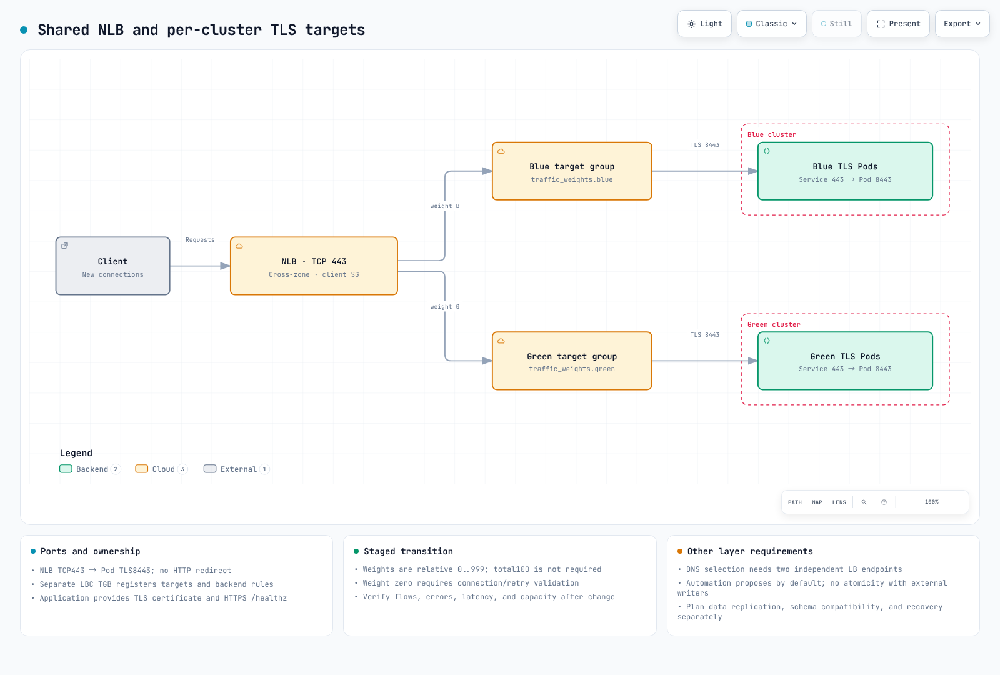

# Infrastructure Advanced

> **Review baseline**: Terraform 1.15.7, AWS Provider 6.64.0, AWS Load Balancer Controller 3.5.0, Boto3 1.43.92
> **Last reviewed**: September 11, 2026. Examples were checked locally with schemas and test doubles; no live AWS cutover was performed.

< [Previous: Terraform Infrastructure](01-infrastructure-setup.md) | [Table of Contents](README.md) | [Next: CI Pipelines](03-ci-pipelines.md) >

This guide separates two traffic designs: **one NLB with weighted target groups**, and **DNS selection between two independent load balancers**. They are alternatives, not two controls that can independently select clusters behind the same shared NLB.

## 1. Blue/Green Architecture Overview

Blue/green provides another environment to validate and a traffic-return path. It does not guarantee zero downtime, instant rollback, automatic data replication, or zero cross-AZ cost. Size the destination for the incoming load and keep database/schema changes compatible with both versions.

The [foundation example](01-infrastructure-setup.md) uses multiple AZs with built-in Auto Mode pools. A cluster color does not pin its workers to an AZ. The managed EKS control plane is regional; a single-AZ **worker** cell requires separate NodePool/NodeClass constraints and recovery capacity. See [Zonal Operations](15-zonal-operations-guide.md).

| Concern | Required planning |
|---|---|
| Traffic transition | New flows, persistent connections, propagation, client retries, SLOs |
| Data | Replication, consistency, writer ownership, migration compatibility, recovery point |
| Capacity | Destination healthy targets and load-tested capacity, including a failed AZ |
| Configuration ownership | One writer for listener actions; coordinate Terraform, scripts, and automation |
| Costs | Both cluster fleets, LB/endpoints, replication and cross-AZ paths; measure actual usage |



[View interactive diagram](https://www.atomai.click/kubernetes-docs/archmaps/en-ops-02-infrastructure-advanced-0.html)

## 2. NLB Weighted Target Groups

The example has a **TCP/443 listener with TLS passthrough to Pod port 8443**. Each cluster must already have `production/app-https`, Service port 443 → targetPort 8443, a working TLS endpoint, and HTTPS `/healthz` returning 200. The backend terminates TLS and presents the application certificate. An NLB TCP listener cannot generate an HTTP-to-HTTPS redirect.

Use the network state from chapter 01. Place the following files in a new `nlb/` Terraform root; initialize its S3 backend with a distinct key such as `nlb/terraform.tfstate`. Supply the actual state bucket, VPC CIDR, and approved client CIDRs. Documentation addresses are not usable client permissions.

### NLB and target groups

```hcl
# nlb/main.tf
terraform {
  required_version = ">= 1.10.0"
  backend "s3" {}
  required_providers {
    aws = { source = "hashicorp/aws", version = "6.64.0" }
  }
}
provider "aws" { region = var.region }
data "aws_caller_identity" "current" {}
data "terraform_remote_state" "network" {
  backend = "s3"
  config = {
    bucket = var.state_bucket_name
    key    = "network/terraform.tfstate"
    region = var.region
  }
}
locals {
  name_prefix = "${var.project_name}-${var.environment}"
  tags        = { Project = var.project_name, Environment = var.environment, ManagedBy = "terraform" }
  alarm_names = { for color in ["blue", "green"] : color => "${local.name_prefix}-${color}-no-healthy" }
  alarm_arns  = { for color, name in local.alarm_names : color => "arn:aws:cloudwatch:${var.region}:${data.aws_caller_identity.current.account_id}:alarm:${name}" }
}
resource "aws_security_group" "nlb" {
  name_prefix = "docs-nlb-"
  description = "Approved clients to the TLS passthrough listener"
  vpc_id      = data.terraform_remote_state.network.outputs.vpc_id
  tags        = local.tags
}
resource "aws_vpc_security_group_ingress_rule" "clients" {
  for_each          = toset(var.allowed_client_cidrs)
  security_group_id = aws_security_group.nlb.id
  cidr_ipv4         = each.value
  ip_protocol       = "tcp"
  from_port         = 443
  to_port           = 443
}
resource "aws_vpc_security_group_egress_rule" "targets" {
  security_group_id = aws_security_group.nlb.id
  cidr_ipv4         = var.target_vpc_cidr
  ip_protocol       = "tcp"
  from_port         = var.backend_port
  to_port           = var.backend_port
}
resource "aws_lb" "shared" {
  name_prefix                      = "docs-"
  internal                         = false
  load_balancer_type               = "network"
  subnets                          = data.terraform_remote_state.network.outputs.public_subnet_ids
  security_groups                  = [aws_security_group.nlb.id]
  enable_cross_zone_load_balancing = true
  enable_deletion_protection       = var.environment == "prod"
  tags                             = local.tags
}
resource "aws_lb_target_group" "cluster" {
  for_each    = toset(["blue", "green"])
  name_prefix = each.key == "blue" ? "doc-b-" : "doc-g-"
  port        = var.backend_port
  protocol    = "TCP"
  target_type = "ip"
  vpc_id      = data.terraform_remote_state.network.outputs.vpc_id
  health_check {
    enabled             = true
    protocol            = "HTTPS"
    port                = "traffic-port"
    path                = "/healthz"
    matcher             = "200"
    interval            = 10
    healthy_threshold   = 2
    unhealthy_threshold = 2
  }
  deregistration_delay   = 30
  connection_termination = true
  preserve_client_ip     = true
  proxy_protocol_v2      = false
  lifecycle { create_before_destroy = true }
  tags = merge(local.tags, { Cluster = each.key })
}
resource "aws_lb_listener" "tls_passthrough" {
  load_balancer_arn = aws_lb.shared.arn
  port              = 443
  protocol          = "TCP"
  default_action {
    type = "forward"
    forward {
      target_group {
        arn    = aws_lb_target_group.cluster["blue"].arn
        weight = var.traffic_weights.blue
      }
      target_group {
        arn    = aws_lb_target_group.cluster["green"].arn
        weight = var.traffic_weights.green
      }
    }
  }
  tags = local.tags
}
```

### Inputs

```hcl
# nlb/variables.tf
variable "region" {
  type    = string
  default = "ap-northeast-2"
}
variable "project_name" {
  type    = string
  default = "eks-platform"
}
variable "environment" {
  type    = string
  default = "dev"
}
variable "state_bucket_name" { type = string }
variable "target_vpc_cidr" {
  description = "CIDR of the same VPC containing the target Pods"
  type        = string
}
variable "allowed_client_cidrs" {
  description = "Approved IPv4 client CIDRs. Supply real values, not documentation addresses"
  type        = list(string)
  validation {
    condition     = length(var.allowed_client_cidrs) > 0 && alltrue([for cidr in var.allowed_client_cidrs : can(cidrnetmask(cidr)) && cidr != "0.0.0.0/0"])
    error_message = "Supply explicit IPv4 CIDRs. Do not expose this example to 0.0.0.0/0."
  }
}
variable "traffic_weights" {
  type    = object({ blue = number, green = number })
  default = { blue = 100, green = 0 }
  validation {
    condition     = alltrue([for value in values(var.traffic_weights) : value >= 0 && value <= 999 && floor(value) == value]) && var.traffic_weights.blue + var.traffic_weights.green > 0
    error_message = "Use integer weights 0..999 with at least one positive weight. The sum need not be 100."
  }
}
variable "automatic_failover" {
  description = "Opt in only after validating capacity, reconnection behavior, and single-writer ownership"
  type        = bool
  default     = false
}
variable "minimum_destination_targets" {
  description = "A demo health gate, not proof of enough capacity. Size from load testing"
  type        = number
  default     = 1
  validation {
    condition     = var.minimum_destination_targets >= 1 && floor(var.minimum_destination_targets) == var.minimum_destination_targets
    error_message = "Use a positive integer destination target count."
  }
}
variable "notification_email" {
  type    = string
  default = null
}

variable "backend_port" {
  description = "Actual Pod TLS targetPort, shared with the Service/TGB networking example"
  type        = number
  default     = 8443
  validation {
    condition     = var.backend_port >= 1 && var.backend_port <= 65535 && floor(var.backend_port) == var.backend_port
    error_message = "Use an integer TCP backend port."
  }
}
```

Weights are **integers 0–999 and relative**, not mandatory percentages. 5:5 and 50:50 express the same relative split. Flow sizes, sticky sessions, and sampling can make observed request/byte ratios differ. This example rejects an all-zero configuration explicitly.

[NLB listener documentation](https://docs.aws.amazon.com/elasticloadbalancing/latest/network/load-balancer-listeners.html) distinguishes ordinary weight changes from weight zero: shortly after zero is set, new connections stop and existing connections are closed. Deregistration delay is a different control. Validate connection/retry behavior before zero-weight transitions, and observe `NewFlowCount`, `ActiveFlowCount`, errors, and latency after a change.

Cross-zone balancing is enabled because a group confined to one AZ must remain reachable from the other NLB nodes during a fleet transition. Disabling it changes the routing constraints and can defeat the intended split. Account for the actual cross-AZ path and cost. Security groups are attached when the NLB is created: an NLB created without them cannot acquire them later.

### Dynamic target registration

Install and configure the **self-managed AWS Load Balancer Controller** in each cluster. Use `elbv2.k8s.aws/v1beta1` TGBs, one separate target group per cluster. Terraform owns the LB/TGs and frontend security group; the TGB networking configuration requests backend rules from that controller. Do not also manage the same backend rules or changing Pod-IP attachments through Terraform.

```yaml
# tgb.yaml
# Separately installed AWS Load Balancer Controller, not the built-in Auto Mode TGB API.
# Replace all IDs. The production/app-https Service and its TLS targetPort 8443 must exist.
apiVersion: elbv2.k8s.aws/v1beta1
kind: TargetGroupBinding
metadata:
  name: app-tls
  namespace: production
spec:
  targetGroupARN: arn:aws:elasticloadbalancing:ap-northeast-2:111122223333:targetgroup/REPLACE_BLUE_GROUP/0000000000000001
  targetType: ip
  vpcID: vpc-REPLACE_ME
  serviceRef:
    name: app-https
    port: 443
  networking:
    ingress:
      - from:
          - securityGroup:
              groupID: sg-REPLACE_NLB_SG
        ports:
          - protocol: TCP
            port: 8443
```

Use the Blue ARN in the Blue cluster and Green ARN in the Green cluster, replacing the VPC/NLB security-group IDs. Update both `backend_port` and the TGB networking port if the Pod targetPort changes. The controller needs permission to register targets and reconcile the relevant backend security groups.

Built-in Auto Mode TGB uses `eks.amazonaws.com/v1`. Its [tag and lifecycle rules](https://docs.aws.amazon.com/eks/latest/userguide/auto-configure-alb.html) differ: AWS documents deletion of the target group when that TGB or cluster is deleted. Do not substitute it for this example's externally owned target group. `multiClusterTargetGroup` is relevant when intentionally sharing one TG across clusters; this recipe uses distinct TGs.

### Outputs

```hcl
# nlb/outputs.tf
output "nlb_arn" { value = aws_lb.shared.arn }
output "nlb_dns_name" { value = aws_lb.shared.dns_name }
output "nlb_zone_id" { value = aws_lb.shared.zone_id }
output "listener_arn" { value = aws_lb_listener.tls_passthrough.arn }
output "nlb_security_group_id" { value = aws_security_group.nlb.id }
output "target_group_arns" { value = { for color, group in aws_lb_target_group.cluster : color => group.arn } }
output "traffic_weights" { value = var.traffic_weights }
output "automatic_failover" { value = var.automatic_failover }
output "minimum_destination_targets" { value = var.minimum_destination_targets }

output "backend_port" { value = var.backend_port }
```

## 3. DNS-Based Traffic Switching

For DNS-based selection, supply **two actual, independent ALB/NLB endpoints**, each leading to its intended cluster. Pointing `blue.example.com` and `green.example.com` at the same shared NLB does not select different target groups, even with different record weights or health-check names.

This separate `dns/` root assumes those two load balancers already exist. It demonstrates weighted `app.<domain>`, direct per-color records, and a separate `failover.<domain>` name. Choose the names you need; do not combine incompatible routing policies on one name/type.

```hcl
# dns/main.tf
terraform {
  required_version = ">= 1.10.0"
  backend "s3" {}
  required_providers {
    aws = { source = "hashicorp/aws", version = "6.64.0" }
  }
}
provider "aws" { region = var.region }
# This is an ALTERNATIVE with two independently provisioned load balancers.
# Supplying the shared NLB from the first example for both entries is rejected.
resource "aws_route53_record" "weighted" {
  for_each       = var.endpoints
  zone_id        = var.hosted_zone_id
  name           = "app.${var.domain_name}"
  type           = "A"
  set_identifier = each.key
  weighted_routing_policy { weight = each.value.weight }
  alias {
    name                   = each.value.dns_name
    zone_id                = each.value.zone_id
    evaluate_target_health = true
  }
}
resource "aws_route53_record" "direct" {
  for_each = var.endpoints
  zone_id  = var.hosted_zone_id
  name     = "${each.key}.${var.domain_name}"
  type     = "A"
  alias {
    name                   = each.value.dns_name
    zone_id                = each.value.zone_id
    evaluate_target_health = true
  }
}
# Different DNS name from the weighted example: don't mix policies on one name/type.
resource "aws_route53_record" "failover" {
  for_each       = var.endpoints
  zone_id        = var.hosted_zone_id
  name           = "failover.${var.domain_name}"
  type           = "A"
  set_identifier = each.key
  failover_routing_policy {
    type = each.key == "blue" ? "PRIMARY" : "SECONDARY"
  }
  alias {
    name                   = each.value.dns_name
    zone_id                = each.value.zone_id
    evaluate_target_health = true
  }
}
```

```hcl
# dns/variables.tf
variable "region" {
  type    = string
  default = "ap-northeast-2"
}
variable "hosted_zone_id" { type = string }
variable "domain_name" { type = string }
variable "endpoints" {
  description = "Two existing independent ALB/NLB endpoints with healthy targets"
  type        = map(object({ dns_name = string, zone_id = string, weight = number }))
  validation {
    condition     = toset(keys(var.endpoints)) == toset(["blue", "green"])
    error_message = "Exactly blue and green endpoints are required."
  }
  validation {
    condition     = length(distinct([for e in values(var.endpoints) : trimprefix(lower(trimsuffix(e.dns_name, ".")), "dualstack.")])) == 2
    error_message = "Two records pointing at the same shared NLB cannot select different clusters."
  }
  validation {
    condition     = alltrue([for e in values(var.endpoints) : e.weight >= 0 && e.weight <= 255 && floor(e.weight) == e.weight]) && sum([for e in values(var.endpoints) : e.weight]) > 0
    error_message = "Use integer DNS weights0..255 with a positive total for this example."
  }
}
```

Route 53 weights are integers **0–255**, unlike ELB weights. Weighted records share one DNS name/type and have distinct set identifiers. DNS answers are cached and connections can outlive DNS entries. Alias records inherit the ELB target TTL; do not replace generated LB DNS endpoints with manually copied IP addresses just to set a TTL.

`evaluate_target_health` evaluates the target LB, not an application-specific transaction. If all choices are unhealthy, DNS policies have fallback behavior; they are not a guaranteed traffic stop. TTL, health detection, resolver behavior, propagation, and reconnection together determine recovery time. Do not interpret 60-second TTL as a 60-second recovery SLA.

## 4. Data Node Placement

Topology constraints control placement, not replication or recovery. A zonal EBS volume and its consumer must be compatible; `WaitForFirstConsumer` lets provisioning follow the scheduler's selected node. Pod nodeSelector/affinity selects eligible nodes, while NodePool requirements constrain autoscaler provisioning and NodeClass controls subnet selection.

The following **single-instance PostgreSQL lab is not an HA database**. It assumes chapter 01's built-in Auto Mode pools have created the default NodeClass, the selected AZ has capacity, and `data-demo/postgresql-auth` with a `password` key has been prepared through the approved secret workflow. Create the namespace/secret before the workload. The image digest and UID/GID 999 were checked against the official PostgreSQL 17 Bookworm image.

```yaml
# data-placement.yaml
apiVersion: v1
kind: Namespace
metadata:
  name: data-demo
---
apiVersion: karpenter.sh/v1
kind: NodePool
metadata:
  name: database-a
spec:
  template:
    metadata:
      labels:
        workload-type: database
    spec:
      nodeClassRef:
        group: eks.amazonaws.com
        kind: NodeClass
        name: default
      requirements:
        - key: topology.kubernetes.io/zone
          operator: In
          values: [ap-northeast-2a]
        - key: karpenter.sh/capacity-type
          operator: In
          values: [on-demand]
        - key: node.kubernetes.io/instance-type
          operator: In
          values: [r6i.2xlarge, r6i.4xlarge]
      taints:
        - key: dedicated
          value: database
          effect: NoSchedule
  limits:
    cpu: "100"
    memory: 400Gi
  disruption:
    consolidationPolicy: WhenEmpty
    consolidateAfter: 30m
---
apiVersion: storage.k8s.io/v1
kind: StorageClass
metadata:
  name: demo-gp3-auto
provisioner: ebs.csi.eks.amazonaws.com
parameters:
  type: gp3
  encrypted: "true"
volumeBindingMode: WaitForFirstConsumer
reclaimPolicy: Retain
allowVolumeExpansion: true
allowedTopologies:
  - matchLabelExpressions:
      - key: eks.amazonaws.com/compute-type
        values: [auto]
---
apiVersion: v1
kind: Service
metadata:
  name: postgresql
  namespace: data-demo
spec:
  clusterIP: None
  selector:
    app: postgresql
  ports:
    - name: postgres
      port: 5432
      targetPort: postgres
---
# Create data-demo/postgresql-auth with a password key through the approved
# secret-management workflow before deploying this single-instance lab.
apiVersion: apps/v1
kind: StatefulSet
metadata:
  name: postgresql
  namespace: data-demo
spec:
  serviceName: postgresql
  replicas: 1
  selector:
    matchLabels:
      app: postgresql
  template:
    metadata:
      labels:
        app: postgresql
    spec:
      nodeSelector:
        workload-type: database
        topology.kubernetes.io/zone: ap-northeast-2a
        eks.amazonaws.com/compute-type: auto
      tolerations:
        - key: dedicated
          operator: Equal
          value: database
          effect: NoSchedule
      securityContext:
        runAsNonRoot: true
        runAsUser: 999
        runAsGroup: 999
        fsGroup: 999
        seccompProfile:
          type: RuntimeDefault
      containers:
        - name: postgres
          image: docker.io/library/postgres@sha256:051f7b7b3abdd564d5d1bd1e8c4b9c1b6e77087d1dd22020ede611c096a272e0
          env:
            - name: POSTGRES_USER
              value: app
            - name: POSTGRES_DB
              value: app
            - name: POSTGRES_PASSWORD_FILE
              value: /run/postgresql-auth/password
            - name: PGDATA
              value: /var/lib/postgresql/data/pgdata
          ports:
            - name: postgres
              containerPort: 5432
          securityContext:
            allowPrivilegeEscalation: false
            capabilities:
              drop: [ALL]
          readinessProbe:
            exec:
              command: [pg_isready, -U, app, -d, app]
            initialDelaySeconds: 10
            periodSeconds: 5
          resources:
            requests:
              cpu: "2"
              memory: 4Gi
            limits:
              cpu: "4"
              memory: 8Gi
          volumeMounts:
            - name: data
              mountPath: /var/lib/postgresql/data
            - name: auth
              mountPath: /run/postgresql-auth
              readOnly: true
      volumes:
        - name: auth
          secret:
            secretName: postgresql-auth
            defaultMode: 0440
  volumeClaimTemplates:
    - metadata:
        name: data
      spec:
        accessModes: [ReadWriteOnce]
        storageClassName: demo-gp3-auto
        resources:
          requests:
            storage: 10Gi
```

The Pod selects the database pool's label, tolerates its taint, and selects AZ-a. The StorageClass uses the Auto Mode provisioner; WFFC selects storage for that placement. The `pgdata` subdirectory avoids initializing PostgreSQL in an EBS filesystem root containing `lost+found`. `Retain` preserves a volume after claim deletion; it is not a backup. Review retained PV/EBS resources when cleaning up the lab.

For another AZ, change the NodePool requirement and consumer placement together. A volume does not move to a different AZ because an NLB weight changes. Production needs backups, replication/failover, migrations, and measured recovery procedures; see [Storage](../core/04-storage.md) and [Kafka on EKS](../data-on-eks/kafka/README.md).

### Spread and affinity fragments

For replicas distributed among eligible nodes, merge a topology spread rule into an existing workload. `maxSkew: 1` with `DoNotSchedule` constrains skew among eligible domains; it does not create missing nodes or ensure three AZs exist.

```yaml
# Fragment under spec.template.spec of an existing Deployment.
topologySpreadConstraints:
  - maxSkew: 1
    topologyKey: kubernetes.io/hostname
    whenUnsatisfiable: DoNotSchedule
    labelSelector:
      matchLabels:
        app: api-server
```

A cache in another namespace must specify where its affinity peers live. This is a soft AZ preference, not a replication configuration or a same-node guarantee:

```yaml
# Fragment under spec.template.spec.
affinity:
  podAffinity:
    preferredDuringSchedulingIgnoredDuringExecution:
      - weight: 100
        podAffinityTerm:
          namespaces: [production]
          labelSelector:
            matchLabels:
              app: api-server
          topologyKey: topology.kubernetes.io/zone
```

The old bare Kafka/ZooKeeper StatefulSet is not a complete Kafka deployment: a Pod name is not a numeric broker ID, and quorum/listeners/advertised addresses/storage/replication must be configured together. Use the [Strimzi guide](../data-on-eks/kafka/02-strimzi-operator.md) and [rack-awareness explanation](15-zonal-operations-guide.md). Spreading Kubernetes Pods alone does not create cross-cluster Kafka replication.

## 5. Failover Automation

This is a **single-listener reference**, not a guarantee of safe production failover. The default `automatic_failover=false` only proposes a change and grants no `ModifyListener` permission. Opt in only after validating destination capacity, connection termination/retry behavior, monitoring, and a single-writer operating procedure.

Use one event path: **CloudWatch metric alarm → alarm-input SNS → Lambda**. Send decisions and failures to a different SNS topic. Do not also add the Lambda ARN directly to the alarm actions: direct CloudWatch Lambda actions use `alarmData.state.value`, while this handler deliberately accepts only the SNS envelope.

```hcl
# nlb/failover.tf
resource "aws_sns_topic" "alarm_input" {
  name = "${local.name_prefix}-alarm-input"
  tags = local.tags
}
resource "aws_sns_topic" "notifications" {
  name = "${local.name_prefix}-transition-notifications"
  tags = local.tags
}
resource "aws_sns_topic_policy" "alarms" {
  for_each = { input = aws_sns_topic.alarm_input.arn, output = aws_sns_topic.notifications.arn }
  arn      = each.value
  policy = jsonencode({
    Version = "2012-10-17"
    Statement = [{
      Effect    = "Allow"
      Principal = { Service = "cloudwatch.amazonaws.com" }
      Action    = "sns:Publish"
      Resource  = each.value
      Condition = {
        StringEquals = { "aws:SourceAccount" = data.aws_caller_identity.current.account_id }
        ArnEquals    = { "aws:SourceArn" = values(local.alarm_arns) }
      }
    }]
  })
}

resource "aws_cloudwatch_metric_alarm" "health" {
  for_each            = toset(["blue", "green"])
  alarm_name          = local.alarm_names[each.key]
  namespace           = "AWS/NetworkELB"
  metric_name         = "HealthyHostCount"
  statistic           = "Maximum"
  period              = 60
  evaluation_periods  = 2
  datapoints_to_alarm = 2
  comparison_operator = "LessThanThreshold"
  threshold           = 1
  treat_missing_data  = "missing"
  dimensions = {
    LoadBalancer = aws_lb.shared.arn_suffix
    TargetGroup  = aws_lb_target_group.cluster[each.key].arn_suffix
  }
  alarm_actions             = [aws_sns_topic.alarm_input.arn]
  ok_actions                = [aws_sns_topic.notifications.arn]
  insufficient_data_actions = [aws_sns_topic.notifications.arn]
  depends_on                = [aws_sns_topic_policy.alarms]
  tags                      = local.tags
}
resource "aws_iam_role" "failover" {
  name_prefix = "docs-failover-"
  assume_role_policy = jsonencode({
    Version   = "2012-10-17"
    Statement = [{ Effect = "Allow", Action = "sts:AssumeRole", Principal = { Service = "lambda.amazonaws.com" } }]
  })
  tags = local.tags
}
resource "aws_cloudwatch_log_group" "failover" {
  name              = "/aws/lambda/${local.name_prefix}-failover"
  retention_in_days = 30
  tags              = local.tags
}
resource "aws_iam_role_policy" "failover" {
  role = aws_iam_role.failover.id
  policy = jsonencode({
    Version = "2012-10-17"
    Statement = concat([
      {
        Effect    = "Allow"
        Action    = ["elasticloadbalancing:DescribeListeners", "elasticloadbalancing:DescribeTargetHealth", "cloudwatch:DescribeAlarms"]
        Resource  = "*"
        Condition = { StringEquals = { "aws:RequestedRegion" = var.region } }
      },
      {
        Effect   = "Allow"
        Action   = ["logs:CreateLogStream", "logs:PutLogEvents"]
        Resource = "${aws_cloudwatch_log_group.failover.arn}:*"
      },
      {
        Effect   = "Allow"
        Action   = "sns:Publish"
        Resource = aws_sns_topic.notifications.arn
      }
      ], var.automatic_failover ? [{
        Effect   = "Allow"
        Action   = "elasticloadbalancing:ModifyListener"
        Resource = aws_lb_listener.tls_passthrough.arn
    }] : [])
  })
}
resource "aws_lambda_function" "failover" {
  function_name                  = "${local.name_prefix}-failover"
  filename                       = "${path.module}/lambda/failover.zip"
  source_code_hash               = filebase64sha256("${path.module}/lambda/failover.zip")
  handler                        = "failover.lambda_handler"
  runtime                        = "python3.12"
  timeout                        = 60
  memory_size                    = 256
  reserved_concurrent_executions = 1
  role                           = aws_iam_role.failover.arn
  environment {
    variables = {
      ACCOUNT_ID                  = data.aws_caller_identity.current.account_id
      LISTENER_ARN                = aws_lb_listener.tls_passthrough.arn
      ALARM_ARNS_JSON             = jsonencode(local.alarm_arns)
      TARGET_GROUP_ARNS_JSON      = jsonencode({ for color, group in aws_lb_target_group.cluster : color => group.arn })
      ALARM_TOPIC_ARN             = aws_sns_topic.alarm_input.arn
      NOTIFICATION_TOPIC_ARN      = aws_sns_topic.notifications.arn
      AUTOMATIC_FAILOVER          = tostring(var.automatic_failover)
      MINIMUM_DESTINATION_TARGETS = tostring(var.minimum_destination_targets)
    }
  }
  depends_on = [aws_iam_role_policy.failover, aws_cloudwatch_log_group.failover]
  tags       = local.tags
}
resource "aws_lambda_permission" "sns" {
  statement_id   = "AlarmTopicOnly"
  action         = "lambda:InvokeFunction"
  function_name  = aws_lambda_function.failover.function_name
  principal      = "sns.amazonaws.com"
  source_arn     = aws_sns_topic.alarm_input.arn
  source_account = data.aws_caller_identity.current.account_id
}
resource "aws_sns_topic_subscription" "lambda" {
  topic_arn  = aws_sns_topic.alarm_input.arn
  protocol   = "lambda"
  endpoint   = aws_lambda_function.failover.arn
  depends_on = [aws_lambda_permission.sns, aws_lambda_function_event_invoke_config.failover]
}
resource "aws_sns_topic_subscription" "operator" {
  for_each = var.notification_email == null ? {} : {
    alarms    = aws_sns_topic.alarm_input.arn
    decisions = aws_sns_topic.notifications.arn
  }
  topic_arn = each.value
  protocol  = "email"
  endpoint  = var.notification_email
}
resource "aws_lambda_function_event_invoke_config" "failover" {
  function_name                = aws_lambda_function.failover.function_name
  maximum_event_age_in_seconds = 300
  maximum_retry_attempts       = 1
  destination_config {
    on_failure { destination = aws_sns_topic.notifications.arn }
  }
}
```

The health alarm uses Maximum HealthyHostCount to detect no healthy targets across reports. Missing metrics remain `INSUFFICIENT_DATA` and notify operators; they are not fabricated as zero and do not blindly trigger a switch. A positive destination target count is a necessary check, not proof of sufficient capacity or a healthy end-to-end application.

### Handler and package

The handler checks exact alarm/source/account identity, event freshness, current alarm states, current target health, and the exact listener/TG mapping. It preserves other forward-action attributes and skips an already-applied transition. It does not infer ports from listener ARN text. Notifications cannot feed back into the alarm input.

```python
# nlb/lambda/failover.py
"""SNS alarm -> checked proposal or single-listener update. No automatic failback."""
import copy
import json
import logging
import os
from datetime import datetime, timezone
from functools import lru_cache

import boto3
from botocore.config import Config

LOG = logging.getLogger(__name__)
LOG.setLevel(logging.INFO)


def timestamp(value):
    parsed = value if isinstance(value, datetime) else datetime.fromisoformat(value.replace("Z", "+00:00"))
    if parsed.tzinfo is None:
        raise ValueError("Timezone is required")
    return parsed.astimezone(timezone.utc)


def configuration(env):
    alarms = json.loads(env["ALARM_ARNS_JSON"])
    targets = json.loads(env["TARGET_GROUP_ARNS_JSON"])
    if set(alarms) != {"blue", "green"} or set(targets) != {"blue", "green"}:
        raise ValueError("Exactly blue and green are required")
    if len(set(alarms.values())) != 2 or len(set(targets.values())) != 2:
        raise ValueError("Alarm and target-group ARNs must be distinct")
    if env["ALARM_TOPIC_ARN"] == env["NOTIFICATION_TOPIC_ARN"]:
        raise ValueError("Alarm input and notification output must be separate")
    minimum = int(env.get("MINIMUM_DESTINATION_TARGETS", "1"))
    if minimum < 1:
        raise ValueError("Destination target minimum must be positive")
    return {
        "alarms": alarms, "targets": targets,
        "listener": env["LISTENER_ARN"], "account": env["ACCOUNT_ID"],
        "input_topic": env["ALARM_TOPIC_ARN"], "output_topic": env["NOTIFICATION_TOPIC_ARN"],
        "apply": env.get("AUTOMATIC_FAILOVER", "false") == "true",
        "minimum": minimum,
    }


def healthy_count(elb, arn):
    response = elb.describe_target_health(TargetGroupArn=arn)
    return sum(t["TargetHealth"]["State"] == "healthy" for t in response["TargetHealthDescriptions"])


def listener_actions(elb, cfg):
    listeners = elb.describe_listeners(ListenerArns=[cfg["listener"]])["Listeners"]
    if len(listeners) != 1 or listeners[0]["Port"] != 443 or listeners[0]["Protocol"] != "TCP":
        raise ValueError("Expected the configured TCP/443 listener")
    actions = listeners[0]["DefaultActions"]
    if len(actions) != 1 or actions[0]["Type"] != "forward":
        raise ValueError("Expected one forward action")
    groups = actions[0].get("ForwardConfig", {}).get("TargetGroups", [])
    if len(groups) != 2 or {g["TargetGroupArn"] for g in groups} != set(cfg["targets"].values()):
        raise ValueError("Unexpected target groups: refusing to overwrite listener configuration")
    return actions


def process_record(record, cfg, clients, now):
    if not isinstance(record, dict):
        return {"status": "invalid_record"}
    if record.get("EventSource") != "aws:sns" or record.get("Sns", {}).get("TopicArn") != cfg["input_topic"]:
        return {"status": "ignored_source"}
    try:
        message = json.loads(record["Sns"]["Message"])
        if not isinstance(message, dict) or message.get("NewStateValue") != "ALARM":
            return {"status": "ignored_state"}
        source = next((color for color, arn in cfg["alarms"].items() if message.get("AlarmArn") == arn), None)
        if source is None or str(message.get("AWSAccountId")) != cfg["account"]:
            return {"status": "ignored_alarm"}
        changed = timestamp(message["StateChangeTime"])
    except (KeyError, ValueError, TypeError, AttributeError):
        return {"status": "invalid_message"}
    age = (now - changed).total_seconds()
    if age < -30 or age > 300:
        return {"status": "stale_message"}

    destination = "green" if source == "blue" else "blue"
    names = [arn.split(":alarm:", 1)[1] for arn in cfg["alarms"].values()]
    alarms = clients["cloudwatch"].describe_alarms(AlarmNames=names)["MetricAlarms"]
    states = {alarm["AlarmArn"]: alarm for alarm in alarms}
    current = states.get(cfg["alarms"][source])
    other = states.get(cfg["alarms"][destination])
    if not current or not other or current["StateValue"] != "ALARM" or other["StateValue"] != "OK":
        return {"status": "alarm_state_changed"}
    transition = timestamp(current.get("StateTransitionedTimestamp") or current.get("StateUpdatedTimestamp"))
    if abs((transition - changed).total_seconds()) > 1:
        return {"status": "stale_transition"}

    elb = clients["elbv2"]
    if healthy_count(elb, cfg["targets"][source]) != 0:
        return {"status": "source_recovered"}
    if healthy_count(elb, cfg["targets"][destination]) < cfg["minimum"]:
        return {"status": "destination_not_ready"}
    before = listener_actions(elb, cfg)
    groups = before[0]["ForwardConfig"]["TargetGroups"]
    weights = {g["TargetGroupArn"]: g.get("Weight", 1) for g in groups}
    if weights[cfg["targets"][source]] == 0 and weights[cfg["targets"][destination]] > 0:
        return {"status": "already_shifted"}
    proposed = copy.deepcopy(before)
    for group in proposed[0]["ForwardConfig"]["TargetGroups"]:
        group["Weight"] = 100 if group["TargetGroupArn"] == cfg["targets"][destination] else 0

    status = "proposal"
    if cfg["apply"]:
        # Point-in-time checks, not an atomic compare-and-swap with external writers.
        if listener_actions(elb, cfg) != before:
            return {"status": "concurrent_change"}
        if healthy_count(elb, cfg["targets"][destination]) < cfg["minimum"]:
            return {"status": "destination_changed"}
        elb.modify_listener(ListenerArn=cfg["listener"], DefaultActions=proposed)
        status = "weights_updated"
    result = {"status": status, "from": source, "to": destination}
    try:
        clients["sns"].publish(
            TopicArn=cfg["output_topic"], Subject="EKS traffic transition decision",
            Message=json.dumps(result),
        )
    except Exception:
        # Do not replay a successful listener mutation merely because notification failed.
        LOG.exception("Decision notification failed", extra={"decision_status": status})
        result["notification_failed"] = True
    LOG.info("Traffic transition decision: %s", json.dumps(result))
    return result


def handle(event, cfg, clients, now):
    if not isinstance(event, dict) or not isinstance(event.get("Records"), list):
        return [{"status": "unsupported_envelope"}]
    return [process_record(record, cfg, clients, now) for record in event["Records"]]


@lru_cache(maxsize=1)
def aws_clients():
    config = Config(connect_timeout=2, read_timeout=5, retries={"mode": "standard", "total_max_attempts": 2})
    return {name: boto3.client(name, config=config) for name in ("elbv2", "cloudwatch", "sns")}


def lambda_handler(event, context):
    return handle(event, configuration(os.environ), aws_clients(), datetime.now(timezone.utc))
```

`nlb/lambda/requirements.txt`:

```text
boto3==1.43.92
botocore==1.43.92
jmespath==1.1.0
python-dateutil==2.9.0.post0
s3transfer==0.19.2
six==1.17.0
urllib3==2.7.0
```

Build the artifact before Terraform planning. Dependencies are packaged alongside `failover.py`, matching the configured `failover.lambda_handler` entry point:

```bash
# From nlb/, in a clean build environment with Python 3.12.
python3.12 -m pip install --target lambda/package -r lambda/requirements.txt
cp lambda/failover.py lambda/package/failover.py
python3.12 - <<'PYCODE'
from pathlib import Path
from zipfile import ZipFile, ZIP_DEFLATED
package = Path("lambda/package")
with ZipFile("lambda/failover.zip", "w", ZIP_DEFLATED) as archive:
    for file in sorted(package.rglob("*")):
        if file.is_file() and "__pycache__" not in file.parts:
            archive.write(file, file.relative_to(package))
PYCODE
terraform init -backend-config=../environment.backend.json -backend-config=key=nlb/terraform.tfstate
terraform validate
terraform plan -var-file=environment.tfvars.json
# Review the plan; apply only after prerequisites and notification subscriptions are ready.
terraform apply -var-file=environment.tfvars.json
```

The backend and variable files must contain the actual environment values. Use a clean package directory for each build. The Lambda code hash tracks the resulting ZIP. Pure Python dependencies here support the Lambda runtime without a native wheel build.

Reserved concurrency serializes this function's invocations; it does not serialize Terraform or manual API writers. The final read/health checks are point-in-time checks, not an atomic compare-and-swap. Coordinate other writers, pause automation for planned deployments, and reconcile resulting weights back into IaC before a later apply. API failures, quota limits, notification delivery, and control-plane unavailability still require operational handling. There is no automatic recovery-to-80/20 timer.

A scheduled EventBridge health checker is intentionally not declared without its own implementation and permissions. CloudWatch already evaluates these health metrics. If periodic application probes are needed, define and test that separate workload and its event contract.

### Manual and gradual transitions

Use the following only in an initialized NLB root with the intended backend/cache and complete variables file. Pause automatic failover and other writers first. It validates numeric weights, checks target health, shows a full plan, and requires approval of that plan. It does not use routine `-target`, a default destination, or an unbounded timer loop.

```bash
# traffic-shift.sh
#!/usr/bin/env bash
set -euo pipefail
if (( $# != 4 )); then
  echo "Usage: $0 <initialized-nlb-root> <variables-file> <blue-weight> <green-weight>" >&2
  exit 2
fi
DOCS_NLB_ROOT="$(cd -- "$1" && pwd -P)"
DOCS_VARIABLES_FILE="$(cd -- "$(dirname -- "$2")" && pwd -P)/$(basename -- "$2")"
[[ -f "$DOCS_VARIABLES_FILE" ]] || exit 2
for value in "$3" "$4"; do
  [[ "$value" =~ ^[0-9]{1,3}$ ]] || { echo "Weights must be integers 0..999" >&2; exit 2; }
done
blue_weight=$((10#$3))
green_weight=$((10#$4))
(( blue_weight + green_weight > 0 )) || { echo "At least one weight must be positive" >&2; exit 2; }
: "${AWS_REGION:?Set the intended AWS region}"
outputs="$(terraform -chdir="$DOCS_NLB_ROOT" output -json)"
[[ "$(jq -er '.automatic_failover.value | tostring' <<<"$outputs")" == false ]] || {
  echo "Pause automatic failover and other writers before manual changes" >&2
  exit 1
}
listener="$(jq -er '.listener_arn.value' <<<"$outputs")"
minimum="$(jq -er '.minimum_destination_targets.value' <<<"$outputs")"
[[ "$minimum" =~ ^[1-9][0-9]*$ ]] || exit 1
aws elbv2 describe-listeners --region "$AWS_REGION" --listener-arns "$listener" \
  --query 'Listeners[0].DefaultActions' --output json
for color in blue green; do
  weight="$blue_weight"
  [[ "$color" == green ]] && weight="$green_weight"
  target="$(jq -er --arg color "$color" '.target_group_arns.value[$color]' <<<"$outputs")"
  count="$(aws elbv2 describe-target-health --region "$AWS_REGION" \
    --target-group-arn "$target" --output json | jq '[.TargetHealthDescriptions[] | select(.TargetHealth.State == "healthy")] | length')"
  if (( weight > 0 )) && ! jq -en --argjson count "$count" --argjson minimum "$minimum" '$count >= $minimum' >/dev/null; then
    echo "$color has insufficient healthy targets ($count < $minimum)" >&2
    exit 1
  fi
done
workdir="$(mktemp -d "${TMPDIR:-/tmp}/docs-traffic.XXXXXX")"
plan="$workdir/traffic.tfplan"
trap 'rm -f -- "$plan"; rmdir -- "$workdir"' EXIT
terraform -chdir="$DOCS_NLB_ROOT" plan -input=false -out="$plan" -var-file="$DOCS_VARIABLES_FILE" \
  -var=automatic_failover=false -var="traffic_weights={blue=$blue_weight,green=$green_weight}"
terraform -chdir="$DOCS_NLB_ROOT" show -no-color "$plan"
echo "Review the FULL plan and capacity/SLO checks. Weight zero can close existing connections."
read -r -p "Type apply to execute this reviewed plan: " confirmation
[[ "$confirmation" == apply ]] || { echo "No changes applied"; exit 0; }
terraform -chdir="$DOCS_NLB_ROOT" apply "$plan"
echo "Configuration applied. Verify new/active flows, errors, and latency before another step."
```

```bash
# One reviewed step at a time; replace paths and AWS context.
export AWS_REGION=ap-northeast-2
bash traffic-shift.sh ./nlb ./nlb/environment.tfvars.json 95 5
# Check new/active flows, errors, latency, destination capacity, and data compatibility.
bash traffic-shift.sh ./nlb ./nlb/environment.tfvars.json 50 50
# Only after the checks pass and reconnection behavior is acceptable:
bash traffic-shift.sh ./nlb ./nlb/environment.tfvars.json 0 100
```

A successful API/apply changes configuration; it does not prove all traffic or existing connections have moved. Choose stop/rollback thresholds from the workload's SLO, not a universal "5% errors / 200% latency" rule.

## References

- [NLB listeners and weighted groups](https://docs.aws.amazon.com/elasticloadbalancing/latest/network/load-balancer-listeners.html)
- [NLB security groups](https://docs.aws.amazon.com/elasticloadbalancing/latest/network/load-balancer-security-groups.html)
- [NLB CloudWatch metrics](https://docs.aws.amazon.com/elasticloadbalancing/latest/network/load-balancer-cloudwatch-metrics.html)
- [Route 53 weighted record values](https://docs.aws.amazon.com/Route53/latest/DeveloperGuide/resource-record-sets-values-weighted.html)
- [CloudWatch direct Lambda event format](https://docs.aws.amazon.com/AmazonCloudWatch/latest/monitoring/alarms-and-actions-Lambda.html)
- [LBC 3.5.0 TargetGroupBinding](https://github.com/kubernetes-sigs/aws-load-balancer-controller/blob/v3.5.0/docs/guide/targetgroupbinding/targetgroupbinding.md)

< [Previous: Terraform Infrastructure](01-infrastructure-setup.md) | [Table of Contents](README.md) | [Next: CI Pipelines](03-ci-pipelines.md) >
