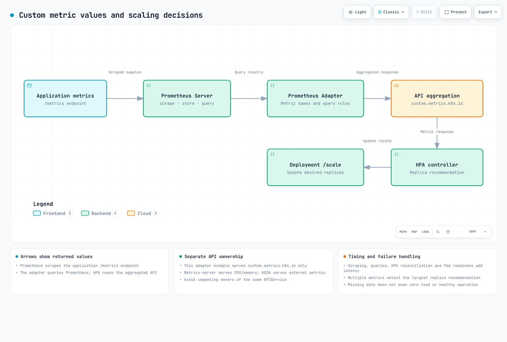

# Scaling Strategies

> **Review baseline**: Prometheus Adapter 0.12.0 / chart 5.3.0, KEDA 2.20.2, VPA 1.7.1 / official chart 0.12.0, Goldilocks 4.16.1 / chart 11.1.0\
> **Last reviewed**: September 11, 2026. Versioned charts, CRDs, Kubernetes OpenAPI and local rendering were checked. No live installation, load test, SQS/database access or Pod resize was performed.

< [Previous: GitOps Automation](05-gitops-automation.md) | [Contents](README.md) | [Next: Operational Alerts](07-observability-alerts.md) >

Separate custom-metric HPA, KEDA, VPA and Spot placement. **One autoscaler must own a workload's replica count.** The HPA, RPS ScaledObject and Cron ScaledObject targeting `podinfo` are alternatives; do not apply them together.

KEDA 2.20's installation minimum differs from its published test matrix. Check the minimum Kubernetes 1.30 and tested 1.33–1.35 range, and separately validate newer distributions. Native-object checks here used Kubernetes 1.36.2 OpenAPI; that is not a live compatibility test.

## 1. HPA and Custom Metrics



[Interactive diagram](https://www.atomai.click/kubernetes-docs/archmaps/en-ops-06-scaling-strategies-0.html)

| API | Provider in this example | Responsibility |
|---|---|---|
| `metrics.k8s.io` | metrics-server | CPU and memory resource metrics |
| `custom.metrics.k8s.io` | Prometheus Adapter | Metrics associated with Kubernetes objects such as Pods |
| `external.metrics.k8s.io` | KEDA metrics API server when choosing KEDA | External event metrics |

Prometheus Adapter can also serve resource/external APIs, but this example enables only custom metrics. Avoid competing owners of the same APIService. Installing CloudWatch Exporter alone does not create a Kubernetes external-metrics API.

### Prerequisites and demo application

Prepare metrics-server, Prometheus Operator/Prometheus and cert-manager. Replace the Prometheus Service address in the values with the real endpoint. Its `serviceMonitorSelector` and `serviceMonitorNamespaceSelector` must select the ServiceMonitor in `scaling-demo`. Verify the collected series have the expected `namespace`, `pod` and `service` target labels.

The public Podinfo 6.15.0 multi-platform image digest below was verified. Replace it with an approved application implementing the actual metric, probe and shutdown contracts when adapting the example.

```yaml
# fixtures/application.yaml
apiVersion: v1
kind: Namespace
metadata:
  name: scaling-demo
---
apiVersion: apps/v1
kind: Deployment
metadata:
  name: podinfo
  namespace: scaling-demo
spec:
  replicas: 3
  selector:
    matchLabels:
      app: podinfo
  template:
    metadata:
      labels:
        app: podinfo
    spec:
      automountServiceAccountToken: false
      terminationGracePeriodSeconds: 45
      containers:
        - name: podinfo
          image: ghcr.io/stefanprodan/podinfo@sha256:ec73780a8425f59ea49f5bc8cdff0d598805a224fbaa1f86c67a244f250fa9da
          ports:
            - name: http
              containerPort: 9898
          resources:
            requests:
              cpu: 100m
              memory: 128Mi
            limits:
              cpu: "1"
              memory: 512Mi
          readinessProbe:
            httpGet:
              path: /readyz
              port: http
          livenessProbe:
            httpGet:
              path: /healthz
              port: http
---
apiVersion: v1
kind: Service
metadata:
  name: podinfo
  namespace: scaling-demo
  labels:
    app: podinfo
spec:
  selector:
    app: podinfo
  ports:
    - name: http
      port: 80
      targetPort: http
---
apiVersion: monitoring.coreos.com/v1
kind: ServiceMonitor
metadata:
  name: podinfo
  namespace: scaling-demo
spec:
  selector:
    matchLabels:
      app: podinfo
  namespaceSelector:
    matchNames: [scaling-demo]
  endpoints:
    - port: http
      path: /metrics
      interval: 15s
```

Podinfo's `http_requests_total` is an HTTP request counter. Operational requests such as health checks can contribute, so do not assume it measures only production business traffic. Avoid adding a second annotation-based scrape path that collects the same target again.

### Adapter configuration

```yaml
# fixtures/adapter-values.yaml
replicas: 2
prometheus:
  url: http://prometheus.monitoring.svc
  port: 9090
certManager:
  enabled: true
podDisruptionBudget:
  enabled: true
  minAvailable: 1
  maxUnavailable: null
resources:
  requests:
    cpu: 100m
    memory: 128Mi
  limits:
    cpu: 500m
    memory: 512Mi
rules:
  default: false
  external: []
  custom:
    - seriesQuery: 'http_requests_total{namespace="scaling-demo",pod!=""}'
      resources:
        overrides:
          namespace:
            resource: namespace
          pod:
            resource: pod
      name:
        matches: "^http_requests_total$"
        as: http_requests_per_second
      metricsQuery: 'sum(rate(http_requests_total{<<.LabelMatchers>>}[2m])) by (<<.GroupBy>>)'
```

```bash
helm repo add prometheus-community https://prometheus-community.github.io/helm-charts
helm repo update
helm upgrade --install prometheus-adapter prometheus-community/prometheus-adapter \
  --version 5.3.0 --namespace monitoring --create-namespace \
  --kube-context "$TARGET_CONTEXT" --values adapter-values.yaml

kubectl --context "$TARGET_CONTEXT" get --raw \
  /apis/custom.metrics.k8s.io/v1beta1
```

cert-manager manages the certificate and APIService CA injection. Do not infer transport encryption solely from a Helm option name such as `tls.enable=false`; inspect the rendered APIService, certificate and verification settings. With no external rules here, an adapter-owned external API is not expected.

Helm `rules.custom` and the adapter server's raw configuration have different structures. Creating an arbitrary ConfigMap does not make an existing chart read it. Keep one configuration owner.

### HPA using per-Pod RPS and CPU

```yaml
# fixtures/hpa.yaml
apiVersion: autoscaling/v2
kind: HorizontalPodAutoscaler
metadata:
  name: podinfo
  namespace: scaling-demo
spec:
  scaleTargetRef:
    apiVersion: apps/v1
    kind: Deployment
    name: podinfo
  minReplicas: 3
  maxReplicas: 20
  metrics:
    - type: Pods
      pods:
        metric:
          name: http_requests_per_second
        target:
          type: AverageValue
          averageValue: "100"
    - type: Resource
      resource:
        name: cpu
        target:
          type: Utilization
          averageUtilization: 70
  behavior:
    scaleUp:
      stabilizationWindowSeconds: 0
      policies:
        - type: Percent
          value: 100
          periodSeconds: 15
        - type: Pods
          value: 4
          periodSeconds: 15
      selectPolicy: Max
    scaleDown:
      stabilizationWindowSeconds: 300
      policies:
        - type: Percent
          value: 10
          periodSeconds: 60
        - type: Pods
          value: 2
          periodSeconds: 60
      selectPolicy: Min
```

Multiple metrics are not a priority list or a simple “CPU fallback.” HPA calculates recommendations and selects the **largest replica requirement**. An unavailable metric can prevent scale-down; a valid metric requesting scale-up can still permit an increase.

Assuming all target Pods/metrics are ready, the basic ratio is `ceil(currentReplicas × currentMetric / targetMetric)`. Four Pods averaging 250 RPS with a target of 100 produce a calculated target of ten. Min/max, unready Pods, missing metrics, tolerance and behavior can change the actual decision.

| Setting | Meaning |
|---|---|
| Scale-up stabilization | Considers lower recent recommendations to dampen rapid increases |
| Scale-down stabilization | Considers higher recent recommendations to dampen rapid decreases |
| `periodSeconds` | Lookback window for the permitted amount of change |
| `selectPolicy: Max` | Policy allowing more change |
| Scale-down `Min` | Policy allowing fewer deletions |

Stabilization is not a newly started fixed sleep on every observation. `periodSeconds` supports 1–1,800 and stabilization supports 0–3,600; a 300-second policy is valid. A 500% increase allows **an additional 500%**, up to six times the current count.

With twenty current replicas, this scale-down example's Percent 10% and Pods 2 policies each allow at most two deletions. History, recommendations and other limits still apply; this is not a promise of eighteen ready Pods at a particular instant.

General HPA `minReplicas: 0` depends on Kubernetes version, `HPAScaleToZero` and metric prerequisites. This example uses three; external-queue scale-to-zero is shown separately through KEDA. Successful metrics API responses do not remove image-pull, node-capacity or application-startup delays.

### External metrics and inspection

Queue depth is a gauge. Renaming a cumulative `*_total` counter does not turn it into current backlog. For a global queue with a per-Pod work target, `AverageValue` is usually the relevant target type; do not assume `Value` has the same calculation.

CloudWatch integration requires a direct KEDA scaler or the complete Exporter → Prometheus → Adapter external-rule path. Align actual exporter names/labels with the HPA and avoid conflicting APIService ownership. Do not add an arbitrary TargetGroup dimension to `AWS/ApplicationELB RequestCount`. See the CloudWatch examples in the [reviewed KEDA guide](../autoscaling/01-keda.md).

```bash
kubectl --context "$TARGET_CONTEXT" get --raw \
  '/apis/custom.metrics.k8s.io/v1beta1/namespaces/scaling-demo/pods/*/http_requests_per_second'
kubectl --context "$TARGET_CONTEXT" describe hpa podinfo -n scaling-demo
kubectl --context "$TARGET_CONTEXT" get deployment,pods -n scaling-demo
```

Run bounded load tests in a separate test environment rather than an obsolete BusyBox image with an unbounded loop. Align GitOps ownership of Deployment `replicas` with the autoscaler.

## 2. KEDA Event-Driven Scaling

The KEDA operator manages ScaledObjects/HPAs and activation/zero transitions. HPA participates in horizontal scaling above zero. ScaledJob creates Jobs separately; HPA does not change a Job replica field.

### Installation and AWS identity

Follow the [KEDA guide](../autoscaling/01-keda.md) for general installation, compatibility and networking. The AWS example explicitly uses **IRSA on the KEDA operator**. Prepare the cluster OIDC provider, exact namespace/ServiceAccount trust and queue-read role first.

```yaml
# fixtures/keda-values.yaml
# This example explicitly uses IRSA on the KEDA operator.
# Prepare the cluster OIDC provider, scoped trust and queue-read role first.
podIdentity:
  aws:
    irsa:
      enabled: true
      roleArn: arn:aws:iam::123456789012:role/KedaQueueReadRole
```

```bash
helm repo add kedacore https://kedacore.github.io/charts
helm repo update
helm upgrade --install keda kedacore/keda \
  --version 2.20.2 --namespace keda --create-namespace \
  --kube-context "$TARGET_CONTEXT" --values keda-values.yaml
```

Replace the role ARN with the approved role. The old `provider: aws-eks` option does not mean EKS Pod Identity. IRSA and Pod Identity are different configurations; another chosen method must have the corresponding operator SDK credential chain, association and trust.

### RPS ScaledObject

Choose this **alternative** after removing conflicting HPA ownership or following a supported migration procedure.

```yaml
# fixtures/keda-rps.yaml
# Alternative to hpa.yaml. Do not let both own podinfo's replica count.
apiVersion: keda.sh/v1alpha1
kind: ScaledObject
metadata:
  name: podinfo
  namespace: scaling-demo
spec:
  scaleTargetRef:
    apiVersion: apps/v1
    kind: Deployment
    name: podinfo
  minReplicaCount: 3
  maxReplicaCount: 20
  pollingInterval: 15
  cooldownPeriod: 300
  fallback:
    failureThreshold: 3
    replicas: 5
  advanced:
    horizontalPodAutoscalerConfig:
      behavior:
        scaleDown:
          stabilizationWindowSeconds: 300
  triggers:
    - type: prometheus
      name: requests
      metricType: AverageValue
      metadata:
        serverAddress: http://prometheus.monitoring.svc:9090
        query: sum(rate(http_requests_total{namespace="scaling-demo",service="podinfo"}[2m]))
        threshold: "100"
        activationThreshold: "0"
        ignoreNullValues: "false"
    - type: cpu
      metricType: Utilization
      metadata:
        value: "70"
```

An `AverageValue` threshold of 100 is a **per-Pod 100-RPS target**, not an unconditional scale-up threshold for total traffic. For example, total 1,000 RPS implies ten replicas before other limits. Activation thresholds control activation and are different from HPA targets.

`ignoreNullValues=false` avoids silently treating missing query results as healthy zero load. Return one aggregated value and handle errors, NaN and zero traffic deliberately. Fallback addresses repeated failures of supported metrics; it does not recover every metric-provider, HPA or node outage.

The HTTP example keeps three Pods. If every Pod is removed while the only activity signal comes from those Pods, new HTTP traffic may have no observation/activation path. Scale-to-zero needs an external queue or another activation mechanism.

### SQS queue

Prepare the actual `sqs-worker` Deployment and its own queue-consumer permissions. KEDA's queue-attribute reads differ from the worker's receive/delete/change-visibility permissions.

```yaml
# fixtures/keda-sqs.yaml
apiVersion: keda.sh/v1alpha1
kind: TriggerAuthentication
metadata:
  name: keda-aws
  namespace: scaling-demo
spec:
  podIdentity:
    provider: aws
    identityOwner: keda
---
apiVersion: keda.sh/v1alpha1
kind: ScaledObject
metadata:
  name: sqs-worker
  namespace: scaling-demo
spec:
  scaleTargetRef:
    apiVersion: apps/v1
    kind: Deployment
    name: sqs-worker
  minReplicaCount: 0
  maxReplicaCount: 50
  pollingInterval: 15
  cooldownPeriod: 60
  triggers:
    - type: aws-sqs-queue
      authenticationRef:
        name: keda-aws
      metadata:
        queueURL: https://sqs.ap-northeast-2.amazonaws.com/REPLACE_ACCOUNT/my-queue
        queueLength: "10"
        activationQueueLength: "0"
        scaleOnInFlight: "true"
        scaleOnDelayed: "false"
        awsRegion: ap-northeast-2
```

`activationQueueLength: "0"` activates above zero. A value of `"1"` means **greater than one**, not one or more. Review in-flight/delayed message handling and visibility timeouts. DLQ backlog is not automatically included.

Polling concerns KEDA checks, not the HPA sync period or Pod startup duration. Scaling between one and many differs from transitioning to zero; `cooldownPeriod` is not a universal scale-down sleep. Long work needs deliberate termination, retry, deduplication and visibility handling.

### PostgreSQL work queue

Scaling an application because database connections increased can make connection pressure worse. This example uses pending work actually consumed by the worker.

```yaml
# fixtures/keda-postgresql.yaml
apiVersion: keda.sh/v1alpha1
kind: TriggerAuthentication
metadata:
  name: queue-database
  namespace: scaling-demo
spec:
  secretTargetRef:
    - parameter: connection
      name: queue-database
      key: connection
---
apiVersion: keda.sh/v1alpha1
kind: ScaledObject
metadata:
  name: database-worker
  namespace: scaling-demo
spec:
  scaleTargetRef:
    apiVersion: apps/v1
    kind: Deployment
    name: database-worker
  minReplicaCount: 1
  maxReplicaCount: 10
  triggers:
    - type: postgresql
      authenticationRef:
        name: queue-database
      metricType: AverageValue
      metadata:
        query: SELECT count(*) FROM public.job_queue WHERE status = 'pending'
        targetQueryValue: "50"
        activationTargetQueryValue: "0"
```

The `queue-database` Secret's `connection` key must contain a valid DSN. Configure hostname/CA verification with `sslmode=verify-full` and required CA paths in the KEDA operator environment. Keep credentials out of Git. Give KEDA read access to the queue table separately from worker write permissions.

Return one numeric value. Filtering out every pending job older than an hour can hide backlog. The worker still needs atomic claiming, deduplication and completion-state management.

### Cron and multiple metrics

```yaml
# fixtures/keda-cron.yaml
# Alternative to the preceding podinfo HPA/ScaledObject.
apiVersion: keda.sh/v1alpha1
kind: ScaledObject
metadata:
  name: podinfo
  namespace: scaling-demo
spec:
  scaleTargetRef:
    name: podinfo
  minReplicaCount: 3
  maxReplicaCount: 50
  triggers:
    - type: cron
      metadata:
        timezone: Asia/Seoul
        start: "0 9 * * 1-5"
        end: "0 18 * * 1-5"
        desiredReplicas: "20"
    - type: cron
      metadata:
        timezone: Asia/Seoul
        start: "30 11 * * 1-5"
        end: "30 13 * * 1-5"
        desiredReplicas: "40"
    - type: prometheus
      metricType: AverageValue
      metadata:
        serverAddress: http://prometheus.monitoring.svc:9090
        query: sum(rate(http_requests_total{namespace="scaling-demo",service="podinfo"}[2m]))
        threshold: "100"
        ignoreNullValues: "false"
```

Twenty replicas during business hours and forty during the lunch window are compared with metric-based demand. The largest active requirement wins; Cron and Prometheus do not have arbitrary priorities. The minimum outside those windows is three. Test boundaries and overlaps in the configured timezone when adding overnight/weekend schedules.

Current KEDA supports `advanced.scalingModifiers`. It is incorrect to describe formulas as a future feature or claim only OR behavior exists. This example combines two **same-unit queue gauges** consumed by one worker:

```yaml
# fixtures/keda-composite.yaml
# Requires a worker that consumes both queues and the two named gauge series.
apiVersion: keda.sh/v1alpha1
kind: ScaledObject
metadata:
  name: shared-queue-worker
  namespace: scaling-demo
spec:
  scaleTargetRef:
    name: shared-queue-worker
  minReplicaCount: 1
  maxReplicaCount: 30
  advanced:
    scalingModifiers:
      formula: queue_a + queue_b
      target: "50"
      activationTarget: "0"
      metricType: AverageValue
  triggers:
    - type: prometheus
      name: queue_a
      metadata:
        serverAddress: http://prometheus.monitoring.svc:9090
        query: sum(queue_messages_pending{queue="a"})
        threshold: "50"
        ignoreNullValues: "false"
    - type: prometheus
      name: queue_b
      metadata:
        serverAddress: http://prometheus.monitoring.svc:9090
        query: sum(queue_messages_pending{queue="b"})
        threshold: "50"
        ignoreNullValues: "false"
```

Trigger names must be usable in the expression, and the formula must return a numeric metric. Do not casually combine resource triggers or incompatible units. For AND-like behavior, design a conditional numeric result and test starvation, activation and failure handling.

### ScaledJob

This is a template requiring an actual worker image and `batch-worker` ServiceAccount.

```yaml
# fixtures/keda-job.yaml
# Supply an actual bounded, idempotent SQS consumer image and worker identity.
apiVersion: keda.sh/v1alpha1
kind: ScaledJob
metadata:
  name: batch-processor
  namespace: scaling-demo
spec:
  pollingInterval: 30
  minReplicaCount: 0
  maxReplicaCount: 20
  successfulJobsHistoryLimit: 5
  failedJobsHistoryLimit: 5
  scalingStrategy:
    strategy: default
  jobTargetRef:
    parallelism: 1
    completions: 1
    activeDeadlineSeconds: 600
    backoffLimit: 2
    template:
      spec:
        serviceAccountName: batch-worker
        restartPolicy: Never
        containers:
          - name: processor
            image: REPLACE_WITH_APPROVED_WORKER_IMAGE
            env:
              - name: SQS_QUEUE_URL
                value: https://sqs.ap-northeast-2.amazonaws.com/REPLACE_ACCOUNT/batch-queue
            resources:
              requests:
                cpu: 250m
                memory: 256Mi
  triggers:
    - type: aws-sqs-queue
      authenticationRef:
        name: keda-aws
      metadata:
        queueURL: https://sqs.ap-northeast-2.amazonaws.com/REPLACE_ACCOUNT/batch-queue
        queueLength: "1"
        awsRegion: ap-northeast-2
```

History limits are **counts**, not seconds. `queueLength: "1"` does not bind a particular message to a Job exactly once. The worker must receive/process/delete messages and tolerate retries. Default, accurate, custom and eager strategies differ in how queue and running/pending Jobs affect creation.

A ScaledJob Cron trigger can create repeated Jobs while its window is active. Use a Kubernetes CronJob with deliberate schedule/timeZone, concurrency and retry policies for “once per day.” Do not accidentally leave `autoscaling.keda.sh/paused-replicas` enabled in a tuning example.

## 3. VPA and In-Place Resize

VPA primarily recommends **resource requests**. Limits depend on controlledValues and existing ratios; it does not universally calculate an independent optimal limit.

### Official chart and recommendation mode

Use official VPA chart 0.12.0 with VPA 1.7.1. Do not install a second VPA over an existing installation; review CRD/RBAC/configuration migration first. The following uses cert-manager/cainjector for webhook certificates.

```yaml
# fixtures/vpa-values.yaml
admissionController:
  replicas: 2
  certGen:
    enabled: false
  certManager:
    enabled: true
    createSelfSignedIssuer:
      enabled: true
recommender:
  replicas: 2
updater:
  replicas: 2
  extraArgs:
    - --in-place-skip-disruption-budget=false
```

```bash
helm upgrade --install vpa \
  https://github.com/kubernetes/autoscaler/releases/download/vertical-pod-autoscaler-chart-0.12.0/vertical-pod-autoscaler-0.12.0.tgz \
  --namespace vpa --create-namespace --kube-context "$TARGET_CONTEXT" \
  --values vpa-values.yaml
```

This chart uses `replicas`; do not mix another chart's `replicaCount` or extraArgs structure into it. It enables leader election for multiple recommender/updater replicas. Disruption-budget skipping is explicitly disabled here. Adding undocumented Prometheus-history options does not automatically establish a working history pipeline.

```yaml
# fixtures/vpa.yaml
apiVersion: autoscaling.k8s.io/v1
kind: VerticalPodAutoscaler
metadata:
  name: podinfo
  namespace: scaling-demo
spec:
  targetRef:
    apiVersion: apps/v1
    kind: Deployment
    name: podinfo
  updatePolicy:
    updateMode: "Off"
  resourcePolicy:
    containerPolicies:
      - containerName: podinfo
        controlledResources: [cpu, memory]
        controlledValues: RequestsOnly
        minAllowed:
          cpu: 100m
          memory: 128Mi
        maxAllowed:
          cpu: "1"
          memory: 512Mi
```

`Off` generates recommendations without applying them to Pods. Check requests/limits, quota and node capacity before applying recommendations. Do not install several alternative VPAs on the same Deployment.

| Mode | VPA 1.7.1 behavior |
|---|---|
| `Off` | Recommendations only |
| `Initial` | Apply at Pod creation |
| `Recreate` | Apply through eviction/recreation when needed |
| `InPlaceOrRecreate` | Attempt in-place update, with recreation fallback |
| `InPlace` | Retry in-place without eviction fallback; separate feature gate required |
| `Auto` | Deprecated and currently equivalent to Recreate; choose an explicit mode |

Check Kubernetes 1.33+ and other prerequisites for VPA 1.7.1 in-place modes. The older `InPlaceOrRecreate` VPA gate was removed in 1.7, but `InPlace` needs `--feature-gates=InPlace=true`. `minReplicas` is an updater eligibility condition, not a guarantee of that many available Pods.

### Kubernetes resize

In-place Pod resize started as alpha in 1.27, became beta in 1.33 and stable in 1.35. It does not mean every 1.27+ cluster offers default disruption-free updates. Check supported nodes/runtime, QoS and resize policies.

```yaml
# Container fragment; select the restart behavior required by the application.
resizePolicy:
  - resourceName: cpu
    restartPolicy: NotRequired
  - resourceName: memory
    restartPolicy: RestartContainer
```

This patch changes the demo Pod's CPU request. Confirm the actual Pod name before using the resize subresource.

```json
{
  "spec": {
    "containers": [
      {
        "name": "podinfo",
        "resources": {
          "requests": {"cpu": "200m"},
          "limits": {"cpu": "1"}
        }
      }
    ]
  }
}
```

```bash
kubectl --context "$TARGET_CONTEXT" patch pod "$POD_NAME" -n scaling-demo \
  --subresource=resize --type=strategic --patch-file=resize-patch.json
kubectl --context "$TARGET_CONTEXT" get pod "$POD_NAME" -n scaling-demo -o json |
  jq '.status.conditions[]? | select(.type | startswith("PodResize"))'
```

Inspect Deferred/Infeasible reasons on `PodResizePending`, and `PodResizeInProgress`. Do not rely only on the obsolete `.status.resize` field. A Pod can remain while a `RestartContainer` policy restarts its container. QoS changes, unsupported init/ephemeral containers, node policies and operating systems introduce further limits.

A direct Pod resize does not permanently update the Deployment template. Persist intended settings through VPA or Git if replacements should retain them.

### Goldilocks and coexistence with HPA

```yaml
# fixtures/goldilocks-values.yaml
vpa:
  enabled: false
controller:
  enabled: true
dashboard:
  enabled: true
  service:
    type: ClusterIP
```

```bash
helm repo add fairwinds-stable https://charts.fairwinds.com/stable
helm repo update
helm upgrade --install goldilocks fairwinds-stable/goldilocks \
  --version 11.1.0 --namespace goldilocks --create-namespace \
  --kube-context "$TARGET_CONTEXT" --values goldilocks-values.yaml
```

Reuse the existing VPA installation and keep the dashboard on ClusterIP. Use an authenticated internal route or localhost port-forward for review. Enabling Goldilocks on a namespace can create VPAs; avoid conflicting ownership with an existing manually managed VPA target.

CPU-utilization HPA and VPA CPU-request changes interact through the utilization denominator. `Initial` still changes new Pods' requests. Start with recommendations or use workload metrics such as RPS/backlog for HPA while VPA handles sizing, and verify the combined behavior. CPU HPA plus memory-only VPA still has restart/scheduling implications.

## 4. Pod Deletion Cost

The annotation is a **best-effort ReplicaSet scale-down preference**. It is not a global priority for node interruption, eviction, Jobs, StatefulSets or replica proportions across different Deployments.

```yaml
metadata:
  annotations:
    controller.kubernetes.io/pod-deletion-cost: "100"
```

Current ReplicaSet ordering first compares assignment, Pod phase and readiness, then deletion cost. Node replica density, ready duration, restart counts and creation times follow. A lower cost does not always put a Pod ahead of every other candidate.

Values use the signed 32-bit range, with zero as the default. Verify ownership and current state of Pods in the **same ReplicaSet** before changing preferences:

```bash
kubectl --context "$TARGET_CONTEXT" get pod "$POD_A" "$POD_B" \
  -n scaling-demo -o json |
  jq '.items[] | {name:.metadata.name,node:.spec.nodeName,
    owners:.metadata.ownerReferences,phase:.status.phase}'

kubectl --context "$TARGET_CONTEXT" annotate pod "$POD_A" -n scaling-demo \
  controller.kubernetes.io/pod-deletion-cost=-100 --overwrite
kubectl --context "$TARGET_CONTEXT" annotate pod "$POD_B" -n scaling-demo \
  controller.kubernetes.io/pod-deletion-cost=100 --overwrite
```

The same cost on every Pod template does not distinguish those Pods. A CREATE admission webhook usually cannot know the future assigned node. `preStop` runs after selection for deletion, too late to influence that selection.

A real dynamic controller needs post-binding handling, precise controller ownership/UID checks, scoped patch permissions, nil-annotation handling, watch reconnection and API-error handling. Pod readiness does not prove work completion, and annotating Job progress does not make Job termination follow ReplicaSet deletion-cost rules.

## 5. Spot Placement and Termination

The following assumes a demo Auto Mode cluster with an existing `default` NodeClass. Both pools provide the same workload label, making both capacity types eligible.

```yaml
# fixtures/nodepools.yaml
apiVersion: karpenter.sh/v1
kind: NodePool
metadata:
  name: web-spot
spec:
  weight: 100
  template:
    metadata:
      labels:
        workload-type: web
    spec:
      nodeClassRef:
        group: eks.amazonaws.com
        kind: NodeClass
        name: default
      requirements:
        - key: karpenter.sh/capacity-type
          operator: In
          values: [spot]
        - key: kubernetes.io/arch
          operator: In
          values: [amd64, arm64]
        - key: node.kubernetes.io/instance-type
          operator: In
          values: [m7i.large, m7i.xlarge, m7g.large, m7g.xlarge, c7i.large, c7g.large]
  limits:
    cpu: "100"
    memory: 200Gi
  disruption:
    consolidationPolicy: WhenEmpty
    consolidateAfter: 5m
    budgets:
      - nodes: "10%"
---
apiVersion: karpenter.sh/v1
kind: NodePool
metadata:
  name: web-ondemand
spec:
  weight: 10
  template:
    metadata:
      labels:
        workload-type: web
    spec:
      nodeClassRef:
        group: eks.amazonaws.com
        kind: NodeClass
        name: default
      requirements:
        - key: karpenter.sh/capacity-type
          operator: In
          values: [on-demand]
        - key: kubernetes.io/arch
          operator: In
          values: [amd64, arm64]
        - key: node.kubernetes.io/instance-type
          operator: In
          values: [m7i.large, m7i.xlarge, m7g.large, m7g.xlarge, c7i.large, c7g.large]
  limits:
    cpu: "50"
    memory: 100Gi
  disruption:
    consolidationPolicy: WhenEmpty
    consolidateAfter: 10m
    budgets:
      - nodes: "10%"
```

Higher weight is a provisioning preference. It does not guarantee On-Demand is used only after all Spot capacity is exhausted, a fixed Spot percentage or pre-reserved fallback capacity. Existing nodes, scheduling constraints, AZ/type availability, quotas and capacity affect the outcome.

Auto Mode/Karpenter uses `karpenter.sh/capacity-type` with `spot`/`on-demand`. Distinguish it from managed-node-group `eks.amazonaws.com/capacityType` and custom taints. `kubernetes.io/capacity-type` is not the label used by this example.

### Placement patch and PDB

```yaml
# fixtures/placement-patch.yaml
# Kustomize strategic-merge patch for application.yaml; not standalone.
apiVersion: apps/v1
kind: Deployment
metadata:
  name: podinfo
  namespace: scaling-demo
spec:
  template:
    spec:
      nodeSelector:
        workload-type: web
      affinity:
        nodeAffinity:
          preferredDuringSchedulingIgnoredDuringExecution:
            - weight: 80
              preference:
                matchExpressions:
                  - key: karpenter.sh/capacity-type
                    operator: In
                    values: [spot]
      topologySpreadConstraints:
        - maxSkew: 1
          topologyKey: topology.kubernetes.io/zone
          whenUnsatisfiable: DoNotSchedule
          labelSelector:
            matchLabels:
              app: podinfo
        - maxSkew: 1
          topologyKey: kubernetes.io/hostname
          whenUnsatisfiable: ScheduleAnyway
          labelSelector:
            matchLabels:
              app: podinfo
```

```yaml
# fixtures/pdb.yaml
apiVersion: policy/v1
kind: PodDisruptionBudget
metadata:
  name: podinfo
  namespace: scaling-demo
spec:
  minAvailable: 2
  selector:
    matchLabels:
      app: podinfo
```

```yaml
# fixtures/kustomization.yaml
apiVersion: kustomize.config.k8s.io/v1beta1
kind: Kustomization
resources:
  - application.yaml
  - hpa.yaml
  - nodepools.yaml
  - pdb.yaml
patches:
  - path: placement-patch.yaml
```

Place the files together and inspect `kustomize build .`. The patch is not a standalone Deployment. `ScheduleAnyway` is soft, and `DoNotSchedule` still depends on eligible topology domains. Spread constraints do not create an arbitrary 80/20 ratio or spare nodes.

PDBs constrain supported voluntary eviction. They do not prevent HPA/ReplicaSet replica reduction or actual Spot node loss. `minAvailable: 2` is not a guarantee that two Pods always run.

### Interruption and graceful shutdown

Avoid adding another drain controller over Auto Mode's managed interruption handling. Self-managed Karpenter requires interruption-queue/EventBridge configuration and permissions. Use Node Termination Handler only with a clearly identified node mode and complete prerequisites.

Do not interpret Spot notification as 120 seconds guaranteed to remain for the application. Account for hibernation exceptions, detection/drain/termination delays and the actual deadline.

`terminationGracePeriodSeconds` belongs to the **Pod spec**, and preStop consumes that budget. Implement actual SIGTERM/drain behavior and verify connection, message and retry handling after readiness removal. Touching `/tmp/unhealthy` does not automatically fail an HTTP probe, and echoing “close connections” does not close a database pool.

External notifications/Pushgateway calls must not indefinitely block termination. Priority classes and deletion cost do not prevent Spot reclamation.

### Cost and capacity

An `increase()` of a CPU-request gauge is not node-hours. Use actual running time and the corresponding time/AZ/platform/purchase-type cost data. Missing prices must not be treated as free.

Compare actual spend with a clearly defined On-Demand baseline for equivalent usage. State how Savings Plans/RI, EKS/Auto Mode, storage, networking, retries and idle capacity are included. Neither a fixed “70% discount” nor an “80/20 mix saves at least 50%” is guaranteed.

Creating a targeted Capacity Reservation does not make a NodePool consume it automatically. Check supported NodeClass selectors, AZ/type matching, pricing and unused capacity. Validate the fallback design through load and failure tests appropriate to the availability requirement.

## References

- [HPA behavior](https://kubernetes.io/docs/tasks/run-application/horizontal-pod-autoscale/)
- [KEDA 2.20 ScaledObject](https://keda.sh/docs/2.20/reference/scaledobject-spec/)
- [KEDA 2.20 ScaledJob](https://keda.sh/docs/2.20/reference/scaledjob-spec/)
- [VPA 1.7.1 features](https://github.com/kubernetes/autoscaler/blob/vertical-pod-autoscaler-1.7.1/vertical-pod-autoscaler/docs/features.md)
- [Pod resize](https://kubernetes.io/docs/tasks/configure-pod-container/resize-container-resources/)
- [ReplicaSet deletion cost](https://kubernetes.io/docs/concepts/workloads/controllers/replicaset/#pod-deletion-cost)
- [Chapter quiz](../quizzes/ops/06-scaling-strategies-quiz.md)

< [Previous: GitOps Automation](05-gitops-automation.md) | [Contents](README.md) | [Next: Operational Alerts](07-observability-alerts.md) >
