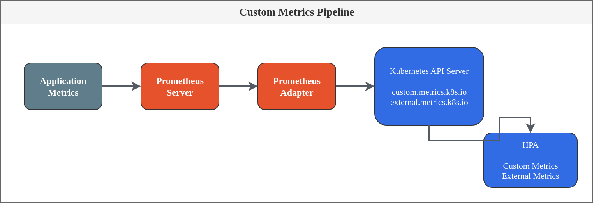

# Scaling Strategies

> **Supported Versions**: EKS 1.28+, Metrics Server 0.7+, KEDA 2.13+, VPA 1.0+ **Last Updated**: February 19, 2026

< [Previous: GitOps Automation](05-gitops-automation.md) | [Table of Contents](./README.md) | [Next: Operational Alert Configuration](07-observability-alerts.md) >

***

## Introduction

Effective scaling requires moving beyond basic CPU/memory metrics. This guide covers advanced scaling strategies including custom metrics with Prometheus Adapter, event-driven scaling with KEDA, vertical pod autoscaling, and optimizing Spot instance utilization.

***

## 1. HPA with Custom Metrics

Horizontal Pod Autoscaler (HPA) can scale based on custom metrics from Prometheus, enabling RPS-based, queue-length, or business-metric scaling.

### 1.1 Prometheus Adapter Architecture



### 1.2 Prometheus Adapter Installation

```yaml
# prometheus-adapter-values.yaml
replicas: 2

prometheus:
  url: http://prometheus-server.monitoring.svc
  port: 80

# Service account for RBAC
serviceAccount:
  create: true
  name: prometheus-adapter

# Resource configuration
resources:
  requests:
    cpu: 100m
    memory: 128Mi
  limits:
    cpu: 500m
    memory: 512Mi

# Pod disruption budget
podDisruptionBudget:
  enabled: true
  minAvailable: 1

# Rules for custom metrics
rules:
  default: false

  # Custom metric rules
  custom:
    # RPS (Requests Per Second) per pod
    - seriesQuery: 'http_requests_total{namespace!="",pod!=""}'
      resources:
        overrides:
          namespace:
            resource: namespace
          pod:
            resource: pod
      name:
        matches: "^(.*)_total$"
        as: "${1}_per_second"
      metricsQuery: 'sum(rate(<<.Series>>{<<.LabelMatchers>>}[2m])) by (<<.GroupBy>>)'

    # HTTP request rate by service
    - seriesQuery: 'http_server_requests_seconds_count{namespace!="",pod!=""}'
      resources:
        overrides:
          namespace:
            resource: namespace
          pod:
            resource: pod
      name:
        matches: "^(.*)_count$"
        as: "requests_per_second"
      metricsQuery: 'sum(rate(<<.Series>>{<<.LabelMatchers>>}[2m])) by (<<.GroupBy>>)'

    # Queue depth
    - seriesQuery: 'queue_messages_total{namespace!="",pod!=""}'
      resources:
        overrides:
          namespace:
            resource: namespace
          pod:
            resource: pod
      name:
        matches: "^(.*)_total$"
        as: "${1}_depth"
      metricsQuery: '<<.Series>>{<<.LabelMatchers>>}'

    # Active connections
    - seriesQuery: 'active_connections{namespace!="",pod!=""}'
      resources:
        overrides:
          namespace:
            resource: namespace
          pod:
            resource: pod
      name:
        matches: "^(.*)$"
        as: "${1}"
      metricsQuery: '<<.Series>>{<<.LabelMatchers>>}'

    # Custom business metric
    - seriesQuery: 'active_users{namespace!="",service!=""}'
      resources:
        overrides:
          namespace:
            resource: namespace
          service:
            resource: service
      name:
        matches: "^(.*)$"
        as: "${1}"
      metricsQuery: 'sum(<<.Series>>{<<.LabelMatchers>>}) by (<<.GroupBy>>)'

  # External metrics (e.g., CloudWatch, SQS)
  external:
    # SQS Queue Length
    - seriesQuery: 'aws_sqs_approximate_number_of_messages_visible_average{queue_name!=""}'
      resources:
        overrides:
          queue_name:
            group: "sqs.aws"
            resource: "queue"
      name:
        matches: "^aws_sqs_(.*)$"
        as: "sqs_${1}"
      metricsQuery: 'avg(<<.Series>>{<<.LabelMatchers>>})'

    # CloudWatch custom metric
    - seriesQuery: 'cloudwatch_custom_metric{metric_name!=""}'
      resources:
        overrides:
          metric_name:
            group: "cloudwatch.aws"
            resource: "metric"
      name:
        matches: "^cloudwatch_(.*)$"
        as: "cw_${1}"
      metricsQuery: '<<.Series>>{<<.LabelMatchers>>}'

# Logging
logLevel: 4

# TLS configuration (for production)
tls:
  enable: false
```

Install Prometheus Adapter:

```bash
helm repo add prometheus-community https://prometheus-community.github.io/helm-charts
helm repo update

helm install prometheus-adapter prometheus-community/prometheus-adapter \
  --namespace monitoring \
  --values prometheus-adapter-values.yaml

# Verify installation
kubectl get --raw "/apis/custom.metrics.k8s.io/v1beta1" | jq .
kubectl get --raw "/apis/external.metrics.k8s.io/v1beta1" | jq .
```

### 1.3 RPS-Based HPA Configuration

```yaml
# hpa/api-server-hpa.yaml
apiVersion: autoscaling/v2
kind: HorizontalPodAutoscaler
metadata:
  name: api-server
  namespace: production
spec:
  scaleTargetRef:
    apiVersion: apps/v1
    kind: Deployment
    name: api-server

  minReplicas: 3
  maxReplicas: 50

  metrics:
    # Primary: RPS per pod
    - type: Pods
      pods:
        metric:
          name: http_requests_per_second
        target:
          type: AverageValue
          averageValue: "100"  # 100 RPS per pod

    # Secondary: CPU as fallback
    - type: Resource
      resource:
        name: cpu
        target:
          type: Utilization
          averageUtilization: 70

    # Tertiary: Memory
    - type: Resource
      resource:
        name: memory
        target:
          type: Utilization
          averageUtilization: 80

  # Scaling behavior configuration
  behavior:
    scaleUp:
      stabilizationWindowSeconds: 0  # Scale up immediately
      policies:
        - type: Percent
          value: 100  # Double capacity
          periodSeconds: 15
        - type: Pods
          value: 4  # Or add 4 pods
          periodSeconds: 15
      selectPolicy: Max  # Use whichever adds more pods

    scaleDown:
      stabilizationWindowSeconds: 300  # Wait 5 minutes before scaling down
      policies:
        - type: Percent
          value: 10  # Remove 10% of pods
          periodSeconds: 60
        - type: Pods
          value: 2  # Or remove 2 pods
          periodSeconds: 60
      selectPolicy: Min  # Use whichever removes fewer pods

---
# HPA with external metrics (CloudWatch)
apiVersion: autoscaling/v2
kind: HorizontalPodAutoscaler
metadata:
  name: worker-processor
  namespace: production
spec:
  scaleTargetRef:
    apiVersion: apps/v1
    kind: Deployment
    name: worker-processor

  minReplicas: 2
  maxReplicas: 100

  metrics:
    # External metric: SQS queue depth
    - type: External
      external:
        metric:
          name: sqs_approximate_number_of_messages_visible_average
          selector:
            matchLabels:
              queue_name: "my-processing-queue"
        target:
          type: AverageValue
          averageValue: "50"  # 50 messages per pod

  behavior:
    scaleUp:
      stabilizationWindowSeconds: 0
      policies:
        - type: Percent
          value: 200
          periodSeconds: 30
    scaleDown:
      stabilizationWindowSeconds: 600
      policies:
        - type: Pods
          value: 1
          periodSeconds: 120
```

### 1.4 Custom PromQL for Complex Metrics

```yaml
# prometheus-adapter-rules-configmap.yaml
apiVersion: v1
kind: ConfigMap
metadata:
  name: prometheus-adapter-rules
  namespace: monitoring
data:
  config.yaml: |
    rules:
      custom:
        # Error rate percentage
        - seriesQuery: 'http_requests_total{namespace!="",pod!=""}'
          resources:
            overrides:
              namespace: {resource: namespace}
              pod: {resource: pod}
          name:
            as: "error_rate_percent"
          metricsQuery: |
            100 * (
              sum(rate(http_requests_total{status=~"5..",<<.LabelMatchers>>}[5m])) by (<<.GroupBy>>)
              /
              sum(rate(http_requests_total{<<.LabelMatchers>>}[5m])) by (<<.GroupBy>>)
            )

        # P99 latency
        - seriesQuery: 'http_request_duration_seconds_bucket{namespace!="",pod!=""}'
          resources:
            overrides:
              namespace: {resource: namespace}
              pod: {resource: pod}
          name:
            as: "latency_p99_seconds"
          metricsQuery: |
            histogram_quantile(0.99,
              sum(rate(http_request_duration_seconds_bucket{<<.LabelMatchers>>}[5m])) by (le, <<.GroupBy>>)
            )

        # Concurrent requests
        - seriesQuery: 'http_requests_in_flight{namespace!="",pod!=""}'
          resources:
            overrides:
              namespace: {resource: namespace}
              pod: {resource: pod}
          name:
            as: "concurrent_requests"
          metricsQuery: 'sum(<<.Series>>{<<.LabelMatchers>>}) by (<<.GroupBy>>)'

        # Business metric: orders per minute
        - seriesQuery: 'orders_processed_total{namespace!="",service!=""}'
          resources:
            overrides:
              namespace: {resource: namespace}
              service: {resource: service}
          name:
            as: "orders_per_minute"
          metricsQuery: |
            sum(rate(orders_processed_total{<<.LabelMatchers>>}[1m]) * 60) by (<<.GroupBy>>)
```

### 1.5 HPA Behavior Patterns

```yaml
# hpa/behavior-patterns.yaml

# Pattern 1: Fast scale-up, slow scale-down (web servers)
---
apiVersion: autoscaling/v2
kind: HorizontalPodAutoscaler
metadata:
  name: web-frontend
  namespace: production
spec:
  scaleTargetRef:
    apiVersion: apps/v1
    kind: Deployment
    name: web-frontend
  minReplicas: 5
  maxReplicas: 100
  metrics:
    - type: Resource
      resource:
        name: cpu
        target:
          type: Utilization
          averageUtilization: 60
  behavior:
    scaleUp:
      stabilizationWindowSeconds: 0
      policies:
        - type: Percent
          value: 100
          periodSeconds: 15
    scaleDown:
      stabilizationWindowSeconds: 600  # 10 minute window
      policies:
        - type: Percent
          value: 5
          periodSeconds: 60

# Pattern 2: Aggressive scale-up, aggressive scale-down (batch workers)
---
apiVersion: autoscaling/v2
kind: HorizontalPodAutoscaler
metadata:
  name: batch-worker
  namespace: production
spec:
  scaleTargetRef:
    apiVersion: apps/v1
    kind: Deployment
    name: batch-worker
  minReplicas: 0  # Scale to zero when idle
  maxReplicas: 200
  metrics:
    - type: External
      external:
        metric:
          name: sqs_approximate_number_of_messages_visible_average
          selector:
            matchLabels:
              queue_name: "batch-queue"
        target:
          type: Value
          value: "100"
  behavior:
    scaleUp:
      stabilizationWindowSeconds: 0
      policies:
        - type: Percent
          value: 500  # 5x increase
          periodSeconds: 15
    scaleDown:
      stabilizationWindowSeconds: 60
      policies:
        - type: Percent
          value: 50
          periodSeconds: 30

# Pattern 3: Conservative scaling (database connections)
---
apiVersion: autoscaling/v2
kind: HorizontalPodAutoscaler
metadata:
  name: db-proxy
  namespace: production
spec:
  scaleTargetRef:
    apiVersion: apps/v1
    kind: Deployment
    name: db-proxy
  minReplicas: 3
  maxReplicas: 20
  metrics:
    - type: Pods
      pods:
        metric:
          name: active_connections
        target:
          type: AverageValue
          averageValue: "100"
  behavior:
    scaleUp:
      stabilizationWindowSeconds: 120  # Wait 2 minutes
      policies:
        - type: Pods
          value: 2  # Add at most 2 pods
          periodSeconds: 60
    scaleDown:
      stabilizationWindowSeconds: 900  # Wait 15 minutes
      policies:
        - type: Pods
          value: 1  # Remove 1 pod at a time
          periodSeconds: 300

# Pattern 4: Time-based stabilization (avoid flapping)
---
apiVersion: autoscaling/v2
kind: HorizontalPodAutoscaler
metadata:
  name: api-gateway
  namespace: production
spec:
  scaleTargetRef:
    apiVersion: apps/v1
    kind: Deployment
    name: api-gateway
  minReplicas: 10
  maxReplicas: 100
  metrics:
    - type: Pods
      pods:
        metric:
          name: http_requests_per_second
        target:
          type: AverageValue
          averageValue: "200"
  behavior:
    scaleUp:
      stabilizationWindowSeconds: 60
      policies:
        - type: Percent
          value: 50
          periodSeconds: 60
      selectPolicy: Max
    scaleDown:
      stabilizationWindowSeconds: 300
      policies:
        - type: Percent
          value: 10
          periodSeconds: 120
      selectPolicy: Min
```

### 1.6 Verifying Custom Metrics

```bash
# List available custom metrics
kubectl get --raw "/apis/custom.metrics.k8s.io/v1beta1" | jq '.resources[].name'

# Query specific metric for a pod
kubectl get --raw "/apis/custom.metrics.k8s.io/v1beta1/namespaces/production/pods/*/http_requests_per_second" | jq .

# Query metric for all pods in deployment
kubectl get --raw "/apis/custom.metrics.k8s.io/v1beta1/namespaces/production/pods/*/http_requests_per_second?labelSelector=app=api-server" | jq .

# Check external metrics
kubectl get --raw "/apis/external.metrics.k8s.io/v1beta1/namespaces/production/sqs_approximate_number_of_messages_visible_average?labelSelector=queue_name=my-queue" | jq .

# Debug HPA status
kubectl describe hpa api-server -n production

# Watch HPA scaling events
kubectl get hpa api-server -n production -w
```

***

## 2. KEDA Event-Driven Scaling

KEDA (Kubernetes Event-Driven Autoscaling) provides event-driven scaling with support for numerous event sources.

> **Cross-reference**: For KEDA fundamentals and installation, see [KEDA Autoscaling](../autoscaling/01-keda.md)

### 2.1 KEDA Architecture

```
┌─────────────────────────────────────────────────────────────────────┐
│                      KEDA Architecture                              │
├─────────────────────────────────────────────────────────────────────┤
│                                                                     │
│  ┌──────────────────────────────────────────────────────────────┐  │
│  │                    Event Sources                              │  │
│  │  ┌──────────┐ ┌──────────┐ ┌──────────┐ ┌──────────────────┐ │  │
│  │  │   SQS    │ │ Kafka    │ │Prometheus│ │ PostgreSQL       │ │  │
│  │  └────┬─────┘ └────┬─────┘ └────┬─────┘ └────────┬─────────┘ │  │
│  └───────┼────────────┼────────────┼────────────────┼───────────┘  │
│          │            │            │                │              │
│          ▼            ▼            ▼                ▼              │
│  ┌──────────────────────────────────────────────────────────────┐  │
│  │                    KEDA Components                            │  │
│  │  ┌─────────────────────┐  ┌─────────────────────────────┐   │  │
│  │  │  KEDA Operator      │  │  KEDA Metrics Server        │   │  │
│  │  │  (ScaledObject CR)  │  │  (external-metrics API)     │   │  │
│  │  └──────────┬──────────┘  └──────────────┬──────────────┘   │  │
│  └─────────────┼────────────────────────────┼──────────────────┘  │
│                │                            │                      │
│                ▼                            ▼                      │
│  ┌──────────────────────────────────────────────────────────────┐  │
│  │              Kubernetes Components                            │  │
│  │  ┌─────────────────────┐  ┌─────────────────────────────┐   │  │
│  │  │        HPA          │  │      Deployment/Job         │   │  │
│  │  │  (created by KEDA)  │  │  (scaled by HPA)            │   │  │
│  │  └─────────────────────┘  └─────────────────────────────┘   │  │
│  └──────────────────────────────────────────────────────────────┘  │
│                                                                     │
└─────────────────────────────────────────────────────────────────────┘
```

### 2.2 RPS-Based ScaledObject with Prometheus

```yaml
# keda/rps-scaledobject.yaml
apiVersion: keda.sh/v1alpha1
kind: ScaledObject
metadata:
  name: api-server
  namespace: production
spec:
  scaleTargetRef:
    apiVersion: apps/v1
    kind: Deployment
    name: api-server

  # Scaling limits
  minReplicaCount: 3
  maxReplicaCount: 100

  # Scale to zero configuration
  idleReplicaCount: 0  # Optional: scale to zero when idle

  # Polling configuration
  pollingInterval: 15  # Check every 15 seconds
  cooldownPeriod: 300  # Wait 5 minutes before scaling down

  # Fallback configuration
  fallback:
    failureThreshold: 3
    replicas: 5

  # Advanced scaling behavior
  advanced:
    horizontalPodAutoscalerConfig:
      name: api-server-keda-hpa
      behavior:
        scaleUp:
          stabilizationWindowSeconds: 0
          policies:
            - type: Percent
              value: 100
              periodSeconds: 15
        scaleDown:
          stabilizationWindowSeconds: 300
          policies:
            - type: Percent
              value: 10
              periodSeconds: 60

  triggers:
    # Primary: RPS from Prometheus
    - type: prometheus
      metadata:
        serverAddress: http://prometheus-server.monitoring:80
        metricName: http_requests_per_second
        query: |
          sum(rate(http_requests_total{
            namespace="production",
            deployment="api-server"
          }[2m]))
        threshold: "1000"  # Total 1000 RPS triggers scaling
        activationThreshold: "100"  # Start scaling above 100 RPS

    # Secondary: Error rate threshold
    - type: prometheus
      metadata:
        serverAddress: http://prometheus-server.monitoring:80
        metricName: error_rate
        query: |
          100 * sum(rate(http_requests_total{
            namespace="production",
            deployment="api-server",
            status=~"5.."
          }[5m])) / sum(rate(http_requests_total{
            namespace="production",
            deployment="api-server"
          }[5m]))
        threshold: "5"  # Scale up if error rate > 5%
        activationThreshold: "1"

---
# TriggerAuthentication for secure Prometheus access
apiVersion: keda.sh/v1alpha1
kind: TriggerAuthentication
metadata:
  name: prometheus-auth
  namespace: production
spec:
  secretTargetRef:
    - parameter: bearerToken
      name: prometheus-token
      key: token
```

### 2.3 PostgreSQL Session-Based Scaling

```yaml
# keda/postgres-scaledobject.yaml
apiVersion: keda.sh/v1alpha1
kind: ScaledObject
metadata:
  name: db-worker
  namespace: production
spec:
  scaleTargetRef:
    apiVersion: apps/v1
    kind: Deployment
    name: db-worker

  minReplicaCount: 1
  maxReplicaCount: 20
  pollingInterval: 30
  cooldownPeriod: 300

  triggers:
    - type: postgresql
      metadata:
        # Connection string from secret
        connectionFromEnv: POSTGRES_CONNECTION_STRING
        query: |
          SELECT COUNT(*)
          FROM pg_stat_activity
          WHERE state = 'active'
          AND query NOT LIKE '%pg_stat_activity%'
        targetQueryValue: "5"  # 5 active queries per pod
        activationTargetQueryValue: "1"

    # Alternative: pending jobs in queue table
    - type: postgresql
      metadata:
        connectionFromEnv: POSTGRES_CONNECTION_STRING
        query: |
          SELECT COUNT(*)
          FROM job_queue
          WHERE status = 'pending'
          AND created_at > NOW() - INTERVAL '1 hour'
        targetQueryValue: "50"  # 50 pending jobs per pod

---
# Secret for PostgreSQL connection
apiVersion: v1
kind: Secret
metadata:
  name: postgres-credentials
  namespace: production
type: Opaque
stringData:
  connection_string: "host=mydb.cluster-xxx.ap-northeast-2.rds.amazonaws.com port=5432 user=app dbname=production password=secret sslmode=require"

---
# Deployment with connection string
apiVersion: apps/v1
kind: Deployment
metadata:
  name: db-worker
  namespace: production
spec:
  selector:
    matchLabels:
      app: db-worker
  template:
    metadata:
      labels:
        app: db-worker
    spec:
      containers:
        - name: worker
          image: myregistry/db-worker:v1.0
          env:
            - name: POSTGRES_CONNECTION_STRING
              valueFrom:
                secretKeyRef:
                  name: postgres-credentials
                  key: connection_string
```

### 2.4 SQS Queue-Based Scaling

```yaml
# keda/sqs-scaledobject.yaml
apiVersion: keda.sh/v1alpha1
kind: ScaledObject
metadata:
  name: queue-processor
  namespace: production
spec:
  scaleTargetRef:
    apiVersion: apps/v1
    kind: Deployment
    name: queue-processor

  minReplicaCount: 0  # Scale to zero when queue is empty
  maxReplicaCount: 100
  pollingInterval: 15
  cooldownPeriod: 60

  triggers:
    - type: aws-sqs-queue
      authenticationRef:
        name: aws-credentials
      metadata:
        queueURL: https://sqs.ap-northeast-2.amazonaws.com/123456789012/my-processing-queue
        queueLength: "10"  # 10 messages per pod
        awsRegion: ap-northeast-2
        activationQueueLength: "1"  # Start scaling at 1 message
        scaleOnInFlight: "true"  # Include in-flight messages

---
# TriggerAuthentication for AWS
apiVersion: keda.sh/v1alpha1
kind: TriggerAuthentication
metadata:
  name: aws-credentials
  namespace: production
spec:
  podIdentity:
    provider: aws-eks  # Use EKS Pod Identity

---
# Alternative: Using IAM Role for Service Account (IRSA)
apiVersion: keda.sh/v1alpha1
kind: TriggerAuthentication
metadata:
  name: aws-credentials-irsa
  namespace: production
spec:
  podIdentity:
    provider: aws
    identityId: arn:aws:iam::123456789012:role/keda-sqs-role
```

### 2.5 Cron-Based Scaling

```yaml
# keda/cron-scaledobject.yaml
apiVersion: keda.sh/v1alpha1
kind: ScaledObject
metadata:
  name: api-server-scheduled
  namespace: production
spec:
  scaleTargetRef:
    apiVersion: apps/v1
    kind: Deployment
    name: api-server

  minReplicaCount: 3
  maxReplicaCount: 50

  triggers:
    # Business hours scaling (Mon-Fri 9AM-6PM KST)
    - type: cron
      metadata:
        timezone: Asia/Seoul
        start: 0 9 * * 1-5    # 9 AM weekdays
        end: 0 18 * * 1-5     # 6 PM weekdays
        desiredReplicas: "20"

    # Peak hours scaling (Mon-Fri 11AM-2PM KST)
    - type: cron
      metadata:
        timezone: Asia/Seoul
        start: 0 11 * * 1-5
        end: 0 14 * * 1-5
        desiredReplicas: "40"

    # Weekend scaling
    - type: cron
      metadata:
        timezone: Asia/Seoul
        start: 0 10 * * 0,6   # Saturday, Sunday 10 AM
        end: 0 22 * * 0,6     # Saturday, Sunday 10 PM
        desiredReplicas: "15"

    # Combine with metric-based trigger
    - type: prometheus
      metadata:
        serverAddress: http://prometheus-server.monitoring:80
        metricName: rps
        query: sum(rate(http_requests_total{deployment="api-server"}[2m]))
        threshold: "500"
```

### 2.6 Composite Triggers

```yaml
# keda/composite-scaledobject.yaml
apiVersion: keda.sh/v1alpha1
kind: ScaledObject
metadata:
  name: multi-trigger-worker
  namespace: production
spec:
  scaleTargetRef:
    apiVersion: apps/v1
    kind: Deployment
    name: multi-worker

  minReplicaCount: 2
  maxReplicaCount: 100
  pollingInterval: 15
  cooldownPeriod: 300

  # Use formula to combine triggers
  advanced:
    horizontalPodAutoscalerConfig:
      behavior:
        scaleUp:
          stabilizationWindowSeconds: 30
          selectPolicy: Max
          policies:
            - type: Percent
              value: 100
              periodSeconds: 30

  triggers:
    # Trigger 1: SQS Queue
    - type: aws-sqs-queue
      name: sqs-trigger
      authenticationRef:
        name: aws-credentials
      metadata:
        queueURL: https://sqs.ap-northeast-2.amazonaws.com/123456789012/task-queue
        queueLength: "20"
        awsRegion: ap-northeast-2

    # Trigger 2: Kafka Consumer Lag
    - type: kafka
      name: kafka-trigger
      metadata:
        bootstrapServers: kafka.production:9092
        consumerGroup: my-consumer-group
        topic: events
        lagThreshold: "100"
        activationLagThreshold: "10"

    # Trigger 3: Prometheus metric
    - type: prometheus
      name: cpu-trigger
      metadata:
        serverAddress: http://prometheus-server.monitoring:80
        metricName: cpu_usage
        query: |
          avg(rate(container_cpu_usage_seconds_total{
            namespace="production",
            pod=~"multi-worker-.*"
          }[5m])) * 100
        threshold: "70"

    # Trigger 4: Memory pressure
    - type: prometheus
      name: memory-trigger
      metadata:
        serverAddress: http://prometheus-server.monitoring:80
        metricName: memory_usage
        query: |
          avg(container_memory_working_set_bytes{
            namespace="production",
            pod=~"multi-worker-.*"
          } / container_spec_memory_limit_bytes{
            namespace="production",
            pod=~"multi-worker-.*"
          }) * 100
        threshold: "80"
```

### 2.7 ScaledJob for Batch Processing

```yaml
# keda/scaledjob.yaml
apiVersion: keda.sh/v1alpha1
kind: ScaledJob
metadata:
  name: batch-processor
  namespace: production
spec:
  jobTargetRef:
    parallelism: 1
    completions: 1
    activeDeadlineSeconds: 600
    backoffLimit: 3
    template:
      metadata:
        labels:
          app: batch-processor
      spec:
        restartPolicy: Never
        serviceAccountName: batch-processor
        containers:
          - name: processor
            image: myregistry/batch-processor:v1.0
            env:
              - name: QUEUE_URL
                value: https://sqs.ap-northeast-2.amazonaws.com/123456789012/batch-queue
            resources:
              requests:
                cpu: 500m
                memory: 512Mi
              limits:
                cpu: 2000m
                memory: 2Gi

  pollingInterval: 30
  successfulJobsHistoryLimit: 5
  failedJobsHistoryLimit: 10

  # Maximum concurrent jobs
  maxReplicaCount: 50

  # Scaling strategy
  scalingStrategy:
    strategy: accurate  # Options: default, custom, accurate
    # For custom strategy:
    # customScalingQueueLengthDeduction: 1
    # customScalingRunningJobPercentage: "0.5"

  # Scale to zero
  minReplicaCount: 0

  # Rollout strategy
  rollout:
    strategy: gradual
    propagationPolicy: Foreground

  triggers:
    - type: aws-sqs-queue
      authenticationRef:
        name: aws-credentials
      metadata:
        queueURL: https://sqs.ap-northeast-2.amazonaws.com/123456789012/batch-queue
        queueLength: "1"  # One job per message
        awsRegion: ap-northeast-2
        activationQueueLength: "0"

---
# ScaledJob with Cron trigger for scheduled batch
apiVersion: keda.sh/v1alpha1
kind: ScaledJob
metadata:
  name: scheduled-report
  namespace: production
spec:
  jobTargetRef:
    parallelism: 1
    completions: 1
    template:
      spec:
        restartPolicy: Never
        containers:
          - name: report-generator
            image: myregistry/report-generator:v1.0
            resources:
              requests:
                cpu: 1000m
                memory: 2Gi

  pollingInterval: 60
  maxReplicaCount: 1

  triggers:
    - type: cron
      metadata:
        timezone: Asia/Seoul
        start: 0 6 * * *    # 6 AM daily
        end: 0 7 * * *      # 7 AM daily
        desiredReplicas: "1"
```

### 2.8 KEDA Tuning Parameters

```yaml
# keda/tuning-example.yaml
apiVersion: keda.sh/v1alpha1
kind: ScaledObject
metadata:
  name: tuned-worker
  namespace: production
  annotations:
    # Disable auto-scaling temporarily
    # autoscaling.keda.sh/paused: "true"
    # Custom replica annotation
    autoscaling.keda.sh/paused-replicas: "5"
spec:
  scaleTargetRef:
    apiVersion: apps/v1
    kind: Deployment
    name: tuned-worker

  # Core tuning parameters
  pollingInterval: 15       # How often to check triggers (seconds)
  cooldownPeriod: 300       # Time to wait after last trigger before scaling down
  idleReplicaCount: 0       # Replicas when idle (scale to zero)
  minReplicaCount: 2        # Minimum replicas when active
  maxReplicaCount: 100      # Maximum replicas

  # Fallback when trigger fails
  fallback:
    failureThreshold: 5     # Number of failures before fallback
    replicas: 10            # Fallback replica count

  # Advanced HPA configuration
  advanced:
    restoreToOriginalReplicaCount: true  # Restore on ScaledObject deletion
    horizontalPodAutoscalerConfig:
      name: tuned-worker-hpa
      behavior:
        scaleUp:
          stabilizationWindowSeconds: 0
          policies:
            - type: Percent
              value: 100
              periodSeconds: 15
            - type: Pods
              value: 10
              periodSeconds: 15
          selectPolicy: Max
        scaleDown:
          stabilizationWindowSeconds: 300
          policies:
            - type: Percent
              value: 10
              periodSeconds: 60
          selectPolicy: Min

  triggers:
    - type: prometheus
      metadata:
        serverAddress: http://prometheus-server.monitoring:80
        metricName: queue_depth
        query: sum(queue_messages_pending{app="tuned-worker"})
        threshold: "100"
        activationThreshold: "10"  # Don't scale until threshold is met
        # Metric type affects scaling calculation
        # AverageValue (default): totalMetric / desiredReplicas
        # Value: scale based on absolute metric value
        metricType: AverageValue
```

***

## 3. VPA (Vertical Pod Autoscaler)

VPA automatically adjusts CPU and memory requests based on actual usage.

### 3.1 VPA Installation

```bash
# Clone VPA repository
git clone https://github.com/kubernetes/autoscaler.git
cd autoscaler/vertical-pod-autoscaler

# Install VPA components
./hack/vpa-up.sh

# Verify installation
kubectl get pods -n kube-system | grep vpa
```

Or install with Helm:

```yaml
# vpa-values.yaml
admissionController:
  enabled: true
  replicaCount: 2

recommender:
  enabled: true
  replicaCount: 1
  resources:
    requests:
      cpu: 50m
      memory: 500Mi

updater:
  enabled: true
  replicaCount: 1
  resources:
    requests:
      cpu: 50m
      memory: 500Mi

# Minimum resources for VPA recommendations
resourcePolicy:
  minAllowed:
    cpu: 10m
    memory: 50Mi
  maxAllowed:
    cpu: 8
    memory: 32Gi
```

```bash
helm repo add fairwinds-stable https://charts.fairwinds.com/stable
helm install vpa fairwinds-stable/vpa \
  --namespace kube-system \
  --values vpa-values.yaml
```

### 3.2 VPA Update Modes

```yaml
# vpa/update-modes.yaml

# Mode: Off - Recommendations only, no auto-update
---
apiVersion: autoscaling.k8s.io/v1
kind: VerticalPodAutoscaler
metadata:
  name: api-server-vpa-off
  namespace: production
spec:
  targetRef:
    apiVersion: apps/v1
    kind: Deployment
    name: api-server
  updatePolicy:
    updateMode: "Off"  # Only provide recommendations
  resourcePolicy:
    containerPolicies:
      - containerName: api-server
        minAllowed:
          cpu: 100m
          memory: 128Mi
        maxAllowed:
          cpu: 4
          memory: 8Gi

# Mode: Initial - Set resources only at pod creation
---
apiVersion: autoscaling.k8s.io/v1
kind: VerticalPodAutoscaler
metadata:
  name: api-server-vpa-initial
  namespace: production
spec:
  targetRef:
    apiVersion: apps/v1
    kind: Deployment
    name: api-server
  updatePolicy:
    updateMode: "Initial"  # Only set on pod creation
  resourcePolicy:
    containerPolicies:
      - containerName: api-server
        minAllowed:
          cpu: 100m
          memory: 128Mi
        maxAllowed:
          cpu: 4
          memory: 8Gi
        controlledResources: ["cpu", "memory"]

# Mode: Auto - Full automatic adjustment (causes pod restarts)
---
apiVersion: autoscaling.k8s.io/v1
kind: VerticalPodAutoscaler
metadata:
  name: api-server-vpa-auto
  namespace: production
spec:
  targetRef:
    apiVersion: apps/v1
    kind: Deployment
    name: api-server
  updatePolicy:
    updateMode: "Auto"
    minReplicas: 2  # Minimum replicas during updates
  resourcePolicy:
    containerPolicies:
      - containerName: api-server
        minAllowed:
          cpu: 100m
          memory: 128Mi
        maxAllowed:
          cpu: 4
          memory: 8Gi
        controlledResources: ["cpu", "memory"]
        controlledValues: RequestsAndLimits  # Or RequestsOnly

---
# Check VPA recommendations
# kubectl describe vpa api-server-vpa-off -n production
```

### 3.3 VPA Resource Policies

```yaml
# vpa/resource-policies.yaml
apiVersion: autoscaling.k8s.io/v1
kind: VerticalPodAutoscaler
metadata:
  name: multi-container-vpa
  namespace: production
spec:
  targetRef:
    apiVersion: apps/v1
    kind: Deployment
    name: multi-container-app
  updatePolicy:
    updateMode: "Auto"
  resourcePolicy:
    containerPolicies:
      # Main application container
      - containerName: app
        minAllowed:
          cpu: 200m
          memory: 256Mi
        maxAllowed:
          cpu: 4
          memory: 8Gi
        controlledResources: ["cpu", "memory"]
        controlledValues: RequestsAndLimits

      # Sidecar - fixed resources (not controlled by VPA)
      - containerName: envoy-proxy
        mode: "Off"  # Don't adjust this container

      # Log shipper - only control memory
      - containerName: fluentbit
        minAllowed:
          memory: 64Mi
        maxAllowed:
          memory: 512Mi
        controlledResources: ["memory"]  # Only memory, not CPU
        controlledValues: RequestsOnly

      # Init container - use wildcard for all init containers
      - containerName: "*"
        mode: "Off"
```

### 3.4 In-Place Pod Resize (KEP-1287)

Starting from Kubernetes 1.27 (beta), in-place pod resize allows VPA to adjust resources without restarting pods.

```yaml
# vpa/inplace-resize.yaml
# Requires: Kubernetes 1.27+ with InPlacePodVerticalScaling feature gate

apiVersion: autoscaling.k8s.io/v1
kind: VerticalPodAutoscaler
metadata:
  name: api-server-inplace
  namespace: production
spec:
  targetRef:
    apiVersion: apps/v1
    kind: Deployment
    name: api-server
  updatePolicy:
    updateMode: "Auto"
  resourcePolicy:
    containerPolicies:
      - containerName: api-server
        minAllowed:
          cpu: 100m
          memory: 128Mi
        maxAllowed:
          cpu: 4
          memory: 8Gi
        controlledResources: ["cpu", "memory"]

---
# Deployment with resizePolicy for in-place updates
apiVersion: apps/v1
kind: Deployment
metadata:
  name: api-server
  namespace: production
spec:
  replicas: 3
  selector:
    matchLabels:
      app: api-server
  template:
    metadata:
      labels:
        app: api-server
    spec:
      containers:
        - name: api-server
          image: myregistry/api-server:v1.0
          resources:
            requests:
              cpu: 500m
              memory: 512Mi
            limits:
              cpu: 2
              memory: 2Gi
          # Resize policy for in-place updates
          resizePolicy:
            - resourceName: cpu
              restartPolicy: NotRequired  # CPU can be changed without restart
            - resourceName: memory
              restartPolicy: RestartContainer  # Memory change requires restart
```

### 3.5 Goldilocks Dashboard

Goldilocks provides a dashboard to visualize VPA recommendations.

```bash
# Install Goldilocks
helm repo add fairwinds-stable https://charts.fairwinds.com/stable
helm install goldilocks fairwinds-stable/goldilocks \
  --namespace goldilocks \
  --create-namespace \
  --set dashboard.enabled=true \
  --set dashboard.service.type=LoadBalancer
```

```yaml
# goldilocks/namespace-label.yaml
# Label namespaces for Goldilocks to monitor
apiVersion: v1
kind: Namespace
metadata:
  name: production
  labels:
    goldilocks.fairwinds.com/enabled: "true"
    goldilocks.fairwinds.com/vpa-update-mode: "Off"
```

### 3.6 VPA + HPA Coexistence Strategy

VPA and HPA can conflict when both try to manage CPU. Use this strategy:

```yaml
# vpa-hpa-coexistence.yaml

# Strategy 1: VPA manages memory, HPA manages CPU
---
apiVersion: autoscaling.k8s.io/v1
kind: VerticalPodAutoscaler
metadata:
  name: api-server-vpa
  namespace: production
spec:
  targetRef:
    apiVersion: apps/v1
    kind: Deployment
    name: api-server
  updatePolicy:
    updateMode: "Auto"
  resourcePolicy:
    containerPolicies:
      - containerName: api-server
        controlledResources: ["memory"]  # Only memory
        minAllowed:
          memory: 256Mi
        maxAllowed:
          memory: 8Gi

---
apiVersion: autoscaling/v2
kind: HorizontalPodAutoscaler
metadata:
  name: api-server-hpa
  namespace: production
spec:
  scaleTargetRef:
    apiVersion: apps/v1
    kind: Deployment
    name: api-server
  minReplicas: 3
  maxReplicas: 50
  metrics:
    - type: Resource
      resource:
        name: cpu
        target:
          type: Utilization
          averageUtilization: 70

# Strategy 2: VPA in "Off" mode for recommendations, manual apply
---
apiVersion: autoscaling.k8s.io/v1
kind: VerticalPodAutoscaler
metadata:
  name: batch-worker-vpa
  namespace: production
spec:
  targetRef:
    apiVersion: apps/v1
    kind: Deployment
    name: batch-worker
  updatePolicy:
    updateMode: "Off"  # Recommendations only
  resourcePolicy:
    containerPolicies:
      - containerName: worker
        minAllowed:
          cpu: 100m
          memory: 128Mi
        maxAllowed:
          cpu: 8
          memory: 16Gi

# Strategy 3: VPA "Initial" mode + HPA for dynamic workloads
---
apiVersion: autoscaling.k8s.io/v1
kind: VerticalPodAutoscaler
metadata:
  name: web-frontend-vpa
  namespace: production
spec:
  targetRef:
    apiVersion: apps/v1
    kind: Deployment
    name: web-frontend
  updatePolicy:
    updateMode: "Initial"  # Only at pod creation
  resourcePolicy:
    containerPolicies:
      - containerName: frontend
        controlledResources: ["cpu", "memory"]
        minAllowed:
          cpu: 100m
          memory: 128Mi
        maxAllowed:
          cpu: 2
          memory: 4Gi

---
apiVersion: autoscaling/v2
kind: HorizontalPodAutoscaler
metadata:
  name: web-frontend-hpa
  namespace: production
spec:
  scaleTargetRef:
    apiVersion: apps/v1
    kind: Deployment
    name: web-frontend
  minReplicas: 5
  maxReplicas: 100
  metrics:
    - type: Resource
      resource:
        name: cpu
        target:
          type: Utilization
          averageUtilization: 60
```

***

## 4. Custom Scheduler and Pod Deletion Cost

Pod deletion cost allows you to influence which pods are terminated first during scale-down.

> **Cross-reference**: For scheduling fundamentals, see [Scheduling, Preemption, and Eviction](../core/08-scheduling-preemption-eviction.md)

### 4.1 Pod Deletion Cost Annotation

```yaml
# pod-deletion-cost/examples.yaml

# Lower cost = deleted first (range: -2147483648 to 2147483647)
# Default cost is 0

# Example 1: Spot instance pods (delete first)
---
apiVersion: apps/v1
kind: Deployment
metadata:
  name: worker-spot
  namespace: production
spec:
  replicas: 10
  selector:
    matchLabels:
      app: worker
      instance-type: spot
  template:
    metadata:
      labels:
        app: worker
        instance-type: spot
      annotations:
        controller.kubernetes.io/pod-deletion-cost: "-100"  # Delete first
    spec:
      nodeSelector:
        kubernetes.io/capacity-type: spot
      containers:
        - name: worker
          image: myregistry/worker:v1.0

# Example 2: On-demand instance pods (delete last)
---
apiVersion: apps/v1
kind: Deployment
metadata:
  name: worker-ondemand
  namespace: production
spec:
  replicas: 5
  selector:
    matchLabels:
      app: worker
      instance-type: ondemand
  template:
    metadata:
      labels:
        app: worker
        instance-type: ondemand
      annotations:
        controller.kubernetes.io/pod-deletion-cost: "100"  # Delete last
    spec:
      nodeSelector:
        kubernetes.io/capacity-type: on-demand
      containers:
        - name: worker
          image: myregistry/worker:v1.0

# Example 3: Data-intensive pods (high cost to preserve)
---
apiVersion: apps/v1
kind: Deployment
metadata:
  name: cache-server
  namespace: production
spec:
  replicas: 3
  selector:
    matchLabels:
      app: cache-server
  template:
    metadata:
      labels:
        app: cache-server
      annotations:
        controller.kubernetes.io/pod-deletion-cost: "1000"  # Very last to delete
    spec:
      containers:
        - name: cache
          image: myregistry/cache:v1.0
          volumeMounts:
            - name: cache-data
              mountPath: /data
      volumes:
        - name: cache-data
          emptyDir:
            sizeLimit: 10Gi
```

### 4.2 Dynamic Pod Deletion Cost Controller

```yaml
# pod-deletion-cost/controller.yaml
apiVersion: apps/v1
kind: Deployment
metadata:
  name: deletion-cost-controller
  namespace: kube-system
spec:
  replicas: 1
  selector:
    matchLabels:
      app: deletion-cost-controller
  template:
    metadata:
      labels:
        app: deletion-cost-controller
    spec:
      serviceAccountName: deletion-cost-controller
      containers:
        - name: controller
          image: myregistry/deletion-cost-controller:v1.0
          env:
            - name: PROMETHEUS_URL
              value: "http://prometheus-server.monitoring:80"
          resources:
            requests:
              cpu: 50m
              memory: 64Mi

---
apiVersion: v1
kind: ServiceAccount
metadata:
  name: deletion-cost-controller
  namespace: kube-system

---
apiVersion: rbac.authorization.k8s.io/v1
kind: ClusterRole
metadata:
  name: deletion-cost-controller
rules:
  - apiGroups: [""]
    resources: ["pods"]
    verbs: ["get", "list", "watch", "patch"]
  - apiGroups: [""]
    resources: ["nodes"]
    verbs: ["get", "list", "watch"]

---
apiVersion: rbac.authorization.k8s.io/v1
kind: ClusterRoleBinding
metadata:
  name: deletion-cost-controller
subjects:
  - kind: ServiceAccount
    name: deletion-cost-controller
    namespace: kube-system
roleRef:
  kind: ClusterRole
  name: deletion-cost-controller
  apiGroup: rbac.authorization.k8s.io
```

```python
#!/usr/bin/env python3
# deletion-cost-controller/controller.py
"""
Dynamically adjusts pod deletion cost based on:
- Node type (Spot vs On-demand)
- Pod age
- Data locality
- Job completion status
"""

import os
import time
import requests
from kubernetes import client, config, watch

PROMETHEUS_URL = os.environ.get('PROMETHEUS_URL', 'http://prometheus-server:80')

def calculate_deletion_cost(pod: client.V1Pod) -> int:
    """Calculate deletion cost based on multiple factors."""
    cost = 0

    # Factor 1: Node type
    node_name = pod.spec.node_name
    if node_name:
        v1 = client.CoreV1Api()
        node = v1.read_node(node_name)
        capacity_type = node.metadata.labels.get('karpenter.sh/capacity-type', 'on-demand')
        if capacity_type == 'spot':
            cost -= 100  # Prefer deleting Spot pods
        else:
            cost += 100  # Preserve On-demand pods

    # Factor 2: Pod age (older = higher cost)
    if pod.status.start_time:
        age_hours = (time.time() - pod.status.start_time.timestamp()) / 3600
        cost += int(min(age_hours * 10, 500))  # Max +500 for old pods

    # Factor 3: Data locality (pods with PVCs)
    if pod.spec.volumes:
        for volume in pod.spec.volumes:
            if volume.persistent_volume_claim:
                cost += 200  # Higher cost for pods with data

    # Factor 4: Job completion (check if pod is processing work)
    labels = pod.metadata.labels or {}
    if 'batch.kubernetes.io/job-name' in labels:
        # Check if job is near completion via metrics
        job_progress = get_job_progress(pod.metadata.namespace, labels['batch.kubernetes.io/job-name'])
        if job_progress > 0.8:
            cost += 500  # Very high cost if job is 80%+ complete

    # Factor 5: Leader election (preserve leaders)
    annotations = pod.metadata.annotations or {}
    if annotations.get('is-leader') == 'true':
        cost += 1000  # Never delete leaders first

    return max(-2147483648, min(2147483647, cost))


def get_job_progress(namespace: str, job_name: str) -> float:
    """Query Prometheus for job progress."""
    query = f'job_progress{{namespace="{namespace}", job="{job_name}"}}'
    try:
        response = requests.get(
            f'{PROMETHEUS_URL}/api/v1/query',
            params={'query': query}
        )
        data = response.json()
        if data['status'] == 'success' and data['data']['result']:
            return float(data['data']['result'][0]['value'][1])
    except Exception:
        pass
    return 0.0


def update_pod_deletion_cost(pod: client.V1Pod, cost: int):
    """Update the pod's deletion cost annotation."""
    v1 = client.CoreV1Api()

    current_cost = pod.metadata.annotations.get(
        'controller.kubernetes.io/pod-deletion-cost', '0'
    )

    if current_cost != str(cost):
        body = {
            'metadata': {
                'annotations': {
                    'controller.kubernetes.io/pod-deletion-cost': str(cost)
                }
            }
        }
        v1.patch_namespaced_pod(
            pod.metadata.name,
            pod.metadata.namespace,
            body
        )
        print(f"Updated {pod.metadata.namespace}/{pod.metadata.name} deletion cost: {cost}")


def main():
    config.load_incluster_config()
    v1 = client.CoreV1Api()

    # Label selector for pods to manage
    label_selector = 'deletion-cost-managed=true'

    while True:
        pods = v1.list_pod_for_all_namespaces(
            label_selector=label_selector
        )

        for pod in pods.items:
            if pod.status.phase == 'Running':
                cost = calculate_deletion_cost(pod)
                update_pod_deletion_cost(pod, cost)

        time.sleep(60)  # Update every minute


if __name__ == '__main__':
    main()
```

### 4.3 Use Cases for Pod Deletion Cost

```yaml
# pod-deletion-cost/use-cases.yaml

# Use Case 1: Spot pods deleted before On-demand
---
apiVersion: apps/v1
kind: Deployment
metadata:
  name: mixed-capacity-app
  namespace: production
spec:
  replicas: 20
  selector:
    matchLabels:
      app: mixed-app
  template:
    metadata:
      labels:
        app: mixed-app
    spec:
      topologySpreadConstraints:
        - maxSkew: 5
          topologyKey: karpenter.sh/capacity-type
          whenUnsatisfiable: ScheduleAnyway
          labelSelector:
            matchLabels:
              app: mixed-app
      containers:
        - name: app
          image: myregistry/app:v1.0
      # Deletion cost set by mutating webhook based on node type

---
# Mutating webhook to set deletion cost
apiVersion: admissionregistration.k8s.io/v1
kind: MutatingWebhookConfiguration
metadata:
  name: deletion-cost-webhook
webhooks:
  - name: deletion-cost.example.com
    clientConfig:
      service:
        name: deletion-cost-webhook
        namespace: kube-system
        path: /mutate
      caBundle: ${CA_BUNDLE}
    rules:
      - operations: ["CREATE"]
        apiGroups: [""]
        apiVersions: ["v1"]
        resources: ["pods"]
    namespaceSelector:
      matchLabels:
        deletion-cost-managed: "true"

# Use Case 2: Batch job completion priority
---
apiVersion: batch/v1
kind: Job
metadata:
  name: data-processing
  namespace: production
spec:
  parallelism: 10
  completions: 100
  template:
    metadata:
      annotations:
        # Will be updated dynamically as job progresses
        controller.kubernetes.io/pod-deletion-cost: "0"
    spec:
      restartPolicy: Never
      containers:
        - name: processor
          image: myregistry/processor:v1.0
          env:
            - name: POD_NAME
              valueFrom:
                fieldRef:
                  fieldPath: metadata.name
          # Update deletion cost based on progress
          lifecycle:
            postStart:
              exec:
                command:
                  - /bin/sh
                  - -c
                  - |
                    # Increase deletion cost as job progresses
                    while true; do
                      PROGRESS=$(cat /tmp/progress || echo 0)
                      COST=$((PROGRESS * 10))
                      kubectl annotate pod $POD_NAME \
                        controller.kubernetes.io/pod-deletion-cost="$COST" \
                        --overwrite
                      sleep 30
                    done &
```

***

## 5. Spot Node Utilization

Optimize cost by effectively using Spot instances while maintaining reliability.

### 5.1 EKS Auto Mode with Spot NodePools

```yaml
# spot/auto-mode-nodepools.yaml
apiVersion: karpenter.sh/v1
kind: NodePool
metadata:
  name: general-spot
spec:
  template:
    metadata:
      labels:
        capacity-type: spot
        workload-type: general
    spec:
      requirements:
        - key: karpenter.sh/capacity-type
          operator: In
          values: ["spot"]
        - key: kubernetes.io/arch
          operator: In
          values: ["amd64"]
        - key: karpenter.k8s.aws/instance-category
          operator: In
          values: ["c", "m", "r"]
        - key: karpenter.k8s.aws/instance-generation
          operator: Gt
          values: ["5"]
        - key: karpenter.k8s.aws/instance-size
          operator: In
          values: ["large", "xlarge", "2xlarge"]
      nodeClassRef:
        group: karpenter.k8s.aws
        kind: EC2NodeClass
        name: default

  limits:
    cpu: 1000
    memory: 2000Gi

  disruption:
    consolidationPolicy: WhenEmptyOrUnderutilized
    consolidateAfter: 1m
    budgets:
      - nodes: "20%"

  # Weight for scheduling preference (higher = preferred)
  weight: 100  # Prefer Spot

---
apiVersion: karpenter.sh/v1
kind: NodePool
metadata:
  name: general-ondemand
spec:
  template:
    metadata:
      labels:
        capacity-type: on-demand
        workload-type: general
    spec:
      requirements:
        - key: karpenter.sh/capacity-type
          operator: In
          values: ["on-demand"]
        - key: kubernetes.io/arch
          operator: In
          values: ["amd64"]
        - key: karpenter.k8s.aws/instance-category
          operator: In
          values: ["c", "m", "r"]
        - key: karpenter.k8s.aws/instance-generation
          operator: Gt
          values: ["5"]
      nodeClassRef:
        group: karpenter.k8s.aws
        kind: EC2NodeClass
        name: default

  limits:
    cpu: 200
    memory: 400Gi

  disruption:
    consolidationPolicy: WhenEmpty
    consolidateAfter: 30m

  # Lower weight = fallback
  weight: 10  # Use only when Spot unavailable

---
# EC2NodeClass for both pools
apiVersion: karpenter.k8s.aws/v1
kind: EC2NodeClass
metadata:
  name: default
spec:
  amiSelectorTerms:
    - alias: al2023@latest
  subnetSelectorTerms:
    - tags:
        karpenter.sh/discovery: "production-cluster"
  securityGroupSelectorTerms:
    - tags:
        karpenter.sh/discovery: "production-cluster"

  # Spot configuration
  instanceStorePolicy: RAID0

  # Block device mapping
  blockDeviceMappings:
    - deviceName: /dev/xvda
      ebs:
        volumeSize: 100Gi
        volumeType: gp3
        iops: 3000
        throughput: 125
        encrypted: true
```

### 5.2 Spot Interruption Handler

```yaml
# spot/interruption-handler.yaml
apiVersion: apps/v1
kind: DaemonSet
metadata:
  name: spot-interruption-handler
  namespace: kube-system
spec:
  selector:
    matchLabels:
      app: spot-interruption-handler
  template:
    metadata:
      labels:
        app: spot-interruption-handler
    spec:
      nodeSelector:
        karpenter.sh/capacity-type: spot
      serviceAccountName: spot-interruption-handler
      hostNetwork: true
      containers:
        - name: handler
          image: myregistry/spot-handler:v1.0
          env:
            - name: NODE_NAME
              valueFrom:
                fieldRef:
                  fieldPath: spec.nodeName
            - name: SLACK_WEBHOOK_URL
              valueFrom:
                secretKeyRef:
                  name: slack-webhook
                  key: url
          resources:
            requests:
              cpu: 10m
              memory: 32Mi
      tolerations:
        - operator: Exists

---
# Karpenter handles interruptions automatically
# This is supplementary for custom handling
apiVersion: v1
kind: ConfigMap
metadata:
  name: spot-handler-config
  namespace: kube-system
data:
  config.yaml: |
    # Actions on interruption notice
    on_interruption:
      - drain_node: true
      - cordon_node: true
      - notify_slack: true

    # Grace period actions
    grace_period_seconds: 120

    # Pod priority for eviction order
    eviction_order:
      - priority_class: low-priority
      - label_selector: "batch=true"
      - annotation: "spot-evictable=true"
```

### 5.3 PDB + Pod Deletion Cost Combination

```yaml
# spot/pdb-deletion-cost.yaml
# Ensure high availability while preferring Spot termination

---
apiVersion: policy/v1
kind: PodDisruptionBudget
metadata:
  name: api-server-pdb
  namespace: production
spec:
  minAvailable: 3  # Always keep 3 pods running
  selector:
    matchLabels:
      app: api-server

---
apiVersion: apps/v1
kind: Deployment
metadata:
  name: api-server
  namespace: production
spec:
  replicas: 10
  selector:
    matchLabels:
      app: api-server
  template:
    metadata:
      labels:
        app: api-server
    spec:
      # Spread across capacity types
      topologySpreadConstraints:
        - maxSkew: 3
          topologyKey: karpenter.sh/capacity-type
          whenUnsatisfiable: DoNotSchedule
          labelSelector:
            matchLabels:
              app: api-server
        - maxSkew: 2
          topologyKey: topology.kubernetes.io/zone
          whenUnsatisfiable: DoNotSchedule
          labelSelector:
            matchLabels:
              app: api-server

      # Prefer Spot nodes
      affinity:
        nodeAffinity:
          preferredDuringSchedulingIgnoredDuringExecution:
            - weight: 100
              preference:
                matchExpressions:
                  - key: karpenter.sh/capacity-type
                    operator: In
                    values: ["spot"]

      containers:
        - name: api-server
          image: myregistry/api-server:v1.0
          resources:
            requests:
              cpu: 500m
              memory: 512Mi
          # Graceful shutdown
          lifecycle:
            preStop:
              exec:
                command: ["/bin/sh", "-c", "sleep 15"]
          terminationGracePeriodSeconds: 30
```

### 5.4 Topology Spread with Spot

```yaml
# spot/topology-spread.yaml
apiVersion: apps/v1
kind: Deployment
metadata:
  name: resilient-app
  namespace: production
spec:
  replicas: 12
  selector:
    matchLabels:
      app: resilient-app
  template:
    metadata:
      labels:
        app: resilient-app
    spec:
      topologySpreadConstraints:
        # Spread across zones
        - maxSkew: 1
          topologyKey: topology.kubernetes.io/zone
          whenUnsatisfiable: DoNotSchedule
          labelSelector:
            matchLabels:
              app: resilient-app

        # Spread across capacity types (Spot vs On-demand)
        - maxSkew: 4
          topologyKey: karpenter.sh/capacity-type
          whenUnsatisfiable: ScheduleAnyway
          labelSelector:
            matchLabels:
              app: resilient-app

        # Spread across instance types (Spot diversification)
        - maxSkew: 2
          topologyKey: node.kubernetes.io/instance-type
          whenUnsatisfiable: ScheduleAnyway
          labelSelector:
            matchLabels:
              app: resilient-app

      containers:
        - name: app
          image: myregistry/app:v1.0
          resources:
            requests:
              cpu: 250m
              memory: 256Mi
```

### 5.5 Graceful Shutdown Configuration

```yaml
# spot/graceful-shutdown.yaml
apiVersion: apps/v1
kind: Deployment
metadata:
  name: graceful-app
  namespace: production
spec:
  replicas: 5
  selector:
    matchLabels:
      app: graceful-app
  template:
    metadata:
      labels:
        app: graceful-app
    spec:
      terminationGracePeriodSeconds: 120  # 2 minutes for graceful shutdown

      containers:
        - name: app
          image: myregistry/app:v1.0

          # Health checks
          readinessProbe:
            httpGet:
              path: /health/ready
              port: 8080
            initialDelaySeconds: 5
            periodSeconds: 5

          livenessProbe:
            httpGet:
              path: /health/live
              port: 8080
            initialDelaySeconds: 10
            periodSeconds: 10

          # Graceful shutdown handling
          lifecycle:
            preStop:
              exec:
                command:
                  - /bin/sh
                  - -c
                  - |
                    # Signal application to stop accepting new requests
                    curl -X POST http://localhost:8080/admin/drain

                    # Wait for in-flight requests to complete
                    sleep 30

                    # Signal shutdown
                    curl -X POST http://localhost:8080/admin/shutdown

                    # Wait for graceful shutdown
                    sleep 10

          env:
            - name: GRACEFUL_SHUTDOWN_TIMEOUT
              value: "90s"
```

### 5.6 Spot Cost Analysis

```yaml
# spot/cost-analysis-job.yaml
apiVersion: batch/v1
kind: CronJob
metadata:
  name: spot-cost-analyzer
  namespace: monitoring
spec:
  schedule: "0 9 * * 1"  # Weekly on Monday 9 AM
  jobTemplate:
    spec:
      template:
        spec:
          serviceAccountName: cost-analyzer
          containers:
            - name: analyzer
              image: myregistry/cost-analyzer:v1.0
              env:
                - name: PROMETHEUS_URL
                  value: "http://prometheus-server:80"
                - name: SLACK_WEBHOOK_URL
                  valueFrom:
                    secretKeyRef:
                      name: slack-webhook
                      key: url
          restartPolicy: OnFailure
```

```python
#!/usr/bin/env python3
# cost-analyzer/analyze.py
"""
Analyzes Spot vs On-demand cost savings.
"""

import os
import requests
from datetime import datetime, timedelta

PROMETHEUS_URL = os.environ['PROMETHEUS_URL']
SLACK_WEBHOOK_URL = os.environ.get('SLACK_WEBHOOK_URL')

# Instance pricing (example, update with actual prices)
PRICING = {
    'm5.large': {'spot': 0.034, 'ondemand': 0.096},
    'm5.xlarge': {'spot': 0.068, 'ondemand': 0.192},
    'c5.large': {'spot': 0.030, 'ondemand': 0.085},
    'c5.xlarge': {'spot': 0.060, 'ondemand': 0.170},
    'r5.large': {'spot': 0.038, 'ondemand': 0.126},
}


def get_node_hours(capacity_type: str, days: int = 7) -> dict:
    """Get node-hours by instance type for given capacity type."""

    query = f'''
    sum by (instance_type) (
      increase(
        karpenter_nodes_total_daemon_requests_cpu_cores{{
          capacity_type="{capacity_type}"
        }}[{days}d]
      )
    )
    '''

    response = requests.get(
        f'{PROMETHEUS_URL}/api/v1/query',
        params={'query': query}
    )

    result = {}
    data = response.json()
    if data['status'] == 'success':
        for item in data['data']['result']:
            instance_type = item['metric'].get('instance_type', 'unknown')
            hours = float(item['value'][1]) / (days * 24)  # Normalize to hours
            result[instance_type] = hours * days * 24

    return result


def calculate_savings():
    """Calculate cost savings from Spot usage."""

    spot_hours = get_node_hours('spot', 7)
    ondemand_hours = get_node_hours('on-demand', 7)

    spot_cost = 0
    ondemand_equivalent_cost = 0

    for instance_type, hours in spot_hours.items():
        if instance_type in PRICING:
            spot_cost += hours * PRICING[instance_type]['spot']
            ondemand_equivalent_cost += hours * PRICING[instance_type]['ondemand']

    actual_ondemand_cost = 0
    for instance_type, hours in ondemand_hours.items():
        if instance_type in PRICING:
            actual_ondemand_cost += hours * PRICING[instance_type]['ondemand']

    total_cost = spot_cost + actual_ondemand_cost
    total_if_all_ondemand = ondemand_equivalent_cost + actual_ondemand_cost
    savings = total_if_all_ondemand - total_cost
    savings_percent = (savings / total_if_all_ondemand) * 100 if total_if_all_ondemand > 0 else 0

    return {
        'spot_cost': spot_cost,
        'ondemand_cost': actual_ondemand_cost,
        'total_cost': total_cost,
        'savings': savings,
        'savings_percent': savings_percent,
        'spot_hours': sum(spot_hours.values()),
        'ondemand_hours': sum(ondemand_hours.values()),
    }


def send_report(data: dict):
    """Send weekly cost report to Slack."""

    message = f"""
*Weekly Spot Instance Cost Report*

:moneybag: *Cost Summary (Last 7 Days)*
- Spot Instance Cost: ${data['spot_cost']:.2f}
- On-Demand Instance Cost: ${data['ondemand_cost']:.2f}
- *Total Cost: ${data['total_cost']:.2f}*

:chart_with_upwards_trend: *Savings*
- Estimated Savings: ${data['savings']:.2f}
- Savings Percentage: {data['savings_percent']:.1f}%

:bar_chart: *Usage*
- Spot Node-Hours: {data['spot_hours']:.0f}
- On-Demand Node-Hours: {data['ondemand_hours']:.0f}
- Spot Ratio: {data['spot_hours'] / (data['spot_hours'] + data['ondemand_hours']) * 100:.1f}%
"""

    requests.post(SLACK_WEBHOOK_URL, json={
        'text': message,
        'mrkdwn': True
    })


def main():
    data = calculate_savings()
    print(f"Weekly cost analysis: {data}")

    if SLACK_WEBHOOK_URL:
        send_report(data)


if __name__ == '__main__':
    main()
```

### 5.7 Fallback Strategy

```yaml
# spot/fallback-strategy.yaml
# Strategy: Primary Spot, fallback to On-demand with Karpenter

apiVersion: karpenter.sh/v1
kind: NodePool
metadata:
  name: spot-primary
spec:
  template:
    spec:
      requirements:
        - key: karpenter.sh/capacity-type
          operator: In
          values: ["spot"]
        - key: karpenter.k8s.aws/instance-family
          operator: In
          values: ["c5", "c6i", "m5", "m6i", "r5", "r6i"]
      nodeClassRef:
        group: karpenter.k8s.aws
        kind: EC2NodeClass
        name: default

  disruption:
    consolidationPolicy: WhenEmptyOrUnderutilized
    consolidateAfter: 30s

  weight: 100

---
apiVersion: karpenter.sh/v1
kind: NodePool
metadata:
  name: ondemand-fallback
spec:
  template:
    spec:
      requirements:
        - key: karpenter.sh/capacity-type
          operator: In
          values: ["on-demand"]
        - key: karpenter.k8s.aws/instance-family
          operator: In
          values: ["c5", "m5", "r5"]  # Fewer options for On-demand
      nodeClassRef:
        group: karpenter.k8s.aws
        kind: EC2NodeClass
        name: default

  limits:
    cpu: 100  # Limit On-demand capacity

  disruption:
    consolidationPolicy: WhenEmpty
    consolidateAfter: 5m

  weight: 10  # Low priority

---
# Application deployment with fallback handling
apiVersion: apps/v1
kind: Deployment
metadata:
  name: critical-app
  namespace: production
spec:
  replicas: 10
  selector:
    matchLabels:
      app: critical-app
  template:
    metadata:
      labels:
        app: critical-app
      annotations:
        # Prefer Spot but allow On-demand
        karpenter.sh/do-not-disrupt: "false"
    spec:
      # Soft preference for Spot
      affinity:
        nodeAffinity:
          preferredDuringSchedulingIgnoredDuringExecution:
            - weight: 90
              preference:
                matchExpressions:
                  - key: karpenter.sh/capacity-type
                    operator: In
                    values: ["spot"]
            - weight: 10
              preference:
                matchExpressions:
                  - key: karpenter.sh/capacity-type
                    operator: In
                    values: ["on-demand"]

      # Spread for resilience
      topologySpreadConstraints:
        - maxSkew: 1
          topologyKey: topology.kubernetes.io/zone
          whenUnsatisfiable: DoNotSchedule
          labelSelector:
            matchLabels:
              app: critical-app

      containers:
        - name: app
          image: myregistry/critical-app:v1.0
```

***

## Summary

| Strategy               | Use Case                          | Key Configuration                  |
| ---------------------- | --------------------------------- | ---------------------------------- |
| **HPA Custom Metrics** | RPS-based scaling, queue depth    | Prometheus Adapter + Custom PromQL |
| **KEDA**               | Event-driven, scale-to-zero       | ScaledObject + Triggers            |
| **VPA**                | Right-sizing, memory optimization | UpdateMode + Resource Policies     |
| **Pod Deletion Cost**  | Spot preference, job completion   | Annotation + Custom Controller     |
| **Spot Utilization**   | Cost optimization                 | NodePools + Topology Spread        |

**Scaling Decision Matrix:**

```
┌─────────────────────────────────────────────────────────────────────┐
│                    Scaling Decision Matrix                          │
├─────────────────────────────────────────────────────────────────────┤
│                                                                     │
│  Workload Type           │ Primary      │ Secondary    │ Notes     │
│  ─────────────────────────────────────────────────────────────────  │
│  Web API                 │ HPA (RPS)    │ VPA (memory) │ Fast up   │
│  Queue Consumer          │ KEDA (SQS)   │ -            │ Scale 0   │
│  Batch Processing        │ ScaledJob    │ Spot nodes   │ Cost opt  │
│  Database Proxy          │ HPA (conn)   │ VPA (both)   │ Conserve  │
│  ML Inference            │ HPA (GPU)    │ KEDA (queue) │ GPU aware │
│  Event Stream            │ KEDA (Kafka) │ -            │ Lag-based │
│                                                                     │
└─────────────────────────────────────────────────────────────────────┘
```

***

< [Previous: GitOps Automation](05-gitops-automation.md) | [Table of Contents](./README.md) | [Next: Operational Alert Configuration](07-observability-alerts.md) >
