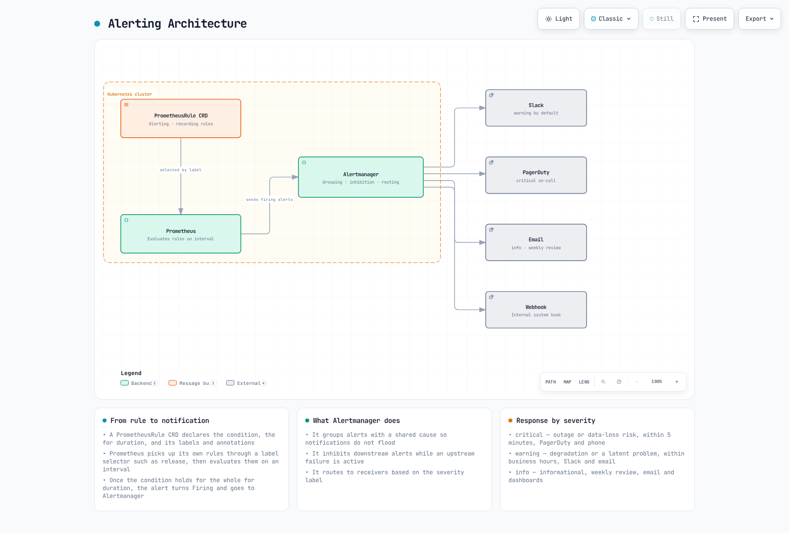
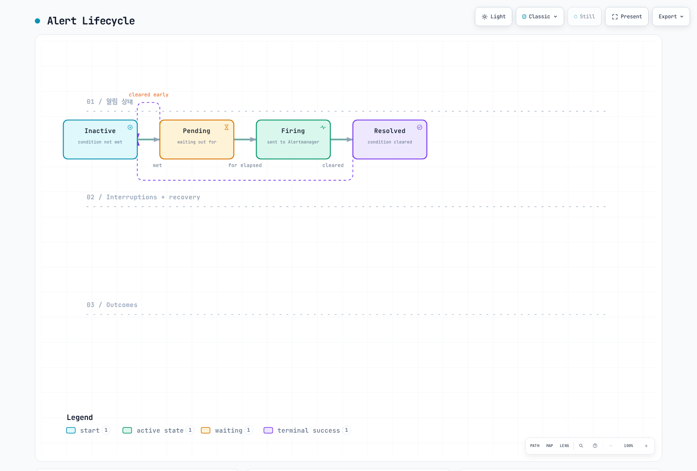

# Operational Alert Configuration: Core Metrics Monitoring

> **Supported Versions**: Prometheus 2.50+, Alertmanager 0.27+, Karpenter 0.35+
> **Last Updated**: February 23, 2026

< [Previous: Scaling Strategies](./06-scaling-strategies.md) | [Table of Contents](./README.md) | [Next: Observability Analysis](./08-observability-analysis.md) >

---

## 1. Alert Architecture

Effective alerting in Kubernetes requires a well-designed pipeline that minimizes noise while ensuring critical issues reach operators promptly. This section covers the foundational architecture for EKS operational alerts.

### Prometheus to Alertmanager Flow

The alerting pipeline follows a structured flow from metric collection to notification delivery:



[🔍 View interactive diagram](https://www.atomai.click/kubernetes-docs/archmaps/en-ops-07-observability-alerts-0.html)

```
┌─────────────┐    ┌──────────────────┐    ┌───────────────┐    ┌──────────────┐
│  Prometheus │───▶│ PrometheusRule   │───▶│ Alertmanager  │───▶│  Receivers   │
│   (Metrics) │    │ (Alert Evaluate) │    │  (Route/Group)│    │ (Slack/PD)   │
└─────────────┘    └──────────────────┘    └───────────────┘    └──────────────┘
       │                   │                       │                    │
       ▼                   ▼                       ▼                    ▼
   Scrape targets    Evaluate rules          Deduplicate         Notify teams
   every 15-30s      every 30-60s          Group by labels     Based on routing
```

### Severity Levels

Standardized severity levels ensure consistent response procedures:

| Severity | Response Time | Examples | Notification |
|----------|---------------|----------|--------------|
| **critical** | Immediate (< 5 min) | Node down, API server unreachable, data loss risk | PagerDuty + Slack |
| **warning** | Within 1 hour | High resource usage, degraded performance | Slack channel |
| **info** | Next business day | Scaling events, maintenance notices | Slack (optional) |

### Alert Lifecycle

Understanding the alert lifecycle helps configure appropriate timing:



[🔍 View interactive diagram](https://www.atomai.click/kubernetes-docs/archmaps/en-ops-07-observability-alerts-1.html)

```yaml
# Alert state transitions
Inactive → Pending → Firing → Resolved
    │         │         │         │
    │         │         │         └── Alert condition no longer true
    │         │         └── for: duration exceeded, sent to Alertmanager
    │         └── Condition true, waiting for 'for' duration
    └── Condition false, no alert
```

### PrometheusRule CRD Overview

The PrometheusRule CRD defines alerting and recording rules:

```yaml
apiVersion: monitoring.coreos.com/v1
kind: PrometheusRule
metadata:
  name: example-alerts
  namespace: monitoring
  labels:
    release: prometheus  # Must match Prometheus selector
spec:
  groups:
    - name: example.rules
      interval: 30s  # Evaluation interval for this group
      rules:
        - alert: ExampleAlert
          expr: vector(1) > 0
          for: 5m
          labels:
            severity: warning
            team: platform
          annotations:
            summary: "Example alert summary"
            description: "Detailed description with {{ $labels.instance }}"
            runbook_url: "https://wiki.example.com/runbooks/example"
```

Key fields:
- **expr**: PromQL expression that triggers the alert when true
- **for**: Duration the condition must be true before firing
- **labels**: Additional labels for routing and grouping
- **annotations**: Human-readable information and runbook links

---

## 2. Network Alerts

Network issues in EKS can manifest as packet drops, bandwidth saturation, CNI failures, and DNS problems. These alerts provide early warning of connectivity issues.

### Packet Drop Rate

Monitor packet drops at both node and pod levels:

```promql
# Node-level packet drops (received)
rate(node_network_receive_drop_total{device!~"lo|veth.*|docker.*|cali.*"}[5m]) > 100

# Node-level packet drops (transmitted)
rate(node_network_transmit_drop_total{device!~"lo|veth.*|docker.*|cali.*"}[5m]) > 100

# Pod-level packet drops via eBPF metrics (if available)
rate(pod_network_receive_packets_dropped_total[5m]) > 50
```

### Bandwidth Saturation

Detect network interface saturation before it impacts applications:

```promql
# Network interface utilization (assuming 10Gbps NICs)
(rate(node_network_receive_bytes_total{device=~"eth.*|ens.*"}[5m]) * 8)
  / (10 * 1024 * 1024 * 1024) > 0.8

# Sustained high bandwidth (warning at 70%)
avg_over_time(
  (rate(node_network_transmit_bytes_total{device=~"eth.*|ens.*"}[5m]) * 8)[15m:1m]
) / (10 * 1024 * 1024 * 1024) > 0.7
```

### VPC CNI Alerts

Amazon VPC CNI specific alerts for IP and ENI management:

```promql
# IP address exhaustion per node
awscni_assigned_ip_addresses / awscni_total_ip_addresses > 0.9

# ENI allocation failures
increase(awscni_eni_allocation_duration_seconds_count{error="true"}[5m]) > 0

# IP allocation latency
histogram_quantile(0.99, rate(awscni_ip_allocation_duration_seconds_bucket[5m])) > 5

# Prefix delegation IP pool low
awscni_ip_pool_available_addresses < 5
```

### DNS Failure Alerts

CoreDNS failures can cause widespread application issues:

```promql
# DNS query failures
sum(rate(coredns_dns_responses_total{rcode=~"SERVFAIL|REFUSED|NXDOMAIN"}[5m]))
  / sum(rate(coredns_dns_responses_total[5m])) > 0.05

# DNS latency
histogram_quantile(0.99, sum(rate(coredns_dns_request_duration_seconds_bucket[5m])) by (le)) > 1

# CoreDNS pod restarts
increase(kube_pod_container_status_restarts_total{
  namespace="kube-system",
  container="coredns"
}[1h]) > 2
```

### Network Policy Denials

If using Cilium or Calico with policy metrics:

```promql
# Cilium policy denials
rate(cilium_policy_verdict_total{verdict="denied"}[5m]) > 10

# High policy denial rate
sum(rate(cilium_policy_verdict_total{verdict="denied"}[5m]))
  / sum(rate(cilium_policy_verdict_total[5m])) > 0.1
```

### Complete Network Alerts PrometheusRule

```yaml
apiVersion: monitoring.coreos.com/v1
kind: PrometheusRule
metadata:
  name: network-alerts
  namespace: monitoring
  labels:
    release: prometheus
    app: kube-prometheus-stack
spec:
  groups:
    - name: network.alerts
      interval: 30s
      rules:
        # Packet Drops
        - alert: NodeNetworkPacketDropHigh
          expr: |
            rate(node_network_receive_drop_total{device!~"lo|veth.*|docker.*|cali.*"}[5m]) > 100
            or
            rate(node_network_transmit_drop_total{device!~"lo|veth.*|docker.*|cali.*"}[5m]) > 100
          for: 5m
          labels:
            severity: warning
            category: network
          annotations:
            summary: "High packet drop rate on {{ $labels.instance }}"
            description: |
              Node {{ $labels.instance }} is dropping packets on interface {{ $labels.device }}.
              Current drop rate: {{ $value | printf "%.2f" }} packets/sec
            runbook_url: "https://wiki.example.com/runbooks/network-packet-drops"

        # Bandwidth Saturation
        - alert: NodeNetworkBandwidthSaturation
          expr: |
            (rate(node_network_receive_bytes_total{device=~"eth.*|ens.*"}[5m]) * 8)
            / (10 * 1024 * 1024 * 1024) > 0.85
          for: 10m
          labels:
            severity: warning
            category: network
          annotations:
            summary: "Network bandwidth saturation on {{ $labels.instance }}"
            description: |
              Network interface {{ $labels.device }} on {{ $labels.instance }} is at
              {{ $value | printf "%.1f" }}% capacity.

        - alert: NodeNetworkBandwidthCritical
          expr: |
            (rate(node_network_receive_bytes_total{device=~"eth.*|ens.*"}[5m]) * 8)
            / (10 * 1024 * 1024 * 1024) > 0.95
          for: 5m
          labels:
            severity: critical
            category: network
          annotations:
            summary: "Critical network bandwidth on {{ $labels.instance }}"
            description: |
              Network interface {{ $labels.device }} on {{ $labels.instance }} is at
              {{ $value | printf "%.1f" }}% capacity. Immediate action required.

        # VPC CNI IP Exhaustion
        - alert: VPCCNIIPAddressExhaustion
          expr: awscni_assigned_ip_addresses / awscni_total_ip_addresses > 0.9
          for: 5m
          labels:
            severity: warning
            category: network
          annotations:
            summary: "VPC CNI IP pool running low on {{ $labels.instance }}"
            description: |
              Node {{ $labels.instance }} has used {{ $value | printf "%.1f" }}% of available
              IP addresses. Consider adding subnets or adjusting WARM_IP_TARGET.

        - alert: VPCCNIIPAddressCritical
          expr: awscni_assigned_ip_addresses / awscni_total_ip_addresses > 0.95
          for: 2m
          labels:
            severity: critical
            category: network
          annotations:
            summary: "VPC CNI IP pool critical on {{ $labels.instance }}"
            description: |
              Node {{ $labels.instance }} has nearly exhausted IP addresses.
              New pods may fail to schedule.

        - alert: VPCCNIENIAllocationFailure
          expr: increase(awscni_eni_allocation_duration_seconds_count{error="true"}[5m]) > 0
          for: 1m
          labels:
            severity: critical
            category: network
          annotations:
            summary: "ENI allocation failures on {{ $labels.instance }}"
            description: |
              ENI allocation is failing on {{ $labels.instance }}.
              Check EC2 ENI limits and subnet availability.

        # DNS Alerts
        - alert: CoreDNSHighErrorRate
          expr: |
            sum(rate(coredns_dns_responses_total{rcode=~"SERVFAIL|REFUSED"}[5m]))
            / sum(rate(coredns_dns_responses_total[5m])) > 0.05
          for: 5m
          labels:
            severity: warning
            category: dns
          annotations:
            summary: "High DNS error rate in CoreDNS"
            description: |
              CoreDNS is returning errors for {{ $value | printf "%.2f" }}% of queries.
              Check CoreDNS logs and upstream DNS servers.

        - alert: CoreDNSLatencyHigh
          expr: |
            histogram_quantile(0.99,
              sum(rate(coredns_dns_request_duration_seconds_bucket[5m])) by (le)
            ) > 1
          for: 10m
          labels:
            severity: warning
            category: dns
          annotations:
            summary: "High DNS latency in CoreDNS"
            description: |
              99th percentile DNS latency is {{ $value | printf "%.2f" }}s.
              This may cause application timeouts.

        - alert: CoreDNSFrequentRestarts
          expr: |
            increase(kube_pod_container_status_restarts_total{
              namespace="kube-system",
              container="coredns"
            }[1h]) > 2
          for: 5m
          labels:
            severity: warning
            category: dns
          annotations:
            summary: "CoreDNS pods restarting frequently"
            description: |
              CoreDNS container {{ $labels.pod }} has restarted
              {{ $value | printf "%.0f" }} times in the last hour.

        # Network Policy Denials (Cilium)
        - alert: CiliumHighPolicyDenialRate
          expr: |
            sum(rate(cilium_policy_verdict_total{verdict="denied"}[5m]))
            / sum(rate(cilium_policy_verdict_total[5m])) > 0.1
          for: 5m
          labels:
            severity: warning
            category: network-policy
          annotations:
            summary: "High network policy denial rate"
            description: |
              {{ $value | printf "%.1f" }}% of network traffic is being denied by policies.
              Review Cilium network policies for misconfigurations.
```

---

## 3. CPU Alerts

CPU-related alerts help identify throttling, resource contention, and capacity issues before they impact application performance.

### CPU Throttling

Container CPU throttling indicates insufficient CPU limits:

```promql
# Container CPU throttling percentage
sum(increase(container_cpu_cfs_throttled_periods_total{container!=""}[5m])) by (namespace, pod, container)
/ sum(increase(container_cpu_cfs_periods_total{container!=""}[5m])) by (namespace, pod, container)
> 0.25

# High throttling with significant CPU usage
(
  sum(increase(container_cpu_cfs_throttled_periods_total{container!=""}[5m])) by (namespace, pod, container)
  / sum(increase(container_cpu_cfs_periods_total{container!=""}[5m])) by (namespace, pod, container)
  > 0.5
)
and
(
  sum(rate(container_cpu_usage_seconds_total{container!=""}[5m])) by (namespace, pod, container) > 0.5
)
```

### CFS Quota Exhaustion

Track when containers consistently hit their CPU quotas:

```promql
# Containers hitting CFS quota
sum(rate(container_cpu_cfs_throttled_seconds_total{container!=""}[5m])) by (namespace, pod, container) > 1

# Throttled time as percentage of total CPU time
sum(rate(container_cpu_cfs_throttled_seconds_total{container!=""}[5m])) by (namespace, pod, container)
/ sum(rate(container_cpu_usage_seconds_total{container!=""}[5m])) by (namespace, pod, container)
> 0.5
```

### Node CPU Pressure

Detect nodes under CPU pressure:

```promql
# Node CPU utilization
100 - (avg by(instance) (rate(node_cpu_seconds_total{mode="idle"}[5m])) * 100) > 85

# Sustained high CPU (warning)
avg_over_time(
  (100 - (avg by(instance) (rate(node_cpu_seconds_total{mode="idle"}[5m])) * 100))[30m:1m]
) > 80

# CPU steal time (indicates noisy neighbors on shared infrastructure)
avg by(instance) (rate(node_cpu_seconds_total{mode="steal"}[5m])) * 100 > 10
```

### Container CPU vs Request Ratio

Identify containers that need request adjustments:

```promql
# CPU usage significantly higher than requests
sum(rate(container_cpu_usage_seconds_total{container!=""}[5m])) by (namespace, pod, container)
/ sum(kube_pod_container_resource_requests{resource="cpu", container!=""}) by (namespace, pod, container)
> 2

# CPU usage significantly lower than requests (over-provisioned)
sum(rate(container_cpu_usage_seconds_total{container!=""}[5m])) by (namespace, pod, container)
/ sum(kube_pod_container_resource_requests{resource="cpu", container!=""}) by (namespace, pod, container)
< 0.1
```

### System Process CPU

Monitor system-level CPU consumers:

```promql
# Kubelet CPU usage
rate(process_cpu_seconds_total{job="kubelet"}[5m]) > 1

# Container runtime CPU usage
rate(process_cpu_seconds_total{job=~"containerd|docker"}[5m]) > 2

# kube-proxy CPU usage
sum(rate(container_cpu_usage_seconds_total{namespace="kube-system", container="kube-proxy"}[5m])) > 0.5
```

### Complete CPU Alerts PrometheusRule

```yaml
apiVersion: monitoring.coreos.com/v1
kind: PrometheusRule
metadata:
  name: cpu-alerts
  namespace: monitoring
  labels:
    release: prometheus
    app: kube-prometheus-stack
spec:
  groups:
    - name: cpu.alerts
      interval: 30s
      rules:
        # CPU Throttling
        - alert: ContainerCPUThrottlingHigh
          expr: |
            sum(increase(container_cpu_cfs_throttled_periods_total{container!=""}[5m])) by (namespace, pod, container)
            / sum(increase(container_cpu_cfs_periods_total{container!=""}[5m])) by (namespace, pod, container)
            > 0.25
          for: 15m
          labels:
            severity: warning
            category: cpu
          annotations:
            summary: "Container {{ $labels.container }} is being CPU throttled"
            description: |
              Container {{ $labels.container }} in pod {{ $labels.namespace }}/{{ $labels.pod }}
              is being throttled {{ $value | printf "%.1f" }}% of the time.
              Consider increasing CPU limits or optimizing the application.
            runbook_url: "https://wiki.example.com/runbooks/cpu-throttling"

        - alert: ContainerCPUThrottlingCritical
          expr: |
            sum(increase(container_cpu_cfs_throttled_periods_total{container!=""}[5m])) by (namespace, pod, container)
            / sum(increase(container_cpu_cfs_periods_total{container!=""}[5m])) by (namespace, pod, container)
            > 0.5
          for: 10m
          labels:
            severity: critical
            category: cpu
          annotations:
            summary: "Severe CPU throttling on {{ $labels.container }}"
            description: |
              Container {{ $labels.container }} in pod {{ $labels.namespace }}/{{ $labels.pod }}
              is being throttled {{ $value | printf "%.1f" }}% of the time.
              This is severely impacting performance.

        # Node CPU Pressure
        - alert: NodeCPUHighUtilization
          expr: |
            100 - (avg by(instance) (rate(node_cpu_seconds_total{mode="idle"}[5m])) * 100) > 85
          for: 15m
          labels:
            severity: warning
            category: cpu
          annotations:
            summary: "High CPU utilization on {{ $labels.instance }}"
            description: |
              Node {{ $labels.instance }} CPU utilization is {{ $value | printf "%.1f" }}%.
              Consider scaling horizontally or vertically.

        - alert: NodeCPUCritical
          expr: |
            100 - (avg by(instance) (rate(node_cpu_seconds_total{mode="idle"}[5m])) * 100) > 95
          for: 5m
          labels:
            severity: critical
            category: cpu
          annotations:
            summary: "Critical CPU utilization on {{ $labels.instance }}"
            description: |
              Node {{ $labels.instance }} CPU utilization is {{ $value | printf "%.1f" }}%.
              Immediate action required to prevent service degradation.

        - alert: NodeCPUSustainedHigh
          expr: |
            avg_over_time(
              (100 - (avg by(instance) (rate(node_cpu_seconds_total{mode="idle"}[5m])) * 100))[30m:1m]
            ) > 80
          for: 5m
          labels:
            severity: warning
            category: cpu
          annotations:
            summary: "Sustained high CPU on {{ $labels.instance }}"
            description: |
              Node {{ $labels.instance }} has maintained {{ $value | printf "%.1f" }}% CPU
              utilization over the past 30 minutes.

        # CPU Steal Time
        - alert: NodeCPUStealTimeHigh
          expr: |
            avg by(instance) (rate(node_cpu_seconds_total{mode="steal"}[5m])) * 100 > 10
          for: 10m
          labels:
            severity: warning
            category: cpu
          annotations:
            summary: "High CPU steal time on {{ $labels.instance }}"
            description: |
              Node {{ $labels.instance }} is experiencing {{ $value | printf "%.1f" }}%
              CPU steal time, indicating resource contention at the hypervisor level.
              Consider using dedicated instances or different instance types.

        # Container CPU vs Requests
        - alert: ContainerCPUOverRequests
          expr: |
            sum(rate(container_cpu_usage_seconds_total{container!=""}[5m])) by (namespace, pod, container)
            / sum(kube_pod_container_resource_requests{resource="cpu", container!=""}) by (namespace, pod, container)
            > 2
          for: 30m
          labels:
            severity: info
            category: cpu
          annotations:
            summary: "Container {{ $labels.container }} using more CPU than requested"
            description: |
              Container {{ $labels.container }} in {{ $labels.namespace }}/{{ $labels.pod }}
              is using {{ $value | printf "%.1f" }}x its CPU request.
              Consider increasing resource requests.

        # System Process CPU
        - alert: KubeletHighCPU
          expr: rate(process_cpu_seconds_total{job="kubelet"}[5m]) > 1
          for: 15m
          labels:
            severity: warning
            category: cpu
          annotations:
            summary: "Kubelet high CPU usage on {{ $labels.instance }}"
            description: |
              Kubelet on {{ $labels.instance }} is consuming {{ $value | printf "%.2f" }}
              CPU cores. Check for excessive pod churn or API calls.

        - alert: ContainerRuntimeHighCPU
          expr: rate(process_cpu_seconds_total{job=~"containerd|docker"}[5m]) > 2
          for: 15m
          labels:
            severity: warning
            category: cpu
          annotations:
            summary: "Container runtime high CPU on {{ $labels.instance }}"
            description: |
              Container runtime on {{ $labels.instance }} is consuming
              {{ $value | printf "%.2f" }} CPU cores.
```

---

## 4. Disk Alerts

Storage alerts are critical for preventing data loss and ensuring application stability. EKS workloads commonly use EBS volumes, EFS, and ephemeral storage.

### EBS Volume Saturation

Monitor persistent volume usage:

```promql
# PVC usage percentage
kubelet_volume_stats_used_bytes{persistentvolumeclaim!=""}
/ kubelet_volume_stats_capacity_bytes{persistentvolumeclaim!=""}
> 0.85

# Volume approaching capacity with growth trend
(
  kubelet_volume_stats_used_bytes{persistentvolumeclaim!=""}
  / kubelet_volume_stats_capacity_bytes{persistentvolumeclaim!=""}
  > 0.7
)
and
(
  predict_linear(kubelet_volume_stats_used_bytes{persistentvolumeclaim!=""}[6h], 3600 * 24)
  > kubelet_volume_stats_capacity_bytes{persistentvolumeclaim!=""}
)
```

### Inode Exhaustion

Inode exhaustion can prevent file creation even with available space:

```promql
# Inode usage percentage
kubelet_volume_stats_inodes_used{persistentvolumeclaim!=""}
/ kubelet_volume_stats_inodes{persistentvolumeclaim!=""}
> 0.9

# Node filesystem inode usage
node_filesystem_files_free{fstype!~"tmpfs|overlay"}
/ node_filesystem_files{fstype!~"tmpfs|overlay"}
< 0.1
```

### PVC Usage Trending

Predict when volumes will fill:

```promql
# Predict volume exhaustion within 4 hours
predict_linear(kubelet_volume_stats_used_bytes{persistentvolumeclaim!=""}[1h], 4 * 3600)
> kubelet_volume_stats_capacity_bytes{persistentvolumeclaim!=""}

# Predict volume exhaustion within 24 hours
predict_linear(kubelet_volume_stats_used_bytes{persistentvolumeclaim!=""}[6h], 24 * 3600)
> kubelet_volume_stats_capacity_bytes{persistentvolumeclaim!=""}
```

### Node Disk Pressure

Monitor node-level disk conditions:

```promql
# Node root filesystem usage
(node_filesystem_size_bytes{mountpoint="/"} - node_filesystem_avail_bytes{mountpoint="/"})
/ node_filesystem_size_bytes{mountpoint="/"}
> 0.85

# Kubelet reporting disk pressure
kube_node_status_condition{condition="DiskPressure", status="true"} == 1
```

### Ephemeral Storage

Monitor ephemeral storage for nodes and pods:

```promql
# Node ephemeral storage usage
(node_filesystem_size_bytes{mountpoint="/var/lib/kubelet"} - node_filesystem_avail_bytes{mountpoint="/var/lib/kubelet"})
/ node_filesystem_size_bytes{mountpoint="/var/lib/kubelet"}
> 0.85

# Container ephemeral storage (if available via cadvisor)
container_fs_usage_bytes{container!=""}
/ container_fs_limit_bytes{container!=""}
> 0.8
```

### Complete Disk Alerts PrometheusRule

```yaml
apiVersion: monitoring.coreos.com/v1
kind: PrometheusRule
metadata:
  name: disk-alerts
  namespace: monitoring
  labels:
    release: prometheus
    app: kube-prometheus-stack
spec:
  groups:
    - name: disk.alerts
      interval: 60s
      rules:
        # PVC Usage
        - alert: PVCUsageHigh
          expr: |
            kubelet_volume_stats_used_bytes{persistentvolumeclaim!=""}
            / kubelet_volume_stats_capacity_bytes{persistentvolumeclaim!=""}
            > 0.85
          for: 5m
          labels:
            severity: warning
            category: storage
          annotations:
            summary: "PVC {{ $labels.persistentvolumeclaim }} usage high"
            description: |
              PVC {{ $labels.persistentvolumeclaim }} in namespace {{ $labels.namespace }}
              is {{ $value | printf "%.1f" }}% full.
            runbook_url: "https://wiki.example.com/runbooks/pvc-usage"

        - alert: PVCUsageCritical
          expr: |
            kubelet_volume_stats_used_bytes{persistentvolumeclaim!=""}
            / kubelet_volume_stats_capacity_bytes{persistentvolumeclaim!=""}
            > 0.95
          for: 2m
          labels:
            severity: critical
            category: storage
          annotations:
            summary: "PVC {{ $labels.persistentvolumeclaim }} nearly full"
            description: |
              PVC {{ $labels.persistentvolumeclaim }} in namespace {{ $labels.namespace }}
              is {{ $value | printf "%.1f" }}% full. Immediate action required.

        # PVC Exhaustion Prediction
        - alert: PVCExhaustionPredicted4h
          expr: |
            predict_linear(kubelet_volume_stats_used_bytes{persistentvolumeclaim!=""}[1h], 4 * 3600)
            > kubelet_volume_stats_capacity_bytes{persistentvolumeclaim!=""}
          for: 10m
          labels:
            severity: warning
            category: storage
          annotations:
            summary: "PVC {{ $labels.persistentvolumeclaim }} predicted to fill within 4 hours"
            description: |
              Based on current growth rate, PVC {{ $labels.persistentvolumeclaim }}
              will be exhausted within 4 hours.

        - alert: PVCExhaustionPredicted1h
          expr: |
            predict_linear(kubelet_volume_stats_used_bytes{persistentvolumeclaim!=""}[30m], 3600)
            > kubelet_volume_stats_capacity_bytes{persistentvolumeclaim!=""}
          for: 5m
          labels:
            severity: critical
            category: storage
          annotations:
            summary: "PVC {{ $labels.persistentvolumeclaim }} predicted to fill within 1 hour"
            description: |
              Based on current growth rate, PVC {{ $labels.persistentvolumeclaim }}
              will be exhausted within 1 hour. Expand volume immediately.

        # Inode Exhaustion
        - alert: PVCInodeExhaustion
          expr: |
            kubelet_volume_stats_inodes_used{persistentvolumeclaim!=""}
            / kubelet_volume_stats_inodes{persistentvolumeclaim!=""}
            > 0.9
          for: 5m
          labels:
            severity: warning
            category: storage
          annotations:
            summary: "PVC {{ $labels.persistentvolumeclaim }} running out of inodes"
            description: |
              PVC {{ $labels.persistentvolumeclaim }} has used {{ $value | printf "%.1f" }}%
              of available inodes. This can prevent file creation.

        - alert: NodeInodeExhaustion
          expr: |
            node_filesystem_files_free{fstype!~"tmpfs|overlay",mountpoint="/"}
            / node_filesystem_files{fstype!~"tmpfs|overlay",mountpoint="/"}
            < 0.1
          for: 5m
          labels:
            severity: warning
            category: storage
          annotations:
            summary: "Node {{ $labels.instance }} running out of inodes"
            description: |
              Node {{ $labels.instance }} has only {{ $value | printf "%.1f" }}%
              inodes remaining on root filesystem.

        # Node Disk Pressure
        - alert: NodeDiskUsageHigh
          expr: |
            (node_filesystem_size_bytes{mountpoint="/"} - node_filesystem_avail_bytes{mountpoint="/"})
            / node_filesystem_size_bytes{mountpoint="/"}
            > 0.85
          for: 10m
          labels:
            severity: warning
            category: storage
          annotations:
            summary: "High disk usage on {{ $labels.instance }}"
            description: |
              Node {{ $labels.instance }} root filesystem is {{ $value | printf "%.1f" }}% full.

        - alert: NodeDiskPressure
          expr: kube_node_status_condition{condition="DiskPressure", status="true"} == 1
          for: 2m
          labels:
            severity: critical
            category: storage
          annotations:
            summary: "Node {{ $labels.node }} is under disk pressure"
            description: |
              Kubernetes has detected disk pressure on node {{ $labels.node }}.
              Pods may be evicted. Investigate and free disk space immediately.

        # Ephemeral Storage
        - alert: NodeEphemeralStorageHigh
          expr: |
            (node_filesystem_size_bytes{mountpoint=~"/var/lib/kubelet|/var/lib/containerd"}
            - node_filesystem_avail_bytes{mountpoint=~"/var/lib/kubelet|/var/lib/containerd"})
            / node_filesystem_size_bytes{mountpoint=~"/var/lib/kubelet|/var/lib/containerd"}
            > 0.85
          for: 10m
          labels:
            severity: warning
            category: storage
          annotations:
            summary: "High ephemeral storage usage on {{ $labels.instance }}"
            description: |
              Node {{ $labels.instance }} ephemeral storage at {{ $labels.mountpoint }}
              is {{ $value | printf "%.1f" }}% full.
```

---

## 5. Auto Mode Node Termination Alerts

EKS Auto Mode with Karpenter dynamically provisions and terminates nodes. Monitoring these events is crucial for understanding cluster behavior and detecting issues.

### Karpenter Disruption Events

Monitor planned node disruptions by Karpenter:

```promql
# Node termination rate
sum(increase(karpenter_nodes_terminated_total[1h])) > 10

# Disruption by reason
sum by (reason) (increase(karpenter_nodes_terminated_total[1h])) > 5

# Voluntary disruption budget violations
increase(karpenter_voluntary_disruption_blocked_total[1h]) > 0
```

### Spot Interruption Handling

Track Spot instance interruption events:

```promql
# Spot interruption warnings received
increase(karpenter_interruption_received_messages_total{message_type="SpotInterruption"}[1h]) > 0

# Scheduled change notifications
increase(karpenter_interruption_received_messages_total{message_type="ScheduledChange"}[1h]) > 0

# Instance state changes (termination notices)
increase(karpenter_interruption_received_messages_total{message_type="StateChange"}[1h]) > 0

# Interruption handling latency
histogram_quantile(0.99, rate(karpenter_interruption_actions_performed_bucket[5m]))
```

### Unexpected Node Terminations

Detect nodes that terminate unexpectedly (not by Karpenter):

```promql
# Nodes terminated not by Karpenter
increase(karpenter_nodes_terminated_total{reason!~"underutilized|empty|drift|consolidation"}[1h]) > 0

# Node termination with no replacement
(
  increase(karpenter_nodes_terminated_total[15m]) > 0
)
unless
(
  increase(karpenter_nodes_created_total[15m]) > 0
)
```

### Node NotReady Detection

Monitor node readiness for early warning:

```promql
# Nodes in NotReady state
kube_node_status_condition{condition="Ready", status="false"} == 1

# Nodes transitioning to NotReady frequently
changes(kube_node_status_condition{condition="Ready", status="true"}[1h]) > 3

# Nodes with unknown status (often indicates termination in progress)
kube_node_status_condition{condition="Ready", status="unknown"} == 1
```

### Pod Eviction Tracking

Track pod evictions due to node issues:

```promql
# Pod eviction rate
sum(increase(kube_pod_status_reason{reason="Evicted"}[1h])) > 10

# Evictions by namespace
sum by (namespace) (increase(kube_pod_status_reason{reason="Evicted"}[1h])) > 5

# Node-initiated evictions (preemption)
increase(kube_pod_status_reason{reason="Preempting"}[1h]) > 0
```

### NodePool Capacity Alerts

Monitor Karpenter NodePool capacity:

```promql
# NodePool approaching CPU limit
sum by (nodepool) (karpenter_nodepools_usage{resource_type="cpu"})
/ sum by (nodepool) (karpenter_nodepools_limit{resource_type="cpu"})
> 0.9

# NodePool approaching memory limit
sum by (nodepool) (karpenter_nodepools_usage{resource_type="memory"})
/ sum by (nodepool) (karpenter_nodepools_limit{resource_type="memory"})
> 0.9

# Pending pods due to capacity constraints
sum(kube_pod_status_phase{phase="Pending"}) > 10
and
sum(karpenter_nodepools_usage{resource_type="cpu"})
/ sum(karpenter_nodepools_limit{resource_type="cpu"})
> 0.8
```

### Complete Auto Mode Alerts PrometheusRule

```yaml
apiVersion: monitoring.coreos.com/v1
kind: PrometheusRule
metadata:
  name: karpenter-alerts
  namespace: monitoring
  labels:
    release: prometheus
    app: kube-prometheus-stack
spec:
  groups:
    - name: karpenter.alerts
      interval: 30s
      rules:
        # Node Termination Rate
        - alert: KarpenterHighTerminationRate
          expr: sum(increase(karpenter_nodes_terminated_total[1h])) > 10
          for: 5m
          labels:
            severity: warning
            category: karpenter
          annotations:
            summary: "High node termination rate"
            description: |
              Karpenter has terminated {{ $value | printf "%.0f" }} nodes in the past hour.
              This may indicate excessive churn or aggressive consolidation settings.
            runbook_url: "https://wiki.example.com/runbooks/karpenter-termination"

        - alert: KarpenterUnexpectedTerminations
          expr: |
            increase(karpenter_nodes_terminated_total{
              reason!~"underutilized|empty|drift|consolidation|expired"
            }[1h]) > 0
          for: 1m
          labels:
            severity: warning
            category: karpenter
          annotations:
            summary: "Unexpected node terminations detected"
            description: |
              Nodes terminated for unexpected reason: {{ $labels.reason }}.
              Investigate EC2 console and Karpenter logs.

        # Spot Interruptions
        - alert: SpotInterruptionReceived
          expr: |
            increase(karpenter_interruption_received_messages_total{
              message_type="SpotInterruption"
            }[5m]) > 0
          for: 0m
          labels:
            severity: info
            category: karpenter
          annotations:
            summary: "Spot interruption notice received"
            description: |
              AWS has issued a Spot interruption notice. Karpenter is handling
              the graceful termination and pod migration.

        - alert: HighSpotInterruptionRate
          expr: |
            sum(increase(karpenter_interruption_received_messages_total{
              message_type="SpotInterruption"
            }[1h])) > 5
          for: 5m
          labels:
            severity: warning
            category: karpenter
          annotations:
            summary: "High Spot interruption rate"
            description: |
              {{ $value | printf "%.0f" }} Spot interruptions in the past hour.
              Consider diversifying instance types or using more On-Demand capacity.

        # Node NotReady
        - alert: NodeNotReady
          expr: kube_node_status_condition{condition="Ready", status="false"} == 1
          for: 5m
          labels:
            severity: warning
            category: node
          annotations:
            summary: "Node {{ $labels.node }} is NotReady"
            description: |
              Node {{ $labels.node }} has been in NotReady state for more than 5 minutes.
              Check node status and kubelet logs.

        - alert: NodeStatusUnknown
          expr: kube_node_status_condition{condition="Ready", status="unknown"} == 1
          for: 3m
          labels:
            severity: critical
            category: node
          annotations:
            summary: "Node {{ $labels.node }} status unknown"
            description: |
              Node {{ $labels.node }} status is unknown, likely indicating
              communication issues or imminent termination.

        - alert: NodeFlapping
          expr: changes(kube_node_status_condition{condition="Ready", status="true"}[1h]) > 3
          for: 5m
          labels:
            severity: warning
            category: node
          annotations:
            summary: "Node {{ $labels.node }} is flapping"
            description: |
              Node {{ $labels.node }} Ready status has changed
              {{ $value | printf "%.0f" }} times in the past hour.

        # Pod Evictions
        - alert: HighPodEvictionRate
          expr: sum(increase(kube_pod_status_reason{reason="Evicted"}[1h])) > 10
          for: 5m
          labels:
            severity: warning
            category: karpenter
          annotations:
            summary: "High pod eviction rate"
            description: |
              {{ $value | printf "%.0f" }} pods have been evicted in the past hour.
              Check for node pressure or disruption events.

        - alert: NamespacePodEvictions
          expr: |
            sum by (namespace) (increase(kube_pod_status_reason{reason="Evicted"}[1h])) > 5
          for: 5m
          labels:
            severity: warning
            category: karpenter
          annotations:
            summary: "Pod evictions in namespace {{ $labels.namespace }}"
            description: |
              {{ $value | printf "%.0f" }} pods evicted in namespace {{ $labels.namespace }}.

        # NodePool Capacity
        - alert: NodePoolCPUCapacityHigh
          expr: |
            sum by (nodepool) (karpenter_nodepools_usage{resource_type="cpu"})
            / sum by (nodepool) (karpenter_nodepools_limit{resource_type="cpu"})
            > 0.9
          for: 10m
          labels:
            severity: warning
            category: karpenter
          annotations:
            summary: "NodePool {{ $labels.nodepool }} approaching CPU limit"
            description: |
              NodePool {{ $labels.nodepool }} is at {{ $value | printf "%.1f" }}%
              CPU capacity. Consider increasing limits or adding NodePools.

        - alert: NodePoolMemoryCapacityHigh
          expr: |
            sum by (nodepool) (karpenter_nodepools_usage{resource_type="memory"})
            / sum by (nodepool) (karpenter_nodepools_limit{resource_type="memory"})
            > 0.9
          for: 10m
          labels:
            severity: warning
            category: karpenter
          annotations:
            summary: "NodePool {{ $labels.nodepool }} approaching memory limit"
            description: |
              NodePool {{ $labels.nodepool }} is at {{ $value | printf "%.1f" }}%
              memory capacity.

        - alert: DisruptionBudgetBlocking
          expr: increase(karpenter_voluntary_disruption_blocked_total[1h]) > 0
          for: 1m
          labels:
            severity: info
            category: karpenter
          annotations:
            summary: "Disruption budget blocking node operations"
            description: |
              Pod disruption budgets are preventing Karpenter from
              proceeding with voluntary disruptions.

        # Provisioning Issues
        - alert: KarpenterProvisioningLatencyHigh
          expr: |
            histogram_quantile(0.99,
              rate(karpenter_provisioner_scheduling_simulation_duration_seconds_bucket[5m])
            ) > 10
          for: 10m
          labels:
            severity: warning
            category: karpenter
          annotations:
            summary: "High Karpenter scheduling simulation latency"
            description: |
              Karpenter provisioning simulation is taking {{ $value | printf "%.1f" }}s
              at p99. This may delay pod scheduling.

        - alert: PendingPodsWithCapacity
          expr: |
            (sum(kube_pod_status_phase{phase="Pending"}) > 10)
            and
            (sum(karpenter_nodepools_usage{resource_type="cpu"})
            / sum(karpenter_nodepools_limit{resource_type="cpu"}) < 0.8)
          for: 10m
          labels:
            severity: warning
            category: karpenter
          annotations:
            summary: "Pending pods despite available capacity"
            description: |
              There are {{ $value | printf "%.0f" }} pending pods but NodePool
              capacity is not exhausted. Check for scheduling constraints or
              node affinity issues.
```

---

## 6. Alertmanager Configuration

Alertmanager handles alert routing, grouping, deduplication, and notification delivery. A well-configured Alertmanager ensures alerts reach the right teams at the right time.

### Complete Alertmanager Configuration

```yaml
# alertmanager.yaml
global:
  # Global SMTP settings
  smtp_smarthost: 'smtp.example.com:587'
  smtp_from: 'alertmanager@example.com'
  smtp_auth_username: 'alertmanager'
  smtp_auth_password_file: '/etc/alertmanager/secrets/smtp_password'

  # Global Slack settings
  slack_api_url_file: '/etc/alertmanager/secrets/slack_webhook_url'

  # Global PagerDuty settings
  pagerduty_url: 'https://events.pagerduty.com/v2/enqueue'

  # Resolution timeout
  resolve_timeout: 5m

# Routing tree
route:
  # Default receiver
  receiver: 'platform-team-slack'

  # Group alerts by these labels
  group_by: ['alertname', 'namespace', 'severity']

  # Wait before sending first notification for a group
  group_wait: 30s

  # Wait before sending updated notifications
  group_interval: 5m

  # Wait before resending a notification
  repeat_interval: 4h

  # Child routes (evaluated in order, first match wins)
  routes:
    # Critical alerts go to PagerDuty
    - receiver: 'pagerduty-critical'
      match:
        severity: critical
      continue: true  # Also send to Slack

    # Security alerts
    - receiver: 'security-team'
      match:
        category: security
      group_by: ['alertname', 'namespace']

    # Karpenter/Auto Mode alerts
    - receiver: 'platform-team-slack'
      match:
        category: karpenter
      group_by: ['alertname', 'nodepool']

    # DNS alerts
    - receiver: 'platform-team-slack'
      match:
        category: dns
      group_wait: 10s
      group_interval: 1m

    # Storage alerts with longer repeat interval
    - receiver: 'platform-team-slack'
      match:
        category: storage
      repeat_interval: 12h

    # Application team specific routing
    - receiver: 'app-team-orders'
      match_re:
        namespace: 'orders|checkout'

    - receiver: 'app-team-payments'
      match_re:
        namespace: 'payments|billing'

    # Info alerts go to low-priority channel
    - receiver: 'platform-team-low-priority'
      match:
        severity: info
      repeat_interval: 24h

# Inhibition rules (suppress lower severity when higher severity fires)
inhibit_rules:
  # Critical inhibits warning for same alert
  - source_match:
      severity: 'critical'
    target_match:
      severity: 'warning'
    equal: ['alertname', 'namespace', 'pod']

  # Node-level alerts inhibit pod-level alerts on same node
  - source_match:
      alertname: 'NodeNotReady'
    target_match_re:
      alertname: 'Pod.*|Container.*'
    equal: ['node']

  # Cluster-wide alerts inhibit namespace alerts
  - source_match:
      scope: 'cluster'
    target_match:
      scope: 'namespace'
    equal: ['alertname']

# Receivers configuration
receivers:
  # Slack - Platform team main channel
  - name: 'platform-team-slack'
    slack_configs:
      - channel: '#platform-alerts'
        send_resolved: true
        title: '{{ template "slack.title" . }}'
        text: '{{ template "slack.text" . }}'
        actions:
          - type: button
            text: 'Runbook'
            url: '{{ (index .Alerts 0).Annotations.runbook_url }}'
          - type: button
            text: 'Dashboard'
            url: 'https://grafana.example.com/d/alerts?var-alertname={{ (index .Alerts 0).Labels.alertname }}'
          - type: button
            text: 'Silence'
            url: '{{ template "slack.silence_url" . }}'

  # Slack - Low priority channel
  - name: 'platform-team-low-priority'
    slack_configs:
      - channel: '#platform-alerts-low'
        send_resolved: false
        title: '{{ template "slack.title" . }}'
        text: '{{ template "slack.text" . }}'

  # PagerDuty for critical alerts
  - name: 'pagerduty-critical'
    pagerduty_configs:
      - service_key_file: '/etc/alertmanager/secrets/pagerduty_service_key'
        severity: '{{ if eq .Status "firing" }}critical{{ else }}info{{ end }}'
        description: '{{ template "pagerduty.description" . }}'
        details:
          firing: '{{ template "pagerduty.firing_alerts" . }}'
          resolved: '{{ template "pagerduty.resolved_alerts" . }}'
          num_firing: '{{ .Alerts.Firing | len }}'
          num_resolved: '{{ .Alerts.Resolved | len }}'

  # Security team
  - name: 'security-team'
    slack_configs:
      - channel: '#security-alerts'
        send_resolved: true
        title: '{{ template "slack.title" . }}'
        text: '{{ template "slack.text" . }}'
    email_configs:
      - to: 'security@example.com'
        send_resolved: true
        headers:
          Subject: '[{{ .Status | toUpper }}] Security Alert: {{ .GroupLabels.alertname }}'

  # Application team receivers
  - name: 'app-team-orders'
    slack_configs:
      - channel: '#orders-team-alerts'
        send_resolved: true
        title: '{{ template "slack.title" . }}'
        text: '{{ template "slack.text" . }}'

  - name: 'app-team-payments'
    slack_configs:
      - channel: '#payments-team-alerts'
        send_resolved: true
        title: '{{ template "slack.title" . }}'
        text: '{{ template "slack.text" . }}'
    pagerduty_configs:
      - service_key_file: '/etc/alertmanager/secrets/pagerduty_payments_key'
        severity: 'critical'

# Templates
templates:
  - '/etc/alertmanager/templates/*.tmpl'

# Time-based muting
time_intervals:
  - name: 'business-hours'
    time_intervals:
      - weekdays: ['monday:friday']
        times:
          - start_time: '09:00'
            end_time: '17:00'
        location: 'America/New_York'

  - name: 'weekends'
    time_intervals:
      - weekdays: ['saturday', 'sunday']

  - name: 'maintenance-window'
    time_intervals:
      - weekdays: ['sunday']
        times:
          - start_time: '02:00'
            end_time: '06:00'
        location: 'America/New_York'
```

### Slack Template

Create `/etc/alertmanager/templates/slack.tmpl`:

```go
{{ define "slack.title" }}
{{ if eq .Status "firing" }}:fire:{{ else }}:white_check_mark:{{ end }} [{{ .Status | toUpper }}{{ if eq .Status "firing" }} {{ .Alerts.Firing | len }}{{ end }}] {{ .GroupLabels.alertname }}
{{ end }}

{{ define "slack.text" }}
{{ range .Alerts }}
*Alert:* {{ .Annotations.summary }}
*Severity:* `{{ .Labels.severity }}`
*Namespace:* `{{ .Labels.namespace }}`
{{ if .Labels.pod }}*Pod:* `{{ .Labels.pod }}`{{ end }}
{{ if .Labels.node }}*Node:* `{{ .Labels.node }}`{{ end }}
*Description:* {{ .Annotations.description }}
{{ if .Annotations.runbook_url }}*Runbook:* {{ .Annotations.runbook_url }}{{ end }}
*Started:* {{ .StartsAt.Format "2006-01-02 15:04:05 MST" }}
{{ if eq $.Status "resolved" }}*Resolved:* {{ .EndsAt.Format "2006-01-02 15:04:05 MST" }}{{ end }}
---
{{ end }}
{{ end }}

{{ define "slack.silence_url" }}
{{ .ExternalURL }}/#/silences/new?filter=%7B
{{- range .CommonLabels.SortedPairs -}}
    {{- if ne .Name "alertname" -}}
        {{- .Name }}%3D%22{{- .Value -}}%22%2C%20
    {{- end -}}
{{- end -}}
alertname%3D%22{{ .CommonLabels.alertname }}%22%7D
{{ end }}
```

### PagerDuty Template

Create `/etc/alertmanager/templates/pagerduty.tmpl`:

```go
{{ define "pagerduty.description" }}
[{{ .Status | toUpper }}] {{ .GroupLabels.alertname }} - {{ .CommonAnnotations.summary }}
{{ end }}

{{ define "pagerduty.firing_alerts" }}
{{ range .Alerts.Firing }}
- {{ .Annotations.summary }} ({{ .Labels.namespace }}/{{ .Labels.pod }})
{{ end }}
{{ end }}

{{ define "pagerduty.resolved_alerts" }}
{{ range .Alerts.Resolved }}
- {{ .Annotations.summary }} ({{ .Labels.namespace }}/{{ .Labels.pod }})
{{ end }}
{{ end }}
```

### Alert Grouping Strategy

Effective grouping reduces notification noise:

```yaml
# Group by alertname to see all instances of the same issue
group_by: ['alertname']

# Group by namespace for team-based routing
group_by: ['alertname', 'namespace']

# Group by severity for escalation
group_by: ['alertname', 'severity']

# Group by node for infrastructure issues
group_by: ['alertname', 'node']

# Fine-grained grouping for debugging
group_by: ['alertname', 'namespace', 'pod', 'container']
```

### Creating Silences

Silence alerts during maintenance:

```bash
# Create silence via amtool
amtool silence add \
  alertname="NodeNotReady" \
  node="ip-10-0-1-100.ec2.internal" \
  --duration=2h \
  --comment="Planned node maintenance" \
  --author="platform-team"

# Create silence for namespace
amtool silence add \
  namespace="staging" \
  --duration=4h \
  --comment="Staging environment rebuild"

# List active silences
amtool silence query

# Expire a silence early
amtool silence expire <silence-id>
```

### Mute Timing Configuration

Use mute timings to suppress non-critical alerts during specific periods:

```yaml
route:
  receiver: 'default'
  routes:
    # Mute info alerts during maintenance window
    - receiver: 'dev-null'
      match:
        severity: info
      mute_time_intervals:
        - 'maintenance-window'

    # Only alert during business hours for non-critical
    - receiver: 'slack-alerts'
      match:
        severity: warning
      active_time_intervals:
        - 'business-hours'
```

---

## Related Resources

- [Monitoring Stack](../observability/README.md) - Prometheus and Grafana setup
- [Node Lifecycle Management](../eks-auto-mode/07-node-lifecycle.md) - Karpenter node management
- [Observability Analysis](./08-observability-analysis.md) - Log, metric, and trace correlation

---

< [Previous: Scaling Strategies](./06-scaling-strategies.md) | [Table of Contents](./README.md) | [Next: Observability Analysis](./08-observability-analysis.md) >
