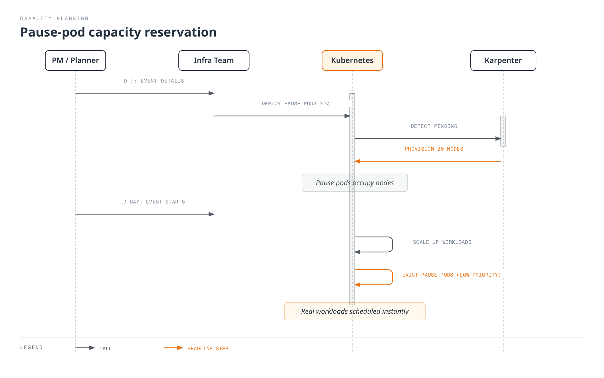

# Event Capacity Planning Playbook

> **Supported Versions**: Kubernetes 1.28+, KEDA 2.14+, Karpenter 0.37+
> **Last Updated**: April 25, 2026

< [Previous: EKS Upgrade Operations](./11-upgrade-operations.md) | [Table of Contents](./README.md) | [Next: FinOps Cost Visibility](./13-finops-cost-platform.md) >

---

## Overview

Flash sales, marketing campaigns, and seasonal events demand proactive infrastructure capacity planning to handle traffic surges reliably. This playbook serves both **operations engineers** and **non-technical stakeholders** (PMs, marketers) with practical, actionable guidance.

By combining KEDA for Pod-level scaling and Karpenter for Node-level provisioning, you can create a robust event scaling strategy that uses cron-based pre-scaling as a safety floor while business metrics drive real-time elasticity.

### Learning Objectives

- Understand traffic patterns and scaling strategies for different event types
- Use the capacity planning worksheet to estimate infrastructure needs
- Configure KEDA cron + business metric composite triggers
- Leverage Karpenter warm pools and EC2 Capacity Reservations
- Implement end-to-end KEDA + Karpenter coordination
- Build event-specific runbooks and operational processes

---

## 1. Event Capacity Planning Framework

### 1.1 Event Type Classification

| Event Type | Traffic Multiplier | Ramp-Up Time | Duration | Predictability | Examples |
|-----------|-------------------|-------------|----------|---------------|---------|
| Flash Sales | 10-50x | Seconds | 1-4 hours | High | Time-limited deals, limited edition launches |
| Product Launches | 5-20x | Minutes | 1-7 days | High | New feature releases, app updates |
| Marketing Campaigns | 3-10x | Minutes-Hours | Hours-Days | Medium | TV ads, social media viral |
| Seasonal Events | 5-30x | Hours | 1-7 days | High | Black Friday, year-end sales |
| Unexpected Surges | 5-100x | Seconds | Uncertain | Low | News/SNS viral, bot attacks |

### 1.2 Capacity Planning Worksheet

A standard worksheet PMs and planners can fill out and hand to the infrastructure team.

**Input (filled by PM/Planner):**

| Field | Description | Example Value |
|-------|------------|---------------|
| Event Type | Flash sale / Marketing / Seasonal | Flash Sale |
| Expected Concurrent Users | Peak simultaneous connections | 100,000 |
| Expected Peak RPM | Max requests per minute | 600,000 |
| Event Start Time | Date and time (local TZ) | 2026-05-01 12:00 KST |
| Event Duration | Hours at peak traffic | 2 hours |
| Ramp-Up Time | Time to reach peak traffic | 10 seconds |
| Baseline Traffic | Normal period RPM | 30,000 |

**Calculation Formula:**

```
Required Pods  = Peak RPM ÷ RPM per Pod
Required Nodes = Required Pods ÷ Pods per Node
Estimated Cost = Nodes × Hourly Cost × (Event Hours + Pre-scale + Cooldown)

Example:
- RPM per Pod: 3,000 (measured via load test)
- Required Pods: 600,000 ÷ 3,000 = 200 Pods
- Pods per Node: 10 (c5.4xlarge)
- Required Nodes: 200 ÷ 10 = 20 Nodes
- Safety margin (+30%): 26 Nodes
- Cost: 26 × $0.68/hr × (2hr event + 1hr pre + 1hr cooldown) = ~$70.72
```

### 1.3 D-30 to D+1 Timeline Checklist

| When | Owner | Task | Done |
|------|-------|------|------|
| **D-30** | PM + Infra | Share event details (fill worksheet) | ☐ |
| **D-30** | Infra | Request Capacity Reservations (if needed) | ☐ |
| **D-30** | Finance | Approve additional infrastructure budget | ☐ |
| **D-14** | Infra | Run load test at 120% of target RPM | ☐ |
| **D-14** | Infra | Identify and resolve bottlenecks | ☐ |
| **D-7** | Infra | Deploy KEDA ScaledObject (cron pre-scaling) | ☐ |
| **D-7** | Infra | Deploy Karpenter event NodePool | ☐ |
| **D-7** | Infra | Configure monitoring dashboards | ☐ |
| **D-3** | Infra | Dry-run pre-scaling (verify without live traffic) | ☐ |
| **D-1** | Infra + PM | Final verification: Pod/Node counts, alert channels, dashboard URLs | ☐ |
| **D-1** | Infra | Set up war room, assign on-call | ☐ |
| **D-Day** | Infra | Verify pre-scaling (30 min before event) | ☐ |
| **D-Day** | Infra | Real-time monitoring and standby for manual intervention | ☐ |
| **D+1** | Infra | Confirm scale-down, clean up leftover resources | ☐ |
| **D+1** | Infra + PM | Post-mortem: predicted vs actual, cost analysis | ☐ |

---

## 2. Pre-Scaling Strategies

### 2.1 KEDA Cron-Based Pre-Scaling

Scale up Pods ahead of the event to absorb the initial traffic spike.

**Single Event Window:**

```yaml
apiVersion: keda.sh/v1alpha1
kind: ScaledObject
metadata:
  name: flash-sale-prescale
  namespace: ecommerce
spec:
  scaleTargetRef:
    name: order-service
  minReplicaCount: 5
  maxReplicaCount: 300
  triggers:
    # Pre-scale 30 min before the event
    - type: cron
      metadata:
        timezone: Asia/Seoul
        start: "30 11 1 5 *"    # May 1st, 11:30
        end: "30 14 1 5 *"      # May 1st, 14:30
        desiredReplicas: "200"
```

**Multi-Region Event Windows:**

```yaml
apiVersion: keda.sh/v1alpha1
kind: ScaledObject
metadata:
  name: global-sale-prescale
  namespace: ecommerce
spec:
  scaleTargetRef:
    name: order-service
  minReplicaCount: 5
  maxReplicaCount: 500
  triggers:
    # Korea flash sale (KST 12:00-14:00)
    - type: cron
      metadata:
        timezone: Asia/Seoul
        start: "30 11 1 5 *"
        end: "30 14 1 5 *"
        desiredReplicas: "200"
    # Japan flash sale (JST 18:00-20:00)
    - type: cron
      metadata:
        timezone: Asia/Tokyo
        start: "30 17 1 5 *"
        end: "30 20 1 5 *"
        desiredReplicas: "150"
    # US flash sale (EST 09:00-11:00)
    - type: cron
      metadata:
        timezone: America/New_York
        start: "30 8 1 5 *"
        end: "30 11 1 5 *"
        desiredReplicas: "180"
```

### 2.2 Karpenter Warm Pools

Pre-provision Nodes before the event to eliminate Pod scheduling delays.

```yaml
apiVersion: karpenter.sh/v1
kind: NodePool
metadata:
  name: event-warm-pool
spec:
  template:
    metadata:
      labels:
        workload-type: event
        pool: warm
    spec:
      requirements:
        - key: kubernetes.io/arch
          operator: In
          values: ["amd64"]
        - key: karpenter.sh/capacity-type
          operator: In
          values: ["on-demand"]
        - key: node.kubernetes.io/instance-type
          operator: In
          values:
            - c5.4xlarge
            - c5.2xlarge
            - m5.4xlarge
      nodeClassRef:
        group: karpenter.k8s.aws
        kind: EC2NodeClass
        name: event-nodes
  limits:
    cpu: "640"
    memory: 1280Gi
  disruption:
    consolidationPolicy: WhenEmpty
    consolidateAfter: 30m
  weight: 100   # Higher weight = preferred over default NodePool
---
apiVersion: karpenter.k8s.aws/v1
kind: EC2NodeClass
metadata:
  name: event-nodes
spec:
  amiSelectorTerms:
    - alias: al2023@latest
  subnetSelectorTerms:
    - tags:
        karpenter.sh/discovery: my-cluster
  securityGroupSelectorTerms:
    - tags:
        karpenter.sh/discovery: my-cluster
  blockDeviceMappings:
    - deviceName: /dev/xvda
      ebs:
        volumeSize: 100Gi
        volumeType: gp3
        iops: 5000
        throughput: 250
  tags:
    event: flash-sale-2026-05
    cost-center: marketing
```

### 2.3 EC2 Capacity Reservations

Guarantee instance availability for large-scale events.

**Terraform HCL:**

```hcl
resource "aws_ec2_capacity_reservation" "flash_sale" {
  instance_type     = "c5.4xlarge"
  instance_platform = "Linux/UNIX"
  availability_zone = "ap-northeast-2a"
  instance_count    = 15
  instance_match_criteria = "targeted"

  end_date_type = "limited"
  end_date      = "2026-05-01T15:00:00Z"

  tags = {
    Name       = "flash-sale-2026-05"
    Event      = "flash-sale"
    CostCenter = "marketing"
  }
}

resource "aws_ec2_capacity_reservation" "flash_sale_2b" {
  instance_type     = "c5.4xlarge"
  instance_platform = "Linux/UNIX"
  availability_zone = "ap-northeast-2b"
  instance_count    = 11
  instance_match_criteria = "targeted"
  end_date_type = "limited"
  end_date      = "2026-05-01T15:00:00Z"
  tags = {
    Name       = "flash-sale-2026-05-2b"
    Event      = "flash-sale"
    CostCenter = "marketing"
  }
}
```

**Targeting Capacity Reservations in Karpenter:**

```yaml
apiVersion: karpenter.k8s.aws/v1
kind: EC2NodeClass
metadata:
  name: event-reserved
spec:
  amiSelectorTerms:
    - alias: al2023@latest
  subnetSelectorTerms:
    - tags:
        karpenter.sh/discovery: my-cluster
  securityGroupSelectorTerms:
    - tags:
        karpenter.sh/discovery: my-cluster
  capacityReservationSelectorTerms:
    - tags:
        Event: flash-sale
```

### 2.4 Pause Pods (Placeholder Scaling)

Use low-priority placeholder Pods to pre-warm Nodes. They are automatically evicted when real workloads need the capacity.

```yaml
apiVersion: scheduling.k8s.io/v1
kind: PriorityClass
metadata:
  name: pause-priority
value: -10
globalDefault: false
description: "Pause pods for pre-warming nodes - evicted by real workloads"
---
apiVersion: apps/v1
kind: Deployment
metadata:
  name: event-pause-pods
  namespace: ecommerce
  labels:
    purpose: node-warm-pool
spec:
  replicas: 20
  selector:
    matchLabels:
      app: pause-placeholder
  template:
    metadata:
      labels:
        app: pause-placeholder
    spec:
      priorityClassName: pause-priority
      terminationGracePeriodSeconds: 0
      containers:
        - name: pause
          image: registry.k8s.io/pause:3.9
          resources:
            requests:
              cpu: "14"
              memory: 24Gi
            limits:
              cpu: "14"
              memory: 24Gi
      tolerations:
        - key: event-workload
          operator: Exists
          effect: NoSchedule
```

**How It Works:**



---

## 3. Business Metric-Driven Scaling

### 3.1 Order Rate-Based Scaling

Scale based on business metrics collected in Prometheus.

**PrometheusRule (Recording Rules):**

```yaml
apiVersion: monitoring.coreos.com/v1
kind: PrometheusRule
metadata:
  name: business-metrics
  namespace: monitoring
spec:
  groups:
    - name: business.rules
      interval: 15s
      rules:
        - record: business:orders_per_minute:rate5m
          expr: sum(rate(order_completed_total[5m])) * 60
        - record: business:page_views_per_minute:rate5m
          expr: sum(rate(nginx_http_requests_total{path=~"/product.*"}[5m])) * 60
        - record: business:cart_additions_per_minute:rate5m
          expr: sum(rate(cart_add_total[5m])) * 60
```

**KEDA ScaledObject (Order Rate):**

```yaml
apiVersion: keda.sh/v1alpha1
kind: ScaledObject
metadata:
  name: order-service-scaler
  namespace: ecommerce
spec:
  scaleTargetRef:
    name: order-service
  pollingInterval: 10
  cooldownPeriod: 60
  minReplicaCount: 5
  maxReplicaCount: 300
  triggers:
    - type: prometheus
      metadata:
        serverAddress: http://prometheus.monitoring.svc:9090
        query: business:orders_per_minute:rate5m
        threshold: "150"
        activationThreshold: "10"
  advanced:
    horizontalPodAutoscalerConfig:
      behavior:
        scaleUp:
          stabilizationWindowSeconds: 0
          policies:
            - type: Percent
              value: 100
              periodSeconds: 15
        scaleDown:
          stabilizationWindowSeconds: 300
          policies:
            - type: Percent
              value: 10
              periodSeconds: 60
```

### 3.2 Page Views / Session-Based Scaling

Use CloudWatch metrics for frontend scaling.

```yaml
apiVersion: keda.sh/v1alpha1
kind: ScaledObject
metadata:
  name: frontend-pageview-scaler
  namespace: ecommerce
spec:
  scaleTargetRef:
    name: frontend-web
  pollingInterval: 15
  cooldownPeriod: 120
  minReplicaCount: 3
  maxReplicaCount: 200
  triggers:
    - type: aws-cloudwatch
      metadata:
        namespace: ECommerce/Frontend
        dimensionName: Service
        dimensionValue: frontend-web
        metricName: PageViewsPerMinute
        targetMetricValue: "5000"
        minMetricValue: "100"
        metricStatPeriod: "60"
        metricStatType: Sum
        awsRegion: ap-northeast-2
      authenticationRef:
        name: keda-aws-credentials
---
apiVersion: keda.sh/v1alpha1
kind: TriggerAuthentication
metadata:
  name: keda-aws-credentials
  namespace: ecommerce
spec:
  podIdentity:
    provider: aws
```

### 3.3 SQS Queue Depth Scaling

Scale order processing workers based on queue backlog.

```yaml
apiVersion: keda.sh/v1alpha1
kind: ScaledObject
metadata:
  name: order-worker-scaler
  namespace: ecommerce
spec:
  scaleTargetRef:
    name: order-worker
  pollingInterval: 5
  cooldownPeriod: 30
  minReplicaCount: 2
  maxReplicaCount: 100
  triggers:
    - type: aws-sqs-queue
      metadata:
        queueURL: https://sqs.ap-northeast-2.amazonaws.com/123456789012/order-processing
        queueLength: "5"
        awsRegion: ap-northeast-2
        activationQueueLength: "1"
      authenticationRef:
        name: keda-aws-credentials
```

### 3.4 Composite Trigger Configuration

**Cron sets the floor, metrics determine the ceiling.**

```yaml
apiVersion: keda.sh/v1alpha1
kind: ScaledObject
metadata:
  name: order-service-composite
  namespace: ecommerce
spec:
  scaleTargetRef:
    name: order-service
  pollingInterval: 10
  cooldownPeriod: 120
  minReplicaCount: 5
  maxReplicaCount: 300
  triggers:
    # Floor: guarantee minimum 100 Pods during event window
    - type: cron
      metadata:
        timezone: Asia/Seoul
        start: "30 11 1 5 *"
        end: "30 14 1 5 *"
        desiredReplicas: "100"
    # Ceiling: scale beyond 100 based on actual order volume
    - type: prometheus
      metadata:
        serverAddress: http://prometheus.monitoring.svc:9090
        query: business:orders_per_minute:rate5m
        threshold: "150"
        activationThreshold: "10"
    # Auxiliary: also consider SQS backlog
    - type: aws-sqs-queue
      metadata:
        queueURL: https://sqs.ap-northeast-2.amazonaws.com/123456789012/order-processing
        queueLength: "10"
        awsRegion: ap-northeast-2
      authenticationRef:
        name: keda-aws-credentials
```

KEDA selects the **maximum replica count** across all triggers. If cron requests 100 and Prometheus requests 150, the result is 150.


---

## 4. KEDA + Karpenter Coordination

### 4.1 Pod-Level and Node-Level Scaling


### 4.2 Scaling Timing Optimization

| Phase | Duration | Optimization |
|-------|----------|-------------|
| KEDA polling → HPA update | 10-30s | Reduce pollingInterval |
| HPA → Pod creation | 1-5s | scaleUp stabilization: 0 |
| Pod Pending → Node provisioning | 60-90s | Karpenter (vs CA 3-5 min) |
| Node Ready → Pod Running | 10-30s | Pre-cache images |
| **Total cold start** | **~2 min** | **Eliminated with Warm Pool** |

**Image Pre-Caching DaemonSet:**

```yaml
apiVersion: apps/v1
kind: DaemonSet
metadata:
  name: image-cache
  namespace: kube-system
spec:
  selector:
    matchLabels:
      app: image-cache
  template:
    metadata:
      labels:
        app: image-cache
    spec:
      initContainers:
        - name: cache-order-service
          image: 123456789012.dkr.ecr.ap-northeast-2.amazonaws.com/order-service:v2.5.0
          command: ["sh", "-c", "echo cached"]
        - name: cache-frontend
          image: 123456789012.dkr.ecr.ap-northeast-2.amazonaws.com/frontend:v3.1.0
          command: ["sh", "-c", "echo cached"]
      containers:
        - name: pause
          image: registry.k8s.io/pause:3.9
          resources:
            requests:
              cpu: 10m
              memory: 16Mi
      tolerations:
        - operator: Exists
```

### 4.3 End-to-End Example: Flash Sale Scenario

Complete configuration for a May 1st, 12:00 KST flash sale.

**1) KEDA ScaledObject:**

```yaml
apiVersion: keda.sh/v1alpha1
kind: ScaledObject
metadata:
  name: flash-sale-order-service
  namespace: ecommerce
spec:
  scaleTargetRef:
    name: order-service
  pollingInterval: 10
  cooldownPeriod: 180
  minReplicaCount: 5
  maxReplicaCount: 300
  triggers:
    - type: cron
      metadata:
        timezone: Asia/Seoul
        start: "30 11 1 5 *"
        end: "00 15 1 5 *"
        desiredReplicas: "150"
    - type: prometheus
      metadata:
        serverAddress: http://prometheus.monitoring.svc:9090
        query: business:orders_per_minute:rate5m
        threshold: "150"
  advanced:
    horizontalPodAutoscalerConfig:
      behavior:
        scaleUp:
          stabilizationWindowSeconds: 0
          policies:
            - type: Percent
              value: 100
              periodSeconds: 15
        scaleDown:
          stabilizationWindowSeconds: 600
          policies:
            - type: Percent
              value: 5
              periodSeconds: 60
```

**2) Karpenter NodePool:**

```yaml
apiVersion: karpenter.sh/v1
kind: NodePool
metadata:
  name: flash-sale-pool
spec:
  template:
    metadata:
      labels:
        event: flash-sale-2026-05
    spec:
      requirements:
        - key: karpenter.sh/capacity-type
          operator: In
          values: ["on-demand", "spot"]
        - key: node.kubernetes.io/instance-type
          operator: In
          values: ["c5.4xlarge", "c5.2xlarge", "c6i.4xlarge", "c6i.2xlarge"]
      nodeClassRef:
        group: karpenter.k8s.aws
        kind: EC2NodeClass
        name: event-nodes
  limits:
    cpu: "800"
    memory: 1600Gi
  disruption:
    consolidationPolicy: WhenEmpty
    consolidateAfter: 30m
  weight: 100
```

**3) PodDisruptionBudget:**

```yaml
apiVersion: policy/v1
kind: PodDisruptionBudget
metadata:
  name: order-service-pdb
  namespace: ecommerce
spec:
  minAvailable: "80%"
  selector:
    matchLabels:
      app: order-service
```

**4) Timeline Visualization:**

```
Time    11:00  11:30  12:00  12:30  13:00  13:30  14:00  14:30  15:00
        ──────────────────────────────────────────────────────────
Pods:     5     150    250    280    260    200    150     50      5
Nodes:    2      20     28     30     28     22     20      8      2
Traffic:  1x     1x    20x    35x    25x    15x    10x     2x     1x
        ──────────────────────────────────────────────────────────
             ▲                                           ▲
         Cron fires                                  Cron ends
         Pre-scaling                                 Cooldown starts
```

---

## 5. Runbook: Event-Specific Playbooks

### 5.1 Flash Sale Runbook

**D-7: Deploy Pre-Configuration**

```bash
# 1. Label the event namespace
kubectl label namespace ecommerce event=flash-sale-2026-05

# 2. Deploy KEDA ScaledObject
kubectl apply -f flash-sale-scaledobject.yaml

# 3. Deploy Karpenter NodePool
kubectl apply -f flash-sale-nodepool.yaml

# 4. Deploy PDB
kubectl apply -f order-service-pdb.yaml

# 5. Deploy image cache DaemonSet
kubectl apply -f image-cache-daemonset.yaml
```

**D-1: Final Verification**

```bash
# Verify ScaledObject status
kubectl get scaledobject -n ecommerce
kubectl describe scaledobject flash-sale-order-service -n ecommerce

# Verify Karpenter NodePool
kubectl get nodepool flash-sale-pool
kubectl describe nodepool flash-sale-pool

# Record baseline
echo "=== Baseline ==="
echo "Pods: $(kubectl get pods -n ecommerce -l app=order-service --no-headers | wc -l)"
echo "Nodes: $(kubectl get nodes --no-headers | wc -l)"
```

**D-Day: Event Monitoring**

```bash
# Real-time Pod count monitoring
watch -n 5 'kubectl get pods -n ecommerce -l app=order-service --no-headers | wc -l'

# Real-time Node count monitoring
watch -n 10 'kubectl get nodes -l event=flash-sale-2026-05 --no-headers | wc -l'

# Watch HPA status
kubectl get hpa -n ecommerce -w

# Emergency manual scale (if metrics are slow)
kubectl scale deployment order-service -n ecommerce --replicas=250
```

**D+1: Cleanup and Analysis**

```bash
# Remove event ScaledObject (restore normal config)
kubectl delete scaledobject flash-sale-order-service -n ecommerce

# Remove event NodePool
kubectl delete nodepool flash-sale-pool

# Cost analysis via Kubecost API
kubectl port-forward -n kubecost svc/kubecost-cost-analyzer 9090:9090 &
curl -s "http://localhost:9090/model/allocation?window=2d&aggregate=label:event" | jq '.data'
```

### 5.2 Marketing Campaign Runbook

Marketing campaigns have gradual ramp-up, so use staged cron triggers.

```yaml
apiVersion: keda.sh/v1alpha1
kind: ScaledObject
metadata:
  name: campaign-gradual-scale
  namespace: ecommerce
spec:
  scaleTargetRef:
    name: frontend-web
  minReplicaCount: 3
  maxReplicaCount: 100
  triggers:
    # Campaign start: moderate scale-up
    - type: cron
      metadata:
        timezone: Asia/Seoul
        start: "0 9 1 5 *"
        end: "0 12 1 5 *"
        desiredReplicas: "20"
    # Peak hours: full scale
    - type: cron
      metadata:
        timezone: Asia/Seoul
        start: "0 12 1 5 *"
        end: "0 22 1 5 *"
        desiredReplicas: "50"
    # Metric-based additional scaling
    - type: prometheus
      metadata:
        serverAddress: http://prometheus.monitoring.svc:9090
        query: sum(rate(nginx_http_requests_total{service="frontend-web"}[2m])) * 60
        threshold: "10000"
```

### 5.3 Emergency Response Runbook

Immediate response procedure for unexpected traffic surges.

```bash
#!/bin/bash
# emergency-scale.sh

NAMESPACE=${1:-ecommerce}
DEPLOYMENT=${2:-order-service}
TARGET_REPLICAS=${3:-100}

echo "=== Emergency Scaling ==="
echo "Target: ${NAMESPACE}/${DEPLOYMENT}"
echo "Desired Replicas: ${TARGET_REPLICAS}"

# 1. Immediate manual scale
kubectl scale deployment ${DEPLOYMENT} \
  -n ${NAMESPACE} \
  --replicas=${TARGET_REPLICAS}

# 2. Temporarily raise HPA minimum
kubectl patch hpa ${DEPLOYMENT} \
  -n ${NAMESPACE} \
  --type='json' \
  -p='[{"op":"replace","path":"/spec/minReplicas","value":'${TARGET_REPLICAS}'}]'

# 3. Apply emergency NodePool
cat <<EOF | kubectl apply -f -
apiVersion: karpenter.sh/v1
kind: NodePool
metadata:
  name: emergency-pool
spec:
  template:
    spec:
      requirements:
        - key: karpenter.sh/capacity-type
          operator: In
          values: ["on-demand"]
        - key: node.kubernetes.io/instance-type
          operator: In
          values: ["c5.4xlarge", "c6i.4xlarge", "m5.4xlarge"]
      nodeClassRef:
        group: karpenter.k8s.aws
        kind: EC2NodeClass
        name: default
  limits:
    cpu: "500"
  weight: 200
EOF

echo "=== Scaling Status ==="
kubectl get pods -n ${NAMESPACE} -l app=${DEPLOYMENT} --no-headers | wc -l
kubectl get nodes --no-headers | wc -l
```

---

## 6. Monitoring and Dashboards

### 6.1 Event Period Dashboard

Key panels for real-time event monitoring:

| Panel | PromQL | Purpose |
|-------|--------|---------|
| RPS | `sum(rate(http_requests_total[1m]))` | Requests per second |
| Pod Count | `count(kube_pod_info{namespace="ecommerce"})` | Current Pod count |
| Node Count | `count(kube_node_info)` | Current Node count |
| Error Rate | `sum(rate(http_requests_total{code=~"5.."}[1m])) / sum(rate(http_requests_total[1m]))` | Error rate |
| P99 Latency | `histogram_quantile(0.99, sum(rate(http_request_duration_seconds_bucket[1m])) by (le))` | Response time |
| Queue Depth | `aws_sqs_approximate_number_of_messages_visible` | SQS backlog |
| Cost/Hour | `sum(node_cost_hourly)` | Current infra cost |

**Grafana Dashboard JSON (key panels):**

```json
{
  "dashboard": {
    "title": "Event Capacity Dashboard",
    "tags": ["event", "capacity"],
    "panels": [
      {
        "title": "Requests Per Second",
        "type": "timeseries",
        "gridPos": {"h": 8, "w": 8, "x": 0, "y": 0},
        "targets": [
          {
            "expr": "sum(rate(http_requests_total{namespace=\"ecommerce\"}[1m]))",
            "legendFormat": "RPS"
          }
        ],
        "fieldConfig": {
          "defaults": {
            "thresholds": {
              "steps": [
                {"color": "green", "value": null},
                {"color": "yellow", "value": 5000},
                {"color": "red", "value": 8000}
              ]
            }
          }
        }
      },
      {
        "title": "Pod Count vs Target",
        "type": "timeseries",
        "gridPos": {"h": 8, "w": 8, "x": 8, "y": 0},
        "targets": [
          {
            "expr": "count(kube_pod_status_phase{namespace=\"ecommerce\",phase=\"Running\"})",
            "legendFormat": "Running Pods"
          },
          {
            "expr": "kube_horizontalpodautoscaler_spec_target_metric{namespace=\"ecommerce\"}",
            "legendFormat": "Target"
          }
        ]
      },
      {
        "title": "Node Count",
        "type": "stat",
        "gridPos": {"h": 8, "w": 8, "x": 16, "y": 0},
        "targets": [
          {
            "expr": "count(kube_node_info)",
            "legendFormat": "Total Nodes"
          }
        ]
      }
    ]
  }
}
```

### 6.2 Post-Event Analysis

**Post-Mortem Template:**

| Metric | Predicted | Actual | Variance |
|--------|----------|--------|---------|
| Peak RPM | 600,000 | 520,000 | -13% |
| Max Pod Count | 200 | 175 | -12.5% |
| Max Node Count | 26 | 22 | -15% |
| Peak P99 Latency | 200ms | 180ms | -10% |
| Error Rate | < 0.1% | 0.02% | OK |
| Total Event Cost | $70.72 | $59.84 | -15% |
| Revenue | $500,000 | $620,000 | +24% |
| Infra Cost / Revenue | 0.014% | 0.010% | OK |

```bash
# Cost analysis via Kubecost for the event period
curl -s "http://kubecost:9090/model/allocation" \
  --data-urlencode "window=2026-05-01T02:00:00Z,2026-05-01T08:00:00Z" \
  --data-urlencode "aggregate=namespace" \
  --data-urlencode "accumulate=true" | jq '
  .data[0] | to_entries[] | 
  select(.key == "ecommerce") | 
  {namespace: .key, totalCost: .value.totalCost, cpuCost: .value.cpuCost, memCost: .value.ramCost}'
```

---

## 7. Cost Management

### 7.1 Event Cost Estimation

| Instance Type | vCPU | Memory | Hourly Cost (Seoul) | Pod Capacity |
|-------------|------|--------|--------------------|----|
| c5.2xlarge | 8 | 16 GiB | $0.34 | ~5 pods |
| c5.4xlarge | 16 | 32 GiB | $0.68 | ~10 pods |
| c6i.4xlarge | 16 | 32 GiB | $0.72 | ~10 pods |
| m5.4xlarge | 16 | 64 GiB | $0.77 | ~10 pods |

**Spot vs On-Demand Decision Matrix:**

| Criteria | Use On-Demand | Spot Acceptable |
|----------|--------------|----------------|
| Event Criticality | Revenue-impacting | Auxiliary services |
| Interruption Tolerance | Not acceptable | OK (has retry logic) |
| Event Duration | < 2 hours | > 4 hours |
| Spot Savings | < 50% | > 60% |

### 7.2 Automatic Scale-Down

```yaml
# Gradual scale-down after event
advanced:
  horizontalPodAutoscalerConfig:
    behavior:
      scaleDown:
        stabilizationWindowSeconds: 600
        policies:
          - type: Percent
            value: 10
            periodSeconds: 120
```

**Karpenter Consolidation Teardown:**

```bash
# 1. Switch event NodePool to aggressive consolidation
kubectl patch nodepool flash-sale-pool --type='merge' -p '
  {"spec":{"disruption":{"consolidationPolicy":"WhenEmptyOrUnderutilized","consolidateAfter":"5m"}}}'

# 2. Remove event NodePool after 30 min
sleep 1800 && kubectl delete nodepool flash-sale-pool

# 3. Release Capacity Reservations (Terraform)
terraform destroy -target=aws_ec2_capacity_reservation.flash_sale
```

---

## 8. Best Practices and Anti-Patterns

### Best Practices

| # | Practice | Description |
|---|---------|-------------|
| 1 | Load test early | Run at 120% of target RPM two weeks before the event |
| 2 | Combine cron + metrics | Cron sets the floor, metrics determine the ceiling |
| 3 | Gradual scale-down | Reduce 10% at a time instead of sharp drops |
| 4 | Tag everything | Label all resources with event name for cost tracking |
| 5 | Include non-technical stakeholders | Share dashboard URLs and status with PMs |
| 6 | Post-mortem every event | Compare predicted vs actual to improve accuracy |
| 7 | Use warm pools | Eliminate 2-minute cold start entirely |

### Anti-Patterns

| # | Anti-Pattern | Problem | Alternative |
|---|-------------|---------|-------------|
| 1 | Manual scaling only | Cannot respond to night/weekend events | Automate with KEDA cron |
| 2 | No maxReplicas | Cost explosion, resource exhaustion | Always set upper bounds |
| 3 | Last-minute config changes | No time to validate, outage risk | Deploy at D-7, validate at D-3 |
| 4 | Forgetting to scale down | Ongoing unnecessary cost after event | Set TTL/cooldown policies |

---

## 9. References

- [KEDA Documentation](https://keda.sh/docs/)
- [Karpenter Documentation](https://karpenter.sh/docs/)
- [AWS EC2 Capacity Reservations](https://docs.aws.amazon.com/AWSEC2/latest/UserGuide/ec2-capacity-reservations.html)
- [KEDA Cron Trigger](https://keda.sh/docs/scalers/cron/)
- [Kubernetes HPA Behavior](https://kubernetes.io/docs/tasks/run-application/horizontal-pod-autoscale/#configurable-scaling-behavior)
- [KEDA Event-Driven Scaling](../autoscaling/01-keda.md)
- [Karpenter Node Autoscaling](../autoscaling/02-karpenter.md)
- [Scaling Strategies Deep Dive](./06-scaling-strategies.md)
- [EKS Cost Optimization](../eks/07-eks-cost-optimization.md)
