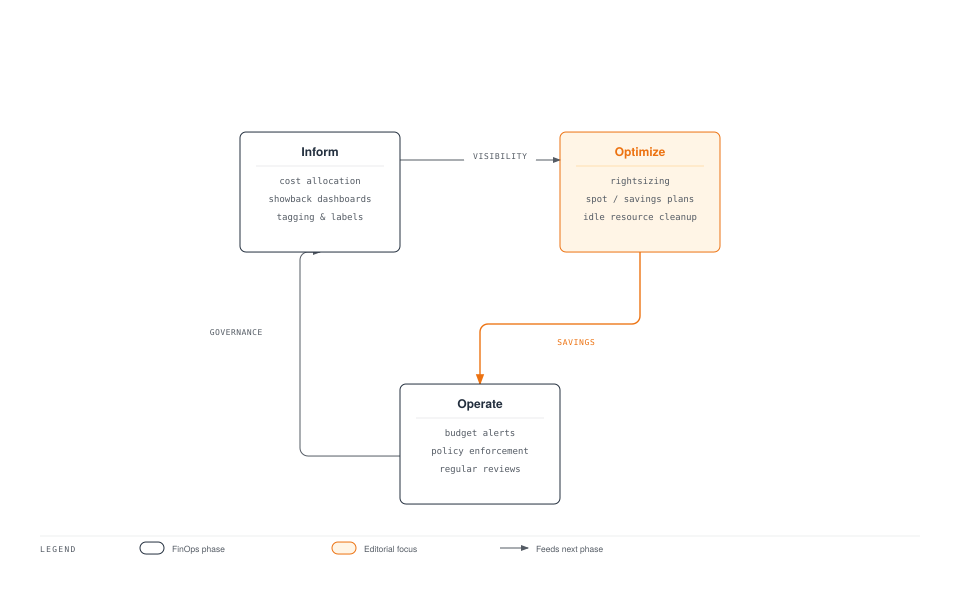
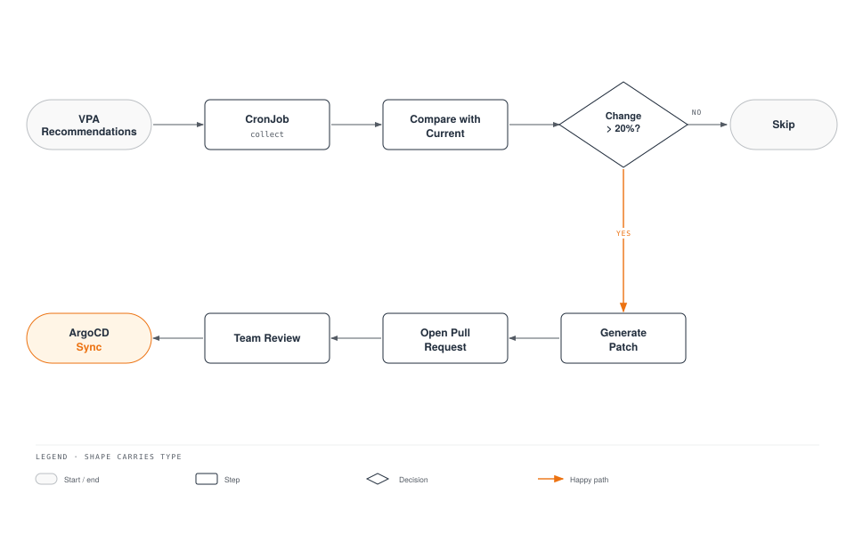

# FinOps Cost Visibility Platform

> **Supported Versions**: Kubernetes 1.28+, Kubecost 2.x, OpenCost 1.x
> **Last Updated**: April 25, 2026

< [Previous: Event Capacity Planning](./12-event-capacity-planning.md) | [Table of Contents](./README.md) | [Next: Tekton Pipelines](./14-tekton-pipelines.md) >

---

## Overview

Running Kubernetes at scale introduces a unique cost management challenge: workloads are ephemeral, resources are shared, and traditional per-server cost attribution no longer applies. Without deliberate cost visibility, organizations often discover that their cloud bill has grown 2-5x beyond expectations.

**FinOps** (Financial Operations) is the practice of bringing financial accountability to the variable spend model of cloud computing. The FinOps lifecycle follows three iterative phases:

- **Inform**: Provide visibility into where money is being spent and by whom
- **Optimize**: Identify and act on opportunities to reduce waste and improve efficiency
- **Operate**: Establish governance, automation, and cultural practices that sustain cost efficiency

This guide builds a complete FinOps cost visibility platform on Kubernetes using OpenCost, Kubecost, Prometheus, and Grafana.

### Learning Objectives

- Understand the FinOps operating model and how it applies to Kubernetes environments
- Deploy and configure OpenCost and Kubecost for accurate cost allocation
- Implement showback and chargeback systems using labels, namespaces, and cost APIs
- Build cost anomaly detection with alerting pipelines to Slack
- Enable team self-service cost dashboards and automated weekly cost reports
- Establish resource rightsizing workflows using VPA recommendations and Goldilocks

---

## 1. FinOps Operating Model

### 1.1 Inform, Optimize, Operate Cycle



**Inform Phase**: Establish visibility by deploying cost monitoring tools, implementing a label strategy, and building showback dashboards. This is the foundation all optimization efforts build on.

**Optimize Phase**: Use visibility data to identify waste. This includes rightsizing workloads, leveraging Spot instances and Savings Plans, and cleaning up idle resources.

**Operate Phase**: Institutionalize cost efficiency through budget alerts, policy enforcement, and regular cost review meetings.

### 1.2 Organizational Roles

| Role | Responsibilities | Primary Tools | Cadence |
|------|-----------------|---------------|---------|
| **FinOps Team** | Define cost allocation models, maintain dashboards, drive optimization | Kubecost, Grafana, AWS Cost Explorer | Daily monitoring, weekly reports |
| **Engineering Teams** | Set resource requests/limits, apply cost labels, review team dashboards | Team dashboards, VPA, Goldilocks | Sprint-level reviews |
| **Finance** | Budget planning, forecast validation, chargeback reconciliation | Monthly cost reports, showback data | Monthly reconciliation |
| **Leadership** | Approve budgets, set cost targets, review unit economics | Executive dashboards, trend reports | Monthly/quarterly reviews |
| **Platform Engineering** | Deploy and maintain cost tools, build self-service dashboards | Kubecost, OpenCost, Kyverno, Prometheus | Continuous |

### 1.3 Maturity Levels

| Level | Cost Allocation | Optimization | Governance | Timeline |
|-------|----------------|--------------|------------|----------|
| **Crawl** | Namespace-level allocation, basic labels | Manual rightsizing, ad-hoc cleanup | No formal policies, reactive alerts | 1-3 months |
| **Walk** | Label-based allocation with shared cost splitting, showback | VPA recommendations, Spot adoption | Label enforcement, monthly reviews | 3-6 months |
| **Run** | Real-time chargeback with CUR reconciliation | Automated rightsizing pipelines | Automated policies, cost gates in CI/CD | 6-12 months |

---

## 2. OpenCost/Kubecost Deep Configuration

### 2.1 OpenCost Installation (Open Source)

OpenCost requires Prometheus for metrics and exposes its own cost allocation API.

```yaml
# opencost-values.yaml
# helm install opencost opencost/opencost -n opencost --create-namespace -f opencost-values.yaml
opencost:
  exporter:
    defaultClusterId: "production-eks-us-east-1"
    image:
      registry: ghcr.io
      repository: opencost/opencost
      tag: "1.112.0"
    aws:
      spot_data_region: "us-east-1"
      spot_data_bucket: "my-company-spot-data-feed"
    prometheus:
      internal:
        enabled: true
        serviceName: prometheus-server
        namespaceName: monitoring
        port: 80
    resources:
      requests:
        cpu: "100m"
        memory: "256Mi"
      limits:
        cpu: "500m"
        memory: "512Mi"
    persistence:
      enabled: true
      storageClass: "gp3"
      size: "32Gi"
    cloudCost:
      enabled: true
      refreshRateHours: 6
  ui:
    enabled: true
    ingress:
      enabled: true
      ingressClassName: "alb"
      annotations:
        alb.ingress.kubernetes.io/scheme: "internal"
        alb.ingress.kubernetes.io/target-type: "ip"
        alb.ingress.kubernetes.io/listen-ports: '[{"HTTPS": 443}]'
      hosts:
        - host: "opencost.internal.mycompany.com"
          paths:
            - path: /
              pathType: Prefix
  metrics:
    serviceMonitor:
      enabled: true
      namespace: monitoring
serviceAccount:
  create: true
  annotations:
    eks.amazonaws.com/role-arn: "arn:aws:iam::123456789012:role/opencost-role"
```

### 2.2 Kubecost Enterprise

Kubecost adds multi-cluster federation, S3 ETL storage, and advanced allocation features on top of OpenCost.

```yaml
# kubecost-values.yaml
# helm install kubecost kubecost/cost-analyzer -n kubecost --create-namespace -f kubecost-values.yaml
global:
  prometheus:
    enabled: false
    fqdn: "http://prometheus-server.monitoring.svc:80"
  grafana:
    enabled: false
    domainName: "grafana.monitoring.svc"

kubecostProductConfigs:
  clusterName: "production-eks-us-east-1"
  currencyCode: "USD"
  defaultModelPricing:
    enabled: false
  sharedNamespaces: "kube-system,kubecost,monitoring,cert-manager,ingress-nginx"
  shareTenancyCosts: true
  shareSplit: "weighted"

kubecostModel:
  etl: true
  etlBucketConfig:
    enabled: true
  federatedETL:
    enabled: true
    primaryCluster: true
  resources:
    requests:
      cpu: "200m"
      memory: "512Mi"
    limits:
      cpu: "1000m"
      memory: "2Gi"

# S3 backend for ETL data
kubecostS3Config:
  enabled: true
  bucketName: "mycompany-kubecost-etl"
  region: "us-east-1"

federatedETL:
  federatedStore:
    enabled: true
    bucket: "mycompany-kubecost-federation"
    region: "us-east-1"

kubecostAggregator:
  enabled: true
  replicas: 1
  resources:
    requests:
      cpu: "500m"
      memory: "1Gi"
    limits:
      cpu: "2000m"
      memory: "4Gi"

ingress:
  enabled: true
  className: "alb"
  annotations:
    alb.ingress.kubernetes.io/scheme: "internal"
    alb.ingress.kubernetes.io/target-type: "ip"
  hosts:
    - host: "kubecost.internal.mycompany.com"
      paths:
        - path: /
          pathType: Prefix

serviceAccount:
  create: true
  annotations:
    eks.amazonaws.com/role-arn: "arn:aws:iam::123456789012:role/kubecost-role"

podDisruptionBudget:
  enabled: true
  minAvailable: 1
```

### 2.3 AWS Cost and Usage Report (CUR) Integration

The CUR provides the most accurate source of AWS billing data, allowing reconciliation of in-cluster estimates with actual charges.

#### Terraform Configuration

```hcl
# cur-infrastructure.tf
terraform {
  required_version = ">= 1.5.0"
  required_providers { aws = { source = "hashicorp/aws"; version = "~> 5.0" } }
}

data "aws_caller_identity" "current" {}

resource "aws_s3_bucket" "cur_bucket" {
  bucket = "mycompany-cur-reports"
  tags   = { Purpose = "cost-and-usage-reports", ManagedBy = "terraform" }
}

resource "aws_s3_bucket_versioning" "cur" {
  bucket = aws_s3_bucket.cur_bucket.id
  versioning_configuration { status = "Enabled" }
}

resource "aws_s3_bucket_lifecycle_configuration" "cur" {
  bucket = aws_s3_bucket.cur_bucket.id
  rule {
    id     = "transition-to-ia"
    status = "Enabled"
    transition { days = 90;  storage_class = "STANDARD_IA" }
    transition { days = 365; storage_class = "GLACIER" }
    expiration { days = 730 }
  }
}

resource "aws_s3_bucket_server_side_encryption_configuration" "cur" {
  bucket = aws_s3_bucket.cur_bucket.id
  rule { apply_server_side_encryption_by_default { sse_algorithm = "aws:kms" }; bucket_key_enabled = true }
}

resource "aws_s3_bucket_public_access_block" "cur" {
  bucket = aws_s3_bucket.cur_bucket.id
  block_public_acls = true; block_public_policy = true; ignore_public_acls = true; restrict_public_buckets = true
}

resource "aws_s3_bucket_policy" "cur" {
  bucket = aws_s3_bucket.cur_bucket.id
  policy = jsonencode({
    Version = "2012-10-17"
    Statement = [
      { Sid = "AllowCURDelivery", Effect = "Allow", Principal = { Service = "billingreports.amazonaws.com" },
        Action = ["s3:GetBucketAcl", "s3:GetBucketPolicy"], Resource = aws_s3_bucket.cur_bucket.arn },
      { Sid = "AllowCURWrite", Effect = "Allow", Principal = { Service = "billingreports.amazonaws.com" },
        Action = "s3:PutObject", Resource = "${aws_s3_bucket.cur_bucket.arn}/*" }
    ]
  })
}

resource "aws_cur_report_definition" "daily_cur" {
  report_name                = "mycompany-daily-cur"
  time_unit                  = "DAILY"
  format                     = "Parquet"
  compression                = "Parquet"
  additional_schema_elements = ["RESOURCES"]
  s3_bucket                  = aws_s3_bucket.cur_bucket.id
  s3_region                  = "us-east-1"
  s3_prefix                  = "cur-reports"
  report_versioning          = "OVERWRITE_REPORT"
  refresh_closed_reports     = true
  additional_artifacts       = ["ATHENA"]
}

# IAM role for Kubecost CUR access via IRSA
resource "aws_iam_role" "kubecost_cur" {
  name = "kubecost-cur-reader"
  assume_role_policy = jsonencode({
    Version = "2012-10-17"
    Statement = [{
      Effect = "Allow"
      Principal = { Federated = "arn:aws:iam::${data.aws_caller_identity.current.account_id}:oidc-provider/${var.oidc_provider}" }
      Action = "sts:AssumeRoleWithWebIdentity"
      Condition = { StringEquals = {
        "${var.oidc_provider}:sub" = "system:serviceaccount:kubecost:kubecost-cost-analyzer"
        "${var.oidc_provider}:aud" = "sts.amazonaws.com"
      }}
    }]
  })
}

resource "aws_iam_role_policy" "kubecost_cur" {
  name = "kubecost-cur-read"
  role = aws_iam_role.kubecost_cur.id
  policy = jsonencode({
    Version = "2012-10-17"
    Statement = [
      { Effect = "Allow", Action = ["s3:GetObject", "s3:ListBucket", "s3:GetBucketLocation"],
        Resource = [aws_s3_bucket.cur_bucket.arn, "${aws_s3_bucket.cur_bucket.arn}/*"] },
      { Effect = "Allow", Action = ["athena:StartQueryExecution", "athena:GetQueryExecution", "athena:GetQueryResults"],
        Resource = "arn:aws:athena:us-east-1:${data.aws_caller_identity.current.account_id}:workgroup/primary" },
      { Effect = "Allow", Action = ["glue:GetDatabase", "glue:GetTable", "glue:GetPartitions"],
        Resource = ["arn:aws:glue:us-east-1:${data.aws_caller_identity.current.account_id}:catalog",
                    "arn:aws:glue:us-east-1:${data.aws_caller_identity.current.account_id}:database/athenacurcfn_*",
                    "arn:aws:glue:us-east-1:${data.aws_caller_identity.current.account_id}:table/athenacurcfn_*/*"] },
      { Effect = "Allow", Action = ["pricing:GetProducts", "ec2:DescribeInstances", "ec2:DescribeReservedInstances"], Resource = "*" }
    ]
  })
}

variable "oidc_provider" { description = "OIDC provider URL (without https://)" ; type = string }
output "kubecost_role_arn" { value = aws_iam_role.kubecost_cur.arn }
output "cur_bucket_name"   { value = aws_s3_bucket.cur_bucket.id }
```

#### Kubecost Cloud Integration Values

```yaml
# Add to kubecost-values.yaml for CUR reconciliation
kubecostProductConfigs:
  cloudIntegrationJSON: |
    {
      "aws": [{
        "athenaBucketName": "mycompany-cur-reports",
        "athenaRegion": "us-east-1",
        "athenaDatabase": "athenacurcfn_mycompany_daily_cur",
        "athenaTable": "mycompany_daily_cur",
        "athenaWorkgroup": "primary",
        "projectID": "123456789012"
      }]
    }
```

### 2.4 Cost Accuracy Tuning

#### Custom Pricing Configuration

```yaml
# custom-pricing-configmap.yaml
apiVersion: v1
kind: ConfigMap
metadata:
  name: pricing-configs
  namespace: kubecost
data:
  default-pricing.json: |
    {
      "provider": "aws",
      "description": "Custom pricing with negotiated EDP rates",
      "CPU": "0.02835",
      "RAM": "0.00356",
      "GPU": "0.85",
      "storage": "0.000054795",
      "zoneNetworkEgress": "0.00",
      "regionNetworkEgress": "0.01",
      "internetNetworkEgress": "0.05",
      "spotCPU": "0.0085",
      "spotRAM": "0.00107",
      "spotLabel": "karpenter.sh/capacity-type",
      "spotLabelValue": "spot"
    }
```

#### Shared Cost Allocation Rules

```yaml
# shared-cost-allocation-configmap.yaml
apiVersion: v1
kind: ConfigMap
metadata:
  name: allocation-configs
  namespace: kubecost
data:
  shared-costs.json: |
    {
      "sharedCosts": [
        { "name": "Control Plane",       "type": "weighted", "filter": { "namespace": "kube-system" },    "weight": "cpuCost" },
        { "name": "Monitoring Stack",    "type": "weighted", "filter": { "namespace": "monitoring" },     "weight": "totalCost" },
        { "name": "Ingress Controllers", "type": "even",     "filter": { "namespace": "ingress-nginx" } },
        { "name": "Service Mesh",        "type": "weighted", "filter": { "namespace": "istio-system" },   "weight": "networkCost" },
        { "name": "Cert Manager",        "type": "even",     "filter": { "namespace": "cert-manager" } },
        { "name": "Platform Tools",      "type": "even",     "filter": { "namespace": "kubecost,argocd,kyverno" } }
      ],
      "idleCostDistribution": "weighted"
    }
```

---

## 3. Showback/Chargeback Implementation

Showback reports costs to teams for awareness; chargeback actually bills cost centers. Both require accurate cost allocation tied to organizational units.

### 3.1 Label Strategy

| Label | Purpose | Example Values |
|-------|---------|---------------|
| `team` | Cost attribution to engineering team | `platform`, `checkout`, `payments` |
| `service` | Service-level cost tracking | `api-gateway`, `order-service` |
| `environment` | Environment segregation | `production`, `staging`, `development` |
| `cost-center` | Finance department mapping | `CC-1001`, `CC-2005` |

#### Kyverno Label Enforcement Policy

```yaml
# kyverno-cost-labels-policy.yaml
apiVersion: kyverno.io/v1
kind: ClusterPolicy
metadata:
  name: require-cost-labels
  annotations:
    policies.kyverno.io/title: Require Cost Attribution Labels
    policies.kyverno.io/category: FinOps
    policies.kyverno.io/severity: high
spec:
  validationFailureAction: Enforce
  background: true
  rules:
    - name: check-cost-labels-on-resource
      match:
        any:
          - resources:
              kinds:
                - Deployment
                - StatefulSet
                - DaemonSet
      exclude:
        any:
          - resources:
              namespaces:
                - kube-system
                - kube-public
                - kubecost
                - monitoring
                - ingress-nginx
                - cert-manager
                - argocd
                - kyverno
      validate:
        message: >-
          Resource {{request.object.kind}}/{{request.object.metadata.name}} is missing
          required cost labels. All workloads must have: team, service, environment, cost-center.
        pattern:
          metadata:
            labels:
              team: "?*"
              service: "?*"
              environment: "?*"
              cost-center: "?*"
    - name: check-cost-labels-on-pod-template
      match:
        any:
          - resources:
              kinds:
                - Deployment
                - StatefulSet
                - DaemonSet
      exclude:
        any:
          - resources:
              namespaces:
                - kube-system
                - kube-public
                - kubecost
                - monitoring
                - ingress-nginx
                - cert-manager
                - argocd
                - kyverno
      validate:
        message: "Pod template must also carry cost labels for accurate pod-level cost attribution."
        pattern:
          spec:
            template:
              metadata:
                labels:
                  team: "?*"
                  service: "?*"
                  environment: "?*"
                  cost-center: "?*"
    - name: validate-environment-values
      match:
        any:
          - resources:
              kinds:
                - Deployment
                - StatefulSet
                - DaemonSet
      exclude:
        any:
          - resources:
              namespaces:
                - kube-system
                - kube-public
                - kubecost
                - monitoring
      validate:
        message: "Label 'environment' must be one of: production, staging, development, sandbox."
        pattern:
          metadata:
            labels:
              environment: "production | staging | development | sandbox"
```

### 3.2 Namespace-Based Cost Allocation

#### Kubecost Allocation API Examples

```bash
# Cost allocation by namespace for the last 7 days
curl -s "http://kubecost.internal.mycompany.com/model/allocation\
?window=7d&aggregate=namespace&accumulate=true" \
  | jq '.data[0] | to_entries[] | {namespace: .key, totalCost: .value.totalCost, cpuCost: .value.cpuCost}'

# Cost allocation by team label for the current month with shared costs
curl -s "http://kubecost.internal.mycompany.com/model/allocation\
?window=thismonth&aggregate=label:team&accumulate=true\
&shareIdle=weighted&shareNamespaces=kube-system,monitoring" \
  | jq '.data[0] | to_entries | sort_by(-.value.totalCost) | .[] | {team: .key, totalCost: (.value.totalCost | round), cpuEfficiency: (.value.cpuEfficiency * 100 | round)}'

# Daily cost trend for a specific team over 30 days
curl -s "http://kubecost.internal.mycompany.com/model/allocation\
?window=30d&aggregate=label:team&step=1d&filterLabels=team:checkout" \
  | jq '[.data[] | to_entries[] | {date: .key, cost: .value.totalCost}]'
```

#### ResourceQuota Per Team Namespace

```yaml
# team-namespace-quota.yaml
apiVersion: v1
kind: Namespace
metadata:
  name: team-checkout
  labels:
    team: checkout
    cost-center: "CC-2005"
    environment: production
---
apiVersion: v1
kind: ResourceQuota
metadata:
  name: team-checkout-quota
  namespace: team-checkout
spec:
  hard:
    requests.cpu: "40"
    requests.memory: "80Gi"
    limits.cpu: "80"
    limits.memory: "160Gi"
    persistentvolumeclaims: "20"
    pods: "200"
---
apiVersion: v1
kind: LimitRange
metadata:
  name: team-checkout-limits
  namespace: team-checkout
spec:
  limits:
    - type: Container
      default:        { cpu: "500m", memory: "512Mi" }
      defaultRequest: { cpu: "100m", memory: "128Mi" }
      max:            { cpu: "8",    memory: "16Gi" }
      min:            { cpu: "10m",  memory: "16Mi" }
```

### 3.3 Shared Cost Distribution


| Distribution Method | When to Use | Pros | Cons |
|-------------------|-------------|------|------|
| **Weighted by CPU** | Control plane costs | Proportional to usage | Penalizes CPU-heavy workloads |
| **Weighted by Total Cost** | General shared services | Fair overall distribution | Requires accurate base allocation |
| **Even Split** | Small shared services | Simple, transparent | Unfair if teams differ in size |
| **Weighted by Network** | Ingress, service mesh | Accurate for network costs | Network costs can be volatile |

### 3.4 Grafana Showback Dashboards

The following Grafana dashboard JSON provides cost-per-team and cost-per-service panels with a team variable selector. Import it via Grafana UI or provision it as a ConfigMap with the `grafana_dashboard: "true"` label.

```json
{
  "description": "FinOps Showback Dashboard",
  "editable": true,
  "panels": [
    {
      "datasource": { "type": "prometheus", "uid": "prometheus" },
      "fieldConfig": { "defaults": { "unit": "currencyUSD", "custom": { "drawStyle": "bars", "fillOpacity": 80, "stacking": { "mode": "normal" } } } },
      "gridPos": { "h": 10, "w": 24, "x": 0, "y": 0 },
      "id": 1, "title": "Daily Cost by Team", "type": "timeseries",
      "targets": [{ "expr": "sum by (label_team) (sum by (namespace, label_team) (kubecost_container_cpu_allocation_cost{} * on(namespace) group_left(label_team) kube_namespace_labels{label_team!=\"\"}) + sum by (namespace, label_team) (kubecost_container_memory_allocation_cost{} * on(namespace) group_left(label_team) kube_namespace_labels{label_team!=\"\"}))", "legendFormat": "{{label_team}}" }]
    },
    {
      "datasource": { "type": "prometheus", "uid": "prometheus" },
      "fieldConfig": { "defaults": { "unit": "currencyUSD" } },
      "gridPos": { "h": 10, "w": 12, "x": 0, "y": 10 },
      "id": 2, "title": "Monthly Cost by Service", "type": "bargauge",
      "targets": [{ "expr": "sum by (label_service) ((kubecost_container_cpu_allocation_cost{} + kubecost_container_memory_allocation_cost{}) * on(pod) group_left(label_service) kube_pod_labels{label_service!=\"\"}) * 730", "legendFormat": "{{label_service}}" }]
    },
    {
      "datasource": { "type": "prometheus", "uid": "prometheus" },
      "fieldConfig": { "defaults": { "unit": "percentunit", "min": 0, "max": 1 } },
      "gridPos": { "h": 10, "w": 12, "x": 12, "y": 10 },
      "id": 3, "title": "Resource Efficiency by Team", "type": "bargauge",
      "targets": [{ "expr": "sum by (label_team) (rate(container_cpu_usage_seconds_total{namespace!~\"kube-system|monitoring\"}[1h]) * on(namespace) group_left(label_team) kube_namespace_labels{label_team!=\"\"}) / sum by (label_team) (kube_pod_container_resource_requests{resource=\"cpu\", namespace!~\"kube-system|monitoring\"} * on(namespace) group_left(label_team) kube_namespace_labels{label_team!=\"\"})", "legendFormat": "{{label_team}}" }]
    },
    {
      "datasource": { "type": "prometheus", "uid": "prometheus" },
      "fieldConfig": { "defaults": { "unit": "currencyUSD" } },
      "gridPos": { "h": 8, "w": 24, "x": 0, "y": 20 },
      "id": 4, "title": "Team Cost Summary Table", "type": "table",
      "targets": [
        { "expr": "sum by (label_team) (kubecost_container_cpu_allocation_cost{} + kubecost_container_memory_allocation_cost{}) * 730", "format": "table", "instant": true, "refId": "A" },
        { "expr": "sum by (label_team) (rate(container_cpu_usage_seconds_total{}[1h])) / sum by (label_team) (kube_pod_container_resource_requests{resource=\"cpu\"})", "format": "table", "instant": true, "refId": "B" }
      ]
    }
  ],
  "schemaVersion": 39, "tags": ["finops", "cost", "showback"],
  "templating": { "list": [{ "name": "team", "type": "query", "query": "label_values(kube_namespace_labels{label_team!=\"\"}, label_team)", "includeAll": true, "multi": true }] },
  "time": { "from": "now-30d", "to": "now" },
  "title": "FinOps Showback Dashboard", "uid": "finops-showback-v1"
}
```

---

## 4. Cost Anomaly Detection

Cost anomalies indicate unexpected spending changes from misconfigurations, traffic spikes, or infrastructure changes. Detecting them early prevents bill shock.

### 4.1 Kubecost Alert Configuration

```yaml
# kubecost-alerts-values.yaml (merge with main Kubecost Helm values)
kubecostProductConfigs:
  alertConfigs:
    enabled: true
    frontendUrl: "https://kubecost.internal.mycompany.com"
    alerts:
      # Budget exceeded - any namespace over $5000/month
      - type: budget
        threshold: 5000
        window: 30d
        aggregation: namespace
        slackWebhookUrl: "https://hooks.slack.com/services/T00/B00/XXX"
        frequencyMinutes: 1440
      # Budget warning at 80%
      - type: budget
        threshold: 4000
        window: 30d
        aggregation: namespace
        slackWebhookUrl: "https://hooks.slack.com/services/T00/B00/XXX"
        frequencyMinutes: 1440
      # Cluster efficiency below 40%
      - type: efficiency
        threshold: 0.4
        window: 48h
        aggregation: cluster
        slackWebhookUrl: "https://hooks.slack.com/services/T00/B00/XXX"
        frequencyMinutes: 360
      # 30% cost increase week over week per team
      - type: recurringUpdate
        threshold: 0.30
        window: 7d
        aggregation: "label:team"
        slackWebhookUrl: "https://hooks.slack.com/services/T00/B00/XXX"
        frequencyMinutes: 10080
      # Daily spend exceeds 150% of 7-day average
      - type: spendChange
        threshold: 0.50
        window: 1d
        baselineWindow: 7d
        aggregation: namespace
        slackWebhookUrl: "https://hooks.slack.com/services/T00/B00/XXX"
        frequencyMinutes: 360
```

### 4.2 Prometheus-Based Cost Alerting

```yaml
# cost-anomaly-prometheus-rules.yaml
apiVersion: monitoring.coreos.com/v1
kind: PrometheusRule
metadata:
  name: cost-anomaly-detection
  namespace: monitoring
  labels:
    release: prometheus
spec:
  groups:
    - name: cost-anomaly-detection
      interval: 30m
      rules:
        - alert: ClusterCostSpike
          expr: |
            (sum(kubecost_cluster_costs{}) / avg_over_time(sum(kubecost_cluster_costs{})[7d:1h])) > 1.5
          for: 2h
          labels:
            severity: warning
            category: finops
          annotations:
            summary: "Cluster cost spike detected"
            description: "Current cost is {{ $value | humanizePercentage }} of 7-day average."
        - alert: NamespaceCostDoubled
          expr: |
            (
              sum by (namespace) (kubecost_container_cpu_allocation_cost{} + kubecost_container_memory_allocation_cost{})
              / sum by (namespace) (kubecost_container_cpu_allocation_cost{} offset 1d + kubecost_container_memory_allocation_cost{} offset 1d)
            ) > 2.0
          for: 1h
          labels:
            severity: warning
            category: finops
          annotations:
            summary: "Namespace {{ $labels.namespace }} cost doubled day-over-day"
        - alert: LowClusterCPUEfficiency
          expr: |
            (
              sum(rate(container_cpu_usage_seconds_total{namespace!~"kube-system|monitoring"}[1h]))
              / sum(kube_pod_container_resource_requests{resource="cpu", namespace!~"kube-system|monitoring"})
            ) < 0.30
          for: 6h
          labels:
            severity: warning
            category: finops
          annotations:
            summary: "Cluster CPU efficiency below 30%"
            description: "Current efficiency: {{ $value | humanizePercentage }}. Review VPA recommendations."
        - alert: HighIdleCost
          expr: |
            (sum(kubecost_cluster_costs{cost_type="idle"}) / sum(kubecost_cluster_costs{})) > 0.20
          for: 24h
          labels:
            severity: info
            category: finops
          annotations:
            summary: "Idle cost exceeds 20% of total cluster cost"
        - alert: ProjectedMonthlyBudgetExceeded
          expr: |
            (sum(kubecost_cluster_costs{}) * 730) > 50000
          for: 12h
          labels:
            severity: critical
            category: finops
          annotations:
            summary: "Projected monthly cost exceeds $50,000 budget"
            description: "Projected: ${{ $value | printf \"%.0f\" }}. Immediate review required."
```

#### Alertmanager Route and Receiver

```yaml
# alertmanager-finops-config.yaml
apiVersion: monitoring.coreos.com/v1alpha1
kind: AlertmanagerConfig
metadata:
  name: finops-alerts
  namespace: monitoring
spec:
  route:
    receiver: "finops-slack"
    groupBy: ["alertname", "namespace"]
    groupWait: 30s
    groupInterval: 5m
    repeatInterval: 4h
    matchers:
      - name: category
        value: finops
    routes:
      - receiver: "finops-slack-critical"
        matchers:
          - name: severity
            value: critical
        repeatInterval: 1h
  receivers:
    - name: "finops-slack"
      slackConfigs:
        - apiURL:
            name: finops-slack-webhook
            key: webhook-url
          channel: "#finops-alerts"
          sendResolved: true
          title: "[{{ .CommonLabels.severity | toUpper }}] {{ .CommonLabels.alertname }}"
          text: |
            {{ range .Alerts }}
            *Description:* {{ .Annotations.description }}
            {{ end }}
    - name: "finops-slack-critical"
      slackConfigs:
        - apiURL:
            name: finops-slack-webhook
            key: webhook-url
          channel: "#finops-critical"
          sendResolved: true
          title: "[CRITICAL] {{ .CommonLabels.alertname }}"
          text: |
            {{ range .Alerts }}
            *Description:* {{ .Annotations.description }}
            *Runbook:* {{ .Annotations.runbook_url }}
            {{ end }}
          color: "danger"
---
apiVersion: v1
kind: Secret
metadata:
  name: finops-slack-webhook
  namespace: monitoring
type: Opaque
stringData:
  webhook-url: "https://hooks.slack.com/services/T00/B00/XXXXXXXXXXXXXXXXXXXXXXXX"
```

### 4.3 AWS Cost Anomaly Detection Integration

AWS Cost Anomaly Detection provides ML-based anomaly detection complementing Kubernetes-level monitoring.

```hcl
# aws-cost-anomaly-detection.tf
resource "aws_ce_anomaly_monitor" "eks_monitor" {
  name              = "eks-cost-anomaly-monitor"
  monitor_type      = "DIMENSIONAL"
  monitor_dimension = "SERVICE"
}

resource "aws_sns_topic" "finops_alerts" {
  name = "finops-cost-anomaly-alerts"
}

resource "aws_sns_topic_subscription" "finops_email" {
  topic_arn = aws_sns_topic.finops_alerts.arn
  protocol  = "email"
  endpoint  = "finops-team@mycompany.com"
}

resource "aws_ce_anomaly_subscription" "eks_alerts" {
  name      = "eks-anomaly-alerts"
  frequency = "DAILY"
  monitor_arn_list = [aws_ce_anomaly_monitor.eks_monitor.arn]

  subscriber {
    type    = "SNS"
    address = aws_sns_topic.finops_alerts.arn
  }

  threshold_expression {
    dimension {
      key           = "ANOMALY_TOTAL_IMPACT_ABSOLUTE"
      values        = ["100"]
      match_options = ["GREATER_THAN_OR_EQUAL"]
    }
  }
}
```

---

## 5. Team Self-Service Cost Management

Self-service cost management scales FinOps beyond the platform team. When every engineering team can independently view costs and respond to budget alerts, the FinOps team can focus on strategy.

### 5.1 Per-Team Cost Dashboard

A variable-driven Grafana dashboard allowing each team to see only their own costs. Key panels and their PromQL queries:

```yaml
# grafana-team-dashboard-configmap.yaml
apiVersion: v1
kind: ConfigMap
metadata:
  name: grafana-team-cost-dashboard
  namespace: monitoring
  labels:
    grafana_dashboard: "true"
data:
  team-cost-dashboard.json: |
    {
      "panels": [
        { "id": 1, "title": "Projected Monthly Cost", "type": "stat", "gridPos": { "h": 4, "w": 8, "x": 0, "y": 0 },
          "fieldConfig": { "defaults": { "unit": "currencyUSD" } },
          "targets": [{ "expr": "sum(kubecost_container_cpu_allocation_cost{namespace=~\"team-$team.*\"} + kubecost_container_memory_allocation_cost{namespace=~\"team-$team.*\"}) * 730" }] },
        { "id": 2, "title": "CPU Efficiency", "type": "stat", "gridPos": { "h": 4, "w": 8, "x": 8, "y": 0 },
          "fieldConfig": { "defaults": { "unit": "percentunit" } },
          "targets": [{ "expr": "sum(rate(container_cpu_usage_seconds_total{namespace=~\"team-$team.*\"}[1h])) / sum(kube_pod_container_resource_requests{resource=\"cpu\", namespace=~\"team-$team.*\"})" }] },
        { "id": 3, "title": "Memory Efficiency", "type": "stat", "gridPos": { "h": 4, "w": 8, "x": 16, "y": 0 },
          "fieldConfig": { "defaults": { "unit": "percentunit" } },
          "targets": [{ "expr": "sum(container_memory_working_set_bytes{namespace=~\"team-$team.*\"}) / sum(kube_pod_container_resource_requests{resource=\"memory\", namespace=~\"team-$team.*\"})" }] },
        { "id": 4, "title": "Daily Cost Trend", "type": "timeseries", "gridPos": { "h": 8, "w": 24, "x": 0, "y": 4 },
          "targets": [{ "expr": "sum(kubecost_container_cpu_allocation_cost{namespace=~\"team-$team.*\"} + kubecost_container_memory_allocation_cost{namespace=~\"team-$team.*\"}) * 24", "legendFormat": "Daily Cost" }] },
        { "id": 5, "title": "Cost by Service", "type": "piechart", "gridPos": { "h": 8, "w": 12, "x": 0, "y": 12 },
          "targets": [{ "expr": "sum by (label_service) (kubecost_container_cpu_allocation_cost{namespace=~\"team-$team.*\"} + kubecost_container_memory_allocation_cost{namespace=~\"team-$team.*\"}) * 730", "legendFormat": "{{label_service}}" }] }
      ],
      "templating": { "list": [{ "name": "team", "type": "query", "query": "label_values(kube_namespace_labels{label_team!=\"\"}, label_team)", "refresh": 2 }] },
      "title": "Team Cost Self-Service", "uid": "finops-team-self-service-v1"
    }
```

### 5.2 Slack Cost Report Bot

A weekly CronJob that queries Kubecost and posts a formatted cost report to Slack.

```yaml
# slack-cost-report-cronjob.yaml
apiVersion: v1
kind: ConfigMap
metadata:
  name: cost-report-script
  namespace: kubecost
data:
  send-cost-report.sh: |
    #!/bin/bash
    set -euo pipefail
    KUBECOST_URL="${KUBECOST_URL:-http://kubecost-cost-analyzer.kubecost.svc:9090}"

    echo "Generating cost report for window: ${REPORT_WINDOW}"

    ALLOCATION_DATA=$(curl -sf "${KUBECOST_URL}/model/allocation?window=${REPORT_WINDOW}&aggregate=label:team&accumulate=true&shareIdle=weighted&shareNamespaces=kube-system,monitoring")

    TOTAL_COST=$(echo "${ALLOCATION_DATA}" | jq '[.data[0] | to_entries[].value.totalCost] | add | round')

    TEAM_BREAKDOWN=$(echo "${ALLOCATION_DATA}" | jq -r '
      .data[0] | to_entries | sort_by(-.value.totalCost) | .[]
      | select(.key != "__idle__" and .key != "__unallocated__")
      | "| \(.key) | $\(.value.totalCost | round) | \(.value.cpuEfficiency * 100 | round)% | \(.value.ramEfficiency * 100 | round)% |"
    ')

    SLACK_PAYLOAD=$(cat <<PAYLOAD
    {
      "blocks": [
        { "type": "header", "text": { "type": "plain_text", "text": "Weekly Kubernetes Cost Report - ${CLUSTER_NAME}" } },
        { "type": "section", "text": { "type": "mrkdwn", "text": "*Report Period:* Last ${REPORT_WINDOW}\n*Total Cluster Cost:* \$${TOTAL_COST}" } },
        { "type": "divider" },
        { "type": "section", "text": { "type": "mrkdwn", "text": "*Cost by Team:*\n| Team | Cost | CPU Eff | Mem Eff |\n|------|------|---------|---------|${TEAM_BREAKDOWN}" } },
        { "type": "section", "text": { "type": "mrkdwn", "text": "<https://kubecost.internal.mycompany.com|View in Kubecost> | <https://grafana.internal.mycompany.com/d/finops-showback-v1|Dashboard>" } }
      ]
    }
    PAYLOAD
    )

    curl -sf -X POST "${SLACK_WEBHOOK_URL}" -H "Content-Type: application/json" -d "${SLACK_PAYLOAD}"
    echo "Cost report sent successfully"
---
apiVersion: batch/v1
kind: CronJob
metadata:
  name: weekly-cost-report
  namespace: kubecost
spec:
  schedule: "0 9 * * 1"  # Every Monday 9:00 AM UTC
  timeZone: "America/New_York"
  concurrencyPolicy: Forbid
  successfulJobsHistoryLimit: 4
  failedJobsHistoryLimit: 2
  jobTemplate:
    spec:
      backoffLimit: 2
      activeDeadlineSeconds: 300
      template:
        metadata:
          labels: { app: cost-report-bot, team: platform }
        spec:
          serviceAccountName: cost-report-bot
          restartPolicy: OnFailure
          containers:
            - name: cost-reporter
              image: curlimages/curl:8.7.1
              command: ["/bin/sh", "/scripts/send-cost-report.sh"]
              env:
                - name: KUBECOST_URL
                  value: "http://kubecost-cost-analyzer.kubecost.svc:9090"
                - name: SLACK_WEBHOOK_URL
                  valueFrom:
                    secretKeyRef: { name: cost-report-slack-webhook, key: webhook-url }
                - name: REPORT_WINDOW
                  value: "7d"
                - name: CLUSTER_NAME
                  value: "production-eks-us-east-1"
              resources:
                requests: { cpu: "50m", memory: "64Mi" }
                limits:   { cpu: "200m", memory: "128Mi" }
              volumeMounts:
                - { name: scripts, mountPath: /scripts }
          volumes:
            - name: scripts
              configMap: { name: cost-report-script, defaultMode: 0755 }
---
apiVersion: v1
kind: ServiceAccount
metadata:
  name: cost-report-bot
  namespace: kubecost
```

### 5.3 Cost Budget Setting and Alerts

```yaml
# team-budgets-configmap.yaml
apiVersion: v1
kind: ConfigMap
metadata:
  name: team-cost-budgets
  namespace: kubecost
data:
  budgets.json: |
    {
      "budgets": [
        { "team": "checkout",         "monthlyBudget": 8000,  "warningThreshold": 0.80, "criticalThreshold": 0.95, "slackChannel": "#checkout-alerts" },
        { "team": "payments",         "monthlyBudget": 12000, "warningThreshold": 0.80, "criticalThreshold": 0.95, "slackChannel": "#payments-alerts" },
        { "team": "search",           "monthlyBudget": 15000, "warningThreshold": 0.80, "criticalThreshold": 0.95, "slackChannel": "#search-alerts" },
        { "team": "platform",         "monthlyBudget": 20000, "warningThreshold": 0.80, "criticalThreshold": 0.95, "slackChannel": "#platform-alerts" },
        { "team": "data-engineering", "monthlyBudget": 25000, "warningThreshold": 0.75, "criticalThreshold": 0.90, "slackChannel": "#data-eng-alerts" }
      ]
    }
---
apiVersion: batch/v1
kind: CronJob
metadata:
  name: budget-check
  namespace: kubecost
spec:
  schedule: "0 */6 * * *"  # Every 6 hours
  concurrencyPolicy: Forbid
  jobTemplate:
    spec:
      backoffLimit: 1
      activeDeadlineSeconds: 180
      template:
        spec:
          serviceAccountName: cost-report-bot
          restartPolicy: OnFailure
          containers:
            - name: budget-checker
              image: curlimages/curl:8.7.1
              command:
                - /bin/sh
                - -c
                - |
                  set -euo pipefail
                  KUBECOST_URL="http://kubecost-cost-analyzer.kubecost.svc:9090"
                  ALLOCATION=$(curl -sf "${KUBECOST_URL}/model/allocation?window=thismonth&aggregate=label:team&accumulate=true&shareIdle=weighted")
                  DAY_OF_MONTH=$(date +%d)
                  DAYS_IN_MONTH=$(date -d "$(date +%Y-%m-01) +1 month -1 day" +%d)

                  TEAMS=$(cat /config/budgets.json | jq -r '.budgets[].team')
                  for TEAM in ${TEAMS}; do
                    BUDGET=$(jq -r ".budgets[] | select(.team == \"${TEAM}\") | .monthlyBudget" /config/budgets.json)
                    CRITICAL_PCT=$(jq -r ".budgets[] | select(.team == \"${TEAM}\") | .criticalThreshold" /config/budgets.json)
                    WARNING_PCT=$(jq -r ".budgets[] | select(.team == \"${TEAM}\") | .warningThreshold" /config/budgets.json)
                    CHANNEL=$(jq -r ".budgets[] | select(.team == \"${TEAM}\") | .slackChannel" /config/budgets.json)
                    ACTUAL=$(echo "${ALLOCATION}" | jq -r ".data[0][\"${TEAM}\"].totalCost // 0 | round")
                    PROJECTED=$(echo "scale=0; ${ACTUAL} * ${DAYS_IN_MONTH} / ${DAY_OF_MONTH}" | bc)
                    USAGE=$(echo "scale=4; ${PROJECTED} / ${BUDGET}" | bc)

                    if [ "$(echo "${USAGE} >= ${CRITICAL_PCT}" | bc)" = "1" ]; then
                      curl -sf -X POST "${SLACK_WEBHOOK_URL}" -H "Content-Type: application/json" \
                        -d "{\"channel\":\"${CHANNEL}\",\"text\":\":rotating_light: CRITICAL - Team *${TEAM}*: Projected \$${PROJECTED}/\$${BUDGET}\"}"
                    elif [ "$(echo "${USAGE} >= ${WARNING_PCT}" | bc)" = "1" ]; then
                      curl -sf -X POST "${SLACK_WEBHOOK_URL}" -H "Content-Type: application/json" \
                        -d "{\"channel\":\"${CHANNEL}\",\"text\":\":warning: Warning - Team *${TEAM}*: Projected \$${PROJECTED}/\$${BUDGET}\"}"
                    fi
                  done
              env:
                - name: SLACK_WEBHOOK_URL
                  valueFrom:
                    secretKeyRef: { name: cost-report-slack-webhook, key: webhook-url }
              resources:
                requests: { cpu: "50m", memory: "64Mi" }
                limits:   { cpu: "200m", memory: "128Mi" }
              volumeMounts:
                - { name: budget-config, mountPath: /config }
          volumes:
            - name: budget-config
              configMap: { name: team-cost-budgets }
```

---

## 6. Resource Rightsizing Automation

Rightsizing matches resource requests and limits to actual workload usage. Over-provisioning wastes money; under-provisioning causes OOM kills and throttling.

### 6.1 VPA Recommendation Workflow

Run VPA in recommendation-only mode (`updateMode: "Off"`) to suggest resource changes without automatic application.

```yaml
# vpa-recommendation-mode.yaml
apiVersion: autoscaling.k8s.io/v1
kind: VerticalPodAutoscaler
metadata:
  name: order-service-vpa
  namespace: team-checkout
  labels:
    team: checkout
    finops-rightsizing: "true"
spec:
  targetRef:
    apiVersion: apps/v1
    kind: Deployment
    name: order-service
  updatePolicy:
    updateMode: "Off"
  resourcePolicy:
    containerPolicies:
      - containerName: order-service
        minAllowed: { cpu: "50m", memory: "64Mi" }
        maxAllowed: { cpu: "4", memory: "8Gi" }
        controlledResources: ["cpu", "memory"]
        controlledValues: RequestsAndLimits
---
apiVersion: autoscaling.k8s.io/v1
kind: VerticalPodAutoscaler
metadata:
  name: payment-processor-vpa
  namespace: team-payments
  labels:
    team: payments
    finops-rightsizing: "true"
spec:
  targetRef:
    apiVersion: apps/v1
    kind: Deployment
    name: payment-processor
  updatePolicy:
    updateMode: "Off"
  resourcePolicy:
    containerPolicies:
      - containerName: payment-processor
        minAllowed: { cpu: "100m", memory: "128Mi" }
        maxAllowed: { cpu: "8", memory: "16Gi" }
        controlledResources: ["cpu", "memory"]
        controlledValues: RequestsAndLimits
```

Review recommendations:

```bash
# Get VPA recommendations across all namespaces
kubectl get vpa -A -o custom-columns=\
'NAMESPACE:.metadata.namespace,NAME:.metadata.name,TARGET_CPU:.status.recommendation.containerRecommendations[0].target.cpu,TARGET_MEM:.status.recommendation.containerRecommendations[0].target.memory'
```

### 6.2 Goldilocks Dashboard

Goldilocks runs VPA for every Deployment in labeled namespaces and provides a web dashboard comparing current vs. recommended resources.

```yaml
# goldilocks-values.yaml
# helm install goldilocks fairwinds-stable/goldilocks -n goldilocks --create-namespace -f goldilocks-values.yaml
vpa:
  enabled: true
  updater:
    enabled: false  # Recommendations only
dashboard:
  enabled: true
  replicaCount: 2
  resources:
    requests: { cpu: "50m", memory: "64Mi" }
    limits:   { cpu: "200m", memory: "128Mi" }
  ingress:
    enabled: true
    ingressClassName: "alb"
    annotations:
      alb.ingress.kubernetes.io/scheme: "internal"
    hosts:
      - host: "goldilocks.internal.mycompany.com"
        paths:
          - path: /
            pathType: Prefix
controller:
  enabled: true
  resources:
    requests: { cpu: "50m", memory: "64Mi" }
    limits:   { cpu: "200m", memory: "128Mi" }
```

Enable Goldilocks for namespaces:

```bash
kubectl label namespace team-checkout goldilocks.fairwinds.com/enabled=true
kubectl label namespace team-payments goldilocks.fairwinds.com/enabled=true
kubectl label namespace team-search goldilocks.fairwinds.com/enabled=true
kubectl label namespace team-platform goldilocks.fairwinds.com/enabled=true

# Verify
kubectl get namespaces -l goldilocks.fairwinds.com/enabled=true
```

### 6.3 Automated Resource Adjustment Pipeline

For mature organizations, VPA recommendations can flow into an automated pipeline that creates pull requests for review.



```yaml
# rightsizing-pipeline-cronjob.yaml
apiVersion: v1
kind: ConfigMap
metadata:
  name: rightsizing-script
  namespace: kubecost
data:
  collect-recommendations.sh: |
    #!/bin/bash
    set -euo pipefail
    OUTPUT_DIR="/tmp/recommendations"
    mkdir -p "${OUTPUT_DIR}"

    VPAS=$(kubectl get vpa -A -l finops-rightsizing=true -o json)

    echo "${VPAS}" | jq -c '.items[]' | while read -r VPA; do
      NS=$(echo "${VPA}" | jq -r '.metadata.namespace')
      TARGET_NAME=$(echo "${VPA}" | jq -r '.spec.targetRef.name')
      REC_CPU=$(echo "${VPA}" | jq -r '.status.recommendation.containerRecommendations[0].target.cpu // empty')
      REC_MEM=$(echo "${VPA}" | jq -r '.status.recommendation.containerRecommendations[0].target.memory // empty')

      [ -z "${REC_CPU}" ] && continue

      CURRENT=$(kubectl get deployment "${TARGET_NAME}" -n "${NS}" -o jsonpath='{.spec.template.spec.containers[0].resources.requests}')
      CUR_CPU=$(echo "${CURRENT}" | jq -r '.cpu // "0"')
      CUR_MEM=$(echo "${CURRENT}" | jq -r '.memory // "0"')

      echo "${NS}/${TARGET_NAME}: CPU ${CUR_CPU} -> ${REC_CPU}, Memory ${CUR_MEM} -> ${REC_MEM}"

      cat > "${OUTPUT_DIR}/${NS}-${TARGET_NAME}.json" <<EOF
    {"namespace":"${NS}","name":"${TARGET_NAME}","current":{"cpu":"${CUR_CPU}","memory":"${CUR_MEM}"},"recommended":{"cpu":"${REC_CPU}","memory":"${REC_MEM}"}}
    EOF
    done

    echo "Collected $(ls ${OUTPUT_DIR}/*.json 2>/dev/null | wc -l) recommendations"
---
apiVersion: batch/v1
kind: CronJob
metadata:
  name: rightsizing-recommendations
  namespace: kubecost
spec:
  schedule: "0 6 * * 1"  # Monday 6:00 AM UTC
  concurrencyPolicy: Forbid
  jobTemplate:
    spec:
      backoffLimit: 1
      template:
        spec:
          serviceAccountName: rightsizing-bot
          restartPolicy: OnFailure
          containers:
            - name: recommender
              image: bitnami/kubectl:1.30
              command: ["/bin/bash", "/scripts/collect-recommendations.sh"]
              resources:
                requests: { cpu: "100m", memory: "128Mi" }
                limits:   { cpu: "500m", memory: "256Mi" }
              volumeMounts:
                - { name: scripts, mountPath: /scripts }
          volumes:
            - name: scripts
              configMap: { name: rightsizing-script, defaultMode: 0755 }
---
apiVersion: v1
kind: ServiceAccount
metadata:
  name: rightsizing-bot
  namespace: kubecost
---
apiVersion: rbac.authorization.k8s.io/v1
kind: ClusterRole
metadata:
  name: rightsizing-reader
rules:
  - apiGroups: ["autoscaling.k8s.io"]
    resources: ["verticalpodautoscalers"]
    verbs: ["get", "list"]
  - apiGroups: ["apps"]
    resources: ["deployments", "statefulsets"]
    verbs: ["get", "list"]
---
apiVersion: rbac.authorization.k8s.io/v1
kind: ClusterRoleBinding
metadata:
  name: rightsizing-reader-binding
subjects:
  - kind: ServiceAccount
    name: rightsizing-bot
    namespace: kubecost
roleRef:
  kind: ClusterRole
  name: rightsizing-reader
  apiGroup: rbac.authorization.k8s.io
```

---

## 7. Cost Optimization Governance

### 7.1 Idle Resource Auto-Detection

PromQL queries to identify workloads consuming resources without meaningful traffic:

**Deployments using less than 1% of CPU requests over 7 days:**

```promql
(
  sum by (namespace, deployment) (
    rate(container_cpu_usage_seconds_total{namespace!~"kube-system|monitoring|kubecost"}[7d])
  )
  /
  sum by (namespace, deployment) (
    kube_pod_container_resource_requests{resource="cpu", namespace!~"kube-system|monitoring|kubecost"}
    * on(pod) group_left(deployment) kube_pod_owner{owner_kind="ReplicaSet"}
  )
) < 0.01
```

**Deployments using less than 10% of memory requests over 7 days:**

```promql
(
  sum by (namespace, deployment) (
    avg_over_time(container_memory_working_set_bytes{namespace!~"kube-system|monitoring"}[7d])
  )
  /
  sum by (namespace, deployment) (
    kube_pod_container_resource_requests{resource="memory", namespace!~"kube-system|monitoring"}
    * on(pod) group_left(deployment) kube_pod_owner{owner_kind="ReplicaSet"}
  )
) < 0.10
```

**Deployments with zero network traffic for 7 days:**

```promql
sum by (namespace, pod) (
  increase(container_network_receive_bytes_total{namespace!~"kube-system|monitoring"}[7d])
) == 0
```

**PVCs bound but not mounted by any pod:**

```promql
kube_persistentvolumeclaim_status_phase{phase="Bound"}
unless on(persistentvolumeclaim, namespace) kube_pod_spec_volumes_persistentvolumeclaims_info
```

### 7.2 Cost Policies (Kyverno)

#### Block Deployments Without Resource Limits

```yaml
# kyverno-require-resource-limits.yaml
apiVersion: kyverno.io/v1
kind: ClusterPolicy
metadata:
  name: require-resource-limits
  annotations:
    policies.kyverno.io/title: Require Resource Limits
    policies.kyverno.io/category: FinOps
    policies.kyverno.io/severity: high
spec:
  validationFailureAction: Enforce
  background: true
  rules:
    - name: validate-resource-limits
      match:
        any:
          - resources:
              kinds:
                - Pod
      exclude:
        any:
          - resources:
              namespaces:
                - kube-system
                - kube-public
      validate:
        message: >-
          All containers must define CPU and memory limits.
          Add resources.limits.cpu and resources.limits.memory to your container spec.
        foreach:
          - list: "request.object.spec.containers"
            deny:
              conditions:
                any:
                  - key: "{{ element.resources.limits.cpu || '' }}"
                    operator: Equals
                    value: ""
                  - key: "{{ element.resources.limits.memory || '' }}"
                    operator: Equals
                    value: ""
```

#### Warn on Over-Provisioned Resources

```yaml
# kyverno-warn-over-provisioned.yaml
apiVersion: kyverno.io/v1
kind: ClusterPolicy
metadata:
  name: warn-over-provisioned-resources
  annotations:
    policies.kyverno.io/title: Warn on Over-Provisioned Resources
    policies.kyverno.io/category: FinOps
    policies.kyverno.io/severity: medium
spec:
  validationFailureAction: Audit
  background: true
  rules:
    - name: warn-high-cpu-request
      match:
        any:
          - resources:
              kinds:
                - Pod
      exclude:
        any:
          - resources:
              namespaces:
                - kube-system
                - monitoring
      validate:
        message: >-
          Container '{{ element.name }}' requests {{ element.resources.requests.cpu }} CPU.
          Requests above 4 CPU cores should be reviewed with VPA recommendations.
        foreach:
          - list: "request.object.spec.containers"
            deny:
              conditions:
                all:
                  - key: "{{ element.resources.requests.cpu || '0' }}"
                    operator: GreaterThan
                    value: "4000m"
    - name: warn-high-memory-request
      match:
        any:
          - resources:
              kinds:
                - Pod
      exclude:
        any:
          - resources:
              namespaces:
                - kube-system
                - monitoring
      validate:
        message: >-
          Container '{{ element.name }}' requests {{ element.resources.requests.memory }} memory.
          Requests above 8Gi should be reviewed with VPA recommendations.
        foreach:
          - list: "request.object.spec.containers"
            deny:
              conditions:
                all:
                  - key: "{{ element.resources.requests.memory || '0' }}"
                    operator: GreaterThan
                    value: "8Gi"
```

### 7.3 Regular Cost Review Process

#### Review Cadence

| Review Type | Frequency | Participants | Duration | Key Agenda |
|------------|-----------|-------------|----------|------------|
| **Team Sprint Review** | Every 2 weeks | Team lead, engineers | 15 min | Review team dashboard, address rightsizing recommendations |
| **Weekly FinOps Standup** | Weekly (Monday) | FinOps lead, platform eng | 30 min | Triage anomaly alerts, prioritize optimization actions |
| **Monthly Cost Review** | Monthly | Engineering leads, finance | 60 min | Budget vs. actual, optimization ROI, next month forecast |
| **Quarterly Business Review** | Quarterly | Leadership, FinOps, finance | 90 min | Unit economics, cost per customer, strategic savings |

#### Monthly Review Template

| Section | Content | Data Source |
|---------|---------|-------------|
| Executive Summary | Total spend, MoM change, budget status | Kubecost monthly report |
| Cost by Team | Breakdown with efficiency scores | Kubecost Allocation API |
| Top 5 Cost Drivers | Highest spend or highest growth services | Kubecost trend analysis |
| Optimization Wins | Savings achieved from rightsizing, cleanup | Before/after comparisons |
| Anomalies | Unexplained cost changes investigated | Anomaly alert history |
| Rightsizing Backlog | VPA recommendations not yet applied | Goldilocks dashboard |
| Idle Resources | Resources identified for cleanup | PromQL idle detection queries |
| Action Items | Assigned owners and due dates | Previous review follow-up |

---

## 8. Best Practices

1. **Start with visibility before optimization.** Deploy Kubecost or OpenCost and collect 2-4 weeks of data before making optimization recommendations. Without accurate cost data, optimization is guesswork.

2. **Enforce labels from day one.** Use Kyverno to enforce cost labels as an admission requirement from the start. Retroactively labeling hundreds of workloads is painful, and missing labels create "unallocated" costs that erode trust.

3. **Use VPA in recommendation mode first.** Never enable VPA auto-update on production without at least two weeks in recommendation mode. Auto-updates cause pod restarts, and incorrect recommendations can cause outages.

4. **Separate showback from chargeback timelines.** Give teams 2-3 months of showback visibility before implementing chargeback. This builds trust in the data and gives teams time to optimize.

5. **Account for shared costs transparently.** Distribute shared infrastructure costs using a documented methodology and show the breakdown clearly in dashboards. Hidden costs breed distrust and disputes.

6. **Set budgets with a 15-20% buffer.** Overly tight budgets create alert fatigue and discourage experimentation. Tighten gradually as teams build confidence in their cost management.

7. **Make cost a team-level metric, not individual.** Cost accountability at the individual engineer level creates perverse incentives and blame culture. Keep it at team or service level.

8. **Automate the review process.** Automate weekly Slack reports, budget alerts, and rightsizing recommendation collection. Manual processes do not scale.

### Anti-Patterns

| Anti-Pattern | Problem | Solution |
|-------------|---------|----------|
| **Cost data hoarding** | Only the platform team can see costs; engineers are blind | Deploy team self-service dashboards; automate weekly Slack reports |
| **Alert-only FinOps** | Alerts fire but nobody acts on them | Pair every alert with a runbook and assigned owner; track resolution time |
| **Over-optimizing non-production** | Engineering time spent on dev/staging (small fraction of total) | Focus on production first; use simple policies (scale-to-zero at night) for non-prod |
| **Ignoring data transfer costs** | Focus on compute while network costs grow silently | Include network costs in dashboards; integrate CUR data; review cross-AZ traffic |

---

## 9. References

### External References

- [OpenCost Documentation](https://www.opencost.io/docs/) - Open-source Kubernetes cost monitoring
- [Kubecost Documentation](https://docs.kubecost.com/) - Enterprise Kubernetes cost management
- [AWS Cost and Usage Report](https://docs.aws.amazon.com/cur/latest/userguide/what-is-cur.html) - AWS billing data export
- [FinOps Foundation](https://www.finops.org/) - FinOps best practices and community
- [FinOps Framework](https://www.finops.org/framework/) - Inform, Optimize, Operate lifecycle
- [Vertical Pod Autoscaler](https://github.com/kubernetes/autoscaler/tree/master/vertical-pod-autoscaler) - Kubernetes VPA
- [Goldilocks by Fairwinds](https://goldilocks.docs.fairwinds.com/) - VPA recommendation dashboard
- [Kyverno Policy Library](https://kyverno.io/policies/) - Policy examples for Kubernetes

### Internal References

- [EKS Cost Optimization](../eks/07-eks-cost-optimization.md) - AWS-specific cost optimization strategies for EKS
- [Resource Optimization](./10-resource-optimization.md) - Detailed resource requests/limits tuning and framework-specific guides
- [Scaling Strategies](./06-scaling-strategies.md) - HPA, KEDA, VPA, and Spot utilization strategies
