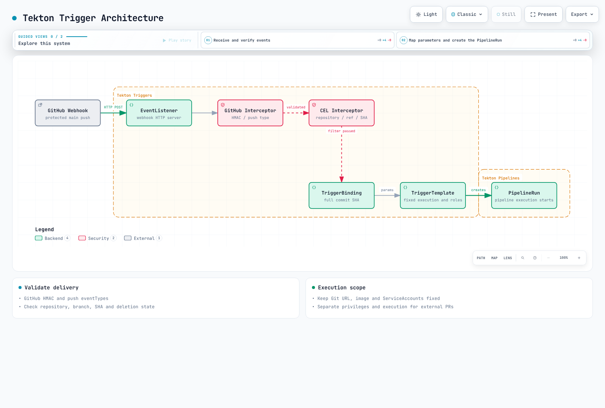
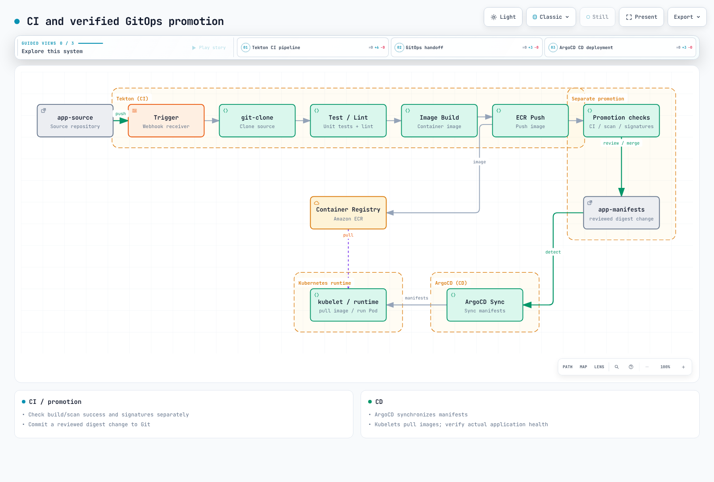

# Tekton Pipelines: Kubernetes-Native CI

> **Last Updated**: September 12, 2026. Pipelines 1.16.0, Triggers 0.37.0, Chains 0.29.0, Dashboard 0.72.0, tkn 0.46.0.
> **Validation**: Release CRD schemas, Task dependencies, local scripts and mocked programs. No live EKS installation, image build/push, KMS signing, external webhooks or notifications were executed.

< [Previous: FinOps](./13-finops-cost-platform.md) | [Contents](./README.md) | [Next: Zonal operations](./15-zonal-operations-guide.md) >

## Overview

Tekton defines Tasks, Pipelines and their executions through the Kubernetes API. Operators still manage controllers, worker capacity, storage, upgrades and access. Other CI systems can also support Kubernetes executors, autoscaling and attestations; avoid claims of exclusive support or zero operating cost.

This example runs Go application CI for **an approved repository's protected main branch**: clone → parallel vet/test → candidate image publication → digest-based scan. Chains processing and cryptographic verification precede a separately reviewed GitOps change. External fork PRs must not share this Pipeline's IRSA roles, PVCs or signing privileges.

## 1. Execution Model

| Component | Role |
| --- | --- |
| Task / Pipeline | Reusable work and dependency definitions |
| TaskRun / PipelineRun | Executions with parameters and status |
| Step / Sidecar | Sequential work / supporting service, normally inside a TaskRun Pod |
| Workspace / Result | Volume binding / small output value; not separate CRDs |

A Task definition is not itself a Pod: executing a TaskRun creates one. Results support string, array and object types; use artifact storage for large reports. Steps in the same Pod share networking and volumes, so they are not a strong boundary between mutually untrusted code.


[View interactive diagram](https://www.atomai.click/kubernetes-docs/archmaps/en-ops-14-tekton-pipelines-0.html)


[View interactive diagram](https://www.atomai.click/kubernetes-docs/archmaps/en-ops-14-tekton-pipelines-1.html)

## 2. Installation and Execution Permissions

### 2.1 Versions and installation paths

The official installation minimum is Kubernetes 1.28, while this chapter's security fields and schema validation target Kubernetes 1.36. The upstream minimum is not a recommendation for currently supported EKS versions. Dashboard 0.72.0 explicitly supports Pipelines 1.15 LTS/1.16 and Triggers 0.37 LTS.

This is a pinned manual-installation example. The official guide also points to Tekton Operator for production lifecycle management. Choose an owner before mixing manual apply with Operator-managed resources. These commands change a real cluster; review ownership rather than blindly forcing conflicts.

```bash
kubectl version -o yaml
kubectl get storageclass

curl --fail --location \
  https://infra.tekton.dev/tekton-releases/pipeline/previous/v1.16.0/release.yaml \
  -o pipelines-release.yaml
kubectl apply --server-side --field-manager=tekton-install -f pipelines-release.yaml
kubectl wait --for=condition=Established --timeout=120s \
  crd/tasks.tekton.dev crd/taskruns.tekton.dev \
  crd/pipelines.tekton.dev crd/pipelineruns.tekton.dev
kubectl -n tekton-pipelines wait deployment --all \
  --for=condition=Available --timeout=300s

kubectl apply --server-side -f \
  https://infra.tekton.dev/tekton-releases/triggers/previous/v0.37.0/release.yaml
kubectl apply --server-side -f \
  https://infra.tekton.dev/tekton-releases/triggers/previous/v0.37.0/interceptors.yaml
kubectl apply --server-side -f \
  https://infra.tekton.dev/tekton-releases/chains/previous/v0.29.0/release.yaml
kubectl apply --server-side -f \
  https://infra.tekton.dev/tekton-releases/dashboard/previous/v0.72.0/release.yaml
kubectl -n tekton-pipelines port-forward service/tekton-dashboard 9097:9097
```

`release.yaml` installs the read-only Dashboard; `release-full.yaml` includes write features. Read-only mode does not authenticate users or automatically enforce per-namespace user permissions. Validate an authentication proxy/OIDC and access model before operational exposure. An internal ALB is not authentication. Cognito integration requires the actual HTTPS listener, Cognito/OIDC endpoints and Secret.

`https://tekton.dev/helm-charts` is not a working official chart repository for this example. Do not install the former nonexistent chart and values.

### 2.2 Current configuration meanings

| Setting | Current meaning |
| --- | --- |
| `feature-flags.coschedule: workspaces` | Co-schedule TaskRuns sharing a PVC Workspace; retain for this RWO example |
| `disable-affinity-assistant` | Legacy flag removed after v0.68 |
| `set-security-context: true` | Default in 1.16 for Tekton-injected containers; user Steps need their own compatible contexts |
| `results-from: termination-message` | Default path, subject to Kubernetes termination-message limits |
| `max-result-size` | Applies to `sidecar-logs`; changing it alone does not enlarge the default termination message |
| Default timeout | Managed in `config-defaults`; this example sets PipelineRun timeouts explicitly |

`running-in-environment-with-injected-sidecars` is not Workspace isolation, and `keep-pod-on-cancel` is not a PipelineRun retention TTL. Do not replace a complete ConfigMap with a small excerpt.

### 2.3 Separate ServiceAccounts and IAM roles

Controllers use `tekton-pipelines` / `tekton-chains`; builds use `tekton-builds`. Simple Task/Pipeline name references resolve in the same namespace. A Task in a shared namespace cannot be referenced by name alone.

Create the IAM roles first. Each IRSA trust policy must constrain the existing cluster OIDC provider, `aud=sts.amazonaws.com`, and exact `sub=system:serviceaccount:tekton-builds:<SA name>`. Pre-create ECR repositories; builds do not need `CreateRepository`. Despite its name, `ci-readonly` has no Kubernetes API Role in this example: it is the default unprivileged execution account.

**`service-accounts.yaml`**

```yaml
apiVersion: v1
kind: Namespace
metadata:
  name: tekton-builds
---
apiVersion: v1
kind: ServiceAccount
metadata:
  name: ci-readonly
  namespace: tekton-builds
automountServiceAccountToken: false
---
apiVersion: v1
kind: ServiceAccount
metadata:
  name: ci-image-push
  namespace: tekton-builds
  annotations:
    eks.amazonaws.com/role-arn: arn:aws:iam::123456789012:role/tekton-candidate-push
automountServiceAccountToken: false
---
apiVersion: v1
kind: ServiceAccount
metadata:
  name: ci-image-read
  namespace: tekton-builds
  annotations:
    eks.amazonaws.com/role-arn: arn:aws:iam::123456789012:role/tekton-candidate-read
automountServiceAccountToken: false
---
apiVersion: v1
kind: ServiceAccount
metadata:
  name: ci-triggers
  namespace: tekton-builds
---
apiVersion: rbac.authorization.k8s.io/v1
kind: Role
metadata:
  name: ci-triggers
  namespace: tekton-builds
rules:
  - apiGroups: [triggers.tekton.dev]
    resources: [eventlisteners, triggers, triggerbindings, triggertemplates, interceptors]
    verbs: [get, list, watch]
  - apiGroups: [tekton.dev]
    resources: [pipelineruns]
    verbs: [create]
  - apiGroups: [""]
    resources: [configmaps]
    verbs: [get, list, watch]
  - apiGroups: [""]
    resources: [secrets]
    resourceNames: [github-webhook]
    verbs: [get]
---
apiVersion: rbac.authorization.k8s.io/v1
kind: RoleBinding
metadata:
  name: ci-triggers
  namespace: tekton-builds
subjects:
  - kind: ServiceAccount
    name: ci-triggers
    namespace: tekton-builds
roleRef:
  apiGroup: rbac.authorization.k8s.io
  kind: Role
  name: ci-triggers
---
apiVersion: rbac.authorization.k8s.io/v1
kind: ClusterRole
metadata:
  name: ci-triggers-interceptors
rules:
  - apiGroups: [triggers.tekton.dev]
    resources: [clusterinterceptors, clustertriggerbindings]
    verbs: [get, list, watch]
---
apiVersion: rbac.authorization.k8s.io/v1
kind: ClusterRoleBinding
metadata:
  name: ci-triggers-interceptors
subjects:
  - kind: ServiceAccount
    name: ci-triggers
    namespace: tekton-builds
roleRef:
  apiGroup: rbac.authorization.k8s.io
  kind: ClusterRole
  name: ci-triggers-interceptors
```

**`ecr-push-policy.json`**

```json
{
  "Version": "2012-10-17",
  "Statement": [
    {
      "Effect": "Allow",
      "Action": "ecr:GetAuthorizationToken",
      "Resource": "*",
      "Condition": {
        "StringEquals": {"aws:RequestedRegion": "ap-northeast-2"}
      }
    },
    {
      "Effect": "Allow",
      "Action": [
        "ecr:BatchCheckLayerAvailability",
        "ecr:GetDownloadUrlForLayer",
        "ecr:BatchGetImage",
        "ecr:InitiateLayerUpload",
        "ecr:UploadLayerPart",
        "ecr:CompleteLayerUpload",
        "ecr:PutImage"
      ],
      "Resource": "arn:aws:ecr:ap-northeast-2:123456789012:repository/myapp-candidates"
    }
  ]
}
```

**`ecr-read-policy.json`**

```json
{
  "Version": "2012-10-17",
  "Statement": [
    {
      "Effect": "Allow",
      "Action": "ecr:GetAuthorizationToken",
      "Resource": "*",
      "Condition": {
        "StringEquals": {"aws:RequestedRegion": "ap-northeast-2"}
      }
    },
    {
      "Effect": "Allow",
      "Action": [
        "ecr:BatchCheckLayerAvailability",
        "ecr:GetDownloadUrlForLayer",
        "ecr:BatchGetImage"
      ],
      "Resource": "arn:aws:ecr:ap-northeast-2:123456789012:repository/myapp-candidates"
    }
  ]
}
```

Attach the push policy to `tekton-candidate-push` and the read policy to `tekton-candidate-read`. Replace the account, region and repository everywhere. `GetAuthorizationToken` does not support repository-level resource scope, so it is separated and constrained by requested region.

IRSA authenticates AWS SDK/CLI calls inside the Pod. Kubelet ECR image pulls use node roles, Fargate execution roles or imagePullSecrets through separate paths. A Task IRSA annotation alone does not fix ImagePullBackOff.

## 3. Complete Task Definitions

These six Tasks form one consistent example. The source repository must contain a Go module, tests and a Dockerfile. Replace checkout's fixed `myorg/myapp` URL with the approved repository and match the Trigger allowlist. Do not accept arbitrary Git URLs or shell commands from webhook input.

Tekton substitutions are textual. Pass params through environment variables or arguments instead of interpolating them into script bodies. Validate full 40-character commits. ECR authentication files use Task-local `emptyDir`; do not write them into read-only Secret volumes or assume tools exist in another Step's image.

Rootless BuildKit requires a validated dedicated build environment with user namespaces, mounts and appropriate seccomp/AppArmor configuration. `Unconfined` and `--oci-worker-no-process-sandbox` are explicit security tradeoffs rejected by restricted namespace policy. They are not universally safe defaults. Use a separate environment for external PRs.

**`tasks.yaml`**

```yaml
apiVersion: tekton.dev/v1
kind: Task
metadata:
  name: checkout
  namespace: tekton-builds
spec:
  params:
  - name: revision
    type: string
  workspaces:
  - name: source
  results:
  - name: CHAINS-GIT_URL
    type: string
  - name: CHAINS-GIT_COMMIT
    type: string
  steps:
  - name: checkout
    image: golang:1.27.1
    script: |
      #!/usr/bin/env bash
      set -euo pipefail
      if [[ ! "$REVISION" =~ ^[0-9a-f]{40}$ ]]; then
        echo "Expected a full commit SHA" >&2
        exit 1
      fi
      cd "$SOURCE"
      git init .
      git config credential.helper ''
      git remote add origin "$REPOSITORY"
      git -c protocol.file.allow=never fetch --depth=1 origin "$REVISION"
      git -c advice.detachedHead=false checkout --detach FETCH_HEAD
      test "$(git rev-parse HEAD)" = "$REVISION"
      printf '%s' "$REPOSITORY" > "$GIT_URL_RESULT"
      printf '%s' "$REVISION" > "$GIT_COMMIT_RESULT"
    env:
    - name: REVISION
      value: $(params.revision)
    - name: REPOSITORY
      value: https://github.com/myorg/myapp.git
    - name: SOURCE
      value: $(workspaces.source.path)
    - name: GIT_URL_RESULT
      value: $(results.CHAINS-GIT_URL.path)
    - name: GIT_COMMIT_RESULT
      value: $(results.CHAINS-GIT_COMMIT.path)
    computeResources:
      requests:
        cpu: 100m
        memory: 128Mi
      limits:
        memory: 1Gi
  stepTemplate:
    securityContext:
      runAsUser: 1000
      runAsGroup: 1000
---
apiVersion: tekton.dev/v1
kind: Task
metadata:
  name: go-vet
  namespace: tekton-builds
spec:
  params: []
  workspaces:
  - name: source
  results: []
  steps:
  - name: vet
    image: golang:1.27.1
    script: |
      #!/usr/bin/env bash
      set -euo pipefail
      cd "$SOURCE"
      go vet ./...
    env:
    - name: SOURCE
      value: $(workspaces.source.path)
    - name: GOCACHE
      value: /tmp/go-build
    - name: GOMODCACHE
      value: /tmp/go-mod
    computeResources:
      requests:
        cpu: 100m
        memory: 128Mi
      limits:
        memory: 1Gi
  stepTemplate:
    securityContext:
      runAsUser: 1000
      runAsGroup: 1000
---
apiVersion: tekton.dev/v1
kind: Task
metadata:
  name: go-test
  namespace: tekton-builds
spec:
  params: []
  workspaces:
  - name: source
  results: []
  steps:
  - name: test
    image: golang:1.27.1
    script: |
      #!/usr/bin/env bash
      set -euo pipefail
      cd "$SOURCE"
      go test -count=1 -race -coverprofile=/tmp/coverage.out ./...
      go tool cover -func=/tmp/coverage.out
    env:
    - name: SOURCE
      value: $(workspaces.source.path)
    - name: GOCACHE
      value: /tmp/go-build
    - name: GOMODCACHE
      value: /tmp/go-mod
    computeResources:
      requests:
        cpu: 100m
        memory: 128Mi
      limits:
        memory: 1Gi
  stepTemplate:
    securityContext:
      runAsUser: 1000
      runAsGroup: 1000
---
apiVersion: tekton.dev/v1
kind: Task
metadata:
  name: build-image
  namespace: tekton-builds
spec:
  params:
  - name: image
    type: string
  - name: revision
    type: string
  - name: region
    type: string
  workspaces:
  - name: source
  results:
  - name: IMAGE_URL
    type: string
  - name: IMAGE_DIGEST
    type: string
  steps:
  - name: ecr-token
    image: public.ecr.aws/aws-cli/aws-cli:2.36.44
    script: |
      #!/bin/bash
      set -euo pipefail
      umask 077
      aws ecr get-authorization-token --region "$AWS_REGION" \
        --query 'authorizationData[0].authorizationToken' --output text > /auth/token
    env:
    - name: AWS_REGION
      value: $(params.region)
    - name: AWS_DEFAULT_REGION
      value: $(params.region)
    computeResources:
      requests:
        cpu: 100m
        memory: 128Mi
      limits:
        memory: 1Gi
    volumeMounts:
    - name: auth
      mountPath: /auth
  - name: docker-config
    image: python:3.12.13-slim
    script: |
      #!/usr/bin/env python3
      import base64, json, os, re
      from pathlib import Path
      image, region = os.environ["IMAGE"], os.environ["REGION"]
      match = re.fullmatch(r"([0-9]{12})\.dkr\.ecr\.([a-z0-9-]+)\.amazonaws\.com/([a-z0-9][a-z0-9._/-]*)", image)
      if not match or match.group(2) != region or ".." in match.group(3):
          raise SystemExit("Use a private ECR repository in the configured region")
      token = Path("/auth/token").read_text().strip()
      decoded = base64.b64decode(token, validate=True)
      if not decoded.startswith(b"AWS:") or len(decoded) <= 4:
          raise SystemExit("Invalid ECR authorization token")
      Path("/auth/config.json").write_text(json.dumps({"auths": {image.split("/")[0]: {"auth": token}}}))
      Path("/auth/config.json").chmod(0o600)
      Path("/auth/token").unlink()
    env:
    - name: IMAGE
      value: $(params.image)
    - name: REGION
      value: $(params.region)
    computeResources:
      requests:
        cpu: 100m
        memory: 128Mi
      limits:
        memory: 1Gi
    volumeMounts:
    - name: auth
      mountPath: /auth
  - name: build-and-push
    image: moby/buildkit:v0.33.0-rootless
    script: |
      #!/bin/sh
      set -eu
      case "$REVISION" in *[!0-9a-f]*|"") echo "Invalid commit tag" >&2; exit 1;; esac
      test "${#REVISION}" -eq 40
      buildctl-daemonless.sh build \
        --frontend dockerfile.v0 \
        --local "context=$SOURCE" --local "dockerfile=$SOURCE" \
        --output "type=image,name=$IMAGE:$REVISION,push=true" \
        --metadata-file /build-result/metadata.json
    env:
    - name: SOURCE
      value: $(workspaces.source.path)
    - name: IMAGE
      value: $(params.image)
    - name: REVISION
      value: $(params.revision)
    - name: DOCKER_CONFIG
      value: /auth
    - name: BUILDKITD_FLAGS
      value: --oci-worker-no-process-sandbox
    computeResources:
      requests:
        cpu: '1'
        memory: 1Gi
      limits:
        memory: 4Gi
    securityContext:
      runAsUser: 1000
      runAsGroup: 1000
      seccompProfile:
        type: Unconfined
      appArmorProfile:
        type: Unconfined
    volumeMounts:
    - name: auth
      mountPath: /auth
      readOnly: true
    - name: buildkit-state
      mountPath: /home/user/.local/share/buildkit
    - name: build-result
      mountPath: /build-result
  - name: record-digest
    image: python:3.12.13-slim
    script: |
      #!/usr/bin/env python3
      import json, os, re
      from pathlib import Path
      data = json.loads(Path("/build-result/metadata.json").read_text())
      digest = data.get("containerimage.digest", "")
      if not re.fullmatch(r"sha256:[0-9a-f]{64}", digest):
          raise SystemExit("BuildKit did not return an image digest")
      Path(os.environ["URL_RESULT"]).write_text(os.environ["IMAGE"])
      Path(os.environ["DIGEST_RESULT"]).write_text(digest)
    env:
    - name: IMAGE
      value: $(params.image)
    - name: URL_RESULT
      value: $(results.IMAGE_URL.path)
    - name: DIGEST_RESULT
      value: $(results.IMAGE_DIGEST.path)
    computeResources:
      requests:
        cpu: 100m
        memory: 128Mi
      limits:
        memory: 1Gi
    volumeMounts:
    - name: build-result
      mountPath: /build-result
      readOnly: true
  volumes:
  - name: auth
    emptyDir: {}
  - name: buildkit-state
    emptyDir: {}
  - name: build-result
    emptyDir: {}
  stepTemplate:
    securityContext:
      runAsUser: 1000
      runAsGroup: 1000
---
apiVersion: tekton.dev/v1
kind: Task
metadata:
  name: scan-image
  namespace: tekton-builds
spec:
  params:
  - name: image
    type: string
  - name: digest
    type: string
  - name: region
    type: string
  workspaces: []
  results: []
  steps:
  - name: ecr-token
    image: public.ecr.aws/aws-cli/aws-cli:2.36.44
    script: |
      #!/bin/bash
      set -euo pipefail
      umask 077
      aws ecr get-authorization-token --region "$AWS_REGION" \
        --query 'authorizationData[0].authorizationToken' --output text > /auth/token
    env:
    - name: AWS_REGION
      value: $(params.region)
    - name: AWS_DEFAULT_REGION
      value: $(params.region)
    computeResources:
      requests:
        cpu: 100m
        memory: 128Mi
      limits:
        memory: 1Gi
    volumeMounts:
    - name: auth
      mountPath: /auth
  - name: docker-config
    image: python:3.12.13-slim
    script: |
      #!/usr/bin/env python3
      import base64, json, os, re
      from pathlib import Path
      image, region = os.environ["IMAGE"], os.environ["REGION"]
      match = re.fullmatch(r"([0-9]{12})\.dkr\.ecr\.([a-z0-9-]+)\.amazonaws\.com/([a-z0-9][a-z0-9._/-]*)", image)
      if not match or match.group(2) != region or ".." in match.group(3):
          raise SystemExit("Use a private ECR repository in the configured region")
      token = Path("/auth/token").read_text().strip()
      decoded = base64.b64decode(token, validate=True)
      if not decoded.startswith(b"AWS:") or len(decoded) <= 4:
          raise SystemExit("Invalid ECR authorization token")
      Path("/auth/config.json").write_text(json.dumps({"auths": {image.split("/")[0]: {"auth": token}}}))
      Path("/auth/config.json").chmod(0o600)
      Path("/auth/token").unlink()
    env:
    - name: IMAGE
      value: $(params.image)
    - name: REGION
      value: $(params.region)
    computeResources:
      requests:
        cpu: 100m
        memory: 128Mi
      limits:
        memory: 1Gi
    volumeMounts:
    - name: auth
      mountPath: /auth
  - name: scan
    image: aquasec/trivy:0.74.0
    script: |
      #!/bin/sh
      set -eu
      trivy image --scanners vuln --severity HIGH,CRITICAL \
        --exit-code 1 --format json --output /tmp/trivy-report.json "$IMAGE@$DIGEST"
    env:
    - name: IMAGE
      value: $(params.image)
    - name: DIGEST
      value: $(params.digest)
    - name: DOCKER_CONFIG
      value: /auth
    - name: TRIVY_CACHE_DIR
      value: /tmp/trivy-cache
    computeResources:
      requests:
        cpu: 100m
        memory: 128Mi
      limits:
        memory: 1Gi
    volumeMounts:
    - name: auth
      mountPath: /auth
      readOnly: true
  volumes:
  - name: auth
    emptyDir: {}
  stepTemplate:
    securityContext:
      runAsUser: 1000
      runAsGroup: 1000
---
apiVersion: tekton.dev/v1
kind: Task
metadata:
  name: report-status
  namespace: tekton-builds
spec:
  params:
  - name: run
    type: string
  - name: status
    type: string
  workspaces: []
  results: []
  steps:
  - name: report
    image: python:3.12.13-slim
    script: |
      #!/usr/bin/env python3
      import json, os
      print(json.dumps({"pipelineRun": os.environ["RUN"], "status": os.environ["STATUS"]}))
    env:
    - name: RUN
      value: $(params.run)
    - name: STATUS
      value: $(params.status)
    computeResources:
      requests:
        cpu: 100m
        memory: 128Mi
      limits:
        memory: 1Gi
  stepTemplate:
    securityContext:
      runAsUser: 1000
      runAsGroup: 1000
```

The original Google Kaniko repository is archived; this new example uses BuildKit 0.33.0. Rootless does not guarantee complete process isolation. Before production, verify and pin image digests/platforms, and test writable paths and security contexts on actual nodes.

Scanner exit code 1 for findings and other error codes all fail the Task. A missing report must not become “zero vulnerabilities.” `/tmp/trivy-report.json` is temporary; export it to an approved artifact store before execution cleanup if long-term retention is required.

## 4. Pipeline and Execution


[View interactive diagram](https://www.atomai.click/kubernetes-docs/archmaps/en-ops-14-tekton-pipelines-2.html)

**`pipeline.yaml`**

```yaml
apiVersion: tekton.dev/v1
kind: Pipeline
metadata:
  name: trusted-image-ci
  namespace: tekton-builds
spec:
  params:
    - name: revision
      type: string
    - name: image
      type: string
    - name: region
      type: string
      default: ap-northeast-2
  workspaces:
    - name: source
  results:
    - name: CHAINS-GIT_URL
      value: $(tasks.clone.results.CHAINS-GIT_URL)
    - name: CHAINS-GIT_COMMIT
      value: $(tasks.clone.results.CHAINS-GIT_COMMIT)
    - name: IMAGE_URL
      value: $(tasks.build.results.IMAGE_URL)
    - name: IMAGE_DIGEST
      value: $(tasks.build.results.IMAGE_DIGEST)
  tasks:
    - name: clone
      taskRef:
        name: checkout
      params:
        - name: revision
          value: $(params.revision)
      workspaces:
        - name: source
          workspace: source
    - name: lint
      runAfter: [clone]
      taskRef:
        name: go-vet
      workspaces:
        - name: source
          workspace: source
    - name: test
      runAfter: [clone]
      taskRef:
        name: go-test
      workspaces:
        - name: source
          workspace: source
    - name: build
      runAfter: [lint, test]
      taskRef:
        name: build-image
      params:
        - name: image
          value: $(params.image)
        - name: revision
          value: $(tasks.clone.results.CHAINS-GIT_COMMIT)
        - name: region
          value: $(params.region)
      workspaces:
        - name: source
          workspace: source
    - name: scan
      runAfter: [build]
      taskRef:
        name: scan-image
      params:
        - name: image
          value: $(tasks.build.results.IMAGE_URL)
        - name: digest
          value: $(tasks.build.results.IMAGE_DIGEST)
        - name: region
          value: $(params.region)
  finally:
    - name: report
      taskRef:
        name: report-status
      params:
        - name: run
          value: $(context.pipelineRun.name)
        - name: status
          value: $(tasks.status)
```

**`pipelinerun.yaml`**

```yaml
apiVersion: tekton.dev/v1
kind: PipelineRun
metadata:
  generateName: trusted-image-ci-
  namespace: tekton-builds
spec:
  pipelineRef:
    name: trusted-image-ci
  params:
    - name: revision
      value: REPLACE_WITH_FULL_40_CHARACTER_COMMIT_SHA
    - name: image
      value: 123456789012.dkr.ecr.ap-northeast-2.amazonaws.com/myapp-candidates
  workspaces:
    - name: source
      volumeClaimTemplate:
        spec:
          accessModes: [ReadWriteOnce]
          storageClassName: gp3
          resources:
            requests:
              storage: 10Gi
  taskRunTemplate:
    serviceAccountName: ci-readonly
    podTemplate:
      automountServiceAccountToken: false
      securityContext:
        fsGroup: 1000
  taskRunSpecs:
    - pipelineTaskName: build
      serviceAccountName: ci-image-push
    - pipelineTaskName: scan
      serviceAccountName: ci-image-read
  timeouts:
    pipeline: 1h
    tasks: 50m
    finally: 5m
```

```bash
kubectl apply -f service-accounts.yaml
kubectl apply -f tasks.yaml -f pipeline.yaml
# Replace the commit placeholder and provision the referenced IAM roles first.
kubectl create -f pipelinerun.yaml
tkn pipelinerun logs --last -n tekton-builds --follow --exit-with-pipelinerun-error
```

A new PVC is created per execution. ReadWriteOnce permits multiple Pods on the same node but is not multi-node RWX. An emptyDir is not shared storage across different TaskRun Pods. Separate caches by trust level and coordinate concurrent writers.

`finally` runs after ordinary Tasks, but execution is not unconditional. References to missing Results can cause skips; cancellation mode, overall timeout, resource failures and unresolved references can also prevent execution. This example reports only the run name and `tasks.status`, avoiding image Results that may never have been produced. Do not assume ordering among multiple finally Tasks.

## 5. Webhooks and Triggers

This Trigger verifies GitHub HMAC first, then checks **repository, branch, deletion state and full SHA**. Git URL, ECR path, Task names and ServiceAccounts remain fixed in trusted definitions. Do not connect external PR events to this template. HMAC verifies delivery origin; it does not authorize PR code to deploy.



[View interactive diagram](https://www.atomai.click/kubernetes-docs/archmaps/en-ops-14-tekton-pipelines-3.html)

**`triggers.yaml`**

```yaml
apiVersion: triggers.tekton.dev/v1beta1
kind: EventListener
metadata:
  name: trusted-github
  namespace: tekton-builds
spec:
  serviceAccountName: ci-triggers
  triggers:
    - name: protected-main-push
      interceptors:
        - ref:
            name: github
          params:
            - name: secretRef
              value:
                secretName: github-webhook
                secretKey: token
            - name: eventTypes
              value: [push]
        - ref:
            name: cel
          params:
            - name: filter
              value: >-
                body.repository.full_name == 'myorg/myapp' &&
                body.ref == 'refs/heads/main' &&
                body.deleted == false &&
                body.after.matches('^[0-9a-f]{40}$')
      bindings:
        - ref: trusted-commit
      template:
        ref: trusted-image-ci
---
apiVersion: triggers.tekton.dev/v1beta1
kind: TriggerBinding
metadata:
  name: trusted-commit
  namespace: tekton-builds
spec:
  params:
    - name: revision
      value: $(body.after)
---
apiVersion: triggers.tekton.dev/v1beta1
kind: TriggerTemplate
metadata:
  name: trusted-image-ci
  namespace: tekton-builds
spec:
  params:
    - name: revision
  resourcetemplates:
    - apiVersion: tekton.dev/v1
      kind: PipelineRun
      metadata:
        generateName: trusted-image-ci-
        namespace: tekton-builds
      spec:
        pipelineRef:
          name: trusted-image-ci
        params:
          - name: revision
            value: $(tt.params.revision)
          - name: image
            value: 123456789012.dkr.ecr.ap-northeast-2.amazonaws.com/myapp-candidates
        workspaces:
          - name: source
            volumeClaimTemplate:
              spec:
                accessModes: [ReadWriteOnce]
                storageClassName: gp3
                resources:
                  requests:
                    storage: 10Gi
        taskRunTemplate:
          serviceAccountName: ci-readonly
          podTemplate:
            automountServiceAccountToken: false
            securityContext:
              fsGroup: 1000
        taskRunSpecs:
          - pipelineTaskName: build
            serviceAccountName: ci-image-push
          - pipelineTaskName: scan
            serviceAccountName: ci-image-read
        timeouts:
          pipeline: 1h
          tasks: 50m
          finally: 5m
```

The `github-webhook` Secret's `token` must match GitHub's webhook secret. Supply it from protected storage, never Git. Configure the external HTTPS endpoint and delivery retry/deduplication policy separately. The EventListener has an internal Service by default; this YAML alone does not create an internet endpoint.

Preserve the original body through TLS termination and gateway/Ingress processing for HMAC verification. Apply appropriate authentication, rate limits, availability and fixed routing to the callback. A quiet period is not automatically a webhook outage: inspect real delivery results and EventListener processing errors.

Do not assume `head_commit` always exists or truncate `refs/heads/feature/a` using a single split element. File-change filters must account for added, modified and removed paths and payload limits. This example does not invent a business-specific path filter.

## 6. Chains and Signature Verification

### 6.1 CI success and signing completion are separate

Chains is a separate controller processing completed TaskRuns/PipelineRuns. An image signature alone does not prove the full tests and scan succeeded. `chains.tekton.dev/signed=true` is neither deployment approval nor cryptographic verification.

Pipeline-level provenance is created after Pipeline completion. Waiting inside that Pipeline for its own attestation can conflict with that ordering. This example uses a separate verification and promotion procedure after CI completes.


[View interactive diagram](https://www.atomai.click/kubernetes-docs/archmaps/en-ops-14-tekton-pipelines-4.html)

### 6.2 KMS configuration

Use an existing asymmetric `SIGN_VERIFY` KMS key. Replace the key ARN and `builder.id`. Configure a separate IRSA role on the **Chains controller ServiceAccount `tekton-chains/tekton-chains-controller`**, with ECR writes to the candidate repository and the KMS permissions below. Giving the build Pod an IRSA role does not give the controller those credentials.

The current OCI backend uses Kubernetes credential lookup plus default/ECR credential-helper chains. Configure the controller's ambient AWS identity and verify actual signature upload. A build Task's `/auth` emptyDir is not a shared Secret readable by Chains.

**`chains-kms-policy.json`**

```json
{
  "Version": "2012-10-17",
  "Statement": [{
    "Effect": "Allow",
    "Action": ["kms:Sign", "kms:GetPublicKey", "kms:DescribeKey"],
    "Resource": "arn:aws:kms:ap-northeast-2:123456789012:key/REPLACE_KEY_ID"
  }]
}
```

**`chains-config.yaml`**

```yaml
apiVersion: v1
kind: ConfigMap
metadata:
  name: chains-config
  namespace: tekton-chains
data:
  artifacts.taskrun.storage: ""
  artifacts.pipelinerun.format: slsa/v2alpha3
  artifacts.pipelinerun.storage: oci
  artifacts.pipelinerun.signer: kms
  artifacts.oci.format: simplesigning
  artifacts.oci.storage: oci
  artifacts.oci.signer: kms
  signers.kms.kmsref: awskms:///arn:aws:kms:ap-northeast-2:123456789012:key/REPLACE_KEY_ID
  signers.x509.fulcio.enabled: "false"
  transparency.enabled: "false"
  storage.oci.encoding-format: dsse
  builder.id: https://ci.example.com/tekton/trusted-image-ci
  builddefinition.buildtype: https://tekton.dev/chains/v2/slsa
```

The formatter name `slsa/v1` does not mean SLSA provenance v1.0. In current Chains, `slsa/v1` / `in-toto` map to v0.2, while `slsa/v2alpha3` / `slsa/v2alpha4` map to v1.0. This example uses Pipeline-level `slsa/v2alpha3`, disables duplicate Task-level provenance storage and enables image signatures separately.

`storage.oci.encoding-format: dsse` retains legacy `.sig` / `.att` storage. Version 0.29's `sigstore-bundle` uses OCI 1.1 referrers; change storage and verification tooling together. Rekor uploads are disabled here, so verification explicitly follows an internal public-key policy. Configure transparency separately if required, including review of exposed build metadata.

Keyless signing requires an issuer trusted by the actual Fulcio service and a valid workload token. Setting a GitHub Actions issuer string on an EKS Pod does not provide authentication. Signatures and attestations alone do not establish a particular SLSA level.

### 6.3 Independently verify execution and artifacts

This script checks a PipelineRun **read from a trusted API** for successful CI, completed Chains processing and the approved repository, commit and image outputs. It does not verify signatures. The subsequent Cosign checks and provenance-policy review are also required.

**`check_run.py`**

```python
"""Check trusted API output before separate cryptographic artifact verification."""
import argparse
import json
import re
from pathlib import Path


def check(run, repository, revision, image):
    if run.get("kind") != "PipelineRun" or run.get("apiVersion") != "tekton.dev/v1":
        raise ValueError("Expected a tekton.dev/v1 PipelineRun")
    metadata = run.get("metadata", {})
    if metadata.get("namespace") != "tekton-builds" or not metadata.get("uid"):
        raise ValueError("Unexpected namespace or missing run UID")
    if run.get("spec", {}).get("pipelineRef", {}).get("name") != "trusted-image-ci":
        raise ValueError("Unexpected pipeline")
    succeeded = [c for c in run.get("status", {}).get("conditions", []) if c.get("type") == "Succeeded"]
    if len(succeeded) != 1 or succeeded[0].get("status") != "True":
        raise ValueError("CI has not succeeded")
    if not run.get("status", {}).get("completionTime"):
        raise ValueError("CI completion time is missing")
    if metadata.get("annotations", {}).get("chains.tekton.dev/signed") != "true":
        raise ValueError("Chains has not completed; retry later with a fresh API read")
    results = {}
    for result in run.get("status", {}).get("results", []):
        if result["name"] in results:
            raise ValueError("Duplicate result")
        results[result["name"]] = result["value"]
    if not re.fullmatch(r"[0-9a-f]{40}", revision):
        raise ValueError("Expected full source revision")
    expected = {"CHAINS-GIT_URL": repository, "CHAINS-GIT_COMMIT": revision, "IMAGE_URL": image}
    if any(results.get(k) != v for k, v in expected.items()):
        raise ValueError("Run outputs do not match the approved source and repository")
    digest = results.get("IMAGE_DIGEST", "")
    if not isinstance(digest, str) or not re.fullmatch(r"sha256:[0-9a-f]{64}", digest):
        raise ValueError("Missing or invalid image digest")
    return image + "@" + digest


if __name__ == "__main__":
    parser = argparse.ArgumentParser()
    parser.add_argument("--run", type=Path, required=True)
    parser.add_argument("--repository", required=True)
    parser.add_argument("--revision", required=True)
    parser.add_argument("--image", required=True)
    args = parser.parse_args()
    try:
        print(check(json.loads(args.run.read_text()), args.repository, args.revision, args.image))
    except (ValueError, KeyError, TypeError) as error:
        parser.exit(1, f"Run gate failed: {error}\n")
```

```bash
set -euo pipefail
DOCS_RUN="REPLACE_PIPELINERUN_NAME"
DOCS_REVISION="REPLACE_WITH_FULL_40_CHARACTER_COMMIT_SHA"
DOCS_IMAGE="123456789012.dkr.ecr.ap-northeast-2.amazonaws.com/myapp-candidates"
kubectl -n tekton-builds get pipelinerun "$DOCS_RUN" -o json > run.json
DOCS_IMAGE_REF="$(python3 check_run.py --run run.json \
  --repository https://github.com/myorg/myapp.git \
  --revision "$DOCS_REVISION" --image "$DOCS_IMAGE")"

# chains.pub must be the independently trusted public key for the configured KMS key.
# Registry read authentication must already be configured.
# Explicit private-key policy: verify signatures, without requiring a Rekor entry.
cosign verify --key chains.pub --insecure-ignore-tlog=true "$DOCS_IMAGE_REF" \
  > verified-signature.json
cosign verify-attestation --key chains.pub --insecure-ignore-tlog=true \
  --type https://slsa.dev/provenance/v1 "$DOCS_IMAGE_REF" \
  > verified-attestations.json
```

`--insecure-ignore-tlog` is an explicit choice not to require a public Rekor entry. Signature verification against the trusted key remains active. If organizational policy requires transparency verification, configure that chain instead of using this exception.

Apply policy to the verified attestation's subject digest, `runDetails.builder.id`, `buildDefinition.buildType`, exact source URI/commit and approved Task/Pipeline definitions. A valid signature from an arbitrary producer or attestation for another build is insufficient. The commands above do not automatically implement these organization-specific checks.

Configure admission verification separately for the same trusted key/identity, digest and provenance conditions. Do not apply incomplete `BEGIN PUBLIC KEY ...` placeholders or compare nonexistent predicate fields. Check current Kyverno ImageValidatingPolicy and registry authentication for the installed version, then test accepted and rejected cases for correct/wrong keys, sources and unsigned images.

## 7. GitOps Handoff

Update the actual Kustomize/Helm configuration with the verified `repository@sha256:...`. This chapter does not include a Task that automatically pushes, opens or merges PRs. An owner or separately approved promotion workflow edits fixed repositories/files and merges after CI and review. Avoid having both Tekton kubectl deployment and ArgoCD manage the same manifests.



[View interactive diagram](https://www.atomai.click/kubernetes-docs/archmaps/en-ops-14-tekton-pipelines-5.html)

```bash
# In a reviewed checkout with the Kustomize CLI installed:
cd overlays/production
kustomize edit set image "myapp=$DOCS_IMAGE_REF"
kustomize build . > /tmp/rendered-myapp.yaml
git diff -- kustomization.yaml
# Run repository checks and submit the focused change for review.
```

Splitting image references with `cut -d: -f1/2` breaks registry ports and digests. Pass the full reference to the tool. Provision SSH known_hosts through a trusted path; an unverified ssh-keyscan result is not a trust anchor. Credentials copied to one Step's home are not automatically shared with another.

ArgoCD syncs Git manifests; kubelets/container runtimes pull application images. Check application health separately from sync completion. Rollback does not automatically restore data or schema changes.

## 8. Operations and Cleanup

### 8.1 Execution records and PVCs

`keep` and `keep-since` are options of tools such as tkn deletion commands, not a built-in PipelineRun TTL field. tkn 0.46.0 `pipelinerun delete` has no `--dry-run`. Check retention for logs, scan reports, signatures/provenance and audit data before deleting anything. Do not delete all succeeded Pods without an age policy.

This tool prints **review candidates only** in one namespace: successful runs completed over seven days ago and failed runs over fourteen days ago. It uses completion time, not creation time, and requires Chains and archive acknowledgements. `ci.example.com/archive-complete` is an operator-managed annotation recorded after real archival success, not an automatic Tekton field. The script makes no Kubernetes API calls and performs no deletion.

**`cleanup_candidates.py`**

```python
"""Print names for review; this script never deletes Kubernetes objects."""
import argparse
import json
from datetime import datetime, timedelta, timezone
from pathlib import Path


def timestamp(value):
    parsed = datetime.fromisoformat(value.replace("Z", "+00:00"))
    if parsed.tzinfo is None:
        raise ValueError("Timezone required")
    return parsed.astimezone(timezone.utc)


def candidates(document, now, namespace):
    if now.tzinfo is None:
        raise ValueError("Timezone required")
    result, skipped = [], []
    for obj in document.get("items", []):
        meta, status = obj.get("metadata", {}), obj.get("status", {})
        name = meta.get("name", "<unnamed>")
        conditions = [c for c in status.get("conditions", []) if c.get("type") == "Succeeded"]
        annotations = meta.get("annotations", {})
        if (obj.get("kind") != "PipelineRun" or meta.get("namespace") != namespace
                or not meta.get("uid") or len(conditions) != 1
                or conditions[0].get("status") not in ("True", "False")):
            skipped.append({"name": name, "reason": "not a terminal run in the selected namespace"})
            continue
        if annotations.get("ci.example.com/retain") == "true":
            skipped.append({"name": name, "reason": "retention hold"})
            continue
        if (annotations.get("chains.tekton.dev/signed") != "true"
                or annotations.get("ci.example.com/archive-complete") != "true"):
            skipped.append({"name": name, "reason": "Chains processing or archive acknowledgement incomplete"})
            continue
        try:
            completed = timestamp(status["completionTime"])
        except (ValueError, KeyError, TypeError, AttributeError):
            skipped.append({"name": name, "reason": "invalid completion time"})
            continue
        retention_days = 7 if conditions[0]["status"] == "True" else 14
        if completed < now - timedelta(days=retention_days):
            result.append({"namespace": namespace, "name": name, "uid": meta["uid"],
                           "completed": completed.isoformat(), "retentionDays": retention_days})
    return {"mode": "review-only", "candidates": result, "skipped": skipped}


if __name__ == "__main__":
    parser = argparse.ArgumentParser()
    parser.add_argument("--input", type=Path, required=True)
    parser.add_argument("--namespace", default="tekton-builds")
    parser.add_argument("--now", default=datetime.now(timezone.utc).isoformat())
    args = parser.parse_args()
    print(json.dumps(candidates(json.loads(args.input.read_text()), timestamp(args.now), args.namespace), indent=2))
```

```bash
kubectl -n tekton-builds get pipelineruns -o json > runs.json
python3 cleanup_candidates.py --input runs.json --namespace tekton-builds
```

PVC lifecycle depends on `coschedule`.

| Mode | volumeClaimTemplate PVC after completion |
| --- | --- |
| `workspaces` | Retained by default; Run annotation `tekton.dev/auto-cleanup-pvc: "true"` enables completion cleanup |
| `pipelineruns`, `isolate-pipelinerun` | Cleaned up on completion |
| `disabled` | Owner-reference GC; verify deletion behavior when deleting the Run |

Existing PVCs bound directly to Workspaces are not deleted by that annotation. Do not enable automatic cleanup for data that still needs archiving. Inspect ownerReferences before classifying TaskRuns as orphaned.

### 8.2 Monitoring

Pipelines 1.16 exports metrics through OpenTelemetry. With `metrics-protocol: prometheus` in `config-observability`, the controller Service port is named **`http-metrics`**. Match both ServiceMonitor selection and Prometheus selection.

**`servicemonitor.yaml`**

```yaml
apiVersion: monitoring.coreos.com/v1
kind: ServiceMonitor
metadata:
  name: tekton-pipelines
  namespace: observability
  labels:
    release: prometheus
spec:
  namespaceSelector:
    matchNames: [tekton-pipelines]
  selector:
    matchLabels:
      app.kubernetes.io/component: controller
      app.kubernetes.io/part-of: tekton-pipelines
  endpoints:
    - port: http-metrics
      path: /metrics
      interval: 30s
      honorLabels: true
```

**`monitoring-rules.yaml`**

```yaml
groups:
  - name: tekton-ci
    rules:
      - record: tekton:completed_duration_seconds:mean1h
        expr: |
          sum(rate(tekton_pipelines_controller_pipelinerun_duration_seconds_sum[1h]))
          /
          sum(rate(tekton_pipelines_controller_pipelinerun_duration_seconds_count[1h]))
      - alert: TektonCompletedRunFailureRatio
        expr: |
          (
            sum(increase(tekton_pipelines_controller_pipelinerun_total{status="failed"}[1h]))
            /
            sum(increase(tekton_pipelines_controller_pipelinerun_total{status=~"success|failed"}[1h]))
            > 0.30
          )
          and
          (
            sum(increase(tekton_pipelines_controller_pipelinerun_total{status=~"success|failed"}[1h])) >= 10
          )
        for: 15m
        labels:
          severity: warning
        annotations:
          summary: "More than 30% failed among at least 10 completed non-cancelled CI runs"
      - alert: TektonControllerMetricsUnavailable
        expr: |
          absent(up{namespace="tekton-pipelines",service="tekton-pipelines-controller",endpoint="http-metrics"} == 1)
        for: 5m
        labels:
          severity: warning
        annotations:
          summary: "No healthy scrape target for the Tekton controller"
```

The file uses ordinary Prometheus rule format; put it under `PrometheusRule.spec` when using the Operator. Current completion counts use `pipelinerun_total`; active counts use `running_pipelineruns`. Counter statuses are `success`, `failed` and `cancelled`, with no namespace label on the counter. This example compares cluster-wide successes/failures while excluding cancellations.

Calculate average duration from **summed histogram sums divided by summed counts**. Averaging per-series averages is not the overall average. A completed-duration metric with `status=running` does not provide the elapsed age of active runs. Inspect actual Run startTime, conditions and Pod status.

### 8.3 Troubleshooting and logs

```bash
tkn pipelinerun describe "$DOCS_RUN" -n tekton-builds
tkn pipelinerun logs "$DOCS_RUN" -n tekton-builds --log-failed
tkn pipelinerun logs "$DOCS_RUN" -n tekton-builds --task build
kubectl -n tekton-builds get pipelinerun "$DOCS_RUN" -o yaml
kubectl -n tekton-builds describe pod -l "tekton.dev/pipelineRun=$DOCS_RUN"
kubectl -n tekton-pipelines logs deployment/tekton-pipelines-controller --tail=100
kubectl -n tekton-chains logs deployment/tekton-chains-controller --tail=100
```

`--last` selects the latest run, not the latest failed run. Read conditions from JSON instead of using unsupported CRD condition field selectors. Query the namespace and PipelineRun labels actually collected by Loki/Alloy. Collecting controller-namespace files alone misses builds running in `tekton-builds`.

For Pending Pods, inspect quota, node, PVC and scheduling events. Changing gp3 RWO to RWX in YAML does not make it behave like EFS. Longer timeouts do not fix oversized Results, permissions, missing Tasks or absent tools.

## 9. Reuse and Operational Choices

- **Sidecars**: Use DB readiness and real connection checks. A sleep is not readiness evidence. Check native-sidecar feature settings and termination behavior for the installed version.
- **StepAction**: The feature is stable in 1.16, but the release's storage API remains `tekton.dev/v1beta1`. Connect actual tools, credentials and result paths to the consuming Task.
- **Catalogs**: Hub service deprecation and CLI internalization are distinct. Hub commands in tkn 0.46 do not guarantee long-term service availability. Manage approved definitions at fixed commits or verified OCI bundle digests and restrict resolver access.
- **Networking**: NetworkPolicy `to: []` with TCP 443 allows that port to all destinations; it is not an ECR/GitHub domain allowlist. Restrict required DNS, STS/ECR/S3, registry and API paths through the actual CNI/proxy/VPC design.
- **Spot and cost**: Karpenter uses `karpenter.sh/capacity-type: spot`; EKS Managed Node Groups use their actual `eks.amazonaws.com/capacityType` labels. Account for interruption, retries, quota and storage. No running build Pods does not mean zero total cost.
- **Caches**: Measure workload-specific reuse. Do not promise a universal 40–60% improvement. Different trust levels must not share writable caches.

## 10. References

- [Pipelines 1.16.0](https://github.com/tektoncd/pipeline/releases/tag/v1.16.0)
- [Triggers 0.37.0](https://github.com/tektoncd/triggers/releases/tag/v0.37.0)
- [Chains 0.29.0](https://github.com/tektoncd/chains/releases/tag/v0.29.0)
- [Dashboard 0.72.0](https://github.com/tektoncd/dashboard/releases/tag/v0.72.0)
- [Pipelines security model](https://github.com/tektoncd/pipeline/blob/v1.16.0/docs/security/README.md)
- [Affinity and PVC lifecycle](https://github.com/tektoncd/pipeline/blob/v1.16.0/docs/affinityassistants.md)
- [Pipelines metrics](https://github.com/tektoncd/pipeline/blob/v1.16.0/docs/metrics.md)
- [Chains configuration](https://github.com/tektoncd/chains/blob/v0.29.0/docs/config.md)
- [SLSA formatter and type hints](https://github.com/tektoncd/chains/blob/v0.29.0/docs/slsa-provenance.md)
- [BuildKit rootless requirements](https://github.com/moby/buildkit/blob/v0.33.0/docs/rootless.md)
- [Cosign 3.1.3](https://github.com/sigstore/cosign/releases/tag/v3.1.3)
- [CI infrastructure](./03-ci-pipelines.md)
- [GitOps multi-cluster](./04-gitops-multi-cluster.md)
- [Observability stack](./09-observability-stack.md)
