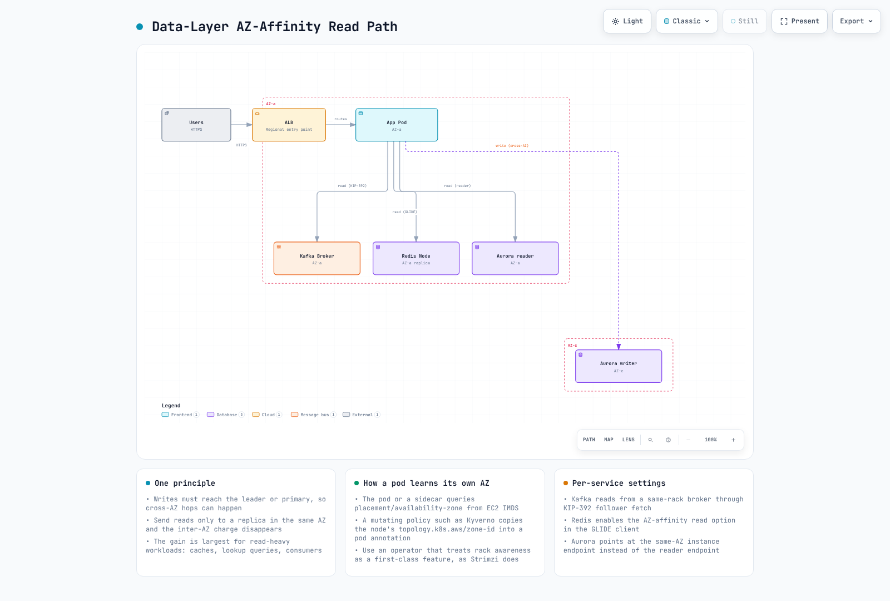

# Zonal Cluster Operations: Traffic Shifting, Upgrade Rollback, and Data-Layer AZ Affinity

> **Supported Versions**: Amazon EKS 1.33+, AWS Load Balancer Controller 2.9+, Kafka 2.4+ (KIP-392), Valkey GLIDE 1.x
> **Last Updated**: July 21, 2026

< [Previous: Tekton Pipelines](14-tekton-pipelines.md) | [Table of Contents](./README.md) | [Next: Troubleshooting Playbook](16-troubleshooting-playbook.md) >

***

The single most common theme in customer questions is "operations." One combination keeps coming up: **split clusters by zone to isolate failures, shift traffic with load balancer target group weights, and when something breaks, roll back in place instead of standing up a new cluster.** This guide ties that combination together as a single operational strategy, and adds the piece that's usually missing: **pinning the read path of your DB/cache/messaging layer to a zone.**

The detailed procedures for each piece already live elsewhere in this repo. This document explains why they get used together, and fills in the data-layer gap that didn't exist before.

## Table of Contents

1. [Why Zonal Operations](#why-zonal-operations)
2. [Traffic Layer: Target Group + TargetGroupBinding + Weight Shifting](#traffic-layer-target-group--targetgroupbinding--weight-shifting)
3. [Upgrades: Why In-Place + Native Rollback Became the Default](#upgrades-why-in-place--native-rollback-became-the-default)
4. [Data Layer: Pinning the Read Path to a Zone](#data-layer-pinning-the-read-path-to-a-zone)
5. [Recommended Combination Summary](#recommended-combination-summary)

***

## Why Zonal Operations

A multi-AZ single cluster and a fleet of one cluster per AZ (zonal/single-zone) trade off differently.

| Aspect | Multi-AZ single cluster | Zonal (single-zone) clusters |
|--------|--------------------------|-------------------------------|
| Failure isolation | An AZ failure affects part of the cluster | An AZ failure only affects that zonal cluster; the rest are unaffected |
| Cross-AZ cost | Pod-to-pod traffic crosses AZ boundaries ($0.01/GB) | Same-AZ traffic only, no inter-AZ transfer cost |
| Upgrades | Rolling update, the whole cluster moves version at once | Zone-by-zone sequential upgrade, other zones stay on the previous version |
| Operational complexity | One cluster to manage | N clusters plus a traffic-routing layer to keep in sync |

AWS ships this exact pattern as the [Cell-Based Architecture for Amazon EKS Guidance](https://aws.amazon.com/solutions/guidance/cell-based-architecture-for-amazon-eks/). Here, one zonal cluster is a "cell," and a group of cells within a Region is a "supercell." A routing layer in front of the cells (Route 53 weighted routing plus Application Recovery Controller) handles failover, and an ALB inside each cell distributes traffic within it. The key property: traffic never crosses a cell boundary, so there is no inter-AZ data transfer cost to begin with.

Zonal/blue-green architecture itself is already covered in [`ops/02-infrastructure-advanced.md`](02-infrastructure-advanced.md#1-bluegreen-architecture-overview), and the maturity-model view of Multi-AZ/Cell-Based Architecture is in [`eks/10-eks-resiliency.md`](../eks/10-eks-resiliency.md). This guide wires traffic shifting, upgrades, and data reads together into one operational loop on top of that.

***

## Traffic Layer: Target Group + TargetGroupBinding + Weight Shifting


[🔍 View interactive diagram](https://www.atomai.click/kubernetes-docs/archmaps/en-ops-15-zonal-operations-guide-0.html)

The standard pattern for moving traffic across multiple zonal clusters:

1. Create the NLB/ALB and Target Groups **outside** the cluster with IaC such as Terraform (so the load balancer survives even if a cluster is replaced).
2. Bind each zonal cluster's Service to its Target Group with the `TargetGroupBinding` CRD.
3. Move traffic between clusters by adjusting **Target Group weight** on the load balancer, without touching anything inside the clusters.

```yaml
apiVersion: elbv2.k8s.aws/v1beta1
kind: TargetGroupBinding
metadata:
  name: zone-a-tgb
  namespace: production
spec:
  targetGroupARN: arn:aws:elasticloadbalancing:ap-northeast-2:ACCOUNT:targetgroup/zone-a-tg/xxxxxxxxxxxx
  serviceRef:
    name: app-service
    port: 80
  targetType: ip
```

```bash
# Adjust weight between target groups in the ALB listener's forward action
aws elbv2 modify-listener \
  --listener-arn "$LISTENER_ARN" \
  --default-actions '[{
    "Type": "forward",
    "ForwardConfig": {
      "TargetGroups": [
        {"TargetGroupArn": "'"$ZONE_A_TG_ARN"'", "Weight": 20},
        {"TargetGroupArn": "'"$ZONE_C_TG_ARN"'", "Weight": 80}
      ]
    }
  }]'
```

TargetGroupBinding's basic/advanced/multi-port configuration is covered in [`networking/03-aws-lb-controller.md`](../networking/03-aws-lb-controller.md#targetgroupbinding), and the full Terraform setup for NLB weighted target groups plus Route 53 weighted routing is in [`ops/02-infrastructure-advanced.md`](02-infrastructure-advanced.md#2-nlb-weighted-target-groups).

**Planned shifts vs. failure-triggered shifts**: weight adjustment is for **planned** transitions like upgrades and deployments. Unplanned situations like an AZ outage are handled by [ARC (Application Recovery Controller) Zonal Shift](../eks/10-eks-resiliency.md#arc-zonal-shift), which detects and shifts automatically — the two mechanisms don't compete, they split planned vs. reactive duty.

> **July 2026 update**: ARC zonal shift/autoshift is [now supported on EKS Auto Mode clusters](https://aws.amazon.com/about-aws/whats-new/2026/07/eks-auto-mode-arc-zonal-shift) as well. On Auto Mode, there are no flags to set and no Karpenter versions to manage — just enable ARC zonal shift on the cluster, and when a shift activates, new-node provisioning in the impaired AZ and voluntary disruptions (consolidation/drift) are halted automatically.

***

## Upgrades: Why In-Place + Native Rollback Became the Default

In July 2026, Amazon EKS [GA'd native Kubernetes version rollback](https://aws.amazon.com/blogs/containers/announcing-amazon-eks-rollback-for-safe-and-reliable-management-of-cluster-upgrades/). If a problem surfaces after an upgrade, you can revert **one minor version at a time, within 7 days**, and Rollback Readiness Insights automatically pre-checks API compatibility, kubelet version skew, and add-on versions before you roll back. On Auto Mode clusters, rollback covers the data plane (worker nodes) as well as the control plane — but if you're upgrading a zonal cluster in place with self-managed node groups (as in the next section), that automatic data-plane rollback doesn't apply; only the control plane reverts, so node/AMI/add-on changes need to be reverted separately. Neither case carries an extra charge.

Before this feature existed, the only answer to "what happens if the new version is bad" was a standing blue/green cluster fleet you could validate against before cutting over. Now, teams already running a zonal (single-zone-per-cluster) setup have a lighter-weight option: upgrade each zonal cluster in place, one zone at a time, and use native rollback as the safety net instead.

| Approach | When it's the right call |
|----------|---------------------------|
| **Standing blue/green cluster fleet** | You need to validate the new version against real production traffic on a fully separate cluster before cutting over, or you need to revert node/AMI/add-on changes wholesale (native rollback only reverts the control plane) |
| **Zonal in-place + native rollback** | You already run zonal clusters for availability reasons (not just for upgrades), you want to avoid the cost of running two full cluster fleets at all times, and you can tolerate the ~7-day rollback eligibility window instead of an instant cluster-level failback |
| **Route 53 weighted DNS cutover** | Clusters live in entirely different Regions/accounts, or you need to replace the NLB layer itself |

The execution runbook (shift NLB weight -> in-place upgrade -> validate -> restore weight, plus the cases where the full blue/green fleet is still the right call) is already documented in [`ops/11-upgrade-operations.md`'s "Alternative: Zonal In-Place Upgrade with Native Rollback"](11-upgrade-operations.md#alternative-zonal-in-place-upgrade-with-native-rollback) section, so it isn't repeated here. For the exact conditions under which a rollback is eligible (a cluster created at the target version can't roll back, an already re-upgraded cluster can't, etc.), see [`eks/08-eks-upgrades.md`'s Rollback Procedure](../eks/08-eks-upgrades.md#rollback-procedure).

***

## Data Layer: Pinning the Read Path to a Zone

Traffic shifting and upgrades are usually already in place for a team with a zonal architecture. The **read path of DB/cache/messaging** is the part that quietly gets missed — an application pod may live entirely inside one AZ, but the DB reader, cache replica, or Kafka broker it talks to gets assigned round-robin across AZs, generating inter-AZ cost and latency nobody notices until the bill arrives.

The underlying principle is the same everywhere: **writes have to go to the leader/primary, so they may cross AZs regardless — but reads can be routed to a same-AZ replica.** For workloads that are mostly reads (caches, lookup queries, consumers), that alone removes a large share of the inter-AZ cost.



[🔍 View interactive diagram](https://www.atomai.click/kubernetes-docs/archmaps/en-ops-15-zonal-operations-guide-1.html)

Doing this requires the pod to know which AZ it's in. The Kubernetes Downward API does not inject the node's zone label (`topology.kubernetes.io/zone`) into a pod directly, so one of the following is needed:

- **EC2 IMDS lookup**: the pod or a sidecar calls `http://169.254.169.254/latest/meta-data/placement/availability-zone` directly
- **Admission-time label injection**: a mutating policy such as Kyverno copies the node's `topology.k8s.aws/zone-id` label onto a pod annotation — the pattern AWS recommends in its [MSK-on-EKS rack awareness guide](https://aws.amazon.com/blogs/big-data/optimize-traffic-costs-of-amazon-msk-consumers-on-amazon-eks-with-rack-awareness/); see [`security/01-kyverno-policy-management.md`](../security/01-kyverno-policy-management.md) in this repo for how to write the Kyverno policy
- **Built-in operator support**: operators like Strimzi treat rack-awareness as a first-class feature, so an init-container handles it with no custom implementation

### Kafka: KIP-392 Follower Fetching

[KIP-392](https://cwiki.apache.org/confluence/display/KAFKA/KIP-392:+Allow+consumers+to+fetch+from+closest+replica) (Kafka 2.4+) lets a consumer fetch directly from a **follower replica in its own rack (AZ)** instead of always going to the partition leader.


[🔍 View interactive diagram](https://www.atomai.click/kubernetes-docs/archmaps/en-ops-15-zonal-operations-guide-10.html)

- **Brokers**: set `replica.selector.class=org.apache.kafka.common.replica.RackAwareReplicaSelector`, and give every broker a `broker.rack` (AZ ID)
- **Consumers**: set the `client.rack` consumer property to the consumer's own AZ ID, obtained via one of the zone-awareness methods above
- **With Strimzi**, the operator supports this natively:

  ```yaml
  apiVersion: kafka.strimzi.io/v1beta2
  kind: Kafka
  spec:
    kafka:
      rack:
        topologyKey: topology.kubernetes.io/zone
      config:
        replica.selector.class: org.apache.kafka.common.replica.RackAwareReplicaSelector
  ```

  Setting `rack.topologyKey` makes Strimzi automatically configure `broker.rack` and inject the client rack via an init-container.
- Also worth knowing: [KIP-881](https://cwiki.apache.org/confluence/display/KAFKA/KIP-881%3A+Rack-aware+Partition+Assignment+for+Kafka+Consumers) takes this a step further and makes a consumer group's partition assignment itself rack-aware.

For running Kafka on EKS more broadly, see [`data-on-eks/kafka/`](../data-on-eks/kafka/README.md).

### Redis/Valkey (ElastiCache): AZ-Affinity Read Strategies

The [Valkey GLIDE](https://valkey.io/blog/az-affinity-strategy/) client supports four read strategies via its `ReadFrom` setting.

| Strategy | Behavior |
|----------|----------|
| `PRIMARY` | Always reads from the primary (default, AZ-agnostic) |
| `PREFER_REPLICA` | Round-robins across replicas, falls back on failure |
| `AZ_AFFINITY` | Prefers a same-AZ replica, falls back otherwise |
| `AZ_AFFINITY_REPLICAS_AND_PRIMARY` | Same-AZ replica first, then same-AZ primary, then other AZs as a last resort |

For read-heavy workloads (>99% reads), `AZ_AFFINITY_REPLICAS_AND_PRIMARY` is the recommended balance of cost savings and availability.

```python
from glide import GlideClient, GlideClientConfiguration, ReadFrom

config = GlideClientConfiguration(
    addresses=[...],
    read_from=ReadFrom.AZ_AFFINITY_REPLICAS_AND_PRIMARY,
    client_az="ap-northeast-2a",  # the pod's AZ, obtained via one of the methods above
)
client = await GlideClient.create(config)
```

As a real-world example, HotelTrader cut inter-AZ data transfer cost by 95% and improved average latency by 49% after adopting Valkey GLIDE's AZ-affinity routing (without AZ awareness, cache requests were distributed randomly across AZs, generating unnecessary transfer costs). See the [AWS database blog post](https://aws.amazon.com/blogs/database/how-hoteltrader-cut-inter-az-cost-95-and-latency-by-49-with-valkey-glide-on-amazon-elasticache/) for details.

### Aurora/RDS: The Reader Endpoint's Limits, and Workarounds

Aurora's default reader endpoint is **round-robin DNS with no AZ awareness** — a replica in the same AZ gets no priority. This isn't a missing feature so much as a current, real constraint; the open [aws-advanced-jdbc-wrapper#1139](https://github.com/aws/aws-advanced-jdbc-wrapper/issues/1139) issue is asking for AZ affinity itself.

Two workarounds exist:

1. **Per-AZ custom endpoints**: group the replica instances in a given AZ into a custom endpoint, and point that AZ's application traffic at it.

   ```bash
   aws rds create-db-cluster-endpoint \
     --db-cluster-identifier my-aurora-cluster \
     --db-cluster-endpoint-identifier reader-az-a \
     --endpoint-type READER \
     --static-members db-instance-az-a-1 db-instance-az-a-2
   ```

2. **AWS Advanced JDBC Wrapper**: provides read/write splitting and a `fastestResponse` reader-selection strategy. It isn't true AZ affinity, but it favors the fastest-responding reader, which is usually the same-AZ one.

If you need genuine AZ affinity, option 1 (custom endpoints) is the only reliable route until the open issue above is resolved.

### Complementary Kubernetes Service-Layer Options

To pin Service traffic itself to an AZ at the application layer, see [Topology Aware Routing (GA)](../eks/12-kubernetes-version-roadmap.md); if you run a service mesh, see [Istio Zone-Aware Routing](../service-mesh/istio/resilience/03-zone-aware-routing.md). Combined with the data-layer strategies above, the entire read path from application to cache/DB/messaging stays inside the AZ.

***

## Recommended Combination Summary

| Layer | Recommended as of 2026 | Alternative/fallback |
|-------|--------------------------|------------------------|
| Architecture | Zonal (single-zone) clusters + Cell-Based Architecture | Multi-AZ single cluster (smaller ops teams) |
| Traffic shifting | Target Group + TargetGroupBinding + weight adjustment | Route 53 weighted DNS (different Region/account) |
| Failure response | ARC Zonal Shift (automatic) | Manual weight adjustment |
| Upgrades | Zonal in-place + EKS native rollback (7 days) | Standing blue/green cluster fleet (when full pre-validation is required) |
| Kafka reads | KIP-392 (`client.rack` + `RackAwareReplicaSelector`), or Strimzi's `rack.topologyKey` | Allow region-wide fallback (automatic if no local follower) |
| Cache reads | Valkey GLIDE `AZ_AFFINITY_REPLICAS_AND_PRIMARY` | `PREFER_REPLICA` (when AZ awareness isn't needed) |
| DB reads | Aurora per-AZ custom endpoints | AWS Advanced JDBC Wrapper `fastestResponse` |

Recommended rollout order is **traffic-shifting layer -> upgrade/rollback -> data read layer**, since it's hard to measure the payoff (especially cost savings) of the later layers without the earlier ones in place.

***

< [Previous: Tekton Pipelines](14-tekton-pipelines.md) | [Table of Contents](./README.md) | [Next: Troubleshooting Playbook](16-troubleshooting-playbook.md) >
