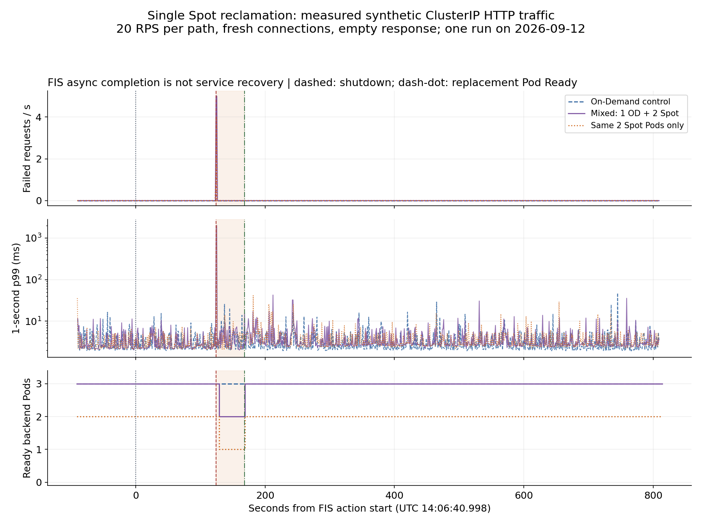

# EKS Spot Production Experiments and Result Assessment

> **Last Updated**: September 12, 2026
> **Measurement status**: PARTIALLY MEASURED — steady load, drain, one Spot reclamation, PDB blocking, and an explicit On-Demand transition. Section 7 provides results and raw records.
> **Scope**: Interruption-tolerant workloads on EKS Auto Mode, self-managed Karpenter, or EKS managed node groups

Assess Spot adoption by whether **service SLOs and data correctness survive node reclamation**, then by savings. Measure an On-Demand baseline and compare the availability and effective cost of a mixed configuration under equivalent load. Proposed numbers and durations in sections 1–6 are **experiment-design examples**. Section 7 separately identifies actual measurements; neither is an AWS guarantee.

The current decision is **HOLD production expansion — address errors during reclamation/transition, version compatibility, and interruption handling**. These synthetic HTTP measurements diagnose the installed configuration; they do not establish uninterrupted operation for a business service or a supported-version configuration.

## 1. Behavior and limits to verify

| Topic | Documented behavior or constraint | Experiment evidence |
|---|---|---|
| Spot notice | EC2 terminate/stop notices normally arrive two minutes before interruption, on a best-effort basis. Hibernation starts immediately. [S1] | Event delivery latency and behavior without a processed notice |
| Pod shutdown time | The two-minute window is not reserved for the application. Detection, eviction, hooks, and LB propagation consume time. Some MNG Pods may receive no termination signal. [S2] | Actual time between SIGTERM and exit, forced exits, failed requests |
| PDB | A PodDisruptionBudget limits voluntary disruption through the Eviction API. It cannot prevent instance loss or control Deployment rolling-update concurrency. [S3] | Evaluate voluntary drain and forced node loss separately |
| Replacement capacity | Node Ready and an application serving traffic are different milestones. [S2], [S4] | Node Ready → image pull → Pod Ready → LB target healthy → SLO recovery |
| Spot share | NodePool priority and allowed capacity types do not guarantee a fixed ratio. [S5] | Measure node, vCPU, Pod, and request shares separately |

### Paths by compute manager

| Compute manager | Capacity label | Interruption handling | On-Demand recovery |
|---|---|---|---|
| EKS Auto Mode | `karpenter.sh/capacity-type: spot` / `on-demand` | Observe managed functionality, Kubernetes events, and NodeClaims. Do not copy the OSS Karpenter installation procedure into Auto Mode. [S6] | Verify that both NodePool and Pod constraints permit On-Demand |
| Self-managed Karpenter | `karpenter.sh/capacity-type: spot` / `on-demand` | Verify EventBridge → SQS → Karpenter `--interruption-queue`, IAM, events, and controller logs. A rebalance recommendation alone has different handling from an interruption notice. [S4] | Allow `spot` and `on-demand` in the NodePool and compatible Pod selectors, affinity, and tolerations. [S5] |
| EKS managed node group (MNG) | `eks.amazonaws.com/capacityType: SPOT` / `ON_DEMAND` | Verify managed Capacity Rebalancing and actual ASG settings. Draining does not always wait for a Ready replacement. [S2] | A Spot MNG is Spot-only. Test a separate On-Demand MNG, Cluster Autoscaler configuration, and Pod eligibility. [S2] |

A NodePool disruption budget of `0` does not stop EC2 reclamation. Record voluntary Karpenter consolidation/drift separately from interruption. [S4] Installing a separate Node Termination Handler on Auto Mode is not a prerequisite for these experiments.

## 2. Environment and comparison groups

Start in a **designated test cluster** with the same deployment artifact, network, and load-balancer path as production. Do not default to an existing production cluster. Keep the load generator and telemetry collectors outside the reclamation target.

### Freeze this record before each run

| Field | Record |
|---|---|
| Run identity | Run ID, owner, UTC start/end, configuration Git SHA, FIS experiment ID |
| Platform | AWS account alias and Region, test cluster, Kubernetes/platform version, Auto Mode or Karpenter/CA version |
| Nodes | AMI/OS, architecture, instance types and AZs, NodePool/MNG configuration, limits, quotas, subnet IP headroom |
| Application | Image digest, replicas, requests/limits, HPA, PDB, placement, shutdown hooks, retries/timeouts |
| Traffic | Endpoint and operation, payload size, request rate/concurrency, keep-alive, retry policy, data seed |
| Telemetry | Collection interval, dashboard/log queries, raw client records, clock synchronization, retention location |
| Cost | Actual usage duration and rate basis per node, commitment-discount treatment, shared-cost allocation |

Keep real account IDs, internal endpoints, and customer data out of public results; retain traceability in access-controlled evidence. Use the same image architecture across groups. With MNG and Cluster Autoscaler, group instance types with similar vCPU/memory sizes. Avoid conflating changes in architecture or instance size with Spot effects. [S2]

### Comparison groups

| Group | Configuration | Purpose |
|---|---|---|
| A | On-Demand only | Baseline errors, latency, throughput, and cost at equivalent load |
| B | On-Demand minimum service capacity plus Spot expansion | Production candidate; compare continuity and cost |
| C | Spot only | Expose interruption and capacity risks; not a production recommendation |

An example B configuration is an **On-Demand-only Deployment with 3 replicas plus a Spot-only Deployment with 3 replicas**, served by a common Service. Give each Deployment a distinct, non-overlapping selector; share only the Service label. This does not imply a 50% node, cost, or request share.

Keep this fixed-share experiment separate from fallback testing with a **Spot-preferred Deployment that also permits On-Demand**. Spot-only selectors prevent Pods from moving to On-Demand even if nodes are available. Allowing both capacity types in one NodePool does not reserve minimum running On-Demand capacity. [S5]

Size the On-Demand floor from survival requirements, not an arbitrary percentage:

```text
Required surviving replicas = ceil(required degraded-mode RPS / per-Pod RPS meeting SLO)
Surviving replicas after failure = all replicas - replicas on reclaimed nodes
Requirement: surviving replicas >= required surviving replicas
```

For example, **assuming** each Pod sustains 100 RPS within the SLO and degraded-mode demand is 300 RPS, at least 3 replicas must survive. This arithmetic assumes sufficient CPU, memory, connections, and downstream capacity; it is not evidence that 3 replicas are sufficient in a real system. If AZ failure is in scope, also exclude On-Demand capacity in the failed AZ.

Initially hold HPA and voluntary consolidation settings constant, then restore production settings for a separate interaction test. Capture actual Pod placement: hostname/AZ topology spread, `DoNotSchedule`, `minDomains`, and PV zone constraints can prevent recovery. [S8]

## 3. Experiments and acceptance criteria

**Example common protocol**: Separate 10 minutes of warm-up, 15 minutes of steady load, injection/recovery, and 15 minutes after recovery. Start with at least five independent runs per fault scenario, varying the time and targeted instance type. This sample count does not establish production reliability.

**Example SLO**: Request error rate at most 0.1%, p99 at most 500 ms in one-minute windows, recovery within 120 seconds, and zero lost acknowledged work. Replace these with the service's agreed SLO and error budget before testing. Count timeouts, connection failures, and invalid response content as failures alongside HTTP errors. Report raw attempts separately from user-operation success after retries.

| ID | Hypothesis and stimulus | Procedure | Observation and decision |
|---|---|---|---|
| E0 | B meets the same SLO as A without faults | Equivalent representative load on A/B/C; exclude warm-up | Errors, latency distribution, successful throughput, actual Spot share |
| E1 | Drain and application shutdown work | Drain one test node through the Eviction API; restore afterward | PDB waiting, shutdown hooks, completion of in-flight work. **Not a substitute for Spot reclamation** |
| E2 | One Spot reclamation preserves SLO | Interrupt one actual Spot instance using the FIS procedure below | Notice→drain→replacement→service recovery, failures, forced termination |
| E3 | Concurrent reclamation preserves survival capacity | After E2 passes, explicitly target two Spot instances in the same AZ/type | Maximum concurrent unavailability, PDB blocking, survivors, loss. N/A if no such targets exist |
| E4 | On-Demand restores service when Spot is unavailable | First exercise an On-Demand-only deployment change; separately test capacity errors below | Score the transition drill separately from automatic capacity-error fallback |
| E5 | Recovery works without notice handling | In dedicated test infrastructure, break interruption handling or abruptly terminate the designated Spot VM in separate runs | Separate from normal notice testing; detection/rescheduling delays and work correctness without signals |
| E6 | Constraints and slow shutdown expose failures | Change one condition per run: blocking PDB, long preStop, Spot-only affinity, or AZ constraint | Detect the expected failure; diagnose, fix production settings, and repeat |
| E7 | Scaling and reclamation can overlap | Restore production HPA/CA/Karpenter settings; run E2 during representative peak demand | Pending Pods, quotas/IPs, image pull, time until new capacity meets SLO |
| E8 | Retried work preserves correctness | Use a fixed test job-ID set and run E2 during processing | Reconcile submitted/acknowledged/durable results; distinguish duplicate execution from duplicate effects |
| E9 | Cost improvement persists | Alternate comparable A/B periods or observe equivalent load long enough | Cost per successful operation including retries, duplicate capacity, and overhead; no performance regression |

E3 tests **concurrent Spot reclamation**. It does not reproduce a full AZ outage affecting networking, storage, and On-Demand capacity.

### E4: distinguish a transition drill from capacity failure

Changing a NodePool to On-Demand-only tests configuration, scheduling, and application startup. It **does not verify automatic fallback after EC2 returns insufficient Spot capacity**.

For controlled capacity errors, check whether the AWS FIS EC2 API insufficient-capacity or ASG insufficient-capacity action matches the provisioning path, using the [official action reference][S9] and current `get-action` output. Karpenter's Fleet calls, an MNG's ASG, and AWS-managed Auto Mode are different paths. Limit injection to the dedicated test role/ASG and AZ, and verify that it does not also block the On-Demand provisioning path.

If no reproducible injection method covers the actual path, leave **automatic fallback UNVERIFIED**. Natural capacity failures can provide supporting evidence. Restricting an instance type/AZ does not guarantee that a shortage will occur.

## 4. Reproduce E2: reclaim one Spot node using AWS FIS

### Prerequisites

Required tools: Bash, AWS CLI, kubectl, and jq.

1. Identify the test cluster and dedicated experiment NodePool/MNG. Inspect **all Pods** on the target node and exclude business workloads and shared controllers. Inventory required node DaemonSets and their resource overhead.
2. Prepare a reviewed FIS execution role and a CloudWatch stop alarm observing actual service errors/latency. Scope actions to designated experiment instances/tags; verify the `fis.amazonaws.com` trust relationship, `SourceAccount`/`SourceArn` restrictions, and the caller's `iam:PassRole` scope. [S10]
3. Verify that the alarm receives actual metrics and is `OK`. Exercise its transition before fault injection and record thresholds, evaluation periods, and missing-data behavior.
4. Start UTC-timestamped client load logs and Kubernetes/controller/LB observation **before injection**.

Set the following shell inputs only after identifying the test target:

```bash
export SPOT_PROFILE=''
export SPOT_REGION=''
export SPOT_CLUSTER=''
export SPOT_NODE=''
export SPOT_INSTANCE_ID=''
export SPOT_RUN_ID=''
export SPOT_FIS_ROLE_ARN=''
export SPOT_STOP_ALARM_ARN=''
```

Use a dedicated kubeconfig so the workstation's default current-context remains intact. Reconcile the cluster ARN, EC2 lifecycle, providerID, and Pods from the following read operations. A node label alone is not proof that EC2 capacity is Spot.

```bash
set -euo pipefail
: "${SPOT_PROFILE:?}" "${SPOT_REGION:?}" "${SPOT_CLUSTER:?}"
: "${SPOT_NODE:?}" "${SPOT_INSTANCE_ID:?}" "${SPOT_RUN_ID:?}"
: "${SPOT_FIS_ROLE_ARN:?}" "${SPOT_STOP_ALARM_ARN:?}"
umask 077
SPOT_RESULT_DIR=$(mktemp -d "$PWD/eks-spot-run.XXXXXX")
SPOT_KUBECONFIG="$SPOT_RESULT_DIR/kubeconfig"
spot_aws() { aws --profile "$SPOT_PROFILE" --region "$SPOT_REGION" --output json "$@"; }
spot_kubectl() { kubectl --kubeconfig "$SPOT_KUBECONFIG" "$@"; }

spot_aws eks update-kubeconfig --name "$SPOT_CLUSTER" \
  --kubeconfig "$SPOT_KUBECONFIG" --alias "$SPOT_CLUSTER"
spot_aws sts get-caller-identity > "$SPOT_RESULT_DIR/caller.json"
spot_aws eks describe-cluster --name "$SPOT_CLUSTER" \
  > "$SPOT_RESULT_DIR/cluster.json"
spot_kubectl get node "$SPOT_NODE" -o json \
  > "$SPOT_RESULT_DIR/node-before.json"
spot_kubectl get pods -A --field-selector "spec.nodeName=$SPOT_NODE" -o json \
  > "$SPOT_RESULT_DIR/pods-on-target.json"
spot_aws ec2 describe-instances --instance-ids "$SPOT_INSTANCE_ID" \
  > "$SPOT_RESULT_DIR/instance-before.json"

jq -e --arg id "$SPOT_INSTANCE_ID" \
  '.spec.providerID | endswith("/" + $id)' \
  "$SPOT_RESULT_DIR/node-before.json"
jq -e '[.Reservations[].Instances[]] |
  length == 1 and .[0].InstanceLifecycle == "spot" and .[0].State.Name == "running"' \
  "$SPOT_RESULT_DIR/instance-before.json"
```

Confirm that the account, Region, and cluster in `caller.json` and `cluster.json` match the designated test environment and that the node is dedicated to the experiment. Save the following JSON as `$SPOT_RESULT_DIR/fis-template.example.json`. The commands below replace example ARNs with the verified inputs before execution. Retain **one explicit resource ARN and COUNT(1)**.

```json
{
  "description": "E2: interrupt one isolated EKS Spot test node",
  "roleArn": "arn:aws:iam::111122223333:role/eks-spot-test-fis",
  "targets": {
    "oneSpotNode": {
      "resourceType": "aws:ec2:spot-instance",
      "resourceArns": ["arn:aws:ec2:ap-northeast-2:111122223333:instance/i-0123456789abcdef0"],
      "selectionMode": "COUNT(1)"
    }
  },
  "actions": {
    "interrupt": {
      "actionId": "aws:ec2:send-spot-instance-interruptions",
      "parameters": {"durationBeforeInterruption": "PT2M"},
      "targets": {"SpotInstances": "oneSpotNode"}
    }
  },
  "stopConditions": [
    {
      "source": "aws:cloudwatch:alarm",
      "value": "arn:aws:cloudwatch:ap-northeast-2:111122223333:alarm:eks-spot-test-slo"
    }
  ]
}
```

This FIS action actually interrupts the instance. It also emits a rebalance recommendation at the start, so E2 does not independently isolate interruption-notice handling. Do not interpret `durationBeforeInterruption` as an application grace period; record the actual event timestamps. [S7], [S9]

Read the template back and verify its target before starting. Do not assume an alarm stop or `stop-experiment` cancels an interruption already requested or restores a terminated instance. Stopping further injection and restoring service are separate operations. [S11]

```bash
SPOT_ACCOUNT_ID=$(jq -r '.Account' "$SPOT_RESULT_DIR/caller.json")
SPOT_PARTITION=$(jq -r '.Arn | split(":")[1]' "$SPOT_RESULT_DIR/caller.json")
SPOT_INSTANCE_ARN="arn:$SPOT_PARTITION:ec2:$SPOT_REGION:$SPOT_ACCOUNT_ID:instance/$SPOT_INSTANCE_ID"
jq --arg instance "$SPOT_INSTANCE_ARN" \
  --arg role "$SPOT_FIS_ROLE_ARN" --arg alarm "$SPOT_STOP_ALARM_ARN" \
  '.roleArn = $role |
   .targets.oneSpotNode.resourceArns = [$instance] |
   .stopConditions[0].value = $alarm' \
  "$SPOT_RESULT_DIR/fis-template.example.json" > "$SPOT_RESULT_DIR/fis-template.json"

SPOT_TEMPLATE_ID=$(spot_aws fis create-experiment-template \
  --cli-input-json "file://$SPOT_RESULT_DIR/fis-template.json" \
  --query experimentTemplate.id --output text)
spot_aws fis get-experiment-template --id "$SPOT_TEMPLATE_ID" \
  > "$SPOT_RESULT_DIR/template-resolved.json"

# Run after target review and telemetry startup: the test instance is reclaimed.
SPOT_EXPERIMENT_ID=$(spot_aws fis start-experiment \
  --experiment-template-id "$SPOT_TEMPLATE_ID" \
  --tags "RunId=$SPOT_RUN_ID" \
  --query experiment.id --output text)
spot_aws fis get-experiment --id "$SPOT_EXPERIMENT_ID" \
  > "$SPOT_RESULT_DIR/experiment-start.json"
spot_aws fis list-experiment-resolved-targets \
  --experiment-id "$SPOT_EXPERIMENT_ID" \
  > "$SPOT_RESULT_DIR/targets.json"
```

Query `get-experiment` until a terminal state and confirm that the resolved target is exactly the intended instance. `completed` means the fault action completed, **not that the service passed its SLO**. Do not pass a `failed`, `stopped`, or empty-target run. [S7]

## 5. Measurement and result records

### Observation timeline

| Time | Evidence |
|---|---|
| T0 | FIS action start and actual resolved target |
| T1 | EventBridge event `time`, observer receipt/processing times. Separately record approximate interruption time from IMDS `spot/instance-action` or an identified controller source only when available |
| T2 | Cordon/taint, eviction start, Pod SIGTERM/exit logs |
| T3 | Target EC2 state changes, replacement instance creation, Node Ready |
| T4 | Replacement Pod Ready, EndpointSlice state, LB target healthy |
| T5 | Start of five continuous minutes meeting agreed errors, latency, and throughput criteria |

Report recovery from **T0 to T5**, and separately from the first SLO violation to recovery. If the service stayed within its criteria throughout the run, service downtime is zero; report node/Pod replacement time separately. Missing instrumentation is not a zero-second recovery.

The EventBridge event has no separate scheduled-interruption-time field. IMDS provides an approximate time; mark it unavailable if it cannot be collected. Do not require Auto Mode node access just to populate this field. Label inferred times as estimates and record actual EC2 state changes at T3. [S1]

Retain Node/Pod JSON, events, PDB, EndpointSlice, and NodePool/MNG configuration before, during, and after injection. A single query after completion is insufficient because events expire and telemetry can arrive late. Add controller/SQS metrics for self-managed Karpenter, ASG activities for MNG, and available managed events for Auto Mode.

Do not judge success from LB 5xx metrics alone. Include client connection resets, timeouts, DNS failures, and response validation; identify failures hidden by retries. Calculate p99 from raw samples or merged histograms for each observation window; **do not average multiple p99 values into an overall p99**.

### Experiment status

See section 7 and the raw data for measurements. NOT RUN or UNVERIFIED is not a pass. Measurements cover synthetic HTTP requests; business-data loss and duplicate effects were not tested.

| Experiment | Actual scope | Status |
|---|---|---|
| E0 | 120 seconds of steady load across three observation paths | One run; 2,400 successes per path |
| E1 | Drain one dedicated Spot node; observe for 180 seconds | One run; 8 mixed-path failures |
| E2 | Reclaim one Spot instance through FIS; observe for 900 seconds | One run; 10 mixed-path failures |
| E3 | Concurrent reclamation | NOT RUN |
| E4 | Change Pod selectors to On-Demand; observe for 240 seconds | One run. Actual capacity-error automatic fallback remains UNVERIFIED |
| E5 | Abrupt loss or notice-delivery failure | NOT RUN |
| E6 | Reject eviction with PDB `minAvailable: 2`, then restore 1 | Partial. Shutdown-hook and AZ-constraint variants NOT RUN |
| E7 | Peak load and HPA interaction | NOT RUN |
| E8 | Business-work correctness | NOT RUN |
| E9 | Query instance-hour prices | Price snapshot only; actual bills and cost per successful operation NOT MEASURED |

Connect each run's `hypothesis → confirmed injection → observation → verdict → cause → correction → rerun ID`. Retain failed and excluded runs. Report individual runs, median, and worst case; disclose missed notices, collection failures, and saturated load generators.

### Cost calculation

```text
Effective cost =
  actual Spot/On-Demand usage cost
  + additional capacity consumed by replacement overlap and retries
  + allocated EBS, LB, transfer, telemetry, EKS/Auto Mode costs

Cost per successful operation = effective cost / unique successful operations passing correctness checks
Savings = 1 - (B cost per successful operation / A cost per successful operation)
```

**Do not double-count** replacement or retry capacity already included in actual EC2 charges. The second line is an attribution reminder to prevent omissions. State the allocation of fixed/shared EKS costs and report FIS experiment charges separately from recurring operational costs.

Label extrapolations from a short run to a month as **estimates**. A Spot discount alone is not an effective saving. Apply the same accounting basis to A's actual Savings Plans/RI discounts and unused commitments, and verify amounts against Region- and period-specific billing exports. [S12]

## 6. Adoption and rollback

### Decision

| Decision | Criteria |
|---|---|
| Ready to adopt | Agreed mandatory scenarios pass, representative load and correctness evidence exists, cost improves, On-Demand recovery drill passes |
| Conditional adoption | Explicit limitations, bounded workload/Spot share, evaluation period, and accountable owner for the canary |
| Hold expansion | Missing required experiments/evidence, SLO violations, lost work/duplicate effects, insufficient recovery capacity, or unverified automatic fallback |

Start with stateless APIs using external durable state and workers with verified retries/idempotency. Do not extend the same conclusion to quorum-dependent, local-state-dependent, or guaranteed-graceful-shutdown workloads without separate replication/recovery tests. Preserve survival capacity for cluster control and observability functions.

An example rollout is **test → one-service canary → expansion within the validated envelope**. Recheck actual Spot vCPU, Pod, and traffic shares and error-budget impact at each step. There is no default answer such as “70% Spot everywhere.”

### Rollback procedure

1. Stop new fault injection and Spot expansion. Request `stop-experiment` for a running FIS experiment and continue observing effects of reclamation already scheduled.
2. Apply the tested On-Demand configuration to the GitOps source. Make change ownership explicit so reconciliation does not overwrite an ad-hoc patch.
3. Check On-Demand limits, subnet IP headroom, and Pod constraints; expand the replacement Deployment. Verify Pod Ready, LB target health, and service SLO.
4. Once survival capacity exists, reduce the Spot-only Deployment in stages. Changing a NodePool's allowed capacity types alone does not immediately relocate existing Pods.
5. Recheck errors, latency, and work correctness; retain evidence. Do not expand Spot again until correction and retesting pass.

### Cleanup

Export evidence to access-controlled durable storage first. Compare before/after manifests and restore HPA, PDB, scheduling, and interruption-handling settings. Uncordon surviving E1 nodes when appropriate. Delete only FIS templates, alarms, test workloads, and dedicated nodes created for this experiment. Adjust desired capacity first so node managers do not recreate resources, and check remaining EBS/LB charges. `/tmp` is not a durable evidence store.

## 7. Measurements from 2026-09-12

### Environment and interpretation

A dedicated namespace, NodePools, and EC2NodeClass were created in an existing EKS test cluster. FIS targeted one newly created Spot instance. The existing Karpenter Pod configuration was identical before and after testing. Experiment resources were deleted and their removal verified after exporting evidence.

| Item | Actual configuration |
|---|---|
| Platform | EKS 1.36 / kubelet `1.36.3-eks-cb19647`, Karpenter `1.4.0` |
| Nodes | arm64 `c6g.large`, observed AZ ID `apne2-az1`, initially 1 On-Demand + 2 Spot nodes |
| Flexibility versus placement | Four instance types and two AZs were allowed; all initial nodes landed in one type and AZ |
| Application | Fortio `1.69.4`, pinned image digest, Pod requests `50m` / `64Mi`, 30-second termination grace, readiness every 2 seconds |
| Placement | Hostname anti-affinity for the two Spot Pods; PDB `minAvailable: 1` |
| Requests | 20 RPS per path, HTTP GET `/`, zero-byte response body, fresh connection per request, no retries |
| Measurement | Python 3.12 probe on a dedicated On-Demand Pod, per-request JSONL, Kubernetes observation about every 5 seconds, separate EventBridge observation queue |
| Stop alarm | Observed mixed-path errors above 5% or missing data, 10-second periods, 2 of 2 datapoints. Separate from the example 0.1% acceptance criterion |

**This is not validation of a supported-version configuration.** The checked official compatibility matrix requires Karpenter **1.13 or later** for Kubernetes 1.36. Installed version 1.4.0 is below that floor. The effect of upgrading was not measured. [S13]

Karpenter had no interruption queue configured. The newly created queue was an **observation queue** and was not connected to Karpenter. Do not generalize these results to Karpenter with interruption handling configured.

The On-Demand control had three Pods; the mixed path had one On-Demand and two Spot Pods. The Spot observation path selected the same two Spot Pods as the mixed path. Control Pods, the stable mixed Pod, and the probe shared an On-Demand node, so these are not independent cost or throughput comparison groups. E4's raw filename `spot-only` identifies the migrating Service; after transition it selects On-Demand Pods.

### Request results

Each scenario ran **once**. All planned requests were dispatched, with zero generator skips on every path. Failures include connection errors and socket timeouts as well as HTTP errors. p99 uses nearest rank over raw completed latencies, including failed requests.

| Trial / path | Requests | Failures | Overall error rate | Overall p99 | Worst 60-second error rate |
|---|---:|---:|---:|---:|---:|
| E0 / On-Demand control | 2,400 | 0 | 0% | 3.41 ms | 0% |
| E0 / Mixed | 2,400 | 0 | 0% | 4.90 ms | 0% |
| E0 / Spot observation path | 2,400 | 0 | 0% | 3.91 ms | 0% |
| E1 / On-Demand control | 3,600 | 0 | 0% | 5.93 ms | 0% |
| E1 / Mixed | 3,600 | 8 | 0.2222% | 3.30 ms | 0.5833% |
| E1 / Spot observation path | 3,600 | 1 | 0.0278% | 5.11 ms | 0.0833% |
| E2 / On-Demand control | 18,000 | 0 | 0% | 5.17 ms | 0% |
| E2 / Mixed | 18,000 | 10 | 0.0556% | 5.63 ms | 0.8333% |
| E2 / Spot observation path | 18,000 | 5 | 0.0278% | 5.09 ms | 0.4167% |
| E4 / On-Demand control | 4,800 | 0 | 0% | 5.60 ms | 0% |
| E4 / Mixed | 4,800 | 9 | 0.1875% | 6.20 ms | 0.5833% |
| E4 / Migrating cohort | 4,800 | 16 | 0.3333% | 6.99 ms | 1.3333% |

The worst 60-second error rate uses **fully observed 60-second windows advanced by one second**; partial end windows are excluded. E2's mixed path had an overall error rate of 0.0556% and p99 of 5.63ms, but its worst 60-second error rate was 0.8333%, exceeding the prewritten design example's 0.1% criterion. This was a diagnostic criterion, not an agreed business-service SLO.

E1 and E4 also had failed requests. A completed drain or rollout does not establish an error-free transition. The span from first failed-request start to last failed completion is **neither continuous downtime nor service recovery time**. Raw records retain all failures, including those at other times.



The chart covers E2's full observation window. Latency uses a logarithmic axis, with about 20 samples per second. Do not equate one-second p99 with overall p99. Shading spans reported node shutdown to replacement Pod Ready; it is not total service downtime.

### Reclamation timeline

| Observation | UTC time | Evidence |
|---|---|---|
| FIS action starts | 14:06:40.998 | FIS `startTime` |
| Interruption notice | 14:06:41 | EventBridge event `time` |
| FIS `completed` | 14:06:41.755 | FIS `endTime`, distinct from service recovery |
| kubelet reports shutdown / original Pod terminates | 14:08:45 | `KubeletNotReady`, `TerminationByKubelet` |
| Replacement NodeClaim created | 14:08:48.212 | Karpenter controller log |
| Replacement Node Ready | 14:09:23 | Node condition |
| Replacement Pod Ready | 14:09:29 | Pod condition |

The target remained schedulable in pre-reclamation observations after notice delivery. Its replacement NodeClaim was created after node shutdown. **Replacement Pod readiness followed the reported shutdown by 44 seconds**. This is neither service recovery time nor 44 seconds of continuous downtime. kubelet status established Pod termination; application SIGTERM receipt was not separately instrumented. Account for API sampling intervals and second-resolution event timestamps.

### Transition, pricing, and decision

The explicit On-Demand transition completed its rollout in **47.05 seconds**. Actual node labels confirmed that both migrating Pods were on On-Demand capacity. No EC2 capacity error was injected, so **automatic fallback remains unverified**.

A price query at 2026-09-12 14:08:41 UTC returned **$0.077 per instance-hour** for public On-Demand Linux `c6g.large` pricing and **$0.0248 per instance-hour** for Spot in the observed AZ. The unit-price difference is **67.79%**, not an actual bill or workload saving. Compare EBS, EKS, FIS, telemetry, commitments, retries, replacement capacity, and equivalent availability requirements as well.

Before expanding production use:

1. Align Karpenter with the Kubernetes compatibility matrix and validate the CRD, IAM, and upgrade path.
2. Configure the actual Karpenter interruption queue, EventBridge, and IAM path, then repeat reclamation tests. Receipt by the observation queue alone is insufficient.
3. Test application shutdown, readiness propagation, client retry policy, and the external LB path against request SLOs.
4. Verify surviving On-Demand capacity, AZ placement, real capacity-error fallback, and concurrent reclamation.
5. Obtain representative business load, correctness checks, repeated runs at different times, and effective-cost evidence.

The experiment namespace, two NodePools, EC2NodeClass, new instance profile, FIS template/role, alarm, EventBridge rule, and SQS queue were deleted. **Zero live experiment EC2 instances, remaining EBS volumes, or Kubernetes resources were verified.** Historical FIS execution records and metric data remain under AWS service retention.

[Measurement tools and tests](https://github.com/Atom-oh/kubernetes-docs/tree/main/examples/eks/spot-production) and [raw request records, summaries, and timelines](https://github.com/Atom-oh/kubernetes-docs/tree/main/examples/eks/spot-production/results/2026-09-12) are available. Public evidence omits account, node, and network identifiers; detailed infrastructure originals are retained separately.

## 8. Related guides and sources

- [Scaling strategies](./06-scaling-strategies.md)
- [Event capacity planning](./12-event-capacity-planning.md)
- [FinOps cost management](./13-finops-cost-platform.md)
- [Troubleshooting playbook](./16-troubleshooting-playbook.md)
- [Quiz for this guide](../quizzes/ops/17-spot-production-experiments-quiz.md)

Official documentation supports service-behavior claims; it is not evidence that this repository ran an experiment. Links checked: 2026-09-12.

[S1]: https://docs.aws.amazon.com/AWSEC2/latest/UserGuide/spot-instance-termination-notices.html
[S2]: https://docs.aws.amazon.com/eks/latest/userguide/managed-node-groups.html
[S3]: https://kubernetes.io/docs/concepts/workloads/pods/disruptions/
[S4]: https://karpenter.sh/docs/concepts/disruption/
[S5]: https://karpenter.sh/docs/concepts/nodepools/
[S6]: https://docs.aws.amazon.com/eks/latest/userguide/automode.html
[S7]: https://docs.aws.amazon.com/fis/latest/userguide/fis-tutorial-spot-interruptions.html
[S8]: https://kubernetes.io/docs/concepts/scheduling-eviction/topology-spread-constraints/
[S9]: https://docs.aws.amazon.com/fis/latest/userguide/fis-actions-reference.html
[S10]: https://docs.aws.amazon.com/fis/latest/userguide/getting-started-iam-service-role.html
[S11]: https://docs.aws.amazon.com/fis/latest/userguide/stop-experiment.html
[S12]: https://docs.aws.amazon.com/cur/latest/userguide/what-is-cur.html

[S13]: https://karpenter.sh/docs/upgrading/compatibility/
