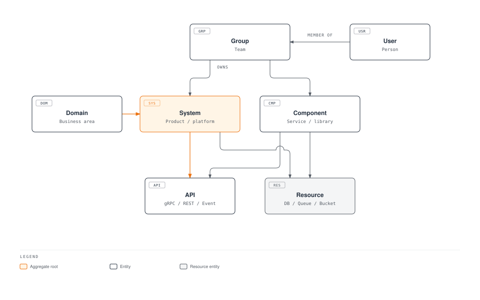
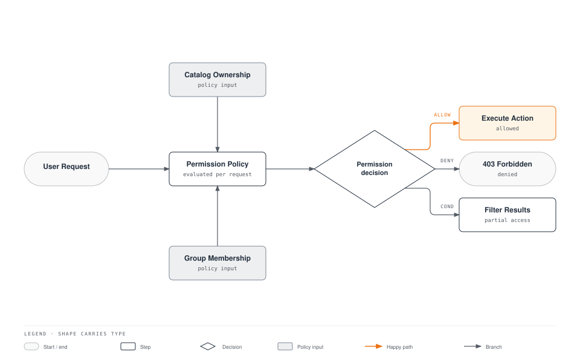

# Backstage: Internal Developer Platform Framework

> **Supported Versions**: Backstage 1.35+, Kubernetes 1.31+, EKS
> **Last Updated**: June 22, 2026

## Table of Contents

- [Overview](#overview)
- [Learning Objectives](#learning-objectives)
- [Backstage Architecture](#backstage-architecture)
- [EKS Deployment](#eks-deployment)
- [Software Catalog](#software-catalog)
- [Software Templates (Golden Paths)](#software-templates-golden-paths)
- [TechDocs](#techdocs)
- [Plugin Ecosystem for EKS](#plugin-ecosystem-for-eks)
- [RBAC and Governance](#rbac-and-governance)
- [Production Operations](#production-operations)
- [Best Practices](#best-practices)
- [References](#references)

---

## Overview

### What is an Internal Developer Platform (IDP)?

An Internal Developer Platform (IDP) is a self-service layer that sits between developers and the underlying infrastructure, providing standardized workflows for deploying applications, provisioning resources, and managing services. As described in the [Platform Engineering Overview](./00-platform-engineering-overview.md), an IDP enables developers to focus on writing code by abstracting away operational complexity.

An IDP typically provides:

- **Service Catalog**: A centralized registry of all services, APIs, and infrastructure components
- **Self-Service Workflows**: Templated processes for creating new services, databases, and environments
- **Documentation Hub**: Centralized, discoverable technical documentation
- **Visibility**: Real-time view of deployments, costs, ownership, and health across the organization

### Why Backstage?

Backstage is an open-source framework for building Internal Developer Platforms, originally created at Spotify and now a CNCF Incubating project. Spotify built Backstage to manage over 2,000 microservices across hundreds of engineering teams. After open-sourcing it in 2020, Backstage has become the most widely adopted IDP framework in the Kubernetes ecosystem.

Key reasons to choose Backstage:

1. **Open Source and Extensible**: MIT-licensed with a thriving plugin ecosystem of 200+ community plugins
2. **CNCF Backing**: Incubating project with strong governance, ensuring long-term sustainability
3. **Plugin Architecture**: Everything is a plugin, making it highly customizable without forking
4. **Software Catalog**: Centralized ownership registry that models your entire tech ecosystem
5. **Software Templates**: Golden Path scaffolding that enforces organizational standards from day one
6. **TechDocs**: Docs-like-code approach that keeps documentation alongside the code it describes
7. **Active Community**: Over 900 contributors, adopted by companies like American Airlines, Netflix, Zalando, and HP

### IDP Platform Comparison

| Criteria | Backstage | Port | Cortex | Humanitec | OpsLevel |
|----------|-----------|------|--------|-----------|----------|
| **License** | Open Source (MIT) | Commercial (free tier) | Commercial | Commercial | Commercial |
| **Hosting** | Self-hosted | SaaS | SaaS | SaaS + Agent | SaaS |
| **Customization** | Unlimited (plugin system) | API + Blueprints | Limited | Moderate | Moderate |
| **Kubernetes Native** | Strong (plugins) | API-based | Limited | Strong (Score) | API-based |
| **Setup Complexity** | High (DIY) | Low | Low | Medium | Low |
| **Community Ecosystem** | 200+ plugins | Growing marketplace | Limited | Growing | Limited |
| **Cost** | Infrastructure only | Per user/month | Per user/month | Per user/month | Per user/month |

> **Note**: Backstage requires more initial investment to set up compared to SaaS alternatives, but offers unmatched flexibility and zero licensing costs. For organizations already invested in Kubernetes and GitOps, Backstage integrates naturally into the existing ecosystem.

---

## Learning Objectives

After completing this document, you will be able to:

1. **Explain** the role of Backstage as an IDP framework within the Kubernetes platform engineering stack
2. **Deploy** Backstage on Amazon EKS using Helm, with RDS PostgreSQL and ALB ingress
3. **Configure** the Software Catalog to auto-discover services from GitHub repositories
4. **Create** Software Templates (Golden Paths) that scaffold microservices with CI/CD and infrastructure
5. **Integrate** Backstage with the Kubernetes plugin for real-time workload visibility on EKS
6. **Set up** TechDocs with S3 storage for centralized documentation
7. **Install and configure** plugins for ArgoCD, Kubecost, and other Kubernetes ecosystem tools
8. **Implement** RBAC and governance policies for multi-team environments
9. **Operate** Backstage in production with high availability, backup, and upgrade strategies

---

## Backstage Architecture

### High-Level Architecture


[🔍 View interactive diagram](https://www.atomai.click/kubernetes-docs/archmaps/en-platform-engineering-06-backstage-idp-1.html)

### Core Concepts

Backstage is built around four foundational pillars:

1. **Software Catalog**: A centralized, automatically updated inventory of all software in your organization. It tracks ownership, dependencies, APIs, documentation links, and operational metadata for every component.

2. **Software Templates**: Reusable scaffolding definitions (Golden Paths) that create new projects, services, or infrastructure with all organizational standards built in -- CI/CD pipelines, monitoring, security policies, and documentation structure.

3. **TechDocs**: A docs-like-code solution that renders Markdown documentation (via MkDocs) directly within the Backstage portal. Documentation lives in the same repository as the code, ensuring it stays up to date.

4. **Search**: A unified search platform that indexes the catalog, TechDocs, and any other data source, providing a single search bar for discovering anything in your engineering organization.

### Plugin Architecture

Backstage follows an "everything is a plugin" philosophy. Even core features like the Software Catalog are implemented as plugins. This architecture provides:

- **Frontend Plugins**: React components that render UI elements (pages, cards, tabs)
- **Backend Plugins**: Node.js modules that provide APIs, handle data processing, and integrate with external systems
- **Plugin Isolation**: Each plugin has its own database schema, API routes, and configuration
- **Composability**: Plugins can depend on and extend other plugins through well-defined extension points

```
┌─────────────────────────────────────────────────────────────────┐
│                     Backstage App Shell                         │
├─────────────────────────────────────────────────────────────────┤
│  ┌──────────┐  ┌──────────┐  ┌──────────┐  ┌──────────────┐   │
│  │ Catalog  │  │Templates │  │ TechDocs │  │   Search     │   │
│  │ Plugin   │  │ Plugin   │  │ Plugin   │  │   Plugin     │   │
│  └──────────┘  └──────────┘  └──────────┘  └──────────────┘   │
│  ┌──────────┐  ┌──────────┐  ┌──────────┐  ┌──────────────┐   │
│  │   K8s    │  │  ArgoCD  │  │ Kubecost │  │   Custom     │   │
│  │ Plugin   │  │  Plugin  │  │  Plugin  │  │   Plugins    │   │
│  └──────────┘  └──────────┘  └──────────┘  └──────────────┘   │
├─────────────────────────────────────────────────────────────────┤
│                    Plugin API / Extension Points                 │
├─────────────────────────────────────────────────────────────────┤
│                    Backend Services (Node.js)                    │
├─────────────────────────────────────────────────────────────────┤
│              PostgreSQL          │           S3 / Cache          │
└─────────────────────────────────────────────────────────────────┘
```

A plugin typically consists of:

| Component | Location | Purpose |
|-----------|----------|---------|
| **Frontend Plugin** | `plugins/<name>/` | React components, routes, API clients |
| **Backend Plugin** | `plugins/<name>-backend/` | Express routers, database access, external API calls |
| **Common** | `plugins/<name>-common/` | Shared types, constants, API definitions |
| **Node** | `plugins/<name>-node/` | Shared backend utilities, extension points |

---

## EKS Deployment

### Prerequisites

Before deploying Backstage on EKS, ensure the following resources are available:

| Resource | Purpose | Notes |
|----------|---------|-------|
| **EKS Cluster** | Backstage runtime | Kubernetes 1.31+ |
| **Amazon RDS (PostgreSQL)** | Persistent storage | PostgreSQL 15+, db.r6g.large or larger |
| **Amazon ECR** | Container image registry | Private repository for Backstage images |
| **AWS ALB** | Ingress controller | AWS Load Balancer Controller installed |
| **Amazon S3** | TechDocs storage | Bucket for generated documentation |
| **AWS Certificate Manager** | TLS certificate | For HTTPS on ALB |
| **Amazon Cognito or Okta** | OIDC authentication | Identity provider for user login |
| **GitHub App or Token** | Source code integration | For catalog discovery and template scaffolding |

### Step 1: Create the Backstage Application

Start by scaffolding a new Backstage application locally:

```bash
# Ensure Node.js 20+ and Yarn are installed
node --version   # v20.x or higher
yarn --version   # 4.x (Berry)

# Create a new Backstage app
npx @backstage/create-app@latest --skip-install
# When prompted, enter the app name: my-backstage-app

cd my-backstage-app

# Install dependencies
yarn install
```

The generated project structure:

```
my-backstage-app/
├── app-config.yaml              # Main configuration
├── app-config.production.yaml   # Production overrides
├── catalog-info.yaml            # Backstage's own catalog entry
├── package.json
├── packages/
│   ├── app/                     # Frontend (React)
│   │   ├── src/
│   │   └── package.json
│   └── backend/                 # Backend (Node.js)
│       ├── src/
│       └── package.json
├── plugins/                     # Custom plugins
└── yarn.lock
```

### Step 2: Containerize the Application

Create a multi-stage Dockerfile for production deployment:

```dockerfile
# Stage 1: Build the frontend and backend
FROM node:20-bookworm-slim AS build

WORKDIR /app

# Copy dependency files
COPY package.json yarn.lock .yarnrc.yml ./
COPY .yarn ./.yarn
COPY packages/app/package.json ./packages/app/
COPY packages/backend/package.json ./packages/backend/
COPY plugins/ ./plugins/

# Install all dependencies
RUN yarn install --immutable

# Copy the rest of the source
COPY . .

# Build the app
RUN yarn tsc
RUN yarn build:backend --config ../../app-config.yaml

# Stage 2: Production image
FROM node:20-bookworm-slim

# Install runtime dependencies for TechDocs
RUN apt-get update && \
    apt-get install -y --no-install-recommends \
      python3 python3-pip python3-venv git curl && \
    python3 -m pip install --break-system-packages \
      mkdocs-techdocs-core==1.4.* && \
    apt-get clean && \
    rm -rf /var/lib/apt/lists/*

# Create a non-root user
RUN useradd -m -u 1000 backstage
USER backstage
WORKDIR /app

# Copy the built backend bundle
COPY --from=build --chown=backstage:backstage /app/packages/backend/dist ./packages/backend/dist
COPY --from=build --chown=backstage:backstage /app/node_modules ./node_modules
COPY --from=build --chown=backstage:backstage /app/package.json ./

# Copy configuration files
COPY --chown=backstage:backstage app-config.yaml app-config.production.yaml ./

# Environment variables
ENV NODE_ENV=production

# Health check
HEALTHCHECK --interval=30s --timeout=5s --start-period=60s --retries=3 \
  CMD curl -f http://localhost:7007/healthcheck || exit 1

EXPOSE 7007

CMD ["node", "packages/backend/dist", "--config", "app-config.yaml", "--config", "app-config.production.yaml"]
```

Build and push the image to ECR:

```bash
# Authenticate to ECR
aws ecr get-login-password --region ap-northeast-2 | \
  docker login --username AWS --password-stdin \
  111122223333.dkr.ecr.ap-northeast-2.amazonaws.com

# Build and push
docker build -t backstage:latest .
docker tag backstage:latest \
  111122223333.dkr.ecr.ap-northeast-2.amazonaws.com/backstage:v1.35.0
docker push \
  111122223333.dkr.ecr.ap-northeast-2.amazonaws.com/backstage:v1.35.0
```

### Step 3: Deploy with Helm

Add the Backstage Helm chart repository and create a values file:

```bash
helm repo add backstage https://backstage.github.io/charts
helm repo update
```

Create a comprehensive `values.yaml`:

```yaml
# backstage-values.yaml
backstage:
  image:
    registry: 111122223333.dkr.ecr.ap-northeast-2.amazonaws.com
    repository: backstage
    tag: v1.35.0
    pullPolicy: IfNotPresent

  replicas: 2

  resources:
    requests:
      memory: 512Mi
      cpu: 250m
    limits:
      memory: 1Gi
      cpu: 1000m

  extraEnvVarsSecrets:
    - backstage-secrets

  appConfig:
    app:
      title: "My Company Developer Portal"
      baseUrl: https://backstage.example.com
    backend:
      baseUrl: https://backstage.example.com
      listen:
        port: 7007
      cors:
        origin: https://backstage.example.com
        methods: [GET, HEAD, PATCH, POST, PUT, DELETE]
        credentials: true
      database:
        client: pg
        connection:
          host: ${POSTGRES_HOST}
          port: ${POSTGRES_PORT}
          user: ${POSTGRES_USER}
          password: ${POSTGRES_PASSWORD}
          database: backstage
          ssl:
            require: true
            rejectUnauthorized: true

  podAnnotations:
    prometheus.io/scrape: "true"
    prometheus.io/port: "7007"
    prometheus.io/path: "/metrics"

  serviceAccount:
    create: true
    name: backstage
    annotations:
      eks.amazonaws.com/role-arn: arn:aws:iam::111122223333:role/backstage-irsa-role

ingress:
  enabled: true
  className: alb
  annotations:
    alb.ingress.kubernetes.io/scheme: internet-facing
    alb.ingress.kubernetes.io/target-type: ip
    alb.ingress.kubernetes.io/listen-ports: '[{"HTTPS":443}]'
    alb.ingress.kubernetes.io/certificate-arn: arn:aws:acm:ap-northeast-2:111122223333:certificate/abcd-1234-efgh
    alb.ingress.kubernetes.io/ssl-policy: ELBSecurityPolicy-TLS13-1-2-2021-06
    alb.ingress.kubernetes.io/healthcheck-path: /healthcheck
    alb.ingress.kubernetes.io/group.name: backstage
  hosts:
    - host: backstage.example.com
      paths:
        - path: /
          pathType: Prefix

postgresql:
  enabled: false  # Using external RDS

serviceAccount:
  create: true
  name: backstage
```

Deploy to EKS:

```bash
# Create the namespace
kubectl create namespace backstage

# Create the secrets (referencing values from AWS Secrets Manager or SSM)
kubectl create secret generic backstage-secrets \
  --namespace backstage \
  --from-literal=POSTGRES_HOST=backstage-db.cluster-xxxxxxx.ap-northeast-2.rds.amazonaws.com \
  --from-literal=POSTGRES_PORT=5432 \
  --from-literal=POSTGRES_USER=backstage \
  --from-literal=POSTGRES_PASSWORD='<secure-password>' \
  --from-literal=GITHUB_TOKEN='ghp_xxxxxxxxxxxxxxxxxxxx' \
  --from-literal=AUTH_OIDC_CLIENT_ID='<client-id>' \
  --from-literal=AUTH_OIDC_CLIENT_SECRET='<client-secret>'

# Install the chart
helm install backstage backstage/backstage \
  --namespace backstage \
  --values backstage-values.yaml \
  --wait --timeout 10m
```

### Step 4: ALB Ingress Configuration

If you prefer to manage the Ingress resource separately from the Helm chart, create it explicitly:

```yaml
# backstage-ingress.yaml
apiVersion: networking.k8s.io/v1
kind: Ingress
metadata:
  name: backstage
  namespace: backstage
  annotations:
    alb.ingress.kubernetes.io/scheme: internet-facing
    alb.ingress.kubernetes.io/target-type: ip
    alb.ingress.kubernetes.io/listen-ports: '[{"HTTPS":443}]'
    alb.ingress.kubernetes.io/certificate-arn: arn:aws:acm:ap-northeast-2:111122223333:certificate/abcd-1234-efgh
    alb.ingress.kubernetes.io/ssl-policy: ELBSecurityPolicy-TLS13-1-2-2021-06
    alb.ingress.kubernetes.io/healthcheck-path: /healthcheck
    alb.ingress.kubernetes.io/healthcheck-interval-seconds: "15"
    alb.ingress.kubernetes.io/healthy-threshold-count: "2"
    alb.ingress.kubernetes.io/unhealthy-threshold-count: "3"
    alb.ingress.kubernetes.io/group.name: backstage
    alb.ingress.kubernetes.io/tags: Environment=production,Team=platform
    alb.ingress.kubernetes.io/load-balancer-attributes: >-
      idle_timeout.timeout_seconds=120,
      routing.http.drop_invalid_header_fields.enabled=true
spec:
  ingressClassName: alb
  rules:
    - host: backstage.example.com
      http:
        paths:
          - path: /
            pathType: Prefix
            backend:
              service:
                name: backstage
                port:
                  number: 7007
```

```bash
kubectl apply -f backstage-ingress.yaml
```

### Step 5: PostgreSQL via RDS

The database connection is configured in `app-config.production.yaml`. The following example shows the complete database section with connection pooling and SSL:

```yaml
# app-config.production.yaml
backend:
  database:
    client: pg
    connection:
      host: ${POSTGRES_HOST}
      port: ${POSTGRES_PORT}
      user: ${POSTGRES_USER}
      password: ${POSTGRES_PASSWORD}
      database: backstage
      ssl:
        require: true
        rejectUnauthorized: true
    knexConfig:
      pool:
        min: 3
        max: 12
        acquireTimeoutMillis: 60000
        idleTimeoutMillis: 30000
    plugin:
      catalog:
        connection:
          database: backstage_plugin_catalog
      scaffolder:
        connection:
          database: backstage_plugin_scaffolder
      auth:
        connection:
          database: backstage_plugin_auth
      search:
        connection:
          database: backstage_plugin_search
```

> **Note**: Backstage supports per-plugin database isolation. Each plugin can use a separate database within the same PostgreSQL instance, improving security and simplifying backup and migration.

### Step 6: OIDC Authentication Setup

Backstage supports multiple authentication providers. Below are configurations for both Amazon Cognito and Okta.

#### Amazon Cognito Configuration

```yaml
# app-config.production.yaml
auth:
  environment: production
  providers:
    oidc:
      production:
        metadataUrl: https://cognito-idp.ap-northeast-2.amazonaws.com/<user-pool-id>/.well-known/openid-configuration
        clientId: ${AUTH_OIDC_CLIENT_ID}
        clientSecret: ${AUTH_OIDC_CLIENT_SECRET}
        authorizationUrl: https://<domain>.auth.ap-northeast-2.amazoncognito.com/oauth2/authorize
        tokenUrl: https://<domain>.auth.ap-northeast-2.amazoncognito.com/oauth2/token
        scope: openid profile email
        prompt: auto
  session:
    secret: ${AUTH_SESSION_SECRET}
```

#### Okta Configuration

```yaml
# app-config.production.yaml
auth:
  environment: production
  providers:
    okta:
      production:
        clientId: ${AUTH_OKTA_CLIENT_ID}
        clientSecret: ${AUTH_OKTA_CLIENT_SECRET}
        audience: https://dev-123456.okta.com
        authServerId: default
        idp: ${AUTH_OKTA_IDP_ID}
  session:
    secret: ${AUTH_SESSION_SECRET}
```

#### Sign-In Resolver Configuration

In the backend plugin code, configure how OIDC identities map to Backstage users:

```typescript
// packages/backend/src/plugins/auth.ts
import { createBackendModule } from '@backstage/backend-plugin-api';
import {
  authProvidersExtensionPoint,
  createOAuthProviderFactory,
} from '@backstage/plugin-auth-node';
import { oidcAuthenticator } from '@backstage/plugin-auth-backend-module-oidc-provider';

export const authModuleOidc = createBackendModule({
  pluginId: 'auth',
  moduleId: 'oidc',
  register(reg) {
    reg.registerInit({
      deps: { providers: authProvidersExtensionPoint },
      async init({ providers }) {
        providers.registerProvider({
          providerId: 'oidc',
          factory: createOAuthProviderFactory({
            authenticator: oidcAuthenticator,
            async signInResolver({ result }, ctx) {
              const email = result.userinfo.email;
              if (!email) {
                throw new Error('OIDC login did not provide an email');
              }
              return ctx.signInWithCatalogUser({
                filter: { 'spec.profile.email': email },
              });
            },
          }),
        });
      },
    });
  },
});
```

---

## Software Catalog

### Entity Model

The Backstage Software Catalog uses a well-defined entity model to represent your organization's software ecosystem. Understanding this model is essential for effective catalog management.



### Entity Types

| Entity Kind | Description | Example |
|-------------|-------------|---------|
| **Component** | A software component (service, website, library) | `order-service`, `payment-api` |
| **System** | A collection of components that form a product | `order-platform`, `data-pipeline` |
| **Domain** | A business domain grouping related systems | `commerce`, `fulfillment` |
| **API** | An interface exposed by a component | `order-api`, `payment-grpc` |
| **Resource** | Infrastructure dependencies | `order-db`, `events-queue` |
| **Group** | A team or organizational unit | `platform-team`, `commerce-team` |
| **User** | An individual person | `john.doe` |

### catalog-info.yaml Examples

#### Component Entity

```yaml
# catalog-info.yaml (in the service repository root)
apiVersion: backstage.io/v1alpha1
kind: Component
metadata:
  name: order-service
  description: Handles order creation, updates, and lifecycle management
  labels:
    app.kubernetes.io/name: order-service
  annotations:
    backstage.io/techdocs-ref: dir:.
    github.com/project-slug: my-org/order-service
    backstage.io/kubernetes-id: order-service
    argocd/app-name: order-service
    backstage.io/kubernetes-namespace: commerce
  tags:
    - java
    - spring-boot
    - grpc
  links:
    - url: https://grafana.example.com/d/order-service
      title: Grafana Dashboard
      icon: dashboard
    - url: https://runbook.example.com/order-service
      title: Runbook
      icon: docs
spec:
  type: service
  lifecycle: production
  owner: group:commerce-team
  system: order-platform
  providesApis:
    - order-api
  consumesApis:
    - payment-api
    - inventory-api
  dependsOn:
    - resource:order-db
    - resource:order-events-queue
```

#### System Entity

```yaml
apiVersion: backstage.io/v1alpha1
kind: System
metadata:
  name: order-platform
  description: End-to-end order management platform including order processing, payment, and fulfillment
  annotations:
    backstage.io/techdocs-ref: dir:.
  tags:
    - commerce
    - critical
spec:
  owner: group:commerce-team
  domain: commerce
```

#### Domain Entity

```yaml
apiVersion: backstage.io/v1alpha1
kind: Domain
metadata:
  name: commerce
  description: All systems related to the online commerce experience including ordering, payments, and fulfillment
spec:
  owner: group:commerce-leadership
```

#### API Entity

```yaml
apiVersion: backstage.io/v1alpha1
kind: API
metadata:
  name: order-api
  description: REST API for order management operations
  tags:
    - rest
    - json
spec:
  type: openapi
  lifecycle: production
  owner: group:commerce-team
  system: order-platform
  definition: |
    openapi: "3.0.0"
    info:
      title: Order API
      version: 1.0.0
    paths:
      /orders:
        get:
          summary: List orders
          responses:
            '200':
              description: A list of orders
        post:
          summary: Create an order
          responses:
            '201':
              description: Order created
      /orders/{orderId}:
        get:
          summary: Get order by ID
          parameters:
            - name: orderId
              in: path
              required: true
              schema:
                type: string
          responses:
            '200':
              description: Order details
```

#### Resource Entity

```yaml
apiVersion: backstage.io/v1alpha1
kind: Resource
metadata:
  name: order-db
  description: Aurora PostgreSQL cluster for order data
  annotations:
    aws.amazon.com/rds-cluster-id: order-db-cluster
  tags:
    - postgresql
    - aurora
spec:
  type: database
  owner: group:commerce-team
  system: order-platform
```

#### Group Entity

```yaml
apiVersion: backstage.io/v1alpha1
kind: Group
metadata:
  name: commerce-team
  description: Commerce engineering team responsible for the order platform
spec:
  type: team
  profile:
    displayName: Commerce Team
    email: commerce-team@example.com
    picture: https://avatars.example.com/commerce-team.png
  parent: engineering
  children: []
  members:
    - john.doe
    - jane.smith
    - alex.kim
```

#### User Entity

```yaml
apiVersion: backstage.io/v1alpha1
kind: User
metadata:
  name: john.doe
  description: Senior Backend Engineer
spec:
  profile:
    displayName: John Doe
    email: john.doe@example.com
    picture: https://avatars.example.com/john-doe.png
  memberOf:
    - commerce-team
```

### GitHub Auto-Discovery

The GitHub discovery plugin automatically finds `catalog-info.yaml` files across your GitHub organization:

```yaml
# app-config.yaml
catalog:
  providers:
    github:
      myOrgProvider:
        organization: my-org
        catalogPath: /catalog-info.yaml
        filters:
          branch: main
          repository: '.*'  # All repositories
        schedule:
          frequency:
            minutes: 30
          timeout:
            minutes: 3
  rules:
    - allow:
        - Component
        - System
        - Domain
        - API
        - Resource
        - Group
        - User
        - Template
        - Location
```

Install the required backend plugin:

```bash
# From the Backstage app root
yarn --cwd packages/backend add @backstage/plugin-catalog-backend-module-github
```

Register the module in the backend:

```typescript
// packages/backend/src/index.ts
import { createBackend } from '@backstage/backend-defaults';

const backend = createBackend();

// Core plugins
backend.add(import('@backstage/plugin-catalog-backend'));
backend.add(import('@backstage/plugin-catalog-backend-module-github'));
// ... other plugins

backend.start();
```

### Kubernetes Cluster Integration

The Kubernetes plugin shows real-time Pod, Deployment, and Service status directly in the Backstage catalog for each component.

#### Install the Kubernetes Plugin

```bash
# Frontend plugin
yarn --cwd packages/app add @backstage/plugin-kubernetes

# Backend plugin
yarn --cwd packages/backend add @backstage/plugin-kubernetes-backend
```

#### Configure the Backend

Register the Kubernetes backend plugin:

```typescript
// packages/backend/src/index.ts
backend.add(import('@backstage/plugin-kubernetes-backend'));
```

#### Configure EKS Cluster Access

```yaml
# app-config.yaml
kubernetes:
  serviceLocatorMethod:
    type: multiTenant
  clusterLocatorMethods:
    - type: config
      clusters:
        - name: production-eks
          url: https://ABCDEF1234567890.gr7.ap-northeast-2.eks.amazonaws.com
          authProvider: serviceAccount
          serviceAccountToken: ${K8S_PROD_SA_TOKEN}
          caData: ${K8S_PROD_CA_DATA}
          skipTLSVerify: false
          skipMetricsLookup: false
          dashboardUrl: https://console.aws.amazon.com/eks/home?region=ap-northeast-2#/clusters/production-eks
          dashboardApp: aws
        - name: staging-eks
          url: https://GHIJKL5678901234.gr7.ap-northeast-2.eks.amazonaws.com
          authProvider: serviceAccount
          serviceAccountToken: ${K8S_STAGING_SA_TOKEN}
          caData: ${K8S_STAGING_CA_DATA}
          skipTLSVerify: false
          skipMetricsLookup: false
```

#### ServiceAccount and RBAC for Backstage

Create a read-only ServiceAccount in each EKS cluster so Backstage can query workload status:

```yaml
# backstage-k8s-rbac.yaml
---
apiVersion: v1
kind: Namespace
metadata:
  name: backstage-system
---
apiVersion: v1
kind: ServiceAccount
metadata:
  name: backstage-reader
  namespace: backstage-system
---
apiVersion: v1
kind: Secret
metadata:
  name: backstage-reader-token
  namespace: backstage-system
  annotations:
    kubernetes.io/service-account.name: backstage-reader
type: kubernetes.io/service-account-token
---
apiVersion: rbac.authorization.k8s.io/v1
kind: ClusterRole
metadata:
  name: backstage-reader
rules:
  - apiGroups: [""]
    resources:
      - pods
      - services
      - configmaps
      - namespaces
      - endpoints
      - serviceaccounts
    verbs: ["get", "list", "watch"]
  - apiGroups: ["apps"]
    resources:
      - deployments
      - replicasets
      - statefulsets
      - daemonsets
    verbs: ["get", "list", "watch"]
  - apiGroups: ["batch"]
    resources:
      - jobs
      - cronjobs
    verbs: ["get", "list", "watch"]
  - apiGroups: ["networking.k8s.io"]
    resources:
      - ingresses
    verbs: ["get", "list", "watch"]
  - apiGroups: ["autoscaling"]
    resources:
      - horizontalpodautoscalers
    verbs: ["get", "list", "watch"]
  - apiGroups: ["metrics.k8s.io"]
    resources:
      - pods
      - nodes
    verbs: ["get", "list"]
---
apiVersion: rbac.authorization.k8s.io/v1
kind: ClusterRoleBinding
metadata:
  name: backstage-reader-binding
subjects:
  - kind: ServiceAccount
    name: backstage-reader
    namespace: backstage-system
roleRef:
  kind: ClusterRole
  name: backstage-reader
  apiGroup: rbac.authorization.k8s.io
```

```bash
# Apply to each target EKS cluster
kubectl apply -f backstage-k8s-rbac.yaml

# Retrieve the token for Backstage configuration
kubectl get secret backstage-reader-token \
  -n backstage-system \
  -o jsonpath='{.data.token}' | base64 -d
```

#### Annotate Components for Kubernetes Discovery

For the Kubernetes plugin to find the right workloads, annotate your catalog entities:

```yaml
# In catalog-info.yaml
metadata:
  annotations:
    backstage.io/kubernetes-id: order-service
    backstage.io/kubernetes-namespace: commerce
    backstage.io/kubernetes-label-selector: app=order-service
```

The plugin matches workloads by these annotations and displays Pods, Deployments, ReplicaSets, and HPA status directly on the component page.

---

## Software Templates (Golden Paths)

Software Templates enable platform teams to define standardized paths for creating new projects. These Golden Paths ensure every new service starts with the right structure, CI/CD pipeline, monitoring, and security configuration. For background on the Golden Path concept, see the [Platform Engineering Overview](./00-platform-engineering-overview.md).

### Template Structure

A Backstage template consists of:

1. **Parameters**: Input fields presented to the developer (forms)
2. **Steps**: Actions executed sequentially to scaffold the project
3. **Output**: Links and information shown after completion

```
template.yaml
├── parameters:     # What the developer fills in
│   ├── service name
│   ├── team/owner
│   ├── language
│   └── features (database, queue, etc.)
├── steps:          # What happens automatically
│   ├── fetch:template (scaffold files)
│   ├── publish:github (create repository)
│   ├── catalog:register (add to Backstage)
│   └── argocd:create-resources (set up CD)
└── output:         # What the developer sees
    ├── repository URL
    ├── catalog entity link
    └── ArgoCD app link
```

### Microservice Golden Path Template

This template scaffolds a complete microservice with a Dockerfile, Helm chart, ArgoCD Application, and GitHub Actions CI pipeline:

```yaml
# templates/microservice/template.yaml
apiVersion: scaffolder.backstage.io/v1beta3
kind: Template
metadata:
  name: microservice-golden-path
  title: Microservice Golden Path
  description: |
    Create a production-ready microservice with CI/CD pipeline,
    Kubernetes deployment, monitoring, and documentation scaffolding.
  tags:
    - recommended
    - microservice
    - kubernetes
spec:
  owner: group:platform-team
  type: service

  parameters:
    - title: Service Information
      required:
        - serviceName
        - owner
        - description
      properties:
        serviceName:
          title: Service Name
          type: string
          description: Unique name for the microservice (lowercase, hyphens only)
          pattern: "^[a-z][a-z0-9-]*$"
          maxLength: 40
          ui:autofocus: true
        description:
          title: Description
          type: string
          description: Brief description of what this service does
          maxLength: 200
        owner:
          title: Owner Team
          type: string
          description: The team that will own this service
          ui:field: OwnerPicker
          ui:options:
            catalogFilter:
              kind: Group
        system:
          title: System
          type: string
          description: The system this service belongs to
          ui:field: EntityPicker
          ui:options:
            catalogFilter:
              kind: System

    - title: Technical Configuration
      required:
        - language
        - port
      properties:
        language:
          title: Programming Language
          type: string
          enum:
            - java-spring
            - go
            - node-express
            - python-fastapi
          enumNames:
            - Java (Spring Boot 3)
            - Go (Gin)
            - Node.js (Express)
            - Python (FastAPI)
        port:
          title: Service Port
          type: integer
          default: 8080
          description: Port the service listens on
        enableDatabase:
          title: Enable Database
          type: boolean
          default: false
          description: Provision an Aurora PostgreSQL database via ACK
        enableQueue:
          title: Enable Message Queue
          type: boolean
          default: false
          description: Provision an SQS queue via ACK

    - title: Deployment Configuration
      required:
        - namespace
        - environment
      properties:
        namespace:
          title: Kubernetes Namespace
          type: string
          default: default
          description: Target namespace for deployment
        environment:
          title: Environment
          type: string
          enum:
            - dev
            - staging
            - production
          default: dev

    - title: Repository Configuration
      required:
        - repoUrl
      properties:
        repoUrl:
          title: Repository Location
          type: string
          ui:field: RepoUrlPicker
          ui:options:
            allowedHosts:
              - github.com
            allowedOwners:
              - my-org

  steps:
    # Step 1: Scaffold the project from a skeleton template
    - id: fetch-skeleton
      name: Fetch Project Skeleton
      action: fetch:template
      input:
        url: ./skeleton/${{ parameters.language }}
        targetPath: .
        values:
          serviceName: ${{ parameters.serviceName }}
          description: ${{ parameters.description }}
          owner: ${{ parameters.owner }}
          system: ${{ parameters.system }}
          port: ${{ parameters.port }}
          namespace: ${{ parameters.namespace }}
          environment: ${{ parameters.environment }}
          enableDatabase: ${{ parameters.enableDatabase }}
          enableQueue: ${{ parameters.enableQueue }}

    # Step 2: Generate the Helm chart
    - id: fetch-helm
      name: Generate Helm Chart
      action: fetch:template
      input:
        url: ./skeleton/helm-chart
        targetPath: ./deploy/helm
        values:
          serviceName: ${{ parameters.serviceName }}
          port: ${{ parameters.port }}
          namespace: ${{ parameters.namespace }}
          enableDatabase: ${{ parameters.enableDatabase }}
          enableQueue: ${{ parameters.enableQueue }}

    # Step 3: Generate GitHub Actions CI pipeline
    - id: fetch-ci
      name: Generate CI Pipeline
      action: fetch:template
      input:
        url: ./skeleton/github-actions/${{ parameters.language }}
        targetPath: ./.github/workflows
        values:
          serviceName: ${{ parameters.serviceName }}
          language: ${{ parameters.language }}

    # Step 4: Generate ArgoCD Application manifest
    - id: fetch-argocd
      name: Generate ArgoCD Application
      action: fetch:template
      input:
        url: ./skeleton/argocd-app
        targetPath: ./deploy/argocd
        values:
          serviceName: ${{ parameters.serviceName }}
          namespace: ${{ parameters.namespace }}
          environment: ${{ parameters.environment }}
          repoUrl: ${{ (parameters.repoUrl | parseRepoUrl).host }}/${{ (parameters.repoUrl | parseRepoUrl).owner }}/${{ (parameters.repoUrl | parseRepoUrl).repo }}

    # Step 5: Publish to GitHub
    - id: publish
      name: Create GitHub Repository
      action: publish:github
      input:
        repoUrl: ${{ parameters.repoUrl }}
        description: ${{ parameters.description }}
        defaultBranch: main
        protectDefaultBranch: true
        repoVisibility: internal
        collaborators:
          - team: ${{ parameters.owner | replace("group:", "") }}
            access: maintain
          - team: platform-team
            access: admin

    # Step 6: Register in Backstage catalog
    - id: register
      name: Register in Backstage Catalog
      action: catalog:register
      input:
        repoContentsUrl: ${{ steps['publish'].output.repoContentsUrl }}
        catalogInfoPath: /catalog-info.yaml

  output:
    links:
      - title: Source Code Repository
        url: ${{ steps['publish'].output.remoteUrl }}
      - title: Backstage Catalog Entity
        icon: catalog
        entityRef: ${{ steps['register'].output.entityRef }}
      - title: GitHub Actions CI
        url: ${{ steps['publish'].output.remoteUrl }}/actions
```

### Infrastructure Provisioning Template

This template creates AWS infrastructure resources through [ACK](./02-ack.md) and [KRO](./03-kro.md) Claims, giving developers self-service access to databases, caches, and queues:

```yaml
# templates/infrastructure/template.yaml
apiVersion: scaffolder.backstage.io/v1beta3
kind: Template
metadata:
  name: aws-infrastructure-provisioning
  title: AWS Infrastructure Provisioning
  description: |
    Self-service provisioning of AWS infrastructure resources (RDS, ElastiCache, SQS)
    using ACK controllers and KRO resource graphs on EKS.
  tags:
    - infrastructure
    - aws
    - self-service
spec:
  owner: group:platform-team
  type: resource

  parameters:
    - title: Resource Information
      required:
        - resourceName
        - owner
        - resourceType
      properties:
        resourceName:
          title: Resource Name
          type: string
          description: Name for the infrastructure resource
          pattern: "^[a-z][a-z0-9-]*$"
          maxLength: 40
        owner:
          title: Owner Team
          type: string
          ui:field: OwnerPicker
          ui:options:
            catalogFilter:
              kind: Group
        resourceType:
          title: Resource Type
          type: string
          enum:
            - aurora-postgresql
            - aurora-mysql
            - elasticache-redis
            - sqs-queue
            - s3-bucket
          enumNames:
            - Aurora PostgreSQL
            - Aurora MySQL
            - ElastiCache Redis
            - SQS Queue
            - S3 Bucket

    - title: Resource Configuration
      required:
        - environment
        - size
      properties:
        environment:
          title: Environment
          type: string
          enum:
            - dev
            - staging
            - production
          default: dev
        size:
          title: Instance Size
          type: string
          enum:
            - small
            - medium
            - large
          enumNames:
            - "Small (dev/test: db.t4g.medium, cache.t4g.small)"
            - "Medium (staging: db.r6g.large, cache.r6g.large)"
            - "Large (production: db.r6g.xlarge, cache.r6g.xlarge)"
          default: small
        namespace:
          title: Target Namespace
          type: string
          default: default
          description: Kubernetes namespace where the resource claim will be created

    - title: Database-Specific Options
      description: Only applicable for database resource types
      properties:
        dbName:
          title: Database Name
          type: string
          default: appdb
          description: Name of the initial database to create
        storageSize:
          title: Storage Size (GiB)
          type: integer
          default: 20
          minimum: 20
          maximum: 1000
        enableMultiAZ:
          title: Enable Multi-AZ
          type: boolean
          default: false
          description: Enable Multi-AZ deployment for high availability

  steps:
    # Step 1: Generate the KRO resource claim
    - id: generate-claim
      name: Generate Resource Claim
      action: fetch:template
      input:
        url: ./skeleton/infrastructure/${{ parameters.resourceType }}
        targetPath: ./infrastructure
        values:
          resourceName: ${{ parameters.resourceName }}
          environment: ${{ parameters.environment }}
          size: ${{ parameters.size }}
          namespace: ${{ parameters.namespace }}
          dbName: ${{ parameters.dbName }}
          storageSize: ${{ parameters.storageSize }}
          enableMultiAZ: ${{ parameters.enableMultiAZ }}
          owner: ${{ parameters.owner }}

    # Step 2: Publish to the infrastructure GitOps repository
    - id: publish
      name: Create Pull Request
      action: publish:github:pull-request
      input:
        repoUrl: github.com?owner=my-org&repo=infrastructure-gitops
        branchName: provision/${{ parameters.resourceName }}
        title: "Provision ${{ parameters.resourceType }}: ${{ parameters.resourceName }}"
        description: |
          ## Infrastructure Provisioning Request

          | Field | Value |
          |-------|-------|
          | Resource | ${{ parameters.resourceName }} |
          | Type | ${{ parameters.resourceType }} |
          | Environment | ${{ parameters.environment }} |
          | Size | ${{ parameters.size }} |
          | Owner | ${{ parameters.owner }} |

          Provisioned via Backstage Software Template.
        targetPath: claims/${{ parameters.namespace }}

    # Step 3: Register as a Resource entity in the catalog
    - id: register
      name: Register Resource in Catalog
      action: catalog:register
      input:
        repoContentsUrl: https://github.com/my-org/infrastructure-gitops/tree/main
        catalogInfoPath: /claims/${{ parameters.namespace }}/${{ parameters.resourceName }}/catalog-info.yaml

  output:
    links:
      - title: Pull Request
        url: ${{ steps['publish'].output.remoteUrl }}
      - title: Catalog Entity
        icon: catalog
        entityRef: ${{ steps['register'].output.entityRef }}
```

The generated KRO claim for an Aurora PostgreSQL database (created by the template skeleton):

```yaml
# claims/<namespace>/<resource-name>/kro-claim.yaml
apiVersion: kro.run/v1alpha1
kind: DatabaseClaim
metadata:
  name: order-db
  namespace: commerce
  labels:
    app.kubernetes.io/managed-by: backstage
    backstage.io/owner: group:commerce-team
    environment: production
spec:
  engine: aurora-postgresql
  engineVersion: "15.4"
  instanceClass: db.r6g.xlarge
  storageSize: 100
  multiAZ: true
  databaseName: appdb
  backupRetentionDays: 30
  deletionProtection: true
```

### ArgoCD Integration Plugin

To link Backstage templates with [ArgoCD](../gitops/argocd/02-applications.md) for automatic deployment, install the ArgoCD scaffolder action:

```bash
yarn --cwd packages/backend add @roadiehq/scaffolder-backend-argocd
```

```typescript
// packages/backend/src/index.ts
backend.add(import('@roadiehq/scaffolder-backend-argocd'));
```

Add ArgoCD configuration:

```yaml
# app-config.yaml
argocd:
  appLocatorMethods:
    - type: config
      instances:
        - name: main
          url: https://argocd.example.com
          token: ${ARGOCD_AUTH_TOKEN}
```

This enables templates to include ArgoCD steps:

```yaml
# In a template step
- id: create-argocd-app
  name: Create ArgoCD Application
  action: argocd:create-resources
  input:
    appName: ${{ parameters.serviceName }}-${{ parameters.environment }}
    argoInstance: main
    namespace: argocd
    repoUrl: ${{ steps['publish'].output.remoteUrl }}
    path: deploy/helm
    projectName: ${{ parameters.namespace }}
```

---

## TechDocs

TechDocs brings a "docs-like-code" experience to Backstage, rendering MkDocs-based Markdown documentation directly within the developer portal.

### How TechDocs Works

1. Documentation is written as Markdown files alongside source code
2. An `mkdocs.yml` configuration file defines the doc structure
3. TechDocs builds the documentation into static HTML
4. Built docs are stored in S3 (or GCS/Azure Blob) for serving
5. Developers read docs directly in the Backstage UI, associated with the owning component

### Configuration for S3 Storage

```yaml
# app-config.yaml
techdocs:
  builder: external
  generator:
    runIn: local
  publisher:
    type: awsS3
    awsS3:
      bucketName: backstage-techdocs
      region: ap-northeast-2
      bucketRootPath: /
      accountId: "111122223333"
      credentials:
        roleArn: arn:aws:iam::111122223333:role/backstage-techdocs-role
```

### S3 Bucket Policy

```json
{
  "Version": "2012-10-17",
  "Statement": [
    {
      "Sid": "BackstageTechDocsReadWrite",
      "Effect": "Allow",
      "Principal": {
        "AWS": "arn:aws:iam::111122223333:role/backstage-techdocs-role"
      },
      "Action": [
        "s3:GetObject",
        "s3:PutObject",
        "s3:DeleteObject",
        "s3:ListBucket"
      ],
      "Resource": [
        "arn:aws:s3:::backstage-techdocs",
        "arn:aws:s3:::backstage-techdocs/*"
      ]
    }
  ]
}
```

### MkDocs Configuration in Service Repositories

Each service that publishes TechDocs needs an `mkdocs.yml` at its root:

```yaml
# mkdocs.yml (in the service repository)
site_name: Order Service Documentation
site_description: Technical documentation for the Order Service
plugins:
  - techdocs-core
nav:
  - Home: index.md
  - Architecture: architecture.md
  - API Reference: api-reference.md
  - Runbook: runbook.md
  - ADRs:
      - ADR-001 Database Choice: adrs/001-database-choice.md
      - ADR-002 Event Schema: adrs/002-event-schema.md
```

The corresponding `catalog-info.yaml` annotation:

```yaml
metadata:
  annotations:
    backstage.io/techdocs-ref: dir:.
```

### External TechDocs Build Pipeline

For the `external` builder mode, set up a CI job that builds and publishes documentation on every merge:

```yaml
# .github/workflows/techdocs.yaml
name: Build and Publish TechDocs
on:
  push:
    branches: [main]
    paths:
      - 'docs/**'
      - 'mkdocs.yml'

jobs:
  publish-techdocs:
    runs-on: ubuntu-latest
    steps:
      - uses: actions/checkout@v4

      - name: Setup Python
        uses: actions/setup-python@v5
        with:
          python-version: '3.12'

      - name: Install dependencies
        run: pip install mkdocs-techdocs-core==1.4.*

      - name: Build TechDocs
        run: npx @techdocs/cli generate --no-docker

      - name: Configure AWS Credentials
        uses: aws-actions/configure-aws-credentials@v4
        with:
          role-to-assume: arn:aws:iam::111122223333:role/techdocs-publisher
          aws-region: ap-northeast-2

      - name: Publish TechDocs
        run: |
          npx @techdocs/cli publish \
            --publisher-type awsS3 \
            --storage-name backstage-techdocs \
            --entity default/Component/order-service \
            --awsRoleArn arn:aws:iam::111122223333:role/techdocs-publisher \
            --awsRegion ap-northeast-2
```

---

## Plugin Ecosystem for EKS

Backstage's plugin system is its greatest strength. The following plugins are particularly valuable for teams running workloads on Amazon EKS.

### Kubernetes Plugin

The Kubernetes plugin provides real-time visibility into Pod and Deployment status directly from the catalog entity page.

**What it shows:**

- Pod count and status (Running, Pending, CrashLoopBackOff)
- Deployment replica status (desired vs. available)
- Recent Pod events and error messages
- HPA current and target metrics
- Container resource utilization (CPU, memory)

**Frontend integration:**

```typescript
// packages/app/src/components/catalog/EntityPage.tsx
import { EntityKubernetesContent } from '@backstage/plugin-kubernetes';

// Add to the service entity page
const serviceEntityPage = (
  <EntityLayout>
    <EntityLayout.Route path="/" title="Overview">
      {/* overview content */}
    </EntityLayout.Route>
    <EntityLayout.Route path="/kubernetes" title="Kubernetes">
      <EntityKubernetesContent refreshIntervalMs={10000} />
    </EntityLayout.Route>
  </EntityLayout>
);
```

### ArgoCD Plugin

The ArgoCD plugin shows GitOps deployment sync status, health, and history for each component.

**Installation:**

```bash
# Frontend
yarn --cwd packages/app add @roadiehq/backstage-plugin-argo-cd

# Backend
yarn --cwd packages/backend add @roadiehq/backstage-plugin-argo-cd-backend
```

**Configuration:**

```yaml
# app-config.yaml
argocd:
  appLocatorMethods:
    - type: config
      instances:
        - name: main
          url: https://argocd.example.com
          token: ${ARGOCD_AUTH_TOKEN}
```

**Catalog annotation:**

```yaml
metadata:
  annotations:
    argocd/app-name: order-service
```

**Frontend integration:**

```typescript
// packages/app/src/components/catalog/EntityPage.tsx
import {
  EntityArgoCDOverviewCard,
  EntityArgoCDHistoryCard,
} from '@roadiehq/backstage-plugin-argo-cd';

// Add to the overview page
const overviewContent = (
  <Grid container spacing={3}>
    <Grid item md={6}>
      <EntityArgoCDOverviewCard />
    </Grid>
    <Grid item md={6}>
      <EntityArgoCDHistoryCard />
    </Grid>
  </Grid>
);
```

### Kubecost Plugin

The Kubecost plugin provides per-service cost visibility, showing how much each component costs in terms of compute, memory, and storage.

**Installation:**

```bash
yarn --cwd packages/app add @kubecost/backstage-plugin
yarn --cwd packages/backend add @kubecost/backstage-plugin-backend
```

**Configuration:**

```yaml
# app-config.yaml
kubecost:
  baseUrl: https://kubecost.example.com
  # Optional: filter by cluster
  clusterFilter: production-eks
```

**Catalog annotation:**

```yaml
metadata:
  annotations:
    kubecost.com/deployment-name: order-service
    kubecost.com/namespace: commerce
```

**Frontend integration:**

```typescript
// packages/app/src/components/catalog/EntityPage.tsx
import { EntityKubecostCard } from '@kubecost/backstage-plugin';

const overviewContent = (
  <Grid container spacing={3}>
    <Grid item md={6}>
      <EntityKubecostCard />
    </Grid>
  </Grid>
);
```

### KEDA and Karpenter Visibility (Custom Plugin Concept)

While there is no official Backstage plugin for KEDA or Karpenter, you can build a custom plugin that queries the Kubernetes API for ScaledObject and NodePool resources, then displays scaling metrics alongside the component.

**Custom plugin backend concept:**

```typescript
// plugins/keda-backend/src/router.ts
import { Router } from 'express';
import { Logger } from 'winston';
import { Config } from '@backstage/config';

export async function createRouter(options: {
  logger: Logger;
  config: Config;
}): Promise<Router> {
  const router = Router();

  router.get('/scaled-objects/:namespace/:name', async (req, res) => {
    const { namespace, name } = req.params;

    // Query the Kubernetes API for ScaledObject
    const scaledObject = await k8sClient.getNamespacedCustomObject(
      'keda.sh',
      'v1alpha1',
      namespace,
      'scaledobjects',
      name,
    );

    res.json({
      name: scaledObject.body.metadata.name,
      minReplicas: scaledObject.body.spec.minReplicaCount,
      maxReplicas: scaledObject.body.spec.maxReplicaCount,
      triggers: scaledObject.body.spec.triggers,
      currentReplicas: scaledObject.body.status?.currentReplicas,
    });
  });

  return router;
}
```

**Custom plugin frontend concept:**

```typescript
// plugins/keda/src/components/KedaCard.tsx
import React from 'react';
import { InfoCard, Progress } from '@backstage/core-components';
import { useEntity } from '@backstage/plugin-catalog-react';
import useAsync from 'react-use/lib/useAsync';

export const KedaScalingCard = () => {
  const { entity } = useEntity();
  const namespace =
    entity.metadata.annotations?.['backstage.io/kubernetes-namespace'];
  const name = entity.metadata.name;

  const { value, loading, error } = useAsync(async () => {
    const response = await fetch(
      `/api/keda/scaled-objects/${namespace}/${name}`,
    );
    return response.json();
  });

  if (loading) return <Progress />;
  if (error) return <div>Error loading KEDA data: {error.message}</div>;

  return (
    <InfoCard title="KEDA Autoscaling">
      <p>Min Replicas: {value?.minReplicas}</p>
      <p>Max Replicas: {value?.maxReplicas}</p>
      <p>Current Replicas: {value?.currentReplicas}</p>
      <p>Triggers: {value?.triggers?.length}</p>
    </InfoCard>
  );
};
```

### Plugin Summary

| Plugin | Purpose | Data Source | Installation |
|--------|---------|-------------|--------------|
| **@backstage/plugin-kubernetes** | Pod/Deployment status | Kubernetes API | Official |
| **@roadiehq/backstage-plugin-argo-cd** | Sync status, deploy history | ArgoCD API | Community (Roadie) |
| **@kubecost/backstage-plugin** | Per-service cost breakdown | Kubecost API | Community (Kubecost) |
| **Custom KEDA Plugin** | Autoscaler status | Kubernetes API (keda.sh CRDs) | Custom build |
| **Custom Karpenter Plugin** | Node provisioning status | Kubernetes API (karpenter.sh CRDs) | Custom build |
| **@backstage/plugin-techdocs** | Documentation viewer | S3 / GCS | Official |
| **@backstage/plugin-github-actions** | CI pipeline status | GitHub API | Official |

---

## RBAC and Governance

### Permission Framework Overview

Backstage includes a built-in permission framework that controls access to catalog entities, templates, and plugin features. The permission system is policy-based and integrates with the catalog's ownership model.



### Enabling the Permission Framework

```yaml
# app-config.yaml
permission:
  enabled: true
```

### Team-Based Access Control

Implement a custom permission policy that enforces ownership-based access:

```typescript
// packages/backend/src/plugins/permission.ts
import {
  PolicyDecision,
  AuthorizeResult,
  isPermission,
} from '@backstage/plugin-permission-common';
import {
  PermissionPolicy,
  PolicyQuery,
} from '@backstage/plugin-permission-node';
import {
  catalogEntityDeletePermission,
  catalogEntityCreatePermission,
} from '@backstage/plugin-catalog-common/alpha';
import {
  createCatalogConditionalDecision,
  catalogConditions,
} from '@backstage/plugin-catalog-backend/alpha';
import { BackstageIdentityResponse } from '@backstage/plugin-auth-node';
import { createBackendModule } from '@backstage/backend-plugin-api';
import { policyExtensionPoint } from '@backstage/plugin-permission-node/alpha';

class TeamBasedPermissionPolicy implements PermissionPolicy {
  async handle(
    request: PolicyQuery,
    user?: BackstageIdentityResponse,
  ): Promise<PolicyDecision> {
    // Platform team gets full access
    if (
      user?.identity.ownershipEntityRefs.includes(
        'group:default/platform-team',
      )
    ) {
      return { result: AuthorizeResult.ALLOW };
    }

    // Only owners can delete catalog entities
    if (isPermission(request.permission, catalogEntityDeletePermission)) {
      if (!user) {
        return { result: AuthorizeResult.DENY };
      }
      return createCatalogConditionalDecision(request.permission, {
        anyOf: user.identity.ownershipEntityRefs.map((ref) =>
          catalogConditions.isEntityOwner({ claims: [ref] }),
        ),
      });
    }

    // Everyone can create entities and view the catalog
    if (isPermission(request.permission, catalogEntityCreatePermission)) {
      return { result: AuthorizeResult.ALLOW };
    }

    // Default: allow read operations
    return { result: AuthorizeResult.ALLOW };
  }
}

export const permissionModule = createBackendModule({
  pluginId: 'permission',
  moduleId: 'team-based-policy',
  register(reg) {
    reg.registerInit({
      deps: { policy: policyExtensionPoint },
      async init({ policy }) {
        policy.setPolicy(new TeamBasedPermissionPolicy());
      },
    });
  },
});
```

### Governance Rules Examples

| Rule | Implementation | Scope |
|------|---------------|-------|
| **Only owners can delete entities** | Conditional permission on `catalogEntityDeletePermission` | Catalog |
| **Only platform team can create templates** | DENY `templateCreatePermission` unless in platform-team group | Scaffolder |
| **Read-only for external contractors** | DENY all write permissions for contractor group | Global |
| **Template execution requires approval** | Custom approval workflow step in templates | Scaffolder |
| **Production deployments restricted** | Conditional permission based on entity lifecycle | Catalog + ArgoCD |

### Audit Logging

Backstage supports audit logging to track who did what. Configure the audit log backend:

```yaml
# app-config.yaml
backend:
  audit:
    enabled: true
    logger:
      type: winston
      options:
        transports:
          - type: console
            level: info
          - type: file
            level: info
            filename: /var/log/backstage/audit.log
            maxsize: 10485760
            maxFiles: 10
```

For production environments, ship audit logs to CloudWatch:

```yaml
# app-config.yaml
backend:
  audit:
    enabled: true
    logger:
      type: winston
      options:
        transports:
          - type: cloudwatch
            level: info
            logGroupName: /backstage/audit
            logStreamName: backstage-production
            region: ap-northeast-2
```

Audit log entries capture:

- **Who**: The authenticated user identity
- **What**: The action performed (entity created, template executed, entity deleted)
- **When**: Timestamp of the action
- **Where**: The target entity or resource
- **Result**: Success or failure with error details

---

## Production Operations

### High Availability Configuration

For production deployments, run multiple Backstage replicas behind the ALB with shared external PostgreSQL:

```yaml
# backstage-values.yaml (HA configuration)
backstage:
  replicas: 3

  resources:
    requests:
      memory: 1Gi
      cpu: 500m
    limits:
      memory: 2Gi
      cpu: 2000m

  podDisruptionBudget:
    enabled: true
    minAvailable: 2

  affinity:
    podAntiAffinity:
      preferredDuringSchedulingIgnoredDuringExecution:
        - weight: 100
          podAffinityTerm:
            labelSelector:
              matchExpressions:
                - key: app.kubernetes.io/name
                  operator: In
                  values:
                    - backstage
            topologyKey: topology.kubernetes.io/zone

  topologySpreadConstraints:
    - maxSkew: 1
      topologyKey: topology.kubernetes.io/zone
      whenUnsatisfiable: DoNotSchedule
      labelSelector:
        matchLabels:
          app.kubernetes.io/name: backstage

  livenessProbe:
    httpGet:
      path: /healthcheck
      port: 7007
    initialDelaySeconds: 60
    periodSeconds: 10
    failureThreshold: 3

  readinessProbe:
    httpGet:
      path: /healthcheck
      port: 7007
    initialDelaySeconds: 30
    periodSeconds: 5
    failureThreshold: 3

postgresql:
  enabled: false  # External RDS with Multi-AZ
```

**Architecture for HA deployment:**

```
┌─────────────────────────────────────────────────────────────┐
│                        ALB (internet-facing)                 │
│                      backstage.example.com                   │
└──────────┬──────────────────┬──────────────────┬────────────┘
           │                  │                  │
    ┌──────▼──────┐    ┌──────▼──────┐    ┌──────▼──────┐
    │ Backstage   │    │ Backstage   │    │ Backstage   │
    │ Pod (AZ-a)  │    │ Pod (AZ-b)  │    │ Pod (AZ-c)  │
    └──────┬──────┘    └──────┬──────┘    └──────┬──────┘
           │                  │                  │
           └──────────────────┼──────────────────┘
                              │
                    ┌─────────▼─────────┐
                    │   RDS PostgreSQL   │
                    │   (Multi-AZ)       │
                    └───────────────────┘
```

### Backup and Recovery Strategy

| Component | Backup Method | Frequency | Retention |
|-----------|--------------|-----------|-----------|
| **PostgreSQL (RDS)** | Automated RDS snapshots | Daily | 30 days |
| **PostgreSQL (RDS)** | Point-in-time recovery | Continuous | 35 days |
| **TechDocs (S3)** | S3 versioning + cross-region replication | Continuous | 90 days |
| **Configuration** | Git repository (app-config.yaml) | Every commit | Indefinite |
| **Catalog entities** | Git repositories (catalog-info.yaml) | Every commit | Indefinite |
| **Secrets** | AWS Secrets Manager with rotation | On change | Versioned |

**RDS backup configuration (Terraform example):**

```hcl
resource "aws_rds_cluster" "backstage" {
  cluster_identifier      = "backstage-db"
  engine                  = "aurora-postgresql"
  engine_version          = "15.4"
  master_username         = "backstage"
  database_name           = "backstage"
  backup_retention_period = 30
  preferred_backup_window = "03:00-04:00"
  deletion_protection     = true
  storage_encrypted       = true
  kms_key_id              = aws_kms_key.backstage.arn

  copy_tags_to_snapshot = true

  tags = {
    Environment = "production"
    Service     = "backstage"
    ManagedBy   = "terraform"
  }
}
```

**Disaster recovery procedure:**

1. **Database corruption or loss**: Restore from the most recent RDS automated snapshot or use point-in-time recovery to a specific timestamp
2. **TechDocs loss**: S3 versioning allows recovery of any previous version; cross-region replica provides regional failover
3. **Configuration drift**: All configuration is in Git; redeploy from the known-good commit
4. **Catalog data loss**: Catalog entities are defined in Git repositories; re-trigger the GitHub discovery provider to repopulate

### Upgrade Strategy

Backstage releases new versions frequently (roughly monthly). Follow this upgrade strategy:

1. **Pin versions explicitly**: Always use exact version tags in your Dockerfile and package.json, never `latest`
2. **Read the changelog**: Review the [Backstage changelog](https://github.com/backstage/backstage/blob/master/CHANGELOG.md) for breaking changes before upgrading
3. **Upgrade incrementally**: Do not skip major versions; upgrade one minor version at a time
4. **Test in staging**: Deploy to a staging environment with a copy of the production database schema first
5. **Rolling updates**: Use Kubernetes rolling update strategy with readiness probes to ensure zero downtime

```yaml
# Deployment strategy in values.yaml
backstage:
  strategy:
    type: RollingUpdate
    rollingUpdate:
      maxUnavailable: 0
      maxSurge: 1
```

**Upgrade workflow:**

```bash
# 1. Update Backstage packages
yarn backstage-cli versions:bump --release 1.36.0

# 2. Run database migrations
yarn backstage-cli db:migrate

# 3. Build and test locally
yarn build:backend
yarn test

# 4. Build new container image
docker build -t backstage:v1.36.0 .

# 5. Push to ECR
docker tag backstage:v1.36.0 \
  111122223333.dkr.ecr.ap-northeast-2.amazonaws.com/backstage:v1.36.0
docker push \
  111122223333.dkr.ecr.ap-northeast-2.amazonaws.com/backstage:v1.36.0

# 6. Update Helm values and upgrade
helm upgrade backstage backstage/backstage \
  --namespace backstage \
  --set backstage.image.tag=v1.36.0 \
  --values backstage-values.yaml \
  --wait --timeout 10m
```

---

## Best Practices

### Recommended Practices

1. **Start with the Software Catalog**: Before building templates or installing plugins, invest in a complete and accurate catalog. A well-populated catalog is the foundation that makes everything else valuable. Begin by registering all existing services with correct ownership.

2. **Treat Backstage as an Internal Product**: Assign a product owner, gather developer feedback, iterate on features, and track adoption metrics. The platform team is a product team whose customers are the other engineering teams.

3. **Define Golden Paths, Not Golden Cages**: Templates should encode best practices and organizational standards, but always allow developers to deviate when they have a valid reason. The goal is to make the right thing the easy thing, not the only thing.

4. **Automate Catalog Population**: Use the GitHub discovery plugin to automatically find and register `catalog-info.yaml` files rather than requiring manual registration. This reduces friction and keeps the catalog current.

5. **Keep app-config.yaml in Version Control**: Never hand-edit configuration on the running cluster. All Backstage configuration should be in a Git repository, deployed through the same CI/CD pipeline as the application itself.

6. **Invest in Documentation (TechDocs)**: A developer portal without documentation is just a dashboard. Make TechDocs a requirement for every service -- include it in your Golden Path templates so new services ship with documentation scaffolding from day one.

7. **Monitor Backstage Itself**: Expose Prometheus metrics from the Backstage backend, set up dashboards for API latency, error rates, and plugin health. Use the same observability stack you provide to your developers.

8. **Plan for Plugin Maintenance**: Community plugins may lag behind Backstage core releases. Pin plugin versions, test upgrades in staging, and maintain a list of which plugins are critical to your deployment.

### Common Pitfalls

1. **Building Too Much, Too Fast**: Attempting to deploy Backstage with every plugin on day one leads to complexity and delays. Start with the catalog and one template, then add plugins incrementally based on developer feedback.

2. **Neglecting Ownership Data**: A catalog with missing or incorrect ownership information undermines trust. If developers cannot find who owns a service, they stop using the catalog. Enforce ownership through CI checks on `catalog-info.yaml`.

3. **Ignoring Authentication from the Start**: Deploying Backstage without proper OIDC authentication, even in staging, creates security gaps and makes it harder to implement RBAC later. Configure authentication before exposing Backstage to users.

4. **Treating Backstage as Read-Only**: The real power of Backstage is in Software Templates and self-service workflows, not just viewing catalog data. If developers can see their services but cannot create new ones through the portal, adoption will stall.

---

## References

### Official Documentation

- [Backstage Official Documentation](https://backstage.io/docs/overview/what-is-backstage)
- [Backstage GitHub Repository](https://github.com/backstage/backstage)
- [Backstage Plugin Marketplace](https://backstage.io/plugins)
- [Backstage Helm Chart](https://github.com/backstage/charts)

### CNCF and Community

- [CNCF Backstage Project Page](https://www.cncf.io/projects/backstage/)
- [CNCF Platform White Paper](https://tag-app-delivery.cncf.io/whitepapers/platforms/)
- [Backstage Community Sessions](https://github.com/backstage/community)

### AWS and EKS Integration

- [AWS EKS Best Practices Guide](https://aws.github.io/aws-eks-best-practices/)
- [AWS Load Balancer Controller Documentation](https://kubernetes-sigs.github.io/aws-load-balancer-controller/)
- [Amazon Cognito Developer Guide](https://docs.aws.amazon.com/cognito/latest/developerguide/)

### Related Documentation in This Repository

- [Platform Engineering Overview](./00-platform-engineering-overview.md) -- IDP concepts, maturity model, and reference architecture
- [Helm Package Manager](./01-helm.md) -- Helm chart packaging used for Backstage deployment
- [AWS Controllers for Kubernetes (ACK)](./02-ack.md) -- Infrastructure provisioning through Kubernetes API
- [Kubernetes Resource Operator (KRO)](./03-kro.md) -- Resource graph orchestration for self-service claims
- [Kubernetes Extension Mechanisms](./04-kubernetes-extensions.md) -- CRDs and operators that power Backstage plugins
- [ExampleCorp Integration Example](./05-example-corp-app.md) -- End-to-end ACK + KRO deployment example
- [Crossplane](./07-crossplane.md) -- Infrastructure as Code via Kubernetes API; integrates with Backstage for self-service
- [ArgoCD Applications](../gitops/argocd/02-applications.md) -- GitOps deployment integrated with Backstage templates
