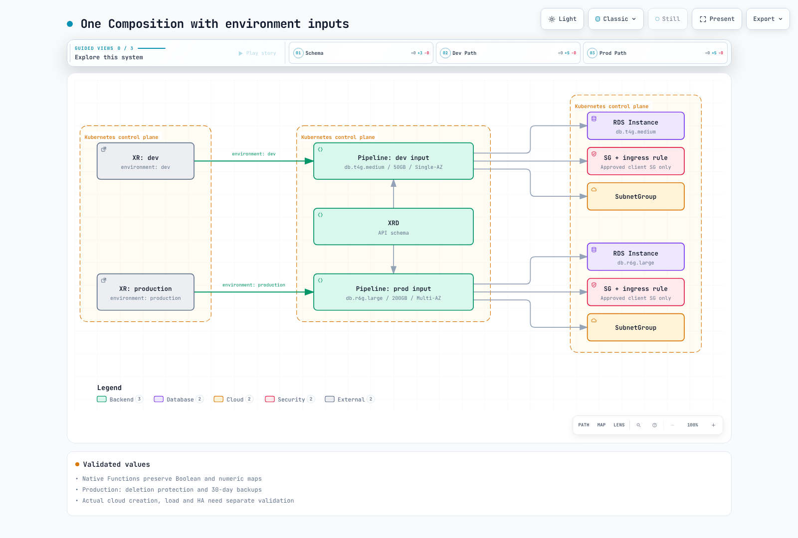
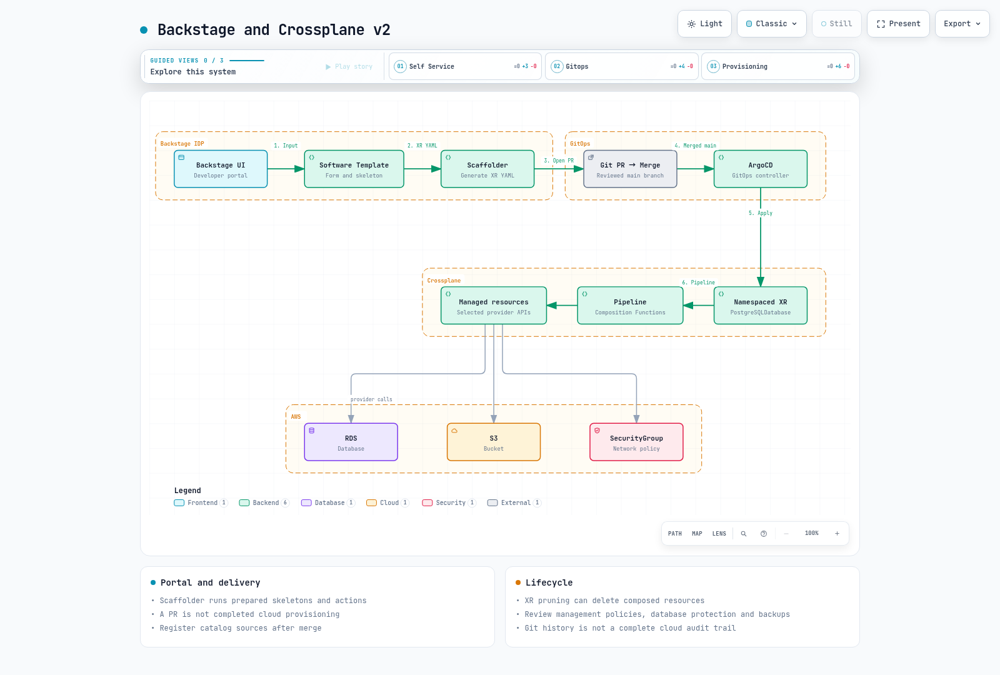

# Crossplane

> **Last Updated**: September 13, 2026 · Crossplane 2.4.0 / AWS provider 2.7.0

## Concepts and v2 Changes

Crossplane reconciles infrastructure and application resources through Kubernetes APIs and controllers. It joined CNCF on June 25, 2020, became Incubating on September 14, 2021 and Graduated on October 28, 2025. The conflicting 2023/2024 graduation claims have been corrected.

| Component | Role and current scope |
| --- | --- |
| Provider | Installs CRDs/controllers as a package. Select service-specific AWS packages; one package need not cover every AWS API. |
| Managed Resource (MR) | Provider API managing an external resource. The v2 examples here are namespaced. |
| Composite Resource (XR) | Instance of a platform API. XRD v2 defaults to Namespaced. |
| XRD | Defines XR schemas and scope; distinguish v1 LegacyCluster from v2 Namespaced. |
| Composition | Defines a Function pipeline calculating desired resources and status from XR inputs. |
| Claim | Namespaced interface for legacy cluster-scoped XRs, not a mandatory layer for new namespaced XRs. |


[Interactive diagram](https://www.atomai.click/kubernetes-docs/archmaps/en-platform-engineering-07-crossplane-0.html)

Existing v1 XRDs can continue using LegacyCluster Claims, and legacy cluster-scoped MRs remain supported. Do not merely change the core version while retaining removed Resources-mode Compositions, ControllerConfig or XR-native connection publication. The official v2 migration guide describes preparation from 1.20.

Terraform also uses declarative desired state and can automate plan/apply in CI. The primary difference is execution workflow versus continuous controller reconciliation. Crossplane behavior still depends on managementPolicies, supported fields, errors and quotas; it does not immediately repair every drift.

## Core, Providers and Permissions

The reviewed Helm chart is 2.4.0. This command inspects it offline without installing into a cluster.

```bash
helm repo add crossplane-stable https://charts.crossplane.io/stable
helm repo update
helm template crossplane crossplane-stable/crossplane   --version 2.4.0 --namespace crossplane-system   --set metrics.enabled=true
```

Current provider.defaultActivations defaults to ["*"]. Review MRDs, ManagedResourceActivationPolicies and installed service scope when deciding which APIs to activate. Installed Providers do not establish successful AWS authentication or resource readiness.

The IAM role below is a placeholder. Restrict trust to the exact EKS issuer, audience and ServiceAccount subject, and scope service actions/resources. Adding RequestedRegion to s3:*/rds:*/ec2:*/iam:* does not make it least privilege. RDS and EC2 Providers need their own reviewed runtime/identity configurations.

```yaml
apiVersion: pkg.crossplane.io/v1beta1
kind: DeploymentRuntimeConfig
metadata:
  name: provider-aws-s3-reviewed
spec:
  deploymentTemplate:
    spec:
      selector: {}
      template:
        spec:
          containers:
          - name: package-runtime
            resources:
              requests:
                cpu: 100m
                memory: 256Mi
              limits:
                cpu: 500m
                memory: 512Mi
            ports:
            - name: metrics
              containerPort: 8080
        metadata:
          labels:
            app: provider-aws-s3-reviewed
  serviceAccountTemplate:
    metadata:
      name: provider-aws-s3-reviewed
      annotations:
        eks.amazonaws.com/role-arn: arn:aws:iam::123456789012:role/ReplaceApprovedS3ProviderRole
---
apiVersion: pkg.crossplane.io/v1
kind: Provider
metadata:
  name: provider-aws-s3
spec:
  package: xpkg.crossplane.io/crossplane-contrib/provider-aws-s3:v2.7.0
  packagePullPolicy: IfNotPresent
  revisionActivationPolicy: Manual
  revisionHistoryLimit: 2
  runtimeConfigRef:
    name: provider-aws-s3-reviewed
```

Do not configure several Providers to own the same fixed ServiceAccount. packagePullPolicy governs fetching; revisionActivationPolicy governs activation. With Manual, inspect ProviderRevisions and explicitly activate the reviewed version as required.

The 2.7.0 S3 manifests were accessible from community and Upbound registries, but their digests differed. Matching version strings do not imply identical artifacts. Pin the selected distribution, registry/digest and support expectations.

This example uses a namespaced ProviderConfig with IRSA. Schema 2.7.0 also supports PodIdentity, requiring its actual association/SDK/runtime setup. Per-namespace ProviderConfigs alone do not separate AWS permissions; constrain configuration writes, references and role-assumption boundaries.

```yaml
apiVersion: aws.m.upbound.io/v1beta1
kind: ProviderConfig
metadata:
  name: team-aws
  namespace: team-alpha
spec:
  credentials:
    source: IRSA
```


[Interactive diagram](https://www.atomai.click/kubernetes-docs/archmaps/en-platform-engineering-07-crossplane-1.html)

## Namespaced S3 Example

The examples use namespaced *.aws.m.upbound.io APIs, distinct from legacy cluster-scoped *.aws.upbound.io APIs. providerConfigRef includes kind/name. managementPolicies excludes Delete to retain external resources; these namespace APIs do not expose the old deletionPolicy field.

Prepare the actual bucket name, region and identity first. Excluding Delete still permits updates; retention is not a backup or cost-cleanup strategy.

```yaml
apiVersion: s3.aws.m.upbound.io/v1beta1
kind: Bucket
metadata:
  name: app-data
  namespace: team-alpha
  annotations:
    crossplane.io/external-name: replace-with-globally-unique-bucket
spec:
  managementPolicies:
  - Observe
  - Create
  - Update
  - LateInitialize
  forProvider:
    region: us-west-2
    forceDestroy: false
    tags:
      Environment: Development
  providerConfigRef:
    kind: ProviderConfig
    name: team-aws
```

```yaml
apiVersion: s3.aws.m.upbound.io/v1beta1
kind: BucketPublicAccessBlock
metadata:
  name: app-data-public-access
  namespace: team-alpha
spec:
  managementPolicies:
  - Observe
  - Create
  - Update
  - LateInitialize
  forProvider:
    region: us-west-2
    bucketRef:
      name: app-data
    blockPublicAcls: true
    blockPublicPolicy: true
    ignorePublicAcls: true
    restrictPublicBuckets: true
  providerConfigRef:
    kind: ProviderConfig
    name: team-aws
```

```yaml
apiVersion: s3.aws.m.upbound.io/v1beta1
kind: BucketVersioning
metadata:
  name: app-data-versioning
  namespace: team-alpha
spec:
  managementPolicies:
  - Observe
  - Create
  - Update
  - LateInitialize
  forProvider:
    region: us-west-2
    bucketRef:
      name: app-data
    versioningConfiguration:
      status: Enabled
  providerConfigRef:
    kind: ProviderConfig
    name: team-aws
```

```yaml
apiVersion: s3.aws.m.upbound.io/v1beta1
kind: BucketServerSideEncryptionConfiguration
metadata:
  name: app-data-encryption
  namespace: team-alpha
spec:
  managementPolicies:
  - Observe
  - Create
  - Update
  - LateInitialize
  forProvider:
    region: us-west-2
    bucketRef:
      name: app-data
    rule:
    - applyServerSideEncryptionByDefault:
        sseAlgorithm: AES256
  providerConfigRef:
    kind: ProviderConfig
    name: team-aws
```

All four Block Public Access settings are enabled. In this version, versioningConfiguration and applyServerSideEncryptionByDefault are objects, not the old array shapes. Also account for bucket objects/versions and forceDestroy=false during deletion planning.

## PostgreSQL Platform API

This example uses an approved VPC, private subnets in distinct AZs, a client SecurityGroup and a password Secret. Network and database provisioning are not one transaction. If managing VPC/Subnet MRs separately, validate CIDRs, routes, egress, DNS and AZs together.

Create the new XR directly in its namespace. Validate dbName separately rather than trying to strip metadata-name hyphens with an incorrect Regexp transform. This example constrains the ProviderConfig name to team-aws.

```yaml
apiVersion: apiextensions.crossplane.io/v2
kind: CompositeResourceDefinition
metadata:
  name: postgresqldatabases.platform.example.com
spec:
  scope: Namespaced
  group: platform.example.com
  names:
    kind: PostgreSQLDatabase
    plural: postgresqldatabases
  versions:
  - name: v1alpha1
    served: true
    referenceable: true
    schema:
      openAPIV3Schema:
        type: object
        required:
        - spec
        properties:
          spec:
            type: object
            required:
            - parameters
            properties:
              parameters:
                type: object
                required:
                - environment
                - dbName
                - vpcID
                - subnetIDs
                - clientSecurityGroupID
                - passwordSecretName
                properties:
                  storageGB:
                    type: integer
                    minimum: 20
                    maximum: 1000
                    default: 50
                  environment:
                    type: string
                    enum:
                    - dev
                    - production
                  dbName:
                    type: string
                    pattern: ^[a-z][a-z0-9]{0,62}$
                  vpcID:
                    type: string
                  subnetIDs:
                    type: array
                    minItems: 2
                    items:
                      type: string
                  clientSecurityGroupID:
                    type: string
                  passwordSecretName:
                    type: string
                  providerConfigName:
                    type: string
                    default: team-aws
                    enum:
                    - team-aws
          status:
            type: object
            properties:
              endpoint:
                type: string
              port:
                type: integer
```

Distinguish served and referenceable versions; do not mark multiple versions referenceable. Actual CLI xrd convert checks produced one CRD for Namespaced and two XR/Claim CRDs for LegacyCluster+claimNames. Conversion is not cluster installation or data migration.

### Function Pipeline

```yaml
apiVersion: pkg.crossplane.io/v1
kind: Function
metadata:
  name: function-patch-and-transform
spec:
  package: xpkg.crossplane.io/crossplane-contrib/function-patch-and-transform:v0.10.10
---
apiVersion: pkg.crossplane.io/v1
kind: Function
metadata:
  name: function-auto-ready
spec:
  package: xpkg.crossplane.io/crossplane-contrib/function-auto-ready:v0.7.0
```

```yaml
apiVersion: apiextensions.crossplane.io/v1
kind: Composition
metadata:
  name: postgresql-aws-reviewed
spec:
  compositeTypeRef:
    apiVersion: platform.example.com/v1alpha1
    kind: PostgreSQLDatabase
  mode: Pipeline
  pipeline:
  - step: patch-and-transform
    functionRef:
      name: function-patch-and-transform
    input:
      apiVersion: pt.fn.crossplane.io/v1beta1
      kind: Resources
      resources:
      - name: securityGroup
        base:
          apiVersion: ec2.aws.m.upbound.io/v1beta1
          kind: SecurityGroup
          spec:
            managementPolicies:
            - Observe
            - Create
            - Update
            - LateInitialize
            forProvider:
              region: us-west-2
              description: Application database security group
            providerConfigRef:
              kind: ProviderConfig
              name: team-aws
        patches:
        - &id001
          type: FromCompositeFieldPath
          fromFieldPath: spec.parameters.providerConfigName
          toFieldPath: spec.providerConfigRef.name
          policy:
            fromFieldPath: Required
        - &id002
          type: FromCompositeFieldPath
          fromFieldPath: spec.parameters.environment
          toFieldPath: spec.forProvider.tags.Environment
          policy:
            fromFieldPath: Required
        - type: FromCompositeFieldPath
          fromFieldPath: spec.parameters.vpcID
          toFieldPath: spec.forProvider.vpcId
          policy:
            fromFieldPath: Required
      - name: securityGroupRule
        base:
          apiVersion: ec2.aws.m.upbound.io/v1beta1
          kind: SecurityGroupRule
          spec:
            managementPolicies:
            - Observe
            - Create
            - Update
            - LateInitialize
            forProvider:
              region: us-west-2
              type: ingress
              protocol: tcp
              fromPort: 5432
              toPort: 5432
              securityGroupIdSelector:
                matchControllerRef: true
            providerConfigRef:
              kind: ProviderConfig
              name: team-aws
        patches:
        - type: FromCompositeFieldPath
          fromFieldPath: spec.parameters.providerConfigName
          toFieldPath: spec.providerConfigRef.name
          policy:
            fromFieldPath: Required
        - type: FromCompositeFieldPath
          fromFieldPath: spec.parameters.clientSecurityGroupID
          toFieldPath: spec.forProvider.sourceSecurityGroupId
          policy:
            fromFieldPath: Required
      - name: subnetGroup
        base:
          apiVersion: rds.aws.m.upbound.io/v1beta1
          kind: SubnetGroup
          spec:
            managementPolicies:
            - Observe
            - Create
            - Update
            - LateInitialize
            forProvider:
              region: us-west-2
              description: Approved private database subnets
            providerConfigRef:
              kind: ProviderConfig
              name: team-aws
        patches:
        - *id001
        - *id002
        - type: FromCompositeFieldPath
          fromFieldPath: spec.parameters.subnetIDs
          toFieldPath: spec.forProvider.subnetIds
          policy:
            fromFieldPath: Required
      - name: database
        base:
          apiVersion: rds.aws.m.upbound.io/v1beta1
          kind: Instance
          spec:
            managementPolicies:
            - Observe
            - Create
            - Update
            - LateInitialize
            forProvider:
              region: us-west-2
              engine: postgres
              engineVersion: '17.10'
              username: dbadmin
              storageType: gp3
              storageEncrypted: true
              publiclyAccessible: false
              skipFinalSnapshot: false
              dbSubnetGroupNameSelector:
                matchControllerRef: true
              vpcSecurityGroupIdSelector:
                matchControllerRef: true
              passwordSecretRef:
                name: replace-secret
                key: password
              port: 5432
            providerConfigRef:
              kind: ProviderConfig
              name: team-aws
        patches:
        - *id001
        - *id002
        - type: FromCompositeFieldPath
          fromFieldPath: spec.parameters.dbName
          toFieldPath: spec.forProvider.dbName
          policy:
            fromFieldPath: Required
        - type: FromCompositeFieldPath
          fromFieldPath: spec.parameters.storageGB
          toFieldPath: spec.forProvider.allocatedStorage
          policy:
            fromFieldPath: Required
        - type: FromCompositeFieldPath
          fromFieldPath: spec.parameters.passwordSecretName
          toFieldPath: spec.forProvider.passwordSecretRef.name
          policy:
            fromFieldPath: Required
        - type: FromCompositeFieldPath
          fromFieldPath: spec.parameters.environment
          toFieldPath: spec.forProvider.instanceClass
          policy:
            fromFieldPath: Required
          transforms:
          - type: map
            map:
              dev: db.t4g.medium
              production: db.r6g.large
        - type: FromCompositeFieldPath
          fromFieldPath: spec.parameters.environment
          toFieldPath: spec.forProvider.multiAz
          policy:
            fromFieldPath: Required
          transforms:
          - type: map
            map:
              dev: false
              production: true
        - type: FromCompositeFieldPath
          fromFieldPath: spec.parameters.environment
          toFieldPath: spec.forProvider.deletionProtection
          policy:
            fromFieldPath: Required
          transforms:
          - type: map
            map:
              dev: false
              production: true
        - type: FromCompositeFieldPath
          fromFieldPath: spec.parameters.environment
          toFieldPath: spec.forProvider.backupRetentionPeriod
          policy:
            fromFieldPath: Required
          transforms:
          - type: map
            map:
              dev: 7
              production: 30
        - type: FromCompositeFieldPath
          fromFieldPath: metadata.name
          toFieldPath: spec.forProvider.finalSnapshotIdentifier
          policy:
            fromFieldPath: Required
          transforms:
          - type: string
            string:
              type: Format
              fmt: '%s-final-review-before-delete'
        - type: FromCompositeFieldPath
          fromFieldPath: metadata.name
          toFieldPath: spec.writeConnectionSecretToRef.name
          policy:
            fromFieldPath: Required
          transforms:
          - type: string
            string:
              type: Format
              fmt: '%s-mr-connection'
        - type: ToCompositeFieldPath
          fromFieldPath: status.atProvider.address
          toFieldPath: status.endpoint
          policy:
            fromFieldPath: Optional
        - type: ToCompositeFieldPath
          fromFieldPath: status.atProvider.port
          toFieldPath: status.port
          policy:
            fromFieldPath: Optional
        connectionDetails:
        - name: endpoint
          type: FromFieldPath
          fromFieldPath: status.atProvider.address
        - name: username
          type: FromFieldPath
          fromFieldPath: spec.forProvider.username
  - step: readiness
    functionRef:
      name: function-auto-ready
```

The pipeline calculates a SecurityGroup, ingress rule, SubnetGroup and RDS Instance. matchControllerRef selectors use common XR ownership, not incorrect metadata.uid label patches. Ingress allows the approved client SG rather than the entire VPC CIDR.

Environment maps preserve Boolean/numeric types. Native Function runs confirmed production db.r6g.large, Multi-AZ/deletionProtection=true and 30-day backup retention. Validate engine 17.10/class availability and storage limits in the actual AWS region.

passwordSecretRef points to a prepared rds-master-password/password Secret in the same namespace. Do not place actual passwords in documentation, CLI arguments or environment variables. This example does not simultaneously enable autoGeneratePassword or RDS-managed master passwords.



[Interactive diagram](https://www.atomai.click/kubernetes-docs/archmaps/en-platform-engineering-07-crossplane-2.html)

### Development and Production Inputs

```yaml
apiVersion: platform.example.com/v1alpha1
kind: PostgreSQLDatabase
metadata:
  name: orders-db
  namespace: team-alpha
spec:
  crossplane:
    compositionRef:
      name: postgresql-aws-reviewed
  parameters:
    environment: dev
    dbName: orders
    storageGB: 50
    vpcID: vpc-0123456789abcdef0
    subnetIDs:
    - subnet-0123456789abcdef0
    - subnet-0123456789abcdef1
    clientSecurityGroupID: sg-0123456789abcdef0
    passwordSecretName: rds-master-password
    providerConfigName: team-aws
```

```yaml
apiVersion: platform.example.com/v1alpha1
kind: PostgreSQLDatabase
metadata:
  name: orders-db
  namespace: team-alpha
spec:
  crossplane:
    compositionRef:
      name: postgresql-aws-reviewed
  parameters:
    environment: production
    dbName: orders
    storageGB: 200
    vpcID: vpc-0123456789abcdef0
    subnetIDs:
    - subnet-0123456789abcdef0
    - subnet-0123456789abcdef1
    clientSecurityGroupID: sg-0123456789abcdef0
    passwordSecretName: rds-master-password
    providerConfigName: team-aws
```

These files are alternative inputs for the same named XR. Use distinct real namespaces/names/policies for simultaneous environments. spec.crossplane.compositionRef is the v2 management field, unlike the legacy Claim's spec.compositionRef.

## Connection Secrets and Readiness

Core-native XR connection publication was removed in v2. MR writeConnectionSecretToRef remains; these namespace MRs specify only its name. P&T 0.10.10 can aggregate connectionDetails into a composed Secret.

This example puts only observed RDS address and username into orders-db-connection. It does not claim automatic password inclusion. Applications should mount endpoint and prepared password Secrets as files, handling rotation, TLS and retries. Base64 is not encryption.

To send data to an external Secrets Manager, evaluate appropriate PushSecret/provider support. ExternalSecret normally imports external values into Kubernetes; the original reverse-direction example was incorrect.


[Interactive diagram](https://www.atomai.click/kubernetes-docs/archmaps/en-platform-engineering-07-crossplane-3.html)

New-resource rendering produced Ready=False. With synthetic Ready=True/address observations, XR status and the composed Secret were populated. Rendered dates, names and state are simulation outputs, not actual AWS provisioning records. Rendering success is distinct from service readiness.

## Adoption, Deletion and Upgrades

Do not attach external-name and immediately enable full creation/update/deletion on existing resources. First inspect supported Observe behavior, identifiers, region and ownership, then expand management after reviewing desired fields. Distinguish initProvider from reconciled forProvider.

For these namespace MRs, exclude Delete from managementPolicies for retention. Distinguish this from legacy deletionPolicy: Orphan and verify policy/provider support. RDS deletionProtection, final snapshots and backups are separate layers. Review finalSnapshotIdentifier for collisions before any actual deletion.

Deleting an XR can remove MRs and composed Secrets while retaining AWS resources whose policies exclude Delete. Plan credentials, backups and subsequent ownership for retained databases. Verify current protection.crossplane.io Usage/ClusterUsage APIs and scopes rather than using the old alpha Usage as a default.

Pin core, provider and function versions independently and validate revision, CRD and IAM changes. Simply changing a live Composition to namespace API groups can recreate resources; use new Compositions and a deliberate migration. Do not promise zero downtime without snapshot/restore and data verification.

## Observability and Reconciliation

The reviewed AWS provider defaults to --poll=10m and --sync=1h with poll jitter. Its --max-reconcile-rate is used for both global rate and concurrency configuration, so it is not merely a fixed concurrency count. These are runtime settings, not part of the IRSA ProviderConfig example.

This example connects actual core/provider Pod labels and metrics ports. Enable core chart metrics.enabled and prepare Prometheus Operator/scraping separately.

```yaml
apiVersion: monitoring.coreos.com/v1
kind: PodMonitor
metadata:
  name: crossplane
  namespace: crossplane-system
spec:
  jobLabel: app
  selector:
    matchLabels:
      app: crossplane
  podMetricsEndpoints:
  - port: metrics
    interval: 30s
---
apiVersion: monitoring.coreos.com/v1
kind: PodMonitor
metadata:
  name: provider-aws-s3
  namespace: crossplane-system
spec:
  jobLabel: app
  selector:
    matchLabels:
      app: provider-aws-s3-reviewed
  podMetricsEndpoints:
  - port: metrics
    interval: 30s
```

Avoid hardcoding changing ProviderRevision-name labels in selectors. kube_customresource_status_condition is not an automatic Crossplane metric; it needs configuration such as kube-state-metrics custom-resource metrics. Verify real names/labels before using rate/increase for counters and correctly grouped histogram quantiles.

## ACK, Backstage and GitOps

ACK resources are also namespaced and can be composed with tools such as kro. Claims that ACK only provides cluster-scoped CRs or is a CNCF project were incorrect. Crossplane namespaces do not replace IAM or ProviderConfig/Composition authoring controls. Assign one mutation owner per external resource across ACK, Terraform and Crossplane.

Use prepared Backstage skeletons/actions to create XR YAML, a reviewed GitOps PR and ArgoCD reconciliation. Opening a PR does not create a database, and unmerged main-branch catalog files cannot yet be registered. Git history and cloud API audit logs are separate. Review ArgoCD pruning with external-resource deletion/retention policy.



[Interactive diagram](https://www.atomai.click/kubernetes-docs/archmaps/en-platform-engineering-07-crossplane-4.html)

## Verification Scope

The original 1,958-line Korean and 1,827-line English guides, both 143-line quizzes, 83 unique fenced blocks and additional indented blocks were read. Official CLI/core 2.4.0 binaries and P&T 0.10.10/auto-ready 0.7.0 sources were verified.

Actual localhost Functions and the core render engine processed development, production and observed-state cases. The CLI's API-server validation library checked MRs, XRs, DRCs and Providers; the core Secret was separately checked against official Kubernetes OpenAPI. Invalid database names, provider choices and storage inputs were rejected. Function processes were stopped afterward.

No AWS/Kubernetes resources, real RDS/network/IAM authentication, backup/restore, HA, load or Prometheus scrape was executed. Local output is not represented as production deployment success.

- [Crossplane 2.4](https://docs.crossplane.io/v2.4/)
- [Upgrade to v2](https://docs.crossplane.io/latest/guides/upgrade-to-crossplane-v2/)
- [Connection details](https://docs.crossplane.io/v2.4/guides/connection-details-composition/)
- [AWS provider 2.7.0](https://github.com/crossplane-contrib/provider-upjet-aws/tree/v2.7.0)
- [Patch and Transform 0.10.10](https://github.com/crossplane-contrib/function-patch-and-transform/tree/v0.10.10)
- [CNCF](https://www.cncf.io/projects/crossplane/)

[Crossplane quiz](../quizzes/platform-engineering/07-crossplane-quiz.md)
