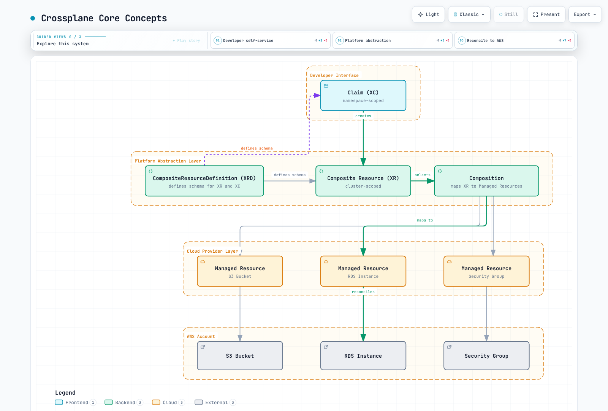
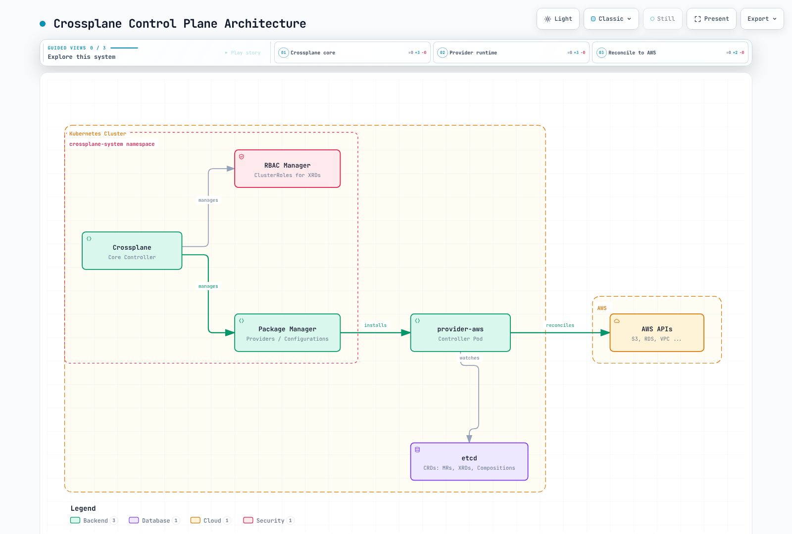
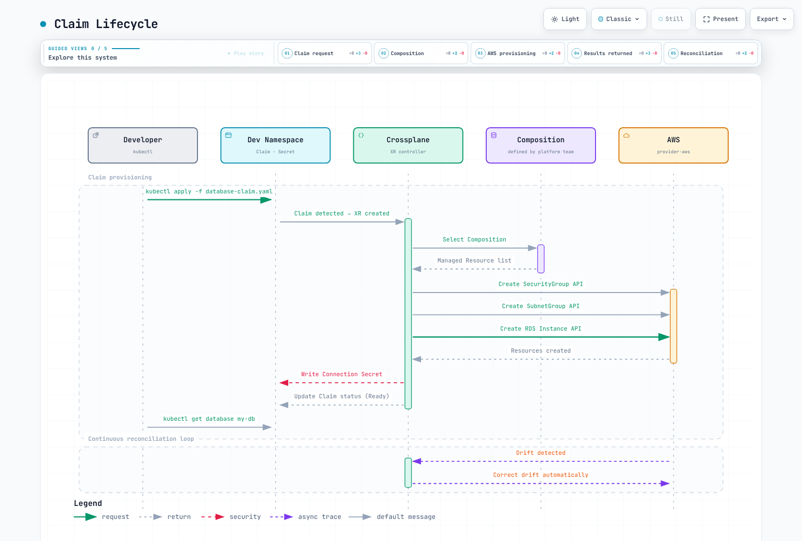

# Crossplane

> **Supported Versions**: Crossplane v1.17+, Provider-AWS v1.15+
> **Last Updated**: June 2025

## Table of Contents

- [Overview](#overview)
- [Learning Objectives](#learning-objectives)
- [Crossplane Architecture](#crossplane-architecture)
- [EKS Installation and Configuration](#eks-installation-and-configuration)
- [Managed Resources](#managed-resources)
- [Compositions (Platform Abstraction)](#compositions-platform-abstraction)
- [Claims (Self-Service)](#claims-self-service)
- [ACK vs Crossplane](#ack-vs-crossplane)
- [Backstage + Crossplane Integration](#backstage--crossplane-integration)
- [Production Operations](#production-operations)
- [Best Practices](#best-practices)
- [References](#references)

---

## Overview

### What is Crossplane?

Crossplane is an open-source, CNCF Graduated project that extends Kubernetes to become a universal control plane for infrastructure. Rather than introducing a separate tool or language for provisioning cloud resources, Crossplane lets you define, compose, and manage infrastructure using the same Kubernetes API, kubectl commands, and GitOps workflows you already use for applications.

At its core, Crossplane transforms your Kubernetes cluster into a control plane that can orchestrate resources across any cloud provider -- AWS, GCP, Azure -- or even on-premises systems. Infrastructure engineers define higher-level abstractions called Compositions, and application developers consume those abstractions through Claims, without needing to know the underlying cloud-specific details.

### Why Crossplane?

Traditional infrastructure management approaches require teams to learn provider-specific tools and languages:

- **Terraform** uses HCL, requires state file management, and operates outside the Kubernetes ecosystem
- **CloudFormation** is AWS-only and uses its own template language
- **Pulumi** requires general-purpose programming languages and a separate state backend

Crossplane addresses these challenges by bringing infrastructure management directly into the Kubernetes API:

1. **Kubernetes-Native**: Infrastructure is defined as Kubernetes Custom Resources -- no new languages or CLIs to learn
2. **Continuous Reconciliation**: Like any Kubernetes controller, Crossplane continuously reconciles desired state with actual state, detecting and correcting drift automatically
3. **Composable Abstractions**: Platform teams build reusable infrastructure abstractions (Compositions) that developers consume through simple Claims
4. **Multi-Cloud**: A single control plane can manage resources across AWS, GCP, Azure, and more
5. **GitOps Compatible**: Infrastructure definitions are standard YAML stored in Git, deployable through ArgoCD or FluxCD

### Infrastructure as Code Tool Comparison

| Criteria | Crossplane | Terraform | ACK | CloudFormation | Pulumi |
|----------|-----------|-----------|-----|----------------|--------|
| **Interface** | Kubernetes API (YAML) | HCL | Kubernetes API (YAML) | JSON/YAML templates | General-purpose code |
| **State Management** | Kubernetes etcd | Terraform state file | Kubernetes etcd | CloudFormation stack | Pulumi state backend |
| **Drift Detection** | Continuous (controller) | On `plan`/`apply` | Continuous (controller) | Drift detection API | On `preview`/`up` |
| **Abstraction Layer** | Compositions + Claims | Modules | None (1:1 mapping) | Nested stacks | Component resources |
| **Multi-Cloud** | Yes (multiple Providers) | Yes (multiple providers) | AWS only | AWS only | Yes (multiple providers) |
| **Self-Service** | Claims (namespace-scoped) | Terraform Cloud workspaces | Not built-in | Service Catalog | Automation API |
| **GitOps Integration** | Native (Kubernetes resources) | Requires wrapper (Atlantis) | Native (Kubernetes resources) | Limited | Requires wrapper |
| **CNCF Status** | Graduated | N/A (HashiCorp) | N/A (AWS) | N/A (AWS) | N/A (Pulumi Inc.) |
| **Learning Curve** | Medium (Kubernetes + XRDs) | Medium (HCL) | Low (simple CRDs) | Medium (templates) | Medium (programming) |

### CNCF Project History

Crossplane was created by Upbound and accepted into the CNCF Sandbox in June 2020. It moved to Incubating status in September 2021 and achieved Graduated status in November 2024, joining the ranks of Kubernetes, Prometheus, and Envoy as a fully mature CNCF project. This graduation reflects the project's production readiness, strong governance, and broad adoption across the industry.

---

## Learning Objectives

After completing this document, you will be able to:

1. **Explain** Crossplane's architecture and how it extends Kubernetes into a universal control plane
2. **Install** Crossplane on Amazon EKS with Provider-AWS configured via IRSA
3. **Create** Managed Resources to provision AWS services (S3, RDS, VPC) directly from Kubernetes
4. **Design** CompositeResourceDefinitions (XRDs) and Compositions to build platform abstractions
5. **Provision** infrastructure through namespace-scoped Claims for developer self-service
6. **Compare** ACK and Crossplane to choose the right tool for your use case
7. **Integrate** Crossplane with Backstage and ArgoCD for a complete IDP workflow
8. **Operate** Crossplane in production with monitoring, upgrade strategies, and drift detection

---

## Crossplane Architecture

### Core Concepts

Crossplane introduces five fundamental concepts that work together to provide infrastructure abstraction:



[🔍 View interactive diagram](https://www.atomai.click/kubernetes-docs/archmaps/en-platform-engineering-07-crossplane-0.html)

**1. Provider**: A Crossplane package that installs CRDs and controllers for a specific cloud provider. For example, `provider-aws` installs CRDs for every AWS service (S3, RDS, VPC, IAM, etc.) and runs controllers that know how to create, update, and delete those AWS resources.

**2. Managed Resource (MR)**: A 1:1 representation of an external cloud resource as a Kubernetes Custom Resource. A Managed Resource for an S3 bucket maps directly to an actual S3 bucket in AWS. Managed Resources are cluster-scoped and are the lowest-level Crossplane primitive.

**3. Composite Resource (XR)**: A higher-level, cluster-scoped custom resource defined by a CompositeResourceDefinition. An XR represents a logical grouping of infrastructure -- for example, a "Database" XR might compose an RDS instance, a security group, and a subnet group into a single unit.

**4. Composition**: The mapping layer that defines which Managed Resources to create when a Composite Resource is provisioned. A Composition specifies the "recipe" -- given an XR of type "Database," create these specific Managed Resources with these configurations and patch values from the XR spec into the MR fields.

**5. Claim (XC)**: A namespace-scoped projection of a Composite Resource. Claims are the developer-facing interface -- a developer in the `team-alpha` namespace can create a "DatabaseClaim" without needing cluster-level permissions. The Claim creates the underlying XR, which in turn triggers the Composition.

### Control Plane Architecture

Crossplane runs as a set of controllers inside your Kubernetes cluster:



[🔍 View interactive diagram](https://www.atomai.click/kubernetes-docs/archmaps/en-platform-engineering-07-crossplane-1.html)

- **Crossplane Core Controller**: Manages the lifecycle of Compositions, XRDs, and the mapping between XRs and Managed Resources
- **RBAC Manager**: Automatically generates Kubernetes RBAC ClusterRoles for XRDs so that Claims can be used in namespaces
- **Package Manager**: Installs and upgrades Providers and Configurations (bundles of XRDs + Compositions)
- **Provider Controllers**: Each installed Provider runs its own controller pod(s) that watch for Managed Resources and reconcile them against the cloud API

---

## EKS Installation and Configuration

### Prerequisites

- Amazon EKS cluster (v1.27+)
- kubectl configured with cluster access
- Helm v3.x installed
- AWS account with appropriate IAM permissions
- OIDC provider configured on the EKS cluster (for IRSA)

### Step 1: Install Crossplane via Helm

```bash
# Add the Crossplane Helm repository
helm repo add crossplane-stable https://charts.crossplane.io/stable
helm repo update

# Create the crossplane-system namespace and install Crossplane
helm install crossplane \
  crossplane-stable/crossplane \
  --namespace crossplane-system \
  --create-namespace \
  --version 1.17.1 \
  --set args='{"--enable-usages"}' \
  --wait
```

Verify the installation:

```bash
# Check Crossplane pods are running
kubectl get pods -n crossplane-system

# Expected output:
# NAME                                       READY   STATUS    RESTARTS   AGE
# crossplane-6d67f8c8b5-abc12               1/1     Running   0          2m
# crossplane-rbac-manager-7f8d9c4b6-def34   1/1     Running   0          2m

# Verify Crossplane CRDs are installed
kubectl get crds | grep crossplane
```

### Step 2: Install Provider-AWS

Install the AWS provider, which registers CRDs for all supported AWS services:

```yaml
# provider-aws.yaml
apiVersion: pkg.crossplane.io/v1
kind: Provider
metadata:
  name: provider-aws-s3
spec:
  package: xpkg.upbound.io/upbound/provider-aws-s3:v1.15.0
  runtimeConfigRef:
    name: provider-aws-runtime
---
apiVersion: pkg.crossplane.io/v1
kind: Provider
metadata:
  name: provider-aws-rds
spec:
  package: xpkg.upbound.io/upbound/provider-aws-rds:v1.15.0
  runtimeConfigRef:
    name: provider-aws-runtime
---
apiVersion: pkg.crossplane.io/v1
kind: Provider
metadata:
  name: provider-aws-ec2
spec:
  package: xpkg.upbound.io/upbound/provider-aws-ec2:v1.15.0
  runtimeConfigRef:
    name: provider-aws-runtime
---
apiVersion: pkg.crossplane.io/v1
kind: Provider
metadata:
  name: provider-aws-iam
spec:
  package: xpkg.upbound.io/upbound/provider-aws-iam:v1.15.0
  runtimeConfigRef:
    name: provider-aws-runtime
```

```bash
kubectl apply -f provider-aws.yaml

# Wait for Providers to become healthy
kubectl get providers.pkg.crossplane.io
# NAME               INSTALLED   HEALTHY   PACKAGE                                              AGE
# provider-aws-s3    True        True      xpkg.upbound.io/upbound/provider-aws-s3:v1.15.0     60s
# provider-aws-rds   True        True      xpkg.upbound.io/upbound/provider-aws-rds:v1.15.0    60s
# provider-aws-ec2   True        True      xpkg.upbound.io/upbound/provider-aws-ec2:v1.15.0    60s
# provider-aws-iam   True        True      xpkg.upbound.io/upbound/provider-aws-iam:v1.15.0    60s
```

> **Note**: Upbound's provider-family approach installs one provider per AWS service (e.g., `provider-aws-s3`, `provider-aws-rds`). This is the recommended approach over the monolithic `provider-aws` for production, as it reduces the CRD footprint and memory usage.

### Step 3: Configure IAM with IRSA

Create an IAM role for the Crossplane Provider-AWS controllers using IAM Roles for Service Accounts (IRSA):

```bash
# Set environment variables
export CLUSTER_NAME=my-eks-cluster
export AWS_ACCOUNT_ID=$(aws sts get-caller-identity --query Account --output text)
export OIDC_PROVIDER=$(aws eks describe-cluster --name $CLUSTER_NAME \
  --query "cluster.identity.oidc.issuer" --output text | sed 's|https://||')

# Create IAM policy for Crossplane (scope to required services)
cat > crossplane-policy.json << 'EOF'
{
  "Version": "2012-10-17",
  "Statement": [
    {
      "Effect": "Allow",
      "Action": [
        "s3:*",
        "rds:*",
        "ec2:*",
        "iam:*"
      ],
      "Resource": "*",
      "Condition": {
        "StringEquals": {
          "aws:RequestedRegion": "ap-northeast-2"
        }
      }
    }
  ]
}
EOF

aws iam create-policy \
  --policy-name CrossplaneProviderPolicy \
  --policy-document file://crossplane-policy.json

# Create IAM trust policy for IRSA
cat > trust-policy.json << EOF
{
  "Version": "2012-10-17",
  "Statement": [
    {
      "Effect": "Allow",
      "Principal": {
        "Federated": "arn:aws:iam::${AWS_ACCOUNT_ID}:oidc-provider/${OIDC_PROVIDER}"
      },
      "Action": "sts:AssumeRoleWithWebIdentity",
      "Condition": {
        "StringLike": {
          "${OIDC_PROVIDER}:sub": "system:serviceaccount:crossplane-system:provider-aws-*"
        }
      }
    }
  ]
}
EOF

aws iam create-role \
  --role-name CrossplaneProviderAWSRole \
  --assume-role-policy-document file://trust-policy.json

aws iam attach-role-policy \
  --role-name CrossplaneProviderAWSRole \
  --policy-arn arn:aws:iam::${AWS_ACCOUNT_ID}:policy/CrossplaneProviderPolicy
```

### Step 4: Configure DeploymentRuntimeConfig

DeploymentRuntimeConfig controls how Provider pods are deployed, including the service account annotation required for IRSA:

```yaml
# deployment-runtime-config.yaml
apiVersion: pkg.crossplane.io/v1beta1
kind: DeploymentRuntimeConfig
metadata:
  name: provider-aws-runtime
spec:
  deploymentTemplate:
    spec:
      replicas: 1
      selector: {}
      template:
        spec:
          serviceAccountName: provider-aws-runtime
          containers:
            - name: package-runtime
              resources:
                requests:
                  cpu: 100m
                  memory: 256Mi
                limits:
                  cpu: 500m
                  memory: 512Mi
  serviceAccountTemplate:
    metadata:
      name: provider-aws-runtime
      annotations:
        eks.amazonaws.com/role-arn: arn:aws:iam::<AWS_ACCOUNT_ID>:role/CrossplaneProviderAWSRole
```

```bash
kubectl apply -f deployment-runtime-config.yaml
```

### Step 5: Create ProviderConfig

ProviderConfig tells the Provider how to authenticate with AWS. With IRSA, the configuration simply instructs the Provider to use the injected IAM credentials:

```yaml
# provider-config.yaml
apiVersion: aws.upbound.io/v1beta1
kind: ProviderConfig
metadata:
  name: default
spec:
  credentials:
    source: IRSA
```

```bash
kubectl apply -f provider-config.yaml

# Verify ProviderConfig
kubectl get providerconfig.aws.upbound.io
```

> **Security Note**: The `default` ProviderConfig is used automatically by Managed Resources that do not specify a `providerConfigRef`. In multi-tenant environments, create separate ProviderConfigs for each team with appropriately scoped IAM roles.

---

## Managed Resources

Managed Resources are the building blocks of Crossplane -- each one maps directly to a single cloud resource. This section demonstrates provisioning common AWS resources.

### S3 Bucket

```yaml
# s3-bucket.yaml
apiVersion: s3.aws.upbound.io/v1beta2
kind: Bucket
metadata:
  name: my-app-data-bucket
  annotations:
    crossplane.io/external-name: my-app-data-bucket-prod-abc123
spec:
  forProvider:
    region: ap-northeast-2
    tags:
      Environment: production
      ManagedBy: crossplane
  providerConfigRef:
    name: default
---
apiVersion: s3.aws.upbound.io/v1beta1
kind: BucketVersioning
metadata:
  name: my-app-data-bucket-versioning
spec:
  forProvider:
    region: ap-northeast-2
    bucketRef:
      name: my-app-data-bucket
    versioningConfiguration:
      - status: Enabled
  providerConfigRef:
    name: default
---
apiVersion: s3.aws.upbound.io/v1beta2
kind: BucketServerSideEncryptionConfiguration
metadata:
  name: my-app-data-bucket-encryption
spec:
  forProvider:
    region: ap-northeast-2
    bucketRef:
      name: my-app-data-bucket
    rule:
      - applyServerSideEncryptionByDefault:
          - sseAlgorithm: aws:kms
  providerConfigRef:
    name: default
---
apiVersion: s3.aws.upbound.io/v1beta1
kind: BucketPublicAccessBlock
metadata:
  name: my-app-data-bucket-public-access
spec:
  forProvider:
    region: ap-northeast-2
    bucketRef:
      name: my-app-data-bucket
    blockPublicAcls: true
    blockPublicPolicy: true
    ignorePublicAcls: true
    restrictPublicBuckets: true
  providerConfigRef:
    name: default
```

### RDS Instance

```yaml
# rds-instance.yaml
apiVersion: rds.aws.upbound.io/v1beta2
kind: Instance
metadata:
  name: my-app-postgres
  annotations:
    crossplane.io/external-name: my-app-postgres-prod
spec:
  forProvider:
    region: ap-northeast-2
    engine: postgres
    engineVersion: "16.4"
    instanceClass: db.r6g.large
    allocatedStorage: 100
    maxAllocatedStorage: 500
    storageType: gp3
    storageEncrypted: true
    multiAz: true
    dbName: myapp
    username: admin
    passwordSecretRef:
      name: rds-master-password
      namespace: crossplane-system
      key: password
    dbSubnetGroupNameRef:
      name: my-app-db-subnet-group
    vpcSecurityGroupIdRefs:
      - name: my-app-db-sg
    backupRetentionPeriod: 7
    deletionProtection: true
    skipFinalSnapshot: false
    finalSnapshotIdentifier: my-app-postgres-final
    publiclyAccessible: false
    tags:
      Environment: production
      ManagedBy: crossplane
  providerConfigRef:
    name: default
  writeConnectionSecretToRef:
    name: rds-connection-details
    namespace: crossplane-system
```

### VPC and Networking

```yaml
# vpc.yaml
apiVersion: ec2.aws.upbound.io/v1beta1
kind: VPC
metadata:
  name: my-app-vpc
spec:
  forProvider:
    region: ap-northeast-2
    cidrBlock: 10.0.0.0/16
    enableDnsHostnames: true
    enableDnsSupport: true
    tags:
      Name: my-app-vpc
      ManagedBy: crossplane
  providerConfigRef:
    name: default
---
# subnet-private-a.yaml
apiVersion: ec2.aws.upbound.io/v1beta1
kind: Subnet
metadata:
  name: my-app-private-a
spec:
  forProvider:
    region: ap-northeast-2
    availabilityZone: ap-northeast-2a
    vpcIdRef:
      name: my-app-vpc
    cidrBlock: 10.0.1.0/24
    mapPublicIpOnLaunch: false
    tags:
      Name: my-app-private-a
      Type: private
  providerConfigRef:
    name: default
---
# subnet-private-c.yaml
apiVersion: ec2.aws.upbound.io/v1beta1
kind: Subnet
metadata:
  name: my-app-private-c
spec:
  forProvider:
    region: ap-northeast-2
    availabilityZone: ap-northeast-2c
    vpcIdRef:
      name: my-app-vpc
    cidrBlock: 10.0.2.0/24
    mapPublicIpOnLaunch: false
    tags:
      Name: my-app-private-c
      Type: private
  providerConfigRef:
    name: default
```

### Security Group

```yaml
# security-group.yaml
apiVersion: ec2.aws.upbound.io/v1beta1
kind: SecurityGroup
metadata:
  name: my-app-db-sg
spec:
  forProvider:
    region: ap-northeast-2
    vpcIdRef:
      name: my-app-vpc
    name: my-app-db-sg
    description: Security group for RDS database
    tags:
      Name: my-app-db-sg
      ManagedBy: crossplane
  providerConfigRef:
    name: default
---
apiVersion: ec2.aws.upbound.io/v1beta1
kind: SecurityGroupRule
metadata:
  name: my-app-db-sg-ingress-postgres
spec:
  forProvider:
    region: ap-northeast-2
    type: ingress
    fromPort: 5432
    toPort: 5432
    protocol: tcp
    cidrBlocks:
      - 10.0.0.0/16
    securityGroupIdRef:
      name: my-app-db-sg
    description: Allow PostgreSQL from VPC
  providerConfigRef:
    name: default
```

### Verifying Resource Status

After applying Managed Resources, verify their provisioning status:

```bash
# Check overall status of all Managed Resources
kubectl get managed

# Check specific resource with conditions
kubectl get bucket.s3.aws.upbound.io my-app-data-bucket -o yaml

# Example output showing a healthy resource:
# status:
#   conditions:
#   - lastTransitionTime: "2025-06-15T10:30:00Z"
#     reason: Available
#     status: "True"
#     type: Ready
#   - lastTransitionTime: "2025-06-15T10:30:00Z"
#     reason: ReconcileSuccess
#     status: "True"
#     type: Synced
#   atProvider:
#     arn: arn:aws:s3:::my-app-data-bucket-prod-abc123
#     id: my-app-data-bucket-prod-abc123
#     region: ap-northeast-2

# Check RDS instance status
kubectl get instance.rds.aws.upbound.io my-app-postgres

# Watch resources until they become ready
kubectl get managed -w

# Describe a resource for detailed events
kubectl describe instance.rds.aws.upbound.io my-app-postgres
```

Key status conditions to monitor:

| Condition | Status | Meaning |
|-----------|--------|---------|
| `Ready` | `True` | The external resource exists and is available |
| `Ready` | `False` | The resource is being created or has an error |
| `Synced` | `True` | The Crossplane controller successfully reconciled |
| `Synced` | `False` | Reconciliation failed (check events for details) |

---

## Compositions (Platform Abstraction)

Compositions are the heart of Crossplane's value proposition. They allow platform teams to define reusable infrastructure blueprints that abstract away cloud-specific complexity.

### Workflow Overview


[🔍 View interactive diagram](https://www.atomai.click/kubernetes-docs/archmaps/en-platform-engineering-07-crossplane-2.html)

### Step 1: Define a CompositeResourceDefinition (XRD)

The XRD defines the schema for your custom API. This example creates a `PostgreSQLDatabase` API that developers will consume:

```yaml
# xrd-database.yaml
apiVersion: apiextensions.crossplane.io/v1
kind: CompositeResourceDefinition
metadata:
  name: xpostgresqldatabases.database.example.com
spec:
  group: database.example.com
  names:
    kind: XPostgreSQLDatabase
    plural: xpostgresqldatabases
  claimNames:
    kind: PostgreSQLDatabase
    plural: postgresqldatabases
  versions:
    - name: v1alpha1
      served: true
      referenceable: true
      schema:
        openAPIV3Schema:
          type: object
          properties:
            spec:
              type: object
              properties:
                parameters:
                  type: object
                  description: Database configuration parameters
                  properties:
                    storageGB:
                      type: integer
                      description: Storage size in GB
                      minimum: 20
                      maximum: 1000
                      default: 100
                    instanceClass:
                      type: string
                      description: RDS instance class
                      enum:
                        - db.t4g.micro
                        - db.t4g.small
                        - db.t4g.medium
                        - db.r6g.large
                        - db.r6g.xlarge
                      default: db.t4g.medium
                    engineVersion:
                      type: string
                      description: PostgreSQL engine version
                      enum:
                        - "15.8"
                        - "16.4"
                      default: "16.4"
                    highAvailability:
                      type: boolean
                      description: Enable Multi-AZ deployment
                      default: false
                    backupRetentionDays:
                      type: integer
                      description: Number of days to retain backups
                      minimum: 1
                      maximum: 35
                      default: 7
                    environment:
                      type: string
                      description: Deployment environment
                      enum:
                        - dev
                        - staging
                        - production
                      default: dev
                  required:
                    - storageGB
                    - environment
              required:
                - parameters
            status:
              type: object
              properties:
                endpoint:
                  type: string
                  description: Database endpoint address
                port:
                  type: integer
                  description: Database port
                dbName:
                  type: string
                  description: Database name
      additionalPrinterColumns:
        - name: Engine Version
          type: string
          jsonPath: .spec.parameters.engineVersion
        - name: Instance Class
          type: string
          jsonPath: .spec.parameters.instanceClass
        - name: HA
          type: boolean
          jsonPath: .spec.parameters.highAvailability
        - name: Environment
          type: string
          jsonPath: .spec.parameters.environment
        - name: Ready
          type: string
          jsonPath: .status.conditions[?(@.type=='Ready')].status
        - name: Synced
          type: string
          jsonPath: .status.conditions[?(@.type=='Synced')].status
        - name: Age
          type: date
          jsonPath: .metadata.creationTimestamp
```

```bash
kubectl apply -f xrd-database.yaml

# Verify the XRD and the generated CRDs
kubectl get xrd
kubectl get crd | grep database.example.com
# xpostgresqldatabases.database.example.com
# postgresqldatabases.database.example.com   <-- Claim CRD
```

### Step 2: Write a Composition

The Composition defines the concrete AWS resources to create when a `XPostgreSQLDatabase` is provisioned. This example packages an RDS instance with a security group and a DB subnet group:

```yaml
# composition-database.yaml
apiVersion: apiextensions.crossplane.io/v1
kind: Composition
metadata:
  name: xpostgresqldatabases.aws.database.example.com
  labels:
    provider: aws
    service: rds
spec:
  compositeTypeRef:
    apiVersion: database.example.com/v1alpha1
    kind: XPostgreSQLDatabase

  writeConnectionSecretsToNamespace: crossplane-system

  patchSets:
    - name: common-tags
      patches:
        - type: FromCompositeFieldPath
          fromFieldPath: spec.parameters.environment
          toFieldPath: spec.forProvider.tags.Environment
        - type: FromCompositeFieldPath
          fromFieldPath: metadata.labels[crossplane.io/claim-namespace]
          toFieldPath: spec.forProvider.tags.Team
        - type: ToCompositeFieldPath
          fromFieldPath: metadata.annotations[crossplane.io/external-name]
          toFieldPath: status.externalName
          policy:
            fromFieldPath: Optional

  resources:
    # --- Security Group ---
    - name: security-group
      base:
        apiVersion: ec2.aws.upbound.io/v1beta1
        kind: SecurityGroup
        spec:
          forProvider:
            region: ap-northeast-2
            description: Crossplane-managed RDS security group
            vpcId: vpc-0abc123def456789  # Replace with your VPC ID
          providerConfigRef:
            name: default
      patches:
        - type: PatchSet
          patchSetName: common-tags
        - type: CombineFromComposite
          combine:
            variables:
              - fromFieldPath: metadata.labels[crossplane.io/claim-namespace]
              - fromFieldPath: metadata.labels[crossplane.io/claim-name]
            strategy: string
            string:
              fmt: "%s-%s-db-sg"
          toFieldPath: spec.forProvider.name

    # --- Security Group Ingress Rule ---
    - name: security-group-rule
      base:
        apiVersion: ec2.aws.upbound.io/v1beta1
        kind: SecurityGroupRule
        spec:
          forProvider:
            region: ap-northeast-2
            type: ingress
            fromPort: 5432
            toPort: 5432
            protocol: tcp
            cidrBlocks:
              - 10.0.0.0/16
            description: Allow PostgreSQL from VPC CIDR
          providerConfigRef:
            name: default
      patches:
        - type: FromCompositeFieldPath
          fromFieldPath: metadata.uid
          toFieldPath: spec.forProvider.securityGroupIdSelector.matchLabels.crossplane.io/composite
          policy:
            fromFieldPath: Required

    # --- DB Subnet Group ---
    - name: db-subnet-group
      base:
        apiVersion: rds.aws.upbound.io/v1beta1
        kind: SubnetGroup
        spec:
          forProvider:
            region: ap-northeast-2
            description: Crossplane-managed DB subnet group
            subnetIds:
              - subnet-0aaa111bbb222ccc3  # private-a
              - subnet-0ddd444eee555fff6  # private-c
          providerConfigRef:
            name: default
      patches:
        - type: PatchSet
          patchSetName: common-tags
        - type: CombineFromComposite
          combine:
            variables:
              - fromFieldPath: metadata.labels[crossplane.io/claim-namespace]
              - fromFieldPath: metadata.labels[crossplane.io/claim-name]
            strategy: string
            string:
              fmt: "%s-%s-db-subnet-group"
          toFieldPath: metadata.annotations[crossplane.io/external-name]

    # --- RDS Instance ---
    - name: rds-instance
      base:
        apiVersion: rds.aws.upbound.io/v1beta2
        kind: Instance
        spec:
          forProvider:
            region: ap-northeast-2
            engine: postgres
            storageType: gp3
            storageEncrypted: true
            publiclyAccessible: false
            autoMinorVersionUpgrade: true
            deletionProtection: false
            skipFinalSnapshot: false
            username: admin
            autoGeneratePassword: true
            passwordSecretRef: null
          providerConfigRef:
            name: default
      patches:
        - type: PatchSet
          patchSetName: common-tags
        # Storage
        - type: FromCompositeFieldPath
          fromFieldPath: spec.parameters.storageGB
          toFieldPath: spec.forProvider.allocatedStorage
        # Instance class
        - type: FromCompositeFieldPath
          fromFieldPath: spec.parameters.instanceClass
          toFieldPath: spec.forProvider.instanceClass
        # Engine version
        - type: FromCompositeFieldPath
          fromFieldPath: spec.parameters.engineVersion
          toFieldPath: spec.forProvider.engineVersion
        # Multi-AZ
        - type: FromCompositeFieldPath
          fromFieldPath: spec.parameters.highAvailability
          toFieldPath: spec.forProvider.multiAz
        # Backup retention
        - type: FromCompositeFieldPath
          fromFieldPath: spec.parameters.backupRetentionDays
          toFieldPath: spec.forProvider.backupRetentionPeriod
        # Database name from claim name
        - type: FromCompositeFieldPath
          fromFieldPath: metadata.labels[crossplane.io/claim-name]
          toFieldPath: spec.forProvider.dbName
          transforms:
            - type: string
              string:
                type: Convert
                convert: ToLower
            - type: string
              string:
                type: Regexp
                regexp:
                  match: '[^a-z0-9]'
                  group: 0
        # External name
        - type: CombineFromComposite
          combine:
            variables:
              - fromFieldPath: spec.parameters.environment
              - fromFieldPath: metadata.labels[crossplane.io/claim-namespace]
              - fromFieldPath: metadata.labels[crossplane.io/claim-name]
            strategy: string
            string:
              fmt: "%s-%s-%s"
          toFieldPath: metadata.annotations[crossplane.io/external-name]
        # Reference security group
        - type: FromCompositeFieldPath
          fromFieldPath: metadata.uid
          toFieldPath: spec.forProvider.vpcSecurityGroupIdSelector.matchLabels.crossplane.io/composite
          policy:
            fromFieldPath: Required
        # Reference subnet group
        - type: FromCompositeFieldPath
          fromFieldPath: metadata.uid
          toFieldPath: spec.forProvider.dbSubnetGroupNameSelector.matchLabels.crossplane.io/composite
          policy:
            fromFieldPath: Required
        # Environment-specific: production gets deletion protection
        - type: FromCompositeFieldPath
          fromFieldPath: spec.parameters.environment
          toFieldPath: spec.forProvider.deletionProtection
          transforms:
            - type: map
              map:
                dev: "false"
                staging: "false"
                production: "true"
        # Max allocated storage (autoscaling) = 5x base
        - type: FromCompositeFieldPath
          fromFieldPath: spec.parameters.storageGB
          toFieldPath: spec.forProvider.maxAllocatedStorage
          transforms:
            - type: math
              math:
                type: Multiply
                multiply: 5
        # Status: propagate endpoint to XR
        - type: ToCompositeFieldPath
          fromFieldPath: status.atProvider.address
          toFieldPath: status.endpoint
          policy:
            fromFieldPath: Optional
        - type: ToCompositeFieldPath
          fromFieldPath: status.atProvider.port
          toFieldPath: status.port
          policy:
            fromFieldPath: Optional
        - type: ToCompositeFieldPath
          fromFieldPath: spec.forProvider.dbName
          toFieldPath: status.dbName
          policy:
            fromFieldPath: Optional
      connectionDetails:
        - name: endpoint
          fromFieldPath: status.atProvider.address
        - name: port
          fromFieldPath: status.atProvider.port
          type: FromFieldPath
        - name: username
          fromFieldPath: spec.forProvider.username
          type: FromFieldPath
        - name: password
          fromConnectionSecretKey: attribute.password
```

```bash
kubectl apply -f composition-database.yaml

# Verify the Composition
kubectl get compositions
# NAME                                              XR-KIND              XR-APIVERSION                      AGE
# xpostgresqldatabases.aws.database.example.com     XPostgreSQLDatabase  database.example.com/v1alpha1      10s
```

### Patch and Transform Details

Crossplane Compositions use patches to move data between the Composite Resource and the Managed Resources. The key patch types are:

| Patch Type | Direction | Description |
|-----------|-----------|-------------|
| `FromCompositeFieldPath` | XR -> MR | Copy a value from the XR spec into a Managed Resource field |
| `ToCompositeFieldPath` | MR -> XR | Copy a value from a Managed Resource status back to the XR status |
| `CombineFromComposite` | XR -> MR | Combine multiple XR fields into a single MR field using a format string |
| `CombineToComposite` | MR -> XR | Combine multiple MR fields into a single XR field |
| `PatchSet` | N/A | Apply a named, reusable group of patches |

Transforms modify values as they are patched:

| Transform | Description | Example |
|-----------|-------------|---------|
| `map` | Map discrete values | `dev` -> `db.t4g.micro` |
| `math` | Arithmetic operations | Multiply storage by 5 |
| `string` | String manipulation | Format, Convert, Regexp |
| `convert` | Type conversion | String to integer |

---

## Claims (Self-Service)

Claims are the developer-facing interface to Crossplane Compositions. They are namespace-scoped, meaning developers only need RBAC permissions within their own namespace to provision infrastructure.

### Creating a Database via Claim

With the XRD and Composition defined above, a developer can now provision a fully-configured PostgreSQL database with a simple Claim:

```yaml
# database-claim-dev.yaml
apiVersion: database.example.com/v1alpha1
kind: PostgreSQLDatabase
metadata:
  name: orders-db
  namespace: team-alpha
spec:
  parameters:
    storageGB: 50
    instanceClass: db.t4g.small
    engineVersion: "16.4"
    highAvailability: false
    backupRetentionDays: 3
    environment: dev
  compositionRef:
    name: xpostgresqldatabases.aws.database.example.com
  writeConnectionSecretToRef:
    name: orders-db-connection
```

```bash
kubectl apply -f database-claim-dev.yaml

# Watch the Claim status
kubectl get postgresqldatabase orders-db -n team-alpha -w
# NAME        ENGINE VERSION   INSTANCE CLASS   HA      ENVIRONMENT   READY   SYNCED   AGE
# orders-db   16.4             db.t4g.small     false   dev           True    True     8m

# Check the underlying XR created by the Claim
kubectl get xpostgresqldatabase
# NAME                   ENGINE VERSION   INSTANCE CLASS   HA      ENVIRONMENT   READY   SYNCED   AGE
# orders-db-abc12        16.4             db.t4g.small     false   dev           True    True     8m

# Check all Managed Resources created by the Composition
kubectl get managed -l crossplane.io/claim-name=orders-db
```

### Production Database Claim

For production, the developer simply changes the parameters -- the Composition handles the complexity of enabling Multi-AZ, stronger instance classes, and deletion protection:

```yaml
# database-claim-prod.yaml
apiVersion: database.example.com/v1alpha1
kind: PostgreSQLDatabase
metadata:
  name: orders-db
  namespace: team-alpha-prod
spec:
  parameters:
    storageGB: 200
    instanceClass: db.r6g.large
    engineVersion: "16.4"
    highAvailability: true
    backupRetentionDays: 30
    environment: production
  compositionRef:
    name: xpostgresqldatabases.aws.database.example.com
  writeConnectionSecretToRef:
    name: orders-db-connection
```

### Connection Details

When the database is provisioned, Crossplane automatically creates a Kubernetes Secret containing the connection details:

```bash
# View the auto-generated connection secret
kubectl get secret orders-db-connection -n team-alpha -o yaml

# The secret contains:
# data:
#   endpoint: <base64-encoded RDS endpoint>
#   port: <base64-encoded port>
#   username: <base64-encoded username>
#   password: <base64-encoded auto-generated password>
```

Applications can reference the secret directly:

```yaml
# application-deployment.yaml
apiVersion: apps/v1
kind: Deployment
metadata:
  name: orders-api
  namespace: team-alpha
spec:
  replicas: 2
  selector:
    matchLabels:
      app: orders-api
  template:
    metadata:
      labels:
        app: orders-api
    spec:
      containers:
        - name: orders-api
          image: 123456789012.dkr.ecr.ap-northeast-2.amazonaws.com/orders-api:v1.0.0
          env:
            - name: DB_HOST
              valueFrom:
                secretKeyRef:
                  name: orders-db-connection
                  key: endpoint
            - name: DB_PORT
              valueFrom:
                secretKeyRef:
                  name: orders-db-connection
                  key: port
            - name: DB_USER
              valueFrom:
                secretKeyRef:
                  name: orders-db-connection
                  key: username
            - name: DB_PASSWORD
              valueFrom:
                secretKeyRef:
                  name: orders-db-connection
                  key: password
```

### Claim Lifecycle



[🔍 View interactive diagram](https://www.atomai.click/kubernetes-docs/archmaps/en-platform-engineering-07-crossplane-3.html)

---

## ACK vs Crossplane

Both [AWS Controllers for Kubernetes (ACK)](./02-ack.md) and Crossplane manage AWS resources through the Kubernetes API, but they serve different purposes and operate at different abstraction levels.

### Detailed Comparison

| Criteria | ACK | Crossplane |
|----------|-----|-----------|
| **Scope** | AWS only | Multi-cloud (AWS, GCP, Azure, etc.) |
| **Abstraction Level** | 1:1 resource mapping | Compositions + Claims (platform abstraction) |
| **Resource Coverage** | ~25 AWS service controllers | 900+ AWS resources via provider-aws family |
| **Custom APIs** | Not supported | XRDs define custom platform APIs |
| **Composition** | Not supported | Compositions package multiple resources |
| **Self-Service** | Cluster-scoped CRs only | Namespace-scoped Claims for tenants |
| **Maintained By** | AWS | Upbound / CNCF community |
| **CNCF Status** | Not a CNCF project | Graduated |
| **IAM Integration** | IRSA (native) | IRSA (via DeploymentRuntimeConfig) |
| **State Management** | Kubernetes etcd | Kubernetes etcd |
| **Drift Detection** | Yes (continuous) | Yes (continuous) |
| **Package System** | Helm charts per controller | Crossplane packages (OCI images) |
| **Learning Curve** | Low (simple CRDs) | Medium (XRDs, Compositions, patches) |
| **Multi-Tenancy** | Manual RBAC | Built-in via Claims + namespaces |
| **Connection Secrets** | Varies by controller | Standardized writeConnectionSecretToRef |

### When to Use ACK

ACK is the right choice when:

- **AWS-only infrastructure**: Your organization exclusively uses AWS and has no multi-cloud requirements
- **Simple resource provisioning**: You need direct 1:1 management of AWS resources without abstraction layers
- **Quick adoption**: You want the simplest path to managing AWS resources from Kubernetes with minimal learning curve
- **AWS-native support**: You prefer tooling maintained directly by AWS with tight EKS integration
- **Limited scope**: You manage a small number of AWS service types (e.g., only S3 and SQS)

### When to Use Crossplane

Crossplane is the right choice when:

- **Platform engineering**: You are building an Internal Developer Platform and need custom, developer-friendly APIs
- **Multi-cloud**: You manage resources across AWS, GCP, Azure, or other providers from a single control plane
- **Self-service infrastructure**: Development teams should provision infrastructure through namespace-scoped Claims without cluster-admin access
- **Composition is essential**: Your infrastructure patterns involve multiple related resources (e.g., RDS + SecurityGroup + SubnetGroup) that should be provisioned as a unit
- **Standardization**: You want to enforce organizational standards (naming, tagging, security baselines) through Compositions

### Using ACK and Crossplane Together

ACK and Crossplane are not mutually exclusive. A pragmatic approach:

1. Use **ACK** for simple, direct AWS resource management where no abstraction is needed (e.g., managing SQS queues, SNS topics)
2. Use **Crossplane** for complex infrastructure patterns that benefit from Composition and self-service Claims (e.g., database stacks, networking setups)
3. Both tools store state in Kubernetes etcd and work with GitOps workflows (ArgoCD, FluxCD)

---

## Backstage + Crossplane Integration

Combining [Backstage](./06-backstage-idp.md) as the developer portal with Crossplane as the infrastructure provisioning engine creates a powerful self-service platform. Developers select infrastructure from a catalog in Backstage, which generates Crossplane Claims committed to Git, deployed by ArgoCD.

### Architecture Overview


[🔍 View interactive diagram](https://www.atomai.click/kubernetes-docs/archmaps/en-platform-engineering-07-crossplane-4.html)

### Backstage Software Template for Crossplane Claims

Create a Backstage Software Template that lets developers provision a database through a form:

```yaml
# backstage-template-database.yaml
apiVersion: scaffolder.backstage.io/v1beta3
kind: Template
metadata:
  name: provision-database
  title: Provision PostgreSQL Database
  description: Self-service PostgreSQL database provisioning via Crossplane
  tags:
    - database
    - crossplane
    - aws
    - rds
spec:
  owner: platform-team
  type: infrastructure

  parameters:
    - title: Database Configuration
      required:
        - name
        - environment
        - storageGB
      properties:
        name:
          title: Database Name
          type: string
          pattern: '^[a-z][a-z0-9-]{2,28}[a-z0-9]$'
          description: Lowercase alphanumeric, 4-30 characters
        environment:
          title: Environment
          type: string
          enum:
            - dev
            - staging
            - production
          default: dev
        storageGB:
          title: Storage (GB)
          type: integer
          enum:
            - 20
            - 50
            - 100
            - 200
            - 500
          default: 50
        instanceClass:
          title: Instance Class
          type: string
          enum:
            - db.t4g.micro
            - db.t4g.small
            - db.t4g.medium
            - db.r6g.large
          default: db.t4g.small
        highAvailability:
          title: Multi-AZ (High Availability)
          type: boolean
          default: false

    - title: Repository Information
      required:
        - repoUrl
      properties:
        repoUrl:
          title: Infrastructure Repository
          type: string
          ui:field: RepoUrlPicker
          ui:options:
            allowedHosts:
              - github.com

  steps:
    - id: generate
      name: Generate Crossplane Claim
      action: fetch:template
      input:
        url: ./skeleton
        targetPath: ./infrastructure
        values:
          name: ${{ parameters.name }}
          environment: ${{ parameters.environment }}
          storageGB: ${{ parameters.storageGB }}
          instanceClass: ${{ parameters.instanceClass }}
          highAvailability: ${{ parameters.highAvailability }}

    - id: publish
      name: Create Pull Request
      action: publish:github:pull-request
      input:
        repoUrl: ${{ parameters.repoUrl }}
        branchName: infra/provision-${{ parameters.name }}-db
        title: "Provision database: ${{ parameters.name }}"
        description: |
          ## Database Provisioning Request

          | Parameter | Value |
          |-----------|-------|
          | Name | ${{ parameters.name }} |
          | Environment | ${{ parameters.environment }} |
          | Storage | ${{ parameters.storageGB }} GB |
          | Instance Class | ${{ parameters.instanceClass }} |
          | High Availability | ${{ parameters.highAvailability }} |

          This PR was created automatically by the Backstage self-service portal.
          Merging will trigger ArgoCD to apply the Crossplane Claim.

  output:
    links:
      - title: Pull Request
        url: ${{ steps.publish.output.remoteUrl }}
```

The template skeleton directory would contain the Claim YAML:

```yaml
# skeleton/claim.yaml
apiVersion: database.example.com/v1alpha1
kind: PostgreSQLDatabase
metadata:
  name: ${{ values.name }}
  namespace: ${{ values.namespace | default("default") }}
spec:
  parameters:
    storageGB: ${{ values.storageGB }}
    instanceClass: ${{ values.instanceClass }}
    engineVersion: "16.4"
    highAvailability: ${{ values.highAvailability }}
    backupRetentionDays: ${{ values.environment == "production" and 30 or 7 }}
    environment: ${{ values.environment }}
  compositionRef:
    name: xpostgresqldatabases.aws.database.example.com
  writeConnectionSecretToRef:
    name: ${{ values.name }}-connection
```

### GitOps Workflow: ArgoCD + Crossplane

Configure ArgoCD to watch the infrastructure repository and automatically apply Crossplane Claims when PRs are merged. See [ArgoCD Applications](../gitops/argocd/02-applications.md) for detailed ArgoCD configuration.

```yaml
# argocd-application-crossplane-claims.yaml
apiVersion: argoproj.io/v1alpha1
kind: Application
metadata:
  name: crossplane-claims
  namespace: argocd
spec:
  project: infrastructure
  source:
    repoURL: https://github.com/your-org/infrastructure-claims
    targetRevision: main
    path: claims/
    directory:
      recurse: true
  destination:
    server: https://kubernetes.default.svc
  syncPolicy:
    automated:
      prune: false        # Do not auto-delete Claims (protects infrastructure)
      selfHeal: true       # Re-apply if someone manually modifies a Claim
    syncOptions:
      - CreateNamespace=true
    retry:
      limit: 3
      backoff:
        duration: 30s
        factor: 2
        maxDuration: 5m
```

### End-to-End Self-Service Flow

The complete self-service infrastructure workflow:

1. **Developer** opens Backstage and selects "Provision PostgreSQL Database" from the template catalog
2. **Backstage** renders a form; developer fills in name, environment, size, and instance class
3. **Backstage Template** generates a Crossplane Claim YAML and creates a Pull Request in the infrastructure repository
4. **Reviewer** (platform team or automated policy check) approves and merges the PR
5. **ArgoCD** detects the new Claim in Git and applies it to the Kubernetes cluster
6. **Crossplane** creates the Composite Resource, selects the matching Composition, and provisions the Managed Resources
7. **AWS Provider** calls the AWS API to create the RDS instance, security group, and subnet group
8. **Connection Secret** is automatically created in the developer's namespace with endpoint, port, and credentials
9. **Developer** references the Secret in their application Deployment

---

## Production Operations

### State Management and Drift Detection

Crossplane continuously reconciles the desired state (Kubernetes resources) with the actual state (cloud resources). By default, the reconciliation loop runs every 10 minutes, but this can be configured:

```yaml
# provider-aws.yaml with custom poll interval
apiVersion: pkg.crossplane.io/v1
kind: Provider
metadata:
  name: provider-aws-rds
spec:
  package: xpkg.upbound.io/upbound/provider-aws-rds:v1.15.0
  runtimeConfigRef:
    name: provider-aws-runtime
```

```bash
# Override the poll interval via DeploymentRuntimeConfig
# Add to the container args:
# --poll=5m          # Check every 5 minutes instead of 10
# --max-reconcile-rate=10   # Max concurrent reconciliations
```

When drift is detected (someone modifies a resource outside of Crossplane), the controller automatically corrects it on the next reconciliation cycle. To observe drift events:

```bash
# Check events on a specific Managed Resource
kubectl describe instance.rds.aws.upbound.io my-app-postgres

# Events:
# Type     Reason                   Age   Message
# ----     ------                   ----  -------
# Normal   CreatedExternalResource  30m   Successfully requested creation...
# Warning  LateInitialized          25m   Late-initialized spec fields...
# Normal   UpdatedExternalResource   5m   Successfully requested update... (drift corrected)
```

### Import Existing Resources

Crossplane can adopt resources that were created outside of Crossplane (e.g., existing RDS instances created via the console or Terraform):

```yaml
# Import an existing RDS instance by setting the external-name annotation
apiVersion: rds.aws.upbound.io/v1beta2
kind: Instance
metadata:
  name: imported-legacy-db
  annotations:
    crossplane.io/external-name: my-existing-rds-instance-id
spec:
  forProvider:
    region: ap-northeast-2
    engine: postgres
    engineVersion: "16.4"
    instanceClass: db.r6g.large
    allocatedStorage: 200
  providerConfigRef:
    name: default
```

After applying, Crossplane observes the existing resource and brings it under management. Changes to the spec will be applied to the actual resource.

### Upgrade Strategy

#### Upgrading Crossplane Core

```bash
# Check current version
helm list -n crossplane-system

# Review changelog for breaking changes before upgrading
# https://github.com/crossplane/crossplane/releases

# Upgrade Crossplane core
helm upgrade crossplane \
  crossplane-stable/crossplane \
  --namespace crossplane-system \
  --version 1.18.0 \
  --wait

# Verify pods restart successfully
kubectl get pods -n crossplane-system -w
```

#### Upgrading Providers

Provider upgrades should be performed carefully since they involve CRD changes:

```yaml
# Update the Provider version
apiVersion: pkg.crossplane.io/v1
kind: Provider
metadata:
  name: provider-aws-rds
spec:
  package: xpkg.upbound.io/upbound/provider-aws-rds:v1.16.0  # Updated version
  runtimeConfigRef:
    name: provider-aws-runtime
```

```bash
kubectl apply -f provider-aws-updated.yaml

# Monitor the upgrade
kubectl get providers.pkg.crossplane.io -w
# Wait for HEALTHY=True

# Verify no resources entered an error state
kubectl get managed | grep -v "True.*True"
```

**Provider upgrade best practices:**

1. **Read the release notes**: Check for breaking changes, deprecated fields, or API version bumps
2. **Upgrade in non-production first**: Test on dev/staging clusters before production
3. **Upgrade one provider at a time**: Do not upgrade all providers simultaneously
4. **Monitor after upgrade**: Watch Managed Resources for `Synced=False` conditions for at least one reconciliation cycle
5. **Pin exact versions**: Always specify exact versions (e.g., `v1.16.0`), never use `latest` or floating tags

### Monitoring and Alerting

Crossplane and its Providers expose Prometheus metrics. Configure monitoring to detect provisioning failures and reconciliation issues:

```yaml
# prometheus-servicemonitor.yaml
apiVersion: monitoring.coreos.com/v1
kind: ServiceMonitor
metadata:
  name: crossplane-metrics
  namespace: crossplane-system
  labels:
    release: prometheus
spec:
  selector:
    matchLabels:
      app: crossplane
  endpoints:
    - port: metrics
      interval: 30s
      path: /metrics
---
apiVersion: monitoring.coreos.com/v1
kind: ServiceMonitor
metadata:
  name: provider-aws-metrics
  namespace: crossplane-system
  labels:
    release: prometheus
spec:
  selector:
    matchLabels:
      pkg.crossplane.io/revision: provider-aws-rds
  endpoints:
    - port: metrics
      interval: 30s
      path: /metrics
```

Key metrics to monitor:

| Metric | Description | Alert Threshold |
|--------|-------------|-----------------|
| `certwatcher_read_certificate_errors_total` | Certificate read failures | > 0 |
| `controller_runtime_reconcile_errors_total` | Reconciliation errors | > 5 per 5 min |
| `controller_runtime_reconcile_time_seconds` | Reconciliation duration | p99 > 30s |
| `workqueue_depth` | Items waiting for reconciliation | > 100 |
| `workqueue_retries_total` | Retry count | Sustained increase |

Example Prometheus alerting rules:

```yaml
# crossplane-alerts.yaml
apiVersion: monitoring.coreos.com/v1
kind: PrometheusRule
metadata:
  name: crossplane-alerts
  namespace: crossplane-system
spec:
  groups:
    - name: crossplane
      rules:
        - alert: CrossplaneReconcileErrors
          expr: rate(controller_runtime_reconcile_errors_total[5m]) > 0
          for: 10m
          labels:
            severity: warning
          annotations:
            summary: "Crossplane reconciliation errors detected"
            description: "Controller {{ $labels.controller }} has reconciliation errors."

        - alert: CrossplaneManagedResourceNotReady
          expr: |
            kube_customresource_status_condition{
              group=~".*\\.aws\\.upbound\\.io",
              status="False",
              condition="Ready"
            } == 1
          for: 30m
          labels:
            severity: critical
          annotations:
            summary: "Managed Resource not ready for 30 minutes"
            description: "{{ $labels.customresource_kind }}/{{ $labels.customresource_name }} is not Ready."

        - alert: CrossplaneManagedResourceNotSynced
          expr: |
            kube_customresource_status_condition{
              group=~".*\\.aws\\.upbound\\.io",
              status="False",
              condition="Synced"
            } == 1
          for: 15m
          labels:
            severity: critical
          annotations:
            summary: "Managed Resource not synced for 15 minutes"
            description: "{{ $labels.customresource_kind }}/{{ $labels.customresource_name }} is not Synced."
```

---

## Best Practices

### Composition Design Principles

1. **Start with the developer experience**: Design your XRD schema from the perspective of the Claim consumer. The API should be simple, intuitive, and hide cloud-specific complexity. Expose only the parameters that developers need to vary.

2. **Use environment-based defaults**: Leverage the `environment` parameter to automatically set production-appropriate values (Multi-AZ, deletion protection, longer backup retention) without requiring developers to know about them:

    ```yaml
    # In Composition: map environment to deletion protection
    - type: FromCompositeFieldPath
      fromFieldPath: spec.parameters.environment
      toFieldPath: spec.forProvider.deletionProtection
      transforms:
        - type: map
          map:
            dev: "false"
            staging: "false"
            production: "true"
    ```

3. **Use PatchSets for consistency**: Define common patches (tags, region, provider config) in PatchSets and reference them across all resources in the Composition. This prevents tag drift across resources within the same Composition.

4. **Version your XRDs**: Use `v1alpha1` for initial APIs and promote to `v1beta1` and `v1` as the schema stabilizes. Never remove fields from a served version -- add new versions instead.

5. **Limit Composition size**: If a Composition grows beyond 10-15 resources, consider splitting it into multiple Compositions or using nested XRs (Compositions that reference other XRs).

### Naming Conventions

Establish consistent naming conventions across all Crossplane resources:

| Resource Type | Convention | Example |
|--------------|-----------|---------|
| XRD | `x<plural>.<group>` | `xpostgresqldatabases.database.example.com` |
| Composition | `<xrd-plural>.<provider>.<group>` | `xpostgresqldatabases.aws.database.example.com` |
| Claim | `<descriptive-name>` | `orders-db` |
| Managed Resource | `<claim-name>-<resource-type>` | Auto-generated via patches |
| ProviderConfig | `default` or `<team>-<environment>` | `team-alpha-production` |
| Connection Secret | `<claim-name>-connection` | `orders-db-connection` |

### Secret Management

1. **Use `writeConnectionSecretToRef`**: Always propagate connection details through Crossplane's built-in connection secret mechanism rather than manually creating Secrets.

2. **Scope secrets to claim namespaces**: Claims automatically create connection Secrets in the Claim's namespace, ensuring proper RBAC isolation.

3. **Integrate with External Secrets Operator**: For organizations that store secrets in AWS Secrets Manager or HashiCorp Vault, use External Secrets Operator alongside Crossplane to sync connection details:

    ```yaml
    # ExternalSecret that reads the Crossplane-generated secret
    # and syncs it to AWS Secrets Manager for non-Kubernetes consumers
    apiVersion: external-secrets.io/v1beta1
    kind: ExternalSecret
    metadata:
      name: orders-db-external
      namespace: team-alpha
    spec:
      refreshInterval: 1h
      secretStoreRef:
        name: aws-secrets-manager
        kind: ClusterSecretStore
      dataFrom:
        - sourceRef:
            generatorRef:
              apiVersion: v1
              kind: Secret
              name: orders-db-connection
    ```

4. **Rotate credentials**: Crossplane does not automatically rotate database credentials. Implement a rotation strategy using CronJobs or integrate with AWS Secrets Manager automatic rotation.

### Multi-Tenancy

1. **One ProviderConfig per tenant**: In strict multi-tenancy scenarios, create separate ProviderConfigs with IAM roles scoped to each tenant's AWS resources:

    ```yaml
    apiVersion: aws.upbound.io/v1beta1
    kind: ProviderConfig
    metadata:
      name: team-alpha
    spec:
      credentials:
        source: IRSA
      assumeRoleChain:
        - roleARN: arn:aws:iam::111122223333:role/CrossplaneTeamAlphaRole
    ```

2. **Namespace isolation**: Claims are inherently namespace-scoped. Combine with Kubernetes RBAC and network policies to enforce tenant boundaries.

3. **Resource quotas**: Use Kubernetes ResourceQuotas or Kyverno policies to limit the number and size of Claims per namespace:

    ```yaml
    # Kyverno policy to limit database Claims per namespace
    apiVersion: kyverno.io/v1
    kind: ClusterPolicy
    metadata:
      name: limit-database-claims
    spec:
      validationFailureAction: Enforce
      rules:
        - name: limit-storage-size
          match:
            any:
              - resources:
                  kinds:
                    - PostgreSQLDatabase
          validate:
            message: "Storage cannot exceed 500GB in non-production environments"
            deny:
              conditions:
                all:
                  - key: "{{ request.object.spec.parameters.environment }}"
                    operator: NotEquals
                    value: production
                  - key: "{{ request.object.spec.parameters.storageGB }}"
                    operator: GreaterThan
                    value: 500
    ```

4. **Cost attribution**: Use the team namespace label in Composition patches to tag all AWS resources with cost allocation tags, enabling per-team cost tracking in AWS Cost Explorer.

### Resource Deletion Safety

1. **Use Crossplane's Usage resource** to prevent accidental deletion of critical resources:

    ```yaml
    apiVersion: apiextensions.crossplane.io/v1alpha1
    kind: Usage
    metadata:
      name: protect-production-db
    spec:
      of:
        apiVersion: rds.aws.upbound.io/v1beta2
        kind: Instance
        resourceRef:
          name: production-orders-db
      reason: "Protected production database - requires manual Usage deletion first"
    ```

2. **Set `deletionPolicy: Orphan`** on critical Managed Resources to prevent the cloud resource from being deleted even if the Kubernetes object is removed:

    ```yaml
    apiVersion: rds.aws.upbound.io/v1beta2
    kind: Instance
    metadata:
      name: critical-database
    spec:
      deletionPolicy: Orphan  # Default is "Delete"
      forProvider:
        # ...
    ```

---

## References

### Official Documentation

- [Crossplane Official Documentation](https://docs.crossplane.io/)
- [Crossplane GitHub Repository](https://github.com/crossplane/crossplane)
- [Upbound Provider-AWS Documentation](https://marketplace.upbound.io/providers/upbound/provider-family-aws/)
- [Crossplane Composition Functions](https://docs.crossplane.io/latest/concepts/composition-functions/)
- [Crossplane API Reference](https://doc.crds.dev/github.com/crossplane/crossplane)

### CNCF and Community

- [CNCF Crossplane Project Page](https://www.cncf.io/projects/crossplane/)
- [Crossplane Slack Community](https://slack.crossplane.io/)
- [Crossplane Blog](https://blog.crossplane.io/)
- [Upbound Blog](https://www.upbound.io/blog)

### AWS Integration

- [EKS IRSA Documentation](https://docs.aws.amazon.com/eks/latest/userguide/iam-roles-for-service-accounts.html)
- [AWS Provider CRD Reference](https://marketplace.upbound.io/providers/upbound/provider-aws-rds/)
- [Crossplane on AWS Prescriptive Guidance](https://docs.aws.amazon.com/prescriptive-guidance/latest/patterns/manage-aws-resources-with-crossplane.html)

### Related Documentation in This Repository

- [AWS Controllers for Kubernetes (ACK)](./02-ack.md) -- AWS-native Kubernetes resource management; see [ACK vs Crossplane](#ack-vs-crossplane) for comparison
- [Backstage IDP](./06-backstage-idp.md) -- Internal Developer Platform framework; integrates with Crossplane for self-service infrastructure
- [ArgoCD Applications](../gitops/argocd/02-applications.md) -- GitOps deployment for Crossplane Claims
- [Platform Engineering Overview](./00-platform-engineering-overview.md) -- IDP concepts and reference architecture
- [Kubernetes Extension Mechanisms](./04-kubernetes-extensions.md) -- CRDs and controllers that underpin Crossplane
- [Kubernetes Resource Operator (KRO)](./03-kro.md) -- Alternative resource composition approach

---

[Previous: Backstage IDP](./06-backstage-idp.md) | [Next: vCluster](./08-vcluster.md)
