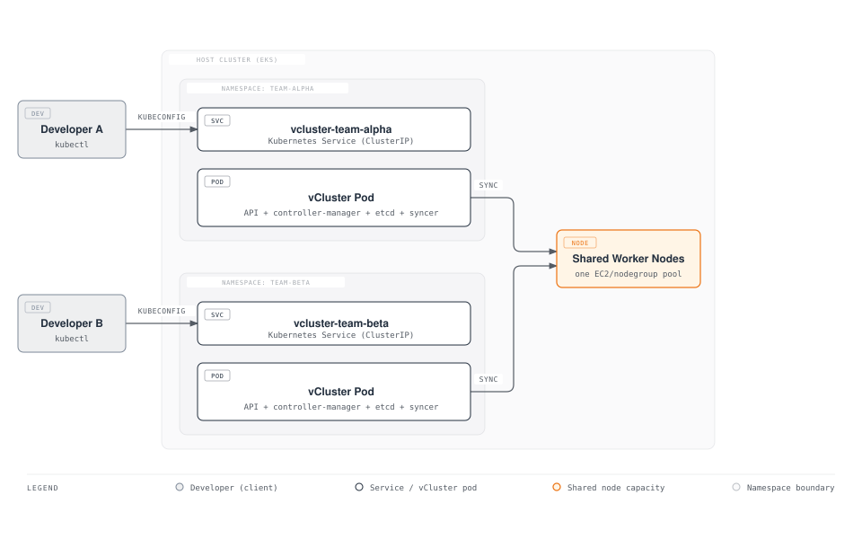
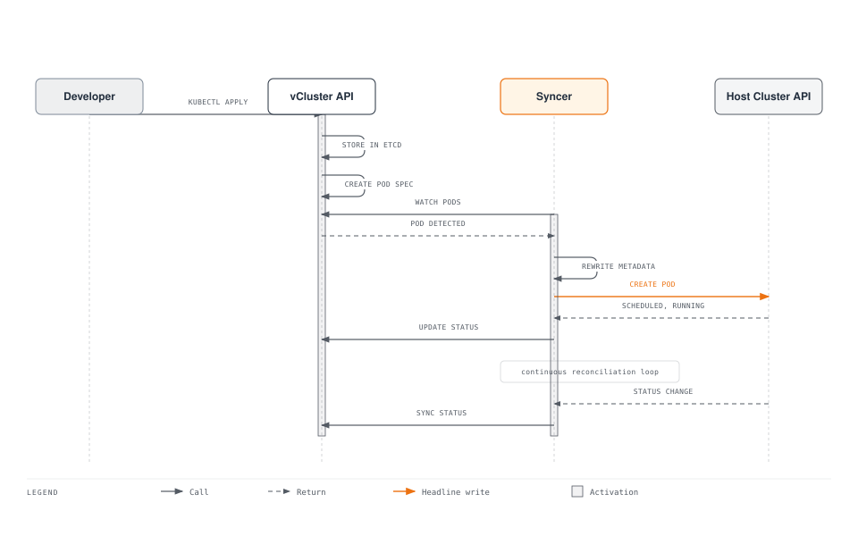
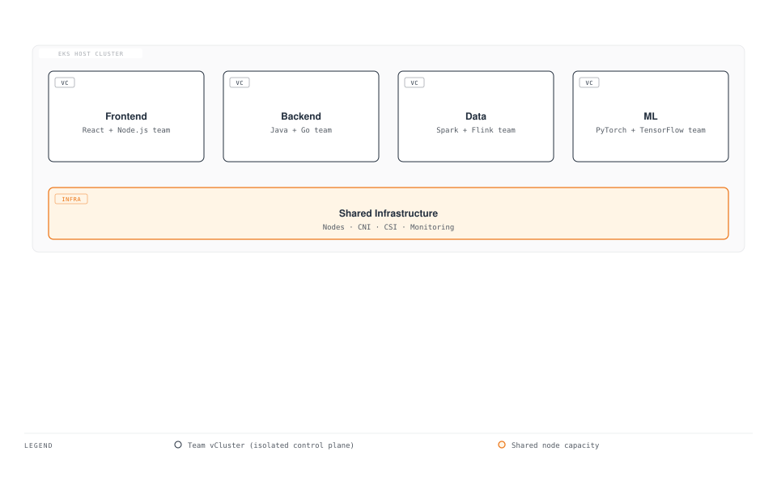
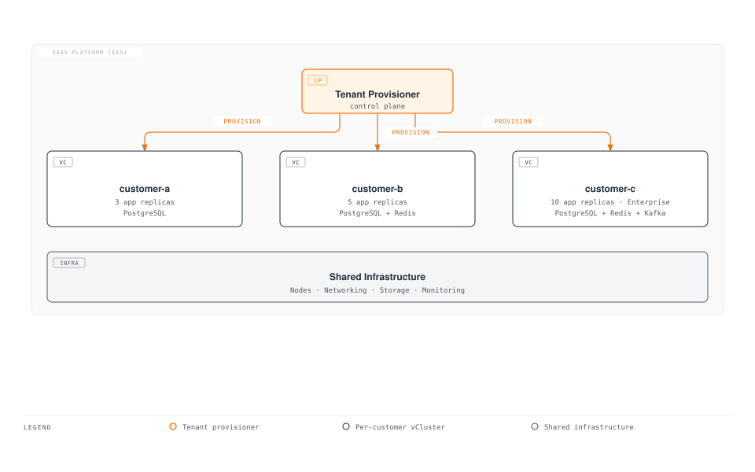
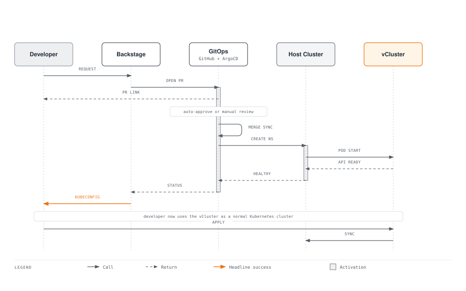

# vCluster

> **Supported Versions**: vCluster v0.21+, vCluster Pro v0.21+
> **Last Updated**: June 2025

## Table of Contents

- [Overview](#overview)
- [Learning Objectives](#learning-objectives)
- [vCluster Architecture](#vcluster-architecture)
- [EKS Installation and Configuration](#eks-installation-and-configuration)
- [Virtual Cluster Operations](#virtual-cluster-operations)
- [Multi-Tenancy Patterns](#multi-tenancy-patterns)
- [Security and Isolation](#security-and-isolation)
- [Backstage + vCluster Integration](#backstage--vcluster-integration)
- [Production Operations](#production-operations)
- [Best Practices](#best-practices)
- [References](#references)

---

## Overview

### What is vCluster?

vCluster is an open-source project by Loft Labs that creates fully functional virtual Kubernetes clusters running inside namespaces of a host Kubernetes cluster. Each virtual cluster has its own dedicated API server, control plane, and syncer, but shares the underlying worker nodes and container runtime of the host cluster. From the perspective of a user or workload, a virtual cluster is indistinguishable from a real cluster -- it supports CRDs, admission webhooks, RBAC, and the full Kubernetes API -- yet it requires no additional infrastructure.

Unlike traditional multi-tenancy approaches that rely on namespaces and RBAC alone, vCluster provides genuine control plane isolation. Each tenant receives a complete Kubernetes control plane where they can act as cluster-admin, install their own CRDs, configure their own admission controllers, and manage cluster-scoped resources -- all without affecting other tenants or the host cluster.

### Why Virtual Clusters?

Traditional approaches to multi-tenancy in Kubernetes each carry significant trade-offs:

- **Namespace isolation** provides basic separation but cannot isolate CRDs, cluster-scoped resources, or admission webhooks. Tenants share a single API server and must coordinate around shared resources.
- **Separate physical clusters** provide strong isolation but multiply infrastructure cost, operational overhead, and management complexity. Provisioning a new cluster takes minutes to hours.
- **Virtual clusters** sit between these extremes: they offer strong isolation (each tenant gets its own API server and full cluster-admin access) while sharing the underlying compute, storage, and networking infrastructure.

### Multi-Tenancy Approach Comparison

| Criteria | Namespace Isolation | vCluster | Physical Cluster |
|----------|-------------------|----------|-----------------|
| **Isolation Level** | Low (shared API server) | High (dedicated API server) | Highest (separate infrastructure) |
| **CRD Isolation** | None (shared across cluster) | Full (per-vCluster CRDs) | Full |
| **Cluster-Admin Access** | Not possible for tenants | Yes (within vCluster) | Yes |
| **Admission Webhooks** | Shared (cluster-wide) | Isolated (per-vCluster) | Isolated |
| **RBAC Complexity** | High (many role bindings) | Low (cluster-admin per tenant) | Low |
| **Provisioning Time** | Seconds (create namespace) | Seconds to minutes | Minutes to hours |
| **Infrastructure Cost** | Lowest (shared everything) | Low (shared nodes, minimal overhead) | Highest (dedicated nodes) |
| **Resource Overhead** | None | ~100-200 MiB per vCluster | Full control plane per cluster |
| **Operational Overhead** | Low | Medium | High (cluster lifecycle) |
| **Node Sharing** | Yes | Yes | No (unless multi-cluster scheduling) |
| **Network Isolation** | Requires NetworkPolicy | Requires NetworkPolicy + Syncer rules | Physical separation possible |
| **Scalability** | Limited by API server load | Hundreds per host cluster | Limited by infrastructure budget |
| **GitOps Compatibility** | Native | Native (standard kubeconfig) | Native |

### CNCF Sandbox Project

vCluster was accepted into the CNCF Sandbox in November 2024, signaling the cloud-native community's recognition of virtual clusters as a legitimate pattern for multi-tenancy and platform engineering. The project has over 7,000 GitHub stars and is used in production by organizations ranging from startups to Fortune 500 enterprises. vCluster Pro, the commercial offering by Loft Labs, adds features such as centralized management, Sleep Mode, Auto-Delete, and advanced RBAC -- features designed for large-scale multi-tenant operations.

---

## Learning Objectives

After completing this document, you will be able to:

1. **Explain** the virtual cluster concept and how vCluster achieves control plane isolation within a single host cluster
2. **Compare** multi-tenancy approaches (namespaces, vCluster, physical clusters) and select the right strategy for your use case
3. **Install** vCluster on Amazon EKS using the CLI and Helm, with EKS-specific configuration for EBS CSI, ALB Ingress, and IRSA
4. **Create and manage** virtual clusters -- including lifecycle operations such as pause, resume, and deletion
5. **Configure** resource synchronization rules to control which Kubernetes resources flow between virtual and host clusters
6. **Design** multi-tenancy patterns for development environments, CI/CD pipelines, preview environments, and multi-tenant SaaS platforms
7. **Implement** security controls including NetworkPolicy isolation, ResourceQuota enforcement, Pod Security Standards, and RBAC
8. **Integrate** vCluster with Backstage and ArgoCD for self-service virtual cluster provisioning in an Internal Developer Platform
9. **Operate** vCluster in production with monitoring, backup, upgrade strategies, and cost optimization through Sleep Mode and Auto-Delete

---

## vCluster Architecture

### Virtual Control Plane

Each vCluster runs a lightweight Kubernetes control plane inside a single pod (or StatefulSet) on the host cluster. The virtual control plane consists of an API server, a controller manager, and a data store (etcd or a lightweight alternative). The Syncer component bridges the virtual cluster and the host cluster by synchronizing selected resources between them.



### Syncer Component

The Syncer is the core innovation behind vCluster. It acts as a bidirectional bridge between the virtual cluster and the host cluster, translating and synchronizing Kubernetes resources across the boundary. When a user creates a Pod inside a vCluster, the Syncer creates a corresponding Pod in the host namespace -- but with rewritten names, labels, and metadata to prevent collisions between virtual clusters.



**Resource synchronization behavior:**

| Resource Type | Direction | Behavior |
|--------------|-----------|----------|
| Pods | vCluster -> Host | Created in host namespace with rewritten names |
| Services | vCluster -> Host | Synced to host; ClusterIP re-mapped |
| Endpoints | Bidirectional | Kept in sync for service discovery |
| ConfigMaps | vCluster -> Host (for mounted) | Only synced if referenced by a synced Pod |
| Secrets | vCluster -> Host (for mounted) | Only synced if referenced by a synced Pod |
| Ingresses | vCluster -> Host | Synced to host for ingress controller processing |
| PersistentVolumeClaims | vCluster -> Host | Synced to host for storage provisioning |
| PersistentVolumes | Host -> vCluster | Synced from host after PVC binding |
| StorageClasses | Host -> vCluster | Synced from host so tenants can select storage |
| IngressClasses | Host -> vCluster | Synced from host for ingress configuration |
| CSIDrivers | Host -> vCluster | Synced from host for volume support |
| CSINodes | Host -> vCluster | Synced from host for scheduling |
| Nodes | Host -> vCluster (virtual) | Fake or real node objects synced for scheduling |

### Backing Distributions

vCluster supports three Kubernetes distributions as the virtual control plane backend:

| Distribution | Default | Control Plane Footprint | CRD Support | Notes |
|-------------|---------|------------------------|-------------|-------|
| **k3s** | Yes | ~100 MiB RAM, ~0.5 CPU | Full | Lightweight, fast startup. Built-in CoreDNS, Traefik disabled in vCluster mode. |
| **k0s** | No | ~150 MiB RAM, ~0.5 CPU | Full | Zero-friction Kubernetes by Mirantis. Single binary, minimal dependencies. |
| **Vanilla k8s** | No | ~500 MiB RAM, ~1 CPU | Full | Upstream Kubernetes API server + etcd. Highest fidelity, highest resource cost. Recommended when exact API compatibility is critical. |

The choice of distribution affects resource overhead but not functionality. All three support CRDs, admission webhooks, and the full Kubernetes API surface. For most platform engineering use cases, k3s provides the best balance of compatibility and resource efficiency.

### Relationship with Host Cluster

The virtual cluster and the host cluster maintain a clear separation of concerns:

- **Virtual cluster owns**: API resources (Deployments, StatefulSets, CRDs, RBAC, admission webhooks), workload scheduling decisions (from the tenant's perspective), and namespace-scoped objects within the vCluster.
- **Host cluster owns**: Actual Pod scheduling on nodes, networking (CNI, NetworkPolicy enforcement), storage provisioning (CSI drivers, StorageClasses), and physical resource allocation.
- **Syncer bridges**: Translates virtual cluster resources into host cluster resources and propagates status back. The Syncer rewrites resource names to include the vCluster name, preventing collisions. For example, a Pod named `nginx` in vCluster `team-alpha` becomes `nginx-x-default-x-team-alpha` in the host namespace.

---

## EKS Installation and Configuration

### Prerequisites

Before installing vCluster on EKS, ensure the following:

```bash
# Verify EKS cluster access
kubectl cluster-info
kubectl get nodes

# Required: Helm v3.10+
helm version

# Required: kubectl v1.28+
kubectl version --client
```

### vCluster CLI Installation

The vCluster CLI provides the simplest way to create and manage virtual clusters:

```bash
# macOS
brew install loft-sh/tap/vcluster

# Linux (amd64)
curl -L -o vcluster "https://github.com/loft-sh/vcluster/releases/latest/download/vcluster-linux-amd64"
chmod +x vcluster
sudo mv vcluster /usr/local/bin/

# Verify installation
vcluster --version
# vcluster version 0.21.x
```

### Helm Installation

For GitOps workflows and programmatic management, vCluster can be deployed via Helm:

```bash
# Add the vCluster Helm repository
helm repo add loft-sh https://charts.loft.sh
helm repo update

# Install a vCluster named "team-alpha" in namespace "team-alpha"
kubectl create namespace team-alpha

helm install team-alpha loft-sh/vcluster \
  --namespace team-alpha \
  --values vcluster-values.yaml \
  --version 0.21.0
```

### vcluster.yaml Configuration File

The `vcluster.yaml` file controls every aspect of the virtual cluster. Below is a complete, production-ready configuration for EKS:

```yaml
# vcluster.yaml -- Complete EKS production configuration
# Documentation: https://www.vcluster.com/docs/vcluster/configure/vcluster-yaml

# --- Control Plane Configuration ---
controlPlane:
  # Backing distribution: k3s (default), k0s, or k8s
  distro:
    k3s:
      enabled: true
      image:
        repository: rancher/k3s
        tag: v1.31.2-k3s1
      # Disable k3s built-in components not needed in vCluster
      extraArgs:
        - --disable=traefik,servicelb,metrics-server,local-storage

  # StatefulSet configuration for the vCluster control plane
  statefulSet:
    resources:
      requests:
        cpu: 200m
        memory: 256Mi
      limits:
        cpu: "1"
        memory: 1Gi
    persistence:
      # Use EBS for the vCluster data store
      size: 10Gi
      storageClass: gp3
    labels:
      app.kubernetes.io/managed-by: vcluster
      team: platform
    scheduling:
      nodeSelector:
        node.kubernetes.io/instance-type: m6i.large
      tolerations:
        - key: dedicated
          operator: Equal
          value: vcluster
          effect: NoSchedule

  # Ingress for API server access (optional -- alternative to LoadBalancer)
  ingress:
    enabled: false

  # Service configuration for API server access
  service:
    spec:
      type: ClusterIP  # Use ClusterIP with vcluster connect, or LoadBalancer for direct access

# --- Syncer Configuration ---
sync:
  # Resources synced FROM the virtual cluster TO the host cluster
  toHost:
    pods:
      enabled: true
    services:
      enabled: true
    configmaps:
      enabled: true
    secrets:
      enabled: true
    endpoints:
      enabled: true
    persistentvolumeclaims:
      enabled: true
    ingresses:
      enabled: true
    serviceaccounts:
      enabled: true
    networkpolicies:
      enabled: true

  # Resources synced FROM the host cluster TO the virtual cluster
  fromHost:
    nodes:
      enabled: true
      selector:
        labels:
          vcluster-enabled: "true"
    storageClasses:
      enabled: true
    ingressClasses:
      enabled: true
    csiDrivers:
      enabled: true
    csiNodes:
      enabled: true
    csiStorageCapacities:
      enabled: true

# --- Networking Configuration ---
networking:
  # Reuse host cluster DNS for external resolution
  replicateServices:
    fromHost:
      - from: kube-system/aws-load-balancer-webhook-service
        to: kube-system/aws-load-balancer-webhook-service
    toHost: []

  # Resolve DNS via host cluster CoreDNS
  resolveDNS:
    - hostname: "*.amazonaws.com"
      target: host
      service: ""

# --- Plugin Configuration ---
plugins: {}

# --- RBAC Configuration ---
rbac:
  # Role used by the Syncer on the host cluster
  role:
    # Extra rules needed for EKS-specific resources
    extraRules:
      - apiGroups: ["networking.k8s.io"]
        resources: ["networkpolicies"]
        verbs: ["create", "delete", "patch", "update", "get", "list", "watch"]

  # ClusterRole for host-level access
  clusterRole:
    extraRules:
      - apiGroups: ["storage.k8s.io"]
        resources: ["storageclasses", "csinodes", "csidrivers", "csistoragecapacities"]
        verbs: ["get", "list", "watch"]

# --- Export / Import CRDs ---
exportKubeconfig:
  context: vcluster-team-alpha
  server: https://localhost:8443

# --- Telemetry ---
telemetry:
  enabled: false
```

### EKS-Specific Configuration

#### EBS CSI Driver Integration

The Amazon EBS CSI driver runs on the host cluster. vCluster tenants use it transparently through StorageClass synchronization:

```yaml
# Verify EBS CSI driver is running on the host
# kubectl get pods -n kube-system -l app.kubernetes.io/name=aws-ebs-csi-driver

# vcluster.yaml -- StorageClass sync (enabled by default)
sync:
  fromHost:
    storageClasses:
      enabled: true

# Inside the vCluster, tenants can now use EBS StorageClasses:
# kubectl get sc
# NAME            PROVISIONER             RECLAIMPOLICY   VOLUMEBINDINGMODE
# gp3 (default)   ebs.csi.aws.com         Delete          WaitForFirstConsumer
```

To make a specific StorageClass available inside the vCluster:

```yaml
# StorageClass on the host cluster
apiVersion: storage.k8s.io/v1
kind: StorageClass
metadata:
  name: gp3
  annotations:
    storageclass.kubernetes.io/is-default-class: "true"
provisioner: ebs.csi.aws.com
parameters:
  type: gp3
  encrypted: "true"
volumeBindingMode: WaitForFirstConsumer
allowVolumeExpansion: true
```

#### ALB Ingress Controller Integration

The AWS Load Balancer Controller runs on the host cluster. vCluster syncs Ingress resources to the host where they are processed by the controller:

```yaml
# vcluster.yaml -- Ingress sync configuration
sync:
  toHost:
    ingresses:
      enabled: true

# Inside the vCluster, tenants create Ingresses that reference the ALB class:
# ---
# apiVersion: networking.k8s.io/v1
# kind: Ingress
# metadata:
#   name: my-app
#   annotations:
#     alb.ingress.kubernetes.io/scheme: internet-facing
#     alb.ingress.kubernetes.io/target-type: ip
# spec:
#   ingressClassName: alb
#   rules:
#     - host: app.example.com
#       http:
#         paths:
#           - path: /
#             pathType: Prefix
#             backend:
#               service:
#                 name: my-app
#                 port:
#                   number: 80
```

#### IRSA (IAM Roles for Service Accounts) Integration

IRSA requires coordination between the vCluster and the host cluster because the actual Pods run on the host. The Syncer must sync ServiceAccount annotations to the host so that the IRSA mutating webhook can inject the correct IAM credentials:

```yaml
# vcluster.yaml -- ServiceAccount sync for IRSA
sync:
  toHost:
    serviceaccounts:
      enabled: true

# Step 1: Create the IAM role with the OIDC trust policy
# The trust policy must reference the HOST cluster's OIDC provider,
# and the service account namespace must be the HOST namespace (e.g., team-alpha),
# not the vCluster's internal namespace.

# Step 2: Inside the vCluster, create a ServiceAccount with the IAM role annotation
# ---
# apiVersion: v1
# kind: ServiceAccount
# metadata:
#   name: s3-reader
#   namespace: default
#   annotations:
#     eks.amazonaws.com/role-arn: arn:aws:iam::123456789012:role/vcluster-team-alpha-s3-reader
```

**IRSA trust policy for vCluster workloads:**

```json
{
  "Version": "2012-10-17",
  "Statement": [
    {
      "Effect": "Allow",
      "Principal": {
        "Federated": "arn:aws:iam::123456789012:oidc-provider/oidc.eks.us-west-2.amazonaws.com/id/EXAMPLED539D4633E53DE1B71EXAMPLE"
      },
      "Action": "sts:AssumeRoleWithWebIdentity",
      "Condition": {
        "StringEquals": {
          "oidc.eks.us-west-2.amazonaws.com/id/EXAMPLED539D4633E53DE1B71EXAMPLE:sub": "system:serviceaccount:team-alpha:s3-reader-x-default-x-team-alpha"
        }
      }
    }
  ]
}
```

Note the rewritten ServiceAccount name in the `sub` claim: `s3-reader-x-default-x-team-alpha`. The Syncer rewrites the ServiceAccount name to include the vCluster namespace, and the OIDC trust policy must match this rewritten name.

#### Resource Limits for vCluster Control Plane

Apply resource limits to the vCluster control plane to prevent a single vCluster from consuming excessive host resources:

```yaml
# vcluster.yaml -- Resource limits
controlPlane:
  statefulSet:
    resources:
      requests:
        cpu: 200m
        memory: 256Mi
      limits:
        cpu: "1"
        memory: 1Gi
    persistence:
      size: 10Gi
      storageClass: gp3

# Additionally, set a ResourceQuota on the host namespace
# to limit the total resources a vCluster's workloads can consume
# ---
# apiVersion: v1
# kind: ResourceQuota
# metadata:
#   name: team-alpha-quota
#   namespace: team-alpha
# spec:
#   hard:
#     requests.cpu: "8"
#     requests.memory: 16Gi
#     limits.cpu: "16"
#     limits.memory: 32Gi
#     pods: "50"
#     persistentvolumeclaims: "10"
```

---

## Virtual Cluster Operations

### Create a Virtual Cluster

```bash
# Using the vCluster CLI (quickest method)
vcluster create team-alpha \
  --namespace team-alpha \
  --connect=false \
  --values vcluster-values.yaml

# Using Helm (GitOps-friendly)
helm install team-alpha loft-sh/vcluster \
  --namespace team-alpha \
  --create-namespace \
  --values vcluster-values.yaml

# Verify the vCluster is running
kubectl get pods -n team-alpha
# NAME                                    READY   STATUS    RESTARTS   AGE
# team-alpha-0                            1/1     Running   0          45s

kubectl get statefulset -n team-alpha
# NAME         READY   AGE
# team-alpha   1/1     50s
```

### Connect and Access the Virtual Cluster

```bash
# Connect using the CLI (sets up port forwarding + kubeconfig automatically)
vcluster connect team-alpha --namespace team-alpha

# This modifies your kubeconfig and switches context.
# You are now inside the virtual cluster:
kubectl get namespaces
# NAME              STATUS   AGE
# default           Active   2m
# kube-system       Active   2m
# kube-public       Active   2m
# kube-node-lease   Active   2m

# Verify you have cluster-admin access
kubectl auth can-i '*' '*'
# yes

# Disconnect (restore previous kubeconfig context)
vcluster disconnect
```

### Export Kubeconfig for External Access

For CI/CD pipelines or team distribution, export a standalone kubeconfig:

```bash
# Export kubeconfig to a file
vcluster connect team-alpha \
  --namespace team-alpha \
  --update-current=false \
  --kube-config ./team-alpha-kubeconfig.yaml

# Use the exported kubeconfig
export KUBECONFIG=./team-alpha-kubeconfig.yaml
kubectl get nodes
```

For persistent access without port forwarding, expose the vCluster API server via a LoadBalancer or Ingress:

```yaml
# vcluster.yaml -- LoadBalancer service for direct access
controlPlane:
  service:
    spec:
      type: LoadBalancer
      annotations:
        service.beta.kubernetes.io/aws-load-balancer-scheme: internal
        service.beta.kubernetes.io/aws-load-balancer-type: nlb
```

### Delete a Virtual Cluster

```bash
# Using the CLI
vcluster delete team-alpha --namespace team-alpha

# Using Helm
helm uninstall team-alpha --namespace team-alpha

# Clean up the namespace (optional -- removes PVCs and any remaining resources)
kubectl delete namespace team-alpha
```

When a vCluster is deleted, the Syncer cleans up all resources it created in the host namespace. Any PersistentVolumes provisioned by the vCluster's workloads are subject to the StorageClass's reclaim policy.

### Pause and Resume (vCluster Pro)

vCluster Pro supports pausing virtual clusters to save resources during off-hours. A paused vCluster scales its StatefulSet to zero replicas, freeing CPU and memory while preserving all data on disk:

```bash
# Pause a vCluster (scales to 0 replicas)
vcluster pause team-alpha --namespace team-alpha

# Verify the vCluster is paused
kubectl get statefulset -n team-alpha
# NAME         READY   AGE
# team-alpha   0/1     24h

# Resume a vCluster
vcluster resume team-alpha --namespace team-alpha

# The vCluster restarts with all state intact
kubectl get statefulset -n team-alpha
# NAME         READY   AGE
# team-alpha   1/1     24h
```

### Resource Synchronization Rules

#### syncToHost -- Virtual Cluster to Host

Resources created inside the vCluster that need to exist on the host cluster for actual execution:

```yaml
# vcluster.yaml
sync:
  toHost:
    # Core workload resources
    pods:
      enabled: true
      # Translate labels to avoid conflicts
      translatePatches:
        - path: metadata.labels.app
          expression: "'vcluster-' + value"
    services:
      enabled: true
    endpoints:
      enabled: true

    # Configuration resources (synced only if referenced by a Pod)
    configmaps:
      enabled: true
    secrets:
      enabled: true

    # Storage resources
    persistentvolumeclaims:
      enabled: true

    # Networking resources
    ingresses:
      enabled: true
    networkpolicies:
      enabled: true

    # Custom resources (sync CRDs from vCluster to host)
    customResources:
      certificates.cert-manager.io:
        enabled: true
```

#### syncFromHost -- Host to Virtual Cluster

Resources that exist on the host cluster and should be visible inside the vCluster:

```yaml
# vcluster.yaml
sync:
  fromHost:
    # Node information for scheduling decisions
    nodes:
      enabled: true
      selector:
        labels:
          vcluster-enabled: "true"
      # Optionally clear node status to hide host details
      clearImageStatus: true

    # Storage infrastructure
    storageClasses:
      enabled: true
    csiDrivers:
      enabled: true
    csiNodes:
      enabled: true
    csiStorageCapacities:
      enabled: true

    # Networking infrastructure
    ingressClasses:
      enabled: true

    # Custom resources from host
    customResources:
      clusterissuers.cert-manager.io:
        enabled: true
```

### Storage Synchronization

When a tenant creates a PVC inside the vCluster, the Syncer creates a corresponding PVC in the host namespace. The host cluster's CSI driver provisions the actual volume:

```yaml
# Inside the vCluster -- tenant creates a PVC
apiVersion: v1
kind: PersistentVolumeClaim
metadata:
  name: data-volume
  namespace: default
spec:
  accessModes:
    - ReadWriteOnce
  storageClassName: gp3
  resources:
    requests:
      storage: 20Gi
---
# On the host cluster, the Syncer creates:
# PVC name: data-volume-x-default-x-team-alpha
# Namespace: team-alpha
# The EBS CSI driver provisions the volume as usual
```

### Service Exposure

Tenants can expose services from inside the vCluster using three methods:

**LoadBalancer (recommended for production services):**

```yaml
# Inside the vCluster
apiVersion: v1
kind: Service
metadata:
  name: my-api
  namespace: default
  annotations:
    service.beta.kubernetes.io/aws-load-balancer-scheme: internet-facing
    service.beta.kubernetes.io/aws-load-balancer-type: nlb
spec:
  type: LoadBalancer
  selector:
    app: my-api
  ports:
    - port: 443
      targetPort: 8443
      protocol: TCP
# The Syncer creates this Service on the host cluster.
# The AWS Load Balancer Controller provisions an NLB.
```

**Ingress (recommended for HTTP/HTTPS services):**

```yaml
# Inside the vCluster
apiVersion: networking.k8s.io/v1
kind: Ingress
metadata:
  name: my-app
  namespace: default
  annotations:
    alb.ingress.kubernetes.io/scheme: internet-facing
    alb.ingress.kubernetes.io/target-type: ip
    alb.ingress.kubernetes.io/certificate-arn: arn:aws:acm:us-west-2:123456789012:certificate/abc-123
spec:
  ingressClassName: alb
  rules:
    - host: myapp.example.com
      http:
        paths:
          - path: /
            pathType: Prefix
            backend:
              service:
                name: my-app
                port:
                  number: 80
```

**NodePort (for testing and development):**

```yaml
# Inside the vCluster
apiVersion: v1
kind: Service
metadata:
  name: debug-service
  namespace: default
spec:
  type: NodePort
  selector:
    app: debug
  ports:
    - port: 8080
      targetPort: 8080
      nodePort: 30080
```

---

## Multi-Tenancy Patterns

### Pattern 1: Development Environment Isolation (Per-Team vCluster)

Assign each development team a dedicated vCluster for their daily work. Teams get cluster-admin access within their vCluster and can install any CRDs or tools they need without affecting others.



```yaml
# vcluster-team-frontend.yaml
controlPlane:
  distro:
    k3s:
      enabled: true
  statefulSet:
    resources:
      requests:
        cpu: 200m
        memory: 256Mi
      limits:
        cpu: "1"
        memory: 1Gi
    labels:
      team: frontend
      environment: development

sync:
  toHost:
    pods:
      enabled: true
    services:
      enabled: true
    ingresses:
      enabled: true
    persistentvolumeclaims:
      enabled: true
  fromHost:
    storageClasses:
      enabled: true
    ingressClasses:
      enabled: true
    nodes:
      enabled: true
```

```bash
# Create vClusters for each team
for team in frontend backend data ml; do
  kubectl create namespace "team-${team}"

  vcluster create "${team}" \
    --namespace "team-${team}" \
    --values "vcluster-team-${team}.yaml" \
    --connect=false
done

# Distribute kubeconfigs to each team
for team in frontend backend data ml; do
  vcluster connect "${team}" \
    --namespace "team-${team}" \
    --update-current=false \
    --kube-config "./kubeconfigs/${team}-kubeconfig.yaml"
done
```

### Pattern 2: CI/CD Ephemeral Environments

Create a fresh vCluster for each CI/CD pipeline run. The vCluster is created at the start of the pipeline, tests run inside it, and it is destroyed when the pipeline completes. This guarantees a clean environment for every test run.

```yaml
# .github/workflows/integration-test.yaml
name: Integration Tests
on:
  push:
    branches: [main, develop]

jobs:
  test:
    runs-on: ubuntu-latest
    steps:
      - uses: actions/checkout@v4

      - name: Install vCluster CLI
        run: |
          curl -L -o vcluster "https://github.com/loft-sh/vcluster/releases/latest/download/vcluster-linux-amd64"
          chmod +x vcluster
          sudo mv vcluster /usr/local/bin/

      - name: Configure kubectl
        uses: aws-actions/configure-aws-credentials@v4
        with:
          role-to-assume: arn:aws:iam::123456789012:role/github-actions-eks
          aws-region: us-west-2
      - run: aws eks update-kubeconfig --name my-cluster --region us-west-2

      - name: Create ephemeral vCluster
        run: |
          VCLUSTER_NAME="ci-${GITHUB_RUN_ID}-${GITHUB_RUN_ATTEMPT}"
          vcluster create "${VCLUSTER_NAME}" \
            --namespace ci-environments \
            --connect=true \
            --values ci-vcluster.yaml

      - name: Run integration tests
        run: |
          kubectl apply -f ./k8s/manifests/
          kubectl wait --for=condition=available deployment/my-app --timeout=120s
          make integration-test

      - name: Cleanup vCluster
        if: always()
        run: |
          VCLUSTER_NAME="ci-${GITHUB_RUN_ID}-${GITHUB_RUN_ATTEMPT}"
          vcluster delete "${VCLUSTER_NAME}" \
            --namespace ci-environments \
            --delete-namespace=false
```

```yaml
# ci-vcluster.yaml -- Minimal configuration for CI
controlPlane:
  distro:
    k3s:
      enabled: true
  statefulSet:
    resources:
      requests:
        cpu: 100m
        memory: 128Mi
      limits:
        cpu: 500m
        memory: 512Mi
    persistence:
      size: 5Gi

sync:
  toHost:
    pods:
      enabled: true
    services:
      enabled: true
    configmaps:
      enabled: true
    secrets:
      enabled: true
  fromHost:
    storageClasses:
      enabled: true
```

### Pattern 3: Preview Environments (Per-PR vCluster)

Create a vCluster for every pull request so reviewers can access a live preview of the changes:

```yaml
# .github/workflows/preview.yaml
name: Preview Environment
on:
  pull_request:
    types: [opened, synchronize, reopened]

jobs:
  preview:
    runs-on: ubuntu-latest
    steps:
      - uses: actions/checkout@v4

      - name: Setup tools
        run: |
          curl -L -o vcluster "https://github.com/loft-sh/vcluster/releases/latest/download/vcluster-linux-amd64"
          chmod +x vcluster && sudo mv vcluster /usr/local/bin/

      - name: Configure EKS access
        uses: aws-actions/configure-aws-credentials@v4
        with:
          role-to-assume: arn:aws:iam::123456789012:role/github-actions-eks
          aws-region: us-west-2
      - run: aws eks update-kubeconfig --name my-cluster --region us-west-2

      - name: Create or update preview vCluster
        run: |
          VCLUSTER_NAME="pr-${{ github.event.pull_request.number }}"

          # Create if it does not exist
          if ! vcluster list --namespace preview-envs | grep -q "${VCLUSTER_NAME}"; then
            vcluster create "${VCLUSTER_NAME}" \
              --namespace preview-envs \
              --values preview-vcluster.yaml \
              --connect=true
          else
            vcluster connect "${VCLUSTER_NAME}" \
              --namespace preview-envs
          fi

          # Deploy the application
          kubectl apply -f ./k8s/manifests/
          kubectl set image deployment/my-app \
            my-app=123456789012.dkr.ecr.us-west-2.amazonaws.com/my-app:pr-${{ github.event.pull_request.number }}

      - name: Post preview URL
        uses: actions/github-script@v7
        with:
          script: |
            github.rest.issues.createComment({
              issue_number: context.issue.number,
              owner: context.repo.owner,
              repo: context.repo.repo,
              body: `Preview environment ready: https://pr-${context.issue.number}.preview.example.com`
            })
```

```yaml
# Cleanup workflow when PR is closed
# .github/workflows/preview-cleanup.yaml
name: Preview Cleanup
on:
  pull_request:
    types: [closed]

jobs:
  cleanup:
    runs-on: ubuntu-latest
    steps:
      - name: Delete preview vCluster
        run: |
          VCLUSTER_NAME="pr-${{ github.event.pull_request.number }}"
          vcluster delete "${VCLUSTER_NAME}" \
            --namespace preview-envs \
            --delete-namespace=false
```

### Pattern 4: Training Environments

Provision isolated vClusters for Kubernetes training sessions. Each participant gets their own cluster with pre-installed sample applications:

```bash
#!/bin/bash
# provision-training.sh -- Create vClusters for a training session

TRAINING_ID="k8s-workshop-$(date +%Y%m%d)"
PARTICIPANT_COUNT=25

for i in $(seq 1 ${PARTICIPANT_COUNT}); do
  VCLUSTER_NAME="${TRAINING_ID}-student-${i}"

  vcluster create "${VCLUSTER_NAME}" \
    --namespace training \
    --values training-vcluster.yaml \
    --connect=false &

  echo "Creating vCluster for student ${i}..."
done

wait
echo "All ${PARTICIPANT_COUNT} vClusters created."

# Export kubeconfigs for distribution
for i in $(seq 1 ${PARTICIPANT_COUNT}); do
  VCLUSTER_NAME="${TRAINING_ID}-student-${i}"

  vcluster connect "${VCLUSTER_NAME}" \
    --namespace training \
    --update-current=false \
    --kube-config "./kubeconfigs/student-${i}.yaml"
done
```

```yaml
# training-vcluster.yaml
controlPlane:
  distro:
    k3s:
      enabled: true
  statefulSet:
    resources:
      requests:
        cpu: 100m
        memory: 128Mi
      limits:
        cpu: 500m
        memory: 512Mi
    persistence:
      size: 2Gi

sync:
  toHost:
    pods:
      enabled: true
    services:
      enabled: true
  fromHost:
    storageClasses:
      enabled: true
    nodes:
      enabled: true
```

### Pattern 5: Multi-Tenant SaaS Platform

For SaaS platforms that provide Kubernetes-based functionality to customers, vCluster enables per-customer isolation on shared infrastructure:



```yaml
# saas-customer-vcluster.yaml -- Per-customer vCluster with tiered resources
controlPlane:
  distro:
    k3s:
      enabled: true
  statefulSet:
    resources:
      requests:
        cpu: 200m
        memory: 256Mi
      limits:
        cpu: "2"
        memory: 2Gi
    persistence:
      size: 20Gi
      storageClass: gp3

sync:
  toHost:
    pods:
      enabled: true
    services:
      enabled: true
    ingresses:
      enabled: true
    persistentvolumeclaims:
      enabled: true
    networkpolicies:
      enabled: true
  fromHost:
    storageClasses:
      enabled: true
    ingressClasses:
      enabled: true
    nodes:
      enabled: true
      selector:
        labels:
          node-pool: saas-tenants
```

---

## Security and Isolation

### NetworkPolicy Isolation

Apply NetworkPolicies on the host cluster to restrict traffic between vCluster namespaces. Since the Syncer creates actual Pods in the host namespace, host-level NetworkPolicies are enforced by the CNI:

```yaml
# host-network-policy.yaml -- Isolate vCluster namespace traffic
apiVersion: networking.k8s.io/v1
kind: NetworkPolicy
metadata:
  name: vcluster-isolation
  namespace: team-alpha
spec:
  podSelector: {}   # Apply to all Pods in the namespace
  policyTypes:
    - Ingress
    - Egress
  ingress:
    # Allow traffic within the same namespace
    - from:
        - podSelector: {}
    # Allow traffic from the vCluster control plane
    - from:
        - podSelector:
            matchLabels:
              app: vcluster
  egress:
    # Allow traffic within the same namespace
    - to:
        - podSelector: {}
    # Allow DNS resolution
    - to:
        - namespaceSelector: {}
          podSelector:
            matchLabels:
              k8s-app: kube-dns
      ports:
        - protocol: UDP
          port: 53
        - protocol: TCP
          port: 53
    # Allow egress to AWS services (S3, RDS, etc.)
    - to:
        - ipBlock:
            cidr: 0.0.0.0/0
            except:
              - 10.0.0.0/8     # Block access to other private subnets
      ports:
        - protocol: TCP
          port: 443
---
# Deny cross-namespace traffic from other vClusters
apiVersion: networking.k8s.io/v1
kind: NetworkPolicy
metadata:
  name: deny-cross-vcluster
  namespace: team-alpha
spec:
  podSelector: {}
  policyTypes:
    - Ingress
  ingress:
    # Only allow from same namespace
    - from:
        - podSelector: {}
```

### ResourceQuota Enforcement

Apply ResourceQuotas on the host namespace to cap the total resources a vCluster can consume. This prevents any single tenant from starving others:

```yaml
# host-resource-quota.yaml
apiVersion: v1
kind: ResourceQuota
metadata:
  name: vcluster-resource-quota
  namespace: team-alpha
spec:
  hard:
    # Compute limits
    requests.cpu: "8"
    requests.memory: 16Gi
    limits.cpu: "16"
    limits.memory: 32Gi

    # Object count limits
    pods: "50"
    services: "20"
    services.loadbalancers: "2"
    services.nodeports: "5"
    persistentvolumeclaims: "10"
    secrets: "50"
    configmaps: "50"

    # Storage limits
    requests.storage: 100Gi
---
# LimitRange for default resource requests/limits
apiVersion: v1
kind: LimitRange
metadata:
  name: vcluster-limit-range
  namespace: team-alpha
spec:
  limits:
    - type: Container
      default:
        cpu: 500m
        memory: 512Mi
      defaultRequest:
        cpu: 100m
        memory: 128Mi
      max:
        cpu: "4"
        memory: 8Gi
    - type: PersistentVolumeClaim
      max:
        storage: 50Gi
```

### Pod Security Standards

Enforce Pod Security Standards on the host namespace to restrict the security capabilities of Pods created by vCluster tenants. Since the Syncer creates real Pods in the host namespace, these restrictions are enforced at the host level:

```yaml
# Apply Pod Security Standards to the host namespace
apiVersion: v1
kind: Namespace
metadata:
  name: team-alpha
  labels:
    pod-security.kubernetes.io/enforce: restricted
    pod-security.kubernetes.io/enforce-version: latest
    pod-security.kubernetes.io/audit: restricted
    pod-security.kubernetes.io/audit-version: latest
    pod-security.kubernetes.io/warn: restricted
    pod-security.kubernetes.io/warn-version: latest
```

For more granular control, use a policy engine like Kyverno on the host cluster:

```yaml
# kyverno-policy-vcluster.yaml
apiVersion: kyverno.io/v1
kind: ClusterPolicy
metadata:
  name: vcluster-pod-restrictions
spec:
  validationFailureAction: Enforce
  background: true
  rules:
    - name: restrict-host-namespaces
      match:
        any:
          - resources:
              kinds:
                - Pod
              namespaces:
                - "team-*"
      validate:
        message: "Pods in vCluster namespaces must not use host namespaces."
        pattern:
          spec:
            =(hostNetwork): false
            =(hostPID): false
            =(hostIPC): false

    - name: restrict-privileged
      match:
        any:
          - resources:
              kinds:
                - Pod
              namespaces:
                - "team-*"
      validate:
        message: "Privileged containers are not allowed in vCluster namespaces."
        pattern:
          spec:
            containers:
              - =(securityContext):
                  =(privileged): false
            =(initContainers):
              - =(securityContext):
                  =(privileged): false

    - name: restrict-image-registries
      match:
        any:
          - resources:
              kinds:
                - Pod
              namespaces:
                - "team-*"
      validate:
        message: "Images must come from approved registries."
        pattern:
          spec:
            containers:
              - image: "123456789012.dkr.ecr.*.amazonaws.com/* | docker.io/library/*"
            =(initContainers):
              - image: "123456789012.dkr.ecr.*.amazonaws.com/* | docker.io/library/*"
```

### Admission Webhook Synchronization

By default, admission webhooks configured inside a vCluster apply only to resources within that vCluster. However, the host cluster's admission webhooks apply to all Pods across all namespaces, including those created by the Syncer. This creates a layered security model:

1. **Host cluster webhooks** (e.g., Kyverno, OPA Gatekeeper, Pod Security Admission) enforce baseline security for all vClusters
2. **vCluster-local webhooks** enforce additional policies specific to that tenant

```yaml
# Inside a vCluster, a tenant can install their own admission webhooks:
# For example, installing Kyverno inside the vCluster:
# helm install kyverno kyverno/kyverno --namespace kyverno --create-namespace

# The tenant's Kyverno policies affect resources INSIDE the vCluster.
# The host cluster's Kyverno policies affect the ACTUAL Pods on the host.
```

### RBAC Configuration

**Host cluster RBAC** -- Restrict who can manage vClusters:

```yaml
# ClusterRole for vCluster administrators
apiVersion: rbac.authorization.k8s.io/v1
kind: ClusterRole
metadata:
  name: vcluster-admin
rules:
  - apiGroups: [""]
    resources: ["namespaces"]
    verbs: ["create", "get", "list", "watch"]
  - apiGroups: ["apps"]
    resources: ["statefulsets"]
    verbs: ["*"]
  - apiGroups: [""]
    resources: ["services", "configmaps", "secrets", "serviceaccounts"]
    verbs: ["*"]
  - apiGroups: ["rbac.authorization.k8s.io"]
    resources: ["roles", "rolebindings"]
    verbs: ["*"]
---
# Bind to the platform engineering team
apiVersion: rbac.authorization.k8s.io/v1
kind: ClusterRoleBinding
metadata:
  name: vcluster-admin-binding
subjects:
  - kind: Group
    name: platform-engineering
    apiGroup: rbac.authorization.k8s.io
roleRef:
  kind: ClusterRole
  name: vcluster-admin
  apiGroup: rbac.authorization.k8s.io
```

**Inside the vCluster** -- tenants have full cluster-admin access by default. To limit access within a vCluster (e.g., for sub-teams):

```yaml
# Inside the vCluster -- restrict a sub-team to specific namespaces
apiVersion: rbac.authorization.k8s.io/v1
kind: Role
metadata:
  name: developer
  namespace: app-staging
rules:
  - apiGroups: ["", "apps", "batch"]
    resources: ["*"]
    verbs: ["*"]
  - apiGroups: ["networking.k8s.io"]
    resources: ["ingresses"]
    verbs: ["get", "list", "watch", "create", "update", "patch"]
---
apiVersion: rbac.authorization.k8s.io/v1
kind: RoleBinding
metadata:
  name: developer-binding
  namespace: app-staging
subjects:
  - kind: Group
    name: sub-team-alpha
    apiGroup: rbac.authorization.k8s.io
roleRef:
  kind: Role
  name: developer
  apiGroup: rbac.authorization.k8s.io
```

### Host Cluster Access Restriction

By default, the Syncer operates with limited permissions on the host cluster. Restrict it further by limiting what the Syncer can do:

```yaml
# vcluster.yaml -- Restrict Syncer permissions
rbac:
  role:
    # Only allow the Syncer to manage specific resource types
    extraRules: []
    # The default rules cover pods, services, configmaps, secrets, etc.

  clusterRole:
    # Disable cluster-level access if not needed
    extraRules: []

# Restrict which namespaces the vCluster's Pods can reference
sync:
  toHost:
    pods:
      enabled: true
      # Enforce that pods cannot mount host paths
      patches:
        - path: spec.volumes[*].hostPath
          op: remove
```

---

## Backstage + vCluster Integration

### Provisioning vCluster from Backstage Templates

Integrate vCluster provisioning into your [Backstage](./06-backstage-idp.md) Internal Developer Platform so that developers can self-service virtual clusters through a form:

```yaml
# backstage-template-vcluster.yaml
apiVersion: scaffolder.backstage.io/v1beta3
kind: Template
metadata:
  name: provision-vcluster
  title: Provision Virtual Kubernetes Cluster
  description: Self-service virtual cluster for development and testing
  tags:
    - vcluster
    - kubernetes
    - multi-tenancy
spec:
  owner: platform-team
  type: environment

  parameters:
    - title: Virtual Cluster Configuration
      required:
        - name
        - team
        - purpose
      properties:
        name:
          title: Cluster Name
          type: string
          pattern: '^[a-z][a-z0-9-]{2,28}[a-z0-9]$'
          description: Lowercase alphanumeric with hyphens, 4-30 characters
        team:
          title: Team
          type: string
          enum:
            - frontend
            - backend
            - data
            - ml
            - qa
        purpose:
          title: Purpose
          type: string
          enum:
            - development
            - testing
            - preview
            - training
          default: development
        size:
          title: Cluster Size
          type: string
          enum:
            - small
            - medium
            - large
          default: small
          description: |
            small: 4 CPU / 8Gi, 20 pods
            medium: 8 CPU / 16Gi, 50 pods
            large: 16 CPU / 32Gi, 100 pods
        ttlHours:
          title: Time-to-Live (hours)
          type: integer
          default: 72
          minimum: 1
          maximum: 720
          description: Auto-delete after this many hours (max 30 days)

    - title: Repository
      required:
        - repoUrl
      properties:
        repoUrl:
          title: Infrastructure Repository
          type: string
          ui:field: RepoUrlPicker
          ui:options:
            allowedHosts:
              - github.com

  steps:
    - id: generate
      name: Generate vCluster manifests
      action: fetch:template
      input:
        url: ./skeleton
        targetPath: ./vcluster
        values:
          name: ${{ parameters.name }}
          team: ${{ parameters.team }}
          purpose: ${{ parameters.purpose }}
          size: ${{ parameters.size }}
          ttlHours: ${{ parameters.ttlHours }}
          namespace: "vc-${{ parameters.team }}-${{ parameters.name }}"

    - id: publish
      name: Create Pull Request
      action: publish:github:pull-request
      input:
        repoUrl: ${{ parameters.repoUrl }}
        branchName: "vcluster/${{ parameters.team }}/${{ parameters.name }}"
        title: "Provision vCluster: ${{ parameters.name }} for ${{ parameters.team }}"
        description: |
          ## Virtual Cluster Provisioning Request

          | Parameter | Value |
          |-----------|-------|
          | Name | ${{ parameters.name }} |
          | Team | ${{ parameters.team }} |
          | Purpose | ${{ parameters.purpose }} |
          | Size | ${{ parameters.size }} |
          | TTL | ${{ parameters.ttlHours }} hours |

          Created by the Backstage self-service portal.
          Merging will trigger ArgoCD to provision the vCluster.

  output:
    links:
      - title: Pull Request
        url: ${{ steps.publish.output.remoteUrl }}
```

Template skeleton:

```yaml
# skeleton/vcluster.yaml
apiVersion: v1
kind: Namespace
metadata:
  name: ${{ values.namespace }}
  labels:
    managed-by: backstage
    team: ${{ values.team }}
    purpose: ${{ values.purpose }}
    vcluster.loft.sh/auto-delete: "${{ values.ttlHours }}h"
---
# skeleton/helm-release.yaml (for ArgoCD or FluxCD)
apiVersion: argoproj.io/v1alpha1
kind: Application
metadata:
  name: vcluster-${{ values.name }}
  namespace: argocd
  labels:
    team: ${{ values.team }}
    purpose: ${{ values.purpose }}
  annotations:
    argocd.argoproj.io/sync-wave: "1"
spec:
  project: vcluster-tenants
  source:
    repoURL: https://charts.loft.sh
    chart: vcluster
    targetRevision: 0.21.0
    helm:
      valuesObject:
        controlPlane:
          distro:
            k3s:
              enabled: true
          statefulSet:
            resources:
              requests:
                cpu: |-
                  200m400m800m
                memory: |-
                  256Mi512Mi1Gi
        sync:
          toHost:
            pods:
              enabled: true
            services:
              enabled: true
            ingresses:
              enabled: true
          fromHost:
            storageClasses:
              enabled: true
            ingressClasses:
              enabled: true
  destination:
    server: https://kubernetes.default.svc
    namespace: ${{ values.namespace }}
  syncPolicy:
    automated:
      selfHeal: true
    syncOptions:
      - CreateNamespace=true
```

### GitOps Workflow: ArgoCD + vCluster

Manage vCluster lifecycle entirely through GitOps. ArgoCD watches a repository for vCluster Helm releases and applies them to the host cluster:

```yaml
# argocd-appset-vclusters.yaml
apiVersion: argoproj.io/v1alpha1
kind: ApplicationSet
metadata:
  name: vclusters
  namespace: argocd
spec:
  goTemplate: true
  generators:
    - git:
        repoURL: https://github.com/your-org/platform-config
        revision: main
        directories:
          - path: vclusters/*/

  template:
    metadata:
      name: "vcluster-{{ .path.basename }}"
      namespace: argocd
    spec:
      project: vcluster-tenants
      source:
        repoURL: https://github.com/your-org/platform-config
        targetRevision: main
        path: "{{ .path.path }}"
      destination:
        server: https://kubernetes.default.svc
      syncPolicy:
        automated:
          selfHeal: true
          prune: true
        syncOptions:
          - CreateNamespace=true
```

This ApplicationSet automatically creates an ArgoCD Application for every directory under `vclusters/` in the config repository. To provision a new vCluster, add a directory with Helm values; to decommission one, remove the directory.

### Self-Service Dev Environments in IDP

The complete developer workflow for self-service virtual clusters:



---

## Production Operations

### Monitoring and Alerting

Monitor vCluster health from the host cluster using Prometheus metrics:

```yaml
# prometheus-vcluster-rules.yaml
apiVersion: monitoring.coreos.com/v1
kind: PrometheusRule
metadata:
  name: vcluster-alerts
  namespace: monitoring
spec:
  groups:
    - name: vcluster.health
      rules:
        - alert: VClusterDown
          expr: |
            kube_statefulset_status_replicas_ready{
              statefulset=~".*",
              namespace=~"team-.*|vc-.*"
            } == 0
          for: 5m
          labels:
            severity: critical
          annotations:
            summary: "vCluster {{ $labels.statefulset }} in {{ $labels.namespace }} is down"
            description: "The vCluster StatefulSet has 0 ready replicas for 5 minutes."

        - alert: VClusterHighMemory
          expr: |
            container_memory_working_set_bytes{
              pod=~".*-0",
              namespace=~"team-.*|vc-.*",
              container="syncer"
            } / container_spec_memory_limit_bytes{
              pod=~".*-0",
              namespace=~"team-.*|vc-.*",
              container="syncer"
            } > 0.85
          for: 10m
          labels:
            severity: warning
          annotations:
            summary: "vCluster {{ $labels.pod }} memory usage above 85%"
            description: "Consider increasing memory limits or reducing workload."

        - alert: VClusterPVCNearFull
          expr: |
            kubelet_volume_stats_used_bytes{
              namespace=~"team-.*|vc-.*",
              persistentvolumeclaim=~"data-.*"
            } / kubelet_volume_stats_capacity_bytes{
              namespace=~"team-.*|vc-.*",
              persistentvolumeclaim=~"data-.*"
            } > 0.80
          for: 15m
          labels:
            severity: warning
          annotations:
            summary: "vCluster PVC {{ $labels.persistentvolumeclaim }} is 80% full"

        - alert: VClusterSyncErrors
          expr: |
            rate(
              vcluster_syncer_reconcile_errors_total[5m]
            ) > 0.1
          for: 10m
          labels:
            severity: warning
          annotations:
            summary: "vCluster Syncer reconciliation errors detected"
```

**Grafana dashboard queries for vCluster monitoring:**

```
# Total vClusters running
count(kube_statefulset_status_replicas_ready{namespace=~"team-.*|vc-.*"} > 0)

# CPU usage per vCluster
sum by (namespace) (rate(container_cpu_usage_seconds_total{namespace=~"team-.*|vc-.*"}[5m]))

# Memory usage per vCluster
sum by (namespace) (container_memory_working_set_bytes{namespace=~"team-.*|vc-.*"})

# Pods per vCluster namespace
count by (namespace) (kube_pod_info{namespace=~"team-.*|vc-.*"})
```

### Backup and Recovery

Back up vCluster state by backing up the PersistentVolume used by the vCluster StatefulSet. The PV contains the vCluster's etcd data (or SQLite database for k3s):

```yaml
# Velero backup for vCluster data
# Install Velero on the host cluster first
# (see observability and ops documentation for Velero setup)

# Schedule regular backups of vCluster namespaces
apiVersion: velero.io/v1
kind: Schedule
metadata:
  name: vcluster-backup
  namespace: velero
spec:
  schedule: "0 2 * * *"   # Daily at 2 AM
  template:
    includedNamespaces:
      - "team-*"
      - "vc-*"
    includedResources:
      - persistentvolumeclaims
      - persistentvolumes
      - statefulsets
      - services
      - configmaps
      - secrets
    storageLocation: aws-s3
    volumeSnapshotLocations:
      - aws-ebs
    ttl: 168h   # Retain for 7 days
```

**Recovery procedure:**

```bash
# List available backups
velero backup get

# Restore a specific vCluster
velero restore create \
  --from-backup vcluster-backup-20250620020000 \
  --include-namespaces team-alpha \
  --restore-volumes=true

# Verify the vCluster restarts with its state intact
kubectl get statefulset -n team-alpha
kubectl get pvc -n team-alpha
```

### Upgrade Strategy

#### Upgrading the vCluster CLI

```bash
# Check current version
vcluster --version

# Upgrade via package manager
brew upgrade loft-sh/tap/vcluster

# Or download the latest release
curl -L -o vcluster "https://github.com/loft-sh/vcluster/releases/latest/download/vcluster-linux-amd64"
chmod +x vcluster && sudo mv vcluster /usr/local/bin/
```

#### Upgrading vCluster Instances

Upgrade individual vClusters by updating the Helm release:

```bash
# Check current chart version
helm list -n team-alpha
# NAME         NAMESPACE    REVISION  STATUS    CHART            APP VERSION
# team-alpha   team-alpha   1         deployed  vcluster-0.21.0  0.21.0

# Review release notes for breaking changes
# https://github.com/loft-sh/vcluster/releases

# Upgrade to a new version
helm upgrade team-alpha loft-sh/vcluster \
  --namespace team-alpha \
  --version 0.22.0 \
  --values vcluster-values.yaml \
  --wait

# Verify the upgrade
kubectl get statefulset -n team-alpha -w
# Wait for the new Pod to become Ready

# Test connectivity
vcluster connect team-alpha --namespace team-alpha
kubectl get nodes
kubectl get namespaces
```

**Upgrade best practices:**

1. **Read release notes** before every upgrade for breaking changes or new configuration options
2. **Upgrade non-production vClusters first** and run smoke tests before upgrading production instances
3. **Back up the PVC** before upgrading in case a rollback is needed
4. **Upgrade one vCluster at a time** rather than batch-upgrading all instances simultaneously
5. **Pin Helm chart versions** in GitOps manifests; never use `latest`

#### Rolling Upgrade Across All vClusters

```bash
#!/bin/bash
# upgrade-all-vclusters.sh
TARGET_VERSION="0.22.0"

# Get all vCluster Helm releases
VCLUSTERS=$(helm list --all-namespaces -f 'vcluster' -q)

for vc in ${VCLUSTERS}; do
  NS=$(helm list --all-namespaces -f "^${vc}$" -o json | jq -r '.[0].namespace')

  echo "Upgrading ${vc} in ${NS} to ${TARGET_VERSION}..."

  helm upgrade "${vc}" loft-sh/vcluster \
    --namespace "${NS}" \
    --version "${TARGET_VERSION}" \
    --reuse-values \
    --wait \
    --timeout 5m

  # Verify health before continuing
  kubectl rollout status statefulset/"${vc}" -n "${NS}" --timeout=120s

  echo "Successfully upgraded ${vc}."
done
```

### Cost Management

#### Sleep Mode (vCluster Pro)

Automatically pause vClusters during off-hours to save compute costs:

```yaml
# vcluster-pro-sleep.yaml
# Requires vCluster Pro license
apiVersion: management.loft.sh/v1
kind: VirtualCluster
metadata:
  name: team-alpha
  namespace: team-alpha
spec:
  sleepMode:
    # Auto-sleep after 30 minutes of inactivity
    afterInactivity: 1800
    # Schedule-based sleep: pause at 8 PM, wake at 8 AM (UTC)
    sleepSchedule: "0 20 * * 1-5"     # Sleep at 8 PM weekdays
    wakeSchedule: "0 8 * * 1-5"       # Wake at 8 AM weekdays
    # Auto-wake on API request
    autoWakeup: true
```

**Cost savings calculation:**

| Metric | Without Sleep Mode | With Sleep Mode | Savings |
|--------|-------------------|-----------------|---------|
| Active hours/week | 168 | 50 (10h x 5 days) | 70% |
| vCluster CPU (per vCluster) | 0.2 CPU x 168h | 0.2 CPU x 50h | 70% |
| Workload CPU (per vCluster, ~2 CPU avg) | 2 CPU x 168h | 2 CPU x 50h | 70% |
| Cost per vCluster/month (m5.large @ $0.096/hr) | ~$30 | ~$9 | ~$21 saved |
| 50 vClusters/month | ~$1,500 | ~$450 | ~$1,050 saved |

#### Auto-Delete (vCluster Pro)

Automatically delete vClusters that exceed their TTL to prevent resource sprawl:

```yaml
# vcluster-pro-auto-delete.yaml
apiVersion: management.loft.sh/v1
kind: VirtualCluster
metadata:
  name: ci-run-12345
  namespace: ci-environments
spec:
  autoDelete:
    # Delete after 4 hours of inactivity
    afterInactivity: 14400
```

For open-source vCluster, implement TTL with a CronJob:

```yaml
# vcluster-ttl-cleaner.yaml
apiVersion: batch/v1
kind: CronJob
metadata:
  name: vcluster-ttl-cleaner
  namespace: platform-system
spec:
  schedule: "*/30 * * * *"   # Run every 30 minutes
  jobTemplate:
    spec:
      template:
        spec:
          serviceAccountName: vcluster-cleaner
          containers:
            - name: cleaner
              image: bitnami/kubectl:1.31
              command:
                - /bin/bash
                - -c
                - |
                  # Find vCluster namespaces past their TTL
                  for ns in $(kubectl get ns -l managed-by=backstage -o name); do
                    CREATED=$(kubectl get ${ns} -o jsonpath='{.metadata.creationTimestamp}')
                    TTL=$(kubectl get ${ns} -o jsonpath='{.metadata.labels.vcluster\.loft\.sh/auto-delete}' 2>/dev/null)

                    if [ -z "${TTL}" ]; then
                      continue
                    fi

                    TTL_SECONDS=$(echo "${TTL}" | sed 's/h//' | awk '{print $1 * 3600}')
                    CREATED_EPOCH=$(date -d "${CREATED}" +%s)
                    NOW_EPOCH=$(date +%s)
                    AGE=$((NOW_EPOCH - CREATED_EPOCH))

                    if [ ${AGE} -gt ${TTL_SECONDS} ]; then
                      echo "Deleting expired vCluster namespace: ${ns}"
                      kubectl delete ${ns}
                    fi
                  done
          restartPolicy: OnFailure
```

### Large-Scale Operation Considerations

When running dozens to hundreds of vClusters on a single host cluster:

| Concern | Recommendation |
|---------|---------------|
| **API server load** | Each vCluster Syncer makes API calls to the host. Use `--max-reconcile-rate` to throttle. Consider dedicated API server nodes. |
| **etcd performance** | Host cluster etcd stores metadata for all synced resources. Monitor etcd latency and consider larger instance types for the control plane. |
| **Node capacity** | Each vCluster control plane consumes ~200 MiB. 100 vClusters need ~20 GiB just for control planes. Use dedicated node pools. |
| **IP address exhaustion** | Each synced Pod gets a host cluster IP. Plan VPC CIDR ranges for the expected Pod count across all vClusters. |
| **DNS load** | vClusters generate DNS queries to host CoreDNS. Scale CoreDNS replicas and enable NodeLocal DNSCache. |
| **Storage IOPS** | Each vCluster PVC needs sustained IOPS for its data store. Use gp3 volumes with provisioned IOPS for host-intensive workloads. |
| **Monitoring cardinality** | Hundreds of vClusters multiply Prometheus metric cardinality. Use recording rules and aggregation to manage costs. |

```yaml
# Dedicated node pool for vCluster control planes
apiVersion: karpenter.sh/v1
kind: NodePool
metadata:
  name: vcluster-control-planes
spec:
  template:
    metadata:
      labels:
        node-pool: vcluster
    spec:
      nodeClassRef:
        group: karpenter.k8s.aws
        kind: EC2NodeClass
        name: default
      requirements:
        - key: node.kubernetes.io/instance-type
          operator: In
          values: ["m6i.large", "m6i.xlarge"]
        - key: karpenter.sh/capacity-type
          operator: In
          values: ["on-demand"]
      taints:
        - key: dedicated
          value: vcluster
          effect: NoSchedule
  limits:
    cpu: "64"
    memory: 128Gi
```

---

## Best Practices

### Resource Governance

1. **Always set ResourceQuotas on host namespaces**: Every vCluster namespace should have a ResourceQuota that matches the team's resource allocation. Without quotas, a single vCluster's workloads can consume unbounded host resources.

2. **Use LimitRanges for defaults**: Set default resource requests and limits via LimitRange so that Pods without explicit resource definitions still receive bounded allocations.

3. **Separate control plane and workload node pools**: Run vCluster StatefulSets on dedicated nodes to prevent control plane instability from affecting workloads, and vice versa.

4. **Monitor host cluster capacity**: Track the aggregate resource consumption across all vClusters. Alert when total committed resources approach host capacity.

### Naming Conventions

Establish consistent naming to make vCluster resources identifiable at scale:

| Resource | Convention | Example |
|----------|-----------|---------|
| Namespace | `vc-<team>-<name>` or `team-<name>` | `vc-frontend-dev`, `team-alpha` |
| vCluster name | `<team>-<purpose>` or `<purpose>-<id>` | `frontend-dev`, `ci-12345` |
| Helm release | Same as vCluster name | `frontend-dev` |
| Kubeconfig context | `vcluster-<team>-<name>` | `vcluster-frontend-dev` |
| Labels | `team`, `purpose`, `environment` | `team: frontend`, `purpose: development` |
| Host NetworkPolicy | `vcluster-isolation-<namespace>` | `vcluster-isolation-team-alpha` |

### Lifecycle Management

1. **Implement TTL for ephemeral vClusters**: CI/CD and preview vClusters should have a maximum TTL. Use Auto-Delete (Pro) or the CronJob approach described above.

2. **Use Sleep Mode for development vClusters**: Development environments are typically active only during working hours. Sleep Mode reduces costs by 60-70%.

3. **Audit unused vClusters**: Run a weekly audit to identify vClusters with zero workload Pods. Notify the owning team and auto-delete after a grace period.

4. **Standardize vCluster configurations**: Maintain a library of vetted `vcluster.yaml` profiles (small, medium, large) rather than allowing arbitrary configurations. Expose these through Backstage templates.

5. **Version pin all components**: Pin the vCluster Helm chart version, the backing distribution version (k3s tag), and the vCluster CLI version. Document the tested combination matrix.

### Cost Optimization

1. **Right-size control plane resources**: Monitor actual CPU and memory usage of vCluster Pods and adjust resource requests to match. Over-provisioning the control plane is a common source of waste.

2. **Use Spot instances for workload nodes**: vCluster workloads (especially for development and CI/CD) tolerate interruptions. Use Karpenter with Spot instance provisioning for workload node pools.

3. **Consolidate idle vClusters**: If multiple teams have low-utilization vClusters, consider sharing fewer, larger vClusters instead of maintaining many idle ones.

4. **Tag all resources for cost allocation**: Use the Syncer's label rewriting to ensure all host-level resources carry cost allocation tags. This enables per-team and per-vCluster cost attribution in AWS Cost Explorer.

5. **Set storage limits**: Limit PVC sizes via LimitRange and total storage via ResourceQuota. Unbounded storage requests are a common source of unexpected costs.

---

## References

### Official Documentation

- [vCluster Official Documentation](https://www.vcluster.com/docs)
- [vCluster GitHub Repository](https://github.com/loft-sh/vcluster)
- [vCluster Configuration Reference (vcluster.yaml)](https://www.vcluster.com/docs/vcluster/configure/vcluster-yaml)
- [vCluster Pro Documentation](https://www.vcluster.com/docs/vcluster-pro)
- [vCluster Helm Chart](https://artifacthub.io/packages/helm/loft/vcluster)

### CNCF and Community

- [CNCF vCluster Sandbox Page](https://www.cncf.io/projects/vcluster/)
- [Loft Labs Blog](https://loft.sh/blog)
- [vCluster Slack Community](https://slack.loft.sh/)
- [Virtual Clusters: Scalable Multi-Tenancy (KubeCon talk)](https://www.youtube.com/results?search_query=vcluster+kubecon)

### AWS and EKS Integration

- [EKS IRSA Documentation](https://docs.aws.amazon.com/eks/latest/userguide/iam-roles-for-service-accounts.html)
- [AWS Load Balancer Controller](https://kubernetes-sigs.github.io/aws-load-balancer-controller/)
- [Amazon EBS CSI Driver](https://docs.aws.amazon.com/eks/latest/userguide/ebs-csi.html)
- [EKS Best Practices Guide - Multi-Tenancy](https://aws.github.io/aws-eks-best-practices/security/docs/multitenancy/)

### Related Documentation in This Repository

- [Crossplane](./07-crossplane.md) -- Infrastructure provisioning via Kubernetes API; can be combined with vCluster for per-tenant infrastructure
- [Backstage IDP](./06-backstage-idp.md) -- Internal Developer Platform framework; integrates with vCluster for self-service virtual cluster provisioning
- [Platform Engineering Overview](./00-platform-engineering-overview.md) -- IDP concepts and reference architecture
- [Network Policies](../security/04-network-policies.md) -- Host-level network isolation for vCluster namespaces
- [Pod Security Standards](../security/03-pod-security-standards.md) -- Enforcing security baselines on vCluster workloads
- [Kyverno Policy Management](../security/01-kyverno-policy-management.md) -- Policy enforcement for vCluster namespaces
- [ArgoCD](../gitops/argocd/README.md) -- GitOps deployment for vCluster lifecycle management
- [Karpenter](../autoscaling/02-karpenter.md) -- Node autoscaling for vCluster workload node pools

---

[Previous: Crossplane](./07-crossplane.md) | Next: None
