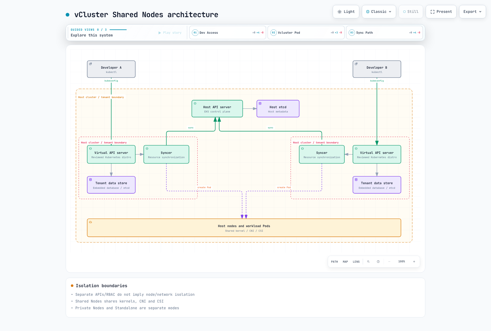
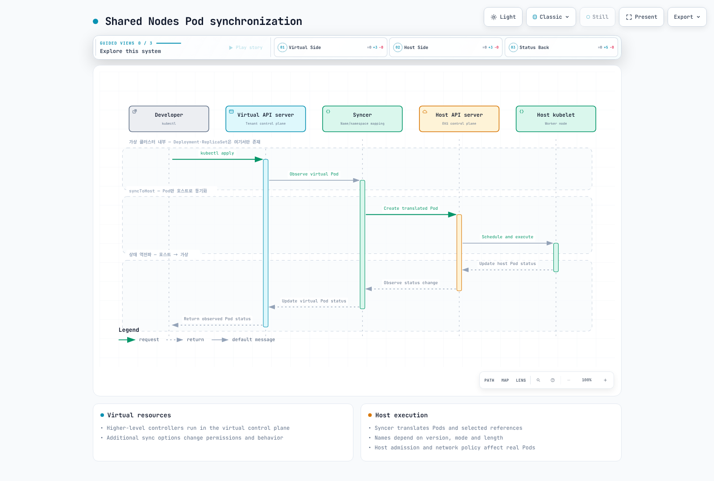
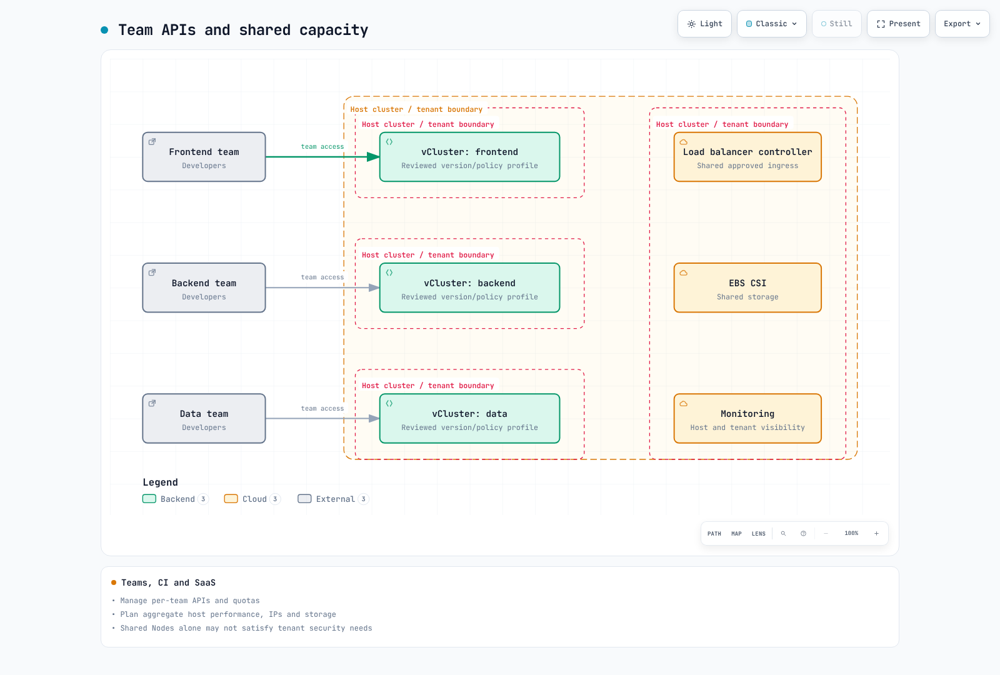
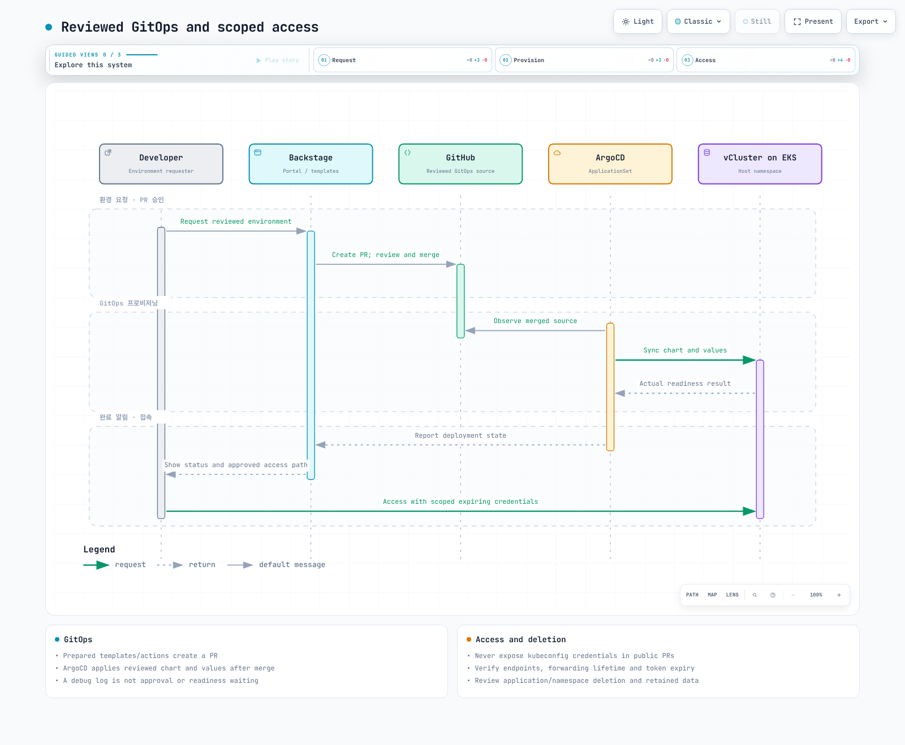

# vCluster

> **Last Updated**: September 13, 2026 · Reviewed baseline: vCluster 0.37.0

## Concepts and Isolation Boundaries

vCluster can provide separate Kubernetes APIs, controllers and data stores for tenants. In this **Shared Nodes** example, workloads run on host-cluster nodes, sharing kernels, CNI, CSI and capacity. Separate API/RBAC does not establish complete hardware, network or performance isolation.

| Mode | Boundaries to evaluate |
| --- | --- |
| Namespace | Shares API server, cluster resources and nodes; needs RBAC, quotas and network policy. |
| Shared Nodes vCluster | Separates tenant APIs while sharing workload nodes, CNI and CSI. |
| Dedicated/Private Nodes | Verify node placement and the actual Private Nodes CNI/CSI boundaries. |
| Standalone | A different deployment mode on infrastructure without a host control-plane cluster. |
| Separate Kubernetes cluster | Isolation still depends on shared accounts, VPCs, administrators and hardware. |

The public repository uses Apache 2.0. Check distribution images, Platform features, support and entitlements separately. The original “CNCF Sandbox since November 2024” claim could not be confirmed from the official project page and has been removed. Kubernetes conformance is distinct from CNCF project membership.

Do not promise sub-30-second creation, 100–200MiB overhead, hundreds of clusters or 60–70% savings. Measure the actual profile, host API load, PVCs, image pulls, workloads and billing model.



[Interactive diagram](https://www.atomai.click/kubernetes-docs/archmaps/en-platform-engineering-08-vcluster-10.html)

## Current Version and Baseline

During review, GitHub's latest endpoint returned 0.36.1, but an explicit stable 0.37.0 release dated September 8, 2026 was verified. This example therefore targets CLI/chart 0.37.0 and the verified ghcr.io/loft-sh/kubernetes:v1.36.3 image. Image execution and full runtime compatibility remain separate checks.

The current schema has no old k3s/k0s distro settings. Distinguish k8s configuration, backing store and exact versions. The default chart image is vcluster-pro; its name alone does not determine source licensing or free-use entitlements.

This Shared Nodes profile uses one replica, an embedded database and a PVC. Operators must prepare gp3 storage/CSI, quotas, identities and host policies.

```yaml
controlPlane:
  distro:
    k8s:
      enabled: true
      image:
        tag: v1.36.3
  backingStore:
    database:
      embedded:
        enabled: true
  statefulSet:
    highAvailability:
      replicas: 1
    resources:
      requests:
        cpu: 200m
        memory: 512Mi
        ephemeral-storage: 1Gi
      limits:
        cpu: "2"
        memory: 4Gi
        ephemeral-storage: 10Gi
    persistence:
      volumeClaim:
        enabled: true
        storageClass: gp3
        size: 10Gi
        retentionPolicy: Retain
  service:
    spec:
      type: ClusterIP
  ingress:
    enabled: false
sync:
  fromHost:
    nodes:
      enabled: false
    storageClasses:
      enabled: true
  toHost:
    pods:
      enabled: true
    services:
      enabled: true
    configMaps:
      enabled: true
      all: false
    secrets:
      enabled: true
      all: false
    persistentVolumeClaims:
      enabled: true
    ingresses:
      enabled: false
    serviceAccounts:
      enabled: false
    networkPolicies:
      enabled: false
privateNodes:
  enabled: false
policies:
  podSecurityStandard: restricted
telemetry:
  enabled: false
```

The profile passed actual schema and Helm checks. However, Helm also renders an embedded-database/three-replica combination that runtime source rejects. HA requires a supported store, quorum, storage and recovery validation; increasing replicas alone is insufficient.

Keys such as configMaps, serviceAccounts and persistentVolumeClaims are case-sensitive. Auto defaults for StorageClass/CSI depend on deployment mode, so they are not universally synchronized. This profile explicitly disables ingress, ServiceAccount and NetworkPolicy synchronization.



[Interactive diagram](https://www.atomai.click/kubernetes-docs/archmaps/en-platform-engineering-08-vcluster-11.html)

Distinguish virtual Deployment/ReplicaSet controllers from actual host Pods. Syncer naming/label translation depends on mode, length and version; do not guess names in IRSA trust or operational scripts. fromHost.nodes visibility does not automatically enforce workload-node isolation.

## Installation and Access

Select CLI artifacts for the correct OS/architecture and verify official checksums. These example commands can affect a real cluster; verify HOST_CONTEXT and namespace first. No create/delete/snapshot operation was executed during this audit.

```bash
helm repo add loft-sh https://charts.loft.sh
helm repo update
helm template team-alpha loft-sh/vcluster   --version 0.37.0 --namespace vcluster-team-alpha   -f examples/platform/vcluster/vcluster.yaml

# After the reviewed host prerequisites are ready:
vcluster create team-alpha --driver helm --context HOST_CONTEXT   --namespace vcluster-team-alpha --chart-version 0.37.0   --values examples/platform/vcluster/vcluster.yaml --connect=false

# Keep the forwarding lifetime tied to the child command:
vcluster connect team-alpha --driver helm --context HOST_CONTEXT   --namespace vcluster-team-alpha --background-proxy=false --   kubectl get namespaces
```

connect manages the access path and kubeconfig. The old --update-current/--kube-config options are deprecated aliases, not removed flags. --print can output credentials; store them in restricted files rather than chats, logs or PRs.

Reusable external kubeconfigs need a reachable API endpoint, matching certificate SAN/CA and appropriate credential expiry. Saving a localhost forwarding address does not preserve access after forwarding stops. Background proxies can need Docker and another image. Use per-user, minimally privileged ServiceAccounts and review --token-expiration instead of sharing admin credentials.

Use --context HOST_CONTEXT for host operations so namespace deletion/backups do not accidentally target tenant contexts. For parallel training provisioning, collect every exit status instead of reporting universal readiness after failures.

## EKS Storage, Ingress and IAM

With Shared Nodes, PVCs synchronize to the host and host CSI handles volumes. Check StorageClass, volumeBindingMode, topology, reclaim and retention together. The current profile uses statefulSet.persistence.volumeClaim.storageClass/size.

Synchronizing Ingress needs a real host LBC/IngressClass, Service references, TLS, security groups and approved access paths. Replicating the host LBC webhook Service into a tenant does not establish ALB integration. Put Service annotations under controlPlane.service.annotations; service.spec.annotations is not a Kubernetes ServiceSpec field.

When ServiceAccount sync is disabled, host workload-ServiceAccount behavior applies; when enabled, verify actual translation and synchronization. Copying virtual Pod annotations alone does not configure IRSA. Check host ServiceAccount, token issuer/subject/audience, role trust and injection. Restrict tenant-controlled IAM-role annotations.

## Isolation and Governance

```yaml
apiVersion: v1
kind: Namespace
metadata:
  name: vcluster-team-alpha
  labels:
    platform.example.com/tenant: team-alpha
    pod-security.kubernetes.io/enforce: baseline
    pod-security.kubernetes.io/enforce-version: v1.36
---
apiVersion: v1
kind: ResourceQuota
metadata:
  name: vcluster-budget
  namespace: vcluster-team-alpha
spec:
  hard:
    requests.cpu: "8"
    requests.memory: 16Gi
    limits.cpu: "16"
    limits.memory: 32Gi
    requests.ephemeral-storage: 20Gi
    limits.ephemeral-storage: 80Gi
    pods: "50"
    services: "20"
    services.loadbalancers: "0"
    services.nodeports: "0"
    persistentvolumeclaims: "10"
    requests.storage: 100Gi
---
apiVersion: v1
kind: LimitRange
metadata:
  name: workload-defaults
  namespace: vcluster-team-alpha
spec:
  limits:
    - type: Container
      defaultRequest:
        cpu: 100m
        memory: 128Mi
      default:
        cpu: "1"
        memory: 512Mi
```

The chart renders the control-plane Syncer as UID 0. Applying restricted blindly to the host namespace can reject the control plane. Host baseline admission and profile policies.podSecurityStandard: restricted target different layers: host Pods versus virtual workload validation. Check translated Pods against actual host policy.

Quota budgets include control plane, CoreDNS, tenant workloads and storage. Quotas reserve no node capacity and guarantee no performance. Inspect generated Roles/ClusterRoles and Secret access; do not grant tenants arbitrary host Secret/Role modification.

Optionally render the chart's network policies with these values.

```yaml
policies:
  networkPolicy:
    enabled: true
    workload:
      publicEgress:
        enabled: false
```

Actual rendering disabled workload public egress but retained broad control-plane egress on ports including 443/8443/6443. This is not presented as complete host-API blocking. NetworkPolicy allows are additive; adding a separate “deny” policy cannot reduce an existing allow.

The Syncer needs host API access. Applying the same deny-egress to the control plane can stop synchronization. Verify DNS, endpoint IP/DNAT, required application/database/registry paths and CNI behavior. Use trusted control-plane/workload classification for default-deny and exceptions.



[Interactive diagram](https://www.atomai.click/kubernetes-docs/archmaps/en-platform-engineering-08-vcluster-12.html)

## Pause, Sleep, Deletion and Snapshots

Current CLI pause scales down the virtual control plane and removes workloads, which are recreated on resume. PVCs and Services follow separate retention behavior. This is not suspend preserving Pod memory or a data backup. Distinguish manual pause from automatic sleep/wake conditions.

These lifecycle settings are optional. Verify product entitlement, controllers and workload behavior first. Automatic deletion is not enabled here.

```yaml
# Optional configuration: verify product entitlement and workload behavior first.
sleep:
  auto:
    afterInactivity: 30m
    schedule: "0 20 * * 1-5"
    timezone: Etc/UTC
    wakeup:
      schedule: "0 8 * * 1-5"
# No automatic deletion is enabled by this example.
deletion:
  prevent: true
```

Current settings use paths such as sleep.auto and deletion.auto. The former invented management.loft.sh/VirtualCluster fields are not the current configuration contract. A TTL label/annotation alone triggers no deletion; use an actual controller policy and review ownership, active workloads and backups.

Namespace deletion can remove PVCs and remaining workloads. Distinguish vcluster delete, Helm uninstall and ArgoCD Application removal, including PVC retention, PV reclaim and external resources. Deletion-prevention settings do not necessarily block a host administrator deleting the namespace directly.

snapshot create submits an asynchronous request. Request success is not ready status or successful restoration. A PV name is not an EBS volume ID; verify spec.csi.driver and volumeHandle for EBS. Live database snapshots need consistency, quiescing and restoration tests.

Chart 0.37 rejects deploy.volumeSnapshotController but supports paired volumeSnapshots/volumeSnapshotContents sync again. Stale schema comments were not treated as proof that all snapshot sync was removed. Prepare CSI snapshot controllers/classes and both options, then test restore separately. Plaintext exports of Secrets are not a complete backup strategy.


[Interactive diagram](https://www.atomai.click/kubernetes-docs/archmaps/en-platform-engineering-08-vcluster-14.html)

## Backstage, ArgoCD and Ephemeral Environments

Team development, CI, previews, training and SaaS have different trust, performance and lifecycle requirements. Do not assume development workloads tolerate every Spot interruption or that SaaS tenants cannot affect one another.

For CI, configure host identity, trusted events/branches and OIDC permissions. Do not expose host credentials to untrusted fork code. Use explicit namespace/context across create, connect, test and cleanup, tying forwarding lifetime to tests. Independent cleanup jobs need tools and identity too; check all exit statuses.

This ApplicationSet includes the previously missing $values sourceRef. Store gitops-config.yaml as vclusters/team-alpha/config.yaml and the reviewed vcluster.yaml beside it. Replace repositories and AppProject/destination permissions with approved values.

```yaml
apiVersion: argoproj.io/v1alpha1
kind: ApplicationSet
metadata:
  name: reviewed-vclusters
  namespace: argocd
spec:
  goTemplate: true
  goTemplateOptions: ["missingkey=error"]
  generators:
    - git:
        repoURL: https://github.com/REPLACE_APPROVED_ORG/platform-config
        revision: main
        files:
          - path: vclusters/*/config.yaml
  syncPolicy:
    preserveResourcesOnDeletion: true
  template:
    metadata:
      name: "vcluster-{{ .name }}"
    spec:
      project: vcluster-tenants
      sources:
        - repoURL: https://charts.loft.sh
          chart: vcluster
          targetRevision: "0.37.0"
          helm:
            releaseName: "{{ .name }}"
            valueFiles:
              - "$values/vclusters/{{ .name }}/vcluster.yaml"
        - repoURL: https://github.com/REPLACE_APPROVED_ORG/platform-config
          targetRevision: main
          ref: values
      destination:
        server: https://kubernetes.default.svc
        namespace: "{{ .namespace }}"
      syncPolicy:
        automated:
          selfHeal: true
          prune: false
        syncOptions: [CreateNamespace=true]
```

preserveResourcesOnDeletion and prune:false are deliberate choices to avoid treating config removal as immediate data deletion. Track retained-resource ownership/costs and a separate decommission process. A Backstage debug:log action does not implement approval or deployment waiting.



[Interactive diagram](https://www.atomai.click/kubernetes-docs/archmaps/en-platform-engineering-08-vcluster-13.html)

## Observability, Resources and Cost

Do not automatically alert on a deliberately paused StatefulSet with zero desired replicas. A single aggregate absent() can miss one failed cluster while another remains healthy. Use actual job/namespace/pod/container labels, metrics endpoints and desired-state inventory. The chart container is named syncer; do not invent vcluster_syncer_* metrics.

Requests are not utilization or bills. CPU 1 and 250m, or memory 1Gi and 512Mi, cannot be added as bare numeric strings. examples/platform/vcluster/usage uses Kubernetes PodRequests to handle units, init containers, overhead and Pod-level requests.

```bash
# Run inside examples/platform/vcluster/usage with the pinned Go dependencies:
kubectl --context HOST_CONTEXT get pods -n vcluster-team-alpha -o json | go run .
```

The tool sums spec-based requests of non-terminal Pods, not actual RSS/CPU, resize status or PVC costs. Three synthetic cases were tested; no live cluster query was run for this tool.

Reducing active time from 168 to 50 hours does not proportionally reduce node, EBS, load-balancer and license costs. Compare actual node scale-down, retained storage, commitments and minimum capacity with bills. Kubernetes labels do not automatically become AWS cost-allocation tags.

Do not instruct EKS users to directly resize managed API-server/etcd replicas or instances. Review supported managed-plane settings/quotas and request load. Pin chart/CLI/Kubernetes/store combinations, validate backups/staging, and account for identical Helm release names in different namespaces.

## Checks Performed

The 1,998-line Korean and 2,171-line English guides, both 143-line quizzes and 106 unique code blocks were read. Version 0.37.0 schema, Helm profiles, lifecycle/network-policy rendering, official checksums/image index and Kubernetes resource accounting were verified. Differences between schema and runtime validation were recorded.

Two 0.36.1 attempts to inspect deprecated connection flags queried the existing cluster read-only and failed Unauthorized. No resources changed; subsequent 0.37 checks were restricted to version/help/source and offline charts. No vCluster creation, image execution, sleep/deletion/snapshot/restore, network isolation, IAM authentication, load or cost savings was validated.

- [vCluster 0.37.0](https://github.com/loft-sh/vcluster/releases/tag/v0.37.0)
- [Versioned configuration](https://github.com/loft-sh/vcluster/blob/v0.37.0/config/values.yaml)
- [Versioned schema](https://github.com/loft-sh/vcluster/blob/v0.37.0/chart/values.schema.json)
- [Architecture](https://www.vcluster.com/docs/vcluster/introduction/architecture)
- [Sleep configuration](https://www.vcluster.com/docs/vcluster/configure/vcluster-yaml/sleep)

[Backstage](06-backstage-idp.md) · [Crossplane](07-crossplane.md)

[vCluster quiz](../quizzes/platform-engineering/08-vcluster-quiz.md)
