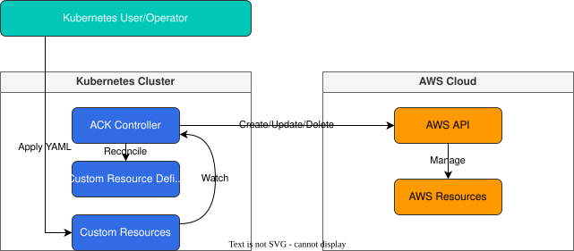

# AWS Controllers for Kubernetes (ACK)

## Table of Contents
- [Introduction](#introduction)
- [Architecture](#architecture)
- [Installation and Configuration](#installation-and-configuration)
- [Supported AWS Services](#supported-aws-services)
- [S3 and IAM Resource Creation Examples](#s3-and-iam-resource-creation-examples)
- [SQS and SNS Creation Examples](#sqs-and-sns-creation-examples)
- [Resource Management](#resource-management)
- [Security Considerations](#security-considerations)
- [Monitoring and Logging](#monitoring-and-logging)
- [Best Practices](#best-practices)
- [Troubleshooting](#troubleshooting)
- [Conclusion](#conclusion)

## Introduction

AWS Controllers for Kubernetes (ACK) is a project that enables Kubernetes users to directly manage AWS services and resources through the Kubernetes API. ACK extends Kubernetes' declarative API model to AWS resources, allowing developers and operators to manage AWS infrastructure using familiar Kubernetes tools and APIs.

### Key Benefits of ACK

- **Unified Experience**: Manage Kubernetes and AWS resources with the same tools and workflows
- **GitOps Support**: Define AWS resources as code and manage them in Git repositories
- **Declarative Configuration**: Define desired state and let the controller reconcile actual state
- **Kubernetes Native Approach**: Use standard Kubernetes concepts and APIs
- **Multi-Cluster Support**: Reference the same AWS resources from multiple clusters
- **IAM Integration**: Integration of Kubernetes service accounts with AWS IAM roles

### Comparison with Existing Approaches

| Feature | ACK | AWS CloudFormation | Terraform | AWS SDK/CLI |
|---------|-----|-------------------|-----------|-------------|
| Interface | Kubernetes API | CloudFormation templates | HCL | Programming API/CLI |
| Declarative | ✅ | ✅ | ✅ | ❌ |
| State Management | Kubernetes etcd | CloudFormation stack | Terraform state | Manual management |
| Drift Detection | ✅ | ✅ | ✅ | ❌ |
| Kubernetes Integration | Native | Limited | Limited | Limited |
| Supported Services | Limited (expanding) | Extensive | Extensive | All services |

## Architecture

ACK is based on the Kubernetes operator pattern and provides controllers for each AWS service.



### Key Components

1. **Service Controller**: Dedicated controller for each AWS service
2. **Custom Resource Definitions (CRD)**: Define AWS resources as Kubernetes API
3. **Custom Resources (CR)**: Instances of AWS resources
4. **Reconciliation Loop**: Detects and resolves differences between desired and actual state

### How It Works

1. User applies Kubernetes YAML manifest to define AWS resource
2. ACK controller detects custom resource changes
3. Controller calls AWS API to create, update, or delete the corresponding AWS resource
4. Controller monitors AWS resource state and updates Kubernetes resource status

## Installation and Configuration

### Prerequisites

- Kubernetes cluster (v1.16 or higher)
- kubectl configured
- AWS account and appropriate IAM permissions
- Helm 3 (optional)

### Installation Methods

#### 1. Installing ACK Service Controller

ACK controllers are installed separately for each AWS service. For example, to install the S3 controller:

```bash
# Add Helm chart repository
helm repo add aws-controllers-k8s https://aws.github.io/eks-charts

# Install S3 controller
helm install --create-namespace -n ack-system ack-s3-controller \
  aws-controllers-k8s/s3-chart
```

#### 2. IAM Permission Setup

ACK controllers need appropriate IAM permissions to manage AWS resources. You can set up permissions using IRSA (IAM Roles for Service Accounts):

```bash
# Create IAM policy
aws iam create-policy \
  --policy-name ACKs3ControllerPolicy \
  --policy-document file://s3-controller-policy.json

# Attach IAM role to service account
eksctl create iamserviceaccount \
  --cluster=<cluster-name> \
  --namespace=ack-system \
  --name=ack-s3-controller \
  --attach-policy-arn=arn:aws:iam::<account-id>:policy/ACKs3ControllerPolicy \
  --approve
```

s3-controller-policy.json example:

```json
{
  "Version": "2012-10-17",
  "Statement": [
    {
      "Effect": "Allow",
      "Action": [
        "s3:CreateBucket",
        "s3:DeleteBucket",
        "s3:PutBucketTagging",
        "s3:GetBucketTagging",
        "s3:PutEncryptionConfiguration",
        "s3:GetEncryptionConfiguration",
        "s3:PutBucketPolicy",
        "s3:GetBucketPolicy",
        "s3:ListBucket"
      ],
      "Resource": "*"
    }
  ]
}
```

#### 3. Controller Configuration

You can use Helm values files to customize controller configuration:

```yaml
# values.yaml
aws:
  region: us-west-2
resources:
  requests:
    cpu: 100m
    memory: 128Mi
  limits:
    cpu: 500m
    memory: 256Mi
serviceAccount:
  annotations:
    eks.amazonaws.com/role-arn: arn:aws:iam::<account-id>:role/ACKs3ControllerRole
```

```bash
helm install --create-namespace -n ack-system ack-s3-controller \
  aws-controllers-k8s/s3-chart -f values.yaml
```

## Supported AWS Services

ACK provides controllers for various AWS services. Each service controller can be installed and managed individually.

### Currently Supported Services (as of July 2025)

- Amazon API Gateway (apigatewayv2)
- Amazon DynamoDB
- Amazon ECR
- Amazon EKS
- Amazon ElastiCache
- Amazon MemoryDB
- Amazon MQ
- Amazon RDS
- Amazon S3
- Amazon SageMaker
- AWS IAM
- AWS Lambda
- AWS SNS
- AWS SQS
- Amazon EventBridge
- Amazon MSK
- Amazon OpenSearch Service
- AWS ACM
- AWS Route 53

### Service Controller Status

Each service controller has one of the following states:

- **Alpha**: Early development stage, API may change
- **Beta**: Feature complete, stable but API may change
- **GA (Generally Available)**: Ready for production use

Check the latest status at the [ACK GitHub Repository](https://github.com/aws-controllers-k8s/community).

## S3 and IAM Resource Creation Examples

### Creating S3 Bucket

```yaml
apiVersion: s3.services.k8s.aws/v1alpha1
kind: Bucket
metadata:
  name: my-sample-bucket
spec:
  name: my-unique-bucket-name-123
  tagging:
    tagSet:
      - key: Environment
        value: Development
      - key: Project
        value: ACK-Demo
  createBucketConfiguration:
    locationConstraint: us-west-2
```

### Setting S3 Bucket Policy

```yaml
apiVersion: s3.services.k8s.aws/v1alpha1
kind: BucketPolicy
metadata:
  name: my-bucket-policy
spec:
  bucket: my-unique-bucket-name-123
  policy: |
    {
      "Version": "2012-10-17",
      "Statement": [
        {
          "Effect": "Allow",
          "Principal": {
            "AWS": "arn:aws:iam::123456789012:role/MyRole"
          },
          "Action": [
            "s3:GetObject"
          ],
          "Resource": [
            "arn:aws:s3:::my-unique-bucket-name-123/*"
          ]
        }
      ]
    }
```

### Creating IAM Role

```yaml
apiVersion: iam.services.k8s.aws/v1alpha1
kind: Role
metadata:
  name: my-iam-role
spec:
  name: MyApplicationRole
  assumeRolePolicyDocument: |
    {
      "Version": "2012-10-17",
      "Statement": [
        {
          "Effect": "Allow",
          "Principal": {
            "Service": "ec2.amazonaws.com"
          },
          "Action": "sts:AssumeRole"
        }
      ]
    }
  description: "Role for my application"
  maxSessionDuration: 3600
  tags:
    - key: Environment
      value: Development
```

### Creating and Attaching IAM Policy

```yaml
apiVersion: iam.services.k8s.aws/v1alpha1
kind: Policy
metadata:
  name: my-s3-access-policy
spec:
  name: S3ReadOnlyAccess
  policyDocument: |
    {
      "Version": "2012-10-17",
      "Statement": [
        {
          "Effect": "Allow",
          "Action": [
            "s3:Get*",
            "s3:List*"
          ],
          "Resource": "*"
        }
      ]
    }
  description: "Policy for S3 read-only access"
---
apiVersion: iam.services.k8s.aws/v1alpha1
kind: RolePolicyAttachment
metadata:
  name: attach-s3-policy
spec:
  policyARN: arn:aws:iam::123456789012:policy/S3ReadOnlyAccess
  roleName: MyApplicationRole
```

## SQS and SNS Creation Examples

### Creating SQS Queue

```yaml
apiVersion: sqs.services.k8s.aws/v1alpha1
kind: Queue
metadata:
  name: my-standard-queue
spec:
  name: my-standard-queue
  queueAttributes:
    - key: DelaySeconds
      value: "0"
    - key: MaximumMessageSize
      value: "262144"
    - key: MessageRetentionPeriod
      value: "345600"
    - key: VisibilityTimeout
      value: "30"
  tags:
    - key: Environment
      value: Development
```

### Creating SQS FIFO Queue

```yaml
apiVersion: sqs.services.k8s.aws/v1alpha1
kind: Queue
metadata:
  name: my-fifo-queue
spec:
  name: my-fifo-queue.fifo
  queueAttributes:
    - key: FifoQueue
      value: "true"
    - key: ContentBasedDeduplication
      value: "true"
  tags:
    - key: Environment
      value: Development
```

### Creating SNS Topic

```yaml
apiVersion: sns.services.k8s.aws/v1alpha1
kind: Topic
metadata:
  name: my-notification-topic
spec:
  name: my-notification-topic
  attributes:
    - key: DisplayName
      value: "My Notification Topic"
  tags:
    - key: Environment
      value: Development
```

### Creating SNS Subscription

```yaml
apiVersion: sns.services.k8s.aws/v1alpha1
kind: Subscription
metadata:
  name: my-email-subscription
spec:
  topicARN: arn:aws:sns:us-west-2:123456789012:my-notification-topic
  protocol: email
  endpoint: user@example.com
  attributes:
    - key: FilterPolicy
      value: |
        {
          "event_type": ["order_placed", "order_shipped"]
        }
```

### Integrating SQS and SNS

```yaml
apiVersion: sns.services.k8s.aws/v1alpha1
kind: Subscription
metadata:
  name: my-sqs-subscription
spec:
  topicARN: arn:aws:sns:us-west-2:123456789012:my-notification-topic
  protocol: sqs
  endpoint: arn:aws:sqs:us-west-2:123456789012:my-standard-queue
  attributes:
    - key: RawMessageDelivery
      value: "true"
```

## Resource Management

### Checking Resource Status

To check the status of ACK resources:

```bash
kubectl describe bucket my-sample-bucket
```

Example output:

```
Name:         my-sample-bucket
Namespace:    default
API Version:  s3.services.k8s.aws/v1alpha1
Kind:         Bucket
Metadata:
  ...
Spec:
  Name:  my-unique-bucket-name-123
  ...
Status:
  Ack Resource Metadata:
    Arn:                    arn:aws:s3:::my-unique-bucket-name-123
    Owner Account ID:       123456789012
  Conditions:
    Last Transition Time:  2025-07-13T04:00:00Z
    Status:                True
    Type:                  ACK.ResourceSynced
```

### Updating Resources

To update an ACK resource, modify the manifest and reapply:

```bash
kubectl apply -f updated-bucket.yaml
```

### Deleting Resources

To delete an ACK resource:

```bash
kubectl delete bucket my-sample-bucket
```

By default, ACK also deletes the corresponding AWS resource when the Kubernetes resource is deleted. You can change this behavior using annotations:

```yaml
metadata:
  annotations:
    services.k8s.aws/deletion-policy: "orphan"
```

### Importing Resources

To import existing AWS resources into ACK:

```yaml
apiVersion: s3.services.k8s.aws/v1alpha1
kind: Bucket
metadata:
  name: imported-bucket
  annotations:
    services.k8s.aws/resource-imported: "true"
spec:
  name: existing-bucket-name
```

## Security Considerations

### IAM Permission Management

ACK controllers need appropriate IAM permissions for the AWS resources they manage. It's recommended to follow the principle of least privilege and grant only necessary permissions.

#### Granular IAM Policy Example

```json
{
  "Version": "2012-10-17",
  "Statement": [
    {
      "Effect": "Allow",
      "Action": [
        "s3:CreateBucket",
        "s3:DeleteBucket",
        "s3:GetBucketTagging",
        "s3:PutBucketTagging"
      ],
      "Resource": "arn:aws:s3:::my-unique-bucket-name-*"
    },
    {
      "Effect": "Allow",
      "Action": [
        "s3:ListAllMyBuckets"
      ],
      "Resource": "*"
    }
  ]
}
```

### Namespace Isolation

You can use separate namespaces and IAM roles for different teams or environments to isolate permissions:

```bash
# Install controller for development environment
helm install --create-namespace -n ack-system-dev ack-s3-controller \
  aws-controllers-k8s/s3-chart \
  --set serviceAccount.annotations."eks\.amazonaws\.com/role-arn"=arn:aws:iam::123456789012:role/ACKs3ControllerRoleDev

# Install controller for production environment
helm install --create-namespace -n ack-system-prod ack-s3-controller \
  aws-controllers-k8s/s3-chart \
  --set serviceAccount.annotations."eks\.amazonaws\.com/role-arn"=arn:aws:iam::123456789012:role/ACKs3ControllerRoleProd
```

### Resource Policies

You can use Kubernetes RBAC to restrict access to ACK resources:

```yaml
apiVersion: rbac.authorization.k8s.io/v1
kind: Role
metadata:
  namespace: dev
  name: s3-editor
rules:
- apiGroups: ["s3.services.k8s.aws"]
  resources: ["buckets"]
  verbs: ["get", "list", "watch", "create", "update", "patch", "delete"]
---
apiVersion: rbac.authorization.k8s.io/v1
kind: RoleBinding
metadata:
  name: dev-s3-editor
  namespace: dev
subjects:
- kind: User
  name: developer
  apiGroup: rbac.authorization.k8s.io
roleRef:
  kind: Role
  name: s3-editor
  apiGroup: rbac.authorization.k8s.io
```

## Monitoring and Logging

### Checking Controller Logs

To check ACK controller logs:

```bash
kubectl logs -n ack-system -l app.kubernetes.io/name=ack-s3-controller
```

### Prometheus Metrics

ACK controllers expose Prometheus metrics:

```yaml
apiVersion: monitoring.coreos.com/v1
kind: ServiceMonitor
metadata:
  name: ack-s3-controller
  namespace: monitoring
spec:
  selector:
    matchLabels:
      app.kubernetes.io/name: ack-s3-controller
  endpoints:
  - port: metrics
    interval: 30s
```

Key metrics:

- `ack_reconcile_success_total`: Number of successful reconciliations
- `ack_reconcile_failure_total`: Number of failed reconciliations
- `ack_api_call_duration_seconds`: AWS API call latency

### AWS CloudTrail Integration

AWS API calls made by ACK controllers are logged in CloudTrail. You can review CloudTrail logs to audit ACK operations.

## Best Practices

### Resource Organization

1. **Clear Naming**: Use clear and consistent resource names
2. **Use Annotations**: Leverage annotations for resource management
3. **Apply Labels**: Use labels for resource grouping and filtering

```yaml
apiVersion: s3.services.k8s.aws/v1alpha1
kind: Bucket
metadata:
  name: app-data-bucket
  annotations:
    services.k8s.aws/deletion-policy: "orphan"
    description: "Application data storage"
  labels:
    environment: production
    app: my-application
    team: data-engineering
spec:
  name: my-app-data-20250713
  tagging:
    tagSet:
      - key: Environment
        value: Production
```

### Version Control

1. **Use Git Repository**: Store ACK resource manifests in Git repository
2. **Separate Environment Configurations**: Maintain separate configurations for development, staging, production environments
3. **Use Kustomize**: Use Kustomize to manage environment-specific differences

```
├── base/
│   ├── s3-bucket.yaml
│   ├── sqs-queue.yaml
│   └── kustomization.yaml
├── overlays/
│   ├── dev/
│   │   ├── kustomization.yaml
│   │   └── patch.yaml
│   ├── staging/
│   │   ├── kustomization.yaml
│   │   └── patch.yaml
│   └── prod/
│       ├── kustomization.yaml
│       └── patch.yaml
```

### Performance and Scalability

1. **Set Resource Requests and Limits**: Allocate appropriate resources to controllers
2. **Scale Controller Replicas**: Increase controller replicas in large environments
3. **Adjust Reconciliation Frequency**: Optimize reconciliation frequency as needed

```yaml
apiVersion: helm.toolkit.fluxcd.io/v2beta1
kind: HelmRelease
metadata:
  name: ack-s3-controller
  namespace: ack-system
spec:
  chart:
    spec:
      chart: s3-chart
      sourceRef:
        kind: HelmRepository
        name: aws-controllers-k8s
  values:
    resources:
      requests:
        cpu: 200m
        memory: 256Mi
      limits:
        cpu: 500m
        memory: 512Mi
    replicaCount: 2
```

### Disaster Recovery

1. **Backup Strategy**: Regular backup of ACK resource manifests
2. **Recovery Plan**: Document resource recovery procedures in case of failure
3. **Multi-Region Consideration**: Implement multi-region strategy for critical resources

## Troubleshooting

### Common Issues

#### 1. Resource Creation Failure

**Symptom**: ACK resource is created but AWS resource is not created

**Solution**:
- Check controller logs
- Verify IAM permissions
- Check resource status and events

```bash
kubectl logs -n ack-system -l app.kubernetes.io/name=ack-s3-controller
kubectl describe bucket my-sample-bucket
```

#### 2. Permission Issues

**Symptom**: "AccessDenied" error message

**Solution**:
- Verify IAM policies and roles
- Check IRSA configuration
- Review CloudTrail logs

#### 3. Resource Deletion Stuck

**Symptom**: Resource stuck in "Terminating" state

**Solution**:
- Check dependencies
- Remove finalizers (if necessary)

```bash
kubectl patch bucket my-sample-bucket -p '{"metadata":{"finalizers":[]}}' --type=merge
```

### Debugging Tools

```bash
# Check controller version
kubectl get deployment -n ack-system ack-s3-controller -o jsonpath="{.spec.template.spec.containers[0].image}"

# Check CRDs
kubectl get crd | grep services.k8s.aws

# Check events
kubectl get events --field-selector involvedObject.name=my-sample-bucket

# Check controller logs in detail
kubectl logs -n ack-system -l app.kubernetes.io/name=ack-s3-controller --tail=100
```

## Conclusion

AWS Controllers for Kubernetes (ACK) is a powerful tool that bridges the gap between Kubernetes and AWS services. ACK allows Kubernetes users to manage AWS resources using familiar Kubernetes APIs and tools.

This document covered the basic concepts of ACK, installation methods, S3, IAM, SQS, SNS resource creation examples, resource management, security considerations, monitoring, and troubleshooting.

ACK continues to evolve, with support being added for more AWS services. Combined with GitOps workflows, it provides a powerful way to manage AWS infrastructure as code.

### Next Steps

- Build GitOps pipelines using ACK
- Integrate multiple AWS service controllers
- Extend custom resource definitions
- Develop multi-account and multi-region strategies

## References

- [ACK Official Documentation](https://aws-controllers-k8s.github.io/community/)
- [ACK GitHub Repository](https://github.com/aws-controllers-k8s/community)
- [AWS Service Controller List](https://aws-controllers-k8s.github.io/community/docs/community/services/)
- [ACK Design Principles](https://aws-controllers-k8s.github.io/community/docs/community/design/)
- [EKS Workshop - ACK](https://www.eksworkshop.com/intermediate/290_ack/)

## Quiz

To test what you've learned in this chapter, try the [topic quiz](../quizzes/platform/03-ack-quiz.md).
