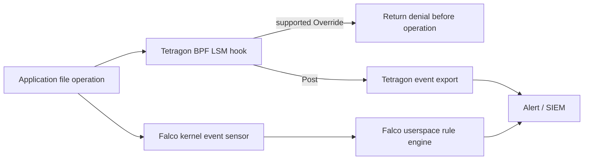

# eBPF Fundamentals Quiz

> **Supported Versions**: Feature-specific kernel/BTF/helper requirements; match tool and Kubernetes compatibility matrices
> **Last Updated**: September 11, 2026

This quiz tests your overall understanding of eBPF (extended Berkeley Packet Filter), from basic concepts to its applications in Kubernetes environments.

## Multiple Choice Questions

1. What does the eBPF verifier NOT check?
   - A) No infinite loops
   - B) No out-of-bounds memory access
   - C) Program execution speed
   - D) No use of uninitialized variables

<details>
<summary>View Answer</summary>

**Answer: C) Program execution speed**

**Explanation:**
The eBPF verifier checks for bounded control flow and termination (including supported bounded loops), no out-of-bounds memory access, no use of uninitialized variables, correct helper function calls, and guaranteed program termination to ensure program safety. Program execution speed is not a verification item for the verifier.

</details>

2. Which XDP (eXpress Data Path) program return value sends the packet back to the same NIC?
   - A) XDP_DROP
   - B) XDP_PASS
   - C) XDP_TX
   - D) XDP_REDIRECT

<details>
<summary>View Answer</summary>

**Answer: C) XDP_TX**

**Explanation:**
XDP program return values have the following meanings:
- `XDP_DROP`: Drop packet
- `XDP_PASS`: Pass to kernel stack
- `XDP_TX`: Return packet to same NIC
- `XDP_REDIRECT`: Forward to another interface
- `XDP_ABORTED`: Error handling

XDP_TX is used when you want to send the packet back to the network interface that received it.

</details>

3. What is NOT a primary role of eBPF Maps?
   - A) Data sharing between kernel and user space
   - B) State storage
   - C) Compiling eBPF programs
   - D) Event data transmission

<details>
<summary>View Answer</summary>

**Answer: C) Compiling eBPF programs**

**Explanation:**
eBPF maps are data structures used to share data between kernel and user space and to store state. Maps are used for event data transmission (PERF_EVENT_ARRAY, RINGBUF), key-value storage (HASH), statistics collection (PERCPU_ARRAY), and more. Compiling eBPF programs is handled by Clang/LLVM and is not a role of maps.

</details>

4. What is the main advantage that eBPF provides when Cilium replaces kube-proxy?
   - A) O(n) performance proportional to the number of services
   - B) Requires iptables rule evaluation
   - C) Average constant-time hash-map lookup, avoiding a linear Service rule scan
   - D) Uses Netfilter

<details>
<summary>View Answer</summary>

**Answer: C) Average constant-time hash-map lookup, avoiding a linear Service rule scan**

**Explanation:**
A linear iptables Service-rule scan for a new flow can grow with rule count; established flows can use conntrack. Cilium avoids that scan using maps, whose complexity depends on map type. Hash-map lookup is typically constant-time on average; end-to-end latency, CPU and throughput still depend on workload, map type, contention and configuration.

</details>

5. What is the primary purpose of bpftrace?
   - A) Compiling eBPF programs to C
   - B) Loading kernel modules
   - C) DTrace-style high-level tracing
   - D) Building container images

<details>
<summary>View Answer</summary>

**Answer: C) DTrace-style high-level tracing**

**Explanation:**
bpftrace is a DTrace-style high-level tracing language that allows you to trace the system with simple one-liner commands. For example, you can easily perform tasks like counting system calls, tracking bytes read per process, tracing file opens, and tracking TCP connections.

</details>

6. In Tetragon's TracingPolicy, what action immediately terminates a process when malicious file access is detected?
   - A) action: Block
   - B) action: Sigkill
   - C) action: Deny
   - D) action: Terminate

<details>
<summary>View Answer</summary>

**Answer: B) action: Sigkill**

**Explanation:**
In Tetragon's TracingPolicy, `action: Sigkill` in `matchActions` immediately terminates the process with a SIGKILL signal when an event matching the policy occurs. The enforcement guide warns that SIGKILL does not always prevent the triggering operation from completing. Use a supported Override/LSM mechanism when the operation itself must be denied.

</details>

7. What is NOT a main feature of Hubble?
   - A) Network flow observation
   - B) DNS query tracking
   - C) Compiling eBPF programs
   - D) Policy decision monitoring

<details>
<summary>View Answer</summary>

**Answer: C) Compiling eBPF programs**

**Explanation:**
Hubble is a network observability platform built into Cilium that collects and monitors network flows, DNS queries, HTTP requests, policy decisions, and more. Hubble is an observability tool and does not provide eBPF program compilation functionality.

</details>

8. What problem does CO-RE (Compile Once, Run Everywhere) solve?
   - A) Improving eBPF program execution speed
   - B) Portability across different kernel versions
   - C) Reducing memory usage
   - D) Reducing network latency

<details>
<summary>View Answer</summary>

**Answer: B) Portability across different kernel versions**

**Explanation:**
CO-RE uses libbpf and BTF (BPF Type Format) to allow eBPF programs compiled once to run on various kernel versions. This reduces kernel header dependencies and automatically handles struct relocation, reducing rebuilds for compatible kernels. CO-RE does not create missing helpers/hooks or guarantee compatible kernel behavior.

</details>

9. What does Falco detect using eBPF?
   - A) Network bandwidth usage
   - B) Runtime anomalous behavior
   - C) Disk capacity
   - D) CPU temperature

<details>
<summary>View Answer</summary>

**Answer: B) Runtime anomalous behavior**

**Explanation:**
Falco is a CNCF project that uses eBPF to detect runtime anomalous behavior. It detects and alerts on security threats such as reading sensitive files, executing shells in containers, and privilege escalation attempts based on rules.

</details>

10. What is the stack size limit for eBPF programs?
    - A) 128 bytes
    - B) 256 bytes
    - C) 512 bytes
    - D) 1024 bytes

<details>
<summary>View Answer</summary>

**Answer: C) 512 bytes**

**Explanation:**
eBPF programs have a 512 byte stack size limit. To work around this limit, you need to use maps like PERCPU_ARRAY to allocate larger buffers. This limit exists to ensure kernel safety.

</details>

## Short Answer Questions

11. What is the name of the compiler that converts eBPF bytecode to native machine code?

<details>
<summary>View Answer</summary>

**Answer: JIT compiler (Just-In-Time compiler)**

**Explanation:**
The JIT compiler converts eBPF bytecode to native machine code. It applies architecture-specific optimizations; the original 4–5x claim is not a measured or universal guarantee in this guide. Where configurable, bpf_jit_enable=1 enables it; CONFIG_BPF_JIT_ALWAYS_ON kernels may force it on.

</details>

12. What is the name of the eBPF program type that dynamically traces kernel function calls?

<details>
<summary>View Answer</summary>

**Answer: Kprobes (or Kprobe)**

**Explanation:**
Kprobes is an eBPF program type that dynamically traces kernel function calls. Unlike Uprobes which trace user space functions, Kprobes traces functions within the kernel. For example, you can trace the `tcp_connect` function to collect TCP connection information.

</details>

13. What is the name of the network observability platform built into Cilium?

<details>
<summary>View Answer</summary>

**Answer: Hubble**

**Explanation:**
Hubble is a network observability platform built into Cilium that collects data from the eBPF dataplane including network flows, DNS queries, HTTP requests, and policy decisions. You can observe the cluster's network traffic in real-time through Hubble CLI, Hubble UI, and Hubble Relay.

</details>

14. Which dedicated capability was introduced for privileged BPF operations in Linux5.8?

<details>
<summary>View Answer</summary>

**Answer: CAP_BPF**

**Explanation:**
CAP_BPF authorizes privileged BPF operations, while CAP_SYS_ADMIN remains a compatibility path and newer kernels may support delegated BPF tokens. Program/hook-specific checks and host security policy also apply. In earlier versions, `CAP_SYS_ADMIN` was required. Additionally, `CAP_PERFMON` is needed for attaching to performance monitoring events, and `CAP_NET_ADMIN` is needed for attaching XDP/TC programs.

</details>

15. Which CNCF energy exporter historically used eBPF and was rewritten in0.10.0 to use host/proc and/sys resource/power data?

<details>
<summary>View Answer</summary>

**Answer: Kepler (Kubernetes-based Efficient Power Level Exporter)**

**Explanation:**
Kepler0.10+ no longer requires CAP_BPF. It attributes node power/energy using host resource data and hardware sensors. Current examples include kepler_container_cpu_joules_total and kepler_pod_cpu_watts; hardware and experimental GPU support vary. Legacy0.9 metrics and deployment instructions differ.

</details>

## Hands-on Questions

16. Write the commands to use bpftool to list the eBPF programs currently loaded on the system and query detailed information about a specific program.

<details>
<summary>View Answer</summary>

**Answer:**
```bash
# List loaded eBPF programs
sudo bpftool prog list

# Query detailed information for a specific program (ID: 123)
sudo bpftool prog show id 123

# Dump program bytecode
sudo bpftool prog dump xlated id 123

# Dump JIT compiled code
sudo bpftool prog dump jited id 123
```

**Explanation:**
`bpftool prog list` displays a list of all currently loaded eBPF programs. You can check each program's ID, type, name, attachment location, etc. Use `bpftool prog show id <ID>` to query detailed information about a specific program, and `dump xlated` and `dump jited` to view the bytecode and JIT-compiled native code.

</details>

17. Write a bpftrace one-liner command to trace TCP connections occurring from all processes on the system in real-time.

<details>
<summary>View Answer</summary>

**Answer:**
```bash
# TCP connection tracing (Method 1: using kprobe)
sudo bpftrace -e 'kprobe:tcp_connect { printf("%s (PID: %d) connecting...\n", comm, pid); }'

# TCP connection tracing (Method 2: using tracepoint, more detailed info)
sudo bpftrace -e '
tracepoint:sock:inet_sock_set_state /args.protocol == 6 && args.newstate == 1/ {
    if (args.family == 2) {
        printf("IPv4 %s:%d -> %s:%d established\n", ntop(args.saddr), args.sport, ntop(args.daddr), args.dport);
    } else if (args.family == 10) {
        printf("IPv6 %s:%d -> %s:%d established\n", ntop(args.saddr_v6), args.sport, ntop(args.daddr_v6), args.dport);
    }
}'

# Count TCP connections by process
sudo bpftrace -e 'kprobe:tcp_connect { @[comm] = count(); }'
```

**Explanation:**
bpftrace is a DTrace-style high-level tracing language that allows you to trace the system with simple one-liners. `kprobe:tcp_connect` triggers when the kernel's `tcp_connect` function is called. `comm` represents the process name and `pid` represents the process ID. The sock:inet_sock_set_state example observes established connections, including passive ones; its execution context is not reliable attribution to the initiating process. The kprobe examples count connect attempts, not guaranteed successful handshakes.

</details>

18. Write the command to use Hubble CLI to observe only dropped packets from a specific namespace.

<details>
<summary>View Answer</summary>

**Answer:**
```bash
# Observe dropped packets in a specific namespace
hubble observe --namespace production --verdict DROPPED

# Observe dropped packets with real-time streaming
hubble observe --namespace production --verdict DROPPED -f

# Output detailed information of dropped packets in JSON format
hubble observe --namespace production --verdict DROPPED -o json

# Observe dropped packets from a specific Pod
hubble observe --from-pod production/frontend --verdict DROPPED
```

**Explanation:**
Hubble is a network observability tool built into Cilium. The `--namespace` option filters by a specific namespace, and `--verdict DROPPED` filters for only dropped packets. The `-f` option provides real-time streaming, and `-o json` provides JSON format output. Analyzing dropped packets helps diagnose network policy issues or configuration errors.

</details>

## Advanced Questions

19. Explain the three main advantages that eBPF has over kernel modules, and describe specifically what benefits each provides in Kubernetes environments.

<details>
<summary>View Answer</summary>

**Answer:**

Main advantages of eBPF over kernel modules and their benefits in Kubernetes environments:

**1. Safety checks (within the verifier model)**
- **Advantage**: The eBPF verifier checks for infinite loops, memory access violations, uninitialized variables, etc. before loading the program to prevent kernel crashes.
- **Kubernetes benefit**: These checks reduce risk in CNI/security tools when supported versions and configurations are tested. Verifier checks do not guarantee that kernel/helper/JIT bugs, faulty policies or excessive overhead cannot affect the host.

**2. Portability (CO-RE type relocation)**
- **Advantage**: Using CO-RE (Compile Once, Run Everywhere) and BTF, eBPF programs compiled once can run on various kernel versions. No recompilation is needed for each kernel version.
- **Kubernetes benefit**: The same networking and security solutions can be deployed across heterogeneous node environments (nodes with different kernel versions). Compatibility issues are greatly reduced during cluster upgrades or node additions.

**3. Dynamic loading (Program load/unload without reboot)**
- **Advantage**: eBPF programs can be dynamically loaded and unloaded without system reboot. Functionality can be added or changed at runtime.
- **Kubernetes benefit**: Network policies, security rules, and observability settings can be applied immediately without node restarts. Changes to Cilium NetworkPolicy or Tetragon TracingPolicy are reflected in real-time, enabling security enhancements without operational interruption.

**Additional advantages:**
- **Performance**: JIT compilation provides native code-level performance, enabling O(1) service lookup when replacing kube-proxy.
- **Development difficulty**: Relatively easier than kernel module development, enabling rapid feature development and deployment.

</details>

20. Design an approach to detect and block sensitive file access within containers using an eBPF-based security solution (Tetragon or Falco) in a Kubernetes cluster. Include TracingPolicy or Falco rule examples in your explanation.

<details>
<summary>View Answer</summary>

**Answer:**

**eBPF-based Sensitive File Access Security Design**

**1. Security Requirements Definition**
- Detection targets: `/etc/shadow`, `/etc/passwd`, `/etc/sudoers`, `/var/run/secrets/` (Kubernetes secrets)
- Response approach: Alert on detection, process termination for severe cases

**2. Tetragon TracingPolicy Implementation**

```yaml
apiVersion: cilium.io/v1alpha1
kind: TracingPolicyNamespaced
metadata:
  name: sensitive-file-protection
  namespace: ebpf-lab
spec:
  kprobes:
  - call: security_file_open
    syscall: false
    args:
    - index: 0
      type: file
    selectors:
    - matchArgs:
      - index: 0
        operator: Prefix
        values:
        - /var/run/secrets/kubernetes.io/
      matchActions:
      - action: Post
    - matchArgs:
      - index: 0
        operator: Prefix
        values:
        - /etc/shadow
        - /etc/sudoers
      matchActions:
      - action: Post
  podSelector:
    matchLabels:
      app: ebpf-demo
```

The first policy is Post-only observation. First create ebpf-lab and an app=ebpf-demo test Pod. TracingPolicyNamespaced scopes Kubernetes namespaces; matchNamespaces instead filters Linux namespace inodes.

The following **optional test policy** denies the operation and requires CONFIG_BPF_LSM, an active bpf LSM, and LSM Override support in the selected Tetragon/kernel combination. Verify allowed/denied behavior and rollback before applying it. This is not a validated global production policy. SIGKILL alone does not always prevent the triggering operation from completing.

```yaml
apiVersion: cilium.io/v1alpha1
kind: TracingPolicyNamespaced
metadata:
  name: sensitive-file-deny
  namespace: ebpf-lab
spec:
  podSelector:
    matchLabels:
      app: ebpf-demo
  lsmhooks:
  - hook: file_open
    args:
    - index: 0
      type: file
    selectors:
    - matchArgs:
      - index: 0
        operator: Equal
        values:
        - /etc/shadow
        - /etc/sudoers
      matchActions:
      - action: Override
        argError: -13
```

**3. Falco Rules Implementation**

```yaml
# Save locally as ebpf-lab-rules.yaml; the Helm chart mounts it under /etc/falco/rules.d.
- rule: eBPF lab read Kubernetes secrets
  desc: Detect reading of Kubernetes secret files in containers
  condition: >
    open_read and
    container and
    (fd.name startswith /var/run/secrets/kubernetes.io/ or
     fd.name startswith /etc/shadow or
     fd.name startswith /etc/sudoers) and
    not proc.name in (kubelet, containerd)
  output: >
    Sensitive file access detected
    (file=%fd.name user=%user.name process=%proc.name
     container=%container.name namespace=%k8s.ns.name
     pod=%k8s.pod.name)
  priority: WARNING
  tags: [security, filesystem]

- rule: eBPF lab write sensitive files
  desc: Detect writing to sensitive system files
  condition: >
    open_write and
    container and
    fd.name in (/etc/passwd, /etc/shadow, /etc/sudoers)
  output: >
    Attempt to modify sensitive file
    (file=%fd.name user=%user.name process=%proc.name
     container=%container.name)
  priority: CRITICAL
  tags: [security, filesystem]
```

**4. Deployment and Monitoring**

```bash
# Install Tetragon and apply policy
helm repo add cilium https://helm.cilium.io
: "${TETRAGON_CHART_VERSION:?Select a compatible reviewed chart version}"
helm install tetragon cilium/tetragon -n kube-system --version "$TETRAGON_CHART_VERSION"
# Apply observation first; keep optional denial in a separate reviewed file.
kubectl apply -f sensitive-file-protection.yaml

# Monitor events
kubectl logs -n kube-system -l app.kubernetes.io/name=tetragon \
  -c export-stdout -f | tetra getevents -o compact

# Install Falco (eBPF driver)
helm repo add falcosecurity https://falcosecurity.github.io/charts
# Save the following Falco rule examples as ./ebpf-lab-rules.yaml before installation.
: "${FALCO_CHART_VERSION:?Select a compatible reviewed chart version}"
helm install falco falcosecurity/falco --version "$FALCO_CHART_VERSION" \
  --namespace falco --create-namespace \
  --set driver.kind=modern_ebpf \
  --set-file 'customRules.ebpf-lab-rules\.yaml=./ebpf-lab-rules.yaml'

# Check Falco alerts
kubectl logs -n falco -l app.kubernetes.io/name=falco -f
```

**5. Architecture Explanation**



This design leverages eBPF's kernel-level visibility to detect and respond to sensitive file access in real-time without modifying applications.

</details>

---

[Return to Learning Materials](../../basics/05-ebpf-fundamentals.md) | [Next Quiz: Container Technology](./03-container-technology-quiz.md)
> Falco examples depend on open_read/open_write/spawned_process/container macros from the default ruleset. Load the additional file through the installed chart’s customRules/falco.rules_files configuration. Falco detects and alerts; these rules do not deny access. Container/Kubernetes metadata may be delayed, and legitimate ServiceAccount-token reads also match, so test appropriate allowances.

## Verification References

- https://www.kernel.org/doc/html/latest/admin-guide/sysctl/kernel.html
- https://www.kernel.org/doc/html/latest/admin-guide/sysctl/net.html
- https://github.com/torvalds/linux/blob/master/include/linux/bpf.h
- https://github.com/torvalds/linux/blob/master/include/linux/filter.h
- https://github.com/torvalds/linux/blob/master/include/uapi/linux/bpf.h
- https://github.com/torvalds/linux/blob/master/kernel/bpf/syscall.c
- https://docs.kernel.org/bpf/prog_lsm.html
- https://docs.kernel.org/userspace-api/seccomp_filter.html
- https://github.com/torvalds/linux/blob/master/include/trace/events/sock.h
- https://github.com/bpftrace/bpftrace/blob/v0.27.0/docs/language.md
- https://github.com/bpftrace/bpftrace/blob/v0.27.0/docs/stdlib.md
- https://packages.debian.org/trixie/arm64/bpfcc-tools/filelist
- https://github.com/iovisor/bcc/blob/master/tools/tcpconnlat.py
- https://github.com/iovisor/bcc/blob/master/tools/gethostlatency.py
- https://github.com/libbpf/bpftool/blob/main/docs/bpftool-map.rst
- https://github.com/cilium/cilium/blob/v1.20.1/Documentation/network/kubernetes/kubeproxy-free.rst
- https://github.com/cilium/cilium/blob/v1.20.1/Documentation/network/lb-ipam.rst
- https://github.com/cilium/cilium/blob/v1.20.1/install/kubernetes/cilium/values.yaml
- https://github.com/cilium/cilium/blob/v1.20.1/hubble/cmd/observe/observe.go
- https://github.com/cilium/cilium/blob/v1.20.1/hubble/pkg/printer/printer_test.go
- https://github.com/cilium/tetragon/blob/main/docs/content/en/docs/concepts/enforcement/_index.md
- https://github.com/cilium/tetragon/blob/main/docs/content/en/docs/concepts/tracing-policy/selectors.md
- https://github.com/cilium/tetragon/blob/main/pkg/k8s/apis/cilium.io/v1alpha1/tracing_policy_types.go
- https://github.com/cilium/tetragon/blob/main/cmd/tetra/getevents/getevents.go
- https://github.com/cilium/tetragon/blob/main/examples/tracingpolicy/lsm_file_open.yaml
- https://github.com/cilium/tetragon/blob/main/install/kubernetes/tetragon/crds-yaml/cilium.io_tracingpoliciesnamespaced.yaml
- https://github.com/sustainable-computing-io/kepler/blob/main/README.md
- https://github.com/sustainable-computing-io/kepler/blob/main/docs/user/metrics.md
- https://github.com/coroot/helm-charts/blob/main/charts/coroot/Chart.yaml
- https://github.com/coroot/helm-charts/blob/main/charts/operator/Chart.yaml
- https://github.com/coroot/helm-charts/blob/main/charts/coroot-ce/Chart.yaml
- https://docs.px.dev/reference/pxl/udf/quantiles/
- https://github.com/pixie-io/pixie/blob/main/src/pixie_cli/pkg/cmd/run.go
- https://github.com/pixie-io/pixie/blob/main/src/pxl_scripts/px/http_data/data.pxl
- https://falco.org/docs/reference/rules/supported-fields/
- https://github.com/falcosecurity/charts/blob/master/charts/falco/values.yaml
- https://github.com/falcosecurity/rules/blob/main/rules/falco_rules.yaml
