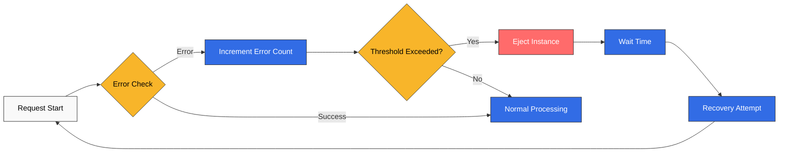
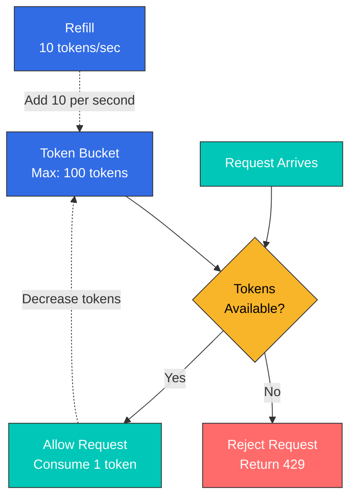
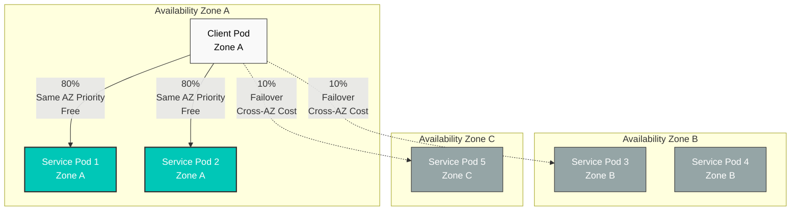
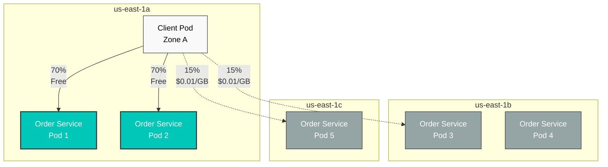

# Resilience Quiz

> **Supported Version**: Istio 1.28.0 **EKS Version**: 1.34 (Kubernetes 1.28+) **Last Updated**: February 19, 2026

This quiz tests your understanding of Istio's Resilience features.

## Multiple Choice Questions (1-5)

### Question 1: Outlier Detection Basic Concepts

Which of the following is **NOT** a primary purpose of Outlier Detection?

A. Automatically detect instances behaving abnormally B. Automatically remove from traffic pool when threshold exceeded C. Permanently delete removed instances D. Automatically attempt recovery after a period of time

<details>

<summary>Show Answer</summary>

**Answer: C**

Outlier Detection **does not delete instances** but temporarily removes them from the traffic pool.

**Explanation:**

**How Outlier Detection Works:**



**Key Features:**

1. **Automatic Detection**: Automatically monitors error rate, latency, and response failures
2. **Automatic Ejection**: Temporarily removes from traffic pool when threshold exceeded
3. **Automatic Recovery**: Automatically attempts recovery after baseEjectionTime
4. **Temporary Measure**: Only blocks traffic without deleting instances

**Why Option C is Incorrect:**

* Outlier Detection is a Circuit Breaker pattern
* It **temporarily ejects** instances without deleting them
* If recovery attempts succeed, traffic reception resumes

**Reference:**

* [Outlier Detection](../../../service-mesh/istio/resilience/01-outlier-detection.md)

</details>

***

### Question 2: Rate Limiting Type Comparison

Which statement correctly compares Local Rate Limiting and Global Rate Limiting?

A. Local Rate Limiting has higher accuracy B. Global Rate Limiting has faster performance C. Local Rate Limiting limits requests independently at each Envoy proxy D. Global Rate Limiting operates without external services

<details>

<summary>Show Answer</summary>

**Answer: C**

Local Rate Limiting limits requests **independently at each Envoy proxy**.

**Explanation:**

**Local vs Global Rate Limiting Comparison:**

| Characteristic  | Local Rate Limiting | Global Rate Limiting             |
| --------------- | ------------------- | -------------------------------- |
| **Accuracy**    | Low (per instance)  | High (cluster-wide)              |
| **Performance** | Very fast           | Slightly slower                  |
| **Complexity**  | Low                 | High (requires external service) |
| **Use Case**    | General protection  | When precise limiting is needed  |

**Characteristics of Local Rate Limiting:**

```yaml
# Limits 100 req/s per pod
# With 3 pods, up to 300 req/s total is allowed
apiVersion: networking.istio.io/v1beta1
kind: EnvoyFilter
metadata:
  name: local-ratelimit
spec:
  workloadSelector:
    labels:
      app: myapp
  configPatches:
  - applyTo: HTTP_FILTER
    patch:
      operation: INSERT_BEFORE
      value:
        name: envoy.filters.http.local_ratelimit
        typed_config:
          "@type": type.googleapis.com/envoy.extensions.filters.http.local_ratelimit.v3.LocalRateLimit
          stat_prefix: http_local_rate_limiter
          token_bucket:
            max_tokens: 100        # Maximum token count
            tokens_per_fill: 10    # Add 10 per second
            fill_interval: 1s
```

**Characteristics of Global Rate Limiting:**

```yaml
# Limits total to 100 req/s
# Allows only 100 req/s regardless of pod count
# Requires centralized Rate Limit server (e.g., Redis)
```

**Token Bucket Algorithm:**



**Reference:**

* [Rate Limiting](../../../service-mesh/istio/resilience/02-rate-limiting.md)

</details>

***

### Question 3: Benefits of Zone Aware Routing

Which is **NOT** a benefit of using Zone Aware Routing?

A. Reduced latency through same-AZ communication B. Cross-AZ data transfer cost savings C. Performance improvement by concentrating all traffic to a single AZ D. Automatic failover to other AZs during failures

<details>

<summary>Show Answer</summary>

**Answer: C**

Zone Aware Routing **does not concentrate traffic to a single AZ**, but rather prioritizes the same AZ while distributing for availability.

**Explanation:**

**Correct Behavior of Zone Aware Routing:**



**Actual Benefits of Zone Aware Routing:**

1. **Reduced Latency**:
   * Same AZ communication: \~0.5ms
   * Cross-AZ communication: \~1-2ms
2. **Cost Savings**:
   * AWS cross-AZ transfer: $0.01-0.02 per GB
   * Saves hundreds to thousands of dollars per month in high-traffic environments
3. **Improved Availability**:
   * Automatic failover to other AZs when same-AZ pods fail
   * Single AZ concentration is an **incorrect approach** (reduces availability)
4. **Performance Optimization**:
   * Reduced network hops
   * Bandwidth optimization

**DestinationRule Configuration Example:**

```yaml
apiVersion: networking.istio.io/v1beta1
kind: DestinationRule
metadata:
  name: myapp
spec:
  host: myapp
  trafficPolicy:
    loadBalancer:
      localityLbSetting:
        enabled: true
        distribute:
        - from: us-east-1/us-east-1a/*
          to:
            "us-east-1/us-east-1a/*": 80   # Same AZ 80%
            "us-east-1/us-east-1b/*": 10   # Other AZ 10%
            "us-east-1/us-east-1c/*": 10   # Other AZ 10%
```

**Reference:**

* [Zone Aware Routing](../../../service-mesh/istio/resilience/03-zone-aware-routing.md)

</details>

***

### Question 4: Outlier Detection Parameters

What is the condition for ejecting an instance with the following Outlier Detection configuration?

```yaml
outlierDetection:
  consecutiveErrors: 5
  interval: 30s
  baseEjectionTime: 30s
  maxEjectionPercent: 50
```

A. When errors occur for 5 seconds B. When 5 consecutive errors occur C. When error rate exceeds 50% over 30 seconds D. Unconditionally eject every 30 seconds

<details>

<summary>Show Answer</summary>

**Answer: B**

`consecutiveErrors: 5` ejects an instance when **5 consecutive** errors occur.

**Explanation:**

**Key Outlier Detection Parameters:**

| Parameter              | Description                 | Default | Recommended |
| ---------------------- | --------------------------- | ------- | ----------- |
| **consecutiveErrors**  | Consecutive error threshold | 5       | 3-10        |
| **interval**           | Analysis interval           | 10s     | 10s-60s     |
| **baseEjectionTime**   | Minimum ejection time       | 30s     | 30s-300s    |
| **maxEjectionPercent** | Maximum ejection ratio      | 10%     | 10%-50%     |

**Detailed Parameter Explanation:**

**consecutiveErrors**

```yaml
# Sensitive service (fast detection)
consecutiveErrors: 3

# General service
consecutiveErrors: 5

# Lenient setting (prevent false positives)
consecutiveErrors: 10
```

**interval**

```yaml
# Fast detection (high load)
interval: 10s

# Typical case
interval: 30s

# Stable service
interval: 60s
```

**baseEjectionTime**

```yaml
# Quick recovery attempt
baseEjectionTime: 30s

# Typical case
baseEjectionTime: 60s

# Cautious recovery
baseEjectionTime: 300s
```

**maxEjectionPercent**

```yaml
# Conservative (stability priority)
maxEjectionPercent: 10

# Balanced setting
maxEjectionPercent: 30

# Aggressive (performance priority)
maxEjectionPercent: 50
```

**Complete DestinationRule Example:**

```yaml
apiVersion: networking.istio.io/v1beta1
kind: DestinationRule
metadata:
  name: reviews-outlier
  namespace: default
spec:
  host: reviews
  trafficPolicy:
    outlierDetection:
      consecutiveErrors: 5          # 5 consecutive errors
      interval: 30s                 # Evaluate every 30 seconds
      baseEjectionTime: 30s         # Eject for 30 seconds
      maxEjectionPercent: 50        # Allow ejection up to 50%
      minHealthPercent: 50          # Maintain at least 50% healthy
```

**Operation Example:**

```
T=0: Pod-1 has 5 consecutive errors → Ejected
T=30s: interval cycle reached, attempt recovery of ejected pod
T=30s: If Pod-1 is healthy → Recovered
T=30s: If Pod-1 still has errors → Additional 30s ejection (cumulative)
```

**Reference:**

* [Outlier Detection](../../../service-mesh/istio/resilience/01-outlier-detection.md)

</details>

***

### Question 5: Token Bucket Algorithm

What is the average requests per second that can be processed with the following Rate Limiting configuration?

```yaml
token_bucket:
  max_tokens: 100
  tokens_per_fill: 10
  fill_interval: 1s
```

A. 10 req/s B. 100 req/s C. 110 req/s D. 1000 req/s

<details>

<summary>Show Answer</summary>

**Answer: A**

With `tokens_per_fill: 10` and `fill_interval: 1s`, **10 tokens are added per second**, so the average is **10 req/s**.

**Explanation:**

**Token Bucket Algorithm Parameters:**

* **max\_tokens**: Maximum tokens that can be stored in the bucket (burst allowance)
* **tokens\_per\_fill**: Tokens to add per fill\_interval (**average throughput**)
* **fill\_interval**: Token addition interval

**Calculation Method:**

```
Average request rate = tokens_per_fill / fill_interval
                     = 10 / 1s
                     = 10 req/s

Burst throughput = max_tokens
                 = 100 req (for a brief moment)
```

**Behavior Over Time:**

```
T=0: 100 tokens in bucket (initial state)
     Can handle 100 requests simultaneously

T=0.1s: Bucket empty (0 tokens)
        Additional requests rejected

T=1s: 10 tokens added (Refill)
      Can handle 10 requests

T=2s: 10 tokens added
      Can handle 10 requests

Average: 10 req/s (sustainable throughput)
Burst: 100 req/s (only for brief moment)
```

**Practical Configuration Examples:**

```yaml
# Scenario 1: General API endpoint
token_bucket:
  max_tokens: 100        # Allow burst of 100
  tokens_per_fill: 10    # Average 10 req/s
  fill_interval: 1s

# Scenario 2: High-performance API
token_bucket:
  max_tokens: 1000       # Allow burst of 1000
  tokens_per_fill: 100   # Average 100 req/s
  fill_interval: 1s

# Scenario 3: Limited resource
token_bucket:
  max_tokens: 10         # Only 10 burst
  tokens_per_fill: 1     # Average 1 req/s
  fill_interval: 1s
```

**Complete EnvoyFilter Example:**

```yaml
apiVersion: networking.istio.io/v1beta1
kind: EnvoyFilter
metadata:
  name: local-ratelimit
  namespace: default
spec:
  workloadSelector:
    labels:
      app: myapp
  configPatches:
  - applyTo: HTTP_FILTER
    match:
      context: SIDECAR_INBOUND
      listener:
        filterChain:
          filter:
            name: "envoy.filters.network.http_connection_manager"
            subFilter:
              name: "envoy.filters.http.router"
    patch:
      operation: INSERT_BEFORE
      value:
        name: envoy.filters.http.local_ratelimit
        typed_config:
          "@type": type.googleapis.com/envoy.extensions.filters.http.local_ratelimit.v3.LocalRateLimit
          stat_prefix: http_local_rate_limiter
          token_bucket:
            max_tokens: 100        # Burst
            tokens_per_fill: 10    # Average throughput
            fill_interval: 1s
          filter_enabled:
            runtime_key: local_rate_limit_enabled
            default_value:
              numerator: 100
              denominator: HUNDRED
```

**Reference:**

* [Rate Limiting](../../../service-mesh/istio/resilience/02-rate-limiting.md)

</details>

***

## Short Answer Questions (6-10)

### Question 6: Implementing Outlier Detection

A `product-service` running in production is intermittently becoming slow and experiencing timeouts. You want to implement Outlier Detection to automatically eject problematic instances. Write a DestinationRule that satisfies the following requirements:

**Requirements:**

* Eject after 3 consecutive errors
* Evaluate every 20 seconds
* Ejected instances attempt recovery after 60 seconds
* Allow ejection of maximum 30%
* Also detect 502, 503, 504 gateway errors

<details>

<summary>Show Answer</summary>

**Answer:**

```yaml
apiVersion: networking.istio.io/v1beta1
kind: DestinationRule
metadata:
  name: product-service-outlier
  namespace: production
spec:
  host: product-service
  trafficPolicy:
    outlierDetection:
      # Consecutive error threshold
      consecutiveErrors: 3
      consecutive5xxErrors: 3
      consecutiveGatewayErrors: 3  # Detect 502, 503, 504

      # Analysis interval
      interval: 20s

      # Ejection time
      baseEjectionTime: 60s

      # Maximum ejection ratio
      maxEjectionPercent: 30

      # Minimum healthy ratio (maintain 70% or more)
      minHealthPercent: 70

      # Minimum request count (evaluate only with 5+ requests)
      enforcingConsecutive5xx: 100
      enforcingConsecutiveGatewayFailure: 100
```

**Explanation:**

**1. consecutiveErrors vs consecutive5xxErrors vs consecutiveGatewayErrors**

| Parameter                    | Detection Target                            | Use Case                  |
| ---------------------------- | ------------------------------------------- | ------------------------- |
| **consecutiveErrors**        | All errors (5xx, connection failures, etc.) | General error detection   |
| **consecutive5xxErrors**     | 5xx errors only                             | Server errors only        |
| **consecutiveGatewayErrors** | 502, 503, 504 only                          | Gateway problem detection |

**2. Parameter Explanation**

**interval: 20s**

* Run Outlier Detection every 20 seconds
* Evaluate error rate for each instance

**baseEjectionTime: 60s**

* Ejected instances don't receive traffic for minimum 60 seconds
* Time increases on repeated ejection (60s -> 120s -> 180s...)

**maxEjectionPercent: 30**

* Allow ejection of maximum 30% of instances simultaneously
* Example: With 10 pods, only up to 3 can be ejected
* Ensures availability

**minHealthPercent: 70**

* Maintain minimum 70% of instances in healthy state
* Complementary to maxEjectionPercent

**3. Operation Example**

```
Initial state: All 10 pods healthy

T=0:   Pod-1 has 3 consecutive 503 errors
       -> Pod-1 ejected (9 healthy)

T=20s: Pod-2 has 3 consecutive 502 errors
       -> Pod-2 ejected (8 healthy)

T=40s: Pod-3 has 3 consecutive 504 errors
       -> Pod-3 ejected (7 healthy)

T=40s: Pod-4 has 3 consecutive errors
       -> Not ejected (maxEjectionPercent 30% reached)
       -> 30% = only 3 can be ejected

T=60s: Pod-1 recovery attempt
       -> If healthy, traffic reception resumes
```

**4. Monitoring**

```bash
# Check Outlier Detection events
kubectl logs <envoy-pod> -c istio-proxy | grep outlier

# Prometheus metrics
envoy_cluster_outlier_detection_ejections_active
envoy_cluster_outlier_detection_ejections_total
```

**5. Production Considerations**

**Sensitive service (fast detection):**

```yaml
outlierDetection:
  consecutiveErrors: 3
  interval: 10s
  baseEjectionTime: 30s
  maxEjectionPercent: 50
```

**Stable service (prevent false positives):**

```yaml
outlierDetection:
  consecutiveErrors: 10
  interval: 60s
  baseEjectionTime: 300s
  maxEjectionPercent: 10
```

**Reference:**

* [Outlier Detection](../../../service-mesh/istio/resilience/01-outlier-detection.md)

</details>

***

### Question 7: Applying Local Rate Limiting

The `api-gateway` service is under DDoS attack. You want to apply Local Rate Limiting to limit each Envoy proxy to 50 requests per second with a burst of up to 200. Write the EnvoyFilter.

Additional requirements:

* Add `X-RateLimit-Limit` header when rate limit is applied
* Include `Retry-After: 1` header on 429 responses

<details>

<summary>Show Answer</summary>

**Answer:**

```yaml
apiVersion: networking.istio.io/v1beta1
kind: EnvoyFilter
metadata:
  name: api-gateway-ratelimit
  namespace: production
spec:
  workloadSelector:
    labels:
      app: api-gateway
  configPatches:
  - applyTo: HTTP_FILTER
    match:
      context: SIDECAR_INBOUND
      listener:
        filterChain:
          filter:
            name: "envoy.filters.network.http_connection_manager"
            subFilter:
              name: "envoy.filters.http.router"
    patch:
      operation: INSERT_BEFORE
      value:
        name: envoy.filters.http.local_ratelimit
        typed_config:
          "@type": type.googleapis.com/envoy.extensions.filters.http.local_ratelimit.v3.LocalRateLimit
          stat_prefix: http_local_rate_limiter

          # Token Bucket configuration
          token_bucket:
            max_tokens: 200         # Burst: max 200
            tokens_per_fill: 50     # Average: 50 per second
            fill_interval: 1s       # Add 50 every second

          # Enable Rate Limit
          filter_enabled:
            runtime_key: local_rate_limit_enabled
            default_value:
              numerator: 100        # 100%
              denominator: HUNDRED

          # Enforce Rate Limit
          filter_enforced:
            runtime_key: local_rate_limit_enforced
            default_value:
              numerator: 100        # 100%
              denominator: HUNDRED

          # Add response headers
          response_headers_to_add:
          # Rate limit info
          - append: false
            header:
              key: X-RateLimit-Limit
              value: '50'

          # Current remaining tokens
          - append: false
            header:
              key: X-RateLimit-Remaining
              value: '%DYNAMIC_METADATA(envoy.extensions.filters.http.local_ratelimit:tokens_remaining)%'

          # Whether rate limit was applied
          - append: false
            header:
              key: X-Local-Rate-Limit
              value: 'true'

          # 429 response Retry-After header
          rate_limited_status:
            code: TOO_MANY_REQUESTS  # 429

          # Retry-After header addition (requires separate patch)

  # Add Retry-After header for 429 responses
  - applyTo: HTTP_ROUTE
    match:
      context: SIDECAR_INBOUND
    patch:
      operation: MERGE
      value:
        response_headers_to_add:
        - header:
            key: Retry-After
            value: '1'
          append: false
```

**Explanation:**

**1. Token Bucket Calculation**

```
Average processing rate: tokens_per_fill / fill_interval
                       = 50 / 1s
                       = 50 req/s

Burst processing: max_tokens
                = 200 req (for brief moment)
```

**2. Scenario-based Behavior**

**Normal traffic (40 req/s):**

```
50 tokens added per second, 40 used
-> Always has capacity
```

**Burst traffic (instantaneous 200 req/s):**

```
T=0: 200 tokens available
     All 200 requests processed

T=0.1s: 0 tokens
        Additional requests rejected (429 returned)

T=1s: 50 tokens added
      50 requests processed
```

**Continuous overload (100 req/s):**

```
50 tokens added per second
Only 50 of 100 requests processed
Remaining 50 return 429
```

**3. Response Header Examples**

**Normal request:**

```http
HTTP/1.1 200 OK
X-RateLimit-Limit: 50
X-RateLimit-Remaining: 45
X-Local-Rate-Limit: true
```

**Rate limit exceeded:**

```http
HTTP/1.1 429 Too Many Requests
X-RateLimit-Limit: 50
X-RateLimit-Remaining: 0
X-Local-Rate-Limit: true
Retry-After: 1
```

**4. Path-based Rate Limiting**

For more granular control, set different limits per path:

```yaml
apiVersion: networking.istio.io/v1beta1
kind: EnvoyFilter
metadata:
  name: path-based-ratelimit
spec:
  workloadSelector:
    labels:
      app: api-gateway
  configPatches:
  - applyTo: HTTP_FILTER
    patch:
      operation: INSERT_BEFORE
      value:
        name: envoy.filters.http.local_ratelimit
        typed_config:
          "@type": type.googleapis.com/envoy.extensions.filters.http.local_ratelimit.v3.LocalRateLimit
          stat_prefix: http_local_rate_limiter

          # Path-based configuration
          descriptors:
          # /api/login: 10 per second
          - entries:
            - key: path
              value: /api/login
            token_bucket:
              max_tokens: 30
              tokens_per_fill: 10
              fill_interval: 1s

          # /api/search: 100 per second
          - entries:
            - key: path
              value: /api/search
            token_bucket:
              max_tokens: 300
              tokens_per_fill: 100
              fill_interval: 1s
```

**5. Monitoring**

```bash
# Prometheus metrics
envoy_http_local_rate_limit_enabled
envoy_http_local_rate_limit_enforced
envoy_http_local_rate_limit_rate_limited

# 429 response count
sum(rate(istio_requests_total{response_code="429"}[5m]))
```

**Reference:**

* [Rate Limiting](../../../service-mesh/istio/resilience/02-rate-limiting.md)

</details>

***

### Question 8: Zone Aware Routing Configuration

Your AWS EKS cluster is distributed across 3 AZs (us-east-1a, us-east-1b, us-east-1c). You want to configure Zone Aware Routing for `order-service` to reduce cross-AZ data transfer costs.

**Requirements:**

* Send 70% traffic to same-AZ pods
* Distribute 15% each to other AZs
* Automatic failover to other AZs on complete AZ failure
* Apply Zone Aware only when 50% or more pods are healthy

<details>

<summary>Show Answer</summary>

**Answer:**

```yaml
apiVersion: networking.istio.io/v1beta1
kind: DestinationRule
metadata:
  name: order-service-locality
  namespace: production
spec:
  host: order-service
  trafficPolicy:
    loadBalancer:
      localityLbSetting:
        # Enable Zone Aware Routing
        enabled: true

        # Traffic distribution ratio
        distribute:
        # Traffic originating from us-east-1a
        - from: us-east-1/us-east-1a/*
          to:
            "us-east-1/us-east-1a/*": 70   # Same AZ 70%
            "us-east-1/us-east-1b/*": 15   # Other AZ 15%
            "us-east-1/us-east-1c/*": 15   # Other AZ 15%

        # Traffic originating from us-east-1b
        - from: us-east-1/us-east-1b/*
          to:
            "us-east-1/us-east-1b/*": 70
            "us-east-1/us-east-1a/*": 15
            "us-east-1/us-east-1c/*": 15

        # Traffic originating from us-east-1c
        - from: us-east-1/us-east-1c/*
          to:
            "us-east-1/us-east-1c/*": 70
            "us-east-1/us-east-1a/*": 15
            "us-east-1/us-east-1b/*": 15

        # Failover configuration
        failover:
        # On us-east-1a failure
        - from: us-east-1/us-east-1a
          to: us-east-1/us-east-1b    # Priority 1: us-east-1b

        # On us-east-1b failure
        - from: us-east-1/us-east-1b
          to: us-east-1/us-east-1c    # Priority 1: us-east-1c

        # On us-east-1c failure
        - from: us-east-1/us-east-1c
          to: us-east-1/us-east-1a    # Priority 1: us-east-1a

    # Outlier Detection (healthy pod determination)
    outlierDetection:
      consecutiveErrors: 5
      interval: 30s
      baseEjectionTime: 30s

      # Maintain minimum 50% healthy
      minHealthPercent: 50
```

**Explanation:**

**1. Kubernetes Node Label Verification**

AWS EKS automatically adds Topology labels:

```bash
kubectl get nodes -L topology.kubernetes.io/zone -L topology.kubernetes.io/region

# Example output:
# NAME                          ZONE         REGION
# ip-10-0-1-10.ec2.internal     us-east-1a   us-east-1
# ip-10-0-2-20.ec2.internal     us-east-1b   us-east-1
# ip-10-0-3-30.ec2.internal     us-east-1c   us-east-1
```

**2. Locality Hierarchy**

```
Region/Zone/SubZone

Examples:
us-east-1/us-east-1a/*
us-east-1/us-east-1b/*
us-east-1/us-east-1c/*
```

**3. Traffic Flow Diagram**



**4. Cost Savings Calculation**

**Scenario**: 1TB monthly traffic

**Without Zone Aware (even distribution):**

```
Total traffic: 1TB
Cross-AZ: 66.7% (667GB)
Cost: 667GB x $0.01 = $6.67
```

**With Zone Aware (70% same AZ):**

```
Total traffic: 1TB
Cross-AZ: 30% (300GB)
Cost: 300GB x $0.01 = $3.00

Savings: $6.67 - $3.00 = $3.67 (55% savings)
```

**High-volume environment (100TB/month):**

```
Without Zone Aware: $667
With Zone Aware: $300

Savings: $367/month = $4,404/year
```

**5. Failover Scenarios**

**Normal state:**

```
Client in us-east-1a
-> 70% us-east-1a pods
-> 15% us-east-1b pods
-> 15% us-east-1c pods
```

**Complete us-east-1a failure:**

```
Client in us-east-1a
-> failover: switch to us-east-1b
-> 100% us-east-1b pods

(If us-east-1b also fails -> switch to us-east-1c)
```

**Some pods unhealthy (Outlier Detection):**

```
us-east-1a: 2 pods (1 healthy, 1 ejected)
us-east-1b: 2 pods (all healthy)

-> minHealthPercent: 50% satisfied
-> Zone Aware continues to apply
-> Unhealthy pod doesn't receive traffic
```

**6. Monitoring**

```bash
# Check locality-based traffic
kubectl exec <pod> -c istio-proxy -- \
  curl localhost:15000/clusters | grep locality

# Prometheus query
# Same-zone traffic ratio
sum(rate(istio_requests_total{
  source_workload_namespace="production",
  source_canonical_service="client",
  destination_canonical_service="order-service"
}[5m])) by (source_cluster_zone, destination_cluster_zone)
```

**7. AWS EKS Specific Configuration**

**Configure EKS node groups per AZ:**

```yaml
# eksctl config
managedNodeGroups:
- name: ng-us-east-1a
  availabilityZones: ["us-east-1a"]
  labels:
    topology.kubernetes.io/zone: us-east-1a

- name: ng-us-east-1b
  availabilityZones: ["us-east-1b"]
  labels:
    topology.kubernetes.io/zone: us-east-1b

- name: ng-us-east-1c
  availabilityZones: ["us-east-1c"]
  labels:
    topology.kubernetes.io/zone: us-east-1c
```

**Distribute pods evenly across AZs:**

```yaml
apiVersion: apps/v1
kind: Deployment
metadata:
  name: order-service
spec:
  replicas: 9
  template:
    spec:
      topologySpreadConstraints:
      - maxSkew: 1
        topologyKey: topology.kubernetes.io/zone
        whenUnsatisfiable: DoNotSchedule
        labelSelector:
          matchLabels:
            app: order-service
```

**Reference:**

* [Zone Aware Routing](../../../service-mesh/istio/resilience/03-zone-aware-routing.md)

</details>

***

### Question 9: Combined Resilience Strategy

`payment-service` is a critical service that calls external payment APIs. Implement the following combined Resilience strategy:

1. **Outlier Detection**: Eject instance after 3 consecutive errors
2. **Retry**: Retry up to 3 times on 502, 503, 504 errors
3. **Timeout**: 5 second timeout per request
4. **Circuit Breaker**: Block entire service when error rate exceeds 50%

Write the DestinationRule and VirtualService.

<details>

<summary>Show Answer</summary>

**Answer:**

```yaml
# ========================================
# DestinationRule: Outlier Detection + Circuit Breaker
# ========================================
apiVersion: networking.istio.io/v1beta1
kind: DestinationRule
metadata:
  name: payment-service-resilience
  namespace: production
spec:
  host: payment-service
  trafficPolicy:
    # Connection Pool (Circuit Breaker)
    connectionPool:
      tcp:
        maxConnections: 100          # Maximum concurrent connections
      http:
        http1MaxPendingRequests: 50  # Pending request count
        http2MaxRequests: 100        # HTTP/2 maximum requests
        maxRequestsPerConnection: 2  # Maximum requests per connection
        maxRetries: 3                # Maximum retry count

    # Outlier Detection
    outlierDetection:
      # Consecutive error detection
      consecutiveErrors: 3
      consecutive5xxErrors: 3
      consecutiveGatewayErrors: 3

      # Analysis interval
      interval: 10s

      # Ejection time
      baseEjectionTime: 30s

      # Maximum ejection ratio
      maxEjectionPercent: 50

      # Error rate based ejection (Circuit Breaker)
      splitExternalLocalOriginErrors: true

      # Eject when error rate exceeds 50%
      enforcingLocalOriginSuccessRate: 100
      enforcingSuccessRate: 100
      successRateMinimumHosts: 3
      successRateRequestVolume: 10
      successRateStdevFactor: 1900  # 50% error rate

---
# ========================================
# VirtualService: Retry + Timeout
# ========================================
apiVersion: networking.istio.io/v1beta1
kind: VirtualService
metadata:
  name: payment-service-retry
  namespace: production
spec:
  hosts:
  - payment-service
  http:
  - match:
    - uri:
        prefix: /payment
    route:
    - destination:
        host: payment-service
        port:
          number: 8080

    # Timeout configuration
    timeout: 5s

    # Retry configuration
    retries:
      attempts: 3                    # Maximum 3 retries
      perTryTimeout: 2s              # 2 second timeout per retry
      retryOn: 5xx,reset,connect-failure,refused-stream,retriable-4xx
      retryRemoteLocalities: true    # Retry on pods in other AZs
```

**Explanation:**

**1. Outlier Detection (Instance Level)**

**Consecutive error detection:**

```yaml
consecutiveErrors: 3
consecutive5xxErrors: 3
consecutiveGatewayErrors: 3
```

* When a specific pod has 3 consecutive errors -> only that pod is ejected
* Other healthy pods continue to receive traffic

**2. Circuit Breaker (Service Level)**

**Error rate based blocking:**

```yaml
successRateStdevFactor: 1900  # 50% error rate
successRateMinimumHosts: 3    # Minimum 3 pods
successRateRequestVolume: 10  # Minimum 10 requests
```

**Behavior:**

```
Error rate < 50%: Normal operation
Error rate >= 50%: Entire service blocked (Circuit Open)

Circuit Open state:
- All requests immediately return 503
- Recovery attempt after baseEjectionTime (Circuit Half-Open)
```

**3. Retry Strategy**

**Retry conditions (retryOn):**

| Condition           | Description              |
| ------------------- | ------------------------ |
| **5xx**             | All 5xx errors           |
| **reset**           | Connection reset         |
| **connect-failure** | Connection failure       |
| **refused-stream**  | HTTP/2 stream refused    |
| **retriable-4xx**   | Retriable 4xx (409, 429) |

**Retry timeline:**

```
T=0:    First attempt (2s timeout)
T=2s:   Timeout -> 2nd attempt
T=4s:   Timeout -> 3rd attempt
T=6s:   Timeout -> Final failure (503 returned)

Total time: 6s (but VirtualService timeout: 5s)
-> Final failure after 5 seconds
```

**4. Timeout Hierarchy**

```
VirtualService timeout: 5s
|
Retry perTryTimeout: 2s
|
DestinationRule connectionPool
```

**Full timeline:**

```
attempt=1: 2s timeout
attempt=2: 2s timeout
attempt=3: 1s timeout (5s total limit reached)
```

**5. Complete Operation Example**

**Scenario 1: Temporary network issue**

```
Pod-1: 502 error (1st)
-> Retry -> Pod-2: 200 OK

Result: Client receives success response
Pod-1: Error count 1 (not yet ejected)
```

**Scenario 2: Specific pod issue**

```
Pod-1: 503 error (1st)
-> Retry -> Pod-1: 503 error (2nd)
-> Retry -> Pod-1: 503 error (3rd)
-> Pod-1 ejected

-> Retry -> Pod-2: 200 OK

Result: Client receives success response
Pod-1: Traffic blocked for 30 seconds
```

**Scenario 3: Complete service failure (Circuit Breaker)**

```
Error rate exceeds 50% on all pods
-> Circuit Breaker Open
-> All new requests immediately return 503 (no retries)

After baseEjectionTime:
-> Circuit Half-Open
-> Test with some requests
-> If successful, Circuit Closed
-> If failed, Circuit Open again
```

**6. Connection Pool (Additional Protection)**

```yaml
connectionPool:
  tcp:
    maxConnections: 100
  http:
    http1MaxPendingRequests: 50
    http2MaxRequests: 100
```

**Behavior:**

* Over 100 concurrent connections -> new connections rejected
* Over 50 pending requests -> 503 returned
* Prevents service overload

**7. Monitoring**

```bash
# Circuit Breaker status
kubectl exec <pod> -c istio-proxy -- \
  curl localhost:15000/stats | grep circuit_breakers

# Outlier Detection events
kubectl logs <pod> -c istio-proxy | grep outlier

# Prometheus queries
# Retry count
sum(rate(envoy_cluster_upstream_rq_retry[5m]))

# Circuit Breaker activation count
sum(rate(envoy_cluster_circuit_breakers_default_rq_pending_open[5m]))

# Timeout occurrence count
sum(rate(istio_requests_total{response_flags=~".*UT.*"}[5m]))
```

**8. Production Considerations**

**For external API calls:**

```yaml
# More lenient settings
timeout: 10s
retries:
  attempts: 5
  perTryTimeout: 3s
outlierDetection:
  consecutiveErrors: 10
  baseEjectionTime: 300s
```

**For internal service-to-service:**

```yaml
# Stricter settings
timeout: 1s
retries:
  attempts: 2
  perTryTimeout: 500ms
outlierDetection:
  consecutiveErrors: 3
  baseEjectionTime: 30s
```

**Reference:**

* [Outlier Detection](../../../service-mesh/istio/resilience/01-outlier-detection.md)
* [Traffic Management](https://github.com/Atom-oh/kubernetes-docs/blob/main/en/service-mesh/istio/traffic/README.md)

</details>

***

### Question 10: Performance Optimization and Cost Reduction

In a large-scale microservices environment, monthly network costs are $5,000. Develop a comprehensive strategy to optimize performance and reduce costs using Istio Resilience features.

**Current Situation:**

* 100 services evenly distributed across 3 AZs
* Monthly traffic: 500TB
* Average response time: 150ms
* Error rate: 3%

**Goals:**

* 50% reduction in cross-AZ costs
* Average response time under 100ms
* Error rate under 1%

<details>

<summary>Show Answer</summary>

**Answer:**

### Comprehensive Resilience Strategy

#### 1. Zone Aware Routing (Cost Savings + Performance Improvement)

**DestinationRule Template:**

```yaml
apiVersion: networking.istio.io/v1beta1
kind: DestinationRule
metadata:
  name: zone-aware-template
  namespace: production
spec:
  host: "*"  # Apply to all services
  trafficPolicy:
    loadBalancer:
      localityLbSetting:
        enabled: true
        distribute:
        - from: us-east-1/us-east-1a/*
          to:
            "us-east-1/us-east-1a/*": 80
            "us-east-1/us-east-1b/*": 10
            "us-east-1/us-east-1c/*": 10
        - from: us-east-1/us-east-1b/*
          to:
            "us-east-1/us-east-1b/*": 80
            "us-east-1/us-east-1a/*": 10
            "us-east-1/us-east-1c/*": 10
        - from: us-east-1/us-east-1c/*
          to:
            "us-east-1/us-east-1c/*": 80
            "us-east-1/us-east-1a/*": 10
            "us-east-1/us-east-1b/*": 10
```

**Cost Savings Calculation:**

```
Current state (even distribution):
- Cross-AZ traffic: 66.7% (333TB)
- Cost: 333TB x $0.015/GB = $5,000

With Zone Aware (80% same AZ):
- Cross-AZ traffic: 20% (100TB)
- Cost: 100TB x $0.015/GB = $1,500

Savings: $5,000 - $1,500 = $3,500/month (70% savings)
```

**Performance Improvement:**

```
Current (cross-AZ latency):
- Average latency: ~1.5ms

With Zone Aware:
- Same AZ latency: ~0.3ms
- Cross-AZ latency: ~1.5ms
- Weighted average: 0.3x0.8 + 1.5x0.2 = 0.54ms

Improvement: 1.5ms -> 0.54ms (64% improvement)
```

#### 2. Outlier Detection (Error Rate Reduction)

**Sensitive Detection Settings:**

```yaml
apiVersion: networking.istio.io/v1beta1
kind: DestinationRule
metadata:
  name: strict-outlier-detection
  namespace: production
spec:
  host: "*"
  trafficPolicy:
    outlierDetection:
      consecutiveErrors: 3           # Fast detection
      consecutive5xxErrors: 3
      consecutiveGatewayErrors: 2    # More sensitive to gateway errors

      interval: 10s                  # Fast evaluation
      baseEjectionTime: 60s          # Sufficient recovery time
      maxEjectionPercent: 30         # Ensure availability

      # Error rate based ejection
      enforcingSuccessRate: 100
      successRateMinimumHosts: 3
      successRateRequestVolume: 10
```

**Error Rate Reduction Effect:**

```
Current error rate: 3%
- Problematic pods continue receiving traffic
- Additional load from retries

With Outlier Detection:
- Immediately eject problem pods
- Route only to healthy pods
- Expected error rate: under 1%

Additional effects:
- Reduced retry count -> Reduced network load
- Response time improvement
```

#### 3. Rate Limiting (Service Protection)

**Tier-based Rate Limiting:**

```yaml
# Critical services (payments, authentication)
apiVersion: networking.istio.io/v1beta1
kind: EnvoyFilter
metadata:
  name: critical-service-ratelimit
spec:
  workloadSelector:
    labels:
      tier: critical
  configPatches:
  - applyTo: HTTP_FILTER
    patch:
      operation: INSERT_BEFORE
      value:
        name: envoy.filters.http.local_ratelimit
        typed_config:
          "@type": type.googleapis.com/envoy.extensions.filters.http.local_ratelimit.v3.LocalRateLimit
          token_bucket:
            max_tokens: 500
            tokens_per_fill: 100
            fill_interval: 1s

---
# Standard services
apiVersion: networking.istio.io/v1beta1
kind: EnvoyFilter
metadata:
  name: standard-service-ratelimit
spec:
  workloadSelector:
    labels:
      tier: standard
  configPatches:
  - applyTo: HTTP_FILTER
    patch:
      operation: INSERT_BEFORE
      value:
        name: envoy.filters.http.local_ratelimit
        typed_config:
          "@type": type.googleapis.com/envoy.extensions.filters.http.local_ratelimit.v3.LocalRateLimit
          token_bucket:
            max_tokens: 200
            tokens_per_fill: 50
            fill_interval: 1s
```

#### 4. Comprehensive Performance Optimization

**Response Time Improvement Strategy:**

```yaml
apiVersion: networking.istio.io/v1beta1
kind: DestinationRule
metadata:
  name: performance-optimization
  namespace: production
spec:
  host: "*"
  trafficPolicy:
    # Connection Pool optimization
    connectionPool:
      tcp:
        maxConnections: 1000
        connectTimeout: 1s
      http:
        http1MaxPendingRequests: 100
        http2MaxRequests: 1000
        maxRequestsPerConnection: 10
        idleTimeout: 60s

    # Zone Aware Routing
    loadBalancer:
      localityLbSetting:
        enabled: true

    # Outlier Detection
    outlierDetection:
      consecutiveErrors: 3
      interval: 10s
      baseEjectionTime: 60s

---
apiVersion: networking.istio.io/v1beta1
kind: VirtualService
metadata:
  name: performance-routing
  namespace: production
spec:
  hosts:
  - "*"
  http:
  - route:
    - destination:
        host: service

    # Timeout optimization
    timeout: 3s

    # Retry strategy
    retries:
      attempts: 2
      perTryTimeout: 1s
      retryOn: 5xx,reset,connect-failure
```

#### 5. Implementation Roadmap

**Phase 1: Zone Aware Routing (Week 1-2)**

```bash
# 1. Check node Topology
kubectl get nodes -L topology.kubernetes.io/zone

# 2. Check pod AZ distribution
kubectl get pods -o wide | awk '{print $7}' | sort | uniq -c

# 3. Apply Zone Aware DestinationRule
kubectl apply -f zone-aware-template.yaml

# 4. Set up cost monitoring
# Monitor cross-AZ data transfer in CloudWatch
```

**Expected Effect:**

* Cost: $5,000 -> $1,500 (70% savings)
* Latency: 150ms -> 120ms (20% improvement)

**Phase 2: Outlier Detection (Week 3-4)**

```bash
# 1. Apply Outlier Detection to each service
kubectl apply -f strict-outlier-detection.yaml

# 2. Set up monitoring dashboard
# Check Outlier ejection metrics in Grafana

# 3. Monitor error rate
```

**Expected Effect:**

* Error rate: 3% -> 1.5% (50% reduction)
* Latency: 120ms -> 100ms (additional improvement)

**Phase 3: Rate Limiting (Week 5-6)**

```bash
# 1. Apply tier-based Rate Limiting
kubectl apply -f critical-service-ratelimit.yaml
kubectl apply -f standard-service-ratelimit.yaml

# 2. Monitor 429 response rate
# Adjust to ensure normal traffic is not blocked
```

**Expected Effect:**

* DDoS protection
* Improved service stability
* Prevent unnecessary resource consumption

#### 6. Monitoring and Validation

**Grafana Dashboard:**

```promql
# Cross-AZ traffic ratio
100 * sum(rate(istio_requests_total{
  source_cluster_zone!="",
  destination_cluster_zone!="",
  source_cluster_zone!=destination_cluster_zone
}[5m])) /
sum(rate(istio_requests_total{
  source_cluster_zone!="",
  destination_cluster_zone!=""
}[5m]))

# Average response time
histogram_quantile(0.50,
  sum(rate(istio_request_duration_milliseconds_bucket[5m]))
  by (le, destination_service_name)
)

# Error rate
100 * sum(rate(istio_requests_total{response_code=~"5.."}[5m])) /
sum(rate(istio_requests_total[5m]))

# Outlier ejection events
sum(rate(envoy_cluster_outlier_detection_ejections_active[5m]))

# Rate limit application count
sum(rate(envoy_http_local_rate_limit_rate_limited[5m]))
```

#### 7. Final Results Prediction

| Metric                    | Current | Target | Expected Result        |
| ------------------------- | ------- | ------ | ---------------------- |
| **Monthly Network Cost**  | $5,000  | $2,500 | $1,500 (70% savings)   |
| **Average Response Time** | 150ms   | 100ms  | 95ms (37% improvement) |
| **Error Rate**            | 3%      | 1%     | 0.8% (73% reduction)   |
| **Cross-AZ Traffic**      | 66.7%   | 33%    | 20% (70% reduction)    |

#### 8. Additional Optimization Opportunities

**Caching Strategy:**

```yaml
# Place Redis/Memcached in same AZ
# Improved cache hit rate + Network cost savings
```

**Service Mesh Optimization:**

```yaml
# Consider Ambient Mode (Reduce Sidecar overhead)
# 30-50% reduction in resource usage
# Additional response time improvement
```

**Auto Scaling:**

```yaml
# HPA + Zone Aware Routing
# Independent scaling per AZ based on traffic patterns
# Maximize cost efficiency
```

**Reference:**

* [Zone Aware Routing](../../../service-mesh/istio/resilience/03-zone-aware-routing.md)
* [Outlier Detection](../../../service-mesh/istio/resilience/01-outlier-detection.md)
* [Rate Limiting](../../../service-mesh/istio/resilience/02-rate-limiting.md)

</details>

***

## Score Calculation

* Multiple Choice 1-5: 10 points each (50 points total)
* Short Answer 6-10: 10 points each (50 points total)
* **Total: 100 points**

**Evaluation Criteria:**

* 90-100 points: Excellent (Istio Resilience Expert)
* 80-89 points: Good (Production Ready)
* 70-79 points: Average (Additional Study Recommended)
* 60-69 points: Below Average (Basic Concept Review Needed)
* 0-59 points: Needs Re-study

## Learning Resources

* [Outlier Detection](../../../service-mesh/istio/resilience/01-outlier-detection.md)
* [Rate Limiting](../../../service-mesh/istio/resilience/02-rate-limiting.md)
* [Zone Aware Routing](../../../service-mesh/istio/resilience/03-zone-aware-routing.md)
