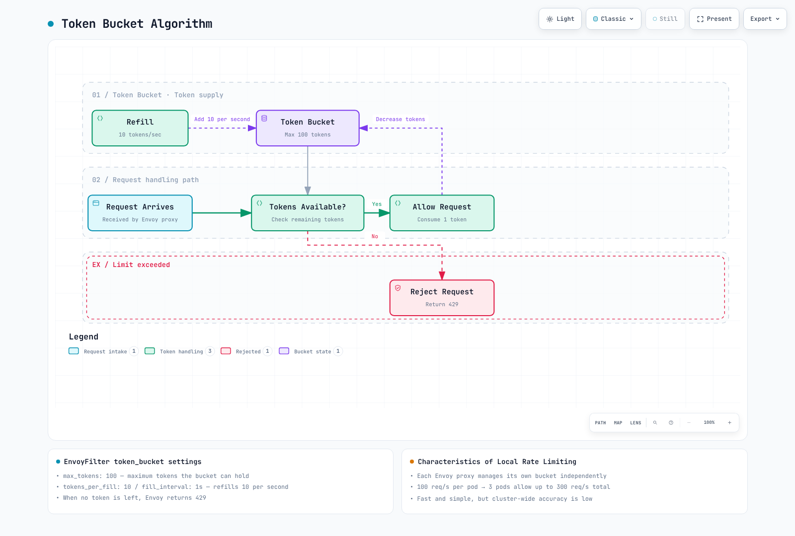

# Resilience Quiz

> **Last Updated**: September 11, 2026 · Istio1.31 · Kubernetes1.32–1.36; see the installation chapter for EKS compatibility.

This quiz tests your understanding of Istio's Resilience features.

Each example is independent and assumes the named Services, labels, namespaces and sidecar HTTP8080 workloads exist. Values are illustrative; offline schema/query checks are not production/load tests. The locality examples use `localityLbSetting`, not the separate `zoneAwareLbSetting` API.

## Multiple Choice Questions (1-5)

### Question 1: Outlier Detection Basic Concepts

Which of the following is **NOT** a primary purpose of Outlier Detection?

A. Automatically detect instances behaving abnormally\
B. Temporarily eject when the configured failure threshold and ejection cap permit it\
C. Permanently delete removed instances\
D. Make a temporarily ejected host eligible again after its ejection period

<details>

<summary>Show Answer</summary>

**Answer: C**

Outlier Detection **does not delete instances** but temporarily removes them from the traffic pool.

**Explanation:**

**How Outlier Detection Works:**


**Key Features:**

1. **Automatic Detection**: Counts configured consecutive qualifying HTTP/transport failures
2. **Automatic Ejection**: Temporarily removes from traffic pool when threshold exceeded
3. **Re-entry**: Ejection expires; this does not send an active probe or prove recovery
4. **Temporary Measure**: Only blocks traffic without deleting instances

**Why Option C is Incorrect:**

* Outlier Detection is a Circuit Breaker pattern
* It **temporarily ejects** instances without deleting them
* Successful later traffic confirms recovery; repeated failures may trigger longer ejections

**Reference:**

* [Outlier Detection](../../../service-mesh/istio/resilience/01-outlier-detection.md)

</details>

***

### Question 2: Rate Limiting Type Comparison

Which statement correctly compares Local Rate Limiting and Global Rate Limiting?

A. Local Rate Limiting has higher accuracy\
B. Global Rate Limiting has faster performance\
C. Local Rate Limiting limits requests independently at each Envoy proxy\
D. Global Rate Limiting operates without external services

<details>

<summary>Show Answer</summary>

**Answer: C**

Local Rate Limiting limits requests **independently at each Envoy proxy**.

**Explanation:**

**Local vs Global Rate Limiting Comparison:**

| Characteristic  | Local Rate Limiting | Global Rate Limiting             |
| --------------- | ------------------- | -------------------------------- |
| **Quota scope** | Local configured bucket | Shared domain/descriptor and window |
| **Performance** | Very fast           | Slightly slower                  |
| **Complexity**  | Low                 | High (requires external service) |
| **Use Case**    | General protection  | When precise limiting is needed  |

**Characteristics of Local Rate Limiting:**

```yaml
apiVersion: networking.istio.io/v1alpha3
kind: EnvoyFilter
metadata:
  name: local-ratelimit
  namespace: default
spec:
  workloadSelector:
    labels:
      app: myapp
  configPatches:
  - applyTo: HTTP_FILTER
    match:
      context: SIDECAR_INBOUND
      listener:
        portNumber: 8080
        filterChain:
          filter:
            name: envoy.filters.network.http_connection_manager
            subFilter:
              name: envoy.filters.http.router
    patch:
      operation: INSERT_BEFORE
      value:
        name: envoy.filters.http.local_ratelimit
        typed_config:
          '@type': type.googleapis.com/envoy.extensions.filters.http.local_ratelimit.v3.LocalRateLimit
          stat_prefix: http_local_rate_limiter
          token_bucket:
            max_tokens: 100
            tokens_per_fill: 10
            fill_interval: 1s
          filter_enabled:
            default_value:
              numerator: 100
              denominator: HUNDRED
          filter_enforced:
            default_value:
              numerator: 100
              denominator: HUNDRED
```

The shown bucket starts with100 tokens and refills10/s. Three replicas can sustain about30/s in aggregate under suitable load distribution, with separate burst allowances; this is not a shared30/s cap.

**Characteristics of Global Rate Limiting:**

```yaml
# Configured shared descriptor quota:100 per backend second-window
# Actual enforcement depends on the shared backend, window and failure policy
# Requires an actual gRPC rate-limit service plus shared counter storage such as Redis
```

**Token Bucket Algorithm:**



[🔍 View interactive diagram](https://www.atomai.click/kubernetes-docs/archmaps/en-quizzes-service-mesh-istio-resilience-1.html)

**Reference:**

* [Rate Limiting](../../../service-mesh/istio/resilience/02-rate-limiting.md)

</details>

***

### Question 3: Benefits of Zone Aware Routing

Which is **NOT** a benefit of using Zone Aware Routing?

A. Reduced latency through same-AZ communication\
B. Cross-AZ data transfer cost savings\
C. Guaranteed availability improvement by placing every service replica in one AZ\
D. Failover to reachable healthy endpoints when the appropriate policy and capacity exist

<details>

<summary>Show Answer</summary>

**Answer: C**

C is not a guarantee. Locality is relative to each caller; it can concentrate a caller’s traffic in its local zone. Moving every replica into one AZ creates a shared failure domain and may overload that zone.

**Explanation:**

**Correct Behavior of Zone Aware Routing:**


**Actual Benefits of Zone Aware Routing:**

Same-zone routing can reduce the network component of latency and billable cross-zone bytes, but exact latency/prices/savings depend on the deployment. Weighted80/10/10 means normal traffic is sent to all three healthy zones; the10% portions are not standby failover. Other zones need real reachable endpoints and spare capacity.

**DestinationRule Configuration Example:**

```yaml
apiVersion: networking.istio.io/v1
kind: DestinationRule
metadata:
  name: myapp
  namespace: default
spec:
  host: myapp
  trafficPolicy:
    loadBalancer:
      localityLbSetting:
        enabled: true
        distribute:
        - from: us-east-1/us-east-1a/*
          to:
            us-east-1/us-east-1a/*: 80
            us-east-1/us-east-1b/*: 10
            us-east-1/us-east-1c/*: 10
    outlierDetection:
      consecutive5xxErrors: 5
      interval: 30s
      baseEjectionTime: 30s
      maxEjectionPercent: 50
      minHealthPercent: 0
```

**Reference:**

* [Zone Aware Routing](../../../service-mesh/istio/resilience/03-zone-aware-routing.md)

</details>

***

### Question 4: Outlier Detection Parameters

What is the condition for ejecting an instance with the following Outlier Detection configuration?

```yaml
outlierDetection:
  consecutive5xxErrors: 5
  interval: 30s
  baseEjectionTime: 30s
  maxEjectionPercent: 50
```

A. When errors occur for 5 seconds\
B. When 5 consecutive qualifying 5xx failures reach the threshold, subject to the ejection cap\
C. When error rate exceeds 50% over 30 seconds\
D. Unconditionally eject every 30 seconds

<details>

<summary>Show Answer</summary>

**Answer: B**

B identifies the trigger. Five consecutive qualifying failures can trigger ejection inline; `interval` is a periodic sweep interval, and `maxEjectionPercent` can prevent enforcement. A slow successful response alone is not a latency outlier.

**Explanation:**

**Key Outlier Detection Parameters:**

| Parameter              | Description                 | Default | Example range |
| ---------------------- | --------------------------- | ------- | ----------- |
| **consecutive5xxErrors**  | Consecutive error threshold | 5       | 3-10        |
| **interval**           | Analysis interval           | 10s     | 10s-60s     |
| **baseEjectionTime**   | Minimum ejection time       | 30s     | 30s-300s    |
| **maxEjectionPercent** | Maximum ejection ratio      | 10%     | 10%-50%     |

**Detailed Parameter Explanation:**

**consecutive5xxErrors**

```yaml
# Sensitive service (fast detection)
consecutive5xxErrors: 3

# General service
---
consecutive5xxErrors: 5

# Lenient setting (prevent false positives)
---
consecutive5xxErrors: 10
```

**interval**

```yaml
# Fast detection (high load)
interval: 10s

# Typical case
---
interval: 30s

# Stable service
---
interval: 60s
```

**baseEjectionTime**

```yaml
# Quick recovery attempt
baseEjectionTime: 30s

# Typical case
---
baseEjectionTime: 60s

# Cautious recovery
---
baseEjectionTime: 300s
```

**maxEjectionPercent**

```yaml
# Conservative (stability priority)
maxEjectionPercent: 10

# Balanced setting
---
maxEjectionPercent: 30

# Aggressive (performance priority)
---
maxEjectionPercent: 50
```

**Complete DestinationRule Example:**

```yaml
apiVersion: networking.istio.io/v1
kind: DestinationRule
metadata:
  name: reviews-outlier
  namespace: default
spec:
  host: reviews
  trafficPolicy:
    outlierDetection:
      consecutive5xxErrors: 5
      interval: 30s
      baseEjectionTime: 30s
      maxEjectionPercent: 50
      minHealthPercent: 0
```

**Operation Example:**

A success resets the relevant consecutive sequence. When a host reaches the threshold it can be ejected if the cap permits it; it becomes eligible after its actual ejection duration. Repeated ejections increase that duration with an Envoy multiplier/cap. `minHealthPercent` is a panic/fail-open threshold, not a guaranteed fraction of healthy Pods;0 disables that threshold.

**Reference:**

* [Outlier Detection](../../../service-mesh/istio/resilience/01-outlier-detection.md)

</details>

***

### Question 5: Token Bucket Algorithm

With one token per request and sustained demand, what is the long-run refill-limited admission rate after the initial burst?

```yaml
token_bucket:
  max_tokens: 100
  tokens_per_fill: 10
  fill_interval: 1s
```

A. 10 req/s\
B. 100 req/s\
C. 110 req/s\
D. 1000 req/s

<details>

<summary>Show Answer</summary>

**Answer: A**

With `tokens_per_fill: 10` and `fill_interval: 1s`, **10 tokens are added per second**, so the average is **10 req/s**.

**Explanation:**

**Token Bucket Algorithm Parameters:**

* **max\_tokens**: Maximum tokens that can be stored in the bucket (burst allowance)
* **tokens\_per\_fill**: Tokens to add per fill\_interval (**average throughput**)
* **fill\_interval**: Token addition interval

**Calculation Method:**

```
Average request rate = tokens_per_fill / fill_interval
                     = 10 / 1s
                     = 10 req/s

Burst throughput = max_tokens
                 = 100 req (for a brief moment)
```

**Behavior Over Time:**

```
T=0: 100 tokens in bucket (initial state)
     Can admit up to100 immediate requests if the bucket is full; backend concurrency is separate

T=0.1s: Bucket empty (0 tokens)
        Additional requests rejected

T=1s: 10 tokens added (Refill)
      Can handle 10 requests

T=2s: 10 tokens added
      Can handle 10 requests

Average: 10 req/s (sustainable throughput)
Burst allowance:100 requests from a full bucket, not a sustained req/s rate
```

**Practical Configuration Examples:**

```yaml
# Scenario 1: General API endpoint
token_bucket:
  max_tokens: 100        # Allow burst of 100
  tokens_per_fill: 10    # Average 10 req/s
  fill_interval: 1s

# Scenario 2: High-performance API
---
token_bucket:
  max_tokens: 1000       # Allow burst of 1000
  tokens_per_fill: 100   # Average 100 req/s
  fill_interval: 1s

# Scenario 3: Limited resource
---
token_bucket:
  max_tokens: 10         # Only 10 burst
  tokens_per_fill: 1     # Average 1 req/s
  fill_interval: 1s
```

**Complete EnvoyFilter Example:**

```yaml
apiVersion: networking.istio.io/v1alpha3
kind: EnvoyFilter
metadata:
  name: local-ratelimit
  namespace: default
spec:
  workloadSelector:
    labels:
      app: myapp
  configPatches:
  - applyTo: HTTP_FILTER
    match:
      context: SIDECAR_INBOUND
      listener:
        portNumber: 8080
        filterChain:
          filter:
            name: envoy.filters.network.http_connection_manager
            subFilter:
              name: envoy.filters.http.router
    patch:
      operation: INSERT_BEFORE
      value:
        name: envoy.filters.http.local_ratelimit
        typed_config:
          '@type': type.googleapis.com/envoy.extensions.filters.http.local_ratelimit.v3.LocalRateLimit
          stat_prefix: http_local_rate_limiter
          token_bucket:
            max_tokens: 100
            tokens_per_fill: 10
            fill_interval: 1s
          filter_enabled:
            default_value:
              numerator: 100
              denominator: HUNDRED
          filter_enforced:
            default_value:
              numerator: 100
              denominator: HUNDRED
```

**Reference:**

* [Rate Limiting](../../../service-mesh/istio/resilience/02-rate-limiting.md)

</details>

***

## Short Answer Questions (6-10)

### Question 6: Implementing Outlier Detection

A `product-service` running in production is intermittently becoming slow and experiencing timeouts. You want to implement Outlier Detection to automatically eject problematic instances. Write a DestinationRule that satisfies the following requirements:

**Requirements:**

* Eject after 3 consecutive errors
* Use a20-second periodic sweep; consecutive failures can be detected inline
* Set the initial base ejection duration to60 seconds
* Allow ejection of maximum 30%
* Also detect 502, 503, 504 gateway errors

<details>

<summary>Show Answer</summary>

Slow responses alone are not an outlier criterion. The example separates HTTP errors from locally observed transport failures; a real route/client timeout must exist for timeouts to be observed.

```yaml
apiVersion: networking.istio.io/v1
kind: DestinationRule
metadata:
  name: product-service-outlier
  namespace: production
spec:
  host: product-service
  trafficPolicy:
    outlierDetection:
      consecutive5xxErrors: 3
      splitExternalLocalOriginErrors: true
      consecutiveLocalOriginFailures: 3
      interval: 20s
      baseEjectionTime: 60s
      maxEjectionPercent: 30
      minHealthPercent: 0
      consecutiveGatewayErrors: 3
```

The gateway subset502/503/504 is already included in5xx. Equal thresholds of3 are redundant but valid; lower gateway thresholds would eject on that subset earlier. `interval: 20s` does not delay consecutive-error detection. `baseEjectionTime: 60s` is the initial minimum duration, not an active health probe. The30% cap limits ejections but cannot keep the remaining endpoints healthy. `minHealthPercent: 70` would enable panic behavior below its threshold, not preserve70% healthy capacity. Unsupported `enforcing*` fields are Envoy internals, not this DestinationRule API.

A ten-host example can reach the cap after three ejections, but discovered pool size, rounding and current health matter; inspect actual enforced/detected/overflow counters. A returning host must receive successful traffic to demonstrate recovery.

```bash
istioctl proxy-config clusters <caller-pod> -n production --fqdn product-service.production.svc.cluster.local -o json
istioctl x envoy-stats <caller-pod> -n production --output prom | grep outlier_detection
```

```promql
envoy_cluster_outlier_detection_ejections_active{namespace="production"}
rate(envoy_cluster_outlier_detection_ejections_enforced_total{namespace="production"}[5m])
```

Enable optional stats/scraping as in the [outlier chapter](../../../service-mesh/istio/resilience/01-outlier-detection.md). Tune thresholds from measured errors and spare capacity; no universal “production” value is implied.

</details>

***

### Question 7: Applying Local Rate Limiting

A sidecar-injected application named `api-gateway` is receiving excessive HTTP traffic. You want to apply Local Rate Limiting to limit each Envoy proxy to 50 requests per second with a burst of up to 200. Write the EnvoyFilter.

Additional requirements:

* Add `X-RateLimit-Limit` header when rate limit is applied
* Include `Retry-After: 1` header on 429 responses

<details>

<summary>Show Answer</summary>

Assume `api-gateway` is an application with an injected sidecar on HTTP8080 in `production`. This protects selected HTTP requests after they reach Envoy; it is not complete DDoS or connection/TLS protection. For an actual Istio ingress gateway, use its namespace/selector and `GATEWAY` context as in the rate-limit chapter.

```yaml
apiVersion: networking.istio.io/v1alpha3
kind: EnvoyFilter
metadata:
  name: api-gateway-ratelimit
  namespace: production
spec:
  workloadSelector:
    labels:
      app: api-gateway
  configPatches:
  - applyTo: HTTP_FILTER
    match:
      context: SIDECAR_INBOUND
      listener:
        portNumber: 8080
        filterChain:
          filter:
            name: envoy.filters.network.http_connection_manager
            subFilter:
              name: envoy.filters.http.router
    patch:
      operation: INSERT_BEFORE
      value:
        name: envoy.filters.http.local_ratelimit
        typed_config:
          '@type': type.googleapis.com/envoy.extensions.filters.http.local_ratelimit.v3.LocalRateLimit
          stat_prefix: http_local_rate_limiter
          token_bucket:
            max_tokens: 200
            tokens_per_fill: 50
            fill_interval: 1s
          filter_enabled:
            default_value:
              numerator: 100
              denominator: HUNDRED
          filter_enforced:
            default_value:
              numerator: 100
              denominator: HUNDRED
          response_headers_to_add:
          - append_action: OVERWRITE_IF_EXISTS_OR_ADD
            header:
              key: X-RateLimit-Limit
              value: '50'
          - append_action: OVERWRITE_IF_EXISTS_OR_ADD
            header:
              key: X-Local-Rate-Limit
              value: 'true'
          - append_action: OVERWRITE_IF_EXISTS_OR_ADD
            header:
              key: Retry-After
              value: '1'
```

The full bucket admits up to200 requests immediately, then refills50 tokens/s. At sustained100 requests/s after depletion, about50/s can be admitted, assuming one token per request and no other limits. Smooth40/s demand can fit, but a40/s average alone does not guarantee that every burst is accepted. Admission does not guarantee backend processing success.

The filter defaults to HTTP429 and adds these headers only to its enforced rate-limit responses. A normal200 response does not receive these headers from this configuration. `Retry-After: 1` is an advisory delay, not a reservation or guarantee of success a second later. No `tokens_remaining` dynamic metadata is created by this example, so a fabricated Remaining header is omitted.

```http
HTTP/1.1 429 Too Many Requests
X-RateLimit-Limit: 50
X-Local-Rate-Limit: true
Retry-After: 1
```

For different path-prefix buckets, use this **alternative**, not a second overlapping filter. The explicit descriptor generator is supported by the Envoy API pinned with Istio1.31. Missing/unmatched paths use the bounded default bucket; prefix matching includes longer paths beginning with the supplied text.

```yaml
apiVersion: networking.istio.io/v1alpha3
kind: EnvoyFilter
metadata:
  name: path-based-ratelimit
  namespace: production
spec:
  workloadSelector:
    labels:
      app: api-gateway
  configPatches:
  - applyTo: HTTP_FILTER
    match:
      context: SIDECAR_INBOUND
      listener:
        portNumber: 8080
        filterChain:
          filter:
            name: envoy.filters.network.http_connection_manager
            subFilter:
              name: envoy.filters.http.router
    patch:
      operation: INSERT_BEFORE
      value:
        name: envoy.filters.http.local_ratelimit
        typed_config:
          '@type': type.googleapis.com/envoy.extensions.filters.http.local_ratelimit.v3.LocalRateLimit
          stat_prefix: http_local_rate_limiter
          token_bucket:
            max_tokens: 30
            tokens_per_fill: 10
            fill_interval: 1s
          filter_enabled:
            default_value:
              numerator: 100
              denominator: HUNDRED
          filter_enforced:
            default_value:
              numerator: 100
              denominator: HUNDRED
          always_consume_default_token_bucket: false
          descriptors:
          - entries:
            - key: header_match
              value: /api/login
            token_bucket:
              max_tokens: 30
              tokens_per_fill: 10
              fill_interval: 1s
          - entries:
            - key: header_match
              value: /api/search
            token_bucket:
              max_tokens: 300
              tokens_per_fill: 100
              fill_interval: 1s
          rate_limits:
          - actions:
            - header_value_match:
                descriptor_value: /api/login
                headers:
                - name: :path
                  string_match:
                    prefix: /api/login
          - actions:
            - header_value_match:
                descriptor_value: /api/search
                headers:
                - name: :path
                  string_match:
                    prefix: /api/search
```

```promql
sum by (pod) (rate({__name__=~"envoy_.*http_local_rate_limit_enforced",namespace="production"}[5m]))
```

See [rate limiting](../../../service-mesh/istio/resilience/02-rate-limiting.md) for optional-stat collection, global service/Redis prerequisites and trusted identity handling.

</details>

***

### Question 8: Zone Aware Routing Configuration

Your AWS EKS cluster is distributed across 3 AZs (us-east-1a, us-east-1b, us-east-1c). You want to configure Zone Aware Routing for `order-service` to reduce cross-AZ data transfer costs.

**Requirements:**

* Send 70% traffic to same-AZ pods
* Distribute 15% each to other AZs
* Explain a separate priority-failover alternative and complete-AZ-outage limitations
* Explain why minHealthPercent50 is not a50%-healthy guarantee or locality activation switch

<details>

<summary>Show Answer</summary>

These requirements mix weighted distribution, priority failover and a healthy-capacity guarantee. They cannot all be expressed by combining fields in one locality policy. Use the following distribution policy for normal70/15/15 traffic; `minHealthPercent` is not a switch that activates locality only when half the Pods are healthy.

```yaml
apiVersion: networking.istio.io/v1
kind: DestinationRule
metadata:
  name: order-service-locality
  namespace: production
spec:
  host: order-service
  trafficPolicy:
    loadBalancer:
      localityLbSetting:
        enabled: true
        distribute:
        - from: us-east-1/us-east-1a/*
          to:
            us-east-1/us-east-1a/*: 70
            us-east-1/us-east-1b/*: 15
            us-east-1/us-east-1c/*: 15
        - from: us-east-1/us-east-1b/*
          to:
            us-east-1/us-east-1a/*: 15
            us-east-1/us-east-1b/*: 70
            us-east-1/us-east-1c/*: 15
        - from: us-east-1/us-east-1c/*
          to:
            us-east-1/us-east-1a/*: 15
            us-east-1/us-east-1b/*: 15
            us-east-1/us-east-1c/*: 70
    outlierDetection:
      consecutive5xxErrors: 5
      splitExternalLocalOriginErrors: true
      consecutiveLocalOriginFailures: 5
      interval: 30s
      baseEjectionTime: 30s
      maxEjectionPercent: 50
      minHealthPercent: 0
```

For local-zone priority and spillover instead, apply this **alternative**, not both policies. `localityLbSetting.failover` accepts region names, not `region/zone` paths. `distribute` and priority modes are mutually exclusive in this API.

```yaml
apiVersion: networking.istio.io/v1
kind: DestinationRule
metadata:
  name: order-service-failover
  namespace: production
spec:
  host: order-service
  trafficPolicy:
    loadBalancer:
      localityLbSetting:
        enabled: true
        failoverPriority:
        - topology.kubernetes.io/region
        - topology.kubernetes.io/zone
    outlierDetection:
      consecutive5xxErrors: 5
      splitExternalLocalOriginErrors: true
      consecutiveLocalOriginFailures: 5
      interval: 30s
      baseEjectionTime: 30s
      maxEjectionPercent: 100
      minHealthPercent: 0
```

A complete zone outage also affects the client in that zone: a surviving/recreated client or entry point elsewhere is required. Remaining healthy endpoint capacity, detection, connection reuse and network reachability determine failover; the policy does not promise100% to zoneB or instantaneous recovery. `minHealthPercent: 0` disables panic use of unhealthy hosts, and a100% cap permits all endpoints to be ejected if all fail. Neither makes healthy capacity appear.

Use the [zone-aware chapter](../../../service-mesh/istio/resilience/03-zone-aware-routing.md) for Node→Pod topology checks, matching topologySpreadConstraints, EKS node groups and EDS diagnostics. Do not manually assign cloud topology labels merely to make an example match. Standard Istio metrics do not contain `source_cluster_zone`/`destination_cluster_zone`; zone queries require verified enrichment, separate from routing.

**Illustrative cost arithmetic**: assume decimal1TB=1000GB, an effective charge of$0.01 per billable GB, baseline cross-zone fraction2/3 and after fraction0.30. This is a simplified assumption, not an AWS price quote, measured saving or complete network bill.

| Monthly traffic | Before | After | Monthly saving | Annual saving |
|---|---:|---:|---:|---:|
|1TB|$6.67|$3.00|$3.67|$44.00|
|100TB|$666.67|$300.00|$366.67|$4,400.00|

The modeled reduction is55%. Calculate from exact fractions and round only the displayed currency; annual savings must not multiply a prematurely rounded monthly$367. Actual billable directions, byte volumes, region and service processing charges need billing/flow evidence.

```bash
kubectl get nodes -L topology.kubernetes.io/region,topology.kubernetes.io/zone
istioctl proxy-config bootstrap <caller-pod> -n production -o json
istioctl proxy-config all <caller-pod> -n production -o json
```

</details>

***

### Question 9: Combined Resilience Strategy

`payment-service` is a critical service that calls external payment APIs. Implement the following combined Resilience strategy:

1. **Outlier Detection**: Eject instance after 3 consecutive errors
2. **Retry**: Permit up to3 retries on502/503/504 for verified idempotent reads; explicitly disable write retries
3. **Timeout**: 5 second timeout per request
4. **Circuit Breaker**: Explain why “block the entire service above50% errors” is not this API’s pool breaker; show supported concurrency limits instead

Write the DestinationRule and VirtualService.

<details>

<summary>Show Answer</summary>

A DestinationRule cannot implement “globally block this service above50% errors” through the listed success-rate fields. Those fields are not supported here, and statistical deviation is not a fixed error-percentage threshold. Pool circuit breakers constrain concurrent connections/requests per caller proxy’s upstream cluster; outlier detection changes host eligibility. A coordinated service-wide error-ratio breaker would need a separately designed application/controller mechanism.

This answer applies to **caller→payment-service HTTP8080**. The service’s outgoing payment API call needs its own destination policy and TLS visibility as described in the [outlier chapter](../../../service-mesh/istio/resilience/01-outlier-detection.md). Mesh retries cannot provide payment idempotency.

```yaml
apiVersion: networking.istio.io/v1
kind: DestinationRule
metadata:
  name: payment-service-resilience
  namespace: production
spec:
  host: payment-service
  trafficPolicy:
    connectionPool:
      tcp:
        maxConnections: 100
        connectTimeout: 1s
      http:
        http1MaxPendingRequests: 50
        http2MaxRequests: 100
        maxRequestsPerConnection: 0
        maxRetries: 3
    outlierDetection:
      consecutive5xxErrors: 3
      splitExternalLocalOriginErrors: true
      consecutiveLocalOriginFailures: 3
      interval: 10s
      baseEjectionTime: 30s
      maxEjectionPercent: 50
      minHealthPercent: 0
---
apiVersion: networking.istio.io/v1
kind: VirtualService
metadata:
  name: payment-service-retry
  namespace: production
spec:
  hosts:
  - payment-service
  http:
  - name: writes-no-retry
    match:
    - method:
        regex: ^(POST|PUT|PATCH|DELETE)$
    route:
    - destination:
        host: payment-service
        port:
          number: 8080
    timeout: 5s
    retries:
      attempts: 0
  - name: idempotent-reads
    match:
    - method:
        regex: ^(GET|HEAD|OPTIONS)$
    route:
    - destination:
        host: payment-service
        port:
          number: 8080
    timeout: 5s
    retries:
      attempts: 3
      perTryTimeout: 2s
      retryOn: gateway-error,connect-failure,refused-stream
  - name: other-methods-no-retry
    route:
    - destination:
        host: payment-service
        port:
          number: 8080
    timeout: 5s
    retries:
      attempts: 0
```

The explicit write/fallback rules disable inherited mesh retries. Retry only the matched reads whose application semantics are safe to repeat. `gateway-error` covers502/503/504; broad reset/5xx/4xx conditions are not added to payment writes. A transport error does not establish whether a payment committed.

`attempts: 3` means up to three retries **after** the initial attempt. Four full2s attempts plus backoff cannot fit within5s, so the total route budget stops earlier; application deadlines must also cover upload/streaming and downstream work. This is not an exact failure timeline or a promise of a particular final HTTP status.

`maxRetries: 3` limits concurrent outstanding retries for that proxy/cluster, not retries per request. `http2MaxRequests` also applies to HTTP/1.1. `maxRequestsPerConnection: 0` permits reuse without that request-count cap. Pending/active request overflow can reject HTTP requests, while one connection-limit hit can first cause queuing. None of these settings is a global50%-error circuit.

| Observation | Correct interpretation |
|---|---|
|A safe read gets502 then succeeds on a retry|A retry can help; it may revisit a host and is not guaranteed to succeed|
|A host reaches its failure threshold|That caller may eject it if the cap permits; other callers maintain their own state|
|All endpoints fail|No healthy destination may remain; an ejection timer does not repair the service or implement a coordinated half-open test|

```promql
sum(rate(envoy_cluster_upstream_rq_retry{namespace="production"}[5m]))
envoy_cluster_circuit_breakers_default_rq_pending_open{namespace="production"}
sum(rate(envoy_cluster_outlier_detection_ejections_enforced_total{namespace="production"}[5m]))
sum(rate(istio_requests_total{reporter="source",destination_service_name="payment-service",destination_service_namespace="production",response_flags=~".*UT.*"}[5m]))
```

The `_open` series is a0/1 gauge, not a counter to pass to `rate`. Scope Envoy cluster labels and enable the relevant stats. See [retry/timeout](../../../service-mesh/istio/traffic-management/05-retry-timeout.md) and [circuit breaking](../../../service-mesh/istio/traffic-management/07-circuit-breaker.md) for safe operational tradeoffs.

</details>

***

### Question 10: Performance Optimization and Cost Reduction

In a large-scale microservices environment, monthly network costs are $5,000. Develop a comprehensive strategy to optimize performance and reduce costs using Istio Resilience features.

**Current Situation:**

* 100 services evenly distributed across 3 AZs
* Monthly traffic: 500TB
* Average response time: 150ms
* Error rate: 3%

**Goals:**

* 50% reduction in cross-AZ costs
* Average response time under 100ms
* Error rate under 1%

<details>

<summary>Show Answer</summary>

Treat the supplied100 services,500TB/month,$5,000 bill,150ms latency and3% errors as a **hypothetical baseline**, not measured results from this audit. First identify the billable traffic components and the user-facing SLI boundary. Proxy hop latency is not automatically end-to-end request latency.

**1. Consolidate one destination policy per reviewed service**

The representative `api-service` example combines pool limits, locality weighting and supported outlier detection in one DestinationRule. Do not apply several competing wildcard rules or route every service to one generic backend. Size values against each caller and destination; the sample is not a production default.

```yaml
apiVersion: networking.istio.io/v1
kind: DestinationRule
metadata:
  name: api-service-resilience
  namespace: production
spec:
  host: api-service
  trafficPolicy:
    connectionPool:
      tcp:
        maxConnections: 100
        connectTimeout: 1s
      http:
        http1MaxPendingRequests: 50
        http2MaxRequests: 100
        maxRequestsPerConnection: 0
        maxRetries: 3
    loadBalancer:
      localityLbSetting:
        enabled: true
        distribute:
        - from: us-east-1/us-east-1a/*
          to:
            us-east-1/us-east-1a/*: 80
            us-east-1/us-east-1b/*: 10
            us-east-1/us-east-1c/*: 10
        - from: us-east-1/us-east-1b/*
          to:
            us-east-1/us-east-1a/*: 10
            us-east-1/us-east-1b/*: 80
            us-east-1/us-east-1c/*: 10
        - from: us-east-1/us-east-1c/*
          to:
            us-east-1/us-east-1a/*: 10
            us-east-1/us-east-1b/*: 10
            us-east-1/us-east-1c/*: 80
    outlierDetection:
      consecutive5xxErrors: 3
      splitExternalLocalOriginErrors: true
      consecutiveLocalOriginFailures: 3
      interval: 10s
      baseEjectionTime: 60s
      maxEjectionPercent: 30
      minHealthPercent: 0
      consecutiveGatewayErrors: 2
---
apiVersion: networking.istio.io/v1
kind: VirtualService
metadata:
  name: api-service-routing
  namespace: production
spec:
  hosts:
  - api-service
  http:
  - name: writes-no-retry
    match:
    - method:
        regex: ^(POST|PUT|PATCH|DELETE)$
    route:
    - destination:
        host: api-service
        port:
          number: 8080
    timeout: 3s
    retries:
      attempts: 0
  - name: idempotent-reads
    match:
    - method:
        regex: ^(GET|HEAD|OPTIONS)$
    route:
    - destination:
        host: api-service
        port:
          number: 8080
    timeout: 3s
    retries:
      attempts: 2
      perTryTimeout: 1s
      retryOn: gateway-error,connect-failure,refused-stream
  - name: other-methods-no-retry
    route:
    - destination:
        host: api-service
        port:
          number: 8080
    timeout: 3s
    retries:
      attempts: 0
```

**2. Rate limits as measured admission controls**

These are independent per-proxy buckets on HTTP8080 in `production`. Verify the tier labels and capacity; a “critical” label alone does not justify a particular rate. They do not impose a shared service/account quota or replace edge protection.

```yaml
apiVersion: networking.istio.io/v1alpha3
kind: EnvoyFilter
metadata:
  name: critical-service-ratelimit
  namespace: production
spec:
  workloadSelector:
    labels:
      tier: critical
  configPatches:
  - applyTo: HTTP_FILTER
    match:
      context: SIDECAR_INBOUND
      listener:
        portNumber: 8080
        filterChain:
          filter:
            name: envoy.filters.network.http_connection_manager
            subFilter:
              name: envoy.filters.http.router
    patch:
      operation: INSERT_BEFORE
      value:
        name: envoy.filters.http.local_ratelimit
        typed_config:
          '@type': type.googleapis.com/envoy.extensions.filters.http.local_ratelimit.v3.LocalRateLimit
          stat_prefix: http_local_rate_limiter
          token_bucket:
            max_tokens: 500
            tokens_per_fill: 100
            fill_interval: 1s
          filter_enabled:
            default_value:
              numerator: 100
              denominator: HUNDRED
          filter_enforced:
            default_value:
              numerator: 100
              denominator: HUNDRED
---
apiVersion: networking.istio.io/v1alpha3
kind: EnvoyFilter
metadata:
  name: standard-service-ratelimit
  namespace: production
spec:
  workloadSelector:
    labels:
      tier: standard
  configPatches:
  - applyTo: HTTP_FILTER
    match:
      context: SIDECAR_INBOUND
      listener:
        portNumber: 8080
        filterChain:
          filter:
            name: envoy.filters.network.http_connection_manager
            subFilter:
              name: envoy.filters.http.router
    patch:
      operation: INSERT_BEFORE
      value:
        name: envoy.filters.http.local_ratelimit
        typed_config:
          '@type': type.googleapis.com/envoy.extensions.filters.http.local_ratelimit.v3.LocalRateLimit
          stat_prefix: http_local_rate_limiter
          token_bucket:
            max_tokens: 200
            tokens_per_fill: 50
            fill_interval: 1s
          filter_enabled:
            default_value:
              numerator: 100
              denominator: HUNDRED
          filter_enforced:
            default_value:
              numerator: 100
              denominator: HUNDRED
```

**3. Separate an illustrative model from an actual bill**

Assume decimal500TB=500,000GB, baseline cross-AZ fraction2/3, after fraction0.20, and an **assumed effective**$0.015 per billable GB. The modeled variable component is:

| Model | Calculation | Monthly amount |
|---|---|---:|
|Before|500,000 × 2/3 × 0.015|$5,000|
|After|500,000 × 0.20 × 0.015|$1,500|
|Difference|5,000 − 1,500|$3,500 (70%)|

This matches the full$5,000 baseline only if that entire bill is this variable component. Actual network bills can include other directions, load-balancer/NAT processing, internet/region transfer and fixed costs. Request weights need not equal byte fractions when request/response sizes differ. Validate modeled savings against billable flow/CUR data and current pricing; do not promise70% total-bill savings.

For illustrative one-hop network latencies0.3ms same-AZ and1.5ms cross-AZ, an equal three-zone baseline gives0.3×1/3+1.5×2/3=1.10ms;80/20 gives0.54ms. This0.56ms component change cannot establish150ms→100ms end-to-end improvement. Trace the real critical path, database/pool waits, application work and retry amplification.

**4. Validate staged changes**

| Illustrative stage | Evidence needed before widening scope |
|---|---|
|Weeks1–2: topology/locality|Actual Node/Pod/EDS mapping, zonal capacity, request and billable-byte distribution, failure behavior|
|Weeks3–4: outlier/pool limits|Enforced ejections, remaining endpoints, overflow, latency and application error causes|
|Weeks5–6: rate limits|Genuine overload rejected without unacceptable legitimate-request rejection; observe client retry behavior|

The schedule is illustrative. Define rollback/stop criteria and measure after each change. Outlier detection can remove capacity or expose underlying failure; it does not guarantee errors below1%. A changed timeout can produce more failures instead of making work faster.

**5. Use correctly typed, scoped metrics**

The following per-service queries diagnose the representative service. Measure the user-facing SLI separately. Mean latency uses histogram sum/count, not P50; active ejections are a gauge, whereas enforced ejection events are a counter.

```promql
# Per-service mean request duration, milliseconds
sum(rate(istio_request_duration_milliseconds_sum{reporter="destination",destination_service_name="api-service",destination_service_namespace="production"}[5m])) /
sum(rate(istio_request_duration_milliseconds_count{reporter="destination",destination_service_name="api-service",destination_service_namespace="production"}[5m]))

# Per-service HTTP5xx percentage (define gRPC/application failures separately)
100 * sum(rate(istio_requests_total{reporter="destination",destination_service_name="api-service",destination_service_namespace="production",response_code=~"5.."}[5m])) /
sum(rate(istio_requests_total{reporter="destination",destination_service_name="api-service",destination_service_namespace="production"}[5m]))

envoy_cluster_outlier_detection_ejections_active{namespace="production"}
sum(rate(envoy_cluster_outlier_detection_ejections_enforced_total{namespace="production"}[5m]))
sum by (pod) (rate({__name__=~"envoy_.*http_local_rate_limit_enforced",namespace="production"}[5m]))
```

Enable optional stats and handle no traffic/scrape failures. A cross-AZ query requires real zone enrichment; `source_cluster_zone!=destination_cluster_zone` is not valid PromQL. See the [zone chapter](../../../service-mesh/istio/resilience/03-zone-aware-routing.md) for explicitly scoped conditional queries.

**Targets remain to be measured**: cross-AZ cost−50%, mean user-facing latency≤100ms and errors<1% are acceptance criteria, not predicted results. Cache placement can reduce distance but does not by itself increase hit ratio. Evaluate ambient feature/capacity requirements before comparing overhead; a generic30–50% saving is not established. One HPA over a multi-zone Deployment does not independently scale each zone; independent zonal scaling needs an explicit workload/controller design.

References: [Outlier detection](../../../service-mesh/istio/resilience/01-outlier-detection.md), [rate limiting](../../../service-mesh/istio/resilience/02-rate-limiting.md), [EKS network cost optimization](https://docs.aws.amazon.com/eks/latest/best-practices/cost-opt-networking.html).

</details>

***

## Score Calculation

* Multiple Choice 1-5: 10 points each (50 points total)
* Short Answer 6-10: 10 points each (50 points total)
* **Total: 100 points**

**Evaluation Criteria:**

* 90-100 points: Excellent (Istio Resilience Expert)
* 80-89 points: Good understanding; deployment validation is separate
* 70-79 points: Average (Additional Study Recommended)
* 60-69 points: Below Average (Basic Concept Review Needed)
* 0-59 points: Needs Re-study

## Learning Resources

* [Outlier Detection](../../../service-mesh/istio/resilience/01-outlier-detection.md)
* [Rate Limiting](../../../service-mesh/istio/resilience/02-rate-limiting.md)
* [Zone Aware Routing](../../../service-mesh/istio/resilience/03-zone-aware-routing.md)
