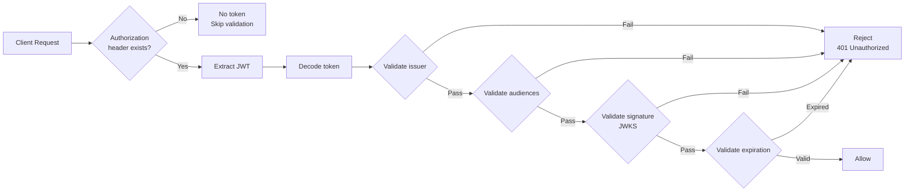
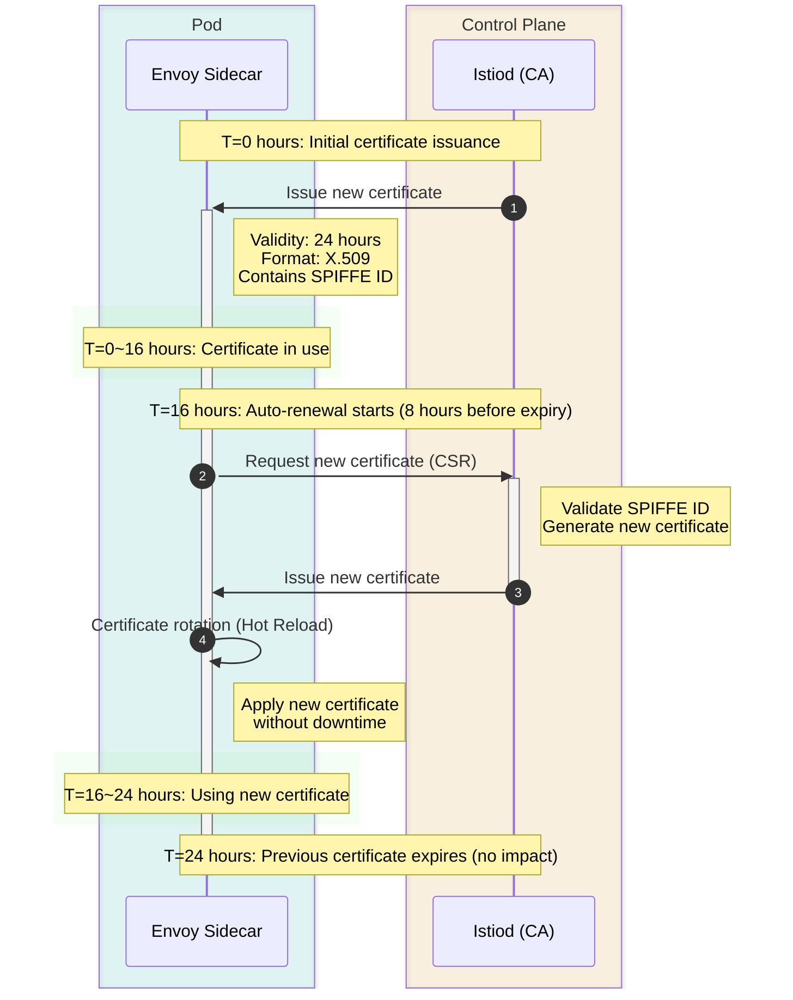

# Security Quiz

> **Supported Version**: Istio 1.28.0 **EKS Version**: 1.34 (Kubernetes 1.28+) **Last Updated**: February 23, 2026

This quiz tests your understanding of Istio's security features.

## Multiple Choice Questions (1-5)

### Question 1: PeerAuthentication Mode

Which statement correctly describes the **PERMISSIVE** mTLS mode in PeerAuthentication?

A. It allows both mTLS and plaintext traffic B. It only allows mTLS and rejects plaintext C. It rejects all traffic D. It disables mTLS

<details>

<summary>Show Answer</summary>

**Answer: A**

PERMISSIVE mode **allows both mTLS and plaintext traffic** to support gradual migration.

**Explanation:**

**PeerAuthentication mTLS Modes:**

| Mode           | Description                    | Use Scenario                          |
| -------------- | ------------------------------ | ------------------------------------- |
| **PERMISSIVE** | Allows both mTLS + plaintext   | Gradual migration, mixed environments |
| **STRICT**     | Only allows mTLS               | Production security hardening         |
| **DISABLE**    | Disables mTLS (plaintext only) | Debugging, legacy systems             |

**PERMISSIVE Mode Example:**

```yaml
apiVersion: security.istio.io/v1beta1
kind: PeerAuthentication
metadata:
  name: default
  namespace: istio-system
spec:
  mtls:
    mode: PERMISSIVE  # Allows both mTLS + plaintext
```

**Behavior:**

```
Client A (Istio Sidecar) -> [mTLS] -> Server (PERMISSIVE)  Allowed
Client B (No Sidecar)    -> [Plaintext] -> Server (PERMISSIVE)  Allowed
```

**Comparison with STRICT Mode:**

```yaml
apiVersion: security.istio.io/v1beta1
kind: PeerAuthentication
metadata:
  name: strict-mtls
  namespace: production
spec:
  mtls:
    mode: STRICT  # Only allows mTLS
```

```
Client A (Istio Sidecar) -> [mTLS] -> Server (STRICT)  Allowed
Client B (No Sidecar)    -> [Plaintext] -> Server (STRICT)  Rejected
```

**Migration Strategy:**

```
Step 1: PERMISSIVE (Allow mixed traffic)
  |
Step 2: Inject Sidecars to all services
  |
Step 3: STRICT (Enforce mTLS)
```

**Reference:**

* [PeerAuthentication](https://github.com/Atom-oh/kubernetes-docs/blob/main/en/service-mesh/istio/security/04-peer-authentication.md)
* [mTLS](../../../service-mesh/istio/security/01-mtls.md)

</details>

***

### Question 2: AuthorizationPolicy Action

What does the following AuthorizationPolicy configuration mean?

```yaml
apiVersion: security.istio.io/v1beta1
kind: AuthorizationPolicy
metadata:
  name: deny-all
spec:
  {}
```

A. It allows all requests B. It denies all requests C. It does not apply any policy D. It only allows mTLS

<details>

<summary>Show Answer</summary>

**Answer: B**

An AuthorizationPolicy with an empty spec **denies all requests** (deny-by-default).

**Explanation:**

**Default Behavior of AuthorizationPolicy:**

1. **No policy exists**: All requests allowed
2. **Empty spec (like the example)**: All requests denied
3. **Has rules**: Allow/deny based on rules

**Deny-by-default Pattern:**

```yaml
# Step 1: Deny all requests
apiVersion: security.istio.io/v1beta1
kind: AuthorizationPolicy
metadata:
  name: deny-all
  namespace: default
spec: {}  # Empty spec = deny all requests

---
# Step 2: Selectively allow only what's needed
apiVersion: security.istio.io/v1beta1
kind: AuthorizationPolicy
metadata:
  name: allow-frontend
  namespace: default
spec:
  selector:
    matchLabels:
      app: backend
  action: ALLOW
  rules:
  - from:
    - source:
        principals: ["cluster.local/ns/default/sa/frontend"]
    to:
    - operation:
        methods: ["GET", "POST"]
```

**AuthorizationPolicy Action Types:**

| action     | Description           | Priority    |
| ---------- | --------------------- | ----------- |
| **DENY**   | Explicit deny         | 1 (Highest) |
| **ALLOW**  | Explicit allow        | 2           |
| **AUDIT**  | Log only              | 3           |
| **CUSTOM** | External auth service | 4           |

**Evaluation Order:**

```
1. Evaluate DENY policies -> If matched, immediately deny
   | (pass)
2. Evaluate ALLOW policies -> If matched, allow
   | (no match)
3. Default behavior
   - If any ALLOW policy exists -> Deny
   - If no ALLOW policy exists -> Allow
```

**Practical Example:**

```yaml
# Scenario: Restrict HTTP methods
---
# DENY: Prohibit DELETE
apiVersion: security.istio.io/v1beta1
kind: AuthorizationPolicy
metadata:
  name: deny-delete
spec:
  selector:
    matchLabels:
      app: backend
  action: DENY
  rules:
  - to:
    - operation:
        methods: ["DELETE"]

---
# ALLOW: Only allow GET, POST
apiVersion: security.istio.io/v1beta1
kind: AuthorizationPolicy
metadata:
  name: allow-read-write
spec:
  selector:
    matchLabels:
      app: backend
  action: ALLOW
  rules:
  - from:
    - source:
        principals: ["cluster.local/ns/default/sa/frontend"]
    to:
    - operation:
        methods: ["GET", "POST"]
```

**Test:**

```bash
# GET request -> Matches ALLOW policy -> Allowed
curl http://backend/api

# POST request -> Matches ALLOW policy -> Allowed
curl -X POST http://backend/api

# DELETE request -> Matches DENY policy -> Rejected
curl -X DELETE http://backend/api

# PUT request -> No ALLOW policy match -> Rejected
curl -X PUT http://backend/api
```

**Reference:**

* [Authorization Policy](https://github.com/Atom-oh/kubernetes-docs/blob/main/en/service-mesh/istio/security/02-authorization-policy.md)

</details>

***

### Question 3: JWT Authentication

Which fields are used to validate JWT tokens in RequestAuthentication?

A. issuer and audiences B. principals and namespaces C. methods and paths D. hosts and ports

<details>

<summary>Show Answer</summary>

**Answer: A**

RequestAuthentication uses the **issuer** and **audiences** fields to validate JWT tokens.

**Explanation:**

**JWT Token Structure:**

```
Header.Payload.Signature

Payload example:
{
  "iss": "https://auth.example.com",        # issuer
  "sub": "user@example.com",                # subject
  "aud": ["api.example.com"],               # audiences
  "exp": 1735689600,                        # expiration
  "iat": 1735686000                         # issued at
}
```

**RequestAuthentication Configuration:**

```yaml
apiVersion: security.istio.io/v1beta1
kind: RequestAuthentication
metadata:
  name: jwt-auth
  namespace: default
spec:
  selector:
    matchLabels:
      app: backend
  jwtRules:
  - issuer: "https://auth.example.com"      # Validate iss field
    jwksUri: "https://auth.example.com/.well-known/jwks.json"
    audiences:
    - "api.example.com"                     # Validate aud field
    forwardOriginalToken: true
```

**JWT Validation Process:**



**Integration with OIDC Providers:**

```yaml
# Google OAuth2 example
apiVersion: security.istio.io/v1beta1
kind: RequestAuthentication
metadata:
  name: google-jwt
spec:
  jwtRules:
  - issuer: "https://accounts.google.com"
    jwksUri: "https://www.googleapis.com/oauth2/v3/certs"
    audiences:
    - "123456789-abcdefg.apps.googleusercontent.com"

---
# Keycloak example
apiVersion: security.istio.io/v1beta1
kind: RequestAuthentication
metadata:
  name: keycloak-jwt
spec:
  jwtRules:
  - issuer: "https://keycloak.example.com/realms/myrealm"
    jwksUri: "https://keycloak.example.com/realms/myrealm/protocol/openid-connect/certs"
    audiences:
    - "myapp"
```

**Combining with AuthorizationPolicy:**

```yaml
# 1. RequestAuthentication: Validate JWT
apiVersion: security.istio.io/v1beta1
kind: RequestAuthentication
metadata:
  name: jwt-auth
spec:
  selector:
    matchLabels:
      app: backend
  jwtRules:
  - issuer: "https://auth.example.com"
    jwksUri: "https://auth.example.com/.well-known/jwks.json"

---
# 2. AuthorizationPolicy: Only allow authenticated requests
apiVersion: security.istio.io/v1beta1
kind: AuthorizationPolicy
metadata:
  name: require-jwt
spec:
  selector:
    matchLabels:
      app: backend
  action: ALLOW
  rules:
  - from:
    - source:
        requestPrincipals: ["*"]  # Only requests with JWT
    to:
    - operation:
        methods: ["GET", "POST"]

---
# 3. AuthorizationPolicy: Only allow specific issuer
apiVersion: security.istio.io/v1beta1
kind: AuthorizationPolicy
metadata:
  name: require-specific-issuer
spec:
  selector:
    matchLabels:
      app: backend
  action: ALLOW
  rules:
  - from:
    - source:
        requestPrincipals: ["https://auth.example.com/*"]
```

**Test:**

```bash
# Request without JWT -> Passes RequestAuthentication, denied by AuthorizationPolicy
curl http://backend/api
# 401 Unauthorized

# Request with valid JWT
TOKEN="eyJhbGc..."
curl -H "Authorization: Bearer $TOKEN" http://backend/api
# 200 OK
```

**Reference:**

* [Request Authentication](https://github.com/Atom-oh/kubernetes-docs/blob/main/en/service-mesh/istio/security/03-request-authentication.md)

</details>

***

### Question 4: mTLS Certificate Management

What is the default validity period for mTLS certificates in Istio?

A. 1 hour B. 24 hours C. 7 days D. 90 days

<details>

<summary>Show Answer</summary>

**Answer: B**

The default validity period for mTLS certificates in Istio is **24 hours**, and they are automatically renewed.

**Explanation:**

**Istio Certificate Management:**

```yaml
# Istiod configuration (defaults)
apiVersion: install.istio.io/v1alpha1
kind: IstioOperator
spec:
  meshConfig:
    certificates:
    - secretName: dns.example-service-account
      dnsNames:
      - example.com
```

**Default Settings:**

* **Certificate validity period**: 24 hours (1 day)
* **Renewal timing**: 8 hours before expiration
* **Renewal method**: Automatic (managed by Istiod)
* **Certificate format**: X.509

**Certificate Lifecycle:**



**Checking Certificates:**

```bash
# Check pod's mTLS certificate
istioctl proxy-config secret <pod-name> -o json

# Example output:
{
  "name": "default",
  "tlsCertificate": {
    "certificateChain": {
      "inlineBytes": "LS0tLS1CRU..."
    },
    "privateKey": {
      "inlineBytes": "LS0tLS1CRU..."
    }
  },
  "validationContext": {
    "trustedCa": {
      "inlineBytes": "LS0tLS1CRU..."
    }
  }
}

# Decode certificate contents
kubectl exec <pod-name> -c istio-proxy -- \
  openssl x509 -text -noout -in /etc/certs/cert-chain.pem

# Example output:
Certificate:
    Validity
        Not Before: Jan 20 00:00:00 2025 GMT
        Not After : Jan 21 00:00:00 2025 GMT  # 24 hours later
    Subject: O=cluster.local
    X509v3 Subject Alternative Name:
        URI:spiffe://cluster.local/ns/default/sa/myapp
```

**Customizing Validity Period:**

```yaml
apiVersion: install.istio.io/v1alpha1
kind: IstioOperator
spec:
  meshConfig:
    # Change certificate validity period
    defaultConfig:
      proxyMetadata:
        SECRET_TTL: "48h"  # Extend to 48 hours
```

**Certificate Renewal Failure Scenarios:**

```bash
# Check Istiod logs
kubectl logs -n istio-system -l app=istiod

# Common issues:
# 1. Communication issues between Istiod and Envoy
# 2. RBAC permission issues
# 3. Blocked by network policies

# Manually trigger certificate renewal
kubectl delete pod <pod-name>  # Pod restart reissues certificate
```

**SPIFFE ID:**

```
Istio's mTLS certificates follow the SPIFFE (Secure Production Identity Framework For Everyone) standard.

Format: spiffe://<trust-domain>/ns/<namespace>/sa/<service-account>
Example: spiffe://cluster.local/ns/default/sa/frontend
```

**CA Hierarchy:**

```
Root CA (Istiod)
  +- Intermediate CA (auto-generated)
  |   +- frontend Pod certificate (24 hours)
  |   +- backend Pod certificate (24 hours)
  |   +- database Pod certificate (24 hours)
  +- ...
```

**External CA Integration:**

```yaml
# Using external CA with Cert-Manager
apiVersion: install.istio.io/v1alpha1
kind: IstioOperator
spec:
  components:
    pilot:
      k8s:
        env:
        - name: EXTERNAL_CA
          value: ISTIOD_RA_KUBERNETES_API
```

**Reference:**

* [mTLS](../../../service-mesh/istio/security/01-mtls.md)
* [Certificate Management](../../../service-mesh/istio/03-architecture.md#certificate-management)

</details>

***

### Question 5: Service Account-based Authentication

What identity is used for service-to-service authentication in Istio?

A. Pod name B. Service name C. Service Account D. Namespace name

<details>

<summary>Show Answer</summary>

**Answer: C**

Istio manages service-to-service identity based on **Service Account**.

**Explanation:**

**Service Account-based Identity:**

```yaml
# 1. Create Service Account
apiVersion: v1
kind: ServiceAccount
metadata:
  name: frontend
  namespace: default

---
# 2. Use Service Account in Deployment
apiVersion: apps/v1
kind: Deployment
metadata:
  name: frontend
spec:
  template:
    spec:
      serviceAccountName: frontend  # Used as identity
      containers:
      - name: frontend
        image: frontend:v1
```

**SPIFFE ID Format:**

```
spiffe://<trust-domain>/ns/<namespace>/sa/<service-account>

Examples:
spiffe://cluster.local/ns/default/sa/frontend
spiffe://cluster.local/ns/production/sa/backend
```

**Using Service Account in AuthorizationPolicy:**

```yaml
apiVersion: security.istio.io/v1beta1
kind: AuthorizationPolicy
metadata:
  name: backend-policy
  namespace: default
spec:
  selector:
    matchLabels:
      app: backend
  action: ALLOW
  rules:
  # Only allow frontend Service Account
  - from:
    - source:
        principals:
        - "cluster.local/ns/default/sa/frontend"
    to:
    - operation:
        methods: ["GET", "POST"]
        paths: ["/api/*"]

  # admin Service Account allowed for all operations
  - from:
    - source:
        principals:
        - "cluster.local/ns/default/sa/admin"
```

**Service Account vs Pod/Service Name:**

| Item                 | Service Account         | Pod Name            | Service Name    |
| -------------------- | ----------------------- | ------------------- | --------------- |
| **Stability**        | Stable                  | Dynamically changes | Stable          |
| **Security**         | Certificate-based       | Not trustworthy     | Not trustworthy |
| **RBAC Integration** | Kubernetes RBAC         | Not possible        | Not possible    |
| **mTLS**             | Included in certificate | Not included        | Not included    |

**Practical Example: 3-Tier Application:**

```yaml
# Frontend -> Backend only allowed
---
apiVersion: v1
kind: ServiceAccount
metadata:
  name: frontend
  namespace: app

---
apiVersion: v1
kind: ServiceAccount
metadata:
  name: backend
  namespace: app

---
apiVersion: v1
kind: ServiceAccount
metadata:
  name: database
  namespace: app

---
# Backend policy: Only allow Frontend access
apiVersion: security.istio.io/v1beta1
kind: AuthorizationPolicy
metadata:
  name: backend-policy
  namespace: app
spec:
  selector:
    matchLabels:
      app: backend
  action: ALLOW
  rules:
  - from:
    - source:
        principals: ["cluster.local/ns/app/sa/frontend"]

---
# Database policy: Only allow Backend access
apiVersion: security.istio.io/v1beta1
kind: AuthorizationPolicy
metadata:
  name: database-policy
  namespace: app
spec:
  selector:
    matchLabels:
      app: database
  action: ALLOW
  rules:
  - from:
    - source:
        principals: ["cluster.local/ns/app/sa/backend"]
```

**Checking Service Account:**

```bash
# Check pod's Service Account
kubectl get pod <pod-name> -o jsonpath='{.spec.serviceAccountName}'

# Check SPIFFE ID in mTLS certificate
istioctl proxy-config secret <pod-name> -o json | \
  jq -r '.dynamicActiveSecrets[0].secret.tlsCertificate.certificateChain.inlineBytes' | \
  base64 -d | openssl x509 -text -noout | grep URI

# Output:
# URI:spiffe://cluster.local/ns/default/sa/frontend
```

**Cross-Namespace Communication:**

```yaml
# Allow production namespace's frontend -> staging namespace's backend access
apiVersion: security.istio.io/v1beta1
kind: AuthorizationPolicy
metadata:
  name: backend-policy
  namespace: staging
spec:
  selector:
    matchLabels:
      app: backend
  action: ALLOW
  rules:
  - from:
    - source:
        principals:
        - "cluster.local/ns/production/sa/frontend"
        namespaces:
        - "production"
```

**Reference:**

* [mTLS](../../../service-mesh/istio/security/01-mtls.md)
* [Authorization Policy](https://github.com/Atom-oh/kubernetes-docs/blob/main/en/service-mesh/istio/security/02-authorization-policy.md)

</details>

***

## Short Answer Questions (6-10)

### Question 6: Implementing Deny-by-default Security Policy

Explain step by step how to implement a **deny-by-default** security policy using Istio in a Kubernetes cluster. Include **required resources** (PeerAuthentication, AuthorizationPolicy) and **exception handling** methods.

<details>

<summary>Show Answer</summary>

**Answer:**

**Implementing Deny-by-default Security Policy:**

***

**Step 1: Enable mTLS STRICT Mode**

Force all service-to-service communication to use mTLS:

```yaml
apiVersion: security.istio.io/v1beta1
kind: PeerAuthentication
metadata:
  name: default
  namespace: istio-system
spec:
  mtls:
    mode: STRICT  # Enforce mTLS
```

**Scope:**

* Deployed in `istio-system` namespace -> Applies to entire mesh
* Deployed in specific namespace -> Applies to that namespace only
* Using selector -> Applies to specific workloads only

***

**Step 2: Deny All Traffic (Deny-by-default)**

```yaml
apiVersion: security.istio.io/v1beta1
kind: AuthorizationPolicy
metadata:
  name: deny-all
  namespace: default
spec: {}  # Empty spec = deny all requests
```

**After this policy:**

* All inbound traffic denied
* Service-to-service communication blocked
* External access blocked

***

**Step 3: Selectively Allow Required Communication**

**Example 1: Allow Frontend -> Backend Communication**

```yaml
apiVersion: security.istio.io/v1beta1
kind: AuthorizationPolicy
metadata:
  name: allow-frontend-to-backend
  namespace: default
spec:
  selector:
    matchLabels:
      app: backend  # Apply to Backend
  action: ALLOW
  rules:
  - from:
    - source:
        principals:
        - "cluster.local/ns/default/sa/frontend"  # Only allow Frontend
    to:
    - operation:
        methods: ["GET", "POST"]
        paths: ["/api/*"]
```

**Example 2: Allow Backend -> Database Communication**

```yaml
apiVersion: security.istio.io/v1beta1
kind: AuthorizationPolicy
metadata:
  name: allow-backend-to-database
  namespace: default
spec:
  selector:
    matchLabels:
      app: database
  action: ALLOW
  rules:
  - from:
    - source:
        principals:
        - "cluster.local/ns/default/sa/backend"
    to:
    - operation:
        ports: ["5432"]  # PostgreSQL port
```

***

**Step 4: Ingress Gateway Policy**

Policy is needed for Ingress Gateway to allow external traffic:

```yaml
# Allow traffic to Ingress Gateway
apiVersion: security.istio.io/v1beta1
kind: AuthorizationPolicy
metadata:
  name: allow-ingress
  namespace: istio-system
spec:
  selector:
    matchLabels:
      istio: ingressgateway
  action: ALLOW
  rules:
  - to:
    - operation:
        ports: ["80", "443"]

---
# Allow Ingress Gateway -> Frontend
apiVersion: security.istio.io/v1beta1
kind: AuthorizationPolicy
metadata:
  name: allow-gateway-to-frontend
  namespace: default
spec:
  selector:
    matchLabels:
      app: frontend
  action: ALLOW
  rules:
  - from:
    - source:
        principals:
        - "cluster.local/ns/istio-system/sa/istio-ingressgateway-service-account"
```

***

**Step 5: Health Check and Readiness Probe Exceptions**

Handle exceptions so Kubernetes health checks are not blocked:

```yaml
apiVersion: security.istio.io/v1beta1
kind: AuthorizationPolicy
metadata:
  name: allow-health-checks
  namespace: default
spec:
  selector:
    matchLabels:
      app: backend
  action: ALLOW
  rules:
  # Allow Kubernetes health checks
  - to:
    - operation:
        paths: ["/health", "/ready"]
        methods: ["GET"]
```

Or exclude specific ports in PeerAuthentication:

```yaml
apiVersion: security.istio.io/v1beta1
kind: PeerAuthentication
metadata:
  name: default
  namespace: default
spec:
  mtls:
    mode: STRICT
  portLevelMtls:
    8080:
      mode: DISABLE  # Disable mTLS for health check port
```

***

**Step 6: Monitoring and Logging Exceptions**

Allow Prometheus to collect metrics:

```yaml
apiVersion: security.istio.io/v1beta1
kind: AuthorizationPolicy
metadata:
  name: allow-prometheus
  namespace: default
spec:
  action: ALLOW
  rules:
  - from:
    - source:
        namespaces: ["istio-system"]
        principals: ["cluster.local/ns/istio-system/sa/prometheus"]
    to:
    - operation:
        paths: ["/stats/prometheus"]
        methods: ["GET"]
```

***

**Complete Example: 3-Tier Application**

```yaml
# 1. mTLS STRICT
---
apiVersion: security.istio.io/v1beta1
kind: PeerAuthentication
metadata:
  name: default
  namespace: production
spec:
  mtls:
    mode: STRICT

# 2. Deny-by-default
---
apiVersion: security.istio.io/v1beta1
kind: AuthorizationPolicy
metadata:
  name: deny-all
  namespace: production
spec: {}

# 3. Ingress -> Frontend
---
apiVersion: security.istio.io/v1beta1
kind: AuthorizationPolicy
metadata:
  name: allow-ingress-to-frontend
  namespace: production
spec:
  selector:
    matchLabels:
      app: frontend
  action: ALLOW
  rules:
  - from:
    - source:
        principals: ["cluster.local/ns/istio-system/sa/istio-ingressgateway-service-account"]

# 4. Frontend -> Backend
---
apiVersion: security.istio.io/v1beta1
kind: AuthorizationPolicy
metadata:
  name: allow-frontend-to-backend
  namespace: production
spec:
  selector:
    matchLabels:
      app: backend
  action: ALLOW
  rules:
  - from:
    - source:
        principals: ["cluster.local/ns/production/sa/frontend"]
    to:
    - operation:
        methods: ["GET", "POST", "PUT", "DELETE"]
        paths: ["/api/*"]

# 5. Backend -> Database
---
apiVersion: security.istio.io/v1beta1
kind: AuthorizationPolicy
metadata:
  name: allow-backend-to-database
  namespace: production
spec:
  selector:
    matchLabels:
      app: database
  action: ALLOW
  rules:
  - from:
    - source:
        principals: ["cluster.local/ns/production/sa/backend"]

# 6. Health Checks
---
apiVersion: security.istio.io/v1beta1
kind: AuthorizationPolicy
metadata:
  name: allow-health-checks
  namespace: production
spec:
  action: ALLOW
  rules:
  - to:
    - operation:
        paths: ["/health", "/ready", "/live"]

# 7. Prometheus metrics
---
apiVersion: security.istio.io/v1beta1
kind: AuthorizationPolicy
metadata:
  name: allow-prometheus
  namespace: production
spec:
  action: ALLOW
  rules:
  - from:
    - source:
        namespaces: ["istio-system"]
    to:
    - operation:
        paths: ["/stats/prometheus"]
```

***

**Testing and Validation:**

```bash
# 1. Frontend -> Backend (allowed)
kubectl exec -it <frontend-pod> -- curl http://backend/api
# 200 OK

# 2. Direct Database access (denied)
kubectl exec -it <frontend-pod> -- curl http://database:5432
# 403 RBAC: access denied

# 3. External direct Backend access (denied)
curl http://<ingress-gateway>/backend
# 403 RBAC: access denied

# 4. Normal path (allowed)
curl http://<ingress-gateway>/frontend
# 200 OK
```

***

**Best Practices:**

1. **Gradual Application**:
   * First enable mTLS in PERMISSIVE mode
   * Verify all services have Sidecars injected
   * Switch to STRICT mode
   * Apply deny-by-default policy
2. **Principle of Least Privilege**:
   * Allow only minimum required communication
   * Restrict HTTP methods (GET only, POST only, etc.)
   * Restrict paths (/api/\* only, etc.)
3. **Exception Handling**:
   * Always handle health check exceptions
   * Allow monitoring system access
   * Configure Ingress Gateway policy
4. **Testing**:
   * Test after each policy is applied
   * Check for side effects (logs, metrics)
   * Prepare rollback plan

**Reference:**

* [Authorization Policy](https://github.com/Atom-oh/kubernetes-docs/blob/main/en/service-mesh/istio/security/02-authorization-policy.md)
* [PeerAuthentication](https://github.com/Atom-oh/kubernetes-docs/blob/main/en/service-mesh/istio/security/04-peer-authentication.md)

</details>

***

### Question 7: JWT + mTLS Dual Authentication

Implement a scenario where **end-user authentication (JWT)** and **service-to-service authentication (mTLS)** are used together in Istio. Include how to integrate with OAuth2/OIDC providers (e.g., Keycloak).

<details>

<summary>Show Answer</summary>

**Answer:**

**JWT + mTLS Dual Authentication Architecture:**

```
User
  | (JWT Token)
Ingress Gateway (Validate JWT with RequestAuthentication)
  | (mTLS)
Frontend (Validate mTLS with PeerAuthentication)
  | (mTLS)
Backend
```

***

**Step 1: Keycloak Setup**

```bash
# Create Keycloak Realm
Realm: myrealm

# Create Client
Client ID: myapp
Access Type: confidential
Valid Redirect URIs: http://myapp.example.com/*

# Get JWKS URI
https://keycloak.example.com/realms/myrealm/protocol/openid-connect/certs
```

***

**Step 2: Enable mTLS (Service-to-Service Authentication)**

```yaml
# Apply STRICT mTLS to entire mesh
apiVersion: security.istio.io/v1beta1
kind: PeerAuthentication
metadata:
  name: default
  namespace: istio-system
spec:
  mtls:
    mode: STRICT
```

***

**Step 3: Configure JWT Authentication (End-User Authentication)**

```yaml
# Validate JWT at Ingress Gateway
apiVersion: security.istio.io/v1beta1
kind: RequestAuthentication
metadata:
  name: jwt-ingress
  namespace: istio-system
spec:
  selector:
    matchLabels:
      istio: ingressgateway
  jwtRules:
  - issuer: "https://keycloak.example.com/realms/myrealm"
    jwksUri: "https://keycloak.example.com/realms/myrealm/protocol/openid-connect/certs"
    audiences:
    - "myapp"
    forwardOriginalToken: true  # Forward JWT to backend
    outputPayloadToHeader: "x-jwt-payload"  # Extract payload to header
```

***

**Step 4: Configure AuthorizationPolicy**

**Ingress Gateway Policy**

```yaml
apiVersion: security.istio.io/v1beta1
kind: AuthorizationPolicy
metadata:
  name: ingress-jwt-policy
  namespace: istio-system
spec:
  selector:
    matchLabels:
      istio: ingressgateway
  action: ALLOW
  rules:
  # Only allow requests with JWT
  - from:
    - source:
        requestPrincipals: ["*"]
    to:
    - operation:
        paths: ["/api/*", "/app/*"]

  # Allow health checks without JWT
  - to:
    - operation:
        paths: ["/health", "/ready"]
```

**Backend Policy**

```yaml
apiVersion: security.istio.io/v1beta1
kind: AuthorizationPolicy
metadata:
  name: backend-jwt-mtls-policy
  namespace: default
spec:
  selector:
    matchLabels:
      app: backend
  action: ALLOW
  rules:
  # 1. mTLS: Only allow Frontend Service Account
  # 2. JWT: Must have valid JWT
  - from:
    - source:
        principals: ["cluster.local/ns/default/sa/frontend"]
        requestPrincipals: ["https://keycloak.example.com/realms/myrealm/*"]
    to:
    - operation:
        methods: ["GET", "POST"]
```

***

**Step 5: Role-Based Access Control**

Fine-grained authorization based on JWT claims:

```yaml
apiVersion: security.istio.io/v1beta1
kind: AuthorizationPolicy
metadata:
  name: backend-rbac
  namespace: default
spec:
  selector:
    matchLabels:
      app: backend
  action: ALLOW
  rules:
  # Only Admin role allowed for DELETE
  - from:
    - source:
        principals: ["cluster.local/ns/default/sa/frontend"]
        requestPrincipals: ["*"]
    when:
    - key: request.auth.claims[roles]
      values: ["admin"]
    to:
    - operation:
        methods: ["DELETE"]
        paths: ["/api/admin/*"]

  # User role only allowed GET, POST
  - from:
    - source:
        principals: ["cluster.local/ns/default/sa/frontend"]
        requestPrincipals: ["*"]
    when:
    - key: request.auth.claims[roles]
      values: ["user"]
    to:
    - operation:
        methods: ["GET", "POST"]
        paths: ["/api/users/*"]
```

***

**Step 6: Utilizing JWT Payload**

Use JWT payload in Backend:

```yaml
# EnvoyFilter to pass JWT claims as headers
apiVersion: networking.istio.io/v1alpha3
kind: EnvoyFilter
metadata:
  name: jwt-claim-to-header
  namespace: istio-system
spec:
  workloadSelector:
    labels:
      istio: ingressgateway
  configPatches:
  - applyTo: HTTP_FILTER
    match:
      context: GATEWAY
      listener:
        filterChain:
          filter:
            name: "envoy.filters.network.http_connection_manager"
            subFilter:
              name: "envoy.filters.http.jwt_authn"
    patch:
      operation: INSERT_AFTER
      value:
        name: envoy.lua
        typed_config:
          "@type": type.googleapis.com/envoy.extensions.filters.http.lua.v3.Lua
          inline_code: |
            function envoy_on_request(request_handle)
              local payload = request_handle:headers():get("x-jwt-payload")
              if payload then
                -- Base64 decode and JSON parse
                local json = require("json")
                local decoded = json.decode(payload)

                -- Pass user info as headers
                request_handle:headers():add("x-user-id", decoded.sub)
                request_handle:headers():add("x-user-email", decoded.email)
                request_handle:headers():add("x-user-roles", table.concat(decoded.roles, ","))
              end
            end
```

***

**Step 7: Complete Example**

**Ingress Gateway**

```yaml
---
# JWT validation
apiVersion: security.istio.io/v1beta1
kind: RequestAuthentication
metadata:
  name: jwt-ingress
  namespace: istio-system
spec:
  selector:
    matchLabels:
      istio: ingressgateway
  jwtRules:
  - issuer: "https://keycloak.example.com/realms/myrealm"
    jwksUri: "https://keycloak.example.com/realms/myrealm/protocol/openid-connect/certs"
    audiences: ["myapp"]
    forwardOriginalToken: true

---
# Require JWT
apiVersion: security.istio.io/v1beta1
kind: AuthorizationPolicy
metadata:
  name: require-jwt
  namespace: istio-system
spec:
  selector:
    matchLabels:
      istio: ingressgateway
  action: ALLOW
  rules:
  - from:
    - source:
        requestPrincipals: ["*"]
```

**Frontend**

```yaml
---
# mTLS STRICT
apiVersion: security.istio.io/v1beta1
kind: PeerAuthentication
metadata:
  name: frontend-mtls
  namespace: default
spec:
  selector:
    matchLabels:
      app: frontend
  mtls:
    mode: STRICT

---
# Only allow Ingress Gateway access
apiVersion: security.istio.io/v1beta1
kind: AuthorizationPolicy
metadata:
  name: frontend-policy
  namespace: default
spec:
  selector:
    matchLabels:
      app: frontend
  action: ALLOW
  rules:
  - from:
    - source:
        principals: ["cluster.local/ns/istio-system/sa/istio-ingressgateway-service-account"]
        requestPrincipals: ["*"]
```

**Backend**

```yaml
---
# mTLS STRICT
apiVersion: security.istio.io/v1beta1
kind: PeerAuthentication
metadata:
  name: backend-mtls
  namespace: default
spec:
  selector:
    matchLabels:
      app: backend
  mtls:
    mode: STRICT

---
# Only allow Frontend access + Require JWT
apiVersion: security.istio.io/v1beta1
kind: AuthorizationPolicy
metadata:
  name: backend-policy
  namespace: default
spec:
  selector:
    matchLabels:
      app: backend
  action: ALLOW
  rules:
  - from:
    - source:
        principals: ["cluster.local/ns/default/sa/frontend"]
        requestPrincipals: ["https://keycloak.example.com/realms/myrealm/*"]
```

***

**Test:**

```bash
# 1. Get token from Keycloak
TOKEN=$(curl -X POST \
  "https://keycloak.example.com/realms/myrealm/protocol/openid-connect/token" \
  -d "client_id=myapp" \
  -d "client_secret=<secret>" \
  -d "grant_type=password" \
  -d "username=user@example.com" \
  -d "password=password123" \
  | jq -r '.access_token')

# 2. Call API with JWT
curl -H "Authorization: Bearer $TOKEN" \
  http://myapp.example.com/api/users

# 3. Call without JWT (fails)
curl http://myapp.example.com/api/users
# 401 Unauthorized

# 4. Invalid JWT (fails)
curl -H "Authorization: Bearer invalid-token" \
  http://myapp.example.com/api/users
# 401 Unauthorized
```

***

**Security Benefits:**

1. **Dual Authentication**:
   * JWT: Verify end-user identity
   * mTLS: Verify service identity
2. **Defense in Depth**:
   * JWT validation at Gateway
   * Encrypted communication with mTLS between services
   * Fine-grained authorization with AuthorizationPolicy
3. **Role-Based Access Control (RBAC)**:
   * Authorization management based on JWT claims
   * Dynamic permission updates (managed in Keycloak)

**Reference:**

* [Request Authentication](https://github.com/Atom-oh/kubernetes-docs/blob/main/en/service-mesh/istio/security/03-request-authentication.md)
* [mTLS](../../../service-mesh/istio/security/01-mtls.md)

</details>

***

### Question 8: External Service Access Control

Explain how to control **Egress traffic** in Istio to allow access only to specific external services. Include complete examples using **ServiceEntry**, **VirtualService**, and **AuthorizationPolicy**.

<details>

<summary>Show Answer</summary>

**Answer:**

**Egress Traffic Control Strategy:**

***

**Step 1: Check Egress Traffic Default Mode**

Istio supports two egress modes:

```yaml
apiVersion: install.istio.io/v1alpha1
kind: IstioOperator
spec:
  meshConfig:
    outboundTrafficPolicy:
      mode: REGISTRY_ONLY  # or ALLOW_ANY
```

**Mode Comparison:**

| Mode               | Description                                    | Security |
| ------------------ | ---------------------------------------------- | -------- |
| **ALLOW\_ANY**     | Allow all external traffic (default)           | Low      |
| **REGISTRY\_ONLY** | Only allow services registered in ServiceEntry | High     |

**Switch to REGISTRY\_ONLY Mode:**

```bash
istioctl install --set meshConfig.outboundTrafficPolicy.mode=REGISTRY_ONLY
```

***

**Step 2: Register External Services with ServiceEntry**

**Example 1: HTTPS API (GitHub)**

```yaml
apiVersion: networking.istio.io/v1beta1
kind: ServiceEntry
metadata:
  name: github-api
  namespace: default
spec:
  hosts:
  - api.github.com
  ports:
  - number: 443
    name: https
    protocol: HTTPS
  location: MESH_EXTERNAL
  resolution: DNS
```

**Example 2: HTTP API (httpbin)**

```yaml
apiVersion: networking.istio.io/v1beta1
kind: ServiceEntry
metadata:
  name: httpbin-ext
  namespace: default
spec:
  hosts:
  - httpbin.org
  ports:
  - number: 80
    name: http
    protocol: HTTP
  - number: 443
    name: https
    protocol: HTTPS
  location: MESH_EXTERNAL
  resolution: DNS
```

**Example 3: Specific IP Address**

```yaml
apiVersion: networking.istio.io/v1beta1
kind: ServiceEntry
metadata:
  name: external-database
  namespace: default
spec:
  hosts:
  - database.external.com
  addresses:
  - 203.0.113.10  # Specific IP
  ports:
  - number: 5432
    name: postgres
    protocol: TCP
  location: MESH_EXTERNAL
  resolution: STATIC
  endpoints:
  - address: 203.0.113.10
```

***

**Step 3: Control Traffic with VirtualService**

**Timeout and Retry Settings**

```yaml
apiVersion: networking.istio.io/v1beta1
kind: VirtualService
metadata:
  name: github-api-vs
  namespace: default
spec:
  hosts:
  - api.github.com
  http:
  - timeout: 10s
    retries:
      attempts: 3
      perTryTimeout: 3s
      retryOn: 5xx,reset,connect-failure
    route:
    - destination:
        host: api.github.com
```

**Add Headers (API Key)**

```yaml
apiVersion: networking.istio.io/v1beta1
kind: VirtualService
metadata:
  name: external-api-vs
  namespace: default
spec:
  hosts:
  - api.example.com
  http:
  - headers:
      request:
        add:
          X-API-Key: "my-secret-key"
    route:
    - destination:
        host: api.example.com
```

***

**Step 4: Access Control with AuthorizationPolicy**

**Allow Only Specific Service Account**

```yaml
apiVersion: security.istio.io/v1beta1
kind: AuthorizationPolicy
metadata:
  name: allow-github-api
  namespace: default
spec:
  action: ALLOW
  rules:
  # Only allow Backend Service Account to access GitHub API
  - from:
    - source:
        principals: ["cluster.local/ns/default/sa/backend"]
    to:
    - operation:
        hosts: ["api.github.com"]
```

**Allow Only Specific Paths**

```yaml
apiVersion: security.istio.io/v1beta1
kind: AuthorizationPolicy
metadata:
  name: allow-specific-api
  namespace: default
spec:
  action: ALLOW
  rules:
  - from:
    - source:
        principals: ["cluster.local/ns/default/sa/backend"]
    to:
    - operation:
        hosts: ["api.example.com"]
        paths: ["/v1/data", "/v1/status"]
        methods: ["GET"]
```

***

**Step 5: Using Egress Gateway (Optional)**

Centralized egress control:

```yaml
# Deploy Egress Gateway
apiVersion: install.istio.io/v1alpha1
kind: IstioOperator
spec:
  components:
    egressGateways:
    - name: istio-egressgateway
      enabled: true
      k8s:
        replicas: 2

---
# Define Gateway
apiVersion: networking.istio.io/v1beta1
kind: Gateway
metadata:
  name: egress-gateway
  namespace: default
spec:
  selector:
    istio: egressgateway
  servers:
  - port:
      number: 443
      name: https
      protocol: HTTPS
    hosts:
    - api.github.com
    tls:
      mode: PASSTHROUGH  # Pass TLS traffic through

---
# DestinationRule
apiVersion: networking.istio.io/v1beta1
kind: DestinationRule
metadata:
  name: egress-gateway-dr
  namespace: default
spec:
  host: istio-egressgateway.istio-system.svc.cluster.local
  subsets:
  - name: github

---
# VirtualService: Pod -> Egress Gateway
apiVersion: networking.istio.io/v1beta1
kind: VirtualService
metadata:
  name: github-through-egress
  namespace: default
spec:
  hosts:
  - api.github.com
  gateways:
  - mesh  # From Sidecar
  - egress-gateway
  http:
  - match:
    - gateways:
      - mesh  # Starting from Pod
      port: 443
    route:
    - destination:
        host: istio-egressgateway.istio-system.svc.cluster.local
        subset: github
        port:
          number: 443
  - match:
    - gateways:
      - egress-gateway  # From Egress Gateway
      port: 443
    route:
    - destination:
        host: api.github.com
        port:
          number: 443
```

**Traffic Flow:**

```
Pod -> Sidecar -> Egress Gateway -> External Service
```

***

**Step 6: Complete Example**

**Scenario**: Only allow Backend service to access GitHub API

```yaml
# 1. Set REGISTRY_ONLY mode
---
apiVersion: v1
kind: ConfigMap
metadata:
  name: istio
  namespace: istio-system
data:
  mesh: |
    outboundTrafficPolicy:
      mode: REGISTRY_ONLY

# 2. GitHub API ServiceEntry
---
apiVersion: networking.istio.io/v1beta1
kind: ServiceEntry
metadata:
  name: github-api
  namespace: default
spec:
  hosts:
  - api.github.com
  ports:
  - number: 443
    name: https
    protocol: HTTPS
  location: MESH_EXTERNAL
  resolution: DNS

# 3. VirtualService: Timeout and retry
---
apiVersion: networking.istio.io/v1beta1
kind: VirtualService
metadata:
  name: github-api-vs
  namespace: default
spec:
  hosts:
  - api.github.com
  http:
  - timeout: 30s
    retries:
      attempts: 3
      perTryTimeout: 10s
      retryOn: 5xx,reset,connect-failure
    route:
    - destination:
        host: api.github.com
        port:
          number: 443

# 4. AuthorizationPolicy: Only allow Backend
---
apiVersion: security.istio.io/v1beta1
kind: AuthorizationPolicy
metadata:
  name: allow-backend-github
  namespace: default
spec:
  action: ALLOW
  rules:
  - from:
    - source:
        principals: ["cluster.local/ns/default/sa/backend"]
    to:
    - operation:
        hosts: ["api.github.com"]
        methods: ["GET", "POST"]

# 5. Deny-by-default (block all other egress)
---
apiVersion: security.istio.io/v1beta1
kind: AuthorizationPolicy
metadata:
  name: deny-all-egress
  namespace: default
spec:
  action: DENY
  rules:
  - to:
    - operation:
        hosts: ["*"]
```

***

**Test:**

```bash
# 1. Call GitHub API from Backend (allowed)
kubectl exec -it <backend-pod> -- \
  curl -I https://api.github.com/users/octocat
# 200 OK

# 2. Call GitHub API from Frontend (denied)
kubectl exec -it <frontend-pod> -- \
  curl -I https://api.github.com/users/octocat
# Connection refused

# 3. Call other external service from Backend (denied)
kubectl exec -it <backend-pod> -- \
  curl -I https://google.com
# Connection refused (No ServiceEntry)
```

***

**Monitoring:**

```bash
# Check egress traffic
kubectl exec -it <backend-pod> -c istio-proxy -- \
  curl localhost:15000/stats/prometheus | grep upstream_cx_total

# Check ServiceEntry
istioctl proxy-config clusters <backend-pod> | grep github
```

***

**Security Benefits:**

1. **Whitelist approach**: Only allow access to services registered in ServiceEntry
2. **Service Account-based control**: Only specific services can call external APIs
3. **Audit and logging**: Can log all egress traffic
4. **Centralized management**: Monitor all external traffic through Egress Gateway

**Reference:**

* [ServiceEntry](https://istio.io/latest/docs/reference/config/networking/service-entry/)
* [Egress Traffic](https://istio.io/latest/docs/tasks/traffic-management/egress/)

</details>

***

### Question 9: Security Auditing and Logging

Explain how to **audit** and log security-related events in Istio. Include **AuthorizationPolicy's AUDIT action** and **Access Log** configuration.

<details>

<summary>Show Answer</summary>

**Answer:**

**Istio Security Auditing and Logging Strategy:**

***

**1. AuthorizationPolicy AUDIT Action**

AUDIT action logs traffic without blocking it.

**Basic AUDIT Policy**

```yaml
apiVersion: security.istio.io/v1beta1
kind: AuthorizationPolicy
metadata:
  name: audit-all-requests
  namespace: default
spec:
  selector:
    matchLabels:
      app: backend
  action: AUDIT
  rules:
  - {}  # Audit all requests
```

**Audit Only Specific Conditions**

```yaml
apiVersion: security.istio.io/v1beta1
kind: AuthorizationPolicy
metadata:
  name: audit-sensitive-operations
  namespace: default
spec:
  selector:
    matchLabels:
      app: backend
  action: AUDIT
  rules:
  # Audit DELETE operations
  - to:
    - operation:
        methods: ["DELETE"]

  # Audit Admin API access
  - to:
    - operation:
        paths: ["/api/admin/*"]

  # Audit external IP access
  - from:
    - source:
        notNamespaces: ["default", "production"]
```

***

**2. Enable Access Logging**

**Enable Access Logging for Entire Mesh**

```yaml
apiVersion: install.istio.io/v1alpha1
kind: IstioOperator
spec:
  meshConfig:
    accessLogFile: /dev/stdout
    accessLogEncoding: JSON
    accessLogFormat: |
      {
        "start_time": "%START_TIME%",
        "method": "%REQ(:METHOD)%",
        "path": "%REQ(X-ENVOY-ORIGINAL-PATH?:PATH)%",
        "protocol": "%PROTOCOL%",
        "response_code": "%RESPONSE_CODE%",
        "response_flags": "%RESPONSE_FLAGS%",
        "bytes_received": "%BYTES_RECEIVED%",
        "bytes_sent": "%BYTES_SENT%",
        "duration": "%DURATION%",
        "upstream_service_time": "%RESP(X-ENVOY-UPSTREAM-SERVICE-TIME)%",
        "x_forwarded_for": "%REQ(X-FORWARDED-FOR)%",
        "user_agent": "%REQ(USER-AGENT)%",
        "request_id": "%REQ(X-REQUEST-ID)%",
        "authority": "%REQ(:AUTHORITY)%",
        "upstream_host": "%UPSTREAM_HOST%",
        "upstream_cluster": "%UPSTREAM_CLUSTER%",
        "upstream_local_address": "%UPSTREAM_LOCAL_ADDRESS%",
        "downstream_local_address": "%DOWNSTREAM_LOCAL_ADDRESS%",
        "downstream_remote_address": "%DOWNSTREAM_REMOTE_ADDRESS%",
        "requested_server_name": "%REQUESTED_SERVER_NAME%",
        "route_name": "%ROUTE_NAME%"
      }
```

**Apply Only to Specific Namespace**

```yaml
apiVersion: telemetry.istio.io/v1alpha1
kind: Telemetry
metadata:
  name: access-logging
  namespace: production
spec:
  accessLogging:
  - providers:
    - name: envoy
```

***

**3. Custom Log Filters for Security Audit**

**Include mTLS Information**

```yaml
apiVersion: install.istio.io/v1alpha1
kind: IstioOperator
spec:
  meshConfig:
    accessLogFile: /dev/stdout
    accessLogFormat: |
      [%START_TIME%] "%REQ(:METHOD)% %REQ(X-ENVOY-ORIGINAL-PATH?:PATH)% %PROTOCOL%"
      %RESPONSE_CODE% %RESPONSE_FLAGS%
      %BYTES_RECEIVED% %BYTES_SENT% %DURATION%
      "%REQ(X-FORWARDED-FOR)%" "%REQ(USER-AGENT)%"
      "%REQ(X-REQUEST-ID)%" "%REQ(:AUTHORITY)%"
      "%UPSTREAM_HOST%" "%DOWNSTREAM_REMOTE_ADDRESS%"
      mtls=%DOWNSTREAM_PEER_ISSUER% peer=%DOWNSTREAM_PEER_URI_SAN%
```

**Include Authorization Information**

```yaml
apiVersion: telemetry.istio.io/v1alpha1
kind: Telemetry
metadata:
  name: security-audit-logging
  namespace: default
spec:
  accessLogging:
  - providers:
    - name: envoy
    filter:
      expression: response.code >= 400  # Log only errors
```

***

**4. Integration with External Logging Systems**

**Send to CloudWatch with FluentBit**

```yaml
apiVersion: v1
kind: ConfigMap
metadata:
  name: fluent-bit-config
  namespace: istio-system
data:
  fluent-bit.conf: |
    [SERVICE]
        Flush         5
        Log_Level     info

    [INPUT]
        Name              tail
        Path              /var/log/containers/*istio-proxy*.log
        Parser            docker
        Tag               istio.proxy
        Refresh_Interval  5

    [FILTER]
        Name    parser
        Match   istio.proxy
        Parser  istio-access-log

    [OUTPUT]
        Name cloudwatch_logs
        Match   istio.proxy
        region  us-east-1
        log_group_name  /aws/eks/istio/access-logs
        log_stream_prefix proxy-
        auto_create_group true
```

**Elasticsearch Integration**

```yaml
apiVersion: telemetry.istio.io/v1alpha1
kind: Telemetry
metadata:
  name: elasticsearch-logging
  namespace: default
spec:
  accessLogging:
  - providers:
    - name: envoy
    filter:
      expression: |
        response.code >= 400 ||
        request.headers['x-audit'] == 'true'
```

***

**5. Complete Security Audit Configuration**

```yaml
# 1. AUDIT Policy: Audit sensitive operations
---
apiVersion: security.istio.io/v1beta1
kind: AuthorizationPolicy
metadata:
  name: audit-sensitive
  namespace: production
spec:
  selector:
    matchLabels:
      app: backend
  action: AUDIT
  rules:
  # DELETE operations
  - to:
    - operation:
        methods: ["DELETE"]

  # Admin API
  - to:
    - operation:
        paths: ["/api/admin/*"]

  # Access from outside production
  - from:
    - source:
        notNamespaces: ["production"]

# 2. DENY Policy: Actually block
---
apiVersion: security.istio.io/v1beta1
kind: AuthorizationPolicy
metadata:
  name: deny-unauthorized
  namespace: production
spec:
  selector:
    matchLabels:
      app: backend
  action: DENY
  rules:
  # Block admin access from outside production
  - from:
    - source:
        notNamespaces: ["production"]
    to:
    - operation:
        paths: ["/api/admin/*"]

# 3. Access Logging: JSON format
---
apiVersion: telemetry.istio.io/v1alpha1
kind: Telemetry
metadata:
  name: security-logging
  namespace: production
spec:
  accessLogging:
  - providers:
    - name: envoy
    filter:
      expression: |
        response.code >= 400 ||
        request.method == "DELETE" ||
        request.url_path.startsWith("/api/admin")
```

***

**6. Log Analysis Queries**

**Prometheus Queries**

```promql
# Authorization deny count
sum(rate(
  envoy_http_rbac_denied_total[5m]
)) by (namespace, pod)

# AUDIT action trigger count
sum(rate(
  envoy_http_rbac_logged_total[5m]
)) by (namespace, pod)

# 403 Forbidden responses
sum(rate(
  istio_requests_total{
    response_code="403"
  }[5m]
)) by (destination_service_name)
```

**CloudWatch Insights Queries**

```sql
# Audit DELETE operations
fields @timestamp, method, path, response_code, downstream_remote_address
| filter method = "DELETE"
| sort @timestamp desc
| limit 100

# Admin API access
fields @timestamp, path, response_code, downstream_remote_address, user_agent
| filter path like /api/admin/
| sort @timestamp desc

# Failed Authorization
fields @timestamp, path, response_code, response_flags
| filter response_code = 403
| stats count() by bin(5m)
```

***

**7. Grafana Dashboard**

```yaml
# Panel 1: Authorization deny rate
rate(envoy_http_rbac_denied_total[5m])

# Panel 2: AUDIT log trend
rate(envoy_http_rbac_logged_total[5m])

# Panel 3: 403 response distribution
sum by (destination_service_name) (
  rate(istio_requests_total{response_code="403"}[5m])
)

# Panel 4: Sensitive operations (DELETE)
sum by (destination_service_name) (
  rate(istio_requests_total{request_method="DELETE"}[5m])
)
```

***

**8. Alert Configuration**

```yaml
# PrometheusRule
apiVersion: monitoring.coreos.com/v1
kind: PrometheusRule
metadata:
  name: istio-security-alerts
  namespace: monitoring
spec:
  groups:
  - name: istio-security
    interval: 30s
    rules:
    # High Authorization deny rate
    - alert: HighAuthorizationDenyRate
      expr: |
        sum(rate(envoy_http_rbac_denied_total[5m])) by (namespace)
        > 10
      for: 5m
      labels:
        severity: warning
      annotations:
        summary: "High authorization deny rate in {{ $labels.namespace }}"
        description: "{{ $value }} denials per second"

    # Unauthorized Admin API access attempt
    - alert: UnauthorizedAdminAccess
      expr: |
        sum(rate(istio_requests_total{
          request_url_path=~"/api/admin/.*",
          response_code="403"
        }[5m])) > 0
      for: 1m
      labels:
        severity: critical
      annotations:
        summary: "Unauthorized admin API access attempt"
```

***

**Best Practices:**

1. **AUDIT First, DENY Later**:
   * Start new policies with AUDIT
   * Analyze logs then switch to DENY
2. **Selective Logging**:
   * Logging all traffic increases costs
   * Log only sensitive operations
3. **Log Retention**:
   * Security audit: minimum 90 days
   * Compliance: 1 year or more
4. **Real-time Alerting**:
   * Immediate alerts for unauthorized access attempts
   * Detect abnormal patterns

**Reference:**

* [Authorization Policy](https://github.com/Atom-oh/kubernetes-docs/blob/main/en/service-mesh/istio/security/02-authorization-policy.md)
* [Access Logging](../../../service-mesh/istio/observability/03-logging.md)

</details>

***

### Question 10: Implementing Zero Trust Network

Explain how to implement **Zero Trust Network** principles using Istio. Include complete examples applying **mTLS STRICT**, **deny-by-default**, and **least privilege** principles.

<details>

<summary>Show Answer</summary>

**Answer:**

**Zero Trust Network Principles:**

1. **Never Trust, Always Verify**: Verify all communication
2. **Least Privilege**: Grant only minimum required permissions
3. **Assume Breach**: Design assuming compromise

***

**Istio Zero Trust Architecture:**

```yaml
# 1. mTLS STRICT (Only encrypted communication allowed)
# 2. Deny-by-default (Deny all traffic by default)
# 3. Explicit Allow (Explicitly allow required communication only)
# 4. Identity-based (Based on Service Account)
# 5. Fine-grained (Path/method level control)
```

***

**Step 1: mTLS STRICT Mode**

Encrypt all service-to-service communication:

```yaml
apiVersion: security.istio.io/v1beta1
kind: PeerAuthentication
metadata:
  name: default
  namespace: istio-system
spec:
  mtls:
    mode: STRICT
```

**Validation:**

```bash
# Check mTLS status
istioctl authn tls-check <pod-name>.<namespace>

# Output:
# HOST:PORT                            STATUS     SERVER     CLIENT     AUTHN POLICY
# backend.default.svc.cluster.local    OK         mTLS       mTLS       default/default
```

***

**Step 2: Deny-by-default Policy**

**Global Deny Policy**

```yaml
# Apply to all Namespaces
---
apiVersion: security.istio.io/v1beta1
kind: AuthorizationPolicy
metadata:
  name: deny-all
  namespace: default
spec: {}

---
apiVersion: security.istio.io/v1beta1
kind: AuthorizationPolicy
metadata:
  name: deny-all
  namespace: production
spec: {}
```

***

**Step 3: Least Privilege**

**Scenario: 3-Tier Web Application**

```
User -> Ingress Gateway -> Frontend -> Backend -> Database
```

**Create Service Accounts**

```yaml
---
apiVersion: v1
kind: ServiceAccount
metadata:
  name: frontend
  namespace: app

---
apiVersion: v1
kind: ServiceAccount
metadata:
  name: backend
  namespace: app

---
apiVersion: v1
kind: ServiceAccount
metadata:
  name: database
  namespace: app
```

**Ingress Gateway -> Frontend**

```yaml
apiVersion: security.istio.io/v1beta1
kind: AuthorizationPolicy
metadata:
  name: allow-ingress-to-frontend
  namespace: app
spec:
  selector:
    matchLabels:
      app: frontend
  action: ALLOW
  rules:
  - from:
    - source:
        principals:
        - "cluster.local/ns/istio-system/sa/istio-ingressgateway-service-account"
```

**Frontend -> Backend**

```yaml
apiVersion: security.istio.io/v1beta1
kind: AuthorizationPolicy
metadata:
  name: allow-frontend-to-backend
  namespace: app
spec:
  selector:
    matchLabels:
      app: backend
  action: ALLOW
  rules:
  - from:
    - source:
        principals:
        - "cluster.local/ns/app/sa/frontend"
    to:
    - operation:
        methods: ["GET", "POST", "PUT"]  # Exclude DELETE
        paths: ["/api/v1/*"]  # Only v1 API
        ports: ["8080"]  # Specific port only
```

**Backend -> Database**

```yaml
apiVersion: security.istio.io/v1beta1
kind: AuthorizationPolicy
metadata:
  name: allow-backend-to-database
  namespace: app
spec:
  selector:
    matchLabels:
      app: database
  action: ALLOW
  rules:
  - from:
    - source:
        principals:
        - "cluster.local/ns/app/sa/backend"
    to:
    - operation:
        ports: ["5432"]  # PostgreSQL only
```

***

**Step 4: Namespace Isolation**

Block access from other Namespaces:

```yaml
# Block Production -> Staging
apiVersion: security.istio.io/v1beta1
kind: AuthorizationPolicy
metadata:
  name: deny-cross-namespace
  namespace: production
spec:
  action: DENY
  rules:
  - from:
    - source:
        notNamespaces: ["production", "istio-system"]
```

***

**Step 5: Time-based Access Control**

Implement time-based control with EnvoyFilter:

```yaml
apiVersion: networking.istio.io/v1alpha3
kind: EnvoyFilter
metadata:
  name: time-based-access
  namespace: app
spec:
  workloadSelector:
    labels:
      app: backend
  configPatches:
  - applyTo: HTTP_FILTER
    match:
      context: SIDECAR_INBOUND
    patch:
      operation: INSERT_BEFORE
      value:
        name: envoy.filters.http.lua
        typed_config:
          "@type": type.googleapis.com/envoy.extensions.filters.http.lua.v3.Lua
          inline_code: |
            function envoy_on_request(request_handle)
              local hour = tonumber(os.date("%H"))
              -- Allow only business hours (9AM-6PM)
              if hour < 9 or hour >= 18 then
                request_handle:respond(
                  {[":status"] = "403"},
                  "Access denied outside business hours"
                )
              end
            end
```

***

**Step 6: Egress Traffic Control**

Restrict external service access:

```yaml
# REGISTRY_ONLY mode
apiVersion: install.istio.io/v1alpha1
kind: IstioOperator
spec:
  meshConfig:
    outboundTrafficPolicy:
      mode: REGISTRY_ONLY

---
# Register only approved external services
apiVersion: networking.istio.io/v1beta1
kind: ServiceEntry
metadata:
  name: allowed-external-api
  namespace: app
spec:
  hosts:
  - api.approved-vendor.com
  ports:
  - number: 443
    name: https
    protocol: HTTPS
  location: MESH_EXTERNAL
  resolution: DNS

---
# Only allow Backend to access external API
apiVersion: security.istio.io/v1beta1
kind: AuthorizationPolicy
metadata:
  name: allow-backend-egress
  namespace: app
spec:
  action: ALLOW
  rules:
  - from:
    - source:
        principals: ["cluster.local/ns/app/sa/backend"]
    to:
    - operation:
        hosts: ["api.approved-vendor.com"]
```

***

**Step 7: Complete Zero Trust Configuration**

```yaml
# ========================================
# 1. mTLS STRICT (Entire mesh)
# ========================================
---
apiVersion: security.istio.io/v1beta1
kind: PeerAuthentication
metadata:
  name: default
  namespace: istio-system
spec:
  mtls:
    mode: STRICT

# ========================================
# 2. Deny-by-default (Each Namespace)
# ========================================
---
apiVersion: security.istio.io/v1beta1
kind: AuthorizationPolicy
metadata:
  name: deny-all
  namespace: app
spec: {}

# ========================================
# 3. Ingress Gateway Policy
# ========================================
---
# Only allow external traffic to Gateway Pod
apiVersion: security.istio.io/v1beta1
kind: AuthorizationPolicy
metadata:
  name: allow-external
  namespace: istio-system
spec:
  selector:
    matchLabels:
      istio: ingressgateway
  action: ALLOW
  rules:
  - to:
    - operation:
        ports: ["80", "443"]

# ========================================
# 4. Frontend Policy (Least privilege)
# ========================================
---
apiVersion: security.istio.io/v1beta1
kind: AuthorizationPolicy
metadata:
  name: frontend-policy
  namespace: app
spec:
  selector:
    matchLabels:
      app: frontend
  action: ALLOW
  rules:
  # Only allow Ingress Gateway
  - from:
    - source:
        principals:
        - "cluster.local/ns/istio-system/sa/istio-ingressgateway-service-account"

# ========================================
# 5. Backend Policy (Fine-grained control)
# ========================================
---
apiVersion: security.istio.io/v1beta1
kind: AuthorizationPolicy
metadata:
  name: backend-policy
  namespace: app
spec:
  selector:
    matchLabels:
      app: backend
  action: ALLOW
  rules:
  # Only allow Frontend
  - from:
    - source:
        principals: ["cluster.local/ns/app/sa/frontend"]
    to:
    - operation:
        methods: ["GET", "POST", "PUT"]
        paths: ["/api/v1/users/*", "/api/v1/data/*"]
        ports: ["8080"]

# ========================================
# 6. Database Policy (Most restrictive)
# ========================================
---
apiVersion: security.istio.io/v1beta1
kind: AuthorizationPolicy
metadata:
  name: database-policy
  namespace: app
spec:
  selector:
    matchLabels:
      app: database
  action: ALLOW
  rules:
  # Only allow Backend
  - from:
    - source:
        principals: ["cluster.local/ns/app/sa/backend"]
    to:
    - operation:
        ports: ["5432"]

# ========================================
# 7. Health Check Exception
# ========================================
---
apiVersion: security.istio.io/v1beta1
kind: AuthorizationPolicy
metadata:
  name: allow-health-checks
  namespace: app
spec:
  action: ALLOW
  rules:
  - to:
    - operation:
        paths: ["/health", "/ready", "/live"]
        methods: ["GET"]

# ========================================
# 8. Prometheus Metrics Exception
# ========================================
---
apiVersion: security.istio.io/v1beta1
kind: AuthorizationPolicy
metadata:
  name: allow-prometheus
  namespace: app
spec:
  action: ALLOW
  rules:
  - from:
    - source:
        namespaces: ["istio-system"]
        principals: ["cluster.local/ns/istio-system/sa/prometheus"]
    to:
    - operation:
        paths: ["/stats/prometheus"]

# ========================================
# 9. Egress Control
# ========================================
---
apiVersion: security.istio.io/v1beta1
kind: AuthorizationPolicy
metadata:
  name: deny-all-egress
  namespace: app
spec:
  action: DENY
  rules:
  - to:
    - operation:
        hosts: ["*"]

---
apiVersion: security.istio.io/v1beta1
kind: AuthorizationPolicy
metadata:
  name: allow-backend-egress
  namespace: app
spec:
  action: ALLOW
  rules:
  - from:
    - source:
        principals: ["cluster.local/ns/app/sa/backend"]
    to:
    - operation:
        hosts: ["api.approved-vendor.com"]
```

***

**Step 8: Validation and Monitoring**

```bash
# 1. mTLS validation
istioctl authn tls-check <pod-name>.<namespace>

# 2. Authorization test
# Frontend -> Backend (allowed)
kubectl exec -it <frontend-pod> -n app -- \
  curl http://backend:8080/api/v1/users

# Frontend -> Database (denied)
kubectl exec -it <frontend-pod> -n app -- \
  curl http://database:5432

# 3. Prometheus query
# Authorization deny count
sum(rate(envoy_http_rbac_denied_total[5m])) by (namespace, pod)

# 4. Grafana dashboard
# - mTLS connection count
# - Authorization deny rate
# - Service-to-service communication matrix
```

***

**Zero Trust Checklist:**

* mTLS STRICT mode (Encrypt all communication)
* Deny-by-default (Deny all by default)
* Explicit Allow (Allow only what's needed)
* Service Account-based identity
* Least privilege (Restrict methods/paths/ports)
* Namespace isolation
* Egress traffic control
* Health check exception handling
* Monitoring and auditing
* Regular policy review

**Reference:**

* [Zero Trust with Istio](https://istio.io/latest/blog/2021/zero-trust/)
* [mTLS](../../../service-mesh/istio/security/01-mtls.md)
* [Authorization Policy](https://github.com/Atom-oh/kubernetes-docs/blob/main/en/service-mesh/istio/security/02-authorization-policy.md)

</details>

***

## Score Calculation

* Multiple Choice 1-5: 10 points each (50 points total)
* Short Answer 6-10: 10 points each (50 points total)
* **Total: 100 points**

**Evaluation Criteria:**

* 90-100 points: Excellent (Istio Security Expert)
* 80-89 points: Good (Production Security Configuration Ready)
* 70-79 points: Average (Additional Study Recommended)
* 60-69 points: Below Average (Basic Concept Review Needed)
* 0-59 points: Needs Re-study

## Learning Resources

* [mTLS](../../../service-mesh/istio/security/01-mtls.md)
* [Authorization Policy](https://github.com/Atom-oh/kubernetes-docs/blob/main/en/service-mesh/istio/security/02-authorization-policy.md)
* [Request Authentication](https://github.com/Atom-oh/kubernetes-docs/blob/main/en/service-mesh/istio/security/03-request-authentication.md)
* [Peer Authentication](https://github.com/Atom-oh/kubernetes-docs/blob/main/en/service-mesh/istio/security/04-peer-authentication.md)
