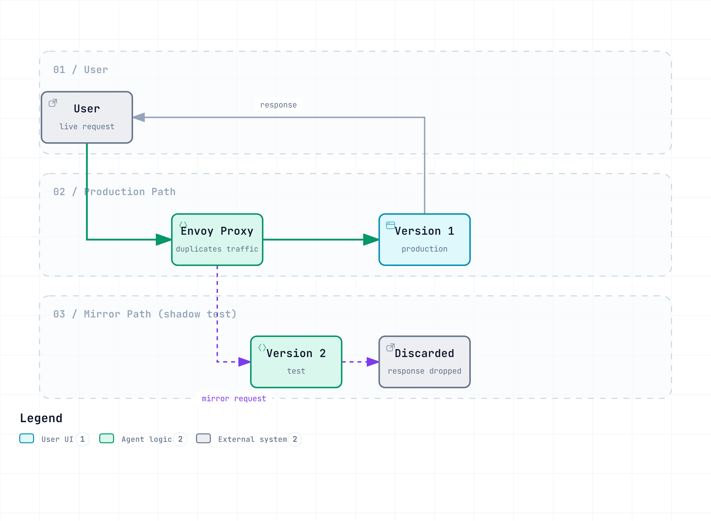

# Traffic Management Quiz

> **Supported Version**: Istio 1.28.0 **EKS Version**: 1.34 (Kubernetes 1.28+) **Last Updated**: February 23, 2026

This quiz tests your understanding of Istio's traffic management features.

## Multiple Choice Questions (1-5)

### Question 1: Role of VirtualService

Which statement about VirtualService is **correct**?

A. It is a resource that replaces Kubernetes Service B. It can only define load balancing algorithms C. It defines routing rules and controls traffic D. It only operates in the Control Plane

<details>

<summary>Show Answer</summary>

**Answer: C**

VirtualService is a core Istio CRD that controls traffic by defining **routing rules**.

**Explanation:**

* A (X): VirtualService does not replace Kubernetes Service; it adds routing rules on top of Service
* B (X): Load balancing is handled by DestinationRule; VirtualService defines routing rules
* C (O): VirtualService defines the following:
  * HTTP/TCP routing rules
  * URL path-based routing
  * Header-based routing
  * Weight-based traffic splitting
  * Timeout and Retry settings
* D (X): VirtualService runs in Envoy in the Data Plane

**Example:**

```yaml
apiVersion: networking.istio.io/v1beta1
kind: VirtualService
metadata:
  name: reviews
spec:
  hosts:
  - reviews
  http:
  - match:
    - headers:
        end-user:
          exact: jason
    route:
    - destination:
        host: reviews
        subset: v2
  - route:
    - destination:
        host: reviews
        subset: v1
```

**Reference:**

* [Routing](../../../service-mesh/istio/traffic-management/02-routing.md)
* [VirtualService Concepts](../../../service-mesh/istio/02-basic-concepts.md#virtualservice)

</details>

***

### Question 2: DestinationRule Functions

Which is **NOT** a function performed by DestinationRule?

A. Defining subsets B. Configuring load balancing algorithms C. HTTP path-based routing D. Configuring Connection Pool

<details>

<summary>Show Answer</summary>

**Answer: C**

HTTP path-based routing is the role of **VirtualService**.

**Explanation:**

**Main Functions of DestinationRule:**

1. **Defining Subsets (A - O)**

```yaml
apiVersion: networking.istio.io/v1beta1
kind: DestinationRule
metadata:
  name: reviews
spec:
  host: reviews
  subsets:
  - name: v1
    labels:
      version: v1
  - name: v2
    labels:
      version: v2
```

2. **Load Balancing Configuration (B - O)**

```yaml
spec:
  trafficPolicy:
    loadBalancer:
      simple: ROUND_ROBIN  # RANDOM, LEAST_REQUEST, etc.
```

3. **Connection Pool Configuration (D - O)**

```yaml
spec:
  trafficPolicy:
    connectionPool:
      tcp:
        maxConnections: 100
      http:
        http1MaxPendingRequests: 50
```

4. **HTTP Path-based Routing (C - X)**

* This is VirtualService's role:

```yaml
# Handled by VirtualService
apiVersion: networking.istio.io/v1beta1
kind: VirtualService
spec:
  http:
  - match:
    - uri:
        prefix: /api  # Path-based routing
    route:
    - destination:
        host: api-service
```

**Comparison Table:**

| Function          | VirtualService | DestinationRule |
| ----------------- | -------------- | --------------- |
| Routing rules     | Yes            | No              |
| Path matching     | Yes            | No              |
| Subset definition | No             | Yes             |
| Load balancing    | No             | Yes             |
| Connection Pool   | No             | Yes             |

**Reference:**

* [Load Balancing](https://github.com/Atom-oh/kubernetes-docs/blob/main/en/service-mesh/istio/traffic-management/05-load-balancing.md)
* [Connection Pool](https://github.com/Atom-oh/kubernetes-docs/blob/main/en/service-mesh/istio/traffic-management/08-connection-pool.md)

</details>

***

### Question 3: Canary Deployment Traffic Splitting

What is the traffic ratio between v1 and v2 in the following VirtualService configuration?

```yaml
apiVersion: networking.istio.io/v1beta1
kind: VirtualService
metadata:
  name: reviews
spec:
  hosts:
  - reviews
  http:
  - route:
    - destination:
        host: reviews
        subset: v1
      weight: 80
    - destination:
        host: reviews
        subset: v2
      weight: 20
```

A. v1: 50%, v2: 50% B. v1: 80%, v2: 20% C. v1: 20%, v2: 80% D. v1: 100%, v2: 0%

<details>

<summary>Show Answer</summary>

**Answer: B**

Since the weight values are **v1: 80, v2: 20**, traffic is distributed as **80% to v1** and **20% to v2**.

**Explanation:**

**Weight-based Traffic Splitting:**

* The `weight` field represents relative ratios
* Total weight: 80 + 20 = 100
* v1 ratio: 80/100 = 80%
* v2 ratio: 20/100 = 20%

**Canary Deployment Stages:**

```yaml
# Stage 1: 10% Canary
- weight: 90  # v1
- weight: 10  # v2

# Stage 2: 25% Canary
- weight: 75  # v1
- weight: 25  # v2

# Stage 3: 50% Canary
- weight: 50  # v1
- weight: 50  # v2

# Stage 4: 100% v2
- weight: 0   # v1
- weight: 100 # v2
```

**Automated Canary with Argo Rollouts:**

```yaml
apiVersion: argoproj.io/v1alpha1
kind: Rollout
spec:
  strategy:
    canary:
      trafficRouting:
        istio:
          virtualService:
            name: reviews
      steps:
      - setWeight: 10
      - pause: {duration: 2m}
      - setWeight: 25
      - pause: {duration: 2m}
      - setWeight: 50
      - pause: {duration: 2m}
```

**Reference:**

* [Traffic Splitting](https://github.com/Atom-oh/kubernetes-docs/blob/main/en/service-mesh/istio/traffic-management/03-traffic-splitting.md)
* [Argo Rollouts Integration](../../../service-mesh/istio/advanced/08-argo-rollouts.md)

</details>

***

### Question 4: Gateway Purpose

Which is **NOT** a primary role of Istio Gateway?

A. Entry point for traffic from outside the cluster to inside B. TLS termination and certificate management C. mTLS encryption between services D. Load balancing of external traffic

<details>

<summary>Show Answer</summary>

**Answer: C**

mTLS encryption between services is the role of **Sidecar Envoy** and **PeerAuthentication**.

**Explanation:**

**Main Roles of Gateway:**

1. **Ingress/Egress Traffic Entry Point (A - O)**

```yaml
apiVersion: networking.istio.io/v1beta1
kind: Gateway
metadata:
  name: bookinfo-gateway
spec:
  selector:
    istio: ingressgateway  # Select Ingress Gateway Pod
  servers:
  - port:
      number: 80
      name: http
      protocol: HTTP
    hosts:
    - "*"
```

2. **TLS Termination (B - O)**

```yaml
spec:
  servers:
  - port:
      number: 443
      name: https
      protocol: HTTPS
    tls:
      mode: SIMPLE
      credentialName: bookinfo-secret  # TLS certificate
    hosts:
    - bookinfo.example.com
```

3. **External Traffic Load Balancing (D - O)**

* Gateway integrates with Kubernetes LoadBalancer Service
* Distributes external traffic into the cluster

4. **Service-to-Service mTLS (C - X)**

* This is the role of Sidecar Envoy:

```yaml
# Enable mTLS with PeerAuthentication
apiVersion: security.istio.io/v1beta1
kind: PeerAuthentication
metadata:
  name: default
spec:
  mtls:
    mode: STRICT
```

**Gateway vs Sidecar Role:**

| Function                     | Gateway | Sidecar Envoy |
| ---------------------------- | ------- | ------------- |
| External -> Internal traffic | Yes     | No            |
| TLS termination              | Yes     | No            |
| Service-to-service mTLS      | No      | Yes           |
| Internal routing             | No      | Yes           |

**Reference:**

* [Gateway](https://github.com/Atom-oh/kubernetes-docs/blob/main/en/service-mesh/istio/traffic-management/01-gateway.md)
* [mTLS](../../../service-mesh/istio/security/01-mtls.md)

</details>

***

### Question 5: Timeout and Retry Policy

What does the following VirtualService configuration mean?

```yaml
apiVersion: networking.istio.io/v1beta1
kind: VirtualService
metadata:
  name: reviews
spec:
  hosts:
  - reviews
  http:
  - route:
    - destination:
        host: reviews
    timeout: 10s
    retries:
      attempts: 3
      perTryTimeout: 2s
```

A. Retry up to 3 times after the original request, with each delivery limited to 2 seconds and the whole request limited to 10 seconds B. Retry up to 3 times within 2 seconds total, each attempt limited to 10 seconds C. Unlimited retries within 10 seconds total, each attempt limited to 2 seconds D. Fail after 10 seconds without retries

<details>

<summary>Show Answer</summary>

**Answer: A**

This configuration permits **up to 3 additional retries after the original request**, limits each delivery to **2 seconds**, and limits the whole request to **10 seconds**. It can therefore deliver the request upstream up to four times.

**Explanation:**

**Configuration Interpretation:**

```yaml
timeout: 10s           # Maximum time for entire request
retries:
  attempts: 3          # Up to 3 retries after the original request
  perTryTimeout: 2s    # Time limit for each delivery
```

**Execution Scenarios:**

```
Scenario 1: First attempt succeeds
+- 1st attempt: 1.5s elapsed -> Success
+- Total time: 1.5s

Scenario 2: Success after 2 attempts
+- 1st attempt: 2s timeout -> Failure
+- 2nd attempt: 1.8s elapsed -> Success
+- Total time: 3.8s

Scenario 3: Original request plus all 3 retries fail
+- 1st attempt: 2s timeout -> Failure
+- 2nd attempt: 2s timeout -> Failure
+- 3rd attempt: 2s timeout -> Failure
+- 4th attempt: 2s timeout -> Failure
+- Total time: about 8s
```

**Retry Condition Settings:**

```yaml
retries:
  attempts: 3
  perTryTimeout: 2s
  retryOn: 5xx,connect-failure,refused-stream  # Retry conditions
```

**Best Practices:**

```yaml
# Read requests: limited retry
- match:
  - method:
      regex: "^(GET|HEAD)$"
  retries:
    attempts: 2
    perTryTimeout: 2s
    retryOn: connect-failure,refused-stream

# Write requests: disable mesh retry
- match:
  - method:
      regex: "^(POST|PATCH)$"
  retries:
    attempts: 0
```

**Cautions:**

* To budget for every retry, `timeout` should be roughly greater than `(1 + attempts) x perTryTimeout`, with backoff included
* Too many retries can cause cascading failure
* `attempts: 0` disables retry; `attempts: 1` permits one replay after the original request
* Disable mesh retry by default for POST/PATCH because the server can commit and lose only the response
* Workload mTLS or network encryption does not make request replay safe

**Reference:**

* [Timeout and Retry](../../../service-mesh/istio/traffic-management/05-retry-timeout.md)

</details>

***

## Short Answer Questions (6-10)

### Question 6: Argo Rollouts + Istio Canary Deployment

Explain the process of implementing automated Canary deployment using Argo Rollouts and Istio together. Include **required resources** (Rollout, VirtualService, DestinationRule, AnalysisTemplate) and **automatic rollback conditions**.

<details>

<summary>Show Answer</summary>

**Answer:**

**Implementing Argo Rollouts + Istio Canary Deployment:**

***

**1. Create Service (Basic Kubernetes Service)**

```yaml
apiVersion: v1
kind: Service
metadata:
  name: reviews
spec:
  ports:
  - port: 9080
    name: http
  selector:
    app: reviews  # Select all Pods from Rollout
```

***

**2. Define DestinationRule (Subset Definition)**

```yaml
apiVersion: networking.istio.io/v1beta1
kind: DestinationRule
metadata:
  name: reviews-destrule
spec:
  host: reviews
  subsets:
  - name: stable
    labels: {}  # Managed automatically by Rollout
  - name: canary
    labels: {}  # Managed automatically by Rollout
```

**Important**: Rollout automatically adds `rollouts-pod-template-hash` label to Pods and uses this label to distinguish subsets.

***

**3. Define VirtualService (Traffic Splitting)**

```yaml
apiVersion: networking.istio.io/v1beta1
kind: VirtualService
metadata:
  name: reviews-vsvc
spec:
  hosts:
  - reviews
  http:
  - name: primary  # Route name referenced by Rollout (required)
    route:
    - destination:
        host: reviews
        subset: stable
      weight: 100  # Automatically modified by Rollout
    - destination:
        host: reviews
        subset: canary
      weight: 0    # Automatically modified by Rollout
```

**Key Points**:

* The `http[].name` field is required
* Rollout only automatically updates the `weight` values in this VirtualService

***

**4. Define AnalysisTemplate (Automatic Rollback Conditions)**

**Success Rate Analysis:**

```yaml
apiVersion: argoproj.io/v1alpha1
kind: AnalysisTemplate
metadata:
  name: success-rate
spec:
  args:
  - name: service-name

  metrics:
  - name: success-rate
    interval: 30s
    count: 4  # 4 measurements (total 2 minutes)
    successCondition: result >= 0.95  # 95% or higher success rate
    failureLimit: 2  # Auto rollback after 2 failures
    provider:
      prometheus:
        address: http://prometheus.istio-system:9090
        query: |
          sum(rate(
            istio_requests_total{
              destination_service_name="{{args.service-name}}",
              response_code!~"5.*"
            }[2m]
          ))
          /
          sum(rate(
            istio_requests_total{
              destination_service_name="{{args.service-name}}"
            }[2m]
          ))
```

**Latency Analysis:**

```yaml
apiVersion: argoproj.io/v1alpha1
kind: AnalysisTemplate
metadata:
  name: latency
spec:
  args:
  - name: service-name

  metrics:
  - name: latency-p95
    interval: 30s
    count: 4
    successCondition: result <= 500  # P95 latency 500ms or less
    failureLimit: 2
    provider:
      prometheus:
        address: http://prometheus.istio-system:9090
        query: |
          histogram_quantile(0.95,
            sum(rate(
              istio_request_duration_milliseconds_bucket{
                destination_service_name="{{args.service-name}}"
              }[2m]
            )) by (le)
          )
```

***

**5. Define Rollout Resource (Canary Strategy)**

```yaml
apiVersion: argoproj.io/v1alpha1
kind: Rollout
metadata:
  name: reviews
spec:
  replicas: 5
  revisionHistoryLimit: 2
  selector:
    matchLabels:
      app: reviews
  template:
    metadata:
      labels:
        app: reviews
    spec:
      containers:
      - name: reviews
        image: istio/examples-bookinfo-reviews-v2:1.17.0
        ports:
        - containerPort: 9080

  # Canary deployment strategy
  strategy:
    canary:
      # Traffic control via Istio VirtualService
      trafficRouting:
        istio:
          virtualService:
            name: reviews-vsvc
            routes:
            - primary
          destinationRule:
            name: reviews-destrule
            canarySubsetName: canary
            stableSubsetName: stable

      # Define Canary stages
      steps:
      - setWeight: 10    # 10% traffic to Canary
      - pause:
          duration: 2m

      - setWeight: 25    # 25% traffic to Canary
      - pause:
          duration: 2m

      - setWeight: 50    # 50% traffic to Canary
      - pause:
          duration: 2m

      - setWeight: 75    # 75% traffic to Canary
      - pause:
          duration: 2m

      # Automatic metric analysis
      analysis:
        templates:
        - templateName: success-rate
        - templateName: latency
        startingStep: 1
        args:
        - name: service-name
          value: reviews
```

***

**6. Deployment Execution and Monitoring**

```bash
# Install Argo Rollouts
kubectl create namespace argo-rollouts
kubectl apply -n argo-rollouts -f https://github.com/argoproj/argo-rollouts/releases/latest/download/install.yaml

# Deploy resources
kubectl apply -f service.yaml
kubectl apply -f destination-rule.yaml
kubectl apply -f virtual-service.yaml
kubectl apply -f analysis-templates.yaml
kubectl apply -f rollout.yaml

# Deploy new version
kubectl argo rollouts set image reviews \
  reviews=istio/examples-bookinfo-reviews-v3:1.17.0

# Monitor deployment status in real-time
kubectl argo rollouts get rollout reviews --watch

# Rollout dashboard
kubectl argo rollouts dashboard
```

***

**Automatic Rollback Scenarios:**

**Scenario 1: Error rate > 5%**

```
10% Canary -> Analysis starts
+- Measurement 1 (30s): 6% error rate -> Failure (1/2)
+- Measurement 2 (30s): 7% error rate -> Failure (2/2)
+- Auto rollback executed -> Stable 100%
```

**Scenario 2: Latency > 500ms**

```
25% Canary -> Analysis starts
+- Measurement 1 (30s): P95 600ms -> Failure (1/2)
+- Measurement 2 (30s): P95 550ms -> Failure (2/2)
+- Auto rollback executed -> Stable 100%
```

**Scenario 3: All metrics normal**

```
10% Canary -> Analysis passed -> 25% Canary
25% Canary -> Analysis passed -> 50% Canary
50% Canary -> Analysis passed -> 75% Canary
75% Canary -> Analysis passed -> 100% Canary
```

***

**Key Benefits:**

1. **Fully Automated**: Deployment progresses without human intervention
2. **Instant Rollback**: Rollback within seconds after metric failure detection
3. **Safe Deployment**: Automatic verification at each stage
4. **Consistent Process**: Standardized deployment strategy

**Reference:**

* [Traffic Splitting](https://github.com/Atom-oh/kubernetes-docs/blob/main/en/service-mesh/istio/traffic-management/03-traffic-splitting.md)
* [Argo Rollouts](../../../service-mesh/istio/advanced/08-argo-rollouts.md)

</details>

***

### Question 7: Blue/Green Deployment vs Canary Deployment

Compare the **differences** between Blue/Green deployment and Canary deployment, and explain the **pros and cons** and **use scenarios** for each.

<details>

<summary>Show Answer</summary>

**Answer:**

**Blue/Green Deployment vs Canary Deployment Comparison:**

***

**1. Deployment Method Differences**

**Blue/Green Deployment:**

```
Blue (current version) --+
                         +--> [100% Traffic]
Green (new version) -----+

Stage 1: Blue 100% active
Stage 2: Deploy and test Green (0% traffic)
Stage 3: Switch traffic (Blue 0% -> Green 100%)
Stage 4: Remove Blue
```

**Canary Deployment:**

```
Stable (current version) --> 90% -> 75% -> 50% -> 0%
Canary (new version) -----> 10% -> 25% -> 50% -> 100%

Gradually increase traffic
```

***

**2. Detailed Comparison Table**

| Item               | Blue/Green                           | Canary                                 |
| ------------------ | ------------------------------------ | -------------------------------------- |
| **Traffic Switch** | Instant 100% switch                  | Gradual increase (10% -> 100%)         |
| **Rollback Speed** | Instant (single switch)              | Fast (from current stage only)         |
| **Resource Usage** | 2x (Blue + Green)                    | 1x + small amount (Stable + Canary)    |
| **Risk Level**     | Medium (all users at once)           | Low (starts with few users)            |
| **Testing Period** | Sufficient testing before deployment | Gradual validation in production       |
| **Complexity**     | Low                                  | Medium (requires metric analysis)      |
| **User Impact**    | All users affected simultaneously    | Gradual impact starting with few users |

***

**3. Istio Implementation Examples**

**Blue/Green Deployment (Argo Rollouts):**

```yaml
apiVersion: argoproj.io/v1alpha1
kind: Rollout
metadata:
  name: myapp
spec:
  replicas: 5
  strategy:
    blueGreen:
      activeService: myapp-active    # Blue (production)
      previewService: myapp-preview  # Green (test)
      autoPromotionEnabled: false    # Manual approval
      scaleDownDelaySeconds: 30      # Remove previous version 30s after Green -> Blue switch

      # Pre-promotion testing
      prePromotionAnalysis:
        templates:
        - templateName: smoke-tests

      # Post-promotion validation
      postPromotionAnalysis:
        templates:
        - templateName: performance-tests
```

**Canary Deployment (Argo Rollouts):**

```yaml
apiVersion: argoproj.io/v1alpha1
kind: Rollout
metadata:
  name: myapp
spec:
  replicas: 5
  strategy:
    canary:
      trafficRouting:
        istio:
          virtualService:
            name: myapp-vsvc
      steps:
      - setWeight: 10
      - pause: {duration: 2m}
      - analysis:
          templates:
          - templateName: success-rate
      - setWeight: 25
      - pause: {duration: 2m}
      - analysis:
          templates:
          - templateName: success-rate
      - setWeight: 50
      - pause: {duration: 2m}
      - setWeight: 100
```

***

**4. Pros and Cons Comparison**

**Blue/Green Pros:**

* Simple structure (only Blue <-> Green switch)
* Instant rollback possible (switch flip)
* Sufficient testing possible before deployment
* Predictable behavior

**Blue/Green Cons:**

* Requires 2x resources
* All users affected simultaneously
* Complex database migrations
* No gradual validation

**Canary Pros:**

* Gradual validation starting with few users
* Resource efficient (1x + small amount)
* Real validation in production environment
* Automatic rollback possible (metric-based)

**Canary Cons:**

* Complex configuration (metrics, analysis)
* Monitoring required
* Longer deployment time
* Version coexistence period exists

***

**5. Use Scenarios**

**Blue/Green Recommended Scenarios:**

1. **Important releases**: Fast switch after sufficient testing
2. **No database changes**: When there are no schema changes
3. **Need instant rollback**: When fast recovery is needed on issues
4. **Sufficient resources**: When 2x resources can be afforded
5. **Predictable changes**: When pre-testing is sufficient for verification

**Examples:**

```
- Major feature releases
- Complete UI redesign
- API version upgrades
- Marketing campaign integration (switch at specific time)
```

**Canary Recommended Scenarios:**

1. **Experimental features**: Test with few users first
2. **Resource constraints**: When 2x resources unavailable
3. **Gradual validation**: Validation with real data in production
4. **Automated deployment**: Automatic deployment in CI/CD
5. **Microservices**: When service dependencies are complex

**Examples:**

```
- A/B testing
- Performance optimization
- Bug fixes
- Minor feature additions
- Daily deployment (Continuous Deployment)
```

***

**6. Hybrid Approach**

In practice, you can combine both strategies:

```yaml
# Stage 1: Gradual validation with Canary
10% -> 25% -> 50%

# Stage 2: Final switch with Blue/Green
50% -> 100% (instant switch)
```

**Reference:**

* [Traffic Splitting](https://github.com/Atom-oh/kubernetes-docs/blob/main/en/service-mesh/istio/traffic-management/03-traffic-splitting.md)
* [Blue/Green Deployment](https://github.com/Atom-oh/kubernetes-docs/blob/main/en/service-mesh/istio/traffic-management/03-traffic-splitting.md#bluegreen-deployment)

</details>

***

### Question 8: Traffic Mirroring (Shadow Testing)

Explain how to safely test new versions using Traffic Mirroring. Include **use cases**, **configuration methods**, and **cautions**.

<details>

<summary>Show Answer</summary>

**Answer:**

**Traffic Mirroring Concept:**

Traffic mirroring is a technique that duplicates production traffic and sends it to a new version, while **ignoring the responses**. It's also called "shadow testing".

***

**1. How It Works**



[🔍 View interactive diagram](https://www.atomai.click/kubernetes-docs/archmaps/en-quizzes-service-mesh-istio-traffic-management-0.html)

**Key Characteristics:**

* Users only receive v1's response
* v2's response is discarded by Envoy
* v2's errors don't affect users

***

**2. Configuration Methods**

**Basic Mirroring (100%):**

```yaml
apiVersion: networking.istio.io/v1beta1
kind: VirtualService
metadata:
  name: reviews
spec:
  hosts:
  - reviews
  http:
  - route:
    - destination:
        host: reviews
        subset: v1
      weight: 100  # Primary traffic
    mirror:
      host: reviews
      subset: v2  # Mirror target
    mirrorPercentage:
      value: 100  # 100% mirroring
```

**Partial Mirroring (50%):**

```yaml
spec:
  http:
  - route:
    - destination:
        host: reviews
        subset: v1
      weight: 100
    mirror:
      host: reviews
      subset: v2
    mirrorPercentage:
      value: 50  # Only 50% mirroring (reduce traffic load)
```

**Mirroring + Canary Combination:**

```yaml
spec:
  http:
  - route:
    # Primary traffic: 90% v1, 10% v2
    - destination:
        host: reviews
        subset: v1
      weight: 90
    - destination:
        host: reviews
        subset: v2
      weight: 10

    # Mirroring: Mirror all traffic to v3 (test)
    mirror:
      host: reviews
      subset: v3
    mirrorPercentage:
      value: 100
```

***

**3. Use Cases**

**Case 1: New Version Performance Testing**

```
Purpose: Verify if v2's performance is better than v1

1. Run v1 (production) + v2 (mirror) simultaneously
2. Monitor v2's latency, CPU, memory
3. If v2 is faster than v1 -> Proceed with Canary deployment
4. If v2 is slower than v1 -> Optimize and retest
```

**Case 2: Database Migration Validation**

```
Purpose: Verify new database schema

1. v1 -> Existing DB
2. v2 -> New DB (mirroring)
3. Verify v2's query performance and error rate
4. If no issues -> Switch to v2
```

**Case 3: Bug Fix Validation**

```
Purpose: Verify that bug fix actually works

1. Run v1 (with bug) + v2 (fixed version, mirror)
2. Test v2 with production traffic
3. If v2's error rate decreases -> Deploy
```

**Case 4: Cache Warming**

```
Purpose: Pre-populate new version's cache

1. Warm cache via mirroring before v2 deployment
2. Once v2's cache is sufficiently populated
3. No cold start when switching to v2
```

***

**4. Monitoring Configuration**

**Monitor Mirror Traffic with Prometheus Queries:**

```promql
# v2 (mirror) error rate
sum(rate(
  istio_requests_total{
    destination_version="v2",
    response_code=~"5.."
  }[5m]
))
/
sum(rate(
  istio_requests_total{
    destination_version="v2"
  }[5m]
))

# v1 vs v2 latency comparison
histogram_quantile(0.95,
  sum(rate(
    istio_request_duration_milliseconds_bucket[5m]
  )) by (destination_version, le)
)
```

**Grafana Dashboard:**

```yaml
# Panel 1: Error rate comparison (v1 vs v2)
# Panel 2: Latency comparison (P50, P95, P99)
# Panel 3: CPU/Memory usage
# Panel 4: Request count (v1: actual, v2: mirror)
```

***

**5. Cautions**

**Warning - Increased Load:**

```
Mirroring increases service load.

Example:
- v1: 1000 RPS
- v2: 1000 RPS (mirror)
- Total load: 2000 RPS

Solution: Set mirrorPercentage to 50% or less
```

**Warning - Watch for Side Effects:**

```yaml
# Don't mirror write operations!

# Bad example
POST /api/orders  # Both v1 and v2 create orders -> Duplicates!

# Good example
GET /api/orders   # Mirror only read-only operations
```

**Warning - Cost:**

```
Mirroring increases resources and costs.

- 2x computing resources
- 2x network traffic
- 2x database queries

Solution: Mirror only for short periods (1-2 days)
```

**Warning - Cannot Validate Responses:**

```
Mirror traffic responses are discarded, so
you cannot validate response content.

Can validate:
- Error rate
- Latency
- Resource usage

Cannot validate:
- Response data accuracy
- Business logic verification
```

***

**6. Best Practices**

```yaml
# Good examples
1. Mirror only read-only APIs
2. mirrorPercentage: 50% (reduce load)
3. Short-term testing (1-2 days)
4. Automatic validation based on metrics

# Bad examples
1. Mirroring write operations (duplicate data)
2. mirrorPercentage: 100% (overload)
3. Long-term mirroring (cost increase)
4. Manual validation (slow)
```

**Reference:**

* [Traffic Mirroring](https://github.com/Atom-oh/kubernetes-docs/blob/main/en/service-mesh/istio/traffic-management/04-traffic-mirroring.md)

</details>

***

### Question 9: Locality Load Balancing (Zone Aware Routing)

Explain how to use Istio's Locality Load Balancing to **reduce cross-AZ costs** in AWS EKS. Include configuration examples and **estimated cost savings**.

<details>

<summary>Show Answer</summary>

**Answer:**

**Locality Load Balancing Concept:**

Locality Load Balancing is a feature that **preferentially routes to services within the same Availability Zone (AZ)** to reduce network latency and cross-AZ costs.

***

**1. Cross-AZ Costs in AWS EKS**

**Cost Structure:**

```
Same AZ traffic: Free
Cross-AZ traffic: $0.01-0.02 per GB
Cross-Region traffic: $0.02-0.09 per GB
```

**Example Calculation:**

```
Service A (us-east-1a) -> Service B (us-east-1b)
- Monthly traffic: 1TB = 1000GB
- Cross-AZ cost: 1000GB x $0.01 = $10/month

If 80% traffic is routed to same AZ:
- Same AZ: 800GB x $0 = $0
- Cross-AZ: 200GB x $0.01 = $2/month
- Savings: $8/month (80%)
```

***

**2. EKS Pod Topology Labels**

EKS nodes automatically have topology labels set:

```yaml
# EKS node labels (automatic)
topology.kubernetes.io/region: us-east-1
topology.kubernetes.io/zone: us-east-1a

# Pods inherit node labels
```

***

**3. Locality Load Balancing Configuration**

**Basic Configuration (Same AZ Priority):**

```yaml
apiVersion: networking.istio.io/v1beta1
kind: DestinationRule
metadata:
  name: reviews
spec:
  host: reviews
  trafficPolicy:
    loadBalancer:
      localityLbSetting:
        enabled: true
        # 100% routing to same AZ if Pods exist there
        # Automatic failover to other AZ if not
```

**Advanced Configuration (Weighted Distribution):**

```yaml
apiVersion: networking.istio.io/v1beta1
kind: DestinationRule
metadata:
  name: reviews
spec:
  host: reviews
  trafficPolicy:
    loadBalancer:
      localityLbSetting:
        enabled: true
        distribute:
        # Traffic originating from us-east-1a
        - from: us-east-1/us-east-1a/*
          to:
            "us-east-1/us-east-1a/*": 80  # Same AZ 80%
            "us-east-1/us-east-1b/*": 20  # Other AZ 20% (for failover)

        # Traffic originating from us-east-1b
        - from: us-east-1/us-east-1b/*
          to:
            "us-east-1/us-east-1b/*": 80  # Same AZ 80%
            "us-east-1/us-east-1a/*": 20  # Other AZ 20% (for failover)
```

**Failover Policy:**

```yaml
spec:
  trafficPolicy:
    loadBalancer:
      localityLbSetting:
        enabled: true
        failover:
        # On us-east-1a failure, route to us-east-1b
        - from: us-east-1/us-east-1a
          to: us-east-1/us-east-1b

        # On us-east-1 complete failure, route to us-west-2
        - from: us-east-1
          to: us-west-2
```

***

**4. Combining with Outlier Detection**

```yaml
apiVersion: networking.istio.io/v1beta1
kind: DestinationRule
metadata:
  name: reviews
spec:
  host: reviews
  trafficPolicy:
    # Locality Load Balancing
    loadBalancer:
      localityLbSetting:
        enabled: true

    # Outlier Detection (exclude unhealthy instances)
    outlierDetection:
      consecutiveErrors: 5
      interval: 30s
      baseEjectionTime: 30s
      maxEjectionPercent: 50
```

**Behavior:**

```
1. Prioritize Pods in same AZ (us-east-1a)
2. Exclude that Pod after 5 consecutive failures
3. Automatic switch to healthy Pod in other AZ (us-east-1b)
4. Retry excluded Pod after 30 seconds
```

***

**5. Cost Savings Calculation**

**Scenario: Large-scale Microservices Architecture**

```
Assumptions:
- Number of services: 20
- Monthly traffic between each service: 500GB
- Total monthly traffic: 20 x 20 x 500GB = 200TB
- Cross-AZ ratio (without Locality LB): 70%
- Cross-AZ ratio (with Locality LB): 20%
```

**Without Locality LB:**

```
Cross-AZ traffic: 200TB x 70% = 140TB
Cost: 140,000GB x $0.01 = $1,400/month
```

**With Locality LB:**

```
Cross-AZ traffic: 200TB x 20% = 40TB
Cost: 40,000GB x $0.01 = $400/month

Savings: $1,400 - $400 = $1,000/month (71% savings)
Annual savings: $1,000 x 12 = $12,000/year
```

***

**6. Performance Improvement**

**Latency Improvement:**

```
Same AZ communication: ~1ms
Cross-AZ communication: ~2-3ms

With Locality LB:
- 30-50% reduction in average latency
- 40-60% reduction in P99 latency
```

**Actual Measurement Example:**

```bash
# us-east-1a -> us-east-1a (same AZ)
$ kubectl exec -it pod-a -- curl -w "%{time_total}\n" http://service-b
0.001s

# us-east-1a -> us-east-1b (cross-AZ)
$ kubectl exec -it pod-a -- curl -w "%{time_total}\n" http://service-b
0.003s
```

***

**7. Monitoring**

**Prometheus Queries:**

```promql
# Traffic distribution by Locality
sum(rate(
  istio_requests_total[5m]
)) by (
  source_workload_namespace,
  destination_workload_namespace,
  source_canonical_service,
  destination_canonical_service
)

# Cross-AZ traffic ratio
sum(rate(istio_requests_total{
  source_cluster="us-east-1a",
  destination_cluster!="us-east-1a"
}[5m]))
/
sum(rate(istio_requests_total[5m]))
```

**Grafana Dashboard:**

```yaml
Panel 1: Request count by Locality (us-east-1a, us-east-1b, us-east-1c)
Panel 2: Cross-AZ traffic ratio (target: <20%)
Panel 3: Latency (same AZ vs cross-AZ)
Panel 4: Estimated cost (cross-AZ traffic x $0.01/GB)
```

***

**8. Cautions**

**Warning - Unbalanced Load:**

```
If all traffic concentrates on one AZ, overload can occur

Solutions:
- Deploy sufficient replicas in each AZ
- Configure HPA (Horizontal Pod Autoscaler)
- Ensure minimum replicas with PodDisruptionBudget
```

**Warning - AZ Failure:**

```
If entire AZ fails, traffic moves to other AZs

Failover policy configuration required:
- from: us-east-1/us-east-1a
  to: us-east-1/us-east-1b
```

**Warning - Cold Start:**

```
On failover, Pods in other AZ may be in cold start state

Solutions:
- Maintain at least 1 replica in each AZ
- Verify ready state with Readiness Probe
```

***

**9. Best Practices**

```yaml
# Recommended configuration
apiVersion: networking.istio.io/v1beta1
kind: DestinationRule
metadata:
  name: production-service
spec:
  host: production-service
  trafficPolicy:
    loadBalancer:
      localityLbSetting:
        enabled: true
        distribute:
        - from: us-east-1/us-east-1a/*
          to:
            "us-east-1/us-east-1a/*": 80  # Cost savings
            "us-east-1/us-east-1b/*": 15  # Failover
            "us-east-1/us-east-1c/*": 5   # Additional backup

    outlierDetection:
      consecutiveErrors: 5
      interval: 30s
      baseEjectionTime: 30s

    connectionPool:
      tcp:
        maxConnections: 100
      http:
        http1MaxPendingRequests: 50
```

**Reference:**

* [Zone Aware Routing](../../../service-mesh/istio/resilience/03-zone-aware-routing.md)
* [AWS EKS Cost Optimization](../../../service-mesh/istio/best-practices.md#cost-optimization)

</details>

***

### Question 10: Gateway TLS Configuration

Explain how to configure **TLS termination** and set up **HTTPS redirect** in Istio Gateway. Include both cases: using ACM (AWS Certificate Manager) certificates and using self-signed certificates.

<details>

<summary>Show Answer</summary>

**Answer:**

**Istio Gateway TLS Configuration:**

***

**1. Using Self-Signed Certificates (Kubernetes Secret)**

**Step 1: Generate TLS Certificate**

```bash
# Generate self-signed certificate (for testing)
openssl req -x509 -nodes -days 365 -newkey rsa:2048 \
  -keyout bookinfo.key \
  -out bookinfo.crt \
  -subj "/CN=bookinfo.example.com"

# Or use Let's Encrypt certificate
certbot certonly --standalone -d bookinfo.example.com
```

**Step 2: Create Kubernetes Secret**

```bash
# Create Secret for Istio to use
kubectl create -n istio-system secret tls bookinfo-secret \
  --key=bookinfo.key \
  --cert=bookinfo.crt

# Verify Secret
kubectl get secret bookinfo-secret -n istio-system
```

**Step 3: Configure Gateway (HTTPS + HTTP -> HTTPS Redirect)**

```yaml
apiVersion: networking.istio.io/v1beta1
kind: Gateway
metadata:
  name: bookinfo-gateway
  namespace: default
spec:
  selector:
    istio: ingressgateway
  servers:
  # HTTPS (port 443)
  - port:
      number: 443
      name: https
      protocol: HTTPS
    tls:
      mode: SIMPLE  # One-way TLS (server certificate only)
      credentialName: bookinfo-secret  # Kubernetes Secret name
    hosts:
    - bookinfo.example.com

  # HTTP (port 80) - Redirect to HTTPS
  - port:
      number: 80
      name: http
      protocol: HTTP
    hosts:
    - bookinfo.example.com
    tls:
      httpsRedirect: true  # HTTP -> HTTPS redirect
```

**Step 4: Connect VirtualService**

```yaml
apiVersion: networking.istio.io/v1beta1
kind: VirtualService
metadata:
  name: bookinfo-vs
  namespace: default
spec:
  hosts:
  - bookinfo.example.com
  gateways:
  - bookinfo-gateway
  http:
  - match:
    - uri:
        prefix: /productpage
    route:
    - destination:
        host: productpage
        port:
          number: 9080
    timeout: 10s
    retries:
      attempts: 3
      perTryTimeout: 2s
```

**Step 5: Test**

```bash
# HTTPS access
curl -v https://bookinfo.example.com/productpage

# HTTP access -> HTTPS redirect verification
curl -v http://bookinfo.example.com/productpage
# Output:
# HTTP/1.1 301 Moved Permanently
# location: https://bookinfo.example.com/productpage
```

***

**2. Using AWS ACM Certificates (NLB Annotation)**

In AWS EKS, the recommended approach is TLS termination at NLB with ACM certificates.

**Step 1: Issue ACM Certificate**

```bash
# Issue ACM certificate via AWS Console or CLI
aws acm request-certificate \
  --domain-name bookinfo.example.com \
  --validation-method DNS \
  --region us-east-1

# Get ARN
aws acm list-certificates --region us-east-1
# Output: arn:aws:acm:us-east-1:123456789012:certificate/abc123
```

**Step 2: Modify Istio Ingress Gateway Service**

```yaml
apiVersion: v1
kind: Service
metadata:
  name: istio-ingressgateway
  namespace: istio-system
  annotations:
    # Use NLB
    service.beta.kubernetes.io/aws-load-balancer-type: "nlb"

    # TLS termination (ACM certificate)
    service.beta.kubernetes.io/aws-load-balancer-ssl-cert: "arn:aws:acm:us-east-1:123456789012:certificate/abc123"
    service.beta.kubernetes.io/aws-load-balancer-ssl-ports: "443"

    # HTTP -> HTTPS redirect (NLB level)
    service.beta.kubernetes.io/aws-load-balancer-ssl-negotiation-policy: "ELBSecurityPolicy-TLS-1-2-2017-01"

    # Cross-AZ load balancing
    service.beta.kubernetes.io/aws-load-balancer-cross-zone-load-balancing-enabled: "true"

spec:
  type: LoadBalancer
  selector:
    istio: ingressgateway
    app: istio-ingressgateway
  ports:
  # HTTP (80) - NLB redirects to HTTPS(443)
  - name: http
    port: 80
    targetPort: 8080
    protocol: TCP

  # HTTPS (443) - NLB terminates TLS and forwards to 8443
  - name: https
    port: 443
    targetPort: 8443
    protocol: TCP
```

**Step 3: Configure Gateway (TLS Passthrough)**

```yaml
apiVersion: networking.istio.io/v1beta1
kind: Gateway
metadata:
  name: bookinfo-gateway
spec:
  selector:
    istio: ingressgateway
  servers:
  # Receive as HTTP since NLB terminated TLS
  - port:
      number: 8443
      name: http
      protocol: HTTP  # NLB already terminated TLS
    hosts:
    - bookinfo.example.com
```

***

**3. Mutual TLS (mTLS) - Client Authentication**

When client must also present a certificate:

```yaml
apiVersion: networking.istio.io/v1beta1
kind: Gateway
metadata:
  name: secure-gateway
spec:
  selector:
    istio: ingressgateway
  servers:
  - port:
      number: 443
      name: https-mutual
      protocol: HTTPS
    tls:
      mode: MUTUAL  # Two-way TLS
      credentialName: server-cert-secret  # Server certificate
      caCertificates: /etc/istio/client-ca/ca-chain.crt  # Client CA
    hosts:
    - secure.example.com
```

**Connect with Client Certificate:**

```bash
curl --cert client.crt --key client.key \
  https://secure.example.com/api
```

***

**4. Wildcard Certificates**

Use single certificate for multiple subdomains:

```bash
# Generate wildcard certificate
openssl req -x509 -nodes -days 365 -newkey rsa:2048 \
  -keyout wildcard.key \
  -out wildcard.crt \
  -subj "/CN=*.example.com"

# Create Secret
kubectl create -n istio-system secret tls wildcard-secret \
  --key=wildcard.key \
  --cert=wildcard.crt
```

```yaml
apiVersion: networking.istio.io/v1beta1
kind: Gateway
metadata:
  name: wildcard-gateway
spec:
  selector:
    istio: ingressgateway
  servers:
  - port:
      number: 443
      name: https
      protocol: HTTPS
    tls:
      mode: SIMPLE
      credentialName: wildcard-secret
    hosts:
    - "*.example.com"  # Allow all subdomains
```

**Route by Subdomain with VirtualService:**

```yaml
apiVersion: networking.istio.io/v1beta1
kind: VirtualService
metadata:
  name: multi-subdomain
spec:
  hosts:
  - api.example.com
  - web.example.com
  - admin.example.com
  gateways:
  - wildcard-gateway
  http:
  - match:
    - uri:
        prefix: /api
      authority:
        exact: api.example.com
    route:
    - destination:
        host: api-service

  - match:
    - authority:
        exact: web.example.com
    route:
    - destination:
        host: web-service

  - match:
    - authority:
        exact: admin.example.com
    route:
    - destination:
        host: admin-service
```

***

**5. TLS Version and Cipher Suite Settings**

```yaml
apiVersion: networking.istio.io/v1beta1
kind: Gateway
metadata:
  name: secure-gateway
spec:
  selector:
    istio: ingressgateway
  servers:
  - port:
      number: 443
      name: https
      protocol: HTTPS
    tls:
      mode: SIMPLE
      credentialName: bookinfo-secret
      minProtocolVersion: TLSV1_2  # Allow only TLS 1.2 and above
      maxProtocolVersion: TLSV1_3
      cipherSuites:
      - ECDHE-ECDSA-AES256-GCM-SHA384
      - ECDHE-RSA-AES256-GCM-SHA384
      - ECDHE-ECDSA-AES128-GCM-SHA256
    hosts:
    - bookinfo.example.com
```

***

**6. Automatic Certificate Renewal (cert-manager)**

```bash
# Install cert-manager
kubectl apply -f https://github.com/cert-manager/cert-manager/releases/download/v1.13.0/cert-manager.yaml

# Create Let's Encrypt Issuer
kubectl apply -f - <<EOF
apiVersion: cert-manager.io/v1
kind: ClusterIssuer
metadata:
  name: letsencrypt-prod
spec:
  acme:
    server: https://acme-v02.api.letsencrypt.org/directory
    email: admin@example.com
    privateKeySecretRef:
      name: letsencrypt-prod
    solvers:
    - http01:
        ingress:
          class: istio
EOF

# Create Certificate resource (auto-renewal)
kubectl apply -f - <<EOF
apiVersion: cert-manager.io/v1
kind: Certificate
metadata:
  name: bookinfo-cert
  namespace: istio-system
spec:
  secretName: bookinfo-secret
  issuerRef:
    name: letsencrypt-prod
    kind: ClusterIssuer
  dnsNames:
  - bookinfo.example.com
EOF
```

***

**7. Best Practices**

```yaml
# Recommended configuration
apiVersion: networking.istio.io/v1beta1
kind: Gateway
metadata:
  name: production-gateway
spec:
  selector:
    istio: ingressgateway
  servers:
  # HTTPS (recommended)
  - port:
      number: 443
      name: https
      protocol: HTTPS
    tls:
      mode: SIMPLE
      credentialName: prod-tls-secret
      minProtocolVersion: TLSV1_2  # Security hardening
    hosts:
    - "*.example.com"

  # HTTP -> HTTPS redirect
  - port:
      number: 80
      name: http
      protocol: HTTP
    hosts:
    - "*.example.com"
    tls:
      httpsRedirect: true
```

**Notes:**

* Use TLS 1.2 or higher
* Configure strong Cipher Suites
* Auto-renew certificates (cert-manager)
* Enable HTTP -> HTTPS redirect
* Do not use self-signed certificates in production
* Do not use TLS 1.0/1.1

**Reference:**

* [Gateway](https://github.com/Atom-oh/kubernetes-docs/blob/main/en/service-mesh/istio/traffic-management/01-gateway.md)
* [TLS Configuration](https://github.com/Atom-oh/kubernetes-docs/blob/main/en/service-mesh/istio/traffic-management/01-gateway.md#tls-configuration)

</details>

***

## Score Calculation

* Multiple Choice 1-5: 10 points each (50 points total)
* Short Answer 6-10: 10 points each (50 points total)
* **Total: 100 points**

**Evaluation Criteria:**

* 90-100 points: Excellent (Istio Traffic Management Expert)
* 80-89 points: Good (Production Operations Ready)
* 70-79 points: Average (Additional Study Recommended)
* 60-69 points: Below Average (Basic Concept Review Needed)
* 0-59 points: Needs Re-study

## Learning Resources

* [Traffic Management Documentation](../../../service-mesh/istio/traffic-management/README.md)
* [VirtualService](../../../service-mesh/istio/traffic-management/02-routing.md)
* [Gateway](https://github.com/Atom-oh/kubernetes-docs/blob/main/en/service-mesh/istio/traffic-management/01-gateway.md)
* [Traffic Splitting](https://github.com/Atom-oh/kubernetes-docs/blob/main/en/service-mesh/istio/traffic-management/03-traffic-splitting.md)
* [Argo Rollouts](../../../service-mesh/istio/advanced/08-argo-rollouts.md)
