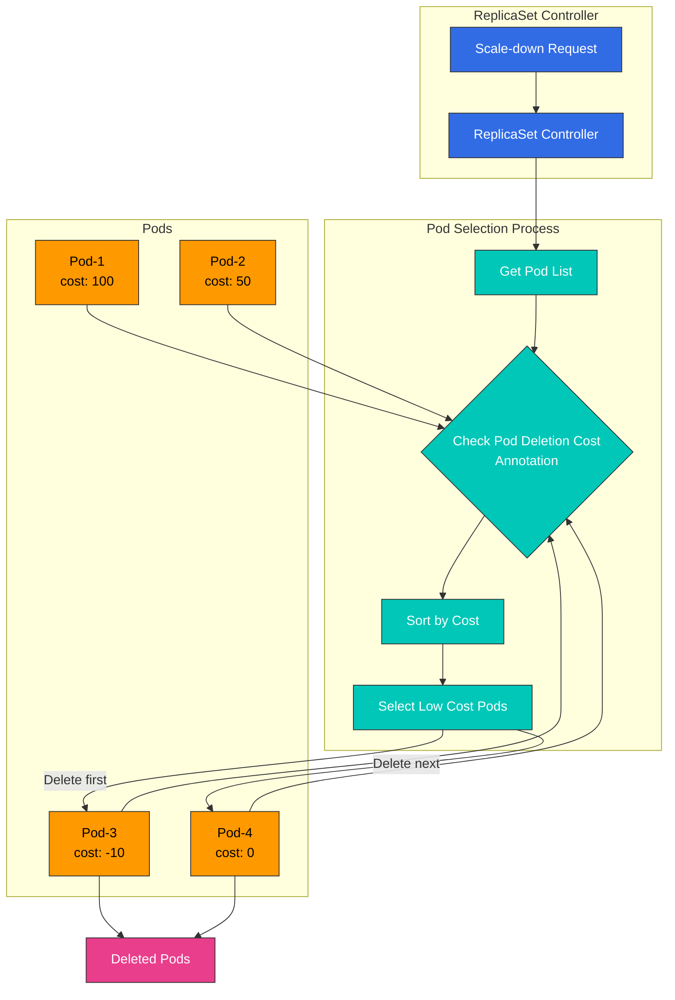

# Part 3: Advanced Features

## Custom Scheduler Implementation Cases in EKS

In this section, we will explore real-world cases of implementing custom schedulers in EKS.

### Case 1: GPU Workload Optimization Scheduler

In EKS clusters running AI/ML workloads, efficient utilization of GPU resources is important. The following is an implementation case of a custom scheduler that optimizes GPU workloads.

#### GPU Workload Optimization Scheduler Architecture

The following diagram shows the architecture of the GPU workload optimization scheduler:

#### GPU Workload Scheduling Workflow

The following diagram shows the GPU workload scheduling workflow:

#### Requirements

1. Node selection based on GPU memory requirements
2. Node selection based on GPU model (e.g., NVIDIA A100, V100, T4, etc.)
3. Node selection considering GPU utilization
4. GPU sharing optimization on multi-GPU instances

#### Implementation Approach

This case uses the scheduler framework plugin approach.

1. **Node Labeling**: Add GPU-related information as labels to each node.

```bash
# Add GPU model label
kubectl label node <node-name> gpu.nvidia.com/model=A100

# Add GPU memory label
kubectl label node <node-name> gpu.nvidia.com/memory=40960

# Add GPU count label
kubectl label node <node-name> gpu.nvidia.com/count=8
```

2. **Custom Scheduler Plugin Implementation**:

```go
// GPUTopologyPlugin is a scheduler plugin that considers GPU topology.
type GPUTopologyPlugin struct {
    handle framework.Handle
}

// Filter filters nodes based on GPU requirements.
func (gtp *GPUTopologyPlugin) Filter(ctx context.Context, state *framework.CycleState, pod *v1.Pod, node *framework.NodeInfo) *framework.Status {
    // Check GPU requirements
    gpuReq := getGPURequest(pod)
    if gpuReq == 0 {
        return framework.NewStatus(framework.Success, "")
    }

    // Check node's GPU info
    gpuCount := getGPUCount(node.Node())
    if gpuCount < gpuReq {
        return framework.NewStatus(framework.Unschedulable, "Not enough GPUs")
    }

    // Check GPU model requirements
    requiredModel := getRequiredGPUModel(pod)
    if requiredModel != "" && getGPUModel(node.Node()) != requiredModel {
        return framework.NewStatus(framework.Unschedulable, "GPU model mismatch")
    }

    // Check GPU memory requirements
    memReq := getGPUMemoryRequest(pod)
    if memReq > 0 && getGPUMemory(node.Node()) < memReq {
        return framework.NewStatus(framework.Unschedulable, "Not enough GPU memory")
    }

    return framework.NewStatus(framework.Success, "")
}

// Score assigns scores to nodes based on GPU topology.
func (gtp *GPUTopologyPlugin) Score(ctx context.Context, state *framework.CycleState, pod *v1.Pod, nodeName string) (int64, *framework.Status) {
    nodeInfo, err := gtp.handle.SnapshotSharedLister().NodeInfos().Get(nodeName)
    if err != nil {
        return 0, framework.NewStatus(framework.Error, fmt.Sprintf("Error getting node info: %v", err))
    }

    node := nodeInfo.Node()

    // Return default score if no GPU requirements
    gpuReq := getGPURequest(pod)
    if gpuReq == 0 {
        return 0, framework.NewStatus(framework.Success, "")
    }

    // Check GPU utilization
    gpuUtilization := getGPUUtilization(node)

    // Calculate score based on GPU count
    gpuCount := getGPUCount(node)

    // Assign higher score to nodes with available GPUs slightly more than requested
    // This is for efficient GPU resource utilization
    score := 100 - int64(math.Abs(float64(gpuCount-gpuReq))*10)
    if score < 0 {
        score = 0
    }

    // Assign higher score to nodes with low GPU utilization
    utilizationScore := int64((1.0 - gpuUtilization) * 100)

    // Final score is weighted average of both scores
    finalScore := (score * 7 + utilizationScore * 3) / 10

    return finalScore, framework.NewStatus(framework.Success, "")
}
```

3. **Scheduler Configuration**:

```yaml
apiVersion: kubescheduler.config.k8s.io/v1beta1
kind: KubeSchedulerConfiguration
clientConnection:
  kubeconfig: /etc/kubernetes/scheduler.conf
profiles:
- schedulerName: gpu-scheduler
  plugins:
    filter:
      enabled:
      - name: GPUTopologyPlugin
    score:
      enabled:
      - name: GPUTopologyPlugin
        weight: 10
  pluginConfig:
  - name: GPUTopologyPlugin
    args: {}
```

4. **Specifying GPU Requirements in Pod Spec**:

```yaml
apiVersion: v1
kind: Pod
metadata:
  name: gpu-pod
  annotations:
    gpu.nvidia.com/model: "A100"
    gpu.nvidia.com/memory: "40960"
spec:
  schedulerName: gpu-scheduler
  containers:
  - name: gpu-container
    image: nvidia/cuda:11.6.0-base-ubuntu20.04
    resources:
      limits:
        nvidia.com/gpu: 2
```

### Case 2: Network Locality Optimization Scheduler

In EKS clusters, you can implement a custom scheduler that considers network locality to optimize network costs.

#### Network Locality Optimization Scheduler Architecture

The following diagram shows the architecture of the network locality optimization scheduler.

#### Network Locality Optimization Workflow

The following diagram shows the workflow of the network locality optimization scheduler.

## Scale-Down Optimization with Pod Deletion Cost

Pod Deletion Cost, introduced in Kubernetes 1.22, is a feature that allows you to control which pods are deleted first when workload resources like ReplicaSet, Deployment, or StatefulSet scale down. This is useful for optimizing application availability and performance.

### Pod Deletion Cost Concept

Pod Deletion Cost assigns a cost value to each pod through the `controller.kubernetes.io/pod-deletion-cost` annotation. During scale-down, pods with lower costs are deleted first.

**Key Features**:

* Default value: 0
* Range: -2147483648 to 2147483647 (int32 range)
* Higher value = More important pod (deleted later)
* Lower value = Less important pod (deleted first)

### Pod Deletion Cost Architecture

The following diagram shows how Pod Deletion Cost works during scale-down:



### Use Cases

#### 1. Protecting Warmed-Up Cache Pods

When applications load cache at startup, you can prioritize keeping warmed-up pods to optimize performance.

```yaml
apiVersion: v1
kind: Pod
metadata:
  name: app-pod-warmed-up
  annotations:
    controller.kubernetes.io/pod-deletion-cost: "100"  # Cache warmed up
spec:
  containers:
  - name: app
    image: my-app:latest
    lifecycle:
      postStart:
        exec:
          command:
          - /bin/sh
          - -c
          - |
            # Cache warm-up
            /app/warm-cache.sh
            # Increase deletion cost after warm-up complete
            kubectl annotate pod $HOSTNAME \
              controller.kubernetes.io/pod-deletion-cost=100 --overwrite
```

#### 2. Protecting Pods with Active Connections

Protect pods with WebSocket or long-running connections:

```go
// Go example: Dynamically update deletion cost based on active connection count
package main

import (
    "context"
    "fmt"
    "os"
    "time"

    metav1 "k8s.io/apimachinery/pkg/apis/meta/v1"
    "k8s.io/client-go/kubernetes"
    "k8s.io/client-go/rest"
)

type ConnectionTracker struct {
    activeConnections int
    k8sClient         *kubernetes.Clientset
    podName           string
    namespace         string
}

func NewConnectionTracker() (*ConnectionTracker, error) {
    config, err := rest.InClusterConfig()
    if err != nil {
        return nil, err
    }

    clientset, err := kubernetes.NewForConfig(config)
    if err != nil {
        return nil, err
    }

    return &ConnectionTracker{
        k8sClient: clientset,
        podName:   os.Getenv("POD_NAME"),
        namespace: os.Getenv("POD_NAMESPACE"),
    }, nil
}

func (ct *ConnectionTracker) UpdateDeletionCost() error {
    // Set deletion cost proportional to active connection count
    // 10 cost per connection, max 1000
    cost := ct.activeConnections * 10
    if cost > 1000 {
        cost = 1000
    }

    pod, err := ct.k8sClient.CoreV1().Pods(ct.namespace).Get(
        context.TODO(),
        ct.podName,
        metav1.GetOptions{},
    )
    if err != nil {
        return err
    }

    if pod.Annotations == nil {
        pod.Annotations = make(map[string]string)
    }

    pod.Annotations["controller.kubernetes.io/pod-deletion-cost"] = fmt.Sprintf("%d", cost)

    _, err = ct.k8sClient.CoreV1().Pods(ct.namespace).Update(
        context.TODO(),
        pod,
        metav1.UpdateOptions{},
    )

    return err
}

func (ct *ConnectionTracker) StartPeriodicUpdate() {
    ticker := time.NewTicker(30 * time.Second)
    defer ticker.Stop()

    for range ticker.C {
        if err := ct.UpdateDeletionCost(); err != nil {
            fmt.Printf("Failed to update deletion cost: %v\n", err)
        }
    }
}

func (ct *ConnectionTracker) OnConnectionOpen() {
    ct.activeConnections++
}

func (ct *ConnectionTracker) OnConnectionClose() {
    ct.activeConnections--
    if ct.activeConnections < 0 {
        ct.activeConnections = 0
    }
}
```

#### 3. Protecting Pods with Data Locality

Protect pods that cache or use data on specific nodes:

```yaml
apiVersion: apps/v1
kind: Deployment
metadata:
  name: data-processor
spec:
  replicas: 5
  selector:
    matchLabels:
      app: data-processor
  template:
    metadata:
      labels:
        app: data-processor
      annotations:
        # Set high cost for pods with high data locality
        controller.kubernetes.io/pod-deletion-cost: "50"
    spec:
      affinity:
        podAntiAffinity:
          preferredDuringSchedulingIgnoredDuringExecution:
          - weight: 100
            podAffinityTerm:
              labelSelector:
                matchExpressions:
                - key: app
                  operator: In
                  values:
                  - data-processor
              topologyKey: kubernetes.io/hostname
      containers:
      - name: processor
        image: data-processor:latest
        env:
        - name: POD_NAME
          valueFrom:
            fieldRef:
              fieldPath: metadata.name
        - name: POD_NAMESPACE
          valueFrom:
            fieldRef:
              fieldPath: metadata.namespace
```

#### 4. Prioritizing Deletion of Newly Started Pods

Newly started pods may not be fully warmed up yet, so delete them first:

```yaml
apiVersion: v1
kind: Pod
metadata:
  name: app-pod-new
  annotations:
    controller.kubernetes.io/pod-deletion-cost: "-50"  # New pods have low cost
spec:
  containers:
  - name: app
    image: my-app:latest
    lifecycle:
      postStart:
        exec:
          command:
          - /bin/sh
          - -c
          - |
            # Initially low cost
            sleep 60
            # Change to normal cost after 1 minute
            kubectl annotate pod $HOSTNAME \
              controller.kubernetes.io/pod-deletion-cost=0 --overwrite
```

### Integration with Horizontal Pod Autoscaler

When using with HPA, you can leverage Pod Deletion Cost to protect important pods during scale-down:

```yaml
apiVersion: autoscaling/v2
kind: HorizontalPodAutoscaler
metadata:
  name: app-hpa
spec:
  scaleTargetRef:
    apiVersion: apps/v1
    kind: Deployment
    name: app
  minReplicas: 3
  maxReplicas: 10
  metrics:
  - type: Resource
    resource:
      name: cpu
      target:
        type: Utilization
        averageUtilization: 70
  behavior:
    scaleDown:
      stabilizationWindowSeconds: 300  # 5-minute stabilization period
      policies:
      - type: Percent
        value: 50
        periodSeconds: 60
      - type: Pods
        value: 2
        periodSeconds: 60
      selectPolicy: Min
```

### Dynamic Pod Deletion Cost Update Pattern

You can dynamically update deletion cost when a pod's importance changes in real-time:

```python
# Python example: Dynamic deletion cost update based on metrics
from kubernetes import client, config
import time
import os

class DeletionCostManager:
    def __init__(self):
        config.load_incluster_config()
        self.v1 = client.CoreV1Api()
        self.pod_name = os.environ.get('POD_NAME')
        self.namespace = os.environ.get('POD_NAMESPACE')

    def calculate_cost(self, metrics):
        """
        Calculate deletion cost based on metrics
        - Active request count
        - Cache hit rate
        - Average response time
        """
        base_cost = 0

        # Higher cost for more active requests
        active_requests = metrics.get('active_requests', 0)
        base_cost += active_requests * 5

        # Higher cost for higher cache hit rate
        cache_hit_rate = metrics.get('cache_hit_rate', 0)
        base_cost += int(cache_hit_rate * 100)

        # Higher cost for faster response time (optimized pod)
        avg_response_time = metrics.get('avg_response_time_ms', 1000)
        if avg_response_time < 100:
            base_cost += 50
        elif avg_response_time < 500:
            base_cost += 20

        # Limit to max 1000
        return min(base_cost, 1000)

    def update_deletion_cost(self, cost):
        """Update pod's deletion cost annotation"""
        try:
            pod = self.v1.read_namespaced_pod(
                name=self.pod_name,
                namespace=self.namespace
            )

            if pod.metadata.annotations is None:
                pod.metadata.annotations = {}

            pod.metadata.annotations['controller.kubernetes.io/pod-deletion-cost'] = str(cost)

            self.v1.patch_namespaced_pod(
                name=self.pod_name,
                namespace=self.namespace,
                body=pod
            )

            print(f"Updated deletion cost to {cost}")
        except Exception as e:
            print(f"Error updating deletion cost: {e}")

    def run(self, get_metrics_func):
        """Periodically collect metrics and update deletion cost"""
        while True:
            try:
                metrics = get_metrics_func()
                cost = self.calculate_cost(metrics)
                self.update_deletion_cost(cost)
            except Exception as e:
                print(f"Error in main loop: {e}")

            time.sleep(30)  # Update every 30 seconds

# Usage example
def get_app_metrics():
    """Collect application metrics (implementation required)"""
    return {
        'active_requests': 15,
        'cache_hit_rate': 0.85,
        'avg_response_time_ms': 120
    }

if __name__ == '__main__':
    manager = DeletionCostManager()
    manager.run(get_app_metrics)
```

### Monitoring and Debugging

How to verify that Pod Deletion Cost is working correctly:

```bash
# 1. Check pod's deletion cost
kubectl get pods -o custom-columns=\
NAME:.metadata.name,\
DELETION_COST:.metadata.annotations.controller\.kubernetes\.io/pod-deletion-cost

# 2. Check all pod deletion costs for a specific Deployment
kubectl get pods -l app=my-app -o json | \
  jq -r '.items[] | "\(.metadata.name): \(.metadata.annotations["controller.kubernetes.io/pod-deletion-cost"] // "0")"'

# 3. Scale-down simulation
kubectl scale deployment my-app --replicas=3

# 4. Check which pods were deleted
kubectl get events --field-selector involvedObject.kind=Pod,reason=Killing \
  --sort-by='.lastTimestamp'
```

### Prometheus Metrics Collection

```yaml
# ServiceMonitor for Pod Deletion Cost metrics
apiVersion: monitoring.coreos.com/v1
kind: ServiceMonitor
metadata:
  name: pod-deletion-cost-monitor
  namespace: monitoring
spec:
  selector:
    matchLabels:
      app: my-app
  endpoints:
  - port: metrics
    interval: 30s
    relabelings:
    - sourceLabels: [__meta_kubernetes_pod_annotation_controller_kubernetes_io_pod_deletion_cost]
      targetLabel: pod_deletion_cost
```

### Grafana Dashboard

```json
{
  "dashboard": {
    "title": "Pod Deletion Cost Monitoring",
    "panels": [
      {
        "title": "Pod Deletion Cost Distribution",
        "targets": [
          {
            "expr": "kube_pod_annotations{annotation_controller_kubernetes_io_pod_deletion_cost!=\"\"}"
          }
        ],
        "type": "graph"
      },
      {
        "title": "Pods by Deletion Cost Range",
        "targets": [
          {
            "expr": "count(kube_pod_annotations{annotation_controller_kubernetes_io_pod_deletion_cost=~\"[0-9]+\"}) by (annotation_controller_kubernetes_io_pod_deletion_cost)"
          }
        ],
        "type": "piechart"
      }
    ]
  }
}
```

### Best Practices

1. **Use Consistent Cost Ranges**: Define and use consistent cost ranges within your team.
   * `-100 to -1`: Delete first (new pods, pods warming up)
   * `0`: Default (normal pods)
   * `1 to 100`: Medium importance (pods with active connections)
   * `100 to 1000`: High importance (pods with warmed cache, pods with many connections)
2. **Dynamic Updates**: Dynamically update deletion cost when pod state changes.
3. **Set Upper Limits**: Set upper limits on deletion cost to prevent issues with excessively large values.
4. **Monitoring**: Monitor the distribution of deletion costs to verify they work as expected.
5. **Testing**: Test scale-down behavior in a staging environment before applying to production.
6. **Documentation**: Document what each cost range means.

### Limitations

* **Interaction with Pod Disruption Budget**: PDB takes precedence when used together.
* **Kubernetes Version**: Only available in 1.22 and above.
* **Workload Type Limitation**: Only works with workloads using ReplicaSet controller (Deployment, ReplicaSet).
* **Node Failure**: Deletion cost is not considered when a node completely fails.

## Custom Scheduler Monitoring and Debugging

After implementing a custom scheduler, monitoring and debugging are important. This section covers how to monitor and debug custom schedulers.

### Monitoring Architecture

The following diagram shows the architecture for monitoring custom schedulers in EKS.

### Key Monitoring Metrics

The following diagram shows the key monitoring metrics for custom schedulers and their relationships:

### Logging

You can understand scheduling decisions by checking the custom scheduler's logs:

```bash
kubectl logs -n kube-system -l app=custom-scheduler
```

### Checking Events

You can check events related to pod scheduling:

```bash
kubectl get events --field-selector involvedObject.name=<pod-name>
```

### Metrics Collection

You can collect custom scheduler metrics using Prometheus:

```yaml
apiVersion: monitoring.coreos.com/v1
kind: ServiceMonitor
metadata:
  name: custom-scheduler
  namespace: monitoring
spec:
  selector:
    matchLabels:
      app: custom-scheduler
  endpoints:
  - port: metrics
    interval: 15s
```

### Dashboard Configuration

You can visualize custom scheduler metrics using Grafana:

```yaml
apiVersion: v1
kind: ConfigMap
metadata:
  name: custom-scheduler-dashboard
  namespace: monitoring
data:
  custom-scheduler-dashboard.json: |
    {
      "annotations": {
        "list": [
          {
            "builtIn": 1,
            "datasource": "-- Grafana --",
            "enable": true,
            "hide": true,
            "iconColor": "rgba(0, 211, 255, 1)",
            "name": "Annotations & Alerts",
            "type": "dashboard"
          }
        ]
      },
      "editable": true,
      "gnetId": null,
      "graphTooltip": 0,
      "id": 1,
      "links": [],
      "panels": [
        {
          "aliasColors": {},
          "bars": false,
          "dashLength": 10,
          "dashes": false,
          "datasource": null,
          "fieldConfig": {
            "defaults": {
              "custom": {}
            },
            "overrides": []
          },
          "fill": 1,
          "fillGradient": 0,
          "gridPos": {
            "h": 8,
            "w": 12,
            "x": 0,
            "y": 0
          },
          "hiddenSeries": false,
          "id": 2,
          "legend": {
            "avg": false,
            "current": false,
            "max": false,
            "min": false,
            "show": true,
            "total": false,
            "values": false
          },
          "lines": true,
          "linewidth": 1,
          "nullPointMode": "null",
          "options": {
            "alertThreshold": true
          },
          "percentage": false,
          "pluginVersion": "7.2.0",
          "pointradius": 2,
          "points": false,
          "renderer": "flot",
          "seriesOverrides": [],
          "spaceLength": 10,
          "stack": false,
          "steppedLine": false,
          "targets": [
            {
              "expr": "scheduler_scheduling_duration_seconds_count",
              "interval": "",
              "legendFormat": "",
              "refId": "A"
            }
          ],
          "thresholds": [],
          "timeFrom": null,
          "timeRegions": [],
          "timeShift": null,
          "title": "Scheduling Duration",
          "tooltip": {
            "shared": true,
            "sort": 0,
            "value_type": "individual"
          },
          "type": "graph",
          "xaxis": {
            "buckets": null,
            "mode": "time",
            "name": null,
            "show": true,
            "values": []
          },
          "yaxes": [
            {
              "format": "short",
              "label": null,
              "logBase": 1,
              "max": null,
              "min": null,
              "show": true
            },
            {
              "format": "short",
              "label": null,
              "logBase": 1,
              "max": null,
              "min": null,
              "show": true
            }
          ],
          "yaxis": {
            "align": false,
            "alignLevel": null
          }
        }
      ],
      "schemaVersion": 26,
      "style": "dark",
      "tags": [],
      "templating": {
        "list": []
      },
      "time": {
        "from": "now-6h",
        "to": "now"
      },
      "timepicker": {},
      "timezone": "",
      "title": "Custom Scheduler Dashboard",
      "uid": "custom-scheduler",
      "version": 1
    }
```

## Conclusion

Custom schedulers are a powerful way to customize Kubernetes scheduling behavior for specific requirements. In EKS, you can implement custom schedulers through various methods including the multiple scheduler approach, scheduler extender approach, and scheduler framework plugin approach.

Custom schedulers can be utilized in various cases such as GPU workload optimization and network locality optimization. When implementing custom schedulers, it's important to also configure monitoring and debugging tools.

## Quiz

To test what you've learned in this chapter, try the [Topic Quiz](../quizzes/scheduling/02-custom-scheduler-part3-quiz.md).
