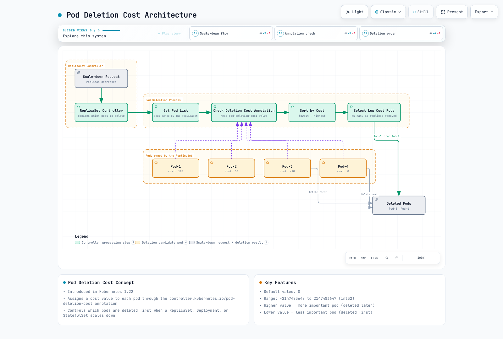

# Part 3: Advanced Features

> **Example Baseline**: Kubernetes 1.35.8, Go 1.27.1; Python client API 35.0.0
> **Last Updated**: September 11, 2026

These are illustrative implementation patterns using the [Part1 secondary scheduler](01-custom-scheduler-part1.md) and [Part2 framework interfaces](02-custom-scheduler-part2.md). They are not reports of a production deployment or measured optimization. Local code/schema checks do not establish GPU execution, application readiness, certificate provisioning or production availability.

## Custom Scheduler Implementation Cases in EKS

This section develops example EKS scheduling policies. Actual capacity, device inventory, traffic patterns and failure behavior must be verified on the target cluster.

### Case 1: GPU Workload Optimization Scheduler

In EKS clusters running AI/ML workloads, efficient utilization of GPU resources is important. The following is an implementation case of a custom scheduler that optimizes GPU workloads.

#### GPU Workload Optimization Scheduler Architecture

The design can combine placement policy and optional telemetry. The implemented example below uses cached requests; the diagram does not establish a working utilization collector.

#### GPU Workload Scheduling Workflow

The scheduler watches Pod state through the API. Metrics-based extensions shown in the workflow need a separate, validated collector.

#### Requirements

1. Enforce GPU memory/model requirements using verified node labels and required node affinity.
2. Retain `NodeResourcesFit` for effective GPU requests and already assigned/assumed requests.
3. Prefer packing onto suitable nodes using the scheduler snapshot; live-utilization weighting is a separate, unimplemented integration here.
4. GPU sharing needs an appropriate device-plugin/MIG/time-slicing or DRA allocation policy. A node-scoring function does not partition devices or enforce per-process GPU memory.


#### Implementation Approach

This case uses the scheduler framework plugin approach.

1. **Verify the inventory before labeling.** The `training.example.com` keys below are administrator-defined lab labels, not NVIDIA discovery labels. The memory value must describe the minimum memory per eligible device on a homogeneous, non-shared GPU node. Read GPU resource counts from `status.allocatable`; a count label is not remaining capacity.

```bash
kubectl get nodes -o custom-columns='NAME:.metadata.name,GPUS:.status.allocatable.nvidia\.com/gpu'

# Set only after verifying the actual node and per-device inventory.
: "${NODE_NAME:?Select a verified GPU node}"
: "${GPU_MODEL:?Set the observed model label value}"
: "${GPU_MEMORY_MIB:?Set verified minimum memory per GPU in MiB}"
kubectl label node "$NODE_NAME" \
  "training.example.com/gpu-model=$GPU_MODEL" \
  "training.example.com/gpu-memory-mib=$GPU_MEMORY_MIB" --overwrite
```

2. **Add a scoring plugin without replacing default filters.** Save `packing/plugin.go` below. It uses allocatable GPU resources minus existing/assumed and incoming requests, not total inventory labels or live utilization. A zero score does not exclude a node.

```go
package packing

import (
	"context"

	v1 "k8s.io/api/core/v1"
	"k8s.io/apimachinery/pkg/runtime"
	resourcehelper "k8s.io/component-helpers/resource"
	fwk "k8s.io/kube-scheduler/framework"
)

const Name = "GPUPacking"
const gpu v1.ResourceName = "nvidia.com/gpu"

type Plugin struct{}

var _ fwk.ScorePlugin = &Plugin{}

func (*Plugin) Name() string { return Name }

func (*Plugin) Score(_ context.Context, _ fwk.CycleState, pod *v1.Pod, info fwk.NodeInfo) (int64, *fwk.Status) {
	if pod == nil || info == nil || info.Node() == nil {
		return 0, fwk.NewStatus(fwk.Error, "missing node")
	}
	requests := resourcehelper.PodRequests(pod, resourcehelper.PodResourcesOptions{})
	request := requests[gpu]
	needed, exact := request.AsInt64()
	if !exact || needed < 0 {
		return 0, fwk.NewStatus(fwk.Error, "GPU request must be a non-negative integer")
	}
	if needed == 0 {
		return 0, nil
	}
	allocatable := info.GetAllocatable().GetScalarResources()[gpu]
	requested := info.GetRequested().GetScalarResources()[gpu]
	remaining := allocatable - requested - needed
	if remaining < 0 {
		// Score cannot exclude a node. NodeResourcesFit must remain enabled.
		return 0, nil
	}
	if remaining >= 10 {
		return 0, nil
	}
	return 100 - remaining*10, nil
}

func (*Plugin) ScoreExtensions() fwk.ScoreExtensions { return nil }

func New(_ context.Context, _ runtime.Object, _ fwk.Handle) (fwk.Plugin, error) {
	return &Plugin{}, nil
}
```

Register it in `cmd/gpu-packing-scheduler/main.go`, then use the Part1 image workflow with `CGO_ENABLED=0 go build -buildvcs=false -o custom-scheduler ./cmd/gpu-packing-scheduler`.

```go
package main

import (
	"os"

	"example.com/custom-scheduler/packing"
	"k8s.io/component-base/cli"
	"k8s.io/kubernetes/cmd/kube-scheduler/app"
)

func main() {
	command := app.NewSchedulerCommand(app.WithPlugin(packing.Name, packing.New))
	os.Exit(cli.Run(command))
}
```

The original 70:30 packing/utilization idea can be expressed as the illustrative formula `(packingScore * 7 + utilizationScore * 3) / 10`, with `utilizationScore = (1 - utilization) * 100`. It is **not wired into this binary**. A real implementation needs a consistent, fresh, per-device snapshot, finite values in0–1, bounded collection latency and an explicit missing-data policy. Missing telemetry is not zero utilization; utilization is not unallocated GPU capacity.

3. **Scheduler Configuration**:

```yaml
apiVersion: kubescheduler.config.k8s.io/v1
kind: KubeSchedulerConfiguration
leaderElection:
  leaderElect: true
  resourceLock: leases
  resourceName: custom-scheduler
  resourceNamespace: scheduler-lab
  leaseDuration: 15s
  renewDeadline: 10s
  retryPeriod: 2s
profiles:
- schedulerName: custom-scheduler
  plugins:
    score:
      enabled:
      - name: GPUPacking
        weight: 10
```

4. **Express hard placement requirements in the Pod.** Replace the example model/memory with verified inventory. `Gt: "40959"` means an integer label of at least40960MiB. The BusyBox image below only holds a GPU resource reservation if run in a prepared lab; it does not execute CUDA or validate the GPU.

```yaml
apiVersion: v1
kind: Pod
metadata:
  name: gpu-reservation-demo
  namespace: scheduler-lab
spec:
  schedulerName: custom-scheduler
  automountServiceAccountToken: false
  restartPolicy: Never
  affinity:
    nodeAffinity:
      requiredDuringSchedulingIgnoredDuringExecution:
        nodeSelectorTerms:
        - matchExpressions:
          - key: training.example.com/gpu-model
            operator: In
            values:
            - A100
          - key: training.example.com/gpu-memory-mib
            operator: Gt
            values:
            - '40959'
  containers:
  - name: reservation
    image: busybox:1.37.0
    command:
    - sh
    - -c
    - sleep 60
    resources:
      requests:
        cpu: 100m
        memory: 64Mi
        nvidia.com/gpu: 2
      limits:
        memory: 128Mi
        nvidia.com/gpu: 2
```

### Case 2: Network Locality Optimization Scheduler

In EKS clusters, you can implement a custom scheduler that considers network locality to optimize network costs.

#### Network Locality Optimization Scheduler Architecture

A network-locality design may combine topology and measured dependency information; the integrations are illustrative.

#### Network Locality Optimization Workflow

Evaluate hard placement constraints before optional locality scores; actual traffic and failure-domain requirements determine the tradeoff.

Start with required/preferred Pod affinity, topology spread and storage topology before creating another scheduler. Model the actual service dependencies and eligible AZs; co-location can reduce some cross-AZ traffic while increasing failure concentration or contention. Neither placement labels nor a scheduling score prove latency or savings.

The diagrams describe possible integrations, not a complete network-policy, service-mesh or CloudWatch implementation. Keep metric collection outside per-node scoring calls, bound staleness and timeouts, and recheck the cost/availability tradeoff with actual traffic. This chapter does not contain a deployed network-locality scheduler.

## Scale-Down Optimization with Pod Deletion Cost

Pod Deletion Cost is a **best-effort ReplicaSet scale-down preference**, including Pods owned by a Deployment's ReplicaSets. It appeared as alpha in1.21 and became enabled-by-default beta in1.22; it remains beta in the referenced documentation. It does not control StatefulSet ordinal deletion, bare Pod deletion, eviction or node failure.

### Pod Deletion Cost Concept

Set the `controller.kubernetes.io/pod-deletion-cost` annotation on each Pod. Costs are compared **within the same ReplicaSet**, not globally across Deployments or nodes. A higher cost prefers retention only when higher-precedence conditions permit it.

**Key properties:**

* Missing annotation means0; valid decimal values span signed int32, including negative values. Invalid values are rejected with the feature enabled.
* In the pinned controller, assignment, Pod phase and readiness precede cost; replica placement and other tie-breakers follow it.
* There is no guaranteed deletion order. Equal template costs do not distinguish replicas.
* Avoid frequent metric-driven updates. Prefer coarse application-state transitions or one update before an application-controlled scale-down.


### Pod Deletion Cost Architecture

The diagram shows cost ordering **only when assignment, phase, readiness and other relevant conditions are comparable**; it is not a guaranteed deletion sequence.



[🔍 View interactive diagram](https://www.atomai.click/kubernetes-docs/archmaps/en-scheduling-03-custom-scheduler-part3-0.html)

### Use Cases

#### 1. Protecting Warmed-Up Cache Pods

This Deployment starts each Pod at cost0. It is a contract for **your application**: replace the image and implement `/readyz` on port8080 so readiness reflects real warm-up. The audit did not build or run that application. A high cost must not be assigned merely because a sleep elapsed.

```yaml
apiVersion: v1
kind: Namespace
metadata:
  name: deletion-cost-lab
---
apiVersion: apps/v1
kind: Deployment
metadata:
  name: cache-app
  namespace: deletion-cost-lab
spec:
  replicas: 5
  selector:
    matchLabels:
      app: cache-app
  template:
    metadata:
      labels:
        app: cache-app
      annotations:
        controller.kubernetes.io/pod-deletion-cost: '0'
    spec:
      automountServiceAccountToken: false
      containers:
      - name: app
        image: registry.example.com/training/cache-app:validated
        ports:
        - name: http
          containerPort: 8080
        readinessProbe:
          httpGet:
            path: /readyz
            port: http
          periodSeconds: 5
        resources:
          requests:
            cpu: 100m
            memory: 128Mi
          limits:
            memory: 256Mi
        env:
        - name: POD_NAME
          valueFrom:
            fieldRef:
              fieldPath: metadata.name
        - name: POD_NAMESPACE
          valueFrom:
            fieldRef:
              fieldPath: metadata.namespace
        - name: POD_UID
          valueFrom:
            fieldRef:
              fieldPath: metadata.uid
```

After a specific replica is actually warm, an authorized operator/controller can update that Pod's annotation. Updating the Deployment template instead creates a rollout and a different ReplicaSet.

```bash
: "${POD_NAME:?Select a verified warm replica of cache-app}"
kubectl -n deletion-cost-lab annotate pod "$POD_NAME" \
  controller.kubernetes.io/pod-deletion-cost=100 --overwrite
```

The sample Deployment mounts no API token. The optional dynamic helpers below need a separately configured, authorized Kubernetes client. Namespace RBAC `patch pods` is not automatically restricted to the calling Pod; use a trusted controller or an appropriately constrained identity/admission policy. No such production policy is installed by this example.

#### 2. Protecting Pods with Active Connections

An active-connection count can be one retention hint; graceful shutdown and draining are still required because cost does not prevent deletion. This library serializes updates, uses coarse buckets, tests the Pod UID, patches only the annotation and skips an unchanged hint. It assumes one writer for that annotation and an existing annotations object in the Pod template.

Pass a configured `client-go` client and the admitted Pod name/namespace/UID. For in-Pod integration those identifiers can come from the Downward API; obtaining them does not grant API permission. Call `UpdateDeletionCost(ctx)` at a controlled transition or before a scale-down you own, not on every connection event.

```go
package deletioncost

import (
	"context"
	"encoding/json"
	"fmt"
	"strconv"
	"sync"
	"time"

	metav1 "k8s.io/apimachinery/pkg/apis/meta/v1"
	"k8s.io/apimachinery/pkg/types"
	"k8s.io/client-go/kubernetes"
)

const Annotation = "controller.kubernetes.io/pod-deletion-cost"

type ConnectionTracker struct {
	client                  kubernetes.Interface
	namespace, podName      string
	uid                     types.UID
	connectionsMu, updateMu sync.Mutex
	activeConnections       int64
	lastCost                int32
	lastCostSet             bool
}

func NewConnectionTracker(client kubernetes.Interface, namespace, podName string, uid types.UID) (*ConnectionTracker, error) {
	if client == nil || namespace == "" || podName == "" || uid == "" {
		return nil, fmt.Errorf("client and admitted Pod namespace/name/UID are required")
	}
	return &ConnectionTracker{client: client, namespace: namespace, podName: podName, uid: uid}, nil
}

func (t *ConnectionTracker) OnConnectionOpen() {
	t.connectionsMu.Lock()
	defer t.connectionsMu.Unlock()
	t.activeConnections++
}

func (t *ConnectionTracker) OnConnectionClose() {
	t.connectionsMu.Lock()
	defer t.connectionsMu.Unlock()
	if t.activeConnections > 0 {
		t.activeConnections--
	}
}

// Illustrative coarse policy, not a benchmark or an availability guarantee.
func CostForConnections(count int64) int32 {
	switch {
	case count <= 0:
		return 0
	case count < 10:
		return 100
	case count < 100:
		return 500
	default:
		return 1000
	}
}

// Call at an application-controlled transition or before a controlled scale-down,
// not for every request. Assumes a single owner of this Pod's cost annotation.
func (t *ConnectionTracker) UpdateDeletionCost(parent context.Context) (bool, error) {
	t.updateMu.Lock()
	defer t.updateMu.Unlock()
	if err := parent.Err(); err != nil {
		return false, err
	}
	t.connectionsMu.Lock()
	cost := CostForConnections(t.activeConnections)
	t.connectionsMu.Unlock()
	if t.lastCostSet && t.lastCost == cost {
		return false, nil
	}

	// The Deployment template must already contain an annotations object.
	// JSON Pointer escapes the slash in the annotation key as ~1.
	patch, err := json.Marshal([]map[string]any{
		{"op": "test", "path": "/metadata/uid", "value": string(t.uid)},
		{"op": "add", "path": "/metadata/annotations/controller.kubernetes.io~1pod-deletion-cost", "value": strconv.FormatInt(int64(cost), 10)},
	})
	if err != nil {
		return false, err
	}
	ctx, cancel := context.WithTimeout(parent, 3*time.Second)
	defer cancel()
	_, err = t.client.CoreV1().Pods(t.namespace).Patch(ctx, t.podName, types.JSONPatchType, patch, metav1.PatchOptions{})
	if err != nil {
		return false, err
	}
	t.lastCost, t.lastCostSet = cost, true
	return true, nil
}
```

#### 3. Protecting Pods with Data Locality

A locality hint can prefer a replica with useful cached data. In the manifest below every replica starts at50, so there is no cost distinction until a trusted controller updates individual Pods. Cost does not mount, retain or restore data; storage constraints and application recovery remain separate.

```yaml
apiVersion: apps/v1
kind: Deployment
metadata:
  name: data-processor
spec:
  replicas: 5
  selector:
    matchLabels:
      app: data-processor
  template:
    metadata:
      labels:
        app: data-processor
      annotations:
        # Set high cost for pods with high data locality
        controller.kubernetes.io/pod-deletion-cost: "50"
    spec:
      affinity:
        podAntiAffinity:
          preferredDuringSchedulingIgnoredDuringExecution:
          - weight: 100
            podAffinityTerm:
              labelSelector:
                matchExpressions:
                - key: app
                  operator: In
                  values:
                  - data-processor
              topologyKey: kubernetes.io/hostname
      containers:
      - name: processor
        image: registry.example.com/training/data-processor:validated
        env:
        - name: POD_NAME
          valueFrom:
            fieldRef:
              fieldPath: metadata.name
        - name: POD_NAMESPACE
          valueFrom:
            fieldRef:
              fieldPath: metadata.namespace
```

#### 4. Prioritizing Deletion of Newly Started Pods

An initial negative cost can prefer deletion of a newly started replica when other controller criteria tie. Choose it in the template **before** initial deployment, then update an individual Pod after a real readiness/state transition. A fixed postStart sleep is not evidence of cache readiness, and changing an existing Deployment template triggers a rollout.

```yaml
# Deployment Pod-template fragment, chosen before initial deployment.
spec:
  template:
    metadata:
      annotations:
        controller.kubernetes.io/pod-deletion-cost: "-50"
```

### Integration with Horizontal Pod Autoscaler

HPA adjusts the desired replica count; the Deployment/ReplicaSet controllers select Pods to remove. Deletion cost is a hint in that selection, not an HPA signal or a protection guarantee. This HPA targets the `cache-app` Deployment above and requires working CPU resource metrics and CPU requests. `selectPolicy: Min` chooses the more restrictive scale-down policy.

```yaml
apiVersion: autoscaling/v2
kind: HorizontalPodAutoscaler
metadata:
  name: cache-app
  namespace: deletion-cost-lab
spec:
  scaleTargetRef:
    apiVersion: apps/v1
    kind: Deployment
    name: cache-app
  minReplicas: 3
  maxReplicas: 10
  metrics:
  - type: Resource
    resource:
      name: cpu
      target:
        type: Utilization
        averageUtilization: 70
  behavior:
    scaleDown:
      stabilizationWindowSeconds: 300
      policies:
      - type: Percent
        value: 50
        periodSeconds: 60
      - type: Pods
        value: 2
        periodSeconds: 60
      selectPolicy: Min
```

### Dynamic Pod Deletion Cost Update Pattern

This alternative policy combines fresh per-Pod request/cache/latency inputs into coarse100-point hints. The weights are illustrative and are not measured performance results. There is no fake collector or background polling loop: supply real samples with Pod UID and an offset-aware `observed_at` timestamp. Missing, invalid, stale or wrong-Pod data raises an error and leaves the annotation unchanged.

Pass an already configured Kubernetes Python `ApiClient`; the call signature was checked against client35.0.0. It uses JSON Patch explicitly, a UID test and bounded connection/read timeouts. Pick one owner/policy for the annotation rather than running both examples against the same Pod.

```python
from datetime import datetime, timezone
import math
import threading

ANNOTATION_PATH = (
    "/metadata/annotations/controller.kubernetes.io~1pod-deletion-cost"
)


def calculate_cost(metrics, now):
    """Illustrative coarse hint from a real, fresh per-Pod sample."""
    observed = datetime.fromisoformat(metrics["observed_at"].replace("Z", "+00:00"))
    if observed.tzinfo is None or now.tzinfo is None:
        raise ValueError("timestamps must include a timezone")
    age = (now - observed).total_seconds()
    if age < -5 or age > 60:
        raise ValueError("metrics timestamp is in the future or stale")

    active = metrics["active_requests"]
    if isinstance(active, bool) or not isinstance(active, int) or active < 0:
        raise ValueError("active_requests must be a non-negative integer")
    hit_rate = metrics["cache_hit_rate"]
    latency = metrics["avg_response_time_ms"]
    for value in (hit_rate, latency):
        if isinstance(value, bool) or not isinstance(value, (int, float)) or not math.isfinite(value):
            raise ValueError("metrics must be finite numbers")
    if not 0 <= hit_rate <= 1 or latency < 0:
        raise ValueError("invalid hit rate or latency")

    raw_cost = active * 5 + int(hit_rate * 100)
    raw_cost += 50 if latency < 100 else 20 if latency < 500 else 0
    # Coarse buckets reduce annotation churn. Weights are an example policy.
    return min(1000, (raw_cost // 100) * 100)


class DeletionCostManager:
    """Uses a configured Kubernetes Python ApiClient; starts no background loop."""

    def __init__(self, api_client, namespace, pod_name, pod_uid):
        if api_client is None or not all((namespace, pod_name, pod_uid)):
            raise ValueError("API client and admitted Pod namespace/name/UID required")
        self.api_client = api_client
        self.namespace = namespace
        self.pod_name = pod_name
        self.pod_uid = pod_uid
        self._last_cost = None
        self._lock = threading.Lock()

    def update_from_metrics(self, metrics, now=None):
        # A single writer should own this annotation. The Pod template must
        # already create the annotations object with an initial deletion cost.
        if metrics["pod_uid"] != self.pod_uid:
            raise ValueError("metrics belong to a different Pod UID")
        now = now or datetime.now(timezone.utc)
        cost = calculate_cost(metrics, now)
        with self._lock:
            if cost == self._last_cost:
                return False
            patch = [
                {"op": "test", "path": "/metadata/uid", "value": self.pod_uid},
                {"op": "add", "path": ANNOTATION_PATH, "value": str(cost)},
            ]
            # Explicit JSON Patch media type; preserve unrelated Pod fields.
            self.api_client.call_api(
                "/api/v1/namespaces/{namespace}/pods/{name}",
                "PATCH",
                path_params={"namespace": self.namespace, "name": self.pod_name},
                header_params={
                    "Accept": "application/json",
                    "Content-Type": "application/json-patch+json",
                },
                body=patch,
                response_type="V1Pod",
                auth_settings=["BearerToken"],
                _return_http_data_only=True,
                _request_timeout=(3, 5),
            )
            self._last_cost = cost
            return True
```

### Monitoring and Debugging

These commands inspect annotations and validate a scale request without changing replicas. A server dry run **does not simulate ReplicaSet victim selection**. For an actual scale-down experiment, use an isolated workload you control, account for any HPA that could overwrite the replica count, and compare Pod UIDs/owning ReplicaSets before and after. A kubelet `Killing` event alone does not prove deletion-cost ordering.

```bash
kubectl -n deletion-cost-lab get pods -l app=cache-app \
  -o custom-columns='NAME:.metadata.name,UID:.metadata.uid,COST:.metadata.annotations.controller\.kubernetes\.io/pod-deletion-cost'

kubectl -n deletion-cost-lab get pods -l app=cache-app -o json | \
  jq -r '.items[] | [.metadata.name, .metadata.uid, (.metadata.annotations["controller.kubernetes.io/pod-deletion-cost"] // "0")] | @tsv'

# Server-side dry run changes no replicas and does not predict victim selection.
kubectl -n deletion-cost-lab scale deployment/cache-app --replicas=3 --dry-run=server
kubectl -n deletion-cost-lab get replicasets,pods -l app=cache-app
```

### Prometheus Metrics Collection

`kube_pod_annotations` comes from **kube-state-metrics**, not the application. Enable the specific annotation allowlist on the existing exporter and retain its other flags/allowlisted keys. Its existing Prometheus scrape target must be healthy; the following is an argument fragment, not a new Deployment.

```yaml
# Fragment to merge into the existing kube-state-metrics container arguments.
# Preserve its other arguments and allowlisted keys.
args:
- --metric-annotations-allowlist=pods=[controller.kubernetes.io/pod-deletion-cost]
```

The exported metric is a gauge with value1 and an `annotation_controller_kubernetes_io_pod_deletion_cost` **label**. Relabeling an annotation does not turn it into a numeric metric value. An absent series can mean missing collection; it must not be assumed to mean cost0.

### Grafana Dashboard

This is a dashboard JSON object for import, not the HTTP API's `{"dashboard": ...}` request wrapper. Replace `PROMETHEUS_UID` with the actual datasource UID. The panels count Pods by explicit annotation labels, including negative values; they do not plot the gauge's value1 as a deletion cost. Verify the kube-state-metrics allowlist before interpreting results.

```json
{
  "id": null,
  "uid": "pod-deletion-cost-hints",
  "title": "Pod Deletion Cost Hints",
  "schemaVersion": 39,
  "version": 1,
  "refresh": "30s",
  "time": {
    "from": "now-1h",
    "to": "now"
  },
  "panels": [
    {
      "id": 1,
      "title": "Pods by explicit deletion cost",
      "type": "piechart",
      "gridPos": {
        "h": 8,
        "w": 12,
        "x": 0,
        "y": 0
      },
      "datasource": {
        "type": "prometheus",
        "uid": "PROMETHEUS_UID"
      },
      "targets": [
        {
          "refId": "A",
          "expr": "count by (annotation_controller_kubernetes_io_pod_deletion_cost) (kube_pod_annotations{namespace=\"deletion-cost-lab\",annotation_controller_kubernetes_io_pod_deletion_cost=~\"-?[0-9]+\"})",
          "legendFormat": "{{annotation_controller_kubernetes_io_pod_deletion_cost}}",
          "instant": true
        }
      ],
      "fieldConfig": {
        "defaults": {
          "unit": "short"
        },
        "overrides": []
      },
      "options": {}
    },
    {
      "id": 2,
      "title": "Pods with an explicit cost",
      "type": "stat",
      "gridPos": {
        "h": 8,
        "w": 12,
        "x": 12,
        "y": 0
      },
      "datasource": {
        "type": "prometheus",
        "uid": "PROMETHEUS_UID"
      },
      "targets": [
        {
          "refId": "A",
          "expr": "count(kube_pod_annotations{namespace=\"deletion-cost-lab\",annotation_controller_kubernetes_io_pod_deletion_cost!=\"\"})",
          "legendFormat": "",
          "instant": true
        }
      ],
      "fieldConfig": {
        "defaults": {
          "unit": "short"
        },
        "overrides": []
      },
      "options": {}
    }
  ]
}
```

### Best Practices

1. **Use Consistent Cost Ranges**: Define and use consistent cost ranges within your team.
   * `-100 to -1`: Delete first (new pods, pods warming up)
   * `0`: Default (normal pods)
   * `1 to 100`: Medium importance (pods with active connections)
   * `100 to 1000`: High importance (pods with warmed cache, pods with many connections)
2. **Bounded Updates**: Use coarse state transitions or update before a controlled scale-down; avoid per-request/metric-sample writes.
3. **Set Upper Limits**: Set upper limits on deletion cost to prevent issues with excessively large values.
4. **Monitoring**: Monitor the distribution of deletion costs to verify they work as expected.
5. **Testing**: Test scale-down behavior in a staging environment before applying to production.
6. **Documentation**: Document what each cost range means.

### Limitations

* **PDB scope**: ordinary ReplicaSet/Deployment scale-down deletes Pods directly and is not blocked by a PDB. PDBs govern requests through the eviction API; neither mechanism guarantees survival during failures.
* **Version/feature**: alpha1.21, beta/default-on since1.22; the referenced1.35.8 baseline enables PodDeletionCost. Do not treat this as a reason to deploy an unsupported old minor.
* **Workload/ownership**: the preference is within one ReplicaSet. Bare Pods, StatefulSet ordinal choices and deletion of an entire workload are different paths.
* **Asynchrony**: concurrent updates, readiness changes and other selection criteria can override the expected preference. A new Pod needs its own annotation; the hint is not durable application state.


## Custom Scheduler Monitoring and Debugging

After implementing a custom scheduler, monitoring and debugging are important. This section covers how to monitor and debug custom schedulers.

### Monitoring Architecture

The architecture is an illustrative choice of monitoring integrations; the concrete configuration below uses the scheduler’s own HTTPS endpoint and Prometheus Operator.

### Key Monitoring Metrics

Use attempt latency, attempt outcomes and queue depth as distinct signals; their names and units are verified below.

### Logging

You can understand scheduling decisions by checking the custom scheduler's logs:

```bash
kubectl logs -n scheduler-lab -l app=custom-scheduler --prefix --tail=100
```

### Checking Events

You can check events related to pod scheduling:

```bash
kubectl -n scheduler-lab get events --field-selector involvedObject.name=<pod-name>
```

### Metrics Collection

The example below monitors the **secondary scheduler**, which exposes HTTPS metrics on10259 itself; a metrics sidecar is not required. AMP, CloudWatch, log collectors and alert routing in the illustration require separately configured integrations.

Prerequisites: an existing Prometheus Operator stack with discovery access, a serving certificate for `custom-scheduler.scheduler-lab.svc`, and its private key in the `custom-scheduler-serving-tls` Secret in `scheduler-lab`. Put the public CA in `monitoring/custom-scheduler-ca` under `ca.crt`. The `monitoring/scheduler-scrape-token` Secret must contain a valid, **rotated short-lived** token for the Prometheus ServiceAccount; provisioning and rotation are not implemented here.

Apply the following **strategic merge patch** to the complete Part1 Deployment only after preparing that PKI. It preserves the existing image/config/ServiceAccount and mounts the serving key. Use your controlled rollout process; no TLS rollout was executed in this audit.

```yaml
apiVersion: apps/v1
kind: Deployment
metadata:
  name: custom-scheduler
  namespace: scheduler-lab
spec:
  template:
    spec:
      containers:
      - name: custom-scheduler
        args:
        - --config=/etc/scheduler/config.yaml
        - --tls-cert-file=/etc/scheduler-serving/tls.crt
        - --tls-private-key-file=/etc/scheduler-serving/tls.key
        volumeMounts:
        - name: serving-tls
          mountPath: /etc/scheduler-serving
          readOnly: true
      volumes:
      - name: serving-tls
        secret:
          secretName: custom-scheduler-serving-tls
          defaultMode: 288
```

The Service exposes the named HTTPS port. Replace the example `monitoring/prometheus` ServiceAccount with the actual scraper identity. The extra ClusterRole permits only the non-resource `/metrics` GET; it does not supply discovery permissions. Ensure the Prometheus resource selects this ServiceMonitor's labels/namespace.

```yaml
apiVersion: v1
kind: Service
metadata:
  name: custom-scheduler
  namespace: scheduler-lab
  labels:
    app: custom-scheduler
spec:
  selector:
    app: custom-scheduler
  ports:
  - name: https
    port: 10259
    targetPort: https
---
apiVersion: rbac.authorization.k8s.io/v1
kind: ClusterRole
metadata:
  name: custom-scheduler-metrics
rules:
- nonResourceURLs:
  - /metrics
  verbs:
  - get
---
apiVersion: rbac.authorization.k8s.io/v1
kind: ClusterRoleBinding
metadata:
  name: custom-scheduler-metrics
subjects:
- kind: ServiceAccount
  name: prometheus
  namespace: monitoring
roleRef:
  apiGroup: rbac.authorization.k8s.io
  kind: ClusterRole
  name: custom-scheduler-metrics
---
apiVersion: monitoring.coreos.com/v1
kind: ServiceMonitor
metadata:
  name: custom-scheduler
  namespace: monitoring
  labels:
    app: custom-scheduler
spec:
  namespaceSelector:
    matchNames:
    - scheduler-lab
  selector:
    matchLabels:
      app: custom-scheduler
  endpoints:
  - port: https
    path: /metrics
    scheme: https
    interval: 15s
    tlsConfig:
      serverName: custom-scheduler.scheduler-lab.svc
      ca:
        configMap:
          name: custom-scheduler-ca
          key: ca.crt
    authorization:
      type: Bearer
      credentials:
        name: scheduler-scrape-token
        key: token
```

### Dashboard Configuration

The stable metric `scheduler_scheduling_attempt_duration_seconds` has `result` and `profile` labels; its histogram estimates attempt latency. `scheduler_schedule_attempts_total` is a counter, so use a rate for throughput. A raw `_count` is not a duration. The secondary scheduler is distinct from `kubectl get --raw /metrics`, which returns API-server metrics.

Replace `PROMETHEUS_UID` and import the embedded JSON, or configure a Grafana dashboard provider/sidecar to read this ConfigMap. Creating the ConfigMap alone does not load Grafana. The `grafana_dashboard: "1"` label is a common provider convention and must match your setup; actual import and queries were not run.

```yaml
apiVersion: v1
kind: ConfigMap
metadata:
  name: custom-scheduler-dashboard
  namespace: monitoring
  labels:
    grafana_dashboard: '1'
data:
  custom-scheduler-dashboard.json: |
    {
      "id": null,
      "uid": "custom-scheduler",
      "title": "Custom Scheduler",
      "schemaVersion": 39,
      "version": 1,
      "refresh": "30s",
      "time": {
        "from": "now-1h",
        "to": "now"
      },
      "panels": [
        {
          "id": 1,
          "title": "Successful scheduling attempt p95",
          "type": "timeseries",
          "gridPos": {
            "h": 8,
            "w": 12,
            "x": 0,
            "y": 0
          },
          "datasource": {
            "type": "prometheus",
            "uid": "PROMETHEUS_UID"
          },
          "targets": [
            {
              "refId": "A",
              "expr": "histogram_quantile(0.95, sum by (le, profile) (rate(scheduler_scheduling_attempt_duration_seconds_bucket{profile=\"custom-scheduler\",result=\"scheduled\"}[5m])))",
              "legendFormat": "{{profile}}",
              "instant": false
            }
          ],
          "fieldConfig": {
            "defaults": {
              "unit": "s"
            },
            "overrides": []
          },
          "options": {}
        },
        {
          "id": 2,
          "title": "Scheduling attempts per second",
          "type": "timeseries",
          "gridPos": {
            "h": 8,
            "w": 12,
            "x": 12,
            "y": 0
          },
          "datasource": {
            "type": "prometheus",
            "uid": "PROMETHEUS_UID"
          },
          "targets": [
            {
              "refId": "A",
              "expr": "sum by (result) (rate(scheduler_schedule_attempts_total{profile=\"custom-scheduler\"}[5m]))",
              "legendFormat": "{{result}}",
              "instant": false
            }
          ],
          "fieldConfig": {
            "defaults": {
              "unit": "ops"
            },
            "overrides": []
          },
          "options": {}
        }
      ]
    }
```

## Conclusion

Custom schedulers are a powerful way to customize Kubernetes scheduling behavior for specific requirements. In EKS, you can implement custom schedulers through various methods including the multiple scheduler approach, scheduler extender approach, and scheduler framework plugin approach.

Custom schedulers can be utilized in various cases such as GPU workload optimization and network locality optimization. When implementing custom schedulers, it's important to also configure monitoring and debugging tools.

## References and Validation Scope

* [ReplicaSet deletion cost and limitations](https://kubernetes.io/docs/concepts/workloads/controllers/replicaset/#pod-deletion-cost)
* [Pod disruption budgets](https://kubernetes.io/docs/concepts/workloads/pods/disruptions/)
* [Pinned ReplicaSet deletion path](https://github.com/kubernetes/kubernetes/blob/v1.35.8/pkg/controller/replicaset/replica_set.go)
* [Pinned deletion ordering](https://github.com/kubernetes/kubernetes/blob/v1.35.8/pkg/controller/controller_utils.go)
* [Scheduler metrics](https://github.com/kubernetes/kubernetes/blob/v1.35.8/pkg/scheduler/metrics/metrics.go)
* [kube-state-metrics Pod metrics](https://github.com/kubernetes/kube-state-metrics/blob/main/docs/metrics/workload/pod-metrics.md)
* [Kubernetes Python client API](https://github.com/kubernetes-client/python/blob/v35.0.0/kubernetes/client/api_client.py)

Local tests use synthetic Pods, fake API clients and arithmetic fixtures. They do not represent benchmark reruns, real GPU utilization, live Pod deletion, application warm-up, certificate/token rotation or production availability.

## Quiz

To test what you've learned in this chapter, try the [Topic Quiz](../quizzes/scheduling/02-custom-scheduler-part3-quiz.md).
