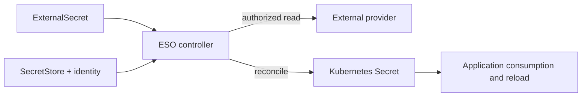
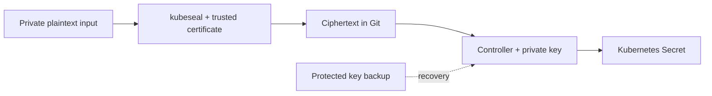

# Secrets Management

> **Last Updated**: September 13, 2026

This chapter separates the responsibilities and integration requirements of native Secrets, ESO, AWS stores, Sealed Secrets, Vault and SOPS. Use the [complete example files](https://github.com/Atom-oh/kubernetes-docs/tree/main/examples/security/secrets-management). No cluster/AWS installation or real credential rotation was performed.

## Table of Contents

- [Kubernetes Native Secrets](#kubernetes-native-secrets)
- [Encryption, Updates and Audit Boundaries](#encryption-updates-and-audit-boundaries)
- [External Secrets Operator (ESO)](#external-secrets-operator-eso)
- [PushSecret (Reverse Sync)](#pushsecret-reverse-sync)
- [AWS Secrets Manager Integration](#aws-secrets-manager-integration)
- [AWS Systems Manager Parameter Store Integration](#aws-systems-manager-parameter-store-integration)
- [Sealed Secrets](#sealed-secrets)
- [HashiCorp Vault Integration](#hashicorp-vault-integration)
- [Vault CSI Driver and Argo CD Vault Plugin](#vault-csi-driver-and-argo-cd-vault-plugin)
- [SOPS (Secrets OPerationS)](#sops-secrets-operations)
- [EKS Pod Identity and IRSA](#eks-pod-identity-and-irsa)
- [Tool Comparison](#tool-comparison)
- [Best Practices](#best-practices)
- [Summary](#summary)
- [References](#references)

## Kubernetes Native Secrets

### Secret Overview

A Secret is an API object with access-control, storage and consumption semantics.
The JSON/YAML `data` representation uses Base64; encoding is not encryption.
`stringData` accepts plaintext input and is merged into `data`. It is not a
stronger protection mechanism and does not work well with server-side apply.
Avoid writing actual credentials into tracked manifests, shell history or logs.

### Secret Types

| Type | Purpose |
|---|---|
| `Opaque` | Application-defined values |
| `kubernetes.io/service-account-token` | Explicitly created legacy long-lived token; prefer TokenRequest/projected short-lived tokens |
| `kubernetes.io/dockerconfigjson` | Registry credentials |
| `kubernetes.io/basic-auth` / `kubernetes.io/ssh-auth` | Basic or SSH authentication data |
| `kubernetes.io/tls` | Certificate and private key |

### Creating Secrets

Use protected files and an explicit namespace. Replace the paths with files
provided through your approved credential process. These commands do not print
the resulting Secret, but the operator still needs appropriate Kubernetes access.

```bash
kubectl -n production create secret generic db-credentials   --from-file=username=/secure/input/username   --from-file=password=/secure/input/password   --from-file=host=/secure/input/host
kubectl -n production create secret generic ssh-key   --type=kubernetes.io/ssh-auth   --from-file=ssh-privatekey=/secure/input/id_rsa
kubectl -n production create secret tls app-tls   --cert=/secure/input/tls.crt --key=/secure/input/tls.key
kubectl -n production create secret generic regcred   --type=kubernetes.io/dockerconfigjson   --from-file=.dockerconfigjson=/secure/input/docker-config.json
```

Literal flags are convenient for **non-sensitive fixtures**, but real passwords
in command arguments can appear in history and process inspection.

### Using Secrets

`secretKeyRef` selects one key; `envFrom.secretRef` imports all keys. Environment
variables do not update in an already running container. Mounted Secret volumes
normally update eventually, while `subPath` mounts do not receive those updates.
Applications must reopen/reload files as needed; synchronization is not a reload.

The following manifest gives a non-root application group-readable files. The
application image is an explicit replacement placeholder and was not executed.
The application ServiceAccount needs no Secret `get` permission merely to consume
a mounted Secret: kubelet performs the mount. Permission to create Pods can
nevertheless enable indirect access to namespace Secrets.

```yaml
# Replace the image with a reviewed application that reads /etc/app-secrets.
# This Pod is a manifest example; it was not started.
apiVersion: v1
kind: Pod
metadata:
  name: secret-file-consumer
  namespace: production
spec:
  automountServiceAccountToken: false
  securityContext:
    runAsNonRoot: true
    runAsUser: 10001
    runAsGroup: 10001
    fsGroup: 10001
    seccompProfile:
      type: RuntimeDefault
  containers:
    - name: app
      image: registry.example.com/team/app:replace-with-reviewed-tag
      securityContext:
        allowPrivilegeEscalation: false
        readOnlyRootFilesystem: true
        capabilities:
          drop: [ALL]
      volumeMounts:
        - name: secrets
          mountPath: /etc/app-secrets
          readOnly: true
  volumes:
    - name: secrets
      secret:
        secretName: db-credentials
        defaultMode: 0440
        items:
          - key: username
            path: username
          - key: password
            path: password
          - key: host
            path: host
```

## Encryption, Updates and Audit Boundaries

### Limitations of Secrets

- Upstream self-managed Kubernetes requires an appropriate encryption-at-rest
  configuration. **EKS 1.28+ defaults to envelope encryption of all Kubernetes API
  data with an AWS-owned KMS key**, with a customer-managed-key option.
- Encryption at rest does not stop an authorized API reader, a compromised
  application, or a principal allowed to create a consuming Pod.
- `immutable: true` freezes Secret **data**, not all metadata; it cannot be
  reverted to mutable. Prefer a new Secret name and a controlled workload rollout
  over deleting a live dependency.
- Provider credential rotation, Secret updates, file propagation and application
  reload are distinct operations.
- API audit events can record Secret access. Protect audit destinations and avoid
  logging Secret request/response bodies. Mounted-file reads are not one API audit
  event per application read.

### etcd Encryption Configuration

An `EncryptionConfiguration` file is for a **self-managed API server**, not a
file you can install on the EKS managed control plane. With multiple providers,
the first encrypts new writes; later providers support decryption of existing
data. `identity` allows plaintext reads and must not become an accidental
first-provider plaintext-write policy.

For a self-managed KMS v2 integration, configure the real plugin socket,
availability and key lifecycle according to Kubernetes documentation. The old
example mixed AES-CBC, a KMS v1-style cache and an EKS label; it was not an EKS
installation recipe. Enabling encryption does not automatically rewrite every
existing stored object. Follow a backup, migration and verification procedure.


## External Secrets Operator (ESO)

### ESO Overview

ESO reconciles external values into Kubernetes Secrets. Store resources describe
provider access; the controller performs the calls. A SecretStore is not an
independent running proxy.



### ESO Installation

The pinned baseline is chart/application **2.10.0**. Helm's declared Kubernetes
constraint is not a compatibility test for every EKS/add-on combination.

```bash
helm repo add external-secrets https://charts.external-secrets.io
helm repo update external-secrets
helm upgrade --install external-secrets external-secrets/external-secrets   --version 2.10.0 --namespace external-secrets --create-namespace   --values eso-values.yaml
```

The supplied values disable PushSecret reconciliation by default. Chart RBAC is
controller administration authority: namespace-scoped stores alone do not turn
a cluster-wide controller into a tenant isolation boundary.

### SecretStore Configuration

The following complete resource set uses IRSA. Create the IAM role/trust first.
The referenced ServiceAccount is in **production**, the same namespace as the
SecretStore. A ClusterSecretStore instead requires an explicit namespace on
`serviceAccountRef`; also constrain which namespaces may use the shared store.

### ExternalSecret Definition

`external-secrets.io/v1` is used for current SecretStore/ExternalSecret examples.
`Periodic` is the default refresh policy; positive `refreshInterval` schedules
reconciliation, but provider errors/backoff mean it is not a delivery deadline.
`OnChange` and `CreatedOnce` have different triggers. `creationPolicy: Owner`
affects Kubernetes owner references; `deletionPolicy: Retain` describes provider
deletion handling, not protection from every deletion of the ExternalSecret.

Explicit key selection limits accidental exposure. `dataFrom.extract` can import
all properties when that is intended. Templates must escape structured values:
directly inserting a password into a PostgreSQL URL can corrupt URL syntax.
Prefer separate fields and the application's connection builder.

```yaml
apiVersion: v1
kind: Namespace
metadata:
  name: production
---
apiVersion: v1
kind: ServiceAccount
metadata:
  name: external-secrets-reader
  namespace: production
  annotations:
    eks.amazonaws.com/role-arn: arn:aws:iam::123456789012:role/production-secret-reader
---
apiVersion: external-secrets.io/v1
kind: SecretStore
metadata:
  name: aws-secretsmanager
  namespace: production
spec:
  provider:
    aws:
      service: SecretsManager
      region: ap-northeast-2
      auth:
        jwt:
          serviceAccountRef:
            name: external-secrets-reader
---
apiVersion: external-secrets.io/v1
kind: ExternalSecret
metadata:
  name: database-credentials
  namespace: production
spec:
  refreshPolicy: Periodic
  refreshInterval: 1h
  secretStoreRef:
    name: aws-secretsmanager
    kind: SecretStore
  target:
    name: db-credentials
    creationPolicy: Owner
    deletionPolicy: Retain
  data:
    - secretKey: username
      remoteRef:
        key: production/database
        property: username
    - secretKey: password
      remoteRef:
        key: production/database
        property: password
    - secretKey: host
      remoteRef:
        key: production/database
        property: host
```

## PushSecret (Reverse Sync)

PushSecret is a separate reverse-write capability, not part of the read-only
example above. Version **2.10.0** still exposes its API as
`external-secrets.io/v1alpha1`; verify the installed CRD rather than changing
every ESO resource to v1 blindly.

Before enabling it, choose a separate writer identity, allowed remote keys,
`updatePolicy` and `deletionPolicy`. A local Kubernetes write could otherwise
overwrite a credential used by other systems. Avoid a pull/push feedback loop
on the same key. Store read permissions do not grant provider write permissions.


## AWS Secrets Manager Integration

### IRSA Setup

The provided `irsa-trust.json` binds the exact cluster OIDC issuer, `aud` and
`system:serviceaccount:production:external-secrets-reader` subject. Replace the
example account/OIDC ID and create the IAM OIDC provider before use.

`aws-reader-policy.json` reads one Secrets Manager secret and one SSM parameter.
The six `?` characters cover the service-generated secret ARN suffix; use the
actual ARN when available. It does not grant `ListSecrets`, wildcard discovery,
credential writes or rotation. Customer-managed KMS keys require a suitably
constrained decrypt grant **and** a compatible KMS key policy.

### Creating Secrets in AWS Secrets Manager

Keep credential payloads in private files. The following operations are operator
examples and were not run against AWS:

```bash
aws secretsmanager create-secret --region ap-northeast-2   --name production/database --secret-string file:///secure/input/database.json
aws secretsmanager put-secret-value --region ap-northeast-2   --secret-id production/database --secret-string file:///secure/input/database-next.json
```

Updating the stored password alone does not update the database password.
Secrets Manager has managed-rotation integrations as well as Lambda-based
rotation. A Lambda recipe requires the supported rotation function, permissions,
network access and target credential update logic. It is not automatic merely
because an ARN and a 30-day schedule appear in a command.

### Complete AWS ESO Example

Use the resource set above with the matching trust and reader policy. Wait for
SecretStore and ExternalSecret readiness without printing the resulting values:

```bash
kubectl -n production wait secretstore/aws-secretsmanager   --for=condition=Ready --timeout=120s
kubectl -n production wait externalsecret/database-credentials   --for=condition=Ready --timeout=120s
```

A successful initial sync does not prove later rotation/reload. Verify provider
version, reconciliation status and application authentication using an approved
test. A workload consuming a native Secret has no need to inherit the ESO role.

```json
{
  "Version": "2012-10-17",
  "Statement": [
    {
      "Sid": "ReadOneSecret",
      "Effect": "Allow",
      "Action": ["secretsmanager:GetSecretValue", "secretsmanager:DescribeSecret"],
      "Resource": "arn:aws:secretsmanager:ap-northeast-2:123456789012:secret:production/database-??????",
      "Condition": {"StringEquals": {"aws:RequestedRegion": "ap-northeast-2"}}
    },
    {
      "Sid": "ReadOneParameter",
      "Effect": "Allow",
      "Action": ["ssm:GetParameter", "ssm:GetParameters"],
      "Resource": "arn:aws:ssm:ap-northeast-2:123456789012:parameter/production/api/key",
      "Condition": {"StringEquals": {"aws:RequestedRegion": "ap-northeast-2"}}
    }
  ]
}
```

## AWS Systems Manager Parameter Store Integration

### Parameter Store Setup

Use `SecureString` and a chosen KMS key. For CLI input, a private
`--cli-input-json file:///secure/input/parameter.json` avoids putting the value
in arguments. The file must contain the actual `Name`, `Value`, `Type` and
intended overwrite/key settings. Do not use `get-parameter --with-decryption`
as a routine status command: it returns plaintext.

KMS permissions differ between the AWS-managed `aws/ssm` key and a customer
managed key. Parameter Store authorization, KMS authorization and path hierarchy
must all match; broad recursive path reads can expose child parameters.

### ESO Parameter Store Configuration

This reuses the explicitly created production ServiceAccount. The reader policy
includes the named parameter. Secret Manager permissions alone do not cover SSM.

```yaml
apiVersion: external-secrets.io/v1
kind: SecretStore
metadata:
  name: aws-parameter-store
  namespace: production
spec:
  provider:
    aws:
      service: ParameterStore
      region: ap-northeast-2
      auth:
        jwt:
          serviceAccountRef:
            name: external-secrets-reader
---
apiVersion: external-secrets.io/v1
kind: ExternalSecret
metadata:
  name: ssm-parameters
  namespace: production
spec:
  refreshPolicy: Periodic
  refreshInterval: 1h
  secretStoreRef:
    name: aws-parameter-store
    kind: SecretStore
  target:
    name: app-config
    creationPolicy: Owner
    deletionPolicy: Retain
  data:
    - secretKey: api-key
      remoteRef:
        key: /production/api/key
```

## Sealed Secrets

### Sealed Secrets Overview

The public certificate encrypts; anyone holding an appropriate private key can
decrypt, including an authorized backup/recovery operator. The controller is not
the only mathematically possible decryptor. Names and other metadata remain
visible, and compromised old keys can expose ciphertext retained in Git history.



### Sealed Secrets Installation

Use chart **2.20.0**, controller/CLI **0.40.0**. The old
`bitnami-labs.github.io/sealed-secrets` index returned 404 during this review.

```bash
helm repo add sealed-secrets https://bitnami.github.io/sealed-secrets
helm repo update sealed-secrets
helm upgrade --install sealed-secrets sealed-secrets/sealed-secrets   --version 2.20.0 --namespace kube-system   --set-string fullnameOverride=sealed-secrets-controller
```

Select the CLI release matching OS/architecture and verify its published checksum
before installing it. Linux arm64 CLI/crypto behavior was tested locally.

### Creating SealedSecrets

Fetch the certificate from the intended authenticated cluster context and verify
its provenance. Encryption with a substituted attacker's certificate is unsafe.

```bash
kubeseal --fetch-cert --controller-name=sealed-secrets-controller   --controller-namespace=kube-system > sealed-secrets-pub.pem
kubectl -n production create secret generic app-sealed   --from-file=password=/secure/input/password --dry-run=client -o json   | kubeseal --cert sealed-secrets-pub.pem --scope strict --format yaml   > sealed-secret.yaml
```

Run pipelines under `set -o pipefail` and write outputs via a private temporary
file before replacing a trusted artifact. Check success before committing.

### SealedSecret YAML

Use the actual generated `bitnami.com/v1alpha1` SealedSecret. Strings ending in
`...` are illustrations, not decryptable ciphertext. Keep metadata and template
names/namespaces consistent.

### Scope Settings

`strict` binds namespace and name; `namespace-wide` allows renaming within the
namespace; `cluster-wide` permits use in other namespaces. Select broader scope
only when that access is intended. Supply the certificate/input/output to each
encryption command; `kubeseal --scope` by itself is not a complete workflow.

### Key Rotation

Sealing keys renew on the controller's configured schedule (default 30 days);
old keys remain for decryption. This does not rotate an application's password.
Protect backups of **all required historical sealing keys**, with private file
permissions and storage outside Git. `kubeseal --re-encrypt` uses the controller
and current key; re-encryption does not erase old Git ciphertext or revoke an
already leaked credential. Test recovery before relying on a backup.


## HashiCorp Vault Integration

### Vault Architecture

Vault's secret engines, authentication and audit devices are separate features.
The Agent Injector, Vault CSI provider and Argo CD Vault Plugin consume Vault
through different identities and delivery paths. AVP renders manifests in the
Argo CD repo-server; it is not a runtime Pod secret mount.

### Vault Installation (Helm)

Chart **0.34.1** defaults to Vault 2.0.4. This example explicitly overrides server
and injected Agent images to **2.1.0**. It enables TLS instead of inheriting the
chart's TLS-disabled development defaults.

```bash
helm repo add hashicorp https://helm.releases.hashicorp.com
helm repo update hashicorp
helm upgrade --install vault hashicorp/vault --version 0.34.1   --namespace vault --create-namespace --values vault-values.yaml
```

The values are a **render-only baseline**, not a production-ready installation.
Before use, supply `vault-server-tls` with key, certificate and CA, matching SANs
for service/Pod endpoints; a functioning gp3 StorageClass; placement/resources;
network access; initialization/unseal; Raft joining; and backup/recovery.
Three Pods do not prove a functioning three-member quorum. `auditStorage` only
mounts storage: configure a Vault audit device separately.

Development mode keeps convenient initialization/unseal behavior and must remain
an isolated local test. The review used loopback dev-TLS solely to test JSON
template rendering, not to validate HA or Kubernetes authentication.

### Kubernetes Authentication Setup

For Vault running in Kubernetes, the local projected reviewer token can be
re-read by supported Vault versions. Do not paste a short-lived token into
`token_reviewer_jwt` and assume it refreshes forever. The Vault ServiceAccount
needs the intended TokenReview authorization, commonly the reviewed
`system:auth-delegator` binding.

Create an exact-path policy, bind `production/app-sa`, and use `audience=vault`
with the projected token in the example. Configure the actual API server and
trusted CA. Enabling a KV v2 mount, populating its path and authenticating the
operator are prerequisites; the sample does not create them automatically.

```hcl
path "secret/data/production/config" {
  capabilities = ["read"]
}
```

### Vault Agent Injector

Write structured JSON instead of shell `export` statements. A password containing
quotes, newlines or `$()` must stay data. `/bin/sh` also does not universally
support the `source` command. The supplied example uses a dedicated audience
token for the Agent and no default application API token.

The application must parse `/vault/secrets/config.json` and reload it when
appropriate. Rendering fresh static KV data is not automatically application
reload, and dynamic leases have their own renewal/expiry behavior.

```yaml
# Requires a configured Vault Kubernetes auth role, KV v2 path and trusted CA.
# The application must parse JSON and reopen the file on refresh.
apiVersion: v1
kind: ServiceAccount
metadata:
  name: app-sa
  namespace: production
---
apiVersion: apps/v1
kind: Deployment
metadata:
  name: secret-json-consumer
  namespace: production
spec:
  replicas: 1
  selector:
    matchLabels:
      app: secret-json-consumer
  template:
    metadata:
      labels:
        app: secret-json-consumer
      annotations:
        vault.hashicorp.com/agent-inject: "true"
        vault.hashicorp.com/role: app-role
        vault.hashicorp.com/agent-service-account-token-volume-name: vault-token
        vault.hashicorp.com/tls-secret: vault-client-ca
        vault.hashicorp.com/ca-cert: /vault/tls/ca.crt
        vault.hashicorp.com/agent-inject-secret-config.json: secret/data/production/config
        vault.hashicorp.com/agent-inject-template-config.json: |
          {{- with secret "secret/data/production/config" -}}
          {{ .Data.data | toJSON }}
          {{- end }}
    spec:
      serviceAccountName: app-sa
      automountServiceAccountToken: false
      volumes:
        - name: vault-token
          projected:
            sources:
              - serviceAccountToken:
                  path: token
                  audience: vault
                  expirationSeconds: 3600
      containers:
        - name: app
          image: registry.example.com/team/app:replace-with-reviewed-tag
```

## Vault CSI Driver and Argo CD Vault Plugin

### Vault CSI Driver

Install both Secrets Store CSI Driver and the Vault provider; enabling the Vault
chart's `csi` flag alone does not install every dependency. The provider uses a
SecretProviderClass and a consuming Pod's identity.

Use HTTPS with a trusted CA. `vaultCACertPath` is a file path **inside the provider
Pod**, so mount the CA there; a path existing only in the application Pod is not
enough. Configure `audience`, auth mount and role consistently. Do not bypass TLS
verification to make an example work.

Optional `secretObjects` synchronization requires the driver's sync feature and
a Pod mounting the volume. Rotation also requires the driver's rotation support
and an application reload strategy. Environment variables sourced from a synced
Secret still do not refresh in running containers. Native AWS ASCP/CSI is another
option; evaluate its platform and identity support separately.

### ArgoCD Vault Plugin (AVP)

The old `argocd-cm.configManagementPlugins` mechanism is obsolete in current
Argo CD. Configure a repo-server **CMP sidecar** and put `argocd-plugin.yaml` at
`/home/argocd/cmp-server/config/plugin.yaml` inside that sidecar. This
ConfigManagementPlugin-shaped document is **not a Kubernetes CRD**.

The image must contain AVP **1.18.1** and its dependencies. Versioned plugin
selection uses `argocd-vault-plugin-v1.18.1` in the Application source. Configure
the sidecar's Vault authentication, CA, discovery or explicit selection, shared
sockets and isolated temporary directory according to the Argo CD guide.

AVP placeholders such as `<password>` are resolved during manifest generation.
Decrypted values pass through Argo CD's rendering/cache/API path; restrict repo
and application access and prevent debug output from exposing manifests.


## SOPS (Secrets OPerationS)

### SOPS Overview

SOPS encrypts file values using data keys protected by configured age/PGP/KMS
identities. Encryption and the right to decrypt are separate from Git access.
The tested baseline is **SOPS 3.13.3 / age 1.3.2**.

### SOPS Installation and Setup

Install checksum-verified binaries for your OS/architecture. Generate an age
identity outside the repository with restrictive permissions, and copy only its
public recipient into `.sops.yaml`. Do not put `AGE-SECRET-KEY-...` in Git.

```bash
umask 077
age-keygen -o /secure/keys/docs-age.key
age-keygen -y /secure/keys/docs-age.key
```

For a Kubernetes YAML file, `encrypted_regex: '^(data|stringData)$'` preserves
resource metadata. Creation rules use the **first matching path rule**; the
configuration key is `kms`, not `aws_kms`. Choose non-overlapping patterns and
test the path actually passed to SOPS, not just the redirected output name.

Copy `sops-config.example.yaml` to `.sops.yaml`, replace its public recipient, and use that configuration explicitly when running outside its directory.

```yaml
# Copy to .sops.yaml and replace the public age recipient before encryption.
# The private age identity stays outside the repository.
creation_rules:
  - path_regex: '(^|/)app-secret(\.enc)?\.yaml$'
    encrypted_regex: '^(data|stringData)$'
    age: REPLACE_WITH_YOUR_PUBLIC_AGE_RECIPIENT
```

### Encrypting Secrets with SOPS

After configuring the recipient, encrypt a protected input file and verify a
local roundtrip without printing values:

```bash
sops encrypt /secure/input/app-secret.yaml > app-secret.enc.yaml
SOPS_AGE_KEY_FILE=/secure/keys/docs-age.key   sops decrypt app-secret.enc.yaml > /secure/output/app-secret.yaml
SOPS_AGE_KEY_FILE=/secure/keys/docs-age.key sops edit app-secret.enc.yaml
```

The `SOPS_AGE_KEY_FILE` value is a path, not a private key. Apply private
permissions and atomic output handling; command failure can otherwise leave a
truncated destination. Editor temporary files and backups also need protection.

### Encrypted File Format

Keep the generated `sops` metadata and MAC. `ENC[...data:...]` abbreviations are
not valid deployable files. Test that values are encrypted and intended metadata
remains readable. Successful decryption must validate integrity; do not disable
MAC checking to bypass corruption.

### FluxCD SOPS Integration

Create the existing `flux-system/sops-age` Secret from the private identity file;
the key name must end in `.agekey`. The Kustomization below references that
Secret and an already configured GitRepository. Kubernetes/RBAC and Flux
decryption privileges remain security boundaries.

### AWS KMS with SOPS

Use valid KMS key ARNs and a constrained identity/key policy. Multiple recipients
normally offer alternative decryptors, not an automatic requirement that all
keys authorize decryption; threshold key groups are a separate feature.
`sops updatekeys` changes recipients, while `sops rotate` rotates the file's data
key. Neither changes the application/database credential stored in the file.

```yaml
# Create flux-system/sops-age from a private age.agekey file separately.
# Never put an actual AGE-SECRET-KEY value in a tracked manifest.
apiVersion: kustomize.toolkit.fluxcd.io/v1
kind: Kustomization
metadata:
  name: app
  namespace: flux-system
spec:
  interval: 10m
  path: ./k8s
  prune: true
  sourceRef:
    kind: GitRepository
    name: my-repo
  decryption:
    provider: sops
    secretRef:
      name: sops-age
```

## EKS Pod Identity and IRSA

### IRSA (IAM Roles for Service Accounts)

IRSA uses the cluster OIDC provider and a role trust policy. The SDK exchanges the
projected token for **temporary AWS credentials**; it does not call AWS without
credentials. Use a supported SDK/default credential chain and exact namespace/
ServiceAccount binding. Environment/static credentials can take precedence.

### EKS Pod Identity (New)

Pod Identity requires the service trust principal `pods.eks.amazonaws.com`,
`sts:AssumeRole`/`sts:TagSession`, supported SDK/platform and an association.
IAM role management is still your responsibility. The agent is built in to EKS
Auto Mode; do not blindly install a duplicate. Check current Fargate, Windows,
hybrid and other platform support before choosing it.

For ESO, associate the **controller's** ServiceAccount with the role.
`SecretStore.auth.jwt.serviceAccountRef` cannot impersonate another
Pod-Identity-associated ServiceAccount. The alternative store below therefore
omits `auth`. Do not combine it with the IRSA example and expect the same
per-store identity boundary.

### IRSA vs Pod Identity Comparison

| Concern | IRSA | EKS Pod Identity |
|---|---|---|
| Trust | Cluster OIDC issuer, audience and subject | EKS service principal and configured conditions/session tags |
| Binding | ServiceAccount annotation | EKS association for exact cluster/namespace/ServiceAccount |
| Credentials | Temporary STS credentials | Temporary credentials delivered through the supported agent/SDK path |
| Selection | Platform support and existing trust/operating model | Platform support, associations and operating model |

New versus old cluster age alone is not a selection rule.

```yaml
# Alternative to IRSA. Associate the actual ESO controller ServiceAccount
# external-secrets/external-secrets-controller with a constrained Pod Identity role.
# This store intentionally has no auth.jwt.serviceAccountRef.
apiVersion: external-secrets.io/v1
kind: SecretStore
metadata:
  name: aws-controller-identity
  namespace: production
spec:
  provider:
    aws:
      service: SecretsManager
      region: ap-northeast-2
```

## Tool Comparison

### Secrets Management Tool Comparison Table

| Tool | Responsibility | Key limitation |
|---|---|---|
| Native Secret | Kubernetes delivery object | Protect API/RBAC/storage and application consumption |
| ESO | Synchronize external values into Secrets | Sync is not provider credential rotation or app reload |
| Sealed Secrets | Public-key encryption for Git | Protect private/backup keys; renewal is not credential rotation |
| Vault | Engines, identity, leases and configured audit | Operate TLS, storage/quorum, unseal, policies and audit devices |
| SOPS | Encrypted files and recipient/data-key management | Secure decryptor identities and plaintext processing |

### Recommendations by Use Case

Choose based on the source of truth, rotation/reload needs, platform support,
team operating capacity, disaster recovery and cost. Git can hold ESO references
without values, SealedSecret ciphertext or SOPS ciphertext. No tool by itself
establishes compliance or automatically makes all usage auditable.


## Best Practices

### 1. Secret Creation and Storage

Keep real values and private keys out of Git, command arguments and build output.
Review encrypted artifacts for accidental plaintext and unintended recipients.

### 2. Principle of Least Privilege

An API reader can use a Role restricted to `get` on named Secrets. Mounted-file
consumers need no such Role merely to read their mount. Also restrict Pod
creation, exec/debug, controller administration and external provider access.
Namespace separation must be backed by these actual authorization boundaries.

### 3. Secret Rotation

Test the entire chain: change the target credential, publish the provider
version, reconcile, update files/restart where required, reload the application,
verify authentication and revoke the old credential safely. A timer alone is
not proof that this chain works.

### 4. Auditing and Monitoring

Falco syscall events do not automatically include Kubernetes API audit fields.
Kubernetes audit rules require an appropriate audit source/plugin and delivery
pipeline. The old `kevt`/wildcard-list example did not establish this setup.
Prefer a tested audit pipeline with explicit allowed identities, rejected/
successful access semantics and protected outputs. A string ending in `*` in an
`in` list is not automatically a prefix match. Do not classify all kube-system
ServiceAccounts as authorized secret readers.

### 5. Environment Separation

Use separate provider paths, constrained roles, namespace stores and operational
owners for development and production. A resource name alone is not isolation.

## Summary

Native Secrets remain valid production delivery objects when their access,
storage, consumption and lifecycle are controlled. External stores and encryption
tools solve additional problems; they do not remove Kubernetes/application
security requirements.

### Key Recommendations

Use a defined source of truth, least privilege, protected keys, verified recovery,
and an observed rotation/reload process. Local validation evidence is deliberately
separate from production deployment proof.


## References

- [Kubernetes Secrets](https://kubernetes.io/docs/concepts/configuration/secret/)
- [EKS default envelope encryption](https://docs.aws.amazon.com/eks/latest/userguide/envelope-encryption.html)
- [ESO AWS authentication](https://external-secrets.io/latest/provider/aws-access/)
- [ESO ExternalSecret refresh policies](https://external-secrets.io/latest/api/externalsecret/)
- [Sealed Secrets 0.40.0](https://github.com/bitnami/sealed-secrets/tree/v0.40.0)
- [Vault Kubernetes authentication](https://developer.hashicorp.com/vault/docs/auth/kubernetes)
- [Vault injector annotations](https://developer.hashicorp.com/vault/docs/deploy/kubernetes/injector/annotations)
- [Vault CSI configuration](https://developer.hashicorp.com/vault/docs/deploy/kubernetes/csi/configurations)
- [Argo CD CMP sidecars](https://argo-cd.readthedocs.io/en/stable/operator-manual/config-management-plugins/)
- [SOPS configuration](https://getsops.io/docs/usage/identities/config-file/)
- [Flux SOPS decryption](https://fluxcd.io/flux/components/kustomize/kustomizations/#decryption)
- [EKS Pod Identity](https://docs.aws.amazon.com/eks/latest/userguide/pod-identities.html)
