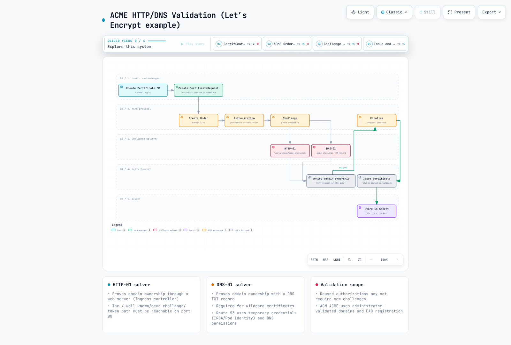

# Certificate Management with cert-manager

> **Last Updated**: September 13, 2026
> **Validation baseline**: cert-manager 1.21.2, cmctl 2.5.0, trust-manager 0.25.0, istio-csr 0.17.0, aws-privateca-issuer 1.9.2, ACK ACM 1.8.1. The official supported/tested Kubernetes range for cert-manager 1.21 is 1.33–1.36.

cert-manager manages certificate issuance and renewal as Kubernetes resources. **CA trust distribution, application reload, revocation, and CRL/OCSP operations remain separate responsibilities.** Examples were checked with local schemas, configuration, and libraries; they are not evidence of external CA issuance or AWS/Kubernetes deployment. A separate ephemeral local Vault 2.1.0 test used a synthetic CA for sixteen issuance/CSR-signing acceptance/rejection cases.

<span id="what-cert-manager-solves"></span>
<span id="project-status"></span>
<span id="why-certificate-lifecycle-automation-matters"></span>
<span id="overview-1"></span>

## Overview

cert-manager joined CNCF on November 10, 2020, became Incubating on September 19, 2022, and **Graduated on September 29, 2024**. Graduation does not guarantee the security or availability of a particular deployment.

| Lifecycle concern | Responsibility |
|---|---|
| Issuance | Issuer authentication, requester approval, SAN/usage/lifetime policy |
| Renewal | Actual issued lifetime, ARI/renewBefore, retries and alerts |
| Key rotation | Secret access, consumer reload, CA rollover order |
| Trust | Which roots/intermediates each namespace/process trusts |
| Revocation | CA revocation procedure and CRL/OCSP publication/consumption |

Do not use the old 1.16.2 installation and compatibility table as current support guidance. Version 1.16 reached EOL in June 2025. Plan upgrades using intermediate release notes and CRD changes.

<span id="component-overview"></span>
<span id="component-responsibilities"></span>
<span id="certificate-issuance-flow"></span>

## Architecture


[View interactive diagram](https://www.atomai.click/kubernetes-docs/archmaps/en-security-10-cert-manager-0.html)

The controller reconciles Certificates and creates CertificateRequests; issuer controllers handle issuance. The webhook validates/defaults/converts custom resources, and cainjector manages CA bundles in supported API/webhook configurations. CA/SelfSigned issuers are not necessarily external services.

<span id="prerequisites"></span>
<span id="installation-with-helm-recommended"></span>
<span id="production-helm-values"></span>
<span id="installation-with-kubectl"></span>
<span id="verify-installation"></span>

## Installation

Check supported Kubernetes versions, Helm/cluster permissions, Gateway API CRDs and a real Gateway controller, and optional Prometheus Operator CRDs. If Gateway API CRDs are installed after controller startup, verify restart/discovery requirements.

```bash
helm repo add jetstack https://charts.jetstack.io
helm repo update jetstack
helm upgrade --install cert-manager jetstack/cert-manager \
  --version v1.21.2 --namespace cert-manager --create-namespace \
  --values cert-manager-values.yaml
kubectl get pods -n cert-manager
cmctl check api
```

```yaml
crds:
  enabled: true
  keep: true
replicaCount: 2
podDisruptionBudget:
  enabled: true
  minAvailable: 1
config:
  apiVersion: controller.config.cert-manager.io/v1alpha1
  kind: ControllerConfiguration
  gatewayAPI:
    enabled: true
prometheus:
  enabled: true
  servicemonitor:
    enabled: true
webhook:
  replicaCount: 2
  timeoutSeconds: 10
  podDisruptionBudget:
    enabled: true
    minAvailable: 1
cainjector:
  replicaCount: 2
  podDisruptionBudget:
    enabled: true
    minAvailable: 1
```

This profile enables ServiceMonitor and Gateway API, so their CRDs/controllers must already exist. Disable those options for a minimal installation without these dependencies. Replicas/PDBs do not replace node/AZ distribution and API connectivity. The current configuration uses config.gatewayAPI.enabled; the older enableGatewayAPI field remains accepted but deprecated in the 1.21.2 decoder.

Check CRD retention and actual uninstall ownership. Deleting a CRD can delete its custom resources; it is not a routine upgrade troubleshooting step.

<span id="custom-resource-definitions-crds"></span>
<span id="certificate-resource"></span>
<span id="issuer-vs-clusterissuer"></span>
<span id="certificaterequest-resource"></span>

## Core Concepts


[View interactive diagram](https://www.atomai.click/kubernetes-docs/archmaps/en-security-10-cert-manager-1.html)

| Resource | Scope and purpose |
|---|---|
| Certificate | Desired certificate and output Secret within a namespace |
| Issuer | Issuance configuration referenced within its namespace |
| ClusterIssuer | Issuance configuration referenced across namespaces |
| CertificateRequest | CSR, issuerRef, and approval/denial status |
| Order/Challenge | Ordering/validation resources used by the ACME path |

ClusterIssuer credential/CA Secrets live in the controller’s cluster-resource namespace, defaulting to cert-manager. Issuer Secrets live in the Issuer namespace. Permission to create a Certificate does not itself constrain SANs or issuerRef.

### Certificate and renewal

```yaml
apiVersion: cert-manager.io/v1
kind: Certificate
metadata:
  name: app-tls
  namespace: demo-app
spec:
  secretName: app-tls
  dnsNames: [app.example.com]
  duration: 2160h
  renewBeforePercentage: 33
  privateKey:
    algorithm: ECDSA
    size: 256
    encoding: PKCS8
    rotationPolicy: Always
  usages: [server auth]
  issuerRef:
    name: lab-ca
    kind: ClusterIssuer
    group: cert-manager.io
```

Requested duration can differ from what the CA issues. Default renewal occurs **two-thirds through the actual X.509 lifetime**, not a fixed 15/30 days before expiry. renewBeforePercentage derives the buffer from actual lifetime. Choose renewBefore or percentage, not both; duration is at least 1 hour and the effective renewal buffer must be at least 5 minutes and shorter than duration.

Version 1.21.2 renewal policy/windows and supported ARI paths can affect timing. renewal.policy:Disabled disables automatic renewal. Inspect status.renewalTime, actual notBefore/notAfter, and failure alerts. Since 1.18, privateKey.rotationPolicy defaults to Always. Updating a key/certificate Secret does not guarantee an application reload.

### CertificateRequest and private keys

Direct requests require a real PEM CSR; do not apply truncated base64 examples. cmctl create certificaterequest **creates a request in a cluster** and is not an offline validation command. Restrict cmctl approve/deny permissions separately. This audit used the cert-manager PKI library to generate and verify a synthetic local key/CSR only.

<span id="selfsigned-issuer-development-testing"></span>
<span id="ca-issuer-internal-pki"></span>
<span id="acme-let-s-encrypt"></span>
<span id="acme-challenge-types"></span>
<span id="http-01-solver"></span>
<span id="dns-01-solver-with-route53-and-irsa"></span>
<span id="aws-private-ca-issuer"></span>
<span id="hashicorp-vault-pki"></span>

## Issuer Types

### SelfSigned and CA bootstrap

The [complete bootstrap example](https://github.com/Atom-oh/kubernetes-docs/blob/main/examples/security/cert-manager/bootstrap.yaml) creates a dedicated lab root and leaf. The root explicitly uses renewal Disabled and key rotation Never to avoid **unplanned trust-anchor replacement**. Production root custody, offline CAs, intermediate separation, auditing, and revocation need separate design.

```yaml
apiVersion: v1
kind: Namespace
metadata:
  name: cert-manager
  labels:
    trust-bundle: enabled
---
apiVersion: v1
kind: Namespace
metadata:
  name: demo-app
  labels:
    trust-bundle: enabled
    cert-manager-http01: enabled
---
apiVersion: cert-manager.io/v1
kind: Issuer
metadata:
  name: bootstrap
  namespace: cert-manager
spec:
  selfSigned: {}
---
apiVersion: cert-manager.io/v1
kind: Certificate
metadata:
  name: lab-root
  namespace: cert-manager
spec:
  secretName: lab-root
  isCA: true
  commonName: Documentation Lab Root
  subject:
    organizations: [Documentation Lab]
  duration: 8760h
  renewal:
    policy: Disabled
  privateKey:
    algorithm: ECDSA
    size: 256
    encoding: PKCS8
    rotationPolicy: Never
  usages: [cert sign, crl sign]
  issuerRef:
    name: bootstrap
    kind: Issuer
    group: cert-manager.io
---
apiVersion: cert-manager.io/v1
kind: ClusterIssuer
metadata:
  name: lab-ca
spec:
  ca:
    secretName: lab-root
---
apiVersion: cert-manager.io/v1
kind: Certificate
metadata:
  name: app-tls
  namespace: demo-app
spec:
  secretName: app-tls
  dnsNames: [app.example.com]
  duration: 2160h
  renewBeforePercentage: 33
  privateKey:
    algorithm: ECDSA
    size: 256
    encoding: PKCS8
    rotationPolicy: Always
  usages: [server auth]
  issuerRef:
    name: lab-ca
    kind: ClusterIssuer
    group: cert-manager.io
```

The CA issuer uses a Secret containing a CA certificate/private key. Replacing that Secret does not immediately reissue every leaf or update every client trust store. CA issuers can include CRL/OCSP URLs but do not generate or maintain CRLs/OCSP responses. Enforce policy preventing leaves from outliving their CA.

### ACME: HTTP-01 and DNS-01



[View interactive diagram](https://www.atomai.click/kubernetes-docs/archmaps/en-security-10-cert-manager-2.html)

HTTP-01 needs access to the hostname on port 80 and does not support wildcards. DNS-01 uses DNS TXT permissions for wildcard validation. Reused authorizations and ACM’s prevalidation flow mean a new challenge is not necessarily created for every request.

Do not recommend the community ingress-nginx, whose maintenance ended in March 2026, as a new-installation default. The [HTTP-01 Gateway example](https://github.com/Atom-oh/kubernetes-docs/blob/main/examples/security/cert-manager/public-staging.yaml) assumes an installed Envoy Gateway and its envoy-gateway GatewayClass. Verify the actual class and align the solver namespace’s cert-manager-http01:enabled label with allowedRoutes. Gateway certificate shimming does not install a Gateway controller or implement its TLS reload.

The [Route53 issuer](https://github.com/Atom-oh/kubernetes-docs/blob/main/examples/security/cert-manager/route53-issuer.yaml) and [IAM policy](https://github.com/Atom-oh/kubernetes-docs/blob/main/examples/security/cert-manager/route53-policy.json) specify a hostedZoneID and limit changes to challenge TXT names. Specifying the zone avoids requiring global ListHostedZonesByName access. Verify controller credentials through IRSA or supported Pod Identity and any cross-account role chain. Namespace selection and dnsZones are not substitutes for IAM authorization.

```yaml
apiVersion: cert-manager.io/v1
kind: ClusterIssuer
metadata:
  name: public-dns01
spec:
  acme:
    server: https://acme-staging-v02.api.letsencrypt.org/directory
    email: pki-admin@example.com
    privateKeySecretRef:
      name: public-dns01-account
    solvers:
      - selector:
          dnsZones: [example.com]
        dns01:
          route53:
            region: ap-northeast-2
            hostedZoneID: Z1234567890ABC
```

Let’s Encrypt staging has rate limits and roots that production browsers do not trust. ACME accounts are environment-specific. Expiration notification emails ended in 2025; the email field does not replace expiry monitoring. Follow Retry-After and the relevant refill policy for 429 responses, rather than always retrying after one hour. ARI renewals and new issuance have different rate-limit treatment.

### AWS Private CA

The external aws-privateca-issuer controller needs CA-ARN-scoped issuance/read permissions and an EKS workload identity. The documented actions are acm-pca:DescribeCertificateAuthority, acm-pca:GetCertificate, and acm-pca:IssueCertificate; restrict their Resource to the intended CA ARN. Replace the actual CA ARN in the [example](https://github.com/Atom-oh/kubernetes-docs/blob/main/examples/security/cert-manager/pca-issuer.yaml) and validate CA mode, template, algorithm, usages, and requested lifetime. Check short-lived-CA limits and pricing separately. Do not bypass approval checks with disableApprovedCheck.

```bash
helm repo add awspca https://cert-manager.github.io/aws-privateca-issuer
helm upgrade --install aws-pca-issuer awspca/aws-privateca-issuer \
  --version v1.9.2 --namespace cert-manager
```

### Vault PKI

The [Issuer/token RBAC example](https://github.com/Atom-oh/kubernetes-docs/blob/main/examples/security/cert-manager/vault-issuer.yaml) limits token creation to demo-app/vault-issuer. Supply the Vault server’s TLS CA Secret separately. The [PKI role/policy script](https://github.com/Atom-oh/kubernetes-docs/blob/main/examples/security/cert-manager/vault-setup.sh) assumes existing PKI/Kubernetes-auth mounts, an approved Vault identity, and configured TokenReview access.

Limit SANs in the Vault role and bind audience vault://demo-app/vault-pki to this Issuer. Reviewer JWTs, Kubernetes API audiences, and OIDC access depend on where Vault runs. Do not bypass connectivity problems with tls-skip-verify or a broad default Vault policy.

<span id="tls-termination-comparison"></span>
<span id="alb-ingress-with-acm-vs-cert-manager"></span>
<span id="nlb-with-tls-termination-at-ingress-controller"></span>
<span id="gateway-api-integration"></span>

The DNS role explicitly sets allow_ip_sans=false and allow_localhost=false. allowed_domains does not constrain IP SANs, and localhost has a separate permissive default. A vault write POST resets omitted role fields to defaults; read back the complete role and test allowed DNS and rejected IP/localhost requests after applying it.

## EKS Integration Patterns

| Path | TLS termination and key location |
|---|---|
| ALB/NLB TLS listener with ACM | AWS load balancer uses an ACM ARN |
| NLB TCP with Gateway/Pod | Backend terminates TLS using a Kubernetes Secret |
| Gateway HTTPS listener | Gateway controller references a same-namespace TLS Secret |
| ACM exportable public certificate | Explicitly exported key/certificate used by customer-managed workloads |

ALB does not directly read a cert-manager Kubernetes Secret as a listener certificate; import/export and an ACM ARN relationship are separate steps. The [ALB example](https://github.com/Atom-oh/kubernetes-docs/blob/main/examples/security/cert-manager/alb-acm-ingress.yaml) requires a real ACM ARN and backend Service. The [NLB TCP example](https://github.com/Atom-oh/kubernetes-docs/blob/main/examples/security/cert-manager/nlb-tcp-service.yaml) passes TLS to backend port 8443, which must actually serve TLS.

```yaml
apiVersion: gateway.networking.k8s.io/v1
kind: Gateway
metadata:
  name: app-gateway
  namespace: demo-app
  annotations:
    cert-manager.io/cluster-issuer: lab-ca
spec:
  gatewayClassName: envoy-gateway
  listeners:
    - name: https
      hostname: app.example.com
      protocol: HTTPS
      port: 443
      tls:
        mode: Terminate
        certificateRefs:
          - group: ""
            kind: Secret
            name: app-gateway-tls
      allowedRoutes:
        namespaces:
          from: Same
---
apiVersion: gateway.networking.k8s.io/v1
kind: HTTPRoute
metadata:
  name: app
  namespace: demo-app
spec:
  parentRefs:
    - name: app-gateway
  hostnames: [app.example.com]
  rules:
    - backendRefs:
        - name: app
          port: 8080
```

This Gateway uses lab-ca, which ordinary browsers do not trust. Real public issuance needs an approved issuer/domain-validation path and controller. Verify GatewayClass names and certificateRefs scope/type; avoid having two controllers own the same Secret.

<span id="july-2026-update-acm-now-supports-the-acme-protocol"></span>
<span id="supported-certificate-types"></span>
<span id="applicable-scenarios"></span>
<span id="example-defining-a-certificate-via-ack"></span>
<span id="comparison-with-cert-manager"></span>

<span id="aws-native-alternative-acm--ack"></span>

## AWS-Native Alternative: ACM + ACK

### ACM RequestCertificate and ACK export

ACK ACM is itself an installed, operated open-source controller. The 1.8.1 [example](https://github.com/Atom-oh/kubernetes-docs/blob/main/examples/security/cert-manager/ack-acm.yaml) explicitly configures options.export:ENABLED, exportTo, and the output Secret. Defining an issuance request alone does not create a TLS Secret. The current CRD has no validationMethod field; do not copy that field from old examples.

```yaml
apiVersion: v1
kind: Secret
metadata:
  name: exported-public-tls
  namespace: demo-app
type: kubernetes.io/tls
data:
  tls.crt: ""
  tls.key: ""
---
apiVersion: acm.services.k8s.aws/v1alpha1
kind: Certificate
metadata:
  name: exportable-public-tls
  namespace: demo-app
spec:
  domainName: app.example.com
  keyAlgorithm: RSA_2048
  options:
    export: ENABLED
  exportTo:
    namespace: demo-app
    name: exported-public-tls
    key: tls.crt
```

Domain validation is separate. Route53 ACK can manage the CNAME provided by ACM, but installing the ACM controller does not validate every DNS provider automatically. Evaluate exportable-certificate pricing, controller IAM/RBAC/namespace boundaries, and private-key Secret access. Private-CA/SPIFFE mTLS identity needs its own issuer/trust design.

### ACM ACME: EAB and prevalidated domains

Announced on July 6, 2026, ACM ACME issues 45-day public certificates. A PKI administrator prepares an endpoint/domain validation and EAB credentials associated with an IAM role, then registers clients. **Changing only the server URL is insufficient.** Store the HMAC key securely and provide the acm-eab Secret/hmac entry in cert-manager’s cluster-resource namespace.

```yaml
apiVersion: cert-manager.io/v1
kind: ClusterIssuer
metadata:
  name: acm-acme
spec:
  acme:
    server: https://acm-acme-enroll.ap-northeast-2.api.aws/REPLACE_ENDPOINT_ID/directory
    email: pki-admin@example.com
    privateKeySecretRef:
      name: acm-acme-account
    externalAccountBinding:
      keyID: REPLACE_EAB_KEY_ID
      keySecretRef:
        name: acm-eab
        key: hmac
```

The Secret value referenced by externalAccountBinding must contain the base64url-encoded HMAC key; Kubernetes Secret data encoding is a separate layer. Preserve an already encoded provider value rather than encoding it twice. See the [ACME EAB configuration](https://cert-manager.io/docs/configuration/acme/).

Endpoint ID and EAB keyID are placeholders. Domains must be prevalidated at the endpoint. The ACME client generates/holds the private key and manages renewal. An ARN appearing in ACM inventory does not make this certificate directly usable with managed ALB/CloudFront/API Gateway integrations. ExportCertificate, RenewCertificate, and RevokeCertificate do not apply to this issuance path; the ACME client owns its lifecycle. Distinguish RequestCertificate for AWS-integrated services.

<span id="istio-with-istio-csr"></span>
<span id="installing-istio-csr"></span>
<span id="configuring-istio-to-use-istio-csr"></span>
<span id="linkerd-trust-anchor-management"></span>

## Service Mesh Integration


[View interactive diagram](https://www.atomai.click/kubernetes-docs/archmaps/en-security-10-cert-manager-3.html)

### Istio and istio-csr

In the sidecar flow, istio-agent creates the CSR and istio-csr submits a CertificateRequest. The agent delivers key/certificate material to Envoy through SDS; workload proxies establish mTLS. The application hop within the same Pod is not automatically mTLS.

The [istio-csr values](https://github.com/Atom-oh/kubernetes-docs/blob/main/examples/security/cert-manager/istio-csr-values.yaml) configure an actual ConfigMap volume/mount for rootCAFile. Create the application-trust bundle in cert-manager and wait for issuer readiness first. A file path alone or an empty PEM in meshConfig is insufficient. Use the current Istio Helm/istioctl external-CA settings; do not mix the istio-csr path with Kubernetes CSR RA mode. Assess Ambient support separately.

```bash
helm upgrade --install cert-manager-istio-csr jetstack/cert-manager-istio-csr \
  --version v0.17.0 --namespace cert-manager --values istio-csr-values.yaml
```

### Linkerd and trust-manager

The [Linkerd identity example](https://github.com/Atom-oh/kubernetes-docs/blob/main/examples/security/cert-manager/linkerd-identity.yaml) prepares the issuer Secret and root-bundle ConfigMap. Pinned control-plane chart 2026.9.1 references linkerd-identity-issuer and linkerd-identity-trust-roots.

```yaml
identity:
  externalCA: true
  issuer:
    scheme: kubernetes.io/tls
```

This connects the control plane to an externally renewed issuer Secret, rather than copying a key once during installation. Root rollover requires overlap of old/new roots, workload renewal, and trust reload. The example lab root is manually managed with automatic renewal disabled.

<span id="installing-trust-manager"></span>
<span id="bundle-resource"></span>
<span id="using-trust-bundles-in-applications"></span>

## trust-manager

The default trust-manager 0.25.0 chart renders trust.cert-manager.io/v1alpha1 Bundle. An additional CRD in the repository does not by itself change the default installed API. Source Secrets/ConfigMaps are read from the configured trust namespace.

```yaml
apiVersion: trust.cert-manager.io/v1alpha1
kind: Bundle
metadata:
  name: application-trust
spec:
  sources:
    - secret:
        name: lab-root
        key: tls.crt
  target:
    configMap:
      key: ca-bundle.pem
    namespaceSelector:
      matchLabels:
        trust-bundle: enabled
```

The inline PEM field is inLine, not inlineString. Minimize public/private trust roots and explicitly select destination namespaces. Secret targets require separate enablement/RBAC; the example uses ConfigMaps. A trust bundle distributes trust anchors, not private keys.

The [consumer Deployment](https://github.com/Atom-oh/kubernetes-docs/blob/main/examples/security/cert-manager/trust-consumer.yaml) mounts a directory. ConfigMap changes are not propagated through a subPath file mount. Even directory projection does not reload a process’s cached TLS context; test whether the application actually uses SSL_CERT_FILE or its configured trust store.

<span id="prometheus-metrics"></span>
<span id="key-metrics"></span>
<span id="prometheusrule-for-alerting"></span>
<span id="certificate-readiness-check"></span>
<span id="common-errors-and-solutions"></span>
<span id="cmctl-cli-tool"></span>

## Monitoring and Troubleshooting

Inspect selectors and port/targetPort values in the installed chart’s ServiceMonitor. The 1.21.2 profile targets http-metrics for controller/cainjector/webhook. Do not invent a tcp-prometheus-servicemonitor port name.

```yaml
groups:
  - name: cert-manager
    rules:
      - alert: CertificateNotReady
        expr: certmanager_certificate_ready_status{condition="True"} == 0
        for: 10m
        labels:
          severity: critical
      - alert: CertificateExpiringSoon
        expr: (certmanager_certificate_expiration_timestamp_seconds - time() < 604800) and (certmanager_certificate_expiration_timestamp_seconds - time() > 86400)
        for: 30m
        labels:
          severity: warning
      - alert: CertificateExpiryCritical
        expr: (certmanager_certificate_expiration_timestamp_seconds - time() <= 86400) and (certmanager_certificate_expiration_timestamp_seconds - time() > 0)
        for: 10m
        labels:
          severity: critical
      - alert: CertificateExpired
        expr: (certmanager_certificate_expiration_timestamp_seconds > 0) and (certmanager_certificate_expiration_timestamp_seconds <= time())
        for: 5m
        labels:
          severity: critical
```

Readiness metrics include True/False/Unknown series; an unfiltered ==0 can fire on healthy certificates. These rules passed 5 cases / 20 assertions covering healthy, NotReady, warning expiry, critical expiry, and expired certificates. Scrape/metric absence needs separate alerts.

```bash
kubectl get certificates,certificaterequests -A
kubectl get orders,challenges -A
kubectl describe certificate app-tls -n demo-app
cmctl status certificate app-tls -n demo-app
# These change resources; check permissions and impact first.
cmctl renew app-tls -n demo-app
```

Selecting recursive DNS resolvers is not increasing propagation wait time. Inspect split-horizon DNS, CAA, TXT authorization, CNAMEs, HTTP paths, and Challenge reasons. Investigate webhook connectivity/authentication/routing before adjusting chart timeoutSeconds (1–30 seconds); there is no generic webhook-timeout flag to apply blindly.

<span id="renewal-buffer-configuration"></span>
<span id="backup-ca-strategy"></span>
<span id="multi-tenant-issuer-strategy"></span>
<span id="rbac-configuration"></span>
<span id="private-key-rotation"></span>

## Best Practices

- The [namespace Role](https://github.com/Atom-oh/kubernetes-docs/blob/main/examples/security/cert-manager/certificate-requester-rbac.yaml) manages Certificates without granting developers cluster-wide Secret reads. SAN/issuerRef/secretName restrictions require separate admission/approval policy.
- Separate CertificateRequest approval from CA credential access. Check default approval-controller behavior and configure issuance policy such as approver-policy where required.
- CA-key backups require encryption, access control, and restore tests; do not dump plaintext Secret YAML into ordinary directories. Base64 is not encryption.
- A private CA is not an automatic fallback for a public CA: validate client trust, names, usages, key access, and recovery time.
- secretTemplate annotations/labels are metadata; they do not activate external-secret synchronization by themselves.
- Test renewal, CA rollover, consumer reload, and revocation separately. Schema/Helm success does not prove successful issuance.

<span id="table-of-contents"></span>
<span id="key-concepts-summary"></span>
<span id="issuer-selection-guide"></span>
<span id="official-references"></span>
<span id="version-compatibility-matrix"></span>

## Summary and References

Local checks include pinned Helm/CRD schemas, controller-config decoding, 6 renewal cases, real CSR generation/signature checking, 5 Prometheus cases / 20 assertions, 24 diagram browser cases, and sixteen synthetic issuance/CSR-signing cases in ephemeral local Vault. No external CA/ACME issuance, AWS resource creation, deployed Vault login, mesh installation, or runtime mTLS was executed.

- [cert-manager releases](https://cert-manager.io/docs/releases/)
- [CNCF project history](https://www.cncf.io/projects/cert-manager/)
- [Certificate renewal and rotation](https://cert-manager.io/docs/usage/certificate/)
- [CA issuer limitations](https://cert-manager.io/docs/configuration/ca/)
- [Vault issuer](https://cert-manager.io/docs/configuration/vault/)
- [Gateway API issuer integration](https://cert-manager.io/docs/usage/gateway/)
- [trust-manager](https://cert-manager.io/docs/trust/trust-manager/)
- [istio-csr](https://cert-manager.io/docs/usage/istio-csr/)
- [Linkerd automatic certificate rotation](https://linkerd.io/2-edge/tasks/automatically-rotating-control-plane-tls-credentials/)
- [ACM Kubernetes export](https://docs.aws.amazon.com/acm/latest/userguide/exportable-certificates-kubernetes.html)
- [ACM ACME](https://docs.aws.amazon.com/acm/latest/userguide/acm-acme.html)
- [ACM ACME launch](https://aws.amazon.com/about-aws/whats-new/2026/07/aws-certificate-manager-acme/)
- [AWS Private CA issuer](https://github.com/cert-manager/aws-privateca-issuer/tree/v1.9.2)
- [Let’s Encrypt rate limits](https://letsencrypt.org/docs/rate-limits/)
- [Staging environment](https://letsencrypt.org/docs/staging-environment/)
- [Expiration emails retired](https://letsencrypt.org/2025/01/22/ending-expiration-emails/)
- [Ingress NGINX retirement](https://kubernetes.io/blog/2025/11/11/ingress-nginx-retirement/)
