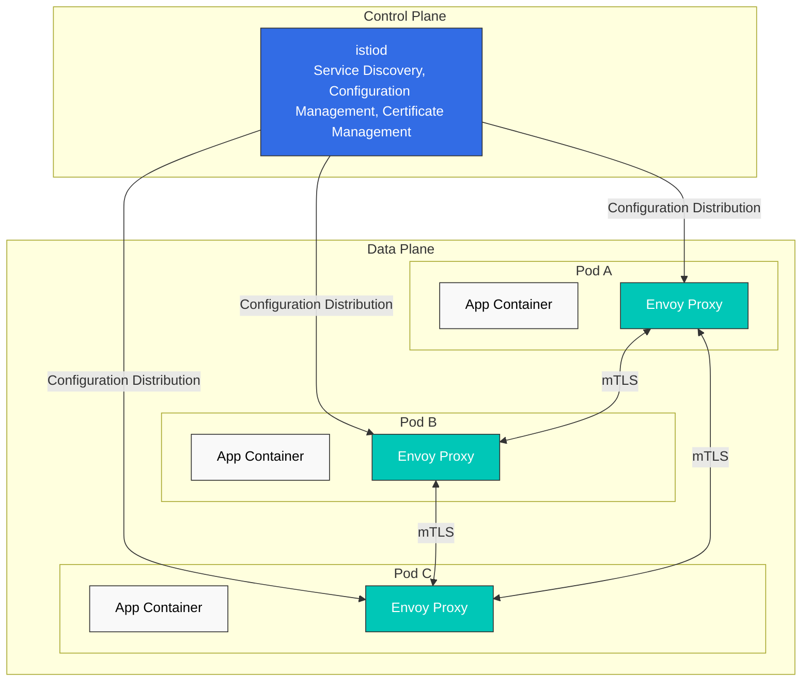

# Istio

> **Supported Versions**: Istio 1.28.0
> **EKS Version**: 1.34 (Kubernetes 1.28+)
> **Last Updated**: February 23, 2026

## Table of Contents

- [Introduction](#introduction)
- [Key Features](#key-features)
- [Architecture Overview](#architecture-overview)
- [Detailed Documentation](#detailed-documentation)
- [Quick Start](#quick-start)
- [Learning Resources](#learning-resources)

## Introduction

Istio is an open-source service mesh platform for microservices applications. A service mesh is an infrastructure layer that handles service-to-service communication, allowing you to control and observe communication between services without modifying application code.

### What is a Service Mesh?

A service mesh provides the following core capabilities:

1. **Traffic Management**: Control traffic flow between services
2. **Security**: Encryption and authentication of service-to-service communication
3. **Observability**: Visibility into service-to-service communication

### Key Benefits of Istio

- **Platform Independence**: Works in various environments (Kubernetes, VM, etc.)
- **Transparent Integration**: Can be applied without application code changes
- **Automatic mTLS**: Automatic encryption of service-to-service communication
- **Advanced Traffic Management**: Routing, load balancing, fault injection, etc.
- **Detailed Metrics**: Detailed metrics on service-to-service communication
- **Policy Enforcement**: Access control and rate limiting

## Key Features

### 1. Traffic Management

Istio provides powerful traffic management capabilities:

- **Gateway**: Route external traffic to the mesh
- **VirtualService**: Define routing rules between services
- **DestinationRule**: Configure load balancing and connection pools
- **Traffic Splitting**: Support for Canary deployments and A/B testing
- **Argo Rollouts Integration**: Automated progressive delivery

### 2. Security

Comprehensive security features:

- **mTLS**: Automatic encryption between services
- **Authorization Policy**: Fine-grained access control
- **Request Authentication**: JWT-based authentication
- **Peer Authentication**: Service-to-service authentication policies

### 3. Observability

Complete visibility into the service mesh:

- **Metrics**: Prometheus integration
- **Distributed Tracing**: Jaeger/Zipkin support
- **Logging**: Access logs and structured logging
- **Visualization**: Kiali dashboard

### 4. Resilience

Service resilience patterns:

- **Circuit Breaker**: Overload prevention
- **Retry**: Automatic retries
- **Timeout**: Request timeout configuration
- **Outlier Detection**: Exclude unhealthy instances
- **Rate Limiting**: Request rate limiting

## Architecture Overview

Istio consists of a **Control Plane** and a **Data Plane**.



### Control Plane (istiod)

istiod is the central control component of Istio, providing:

- **Service Discovery**: Maintains the mesh's service registry
- **Configuration Management**: Stores and distributes Istio configuration
- **Certificate Management**: Generates and rotates certificates for mTLS

### Data Plane (Envoy Proxy)

Envoy is a high-performance proxy deployed as a sidecar in each pod:

- **Traffic Routing**: Controls traffic between services
- **Load Balancing**: Distributes traffic across service instances
- **Security**: mTLS encryption and authentication
- **Observability**: Collects metrics, logs, and traces

## Detailed Documentation

Detailed guides for all Istio features.

### 📚 Basic Documentation

| Document | Description |
|----------|-------------|
| [Installation Guide](istio/01-installation.md) | Istio installation and initial setup |
| [Core Concepts](istio/02-basic-concepts.md) | Basic concepts and terminology of Istio |
| [Components](istio/03-architecture.md) | Istio architecture and components |

### 🚦 Traffic Management

| Document | Description |
|----------|-------------|
| [Gateway & VirtualService](istio/traffic-management/01-gateway-virtualservice.md) | Ingress/Egress Gateway configuration |
| [Routing](istio/traffic-management/02-routing.md) | VirtualService routing rules |
| [DestinationRule](istio/traffic-management/03-destination-rule.md) | Service traffic policies |
| [Traffic Splitting](istio/traffic-management/04-traffic-splitting.md) | Canary deployment and A/B testing |
| [Timeout and Retry](istio/traffic-management/05-retry-timeout.md) | Timeout and retry policies |
| [Load Balancing](istio/traffic-management/06-load-balancing.md) | Various load balancing strategies |
| [Circuit Breaker](istio/traffic-management/07-circuit-breaker.md) | Circuit breaker pattern implementation |
| [Fault Injection](istio/traffic-management/08-fault-injection.md) | Chaos engineering |
| [Traffic Mirroring](istio/traffic-management/09-traffic-mirror.md) | Traffic mirroring and shadow testing |
| [Session Affinity](istio/traffic-management/10-session-affinity.md) | Session affinity configuration |

### 🔐 Security

| Document | Description |
|----------|-------------|
| [mTLS](istio/security/01-mtls.md) | Service-to-service mTLS configuration |
| [Authorization Policy](istio/security/03-authorization.md) | Access control policies |
| [Request Authentication](istio/security/02-authentication.md) | JWT-based authentication |
| [Peer Authentication](istio/security/02-authentication.md) | Service-to-service authentication |

### 📊 Observability

| Document | Description |
|----------|-------------|
| [Metrics](istio/observability/01-metrics.md) | Prometheus metrics collection |
| [Distributed Tracing](istio/observability/02-tracing.md) | Jaeger/Zipkin integration |
| [Logging](istio/observability/03-logging.md) | Access logs and structured logging |
| [Visualization](istio/observability/04-dashboards.md) | Kiali, Grafana dashboards |

### 💪 Resilience

| Document | Description |
|----------|-------------|
| [Outlier Detection](istio/resilience/01-outlier-detection.md) | Unhealthy instance detection |
| [Rate Limiting](istio/resilience/02-rate-limiting.md) | Local and global rate limiting |
| [Zone Aware Routing](istio/resilience/03-zone-aware-routing.md) | Locality-aware routing |

### 🚀 Advanced Topics

| Document | Description |
|----------|-------------|
| [Ambient Mode](istio/advanced/01-ambient-mode.md) | Sidecar-less service mesh |
| [Multi-cluster](istio/advanced/02-multi-cluster.md) | Multi-cluster mesh configuration |
| [EnvoyFilter](istio/advanced/03-envoy-filter.md) | Envoy customization |
| [DNS Caching](istio/advanced/04-dns-cache.md) | Performance improvement with DNS caching |
| [gRPC](istio/advanced/05-grpc.md) | gRPC protocol support |
| [WebSocket](istio/advanced/06-websocket.md) | WebSocket connection support |
| [Sidecar Injection](istio/advanced/07-sidecar-injection.md) | Sidecar injection mechanism |
| [Argo Rollouts](istio/advanced/08-argo-rollouts.md) | Progressive Delivery integration |

### ✅ Best Practices

| Document | Description |
|----------|-------------|
| [Best Practices](istio/best-practices.md) | Production checklist and recommendations |

## Quick Start

### 1. Prerequisites

- Kubernetes cluster (v1.28+)
- kubectl configured
- Administrator privileges

### 2. Install Istio

```bash
# Download Istioctl
curl -L https://istio.io/downloadIstio | sh -
cd istio-1.28.0
export PATH=$PWD/bin:$PATH

# Install with default profile
istioctl install --set profile=default -y

# Enable Sidecar injection on namespace
kubectl label namespace default istio-injection=enabled
```

### 3. Deploy Sample Application

```bash
# Deploy Bookinfo sample application
kubectl apply -f samples/bookinfo/platform/kube/bookinfo.yaml

# Create Gateway
kubectl apply -f samples/bookinfo/networking/bookinfo-gateway.yaml

# Verify installation
kubectl get pods
kubectl get svc istio-ingressgateway -n istio-system
```

### 4. Send Traffic

```bash
# Check Ingress Gateway address
export INGRESS_HOST=$(kubectl get svc istio-ingressgateway -n istio-system -o jsonpath='{.status.loadBalancer.ingress[0].hostname}')
export INGRESS_PORT=$(kubectl get svc istio-ingressgateway -n istio-system -o jsonpath='{.spec.ports[?(@.name=="http2")].port}')
export GATEWAY_URL=$INGRESS_HOST:$INGRESS_PORT

# Access application
curl -s "http://${GATEWAY_URL}/productpage"
```

### 5. Access Observability Tools

```bash
# Kiali dashboard
istioctl dashboard kiali

# Prometheus
istioctl dashboard prometheus

# Grafana
istioctl dashboard grafana

# Jaeger
istioctl dashboard jaeger
```

## Learning Resources

### Official Documentation

- [Istio Official Documentation](https://istio.io/latest/docs/)
- [Istio GitHub Repository](https://github.com/istio/istio)
- [Envoy Proxy Documentation](https://www.envoyproxy.io/docs/envoy/latest/)

### AWS Related

- [AWS EKS Workshop - Istio](https://www.eksworkshop.com/docs/security/servicemesh/)
- [AWS App Mesh vs Istio](https://aws.amazon.com/blogs/containers/choosing-between-aws-app-mesh-and-istio/)

### Community

- [Istio Discuss](https://discuss.istio.io/)
- [Istio Slack](https://istio.slack.com/)
- [CNCF Istio Working Group](https://github.com/cncf/tag-app-delivery)

### Additional Resources

- [Service Mesh Patterns (O'Reilly)](https://www.oreilly.com/library/view/service-mesh-patterns/9781492086444/)
- [Istio in Action (Manning)](https://www.manning.com/books/istio-in-action)
- [Istio Performance Optimization Guide](https://istio.io/latest/docs/ops/deployment/performance-and-scalability/)

## Quiz

To test your understanding of Istio, try the [Istio Quiz](../quizzes/service-mesh/02-istio-quiz.md).

The quiz covers the following topics:

- Service mesh basic concepts
- Istio architecture
- Traffic management (Canary deployment)
- Security (mTLS)
- Gateway and Ingress
- Observability tools
- Latest service mesh trends
- Rate Limiting
- Locality routing
- Amazon EKS integration

---

**Next Steps**: Refer to the [Installation Guide](istio/01-installation.md) to install Istio, and learn basic concepts in [Core Concepts](istio/02-basic-concepts.md).
