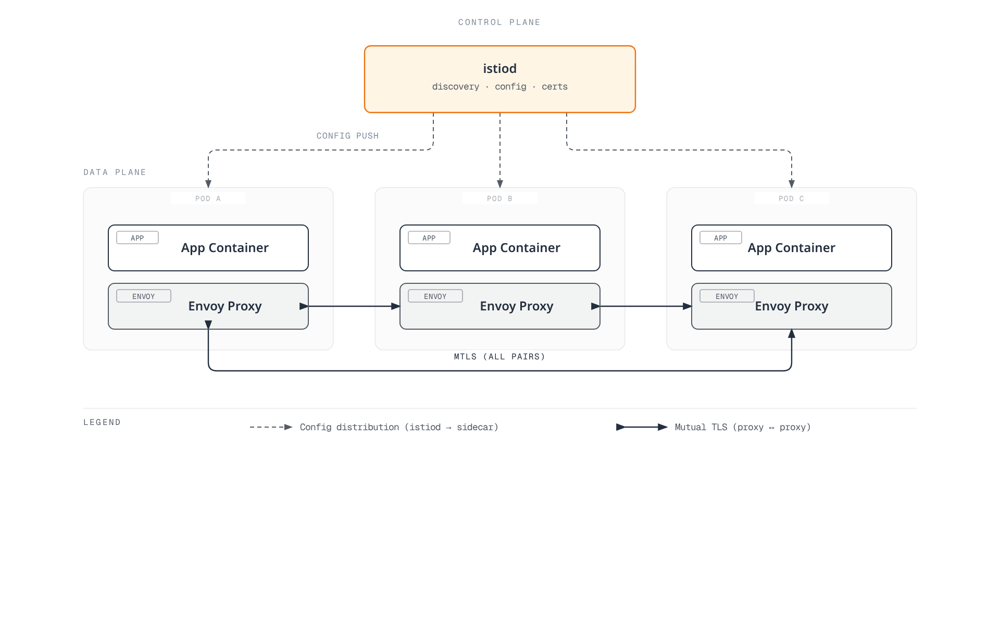

# Istio

> **Reviewed**: September 11, 2026 · Istio 1.31 guidance

This overview keeps the earlier chapter URL usable. The maintained [Istio documentation index](istio/README.md) and [installation guide](istio/01-installation.md) own the detailed procedures and compatibility matrix; use them for current setup.

## Table of Contents

- [Introduction](#introduction)
- [Key Features](#key-features)
- [Architecture Overview](#architecture-overview)
- [Detailed Documentation](#detailed-documentation)
- [Quick Start](#quick-start)
- [Learning Resources](#learning-resources)

## Introduction

Istio is an open-source service mesh platform for microservices applications. A service mesh is an infrastructure layer that handles service-to-service communication, allowing infrastructure-level control and observation of service communication. Application trace-context propagation, graceful shutdown and business idempotency still require application participation.

### What is a Service Mesh?

A service mesh provides the following core capabilities:

1. **Traffic Management**: Control traffic flow between services
2. **Security**: Encryption and authentication of service-to-service communication
3. **Observability**: Visibility into service-to-service communication

### Key Benefits of Istio

- **Platform Independence**: Works in various environments (Kubernetes, VM, etc.)
- **Transparent Integration**: Many network controls can be added without changing application business logic
- **Workload mTLS**: Managed identity and transport protection on enrolled mesh paths; verify enforcement and exceptions
- **Advanced Traffic Management**: Routing, load balancing, fault injection, etc.
- **Detailed Metrics**: Detailed metrics on service-to-service communication
- **Policy Enforcement**: Access control and explicitly configured local/global rate limiting

## Key Features

### 1. Traffic Management

Istio provides powerful traffic management capabilities:

- **Gateways**: Route external traffic; distinguish Istio Gateway resources from Kubernetes Gateway API
- **VirtualService / HTTPRoute**: Configure routing using the API supported by the selected data plane and controller
- **DestinationRule**: Configure load balancing and connection pools
- **Traffic Splitting**: Support for Canary deployments and A/B testing
- **Argo Rollouts Integration**: Progressive delivery with separately configured analysis and failure handling

### 2. Security

Comprehensive security features:

- **mTLS**: Identity authentication and encryption for enrolled workload transport
- **Authorization Policy**: Fine-grained access control
- **Request Authentication**: JWT validation; use AuthorizationPolicy when a JWT must be present
- **Peer Authentication**: Inbound workload mTLS policy

### 3. Observability

Telemetry and backend integrations, configured for the selected mode:

- **Metrics**: Prometheus integration
- **Distributed Tracing**: Configured trace provider/backend, such as OpenTelemetry with Jaeger; applications propagate context
- **Logging**: Access logs and structured logging
- **Visualization**: Kiali dashboard

### 4. Resilience

Service resilience patterns:

- **Circuit Breaker**: Connection/request-pool limits; not a guarantee against overload
- **Retry**: Explicit budgets for retry-safe operations; disable ambiguous write retries
- **Timeout**: Request timeout configuration
- **Outlier Detection**: Exclude unhealthy instances
- **Rate Limiting**: Configured local token buckets or a global rate-limit service

## Architecture Overview

Istio consists of a **Control Plane** and a **Data Plane**. The following diagram shows the sidecar form, not the ambient topology.



[🔍 View interactive diagram](https://www.atomai.click/kubernetes-docs/archmaps/en-service-mesh-02-istio-0.html)

### Control Plane (istiod)

istiod is the central control component of Istio, providing:

- **Service Discovery**: Maintains the mesh's service registry
- **Configuration Management**: Watches configuration, translates it and distributes proxy settings; Kubernetes persists the API resources
- **Certificate Management**: Manages workload certificate requests and rotation with the configured CA

### Data Plane: Sidecar and Ambient

In sidecar mode, Envoy runs alongside each enrolled application Pod:

- **Traffic Routing**: Controls traffic between services
- **Load Balancing**: Distributes traffic across service instances
- **Security**: mTLS encryption and authentication
- **Observability**: Collects metrics, logs, and traces

Ambient uses node-level ztunnel for L4 transport and optional Envoy waypoints for supported L7 features. It does not inject an Envoy into every application Pod. Feature support, policy attachment and resource usage differ by mode; neither a fixed resource-saving percentage nor universal performance superiority follows from this topology. See [Ambient Mode](istio/advanced/01-ambient-mode.md).

## Detailed Documentation

The links below are a learning map into the maintained subtree. Its index includes additional and newly added topics.

### 📚 Basic Documentation

| Document | Description |
|----------|-------------|
| [Installation Guide](istio/01-installation.md) | Istio installation and initial setup |
| [Core Concepts](istio/02-basic-concepts.md) | Basic concepts and terminology of Istio |
| [Components](istio/03-architecture.md) | Istio architecture and components |

### 🚦 Traffic Management

| Document | Description |
|----------|-------------|
| [Gateway & VirtualService](istio/traffic-management/01-gateway-virtualservice.md) | Ingress/Egress Gateway configuration |
| [Routing](istio/traffic-management/02-routing.md) | VirtualService routing rules |
| [DestinationRule](istio/traffic-management/03-destination-rule.md) | Service traffic policies |
| [Traffic Splitting](istio/traffic-management/04-traffic-splitting.md) | Canary deployment and A/B testing |
| [Timeout and Retry](istio/traffic-management/05-retry-timeout.md) | Timeout and retry policies |
| [Load Balancing](istio/traffic-management/06-load-balancing.md) | Various load balancing strategies |
| [Circuit Breaker](istio/traffic-management/07-circuit-breaker.md) | Circuit breaker pattern implementation |
| [Fault Injection](istio/traffic-management/08-fault-injection.md) | Chaos engineering |
| [Traffic Mirroring](istio/traffic-management/09-traffic-mirror.md) | Traffic mirroring and shadow testing |
| [Session Affinity](istio/traffic-management/10-session-affinity.md) | Session affinity configuration |

### 🔐 Security

| Document | Description |
|----------|-------------|
| [mTLS](istio/security/01-mtls.md) | Service-to-service mTLS configuration |
| [Authorization Policy](istio/security/03-authorization.md) | Access control policies |
| [Request Authentication](istio/security/02-authentication.md) | JWT-based authentication |
| [Peer Authentication](istio/security/01-mtls.md) | Service-to-service authentication |

### 📊 Observability

| Document | Description |
|----------|-------------|
| [Metrics](istio/observability/01-metrics.md) | Prometheus metrics collection |
| [Distributed Tracing](istio/observability/02-tracing.md) | Jaeger/Zipkin integration |
| [Logging](istio/observability/03-logging.md) | Access logs and structured logging |
| [Visualization](istio/observability/04-dashboards.md) | Kiali, Grafana dashboards |

### 💪 Resilience

| Document | Description |
|----------|-------------|
| [Outlier Detection](istio/resilience/01-outlier-detection.md) | Unhealthy instance detection |
| [Rate Limiting](istio/resilience/02-rate-limiting.md) | Local and global rate limiting |
| [Zone Aware Routing](istio/resilience/03-zone-aware-routing.md) | Locality-aware routing |

### 🚀 Advanced Topics

| Document | Description |
|----------|-------------|
| [Ambient Mode](istio/advanced/01-ambient-mode.md) | Sidecar-less service mesh |
| [Multi-cluster](istio/advanced/02-multi-cluster.md) | Multi-cluster mesh configuration |
| [EnvoyFilter](istio/advanced/03-envoy-filter.md) | Envoy customization |
| [DNS Capture and Caching](istio/advanced/04-dns-cache.md) | DNS capture, resolution and measured cache behavior |
| [gRPC](istio/advanced/05-grpc.md) | gRPC protocol support |
| [WebSocket](istio/advanced/06-websocket.md) | WebSocket connection support |
| [Sidecar Injection](istio/advanced/07-sidecar-injection.md) | Sidecar injection mechanism |
| [Argo Rollouts](istio/advanced/08-argo-rollouts.md) | Progressive Delivery integration |

### ✅ Best Practices

| Document | Description |
|----------|-------------|
| [Best Practices](istio/best-practices.md) | Production checklist and recommendations |

## Quick Start

1. Check the exact Istio/Kubernetes/EKS compatibility intersection in the [installation guide](istio/01-installation.md). A generic “Kubernetes 1.28+” prerequisite is not sufficient for a current Istio release.
2. Choose sidecar or ambient and follow that guide's pinned CLI/chart, isolated namespace and platform prerequisites. Do not download an unspecified latest CLI and then change into an old version directory.
3. Use the matching-version Bookinfo procedure and gateway instructions in the maintained guide. The default profile does not automatically provide an ingress gateway Deployment, and a Gateway configuration object alone does not create every installation's required gateway/LoadBalancer.
4. Verify the actual gateway address, Service port, route status and HTTP response. A load balancer may publish an IP or hostname; do not assume an AWS-only hostname field or a particular port name.
5. Install/configure the chosen [observability backends](istio/observability/README.md) before using dashboard commands. Prometheus, Grafana, Kiali and tracing storage are not automatically installed by the default Istio profile.

Basic verification after completing that procedure:

```bash
istioctl version
istioctl analyze -A
istioctl proxy-status
```

Proxy status is only one diagnostic input. Ambient enrollment and ztunnel need their own checks, and a clean analyzer result is not an end-to-end traffic test.

## Learning Resources

### Official Documentation

- [Istio Official Documentation](https://istio.io/latest/docs/)
- [Istio GitHub Repository](https://github.com/istio/istio)
- [Envoy Proxy Documentation](https://www.envoyproxy.io/docs/envoy/latest/)

### AWS and Community

- [Istio on Amazon EKS](https://istio.io/latest/docs/setup/platform-setup/amazon-eks/)
- [Maintained AWS integration guide](istio/04-aws-integration.md)
- [AWS App Mesh lifecycle notice](https://docs.aws.amazon.com/app-mesh/latest/userguide/what-is-app-mesh.html): AWS states support ends September 30, 2026. Evaluate migration requirements; this is not a new-deployment recommendation.
- [Istio community, channels and working groups](https://istio.io/latest/get-involved/)

### Additional Resources

- [Service Mesh Patterns (O'Reilly)](https://www.oreilly.com/library/view/service-mesh-patterns/9781492086444/)
- [Istio in Action (Manning)](https://www.manning.com/books/istio-in-action)
- [Istio Performance Optimization Guide](https://istio.io/latest/docs/ops/deployment/performance-and-scalability/)

## Quiz

To test your understanding of Istio, try the [Istio Quiz](../quizzes/service-mesh/02-istio-quiz.md).

The quiz covers the following topics:

- Service mesh basic concepts
- Istio architecture
- Traffic management (Canary deployment)
- Security (mTLS)
- Gateway and Ingress
- Observability tools
- Sidecar and ambient modes
- Rate Limiting
- Locality routing
- Amazon EKS integration

---

**Next Steps**: Refer to the [Installation Guide](istio/01-installation.md) to install Istio, and learn basic concepts in [Core Concepts](istio/02-basic-concepts.md).
