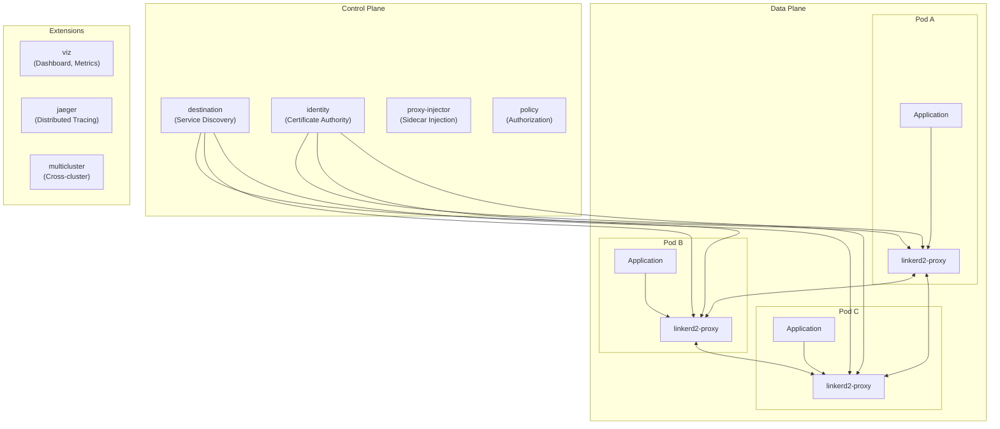
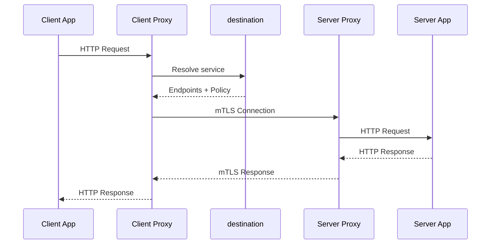
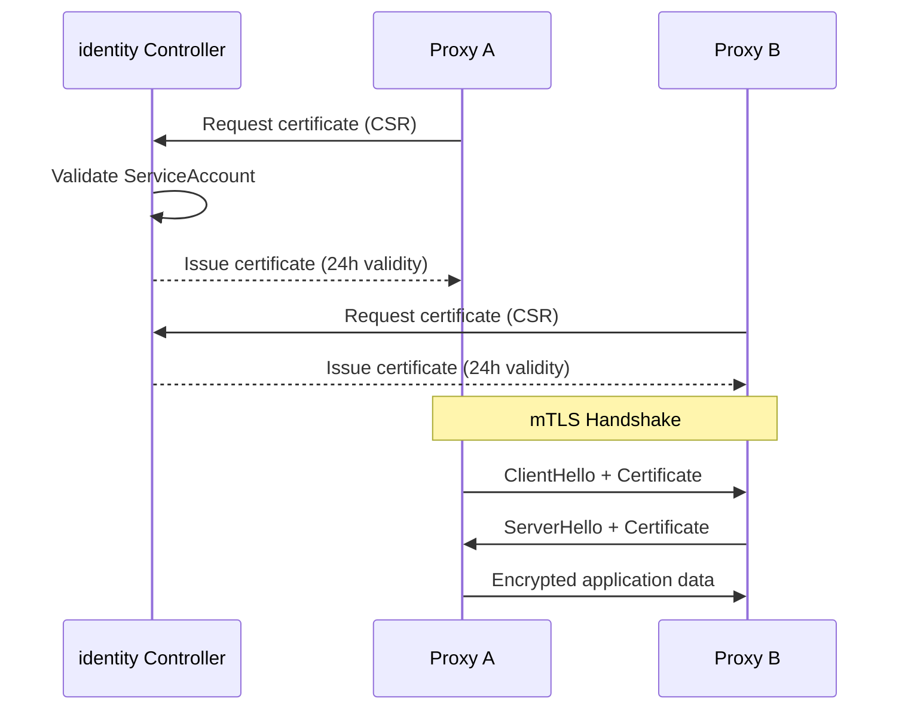
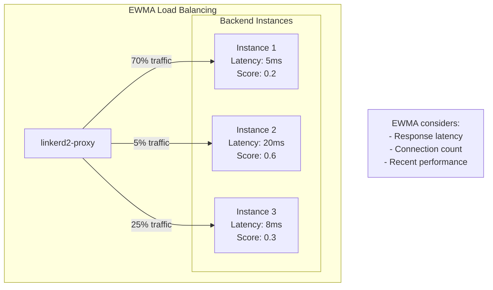
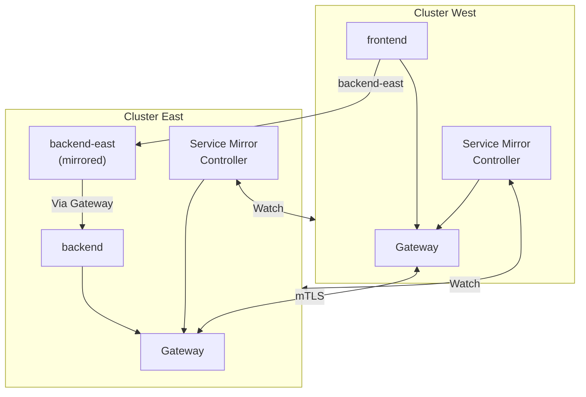

# Linkerd

> **Supported Versions**: Linkerd 2.16+
> **Last Updated**: November 24, 2025

Linkerd is a lightweight service mesh for Kubernetes and a CNCF graduated project. It uses an ultralight proxy written in Rust to provide reliability, security, and observability for service-to-service communication with minimal resource overhead.

## Table of Contents

- [Introduction to Linkerd](#introduction-to-linkerd)
- [Architecture](#architecture)
- [Installation and Initial Setup](#installation-and-initial-setup)
- [Core Features](#core-features)
- [Observability](#observability)
- [Multi-cluster Connectivity](#multi-cluster-connectivity)
- [Comparison with Istio](#comparison-with-istio)
- [Linkerd Deployment Guide for EKS](#linkerd-deployment-guide-for-eks)
- [Best Practices](#best-practices)

## Introduction to Linkerd

### History and Background

Linkerd was created by Buoyant in 2016 and was the first service mesh project to join the CNCF. It achieved **CNCF Graduated** status in 2021, demonstrating its maturity and production readiness. The project has evolved through two major versions:

- **Linkerd 1.x**: Built on the JVM with a Scala-based proxy
- **Linkerd 2.x**: Complete rewrite with a Rust-based micro-proxy, designed specifically for Kubernetes

### Design Philosophy

Linkerd follows three core design principles:

1. **Lightweight**: The Rust-based proxy uses approximately 10MB of memory per pod, significantly less than Envoy-based alternatives
2. **Simple**: Minimal configuration required, with sensible defaults that work out of the box
3. **Secure by Default**: mTLS is enabled automatically without any configuration

### What Problems Does Linkerd Solve?

| Challenge | Linkerd Solution |
|-----------|------------------|
| Service-to-service security | Automatic mTLS for all mesh traffic |
| Observability gaps | Golden metrics, distributed tracing, tap |
| Reliability issues | Retries, timeouts, load balancing |
| Traffic management | Traffic splitting, circuit breaking |
| Debugging difficulties | Real-time traffic inspection with tap |

### Key Differentiators from Istio

| Aspect | Linkerd | Istio |
|--------|---------|-------|
| Proxy | Rust-based linkerd2-proxy (~10MB) | Envoy (~50-100MB) |
| Complexity | Simple, opinionated defaults | Highly configurable |
| mTLS | Enabled by default | Requires configuration |
| Learning curve | Gentle | Steep |
| Resource overhead | Minimal | Higher |
| Protocol support | HTTP/1.1, HTTP/2, gRPC, TCP | More protocols |
| Use case | Kubernetes-focused | Multi-platform |

## Architecture

### Overview

Linkerd follows the standard service mesh architecture with a control plane and data plane separation.



### Control Plane Components

#### destination

The destination controller provides service discovery and configuration to the data plane proxies:

- Watches Kubernetes services and endpoints
- Resolves service names to concrete endpoints
- Provides service profiles (retries, timeouts) to proxies
- Streams endpoint updates to proxies in real-time

#### identity

The identity controller acts as the Certificate Authority (CA) for the mesh:

- Issues TLS certificates to proxies
- Automatically rotates certificates (default: 24 hours)
- Validates workload identity using Kubernetes ServiceAccounts
- Enables zero-trust networking through workload identity

#### proxy-injector

The proxy-injector is a mutating admission webhook that:

- Automatically injects the linkerd2-proxy sidecar into pods
- Adds init container for iptables configuration
- Configures proxy with appropriate settings based on annotations

#### policy (Linkerd 2.13+)

The policy controller enforces authorization policies:

- Validates Server and ServerAuthorization resources
- Pushes policy configurations to proxies
- Enables fine-grained access control

### Data Plane: linkerd2-proxy

The linkerd2-proxy is the heart of Linkerd's data plane:

```
┌─────────────────────────────────────────────────────────────┐
│                     linkerd2-proxy                          │
├─────────────────────────────────────────────────────────────┤
│  Language: Rust                                             │
│  Memory: ~10MB per instance                                 │
│  Latency: Sub-millisecond (p99 < 1ms)                      │
│  CPU: Minimal overhead                                      │
├─────────────────────────────────────────────────────────────┤
│  Features:                                                  │
│  - Transparent TCP proxying                                 │
│  - HTTP/1.1, HTTP/2, gRPC protocol awareness               │
│  - Automatic mTLS                                          │
│  - Load balancing (EWMA, P2C)                              │
│  - Retries and timeouts                                    │
│  - Circuit breaking                                         │
│  - Metrics collection                                       │
└─────────────────────────────────────────────────────────────┘
```

### Traffic Flow



## Installation and Initial Setup

### Prerequisites

Before installing Linkerd, ensure you have:

- Kubernetes cluster version 1.22+
- kubectl configured to access your cluster
- Cluster admin permissions
- Ports 443 and 8443 available for webhooks

### CLI Installation

#### macOS

```bash
# Using Homebrew
brew install linkerd

# Or download directly
curl -fsL https://run.linkerd.io/install | sh
export PATH=$HOME/.linkerd2/bin:$PATH
```

#### Linux

```bash
# Download and install
curl -fsL https://run.linkerd.io/install | sh
export PATH=$HOME/.linkerd2/bin:$PATH

# Add to shell profile
echo 'export PATH=$HOME/.linkerd2/bin:$PATH' >> ~/.bashrc
```

#### Windows (PowerShell)

```powershell
# Download the CLI
Invoke-WebRequest -Uri https://run.linkerd.io/install.ps1 -OutFile install.ps1
.\install.ps1
```

#### Verify CLI Installation

```bash
linkerd version --client

# Expected output:
# Client version: stable-2.16.x
```

### Pre-installation Validation

Before installing Linkerd, validate your cluster:

```bash
# Run pre-installation checks
linkerd check --pre

# Expected output shows all checks passing:
# kubernetes-api
# ---------------
# √ can initialize the client
# √ can query the Kubernetes API
#
# kubernetes-version
# ------------------
# √ is running the minimum Kubernetes API version
```

### Basic Installation

#### Using the CLI

```bash
# Generate and apply CRDs
linkerd install --crds | kubectl apply -f -

# Install control plane
linkerd install | kubectl apply -f -

# Verify installation
linkerd check

# Expected output:
# √ control plane is healthy
# √ control plane is up to date
# √ control plane and cli versions match
```

#### Using Helm

```bash
# Add Linkerd Helm repository
helm repo add linkerd https://helm.linkerd.io
helm repo update

# Install CRDs
helm install linkerd-crds linkerd/linkerd-crds -n linkerd --create-namespace

# Install control plane
helm install linkerd-control-plane linkerd/linkerd-control-plane \
  -n linkerd \
  --set identity.externalCA=false

# Verify installation
linkerd check
```

### High Availability (HA) Mode Configuration

For production deployments, enable HA mode:

```bash
# HA installation with CLI
linkerd install --ha | kubectl apply -f -

# Or with Helm
helm install linkerd-control-plane linkerd/linkerd-control-plane \
  -n linkerd \
  --set controllerReplicas=3 \
  --set enablePodAntiAffinity=true \
  --set enablePodDisruptionBudget=true
```

HA mode configuration details:

```yaml
# HA values for Helm
controllerReplicas: 3
enablePodAntiAffinity: true
enablePodDisruptionBudget: true

# Resource requests for HA
destinationResources:
  cpu:
    request: 100m
  memory:
    limit: 250Mi
    request: 50Mi

identityResources:
  cpu:
    limit: 100m
    request: 10m
  memory:
    limit: 250Mi
    request: 10Mi

proxyInjectorResources:
  cpu:
    limit: 100m
    request: 10m
  memory:
    limit: 250Mi
    request: 10Mi
```

### Installing Extensions

#### Viz Extension (Dashboard and Metrics)

```bash
# Install viz extension
linkerd viz install | kubectl apply -f -

# Verify viz installation
linkerd viz check

# Access the dashboard
linkerd viz dashboard &
```

#### Jaeger Extension (Distributed Tracing)

```bash
# Install Jaeger extension
linkerd jaeger install | kubectl apply -f -

# Verify Jaeger installation
linkerd jaeger check

# Access Jaeger UI
kubectl port-forward -n linkerd-jaeger svc/jaeger 16686:16686 &
```

### Installation Verification

Run comprehensive checks to ensure everything is working:

```bash
# Full installation check
linkerd check

# Expected output sections:
# kubernetes-api
# kubernetes-version
# linkerd-existence
# linkerd-config
# linkerd-identity
# linkerd-webhooks-and-apm-injector
# linkerd-version

# Check control plane pods
kubectl get pods -n linkerd

# Expected output:
# NAME                                     READY   STATUS    RESTARTS   AGE
# linkerd-destination-xxxxx                4/4     Running   0          5m
# linkerd-identity-xxxxx                   2/2     Running   0          5m
# linkerd-proxy-injector-xxxxx             2/2     Running   0          5m
```

## Core Features

### Automatic mTLS

Linkerd provides automatic mutual TLS encryption for all mesh traffic without any configuration.

#### How mTLS Works



#### Verifying mTLS

```bash
# Check if traffic is encrypted
linkerd viz edges deploy

# Expected output shows secured connections:
# SRC          DST          SRC_NS      DST_NS      SECURED
# web          backend      default     default     TRUE
# backend      database     default     default     TRUE

# Detailed mTLS stats
linkerd viz stat deploy -o wide
```

#### Certificate Rotation

Certificates are automatically rotated every 24 hours:

```bash
# View certificate expiration
kubectl get pods -n default -o jsonpath='{.items[*].metadata.name}' | \
  xargs -I {} kubectl exec {} -c linkerd-proxy -- \
  /bin/sh -c 'cat /var/run/linkerd/identity/certificate.crt | openssl x509 -noout -dates'
```

### Traffic Splitting (TrafficSplit CRD)

Traffic splitting enables canary deployments and A/B testing using the SMI TrafficSplit API.

#### Basic Traffic Split

```yaml
apiVersion: split.smi-spec.io/v1alpha2
kind: TrafficSplit
metadata:
  name: backend-split
  namespace: default
spec:
  service: backend
  backends:
  - service: backend-stable
    weight: 900    # 90% of traffic
  - service: backend-canary
    weight: 100    # 10% of traffic
```

#### Gradual Rollout Example

```yaml
# Stage 1: 5% canary
apiVersion: split.smi-spec.io/v1alpha2
kind: TrafficSplit
metadata:
  name: backend-rollout
spec:
  service: backend
  backends:
  - service: backend-v1
    weight: 950
  - service: backend-v2
    weight: 50
---
# Stage 2: 25% canary
apiVersion: split.smi-spec.io/v1alpha2
kind: TrafficSplit
metadata:
  name: backend-rollout
spec:
  service: backend
  backends:
  - service: backend-v1
    weight: 750
  - service: backend-v2
    weight: 250
---
# Stage 3: 100% new version
apiVersion: split.smi-spec.io/v1alpha2
kind: TrafficSplit
metadata:
  name: backend-rollout
spec:
  service: backend
  backends:
  - service: backend-v2
    weight: 1000
```

#### Monitoring Traffic Split

```bash
# Watch traffic distribution
watch linkerd viz stat trafficsplit

# Sample output:
# NAME             APEX      LEAF            WEIGHT   SUCCESS   RPS   P50   P95   P99
# backend-split    backend   backend-stable  900      100.00%   45.2  2ms   5ms   8ms
# backend-split    backend   backend-canary  100       99.50%    5.0  3ms   7ms  12ms
```

### Retries and Timeouts (ServiceProfile)

ServiceProfiles define per-route reliability settings including retries and timeouts.

#### Creating a ServiceProfile

```yaml
apiVersion: linkerd.io/v1alpha2
kind: ServiceProfile
metadata:
  name: backend.default.svc.cluster.local
  namespace: default
spec:
  routes:
  - name: GET /api/products
    condition:
      method: GET
      pathRegex: /api/products
    responseClasses:
    - condition:
        status:
          min: 500
          max: 599
      isFailure: true
    timeout: 500ms
    isRetryable: true

  - name: POST /api/orders
    condition:
      method: POST
      pathRegex: /api/orders
    timeout: 2s
    isRetryable: false  # Don't retry non-idempotent operations

  retryBudget:
    retryRatio: 0.2      # Max 20% additional load from retries
    minRetriesPerSecond: 10
    ttl: 10s
```

#### Auto-generating ServiceProfiles

```bash
# Generate from OpenAPI spec
linkerd profile --open-api swagger.json backend > backend-profile.yaml

# Generate from live traffic (requires tap)
linkerd profile --tap deploy/backend --tap-duration 30s backend

# Apply the profile
kubectl apply -f backend-profile.yaml
```

#### Monitoring Retries

```bash
# View retry statistics
linkerd viz routes deploy/frontend --to deploy/backend

# Sample output:
# ROUTE                   SERVICE   SUCCESS   RPS   LATENCY_P50   LATENCY_P95   LATENCY_P99
# GET /api/products       backend    99.90%   150   3ms           8ms           15ms
# POST /api/orders        backend    99.50%    30   25ms          80ms          150ms
# [DEFAULT]               backend   100.00%    10   1ms           2ms           3ms
```

### Load Balancing (EWMA)

Linkerd uses EWMA (Exponentially Weighted Moving Average) for intelligent load balancing.

#### How EWMA Works



The EWMA algorithm:

1. Tracks response latency for each endpoint
2. Calculates a weighted score favoring recent observations
3. Routes traffic preferentially to faster endpoints
4. Automatically adapts to changing conditions

#### Load Balancing in Action

```bash
# View per-endpoint statistics
linkerd viz stat deploy/backend --to deploy/database

# Detailed endpoint view
linkerd viz endpoints deploy/backend

# Sample output:
# NAMESPACE   NAME        ENDPOINT            WEIGHT   SUCCESS   RPS   P50   P95
# default     backend     10.0.1.5:8080       35.5%    100.00%   35    3ms   5ms
# default     backend     10.0.2.8:8080       42.3%    100.00%   42    2ms   4ms
# default     backend     10.0.3.2:8080       22.2%     99.80%   22    8ms  15ms
```

### Authorization Policies

Linkerd 2.13+ includes Server and ServerAuthorization resources for fine-grained access control.

#### Defining a Server

```yaml
apiVersion: policy.linkerd.io/v1beta2
kind: Server
metadata:
  name: backend-http
  namespace: default
spec:
  podSelector:
    matchLabels:
      app: backend
  port: http
  proxyProtocol: HTTP/2
```

#### Authorization Policy

```yaml
apiVersion: policy.linkerd.io/v1alpha1
kind: AuthorizationPolicy
metadata:
  name: backend-authz
  namespace: default
spec:
  targetRef:
    group: policy.linkerd.io
    kind: Server
    name: backend-http
  requiredAuthenticationRefs:
  - name: all-authenticated
    kind: MeshTLSAuthentication
    group: policy.linkerd.io
---
apiVersion: policy.linkerd.io/v1alpha1
kind: MeshTLSAuthentication
metadata:
  name: all-authenticated
  namespace: default
spec:
  identities:
  - "*.default.serviceaccount.identity.linkerd.cluster.local"
```

#### Restricting Access to Specific Services

```yaml
apiVersion: policy.linkerd.io/v1alpha1
kind: AuthorizationPolicy
metadata:
  name: database-authz
  namespace: default
spec:
  targetRef:
    group: policy.linkerd.io
    kind: Server
    name: database-server
  requiredAuthenticationRefs:
  - name: backend-only
    kind: MeshTLSAuthentication
    group: policy.linkerd.io
---
apiVersion: policy.linkerd.io/v1alpha1
kind: MeshTLSAuthentication
metadata:
  name: backend-only
  namespace: default
spec:
  identities:
  - "backend.default.serviceaccount.identity.linkerd.cluster.local"
```

## Observability

### Viz Dashboard

The viz extension provides a comprehensive web dashboard for monitoring mesh health.

#### Accessing the Dashboard

```bash
# Open dashboard in browser
linkerd viz dashboard &

# Or port-forward manually
kubectl port-forward -n linkerd-viz svc/web 8084:8084 &
# Access at http://localhost:8084
```

#### Dashboard Features

| View | Description |
|------|-------------|
| Overview | Cluster-wide mesh health |
| Namespaces | Per-namespace statistics |
| Deployments | Deployment-level metrics |
| Pods | Individual pod health |
| Grafana | Link to detailed Grafana dashboards |

### Prometheus Integration

Linkerd automatically exposes Prometheus metrics.

#### Built-in Metrics

```bash
# Key metrics exposed by Linkerd
request_total                    # Total request count
response_total                   # Total response count by status code
response_latency_ms_bucket      # Response latency histogram
tcp_open_total                   # TCP connections opened
tcp_close_total                  # TCP connections closed
tcp_connection_duration_ms      # TCP connection duration
```

#### Prometheus Query Examples

```promql
# Request success rate by deployment
sum(rate(response_total{classification="success"}[1m])) by (deployment)
/
sum(rate(response_total[1m])) by (deployment)

# P99 latency by service
histogram_quantile(0.99,
  sum(rate(response_latency_ms_bucket[5m])) by (le, dst_service)
)

# Request rate by route
sum(rate(request_total[1m])) by (rt_route)
```

#### Integrating with External Prometheus

```yaml
# ServiceMonitor for Prometheus Operator
apiVersion: monitoring.coreos.com/v1
kind: ServiceMonitor
metadata:
  name: linkerd-federate
  namespace: monitoring
spec:
  selector:
    matchLabels:
      linkerd.io/control-plane-ns: linkerd
  namespaceSelector:
    matchNames:
    - linkerd-viz
  endpoints:
  - port: admin-http
    interval: 30s
    path: /metrics
```

### Tap and Top Commands

The tap feature provides real-time traffic inspection.

#### Using tap

```bash
# Tap all traffic to a deployment
linkerd viz tap deploy/backend

# Sample output:
# req id=0:0 proxy=in  src=10.0.1.5:52342 dst=10.0.2.8:8080 tls=true :method=GET :path=/api/products
# rsp id=0:0 proxy=in  src=10.0.1.5:52342 dst=10.0.2.8:8080 tls=true :status=200 latency=3ms

# Filter by path
linkerd viz tap deploy/backend --path /api/orders

# Filter by method
linkerd viz tap deploy/backend --method POST

# Filter by response status
linkerd viz tap deploy/backend --to deploy/database | grep ":status=5"
```

#### Using top

```bash
# Real-time traffic summary
linkerd viz top deploy/backend

# Sample output:
# Source                  Destination             Method   Path             Count   Best   Worst   Last  Success Rate
# deploy/frontend         deploy/backend          GET      /api/products      150    2ms    15ms    3ms        100.00%
# deploy/frontend         deploy/backend          POST     /api/orders         30   20ms   150ms   25ms         99.50%

# Top by route
linkerd viz top deploy/backend --routes

# Namespace-wide view
linkerd viz top ns/default
```

### Grafana Dashboards

Linkerd viz includes pre-configured Grafana dashboards.

#### Accessing Grafana

```bash
# Port-forward to Grafana
kubectl port-forward -n linkerd-viz svc/grafana 3000:3000 &
# Access at http://localhost:3000
```

#### Available Dashboards

| Dashboard | Description |
|-----------|-------------|
| Linkerd Health | Control plane health and performance |
| Linkerd Deployment | Per-deployment golden metrics |
| Linkerd Pod | Per-pod statistics |
| Linkerd Route | Per-route latency and success rates |
| Linkerd Authority | Service-level statistics |
| Linkerd Namespace | Namespace-wide view |

#### Custom Dashboard Example

```json
{
  "title": "Linkerd Service Dashboard",
  "panels": [
    {
      "title": "Request Rate",
      "type": "graph",
      "targets": [
        {
          "expr": "sum(rate(request_total{namespace=\"default\"}[1m])) by (deployment)",
          "legendFormat": "{{deployment}}"
        }
      ]
    },
    {
      "title": "Success Rate",
      "type": "gauge",
      "targets": [
        {
          "expr": "sum(rate(response_total{classification=\"success\"}[5m])) / sum(rate(response_total[5m])) * 100"
        }
      ]
    },
    {
      "title": "P99 Latency",
      "type": "graph",
      "targets": [
        {
          "expr": "histogram_quantile(0.99, sum(rate(response_latency_ms_bucket[5m])) by (le, deployment))",
          "legendFormat": "{{deployment}}"
        }
      ]
    }
  ]
}
```

## Multi-cluster Connectivity

Linkerd supports connecting services across multiple Kubernetes clusters.

### Architecture Overview



### Installing Multi-cluster Extension

#### On Each Cluster

```bash
# Install multi-cluster extension
linkerd multicluster install | kubectl apply -f -

# Install the gateway
linkerd multicluster install --gateway=true | kubectl apply -f -

# Verify installation
linkerd multicluster check
```

#### Link Clusters Together

```bash
# On the target cluster, generate a link secret
linkerd multicluster link --cluster-name east > link-east.yaml

# On the source cluster, apply the link
kubectl apply -f link-east.yaml

# Verify link
linkerd multicluster check

# View linked clusters
linkerd multicluster gateways
```

### Exporting Services

```bash
# Export a service to other clusters
kubectl label svc backend mirror.linkerd.io/exported=true

# The service becomes available as backend-east in linked clusters
```

### Accessing Remote Services

```yaml
apiVersion: apps/v1
kind: Deployment
metadata:
  name: frontend
spec:
  template:
    spec:
      containers:
      - name: frontend
        env:
        - name: BACKEND_URL
          # Access remote service via mirrored name
          value: "http://backend-east.default.svc.cluster.local"
```

### Failover Configuration

```yaml
apiVersion: split.smi-spec.io/v1alpha2
kind: TrafficSplit
metadata:
  name: backend-failover
spec:
  service: backend
  backends:
  - service: backend           # Local service
    weight: 900
  - service: backend-east      # Remote failover
    weight: 100
```

## Comparison with Istio

### Feature Comparison

| Feature | Linkerd | Istio |
|---------|---------|-------|
| **Proxy** | Rust (linkerd2-proxy) | C++ (Envoy) |
| **Memory per Proxy** | ~10MB | ~50-100MB |
| **Latency Overhead** | <1ms p99 | 2-5ms p99 |
| **mTLS** | On by default | Requires configuration |
| **Installation Complexity** | Simple | Complex |
| **Configuration Model** | Minimal, opinionated | Highly configurable |
| **CRDs** | ~10 | ~50+ |
| **Learning Curve** | Gentle | Steep |
| **Multi-cluster** | Yes (Service Mirror) | Yes (Multiple models) |
| **Protocol Support** | HTTP/1.1, HTTP/2, gRPC, TCP | More protocols |
| **Traffic Management** | SMI TrafficSplit | VirtualService, DestinationRule |
| **Platform Support** | Kubernetes only | Kubernetes, VMs, multi-platform |
| **Wasm Extensions** | No | Yes |
| **Rate Limiting** | Basic | Advanced |
| **CNCF Status** | Graduated | Graduated |

### When to Choose Linkerd

- **Resource constrained environments**: Lower memory and CPU overhead
- **Kubernetes-only deployments**: Purpose-built for Kubernetes
- **Quick time to value**: Minimal configuration, fast deployment
- **mTLS priority**: Security enabled by default
- **Small to medium teams**: Less operational complexity

### When to Choose Istio

- **Multi-platform environments**: VMs, bare metal, multiple clouds
- **Complex traffic management**: Advanced routing, rate limiting
- **Extensibility needs**: Wasm filters, custom extensions
- **Enterprise requirements**: More configuration options
- **Protocol diversity**: Support for more protocols

### Resource Comparison

```bash
# Linkerd control plane resources
kubectl top pods -n linkerd
# NAME                                    CPU    MEMORY
# linkerd-destination-xxxxx               10m    50Mi
# linkerd-identity-xxxxx                  5m     25Mi
# linkerd-proxy-injector-xxxxx            5m     25Mi

# Linkerd data plane (per pod)
# Proxy: ~5-10Mi memory, <10m CPU
```

### Migration Considerations

| From Istio to Linkerd | From Linkerd to Istio |
|-----------------------|-----------------------|
| Simplify traffic rules | Migrate TrafficSplit to VirtualService |
| Remove DestinationRules | Add DestinationRules |
| ServiceProfile for routes | VirtualService for routes |
| Simpler authorization model | More granular policies |

## Linkerd Deployment Guide for EKS

### Prerequisites for EKS

- EKS cluster version 1.24+
- AWS Load Balancer Controller installed
- kubectl configured with cluster access
- Appropriate IAM permissions

### IAM Setup

#### IAM Role for Service Accounts (IRSA)

```bash
# Create OIDC provider if not exists
eksctl utils associate-iam-oidc-provider \
  --cluster my-cluster \
  --approve

# Create IAM policy for Linkerd (if using AWS resources)
cat > linkerd-policy.json << 'EOF'
{
  "Version": "2012-10-17",
  "Statement": [
    {
      "Effect": "Allow",
      "Action": [
        "acm:DescribeCertificate",
        "acm:ListCertificates"
      ],
      "Resource": "*"
    }
  ]
}
EOF

aws iam create-policy \
  --policy-name LinkerdPolicy \
  --policy-document file://linkerd-policy.json
```

### NLB Integration

#### Exposing Linkerd Gateway with NLB

```yaml
apiVersion: v1
kind: Service
metadata:
  name: linkerd-gateway
  namespace: linkerd-multicluster
  annotations:
    service.beta.kubernetes.io/aws-load-balancer-type: "nlb"
    service.beta.kubernetes.io/aws-load-balancer-scheme: "internet-facing"
    service.beta.kubernetes.io/aws-load-balancer-cross-zone-load-balancing-enabled: "true"
spec:
  type: LoadBalancer
  ports:
  - name: mc-gateway
    port: 4143
    targetPort: 4143
  selector:
    app.kubernetes.io/name: gateway
    app.kubernetes.io/part-of: Linkerd
```

#### Internal NLB for Private Access

```yaml
apiVersion: v1
kind: Service
metadata:
  name: linkerd-gateway-internal
  namespace: linkerd-multicluster
  annotations:
    service.beta.kubernetes.io/aws-load-balancer-type: "nlb"
    service.beta.kubernetes.io/aws-load-balancer-scheme: "internal"
spec:
  type: LoadBalancer
  ports:
  - name: mc-gateway
    port: 4143
    targetPort: 4143
  selector:
    app.kubernetes.io/name: gateway
```

### Karpenter Compatibility

#### Node Pool Configuration

```yaml
apiVersion: karpenter.sh/v1
kind: NodePool
metadata:
  name: linkerd-nodes
spec:
  template:
    spec:
      requirements:
      - key: kubernetes.io/arch
        operator: In
        values: ["amd64", "arm64"]
      - key: karpenter.sh/capacity-type
        operator: In
        values: ["on-demand"]
      nodeClassRef:
        group: karpenter.k8s.aws
        kind: EC2NodeClass
        name: default
  disruption:
    consolidationPolicy: WhenEmpty
    consolidateAfter: 30s
```

#### Pod Disruption Budget for Linkerd

```yaml
apiVersion: policy/v1
kind: PodDisruptionBudget
metadata:
  name: linkerd-destination-pdb
  namespace: linkerd
spec:
  minAvailable: 1
  selector:
    matchLabels:
      linkerd.io/control-plane-component: destination
---
apiVersion: policy/v1
kind: PodDisruptionBudget
metadata:
  name: linkerd-identity-pdb
  namespace: linkerd
spec:
  minAvailable: 1
  selector:
    matchLabels:
      linkerd.io/control-plane-component: identity
```

### EKS-Specific Helm Values

```yaml
# linkerd-eks-values.yaml
controllerReplicas: 3
enablePodAntiAffinity: true
enablePodDisruptionBudget: true

# Trust anchor configuration
identity:
  issuer:
    scheme: kubernetes.io/tls

# Proxy configuration optimized for EKS
proxy:
  resources:
    cpu:
      request: 10m
    memory:
      limit: 250Mi
      request: 20Mi

# Node affinity for EKS managed node groups
nodeSelector:
  kubernetes.io/os: linux

# Tolerations for EKS Fargate (if used)
tolerations:
- key: "eks.amazonaws.com/compute-type"
  operator: "Equal"
  value: "fargate"
  effect: "NoSchedule"
```

```bash
# Install with EKS-optimized values
helm install linkerd-control-plane linkerd/linkerd-control-plane \
  -n linkerd \
  -f linkerd-eks-values.yaml
```

### EKS Fargate Support

```yaml
# Fargate profile for Linkerd
apiVersion: eksctl.io/v1alpha5
kind: ClusterConfig
metadata:
  name: my-cluster
  region: us-west-2

fargateProfiles:
- name: linkerd
  selectors:
  - namespace: linkerd
  - namespace: linkerd-viz
```

Note: Linkerd on Fargate has limitations - the init container requires NET_ADMIN capability which may require additional configuration.

## Best Practices

### Installation Best Practices

#### Use External Certificate Management

```bash
# Generate your own trust anchor
step certificate create root.linkerd.cluster.local ca.crt ca.key \
  --profile root-ca --no-password --insecure

# Generate issuer certificate
step certificate create identity.linkerd.cluster.local issuer.crt issuer.key \
  --profile intermediate-ca --not-after 8760h --no-password --insecure \
  --ca ca.crt --ca-key ca.key

# Install with external certificates
linkerd install \
  --identity-trust-anchors-file ca.crt \
  --identity-issuer-certificate-file issuer.crt \
  --identity-issuer-key-file issuer.key \
  | kubectl apply -f -
```

#### Always Run Pre-flight Checks

```bash
# Before any installation or upgrade
linkerd check --pre

# After installation
linkerd check

# Before upgrades
linkerd check --proxy
```

### Injection Best Practices

#### Namespace-level Injection

```yaml
apiVersion: v1
kind: Namespace
metadata:
  name: my-app
  annotations:
    linkerd.io/inject: enabled
```

#### Selective Injection with Annotations

```yaml
apiVersion: apps/v1
kind: Deployment
metadata:
  name: my-app
spec:
  template:
    metadata:
      annotations:
        linkerd.io/inject: enabled
        # Configure proxy resources
        config.linkerd.io/proxy-cpu-request: "10m"
        config.linkerd.io/proxy-memory-request: "20Mi"
        config.linkerd.io/proxy-memory-limit: "250Mi"
```

#### Skip Injection When Necessary

```yaml
metadata:
  annotations:
    linkerd.io/inject: disabled
```

### Security Best Practices

#### Enable Authorization Policies

```yaml
# Default deny policy
apiVersion: policy.linkerd.io/v1alpha1
kind: AuthorizationPolicy
metadata:
  name: default-deny
  namespace: default
spec:
  targetRef:
    group: policy.linkerd.io
    kind: Namespace
    name: default
  requiredAuthenticationRefs: []  # No auth = deny all
```

#### Use Service Profiles for Route-level Security

```yaml
apiVersion: linkerd.io/v1alpha2
kind: ServiceProfile
metadata:
  name: sensitive-service.default.svc.cluster.local
spec:
  routes:
  - name: admin-endpoints
    condition:
      pathRegex: /admin/.*
    # Separate monitoring for sensitive routes
```

### Performance Best Practices

#### Tune Proxy Resources

```yaml
metadata:
  annotations:
    # For high-traffic services
    config.linkerd.io/proxy-cpu-request: "100m"
    config.linkerd.io/proxy-cpu-limit: "1"
    config.linkerd.io/proxy-memory-request: "50Mi"
    config.linkerd.io/proxy-memory-limit: "500Mi"
```

#### Configure Appropriate Timeouts

```yaml
apiVersion: linkerd.io/v1alpha2
kind: ServiceProfile
metadata:
  name: backend.default.svc.cluster.local
spec:
  routes:
  - name: quick-queries
    condition:
      pathRegex: /api/quick/.*
    timeout: 100ms
  - name: slow-operations
    condition:
      pathRegex: /api/batch/.*
    timeout: 30s
```

### Monitoring Best Practices

#### Set Up Alerting

```yaml
# Prometheus alert rules
groups:
- name: linkerd
  rules:
  - alert: LinkerdHighErrorRate
    expr: |
      sum(rate(response_total{classification="failure"}[5m])) by (deployment)
      /
      sum(rate(response_total[5m])) by (deployment) > 0.01
    for: 5m
    labels:
      severity: warning
    annotations:
      summary: "High error rate for {{ $labels.deployment }}"

  - alert: LinkerdHighLatency
    expr: |
      histogram_quantile(0.99, sum(rate(response_latency_ms_bucket[5m])) by (le, deployment)) > 500
    for: 5m
    labels:
      severity: warning
    annotations:
      summary: "High P99 latency for {{ $labels.deployment }}"
```

#### Regular Health Checks

```bash
# Add to CI/CD or cron
linkerd check
linkerd viz check

# Monitor certificate expiry
linkerd identity --json | jq '.notAfter'
```

### Upgrade Best Practices

```bash
# 1. Check current version
linkerd version

# 2. Run pre-upgrade checks
linkerd check --pre

# 3. Upgrade CLI first
curl -fsL https://run.linkerd.io/install | sh

# 4. Upgrade CRDs
linkerd upgrade --crds | kubectl apply -f -

# 5. Upgrade control plane
linkerd upgrade | kubectl apply -f -

# 6. Verify upgrade
linkerd check

# 7. Restart data plane proxies
kubectl rollout restart deploy -n my-namespace
```

### Troubleshooting

#### Common Issues and Solutions

| Issue | Diagnosis | Solution |
|-------|-----------|----------|
| Injection not working | `kubectl get pods -o yaml \| grep linkerd` | Check namespace annotations |
| mTLS not established | `linkerd viz edges deploy` | Verify both sides are meshed |
| High latency | `linkerd viz top` | Check ServiceProfile timeouts |
| Certificate errors | `linkerd check --proxy` | Rotate certificates |
| Control plane unhealthy | `kubectl logs -n linkerd` | Check resource limits |

#### Useful Debugging Commands

```bash
# Check proxy logs
kubectl logs deploy/my-app -c linkerd-proxy

# Verify mesh status
linkerd viz stat deploy

# Check certificate validity
linkerd identity

# Inspect proxy configuration
kubectl get pod my-pod -o jsonpath='{.spec.containers[?(@.name=="linkerd-proxy")].args}'

# Network connectivity test
linkerd diagnostics proxy-metrics deploy/my-app
```
