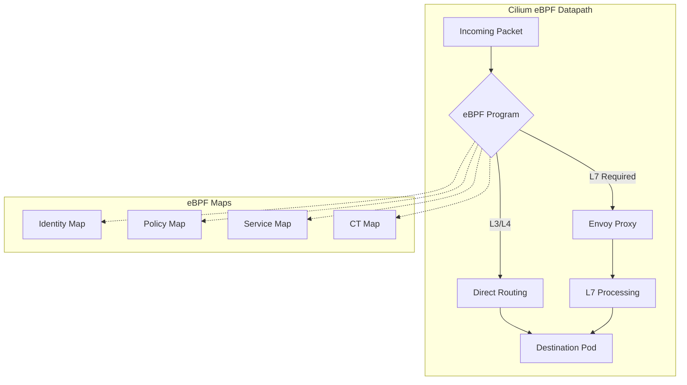
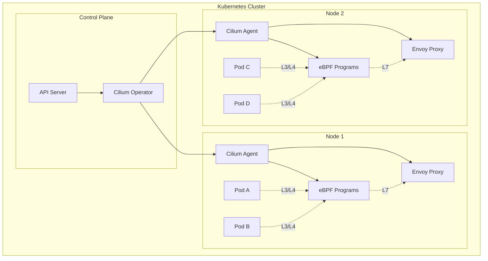
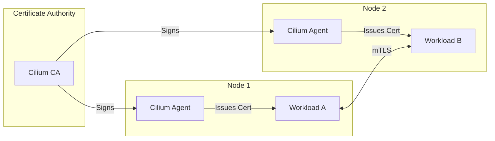

# Cilium Service Mesh

> **Supported Versions**: Cilium 1.16+
> **Last Updated**: November 24, 2025

Cilium Service Mesh is an eBPF-based sidecar-less service mesh solution that unifies Kubernetes networking and service mesh into a single platform. By leveraging the Linux kernel's eBPF capabilities, Cilium provides high-performance networking, security, and observability without the overhead of traditional sidecar proxies.

---

## Table of Contents

- [Introduction to Cilium Service Mesh](#introduction-to-cilium-service-mesh)
- [Architecture](#architecture)
- [L7 Traffic Management](#l7-traffic-management)
- [Mutual TLS (mTLS)](#mutual-tls-mtls)
- [Observability](#observability)
- [Ingress Controller](#ingress-controller)
- [Comparison with Istio](#comparison-with-istio)
- [Deploying Cilium Service Mesh on EKS](#deploying-cilium-service-mesh-on-eks)
- [Cilium CNI Documentation Cross-References](#cilium-cni-documentation-cross-references)
- [Best Practices](#best-practices)

---

## Introduction to Cilium Service Mesh

Traditional service meshes like Istio and Linkerd rely on sidecar proxies injected into every pod. While effective, this approach introduces resource overhead, increased latency, and operational complexity. Cilium Service Mesh takes a fundamentally different approach by leveraging eBPF (extended Berkeley Packet Filter) to implement service mesh functionality directly in the Linux kernel.

### Sidecar-less Architecture Using eBPF

Cilium's sidecar-less architecture eliminates the need for per-pod proxy containers:

```
┌─────────────────────────────────────────────────────────────────┐
│                     Traditional Sidecar Model                   │
├─────────────────────────────────────────────────────────────────┤
│  ┌─────────────────────┐    ┌─────────────────────┐            │
│  │      Pod A          │    │      Pod B          │            │
│  │  ┌───────────────┐  │    │  ┌───────────────┐  │            │
│  │  │  Application  │  │    │  │  Application  │  │            │
│  │  └───────┬───────┘  │    │  └───────┬───────┘  │            │
│  │          │          │    │          │          │            │
│  │  ┌───────▼───────┐  │    │  ┌───────▼───────┐  │            │
│  │  │ Sidecar Proxy │  │◄───┼──│ Sidecar Proxy │  │            │
│  │  └───────────────┘  │    │  └───────────────┘  │            │
│  └─────────────────────┘    └─────────────────────┘            │
└─────────────────────────────────────────────────────────────────┘

┌─────────────────────────────────────────────────────────────────┐
│                    Cilium Sidecar-less Model                    │
├─────────────────────────────────────────────────────────────────┤
│  ┌─────────────────────┐    ┌─────────────────────┐            │
│  │      Pod A          │    │      Pod B          │            │
│  │  ┌───────────────┐  │    │  ┌───────────────┐  │            │
│  │  │  Application  │  │    │  │  Application  │  │            │
│  │  └───────┬───────┘  │    │  └───────┬───────┘  │            │
│  └──────────┼──────────┘    └──────────┼──────────┘            │
│             │                          │                        │
│  ┌──────────▼──────────────────────────▼──────────┐            │
│  │              eBPF Datapath (Kernel)            │            │
│  └────────────────────────────────────────────────┘            │
└─────────────────────────────────────────────────────────────────┘
```

**Benefits of Sidecar-less Architecture:**

| Aspect | Sidecar Model | Cilium Sidecar-less |
|--------|--------------|---------------------|
| Resource Overhead | High (proxy per pod) | Low (shared per node) |
| Latency | Additional hops | Direct kernel path |
| Operational Complexity | Complex injection | Transparent |
| Upgrade Process | Rolling restart pods | Node-level updates |
| Memory Usage | ~50MB per sidecar | Shared node resources |

### Integration with Cilium CNI

Cilium Service Mesh is not a standalone component but an extension of Cilium CNI. This tight integration provides several advantages:

1. **Unified Data Plane**: Network policies, load balancing, and service mesh share the same eBPF-based data plane
2. **Consistent Identity**: Cilium's identity-based security model extends seamlessly to service mesh features
3. **Single Control Plane**: One operator manages both CNI and service mesh functionality
4. **Efficient Resource Usage**: No duplication of network stack components

---

## Architecture

Cilium Service Mesh architecture combines eBPF for high-performance L3/L4 processing with Envoy for advanced L7 capabilities.

### eBPF Datapath for L3/L4

The eBPF datapath handles all Layer 3 and Layer 4 networking operations directly in the Linux kernel:



**Key eBPF Components:**

| Component | Purpose | Location |
|-----------|---------|----------|
| `bpf_lxc` | Pod network interface handling | tc ingress/egress |
| `bpf_host` | Host network processing | tc on host interface |
| `bpf_overlay` | VXLAN/Geneve encapsulation | tc on tunnel interface |
| `bpf_sock` | Socket-level operations | cgroup/sock_ops |
| `bpf_network` | Network policy enforcement | XDP/tc |

### Envoy Integration for L7

While eBPF handles L3/L4 efficiently, Layer 7 features like HTTP routing, gRPC load balancing, and protocol parsing require Envoy:

```yaml
# Example: L7 traffic flow
# 1. eBPF intercepts packet
# 2. Identifies L7 processing requirement
# 3. Redirects to per-node Envoy
# 4. Envoy processes and forwards
```

### Per-Node Proxy vs Sidecar

Cilium uses a per-node Envoy proxy model instead of per-pod sidecars:

```
┌─────────────────────────────────────────────────────────────────┐
│                           Node                                  │
├─────────────────────────────────────────────────────────────────┤
│  ┌──────────┐  ┌──────────┐  ┌──────────┐  ┌──────────┐       │
│  │  Pod A   │  │  Pod B   │  │  Pod C   │  │  Pod D   │       │
│  │ (app)    │  │ (app)    │  │ (app)    │  │ (app)    │       │
│  └────┬─────┘  └────┬─────┘  └────┬─────┘  └────┬─────┘       │
│       │             │             │             │               │
│  ┌────▼─────────────▼─────────────▼─────────────▼────┐         │
│  │              eBPF Datapath                         │         │
│  └──────────────────────┬────────────────────────────┘         │
│                         │ (L7 only)                             │
│  ┌──────────────────────▼────────────────────────────┐         │
│  │           Cilium Envoy (per-node)                  │         │
│  │  - Shared by all pods on node                      │         │
│  │  - Dynamically configured via CiliumEnvoyConfig    │         │
│  └────────────────────────────────────────────────────┘         │
└─────────────────────────────────────────────────────────────────┘
```

**Resource Comparison:**

| Cluster Size | Sidecar Model (Envoy) | Cilium Per-Node |
|--------------|----------------------|-----------------|
| 100 pods, 10 nodes | 100 Envoy instances | 10 Envoy instances |
| 1000 pods, 50 nodes | 1000 Envoy instances | 50 Envoy instances |
| Memory (per pod) | ~50MB | ~0MB (shared) |

### CiliumEnvoyConfig CRD

The `CiliumEnvoyConfig` CRD allows you to configure Envoy for specific services:

```yaml
apiVersion: cilium.io/v2
kind: CiliumEnvoyConfig
metadata:
  name: envoy-lb-listener
  namespace: default
spec:
  services:
    - name: my-service
      namespace: default
  backendServices:
    - name: backend-v1
      namespace: default
    - name: backend-v2
      namespace: default
  resources:
    - "@type": type.googleapis.com/envoy.config.listener.v3.Listener
      name: envoy-lb-listener
      filter_chains:
        - filters:
            - name: envoy.filters.network.http_connection_manager
              typed_config:
                "@type": type.googleapis.com/envoy.extensions.filters.network.http_connection_manager.v3.HttpConnectionManager
                stat_prefix: envoy-lb-listener
                rds:
                  route_config_name: lb_route
                http_filters:
                  - name: envoy.filters.http.router
                    typed_config:
                      "@type": type.googleapis.com/envoy.extensions.filters.http.router.v3.Router
    - "@type": type.googleapis.com/envoy.config.route.v3.RouteConfiguration
      name: lb_route
      virtual_hosts:
        - name: lb_route
          domains: ["*"]
          routes:
            - match:
                prefix: "/"
              route:
                weighted_clusters:
                  clusters:
                    - name: default/backend-v1
                      weight: 90
                    - name: default/backend-v2
                      weight: 10
```

### Architecture Diagram



---

## L7 Traffic Management

Cilium Service Mesh provides sophisticated Layer 7 traffic management capabilities through CiliumEnvoyConfig and native Kubernetes resources.

### CiliumEnvoyConfig

CiliumEnvoyConfig is the primary mechanism for L7 traffic control:

```yaml
apiVersion: cilium.io/v2
kind: CiliumEnvoyConfig
metadata:
  name: l7-traffic-policy
  namespace: production
spec:
  services:
    - name: frontend
      namespace: production
  resources:
    - "@type": type.googleapis.com/envoy.config.listener.v3.Listener
      name: l7-listener
      filter_chains:
        - filters:
            - name: envoy.filters.network.http_connection_manager
              typed_config:
                "@type": type.googleapis.com/envoy.extensions.filters.network.http_connection_manager.v3.HttpConnectionManager
                stat_prefix: l7-traffic
                route_config:
                  name: local_route
                  virtual_hosts:
                    - name: frontend
                      domains: ["*"]
                      routes:
                        - match:
                            prefix: "/api/v2"
                          route:
                            cluster: production/api-v2
                        - match:
                            prefix: "/api"
                          route:
                            cluster: production/api-v1
                        - match:
                            prefix: "/"
                          route:
                            cluster: production/web
                http_filters:
                  - name: envoy.filters.http.router
                    typed_config:
                      "@type": type.googleapis.com/envoy.extensions.filters.http.router.v3.Router
```

### HTTP/gRPC Routing

**HTTP Header-Based Routing:**

```yaml
apiVersion: cilium.io/v2
kind: CiliumEnvoyConfig
metadata:
  name: header-routing
spec:
  services:
    - name: api-gateway
      namespace: default
  resources:
    - "@type": type.googleapis.com/envoy.config.route.v3.RouteConfiguration
      name: header_routes
      virtual_hosts:
        - name: api
          domains: ["api.example.com"]
          routes:
            # Route based on header value
            - match:
                prefix: "/"
                headers:
                  - name: "x-api-version"
                    exact_match: "v2"
              route:
                cluster: default/api-v2
            # Route based on header presence
            - match:
                prefix: "/"
                headers:
                  - name: "x-canary"
                    present_match: true
              route:
                cluster: default/api-canary
            # Default route
            - match:
                prefix: "/"
              route:
                cluster: default/api-v1
```

**gRPC Method Routing:**

```yaml
apiVersion: cilium.io/v2
kind: CiliumEnvoyConfig
metadata:
  name: grpc-routing
spec:
  services:
    - name: grpc-gateway
      namespace: default
  resources:
    - "@type": type.googleapis.com/envoy.config.route.v3.RouteConfiguration
      name: grpc_routes
      virtual_hosts:
        - name: grpc_service
          domains: ["*"]
          routes:
            # Route specific gRPC methods
            - match:
                prefix: "/myservice.UserService/GetUser"
                grpc: {}
              route:
                cluster: default/user-service
            - match:
                prefix: "/myservice.OrderService/"
                grpc: {}
              route:
                cluster: default/order-service
            # Default gRPC route
            - match:
                prefix: "/"
                grpc: {}
              route:
                cluster: default/default-grpc
```

### Traffic Splitting

Implement canary deployments and A/B testing with weighted traffic splitting:

```yaml
apiVersion: cilium.io/v2
kind: CiliumEnvoyConfig
metadata:
  name: canary-deployment
  namespace: production
spec:
  services:
    - name: my-app
      namespace: production
  backendServices:
    - name: my-app-stable
      namespace: production
    - name: my-app-canary
      namespace: production
  resources:
    - "@type": type.googleapis.com/envoy.config.route.v3.RouteConfiguration
      name: canary_route
      virtual_hosts:
        - name: my_app
          domains: ["*"]
          routes:
            - match:
                prefix: "/"
              route:
                weighted_clusters:
                  clusters:
                    - name: production/my-app-stable
                      weight: 95
                    - name: production/my-app-canary
                      weight: 5
                  total_weight: 100
```

**Progressive Rollout Script:**

```bash
#!/bin/bash
# Progressive canary rollout

NAMESPACE="production"
CONFIG_NAME="canary-deployment"

# Array of weight progressions
WEIGHTS=(5 10 25 50 75 100)

for CANARY_WEIGHT in "${WEIGHTS[@]}"; do
    STABLE_WEIGHT=$((100 - CANARY_WEIGHT))

    echo "Setting canary weight to ${CANARY_WEIGHT}%"

    kubectl patch ciliumenvoyconfig ${CONFIG_NAME} -n ${NAMESPACE} --type='json' \
        -p="[
            {\"op\": \"replace\", \"path\": \"/spec/resources/0/virtual_hosts/0/routes/0/route/weighted_clusters/clusters/0/weight\", \"value\": ${STABLE_WEIGHT}},
            {\"op\": \"replace\", \"path\": \"/spec/resources/0/virtual_hosts/0/routes/0/route/weighted_clusters/clusters/1/weight\", \"value\": ${CANARY_WEIGHT}}
        ]"

    echo "Waiting 5 minutes to observe metrics..."
    sleep 300

    # Check error rate (example using Prometheus)
    ERROR_RATE=$(curl -s "http://prometheus:9090/api/v1/query?query=rate(http_requests_total{status=~'5..'}[5m])/rate(http_requests_total[5m])" | jq '.data.result[0].value[1]')

    if (( $(echo "$ERROR_RATE > 0.01" | bc -l) )); then
        echo "Error rate too high (${ERROR_RATE}), rolling back!"
        kubectl patch ciliumenvoyconfig ${CONFIG_NAME} -n ${NAMESPACE} --type='json' \
            -p='[{"op": "replace", "path": "/spec/resources/0/virtual_hosts/0/routes/0/route/weighted_clusters/clusters/0/weight", "value": 100},
                 {"op": "replace", "path": "/spec/resources/0/virtual_hosts/0/routes/0/route/weighted_clusters/clusters/1/weight", "value": 0}]'
        exit 1
    fi
done

echo "Canary rollout complete!"
```

### Load Balancing

Cilium supports various load balancing algorithms:

```yaml
apiVersion: cilium.io/v2
kind: CiliumEnvoyConfig
metadata:
  name: lb-policy
spec:
  services:
    - name: backend
      namespace: default
  resources:
    - "@type": type.googleapis.com/envoy.config.cluster.v3.Cluster
      name: default/backend
      type: EDS
      eds_cluster_config:
        eds_config:
          ads: {}
      # Load balancing policy
      lb_policy: LEAST_REQUEST
      # Health checking
      health_checks:
        - timeout: 5s
          interval: 10s
          unhealthy_threshold: 3
          healthy_threshold: 2
          http_health_check:
            path: "/health"
      # Connection pool settings
      circuit_breakers:
        thresholds:
          - max_connections: 1000
            max_pending_requests: 1000
            max_requests: 1000
            max_retries: 3
```

**Available Load Balancing Algorithms:**

| Algorithm | Use Case | Configuration |
|-----------|----------|---------------|
| `ROUND_ROBIN` | General purpose, equal distribution | Default |
| `LEAST_REQUEST` | Varying request complexity | `lb_policy: LEAST_REQUEST` |
| `RANDOM` | Simple, stateless | `lb_policy: RANDOM` |
| `RING_HASH` | Session affinity | `lb_policy: RING_HASH` |
| `MAGLEV` | Consistent hashing | `lb_policy: MAGLEV` |

---

## Mutual TLS (mTLS)

Cilium Service Mesh provides automatic mutual TLS for service-to-service communication using SPIFFE-based identities.

### SPIFFE-Based Certificates

Cilium uses SPIFFE (Secure Production Identity Framework for Everyone) for workload identity:

```
SPIFFE ID Format:
spiffe://cluster.local/ns/<namespace>/sa/<service-account>

Example:
spiffe://cluster.local/ns/production/sa/api-server
```

**Identity Architecture:**



### Mutual Authentication

Enable mTLS with Cilium's authentication policy:

```yaml
apiVersion: cilium.io/v2
kind: CiliumNetworkPolicy
metadata:
  name: require-mtls
  namespace: production
spec:
  endpointSelector:
    matchLabels:
      app: secure-api
  ingress:
    - fromEndpoints:
        - matchLabels:
            app: trusted-client
      authentication:
        mode: required
```

**Cluster-Wide mTLS:**

```yaml
apiVersion: cilium.io/v2
kind: CiliumClusterwideNetworkPolicy
metadata:
  name: cluster-mtls
spec:
  endpointSelector: {}
  ingress:
    - fromEndpoints:
        - {}
      authentication:
        mode: required
  egress:
    - toEndpoints:
        - {}
      authentication:
        mode: required
```

### Automatic Certificate Management

Cilium handles certificate lifecycle automatically:

```bash
# Check certificate status
cilium status --verbose | grep -A 10 "Encryption"

# View certificate details
kubectl exec -n kube-system ds/cilium -- cilium encrypt status

# Certificate rotation is automatic, but can be triggered manually
kubectl rollout restart ds/cilium -n kube-system
```

**Helm Configuration for mTLS:**

```yaml
# values.yaml for Cilium Helm chart
authentication:
  enabled: true
  mutual:
    spire:
      enabled: false  # Use built-in CA
    # Or use external SPIRE
    # spire:
    #   enabled: true
    #   install:
    #     enabled: true
    #     namespace: spire
    #   trustDomain: cluster.local

# Configure certificate validity
tls:
  ca:
    # Certificate validity period
    certValidityDuration: 1095  # days (3 years)
  # Leaf certificate validity
  certValidityDuration: 365     # days (1 year)
```

---

## Observability

Cilium provides comprehensive observability through Hubble, its dedicated observability platform.

### Hubble

Hubble is the observability layer of Cilium, providing visibility into network flows, service dependencies, and security events.

**Enable Hubble:**

```bash
# Enable Hubble via Helm
helm upgrade cilium cilium/cilium \
    --namespace kube-system \
    --set hubble.enabled=true \
    --set hubble.relay.enabled=true \
    --set hubble.ui.enabled=true \
    --set hubble.metrics.enabled="{dns,drop,tcp,flow,icmp,http}"
```

**Install Hubble CLI:**

```bash
# Linux/macOS
HUBBLE_VERSION=$(curl -s https://raw.githubusercontent.com/cilium/hubble/master/stable.txt)
curl -L --remote-name-all https://github.com/cilium/hubble/releases/download/${HUBBLE_VERSION}/hubble-linux-amd64.tar.gz
tar xzf hubble-linux-amd64.tar.gz
sudo mv hubble /usr/local/bin/
```

**Hubble Commands:**

```bash
# Port-forward Hubble Relay
kubectl port-forward -n kube-system svc/hubble-relay 4245:80 &

# Observe all flows
hubble observe

# Filter by namespace
hubble observe --namespace production

# Filter by pod
hubble observe --pod production/api-server

# Filter by verdict
hubble observe --verdict DROPPED

# Filter by HTTP
hubble observe --protocol http

# Follow flows in real-time
hubble observe -f

# Export to JSON
hubble observe --output json > flows.json
```

### L7 Visibility

Enable L7 visibility for specific namespaces:

```yaml
apiVersion: cilium.io/v2
kind: CiliumNetworkPolicy
metadata:
  name: l7-visibility
  namespace: production
spec:
  endpointSelector:
    matchLabels:
      app: api-server
  ingress:
    - toPorts:
        - ports:
            - port: "8080"
              protocol: TCP
          rules:
            http:
              - {}
```

**L7 Flow Example:**

```bash
$ hubble observe --namespace production --protocol http

TIMESTAMP             SOURCE                    DESTINATION               TYPE    VERDICT   SUMMARY
Nov 24 10:15:32.123   production/client         production/api-server     http    FORWARDED HTTP/1.1 GET /api/users 200 23ms
Nov 24 10:15:32.456   production/api-server     production/database       http    FORWARDED HTTP/1.1 POST /query 200 15ms
Nov 24 10:15:33.789   production/client         production/api-server     http    DROPPED   HTTP/1.1 GET /admin 403 1ms
```

### Grafana Dashboards

Hubble metrics integrate with Prometheus and Grafana:

```yaml
# Hubble metrics configuration
hubble:
  metrics:
    enabled:
      - dns:query;ignoreAAAA
      - drop
      - tcp
      - flow
      - icmp
      - http
    serviceMonitor:
      enabled: true
    dashboards:
      enabled: true
      namespace: monitoring
```

**Key Metrics:**

| Metric | Description |
|--------|-------------|
| `hubble_flows_processed_total` | Total flows processed |
| `hubble_drop_total` | Dropped packets by reason |
| `hubble_http_requests_total` | HTTP requests by method/status |
| `hubble_http_request_duration_seconds` | HTTP latency histogram |
| `hubble_tcp_flags_total` | TCP flags observed |
| `hubble_dns_queries_total` | DNS queries by type |

**Dashboard JSON (excerpt):**

```json
{
  "dashboard": {
    "title": "Cilium Service Mesh",
    "panels": [
      {
        "title": "HTTP Request Rate",
        "type": "graph",
        "targets": [
          {
            "expr": "sum(rate(hubble_http_requests_total[5m])) by (method, status)",
            "legendFormat": "{{method}} - {{status}}"
          }
        ]
      },
      {
        "title": "HTTP Latency P99",
        "type": "graph",
        "targets": [
          {
            "expr": "histogram_quantile(0.99, sum(rate(hubble_http_request_duration_seconds_bucket[5m])) by (le, destination))",
            "legendFormat": "{{destination}}"
          }
        ]
      },
      {
        "title": "Dropped Packets",
        "type": "graph",
        "targets": [
          {
            "expr": "sum(rate(hubble_drop_total[5m])) by (reason)",
            "legendFormat": "{{reason}}"
          }
        ]
      }
    ]
  }
}
```

**Access Hubble UI:**

```bash
# Port-forward Hubble UI
kubectl port-forward -n kube-system svc/hubble-ui 12000:80

# Access at http://localhost:12000
```

---

## Ingress Controller

Cilium provides a native ingress controller and Gateway API implementation.

### Cilium Ingress

Enable Cilium Ingress Controller:

```bash
helm upgrade cilium cilium/cilium \
    --namespace kube-system \
    --set ingressController.enabled=true \
    --set ingressController.loadbalancerMode=shared
```

**Ingress Resource:**

```yaml
apiVersion: networking.k8s.io/v1
kind: Ingress
metadata:
  name: my-app-ingress
  namespace: production
  annotations:
    ingress.cilium.io/loadbalancer-mode: shared
    ingress.cilium.io/service-type: LoadBalancer
spec:
  ingressClassName: cilium
  rules:
    - host: app.example.com
      http:
        paths:
          - path: /
            pathType: Prefix
            backend:
              service:
                name: my-app
                port:
                  number: 80
  tls:
    - hosts:
        - app.example.com
      secretName: app-tls-secret
```

**Dedicated vs Shared Mode:**

| Mode | Description | Use Case |
|------|-------------|----------|
| `shared` | Single LoadBalancer for all Ingress | Cost-effective, most deployments |
| `dedicated` | LoadBalancer per Ingress | Isolation, specific IP requirements |

### Gateway API Support

Cilium fully supports the Kubernetes Gateway API:

```bash
# Install Gateway API CRDs
kubectl apply -f https://github.com/kubernetes-sigs/gateway-api/releases/download/v1.0.0/standard-install.yaml

# Enable Gateway API in Cilium
helm upgrade cilium cilium/cilium \
    --namespace kube-system \
    --set gatewayAPI.enabled=true
```

**GatewayClass and Gateway:**

```yaml
apiVersion: gateway.networking.k8s.io/v1
kind: GatewayClass
metadata:
  name: cilium
spec:
  controllerName: io.cilium/gateway-controller
---
apiVersion: gateway.networking.k8s.io/v1
kind: Gateway
metadata:
  name: production-gateway
  namespace: production
spec:
  gatewayClassName: cilium
  listeners:
    - name: http
      port: 80
      protocol: HTTP
      hostname: "*.example.com"
    - name: https
      port: 443
      protocol: HTTPS
      hostname: "*.example.com"
      tls:
        mode: Terminate
        certificateRefs:
          - name: wildcard-tls
```

**HTTPRoute:**

```yaml
apiVersion: gateway.networking.k8s.io/v1
kind: HTTPRoute
metadata:
  name: app-routes
  namespace: production
spec:
  parentRefs:
    - name: production-gateway
  hostnames:
    - "app.example.com"
  rules:
    - matches:
        - path:
            type: PathPrefix
            value: /api/v2
      backendRefs:
        - name: api-v2
          port: 8080
    - matches:
        - path:
            type: PathPrefix
            value: /api
      backendRefs:
        - name: api-v1
          port: 8080
    - matches:
        - path:
            type: PathPrefix
            value: /
      backendRefs:
        - name: web-frontend
          port: 80
```

**Traffic Splitting with HTTPRoute:**

```yaml
apiVersion: gateway.networking.k8s.io/v1
kind: HTTPRoute
metadata:
  name: canary-route
  namespace: production
spec:
  parentRefs:
    - name: production-gateway
  hostnames:
    - "app.example.com"
  rules:
    - backendRefs:
        - name: app-stable
          port: 8080
          weight: 90
        - name: app-canary
          port: 8080
          weight: 10
```

---

## Comparison with Istio

A detailed comparison between Cilium Service Mesh and Istio:

| Feature | Cilium Service Mesh | Istio |
|---------|---------------------|-------|
| **Architecture** | Sidecar-less (eBPF + per-node Envoy) | Sidecar per pod |
| **Data Plane** | eBPF (L3/L4) + Envoy (L7) | Envoy sidecar |
| **Control Plane** | Cilium Operator | istiod |
| **Resource Overhead** | Low (shared per node) | High (per pod) |
| **Latency** | Lower (kernel-level) | Higher (proxy hops) |
| **L7 Capabilities** | Full (via Envoy) | Full (via Envoy) |
| **mTLS** | SPIFFE-based | SPIFFE-based |
| **Traffic Management** | CiliumEnvoyConfig, Gateway API | VirtualService, DestinationRule |
| **Observability** | Hubble | Kiali, Jaeger, Prometheus |
| **Network Policies** | Native (eBPF) | AuthorizationPolicy |
| **CNI Integration** | Built-in | Separate (requires CNI) |
| **Learning Curve** | Moderate | Steep |
| **Multi-cluster** | Cluster Mesh | Multi-cluster |
| **Ambient Mode** | N/A (native sidecar-less) | Ambient mesh (newer) |

**Performance Comparison:**

| Metric | Cilium | Istio (Sidecar) | Istio (Ambient) |
|--------|--------|-----------------|-----------------|
| Latency overhead | ~5-10% | ~15-25% | ~8-15% |
| Memory per pod | 0 MB | ~50 MB | ~0-20 MB |
| CPU overhead | Minimal | Significant | Moderate |
| Connection setup time | Fast | Slower | Moderate |

**When to Choose Cilium:**

- High-performance requirements
- Resource-constrained environments
- Already using Cilium as CNI
- Need unified networking/mesh solution
- Large-scale deployments

**When to Choose Istio:**

- Complex traffic management needs
- Established Istio expertise
- Rich ecosystem integrations
- Need for Kiali visualization
- Multi-cluster/multi-cloud focus

---

## Deploying Cilium Service Mesh on EKS

Deploying Cilium Service Mesh on Amazon EKS requires replacing the default Amazon VPC CNI with Cilium.

### Replacing EKS Native VPC CNI

**Step 1: Create EKS Cluster without default CNI:**

```bash
# eksctl configuration
cat <<EOF > cluster-config.yaml
apiVersion: eksctl.io/v1alpha5
kind: ClusterConfig

metadata:
  name: cilium-cluster
  region: us-west-2
  version: "1.30"

vpc:
  cidr: 10.0.0.0/16
  clusterEndpoints:
    publicAccess: true
    privateAccess: true

managedNodeGroups:
  - name: ng-1
    instanceType: m5.large
    desiredCapacity: 3
    minSize: 1
    maxSize: 5
    privateNetworking: true
    # Do not install default CNI
    preBootstrapCommands:
      - "#!/bin/bash"
      - "set -ex"
      - "yum install -y iproute-tc"
EOF

eksctl create cluster -f cluster-config.yaml
```

**Step 2: Remove AWS VPC CNI:**

```bash
# Delete AWS VPC CNI
kubectl delete daemonset aws-node -n kube-system

# Remove CNI configuration
kubectl delete configmap amazon-vpc-cni -n kube-system --ignore-not-found
```

**Step 3: Install Cilium:**

```bash
# Add Cilium Helm repository
helm repo add cilium https://helm.cilium.io/
helm repo update

# Install Cilium with service mesh features
helm install cilium cilium/cilium --version 1.16.0 \
    --namespace kube-system \
    --set eni.enabled=true \
    --set ipam.mode=eni \
    --set egressMasqueradeInterfaces=eth0 \
    --set routingMode=native \
    --set hubble.enabled=true \
    --set hubble.relay.enabled=true \
    --set hubble.ui.enabled=true \
    --set hubble.metrics.enabled="{dns,drop,tcp,flow,icmp,http}" \
    --set ingressController.enabled=true \
    --set gatewayAPI.enabled=true \
    --set authentication.enabled=true \
    --set authentication.mutual.spire.enabled=false
```

### kube-proxy Replacement

Cilium can replace kube-proxy entirely:

```bash
helm upgrade cilium cilium/cilium \
    --namespace kube-system \
    --set kubeProxyReplacement=true \
    --set k8sServiceHost=${API_SERVER_IP} \
    --set k8sServicePort=443

# Delete kube-proxy
kubectl delete ds kube-proxy -n kube-system
kubectl delete cm kube-proxy -n kube-system
```

**Verify kube-proxy replacement:**

```bash
kubectl exec -n kube-system ds/cilium -- cilium status | grep KubeProxyReplacement
# Expected: KubeProxyReplacement: True
```

### AWS ENI Mode Compatibility

Cilium's ENI mode provides native AWS VPC networking:

```yaml
# values.yaml for ENI mode
eni:
  enabled: true
  awsEnablePrefixDelegation: true
  awsReleaseExcessIPs: true

ipam:
  mode: eni

# Native routing for better performance
routingMode: native
enableIPv4Masquerade: false

# Use ENI for egress
egressMasqueradeInterfaces: eth0

# AWS-specific settings
endpointRoutes:
  enabled: true
```

**ENI Mode Architecture:**

```
┌─────────────────────────────────────────────────────────────────┐
│                          AWS VPC                                │
├─────────────────────────────────────────────────────────────────┤
│  ┌─────────────────────────────────────────────────────────┐   │
│  │                     EKS Node                             │   │
│  │  ┌─────────────┐  ┌─────────────┐  ┌─────────────┐     │   │
│  │  │   Pod A     │  │   Pod B     │  │   Pod C     │     │   │
│  │  │ IP: 10.0.1.5│  │ IP: 10.0.1.6│  │ IP: 10.0.1.7│     │   │
│  │  └──────┬──────┘  └──────┬──────┘  └──────┬──────┘     │   │
│  │         │                │                │             │   │
│  │  ┌──────▼────────────────▼────────────────▼──────┐     │   │
│  │  │              Cilium eBPF Datapath              │     │   │
│  │  └─────────────────────┬─────────────────────────┘     │   │
│  │                        │                                │   │
│  │  ┌─────────────────────▼─────────────────────────┐     │   │
│  │  │              ENI (eth1, eth2...)              │     │   │
│  │  │         Secondary IPs attached to ENI         │     │   │
│  │  └───────────────────────────────────────────────┘     │   │
│  └─────────────────────────────────────────────────────────┘   │
│                              │                                  │
│  ┌───────────────────────────▼───────────────────────────┐     │
│  │                  VPC Route Table                       │     │
│  │            Native routing to pod IPs                   │     │
│  └────────────────────────────────────────────────────────┘     │
└─────────────────────────────────────────────────────────────────┘
```

---

## Cilium CNI Documentation Cross-References

> **Related Documentation**: For detailed information on Cilium CNI, see:
> - [Introduction to Cilium](../cilium/01-introduction.md) - Overview of Cilium architecture and features
> - [eBPF](../cilium/02-ebpf.md) - Understanding eBPF, the technology powering Cilium
> - [Networking](../cilium/03-networking.md) - Cilium networking modes and configuration
> - [Security and Visibility](../cilium/06-security-visibility.md) - Network policies and Hubble observability
> - [Advanced Topics](../cilium/07-advanced-topics.md) - Cluster Mesh, BGP, and advanced configurations

---

## Best Practices

### Deployment Best Practices

1. **Start with Cilium CNI**: Deploy Cilium as your CNI before enabling service mesh features
2. **Enable Hubble Early**: Observability helps troubleshoot issues during rollout
3. **Use Gateway API**: Prefer Gateway API over legacy Ingress for new deployments
4. **Gradual mTLS Rollout**: Enable mTLS namespace by namespace

```bash
# Health check after installation
cilium status --wait
cilium connectivity test
```

### Performance Tuning

```yaml
# Optimized Helm values for high-performance
bpf:
  # Increase BPF map sizes for large clusters
  mapDynamicSizeRatio: 0.0025
  preallocateMaps: true

# Enable direct server return
loadBalancer:
  mode: dsr
  dsrDispatch: opt

# Optimize for throughput
bandwidthManager:
  enabled: true
  bbr: true
```

### Security Best Practices

1. **Default Deny Policies**: Start with default deny and explicitly allow traffic

```yaml
apiVersion: cilium.io/v2
kind: CiliumClusterwideNetworkPolicy
metadata:
  name: default-deny
spec:
  endpointSelector: {}
  ingress:
    - {}
  egress:
    - {}
```

2. **Enable mTLS for Sensitive Workloads**:

```yaml
apiVersion: cilium.io/v2
kind: CiliumNetworkPolicy
metadata:
  name: require-mtls-production
  namespace: production
spec:
  endpointSelector: {}
  ingress:
    - fromEndpoints:
        - {}
      authentication:
        mode: required
```

3. **Regular Security Audits**:

```bash
# Check for policy violations
hubble observe --verdict DROPPED --output json | jq '.flow.drop_reason'

# Audit authentication failures
hubble observe --type trace:to-endpoint --verdict DROPPED | grep -i auth
```

### Operational Best Practices

1. **Monitor Cilium Health**:

```bash
# Create monitoring script
#!/bin/bash
while true; do
    echo "=== Cilium Status ==="
    kubectl exec -n kube-system ds/cilium -- cilium status --brief

    echo "=== Endpoint Status ==="
    kubectl exec -n kube-system ds/cilium -- cilium endpoint list

    echo "=== BPF Maps ==="
    kubectl exec -n kube-system ds/cilium -- cilium bpf map list

    sleep 60
done
```

2. **Backup Cilium State**:

```bash
# Export network policies
kubectl get ciliumnetworkpolicies --all-namespaces -o yaml > cnp-backup.yaml
kubectl get ciliumclusterwidenetworkpolicies -o yaml > ccnp-backup.yaml

# Export Envoy configs
kubectl get ciliumenvoyconfigs --all-namespaces -o yaml > cec-backup.yaml
```

3. **Upgrade Strategy**:

```bash
# Pre-upgrade checklist
cilium connectivity test

# Upgrade with minimal disruption
helm upgrade cilium cilium/cilium \
    --namespace kube-system \
    --set upgradeCompatibility=1.15 \
    --wait

# Post-upgrade validation
cilium status --wait
cilium connectivity test
```

### Troubleshooting Guide

| Symptom | Diagnostic Command | Common Cause |
|---------|-------------------|--------------|
| Pod networking failure | `cilium endpoint list` | Missing endpoint |
| Policy not enforced | `cilium policy get` | Policy syntax error |
| mTLS failures | `hubble observe --verdict DROPPED` | Certificate issues |
| High latency | `cilium bpf map get METRIC_MAP` | BPF program overload |
| Service unreachable | `cilium service list` | Missing service entry |

```bash
# Comprehensive debug
kubectl exec -n kube-system ds/cilium -- cilium debuginfo

# Check BPF programs
kubectl exec -n kube-system ds/cilium -- cilium bpf prog list

# Monitor eBPF events
kubectl exec -n kube-system ds/cilium -- cilium monitor
```

---

## Summary

Cilium Service Mesh represents a paradigm shift in service mesh architecture by leveraging eBPF to provide sidecar-less service mesh capabilities. Key advantages include:

- **Performance**: Kernel-level processing reduces latency and overhead
- **Unified Platform**: Single solution for CNI and service mesh
- **Resource Efficiency**: Per-node proxy model instead of per-pod sidecars
- **Seamless Integration**: Native Kubernetes networking with advanced L7 features
- **Strong Security**: SPIFFE-based mTLS with automatic certificate management

For EKS deployments, Cilium provides excellent integration with AWS infrastructure through ENI mode while enabling advanced service mesh features. The combination of eBPF-based networking, Hubble observability, and Gateway API support makes Cilium Service Mesh a compelling choice for modern Kubernetes deployments.
