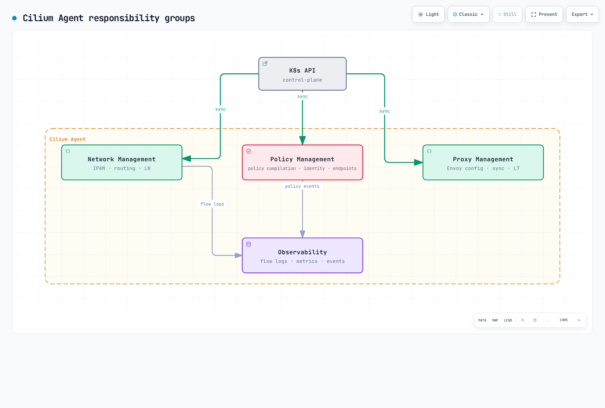
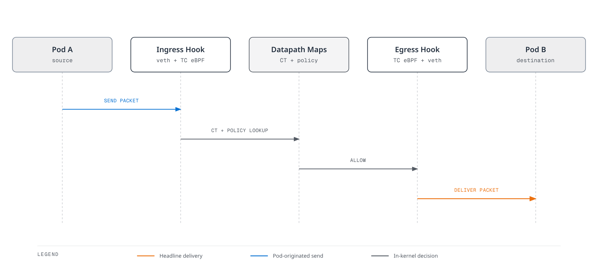

# Cilium Service Mesh Architecture

> **Review baseline**: Cilium 1.20.1, September 11, 2026. Its general Kubernetes test matrix covers 1.33–1.36; the released EKS CI matrix covers 1.33–1.35. Platform, kernel and installation-mode requirements are separate; see the [overview](./README.md).

## Overview

Cilium combines an eBPF L3/L4 datapath with Envoy for HTTP and other supported L7 processing. Envoy can run as a process managed by the agent or in a separate `cilium-envoy` DaemonSet. Sharing proxies changes deployment and failure boundaries; it does not establish a fixed memory saving or latency result.

## Overall Architecture


[🔍 View interactive diagram](https://www.atomai.click/kubernetes-docs/archmaps/en-service-mesh-cilium-service-mesh-01-architecture-0.html)

The top box groups control-plane functions. The **Kubernetes API server and Cilium Operator are separate components**; the Operator is a Deployment responsible for cluster-wide work, not a per-node agent or an API-server replacement.

| Component | Responsibility |
|---|---|
| Cilium Agent | Manages local endpoints, eBPF programs/maps, policy and Envoy configuration |
| Cilium Operator | Performs cluster-wide work such as identity garbage collection, CRD registration and IP allocation in applicable IPAM modes |
| Envoy | Handles redirected L7 traffic; a separate DaemonSet allows independent proxy lifecycle management |
| Kubernetes API | Stores desired resources and reports workload/service state to controllers |
| Hubble | Observes supported datapath and proxy events; Relay/UI are additional components when enabled |

## eBPF Datapath

### Programs and Hooks

eBPF programs run at defined kernel hooks after verification. They can implement packet filtering, redirection and Service translation without adding a userspace proxy hop for every L3/L4 packet.


[🔍 View interactive diagram](https://www.atomai.click/kubernetes-docs/archmaps/en-service-mesh-cilium-service-mesh-01-architecture-1.html)

The bypass arrow represents a possible optimization, not a guarantee that Cilium skips every Linux networking layer. Pod socket stacks, routing mode, kernel capabilities and integration requirements still matter.

| Hook or path | Cilium use and qualification |
|---|---|
| TC/TCX and endpoint datapath | Packet-level policy, forwarding and Service operations; the attachment mechanism depends on kernel/datapath mode |
| cgroup socket hooks | Socket-level Service translation, for example at TCP `connect()`; this differs from packet-level TC load balancing |
| XDP | Optional early processing such as NodePort/LoadBalancer acceleration on supported devices; it is not enabled for every path merely by installing Cilium |
| veth/netkit | Alternative endpoint device/datapath choices with their own requirements; they do not imply one universal hook sequence |

### Connection Tracking and Policy

Cilium stores connection state in BPF maps. This supports stateful handling, reply recognition and NAT/proxy bookkeeping. It does **not** mean that the first packet permanently caches an allow decision for every subsequent packet: the released endpoint datapath checks policy for both `CT_NEW` and `CT_ESTABLISHED` in the initiating direction, with explicit exceptions. Recognized reply/related traffic follows stateful return handling. Policy updates, proxy redirects and optimized paths need to be assessed in the actual configuration.

The following table is conceptual, not a C structure or a map ABI:

| Map information | Purpose |
|---|---|
| CT tuple key and connection-state value | Identify a flow/direction and maintain its state, lifetime and translation metadata |
| Service frontend and backend maps | Resolve Service address/port/protocol information to backend entries |
| Policy map | Represent compiled identity/direction/port/protocol policy and related proxy/authentication metadata |
| IP cache | Associate addresses/prefixes with security identities and routing information |

Use the released BPF definitions when reading raw maps. IPv4/IPv6 keys, values, byte order and layouts differ; an invented `ct_entry` containing both the tuple and state is not a safe decoding specification.

### kube-proxy Replacement

The following is an **installation-mode fragment**, not a migration procedure. Replace the API host and port with an endpoint reachable before Service translation is available. Port 6443 is illustrative; EKS API endpoints normally use HTTPS port 443. Preserve the chosen platform's IPAM, routing and CNI settings.

```yaml
kubeProxyReplacement: true
k8sServiceHost: <reachable-api-server-host>
k8sServicePort: 6443
loadBalancer:
  algorithm: maglev
```

`loadBalancer.algorithm: maglev` provides consistent backend selection for applicable external north–south traffic. Cilium's socket-level east–west Service connections are not subject to Maglev in this mode. Kubernetes `Service.spec.sessionAffinity: ClientIP` is a separate feature; Maglev is neither cookie persistence nor a promise to preserve connections to a removed backend.

| Topic | Architectural distinction |
|---|---|
| Service translation | kube-proxy implementations include iptables and nftables; Cilium uses BPF and, where enabled, socket-level translation |
| Connection state | Linux conntrack and Cilium's BPF CT maps are separate mechanisms |
| DSR | `loadBalancer.mode: dsr` can let backends reply directly using the Service address; supported dispatch/routing combinations, MTU and cloud networking must be checked |
| Performance | Algorithmic lookup properties alone do not establish whole-request latency, throughput or CPU consumption |

For Cilium 1.20.1, DSR option dispatch requires native routing; Geneve dispatch supports native or Geneve tunnel routing, while VXLAN tunnel routing is not a supported DSR combination. AWS source/destination checks can also affect DSR. Do not add `mode: dsr` to an arbitrary EKS installation without the [mode-specific requirements](https://github.com/cilium/cilium/blob/v1.20.1/Documentation/network/kubernetes/kubeproxy-free.rst).

## Shared Envoy Proxy

### Deployment and Resource Configuration

This Helm overlay enables the separate Envoy DaemonSet and direct CEC management for an already planned Cilium installation. Merge it with the installation's reviewed values. The resource numbers are example requests/limits, not benchmark measurements or universal sizing.

```yaml
l7Proxy: true
envoyConfig:
  enabled: true
envoy:
  enabled: true
  resources:
    requests:
      cpu: 100m
      memory: 256Mi
    limits:
      cpu: 2000m
      memory: 2Gi
```

```bash
kubectl -n kube-system get daemonset cilium cilium-envoy
kubectl -n kube-system get deployment cilium-operator
kubectl -n kube-system get pods -l k8s-app=cilium -o wide
```

Desired/ready counts depend on eligible nodes. Embedded Envoy mode has a different process lifecycle and does not require this separate DaemonSet.

### L7 Processing Flow

HTTP L7 network policy redirects the relevant traffic to the enforcement proxy. CEC service load balancing, Ingress and Gateway API can also introduce Envoy into the path. Thus “only traffic with an L7 network policy uses Envoy” is too narrow.


[🔍 View interactive diagram](https://www.atomai.click/kubernetes-docs/archmaps/en-service-mesh-cilium-service-mesh-01-architecture-12.html)

This diagram illustrates **egress** policy. An ingress policy is enforced on the receiving side; both can be configured. A proxied HTTP response traverses the established proxy connection. It is not a separate arbitrary decision to redirect or bypass each response. TLS-encrypted application payloads require the corresponding supported TLS/L7 configuration before HTTP fields can be inspected.

### Configuration Ownership

Maintain Helm-generated agent configuration through the installation's values. Replacing `cilium-config` with a short hand-written ConfigMap can omit required platform settings.

The next commands inspect an existing release and agent; set `CILIUM_POD` as shown in the identity section first:

```bash
helm get values cilium -n kube-system -a
kubectl -n kube-system get configmap cilium-config -o yaml
kubectl -n kube-system logs "$CILIUM_POD" -c cilium-agent --since=10m
```

Chart 1.20.1 uses `envoy.connectTimeoutSeconds`, `envoy.clusterMaxConnections`, `envoy.clusterMaxPendingRequests` and `envoy.clusterMaxRequests`. Keys such as `envoy.connectTimeout`, `maxConnectionsPerHost`, `envoy.cluster.*` and `envoy.proxy.protocol.*` do not implement those controls. HTTP/2 and TLS configuration belongs to supported controller/Envoy APIs, not invented Helm switches.

## CRD Model

| Resource | Scope and role |
|---|---|
| `CiliumNetworkPolicy` | Namespaced endpoint policy, including supported L7 rules |
| `CiliumClusterwideNetworkPolicy` | Cluster-scoped endpoint policy; selectors still determine affected endpoints |
| `CiliumEnvoyConfig` (CEC) | Namespaced low-level Envoy resources and Service redirection |
| `CiliumClusterwideEnvoyConfig` (CCEC) | Cluster-scoped Envoy configuration; individual Services remain explicitly identified |
| `CiliumEndpoint` | Namespaced endpoint status maintained by Cilium |
| `CiliumIdentity` | Cluster-scoped allocation of a security identity for a label set |

These resources do not all “resolve into CiliumEndpoint.” Common ingress/routing tasks can use supported Gateway API resources; direct CEC/CCEC management is a lower-level option requiring Envoy expertise.

### CiliumEnvoyConfig

This example assumes an existing Cilium-managed **`default/my-service` Service with frontend port 8080 and ready HTTP backends**. It redirects that frontend to a Listener, uses an RDS RouteConfiguration and defines the referenced EDS Cluster. The referenced workloads and Service are prerequisites, not created here.

```yaml
apiVersion: cilium.io/v2
kind: CiliumEnvoyConfig
metadata:
  name: http-filter
  namespace: default
spec:
  services:
  - name: my-service
    namespace: default
    ports:
    - 8080
    listener: http-listener
  resources:
  - '@type': type.googleapis.com/envoy.config.listener.v3.Listener
    name: http-listener
    filter_chains:
    - filters:
      - name: envoy.filters.network.http_connection_manager
        typed_config:
          '@type': type.googleapis.com/envoy.extensions.filters.network.http_connection_manager.v3.HttpConnectionManager
          stat_prefix: my-service
          rds:
            route_config_name: http-route
          http_filters:
          - name: envoy.filters.http.router
            typed_config:
              '@type': type.googleapis.com/envoy.extensions.filters.http.router.v3.Router
  - '@type': type.googleapis.com/envoy.config.route.v3.RouteConfiguration
    name: http-route
    virtual_hosts:
    - name: my-service
      domains:
      - '*'
      routes:
      - match:
          prefix: /
        route:
          cluster: default/my-service
  - '@type': type.googleapis.com/envoy.config.cluster.v3.Cluster
    name: default/my-service
    connect_timeout: 5s
    type: EDS
    lb_policy: ROUND_ROBIN
```

The `services` entry also arranges backend synchronization through EDS. `backendServices` is useful for additional backend Services whose own frontend traffic should not be redirected. A CEC's frontend Service namespace is constrained to the CEC namespace. The Listener's omitted address is intentional: Cilium allocates the proxy port and fills in its xDS sources. This is a Cilium resource, not a standalone Envoy bootstrap file.

### CiliumClusterwideEnvoyConfig

This independent example targets an existing **`default/rate-limited-service:8080`**. It applies a local token bucket with an initial burst of 1,000 requests and refill of 100 tokens per second. It explicitly enables and enforces the filter for 100% of requests.

```yaml
apiVersion: cilium.io/v2
kind: CiliumClusterwideEnvoyConfig
metadata:
  name: local-rate-limit
spec:
  services:
  - name: rate-limited-service
    namespace: default
    ports:
    - 8080
    listener: http-listener
  resources:
  - '@type': type.googleapis.com/envoy.config.listener.v3.Listener
    name: http-listener
    filter_chains:
    - filters:
      - name: envoy.filters.network.http_connection_manager
        typed_config:
          '@type': type.googleapis.com/envoy.extensions.filters.network.http_connection_manager.v3.HttpConnectionManager
          stat_prefix: rate-limited-service
          rds:
            route_config_name: http-route
          http_filters:
          - name: envoy.filters.http.local_ratelimit
            typed_config:
              '@type': type.googleapis.com/envoy.extensions.filters.http.local_ratelimit.v3.LocalRateLimit
              stat_prefix: http_local_rate_limiter
              token_bucket:
                max_tokens: 1000
                tokens_per_fill: 100
                fill_interval: 1s
              filter_enabled:
                default_value:
                  numerator: 100
                  denominator: HUNDRED
              filter_enforced:
                default_value:
                  numerator: 100
                  denominator: HUNDRED
              local_rate_limit_per_downstream_connection: false
          - name: envoy.filters.http.router
            typed_config:
              '@type': type.googleapis.com/envoy.extensions.filters.http.router.v3.Router
  - '@type': type.googleapis.com/envoy.config.route.v3.RouteConfiguration
    name: http-route
    virtual_hosts:
    - name: rate-limited-service
      domains:
      - '*'
      routes:
      - match:
          prefix: /
        route:
          cluster: default/rate-limited-service
  - '@type': type.googleapis.com/envoy.config.cluster.v3.Cluster
    name: default/rate-limited-service
    connect_timeout: 5s
    type: EDS
    lb_policy: ROUND_ROBIN
```

CCEC's cluster scope does not make `"*"` a Service/namespace wildcard. Omitting `nodeSelector` distributes this configuration to all applicable nodes; this does not select all Services.

The bucket above is shared among worker threads **within each Envoy process**, not among every proxy in the cluster. Aggregate allowance depends on traffic distribution and the number of participating processes. It is not a cluster-wide global quota. Both `filter_enabled` and `filter_enforced` otherwise default to 0%; merely adding a bucket is insufficient.

Kubernetes preserves unknown fields inside `spec.resources`; successful `kubectl apply` does not prove Envoy accepted the resources. Inspect agent warnings/errors, xDS acceptance and actual requests. Avoid conflicting direct CEC resources and configuration owned by Ingress/Gateway controllers.

### CiliumNetworkPolicy with HTTP Rules

This policy selects `app=backend` in `default`, permits the listed HTTP operations from `app=frontend` in the same namespace, and allows outbound database traffic plus DNS. It assumes CoreDNS endpoints labeled `k8s-app=kube-dns` in `kube-system`; NodeLocal DNS and other resolver arrangements need their own verified egress rule.

```yaml
apiVersion: cilium.io/v2
kind: CiliumNetworkPolicy
metadata:
  name: l7-policy
  namespace: default
spec:
  endpointSelector:
    matchLabels:
      k8s:app: backend
  ingress:
  - fromEndpoints:
    - matchLabels:
        k8s:app: frontend
        k8s:io.kubernetes.pod.namespace: default
    toPorts:
    - ports:
      - port: '8080'
        protocol: TCP
      rules:
        http:
        - method: ^GET$
          path: ^/api/v1/.*$
          headers:
          - X-Request-ID
        - method: ^POST$
          path: ^/api/v1/users$
        - method: ^DELETE$
          path: ^/api/v1/users/[0-9]+$
  egress:
  - toEndpoints:
    - matchLabels:
        k8s:app: database
        k8s:io.kubernetes.pod.namespace: default
    toPorts:
    - ports:
      - port: '5432'
        protocol: TCP
  - toEndpoints:
    - matchLabels:
        k8s:k8s-app: kube-dns
        k8s:io.kubernetes.pod.namespace: kube-system
    toPorts:
    - ports:
      - port: '53'
        protocol: UDP
      - port: '53'
        protocol: TCP
```

`headers` is a list of strings. `"X-Request-ID"` requires header presence; it is not proof of identity or authorization. `headerMatches` is the separate structured API for exact values/secrets. HTTP rules are alternatives, so the header requirement above applies only to GET; application authentication and authorization are still required for writes.

The ingress and egress sections enable corresponding default-deny behavior for selected endpoints, subject to other applicable policy grants. This is not a complete application dependency policy: health checks, external services and additional clients must be modeled separately.

## Agent, Identity and SPIFFE

### Agent Responsibilities



[🔍 View interactive diagram](https://www.atomai.click/kubernetes-docs/archmaps/en-service-mesh-cilium-service-mesh-01-architecture-7.html)

The groups describe responsibilities, not exclusive event pipelines: observability can expose events from several datapath and proxy components. Cluster-wide Operator responsibilities remain separate.

### Security Identities

Cilium allocates a numeric security identity to an identity-relevant label set. Pods sharing that set can share an identity. Namespace and service-account labels can contribute, but the number is neither a user-computed hash nor a permanent per-Pod identifier. Cilium maintains the address-to-identity relationship as endpoints change.

Inspect the allocated identity; do not create a guessed `CiliumIdentity` object to assign an ID:

```bash
kubectl -n default get ciliumendpoints
kubectl get ciliumidentities
CILIUM_POD='<agent-pod-on-the-node-being-inspected>'
kubectl -n kube-system exec "$CILIUM_POD" -c cilium-agent -- cilium-dbg identity list
kubectl -n kube-system exec "$CILIUM_POD" -c cilium-agent -- cilium-dbg status --verbose
```

For example, reserved IDs 1, 2, 3 and 4 denote `host`, `world`, `unmanaged` and `health` respectively. Dual-stack deployments also have distinct world-family identities. Allocated workload IDs depend on the environment and must not be copied as fixed policy constants.

### SPIRE Integration and Security Boundaries

Cilium's beta out-of-band mutual authentication uses Cilium agents to obtain and verify identities on behalf of Cilium security identities. With the default trust domain, the ID is:

```text
spiffe://spiffe.cilium/identity/<numeric-security-identity>
```

This is different from Istio's namespace/service-account path. Changing `authentication.mutual.spire.trustDomain` changes the trust-domain part.

```yaml
authentication:
  enabled: true
  mutual:
    spire:
      enabled: true
      trustDomain: spiffe.cilium
      agentSocketPath: /run/spire/sockets/agent/agent.sock
      install:
        enabled: true
        server:
          dataStorage:
            enabled: true
            size: 1Gi
```

This optional overlay needs a suitable StorageClass/PV for SPIRE's persistent storage and an explicit authentication policy for the selected traffic. Enabling SPIRE alone does not require mutual authentication for every connection.

The authentication handshake is out of band. **Application traffic encryption is a separate WireGuard/IPsec configuration**, with its own platform and path limitations. Cilium documents this mutual-authentication feature as beta/incomplete, including ClusterMesh and external mTLS interoperability limitations; it should not be described as equivalent to universally applied sidecar mTLS.

### Separate ztunnel Encryption Beta

Cilium 1.20.1 also provides a separate [ztunnel transparent-encryption beta](https://github.com/cilium/cilium/blob/v1.20.1/Documentation/security/network/encryption-ztunnel.rst), selected with `encryption.type: ztunnel`. It provides TCP workload mTLS with namespace enrollment; both endpoints must be enrolled. It excludes ClusterMesh and host-networked Pods, and the released guide warns that ordinary L4 policies do not work on this path except when targeting HBONE port 15008. This is a distinct deployment choice with its own CA/bootstrap requirements.

The numeric SPIFFE identity example above belongs to out-of-band authentication. The ztunnel integration has a separate namespace/service-account workload identity model and defaults to Cilium's internal CA option; SPIRE is not required by that default.

## Packet Flow by Scenario

### Pods on the Same Node



[🔍 View interactive diagram](https://www.atomai.click/kubernetes-docs/archmaps/en-service-mesh-cilium-service-mesh-01-architecture-10.html)

This is a simplified veth fast path. BPF host routing can bypass the upper **host** stack and netfilter hooks when its requirements are met; the Pod's own protocol stack still exists. Legacy host routing, netkit, proxy redirection and integrations change the path. Features depending on host netfilter hooks need special care; this diagram does not promise a universal 0.1 ms latency.

### Pods on Different Nodes

With tunnel routing, the sending node encapsulates traffic in VXLAN or Geneve and the receiving node decapsulates it. Native routing uses underlay routes to Pod addresses without that overlay encapsulation. Node reachability, PodCIDR routing, MTU, firewall rules and optional encryption determine whether the path works.

### HTTP Policy or Service Proxying

The applicable egress/ingress policy or Service frontend can redirect traffic to Envoy. The proxy parses the supported protocol and forwards an allowed/routed request; responses return through its established connection. It does not follow that every flow must cross both a client-side and server-side Envoy.

## Comparison with Istio

| Aspect | Cilium Service Mesh | Istio sidecar mode |
|---|---|---|
| Proxy placement | Agent-managed or separate shared node Envoy for applicable L7 traffic | Envoy alongside enrolled workloads |
| L3/L4 datapath | eBPF networking/policy, with mode-dependent kernel paths | Workload traffic capture and Envoy processing within the mesh scope |
| L7 configuration | CNP, supported Gateway API/controllers, or direct CEC/CCEC | Gateway API and Istio traffic/security APIs |
| Authentication and encryption | Out-of-band mutual authentication plus WireGuard/IPsec; separate ztunnel mTLS beta | Envoy workload mTLS |
| Resource accounting | Include agents, BPF maps, Envoy, Operator and optional Hubble/SPIRE | Include sidecars, control plane and optional gateways/telemetry |

Istio also offers ambient mode with ztunnel and optional waypoint proxies; a sidecar-only comparison does not cover all Istio architectures. Compare equal workloads, traffic, security and observability settings, and record versions, node counts, request rates and latency percentiles. No reproducible benchmark evidence accompanied the former 50 MB/Pod, 100 MB/node or fixed millisecond totals, so those numbers are not sizing guidance.

## Scalability Considerations

### BPF Map Capacity

Map capacity depends on concurrent flows, identities, Services/backends and node memory, not just cluster node count. The following explicit Helm values illustrate map controls; they are not a recommendation for every 1,000-node cluster:

```yaml
bpf:
  ctTcpMax: 524288
  ctAnyMax: 262144
  natMax: 524288
  policyMapMax: 16384
```

When explicitly sizing CT/NAT, NAT capacity must not exceed two-thirds of combined TCP and non-TCP CT capacity; the example satisfies that bound. `bpf.mapDynamicSizeRatio` instead derives several map capacities from node memory; 0.0025 means 0.25% for the affected maps, not for the entire Cilium stack. Policy maps are per endpoint and need separate consideration.

Observe pressure and allocation failures before tuning. Increasing/recreating maps can consume significant memory and disrupt existing traffic. `cluster.id` belongs to cluster identity/ClusterMesh design, not a generic performance switch. Obsolete `sockops-enable` and nonexistent `hubble-disable` examples should not be copied.

### Envoy Capacity

Example overlay using actual chart keys:

```yaml
envoy:
  resources:
    requests:
      cpu: 500m
      memory: 512Mi
    limits:
      cpu: 4000m
      memory: 4Gi
  extraArgs:
  - --concurrency 4
  connectTimeoutSeconds: 5
  clusterMaxConnections: 10000
  clusterMaxPendingRequests: 10000
  clusterMaxRequests: 10000
```

The requests/limits and four workers are illustrative and must match node capacity and measured load. `envoy.extraArgs` passes the worker option to the separate Envoy process; `envoy.concurrency` is not a chart 1.20.1 setting. Agent-managed Envoy configuration uses a different lifecycle. Cluster connection/pending-request limits are circuit-breaker controls, not a whole-mesh global request quota. Per-listener buffering belongs to the corresponding Envoy resource, not `envoy.perConnectionBufferLimitBytes`.

## Next Steps

- [Traffic Management](./02-traffic-management.md)
- [Security](./03-security.md)
- [Observability](./04-observability.md)
- [Architecture Quiz](../../quizzes/service-mesh/cilium-service-mesh/architecture.md)

## References

- [Cilium 1.20.1 architecture and Envoy](https://github.com/cilium/cilium/blob/v1.20.1/Documentation/security/network/proxy/envoy.rst)
- [kube-proxy replacement, Maglev, DSR and socket LB](https://github.com/cilium/cilium/blob/v1.20.1/Documentation/network/kubernetes/kubeproxy-free.rst)
- [Released datapath policy checks](https://github.com/cilium/cilium/blob/v1.20.1/bpf/bpf_lxc.c)
- [Routing and encapsulation](https://github.com/cilium/cilium/blob/v1.20.1/Documentation/network/concepts/routing.rst)
- [eBPF performance options and limitations](https://github.com/cilium/cilium/blob/v1.20.1/Documentation/operations/performance/tuning.rst)
- [BPF map capacity](https://github.com/cilium/cilium/blob/v1.20.1/Documentation/network/ebpf/maps.rst)
- [Cilium Operator](https://github.com/cilium/cilium/blob/v1.20.1/Documentation/internals/cilium_operator.rst)
- [Envoy traffic-management example](https://github.com/cilium/cilium/blob/v1.20.1/examples/kubernetes/servicemesh/envoy/envoy-traffic-management-test.yaml)
- [CEC resource parser](https://github.com/cilium/cilium/blob/v1.20.1/pkg/ciliumenvoyconfig/cec_resource_parser.go)
- [CEC schema](https://github.com/cilium/cilium/blob/v1.20.1/pkg/k8s/apis/cilium.io/client/crds/v2/ciliumenvoyconfigs.yaml)
- [CNP schema](https://github.com/cilium/cilium/blob/v1.20.1/pkg/k8s/apis/cilium.io/client/crds/v2/ciliumnetworkpolicies.yaml)
- [Helm 1.20.1 values](https://github.com/cilium/cilium/blob/v1.20.1/install/kubernetes/cilium/values.yaml)
- [Identity-based security](https://github.com/cilium/cilium/blob/v1.20.1/Documentation/security/network/identity.rst)
- [SPIFFE ID construction](https://github.com/cilium/cilium/blob/v1.20.1/pkg/auth/spire/certificate_provider.go)
- [Mutual authentication status and limitations](https://github.com/cilium/cilium/blob/v1.20.1/Documentation/network/servicemesh/mutual-authentication/mutual-authentication.rst)
- [Envoy 1.37.5 local rate-limit API](https://github.com/envoyproxy/envoy/blob/v1.37.5/api/envoy/extensions/filters/http/local_ratelimit/v3/local_rate_limit.proto)
