# Cilium Service Mesh Architecture

> **Supported Versions**: Cilium 1.16+, Kubernetes 1.28+
> **Last Updated**: February 22, 2026

## Overview

The architecture of Cilium Service Mesh is fundamentally different from traditional sidecar-based service meshes. It leverages eBPF to process L3/L4 traffic at the kernel level and provides L7 functionality through a single shared Envoy proxy per node. This chapter explains the core architectural components and operations of Cilium Service Mesh in detail.

## Overall Architecture

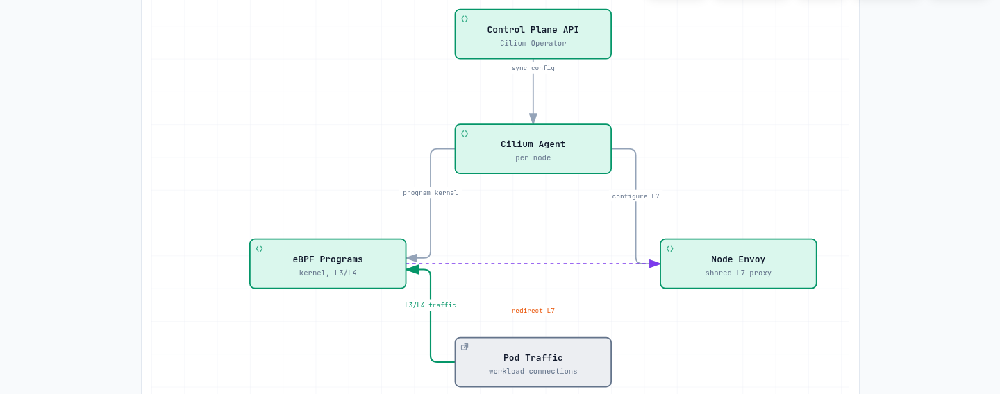

[🔍 View interactive diagram](https://www.atomai.click/kubernetes-docs/archmaps/en-service-mesh-cilium-service-mesh-01-architecture-0.html)

## eBPF Datapath

### What is eBPF?

eBPF (extended Berkeley Packet Filter) is a technology that enables running sandboxed programs within the Linux kernel. It allows implementing networking, security, and observability features without modifying the kernel.

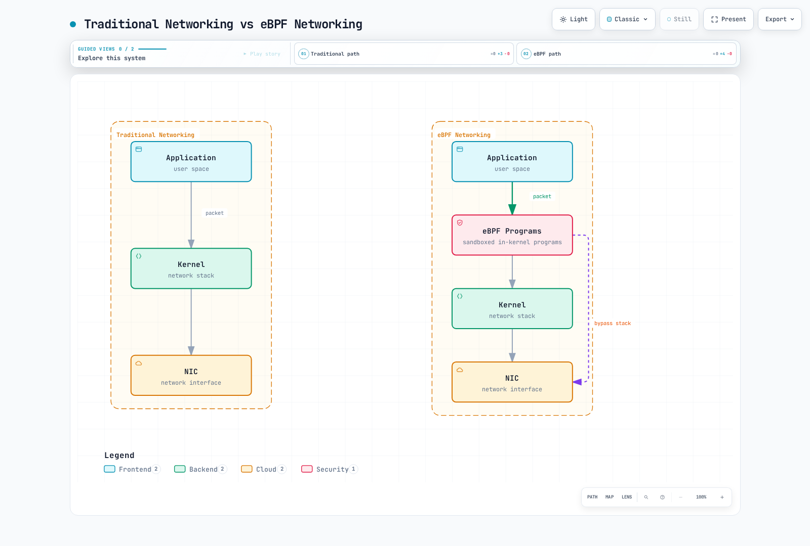

[🔍 View interactive diagram](https://www.atomai.click/kubernetes-docs/archmaps/en-service-mesh-cilium-service-mesh-01-architecture-1.html)

### eBPF Hook Points

Cilium utilizes multiple eBPF hook points:

| Hook Point | Location | Purpose |
|------------|----------|---------|
| **XDP (eXpress Data Path)** | NIC Driver | Ultra-fast packet processing, DDoS protection |
| **TC (Traffic Control)** | Network Stack Entry | Packet filtering, redirection |
| **Socket Operations** | Socket Level | Socket connection acceleration |
| **cgroup** | Process Group | Resource control, policy enforcement |

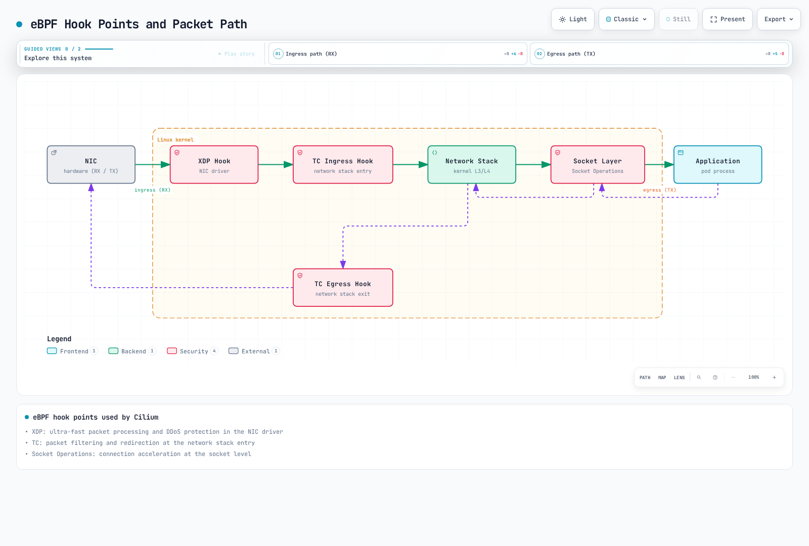

[🔍 View interactive diagram](https://www.atomai.click/kubernetes-docs/archmaps/en-service-mesh-cilium-service-mesh-01-architecture-2.html)

### L3/L4 Processing

L3/L4 processing in eBPF works as follows:

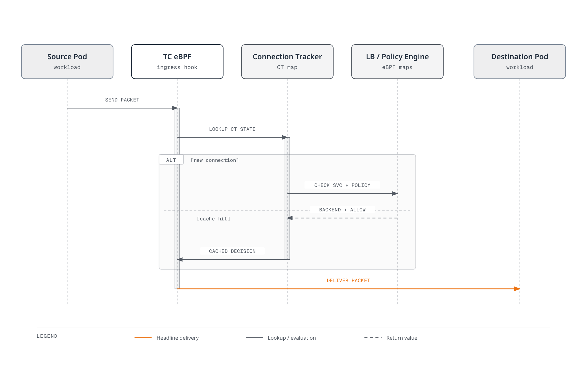

[🔍 View interactive diagram](https://www.atomai.click/kubernetes-docs/archmaps/en-service-mesh-cilium-service-mesh-01-architecture-3.html)

#### eBPF Map Structure

```c
// Connection Tracking Map
struct ct_entry {
    __u32 src_ip;
    __u32 dst_ip;
    __u16 src_port;
    __u16 dst_port;
    __u8  protocol;
    __u64 lifetime;
    __u32 rx_packets;
    __u32 tx_packets;
};

// Service Map
struct lb_service {
    __u32 service_ip;
    __u16 service_port;
    __u32 backend_count;
    __u32 backend_slot;
};

// Policy Map
struct policy_entry {
    __u32 identity;
    __u16 port;
    __u8  protocol;
    __u8  action;  // ALLOW, DENY, AUDIT
};
```

### kube-proxy Replacement

Cilium's eBPF-based load balancer can completely replace kube-proxy:

```yaml
# Enable kube-proxy replacement during Cilium installation
kubeProxyReplacement: true

# Load balancer algorithm configuration
loadBalancer:
  algorithm: maglev  # or random
  mode: dsr          # Direct Server Return
```

**kube-proxy vs Cilium eBPF Comparison:**

| Feature | kube-proxy (iptables) | Cilium eBPF |
|---------|----------------------|-------------|
| Rule Complexity | O(n) - proportional to services | O(1) - hash map lookup |
| Connection Tracking | conntrack module | eBPF CT Map |
| DSR Support | Limited | Full support |
| Session Affinity | iptables-based | Maglev hashing |
| Performance | Medium | High |

## Per-Node Envoy Proxy

### Sidecar vs Node Proxy

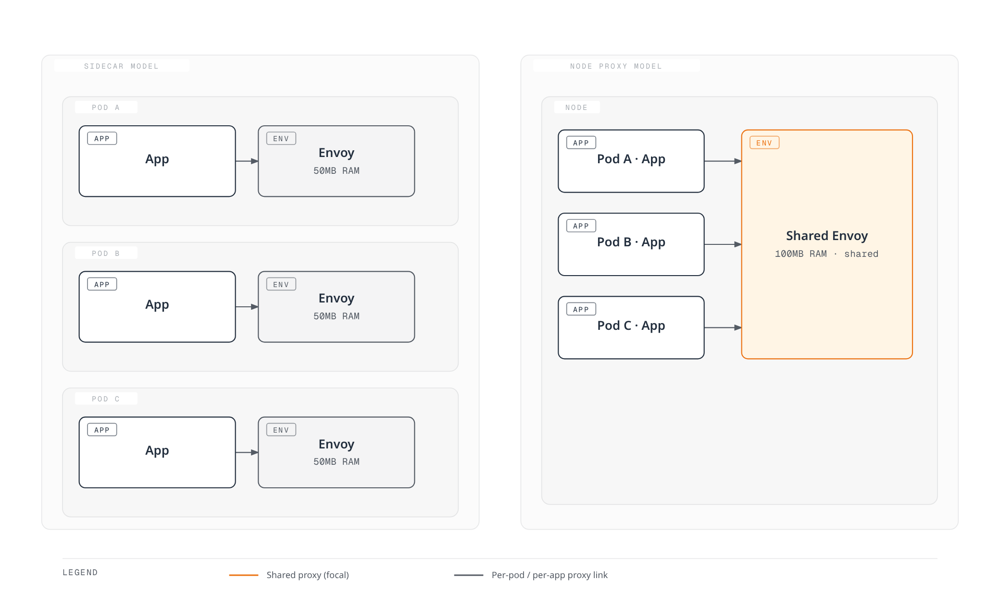

[🔍 View interactive diagram](https://www.atomai.click/kubernetes-docs/archmaps/en-service-mesh-cilium-service-mesh-01-architecture-4.html)

### Envoy Deployment Method

Cilium deploys one Envoy proxy per node as a DaemonSet:

```bash
# Check Envoy DaemonSet
kubectl get daemonset -n kube-system cilium-envoy

# Expected output
NAME           DESIRED   CURRENT   READY   UP-TO-DATE   AVAILABLE
cilium-envoy   3         3         3       3            3
```

### L7 Processing Flow

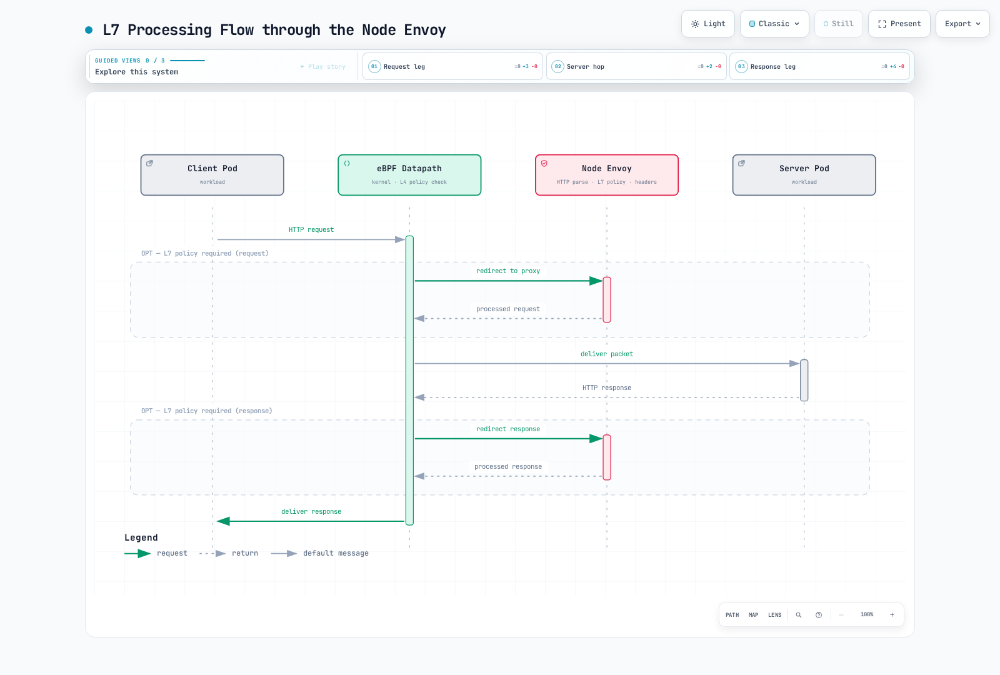

[🔍 View interactive diagram](https://www.atomai.click/kubernetes-docs/archmaps/en-service-mesh-cilium-service-mesh-01-architecture-5.html)

### Envoy Resource Configuration

```yaml
# values.yaml
envoy:
  enabled: true
  resources:
    limits:
      cpu: 2000m
      memory: 2Gi
    requests:
      cpu: 100m
      memory: 256Mi

  # Envoy concurrent connection settings
  maxConnectionsPerHost: 1000
  connectTimeout: 5s

  # Proxy protocol settings
  proxy:
    protocol:
      http2:
        enabled: true
      tls:
        enabled: true
```

## CRD Model

### Cilium CRD Structure

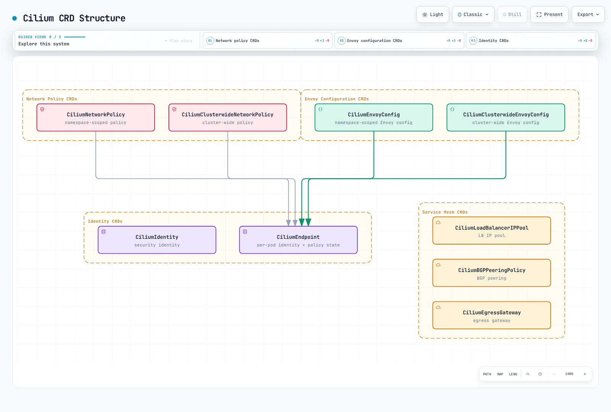

[🔍 View interactive diagram](https://www.atomai.click/kubernetes-docs/archmaps/en-service-mesh-cilium-service-mesh-01-architecture-6.html)

### CiliumEnvoyConfig

CiliumEnvoyConfig defines namespace-scoped Envoy configuration:

```yaml
apiVersion: cilium.io/v2
kind: CiliumEnvoyConfig
metadata:
  name: http-filter
  namespace: default
spec:
  # Services this configuration applies to
  services:
  - name: my-service
    namespace: default

  # Envoy resource definitions
  resources:
  - "@type": type.googleapis.com/envoy.config.listener.v3.Listener
    name: my-service-listener
    filter_chains:
    - filters:
      - name: envoy.filters.network.http_connection_manager
        typed_config:
          "@type": type.googleapis.com/envoy.extensions.filters.network.http_connection_manager.v3.HttpConnectionManager
          stat_prefix: my-service
          route_config:
            name: local_route
            virtual_hosts:
            - name: my-service
              domains: ["*"]
              routes:
              - match:
                  prefix: "/"
                route:
                  cluster: default/my-service
          http_filters:
          - name: envoy.filters.http.router
            typed_config:
              "@type": type.googleapis.com/envoy.extensions.filters.http.router.v3.Router
```

### CiliumClusterwideEnvoyConfig

Cluster-wide Envoy configuration:

```yaml
apiVersion: cilium.io/v2
kind: CiliumClusterwideEnvoyConfig
metadata:
  name: global-ratelimit
spec:
  # Apply to all services cluster-wide
  services:
  - name: "*"
    namespace: "*"

  resources:
  - "@type": type.googleapis.com/envoy.config.listener.v3.Listener
    name: global-listener
    filter_chains:
    - filters:
      - name: envoy.filters.network.http_connection_manager
        typed_config:
          "@type": type.googleapis.com/envoy.extensions.filters.network.http_connection_manager.v3.HttpConnectionManager
          stat_prefix: global
          http_filters:
          - name: envoy.filters.http.local_ratelimit
            typed_config:
              "@type": type.googleapis.com/envoy.extensions.filters.http.local_ratelimit.v3.LocalRateLimit
              stat_prefix: http_local_rate_limiter
              token_bucket:
                max_tokens: 1000
                tokens_per_fill: 100
                fill_interval: 1s
          - name: envoy.filters.http.router
            typed_config:
              "@type": type.googleapis.com/envoy.extensions.filters.http.router.v3.Router
```

### CiliumNetworkPolicy (L7)

Network policy with L7 rules:

```yaml
apiVersion: cilium.io/v2
kind: CiliumNetworkPolicy
metadata:
  name: l7-policy
  namespace: default
spec:
  endpointSelector:
    matchLabels:
      app: backend

  ingress:
  - fromEndpoints:
    - matchLabels:
        app: frontend
    toPorts:
    - ports:
      - port: "8080"
        protocol: TCP
      rules:
        http:
        - method: GET
          path: "/api/v1/.*"
          headers:
          - name: "X-Request-ID"
            value: ".*"
        - method: POST
          path: "/api/v1/users"
        - method: DELETE
          path: "/api/v1/users/[0-9]+"

  egress:
  - toEndpoints:
    - matchLabels:
        app: database
    toPorts:
    - ports:
      - port: "5432"
        protocol: TCP
```

## Cilium Agent and Service Mesh

### Cilium Agent Role


[🔍 View interactive diagram](https://www.atomai.click/kubernetes-docs/archmaps/en-service-mesh-cilium-service-mesh-01-architecture-7.html)

### Agent Configuration

```yaml
# ConfigMap: cilium-config
apiVersion: v1
kind: ConfigMap
metadata:
  name: cilium-config
  namespace: kube-system
data:
  # Agent basic settings
  debug: "false"
  enable-ipv4: "true"
  enable-ipv6: "false"

  # Service mesh settings
  enable-l7-proxy: "true"
  enable-envoy-config: "true"

  # kube-proxy replacement
  kube-proxy-replacement: "true"

  # Observability
  enable-hubble: "true"
  hubble-listen-address: ":4244"
  hubble-metrics-server: ":9965"

  # Encryption
  enable-wireguard: "true"
  enable-ipsec: "false"
```

## Service Identity and SPIFFE

### Cilium Identity

Cilium assigns a unique identity to each workload:

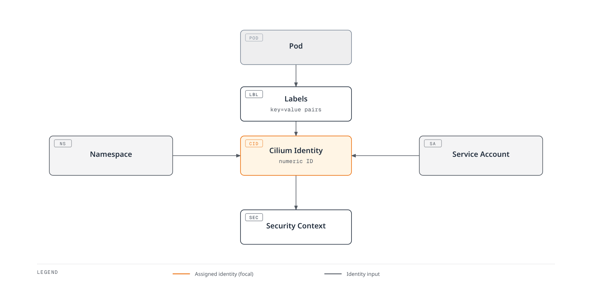

[🔍 View interactive diagram](https://www.atomai.click/kubernetes-docs/archmaps/en-service-mesh-cilium-service-mesh-01-architecture-8.html)

### Identity-based Policy

```yaml
# Check Pod's Identity
apiVersion: cilium.io/v2
kind: CiliumIdentity
metadata:
  name: "12345"
  labels:
    app: frontend
    k8s:io.kubernetes.pod.namespace: default
spec:
  security-labels:
    k8s:app: frontend
    k8s:io.kubernetes.pod.namespace: default
```

```bash
# List identities
cilium identity list

# Expected output
ID      LABELS
1       reserved:host
2       reserved:world
3       reserved:health
12345   k8s:app=frontend,k8s:io.kubernetes.pod.namespace=default
12346   k8s:app=backend,k8s:io.kubernetes.pod.namespace=default
```

### SPIFFE Integration

Workload identity through SPIFFE (Secure Production Identity Framework for Everyone):

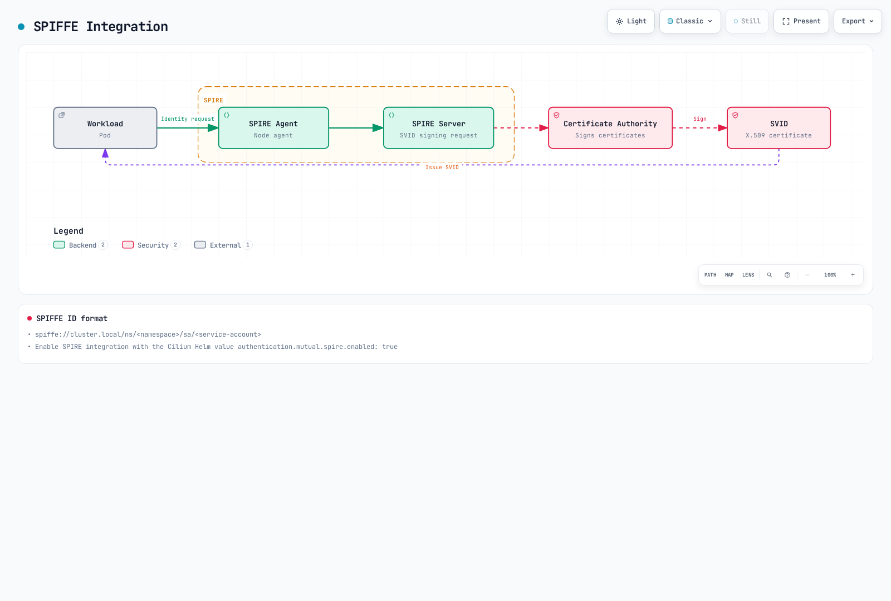

[🔍 View interactive diagram](https://www.atomai.click/kubernetes-docs/archmaps/en-service-mesh-cilium-service-mesh-01-architecture-9.html)

```yaml
# SPIRE integration configuration
authentication:
  mutual:
    spire:
      enabled: true
      install:
        enabled: true
        server:
          dataStorage:
            size: 1Gi
        agent:
          socketPath: /run/spire/sockets/agent.sock
```

SPIFFE ID format:
```
spiffe://cluster.local/ns/<namespace>/sa/<service-account>
```

## Packet Flow Analysis

### Pod-to-Pod Communication (Same Node)


[🔍 View interactive diagram](https://www.atomai.click/kubernetes-docs/archmaps/en-service-mesh-cilium-service-mesh-01-architecture-10.html)

### Pod-to-Pod Communication (Different Nodes)

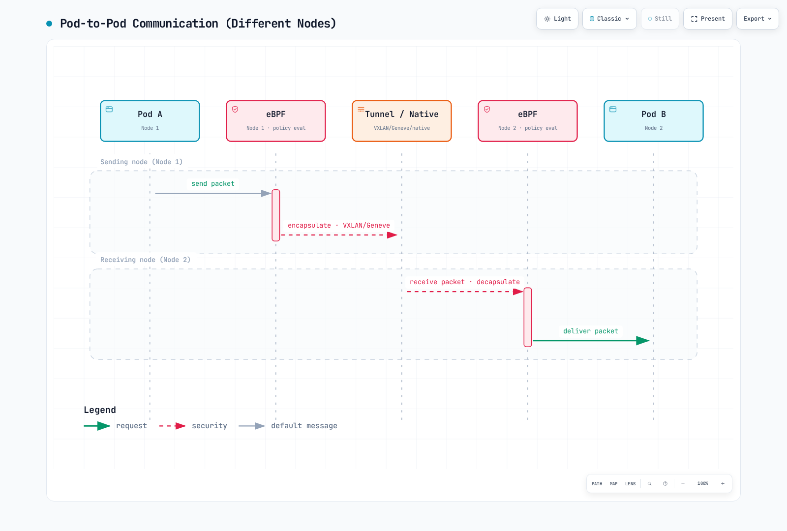

[🔍 View interactive diagram](https://www.atomai.click/kubernetes-docs/archmaps/en-service-mesh-cilium-service-mesh-01-architecture-11.html)

### When L7 Processing is Required

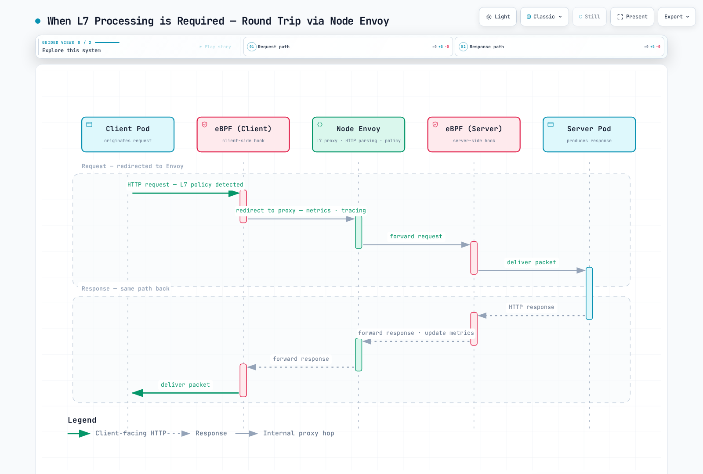

[🔍 View interactive diagram](https://www.atomai.click/kubernetes-docs/archmaps/en-service-mesh-cilium-service-mesh-01-architecture-12.html)

## Comparison with Istio Sidecar Architecture

### Architecture Comparison Table

| Aspect | Cilium Service Mesh | Istio Sidecar |
|--------|---------------------|---------------|
| **Proxy Location** | 1 per node | 1 per Pod |
| **Proxy Type** | eBPF + Envoy | Envoy only |
| **L4 Processing** | Kernel (eBPF) | User space (Envoy) |
| **L7 Processing** | User space (Envoy) | User space (Envoy) |
| **Memory Usage** | ~100MB/node | ~50MB/Pod |
| **CPU Usage** | Low | Medium-High |
| **Latency** | 0.1-0.5ms | 1-3ms |
| **Configuration Model** | CiliumEnvoyConfig | VirtualService/DestinationRule |
| **mTLS Implementation** | eBPF/WireGuard | Envoy |
| **Injection** | Not required | Sidecar injection required |

### Latency Analysis

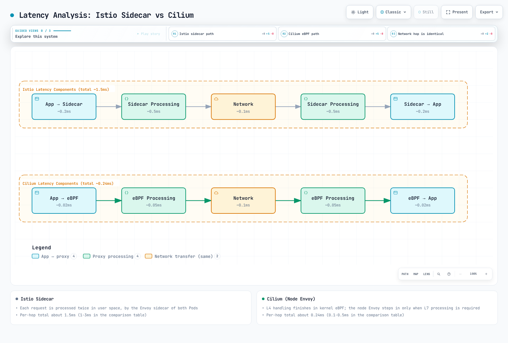

[🔍 View interactive diagram](https://www.atomai.click/kubernetes-docs/archmaps/en-service-mesh-cilium-service-mesh-01-architecture-13.html)

### Resource Efficiency Analysis

For a 100 Pod cluster:

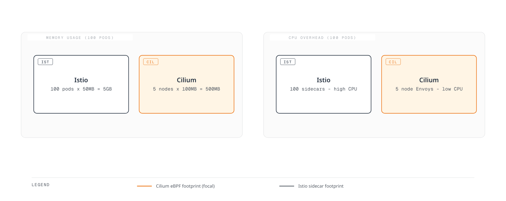

[🔍 View interactive diagram](https://www.atomai.click/kubernetes-docs/archmaps/en-service-mesh-cilium-service-mesh-01-architecture-14.html)

## Scalability Considerations

### eBPF Map Sizes

```yaml
# Cilium ConfigMap settings
bpf-map-dynamic-size-ratio: "0.0025"
bpf-ct-global-tcp-max: "524288"
bpf-ct-global-any-max: "262144"
bpf-nat-global-max: "524288"
bpf-policy-map-max: "16384"
```

### Large Cluster Configuration

```yaml
# Large cluster (1000+ nodes) configuration
apiVersion: v1
kind: ConfigMap
metadata:
  name: cilium-config
  namespace: kube-system
data:
  # Identity-related settings
  cluster-id: "1"
  cluster-name: "production"

  # Connection tracking optimization
  bpf-ct-global-tcp-max: "1048576"
  bpf-ct-global-any-max: "524288"

  # NAT table size
  bpf-nat-global-max: "1048576"

  # Policy map size
  bpf-policy-map-max: "65536"

  # Performance optimization
  sockops-enable: "true"
  bpf-lb-sock: "true"

  # Hubble settings
  hubble-disable: "false"
  hubble-socket-path: "/var/run/cilium/hubble.sock"
```

### Node Envoy Scaling

```yaml
# Envoy resource scaling
envoy:
  resources:
    limits:
      cpu: 4000m
      memory: 4Gi
    requests:
      cpu: 500m
      memory: 512Mi

  # Envoy worker threads
  concurrency: 4

  # Connection limits
  perConnectionBufferLimitBytes: 32768

  # Cluster settings
  cluster:
    connectTimeout: 5s
    circuitBreakers:
      maxConnections: 10000
      maxPendingRequests: 10000
      maxRequests: 10000
```

## Next Steps

- [Traffic Management](./02-traffic-management.md): Configure L7 routing and traffic control
- [Security](./03-security.md): Set up mTLS and L7 network policies
- [Observability](./04-observability.md): Monitor service mesh with Hubble

## References

- [Cilium Architecture Documentation](https://docs.cilium.io/en/stable/concepts/overview/)
- [eBPF Documentation](https://ebpf.io/what-is-ebpf/)
- [Envoy Proxy Architecture](https://www.envoyproxy.io/docs/envoy/latest/intro/arch_overview/arch_overview)
- [SPIFFE Specification](https://spiffe.io/docs/latest/spiffe-about/overview/)
