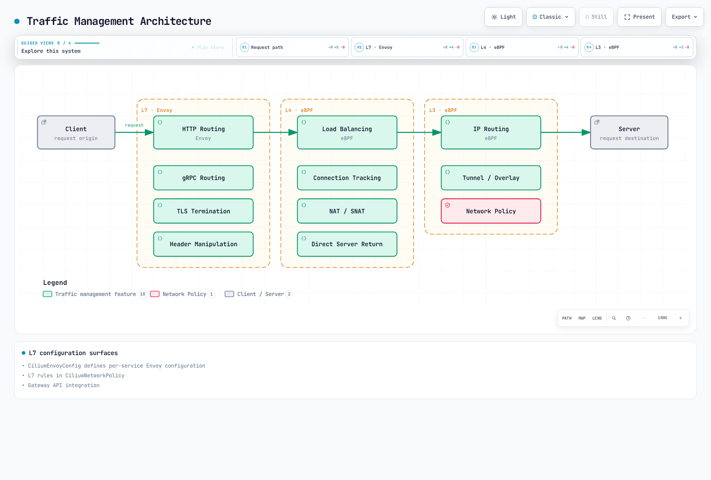

# Cilium Service Mesh Traffic Management

> **Review baseline**: Cilium 1.20.1 and Gateway API 1.6.1, September 11, 2026. See the [overview](./README.md) for the Kubernetes/EKS test matrices and platform requirements.

## Overview

Traffic management in Cilium Service Mesh combines eBPF-based L4 load balancing with Envoy-based L7 routing. This chapter explains advanced traffic management features through CiliumEnvoyConfig, L7 rules in CiliumNetworkPolicy, and Gateway API integration.

## Traffic Management Architecture



[🔍 View interactive diagram](https://www.atomai.click/kubernetes-docs/archmaps/en-service-mesh-cilium-service-mesh-02-traffic-management-0.html)

The figure groups capabilities by layer. It is not a mandatory packet-processing order: L3/L4-only traffic can avoid Envoy, and the actual egress/ingress/Service path depends on configuration.

## CiliumEnvoyConfig

These are **independent configuration examples**, not resources to install together. Several examples target the same frontend Service; choose one configuration owner to avoid conflicting listeners. The examples assume a prepared Cilium installation with `l7Proxy: true`, `envoyConfig.enabled: true`, appropriate kube-proxy replacement/routing settings, and the required CRDs.

Each named frontend and backend Service must already exist in `default` with port **8080**, appropriate selectors and ready HTTP endpoints. The Kafka and gRPC sections specify their own namespace/port prerequisites. CEC examples do not create workloads, Services or certificates.

`services` selects a frontend for redirection and synchronizes its backends; `backendServices` synchronizes other backends without redirecting their own frontend traffic. EDS Cluster resources must still exist. Cilium intentionally supplies omitted Listener addresses/xDS sources. Kubernetes acceptance alone is insufficient: inspect agent/Envoy errors and verify actual requests. Refer to the [architecture chapter](./01-architecture.md) for ownership and validation boundaries.

### Basic Structure

CiliumEnvoyConfig defines Envoy configuration for specific services:

```yaml
apiVersion: cilium.io/v2
kind: CiliumEnvoyConfig
metadata:
  name: my-service-config
  namespace: default
spec:
  services:
  - name: my-service
    namespace: default
    ports:
    - 8080
  backendServices:
  - name: backend-v1
    namespace: default
  - name: backend-v2
    namespace: default
  resources:
  - '@type': type.googleapis.com/envoy.config.listener.v3.Listener
    name: my-service-listener
    filter_chains:
    - filters:
      - name: envoy.filters.network.http_connection_manager
        typed_config:
          '@type': type.googleapis.com/envoy.extensions.filters.network.http_connection_manager.v3.HttpConnectionManager
          stat_prefix: my-service-listener
          route_config:
            name: my-service-listener-routes
            virtual_hosts:
            - name: api
              domains:
              - '*'
              routes:
              - match:
                  prefix: /
                route:
                  weighted_clusters:
                    clusters:
                    - name: default/backend-v1
                      weight: 50
                    - name: default/backend-v2
                      weight: 50
          http_filters:
          - name: envoy.filters.http.router
            typed_config:
              '@type': type.googleapis.com/envoy.extensions.filters.http.router.v3.Router
  - '@type': type.googleapis.com/envoy.config.cluster.v3.Cluster
    name: default/backend-v1
    connect_timeout: 5s
    type: EDS
    lb_policy: ROUND_ROBIN
  - '@type': type.googleapis.com/envoy.config.cluster.v3.Cluster
    name: default/backend-v2
    connect_timeout: 5s
    type: EDS
    lb_policy: ROUND_ROBIN
```

This complete example distributes requests between two explicitly named backends. The Listener, HTTP route and EDS Clusters are separate pieces; listing backend Services alone does not define those Clusters.

### HTTP Routing

#### Path-based Routing

```yaml
apiVersion: cilium.io/v2
kind: CiliumEnvoyConfig
metadata:
  name: path-routing
  namespace: default
spec:
  services:
  - name: api-gateway
    namespace: default
    ports:
    - 8080
  backendServices:
  - name: users-service
    namespace: default
  - name: orders-service
    namespace: default
  - name: products-service
    namespace: default
  resources:
  - '@type': type.googleapis.com/envoy.config.listener.v3.Listener
    name: api-gateway-listener
    filter_chains:
    - filters:
      - name: envoy.filters.network.http_connection_manager
        typed_config:
          '@type': type.googleapis.com/envoy.extensions.filters.network.http_connection_manager.v3.HttpConnectionManager
          stat_prefix: api-gateway
          codec_type: AUTO
          route_config:
            name: api_routes
            virtual_hosts:
            - name: api
              domains:
              - '*'
              routes:
              - match:
                  path_separated_prefix: /users
                route:
                  cluster: default/users-service
              - match:
                  path_separated_prefix: /orders
                route:
                  cluster: default/orders-service
              - match:
                  path_separated_prefix: /products
                route:
                  cluster: default/products-service
              - match:
                  prefix: /
                direct_response:
                  status: 404
                  body:
                    inline_string: Not Found
          http_filters:
          - name: envoy.filters.http.router
            typed_config:
              '@type': type.googleapis.com/envoy.extensions.filters.http.router.v3.Router
  - '@type': type.googleapis.com/envoy.config.cluster.v3.Cluster
    name: default/orders-service
    connect_timeout: 5s
    type: EDS
    lb_policy: ROUND_ROBIN
  - '@type': type.googleapis.com/envoy.config.cluster.v3.Cluster
    name: default/products-service
    connect_timeout: 5s
    type: EDS
    lb_policy: ROUND_ROBIN
  - '@type': type.googleapis.com/envoy.config.cluster.v3.Cluster
    name: default/users-service
    connect_timeout: 5s
    type: EDS
    lb_policy: ROUND_ROBIN
```

Envoy evaluates these routes in order. `path_separated_prefix` matches `/users` and `/users/123`, but not `/users-old`; the final `/` rule is the fallback. This differs from an arbitrary string prefix.

#### Header-based Routing

```yaml
apiVersion: cilium.io/v2
kind: CiliumEnvoyConfig
metadata:
  name: header-routing
  namespace: default
spec:
  services:
  - name: api-service
    namespace: default
    ports:
    - 8080
  backendServices:
  - name: api-v1
    namespace: default
  - name: api-v2
    namespace: default
  - name: api-beta
    namespace: default
  resources:
  - '@type': type.googleapis.com/envoy.config.listener.v3.Listener
    name: header-routing-listener
    filter_chains:
    - filters:
      - name: envoy.filters.network.http_connection_manager
        typed_config:
          '@type': type.googleapis.com/envoy.extensions.filters.network.http_connection_manager.v3.HttpConnectionManager
          stat_prefix: api-service
          route_config:
            name: header_routes
            virtual_hosts:
            - name: api
              domains:
              - '*'
              routes:
              - match:
                  prefix: /
                  headers:
                  - name: X-API-Version
                    string_match:
                      exact: v2
                route:
                  cluster: default/api-v2
              - match:
                  prefix: /
                  headers:
                  - name: X-Beta-User
                    string_match:
                      exact: 'true'
                route:
                  cluster: default/api-beta
              - match:
                  prefix: /
                route:
                  cluster: default/api-v1
          http_filters:
          - name: envoy.filters.http.router
            typed_config:
              '@type': type.googleapis.com/envoy.extensions.filters.http.router.v3.Router
  - '@type': type.googleapis.com/envoy.config.cluster.v3.Cluster
    name: default/api-beta
    connect_timeout: 5s
    type: EDS
    lb_policy: ROUND_ROBIN
  - '@type': type.googleapis.com/envoy.config.cluster.v3.Cluster
    name: default/api-v1
    connect_timeout: 5s
    type: EDS
    lb_policy: ROUND_ROBIN
  - '@type': type.googleapis.com/envoy.config.cluster.v3.Cluster
    name: default/api-v2
    connect_timeout: 5s
    type: EDS
    lb_policy: ROUND_ROBIN
```

The first matching rule wins: a request carrying both headers selects v2. Client-controlled version/beta headers are routing hints, not proof that a user is authorized to access that backend.

#### Method-based Routing

```yaml
apiVersion: cilium.io/v2
kind: CiliumEnvoyConfig
metadata:
  name: method-routing
  namespace: default
spec:
  services:
  - name: rest-api
    namespace: default
    ports:
    - 8080
  backendServices:
  - name: read-service
    namespace: default
  - name: write-service
    namespace: default
  resources:
  - '@type': type.googleapis.com/envoy.config.listener.v3.Listener
    name: method-routing-listener
    filter_chains:
    - filters:
      - name: envoy.filters.network.http_connection_manager
        typed_config:
          '@type': type.googleapis.com/envoy.extensions.filters.network.http_connection_manager.v3.HttpConnectionManager
          stat_prefix: rest-api
          route_config:
            name: method_routes
            virtual_hosts:
            - name: api
              domains:
              - '*'
              routes:
              - match:
                  prefix: /
                  headers:
                  - name: :method
                    string_match:
                      safe_regex:
                        google_re2: {}
                        regex: ^(GET|HEAD)$
                route:
                  cluster: default/read-service
              - match:
                  prefix: /
                  headers:
                  - name: :method
                    string_match:
                      safe_regex:
                        google_re2: {}
                        regex: ^(POST|PUT|DELETE|PATCH)$
                route:
                  cluster: default/write-service
              - match:
                  prefix: /
                direct_response:
                  status: 405
                response_headers_to_add:
                - header:
                    key: allow
                    value: GET, HEAD, POST, PUT, DELETE, PATCH
                  append_action: OVERWRITE_IF_EXISTS_OR_ADD
          http_filters:
          - name: envoy.filters.http.router
            typed_config:
              '@type': type.googleapis.com/envoy.extensions.filters.http.router.v3.Router
  - '@type': type.googleapis.com/envoy.config.cluster.v3.Cluster
    name: default/read-service
    connect_timeout: 5s
    type: EDS
    lb_policy: ROUND_ROBIN
  - '@type': type.googleapis.com/envoy.config.cluster.v3.Cluster
    name: default/write-service
    connect_timeout: 5s
    type: EDS
    lb_policy: ROUND_ROBIN
```

GET/HEAD select the read Service; POST/PUT/DELETE/PATCH select the write Service. Other methods receive 405. Add required OPTIONS/CORS or application-specific behavior deliberately. Routing a write to a dedicated backend does not itself implement authorization or idempotency.

## L7 Traffic Policies

### CiliumNetworkPolicy L7 Rules

CiliumNetworkPolicy enables fine-grained traffic control at the L7 level:

```yaml
apiVersion: cilium.io/v2
kind: CiliumNetworkPolicy
metadata:
  name: l7-http-policy
  namespace: default
spec:
  endpointSelector:
    matchLabels:
      k8s:app: backend-api
  ingress:
  - fromEndpoints:
    - matchLabels:
        k8s:app: frontend
        k8s:io.kubernetes.pod.namespace: default
    toPorts:
    - ports:
      - port: '8080'
        protocol: TCP
      rules:
        http:
        - method: ^GET$
          path: ^/api/users/.*$
        - method: ^GET$
          path: ^/api/products/.*$
        - method: ^POST$
          path: ^/api/orders$
        - method: ^GET$
          path: ^/api/admin/.*$
          headerMatches:
          - name: X-API-Version
            value: v1
```

Rules are alternatives; the header condition applies only to the admin-path rule. `X-API-Version: v1` is an exact routing/version condition, not an admin credential. Enforce user authentication and authorization in the application. The policy selects ingress traffic from the stated namespace, and other applicable policy grants may widen access.

### Various Protocol Support

#### Kafka: Network Boundaries and Broker ACLs

```yaml
apiVersion: cilium.io/v2
kind: CiliumNetworkPolicy
metadata:
  name: kafka-l4-policy
  namespace: kafka
spec:
  endpointSelector:
    matchLabels:
      k8s:app: kafka-broker
  ingress:
  - fromEndpoints:
    - matchLabels:
        k8s:app: kafka-producer
        k8s:io.kubernetes.pod.namespace: kafka
    toPorts:
    - ports:
      - port: '9092'
        protocol: TCP
  - fromEndpoints:
    - matchLabels:
        k8s:app: kafka-consumer
        k8s:io.kubernetes.pod.namespace: kafka
    toPorts:
    - ports:
      - port: '9092'
        protocol: TCP
```

The Cilium 1.20.1 L7 policy API supports HTTP and DNS; the old `rules.kafka` API is absent. The released CRD rejects this Kafka rules object. Removing its L7 rules would leave only L4 permission, not topic-level authorization. This replacement only permits the listed clients to the preconfigured broker listener on TCP 9092. Configure Kafka TLS/SASL and broker ACLs for topics, consumer groups and operations separately; network policy cannot distinguish produce from fetch here.

#### DNS L7 Policy

```yaml
apiVersion: cilium.io/v2
kind: CiliumNetworkPolicy
metadata:
  name: dns-l7-policy
  namespace: default
spec:
  endpointSelector:
    matchLabels:
      k8s:app: web-app
  egress:
  - toEndpoints:
    - matchLabels:
        k8s:io.kubernetes.pod.namespace: kube-system
        k8s:k8s-app: kube-dns
    toPorts:
    - ports:
      - port: '53'
        protocol: UDP
      - port: '53'
        protocol: TCP
      rules:
        dns:
        - matchPattern: '*.example.com'
        - matchPattern: api.external-service.io
        - matchName: database.internal.svc.cluster.local
```

This example permits **DNS queries only**, over UDP and TCP to the selected cluster resolver. It does not permit HTTPS/database connections to the returned addresses; add separate `toFQDNs`/endpoint and port rules for intended destinations. `*.example.com` does not include the apex `example.com` or arbitrary nested subdomains. Resolver search-list queries must also be considered, and NodeLocal DNS needs a different verified destination rule. Restricting names is not a guarantee against data exfiltration, DoH or misuse of allowed domains.

#### gRPC L7 Policy

```yaml
apiVersion: cilium.io/v2
kind: CiliumNetworkPolicy
metadata:
  name: grpc-l7-policy
  namespace: default
spec:
  endpointSelector:
    matchLabels:
      k8s:app: grpc-server
  ingress:
  - fromEndpoints:
    - matchLabels:
        k8s:app: grpc-client
        k8s:io.kubernetes.pod.namespace: default
    toPorts:
    - ports:
      - port: '50051'
        protocol: TCP
      rules:
        http:
        - method: ^POST$
          path: ^/myapp\.UserService/GetUser$
        - method: ^POST$
          path: ^/myapp\.UserService/ListUsers$
        - method: ^POST$
          path: ^/myapp\.OrderService/.*$
```

These HTTP/2 rules match the gRPC `POST /package.Service/Method` path. The dot in the package name is escaped and the expressions are anchored. Assume a supported inspectable HTTP/2 path; encrypted application traffic requires the corresponding TLS setup. Health/reflection and other methods are not implicitly permitted, and HTTP policy cannot authorize fields inside a protobuf message.

## Load Balancing

### L4 Load Balancing (eBPF)

eBPF-based L4 load balancing replaces kube-proxy:

```yaml
kubeProxyReplacement: true
k8sServiceHost: <reachable-api-server-host>
k8sServicePort: 6443
loadBalancer:
  algorithm: maglev
  mode: snat
nodePort:
  enableHealthCheck: true
```

The API endpoint must be reachable during bootstrap; use its actual port (normally 443 for EKS). Preserve the chosen platform's IPAM/routing settings. `nodePort.enableHealthCheck` is the chart key; the former `loadBalancer.healthCheckNodePort` did not configure it. `loadBalancer.serviceTopology` concerns topology-aware routing, not ClientIP session affinity. DSR dispatch/routing combinations require a separate design; the documented dispatch choices are `opt` and `geneve`, not `ipip`. See the [architecture discussion](./01-architecture.md#kube-proxy-replacement).

#### Maglev Hashing

Maglev maps a flow key through a lookup table to a backend for applicable external traffic. It minimizes reassignment when the backend set changes; it does not preserve a session on a removed backend or replace `Service.spec.sessionAffinity: ClientIP`.

Cilium 1.20.1's default eBPF Maglev table size is **16,381**. Supported sizes include **65,521**, while **65,537** belongs to the separate Envoy MAGLEV example below and is not a supported Cilium `maglev.tableSize` value. All nodes need consistent configuration. Socket-level east–west Service translation is not subject to this Maglev path.

### L7 Load Balancing (Envoy)

L7 load balancing is provided through Envoy:

```yaml
apiVersion: cilium.io/v2
kind: CiliumEnvoyConfig
metadata:
  name: l7-load-balancing
  namespace: default
spec:
  services:
  - name: api-service
    namespace: default
    ports:
    - 8080
  backendServices:
  - name: api-backend
    namespace: default
  resources:
  - '@type': type.googleapis.com/envoy.config.listener.v3.Listener
    name: l7-load-balancer
    filter_chains:
    - filters:
      - name: envoy.filters.network.http_connection_manager
        typed_config:
          '@type': type.googleapis.com/envoy.extensions.filters.network.http_connection_manager.v3.HttpConnectionManager
          stat_prefix: l7-load-balancer
          route_config:
            name: l7-load-balancer-routes
            virtual_hosts:
            - name: api
              domains:
              - '*'
              routes:
              - match:
                  prefix: /
                route:
                  cluster: default/api-backend
          http_filters:
          - name: envoy.filters.http.router
            typed_config:
              '@type': type.googleapis.com/envoy.extensions.filters.http.router.v3.Router
  - '@type': type.googleapis.com/envoy.config.cluster.v3.Cluster
    name: default/api-backend
    connect_timeout: 5s
    type: EDS
    lb_policy: ROUND_ROBIN
    outlier_detection:
      consecutive_5xx: 5
      interval: 10s
      base_ejection_time: 30s
      max_ejection_percent: 50
    health_checks:
    - timeout: 5s
      interval: 10s
      unhealthy_threshold: 3
      healthy_threshold: 2
      http_health_check:
        path: /health
        expected_statuses:
        - start: 200
          end: 300
    circuit_breakers:
      thresholds:
      - priority: DEFAULT
        max_connections: 1000
        max_pending_requests: 1000
        max_requests: 1000
        max_retries: 3
```

Active `/health` probes, passive outlier detection and circuit-breaker capacity limits are different mechanisms. The HTTP health range is `[200, 300)`, so 299 is included. The backend must implement the health endpoint, and policy must permit the probe path. Outlier ejection is not a guarantee that every request avoids a failed endpoint. `max_retries` in `circuit_breakers.thresholds` limits concurrent retry resources; it is not the retry count for each request.

#### Load Balancing Algorithm Options

Choose **one** Cluster fragment below; they are alternatives, not a YAML mapping with repeated `lb_policy` keys. RING_HASH/MAGLEV also need an appropriate route `hash_policy` if requests should consistently use an application key; without a supplied hash, selection can fall back to a random key. Envoy's L7 MAGLEV table is separate from Cilium's eBPF Maglev table.

```yaml
lb_policy: ROUND_ROBIN
```

```yaml
lb_policy: LEAST_REQUEST
least_request_lb_config:
  choice_count: 2
```

```yaml
lb_policy: RANDOM
```

```yaml
lb_policy: RING_HASH
ring_hash_lb_config:
  hash_function: XX_HASH
  minimum_ring_size: 1024
  maximum_ring_size: 8388608
```

```yaml
lb_policy: MAGLEV
maglev_lb_config:
  table_size: 65537
```

## Traffic Splitting (Canary Deployment)

### Weight-based Traffic Splitting

```yaml
apiVersion: cilium.io/v2
kind: CiliumEnvoyConfig
metadata:
  name: canary-deployment
  namespace: default
spec:
  services:
  - name: frontend
    namespace: default
    ports:
    - 8080
  backendServices:
  - name: frontend-stable
    namespace: default
  - name: frontend-canary
    namespace: default
  resources:
  - '@type': type.googleapis.com/envoy.config.listener.v3.Listener
    name: canary-listener
    filter_chains:
    - filters:
      - name: envoy.filters.network.http_connection_manager
        typed_config:
          '@type': type.googleapis.com/envoy.extensions.filters.network.http_connection_manager.v3.HttpConnectionManager
          stat_prefix: frontend
          route_config:
            name: canary_routes
            virtual_hosts:
            - name: frontend
              domains:
              - '*'
              routes:
              - match:
                  prefix: /
                route:
                  weighted_clusters:
                    clusters:
                    - name: default/frontend-stable
                      weight: 90
                    - name: default/frontend-canary
                      weight: 10
          http_filters:
          - name: envoy.filters.http.router
            typed_config:
              '@type': type.googleapis.com/envoy.extensions.filters.http.router.v3.Router
  - '@type': type.googleapis.com/envoy.config.cluster.v3.Cluster
    name: default/frontend-canary
    connect_timeout: 5s
    type: EDS
    lb_policy: ROUND_ROBIN
  - '@type': type.googleapis.com/envoy.config.cluster.v3.Cluster
    name: default/frontend-stable
    connect_timeout: 5s
    type: EDS
    lb_policy: ROUND_ROBIN
```

Weights 90 and 10 express relative selection probabilities, not an exact count in each ten requests or a per-user/session guarantee. Current Envoy uses the sum of weights; the deprecated `total_weight` field is omitted. This is traffic selection only, with no automatic health-analysis, promotion or rollback loop.

### Header-based Canary

```yaml
apiVersion: cilium.io/v2
kind: CiliumEnvoyConfig
metadata:
  name: header-canary
  namespace: default
spec:
  services:
  - name: api
    namespace: default
    ports:
    - 8080
  backendServices:
  - name: api-stable
    namespace: default
  - name: api-canary
    namespace: default
  resources:
  - '@type': type.googleapis.com/envoy.config.listener.v3.Listener
    name: header-canary-listener
    filter_chains:
    - filters:
      - name: envoy.filters.network.http_connection_manager
        typed_config:
          '@type': type.googleapis.com/envoy.extensions.filters.network.http_connection_manager.v3.HttpConnectionManager
          stat_prefix: api
          route_config:
            name: header_canary_routes
            virtual_hosts:
            - name: api
              domains:
              - '*'
              routes:
              - match:
                  prefix: /
                  headers:
                  - name: X-Canary
                    string_match:
                      exact: 'true'
                route:
                  cluster: default/api-canary
              - match:
                  prefix: /
                route:
                  cluster: default/api-stable
          http_filters:
          - name: envoy.filters.http.router
            typed_config:
              '@type': type.googleapis.com/envoy.extensions.filters.http.router.v3.Router
  - '@type': type.googleapis.com/envoy.config.cluster.v3.Cluster
    name: default/api-canary
    connect_timeout: 5s
    type: EDS
    lb_policy: ROUND_ROBIN
  - '@type': type.googleapis.com/envoy.config.cluster.v3.Cluster
    name: default/api-stable
    connect_timeout: 5s
    type: EDS
    lb_policy: ROUND_ROBIN
```

Only the exact `X-Canary: true` value selects canary; other requests select stable. Treat this header as untrusted unless an authenticated boundary controls it. Keep stable/canary application state and compatibility requirements in the rollout plan.

## Retry and Timeout

### Retry Configuration

```yaml
apiVersion: cilium.io/v2
kind: CiliumEnvoyConfig
metadata:
  name: retry-config
  namespace: default
spec:
  services:
  - name: api-service
    namespace: default
    ports:
    - 8080
  backendServices:
  - name: api-backend
    namespace: default
  resources:
  - '@type': type.googleapis.com/envoy.config.listener.v3.Listener
    name: retry-listener
    filter_chains:
    - filters:
      - name: envoy.filters.network.http_connection_manager
        typed_config:
          '@type': type.googleapis.com/envoy.extensions.filters.network.http_connection_manager.v3.HttpConnectionManager
          stat_prefix: api-service
          route_config:
            name: retry_routes
            virtual_hosts:
            - name: api
              domains:
              - '*'
              routes:
              - match:
                  prefix: /
                  headers:
                  - name: :method
                    string_match:
                      exact: GET
                route:
                  cluster: default/api-backend
                  timeout: 7s
                  retry_policy:
                    retry_on: 5xx,reset,connect-failure
                    num_retries: 2
                    per_try_timeout: 2s
                    retry_back_off:
                      base_interval: 0.025s
                      max_interval: 0.25s
                    retriable_request_headers:
                    - name: :method
                      string_match:
                        exact: GET
              - match:
                  prefix: /
                route:
                  cluster: default/api-backend
                  timeout: 7s
                  retry_policy:
                    num_retries: 0
          http_filters:
          - name: envoy.filters.http.router
            typed_config:
              '@type': type.googleapis.com/envoy.extensions.filters.http.router.v3.Router
          early_header_mutation_extensions:
          - name: envoy.http.early_header_mutation.header_mutation
            typed_config:
              '@type': type.googleapis.com/envoy.extensions.http.early_header_mutation.header_mutation.v3.HeaderMutation
              mutations:
              - remove: x-envoy-retry-on
              - remove: x-envoy-retry-grpc-on
              - remove: x-envoy-max-retries
              - remove: x-envoy-hedge-on-per-try-timeout
              - remove: x-envoy-retriable-header-names
              - remove: x-envoy-retriable-status-codes
              - remove: x-envoy-upstream-rq-timeout-ms
              - remove: x-envoy-upstream-rq-per-try-timeout-ms
              - remove: x-envoy-expected-rq-timeout-ms
              - remove: x-envoy-upstream-stream-duration-ms
  - '@type': type.googleapis.com/envoy.config.cluster.v3.Cluster
    name: default/api-backend
    connect_timeout: 5s
    type: EDS
    lb_policy: ROUND_ROBIN
```

Only GET requests receive retries: at most **two additional attempts**, with a 2-second timeout per attempt and a 7-second route timeout. Per-try timeout includes the initial attempt; it is not the delay between retries. Backoff is separately configured. The non-GET fallback explicitly sets `num_retries: 0`.

The early-header mutation extension removes Envoy retry/timeout override headers before routing and timeout calculation. It is compiled into the Cilium 1.20.1 proxy image; the ordinary HTTP `header_mutation` and Lua filters are not enabled in that build. The former `previous_priorities` retry-priority extension is also unavailable in this image. Do not assume that every upstream Envoy extension is available.

Use this example for HTTP endpoints whose GET operation is safe to repeat. An application/client or another proxy may still retry independently. Keep writes single-attempt unless the application provides a reviewed idempotency mechanism. `retriable_headers` concerns **upstream response** headers and is consulted with `retry_on: retriable-headers`; `retriable_request_headers` instead restricts eligible requests. Those fields are not interchangeable. `retriable-4xx` is not a blanket retry of all 4xx responses.

### Timeout Configuration

```yaml
apiVersion: cilium.io/v2
kind: CiliumEnvoyConfig
metadata:
  name: timeout-config
  namespace: default
spec:
  services:
  - name: slow-service
    namespace: default
    ports:
    - 8080
  resources:
  - '@type': type.googleapis.com/envoy.config.listener.v3.Listener
    name: timeout-listener
    filter_chains:
    - filters:
      - name: envoy.filters.network.http_connection_manager
        typed_config:
          '@type': type.googleapis.com/envoy.extensions.filters.network.http_connection_manager.v3.HttpConnectionManager
          stat_prefix: slow-service
          common_http_protocol_options:
            idle_timeout: 300s
            headers_with_underscores_action: REJECT_REQUEST
          stream_idle_timeout: 60s
          request_timeout: 0s
          route_config:
            name: timeout_routes
            virtual_hosts:
            - name: slow-service
              domains:
              - '*'
              routes:
              - match:
                  path_separated_prefix: /long-running
                route:
                  cluster: default/slow-service
                  timeout: 300s
                  idle_timeout: 300s
                  retry_policy:
                    num_retries: 0
              - match:
                  path_separated_prefix: /stream
                route:
                  cluster: default/slow-service
                  timeout: 0s
                  idle_timeout: 60s
                  retry_policy:
                    num_retries: 0
              - match:
                  prefix: /
                route:
                  cluster: default/slow-service
                  timeout: 60s
                  retry_policy:
                    num_retries: 0
          http_filters:
          - name: envoy.filters.http.router
            typed_config:
              '@type': type.googleapis.com/envoy.extensions.filters.http.router.v3.Router
          early_header_mutation_extensions:
          - name: envoy.http.early_header_mutation.header_mutation
            typed_config:
              '@type': type.googleapis.com/envoy.extensions.http.early_header_mutation.header_mutation.v3.HeaderMutation
              mutations:
              - remove: x-envoy-retry-on
              - remove: x-envoy-retry-grpc-on
              - remove: x-envoy-max-retries
              - remove: x-envoy-hedge-on-per-try-timeout
              - remove: x-envoy-retriable-header-names
              - remove: x-envoy-retriable-status-codes
              - remove: x-envoy-upstream-rq-timeout-ms
              - remove: x-envoy-upstream-rq-per-try-timeout-ms
              - remove: x-envoy-expected-rq-timeout-ms
              - remove: x-envoy-upstream-stream-duration-ms
  - '@type': type.googleapis.com/envoy.config.cluster.v3.Cluster
    name: default/slow-service
    connect_timeout: 5s
    type: EDS
    lb_policy: ROUND_ROBIN
```

Specific paths precede the fallback: `/long-running` receives a 300-second route/stream-idle budget; `/stream` disables only the route's overall response timeout and retains a 60-second idle limit; other paths use the 60-second route timeout. `/streaming` does not match `/stream`.

The upstream Cluster's `connect_timeout` is a connection-establishment limit. `common_http_protocol_options.idle_timeout` is a downstream connection idle limit. HCM `request_timeout` limits receipt of the client request, not backend processing; it is disabled here for streaming requests. This requires corresponding edge/header/body/connection controls for exposed services. A nonzero stream idle timeout, client deadlines, infrastructure limits and connection loss can still end a stream. `timeout: 0s` does not promise an unlimited connection.

## Rate Limiting

### Local Rate Limiting

```yaml
apiVersion: cilium.io/v2
kind: CiliumEnvoyConfig
metadata:
  name: local-ratelimit
  namespace: default
spec:
  services:
  - name: api-service
    namespace: default
    ports:
    - 8080
  resources:
  - '@type': type.googleapis.com/envoy.config.listener.v3.Listener
    name: ratelimit-listener
    filter_chains:
    - filters:
      - name: envoy.filters.network.http_connection_manager
        typed_config:
          '@type': type.googleapis.com/envoy.extensions.filters.network.http_connection_manager.v3.HttpConnectionManager
          stat_prefix: api-service
          route_config:
            name: ratelimit_routes
            virtual_hosts:
            - name: api
              domains:
              - '*'
              routes:
              - match:
                  prefix: /
                route:
                  cluster: default/api-service
          http_filters:
          - name: envoy.filters.http.local_ratelimit
            typed_config:
              '@type': type.googleapis.com/envoy.extensions.filters.http.local_ratelimit.v3.LocalRateLimit
              stat_prefix: http_local_rate_limiter
              token_bucket:
                max_tokens: 1000
                tokens_per_fill: 100
                fill_interval: 1s
              status:
                code: TooManyRequests
              filter_enabled:
                default_value:
                  numerator: 100
                  denominator: HUNDRED
              filter_enforced:
                default_value:
                  numerator: 100
                  denominator: HUNDRED
              enable_x_ratelimit_headers: DRAFT_VERSION_03
              local_rate_limit_per_downstream_connection: false
          - name: envoy.filters.http.router
            typed_config:
              '@type': type.googleapis.com/envoy.extensions.filters.http.router.v3.Router
  - '@type': type.googleapis.com/envoy.config.cluster.v3.Cluster
    name: default/api-service
    connect_timeout: 5s
    type: EDS
    lb_policy: ROUND_ROBIN
```

This bucket has burst capacity 1,000 and refills 100 tokens per second **per Envoy process**, shared across its workers. It is not a whole-cluster quota. Both enable/enforce percentages are explicit. `enable_x_ratelimit_headers: DRAFT_VERSION_03` requests the filter's actual limit/remaining/reset headers; an invented dynamic-metadata key does not provide a reliable remaining-token count.

### Per-Route Rate Limiting

```yaml
apiVersion: cilium.io/v2
kind: CiliumEnvoyConfig
metadata:
  name: per-route-ratelimit
  namespace: default
spec:
  services:
  - name: api-service
    namespace: default
    ports:
    - 8080
  resources:
  - '@type': type.googleapis.com/envoy.config.listener.v3.Listener
    name: per-route-ratelimit-listener
    filter_chains:
    - filters:
      - name: envoy.filters.network.http_connection_manager
        typed_config:
          '@type': type.googleapis.com/envoy.extensions.filters.network.http_connection_manager.v3.HttpConnectionManager
          stat_prefix: api-service
          route_config:
            name: ratelimit_routes
            virtual_hosts:
            - name: api
              domains:
              - '*'
              routes:
              - match:
                  path_separated_prefix: /auth
                route:
                  cluster: default/api-service
                typed_per_filter_config:
                  envoy.filters.http.local_ratelimit:
                    '@type': type.googleapis.com/envoy.extensions.filters.http.local_ratelimit.v3.LocalRateLimit
                    stat_prefix: auth_rate_limiter
                    token_bucket:
                      max_tokens: 10
                      tokens_per_fill: 5
                      fill_interval: 60s
                    filter_enabled:
                      default_value:
                        numerator: 100
                        denominator: HUNDRED
                    filter_enforced:
                      default_value:
                        numerator: 100
                        denominator: HUNDRED
                    local_rate_limit_per_downstream_connection: false
                    enable_x_ratelimit_headers: DRAFT_VERSION_03
              - match:
                  path_separated_prefix: /search
                route:
                  cluster: default/api-service
                typed_per_filter_config:
                  envoy.filters.http.local_ratelimit:
                    '@type': type.googleapis.com/envoy.extensions.filters.http.local_ratelimit.v3.LocalRateLimit
                    stat_prefix: search_rate_limiter
                    token_bucket:
                      max_tokens: 100
                      tokens_per_fill: 50
                      fill_interval: 1s
                    filter_enabled:
                      default_value:
                        numerator: 100
                        denominator: HUNDRED
                    filter_enforced:
                      default_value:
                        numerator: 100
                        denominator: HUNDRED
                    local_rate_limit_per_downstream_connection: false
                    enable_x_ratelimit_headers: DRAFT_VERSION_03
              - match:
                  prefix: /
                route:
                  cluster: default/api-service
                typed_per_filter_config:
                  envoy.filters.http.local_ratelimit:
                    '@type': type.googleapis.com/envoy.extensions.filters.http.local_ratelimit.v3.LocalRateLimit
                    stat_prefix: default_rate_limiter
                    token_bucket:
                      max_tokens: 1000
                      tokens_per_fill: 100
                      fill_interval: 1s
                    filter_enabled:
                      default_value:
                        numerator: 100
                        denominator: HUNDRED
                    filter_enforced:
                      default_value:
                        numerator: 100
                        denominator: HUNDRED
                    local_rate_limit_per_downstream_connection: false
                    enable_x_ratelimit_headers: DRAFT_VERSION_03
          http_filters:
          - name: envoy.filters.http.local_ratelimit
            typed_config:
              '@type': type.googleapis.com/envoy.extensions.filters.http.local_ratelimit.v3.LocalRateLimit
              stat_prefix: http_local_rate_limiter
          - name: envoy.filters.http.router
            typed_config:
              '@type': type.googleapis.com/envoy.extensions.filters.http.router.v3.Router
  - '@type': type.googleapis.com/envoy.config.cluster.v3.Cluster
    name: default/api-service
    connect_timeout: 5s
    type: EDS
    lb_policy: ROUND_ROBIN
```

Each route supplies a complete local-rate-limit override, including enable/enforce percentages. Auth has a burst of 10 and refills 5 per 60 seconds; search has a burst of 100/refill 50 per second; default has a burst of 1,000/refill 100 per second. These are process-local buckets, not per-user limits. A bucket without enabled/enforced fractions defaults to no effective enforcement.

## URL Rewriting and Header Manipulation

### URL Rewriting

```yaml
apiVersion: cilium.io/v2
kind: CiliumEnvoyConfig
metadata:
  name: url-rewrite
  namespace: default
spec:
  services:
  - name: api-gateway
    namespace: default
    ports:
    - 8080
  backendServices:
  - name: users-service
    namespace: default
  resources:
  - '@type': type.googleapis.com/envoy.config.listener.v3.Listener
    name: rewrite-listener
    filter_chains:
    - filters:
      - name: envoy.filters.network.http_connection_manager
        typed_config:
          '@type': type.googleapis.com/envoy.extensions.filters.network.http_connection_manager.v3.HttpConnectionManager
          stat_prefix: api-gateway
          route_config:
            name: rewrite_routes
            virtual_hosts:
            - name: api
              domains:
              - '*'
              routes:
              - match:
                  path_separated_prefix: /api/v1/users
                route:
                  cluster: default/users-service
                  prefix_rewrite: /users
              - match:
                  safe_regex:
                    google_re2: {}
                    regex: ^/v([0-9]+)/(.*)$
                route:
                  cluster: default/users-service
                  regex_rewrite:
                    pattern:
                      google_re2: {}
                      regex: ^/v([0-9]+)/([^?]*)(\?.*)?$
                    substitution: /api/v\1/\2\3
              - match:
                  path: /legacy
                route:
                  cluster: default/users-service
                  host_rewrite_literal: legacy.internal.svc.cluster.local
                  prefix_rewrite: /
              - match:
                  prefix: /legacy/
                route:
                  cluster: default/users-service
                  host_rewrite_literal: legacy.internal.svc.cluster.local
                  prefix_rewrite: /
              - match:
                  prefix: /
                direct_response:
                  status: 404
          http_filters:
          - name: envoy.filters.http.router
            typed_config:
              '@type': type.googleapis.com/envoy.extensions.filters.http.router.v3.Router
  - '@type': type.googleapis.com/envoy.config.cluster.v3.Cluster
    name: default/users-service
    connect_timeout: 5s
    type: EDS
    lb_policy: ROUND_ROBIN
```

`/api/v1/users/123` becomes `/users/123`; `/v2/users?active=1` becomes `/api/v2/users?active=1`, preserving the existing query string. The separate legacy root/child matches avoid accidental double slashes. Host rewriting changes the HTTP authority sent to the selected Cluster; it does not resolve a different backend Service by itself.

### Header Manipulation

```yaml
apiVersion: cilium.io/v2
kind: CiliumEnvoyConfig
metadata:
  name: header-manipulation
  namespace: default
spec:
  services:
  - name: api-service
    namespace: default
    ports:
    - 8080
  resources:
  - '@type': type.googleapis.com/envoy.config.listener.v3.Listener
    name: header-listener
    filter_chains:
    - filters:
      - name: envoy.filters.network.http_connection_manager
        typed_config:
          '@type': type.googleapis.com/envoy.extensions.filters.network.http_connection_manager.v3.HttpConnectionManager
          stat_prefix: api-service
          route_config:
            name: header_routes
            virtual_hosts:
            - name: api
              domains:
              - '*'
              request_headers_to_add:
              - header:
                  key: X-Forwarded-By
                  value: cilium-envoy
                append_action: OVERWRITE_IF_EXISTS_OR_ADD
              response_headers_to_add:
              - header:
                  key: X-Served-By
                  value: cilium-service-mesh
                append_action: OVERWRITE_IF_EXISTS_OR_ADD
              response_headers_to_remove:
              - server
              - x-powered-by
              routes:
              - match:
                  prefix: /
                route:
                  cluster: default/api-service
                request_headers_to_add:
                - header:
                    key: X-Request-Start
                    value: '%START_TIME(%s.%3f)%'
                  append_action: OVERWRITE_IF_EXISTS_OR_ADD
                - header:
                    key: X-Envoy-Original-Path
                    value: '%REQ(:PATH)%'
                  append_action: OVERWRITE_IF_EXISTS_OR_ADD
                response_headers_to_add:
                - header:
                    key: X-Response-Time
                    value: '%RESPONSE_DURATION%ms'
                  append_action: OVERWRITE_IF_EXISTS_OR_ADD
                - header:
                    key: X-Upstream-Host
                    value: '%UPSTREAM_HOST%'
                  append_action: OVERWRITE_IF_EXISTS_OR_ADD
          http_filters:
          - name: envoy.filters.http.router
            typed_config:
              '@type': type.googleapis.com/envoy.extensions.filters.http.router.v3.Router
  - '@type': type.googleapis.com/envoy.config.cluster.v3.Cluster
    name: default/api-service
    connect_timeout: 5s
    type: EDS
    lb_policy: ROUND_ROBIN
```

Route header modifications belong beside the `route` action, not inside `RouteAction`. The response-time formatter is evaluated when response headers are created; it cannot report completion of a body that has not yet streamed. The upstream-host diagnostic exposes internal routing information, so use these diagnostic headers only in an appropriate test/internal interface.

## Gateway API Integration

### GatewayClass and Gateway

```yaml
apiVersion: gateway.networking.k8s.io/v1
kind: GatewayClass
metadata:
  name: cilium
spec:
  controllerName: io.cilium/gateway-controller
---
apiVersion: gateway.networking.k8s.io/v1
kind: Gateway
metadata:
  name: api-gateway
  namespace: default
spec:
  gatewayClassName: cilium
  listeners:
  - name: http
    protocol: HTTP
    port: 80
    allowedRoutes:
      namespaces:
        from: Same
  - name: https
    protocol: HTTPS
    port: 443
    tls:
      mode: Terminate
      certificateRefs:
      - kind: Secret
        name: api-gateway-tls
    allowedRoutes:
      namespaces:
        from: Same
```

Gateway API 1.6.1 CRDs and Cilium's `gatewayAPI.enabled: true`, `kubeProxyReplacement: true` and `l7Proxy: true` are prerequisites. The GatewayClass shown describes the controller binding; if installation tooling already owns `cilium`, reuse it rather than creating a competing owner. Prepare `api-gateway-tls` as a valid TLS Secret in `default`, with a certificate for the hostname. LoadBalancer exposure/addressing is platform-dependent. Verify GatewayClass/Gateway Accepted/Programmed conditions and listener references; this manifest does not provision a complete EKS exposure design.

### HTTPRoute

```yaml
apiVersion: gateway.networking.k8s.io/v1
kind: HTTPRoute
metadata:
  name: api-routes
  namespace: default
spec:
  parentRefs:
  - name: api-gateway
    namespace: default
    sectionName: https
  hostnames:
  - api.example.com
  rules:
  - matches:
    - path:
        type: PathPrefix
        value: /users
    backendRefs:
    - name: users-service
      port: 8080
  - matches:
    - path:
        type: PathPrefix
        value: /orders
    backendRefs:
    - name: orders-service
      port: 8080
  - matches:
    - path:
        type: PathPrefix
        value: /
      headers:
      - name: X-API-Version
        value: v2
    backendRefs:
    - name: api-v2
      port: 8080
  - matches:
    - path:
        type: PathPrefix
        value: /
    backendRefs:
    - name: api-stable
      port: 8080
      weight: 90
    - name: api-canary
      port: 8080
      weight: 10
```

This route attaches only to the `https` listener. Frontend listener ports 80/443 are separate from backend Service port 8080. The HTTP listener is not automatically an HTTPS redirect; configure a separate HTTP listener route if needed. Gateway API matching uses its specified precedence (for example path specificity and header matches), not an assumption that all rules are evaluated purely in YAML order. Check Accepted/ResolvedRefs and the actual listener status.

### HTTPRoute Advanced Features

```yaml
apiVersion: gateway.networking.k8s.io/v1
kind: HTTPRoute
metadata:
  name: advanced-routes
  namespace: default
spec:
  parentRefs:
  - name: api-gateway
    sectionName: https
  rules:
  - matches:
    - path:
        type: PathPrefix
        value: /api
    filters:
    - type: RequestHeaderModifier
      requestHeaderModifier:
        set:
        - name: X-Doc-Route
          value: api-v1
        remove:
        - X-Internal-Header
    - type: ResponseHeaderModifier
      responseHeaderModifier:
        add:
        - name: X-Frame-Options
          value: DENY
        - name: X-Content-Type-Options
          value: nosniff
    - type: URLRewrite
      urlRewrite:
        path:
          type: ReplacePrefixMatch
          replacePrefixMatch: /v1
    backendRefs:
    - name: api-service
      port: 8080
  - matches:
    - path:
        type: Exact
        value: /old-endpoint
      method: GET
    filters:
    - type: RequestRedirect
      requestRedirect:
        scheme: https
        hostname: new.example.com
        path:
          type: ReplaceFullPath
          replaceFullPath: /new-endpoint
        statusCode: 301
  hostnames:
  - api.example.com
```

The header values here are portable literal Gateway API configuration. The API does not define Envoy `%REQ(...)%` templating; preserve/generate request IDs at the appropriate application/proxy layer. Do not force `X-Forwarded-Proto: https` independently of the actual transport. URLRewrite changes the upstream path without a client redirect. The legacy redirect matches GET only: a 301 can change the method in clients, so it should not silently redirect arbitrary writes.

## Traffic Mirroring

```yaml
apiVersion: cilium.io/v2
kind: CiliumEnvoyConfig
metadata:
  name: traffic-mirror
  namespace: default
spec:
  services:
  - name: production-service
    namespace: default
    ports:
    - 8080
  backendServices:
  - name: production-backend
    namespace: default
  - name: shadow-backend
    namespace: default
  resources:
  - '@type': type.googleapis.com/envoy.config.listener.v3.Listener
    name: mirror-listener
    filter_chains:
    - filters:
      - name: envoy.filters.network.http_connection_manager
        typed_config:
          '@type': type.googleapis.com/envoy.extensions.filters.network.http_connection_manager.v3.HttpConnectionManager
          stat_prefix: production-service
          route_config:
            name: mirror_routes
            virtual_hosts:
            - name: production
              domains:
              - '*'
              routes:
              - match:
                  prefix: /
                  headers:
                  - name: :method
                    string_match:
                      safe_regex:
                        google_re2: {}
                        regex: ^(GET|HEAD)$
                route:
                  cluster: default/production-backend
                  request_mirror_policies:
                  - cluster: default/shadow-backend
                    runtime_fraction:
                      default_value:
                        numerator: 100
                        denominator: HUNDRED
                    trace_sampled: false
              - match:
                  prefix: /
                route:
                  cluster: default/production-backend
          http_filters:
          - name: envoy.filters.http.router
            typed_config:
              '@type': type.googleapis.com/envoy.extensions.filters.http.router.v3.Router
  - '@type': type.googleapis.com/envoy.config.cluster.v3.Cluster
    name: default/production-backend
    connect_timeout: 5s
    type: EDS
    lb_policy: ROUND_ROBIN
  - '@type': type.googleapis.com/envoy.config.cluster.v3.Cluster
    name: default/shadow-backend
    connect_timeout: 5s
    type: EDS
    lb_policy: ROUND_ROBIN
```

The mirror receives 100% of **selected GET/HEAD** requests; the fallback for other methods has no mirror policy. Test with synthetic or approved read-only traffic and an isolated shadow backend that cannot mutate production state or send external side effects. Mirroring consumes resources, copies request data, and may append `-shadow` to the authority unless configured otherwise. Mirror responses are not returned to the caller, but this does not guarantee zero user impact.

## Next Steps

- [Security](./03-security.md): Review authentication, encryption and L7 network policies
- [Observability](./04-observability.md): Monitor traffic with Hubble
- [Ingress & Gateway](./05-ingress-gateway.md): External traffic management

## References

- [Cilium 1.20.1 L7 policy](https://github.com/cilium/cilium/blob/v1.20.1/Documentation/security/policy/layer7.rst)
- [Cilium L3/FQDN policy](https://github.com/cilium/cilium/blob/v1.20.1/Documentation/security/policy/layer3.rst)
- [Cilium CEC example](https://github.com/cilium/cilium/blob/v1.20.1/examples/kubernetes/servicemesh/envoy/envoy-traffic-management-test.yaml)
- [Cilium Envoy parser](https://github.com/cilium/cilium/blob/v1.20.1/pkg/ciliumenvoyconfig/cec_resource_parser.go)
- [Cilium kube-proxy replacement](https://github.com/cilium/cilium/blob/v1.20.1/Documentation/network/kubernetes/kubeproxy-free.rst)
- [Cilium Gateway API installation](https://github.com/cilium/cilium/blob/v1.20.1/Documentation/network/servicemesh/gateway-api/installation.rst)
- [Cilium 1.20.1 chart values](https://github.com/cilium/cilium/blob/v1.20.1/install/kubernetes/cilium/values.yaml)
- [Cilium proxy image extension list](https://github.com/cilium/proxy/blob/766ccfb37260a43e9d228837aa84ce3faf9f64e7/envoy_build_config/extensions_build_config.bzl)
- [Envoy 1.37.5 routing API](https://github.com/envoyproxy/envoy/blob/v1.37.5/api/envoy/config/route/v3/route_components.proto)
- [Envoy retry implementation](https://github.com/envoyproxy/envoy/blob/v1.37.5/source/common/router/retry_state_impl.cc)
- [Envoy router timing and header processing](https://github.com/envoyproxy/envoy/blob/v1.37.5/source/common/router/router.cc)
- [Envoy early header mutation](https://github.com/envoyproxy/envoy/blob/v1.37.5/api/envoy/extensions/http/early_header_mutation/header_mutation/v3/header_mutation.proto)
- [Envoy local rate limiting](https://github.com/envoyproxy/envoy/blob/v1.37.5/api/envoy/extensions/filters/http/local_ratelimit/v3/local_rate_limit.proto)
- [Envoy timeout definitions](https://github.com/envoyproxy/envoy/blob/v1.37.5/docs/root/faq/configuration/timeouts.rst)
- [Gateway API 1.6.1 HTTPRoute specification](https://github.com/kubernetes-sigs/gateway-api/blob/v1.6.1/apis/v1/httproute_types.go)
- [Kafka broker ACLs](https://kafka.apache.org/41/security/authorization-and-acls/)
