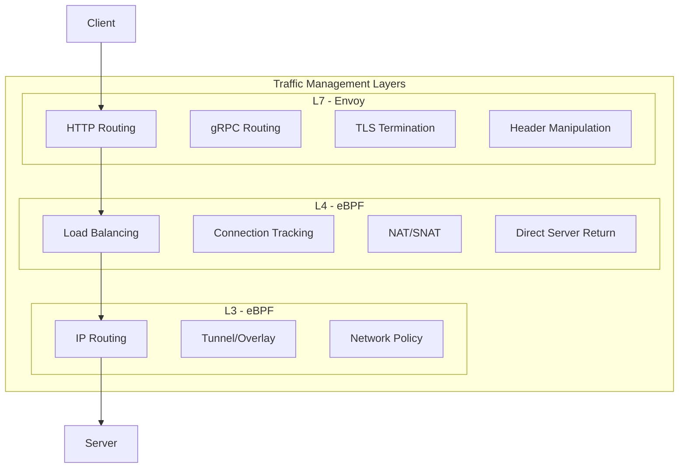
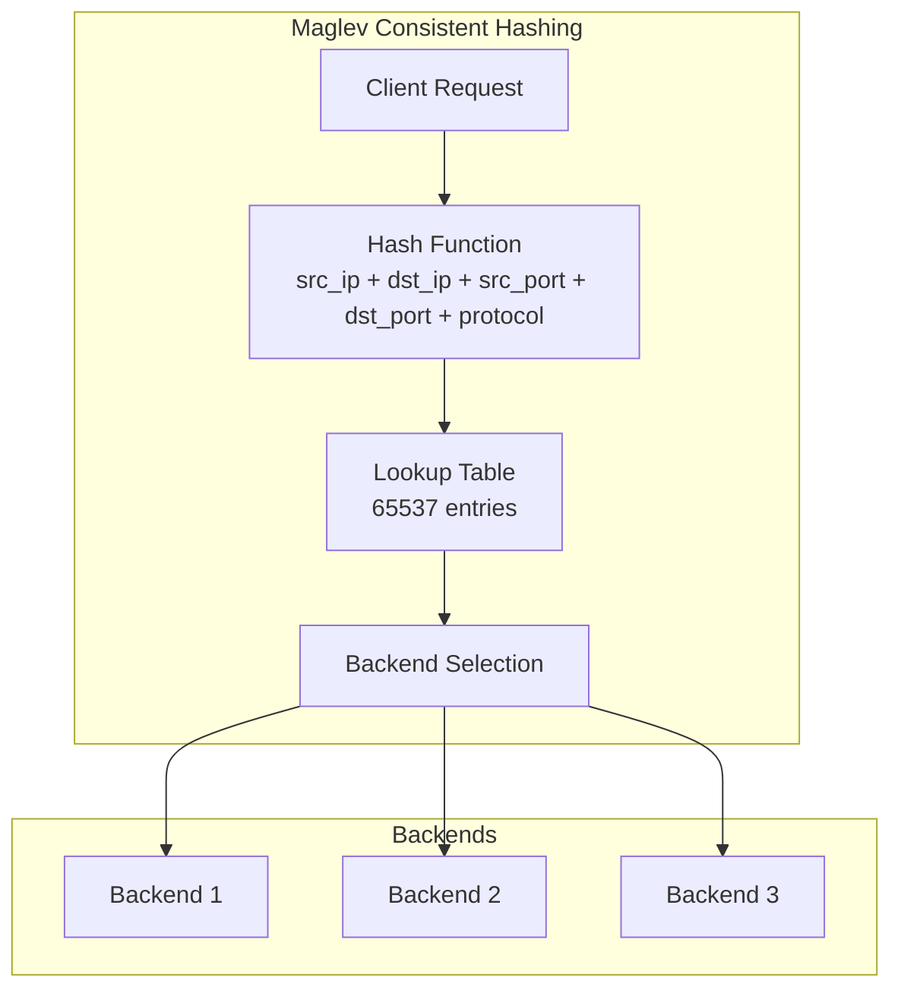

# Cilium Service Mesh Traffic Management

> **Supported Versions**: Cilium 1.16+, Kubernetes 1.28+
> **Last Updated**: February 22, 2026

## Overview

Traffic management in Cilium Service Mesh combines eBPF-based L4 load balancing with Envoy-based L7 routing. This chapter explains advanced traffic management features through CiliumEnvoyConfig, L7 rules in CiliumNetworkPolicy, and Gateway API integration.

## Traffic Management Architecture



## CiliumEnvoyConfig

### Basic Structure

CiliumEnvoyConfig defines Envoy configuration for specific services:

```yaml
apiVersion: cilium.io/v2
kind: CiliumEnvoyConfig
metadata:
  name: my-service-config
  namespace: default
spec:
  # Services this configuration applies to
  services:
  - name: my-service
    namespace: default

  # Backend services (optional)
  backendServices:
  - name: backend-v1
    namespace: default
  - name: backend-v2
    namespace: default

  # Envoy resource definitions
  resources:
  - "@type": type.googleapis.com/envoy.config.listener.v3.Listener
    name: my-service-listener
    # ... listener configuration
```

### HTTP Routing

#### Path-based Routing

```yaml
apiVersion: cilium.io/v2
kind: CiliumEnvoyConfig
metadata:
  name: path-routing
  namespace: default
spec:
  services:
  - name: api-gateway
    namespace: default

  backendServices:
  - name: users-service
    namespace: default
  - name: orders-service
    namespace: default
  - name: products-service
    namespace: default

  resources:
  - "@type": type.googleapis.com/envoy.config.listener.v3.Listener
    name: api-gateway-listener
    filter_chains:
    - filters:
      - name: envoy.filters.network.http_connection_manager
        typed_config:
          "@type": type.googleapis.com/envoy.extensions.filters.network.http_connection_manager.v3.HttpConnectionManager
          stat_prefix: api-gateway
          codec_type: AUTO
          route_config:
            name: api_routes
            virtual_hosts:
            - name: api
              domains: ["*"]
              routes:
              # /users/* -> users-service
              - match:
                  prefix: "/users"
                route:
                  cluster: default/users-service

              # /orders/* -> orders-service
              - match:
                  prefix: "/orders"
                route:
                  cluster: default/orders-service

              # /products/* -> products-service
              - match:
                  prefix: "/products"
                route:
                  cluster: default/products-service

              # Default route
              - match:
                  prefix: "/"
                direct_response:
                  status: 404
                  body:
                    inline_string: "Not Found"

          http_filters:
          - name: envoy.filters.http.router
            typed_config:
              "@type": type.googleapis.com/envoy.extensions.filters.http.router.v3.Router
```

#### Header-based Routing

```yaml
apiVersion: cilium.io/v2
kind: CiliumEnvoyConfig
metadata:
  name: header-routing
  namespace: default
spec:
  services:
  - name: api-service
    namespace: default

  backendServices:
  - name: api-v1
    namespace: default
  - name: api-v2
    namespace: default
  - name: api-beta
    namespace: default

  resources:
  - "@type": type.googleapis.com/envoy.config.listener.v3.Listener
    name: header-routing-listener
    filter_chains:
    - filters:
      - name: envoy.filters.network.http_connection_manager
        typed_config:
          "@type": type.googleapis.com/envoy.extensions.filters.network.http_connection_manager.v3.HttpConnectionManager
          stat_prefix: api-service
          route_config:
            name: header_routes
            virtual_hosts:
            - name: api
              domains: ["*"]
              routes:
              # Route to v2 if X-API-Version: v2 header present
              - match:
                  prefix: "/"
                  headers:
                  - name: "X-API-Version"
                    exact_match: "v2"
                route:
                  cluster: default/api-v2

              # Route to beta if X-Beta-User: true header present
              - match:
                  prefix: "/"
                  headers:
                  - name: "X-Beta-User"
                    exact_match: "true"
                route:
                  cluster: default/api-beta

              # Default: route to v1
              - match:
                  prefix: "/"
                route:
                  cluster: default/api-v1

          http_filters:
          - name: envoy.filters.http.router
            typed_config:
              "@type": type.googleapis.com/envoy.extensions.filters.http.router.v3.Router
```

#### Method-based Routing

```yaml
apiVersion: cilium.io/v2
kind: CiliumEnvoyConfig
metadata:
  name: method-routing
  namespace: default
spec:
  services:
  - name: rest-api
    namespace: default

  backendServices:
  - name: read-service
    namespace: default
  - name: write-service
    namespace: default

  resources:
  - "@type": type.googleapis.com/envoy.config.listener.v3.Listener
    name: method-routing-listener
    filter_chains:
    - filters:
      - name: envoy.filters.network.http_connection_manager
        typed_config:
          "@type": type.googleapis.com/envoy.extensions.filters.network.http_connection_manager.v3.HttpConnectionManager
          stat_prefix: rest-api
          route_config:
            name: method_routes
            virtual_hosts:
            - name: api
              domains: ["*"]
              routes:
              # GET requests -> read-service
              - match:
                  prefix: "/"
                  headers:
                  - name: ":method"
                    exact_match: "GET"
                route:
                  cluster: default/read-service

              # POST, PUT, DELETE -> write-service
              - match:
                  prefix: "/"
                  headers:
                  - name: ":method"
                    safe_regex_match:
                      google_re2: {}
                      regex: "POST|PUT|DELETE|PATCH"
                route:
                  cluster: default/write-service

          http_filters:
          - name: envoy.filters.http.router
            typed_config:
              "@type": type.googleapis.com/envoy.extensions.filters.http.router.v3.Router
```

## L7 Traffic Policies

### CiliumNetworkPolicy L7 Rules

CiliumNetworkPolicy enables fine-grained traffic control at the L7 level:

```yaml
apiVersion: cilium.io/v2
kind: CiliumNetworkPolicy
metadata:
  name: l7-http-policy
  namespace: default
spec:
  endpointSelector:
    matchLabels:
      app: backend-api

  ingress:
  - fromEndpoints:
    - matchLabels:
        app: frontend
    toPorts:
    - ports:
      - port: "8080"
        protocol: TCP
      rules:
        http:
        # Allow GET /api/users/*
        - method: GET
          path: "/api/users/.*"

        # Allow GET /api/products/*
        - method: GET
          path: "/api/products/.*"

        # Allow POST /api/orders
        - method: POST
          path: "/api/orders"

        # With header conditions
        - method: GET
          path: "/api/admin/.*"
          headers:
          - "X-Admin-Token: secret-token"
```

### Various Protocol Support

#### Kafka L7 Policy

```yaml
apiVersion: cilium.io/v2
kind: CiliumNetworkPolicy
metadata:
  name: kafka-l7-policy
  namespace: kafka
spec:
  endpointSelector:
    matchLabels:
      app: kafka-broker

  ingress:
  - fromEndpoints:
    - matchLabels:
        app: kafka-producer
    toPorts:
    - ports:
      - port: "9092"
        protocol: TCP
      rules:
        kafka:
        # Allow produce to specific topics
        - apiKey: "produce"
          topic: "orders"
        - apiKey: "produce"
          topic: "events"

  - fromEndpoints:
    - matchLabels:
        app: kafka-consumer
    toPorts:
    - ports:
      - port: "9092"
        protocol: TCP
      rules:
        kafka:
        # Allow fetch from specific topics
        - apiKey: "fetch"
          topic: "orders"
        - apiKey: "fetch"
          topic: "events"
        # Allow consumer group management
        - apiKey: "offsetcommit"
          topic: "orders"
        - apiKey: "offsetfetch"
          topic: "orders"
```

#### DNS L7 Policy

```yaml
apiVersion: cilium.io/v2
kind: CiliumNetworkPolicy
metadata:
  name: dns-l7-policy
  namespace: default
spec:
  endpointSelector:
    matchLabels:
      app: web-app

  egress:
  - toEndpoints:
    - matchLabels:
        k8s:io.kubernetes.pod.namespace: kube-system
        k8s-app: kube-dns
    toPorts:
    - ports:
      - port: "53"
        protocol: UDP
      rules:
        dns:
        # Allow specific domain lookups only
        - matchPattern: "*.example.com"
        - matchPattern: "api.external-service.io"
        - matchName: "database.internal.svc.cluster.local"
```

#### gRPC L7 Policy

```yaml
apiVersion: cilium.io/v2
kind: CiliumNetworkPolicy
metadata:
  name: grpc-l7-policy
  namespace: default
spec:
  endpointSelector:
    matchLabels:
      app: grpc-server

  ingress:
  - fromEndpoints:
    - matchLabels:
        app: grpc-client
    toPorts:
    - ports:
      - port: "50051"
        protocol: TCP
      rules:
        http:
        # gRPC is HTTP/2 based, so use http rules
        - method: POST
          path: "/myapp.UserService/GetUser"
        - method: POST
          path: "/myapp.UserService/ListUsers"
        - method: POST
          path: "/myapp.OrderService/.*"
```

## Load Balancing

### L4 Load Balancing (eBPF)

eBPF-based L4 load balancing replaces kube-proxy:

```yaml
# Cilium configuration (values.yaml)
kubeProxyReplacement: true

loadBalancer:
  # Load balancing algorithm
  algorithm: maglev  # maglev or random

  # Mode configuration
  mode: snat  # snat, dsr, or hybrid

  # DSR settings (optional)
  dsrDispatch: opt  # opt or ipip

  # Session affinity
  serviceTopology: true

  # Health checking
  healthCheckNodePort: true
```

#### Maglev Hashing



### L7 Load Balancing (Envoy)

L7 load balancing is provided through Envoy:

```yaml
apiVersion: cilium.io/v2
kind: CiliumEnvoyConfig
metadata:
  name: l7-load-balancing
  namespace: default
spec:
  services:
  - name: api-service
    namespace: default

  backendServices:
  - name: api-backend
    namespace: default

  resources:
  # Cluster definition
  - "@type": type.googleapis.com/envoy.config.cluster.v3.Cluster
    name: default/api-backend
    connect_timeout: 5s
    type: EDS
    eds_cluster_config:
      eds_config:
        api_config_source:
          api_type: GRPC
          grpc_services:
          - envoy_grpc:
              cluster_name: xds-grpc-cilium

    # Load balancing policy
    lb_policy: ROUND_ROBIN

    # Outlier detection (Circuit Breaker)
    outlier_detection:
      consecutive_5xx: 5
      interval: 10s
      base_ejection_time: 30s
      max_ejection_percent: 50

    # Health checks
    health_checks:
    - timeout: 5s
      interval: 10s
      unhealthy_threshold: 3
      healthy_threshold: 2
      http_health_check:
        path: "/health"
        expected_statuses:
        - start: 200
          end: 299

    # Connection pool settings
    circuit_breakers:
      thresholds:
      - priority: DEFAULT
        max_connections: 1000
        max_pending_requests: 1000
        max_requests: 1000
        max_retries: 3
```

#### Load Balancing Algorithm Options

```yaml
# Round Robin
lb_policy: ROUND_ROBIN

# Least Request
lb_policy: LEAST_REQUEST
least_request_lb_config:
  choice_count: 2

# Random
lb_policy: RANDOM

# Ring Hash (Consistent Hashing)
lb_policy: RING_HASH
ring_hash_lb_config:
  hash_function: XX_HASH
  minimum_ring_size: 1024
  maximum_ring_size: 8388608

# Maglev
lb_policy: MAGLEV
maglev_lb_config:
  table_size: 65537
```

## Traffic Splitting (Canary Deployment)

### Weight-based Traffic Splitting

```yaml
apiVersion: cilium.io/v2
kind: CiliumEnvoyConfig
metadata:
  name: canary-deployment
  namespace: default
spec:
  services:
  - name: frontend
    namespace: default

  backendServices:
  - name: frontend-stable
    namespace: default
  - name: frontend-canary
    namespace: default

  resources:
  - "@type": type.googleapis.com/envoy.config.listener.v3.Listener
    name: canary-listener
    filter_chains:
    - filters:
      - name: envoy.filters.network.http_connection_manager
        typed_config:
          "@type": type.googleapis.com/envoy.extensions.filters.network.http_connection_manager.v3.HttpConnectionManager
          stat_prefix: frontend
          route_config:
            name: canary_routes
            virtual_hosts:
            - name: frontend
              domains: ["*"]
              routes:
              - match:
                  prefix: "/"
                route:
                  weighted_clusters:
                    clusters:
                    # 90% -> stable
                    - name: default/frontend-stable
                      weight: 90
                    # 10% -> canary
                    - name: default/frontend-canary
                      weight: 10
                    total_weight: 100

          http_filters:
          - name: envoy.filters.http.router
            typed_config:
              "@type": type.googleapis.com/envoy.extensions.filters.http.router.v3.Router
```

### Header-based Canary

```yaml
apiVersion: cilium.io/v2
kind: CiliumEnvoyConfig
metadata:
  name: header-canary
  namespace: default
spec:
  services:
  - name: api
    namespace: default

  backendServices:
  - name: api-stable
    namespace: default
  - name: api-canary
    namespace: default

  resources:
  - "@type": type.googleapis.com/envoy.config.listener.v3.Listener
    name: header-canary-listener
    filter_chains:
    - filters:
      - name: envoy.filters.network.http_connection_manager
        typed_config:
          "@type": type.googleapis.com/envoy.extensions.filters.network.http_connection_manager.v3.HttpConnectionManager
          stat_prefix: api
          route_config:
            name: header_canary_routes
            virtual_hosts:
            - name: api
              domains: ["*"]
              routes:
              # Route to canary if X-Canary: true header present
              - match:
                  prefix: "/"
                  headers:
                  - name: "X-Canary"
                    exact_match: "true"
                route:
                  cluster: default/api-canary

              # Default: route to stable
              - match:
                  prefix: "/"
                route:
                  cluster: default/api-stable

          http_filters:
          - name: envoy.filters.http.router
            typed_config:
              "@type": type.googleapis.com/envoy.extensions.filters.http.router.v3.Router
```

## Retry and Timeout

### Retry Configuration

```yaml
apiVersion: cilium.io/v2
kind: CiliumEnvoyConfig
metadata:
  name: retry-config
  namespace: default
spec:
  services:
  - name: api-service
    namespace: default

  backendServices:
  - name: api-backend
    namespace: default

  resources:
  - "@type": type.googleapis.com/envoy.config.listener.v3.Listener
    name: retry-listener
    filter_chains:
    - filters:
      - name: envoy.filters.network.http_connection_manager
        typed_config:
          "@type": type.googleapis.com/envoy.extensions.filters.network.http_connection_manager.v3.HttpConnectionManager
          stat_prefix: api-service
          route_config:
            name: retry_routes
            virtual_hosts:
            - name: api
              domains: ["*"]
              routes:
              - match:
                  prefix: "/"
                route:
                  cluster: default/api-backend
                  timeout: 30s

                  # Retry policy
                  retry_policy:
                    # Status codes to retry
                    retry_on: "5xx,reset,connect-failure,retriable-4xx"

                    # Maximum retry attempts
                    num_retries: 3

                    # Retry interval
                    per_try_timeout: 10s

                    # Retry backoff
                    retry_back_off:
                      base_interval: 0.5s
                      max_interval: 10s

                    # Retriable headers
                    retriable_headers:
                    - name: "x-envoy-retriable-on"
                      exact_match: "true"

                    # Retry priority
                    retry_priority:
                      name: envoy.retry_priorities.previous_priorities
                      typed_config:
                        "@type": type.googleapis.com/envoy.extensions.retry.priority.previous_priorities.v3.PreviousPrioritiesConfig
                        update_frequency: 2

          http_filters:
          - name: envoy.filters.http.router
            typed_config:
              "@type": type.googleapis.com/envoy.extensions.filters.http.router.v3.Router
```

### Timeout Configuration

```yaml
apiVersion: cilium.io/v2
kind: CiliumEnvoyConfig
metadata:
  name: timeout-config
  namespace: default
spec:
  services:
  - name: slow-service
    namespace: default

  resources:
  - "@type": type.googleapis.com/envoy.config.listener.v3.Listener
    name: timeout-listener
    filter_chains:
    - filters:
      - name: envoy.filters.network.http_connection_manager
        typed_config:
          "@type": type.googleapis.com/envoy.extensions.filters.network.http_connection_manager.v3.HttpConnectionManager
          stat_prefix: slow-service

          # Connection timeout
          common_http_protocol_options:
            idle_timeout: 300s
            headers_with_underscores_action: REJECT_REQUEST

          # Stream timeouts
          stream_idle_timeout: 60s
          request_timeout: 120s

          route_config:
            name: timeout_routes
            virtual_hosts:
            - name: slow-service
              domains: ["*"]
              routes:
              # Default route
              - match:
                  prefix: "/"
                route:
                  cluster: default/slow-service
                  timeout: 60s

              # Endpoint requiring long processing time
              - match:
                  prefix: "/long-running"
                route:
                  cluster: default/slow-service
                  timeout: 300s

              # Streaming endpoint (unlimited)
              - match:
                  prefix: "/stream"
                route:
                  cluster: default/slow-service
                  timeout: 0s  # Unlimited

          http_filters:
          - name: envoy.filters.http.router
            typed_config:
              "@type": type.googleapis.com/envoy.extensions.filters.http.router.v3.Router
```

## Rate Limiting

### Local Rate Limiting

```yaml
apiVersion: cilium.io/v2
kind: CiliumEnvoyConfig
metadata:
  name: local-ratelimit
  namespace: default
spec:
  services:
  - name: api-service
    namespace: default

  resources:
  - "@type": type.googleapis.com/envoy.config.listener.v3.Listener
    name: ratelimit-listener
    filter_chains:
    - filters:
      - name: envoy.filters.network.http_connection_manager
        typed_config:
          "@type": type.googleapis.com/envoy.extensions.filters.network.http_connection_manager.v3.HttpConnectionManager
          stat_prefix: api-service
          route_config:
            name: ratelimit_routes
            virtual_hosts:
            - name: api
              domains: ["*"]
              routes:
              - match:
                  prefix: "/"
                route:
                  cluster: default/api-service

          http_filters:
          # Local Rate Limiter
          - name: envoy.filters.http.local_ratelimit
            typed_config:
              "@type": type.googleapis.com/envoy.extensions.filters.http.local_ratelimit.v3.LocalRateLimit
              stat_prefix: http_local_rate_limiter

              # Global token bucket
              token_bucket:
                max_tokens: 1000
                tokens_per_fill: 100
                fill_interval: 1s

              # Response headers
              response_headers_to_add:
              - append_action: OVERWRITE_IF_EXISTS_OR_ADD
                header:
                  key: x-ratelimit-limit
                  value: "1000"
              - append_action: OVERWRITE_IF_EXISTS_OR_ADD
                header:
                  key: x-ratelimit-remaining
                  value: "%DYNAMIC_METADATA(envoy.http.local_rate_limit:remaining)%"

              # Response when rate limit exceeded
              status:
                code: TooManyRequests
              filter_enabled:
                runtime_key: local_rate_limit_enabled
                default_value:
                  numerator: 100
                  denominator: HUNDRED
              filter_enforced:
                runtime_key: local_rate_limit_enforced
                default_value:
                  numerator: 100
                  denominator: HUNDRED

          - name: envoy.filters.http.router
            typed_config:
              "@type": type.googleapis.com/envoy.extensions.filters.http.router.v3.Router
```

### Per-Route Rate Limiting

```yaml
apiVersion: cilium.io/v2
kind: CiliumEnvoyConfig
metadata:
  name: per-route-ratelimit
  namespace: default
spec:
  services:
  - name: api-service
    namespace: default

  resources:
  - "@type": type.googleapis.com/envoy.config.listener.v3.Listener
    name: per-route-ratelimit-listener
    filter_chains:
    - filters:
      - name: envoy.filters.network.http_connection_manager
        typed_config:
          "@type": type.googleapis.com/envoy.extensions.filters.network.http_connection_manager.v3.HttpConnectionManager
          stat_prefix: api-service
          route_config:
            name: ratelimit_routes
            virtual_hosts:
            - name: api
              domains: ["*"]
              routes:
              # Auth endpoint - low rate limit
              - match:
                  prefix: "/auth"
                route:
                  cluster: default/api-service
                typed_per_filter_config:
                  envoy.filters.http.local_ratelimit:
                    "@type": type.googleapis.com/envoy.extensions.filters.http.local_ratelimit.v3.LocalRateLimit
                    stat_prefix: auth_rate_limiter
                    token_bucket:
                      max_tokens: 10
                      tokens_per_fill: 5
                      fill_interval: 60s

              # Search endpoint - medium rate limit
              - match:
                  prefix: "/search"
                route:
                  cluster: default/api-service
                typed_per_filter_config:
                  envoy.filters.http.local_ratelimit:
                    "@type": type.googleapis.com/envoy.extensions.filters.http.local_ratelimit.v3.LocalRateLimit
                    stat_prefix: search_rate_limiter
                    token_bucket:
                      max_tokens: 100
                      tokens_per_fill: 50
                      fill_interval: 1s

              # Default - high rate limit
              - match:
                  prefix: "/"
                route:
                  cluster: default/api-service
                typed_per_filter_config:
                  envoy.filters.http.local_ratelimit:
                    "@type": type.googleapis.com/envoy.extensions.filters.http.local_ratelimit.v3.LocalRateLimit
                    stat_prefix: default_rate_limiter
                    token_bucket:
                      max_tokens: 1000
                      tokens_per_fill: 100
                      fill_interval: 1s

          http_filters:
          - name: envoy.filters.http.local_ratelimit
            typed_config:
              "@type": type.googleapis.com/envoy.extensions.filters.http.local_ratelimit.v3.LocalRateLimit
              stat_prefix: http_local_rate_limiter
          - name: envoy.filters.http.router
            typed_config:
              "@type": type.googleapis.com/envoy.extensions.filters.http.router.v3.Router
```

## URL Rewriting and Header Manipulation

### URL Rewriting

```yaml
apiVersion: cilium.io/v2
kind: CiliumEnvoyConfig
metadata:
  name: url-rewrite
  namespace: default
spec:
  services:
  - name: api-gateway
    namespace: default

  backendServices:
  - name: users-service
    namespace: default

  resources:
  - "@type": type.googleapis.com/envoy.config.listener.v3.Listener
    name: rewrite-listener
    filter_chains:
    - filters:
      - name: envoy.filters.network.http_connection_manager
        typed_config:
          "@type": type.googleapis.com/envoy.extensions.filters.network.http_connection_manager.v3.HttpConnectionManager
          stat_prefix: api-gateway
          route_config:
            name: rewrite_routes
            virtual_hosts:
            - name: api
              domains: ["*"]
              routes:
              # /api/v1/users/* -> /users/*
              - match:
                  prefix: "/api/v1/users"
                route:
                  cluster: default/users-service
                  prefix_rewrite: "/users"

              # Regex rewrite
              - match:
                  safe_regex:
                    google_re2: {}
                    regex: "/v([0-9]+)/(.*)"
                route:
                  cluster: default/users-service
                  regex_rewrite:
                    pattern:
                      google_re2: {}
                      regex: "/v([0-9]+)/(.*)"
                    substitution: "/api/\\2?version=\\1"

              # Host rewrite
              - match:
                  prefix: "/legacy"
                route:
                  cluster: default/users-service
                  host_rewrite_literal: "legacy.internal.svc.cluster.local"
                  prefix_rewrite: "/"

          http_filters:
          - name: envoy.filters.http.router
            typed_config:
              "@type": type.googleapis.com/envoy.extensions.filters.http.router.v3.Router
```

### Header Manipulation

```yaml
apiVersion: cilium.io/v2
kind: CiliumEnvoyConfig
metadata:
  name: header-manipulation
  namespace: default
spec:
  services:
  - name: api-service
    namespace: default

  resources:
  - "@type": type.googleapis.com/envoy.config.listener.v3.Listener
    name: header-listener
    filter_chains:
    - filters:
      - name: envoy.filters.network.http_connection_manager
        typed_config:
          "@type": type.googleapis.com/envoy.extensions.filters.network.http_connection_manager.v3.HttpConnectionManager
          stat_prefix: api-service
          route_config:
            name: header_routes
            virtual_hosts:
            - name: api
              domains: ["*"]

              # Virtual host level headers
              request_headers_to_add:
              - header:
                  key: "X-Forwarded-By"
                  value: "cilium-envoy"
                append_action: OVERWRITE_IF_EXISTS_OR_ADD

              response_headers_to_add:
              - header:
                  key: "X-Served-By"
                  value: "cilium-service-mesh"
                append_action: OVERWRITE_IF_EXISTS_OR_ADD

              response_headers_to_remove:
              - "server"
              - "x-powered-by"

              routes:
              - match:
                  prefix: "/"
                route:
                  cluster: default/api-service

                  # Route level headers
                  request_headers_to_add:
                  - header:
                      key: "X-Request-Start"
                      value: "%START_TIME(%s.%3f)%"
                    append_action: OVERWRITE_IF_EXISTS_OR_ADD
                  - header:
                      key: "X-Envoy-Original-Path"
                      value: "%REQ(:PATH)%"
                    append_action: OVERWRITE_IF_EXISTS_OR_ADD

                  response_headers_to_add:
                  - header:
                      key: "X-Response-Time"
                      value: "%RESPONSE_DURATION%ms"
                    append_action: OVERWRITE_IF_EXISTS_OR_ADD
                  - header:
                      key: "X-Upstream-Host"
                      value: "%UPSTREAM_HOST%"
                    append_action: OVERWRITE_IF_EXISTS_OR_ADD

          http_filters:
          - name: envoy.filters.http.router
            typed_config:
              "@type": type.googleapis.com/envoy.extensions.filters.http.router.v3.Router
```

## Gateway API Integration

### GatewayClass and Gateway

```yaml
# GatewayClass definition
apiVersion: gateway.networking.k8s.io/v1
kind: GatewayClass
metadata:
  name: cilium
spec:
  controllerName: io.cilium/gateway-controller
---
# Gateway definition
apiVersion: gateway.networking.k8s.io/v1
kind: Gateway
metadata:
  name: api-gateway
  namespace: default
spec:
  gatewayClassName: cilium
  listeners:
  - name: http
    protocol: HTTP
    port: 80
    allowedRoutes:
      namespaces:
        from: Same

  - name: https
    protocol: HTTPS
    port: 443
    tls:
      mode: Terminate
      certificateRefs:
      - kind: Secret
        name: api-gateway-tls
    allowedRoutes:
      namespaces:
        from: Same
```

### HTTPRoute

```yaml
apiVersion: gateway.networking.k8s.io/v1
kind: HTTPRoute
metadata:
  name: api-routes
  namespace: default
spec:
  parentRefs:
  - name: api-gateway
    namespace: default

  hostnames:
  - "api.example.com"

  rules:
  # /users/* -> users-service
  - matches:
    - path:
        type: PathPrefix
        value: /users
    backendRefs:
    - name: users-service
      port: 80

  # /orders/* -> orders-service
  - matches:
    - path:
        type: PathPrefix
        value: /orders
    backendRefs:
    - name: orders-service
      port: 80

  # Header-based routing
  - matches:
    - path:
        type: PathPrefix
        value: /
      headers:
      - name: X-API-Version
        value: v2
    backendRefs:
    - name: api-v2
      port: 80

  # Weight-based splitting
  - matches:
    - path:
        type: PathPrefix
        value: /
    backendRefs:
    - name: api-stable
      port: 80
      weight: 90
    - name: api-canary
      port: 80
      weight: 10
```

### HTTPRoute Advanced Features

```yaml
apiVersion: gateway.networking.k8s.io/v1
kind: HTTPRoute
metadata:
  name: advanced-routes
  namespace: default
spec:
  parentRefs:
  - name: api-gateway

  rules:
  - matches:
    - path:
        type: PathPrefix
        value: /api

    # Request header modification
    filters:
    - type: RequestHeaderModifier
      requestHeaderModifier:
        add:
        - name: X-Request-ID
          value: "%REQ(X-REQUEST-ID)%"
        set:
        - name: X-Forwarded-Proto
          value: https
        remove:
        - X-Internal-Header

    # Response header modification
    - type: ResponseHeaderModifier
      responseHeaderModifier:
        add:
        - name: X-Frame-Options
          value: DENY
        - name: X-Content-Type-Options
          value: nosniff

    # URL rewrite
    - type: URLRewrite
      urlRewrite:
        path:
          type: ReplacePrefixMatch
          replacePrefixMatch: /v1

    backendRefs:
    - name: api-service
      port: 80

  # Redirect
  - matches:
    - path:
        type: Exact
        value: /old-endpoint
    filters:
    - type: RequestRedirect
      requestRedirect:
        scheme: https
        hostname: new.example.com
        path:
          type: ReplaceFullPath
          replaceFullPath: /new-endpoint
        statusCode: 301
```

## Traffic Mirroring

```yaml
apiVersion: cilium.io/v2
kind: CiliumEnvoyConfig
metadata:
  name: traffic-mirror
  namespace: default
spec:
  services:
  - name: production-service
    namespace: default

  backendServices:
  - name: production-backend
    namespace: default
  - name: shadow-backend
    namespace: default

  resources:
  - "@type": type.googleapis.com/envoy.config.listener.v3.Listener
    name: mirror-listener
    filter_chains:
    - filters:
      - name: envoy.filters.network.http_connection_manager
        typed_config:
          "@type": type.googleapis.com/envoy.extensions.filters.network.http_connection_manager.v3.HttpConnectionManager
          stat_prefix: production-service
          route_config:
            name: mirror_routes
            virtual_hosts:
            - name: production
              domains: ["*"]
              routes:
              - match:
                  prefix: "/"
                route:
                  cluster: default/production-backend

                  # Traffic mirroring configuration
                  request_mirror_policies:
                  - cluster: default/shadow-backend
                    runtime_fraction:
                      default_value:
                        numerator: 100  # 100% mirroring
                        denominator: HUNDRED
                    trace_sampled: false

          http_filters:
          - name: envoy.filters.http.router
            typed_config:
              "@type": type.googleapis.com/envoy.extensions.filters.http.router.v3.Router
```

## Next Steps

- [Security](./03-security.md): Set up mTLS and L7 network policies
- [Observability](./04-observability.md): Monitor traffic with Hubble
- [Ingress & Gateway](./05-ingress-gateway.md): External traffic management

## References

- [Cilium L7 Policy Documentation](https://docs.cilium.io/en/stable/security/policy/language/#layer-7-examples)
- [CiliumEnvoyConfig Reference](https://docs.cilium.io/en/stable/network/servicemesh/envoy-config/)
- [Gateway API Documentation](https://gateway-api.sigs.k8s.io/)
- [Envoy HTTP Connection Manager](https://www.envoyproxy.io/docs/envoy/latest/configuration/http/http_conn_man/http_conn_man)
