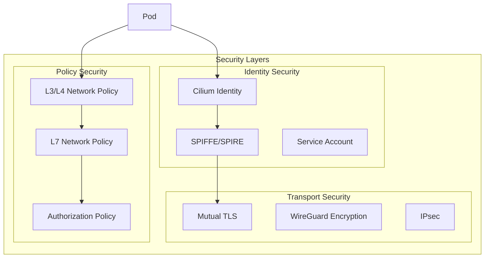
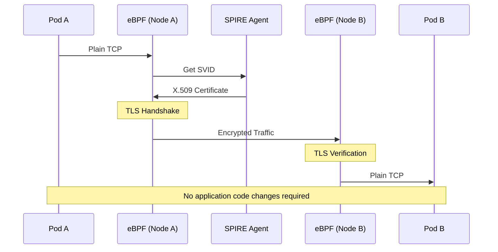
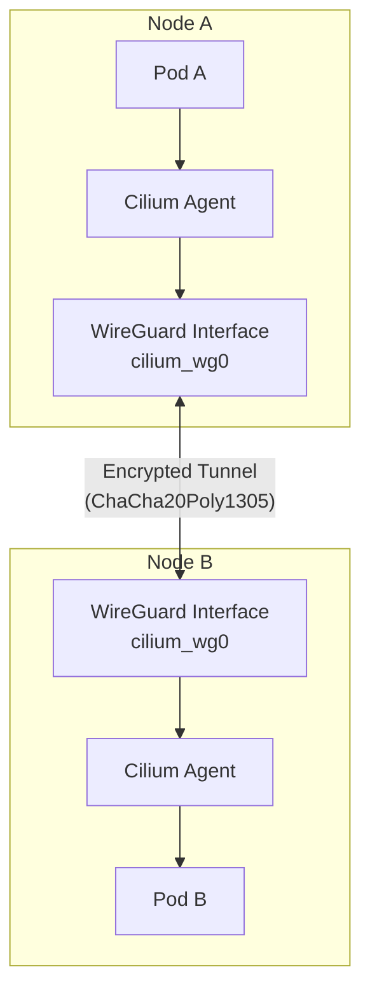
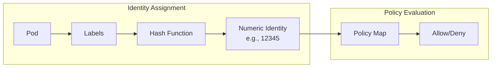
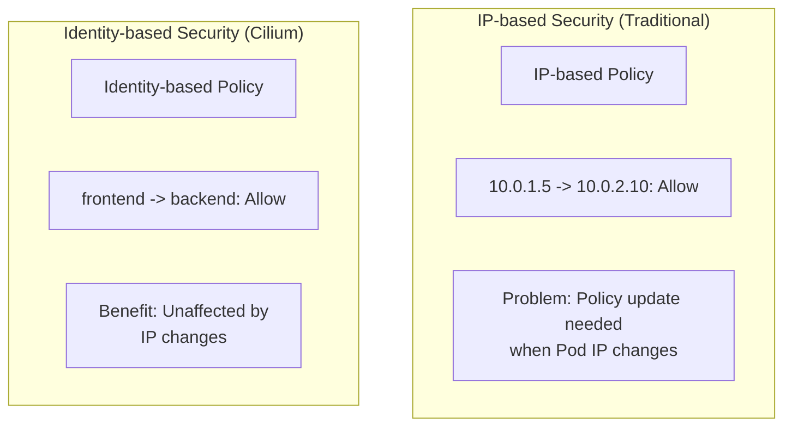

# Cilium Service Mesh Security

> **Supported Versions**: Cilium 1.16+, Kubernetes 1.28+
> **Last Updated**: July 13, 2026

## Overview

Cilium Service Mesh provides robust security features based on eBPF and SPIFFE. You can implement zero-trust networking through transparent mTLS, identity-based network policies, and WireGuard encryption. This chapter explains the security architecture and configuration methods of Cilium Service Mesh in detail.

## Security Architecture



## Transparent mTLS

### Sidecar-free mTLS

Cilium Service Mesh provides transparent mTLS without sidecar proxies:



### Native mTLS via ztunnel (2026 Update)

In March 2026, Cilium introduced a newer mTLS architecture inspired by Istio Ambient's ztunnel model, evolving beyond the pure eBPF handshake shown above. The stack now has three cooperating components:

- **SPIRE** — issues workload identity and X.509 certificates (same role as in the SPIRE-based configuration below)
- **Cilium** — installs iptables rules that transparently redirect outbound pod traffic to ztunnel on port 15001
- **ztunnel** — a per-node proxy (not a per-pod sidecar) that performs the actual mTLS handshake and encrypts pod-to-pod traffic

This keeps the same "no sidecar, no application changes" guarantee, but the TLS handshake now runs in a dedicated per-node process rather than purely in eBPF — a design Cilium adopted directly from Istio Ambient's ztunnel. As of March 2026 this is available as a public preview on Azure Kubernetes Service ("Cilium mTLS encryption" for AKS). Mutual authentication still only works within a Cilium-managed cluster and is not compatible with external mTLS solutions.

See the [Cilium blog post on native mTLS](https://cilium.io/blog/2026/03/23/native-mtls-cilium/) for the full architecture writeup.

### SPIRE-based mTLS Configuration

```yaml
# values.yaml - SPIRE integration configuration
authentication:
  mutual:
    spire:
      enabled: true
      install:
        enabled: true
        namespace: cilium-spire

        server:
          # SPIRE Server configuration
          replicas: 1
          dataStorage:
            enabled: true
            size: 1Gi
            storageClass: gp3

          # Trust Domain configuration
          trustDomain: cluster.local

          # CA configuration
          ca:
            # Use internal CA
            keyType: ec-p256
            ttl: 24h

          # Node Attestor configuration
          nodeAttestor:
            k8sPsat:
              enabled: true

        agent:
          # SPIRE Agent configuration
          socketPath: /run/spire/sockets/agent.sock

          # Workload Attestor configuration
          workloadAttestor:
            k8s:
              enabled: true
              disableContainerSelectors: false
```

### mTLS Policy Enforcement

```yaml
# Enable mTLS for entire cluster
apiVersion: cilium.io/v2
kind: CiliumClusterwideNetworkPolicy
metadata:
  name: enforce-mtls
spec:
  endpointSelector: {}
  authentication:
  - mode: required
```

### Per-Namespace mTLS Configuration

```yaml
# Apply mTLS to specific namespace only
apiVersion: cilium.io/v2
kind: CiliumNetworkPolicy
metadata:
  name: namespace-mtls
  namespace: production
spec:
  endpointSelector: {}
  ingress:
  - fromEndpoints:
    - {}
    authentication:
    - mode: required
  egress:
  - toEndpoints:
    - {}
    authentication:
    - mode: required
```

### Per-Service mTLS Configuration

```yaml
# Enforce mTLS between specific services
apiVersion: cilium.io/v2
kind: CiliumNetworkPolicy
metadata:
  name: service-mtls
  namespace: default
spec:
  endpointSelector:
    matchLabels:
      app: backend

  ingress:
  - fromEndpoints:
    - matchLabels:
        app: frontend
    authentication:
    - mode: required
    toPorts:
    - ports:
      - port: "8080"
        protocol: TCP
```

## CiliumNetworkPolicy L7 Rules

### HTTP L7 Security Policy

```yaml
apiVersion: cilium.io/v2
kind: CiliumNetworkPolicy
metadata:
  name: http-security-policy
  namespace: default
spec:
  endpointSelector:
    matchLabels:
      app: api-server

  ingress:
  # Read-only access
  - fromEndpoints:
    - matchLabels:
        role: reader
    toPorts:
    - ports:
      - port: "8080"
        protocol: TCP
      rules:
        http:
        - method: GET
          path: "/api/.*"

  # Admin access
  - fromEndpoints:
    - matchLabels:
        role: admin
    toPorts:
    - ports:
      - port: "8080"
        protocol: TCP
      rules:
        http:
        - method: ".*"
          path: "/api/.*"
          headers:
          - "Authorization: Bearer .*"

  # Health checks
  - fromEndpoints:
    - matchLabels:
        app: monitoring
    toPorts:
    - ports:
      - port: "8080"
        protocol: TCP
      rules:
        http:
        - method: GET
          path: "/health"
        - method: GET
          path: "/metrics"
```

### Kafka L7 Security Policy

```yaml
apiVersion: cilium.io/v2
kind: CiliumNetworkPolicy
metadata:
  name: kafka-security
  namespace: kafka
spec:
  endpointSelector:
    matchLabels:
      app: kafka

  ingress:
  # Producer - allow writing to specific topics only
  - fromEndpoints:
    - matchLabels:
        role: producer
    toPorts:
    - ports:
      - port: "9092"
        protocol: TCP
      rules:
        kafka:
        - apiKey: produce
          topic: "orders"
        - apiKey: produce
          topic: "events"
        - apiKey: metadata

  # Consumer - allow reading from specific topics only
  - fromEndpoints:
    - matchLabels:
        role: consumer
    toPorts:
    - ports:
      - port: "9092"
        protocol: TCP
      rules:
        kafka:
        - apiKey: fetch
          topic: "orders"
        - apiKey: fetch
          topic: "events"
        - apiKey: listoffsets
          topic: "orders"
        - apiKey: listoffsets
          topic: "events"
        - apiKey: metadata
        - apiKey: findcoordinator
        - apiKey: joingroup
        - apiKey: heartbeat
        - apiKey: leavegroup
        - apiKey: syncgroup
        - apiKey: offsetcommit
          topic: "orders"
        - apiKey: offsetfetch
          topic: "orders"
```

### DNS L7 Security Policy

```yaml
apiVersion: cilium.io/v2
kind: CiliumNetworkPolicy
metadata:
  name: dns-security
  namespace: default
spec:
  endpointSelector:
    matchLabels:
      app: web-application

  egress:
  # Restrict DNS queries
  - toEndpoints:
    - matchLabels:
        k8s:io.kubernetes.pod.namespace: kube-system
        k8s-app: kube-dns
    toPorts:
    - ports:
      - port: "53"
        protocol: UDP
      rules:
        dns:
        # Allow internal services only
        - matchPattern: "*.svc.cluster.local"
        # Allow specific external domains only
        - matchName: "api.stripe.com"
        - matchName: "api.aws.amazon.com"
        - matchPattern: "*.s3.amazonaws.com"

  # Egress to allowed external services
  - toFQDNs:
    - matchName: "api.stripe.com"
    - matchName: "api.aws.amazon.com"
    - matchPattern: "*.s3.amazonaws.com"
    toPorts:
    - ports:
      - port: "443"
        protocol: TCP
```

## Mutual Authentication

### Authentication Modes

```yaml
# Cilium authentication mode options

# 1. disabled - no authentication (default)
authentication:
- mode: disabled

# 2. optional - use authentication if possible, otherwise allow
authentication:
- mode: optional

# 3. required - authentication required
authentication:
- mode: required

# 4. test-always-fail - for testing (always fails)
authentication:
- mode: test-always-fail
```

### Mutual Authentication Policy Examples

```yaml
apiVersion: cilium.io/v2
kind: CiliumNetworkPolicy
metadata:
  name: mutual-auth-policy
  namespace: production
spec:
  endpointSelector:
    matchLabels:
      app: secure-service

  ingress:
  # Allow authenticated clients only
  - fromEndpoints:
    - matchLabels:
        app: trusted-client
    authentication:
    - mode: required
    toPorts:
    - ports:
      - port: "443"
        protocol: TCP

  # Optional authentication for monitoring
  - fromEndpoints:
    - matchLabels:
        app: prometheus
    authentication:
    - mode: optional
    toPorts:
    - ports:
      - port: "9090"
        protocol: TCP
```

### SPIFFE ID-based Authentication

```yaml
apiVersion: cilium.io/v2
kind: CiliumNetworkPolicy
metadata:
  name: spiffe-auth
  namespace: default
spec:
  endpointSelector:
    matchLabels:
      app: database

  ingress:
  # Allow specific SPIFFE ID only
  - fromEndpoints:
    - matchLabels:
        app: backend
    authentication:
    - mode: required
      # SPIFFE ID verification is performed automatically
      # spiffe://cluster.local/ns/default/sa/backend
```

## Encryption

### WireGuard Transparent Encryption

WireGuard encrypts all Pod-to-Pod traffic at the Linux kernel level:

```yaml
# values.yaml - Enable WireGuard
encryption:
  enabled: true
  type: wireguard

  wireguard:
    # Userspace fallback (when kernel support unavailable)
    userspaceFallback: true

  # Node-to-node encryption
  nodeEncryption: true
```

```bash
# Check WireGuard status
cilium status | grep Encryption

# Expected output
Encryption:              Wireguard  [NodeEncryption: Enabled, cilium_wg0 (Pubkey: xxx, Port: 51871, Peers: 2)]

# Check WireGuard peers
cilium encrypt status

# Expected output
Encryption: Wireguard
Keys in use: 1
Max Seq. Number: 0x0
Errors: 0
```

#### WireGuard Architecture



### IPsec Encryption

```yaml
# values.yaml - Enable IPsec
encryption:
  enabled: true
  type: ipsec

  ipsec:
    # IPsec interface
    interface: ""

    # Key rotation interval
    keyRotationDuration: "5m"

    # Encryption interface
    mountPath: /etc/ipsec

# Generate IPsec key
# kubectl create secret generic -n kube-system cilium-ipsec-keys \
#   --from-literal=keys="3 rfc4106(gcm(aes)) $(openssl rand -hex 20) 128"
```

### Encryption Comparison

| Feature | WireGuard | IPsec |
|---------|-----------|-------|
| Performance | Very High | High |
| Configuration Complexity | Low | Medium |
| Kernel Support | 5.6+ (built-in) | All versions |
| Encryption Algorithm | ChaCha20Poly1305 | AES-GCM, etc. |
| Key Management | Automatic | Manual/Automatic |
| Standard | Non-standard | IETF Standard |

## Identity-based Security

### Cilium Identity

Cilium applies security policies based on identity instead of IP:



### Identity Components

```bash
# Identity label composition
# - k8s:io.kubernetes.pod.namespace
# - k8s:io.cilium.k8s.policy.serviceaccount
# - k8s:app
# - k8s:version
# - Other user-defined labels

# List identities
cilium identity list

# Example output
IDENTITY   LABELS
1          reserved:host
2          reserved:world
3          reserved:unmanaged
4          reserved:health
5          reserved:init
6          reserved:remote-node
12345      k8s:app=frontend,k8s:io.kubernetes.pod.namespace=default
12346      k8s:app=backend,k8s:io.kubernetes.pod.namespace=default
```

### Identity-based Policy

```yaml
# Identity-based network policy
apiVersion: cilium.io/v2
kind: CiliumNetworkPolicy
metadata:
  name: identity-based-policy
  namespace: default
spec:
  endpointSelector:
    matchLabels:
      app: backend

  ingress:
  # Allow only Pods with specific labels (Identity)
  - fromEndpoints:
    - matchLabels:
        app: frontend
        environment: production
    toPorts:
    - ports:
      - port: "8080"

  # Allow specific service from another namespace
  - fromEndpoints:
    - matchLabels:
        k8s:io.kubernetes.pod.namespace: monitoring
        app: prometheus
    toPorts:
    - ports:
      - port: "9090"
```

### IP vs Identity Comparison



## External PKI Integration

### cert-manager Integration

```yaml
# Certificate management with cert-manager
apiVersion: cert-manager.io/v1
kind: ClusterIssuer
metadata:
  name: cilium-ca-issuer
spec:
  ca:
    secretName: cilium-ca-secret
---
apiVersion: cert-manager.io/v1
kind: Certificate
metadata:
  name: cilium-spire-ca
  namespace: cilium-spire
spec:
  secretName: spire-ca-secret
  duration: 8760h  # 1 year
  renewBefore: 720h  # Renew 30 days before expiry
  isCA: true
  privateKey:
    algorithm: ECDSA
    size: 256
  subject:
    organizations:
    - Cilium
  commonName: SPIRE CA
  issuerRef:
    name: cilium-ca-issuer
    kind: ClusterIssuer
```

### Vault Integration

```yaml
# Use Vault as CA in SPIRE
apiVersion: v1
kind: ConfigMap
metadata:
  name: spire-server-config
  namespace: cilium-spire
data:
  server.conf: |
    server {
      trust_domain = "cluster.local"

      ca_subject = {
        country = ["US"]
        organization = ["MyOrg"]
        common_name = ""
      }

      # Vault UpstreamAuthority
      UpstreamAuthority "vault" {
        plugin_data {
          vault_addr = "https://vault.vault.svc:8200"
          pki_mount_path = "pki"
          ca_cert_path = "/vault/ca/ca.crt"
          token_path = "/vault/token/token"
        }
      }
    }
```

## Zero Trust Networking

### Default Deny Policy

```yaml
# Cluster-wide default deny
apiVersion: cilium.io/v2
kind: CiliumClusterwideNetworkPolicy
metadata:
  name: default-deny
spec:
  endpointSelector: {}
  ingress:
  - fromEndpoints:
    - matchLabels:
        reserved:host: ""
  egress:
  - toEndpoints:
    - matchLabels:
        reserved:host: ""
  - toEndpoints:
    - matchLabels:
        k8s:io.kubernetes.pod.namespace: kube-system
        k8s-app: kube-dns
    toPorts:
    - ports:
      - port: "53"
        protocol: UDP
```

### Least Privilege Access

```yaml
# Production namespace security policy
apiVersion: cilium.io/v2
kind: CiliumNetworkPolicy
metadata:
  name: production-security
  namespace: production
spec:
  # Apply to all Pods
  endpointSelector: {}

  # Default deny
  ingressDeny:
  - fromEntities:
    - world

  # Allow rules
  ingress:
  # Allow communication within same namespace
  - fromEndpoints:
    - matchLabels:
        k8s:io.kubernetes.pod.namespace: production
    authentication:
    - mode: required

  # Allow access from Ingress Controller
  - fromEndpoints:
    - matchLabels:
        k8s:io.kubernetes.pod.namespace: ingress-nginx
        app: nginx-ingress
    toPorts:
    - ports:
      - port: "8080"

  egress:
  # DNS
  - toEndpoints:
    - matchLabels:
        k8s:io.kubernetes.pod.namespace: kube-system
        k8s-app: kube-dns
    toPorts:
    - ports:
      - port: "53"
        protocol: UDP

  # Communication within same namespace
  - toEndpoints:
    - matchLabels:
        k8s:io.kubernetes.pod.namespace: production
    authentication:
    - mode: required
```

### Microsegmentation

```yaml
# 3-tier architecture security
---
# Frontend policy
apiVersion: cilium.io/v2
kind: CiliumNetworkPolicy
metadata:
  name: frontend-policy
  namespace: app
spec:
  endpointSelector:
    matchLabels:
      tier: frontend

  ingress:
  - fromEntities:
    - world
    toPorts:
    - ports:
      - port: "443"

  egress:
  - toEndpoints:
    - matchLabels:
        tier: backend
    toPorts:
    - ports:
      - port: "8080"
---
# Backend policy
apiVersion: cilium.io/v2
kind: CiliumNetworkPolicy
metadata:
  name: backend-policy
  namespace: app
spec:
  endpointSelector:
    matchLabels:
      tier: backend

  ingress:
  - fromEndpoints:
    - matchLabels:
        tier: frontend
    toPorts:
    - ports:
      - port: "8080"
    authentication:
    - mode: required

  egress:
  - toEndpoints:
    - matchLabels:
        tier: database
    toPorts:
    - ports:
      - port: "5432"
    authentication:
    - mode: required
---
# Database policy
apiVersion: cilium.io/v2
kind: CiliumNetworkPolicy
metadata:
  name: database-policy
  namespace: app
spec:
  endpointSelector:
    matchLabels:
      tier: database

  ingress:
  - fromEndpoints:
    - matchLabels:
        tier: backend
    toPorts:
    - ports:
      - port: "5432"
    authentication:
    - mode: required

  # No external egress (data exfiltration prevention)
  egressDeny:
  - toEntities:
    - world
```

## Security Auditing and Monitoring

### Policy Audit Mode

```yaml
# Test policy in audit mode
apiVersion: cilium.io/v2
kind: CiliumNetworkPolicy
metadata:
  name: audit-policy
  namespace: default
  annotations:
    # Audit mode - logging only, no blocking
    cilium.io/audit-mode: "true"
spec:
  endpointSelector:
    matchLabels:
      app: backend

  ingress:
  - fromEndpoints:
    - matchLabels:
        app: frontend
    toPorts:
    - ports:
      - port: "8080"
```

### Policy Violation Monitoring

```bash
# Observe policy violations with Hubble
hubble observe --verdict DROPPED

# Dropped traffic in specific namespace
hubble observe --namespace production --verdict DROPPED

# Policy violation statistics
hubble observe --verdict DROPPED -o json | jq -r '.flow | "\(.source.namespace)/\(.source.pod_name) -> \(.destination.namespace)/\(.destination.pod_name)"' | sort | uniq -c | sort -rn
```

### Prometheus Metrics

```yaml
# Collect security-related metrics
hubble:
  metrics:
    enabled:
    - dns
    - drop
    - flow
    - http
    - icmp
    - port-distribution
    - tcp

# Useful metrics
# - cilium_drop_count_total: Packets dropped by policy
# - cilium_policy_verdict: Policy decisions (allow/deny)
# - cilium_forward_count_total: Forwarded packets
```

## Next Steps

- [Observability](./04-observability.md): Security monitoring with Hubble
- [Ingress & Gateway](./05-ingress-gateway.md): External traffic security
- [Best Practices](./06-best-practices.md): Production security configuration

## References

- [Cilium Network Policy Documentation](https://docs.cilium.io/en/stable/security/policy/)
- [Cilium Mutual Authentication](https://docs.cilium.io/en/stable/network/servicemesh/mutual-authentication/)
- [Cilium Encryption Documentation](https://docs.cilium.io/en/stable/security/network/encryption/)
- [SPIFFE/SPIRE Documentation](https://spiffe.io/docs/latest/)
- [Zero Trust Architecture - NIST](https://www.nist.gov/publications/zero-trust-architecture)
