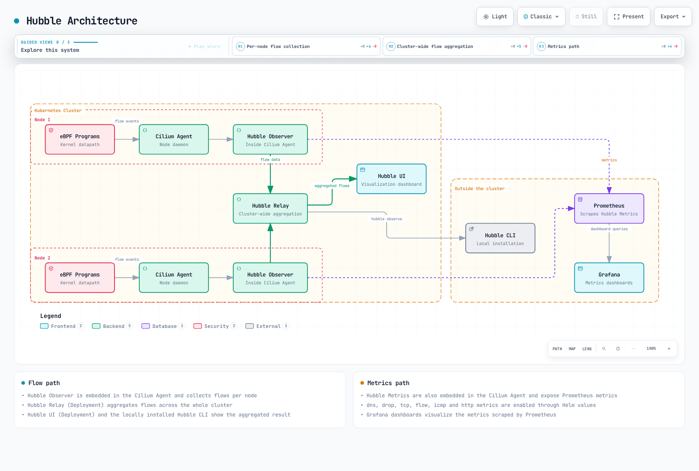
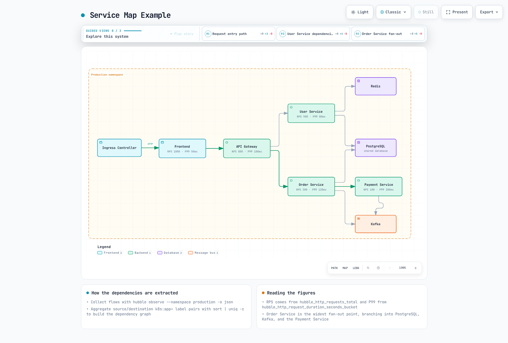

# Cilium Service Mesh Observability

> **Last Updated**: September 11, 2026 · Cilium/chart 1.20.1 · Hubble CLI 1.19.4 · Collector Contrib 0.160.0 · Loki 3.7.7. See the [overview](./README.md) for Kubernetes/EKS and platform requirements.

## Overview

Hubble exposes observations of traffic handled by Cilium. L3/L4 events come from the datapath; HTTP visibility additionally needs a supported L7 proxy/policy path. Enabling Hubble alone does not decrypt arbitrary application TLS, discover every dependency or generate distributed application traces.

The examples assume prepared workloads in `production` and a correctly installed Cilium deployment. Apply the [security chapter](./03-security.md)'s encryption/ztunnel limitations when interpreting what can be observed.

## Hubble Architecture



[🔍 View interactive diagram](https://www.atomai.click/kubernetes-docs/archmaps/en-service-mesh-cilium-service-mesh-04-observability-0.html)

The figure groups components. Envoy also supplies L7 events where configured; eBPF is not the only input for HTTP observations. Prometheus scrapes metrics separately from Relay's flow API.

| Component | Role |
|---|---|
| Observer in the Cilium Agent | Stores and serves a bounded per-node flow history |
| Hubble Relay | Aggregates observations from connected Hubble servers |
| Hubble UI | Displays observed relationships and flow details |
| Hubble CLI | Queries the API or reads exported JSON records |
| Hubble metrics handlers | Turn eligible observations into Prometheus metrics |

An observation buffer is not a long-term log store. Full buffers, missing nodes, exporter failures and event loss must be interpreted separately from application health.

## Hubble Installation and Configuration

### Installation via Helm

Merge this overlay with the installation's reviewed values for Cilium 1.20.1. It exposes metrics and enables Relay/UI with port-forward access. It does not install Prometheus, Grafana, Collector or Loki:

```yaml
prometheus:
  enabled: true
hubble:
  enabled: true
  relay:
    enabled: true
    replicas: 1
    resources:
      requests:
        cpu: 100m
        memory: 128Mi
      limits:
        cpu: 1000m
        memory: 1024Mi
  ui:
    enabled: true
    replicas: 1
    ingress:
      enabled: false
  metrics:
    enabled:
    - dns
    - drop
    - tcp
    - flow
    - icmp
    - port-distribution
    - httpV2:labelsContext=source_namespace,source_workload,destination_namespace,destination_workload
  tls:
    enabled: true
    auto:
      enabled: true
      method: cronJob
      certValidityDuration: 365
      schedule: 0 0 1 */4 *
```

Resource quantities are examples, not sizing results. Some agent configuration changes require a controlled rollout; inspect the rendered workload and installation procedure before applying changes.

Hubble server-to-Relay mTLS protects the observation transport. UI ingress, the client-facing Relay API, metric endpoints and application traffic have separate TLS/authentication settings. A publicly reachable UI needs an appropriate access-control boundary; a TLS Secret alone is not user authentication.

This overlay selects `cronJob` certificate renewal. The selected chart's default validity is 365 days; the TLS guide also shows explicitly configured 1,095-day examples. `method: helm` can generate certificates but does not schedule renewal. Check certificate jobs, expiry and trust; Hubble supports certificate reloading, which is not a substitute for operating the renewal process.

### Hubble CLI Installation

This Unix example pins the release, selects Linux/macOS and amd64/arm64, and stops on a failed download or checksum:

```bash
set -eu
HUBBLE_VERSION=v1.19.4
case "$(uname -s)" in
  Linux) HUBBLE_RELEASE_OS=linux ;;
  Darwin) HUBBLE_RELEASE_OS=darwin ;;
  *) echo "Use the matching release archive for this operating system." >&2; exit 1 ;;
esac
case "$(uname -m)" in
  x86_64|amd64) HUBBLE_RELEASE_ARCH=amd64 ;;
  aarch64|arm64) HUBBLE_RELEASE_ARCH=arm64 ;;
  *) echo "Unsupported architecture for this example." >&2; exit 1 ;;
esac
HUBBLE_ARCHIVE="hubble-${HUBBLE_RELEASE_OS}-${HUBBLE_RELEASE_ARCH}.tar.gz"
HUBBLE_RELEASE_BASE="https://github.com/cilium/hubble/releases/download/${HUBBLE_VERSION}"
curl -fSLO "${HUBBLE_RELEASE_BASE}/${HUBBLE_ARCHIVE}"
curl -fSLO "${HUBBLE_RELEASE_BASE}/${HUBBLE_ARCHIVE}.sha256sum"
if command -v sha256sum >/dev/null 2>&1; then
  sha256sum --check "${HUBBLE_ARCHIVE}.sha256sum"
else
  shasum -a 256 -c "${HUBBLE_ARCHIVE}.sha256sum"
fi
tar -xzf "$HUBBLE_ARCHIVE" hubble
sudo install -m 0755 hubble /usr/local/bin/hubble
hubble version
```

Use a working directory appropriate for the download. The official release also provides Windows amd64/arm64 archives; verify their published SHA-256 values and follow the platform's installation procedure. CLI platform availability does not imply support for running Cilium's Linux datapath on that operating system.

### Connecting to Relay

```bash
# Terminal 1
cilium hubble port-forward --port-forward 4245
# Terminal 2
hubble status --server localhost:4245
hubble observe --server localhost:4245 --namespace production --last 100
hubble observe --server localhost:4245 --namespace production --follow
```

Keep full status/errors. A successful grep for “Hubble,” or sample output showing three connected nodes, does not prove this installation is healthy.

## Hubble CLI

### Basic Usage and Filtering

`hubble observe` normally returns recent buffered observations. It is not a continuous stream unless `--follow` is used. `--last` limits history and Relay can return that limit per connected Hubble instance.

```bash
hubble observe --pod production/frontend --last 100
hubble observe --from-ip 10.0.1.5 --to-ip 10.0.2.10
hubble observe --to-port 8080
hubble observe --protocol http --http-status '5+'
hubble observe --protocol http --http-status '2+'
hubble observe --http-method POST --http-method PUT
hubble observe --http-path '^/api/v1/users/.*$'
hubble observe --to-label 'k8s:app=backend,k8s:version=v2'
hubble observe --from-namespace production --to-namespace production --from-workload frontend --to-workload backend
hubble observe --to-service production/backend
hubble observe --namespace production --verdict DROPPED --drop-reason-desc POLICY_DENIED
```

Important matching rules:

- Pod and Service names are **prefixes**, with `default` used when a namespace is omitted.
- Use `--from-ip` and `--to-ip`; the former `--ip-source`/`--ip-destination` flags are invalid.
- HTTP status supports exact codes and prefixes such as `5+`; `500-599` is not accepted.
- HTTP method values are exact method choices. Repeat the flag for POST or PUT; `"POST|PUT"` is a literal method value, not a regular expression.
- A single label-selector string with comma-separated requirements is AND; repeated label selectors are alternatives.
- Service filters use Service/ClusterIP-derived metadata. `--from-service frontend` is not a general filter for Pods belonging to the frontend Service. Use workload/Pod/label filters for caller workloads.
- Namespace-qualified `--to-service production/backend` stands alone; the CLI rejects combining `--to-service` with `--namespace`.

### Output Formats and Retained Data

`json` and `jsonpb` are aliases for the same protobuf JSON mapping. `dict`, `compact` and `table` are also supported display formats.

```bash
hubble observe --namespace production --last 100 -o json
hubble observe --input-file flows.jsonl --last 100 -o json
hubble observe --since 5m
```

Absolute RFC3339 `--since`/`--until` timestamps only query available data. An in-memory buffer does not make years of flow history available; retain exports when historical investigation is required.

## Hubble UI

### Service Map


[🔍 View interactive diagram](https://www.atomai.click/kubernetes-docs/archmaps/en-service-mesh-cilium-service-mesh-04-observability-1.html)

UI relationships come from observed traffic. Quiet workloads, unsupported paths, external browser/CDN traffic and missing endpoint metadata may not appear. A missing edge is not proof that a dependency does not exist.

### UI Features and Access

The UI offers namespace/verdict filtering, recent flow details and an observed service map. L7 details require L7 visibility.

```bash
kubectl -n kube-system port-forward --address 127.0.0.1 service/hubble-ui 12000:80
# Open http://localhost:12000
```

## L7 Flow Visibility

### HTTP, gRPC and DNS

```bash
hubble observe --protocol http --last 100 -o json |
  jq 'select(.flow.l7.type == "RESPONSE") | .flow.l7.http'
hubble observe --protocol http --last 100 -o json |
  jq 'select(.flow.l7.type == "RESPONSE") |
      select((.flow.l7.latency_ns // "0" | tonumber) > 1000000000)'
hubble observe --protocol dns --last 100 -o json |
  jq 'select(.flow.l7.dns.rcode == 3)'
hubble observe --protocol http --http-path '^/myapp[.]UserService/GetUser$'
hubble observe --port 9092
```

The JSON mapping encodes the 64-bit `latency_ns` value as a **string**. Convert it with `tonumber` before numeric comparison; comparing the string directly with a JSON number gives incorrect slow-request results.

HTTP response records carry response status, while request records may have no status yet. A gRPC method can be selected through its HTTP path, but HTTP 200 does not imply application-level gRPC success. Collect RPC outcomes separately where needed.

There is no `--dns-rcode` flag in the selected CLI. Inspect the numeric DNS response code in JSON; 3 denotes NXDOMAIN. The `kafka` CLI filter can read compatible historical data, but it does not restore Kafka L7 processing removed from Cilium 1.20.1. Port 9092 filtering provides L4 observations, not topic/operation inspection.

## Prometheus Metrics

### Enabling Collection

Enable each handler once. For example, `dns` emits its DNS metric families; `dns:query` adds query-name context rather than enabling a separate query counter. Repeating `dns` or `http` handlers as separate query/response/duration entries attempts to register overlapping metric families.

`httpV2` replaces the deprecated `http` handler, and the two cannot be enabled together. Its `hubble_http_requests_total` counter uses **response events**, includes `status`, and presents source/destination context in request direction. It does not emit the old `hubble_http_responses_total` family.

The base overlay explicitly requests namespace/workload context labels. `destination_service` is not one of the supported `labelsContext` names. Add actual Prometheus collection only after installing the Prometheus Operator CRDs/controller and checking its selectors:

```yaml
prometheus:
  serviceMonitor:
    enabled: true
    labels:
      release: prometheus
    relabelings:
    - sourceLabels:
      - __meta_kubernetes_pod_node_name
      targetLabel: node
      action: replace
      replacement: ${1}
    - targetLabel: cluster
      replacement: example-cluster
      action: replace
hubble:
  metrics:
    serviceMonitor:
      enabled: true
      labels:
        release: prometheus
      relabelings:
      - sourceLabels:
        - __meta_kubernetes_pod_node_name
        targetLabel: node
        action: replace
        replacement: ${1}
      - targetLabel: cluster
        replacement: example-cluster
        action: replace
```

Replace `example-cluster` with the intended unique metric label and `release: prometheus` with labels matching the installed Prometheus selectors. Preserve the node relabeling when customizing the list. The rules below also require matching `ruleSelector`/namespace selection.

This relabeling adds `cluster` to scrape targets and samples. Merely setting Prometheus `external_labels` does not add that label to local query samples. Check the actual target labels; examples using `job="hubble-metrics"` or `job="cilium-agent"` assume the usual Service-derived job names.

### Recording and Alerting Rules

Prometheus evaluates these rules; Alertmanager handles notification routing. The recording rules must be loaded before using the dependent queries/dashboard.

```yaml
apiVersion: monitoring.coreos.com/v1
kind: PrometheusRule
metadata:
  name: cilium-hubble-observation
  namespace: monitoring
  labels:
    release: prometheus
spec:
  groups:
  - name: cilium.hubble.httpv2
    rules:
    - record: cilium_hubble:http_responses:rate5m
      expr: sum by (cluster, destination_namespace, destination_workload) (rate(hubble_http_requests_total{reporter="server",cluster!="",destination_namespace!="",destination_workload!=""}[5m]))
    - record: cilium_hubble:http_5xx:rate5m
      expr: 'sum by (cluster, destination_namespace, destination_workload) (rate(hubble_http_requests_total{reporter="server",cluster!="",destination_namespace!="",destination_workload!="",status=~"5.."}[5m]))

        or on (cluster, destination_namespace, destination_workload) (0 * cilium_hubble:http_responses:rate5m)'
    - record: cilium_hubble:http_5xx_percent:rate5m
      expr: '(100 * cilium_hubble:http_5xx:rate5m / cilium_hubble:http_responses:rate5m)

        and on (cluster, destination_namespace, destination_workload) (cilium_hubble:http_responses:rate5m
        > 0)'
    - record: cilium_hubble:http_latency_bucket:rate5m
      expr: sum by (le, cluster, destination_namespace, destination_workload) (rate(hubble_http_request_duration_seconds_bucket{reporter="server",cluster!="",destination_namespace!="",destination_workload!=""}[5m]))
    - alert: HighObservedHTTP5xx
      expr: (cilium_hubble:http_5xx_percent:rate5m > 5) and on (cluster, destination_namespace,
        destination_workload) (cilium_hubble:http_responses:rate5m > 1)
      for: 5m
      labels:
        severity: warning
      annotations:
        summary: High observed HTTP 5xx ratio
        description: '{{ $labels.cluster }}/{{ $labels.destination_namespace }}/{{
          $labels.destination_workload }}: {{ $value }}%'
    - alert: HighObservedHTTPP99
      expr: (histogram_quantile(0.99, cilium_hubble:http_latency_bucket:rate5m) >
        1) and on (cluster, destination_namespace, destination_workload) (cilium_hubble:http_responses:rate5m
        > 1)
      for: 5m
      labels:
        severity: warning
      annotations:
        summary: High observed HTTP latency
        description: '{{ $labels.cluster }}/{{ $labels.destination_namespace }}/{{
          $labels.destination_workload }}: {{ $value }}s'
    - alert: HubbleMetricsScrapeFailed
      expr: up{job="hubble-metrics"} == 0
      for: 5m
      labels:
        severity: warning
      annotations:
        summary: Known Hubble metrics target cannot be scraped
    - alert: CiliumBPFMapPressure
      expr: cilium_bpf_map_pressure > 0.9
      for: 5m
      labels:
        severity: warning
      annotations:
        summary: High pressure in an instrumented BPF map
        description: '{{ $labels.cluster }}/{{ $labels.node }} {{ $labels.map_name
          }}: {{ $value }}'
```

The example chooses the **server/ingress observation boundary**. Client/egress observations can describe the same exchange; mixing boundaries can double-count observations. Validate the actual proxy path when several gateways or L7 policies are involved.

Missing 5xx series become zero only for a matching observed total. An idle total is not divided into a fake healthy percentage, and missing observations remain absent. These ratios do not cover every TCP failure, denied request, missing response or application-level failure.

Thresholds, the one-response/second floor and five-minute duration are examples to adapt to the workload's error budget. `up == 0` detects known failed scrape targets; missing targets require separate inventory/readiness checks. Map-pressure metrics only cover instrumented maps, and policy-map pressure can be absent below its reporting threshold.

### Key Queries

The first three queries use the recording rules above. Units and observation scope are part of the metric's meaning.

### Observed server HTTP responses/s

```promql
cilium_hubble:http_responses:rate5m
```

### Observed HTTP5xx percentage

```promql
cilium_hubble:http_5xx_percent:rate5m
```

### Observed HTTP P99 seconds

```promql
histogram_quantile(0.99, cilium_hubble:http_latency_bucket:rate5m)
```

### Hubble flow-drop events/s

```promql
sum by (cluster, reason) (rate(hubble_drop_total[5m]))
```

### Observed DNS queries/s

```promql
sum by (cluster) (rate(hubble_dns_queries_total[5m]))
```

### Observed SYN flag occurrences/s

```promql
sum by (cluster) (rate(hubble_tcp_flags_total{flag="SYN"}[5m]))
```

### Observed flow events/s

```promql
sum by (cluster) (rate(hubble_flows_processed_total[5m]))
```

### Cilium forwarded bytes/s

```promql
sum by (cluster, node, direction) (rate(cilium_forward_bytes_total[5m]))
```

### Prometheus scrape success

```promql
up{job=~"cilium-agent|hubble-metrics"}
```

### Managed endpoint count

```promql
cilium_endpoint
```

### Loaded policy count

```promql
cilium_policy
```

### Instrumented BPF map pressure

```promql
cilium_bpf_map_pressure
```

### CT entries at last garbage collection

```promql
cilium_datapath_conntrack_gc_entries
```

### Installed endpoint proxy redirects

```promql
cilium_proxy_redirects
```

`hubble_flows_processed_total` counts flow events, not bytes. Hubble drop events differ from the agent's packet counters. SYN occurrences include retransmissions and are not an active-connection gauge.

The agent exports `cilium_endpoint` and `cilium_policy`, rather than the former `*_count` names. `cilium_datapath_conntrack_gc_entries` describes entries observed at a garbage-collection run; the former `cilium_datapath_conntrack_active`/`max` ratio is not a documented current metric pair. `cilium_proxy_redirects` counts installed redirects, not requests. BPF pressure and capacity metrics have their own map labels and reporting behavior; do not invent an unrelated utilization denominator.

## Grafana Dashboards

### Released Dashboards

Cilium includes dashboard JSON in the selected release. Review each dashboard against enabled metrics and target labels: the general Hubble dashboard still has a legacy HTTP-response query, while the HTTP workload dashboard uses HTTPv2-style data and cluster/workload variables. Its success-ratio panels also need care when no success series exists.

The old v1.12 dashboard-ID list is not a version-matched installation procedure for this guide. The custom dashboard below uses the corrected recording rules, an explicit datasource input, layout and units. Import it into an existing Grafana instance and choose the matching Prometheus datasource.

### Custom Dashboard Example

```json
{
  "__inputs": [
    {
      "name": "DS_PROMETHEUS",
      "label": "Prometheus",
      "type": "datasource",
      "pluginId": "prometheus",
      "pluginName": "Prometheus"
    }
  ],
  "id": null,
  "uid": "cilium-hubble-observed",
  "title": "Cilium Hubble Observations",
  "tags": [
    "cilium",
    "hubble"
  ],
  "schemaVersion": 38,
  "version": 1,
  "timezone": "browser",
  "time": {
    "from": "now-1h",
    "to": "now"
  },
  "refresh": "30s",
  "panels": [
    {
      "id": 1,
      "title": "Observed HTTP responses/s",
      "type": "timeseries",
      "gridPos": {
        "x": 0,
        "y": 0,
        "w": 12,
        "h": 8
      },
      "datasource": {
        "type": "prometheus",
        "uid": "${DS_PROMETHEUS}"
      },
      "targets": [
        {
          "refId": "A",
          "expr": "cilium_hubble:http_responses:rate5m",
          "legendFormat": "{{cluster}} / {{destination_namespace}} / {{destination_workload}}"
        }
      ],
      "fieldConfig": {
        "defaults": {
          "unit": "reqps"
        },
        "overrides": []
      }
    },
    {
      "id": 2,
      "title": "Observed HTTP5xx (%)",
      "type": "timeseries",
      "gridPos": {
        "x": 12,
        "y": 0,
        "w": 12,
        "h": 8
      },
      "datasource": {
        "type": "prometheus",
        "uid": "${DS_PROMETHEUS}"
      },
      "targets": [
        {
          "refId": "A",
          "expr": "cilium_hubble:http_5xx_percent:rate5m",
          "legendFormat": "{{cluster}} / {{destination_namespace}} / {{destination_workload}}"
        }
      ],
      "fieldConfig": {
        "defaults": {
          "unit": "percent"
        },
        "overrides": []
      }
    },
    {
      "id": 3,
      "title": "Observed HTTP P99",
      "type": "timeseries",
      "gridPos": {
        "x": 0,
        "y": 8,
        "w": 12,
        "h": 8
      },
      "datasource": {
        "type": "prometheus",
        "uid": "${DS_PROMETHEUS}"
      },
      "targets": [
        {
          "refId": "A",
          "expr": "histogram_quantile(0.99, cilium_hubble:http_latency_bucket:rate5m)",
          "legendFormat": "{{cluster}} / {{destination_namespace}} / {{destination_workload}}"
        }
      ],
      "fieldConfig": {
        "defaults": {
          "unit": "s"
        },
        "overrides": []
      }
    },
    {
      "id": 4,
      "title": "Observed flow drops/s",
      "type": "timeseries",
      "gridPos": {
        "x": 12,
        "y": 8,
        "w": 12,
        "h": 8
      },
      "datasource": {
        "type": "prometheus",
        "uid": "${DS_PROMETHEUS}"
      },
      "targets": [
        {
          "refId": "A",
          "expr": "sum by (cluster, reason) (rate(hubble_drop_total[5m]))",
          "legendFormat": "{{cluster}} / {{reason}}"
        }
      ],
      "fieldConfig": {
        "defaults": {
          "unit": "ops"
        },
        "overrides": []
      }
    }
  ]
}
```

The dashboard reports observations, not a guaranteed end-to-end application SLI. Treat absent data as a prompt to inspect traffic, L7 visibility and scraping.

## Service Dependency Maps

### Dependency Extraction

This example groups **observed HTTP requests at the ingress boundary**, preserving direction and avoiding an error when workload metadata is absent:

```bash
hubble observe --namespace production --protocol http --traffic-direction ingress --last 1000 -o json |
  jq -r 'select(.flow.l7.type == "REQUEST") |
    [.flow.source.namespace,
     (.flow.source.workloads[0].name // .flow.source.pod_name // "unknown"),
     .flow.destination.namespace,
     (.flow.destination.workloads[0].name // .flow.destination.pod_name // "unknown")] |
    @tsv' |
  sort | uniq -c | sort -rn
```

Counts are counts of selected observations, not automatically request rates or a complete dependency inventory. Unknown endpoints and dependencies outside the observed path need other evidence.

### Service Map Example



[🔍 View interactive diagram](https://www.atomai.click/kubernetes-docs/archmaps/en-service-mesh-cilium-service-mesh-04-observability-2.html)

The figure's numbers have no measurement provenance here. Use it to explain relationships, not to choose capacity or SLO thresholds. Cilium can observe L4 traffic to Kafka without Kafka topic-level visibility.

## Golden Signals Monitoring


[🔍 View interactive diagram](https://www.atomai.click/kubernetes-docs/archmaps/en-service-mesh-cilium-service-mesh-04-observability-3.html)

Use the signals with definitions appropriate to the service. Availability is not one of the four names, but it still requires an explicit SLI; an observed HTTP 5xx ratio is not a complete availability measurement. Histogram quantiles must aggregate compatible buckets while retaining `le`, rather than averaging per-instance percentiles.

## OpenTelemetry Integration

### Hubble Flow Export

The selected chart supports static/dynamic **file exports**. The former `hubble.export.opentelemetry` and `fileOutput` settings do not configure an OTLP sender.

This example enables a dynamic exporter for observations involving `production`, with bounded file rotation and selected fields:

```yaml
hubble:
  export:
    static:
      enabled: false
    dynamic:
      enabled: true
      config:
        createConfigMap: true
        configMapName: cilium-flowlog-config
        content:
        - name: production
          filePath: /var/run/cilium/hubble/events.log
          fileMaxSizeMb: 10
          fileMaxBackups: 5
          fileCompress: false
          includeFilters:
          - source_pod:
            - production/
          - destination_pod:
            - production/
          excludeFilters: []
          fieldMask:
          - time
          - node_name
          - source.namespace
          - source.pod_name
          - source.workloads
          - destination.namespace
          - destination.pod_name
          - destination.workloads
          - IP
          - l4
          - verdict
          - drop_reason_desc
          - l7.type
          - l7.latency_ns
          - l7.http.code
          - l7.http.method
          - l7.http.protocol
          - l7.dns.rcode
```

The two include filters are alternatives: source or destination in that namespace. This mask omits HTTP URLs/headers and workload labels; choose any additional fields deliberately. Dynamic configuration updates can be applied without restarting agents after the exporter is enabled, but initial enablement/installation changes still need the proper rollout.

Rotation is local file retention, not durable central storage. Confirm the file is written on the expected node and arrange an appropriate log reader.

### Collector Configuration

The following is a Collector Contrib 0.160.0 **configuration**, not a Deployment. A node-local Collector DaemonSet must be provided with read access to the corresponding host log directory, writable persistent checkpoint storage and `K8S_NODE_NAME` from the downward API.

```yaml
extensions:
  file_storage:
    directory: /var/lib/otelcol/file_storage
    create_directory: true
receivers:
  filelog/hubble:
    include:
    - /var/run/cilium/hubble/events*.log
    start_at: end
    storage: file_storage
    operators:
    - type: json_parser
      parse_from: body
      parse_to: body
      timestamp:
        parse_from: body.time
        layout_type: gotime
        layout: 2006-01-02T15:04:05.999999999Z07:00
processors:
  memory_limiter:
    check_interval: 1s
    limit_mib: 128
    spike_limit_mib: 32
  resource/hubble:
    attributes:
    - key: service.name
      value: hubble-flow-logs
      action: upsert
    - key: k8s.node.name
      value: ${env:K8S_NODE_NAME}
      action: upsert
  batch:
    timeout: 5s
exporters:
  otlphttp/loki:
    endpoint: https://logs.example.com/otlp
    headers:
      X-Scope-OrgID: example-tenant
    tls:
      ca_file: /etc/otel/tls/backend-ca.crt
service:
  extensions:
  - file_storage
  pipelines:
    logs:
      receivers:
      - filelog/hubble
      processors:
      - memory_limiter
      - resource/hubble
      - batch
      exporters:
      - otlphttp/loki
```

Replace the illustrative backend address, tenant and CA path with the actual Loki OTLP endpoint and trust configuration. Provide the authentication required by the chosen gateway; `X-Scope-OrgID` identifies a tenant and is not authentication.

The filelog receiver parses the JSON log body and timestamp. Persistent `file_storage` checkpoints retain read offsets; an ephemeral checkpoint volume can change restart behavior. `start_at: end` skips pre-existing content when there is no saved position. It is not a replay/import setting.

Loki 3.7.7 accepts OTLP/HTTP logs at `/otlp/v1/logs`; the exporter appends `/v1/logs` to its `/otlp` base endpoint. Loki must support/enable structured metadata and compatible storage settings. Do not use the removed Collector `loki` exporter. Resource attribute `service.name` becomes the Loki label `service_name`; the structured body remains log content.

Flow logs, Prometheus metrics and application traces are different signals:

| Signal | Path in this guide |
|---|---|
| Hubble flow records | File exporter → node filelog receiver → OTLP/HTTP log backend |
| Hubble/agent metrics | Metric endpoints → Prometheus collection |
| Application/Envoy traces | Separate instrumentation and an appropriate trace pipeline/backend |

The former Collector `jaeger` exporter is also absent in the selected distribution. Current Jaeger can receive OTLP traces through a correctly configured trace pipeline; pointing flow logs at a trace exporter does not create distributed traces. This chapter's Collector pipeline exports **logs only**.

## Troubleshooting

### Status and Configuration

```bash
cilium status
hubble status --server localhost:4245
kubectl -n kube-system get daemonset cilium
kubectl -n kube-system get deployment hubble-relay hubble-ui
kubectl -n kube-system get configmap cilium-config -o yaml
kubectl -n kube-system get pods -l k8s-app=cilium -o wide
CILIUM_POD='<agent-on-the-node-being-inspected>'
kubectl -n kube-system exec "$CILIUM_POD" -c cilium-agent -- cilium-dbg status --verbose
kubectl -n kube-system exec "$CILIUM_POD" -c cilium-agent -- cilium-dbg bpf ct list global
kubectl -n kube-system logs deployment/hubble-relay --since=10m
```

Use the Agent on the relevant node. The client-side `cilium` CLI is different from the in-agent `cilium-dbg` interface. Keep errors and full status; grep output is not a readiness assertion.

### No Flows or Missing Metrics

Check traffic generation, retention windows and filters before concluding that the datapath is broken. Verify connected Hubble instances and TLS/certificate renewal, then distinguish:

- No matching observations from an incorrect namespace, prefix, direction or protocol filter.
- No HTTP observations because no supported L7 visibility is configured or payloads remain encrypted.
- An unavailable Relay/server or an inaccessible metric target.
- A ServiceMonitor/PrometheusRule that is not selected by the installed Prometheus resource.
- Missing context/cluster labels or queries written for the wrong metric handler.
- Export/reader errors, rotation/retention gaps or observation loss.

Do not run an unbounded connectivity-test loop merely to populate a graph. Use controlled traffic for the prepared workloads and verify what each observation represents.

## Next Steps

- [Ingress & Gateway](./05-ingress-gateway.md)
- [Best Practices](./06-best-practices.md)
- [Observability Quiz](../../quizzes/service-mesh/cilium-service-mesh/observability.md)

## References

- [Cilium1.20.1 Hubble setup](https://github.com/cilium/cilium/blob/v1.20.1/Documentation/observability/hubble/setup.rst)
- [Hubble TLS and renewal](https://github.com/cilium/cilium/blob/v1.20.1/Documentation/observability/hubble/configuration/tls.rst)
- [Hubble export](https://github.com/cilium/cilium/blob/v1.20.1/Documentation/observability/hubble/configuration/export.rst)
- [Hubble CLI](https://github.com/cilium/cilium/blob/v1.20.1/Documentation/observability/hubble/hubble-cli.rst)
- [Hubble CLI1.19.4 release](https://github.com/cilium/hubble/releases/tag/v1.19.4)
- [Hubble UI](https://github.com/cilium/cilium/blob/v1.20.1/Documentation/observability/hubble/hubble-ui.rst)
- [Metric definitions](https://github.com/cilium/cilium/blob/v1.20.1/Documentation/observability/metrics.rst)
- [HTTP metric implementation](https://github.com/cilium/cilium/blob/v1.20.1/pkg/hubble/metrics/http/handler.go)
- [Metric context labels](https://github.com/cilium/cilium/blob/v1.20.1/pkg/hubble/metrics/api/context.go)
- [Released HTTP workload dashboard](https://github.com/cilium/cilium/blob/v1.20.1/install/kubernetes/cilium/files/hubble/dashboards/hubble-l7-http-metrics-by-workload.json)
- [Released general Hubble dashboard](https://github.com/cilium/cilium/blob/v1.20.1/install/kubernetes/cilium/files/hubble/dashboards/hubble-dashboard.json)
- [Collector0.160 filelog receiver](https://github.com/open-telemetry/opentelemetry-collector-contrib/blob/v0.160.0/receiver/filelogreceiver/README.md)
- [Loki3.7.7 OTLP ingestion](https://github.com/grafana/loki/blob/v3.7.7/docs/sources/send-data/otel/_index.md)
- [Loki3.7.7 OTLP mapping and endpoint](https://github.com/grafana/loki/blob/v3.7.7/docs/sources/shared/otel.md)
- [Collector JSON parser](https://github.com/open-telemetry/opentelemetry-collector-contrib/blob/v0.160.0/pkg/stanza/docs/operators/json_parser.md)
- [Google SRE Golden Signals](https://sre.google/sre-book/monitoring-distributed-systems/)
