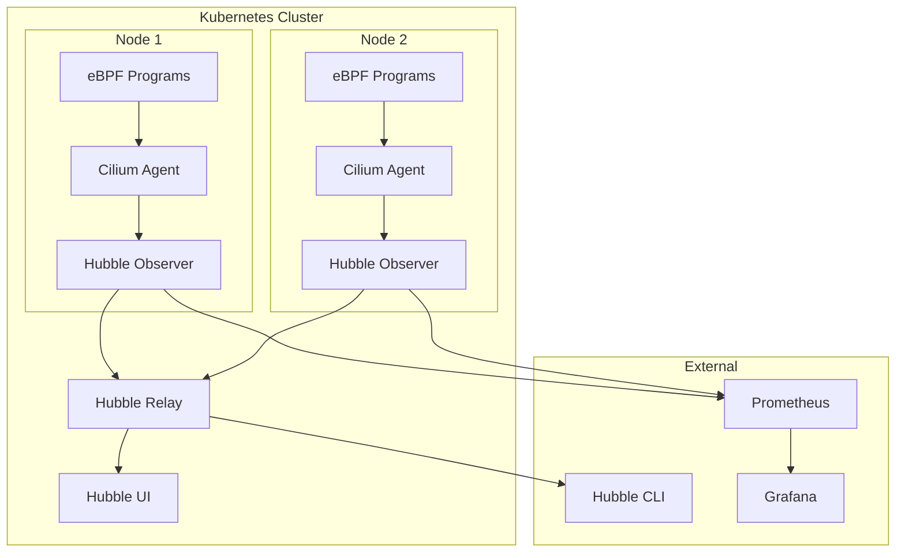
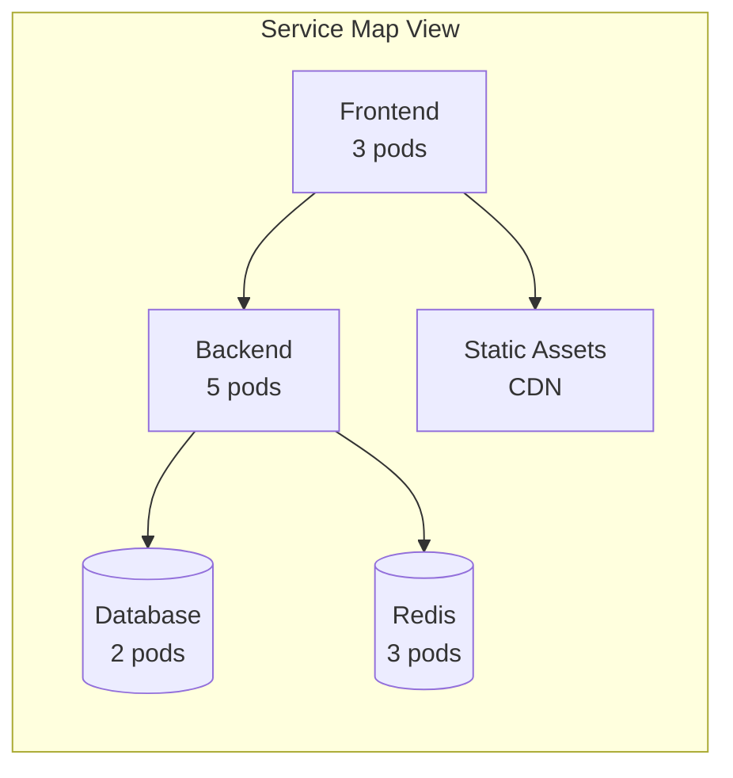
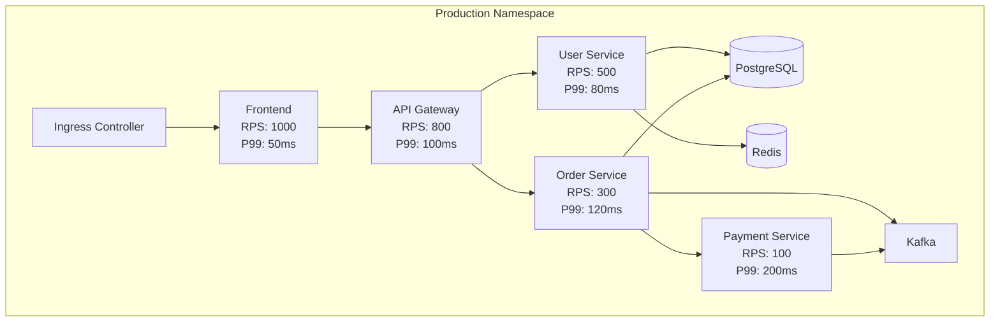
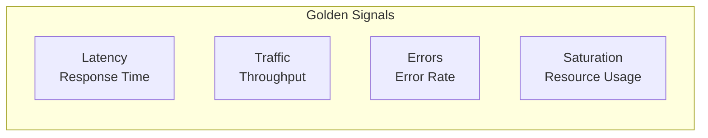

# Cilium Service Mesh Observability

> **Supported Versions**: Cilium 1.16+, Kubernetes 1.28+
> **Last Updated**: February 21, 2026

## Overview

Cilium Service Mesh provides powerful network observability through Hubble. Hubble observes network flows in real-time based on eBPF, visualizes service dependencies, and collects detailed L7 metrics. This chapter explains Hubble's components and usage.

## Hubble Architecture



### Components

| Component | Role | Deployment |
|-----------|------|------------|
| Hubble Observer | Per-node flow collection | Embedded in Cilium Agent |
| Hubble Relay | Cluster-wide flow aggregation | Deployment |
| Hubble UI | Visualization dashboard | Deployment |
| Hubble CLI | Command-line interface | Local installation |
| Hubble Metrics | Prometheus metrics | Embedded in Cilium Agent |

## Hubble Installation and Configuration

### Installation via Helm

```yaml
# values.yaml
hubble:
  enabled: true

  # Hubble Relay
  relay:
    enabled: true
    replicas: 1
    resources:
      limits:
        cpu: 1000m
        memory: 1024Mi
      requests:
        cpu: 100m
        memory: 128Mi

  # Hubble UI
  ui:
    enabled: true
    replicas: 1
    ingress:
      enabled: true
      hosts:
      - hubble.example.com
      tls:
      - secretName: hubble-tls
        hosts:
        - hubble.example.com

  # Hubble metrics
  metrics:
    enabled:
    - dns
    - drop
    - tcp
    - flow
    - icmp
    - http

    serviceMonitor:
      enabled: true

  # Flow log settings
  export:
    static:
      enabled: false
      filePath: /var/run/cilium/hubble/events.log

  # TLS settings
  tls:
    enabled: true
    auto:
      enabled: true
      method: helm
      certValidityDuration: 1095
```

### Hubble CLI Installation

```bash
# macOS
brew install hubble

# Linux
HUBBLE_VERSION=$(curl -s https://raw.githubusercontent.com/cilium/hubble/master/stable.txt)
curl -L --remote-name-all https://github.com/cilium/hubble/releases/download/$HUBBLE_VERSION/hubble-linux-amd64.tar.gz
tar xzvf hubble-linux-amd64.tar.gz
sudo mv hubble /usr/local/bin/

# Connection setup (port forwarding)
kubectl port-forward -n kube-system svc/hubble-relay 4245:80 &

# Check status
hubble status

# Expected output
Healthcheck (via localhost:4245): Ok
Current/Max Flows: 8190/8190 (100.00%)
Flows/s: 23.19
Connected Nodes: 3/3
```

## Hubble CLI

### Basic Usage

```bash
# Real-time flow observation
hubble observe

# Observe specific namespace
hubble observe --namespace production

# Observe specific Pod
hubble observe --pod production/frontend-xxx

# Observe specific service
hubble observe --to-service backend

# Follow mode (real-time)
hubble observe -f
```

### Flow Filtering

```bash
# Filter by protocol
hubble observe --protocol http
hubble observe --protocol tcp
hubble observe --protocol dns

# Filter by IP address
hubble observe --ip-source 10.0.1.5
hubble observe --ip-destination 10.0.2.10

# Filter by port
hubble observe --port 80
hubble observe --port 443

# Filter by verdict (allow/deny)
hubble observe --verdict FORWARDED
hubble observe --verdict DROPPED

# Filter by HTTP status code
hubble observe --http-status 500
hubble observe --http-status 200-299

# Combined filters
hubble observe \
  --namespace production \
  --protocol http \
  --verdict DROPPED \
  -f
```

### Output Formats

```bash
# Default output
hubble observe

# JSON output
hubble observe -o json

# JSON output (for piping)
hubble observe -o jsonpb

# Dictionary format
hubble observe -o dict

# Compact format
hubble observe -o compact

# Table format
hubble observe -o table
```

### Advanced Queries

```bash
# Specific time range
hubble observe --since 5m
hubble observe --since 2024-01-15T10:00:00Z --until 2024-01-15T11:00:00Z

# Last N flows
hubble observe --last 100

# Filter by specific labels
hubble observe --from-label "app=frontend"
hubble observe --to-label "app=backend,version=v2"

# Inter-service flows
hubble observe --from-service frontend --to-service backend

# Filter by Identity
hubble observe --from-identity 12345
hubble observe --to-identity 12346

# Regex filtering
hubble observe --http-path "/api/v1/users/.*"
hubble observe --http-method "POST|PUT"
```

## Hubble UI

### Service Map

Hubble UI visually shows service dependencies:



### UI Features

1. **Service Map**: Real-time service dependency graph
2. **Flow Timeline**: Time-based network flows
3. **Namespace Filter**: View by namespace
4. **Verdict Filter**: Separate allowed/denied traffic
5. **Detail View**: L7 details of individual flows

### UI Access

```bash
# Port forwarding
kubectl port-forward -n kube-system svc/hubble-ui 12000:80

# Access in browser
# http://localhost:12000
```

## L7 Flow Visibility

### HTTP Flows

```bash
# Observe HTTP requests
hubble observe --protocol http -o json | jq '.flow.l7.http'

# Example output
{
  "code": 200,
  "method": "GET",
  "url": "/api/v1/users",
  "protocol": "HTTP/1.1",
  "headers": [
    {"key": "Host", "value": "api.example.com"},
    {"key": "User-Agent", "value": "curl/7.79.1"}
  ]
}

# Track HTTP errors
hubble observe --protocol http --http-status 500-599

# Identify slow requests
hubble observe --protocol http -o json | jq 'select(.flow.l7.latency_ns > 1000000000)'
```

### gRPC Flows

```bash
# Observe gRPC calls
hubble observe --protocol http --http-path "/.*Service/.*"

# Filter by gRPC method
hubble observe --http-path "/myapp.UserService/GetUser"
```

### DNS Queries

```bash
# Observe DNS queries
hubble observe --protocol dns

# Specific domain queries
hubble observe --protocol dns -o json | jq '.flow.l7.dns | select(.query != null)'

# Filter by DNS response code
hubble observe --protocol dns --dns-rcode NXDOMAIN
```

### Kafka Flows

```bash
# Observe Kafka traffic
hubble observe --port 9092

# Filter by Kafka topic (when L7 policy applied)
hubble observe --protocol kafka -o json | jq '.flow.l7.kafka'
```

## Prometheus Metrics

### Enabling Metrics

```yaml
# values.yaml
hubble:
  metrics:
    enabled:
    # DNS metrics
    - dns:query
    - dns:response

    # Packet drop metrics
    - drop

    # TCP metrics
    - tcp

    # Flow metrics
    - flow

    # ICMP metrics
    - icmp

    # HTTP metrics
    - http:requests
    - http:responses
    - http:duration

    # Port distribution
    - port-distribution

    # ServiceMonitor enabled
    serviceMonitor:
      enabled: true
      labels:
        release: prometheus
```

### Key Metrics

```promql
# Requests per second (RPS)
rate(hubble_http_requests_total[5m])

# HTTP error rate
sum(rate(hubble_http_responses_total{status=~"5.."}[5m])) /
sum(rate(hubble_http_responses_total[5m])) * 100

# HTTP latency (p99)
histogram_quantile(0.99, rate(hubble_http_request_duration_seconds_bucket[5m]))

# Packet drop count
rate(hubble_drop_total[5m])

# DNS query count
rate(hubble_dns_queries_total[5m])

# TCP connection count
hubble_tcp_flags_total{flag="SYN"}

# Network flow count
rate(hubble_flows_processed_total[5m])
```

### Cilium Agent Metrics

```promql
# Cilium agent status
cilium_agent_up

# Endpoint count
cilium_endpoint_count

# Policy count
cilium_policy_count

# BPF map usage
cilium_bpf_map_pressure

# Connection tracking table usage
cilium_datapath_conntrack_active

# Proxy redirect count
cilium_proxy_redirects
```

## Grafana Dashboards

### Installing Default Dashboards

```bash
# Import Cilium official dashboards
# In Grafana UI: Dashboard > Import > Enter Dashboard ID

# Key Dashboard IDs
# - 16611: Cilium v1.12 Agent
# - 16612: Cilium v1.12 Operator
# - 16613: Cilium v1.12 Hubble
```

### Custom Dashboard Example

```json
{
  "title": "Cilium Service Mesh Overview",
  "panels": [
    {
      "title": "HTTP Requests/s",
      "type": "graph",
      "targets": [
        {
          "expr": "sum(rate(hubble_http_requests_total[5m])) by (destination_service)",
          "legendFormat": "{{destination_service}}"
        }
      ]
    },
    {
      "title": "HTTP Error Rate",
      "type": "gauge",
      "targets": [
        {
          "expr": "sum(rate(hubble_http_responses_total{status=~\"5..\"}[5m])) / sum(rate(hubble_http_responses_total[5m])) * 100"
        }
      ]
    },
    {
      "title": "P99 Latency",
      "type": "graph",
      "targets": [
        {
          "expr": "histogram_quantile(0.99, sum(rate(hubble_http_request_duration_seconds_bucket[5m])) by (le, destination_service))",
          "legendFormat": "{{destination_service}}"
        }
      ]
    },
    {
      "title": "Dropped Packets",
      "type": "graph",
      "targets": [
        {
          "expr": "sum(rate(hubble_drop_total[5m])) by (reason)",
          "legendFormat": "{{reason}}"
        }
      ]
    }
  ]
}
```

## Service Dependency Maps

### Dependency Visualization

```bash
# Extract inter-service dependencies
hubble observe -o json | jq -r '[.flow.source.labels[] | select(startswith("k8s:app="))] | first' | sort | uniq -c

# Generate service dependency graph
hubble observe --namespace production -o json | \
  jq -r 'select(.flow.source.labels != null and .flow.destination.labels != null) |
    "\(.flow.source.labels | map(select(startswith("k8s:app="))) | first // "unknown") -> \(.flow.destination.labels | map(select(startswith("k8s:app="))) | first // "unknown")"' | \
  sort | uniq -c | sort -rn
```

### Service Map Example



## Golden Signals Monitoring

### Four Golden Signals



### PromQL Queries

```promql
# 1. Latency
# P50 latency
histogram_quantile(0.50, sum(rate(hubble_http_request_duration_seconds_bucket[5m])) by (le, destination_service))

# P99 latency
histogram_quantile(0.99, sum(rate(hubble_http_request_duration_seconds_bucket[5m])) by (le, destination_service))

# 2. Traffic (Throughput)
# Requests per second
sum(rate(hubble_http_requests_total[5m])) by (destination_service)

# Bytes per second
sum(rate(hubble_flows_processed_total[5m])) by (destination_service)

# 3. Errors (Error Rate)
# HTTP error rate
sum(rate(hubble_http_responses_total{status=~"5.."}[5m])) by (destination_service) /
sum(rate(hubble_http_responses_total[5m])) by (destination_service) * 100

# Packet drop rate
sum(rate(hubble_drop_total[5m])) by (reason)

# 4. Saturation
# TCP connection count
hubble_tcp_connections_total

# Connection tracking table utilization
cilium_datapath_conntrack_active / cilium_datapath_conntrack_max * 100
```

### AlertManager Rules

```yaml
# prometheus-rules.yaml
apiVersion: monitoring.coreos.com/v1
kind: PrometheusRule
metadata:
  name: cilium-alerts
  namespace: monitoring
spec:
  groups:
  - name: cilium.service-mesh
    rules:
    # High error rate
    - alert: HighHTTPErrorRate
      expr: |
        sum(rate(hubble_http_responses_total{status=~"5.."}[5m])) by (destination_service)
        / sum(rate(hubble_http_responses_total[5m])) by (destination_service) * 100 > 5
      for: 5m
      labels:
        severity: warning
      annotations:
        summary: "High HTTP error rate for {{ $labels.destination_service }}"
        description: "HTTP 5xx error rate is {{ $value }}%"

    # High latency
    - alert: HighLatency
      expr: |
        histogram_quantile(0.99, sum(rate(hubble_http_request_duration_seconds_bucket[5m])) by (le, destination_service)) > 1
      for: 5m
      labels:
        severity: warning
      annotations:
        summary: "High latency for {{ $labels.destination_service }}"
        description: "P99 latency is {{ $value }}s"

    # Packet drops
    - alert: HighDropRate
      expr: sum(rate(hubble_drop_total[5m])) by (reason) > 100
      for: 5m
      labels:
        severity: warning
      annotations:
        summary: "High packet drop rate"
        description: "Drop rate is {{ $value }}/s for reason {{ $labels.reason }}"
```

## OpenTelemetry Integration

### OTLP Export Configuration

```yaml
# values.yaml
hubble:
  export:
    fileOutput:
      enabled: false
    opentelemetry:
      enabled: true
      otlp:
        endpoint: "otel-collector.observability.svc:4317"
        insecure: true
        headers:
          "x-api-key": "your-api-key"
```

### OpenTelemetry Collector Configuration

```yaml
# otel-collector-config.yaml
apiVersion: v1
kind: ConfigMap
metadata:
  name: otel-collector-config
  namespace: observability
data:
  config.yaml: |
    receivers:
      otlp:
        protocols:
          grpc:
            endpoint: 0.0.0.0:4317

    processors:
      batch:
        timeout: 10s

    exporters:
      # Export to Jaeger
      jaeger:
        endpoint: jaeger-collector.observability.svc:14250
        tls:
          insecure: true

      # Export metrics to Prometheus
      prometheus:
        endpoint: 0.0.0.0:8889

      # Export logs to Loki
      loki:
        endpoint: http://loki.observability.svc:3100/loki/api/v1/push

    service:
      pipelines:
        traces:
          receivers: [otlp]
          processors: [batch]
          exporters: [jaeger]
        metrics:
          receivers: [otlp]
          processors: [batch]
          exporters: [prometheus]
```

## Troubleshooting

### Common Problem Diagnosis

```bash
# Check Cilium status
cilium status

# Check Hubble status
hubble status

# Diagnose connection issues
hubble observe --verdict DROPPED --namespace problematic-namespace

# Check policy violations
hubble observe --verdict DROPPED -o json | jq '.flow.drop_reason_desc'

# Diagnose specific Pod issues
hubble observe --pod production/problematic-pod-xxx

# Diagnose DNS issues
hubble observe --protocol dns --dns-rcode NXDOMAIN

# Check connection tracking table
cilium bpf ct list global
```

### No Flows Problem

```bash
# Check if Hubble is enabled
kubectl get cm -n kube-system cilium-config -o yaml | grep hubble

# Check Hubble Relay status
kubectl get pods -n kube-system -l app.kubernetes.io/name=hubble-relay

# Check Hubble Observer status
cilium status | grep Hubble

# Check buffer size
kubectl exec -n kube-system ds/cilium -- cilium hubble status
```

## Next Steps

- [Ingress & Gateway](./05-ingress-gateway.md): External traffic monitoring
- [Best Practices](./06-best-practices.md): Observability configuration optimization

## References

- [Hubble Documentation](https://docs.cilium.io/en/stable/observability/hubble/)
- [Hubble CLI Reference](https://docs.cilium.io/en/stable/observability/hubble/hubble-cli/)
- [Hubble Metrics](https://docs.cilium.io/en/stable/observability/metrics/)
- [Grafana Dashboards for Cilium](https://grafana.com/grafana/dashboards/?search=cilium)
