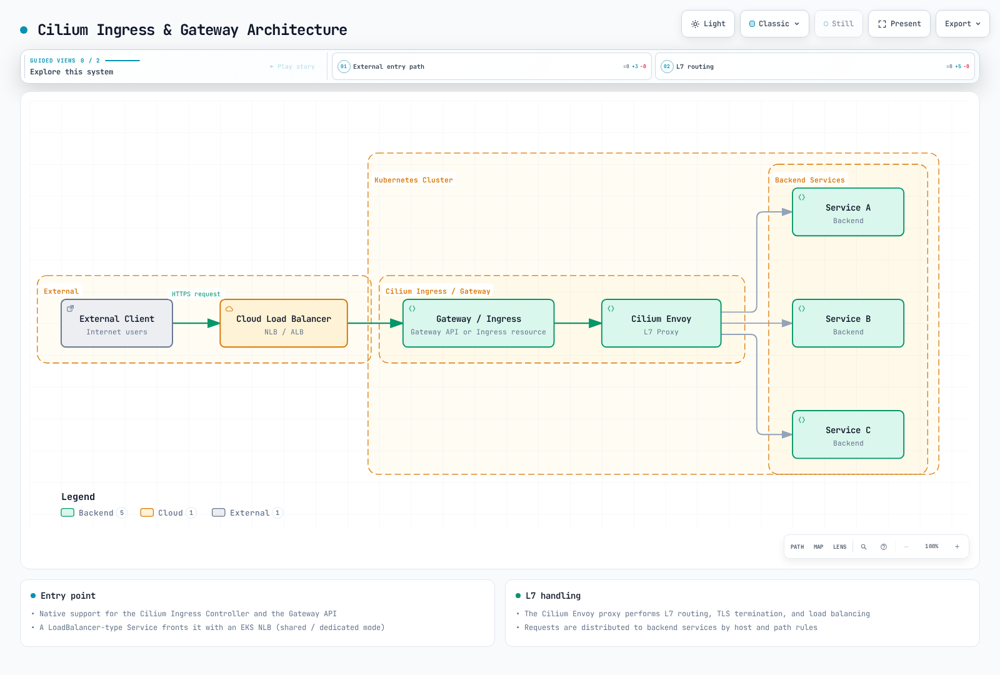
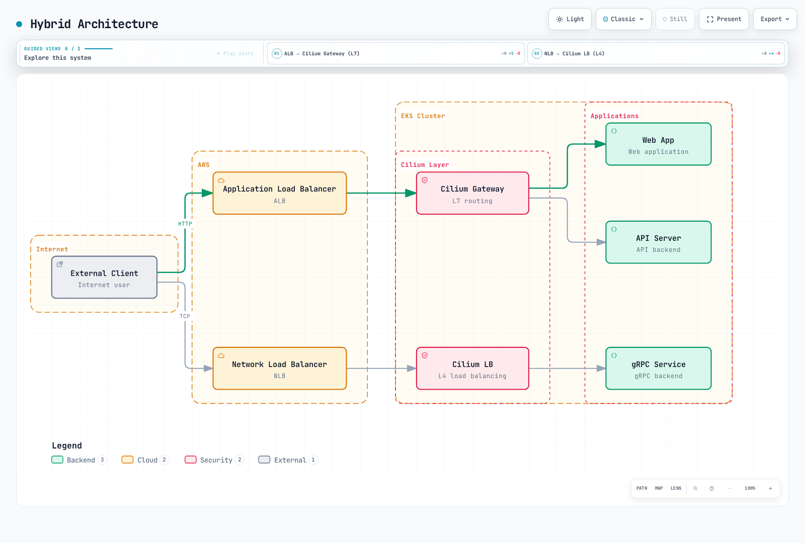

# Cilium Service Mesh Ingress & Gateway

> **Review baseline**: Cilium 1.20.1; Gateway API 1.6.1; AWS Load Balancer Controller 3.5.0.
> **Last reviewed**: September 11, 2026. See the [installation prerequisites](./README.md) for the Kubernetes/EKS matrices; a newer release alone does not establish compatibility.

## Overview

Cilium uses Kubernetes Ingress and Gateway API resources to configure its data plane. eBPF handles Service forwarding and redirects L7 traffic to node-local Envoy. Envoy provides HTTP routing and TLS termination; opaque TCP/TLS paths have different capabilities. The examples below describe alternative entry points, not a complete application deployment.

## Architecture



[🔍 View interactive diagram](https://www.atomai.click/kubernetes-docs/archmaps/en-service-mesh-cilium-service-mesh-05-ingress-gateway-0.html)

The Gateway/Ingress box represents configuration, not a process that receives packets. For L7 traffic the actual path is load balancer → Service/NodePort frontend → eBPF/TPROXY → Envoy → backend. Cilium applies policy at the external `world` → `ingress` boundary and again from `ingress` to the backend. Policies must permit both legs. Cloud load balancer availability and target registration are separate prerequisites.

## Cilium Ingress Controller

### Installation and Enablement

```yaml
kubeProxyReplacement: true
l7Proxy: true
envoy:
  enabled: true
ingressController:
  enabled: true
  loadbalancerMode: shared
  default: false
  service:
    type: LoadBalancer
```

These are Helm **overrides** for an already planned Cilium installation. Merge them with the platform-specific CNI/IPAM and reachable API-server settings from the installation guide. Changing kube-proxy replacement on a running cluster is a migration, not a routine feature toggle. Render and review the pinned 1.20.1 chart before applying changes.

`ingressController.default` marks the `cilium` **IngressClass as default**; it does not configure a fallback backend. The chart creates class `cilium`; `ingressController.ingressClassName` is not a supported value. Explicit `spec.ingressClassName` avoids dependence on the cluster default.

In shared mode, Cilium-managed Ingress resources use the shared `cilium-ingress` Service in the Helm release namespace (here `kube-system`). A per-Ingress mode annotation can choose dedicated mode; other controllers and Gateway API resources do not automatically share this frontend. Changing modes can change addresses and interrupt connections. `LoadBalancer` requires an implementation that can provision/reconcile it; use the EKS overlay below when AWS LBC owns the Service.

### Ingress Resource Example

```yaml
apiVersion: networking.k8s.io/v1
kind: Ingress
metadata:
  name: app-ingress
  namespace: default
  annotations:
    ingress.cilium.io/loadbalancer-mode: shared
    ingress.cilium.io/tls-passthrough: 'false'
spec:
  ingressClassName: cilium
  tls:
  - hosts:
    - app.example.com
    secretName: app-tls-secret
  rules:
  - host: app.example.com
    http:
      paths:
      - path: /api
        pathType: Prefix
        backend:
          service:
            name: api-service
            port:
              number: 80
      - path: /
        pathType: Prefix
        backend:
          service:
            name: frontend-service
            port:
              number: 80
```

Create the named Services and ready endpoints in `default`, each exposing Service port 80. Provide `app-tls-secret` with a certificate covering `app.example.com`, and point DNS at this frontend. The TLS section terminates client TLS at Envoy; the backend port shown is plaintext HTTP. Cilium's default `enforceHttps: true` redirects HTTP for TLS-enabled hosts. This does not establish workload-to-workload mTLS.

### Path-based Routing

```yaml
apiVersion: networking.k8s.io/v1
kind: Ingress
metadata:
  name: path-routing
  namespace: default
spec:
  ingressClassName: cilium
  rules:
  - host: api.example.com
    http:
      paths:
      - path: /users
        pathType: Prefix
        backend:
          service:
            name: users-service
            port:
              number: 80
      - path: /orders
        pathType: Prefix
        backend:
          service:
            name: orders-service
            port:
              number: 80
      - path: /products
        pathType: Prefix
        backend:
          service:
            name: products-service
            port:
              number: 80
      - path: /health
        pathType: Exact
        backend:
          service:
            name: health-service
            port:
              number: 80
```

`Prefix` matches path elements: `/users` and `/users/42` match, `/users-old` does not. `Exact` matches `/health` only. Cilium's Ingress ordering is Exact, then ImplementationSpecific/regex, then Prefix, with longer matches first within those groups. Gateway API has its own precedence rules; YAML list order is not a general routing priority mechanism.

### TLS Termination

```yaml
apiVersion: networking.k8s.io/v1
kind: Ingress
metadata:
  name: tls-ingress
  namespace: default
spec:
  ingressClassName: cilium
  tls:
  - hosts:
    - secure.example.com
    secretName: app-tls-secret
  rules:
  - host: secure.example.com
    http:
      paths:
      - path: /
        pathType: Prefix
        backend:
          service:
            name: secure-app
            port:
              number: 80
```

Generate the Secret from **real PEM files**, rather than applying placeholder Base64. The same Secret used for both examples must contain a certificate whose SANs cover both `app.example.com` and `secure.example.com`; otherwise use separate Secrets. Provision a publicly trusted or explicitly trusted private certificate through your PKI and plan renewal.

```bash
openssl x509 -in ./tls.crt -noout -dates -ext subjectAltName
kubectl -n default create secret tls app-tls-secret \
  --cert=./tls.crt --key=./tls.key --dry-run=client -o yaml
```

The last command only renders the Secret. Review and apply it through the chosen secret-management workflow; avoid writing private-key output to shared logs.

### TLS Passthrough

```yaml
apiVersion: networking.k8s.io/v1
kind: Ingress
metadata:
  name: tls-passthrough
  namespace: default
  annotations:
    ingress.cilium.io/tls-passthrough: 'true'
spec:
  ingressClassName: cilium
  rules:
  - host: backend.example.com
    http:
      paths:
      - path: /
        pathType: Prefix
        backend:
          service:
            name: tls-backend
            port:
              number: 443
```

The backend terminates TLS and owns a certificate for `backend.example.com`. Cilium matches TLS SNI; passthrough Ingress requires a hostname and path `/`. HTTP path/header rewriting is unavailable inside encrypted traffic. The backend sees a new connection from Envoy/node, not the original client socket address, and Envoy cannot insert HTTP forwarding headers into this stream.

## Gateway API

### Enabling Gateway API

```yaml
gatewayAPI:
  enabled: true
  gatewayClass:
    create: true
  secretsNamespace:
    create: true
    name: cilium-secrets
    sync: true
```

Install the **Gateway API 1.6.1 Standard CRDs** before enabling the controller; this is the version used by Cilium 1.20.1's installation reference. Review CRD upgrades for all controllers sharing the cluster. Do not replace the entire Cilium values file with this fragment: it supplements the kube-proxy replacement/L7 prerequisites above.

The supported keys are `gatewayAPI.gatewayClass.create` and `gatewayAPI.secretsNamespace`. `secretNamespace` and `gatewayClassName` at the previous locations are ignored. Certificate references still name Secrets in the Gateway's namespace by default; the controller's synchronized Secret namespace does not relocate the user's reference.

### GatewayClass

With the preceding chart setting, Cilium manages the `cilium` GatewayClass with controller name `io.cilium/gateway-controller`. Inspect it with `kubectl get gatewayclass cilium -o yaml`; do not create a second owner for the same object. A GatewayClass selects a controller and parameters, not a shared physical load balancer.

### Gateway

```yaml
apiVersion: gateway.networking.k8s.io/v1
kind: Gateway
metadata:
  name: main-gateway
  namespace: default
spec:
  gatewayClassName: cilium
  listeners:
  - name: http
    protocol: HTTP
    port: 80
    hostname: '*.example.com'
    allowedRoutes:
      namespaces:
        from: Same
  - name: https
    protocol: HTTPS
    port: 443
    hostname: '*.example.com'
    tls:
      mode: Terminate
      certificateRefs:
      - kind: Secret
        name: wildcard-tls
        namespace: default
    allowedRoutes:
      namespaces:
        from: Same
```

Create `wildcard-tls` in `default` with a certificate for the listener hostnames before using HTTPS. `*.example.com` does not cover the bare `example.com` or deeper names such as `a.b.example.com`. These listeners terminate HTTP/HTTPS; the later TCP and TLS-passthrough examples use separate Gateways to keep their protocols and ownership clear. Each generated Gateway Service can require a separate cloud load balancer.

### HTTPRoute

```yaml
apiVersion: gateway.networking.k8s.io/v1
kind: HTTPRoute
metadata:
  name: api-routes
  namespace: default
spec:
  parentRefs:
  - name: main-gateway
    namespace: default
    sectionName: https
  hostnames:
  - api.example.com
  rules:
  - matches:
    - path:
        type: PathPrefix
        value: /v1/users
    backendRefs:
    - name: users-v1
      port: 80
  - matches:
    - path:
        type: PathPrefix
        value: /v2/users
    backendRefs:
    - name: users-v2
      port: 80
  - matches:
    - path:
        type: PathPrefix
        value: /api
      headers:
      - name: X-API-Version
        value: '2'
    backendRefs:
    - name: api-v2
      port: 80
  - matches:
    - path:
        type: PathPrefix
        value: /
    backendRefs:
    - name: api-v1
      port: 80
```

Every backend is an existing Service in the Route namespace with port 80 and ready endpoints. `sectionName: https` deliberately limits this Route to the HTTPS listener. Check `Accepted` and `ResolvedRefs` on the correct `status.parents` entry, and Gateway/listener `Programmed`/`Accepted` conditions with current `observedGeneration`. Accepted configuration alone does not prove DNS, certificate trust, target health or application reachability.

### Weight-based Traffic Splitting

```yaml
apiVersion: gateway.networking.k8s.io/v1
kind: HTTPRoute
metadata:
  name: canary-route
  namespace: default
spec:
  parentRefs:
  - name: main-gateway
    sectionName: https
  hostnames:
  - app.example.com
  rules:
  - matches:
    - path:
        type: PathPrefix
        value: /
    backendRefs:
    - name: app-stable
      port: 80
      weight: 90
    - name: app-canary
      port: 80
      weight: 10
```

Weights are relative selection probabilities, not a promise that each group of ten requests contains exactly nine stable requests. Connections, retries and sampling can change observed counts. This example attaches only to HTTPS and uses a different hostname from the API example.

### Request/Response Transformation

```yaml
apiVersion: gateway.networking.k8s.io/v1
kind: HTTPRoute
metadata:
  name: transform-route
  namespace: default
spec:
  parentRefs:
  - name: main-gateway
    sectionName: https
  rules:
  - matches:
    - path:
        type: PathPrefix
        value: /api
    filters:
    - type: RequestHeaderModifier
      requestHeaderModifier:
        set:
        - name: X-Doc-Route
          value: api-v2
        remove:
        - X-Internal-Header
    - type: URLRewrite
      urlRewrite:
        hostname: internal-api.default.svc
        path:
          type: ReplacePrefixMatch
          replacePrefixMatch: /v2/api
    - type: ResponseHeaderModifier
      responseHeaderModifier:
        set:
        - name: X-Doc-Gateway
          value: cilium
    backendRefs:
    - name: api-service
      port: 80
  hostnames:
  - transform.example.com
```

Header values are **literal strings**. `X-Doc-Route` and `X-Doc-Gateway` are diagnostic markers, not generated request IDs or measured response times. Host rewriting uses `URLRewrite.hostname`; it is not duplicated as a `Host` header mutation. These headers do not authenticate a caller. Response `Server` handling is also affected by the controller's Envoy server-header transformation; use a verified `CiliumGatewayClassConfig` if changing that behavior.

### Redirect

```yaml
apiVersion: gateway.networking.k8s.io/v1
kind: HTTPRoute
metadata:
  name: redirect-http
  namespace: default
spec:
  parentRefs:
  - name: main-gateway
    sectionName: http
  hostnames:
  - '*.example.com'
  rules:
  - matches:
    - path:
        type: PathPrefix
        value: /
    filters:
    - type: RequestRedirect
      requestRedirect:
        scheme: https
        port: 443
        statusCode: 308
---
apiVersion: gateway.networking.k8s.io/v1
kind: HTTPRoute
metadata:
  name: redirect-path
  namespace: default
spec:
  parentRefs:
  - name: main-gateway
    sectionName: https
  hostnames:
  - old.example.com
  rules:
  - matches:
    - path:
        type: Exact
        value: /old-path
    filters:
    - type: RequestRedirect
      requestRedirect:
        path:
          type: ReplaceFullPath
          replaceFullPath: /new-path
        statusCode: 308
---
apiVersion: gateway.networking.k8s.io/v1
kind: HTTPRoute
metadata:
  name: redirect-host
  namespace: default
spec:
  parentRefs:
  - name: main-gateway
    sectionName: https
  hostnames:
  - old.example.com
  rules:
  - matches:
    - path:
        type: PathPrefix
        value: /legacy
    filters:
    - type: RequestRedirect
      requestRedirect:
        hostname: legacy.example.com
        statusCode: 307
```

The scheme redirect attaches **only to `http`**, so HTTPS requests cannot redirect back to the same URL indefinitely. The other two Routes attach only to `https` and a narrow source hostname. A 308 permanent redirect and 307 temporary redirect preserve the request method/body; 301/302 have different client behavior and should not be recommended universally for writes. Redirecting an initial HTTP request cannot undo plaintext data already sent by the client. RequestRedirect and URLRewrite are different filters and cannot be combined in one rule.

### TCPRoute

```yaml
apiVersion: gateway.networking.k8s.io/v1
kind: Gateway
metadata:
  name: tcp-gateway
  namespace: default
spec:
  gatewayClassName: cilium
  listeners:
  - name: tcp
    protocol: TCP
    port: 9000
    allowedRoutes:
      namespaces:
        from: Same
      kinds:
      - kind: TCPRoute
---
apiVersion: gateway.networking.k8s.io/v1
kind: TCPRoute
metadata:
  name: tcp-route
  namespace: default
spec:
  parentRefs:
  - name: tcp-gateway
    sectionName: tcp
  rules:
  - backendRefs:
    - name: tcp-service
      port: 9000
```

Gateway API 1.6.1 serves TCPRoute at **v1**; the old `v1alpha2` version is not served. TCPRoute forwards an opaque TCP stream and does not inspect HTTP paths. TCP may carry HTTP or TLS, but that does not give this Route HTTP routing or TLS termination semantics. Cilium 1.20.1's L4 Gateway translation uses backend EndpointSlices; do not assume the L7 Envoy frontend's endpoint implementation is identical.

### TLSRoute

```yaml
apiVersion: gateway.networking.k8s.io/v1
kind: Gateway
metadata:
  name: tls-gateway
  namespace: default
spec:
  gatewayClassName: cilium
  listeners:
  - name: tls
    protocol: TLS
    port: 443
    hostname: secure.example.com
    tls:
      mode: Passthrough
    allowedRoutes:
      namespaces:
        from: Same
      kinds:
      - kind: TLSRoute
---
apiVersion: gateway.networking.k8s.io/v1
kind: TLSRoute
metadata:
  name: tls-route
  namespace: default
spec:
  parentRefs:
  - name: tls-gateway
    sectionName: tls
  hostnames:
  - secure.example.com
  rules:
  - backendRefs:
    - name: tls-backend
      port: 443
```

TLSRoute is also served at **v1** in this baseline. It requires a compatible `TLS` listener with `mode: Passthrough`, not the HTTPS termination listener above. The backend owns the certificate for `secure.example.com`; SNI selects the backend while HTTP contents stay encrypted. Verify the generated Service, listener status and end-to-end TLS trust.

## EKS Integration Patterns

### NLB + Cilium Ingress

```yaml
ingressController:
  enabled: true
  loadbalancerMode: shared
  enableProxyProtocol: false
  service:
    type: LoadBalancer
    loadBalancerClass: service.k8s.aws/nlb
    allocateLoadBalancerNodePorts: true
    externalTrafficPolicy: Cluster
    annotations:
      service.beta.kubernetes.io/aws-load-balancer-scheme: internet-facing
      service.beta.kubernetes.io/aws-load-balancer-nlb-target-type: instance
      service.beta.kubernetes.io/aws-load-balancer-attributes: load_balancing.cross_zone.enabled=true
      service.beta.kubernetes.io/aws-load-balancer-healthcheck-protocol: TCP
      service.beta.kubernetes.io/aws-load-balancer-healthcheck-port: traffic-port
```

This overlay describes **AWS LBC-managed NLB → EC2 NodePort → Cilium Ingress Envoy**. It requires AWS LBC 3.5.0, its IAM/subnet/security-group prerequisites, eligible EC2 nodes, a Cilium-supported EKS/CNI configuration, and allocated NodePorts. It is not an EKS Auto Mode or Fargate Cilium installation recipe. `service.k8s.aws/nlb` explicitly selects AWS LBC; the legacy `aws-load-balancer-type: nlb` annotation does not express that ownership.

Use instance targets for this L7 frontend. The Cilium 1.20.1 shared Ingress Service has a synthetic EndpointSlice (`192.192.192.192:9999`, without Pod target references). AWS LBC's IP target resolver requires Pod target references and skips these endpoints. Simply switching this Service to `ip` does **not** discover the node-local Envoy processes. This is specific to the Cilium L7 frontend; ordinary workload Services and current L4 Gateway EndpointSlices differ.

The TCP health check checks transport reachability at the NodePort, not application `/healthz`, TLS validity or a host-specific HTTP route. Cross-zone balancing uses the current load-balancer attributes annotation and needs cost/traffic review. Do not change an existing Service's controller ownership or LB type in place as an assumed zero-downtime migration.

**Client identity and optional PROXY protocol:** Cilium preserves the source visible at its frontend for HTTP Envoy processing under both `Cluster` and `Local` external traffic policies. Whether that source is the original client first depends on the upstream NLB and target-group attributes. Instance TCP targets normally preserve client IP; PROXY protocol is not universally required. If it is required for your topology, coordinate this additional overlay with the NLB setting:

```yaml
ingressController:
  enableProxyProtocol: true
  service:
    annotations:
      service.beta.kubernetes.io/aws-load-balancer-proxy-protocol: '*'
```

This enables PPv2 at the NLB and its parser at Cilium Ingress. It is a coordinated rollout: enabling only one side breaks traffic. The parser requires a PROXY header, so direct HTTP/TLS probes without one fail. AWS LBC warns against combining PPv2 with instance targets and `externalTrafficPolicy: Local`; the example remains `Cluster`. HTTP/HTTPS health checks need a compatible parser too. Restrict direct access to the trusted proxy path: PP metadata and forwarded HTTP headers are not authenticated identities. `gatewayAPI.enableProxyProtocol` is a separate setting for Gateway API; the Ingress flag does not configure it.

### ALB + Cilium

ALB → Cilium Envoy can be composed, but the following prerequisites must be designed and tested for the actual environment. There is no generally working `target-type: ip` shortcut for the synthetic L7 EndpointSlices described above.

| Boundary | Required decision |
|---|---|
| Controller and namespace | An ALB Ingress uses `spec.ingressClassName: alb`. Its backend Service must exist in the **same namespace**; the shared `cilium-ingress` Service is normally in `kube-system`, not `default`. |
| Targets | For a node-based path, use an explicitly planned NodePort Service and ALB `target-type: instance`; verify eligible nodes, NodePort allocation and security groups. Do not silently convert a Service that already owns an NLB. |
| TLS | Decide whether ALB terminates TLS and forwards HTTP or HTTPS. ACM server-certificate attachment is not client mTLS. If ALB forwards HTTP, Cilium's HTTPS redirects can cause a loop unless listener/redirect behavior is coordinated. |
| Health | ALB health checks use their own Host header, not automatically `app.example.com`; a host-specific application route may return 404. Define and test a suitable health route/port. |
| Client attribution | Configure Cilium's trusted XFF hop count for the actual proxy chain, sanitize untrusted headers and prevent direct backend access that bypasses ALB. |

The former sample referenced the wrong namespace and IP targets and omitted these decisions; it has been replaced by these implementation requirements. This composition has not been deployed or load-tested by this guide.

### Hybrid Architecture



[🔍 View interactive diagram](https://www.atomai.click/kubernetes-docs/archmaps/en-service-mesh-cilium-service-mesh-05-ingress-gateway-1.html)

This is a logical composition diagram, not a validated deployment manifest. The ALB path needs the namespace/target/TLS/health/trust decisions above. The NLB L4 path can carry a gRPC stream without understanding individual RPC methods. Adding Cilium behind ALB does not remove ALB charges or make ALB features native Cilium features.

## Multi-tenant Gateway

### Per-Namespace Gateway

```yaml
apiVersion: gateway.networking.k8s.io/v1
kind: GatewayClass
metadata:
  name: cilium-shared
spec:
  controllerName: io.cilium/gateway-controller
---
apiVersion: gateway.networking.k8s.io/v1
kind: Gateway
metadata:
  name: team-a-gateway
  namespace: team-a
spec:
  gatewayClassName: cilium-shared
  listeners:
  - name: https
    protocol: HTTPS
    port: 443
    hostname: '*.team-a.example.com'
    tls:
      mode: Terminate
      certificateRefs:
      - kind: Secret
        name: team-a-tls
    allowedRoutes:
      namespaces:
        from: Same
---
apiVersion: gateway.networking.k8s.io/v1
kind: Gateway
metadata:
  name: team-b-gateway
  namespace: team-b
spec:
  gatewayClassName: cilium-shared
  listeners:
  - name: https
    protocol: HTTPS
    port: 443
    hostname: '*.team-b.example.com'
    tls:
      mode: Terminate
      certificateRefs:
      - kind: Secret
        name: team-b-tls
    allowedRoutes:
      namespaces:
        from: Same
```

Create each namespace and its own valid TLS Secret first. Sharing GatewayClass `cilium-shared` does **not** mean both Gateways share one Service/load balancer. `from: Same` confines Route attachment to each Gateway namespace; RBAC must separately control who can change Gateways, Secrets, Routes and namespace labels.

### Cross-Namespace Routing

```yaml
apiVersion: gateway.networking.k8s.io/v1
kind: Gateway
metadata:
  name: shared-gateway
  namespace: gateway-system
spec:
  gatewayClassName: cilium
  listeners:
  - name: https
    protocol: HTTPS
    port: 443
    hostname: '*.example.com'
    allowedRoutes:
      namespaces:
        from: Selector
        selector:
          matchLabels:
            gateway-access: 'true'
    tls:
      mode: Terminate
      certificateRefs:
      - kind: Secret
        name: shared-tls
---
apiVersion: v1
kind: Namespace
metadata:
  name: app-team
  labels:
    gateway-access: 'true'
---
apiVersion: gateway.networking.k8s.io/v1
kind: HTTPRoute
metadata:
  name: app-route
  namespace: app-team
spec:
  parentRefs:
  - name: shared-gateway
    namespace: gateway-system
    sectionName: https
  hostnames:
  - app.example.com
  rules:
  - matches:
    - path:
        type: PathPrefix
        value: /
    backendRefs:
    - name: app-service
      port: 80
```

Create `gateway-system` and its `shared-tls` Secret covering the allowed hostnames. The namespace selector authorizes Route attachment; it does not authenticate users or authorize application requests. An administrator must control the `gateway-access` label.

The shown `app-service` backend is local to `app-team`, so it needs no ReferenceGrant. If a Route instead references `backend-team/shared-api`, the backend namespace must explicitly grant that reference:

```yaml
apiVersion: gateway.networking.k8s.io/v1
kind: ReferenceGrant
metadata:
  name: allow-app-team
  namespace: backend-team
spec:
  from:
  - group: gateway.networking.k8s.io
    kind: HTTPRoute
    namespace: app-team
  to:
  - group: ''
    kind: Service
    name: shared-api
---
apiVersion: gateway.networking.k8s.io/v1
kind: HTTPRoute
metadata:
  name: shared-api-route
  namespace: app-team
spec:
  parentRefs:
  - name: shared-gateway
    namespace: gateway-system
    sectionName: https
  hostnames:
  - shared-api.example.com
  rules:
  - backendRefs:
    - name: shared-api
      namespace: backend-team
      port: 80
```

Create `backend-team/shared-api` with Service port 80 before using this alternative. Route → Gateway cross-namespace attachment uses `allowedRoutes`; Route → backend Service cross-namespace references use `ReferenceGrant`. These are distinct permission checks. ReferenceGrant v1 is served in 1.6.1; v1beta1 is also still served.

## Advanced Load Balancing Configuration

### Service Health Check

```yaml
apiVersion: cilium.io/v2
kind: CiliumEnvoyConfig
metadata:
  name: health-check-config
  namespace: default
spec:
  services:
  - name: my-service
    namespace: default
    ports:
    - 80
    listener: health-check-config-listener
  resources:
  - '@type': type.googleapis.com/envoy.config.listener.v3.Listener
    name: health-check-config-listener
    filter_chains:
    - filters:
      - name: envoy.filters.network.http_connection_manager
        typed_config:
          '@type': type.googleapis.com/envoy.extensions.filters.network.http_connection_manager.v3.HttpConnectionManager
          stat_prefix: health-check-config
          route_config:
            name: health-check-config-routes
            virtual_hosts:
            - name: app
              domains:
              - '*'
              routes:
              - match:
                  prefix: /
                route:
                  cluster: default/my-service
                  retry_policy:
                    num_retries: 0
          http_filters:
          - name: envoy.filters.http.router
            typed_config:
              '@type': type.googleapis.com/envoy.extensions.filters.http.router.v3.Router
  - '@type': type.googleapis.com/envoy.config.cluster.v3.Cluster
    name: default/my-service
    connect_timeout: 5s
    type: EDS
    health_checks:
    - timeout: 5s
      interval: 10s
      unhealthy_threshold: 3
      healthy_threshold: 2
      http_health_check:
        path: /health
        host: health-check.local
        expected_statuses:
        - start: 200
          end: 300
    outlier_detection:
      consecutive_5xx: 5
      interval: 10s
      base_ejection_time: 30s
      max_ejection_percent: 50
      enforcing_consecutive_5xx: 100
```

This is a complete standalone CEC chain: Service port 80 → named Listener → HTTP route → EDS Cluster. Cilium supplies the xDS endpoint configuration for the referenced Service. Create `default/my-service` with ready backends and do not also assign it to another CEC or a generated Ingress/Gateway configuration. CEC customization is not a patch mechanism for controller-owned resources.

Every backend must actually accept `Host: health-check.local` and `/health`. Envoy status ranges exclude the upper bound, so `[200, 300)` covers all 2xx responses. Active health checks and passive outlier detection are different mechanisms; ejection limits and panic behavior do not guarantee that every failing endpoint is excluded. Validate them under your backend count and failure model.

### Connection Pool Configuration

```yaml
apiVersion: cilium.io/v2
kind: CiliumEnvoyConfig
metadata:
  name: connection-pool
  namespace: default
spec:
  services:
  - name: high-traffic-service
    namespace: default
    ports:
    - 80
    listener: connection-pool-listener
  resources:
  - '@type': type.googleapis.com/envoy.config.listener.v3.Listener
    name: connection-pool-listener
    filter_chains:
    - filters:
      - name: envoy.filters.network.http_connection_manager
        typed_config:
          '@type': type.googleapis.com/envoy.extensions.filters.network.http_connection_manager.v3.HttpConnectionManager
          stat_prefix: connection-pool
          route_config:
            name: connection-pool-routes
            virtual_hosts:
            - name: app
              domains:
              - '*'
              routes:
              - match:
                  prefix: /
                route:
                  cluster: default/high-traffic-service
                  retry_policy:
                    num_retries: 0
          http_filters:
          - name: envoy.filters.http.router
            typed_config:
              '@type': type.googleapis.com/envoy.extensions.filters.http.router.v3.Router
  - '@type': type.googleapis.com/envoy.config.cluster.v3.Cluster
    name: default/high-traffic-service
    connect_timeout: 5s
    type: EDS
    typed_extension_protocol_options:
      envoy.extensions.upstreams.http.v3.HttpProtocolOptions:
        '@type': type.googleapis.com/envoy.extensions.upstreams.http.v3.HttpProtocolOptions
        explicit_http_config:
          http2_protocol_options:
            max_concurrent_streams: 1000
            initial_stream_window_size: 65536
            initial_connection_window_size: 1048576
    circuit_breakers:
      thresholds:
      - priority: DEFAULT
        max_connections: 10000
        max_pending_requests: 10000
        max_requests: 10000
        max_retries: 5
```

Create `default/high-traffic-service` on port 80 whose backends explicitly support cleartext HTTP/2 (h2c). The typed protocol option selects upstream HTTP/2; it is not automatic protocol negotiation. `accept_http_10` would only accept HTTP/1.0 and is not an HTTP/1.1 connection-pool setting. For HTTP/1 backends choose the corresponding explicit HTTP/1 configuration instead.

Circuit-breaker thresholds are per Envoy cluster/priority, not fleet-wide quotas or capacity recommendations. `max_retries` limits concurrent retries; it is not the number of retries per request. The route here sets `num_retries: 0`. Raising connection/stream limits requires resource and backend testing; the numerical values are illustrative.

## Comparison with AWS Load Balancer Controller

| Capability | Cilium Ingress/Gateway | AWS Load Balancer Controller 3.5 |
|---|---|---|
| Data plane | eBPF Service/L4 forwarding; Envoy for HTTP/TLS features | AWS ALB or NLB |
| Gateway API | Check the pinned Cilium feature/conformance tables | HTTPRoute/GRPCRoute map to ALB; TCPRoute/UDPRoute/TLSRoute map to NLB; mixed L4/L7 on one Gateway is unsupported |
| TLS and identity | Ingress TLS termination/passthrough; workload encryption/authentication is a separate [security configuration](./03-security.md) | ACM server certificates; ALB client mTLS requires its mutual-authentication mode/trust store |
| Cost | Node/proxy resources **plus any provisioned cloud LB and network charges** | Provisioned ALB/NLB, capacity/usage and network charges |
| Customization | Supported Gateway API features and separately managed CECs; generated objects remain controller-owned | AWS listener/rule/target-group features exposed through LBC APIs/annotations |
| Performance | Measure the actual topology, encryption and workload | Measure the same workload and service limits; no universal latency ranking |

LBC 3.5 documents Gateway API **1.6.0** as its tested baseline; Cilium's installation reference uses **1.6.1**. A cluster sharing these CRDs needs compatibility testing, not an assumption that the latest catalog entry is supported by every controller.

Choose ALB for required AWS L7 integrations, NLB for the required transport/target behavior, and Cilium features according to the in-cluster routing/policy requirements. NLB currently supports weighted target groups with weights **0–999** for new flows; controller exposure and a particular Route's semantics are separate questions. Ordinary weight changes preserve existing connections, but setting a target group's weight to **0** closes its existing connections after a short period according to AWS documentation. Do not describe that operation as a connection-preserving drain.

The old decision figure repeated unsupported cost, latency, mTLS and Gateway API claims. The table replaces those assertions; it does not remove either integration option.

## Monitoring

### Gateway Metrics

```bash
kubectl get gatewayclass cilium -o yaml
kubectl get gateway,httproute,tcproute,tlsroute -A
kubectl -n default describe gateway main-gateway
kubectl -n default get httproute api-routes -o yaml
kubectl -n kube-system exec ds/cilium -- cilium-dbg status --verbose
kubectl -n kube-system exec ds/cilium -- cilium-dbg envoy admin metrics -f downstream_rq
```

### Prometheus Metrics

First enable and scrape the Cilium Envoy Prometheus endpoint using the [observability guide](./04-observability.md). Configure a stable `cluster` target label when multiple clusters feed one Prometheus. The native Cilium Envoy image exposes `envoy_http_conn_manager_prefix`, with generated values such as `listener-insecure`, `listener-secure` and port-specific variants—not a fixed `cilium-gateway` value. Prefixes can be reused across Gateways on the same Envoy; these examples describe a **scraped proxy/HCM**, not guaranteed per-Gateway accounting. Inspect actual labels before building dashboards.

The three queries below show started-request rate, the percentage of completed response counters classified as 5xx, and p99 duration in **seconds**. The missing 5xx numerator is filled only from the matching observed denominator; absent traffic/telemetry does not become a healthy zero. The positive-denominator filter omits idle series. Envoy's `downstream_rq_time` histogram is in **milliseconds**, hence `/ 1000`. Aggregate histogram buckets while preserving `le` before computing the quantile. Low sample counts, scrape gaps and missing histograms still need separate monitoring.

```promql
sum by (cluster, instance, envoy_http_conn_manager_prefix) (
  rate(envoy_http_downstream_rq_total[5m])
)
```

```promql
100 *
(
  sum by (cluster, instance, envoy_http_conn_manager_prefix) (
    rate(envoy_http_downstream_rq_xx{envoy_response_code_class="5"}[5m])
  )
  or
  0 * sum by (cluster, instance, envoy_http_conn_manager_prefix) (
    rate(envoy_http_downstream_rq_xx[5m])
  )
)
/
(
  sum by (cluster, instance, envoy_http_conn_manager_prefix) (
    rate(envoy_http_downstream_rq_xx[5m])
  ) > 0
)
```

```promql
histogram_quantile(
  0.99,
  sum by (cluster, instance, envoy_http_conn_manager_prefix, le) (
    rate(envoy_http_downstream_rq_time_bucket[5m])
  )
) / 1000
```

## Next Steps

- [Best Practices](./06-best-practices.md): Operational prerequisites and limits

## References

- [Cilium 1.20.1 Ingress](https://github.com/cilium/cilium/blob/v1.20.1/Documentation/network/servicemesh/ingress.rst)
- [Cilium traffic, source IP and policy](https://github.com/cilium/cilium/blob/v1.20.1/Documentation/network/servicemesh/ingress-reference.rst)
- [Cilium Gateway API installation](https://github.com/cilium/cilium/blob/v1.20.1/Documentation/network/servicemesh/gateway-api/gateway-api.rst)
- [Cilium 1.20.1 Helm values](https://github.com/cilium/cilium/blob/v1.20.1/install/kubernetes/cilium/values.yaml)
- [Gateway API 1.6.1 CRDs](https://github.com/kubernetes-sigs/gateway-api/tree/v1.6.1/config/crd/standard)
- [AWS LBC 3.5 NLB configuration](https://github.com/kubernetes-sigs/aws-load-balancer-controller/blob/v3.5.0/docs/guide/service/nlb.md)
- [AWS LBC 3.5 annotations](https://github.com/kubernetes-sigs/aws-load-balancer-controller/blob/v3.5.0/docs/guide/service/annotations.md)
- [AWS LBC 3.5 Gateway API](https://github.com/kubernetes-sigs/aws-load-balancer-controller/blob/v3.5.0/docs/guide/gateway/gateway.md)
- [NLB target group attributes](https://docs.aws.amazon.com/elasticloadbalancing/latest/network/edit-target-group-attributes.html)
- [NLB listener weights](https://docs.aws.amazon.com/elasticloadbalancing/latest/network/load-balancer-listeners.html)
- [Envoy 1.37 request statistics](https://www.envoyproxy.io/docs/envoy/v1.37.5/configuration/http/http_conn_man/stats)
